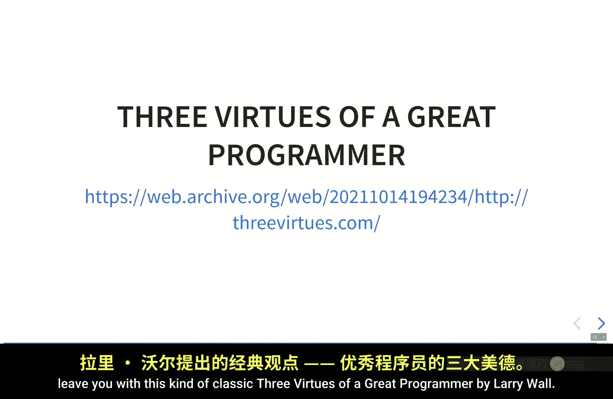
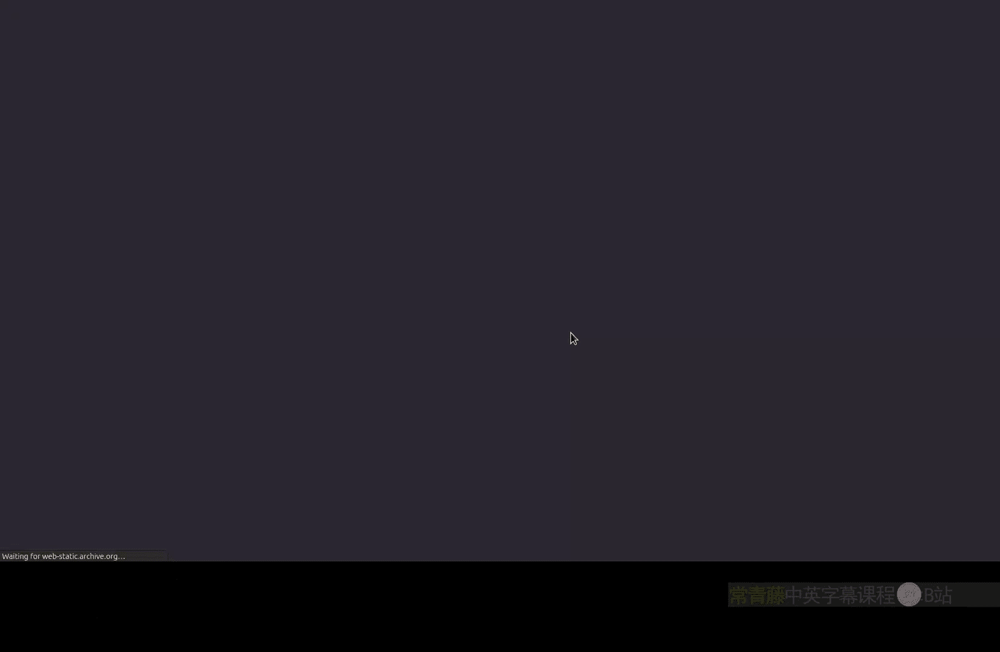
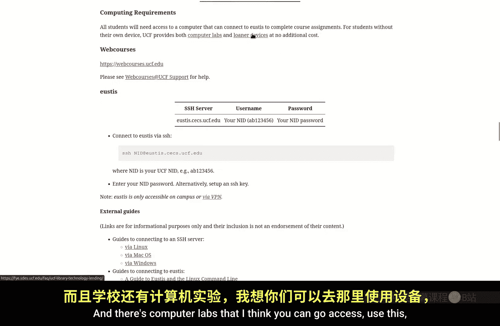
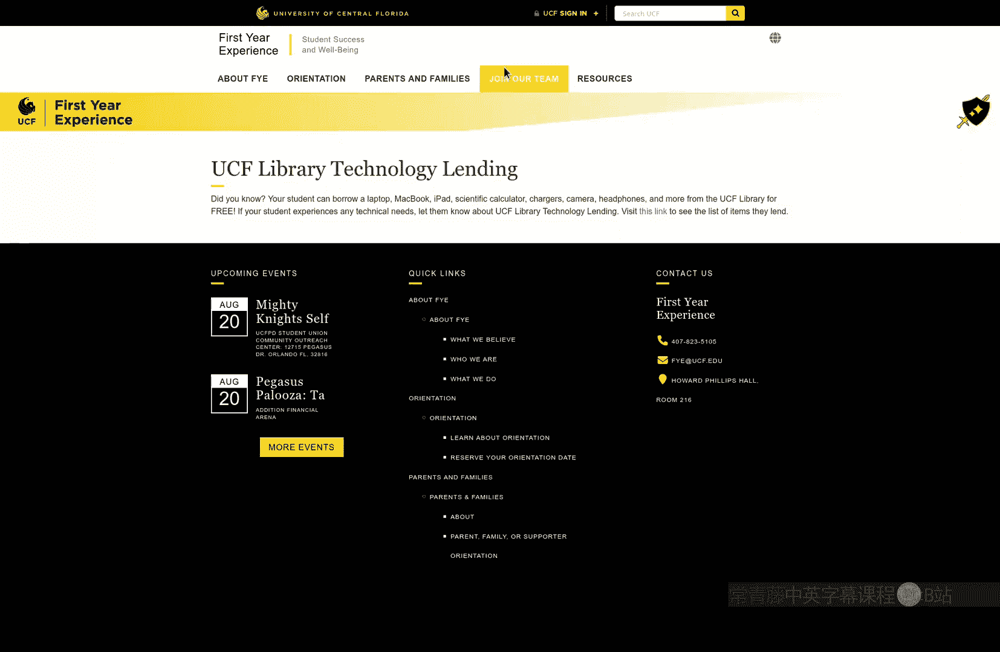
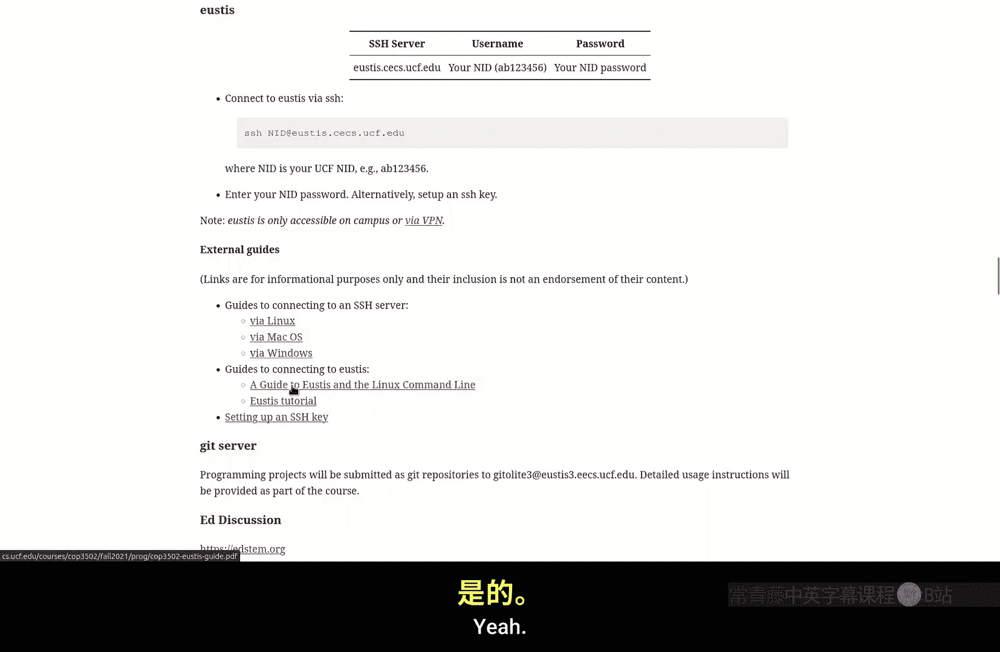
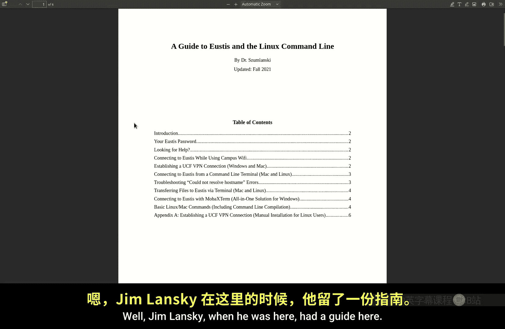
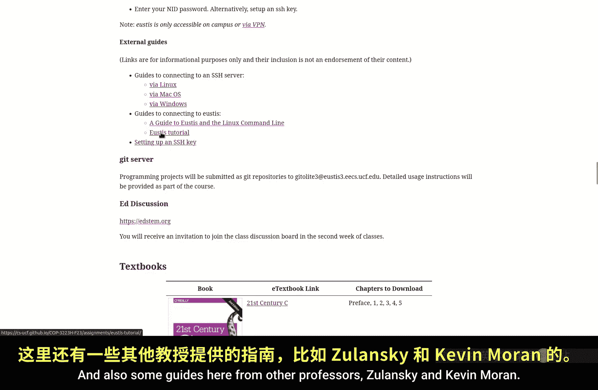
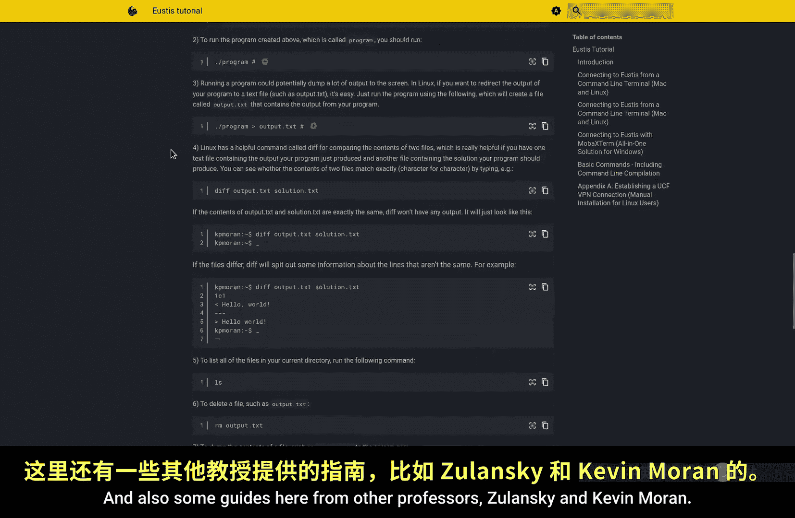
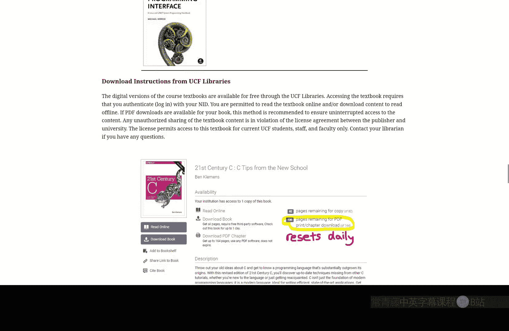

# 001：课程介绍与概述

在本节课中，我们将学习系统软件课程的目标、核心概念以及你将掌握的关键技能。课程旨在帮助你理解并构建连接应用程序与计算机硬件的底层软件工具。

## 欢迎与课程目标

欢迎来到系统软件课程。我是Paul Gzlow，现在是中佛罗里达大学计算机科学系的副教授。我的研究方向是软件工程、编程语言和安全性。如果你对我的研究、研究生院或其他相关话题感兴趣，可以通过我的网页联系我。我的实验室有很多本科生，如果你对本课程的任何内容感兴趣，你会发现我们的研究与课程内容高度相关。

那么，你为什么要学习这门课程？除了这是必修课之外，学习系统软件有什么意义？

学习系统软件的一个最重要原因是**了解你的工具**。以艾萨克·牛顿为例，他不仅是理论家，还亲自研磨望远镜镜片来制造工具。所有技术工作者都是如此：飞行员学习飞机和物理原理，有些木匠甚至自己制造工具。工具是由人制造的。了解你的工具至关重要，正如谚语所说：“拙匠常怪工具差”。你不想成为那个因为不了解工具而工作受阻的人。在工作中或研究实验室里，如果因为不熟悉工具而影响工作，没有人会帮助你，你甚至可能失去工作。因此，熟练掌握工具对你的职业发展大有裨益。

更深层的哲学原因是：**工具是为人类服务的，而不是人类为工具服务**。如果你曾感到困惑，心想“为什么机器要这样运行？”或者“我想这样编程，但它不按我的想法工作”，那么你可能会认为是机器在主宰你。我希望通过这门课程，让你摆脱这种思维定式。通过学习机器的工作原理和底层机制，你将获得更多的控制权，而不是被机器或其设计者的决定所驱使。正如奥尔德斯·赫胥黎和托马斯·默顿所说：“技术是为人类而造，而非为技术本身。”

另一个有启发性的观点来自我的父亲。小时候，当我试图建造或敲打东西时，他会说：“不要用手，用工具。”而且不仅仅是使用工具，还要使用**正确的工具**。不要用螺丝刀当锤子用，否则你会弄坏螺丝刀。因此，了解这些工具为何有用、如何设计，对于有效使用它们至关重要。同时，也要摆脱那种认为使用特定工具就能成为编程高手的思维定式。就像买了一辆快车，并不一定就能成为优秀的赛车手。职业赛车手可能用更慢的车也能打败你。

同样重要的是，你实际上可以**修改你的工具**。这些工具并非从天而降，而是由人编写的软件。我们将在本课程中看到的系统软件，我认为几乎都是开源的。你可以打开“引擎盖”，自己修改，自己构建。

## 什么是系统软件？

这就引出了一个问题：什么是系统软件？这是一个非常模糊的领域，很难精确定义。这里我给出一个功能性的定义：对我来说，任何**桥接内核**（机器上最低层的软件）和**应用程序**的软件，都可以被视为系统软件。它是连接我们日常想在计算机上使用的应用程序与由操作系统抽象出来的实际硬件之间的东西。

下图展示了这一结构：
*   最底层是**硬件**。作为软件人员，我们视其为电气工程师提供的既定产物。
*   硬件之上是最低层的软件，称为**内核**。你可以将其视为一种理想化的硬件，它提供了一个硬件的抽象视图，使得软件编写者无需关心闪存驱动器、固态硬盘、硬盘或网络套接字之间的区别。
*   栈的顶层是**应用程序**，包括上网、看视频、编写其他软件、数据分析、听音乐等一切你想做的事情。
*   而**系统软件**正是桥接这一鸿沟的、广泛且定义模糊的中间层。

关于定义模糊性的一个例子是，在90年代，微软在与网景浏览器的竞争中，被裁定使用了反竞争手段。他们的论点是，浏览器是操作系统的一部分，就像系统软件（如打印对话框或文件资源管理器）一样。这个论点是否成立，你可以自行判断，但这恰恰说明了系统软件定义的模糊性。

那么，对于本课程，以下是一些我们将要涉及的系统软件示例：
*   **库**：例如，如果你使用过 `printf` 或 `malloc`，这些都是C标准库或Unix标准库的一部分。
*   **编程工具链**：将所有软件转换为机器代码的程序。
*   **编程环境**：如编辑器（Vim, Emacs）、构建工具（make）和版本控制（Git）。

在本课程中，你将使用库，但我们不会编写库。相反，我们将实际编写一些系统软件组件。

## 课程核心能力目标

到课程结束时，我希望每个人都能掌握以下五项核心能力：

1.  **理解文件系统**：通常，学生在学习计算机科学时，缺乏对分层文件系统的基本理解。部分原因是现代操作系统向你隐藏了这种复杂性。作业之一就是阅读文件系统的发展历程。我们将学习分层文件系统，确保每个人都能理解，而不是认为“我的机器替我管理文件，我只能听任机器摆布”。

2.  **掌握命令行**：就像文件系统一样，你可能见过身边的人像忍者一样熟练地使用命令行。命令行几乎暴露了你机器和操作系统的全部能力，你能用它做的事情比专用应用程序多得多。从下周开始，我们将学习如何使用命令行，并了解与之相关的系统软件和操作系统设计。使用命令行允许你下载和运行更多他人编写的软件，还可以实现大量的自动化。例如，本课程将使用自动化工具来批改作业。

3.  **理解Unix哲学与GNU/Linux开发环境**：与Unix命令行相伴的是Unix哲学。我们能够在不编写新软件的情况下构建复杂工具的原因之一，就在于这种哲学：拥有定义明确的小工具，可以将它们组合起来解决更大的问题，而无需重新发明轮子或编写代码。为了在命令行上进行所有开发，我选择的开发环境是GNU/Linux。GNU开发工具（如GCC, make）被广泛应用于Linux操作系统。我希望确保每个人都了解经典的开发工作流程，并知道如何在命令行上实现。这样，当你去工作时，无论使用什么IDE，你都能理解底层的开发过程。

4.  **动手构建系统软件**：我们将构建一个非常简单的Shell、一些命令行工具，以及一个低级编译器。你将看到它们实际上是如何在底层工作的，并能够用C代码和你自己语言编写的代码互相调用。

5.  **培养优秀的软件开发习惯**：我的一个潜在目标是让每个人都成为优秀的程序员。事实证明，这很大程度上与实际的编码关系不大，而与你的工作流程、编码环境和工具的了解密切相关。我希望向大家灌输一种开发哲学，特别是当你处理大规模、复杂项目时。

为了说明这种开发哲学，我使用一个寓言：**龟兔赛跑**。兔子和乌龟都面临一个具有挑战性的编程项目。
*   **兔子**立即开始编码，通宵达旦，快速写出200行代码。但代码完成后，真正困难的工作才开始：调试。程序必然会出错。兔子开始猜测、修改代码、运行测试，陷入反复调试的循环，甚至可能因为修复一个错误而引入另一个错误。
*   **乌龟**在写任何代码之前，先编写计划文档、测试用例和注释。它将问题分解成简单的部分，从最简单的“Hello World”开始，确保每一步都正确后再继续。乌龟逐行编写代码，边写边测试。

虽然兔子看起来更快地写出了代码，但乌龟的方法使得代码更容易编写、更容易写对。当面对未公开的测试用例时，乌龟的代码更可能通过。对于足够大和复杂的代码库，乌龟的方法实际上**整体上更快**。当然，对于小项目或非关键代码，快速原型（“hack”）也是可以的。但在本课程中，尤其是在进行底层系统软件编程时（这并不容易，你需要处理指针和错误处理），我鼓励大家**像乌龟一样编程**。

## 如何实践“乌龟”哲学？

那么，如何具体实践这种“乌龟”哲学呢？以下是几个关键点：
*   **了解你的编程语言**：不要猜测代码的行为。了解语言的工作原理，例如，在本课程中你将了解C语言指针在机器层面的实质。
*   **熟悉编程环境**：编码不仅仅是关于C语言，也关于你使用的环境。建立快速运行测试和修改代码的工作流程。如果你觉得在命令行上操作很慢，本课程将教你一些提高效率的技巧。
*   **编码前分解问题**：就像乌龟所做的那样。
*   **为正确的目的使用工具**：使用编程语言工具来帮助你，例如，使用函数将程序分解成有用的模块。
*   **确保简单部分先正常工作**：不要偷懒，认为“这只是读文件，能出什么错”。任何事情都可能出错。
*   **编写并保存你自己的测试**：不要用新测试覆盖旧测试文件。使用一种称为“回归测试”的技术，重新运行旧测试，确保你的修改没有破坏之前已经通过的功能。
*   **培养良好的调试技能**：调试就像编码一样，不要从代码开始，而要从测试开始。尝试将测试用例缩小到尽可能小，仍然能触发错误。这会使你更容易定位程序中的错误。在尝试修复之前，先理解错误发生的原因。

正如Unix早期开发者之一Brian Kernighan在《编程风格要素》中所说：“调试的难度是编写代码的两倍。因此，如果你在编写代码时已经竭尽所能地追求巧妙，那么你将如何调试它呢？”所以，请像乌龟一样，采用简单、清晰、正确的方式编写代码，这样调试起来会容易得多。

## 系统编程的价值与程序员的美德

系统编程将帮助你成为更好的程序员，因为你需要理解编程语言及其环境是如何实际实现的。你会知道工具在做什么，了解编程环境如何工作。

最后，我想分享Larry Wall提出的**伟大程序员的三大美德**：
1.  **懒惰**：这种懒惰不是兔子那种，而是乌龟那种——为了减少精力消耗，先做简单的事情，使用自动化。这正是了解编程环境的意义所在。
2.  **急躁**：如果你觉得使用工具链很慢，那就寻找更快的方法。总有更快的方法。
3.  **傲慢**：这是一种需要勇气的傲慢，敢于让别人查看你的代码。就像写作一样，你希望以他人能够理解的方式编写代码。

## 课程安排与评分

本课程是去年课程的完全重新设计，扩展了系统软件核心内容，项目更多且定义更明确。评分结构如下：
*   **作业**：每堂课大约有一次，旨在帮助你跟上课程进度。在下次课前提交，不按正确性严格计分，主要考察认真完成的程度。
*   **项目**：共8个。必须在截止日期前提交**某些内容**（即使不完整），否则将失去后续补交资格。在首次提交后，你可以多次重新提交以争取更高分数，但迟交会有微小扣分（0.5分/项目）。项目是个人作业。
*   **考试**：一次期中考试和一次期末考试，均为纸质考试。考试内容基于作业、项目和课堂讲授。
*   **课堂参与**：包括出勤、课堂提问/回答、在讨论板参与讨论、参加答疑时间等。
*   **加分项目**：项目中将包含一些额外的挑战，完成它们可以获得额外分数，足以弥补迟交扣分。

所有课程资料（大纲、讲义、作业描述、项目描述）都将发布在课程网站上。作业通过Webcourses提交，项目在UCF提供的Eustis服务器上实现，并通过Git命令行工具提交到课程Git服务器。课程讨论将通过Ed Discussion进行。

## 总结

本节课我们一起学习了系统软件课程的核心目标：**理解并构建连接应用与硬件的桥梁软件**。我们探讨了学习系统软件的意义在于**掌握工具**、**理解Unix哲学**，并培养像**乌龟一样稳健**的软件开发习惯。课程将涵盖文件系统、命令行、开发环境，并动手构建Shell、工具链和编译器。通过实践，你将获得对计算机系统更深层次的控制力和更高效的编程能力。

记住，工具为人服务。通过本课程的学习，你将不再受制于机器，而是成为驾驭它们的人。