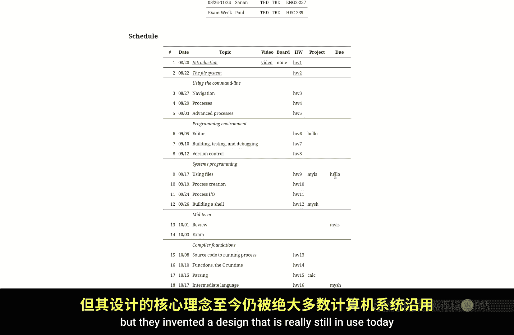
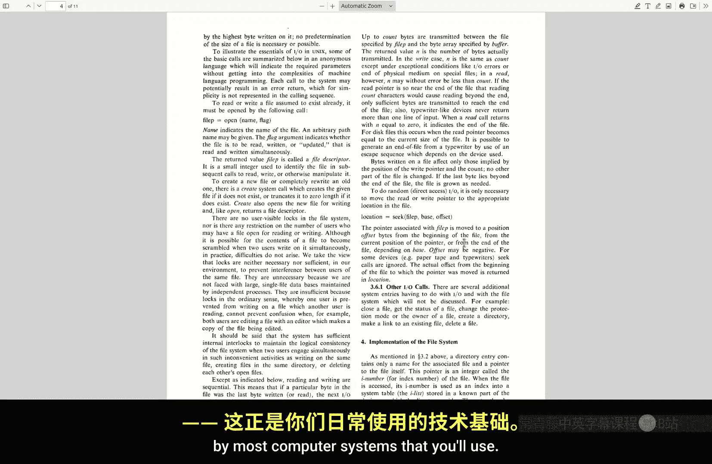
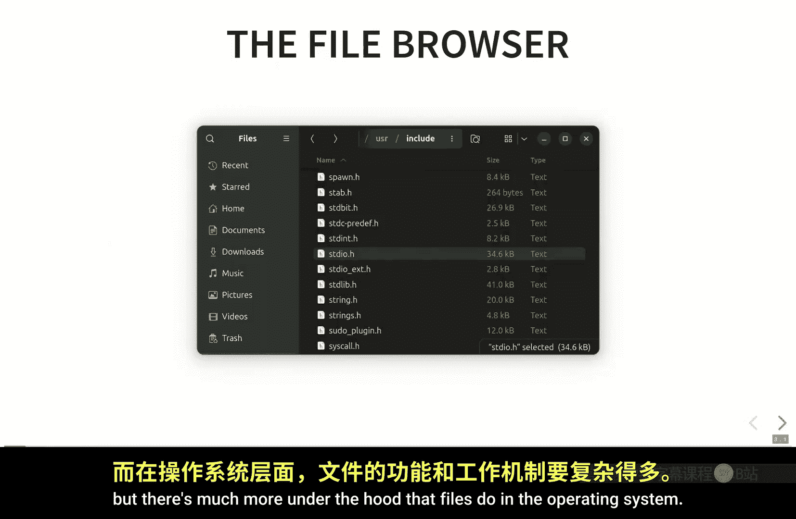
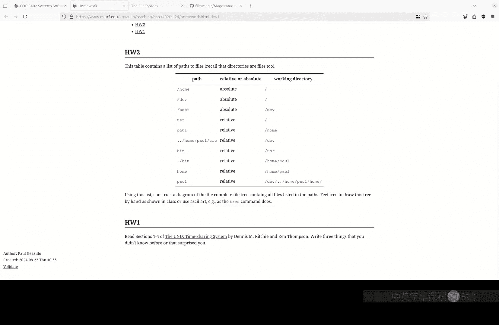

# 002：文件系统 🗂️







在本节课中，我们将学习文件系统的基本概念。我们将了解文件是什么、目录如何工作，以及路径（绝对路径和相对路径）如何帮助我们定位文件系统中的数据。理解这些核心概念对于后续使用命令行和操作系统至关重要。

---

## 文件系统概述

上一节我们介绍了课程的基本信息，本节中我们来看看文件系统的核心思想。文件系统是现代操作系统的基石，它并非源于自然，而是由人设计的。在Unix系统中，文件系统被设计为一种层次化结构，这种设计至今仍被广泛使用。

## 什么是文件？📄

许多用户可能认为文件系统就是图形界面，可以点击文件、打开或运行程序。但这实际上是**文件浏览器**或**文件资源管理器**，它是一个与文件系统交互的应用程序。真正的文件系统在操作系统层面提供了更底层的功能。

文件并非存储在磁盘上的物理实体，而是一种**抽象**。它的本质是将一系列二进制数据组合在一起。文件没有内置的名称、硬件依赖或特定格式。

文件抽象的目的是统一各种不同的数据存储硬件和I/O方式。无论是软盘、硬盘、SSD、U盘还是云存储，它们都有不同的物理特性和指令集。文件抽象将这些差异隐藏起来，提供了一个简单统一的接口，允许我们使用相同的命令（如读取和写入字节序列）来操作所有存储介质。

当然，文件操作还包括打开、关闭、设置权限等，但其核心始终是字节序列的读写。

## 文件内容与名称

为了说明文件抽象部分（内容）与其周边信息（如名称、存储位置）的区别，让我们查看一个文件的实际内容。

这是一个简单的“Hello World” C程序文件。从操作系统的角度看，该文件的内容就是一个字节序列。我们可以使用`hexdump`命令以十六进制形式查看这些字节。

```bash
hexdump -C helloworld.c
```

输出会显示一系列十六进制数字。如果使用`-C`标志，它会同时显示这些字节对应的ASCII字符。磁盘上存储的正是这些比特位，它们被解释为文本是因为我们遵循了ASCII编码规范。

**关键点在于**：文件内容（字节序列）与文件名**没有必然联系**。至少在Unix文件系统设计中，文件内部数据不包含其名称信息。

我们可以用`file`命令来验证这一点。该命令通过分析文件内容的“魔数”来判断文件类型，而不是看文件扩展名。

```bash
file helloworld.c
# 输出：C source, ASCII text

file song.mp3
# 输出：MPEG ADTS, layer III, v1, 128 kbps, 44.1 kHz, JntStereo

mv helloworld.c helloworld.mp3
file helloworld.mp3
# 输出：C source, ASCII text （类型未变，因为内容未变）

mv song.mp3 song.c
file song.c
# 输出：MPEG ADTS, layer III... （类型依然是MP3）
```

`file`命令通过识别文件开头的特定“魔数字节”来判断类型。例如，MP3文件通常以“ID3”开头。这种设计带来了灵活性，但也可能被恶意利用，例如通过隐藏真实扩展名来诱骗用户运行恶意程序。

## 目录与命名 📁

既然文件内容不包含名称，那么文件如何获得名字？答案是通过**目录**。

目录本质上是一种将**名称**映射到**文件**的特殊文件。你可以将其类比为C语言中的指针（名称是指针，文件是被指向的数据）或电话簿（将人名映射到电话号码）。

操作系统为每个文件分配一个唯一的标识号，称为**inode号**。目录条目则存储了“文件名”到“inode号”的映射关系。

将名称与文件实体分离的设计有很多好处：
*   **易于重命名和移动**：只需修改目录中的映射条目，无需触碰文件数据本身。
*   **支持硬链接**：多个名称（在不同目录中）可以指向同一个inode（即同一个文件）。
*   **删除效率高**：删除文件通常只是移除目录中的条目，文件数据可能仍留在磁盘上，直到被新数据覆盖。

目录本身也是文件，只不过其内容是名称到inode的映射表。这种设计使得目录可以包含其他目录，从而形成了层次化的文件系统树。

## 路径：定位文件 🧭

在层次化的文件系统中，我们需要一种方法来唯一标识一个文件，这就是**路径**。

### 绝对路径

**绝对路径**从文件系统的根目录（用 `/` 表示）开始，逐级列出到达目标文件所需经过的所有目录。

例如，考虑以下文件树：
```
/ (根目录)
├── home/
│   ├── paul/
│   │   └── file.c
│   └── joe/
│       └── file.c
└── hello.txt
```

*   文件 `/home/paul/file.c` 的绝对路径是：`/home/paul/file.c`
*   文件 `/home/joe/file.c` 的绝对路径是：`/home/joe/file.c`

绝对路径总是以 `/` 开头，它能唯一确定一个文件（不考虑硬链接）。

### 相对路径与工作目录

**相对路径**不是从根目录开始，而是从**当前工作目录**开始。每个运行的程序（包括Shell）都有一个当前工作目录的概念。

相对路径不以 `/` 开头。系统会将其解释为相对于当前工作目录的路径。

继续使用上面的文件树例子：
*   如果当前工作目录是 `/home`，那么：
    *   `paul/file.c` 指向 `/home/paul/file.c`
    *   `./paul/file.c` 同样指向 `/home/paul/file.c`（`./` 代表当前目录）
    *   `../hello.txt` 指向 `/hello.txt`（`../` 代表父目录）

### 特殊目录：`.` 和 `..`

每个目录都包含两个特殊的条目：
*   **`.` （点）**：指向目录自身。
*   **`..` （点点）**：指向父目录。

根目录的 `..` 也指向它自身。

它们的用途包括：
*   **`.`**：常用于明确指定运行当前目录下的可执行文件（例如 `./myprogram`），因为系统默认不会在当前目录搜索可执行文件。
*   **`..`**：方便地导航到上级目录。

## 总结

本节课中我们一起学习了文件系统的核心概念：
1.  **文件是一种抽象**，它是对字节序列的统一接口，隐藏了底层存储硬件的差异。
2.  **文件内容与文件名无关**。文件名存储在目录中，通过inode号与文件实体关联。
3.  **目录是特殊的文件**，它存储了文件名到inode号的映射。这种设计使得重命名、移动和链接操作非常高效。
4.  **路径**用于定位文件。**绝对路径**从根目录开始，**相对路径**从当前工作目录开始。
5.  特殊目录 **`.`** 和 **`..`** 分别代表当前目录和父目录，是文件导航的重要工具。



理解这些基础概念是熟练使用命令行和深入理解操作系统工作原理的关键第一步。下一节我们将开始学习具体的文件操作命令。