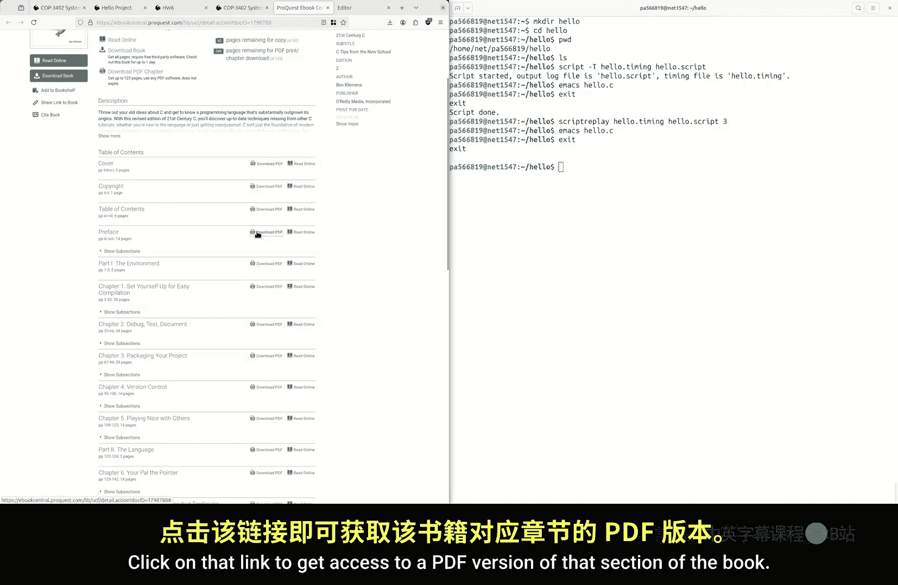
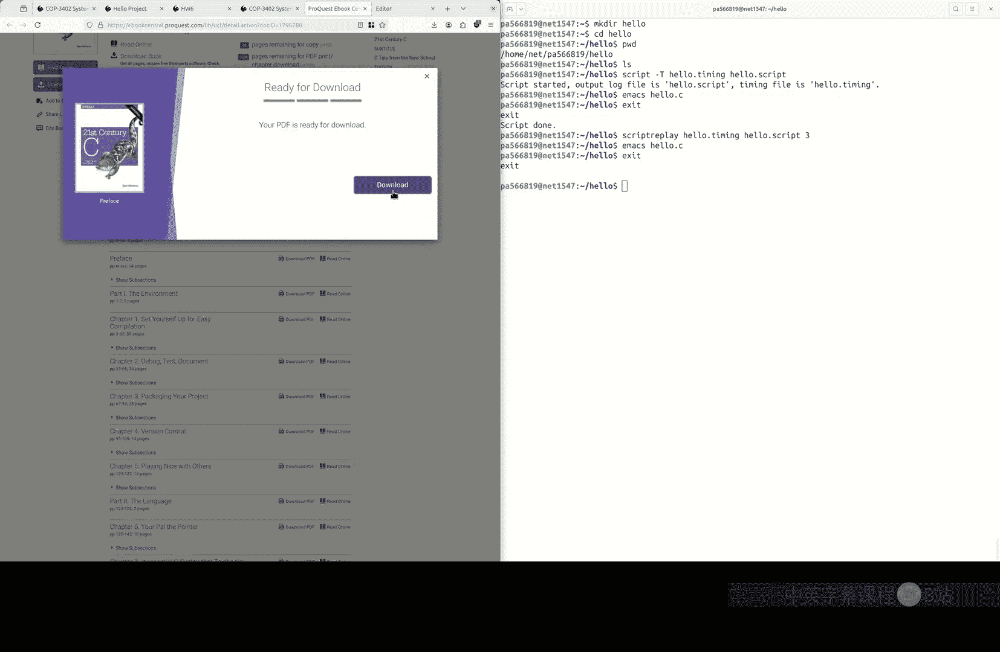
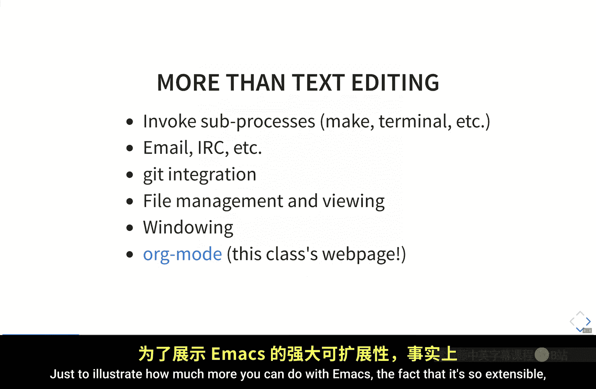
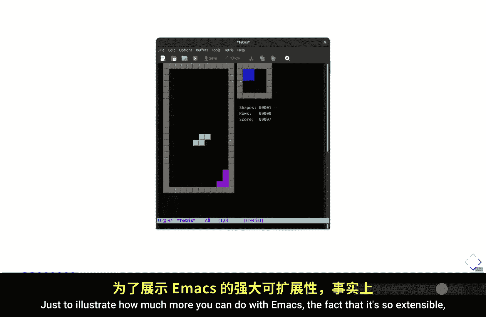
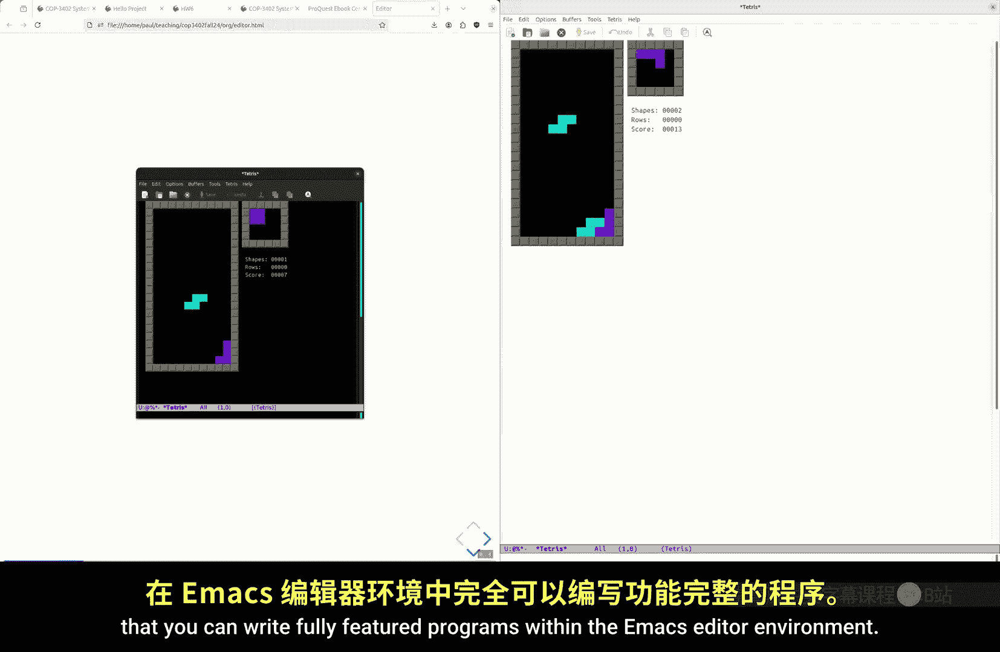
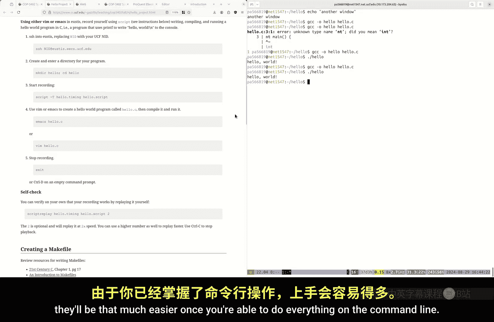

# 007：编程环境与编辑器 🖥️

在本节课中，我们将学习编程环境中的一个核心部分：文本编辑器。我们将重点介绍两种命令行编辑器——Emacs和Vim——的基本使用方法，并了解如何将它们集成到高效的工作流中。掌握这些工具对于完成本课程的编程项目至关重要。

上一节我们介绍了命令行中进程的高级用法，如管道和多路复用器。本节中，我们来看看如何利用编辑器来实际修改和创建代码。

## 第一个编程项目：Hello World

在深入讲解编辑器之前，我们先了解一下第一个编程项目的要求。该项目是编写一个简单的“Hello World”程序，但有几个特殊要求。

以下是完成该项目的具体步骤：

1.  使用SSH连接到Eustis服务器。
2.  使用你选择的文本编辑器（Emacs或Vim），**完全在命令行中**编写“Hello World”程序。
3.  使用 `script` 命令录制你的整个终端操作过程。





### 使用 `script` 命令录制会话

`script` 命令可以记录终端会话中的所有输入和输出。以下是录制过程：

```bash
script -T hello.timing hello.script
```
执行此命令后，终端会开始录制。接着，你可以使用编辑器创建并编写程序。完成后，输入 `exit` 退出录制的子shell，录制便停止。

你可以使用 `scriptreplay` 命令回放录制的内容，以作检查：
```bash
scriptreplay -t hello.timing hello.script 3
```
（末尾的数字 `3` 表示以3倍速回放）

该项目旨在帮助你练习使用命令行编辑器，并熟悉基本的开发流程。项目提交将通过Git进行，我们将在后续关于版本控制的课程中详细讲解。

## 高效开发工作流：结合终端多路复用器

在开始学习具体编辑器前，了解一个高效的工作流很有帮助。我们可以结合上一节学到的终端多路复用器（如 `byobu`）来提升效率。







使用多路复用器，你可以在同一个终端窗口中创建多个面板。例如，你可以在一个面板中打开编辑器编写代码，在另一个面板中运行编译命令，在第三个面板中执行测试。通过快捷键（如 `Alt+左右方向键` 或 `F3`/`F4`）可以快速在这些面板间切换。

这种工作流使你无需在多个窗口间来回跳转，就能同时进行编辑、编译和测试，大大提升了开发效率。

## 编辑器介绍：Emacs

Emacs不仅仅是一个文本编辑器，它更是一个高度可定制和可扩展的编程环境。它的设计哲学使其能够胜任多种任务。

以下是Emacs的一些核心特性：

*   **自文档化**：内置帮助系统，可以随时查询命令和函数用法。
*   **高度可定制**：允许用户修改快捷键绑定和界面。
*   **功能扩展**：通过Emacs Lisp语言，可以编写插件，实现邮件、IRC聊天、游戏等复杂功能。
*   **进程调用**：可以在编辑器内部运行shell命令、编译程序（如 `make`）。
*   **版本控制集成**：内置对Git等版本控制系统的强大支持。
*   **文件管理**：可以管理目录、文件，进行重命名、复制等操作。
*   **多窗口管理**：支持同时打开和编辑多个文件。

### Emacs 基础操作

对于初学者，掌握以下基本命令即可开始使用Emacs完成“Hello World”项目：

*   **启动并编辑文件**：`emacs hello.c`
*   **光标移动**：除了方向键，也可用 `Ctrl+f` (前)、`Ctrl+b` (后)、`Ctrl+n` (下)、`Ctrl+p` (上)。
*   **保存文件**：`Ctrl+x` `Ctrl+s`
*   **退出Emacs**：`Ctrl+x` `Ctrl+c`

### Emacs 进阶功能概览

当你熟悉基础操作后，可以探索更多强大功能：

*   **窗口管理**：
    *   `Ctrl+x 2`：水平分割当前窗口。
    *   `Ctrl+x 3`：垂直分割当前窗口。
    *   `Ctrl+x o`：在多个窗口间切换焦点。
    *   `Ctrl+x 0`：关闭当前窗口。
    *   `Ctrl+x 1`：关闭其他所有窗口，只保留当前窗口。
*   **文件管理**：在Emacs中打开一个目录，可以像图形界面一样进行复制（`C`）、重命名/移动（`R`）、新建目录（`+`）等操作。
*   **Org模式**：这是一个强大的笔记、文档组织和待办事项管理工具。本课程网站就是使用Org模式生成。
*   **版本控制**：通过Magit等插件，可以在Emacs内完成Git提交、查看差异、管理分支等所有操作，无需离开编辑器。

## 编辑器介绍：Vim

Vim是另一个极受欢迎的命令行编辑器。它与Emacs的一个主要区别在于其**模态编辑**设计。

Vim有多种模式，最常用的是：
*   **普通模式**：用于移动光标、删除、复制粘贴等操作。启动Vim后默认进入此模式。
*   **插入模式**：用于输入和编辑文本。

### Vim 基础操作

以下是Vim的基本使用流程：

1.  **启动Vim**：`vim hello.c`
2.  **从普通模式进入插入模式**：按 `i` 键（在光标前插入）。
3.  **编辑文本**：此时可以像普通编辑器一样输入代码。
4.  **返回普通模式**：按 `Esc` 键。
5.  **保存文件**：在普通模式下输入 `:w` 并回车。
6.  **保存并退出**：输入 `:wq` 并回车。
7.  **不保存退出**：输入 `:q!` 并回车。

**重要提示**：如果你在Vim中“卡住”，通常是因为处于插入模式而无法执行保存等命令。请多次按 `Esc` 键确保回到普通模式，然后使用 `:q` 或 `:q!` 退出。

### Vim 的导航与编辑

在普通模式下，Vim使用字母键进行高效导航和编辑：

*   **光标移动**：
    *   `h` / `l`：左 / 右。
    *   `j` / `k`：下 / 上。
    *   `w` / `e`：移动到下一个单词的开头 / 结尾。
    *   `b`：移动到上一个单词的开头。
    *   `0`：移动到行首。
    *   `$`：移动到行尾。
    *   `gg`：移动到文件开头。
    *   `G`：移动到文件结尾。
*   **搜索文本**：输入 `/`，然后输入搜索词，按回车。用 `n` 跳转到下一个匹配项，`N` 跳转到上一个。
*   **删除与复制粘贴**：
    *   `x`：删除当前光标下的字符。
    *   `dw`：删除一个单词。
    *   `dd`：删除整行。
    *   `p`：粘贴已删除或复制的内容。
    *   `u`：撤销上一次操作。

Vim的学习曲线可能较陡，但一旦掌握，其编辑效率非常高。强烈建议通过运行 `vimtutor` 命令完成内置教程。

---



本节课中我们一起学习了编程环境中两个核心的文本编辑器——Emacs和Vim。我们了解了它们的基本操作模式、如何利用它们与终端多路复用器结合形成高效工作流，并明确了第一个“Hello World”编程项目的具体要求。请选择其中一个编辑器，通过完成项目来巩固练习。记住，熟练使用这些命令行工具将为你的系统软件开发打下坚实的基础。