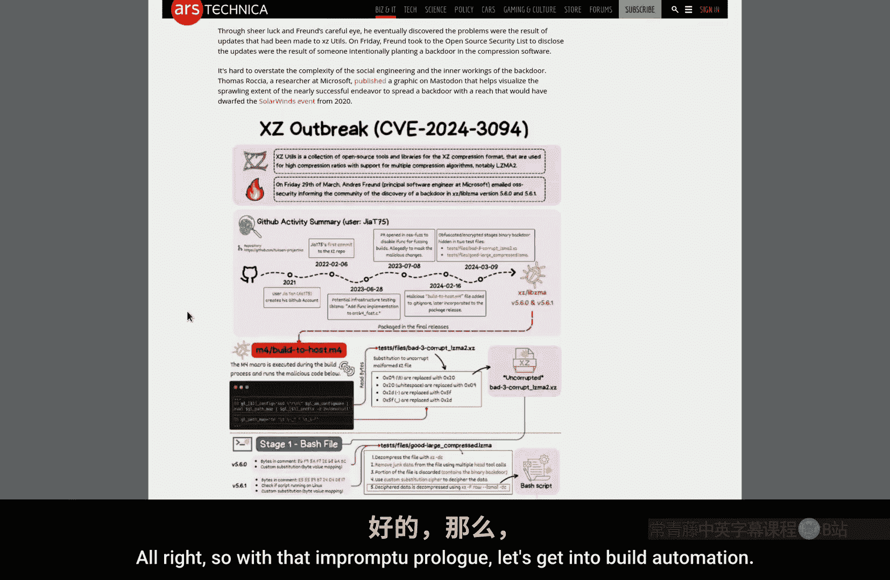
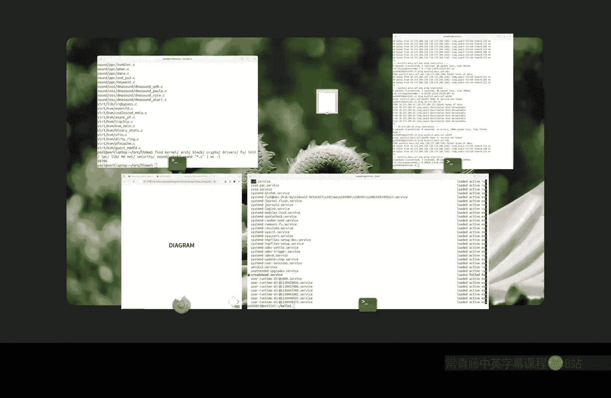
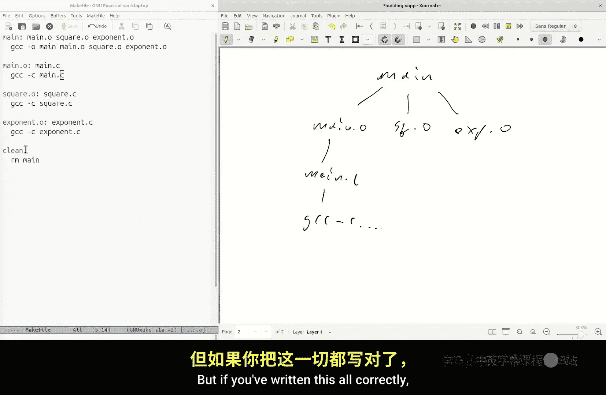
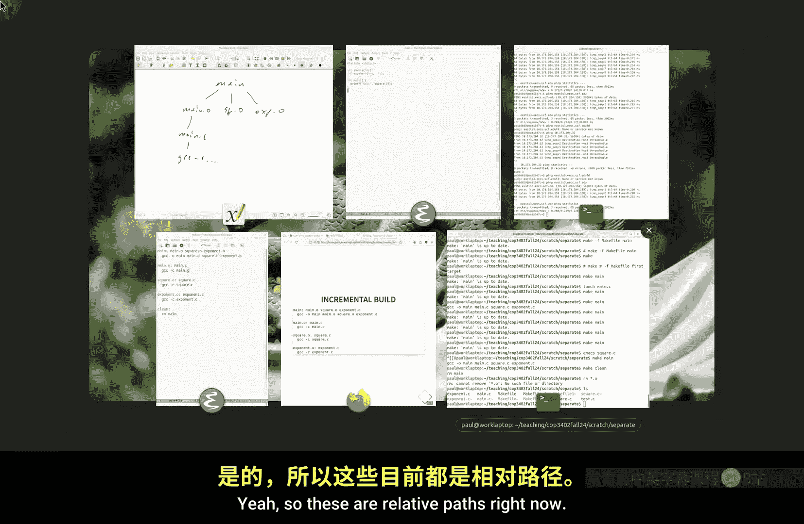
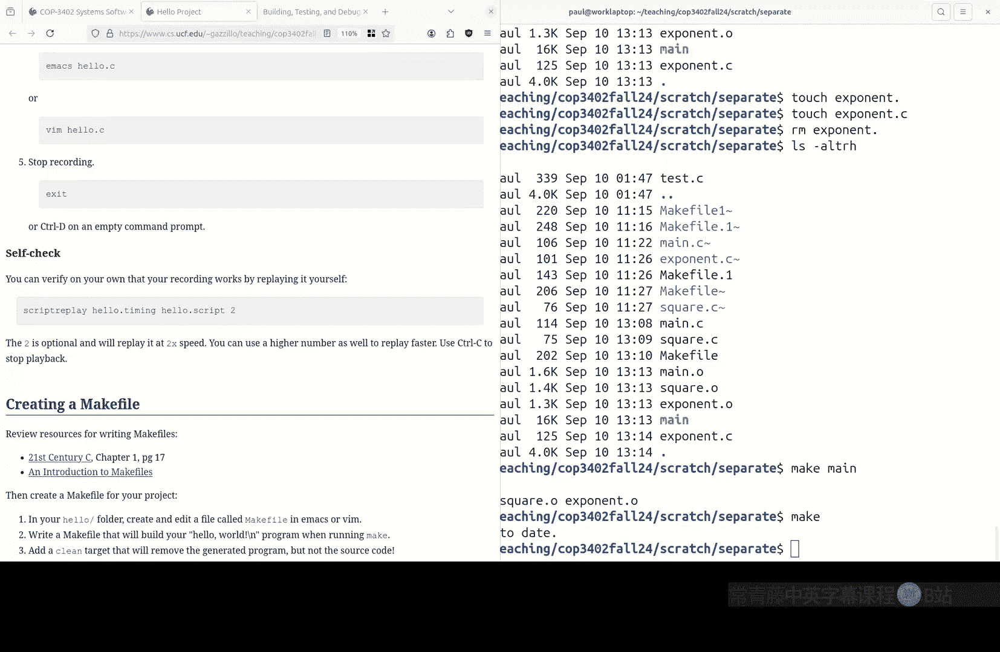

# 008：构建、测试与调试环境 🛠️

在本节课中，我们将学习软件开发环境中的关键环节：构建自动化、测试与调试。我们将重点探讨如何使用 `make` 工具来管理多文件项目的编译过程，以提高开发效率。

---

## 构建自动化

上一节我们介绍了基本的编译过程。本节中我们来看看当项目包含多个源文件时，如何更高效地进行构建。

### 单独编译

为什么需要单独编译？当项目规模变大，例如拥有成千上万个源文件时，每次修改后都重新编译所有文件会非常耗时。单独编译允许我们只重新编译那些被修改过的文件及其依赖项。

以下是单独编译的基本步骤：
1.  将每个源文件（`.c`）单独编译成目标文件（`.o`）。
    ```bash
    gcc -c main.c -o main.o
    gcc -c square.c -o square.o
    gcc -c exponent.c -o exponent.o
    ```
2.  使用链接器将所有目标文件链接成一个可执行程序。
    ```bash
    gcc main.o square.o exponent.o -o main
    ```

这种方法在开发过程中可以节省大量时间。

---

## 使用 Makefile 实现自动化

手动执行上述命令仍然繁琐。`make` 工具和 `Makefile` 文件可以自动化这个过程。

### Makefile 基础

一个 `Makefile` 由一系列“规则”组成。每条规则定义了如何构建一个特定的“目标”文件。


一条规则的基本语法如下：
```
目标文件: 依赖文件
<制表符> 构建命令
```



以下是一个简单的 `Makefile` 示例，它直接编译所有源文件：
```makefile
main: main.c square.c exponent.c
    gcc main.c square.c exponent.c -o main
```

运行 `make` 命令（默认查找 `Makefile` 文件）即可执行构建。

### 利用依赖关系




`make` 的智能之处在于它能检查文件的时间戳。如果目标文件已经存在，并且比所有依赖文件都新，`make` 就不会重新构建它。

我们可以改进 `Makefile`，为每个目标文件建立规则：
```makefile
main: main.o square.o exponent.o
    gcc main.o square.o exponent.o -o main

main.o: main.c
    gcc -c main.c -o main.o

square.o: square.c
    gcc -c square.c -o square.o

exponent.o: exponent.c
    gcc -c exponent.c -o exponent.o
```

现在，如果只修改了 `exponent.c`，运行 `make` 将只会重新编译 `exponent.o` 并重新链接 `main`，而不会处理 `main.o` 和 `square.o`。

### 使用变量和模式规则

为了使 `Makefile` 更简洁、可维护，我们可以使用变量和通配符。

以下是使用变量和模式规则的改进版本：
```makefile
# 定义变量
CC = gcc
CFLAGS = -c
SOURCES = main.c square.c exponent.c
OBJECTS = $(SOURCES:.c=.o)
EXECUTABLE = main

# 默认目标：构建可执行文件
all: $(EXECUTABLE)

# 链接目标文件生成可执行文件
$(EXECUTABLE): $(OBJECTS)
    $(CC) $(OBJECTS) -o $@

# 模式规则：将任何 .c 文件编译为 .o 文件
%.o: %.c
    $(CC) $(CFLAGS) $< -o $@

# 清理生成的文件
clean:
    rm -f $(OBJECTS) $(EXECUTABLE)

# 声明 `clean` 为伪目标，不代表实际文件
.PHONY: clean all
```

在这个 `Makefile` 中：
*   `$@` 代表目标文件名。
*   `$<` 代表第一个依赖文件名。
*   `%.o: %.c` 是一个模式规则，为每个 `.c` 文件如何生成对应的 `.o` 文件提供了通用方法。

---

## 测试与调试哲学

构建自动化是稳健软件开发的基础。同样重要的是建立良好的测试和调试习惯。





*   **测试**：编写系统的测试用例，确保代码修改不会引入错误。自动化测试可以集成到构建过程中。
*   **调试**：使用调试器（如 `gdb`）来逐步执行程序、检查变量状态，而不是仅仅依赖 `printf` 语句。理解程序的运行时行为是解决问题的关键。

---

## 总结



本节课中我们一起学习了软件开发环境的核心工具。我们探讨了单独编译的优势，并深入了解了如何使用 `Makefile` 和 `make` 工具来实现构建自动化，从而高效管理多文件项目。掌握这些工具是成为高效软件工程师的重要一步。