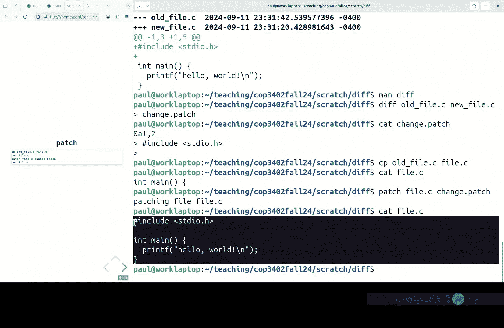
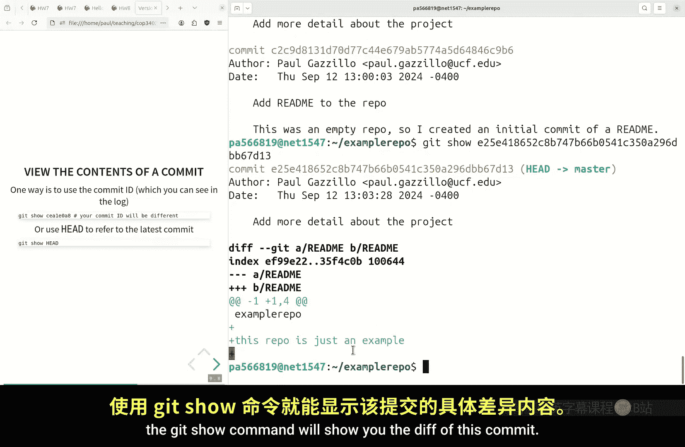
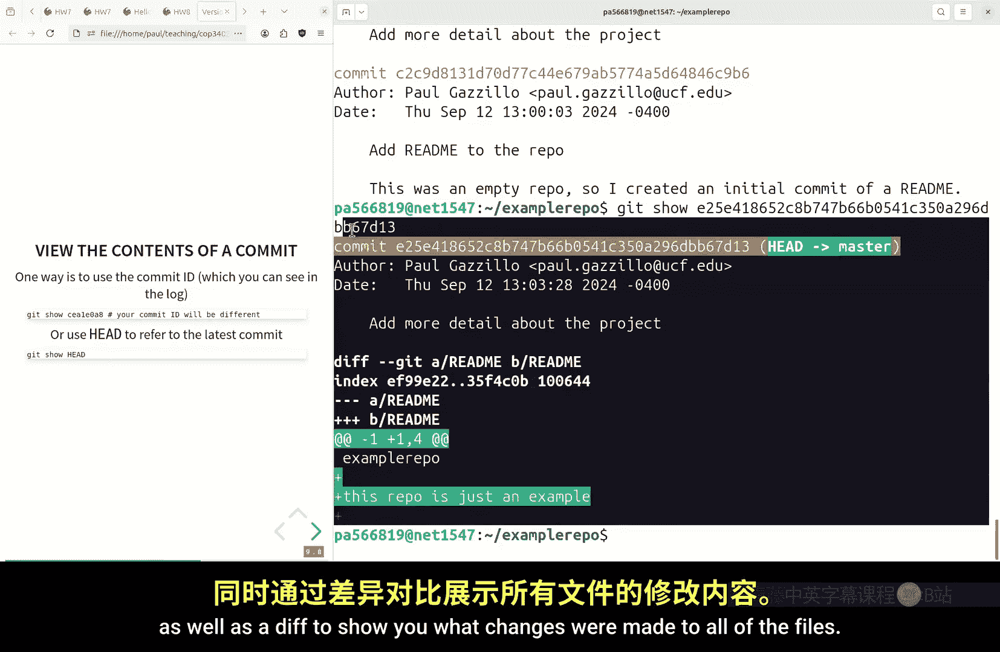
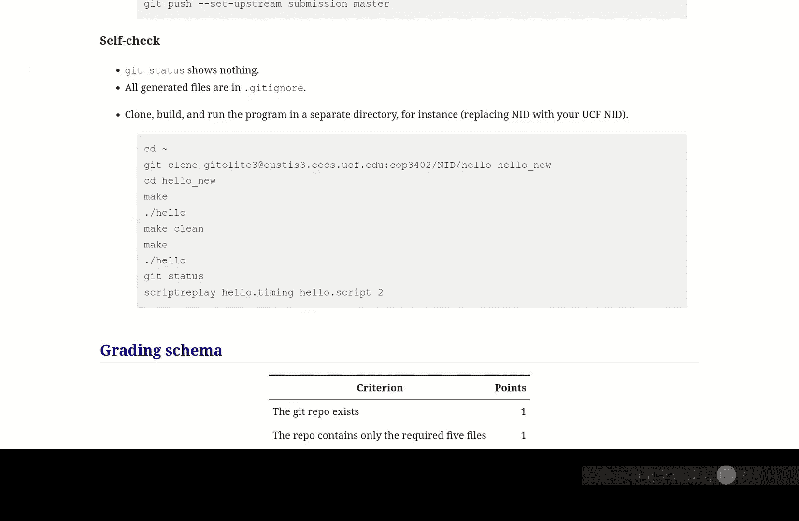

# 009：版本控制 🗂️

在本节课中，我们将完成对编程环境的介绍，重点学习版本控制系统。我们将了解版本控制的基本概念、为什么它如此重要，并学习使用 `git` 这一核心工具来管理代码变更。

上一节我们介绍了构建系统 `make`，本节中我们来看看如何系统地记录和管理代码的变更历史。

## 概述：什么是版本控制？

版本控制系统是一种记录文件内容变化，以便将来查阅特定版本历史的工具。它就像代码的“时光机”，允许你：

*   **追踪变更**：记录每一次代码修改的内容、时间和原因。
*   **恢复历史**：轻松回退到任何一个历史版本。
*   **协作开发**：支持多人同时在一个项目上工作，并管理代码合并。
*   **分支管理**：创建独立的分支来开发新功能或修复bug，而不影响主线代码。

## 核心概念：变更即交易

理解版本控制的一个好方法是类比银行账户。你的账户余额（当前代码状态）本身并不能告诉你它是如何变成这样的。你需要查看交易记录（变更历史）。

*   **当前余额** = 初始金额 + 所有（存入 - 支出）交易的总和。
*   **当前代码** = 初始代码 + 所有提交（`commit`）的变更总和。

通过保存一系列带有时间戳和描述的变更记录，你可以重建项目在任意历史时刻的状态。版本控制系统（如 `git`）就是自动管理这些“交易记录”的工具。

## 基础工具：`diff` 与 `patch`

在深入 `git` 之前，需要了解两个底层工具，它们是许多版本控制系统的基石。

### `diff`：比较文件差异

`diff` 工具用于逐行比较两个文本文件，并输出它们之间的差异。

**命令示例：**
```bash
diff file_old.c file_new.c
```
**输出含义：**
*   `<` 开头的行表示仅存在于第一个（左侧/旧）文件。
*   `>` 开头的行表示仅存在于第二个（右侧/新）文件。

更常用的格式是“统一差异格式”（`-u` 选项），它提供了变更的上下文。
```bash
diff -u file_old.c file_new.c
```
**输出含义：**
*   `---` 表示旧文件，`+++` 表示新文件。
*   `@@ -1,3 +1,5 @@` 表示变更发生的位置（旧文件第1行开始的3行，新文件第1行开始的5行）。
*   `-` 开头的行表示在旧文件中被删除。
*   `+` 开头的行表示在新文件中被添加。

### `patch`：应用文件差异

`patch` 工具是 `diff` 的逆操作。它接受一个旧文件和一个由 `diff` 生成的“补丁”文件，并应用这些差异来生成新文件。

**命令示例：**
```bash
# 生成补丁文件
diff -u file_old.c file_new.c > change.patch
# 应用补丁，将 file_old.c 更新为 file_new.c 的内容
patch file_old.c < change.patch
```
**概念关系：**
`diff` 负责**记录**变更，`patch` 负责**应用**变更。一个版本历史可以看作是一系列按顺序应用的补丁。

## 版本控制系统：Git 🚀

`git` 是一个分布式版本控制系统，它基于上述“变更即快照”的理念，但功能更强大，尤其擅长处理分支和协作。

### Git 的核心区域

一个 Git 仓库包含三个主要区域：

1.  **工作目录**：你当前看到和编辑的文件。
2.  **暂存区**：一个中间区域，用于临时存放你打算提交的变更。
3.  **Git 仓库**：存储所有提交历史和数据的地方（位于 `.git/` 目录中）。



文件在这三个区域间的状态流转如下图所示：

```
工作目录 --(git add)--> 暂存区 --(git commit)--> Git仓库
      <--(git checkout)--
```

### 基本 Git 工作流

以下是管理个人项目时最常用的命令序列。

**首次配置（在 Eustis 上只需一次）：**
```bash
git config --global user.name "你的姓名"
git config --global user.email "你的邮箱@ufl.edu"
git config --global core.editor "vim"  # 或 "emacs"
```

**初始化仓库并提交代码：**
```bash
# 进入项目目录
cd ~/hello
# 初始化一个新的 Git 仓库
git init
# 将文件添加到暂存区
git add hello.c Makefile hello.script
# 创建提交，保存暂存区的内容到仓库历史
git commit
```
执行 `git commit` 后会打开你配置的编辑器（如 Vim 或 Emacs）来编写提交信息。第一行是简短摘要，空一行后可以写详细描述。保存并退出编辑器即完成提交。

**查看状态与历史：**
```bash
# 查看工作目录和暂存区的状态
git status
# 查看提交历史
git log
# 查看某次提交的具体变更
git show <commit-id>
```

### `.gitignore` 文件

你不需要将编译生成的二进制文件（如 `hello.o`, `hello`）提交到仓库。`.gitignore` 文件用于指定哪些文件或目录应该被 Git 忽略。

**创建 `.gitignore` 文件：**
```bash
# 在项目根目录创建 .gitignore 文件，内容如下：
hello
hello.o
*.out
# 如果是 Emacs 用户，还可以忽略备份文件
*~
```
**然后记得将 `.gitignore` 文件本身加入版本控制：**
```bash
git add .gitignore
git commit -m “Add .gitignore file”
```





### 远程仓库与提交作业

对于本课程，你需要将本地仓库同步到课程提供的 GitLab 服务器上。

**添加远程仓库并推送代码：**
```bash
# 将课程 GitLab 仓库添加为远程源，命名为 ‘origin’
git remote add origin https://gitlab.com/COP3402F24/hello-<你的GatorID>.git
# 将本地 master 分支的提交推送到远程 origin 仓库
git push -u origin master
```
**验证提交：**
完成推送后，一个重要的自检步骤是**克隆自己的仓库到一个新目录**，测试是否能成功构建和运行。
```bash
cd ~
git clone https://gitlab.com/COP3402F24/hello-<你的GatorID>.git hello-test
cd hello-test
make
./hello
```
如果这个过程成功，那么评分系统也能以同样的方式构建和运行你的程序。

## 为什么版本控制至关重要？

以下是使用版本控制的主要优势：

*   **历史追踪与回滚**：无需猜测，可以精确查看谁在何时修改了什么，并能轻松恢复到工作版本。
*   **分支与并行开发**：可以在独立的分支上开发新功能或修复 Bug，而不会影响稳定的主线代码。
*   **协作基石**：使多人同时在同一个项目上工作成为可能，系统能帮助合并（`merge`）不同人的修改。
*   **自动化支持**：结合 `make`，可以实现从克隆到构建的完全自动化，这是现代软件分发的标准。
*   **专业实践**：是所有正规软件开发团队的标准工具，掌握它是成为专业软件工程师的必备技能。

## 总结

本节课中我们一起学习了版本控制的核心思想与工具。我们了解到：

1.  版本控制通过记录**变更**（类似交易记录）来管理文件历史。
2.  基础工具 `diff` 和 `patch` 展示了记录与应用变更的原理。
3.  **Git** 是一个功能强大的分布式版本控制系统，它通过**工作目录**、**暂存区**和**仓库**三个区域来管理代码状态。
4.  我们学习了基本的 Git 工作流：`init` -> `add` -> `commit` -> `push`，以及如何使用 `.gitignore` 排除不需要版本控制的文件。
5.  最后，我们强调了版本控制对于代码管理、协作开发和专业实践的重要性。



请务必按照 Hello World 项目的要求，配置好 Git 环境，创建 `Makefile`，并使用 Git 提交你的作业。掌握这些工具将为你未来的编程和软件工程工作打下坚实的基础。