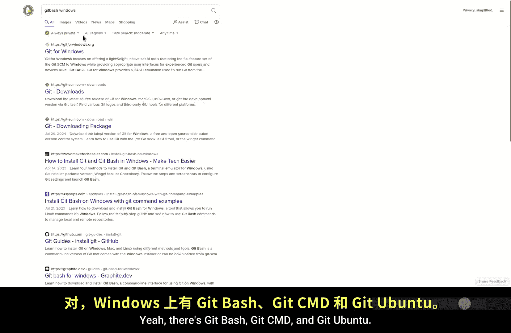
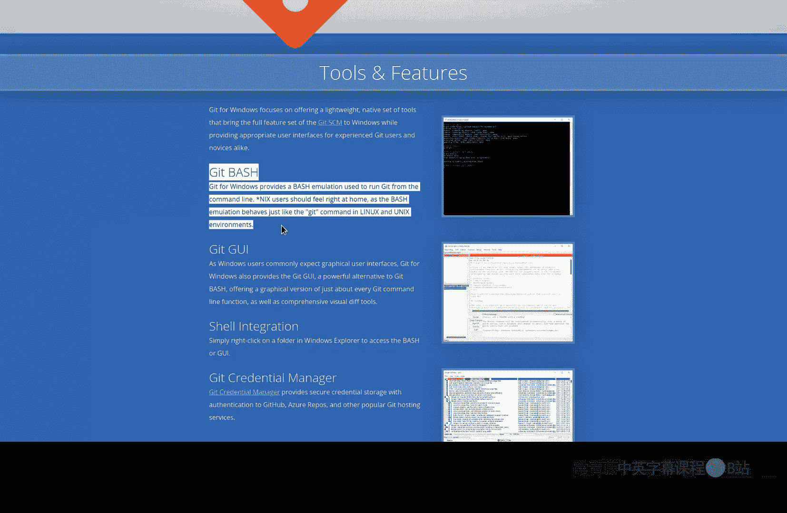
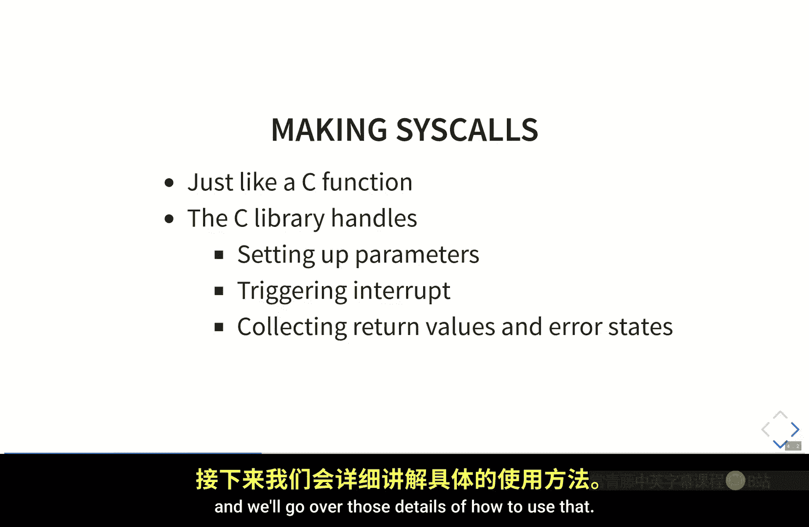
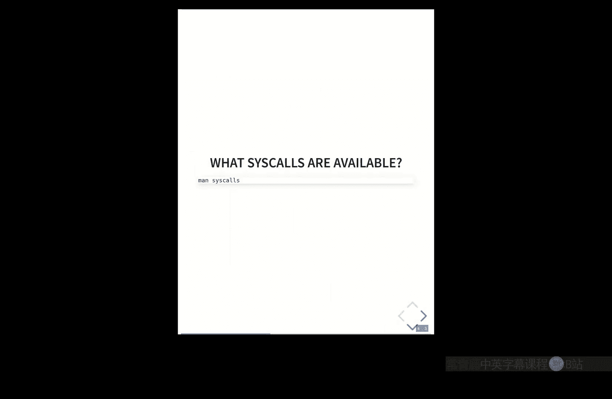
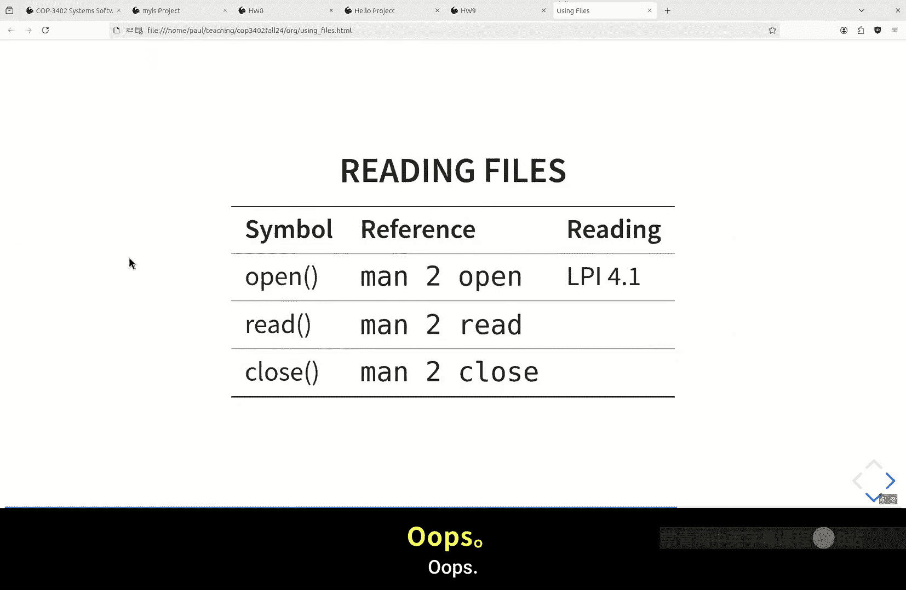
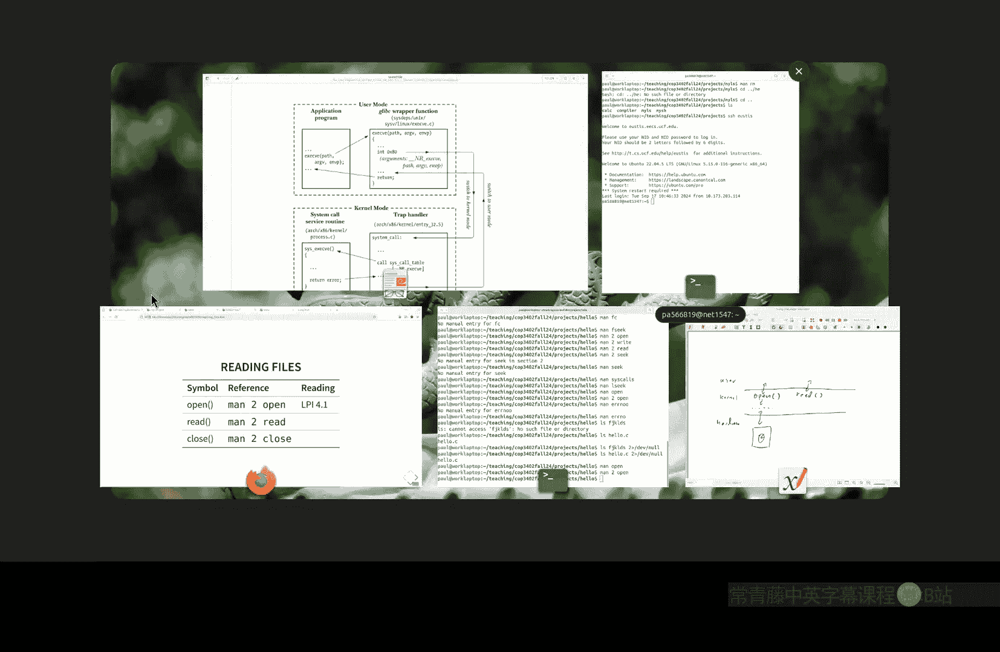
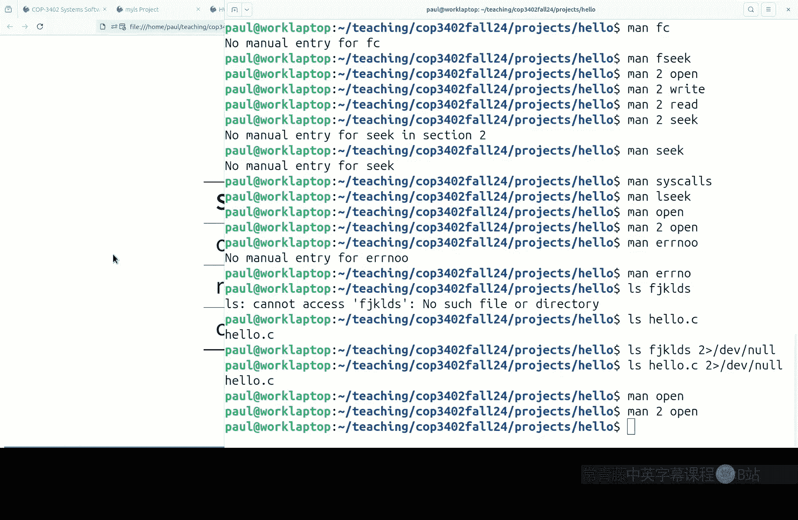
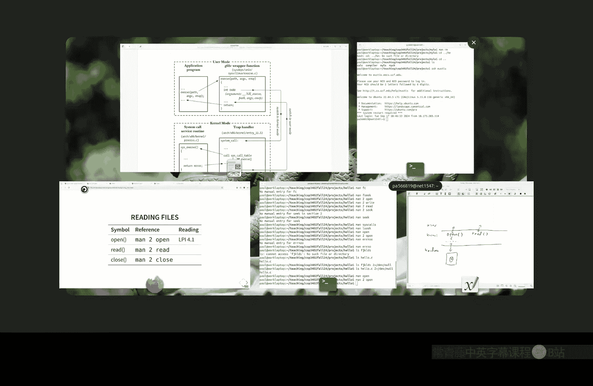
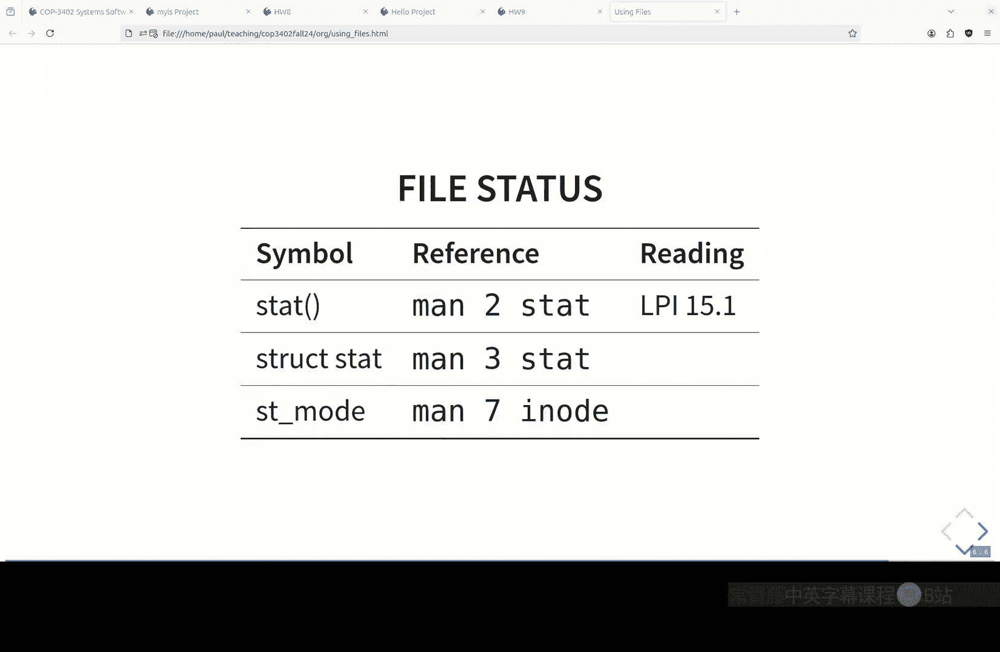

# 010：使用文件 🖥️📁

在本节课中，我们将开始系统编程部分的学习。我们将探讨如何复制一些核心工具，并了解内核中可用的一些常见系统调用。首先，我们会回顾上次的作业，然后深入讲解如何使用文件相关的系统调用，包括错误处理、文件描述符、目录读取等核心概念。

## 作业回顾与项目提交

上一节课的作业是阅读《Linux编程接口》一书中关于Linux编程的入门材料。核心问题是：如何检查系统调用抛出的错误类型？





答案是检查 `errno` 这个全局变量的值。但在此之前，你必须先判断是否有错误发生。对于许多函数，错误返回值是 `-1`。今天我们将学习如何阅读文档，它会明确告诉你返回值是什么以及错误条件是什么。在Unix哲学中，开发者需要自己检查这些错误。编写系统代码时很容易忘记错误检查，因为除非遇到段错误等问题，否则内核不会阻止你。今天我们将更详细地讨论错误检查，这在编程中是一个很好的练习，因为乐观编程而不考虑可能出错的情况很容易。在内核系统编程中，错误处理需要开发者非常明确和手动地进行。

关于项目提交，请记住：你必须在截止日期前至少提交一次（即使完全失败）。之后你可以重新提交。但如果你今天没有提交，则无法重新提交。这是为了确保每个人都能跟上课程进度。提交项目只需将代码推送到Git仓库，这与现实世界中的软件工程工作流程一致。

## 系统编程与内核简介 🧠

系统软件是运行在内核和硬件之上的应用程序，其特点是提供连接内核/硬件与应用程序的低级功能。当我们进行系统编程时，会大量使用内核提供的低级抽象。

内核就像一个库，提供了用户空间和硬件之间的抽象层。它统一了不同硬件的接口，使得编写跨硬件平台的代码变得更加容易。在现代硬件中，用户空间和内核空间之间的边界由硬件强制执行，这是现代计算机保护机制的基础。用户空间程序无法直接访问硬件，必须通过内核。通过特殊的软件中断（如Linux中的 `int 0x80`），程序可以切换到内核模式，执行系统调用，然后返回用户空间。

从程序员的角度看，系统调用就像C函数一样工作：你调用它们，它们返回一个值。C库中有一个“包装器”函数来处理参数传递、收集返回值和错误代码。一个主要区别在于错误处理的方式。

## Unix风格的错误处理 ⚠️





在Unix世界中，错误处理的责任交给了开发者。基本模式是：每次进行系统调用（或库调用）后，都应检查其返回值以判断是否出错。

例如，`open` 系统调用的错误处理模式如下：
```c
int fd = open(pathname, flags);
if (fd == -1) {
    perror("open");
    exit(EXIT_FAILURE);
}
```
1.  运行系统调用。
2.  检查其返回值（许多系统调用用 `-1` 表示错误，但需查阅文档确认）。
3.  如果出错，全局变量 `errno` 会被设置为特定的错误代码。可以使用 `perror()` 函数将其转换为可读的错误信息。
4.  根据情况处理错误（在本课程中，通常直接退出程序）。

每个系统调用都有自己可能返回的错误代码列表，定义在头文件中（如 `EACCES`, `ENOENT` 等）。使用 `perror` 可以方便地打印对应的错误信息。坚持对每个系统调用进行错误检查，可以避免程序出现静默失败，从而更容易调试。

## 文件操作的系统调用 📄

对于文件操作，核心的系统调用是 `open`, `read`, `write`, `close`。与之对应的C标准库函数是 `fopen`, `fprintf`, `fscanf`, `fclose` 等。库函数在系统调用的基础上提供了更便捷的功能（如格式化输出、缓冲等）。

以下是使用 `open` 和 `read` 的基本流程：

1.  **打开文件**：使用 `open` 系统调用获取一个文件描述符（一个整数）。
    ```c
    int fd = open("filename.txt", O_RDONLY);
    if (fd == -1) {
        perror("open");
        exit(EXIT_FAILURE);
    }
    ```
2.  **读取文件**：使用 `read` 系统调用从文件描述符读取原始字节数据。
    ```c
    char buffer[1024];
    ssize_t bytes_read = read(fd, buffer, sizeof(buffer) - 1); // 留一个位置给空字符
    if (bytes_read == -1) {
        perror("read");
        close(fd);
        exit(EXIT_FAILURE);
    }
    buffer[bytes_read] = '\0'; // 手动添加字符串终止符
    ```
    注意：`read` 返回的是实际读取的字节数，它处理的是原始字节，不假设内容是文本。
3.  **关闭文件**：使用 `close` 系统调用释放文件描述符。
    ```c
    if (close(fd) == -1) {
        perror("close");
        exit(EXIT_FAILURE);
    }
    ```

与使用 `fgets` 等库函数不同，使用系统调用需要开发者自己管理缓冲区、读取循环和字符串终止符。

## 目录读取 📂









为了列出目录内容（例如实现 `ls` 命令的功能），我们需要使用目录相关的函数。虽然它们不是纯粹的系统调用，而是库函数，但仍然属于低级接口。

主要函数有 `opendir`, `readdir`, `closedir`。

1.  **打开目录**：`opendir` 返回一个指向 `DIR` 结构的指针。
    ```c
    DIR *dirp = opendir(".");
    if (dirp == NULL) {
        perror("opendir");
        exit(EXIT_FAILURE);
    }
    ```
2.  **读取目录条目**：`readdir` 每次调用返回一个 `struct dirent*`，指向目录中的下一个条目。需要循环调用直到返回 `NULL`。
    ```c
    struct dirent *dp;
    while ((dp = readdir(dirp)) != NULL) {
        printf("%s\n", dp->d_name); // 打印文件名
    }
    ```
    `struct dirent` 结构至少包含 `d_name` 字段，即文件名。遍历顺序通常是目录条目在磁盘上的顺序。
3.  **关闭目录**：
    ```c
    if (closedir(dirp) == -1) {
        perror("closedir");
        exit(EXIT_FAILURE);
    }
    ```

## 项目“my_ls”简介 🗂️

下一个项目是编写一个简化版的 `ls` 命令，名为 `my_ls`。要求如下：
*   程序接受一个可选参数，即目录路径（相对或绝对）。如果没有提供参数，则使用当前工作目录。
*   使用本节介绍的系统调用和目录函数来实现。
*   输出目录中所有文件（包括 `.` 和 `..`）的列表以及一些元数据信息（后续会通过 `stat` 系统调用获取）。
*   必须进行严格的错误处理。

## 总结 🎯



本节课我们一起开始了系统编程的学习。我们首先回顾了错误处理的重要性及Unix风格的手动错误检查模式。接着，我们探讨了内核的角色以及用户空间与内核空间之间的交互。然后，我们深入学习了用于文件操作的核心系统调用（`open`, `read`, `close`）及其与C库函数的区别，并强调了使用原始字节接口时的注意事项。最后，我们介绍了如何读取目录内容（`opendir`, `readdir`, `closedir`），这是实现 `my_ls` 项目的基础。记住，系统编程的关键在于细致和明确，尤其是对每一次可能失败的操作进行错误检查。