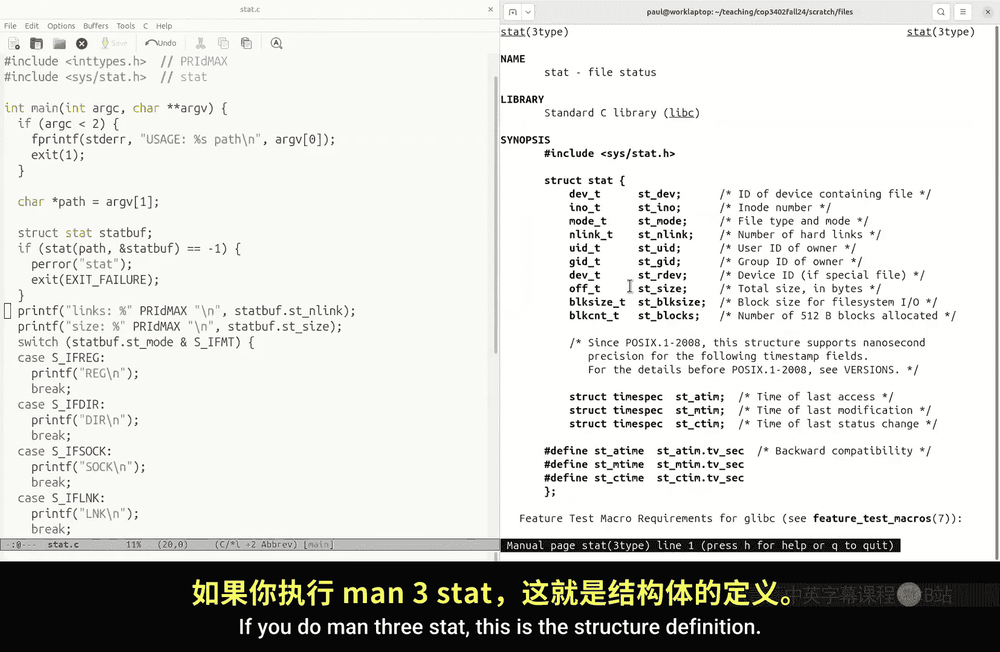
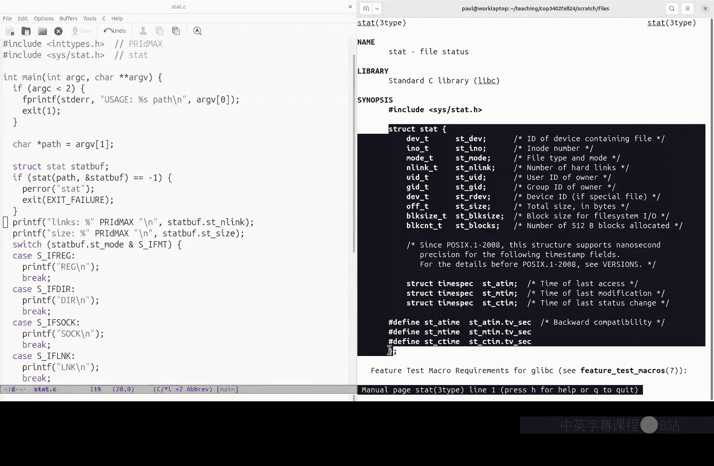
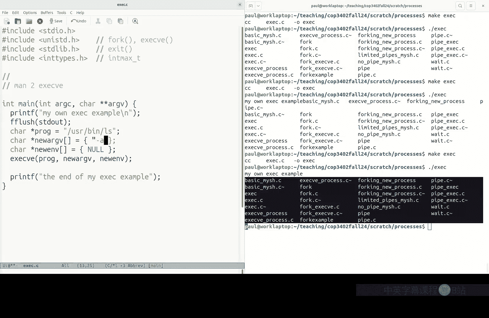
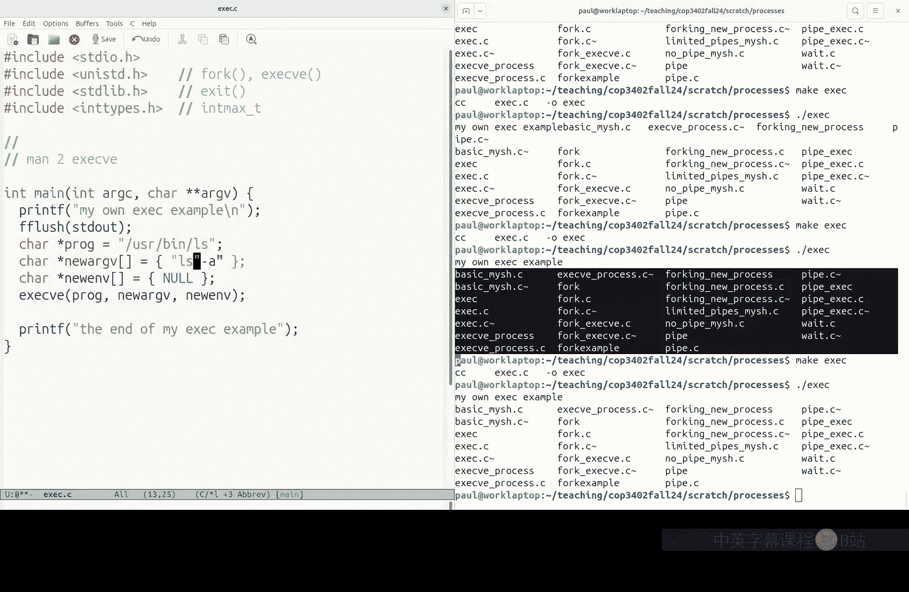
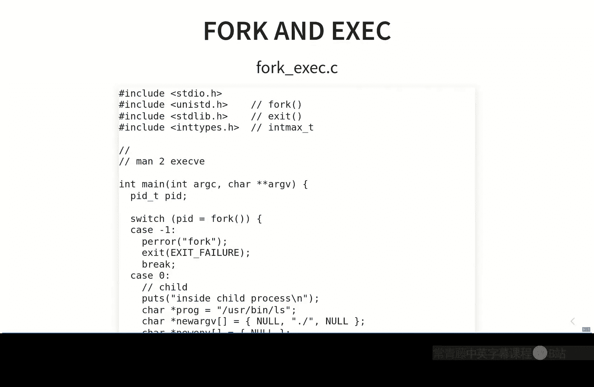

# 011：进程创建 (COP-3402 Fall 2024)

在本节课中，我们将学习如何使用内核提供的系统调用来创建和管理进程。这是系统编程的核心部分，也是我们为编写命令行解释器（shell）项目做准备的关键一步。

上一节我们介绍了文件系统相关的系统调用。本节中，我们来看看进程管理，特别是如何使用 `fork` 和 `exec` 系统调用来创建新的运行程序。

## 项目回顾：myLS

在深入进程之前，我们先简要回顾一下即将进行的项目：`myLS`。这个项目要求你编写一个简化版的 `ls` 命令。

以下是 `myLS` 需要实现的功能：
*   程序接受一个可选的目录路径作为参数。如果未提供参数，则默认列出当前工作目录的内容。
*   对于目录中的每个条目，输出以下信息：
    *   **文件名**：条目的名称。
    *   **硬链接数**：指向该文件的链接数量。
    *   **文件类型**：是目录（`directory`）还是普通文件（`regular`）。
    *   **大小**：如果是目录，输出其包含的条目数；如果是普通文件，输出其字节大小。
    *   **预览**：仅对普通文件，输出其内容的前16个字符。

为了完成这个项目，你需要使用 `stat` 系统调用来获取文件元数据，使用 `opendir`/`readdir` 来遍历目录，以及使用 `open`/`read` 来获取文件预览内容。请务必查阅相关手册页（例如 `man 2 stat`）来了解这些系统调用的具体用法和数据结构。

## 进程抽象





进程是正在运行的程序。为什么需要进程这个抽象概念？主要是为了实现**资源共享**和**时间分片**。现代计算机通常只有少数几个处理器核心，但用户可能同时运行数十个程序。内核通过进程抽象来管理这些程序，在它们之间快速切换CPU使用权，给用户一种所有程序都在同时运行的错觉。

## 创建新进程：`fork`

在Unix-like系统中，创建一个新进程的基本方法是调用 `fork` 系统调用。

`fork` 的作用是**复制**当前正在运行的进程。调用 `fork` 后，会生成一个几乎完全相同的子进程，包括相同的代码、内存状态和打开的文件描述符。

那么问题来了：如果父进程和子进程完全相同，它们如何执行不同的任务呢？关键在于 `fork` 的返回值。

`fork` 的返回值规则如下：
*   在**父进程**中，`fork` 返回新创建的子进程的**进程ID（PID）**。
*   在**子进程**中，`fork` 返回 **0**。
*   如果创建失败，则返回 **-1**。

通过检查 `fork` 的返回值，程序就可以区分自己当前是运行在父进程还是子进程中，从而执行不同的代码路径。

以下是一个简单的 `fork` 示例代码：

```c
#include <stdio.h>
#include <unistd.h>
#include <sys/types.h>

int main() {
    pid_t pid = fork(); // 创建新进程

    if (pid < 0) {
        // fork 失败
        perror("fork failed");
        return 1;
    } else if (pid == 0) {
        // 这段代码在子进程中运行
        printf("Hello from the child process! (PID: %d)\n", getpid());
    } else {
        // 这段代码在父进程中运行
        printf("Hello from the parent process! (Child PID: %d, My PID: %d)\n", pid, getpid());
    }
    return 0;
}
```

运行这段代码，你会看到来自父进程和子进程的两条输出信息，证明确实有两个进程在运行。

## 运行新程序：`exec`

`fork` 创建了一个新进程，但运行的是相同的程序。如果我们想运行一个全新的程序（例如，在shell中输入 `ls` 后运行 `/usr/bin/ls`），就需要使用 `exec` 系列系统调用。

`exec` 的作用是**替换**当前进程正在运行的程序。它不会创建新进程，而是将当前进程的代码段、数据段等替换为指定路径下新程序的代码和数据，然后从新程序的入口点开始执行。

**关键特性**：如果 `exec` 调用成功，它**永远不会返回**。因为原程序的代码已经被新程序完全覆盖。只有当 `exec` 调用失败（例如，找不到指定程序）时，它才会返回错误。

以下是一个简单的 `exec` 示例，它用 `ls` 命令替换掉自身：

```c
#include <stdio.h>
#include <unistd.h>

int main() {
    printf("This is my program. About to replace myself with ls...\n");
    fflush(stdout); // 确保输出被刷新

    // 使用 execvp 执行 ls 命令
    char *args[] = {"ls", "-l", NULL};
    execvp("ls", args);

    // 如果 execvp 成功，以下代码永远不会执行
    perror("execvp failed"); // 只有失败时才会运行到这里
    return 1;
}
```

## 组合使用 `fork` 和 `exec`

将 `fork` 和 `exec` 组合起来，就构成了在Unix系统中启动新程序的经典模式：
1.  父进程调用 `fork`，创建一个子进程。
2.  子进程调用 `exec`，将自己替换成想要运行的新程序。
3.  父进程可以继续执行自己的逻辑，或者通过 `wait` 等系统调用等待子进程结束。





这种设计非常灵活，分离了“创建新进程”和“加载新程序”这两个操作。例如，shell程序就是利用这个模式来运行用户输入的所有命令的。

## 总结

本节课中我们一起学习了进程创建的核心机制。我们了解了进程作为运行中程序的抽象概念及其重要性。我们重点掌握了两个关键的系统调用：
*   **`fork()`**：用于复制当前进程，创建子进程。通过其不同的返回值来区分父子进程。
*   **`exec()`**：用于将当前进程替换为一个全新的程序。成功调用后不会返回。



理解 `fork` 和 `exec` 是进行系统编程和实现像shell这样的工具的基础。在接下来的课程中，我们将学习进程间通信，以便让这些进程能够协同工作。