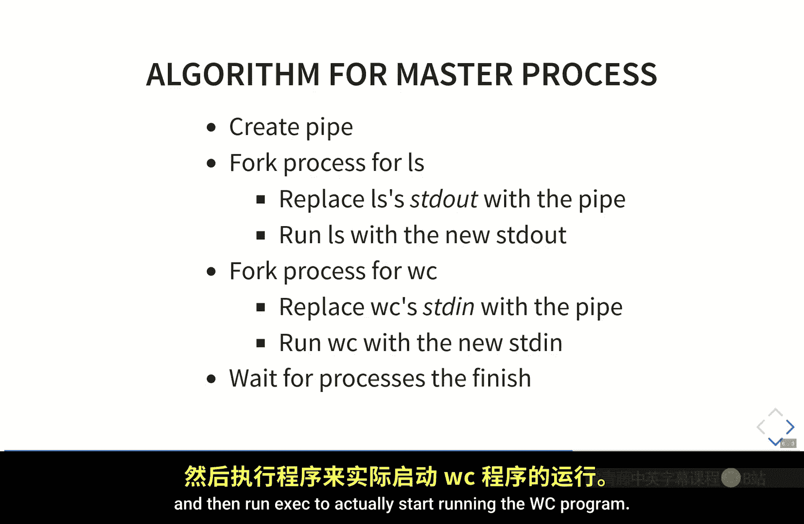
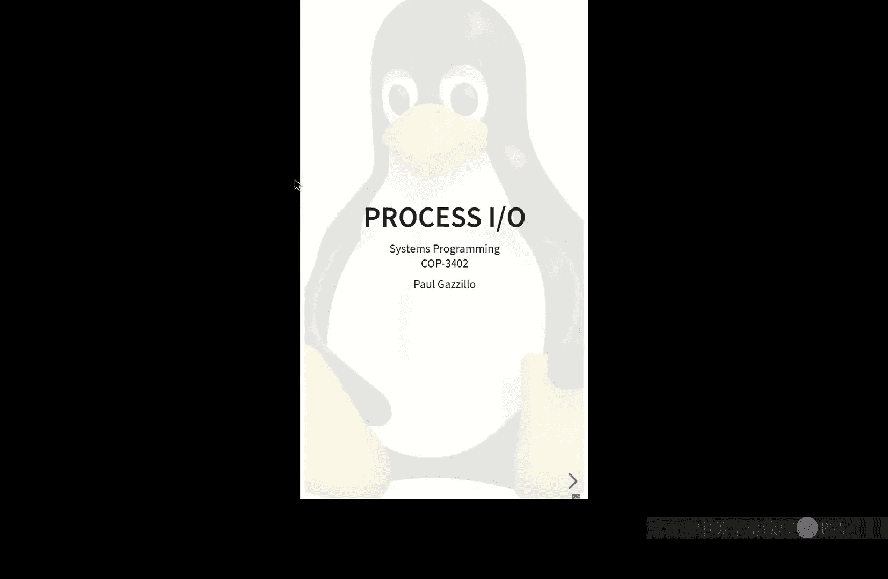
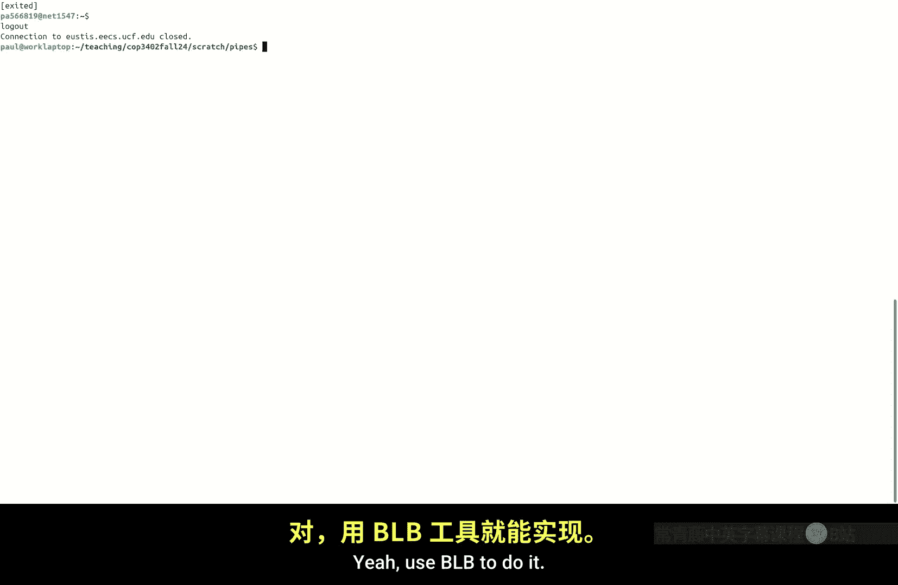
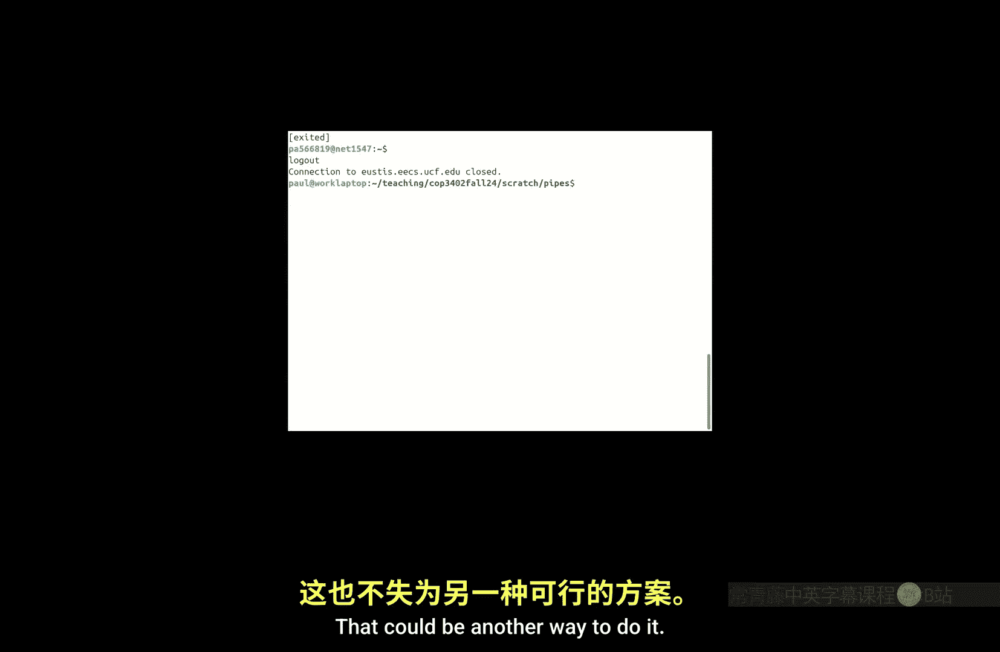
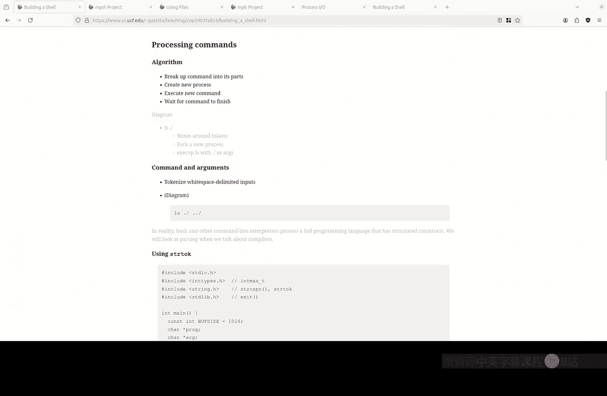

# 013：构建一个Shell (COP-3402 Fall 2024)

在本节课中，我们将学习如何构建一个简单的命令行Shell。我们将重点讲解进程创建、管道（pipe）和输入/输出重定向的核心概念，这些都是系统编程的基础。通过理解这些机制，你将能够实现一个可以运行命令、连接多个命令（管道）以及重定向输入/输出的基本Shell程序。

---

## 回顾与项目提醒

上一节我们介绍了系统编程的基础。现在，我们来看看当前的项目 `myLS`。这个项目旨在让你熟悉系统调用的使用，例如 `readdir`、`stat` 等，来列出目录内容。

以下是关于 `myLS` 项目的一些要点澄清：
*   项目使用 Git 提交，请遵循提交说明。
*   你可以使用标准 C 库函数（如 `malloc`, `strcat`）和 `ctype.h` 中的函数（如 `isprint`）来检查可打印字符。
*   核心算法是遍历目录，对每个文件使用 `stat` 系统调用获取信息（如硬链接数），然后格式化输出。
*   建议采用“分步细化”的编程方法：先写算法步骤或注释，再逐个实现和测试，而不是一次性编写整个程序。
*   程序架构可以自由设计，只要能够通过提供的 `Makefile` 正确构建和运行。

如果对项目有具体问题，请参加本周的答疑时间。

---





## 管道（Pipe）与进程间通信

在理解了基本的文件操作后，本节我们来看看如何实现进程间的通信，这是Shell实现管道的核心。

### 什么是管道？

在Unix内核中，**管道**是一种特殊的文件，它允许一个进程写入数据，另一个进程读取这些数据。内核在内存中维护一个缓冲区来存储这些数据。管道是实现命令行中 `|` 符号功能的基础。

### 如何创建管道？

在C语言中，使用 `pipe` 系统调用来创建管道。

**代码示例：创建管道**
```c
int pipefd[2]; // pipefd[0] 用于读取，pipefd[1] 用于写入
if (pipe(pipefd) == -1) {
    // 错误处理
    perror("pipe");
    exit(EXIT_FAILURE);
}
```
`pipe` 调用成功后会填充一个包含两个文件描述符的数组：`pipefd[0]` 是管道的**读取端**，`pipefd[1]` 是管道的**写入端**。

---

## Shell 中管道的实现算法

现在，我们探讨Shell如何利用 `fork`、`exec`、`pipe` 和 `dup2` 这些系统调用，来实现像 `ls | wc -l` 这样的管道命令。

我们的目标是编写一个名为 `mySH` 的Shell程序。假设我们要执行 `ls | wc -l`，以下是 `mySH` 需要完成的核心步骤：

1.  **创建管道**：调用 `pipe(pipefd)`。此时，`mySH` 进程拥有了管道读写端的文件描述符。
2.  **创建第一个子进程（用于 `ls`）**：
    *   调用 `fork()` 创建新进程。子进程是 `mySH` 的副本，继承了所有打开的文件描述符，包括管道。
    *   在子进程中：
        a. 使用 `dup2(pipefd[1], STDOUT_FILENO)` 将标准输出重定向到管道的写入端。这样，`ls` 的输出就不会打印到终端，而是进入管道。
        b. 关闭不需要的管道端（例如，关闭 `pipefd[0]`）。
        c. 调用 `execvp(“ls”, args)` 来执行 `ls` 程序，替换当前子进程的代码。
3.  **创建第二个子进程（用于 `wc`）**：
    *   在父进程（`mySH`）中，再次调用 `fork()` 创建第二个子进程。
    *   在第二个子进程中：
        a. 使用 `dup2(pipefd[0], STDIN_FILENO)` 将标准输入重定向到管道的读取端。这样，`wc` 将从管道读取数据，而不是从终端。
        b. 关闭不需要的管道端（例如，关闭 `pipefd[1]`）。
        c. 调用 `execvp(“wc”, args)` 来执行 `wc` 程序。
4.  **父进程等待**：
    *   在父进程中，关闭所有管道端（因为父进程本身不需要读写管道）。
    *   调用 `wait()` 或 `waitpid()` 系统调用，等待所有子进程执行完毕，防止它们变成“僵尸进程”。

**关键点理解**：
*   `fork()` 复制整个进程，包括文件描述符表。因此，子进程可以访问父进程创建的管道。
*   `dup2(old_fd, new_fd)` 的作用是让文件描述符 `new_fd` 成为 `old_fd` 的一个副本（指向同一个打开的文件）。通过让 `STDOUT_FILENO` (通常是1) 成为管道写入端的副本，就实现了输出重定向。
*   `exec()` 系列函数用新程序替换当前进程的代码段，但**保留进程的其他属性**，如进程ID、打开的文件描述符表等。这正是重定向能生效的原因。
*   文件重定向（如 `ls > output.txt`）的原理与此类似，只是将 `dup2` 的目标从一个管道文件描述符换成了一个普通文件的文件描述符。

---

## 分步实现与编程方法

上一节我们介绍了管道实现的整体算法，本节中我们来看看如何用代码具体实现，并介绍一种有效的编程方法：“分步细化”或“乌龟策略”。

不要试图一次性写出所有代码。相反，应该将问题分解，逐步实现和测试。





以下是实现管道第一步的示例思路：

1.  **从注释和核心调用开始**：先写下你最确定要做的事。
    ```c
    // 创建管道
    int pipefd[2];
    pipe(pipefd);

    // 创建第一个子进程运行 ls
    pid_t pid = fork();
    if (pid == 0) {
        // 在子进程中
        // 重定向标准输出到管道写端
        dup2(pipefd[1], STDOUT_FILENO);
        // 关闭不需要的管道端
        close(pipefd[0]);
        close(pipefd[1]);
        // 执行 ls
        char *args[] = {“ls”, NULL};
        execvp(“ls”, args);
        // 如果 execvp 失败
        perror(“execvp”);
        exit(EXIT_FAILURE);
    } else if (pid > 0) {
        // 在父进程中，继续创建第二个子进程...
    } else {
        // fork 失败
        perror(“fork”);
        exit(EXIT_FAILURE);
    }
    ```
2.  **先搭建框架，再填充细节**：比如，你可能不确定 `execvp` 的参数如何从用户输入解析。你可以先硬编码一个命令（如 `ls`），确保管道和重定向部分能工作。
3.  **编译和测试每一个小步骤**：每写完一小部分功能就立即编译运行，检查是否有语法错误或逻辑问题。使用工具如 `tmux` 或 `screen` 来分屏编辑和测试。
4.  **处理用户输入**：在管道逻辑正确后，再增加从标准输入读取命令行、解析命令和参数（例如使用 `strtok` 函数）的功能。
5.  **错误处理**：为所有系统调用添加基本的错误检查（检查返回值是否为 `-1` 并使用 `perror` 打印错误信息）。

这种方法的优势在于，你将复杂任务分解为可管理的小块，每次只专注于解决一个问题，并通过即时测试快速反馈，避免在调试时面对大量混乱的代码。

对于 `mySH` 项目，你可以按照类似的步骤进行：首先实现运行单个命令，然后实现输入/输出重定向，最后实现管道连接多个命令。

---

## 总结

本节课中我们一起学习了构建一个简单Shell的核心机制。
*   我们回顾了 `myLS` 项目，强调了分步实现和测试的重要性。
*   我们深入讲解了**管道**的概念，它是内核提供的一种进程间通信机制。
*   我们详细分析了Shell执行 `ls | wc -l` 这样的管道命令时，内部如何通过 `fork`、`exec`、`pipe` 和 `dup2` 系统调用协同工作，实现进程创建、输出重定向和输入重定向。
*   最后，我们介绍了一种实用的“分步细化”编程方法，鼓励你先设计算法、写注释，再逐步编码和测试，从而更清晰、更高效地完成系统编程项目。



理解这些原理是完成 `mySH` 项目的基础。请务必动手实践，从运行单个命令开始，逐步增加功能。