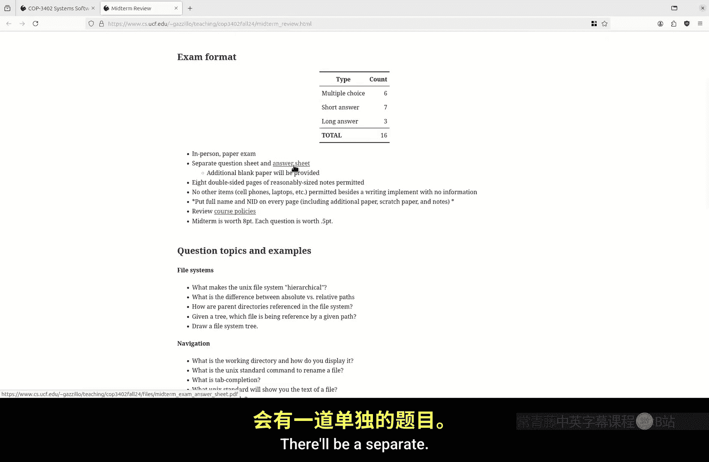
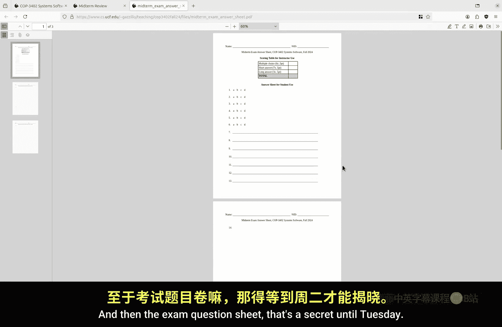
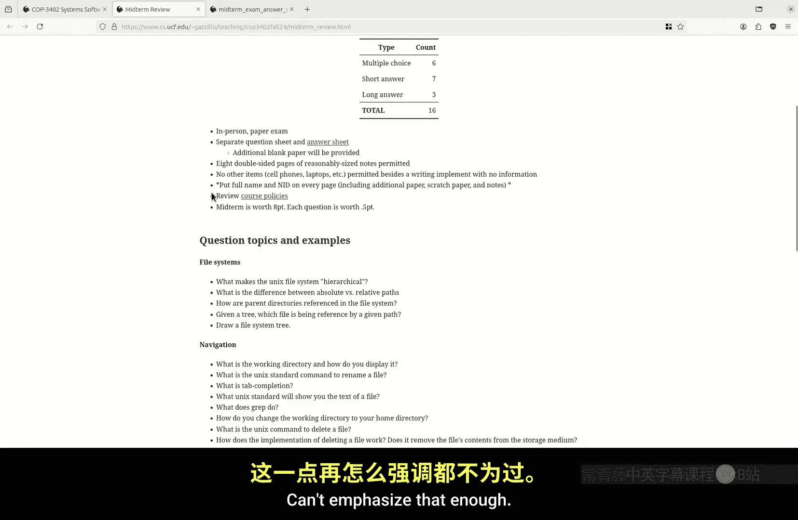
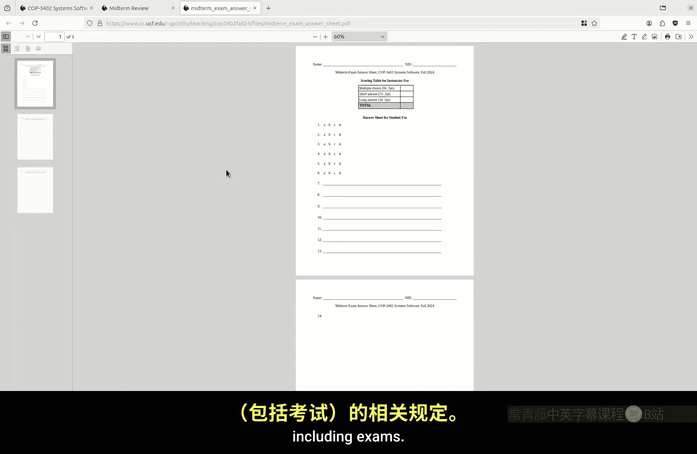
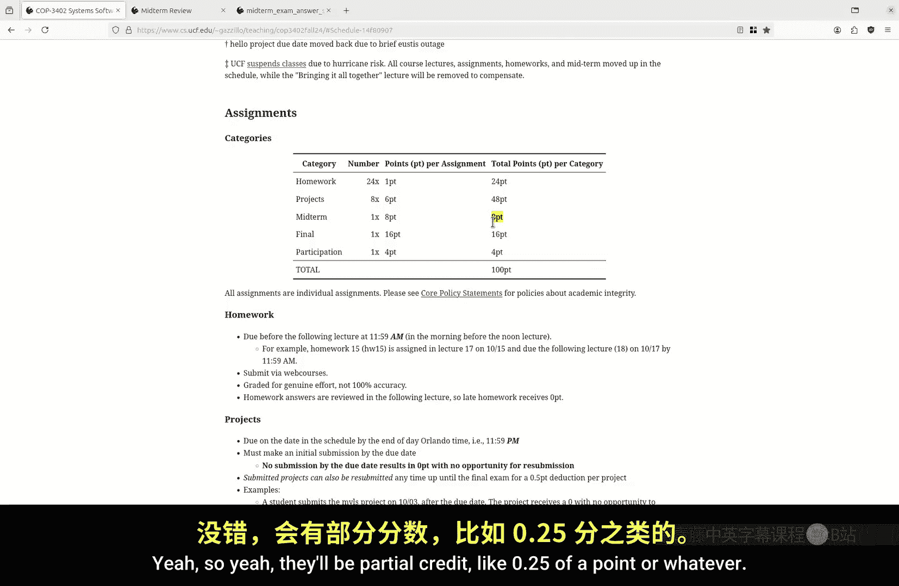
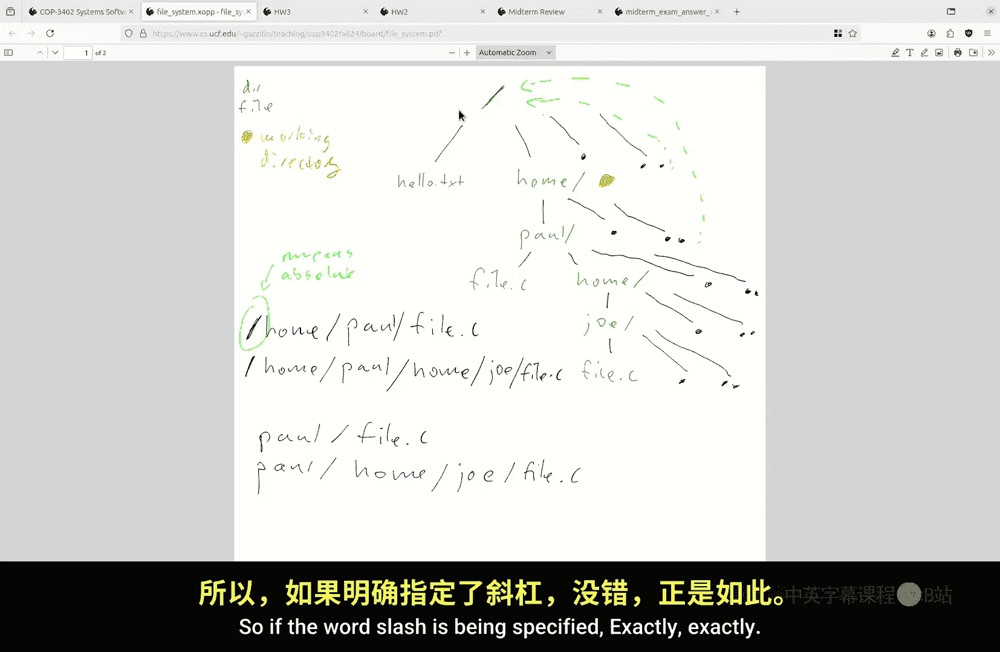
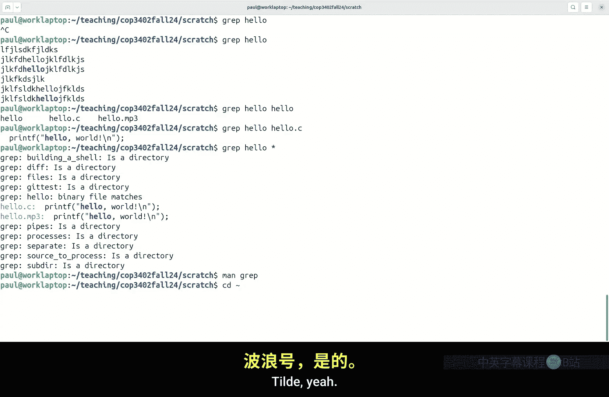
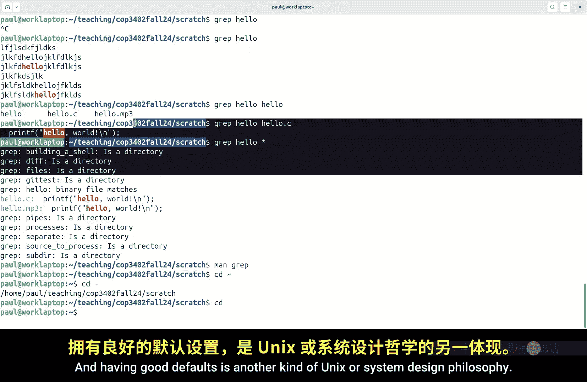
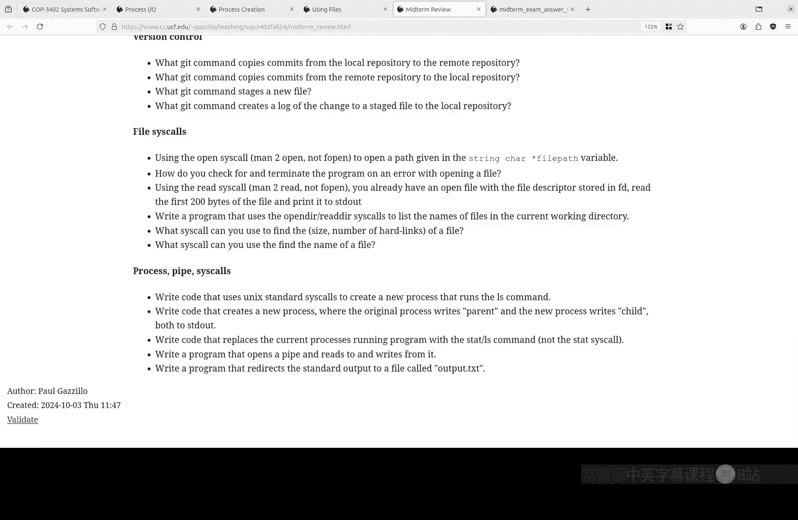

# 014：期中复习 (COP-3402 Fall 2024)

在本节课中，我们将回顾期中考试所需的所有知识点。考试内容涵盖作业、项目和课堂讲授的内容。我们将逐一讲解考试中可能出现的各类问题，并确保你理解所有核心概念。



## 考试形式与规则



上一节我们介绍了课程概述，本节中我们来看看考试的具体形式和规则。





考试将于下周二线下进行。如果你有SAS的特殊考试安排，相关材料将被上传，你可以在指定地点完成考试。如果你需要调整考试时间，请务必提前与我沟通，我们将安排补考。



以下是考试的基本信息：

*   **考试内容**：涵盖作业、项目和课堂讲授的所有内容。
*   **允许携带的笔记**：你可以携带最多8张双面打印的A4纸大小的笔记。笔记内容不应包含完整的答案或试图猜测考题。
*   **考试结构**：考试包含6道选择题、7道简答题和3道论述题。论述题可能涉及编写代码、描述算法或绘制文件树等。
*   **答题纸**：考试将使用单独的答题纸，以便于批改。请务必在**每一页**答题纸上写上你的全名和学号。
*   **考试时长与分值**：考试时长为80分钟，总分8分（占课程总成绩的8%）。每道题价值0.5分，评分时会考虑部分正确的情况。
*   **考试纪律**：请严格遵守课程关于作弊和未经授权协助的政策。

## 文件系统

上一节我们了解了考试规则，本节中我们来看看文件系统的核心概念。



Unix文件系统是**分层**的。这意味着文件系统像一棵树一样组织，目录可以包含文件和其他目录。

*   **目录**是一种特殊类型的文件，其内容是一个映射表（或字典），将文件名关联到对应的文件。
*   由于目录本身也是文件，并且可以包含其他目录，因此可以构建出这种树形（或更准确地说是**有向无环图**）的层次结构。

在文件系统的上下文中，**路径**是定位文件的地址。

*   **绝对路径**：从根目录（`/`）开始。例如：`/home/paul/joe.txt`。
*   **相对路径**：从当前工作目录开始，不以斜杠开头。例如：如果当前在`/home/paul`，那么`joe.txt` 和 `./joe.txt` 指向同一个文件。

以下是路径相关的特殊符号：

*   `.` （点）：代表当前目录本身。
*   `..` （点点）：代表父目录。





你可能会被要求根据给定的文件树结构，写出某个文件的绝对路径或相对路径。

## 命令行导航与操作

理解了文件系统结构后，我们需要知道如何在其中移动和操作文件。

以下是一些基本的Bash命令：

*   `pwd`：打印当前工作目录。
*   `cd`：改变当前工作目录。`cd ~` 或 `cd` 可返回家目录。`cd -` 可返回上一个目录。
*   `mv`：移动或重命名文件。语法：`mv <旧名称> <新名称>`。
*   `rm`：删除文件。注意，`rm` 只是从目录中移除条目，文件数据可能仍留在磁盘上，直到被覆盖。
*   `ls`：列出目录内容。
*   `cat`：连接并打印文件内容到标准输出。
*   `grep`：在文件中搜索匹配指定模式（字符串或正则表达式）的行。
*   `wc`：统计文件的行数、单词数和字节数。
*   `touch`：如果文件不存在则创建空文件；如果存在，则更新其访问和修改时间戳。

**Tab补全**是一个提高效率的技巧：输入命令或文件名的一部分后按Tab键，Bash会尝试自动补全。如果没有唯一匹配项，按两次Tab会显示所有可能的选项。

## 进程与输入/输出重定向

在命令行中，我们经常需要管理进程和数据流。

*   **重定向**：
    *   `command > file`：将命令的标准输出重定向到文件（覆盖）。
    *   `command >> file`：将命令的标准输出追加到文件。
    *   `command < file`：将文件内容作为命令的标准输入。
*   **管道**：`command1 | command2`。将 `command1` 的标准输出作为 `command2` 的标准输入。例如：`ls | wc -l` 可以统计当前目录下的文件数量。
*   **编辑器**：在命令行中编辑文件，常用 `vim` 或 `emacs`。例如，用 `vim filename` 打开文件，在 `vim` 中按 `:wq` 保存并退出。

## 构建自动化 (Make)

对于多文件项目，手动编译很繁琐。`make` 工具可以自动化构建过程。

一个 `Makefile` 规则的基本语法如下：

```makefile
target: prerequisites
    recipe
```

*   **目标**：规则要生成的文件名（例如，可执行程序 `main`）。
*   **前置条件**：生成目标文件所依赖的其他文件（例如，`main.c`, `helper.c`）。
*   **配方**：生成目标文件需要执行的一系列shell命令（例如，`gcc main.c helper.c -o main`）。

`make` 会根据文件的时间戳判断哪些目标需要重新构建。一个常见的约定是定义一个 `clean` 目标，用于删除所有生成的文件：

```makefile
clean:
    rm -f main *.o
```

## 版本控制 (Git)

版本控制系统帮助我们管理代码的变更历史。

以下是Git的基本命令：

*   `git add <file>`：将文件的更改添加到暂存区。
*   `git commit -m "message"`：将暂存区的更改提交到本地仓库，并附上描述信息。
*   `git push`：将本地仓库的提交推送到远程仓库。
*   `git pull`：从远程仓库拉取更新到本地仓库。
*   `git clone <url>`：克隆一个远程仓库到本地。

## 系统调用

系统调用是程序与操作系统内核交互的接口。

**打开文件**：使用 `open` 系统调用。
```c
int fd = open(“filepath”, O_RDONLY); // 以只读方式打开
if (fd == -1) {
    perror(“open failed”); // 错误处理
}
```
**错误检查**：系统调用（如 `open`, `read`, `write`）通常通过返回 `-1` 来表示失败。应检查返回值，并使用 `perror` 打印错误信息，而不是直接检查 `errno`。

**读取文件**：使用 `read` 系统调用。
```c
char buffer[200];
ssize_t bytes_read = read(fd, buffer, sizeof(buffer) - 1);
if (bytes_read == -1) { /* 处理错误 */ }
buffer[bytes_read] = ‘\0’; // 假设是文本
```

**读取目录**：使用 `opendir`, `readdir`, `closedir` 函数（它们是库函数，但底层使用系统调用）。
```c
DIR *dir = opendir(“.”);
struct dirent *entry;
while ((entry = readdir(dir)) != NULL) {
    printf(“%s\n”, entry->d_name);
}
closedir(dir);
```

**获取文件信息**：使用 `stat` 系统调用获取文件大小、权限等元数据。

## 进程管理

操作系统通过进程来运行程序。

**创建新进程**：在Unix中，创建新进程运行不同程序需要两个步骤：
1.  `fork()`：复制当前进程，创建一个几乎完全相同的子进程。区分父子进程的依据是 `fork()` 的返回值：
    *   在子进程中返回 `0`。
    *   在父进程中返回子进程的PID（>0）。
    *   出错时返回 `-1`。
2.  `exec()` 系列函数：将当前进程的映像替换为新的程序文件。它不创建新进程，只是“换脑”。

**示例：创建父子进程**
```c
pid_t pid = fork();
if (pid == 0) {
    // 子进程代码
    printf(“child\n”);
} else if (pid > 0) {
    // 父进程代码
    printf(“parent\n”);
} else {
    perror(“fork failed”);
}
```

**管道**：管道用于进程间通信。`pipe()` 系统调用创建一个管道，返回两个文件描述符：`pipefd[0]` 用于读，`pipefd[1]` 用于写。
```c
int pipefd[2];
pipe(pipefd);
write(pipefd[1], “Hello”, 6);
char buf[10];
read(pipefd[0], buf, 10);
```

**重定向标准输出**：使用 `dup2()` 系统调用可以将一个文件描述符复制到另一个。例如，将标准输出（文件描述符1）重定向到一个文件：
```c
int fd = open(“output.txt”, O_WRONLY | O_CREAT, 0644);
dup2(fd, STDOUT_FILENO); // 现在 printf 会写入文件
close(fd);
```

## 总结



本节课中我们一起学习了期中考试的核心知识点。我们回顾了：
1.  Unix文件系统的层次结构、路径和基本操作命令。
2.  进程的概念、输入/输出重定向和管道。
3.  使用 `make` 进行构建自动化。
4.  Git版本控制的基本工作流。
5.  关键的系统调用，如 `open`、`read`、`write`、`fork`、`exec`、`pipe` 和 `dup2`，以及如何进行错误处理。
请结合课堂代码片段、作业和项目进行复习，重点理解概念而非死记硬背细节。祝你考试顺利！