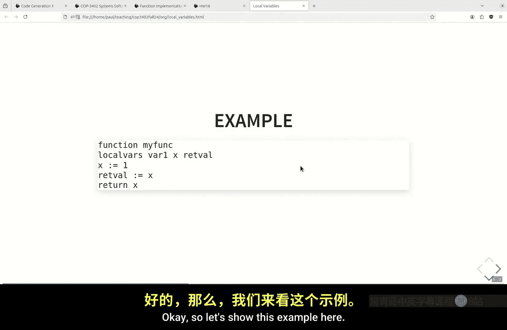
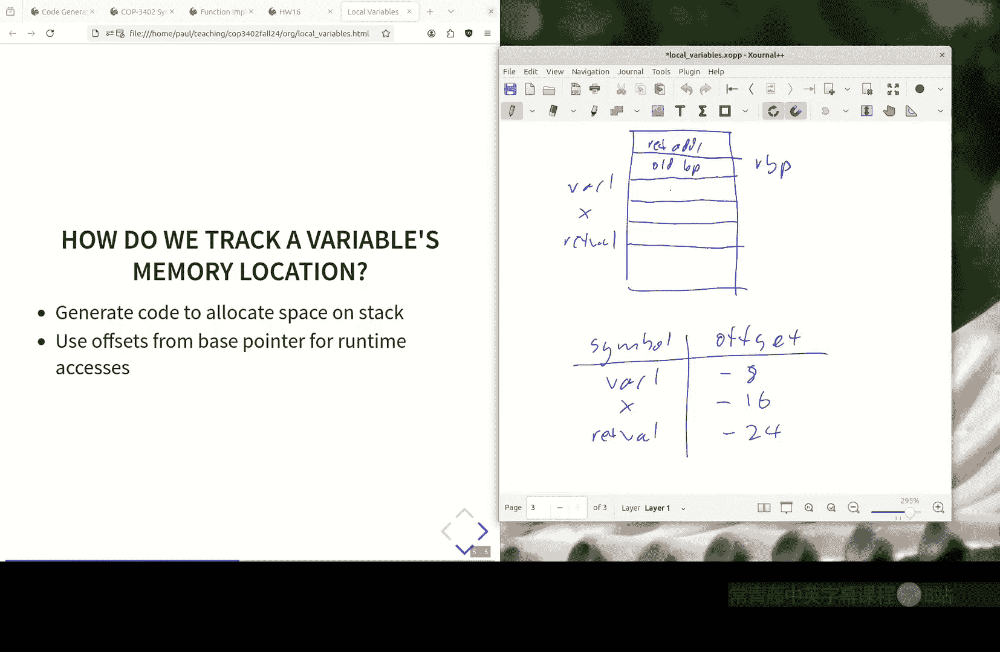
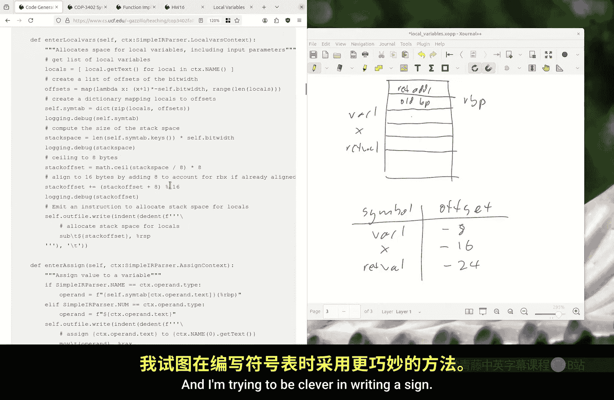
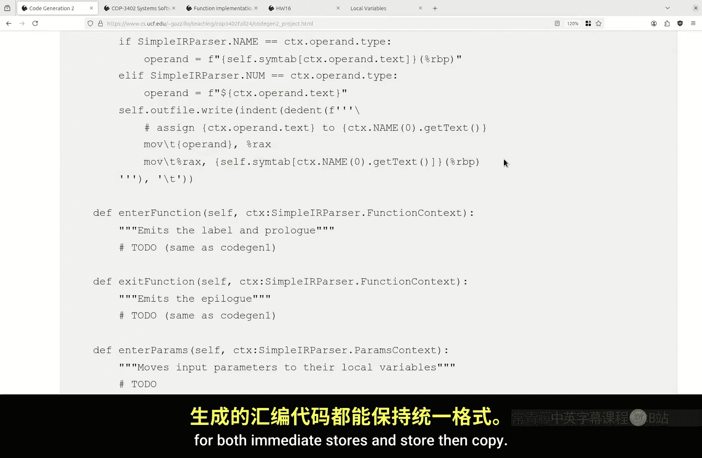
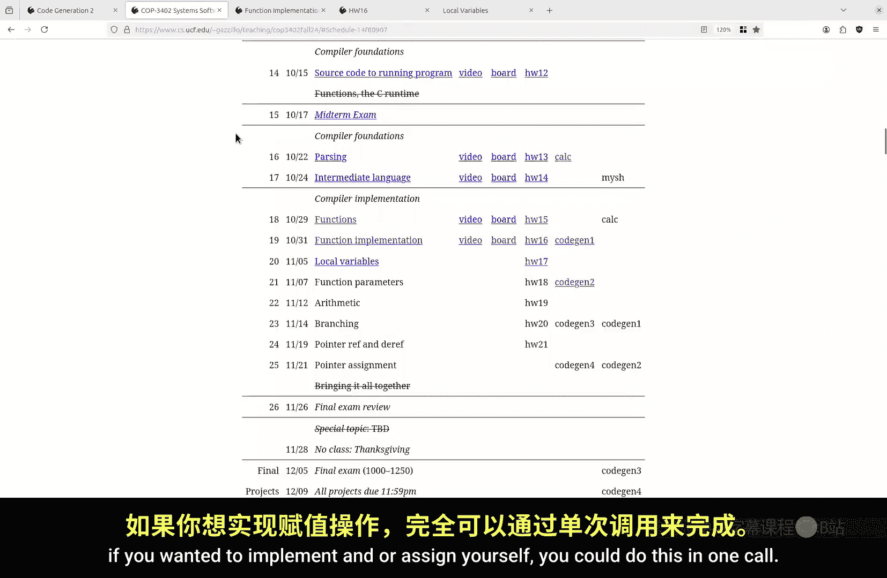
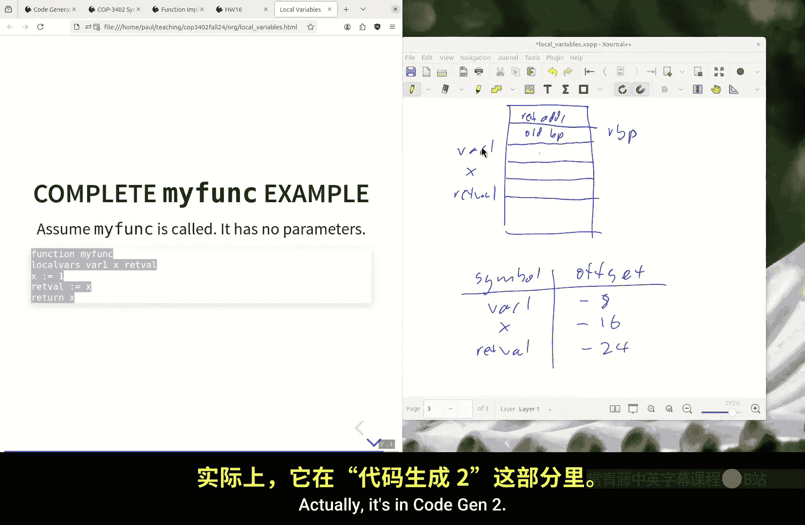
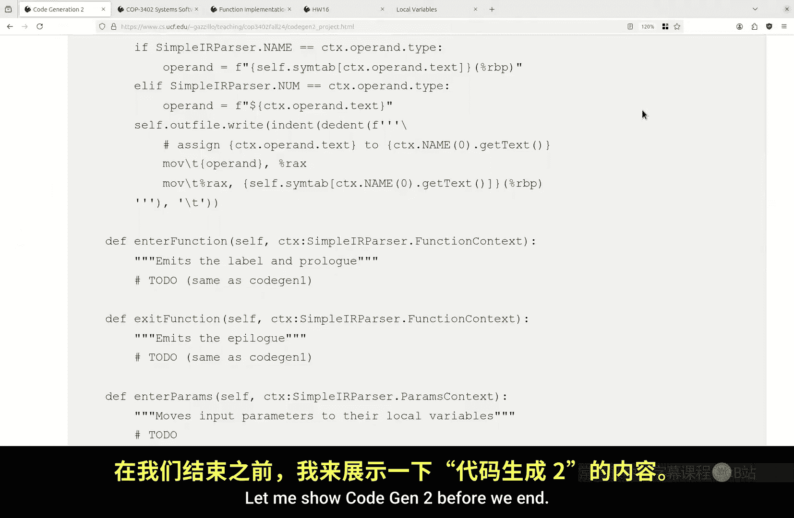
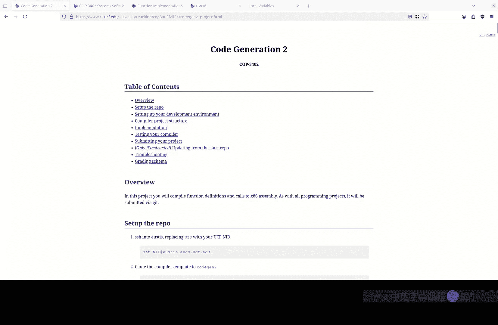

# 020：编译器实现 - 局部变量 (COP-3402 Fall 2024)

在本节课中，我们将学习编译器如何实现函数中的局部变量。我们将探讨如何生成汇编代码，以便在运行时为局部变量分配内存，并实现对它们的读写操作。

---

## 回顾函数实现

上一节我们介绍了函数在计算世界中的抽象概念，以及如何在汇编层面实现函数调用。我们了解到，通过使用栈，可以为每次函数调用创建一个独立的栈帧，从而管理局部状态和实现递归。

本节中，我们来看看如何管理函数内部的局部变量，以及如何生成代码来读写与这些变量关联的内存位置。

以下是函数实现的核心组成部分回顾：

*   **序言**：在函数开始时执行，用于建立新的栈帧。主要包括保存旧的基指针（RBP）、设置新的基指针以及保存调用者保存的寄存器。
*   **调用**：使用 `call` 指令，它会将返回地址压入栈中，然后跳转到目标函数。
*   **返回**：在高级语言中，`return` 语句对应汇编中的两步操作：首先将返回值移动到约定好的寄存器（如 RAX），然后执行收尾工作。
*   **收尾**：在函数结束时执行，用于拆除当前栈帧并恢复调用者的上下文。主要包括恢复栈指针（RSP）、恢复旧的基指针（RBP），最后执行 `ret` 指令返回到调用者。

---

## 编译时与运行时

理解编译器和生成代码的运行方式之间的区别至关重要。

*   **编译时**：这是编译器运行并生成汇编代码的阶段。编译器只是根据规则输出文本字符串，它本身并不执行这些代码，也不直接管理栈帧。
*   **运行时**：这是由操作系统和CPU执行编译器生成的汇编代码的阶段。此时，根据生成的指令，才会动态地创建和管理栈帧。

编译器的巧妙之处在于，它生成的代码能够在运行时表现出我们期望的栈帧管理行为，尽管在编译时我们并不知道具体的栈地址。

---

## 局部变量的存储

在C语言风格的函数中，局部变量存储在栈帧上。根据我们使用的应用程序二进制接口（ABI），栈帧的结构是固定的。

一个典型的栈帧包含以下部分（从高地址到低地址增长）：
1.  调用者的栈帧信息。
2.  返回地址（由 `call` 指令压入）。
3.  旧的基指针（RBP，在序言中保存）。
4.  （可选）保存的寄存器。
5.  **局部变量区域**。
6.  （可选）参数区域（下次课讨论）。

由于每次函数调用时，基指针（RBP）都指向栈帧中一个固定的位置（保存旧RBP的地方），因此我们可以利用这个特性来访问局部变量。

---

## 符号表与地址计算

在编译时，我们无法知道运行时栈的具体地址。但是，我们知道每个局部变量相对于当前栈帧基指针（RBP）的偏移量。

编译器会维护一个**符号表**，它在编译时记录每个局部变量名称到其固定偏移量的映射。

例如，对于一个有三个局部变量 `x`， `y`， `z` 的函数，我们可能会分配：
*   `x` 在 `RBP - 8`
*   `y` 在 `RBP - 16`
*   `z` 在 `RBP - 24`

这些偏移量在编译时就可以确定，因为局部变量的数量和大小（在我们的简单IR中，假设都是8字节）是已知的。

---

## 生成变量访问代码

有了符号表和固定的基指针偏移量，我们就可以将高级语言中的变量访问翻译成汇编指令。



X86汇编（AT&T语法）提供了灵活的内存寻址模式。形式为 `偏移量(基址寄存器)` 的操作数可以计算内存地址。

### 变量赋值（存储）

将立即数赋值给变量（例如 `x = 1`）需要两个步骤：
1.  将值加载到临时寄存器。
2.  将寄存器的值存储到变量的内存位置。



对应的汇编代码可能如下：
```assembly
movq $1, %rax          # 将立即数1移动到RAX寄存器
movq %rax, -16(%rbp)   # 将RAX的值存储到地址为 RBP - 16 的内存中（假设x的偏移是-16）
```

### 变量间赋值（加载与存储）

将一个变量的值赋给另一个变量（例如 `y = x`）也需要两步：
1.  从源变量的内存地址加载值到寄存器。
2.  将寄存器的值存储到目标变量的内存地址。

对应的汇编代码可能如下：
```assembly
movq -16(%rbp), %rax   # 从地址 RBP - 16 加载值到RAX（加载x的值）
movq %rax, -24(%rbp)   # 将RAX的值存储到地址 RBP - 24（存储到y）
```

**关键点**：
*   当变量作为**源**（在赋值号右边）时，它对应一个**加载**操作，操作数在 `mov` 指令的**左侧**。
*   当变量作为**目标**（在赋值号左边）时，它对应一个**存储**操作，操作数在 `mov` 指令的**右侧**。



---






## 更新函数序言

为了给局部变量预留栈空间，我们需要扩展函数的序言代码。在设置了RBP之后，我们需要调整栈指针（RSP）来“分配”空间。

这通常通过从RSP减去一个总字节数来实现：
```assembly
subq $24, %rsp  # 为3个8字节的局部变量分配24字节空间
```
这条指令在运行时执行，会扩大当前栈帧，为局部变量 `x`， `y`， `z` 留出空间。

---

## 总结





本节课中我们一起学习了编译器实现局部变量的核心机制：

1.  **栈帧管理**：通过函数序言和收尾，在运行时动态创建和销毁栈帧，为局部变量提供存储空间。
2.  **基指针关键作用**：利用RBP作为栈帧的稳定参考点，所有局部变量都通过相对于RBP的固定偏移量来访问。
3.  **符号表**：编译器在编译时维护一个数据结构，将变量名映射到其对应的栈帧偏移量。
4.  **代码生成模式**：
    *   **存储**（赋值）：`movq $value, %rax` + `movq %rax, offset(%rbp)`
    *   **加载**（读取）：`movq offset(%rbp), %rax`
    *   变量间赋值是加载和存储的组合。



通过这种方式，编译器能够生成不依赖于绝对内存地址的代码，这些代码在运行时能正确访问属于当前函数调用的局部变量，即使存在递归或多次调用，每个调用实例的变量都能被独立且正确地访问。下一节，我们将探讨如何为函数传递参数。