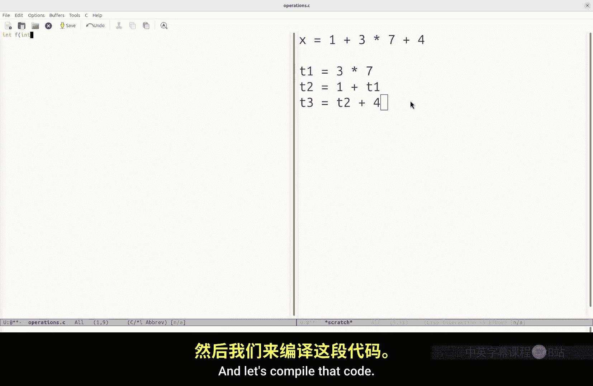
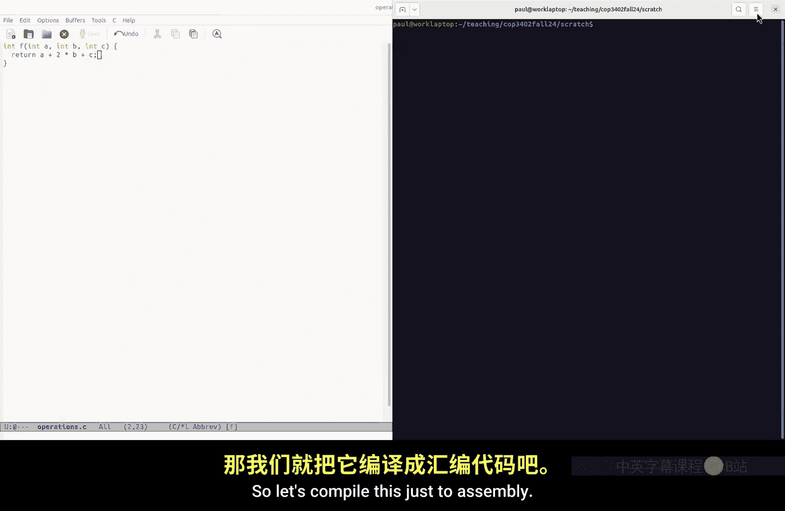
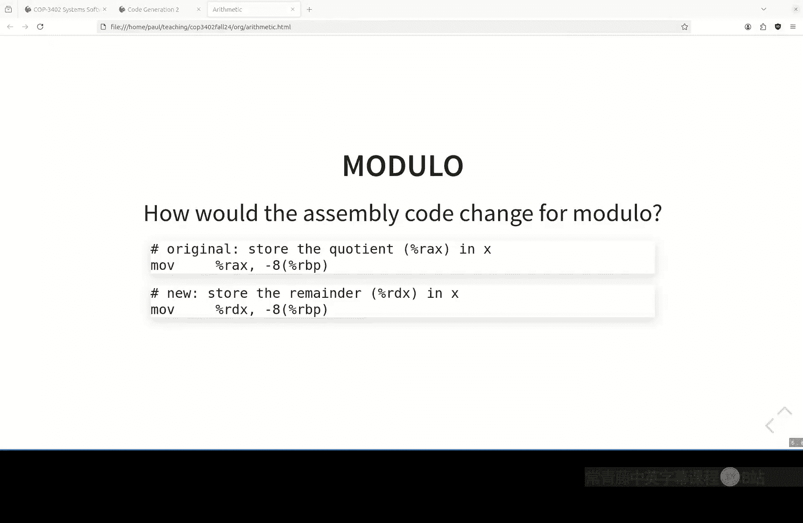

# 022：编译器实现 - 算术与函数调用 🧠

在本节课中，我们将学习如何为简单IR语言中的算术运算和函数调用生成x86-64汇编代码。我们将回顾函数参数传递的约定，并通过具体示例展示如何将高级语言结构转换为底层的机器指令。

---

## 函数调用与参数传递 📞

上一节我们介绍了编译器的基础结构，本节中我们来看看如何处理函数调用和参数传递。我们使用Code Gen2项目中的示例来回顾带参数的函数。

有两个IR文件。一个函数名为 `main`，另一个函数名为 `param_test`。`main` 函数有多个局部变量，其中八个将作为参数传递给 `param_test` 函数。我们为这些参数分别赋值1到8，然后调用 `param_test` 并传递这八个参数，将返回值保存在变量 `x` 中。

以下是这个简单IR程序的行为：
*   `main` 调用 `param_test`。
*   `param_test` 定义了自己的局部变量集。即使某些变量名与 `main` 中的相同，它们也是该函数局部的，并非同一变量。
*   该函数有八个指定参数。这个版本的函数只是将 `x` 赋值为参数 `c`。
*   你可以通过将返回值赋给不同的参数（例如 `g` 或 `h`，它们是栈分配的）来测试你的程序，确保正确的值被传回 `main`。

这个最简单的程序用于验证函数参数是否正确传递以及返回值是否正确返回。

---

### 函数调用的代码生成

现在，让我们看看如何为这些函数生成代码。记住，对于同一个输入程序，存在许多（技术上可能是无限个）等价的汇编程序。我将展示一种我认为易于生成的方法，如果你遵循Code Gen项目中的实现建议，生成代码会更容易。

在简单IR中，当遇到函数声明时，编译器中的哪个Python函数会被调用？答案是 `enter_function`。`enter_function` 为语言中的这个结构生成代码。它生成函数的序言（prologue）。

以下是生成序言和局部变量空间的步骤：
*   **序言**：由 `enter_function` 方法生成，处理函数声明和序言代码。
*   **局部变量**：`enter_local_vars` 函数生成在栈帧上为局部变量分配空间的代码。

**栈帧** 是什么？它是用栈实现的，包含了函数调用相关的所有数据：局部变量、参数、返回地址以及旧的基指针（base pointer）。旧的基指针存储起来是为了在返回时恢复调用者的基指针。

`enter_local_vars` 生成的代码会在栈帧上为所有局部变量分配空间。例如，如果有11个局部变量（每个8字节），并且考虑16字节对齐的要求，可能会分配88字节的空间。

---

### 处理参数

参数如何处理？在System V AMD64 ABI调用约定中，前六个整数或指针参数通过寄存器传递（`RDI`, `RSI`, `RDX`, `RCX`, `R8`, `R9`），其余的参数通过栈传递。

在编译器中，我推荐一种简单的实现方式：在函数入口处，立即将所有传入的参数（无论是来自寄存器还是栈）复制到为其分配的局部变量空间（栈帧上的特定偏移处）。这样，函数体内可以统一将所有参数视为局部变量来访问，简化了编译器的编写。

编译器通过一个符号表来跟踪每个变量（包括参数）相对于基指针 `RBP` 的偏移量。例如，第一个局部变量可能在 `RBP-8`，第二个在 `RBP-16`，依此类推。参数被复制到对应的偏移位置。

---

### 生成函数调用代码

当生成函数调用（如 `call param_test`）的代码时，需要遵循以下步骤：

以下是调用者（caller）需要完成的任务：
1.  **设置参数**：根据调用约定，将前六个参数放入指定的寄存器，剩余的参数以降序压入栈中。
2.  **执行调用**：使用 `call` 指令。`call` 指令会自动将返回地址压栈，并跳转到目标函数。
3.  **清理栈空间**：调用返回后，调用者负责清理之前为超出寄存器数量的参数所压入的栈空间（例如，通过 `add $16, %rsp` 来弹出两个8字节参数）。
4.  **处理返回值**：根据约定，返回值存储在 `RAX` 寄存器中。调用者可以将 `RAX` 的值保存到自己的局部变量中。

例如，对于八个参数的调用，前六个（a-f）通过寄存器传递，后两个（g, h）以降序（先h后g）压栈。调用后的 `add $16, %rsp` 就对应之前的两步 `push` 操作。

---

### 被调用者（Callee）的视角

从被调用函数（如 `param_test`）的角度看：
*   **序言**：建立自己的栈帧（`push %rbp`; `mov %rsp, %rbp`），并为局部变量分配栈空间。
*   **获取参数**：将寄存器中的参数（`RDI`等）和栈上的参数（位于 `RBP+16`, `RBP+24` 等偏移处）复制到为本函数局部变量预留的栈空间位置（负偏移处）。这样函数体内可以像使用局部变量一样使用它们。
*   **函数体**：执行实际的操作（如赋值）。
*   **设置返回值**：将返回值放入 `RAX` 寄存器。
*   **尾声（epilogue）**：恢复栈指针和基指针，然后 `ret` 返回。

栈上参数的偏移计算：`RBP` 指向当前栈帧基址，`RBP+8` 是返回地址，`RBP+16` 是第一个栈传递的参数，`RBP+24` 是第二个，以此类推。参数以逆序压栈确保了第一个栈参数具有最小的正偏移量。

---

### 与C语言的互操作性 🔗

遵循统一的调用约定的好处是可以实现跨语言调用。例如，我们可以用简单IR编写一个函数，然后从C程序中调用它，反之亦然。

考虑一个用简单IR编写的乘法函数 `mult`，它接收两个参数并返回它们的乘积。其生成的汇编代码会从 `RDI` 和 `RSI` 获取参数，将结果存入 `RAX`。

在C程序中，我们可以声明 `int mult(int a, int b);`，然后调用它。GCC编译C代码时，也会将参数放入 `EDI`/`RDI` 和 `ESI`/`RSI`，并使用 `call mult`。链接器会将两者链接起来，程序就能正确运行。

同样，我们也可以在简单IR程序中调用用C编写的辅助函数（如 `print_int`、`read_int`），只要它们遵循相同的调用约定。这通过链接器解析未定义符号来实现，头文件（.h）仅用于C编译器进行类型检查。

---

## 算术运算的代码生成 ➕➖✖️➗

上一节我们探讨了函数调用，本节中我们来看看如何为算术运算生成代码。

简单IR中的算术运算语句格式如下：
```
x = a + b
```
其中：
*   `x` 是目标变量。
*   `a` 是第一个操作数（可以是变量或常量）。
*   `+` 是运算符（支持 `+`, `-`, `*`, `/`, `%`）。
*   `b` 是第二个操作数（可以是变量或常量）。

我们的任务是将这样的语句转换为x86-64汇编指令。大多数算术指令直接在寄存器上操作，因此需要“加载-运算-存储”三个步骤。

---

### 加法示例

以 `x = a + b` 为例，假设 `a` 在 `RBP-16`，`b` 在 `RBP-24`，`x` 在 `RBP-8`。

生成代码如下：
```assembly
# 1. 加载操作数到寄存器
mov -16(%rbp), %rax   # 将变量 a 的值加载到 RAX
mov -24(%rbp), %rbx   # 将变量 b 的值加载到 RBX

# 2. 执行加法运算 (AT&T 语法：源， 目的)
add %rbx, %rax        # 效果：RAX = RAX + RBX

# 3. 将结果存储到目标变量
mov %rax, -8(%rbp)    # 将结果存入变量 x
```
**关键点**：在AT&T语法中，`add %rbx, %rax` 的含义是 `RAX = RAX + RBX`。第二个操作数（`%rax`）既是源操作数之一，也是目的寄存器。

对于常量操作数，如 `x = a + 5`，可以使用立即数：
```assembly
mov -16(%rbp), %rax   # 加载 a
add $5, %rax          # RAX = RAX + 5
mov %rax, -8(%rbp)    # 存储到 x
```





---

### 减法和乘法的注意事项

减法和乘法与加法类似，但需要注意操作顺序，因为它们不满足交换律。

对于 `x = a - b`：
```assembly
mov -16(%rbp), %rax   # 加载 a 到 RAX
mov -24(%rbp), %rbx   # 加载 b 到 RBX
sub %rbx, %rax        # RAX = RAX - RBX (即 a - b)
mov %rax, -8(%rbp)
```
**重要**：`sub %rbx, %rax` 执行的是 `RAX - RBX`。如果操作数顺序弄反，结果会不同。

乘法指令 `imul` 的使用方式类似，且满足交换律，但目的寄存器同样在右侧。

---

### 除法与取模运算

除法 (`/`) 和取模 (`%`) 运算在x86-64上使用 `idiv` 指令，它有特殊的寄存器要求：
1.  **被除数** 必须放在 `RAX` 寄存器（对于64位除法，`RDX:RAX` 共同构成128位被除数，但对我们而言，通常只需 `RAX`）。
2.  执行 `cltq` (`CDQE`) 或 `cqto` (`CQO`) 指令，将 `RAX` 符号扩展到 `RDX`，以准备有符号除法。
3.  **除数** 作为 `idiv` 指令的唯一操作数给出。
4.  **结果**：执行 `idiv` 后，**商（quotient）** 在 `RAX` 中，**余数（remainder）** 在 `RDX` 中。

因此：
*   对于除法 `x = a / b`，取 `RAX` 中的商。
*   对于取模 `x = a % b`，取 `RDX` 中的余数。

示例：`x = a / b`
```assembly
mov -16(%rbp), %rax   # 加载被除数 a 到 RAX
cqto                   # 将 RAX 符号扩展到 RDX:RAX
mov -24(%rbp), %rbx   # 加载除数 b 到 RBX
idiv %rbx             # 有符号除法：RDX:RAX / RBX
                      # 商在 RAX，余数在 RDX
mov %rax, -8(%rbp)    # 将商存储到 x
```

示例：`x = a % b`
```assembly
mov -16(%rbp), %rax   # 加载被除数 a 到 RAX
cqto                   # 将 RAX 符号扩展到 RDX:RAX
mov -24(%rbp), %rbx   # 加载除数 b 到 RBX
idiv %rbx             # 有符号除法
mov %rdx, -8(%rbp)    # 将余数（在 RDX 中）存储到 x
```

---

### 复杂表达式

简单IR一次只执行一个二元运算。在像C这样支持复杂表达式（如 `x = a + b * c`）的语言中，编译器需要将表达式分解为多个简单的二元运算序列，并引入临时变量来保存中间结果。这涉及运算符优先级和求值顺序的处理，在简单IR中我们不需要处理这种情况。

---

## 总结 📝

本节课中我们一起学习了编译器后端实现的两个核心部分：

1.  **函数调用**：我们深入了解了System V AMD64调用约定，包括如何通过寄存器和栈传递参数，如何生成调用者与被调用者的代码（序言、参数处理、调用指令、尾声），以及如何通过遵守统一约定实现与C语言的互操作。

2.  **算术运算**：我们学习了如何将简单IR的算术语句转换为x86-64汇编，重点是“加载-运算-存储”模式，以及加法、减法、乘法、除法和取模运算的具体指令生成，特别是除法指令 (`idiv`) 对寄存器的特殊要求。



掌握这些内容，你就能为包含函数和基本运算的简单IR程序生成正确的汇编代码了。在接下来的Code Gen项目中，你将动手实现这些功能。