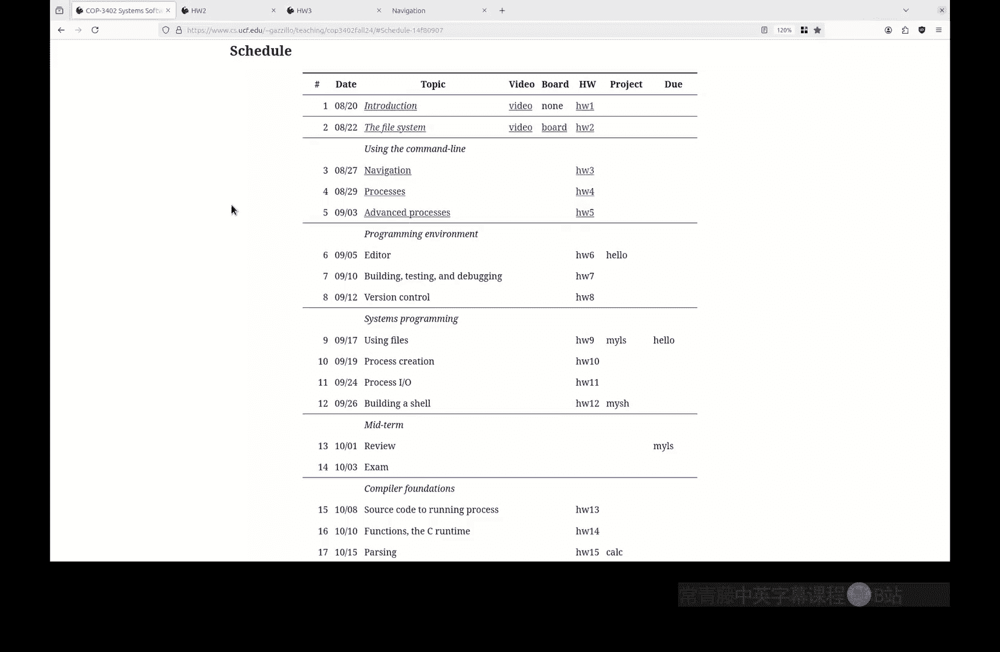
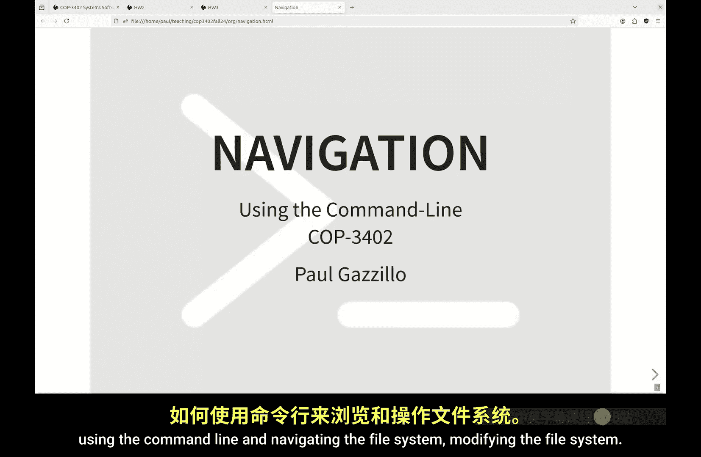
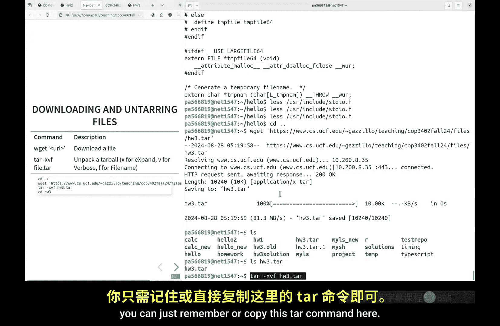
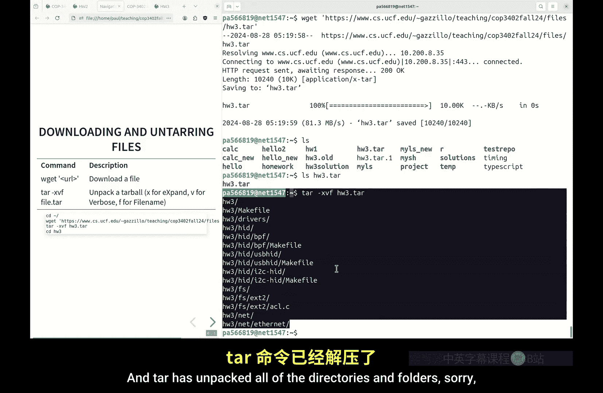
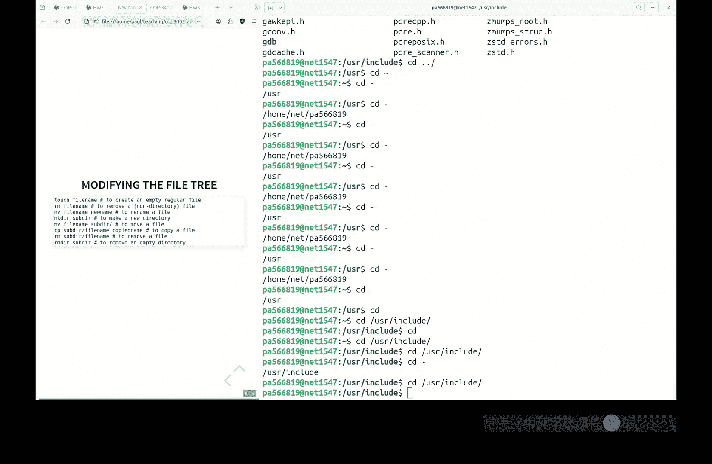

# 系统软件：P3：使用命令行进行导航 🗺️





在本节课中，我们将学习如何使用命令行来浏览和修改文件系统。我们将从回顾上节课的作业开始，然后深入探讨一系列实用的命令和技巧，帮助你高效地在文件系统中穿梭。

## 作业回顾 📝

上一节课的作业是根据一系列路径来重建文件树。我们需要区分两种路径：**绝对路径**和**相对路径**。

*   **绝对路径**以 `/` 开头，从根目录开始定位文件。
*   **相对路径**则需要结合**当前工作目录**来确定文件位置。

让我们逐一分析作业中的路径来构建完整的文件树。

以下是路径列表及其工作目录：
*   `/home` (工作目录：`/home`)
*   `/dev` (工作目录：`/`)
*   `/tmp` (工作目录：`/`)
*   `/boot` (工作目录：`/`)
*   `user` (工作目录：`/`)
*   `paul` (工作目录：`/home`)
*   `../home/paul/src` (工作目录：`/dev`)
*   `bin` (工作目录：`/user`)
*   `./bin` (工作目录：`/home/paul`)
*   `home` (工作目录：`/home/paul`)
*   `paul` (工作目录：`/dev/../home/paul/home`)

通过分析这些路径，我们构建出以下文件树结构：
*   `/` (根目录)
    *   `home`
        *   `paul`
            *   `src`
            *   `bin`
            *   `home`
                *   `paul`
    *   `dev`
    *   `tmp`
    *   `boot`
    *   `user`
        *   `bin`

关键点在于理解 `..`（父目录）和 `.`（当前目录）在相对路径中的作用，以及工作目录如何影响路径的解析。

## 命令行导航基础 🧭

现在，让我们将理论知识付诸实践，学习如何在命令行中导航。

首先，通过SSH登录到服务器。登录后，你会看到欢迎信息和命令提示符。

**`clear`** 命令或快捷键 **`Ctrl+L`** 可以清空终端屏幕。

有两个命令能帮助你快速定位自己在文件树中的位置：

1.  **`pwd`** (Print Working Directory)：打印当前工作目录的绝对路径。
2.  **`ls`** (List)：列出当前工作目录下的所有文件和子目录。

例如：
```bash
pwd
ls
```

**`ls`** 命令可以接受参数，用于查看其他目录的内容。例如，使用绝对路径查看 `/usr/include` 目录：
```bash
ls /usr/include
```

## 改变工作目录

要改变当前工作目录，使用 **`cd`** (Change Directory) 命令。

你可以使用绝对路径：
```bash
cd /usr/include
```

也可以使用相对路径。`..` 代表父目录：
```bash
cd ..  # 切换到父目录
pwd    # 现在位于 /usr
```

要进入当前目录的子目录，可以直接使用子目录名：
```bash
cd include  # 假设当前在 /usr，这将进入 /usr/include
```

**`~`** 符号是用户家目录的快捷方式：
```bash
cd ~  # 切换到你的家目录
```

## 提高效率的技巧 ⚡

为了更高效地使用命令行，以下是两个核心技巧。

### 1. Tab 自动补全

**Tab** 键是命令行中最有用的功能之一。它可以自动补全命令、文件名和目录名。

*   **唯一补全**：输入部分名称后按 `Tab`，如果只有一个匹配项，系统会自动补全。
    *   例如：输入 `ls /usr/include/g` 后按 `Tab`，可能会补全为 `ls /usr/include/gnu`。
*   **列出选项**：如果按一次 `Tab` 没有反应，表示有多个匹配项。再按一次 `Tab`，系统会列出所有可能的选项供你选择。
*   **路径补全**：在输入路径时，每输入一个目录部分后按 `Tab`，可以快速补全并确认该路径存在。

养成随时按 `Tab` 的习惯，可以极大提升输入速度和准确性。

### 2. 命令历史

命令行会记录你之前执行过的命令。利用历史记录可以快速重新运行或修改之前的命令。

*   **上/下箭头键** 或 **`Ctrl+P`** / **`Ctrl+N`**：在历史命令中上下浏览。
*   **`history`** 命令：列出所有保存的历史命令。
*   **`Ctrl+R`**：反向搜索历史命令。按下后输入关键词，会搜索包含该词的历史命令。

一个小技巧：在命令前加上 `#` 将其注释掉再执行，这条命令会被存入历史。之后你可以通过上箭头找到它，删除 `#` 并修改后重新运行。

## 常用文件操作命令 📁

现在，我们来看看如何修改文件系统。以下是一些基本命令。

首先，创建一个示例目录并进入：
```bash
mkdir example
cd example
```

**`touch`**：创建一个新的空文件。
```bash
touch regular_file
```

**`rm`** (Remove)：删除一个文件。
```bash
rm regular_file
```

**`mv`** (Move)：移动或重命名文件/目录。
*   **重命名文件**：
    ```bash
    touch file2
    mv file2 file_new_name
    ```
*   **移动文件到目录**：
    ```bash
    mkdir subdir
    mv file_new_name subdir/
    ```
*   **移动并重命名**：
    ```bash
    mv subdir/file_new_name subdir/renamed_again
    ```

**`cp`** (Copy)：复制文件。
```bash
cp subdir/renamed_again regular_file_copy
```

**`rmdir`** (Remove Directory)：删除一个**空**目录。
```bash
rmdir subdir  # 失败，因为 subdir 非空
rm subdir/renamed_again  # 先删除目录内文件
rmdir subdir  # 成功删除空目录
```



要删除非空目录及其所有内容，**`rm`** 命令有一个危险的选项 **`-r`** (递归)，请谨慎使用：
```bash
rm -r directory_name
```



## 实战：作业解析 🧩

本节课的作业是操作一个给定的文件树。你需要下载一个打包文件（`.tar`），解压后，使用学到的命令将原始文件树修改成目标结构。

**步骤 1：下载和解压**
```bash
# 下载作业文件 (URL 需替换为实际地址)
wget http://example.com/hw3.tar

# 解压文件
tar -xvf hw3.tar

# 进入解压后的目录
cd hw3
```

**步骤 2：查看原始结构**
使用 **`tree`** 命令查看目录树结构（如果系统未安装，可用 `ls -R` 替代）。
```bash
tree .
```

**步骤 3：对比与修改**
比较 `tree` 命令输出的原始结构和作业要求的目标结构。找出差异，例如：
*   文件/目录名称不同。
*   文件/目录位置（父子关系）不同。
*   需要创建或删除某些文件/目录。

使用 **`mv`**, **`cp`**, **`rm`**, **`mkdir`**, **`touch`** 等命令，结合 **Tab 补全**，一步步将文件树修改成目标样子。

**一个例子**：假设目标是将目录 `fs/ext2` 改名为 `fs/ext4`。
```bash
# 在 hw3 目录下执行
mv fs/ext2 fs/ext4
```

**步骤 4：验证**
修改完成后，再次运行 `tree .` 命令，确保生成的文件树结构与目标一致（注意：同一目录下子项的顺序无关紧要，关键是父子关系要正确）。

如果修改过程中出错，可以轻松重来：
```bash
cd ~  # 回到家目录
mv hw3 hw3_old  # 移走旧的尝试
tar -xvf hw3.tar  # 重新解压得到干净的 hw3 目录
cd hw3
```

## 核心命令总结 📋

本节课我们学习了一系列命令行工具和技巧，以下是需要掌握的核心内容：

*   **定位与查看**：
    *   **`pwd`**：显示当前目录。
    *   **`ls`**：列出目录内容。
    *   **`cd`**：切换目录。
        *   `cd ~` 或 `cd`：回家目录。
        *   `cd -`：返回上一个所在的目录。
        *   `cd ..`：进入父目录。

*   **效率工具**：
    *   **Tab 键**：自动补全路径、命令和参数。
    *   **历史命令**：使用上下箭头或 `Ctrl+R` 查找并重用之前的命令。

*   **文件操作**：
    *   **`touch`**：创建空文件。
    *   **`mkdir`**：创建目录。
    *   **`mv`**：移动/重命名。
    *   **`cp`**：复制。
    *   **`rm`**：删除文件。
    *   **`rmdir`**：删除空目录。

*   **文件查看**：
    *   **`cat`**：快速查看整个文件内容。
    *   **`more`** / **`less`**：分页查看长文件（按 `q` 退出）。

---



本节课中，我们一起学习了命令行导航的基础知识、提高效率的实用技巧以及基本的文件系统操作命令。通过完成作业，你将有机会亲手实践这些命令，巩固对文件树结构和路径操作的理解。熟练掌握这些技能是进行后续系统软件学习和开发的重要基础。