# 系统软件：04：使用命令行进行导航 🗺️


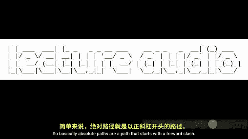


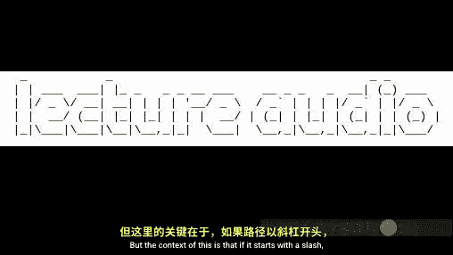


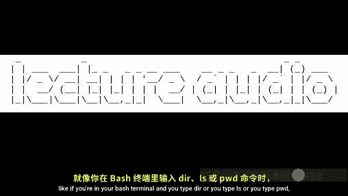


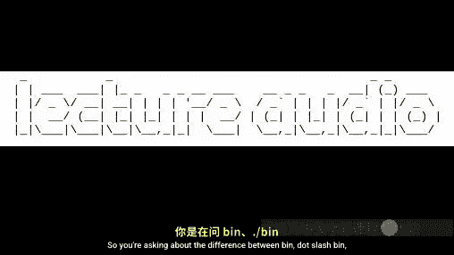

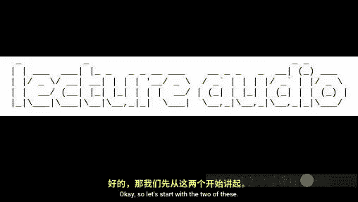


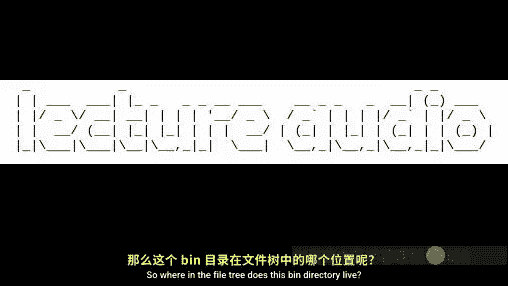

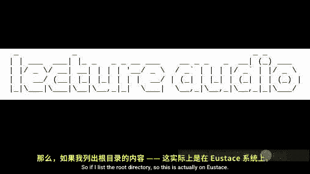


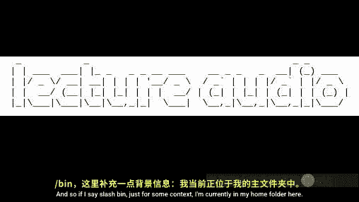

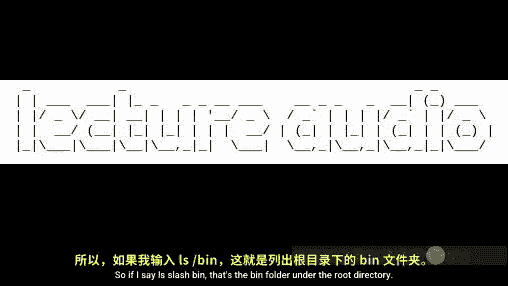

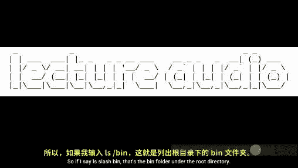


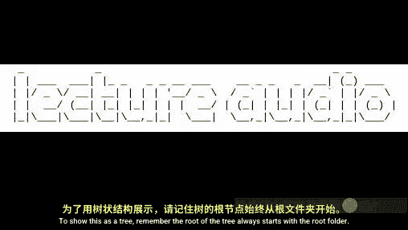

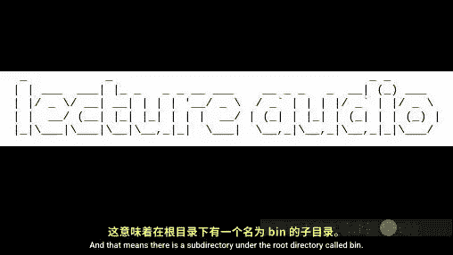


在本节课中，我们将学习如何在命令行界面中导航文件系统。我们将回顾绝对路径和相对路径的核心概念，并通过一系列实用的命令来探索、查看和修改文件系统中的文件和目录。掌握这些技能对于高效地使用命令行至关重要。


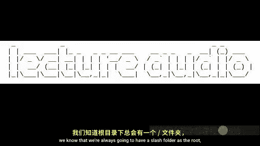

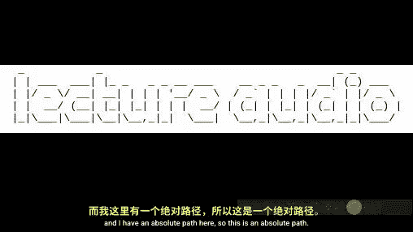

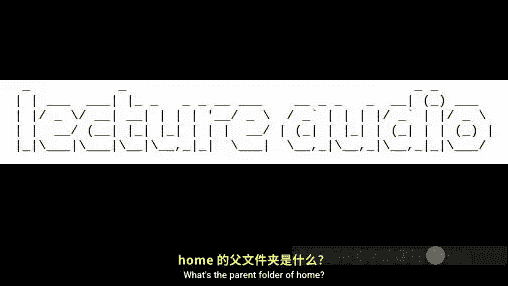

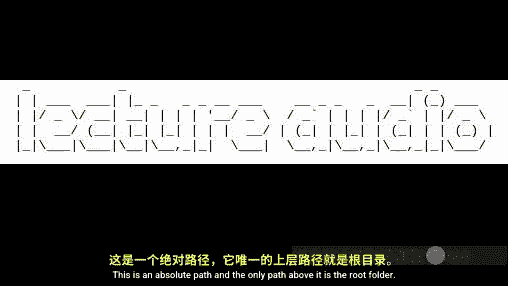


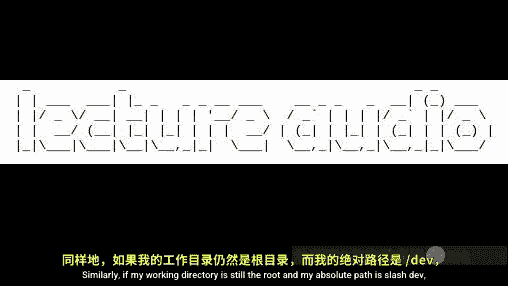


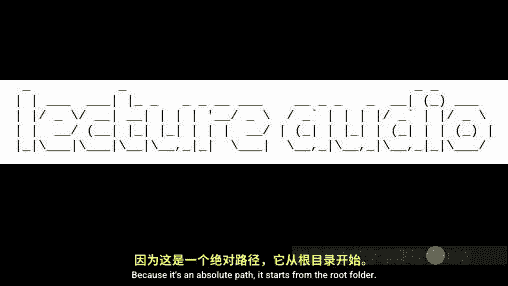

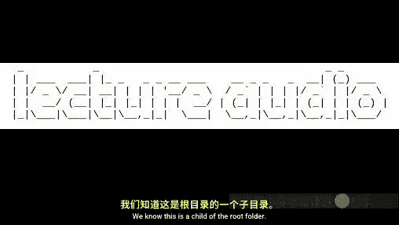


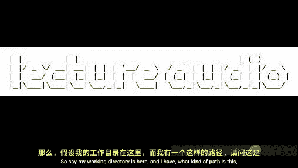

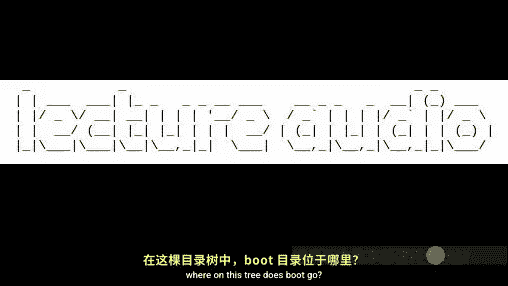


---


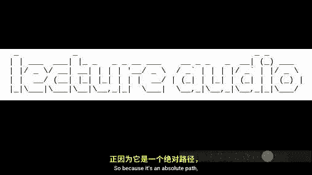


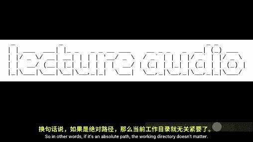


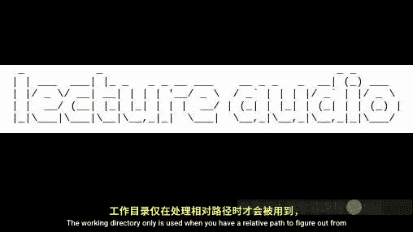

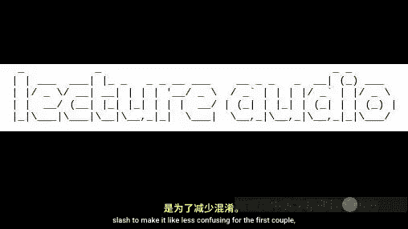


上一节我们介绍了文件系统的基本结构。本节中，我们来看看如何在命令行中实际地移动和操作文件。

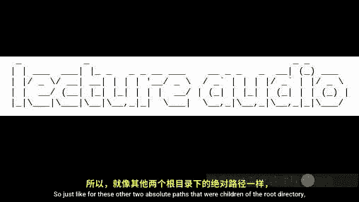

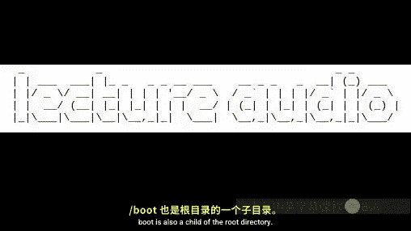


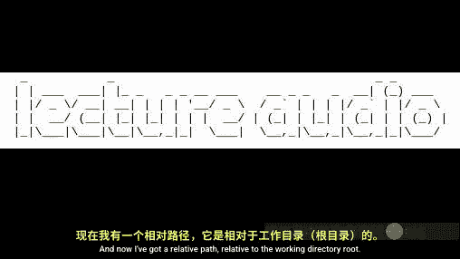

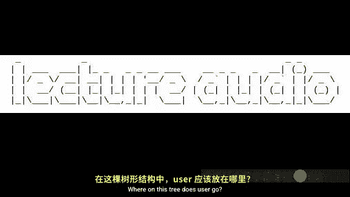

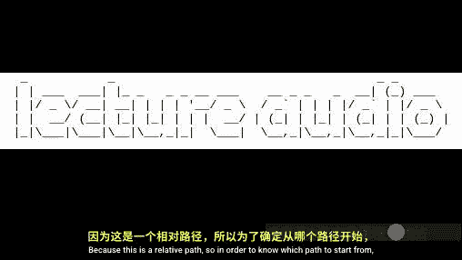


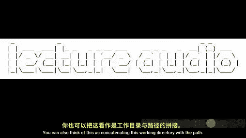

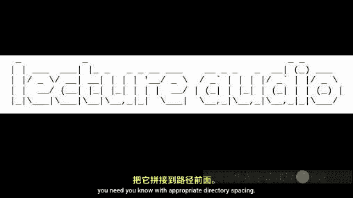

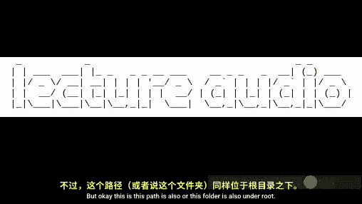


## 核心概念：绝对路径与相对路径

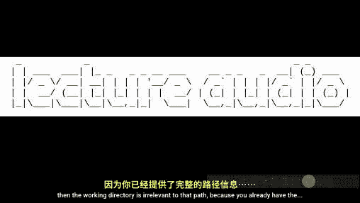


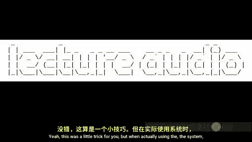


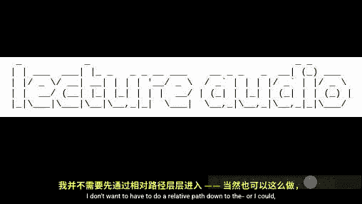

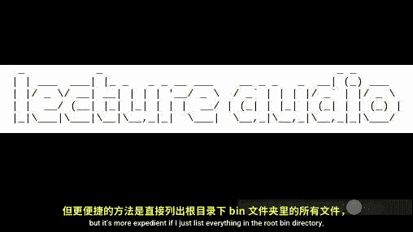


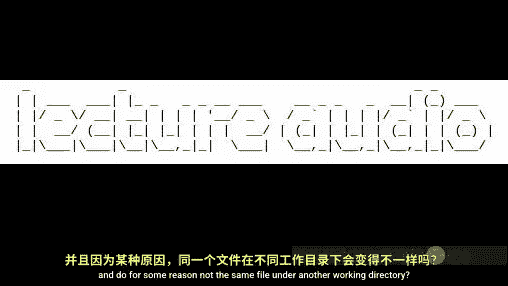


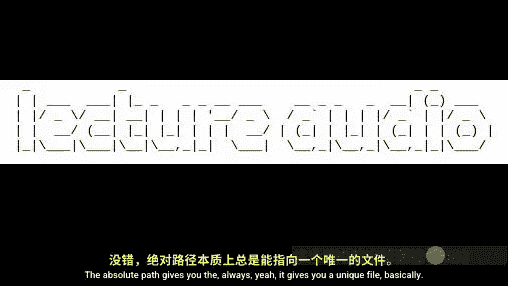

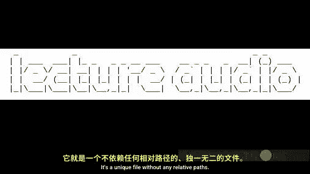


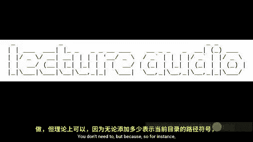


理解路径是导航文件系统的关键。路径分为两种：


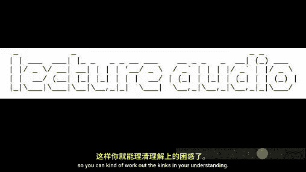


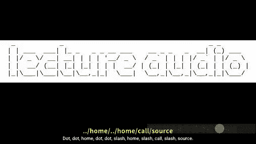


*   **绝对路径**：从文件系统的根目录（`/`）开始。它提供了到达目标文件或目录的完整、唯一的路径，与当前工作目录无关。
    *   **公式**：`/目录1/目录2/.../文件名`
*   **相对路径**：从当前工作目录开始。它依赖于当前所在的位置。
    *   **公式**：`目录/子目录/文件名` 或 `./文件` 或 `../父目录文件`


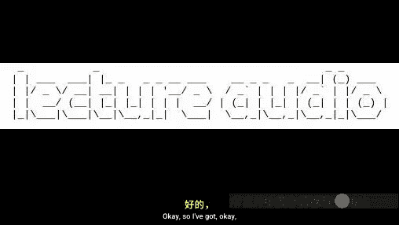

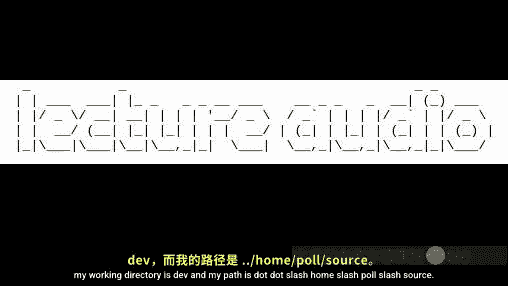

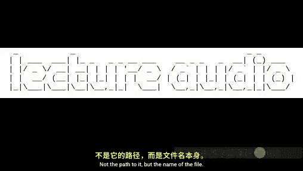

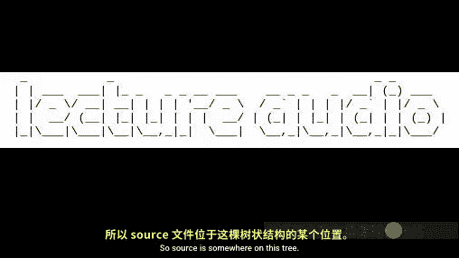


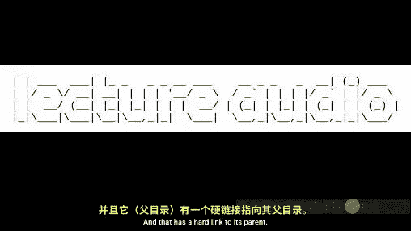

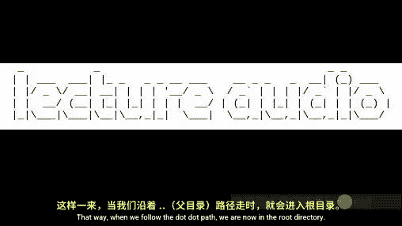

**关键区别**：对于绝对路径，当前工作目录被忽略。对于相对路径，当前工作目录是路径解析的起点。


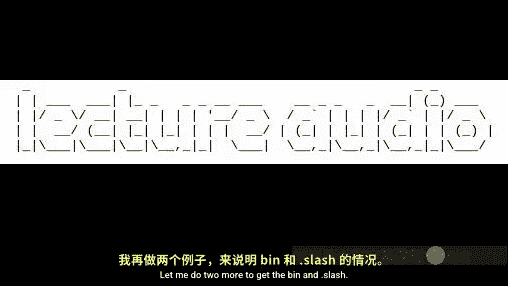


## 基础导航命令


以下是开始探索所需的最基本命令。


### 查看当前位置与内容


要查看你当前在文件系统中的位置，使用 `pwd` 命令。


```bash
pwd
```


该命令会打印出你当前所在目录的**绝对路径**。


要查看当前目录下有哪些文件和子目录，使用 `ls` 命令。


```bash
ls
```


### 切换工作目录


要改变当前工作目录，使用 `cd` 命令，后跟目标目录的路径。


```bash
cd /usr/include
```


你可以使用特殊符号进行快速导航：
*   `cd ..`：切换到父目录。
*   `cd ~` 或直接输入 `cd`：切换到你的家目录。
*   `cd -`：切换到上一个所在的目录。


## 高效使用命令行的技巧


在命令行中高效工作的两个最重要技巧是标签补全和命令历史。


### 1. 标签补全


在输入文件名、目录名甚至命令时，按下 `Tab` 键，系统会自动尝试补全你正在输入的内容。
*   如果只有一个匹配项，它会直接补全。
*   如果有多个匹配项，按两次 `Tab` 键会列出所有可能的选项。
*   这是一个极好的工具，既能提高输入速度，也能验证路径是否正确。


### 2. 命令历史


Bash shell 会记录你之前执行过的命令。
*   按 `上箭头` 或 `下箭头` 键可以浏览历史命令。
*   按 `Ctrl+R` 可以反向搜索历史命令。
*   输入 `history` 命令可以查看完整的历史记录列表。
这可以避免重复输入长而复杂的命令。


## 查看文件内容


有时你需要查看文件里有什么。以下是几个有用的命令：


*   `cat`：快速打印整个文件的内容到屏幕。
    ```bash
    cat filename.txt
    ```
*   `more`：分页查看文件，按空格键翻页。
    ```bash
    more longfile.txt
    ```
*   `less`：比 `more` 更强大的分页查看器，支持上下滚动、搜索等。按 `q` 键退出。
    ```bash
    less longfile.txt
    ```


## 文件与目录操作命令


现在，我们来看如何创建、删除和移动文件与目录。这些是修改文件系统结构的基础。


### 操作文件


以下是操作文件的基本命令列表：


*   `touch`：创建一个新的空文件，或更新现有文件的时间戳。
    ```bash
    touch newfile.txt
    ```
*   `rm`：删除文件。
    ```bash
    rm file_to_delete.txt
    ```
*   `mv`：移动文件或为文件/目录重命名。
    ```bash
    mv oldname.txt newname.txt
    mv file.txt /target/directory/
    ```


### 操作目录


以下是操作目录的基本命令列表：


*   `mkdir`：创建一个新目录。
    ```bash
    mkdir new_directory
    ```
*   `rmdir`：删除一个**空**目录。
    ```bash
    rmdir empty_directory
    ```
*   要删除非空目录，通常使用 `rm -r directory_name`，但使用时要格外小心。


## 实践：作业示例


为了巩固所学，你将完成一个实践作业。你需要下载一个初始的文件树，然后使用今天学到的命令，将其修改成指定的目标文件树。


**作业准备步骤：**
1.  登录 Eustis 服务器。
2.  使用 `wget` 命令下载作业压缩包。
3.  使用 `tar` 命令解压。
4.  进入解压后的目录。


**核心任务：**
比较初始文件树和目标文件树的差异。例如，一个目录可能需要从 `ext2` 重命名为 `ext4`。这可以通过 `mv` 命令完成：
```bash
mv fs/ext2 fs/ext4
```
你需要找出所有此类差异，并组合使用 `mkdir`, `rm`, `mv`, `touch` 等命令来完成转换。完成后，将你使用的命令序列提交即可。


---


本节课中我们一起学习了命令行的核心导航技能。我们明确了绝对路径与相对路径的区别，掌握了 `pwd`, `ls`, `cd` 等基础命令，并学会了使用标签补全和命令历史来提升效率。最后，我们了解了如何查看文件内容以及使用 `touch`, `rm`, `mv`, `mkdir` 等命令来操作文件和目录。这些是你在命令行环境中进行有效工作的基石。