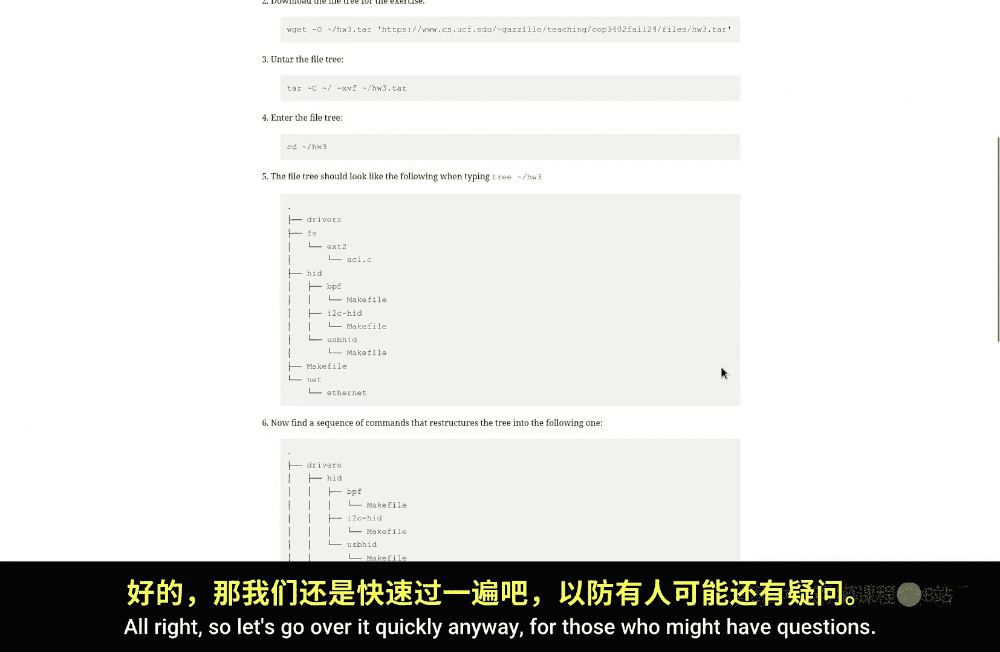
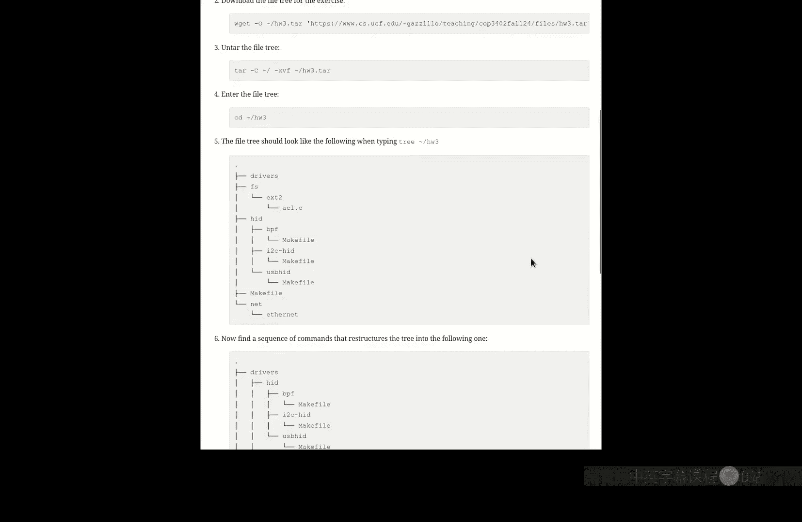
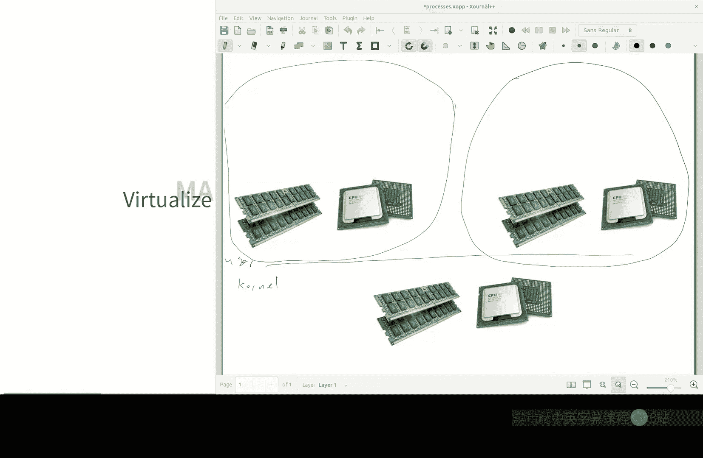
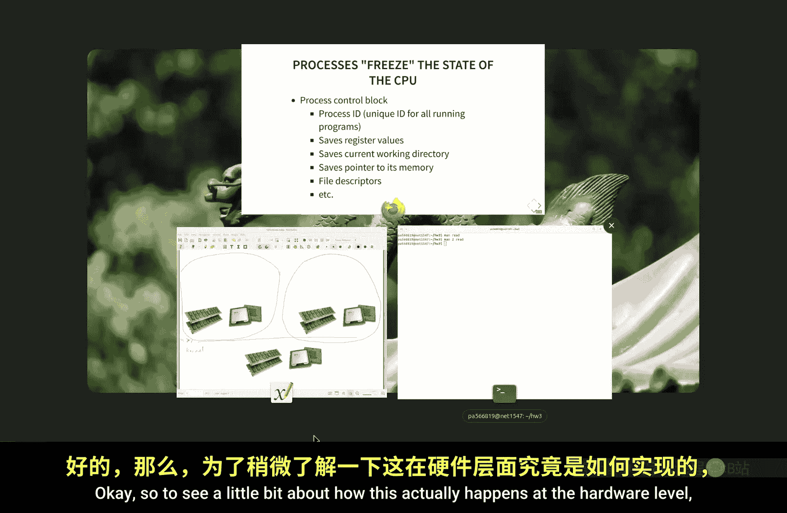
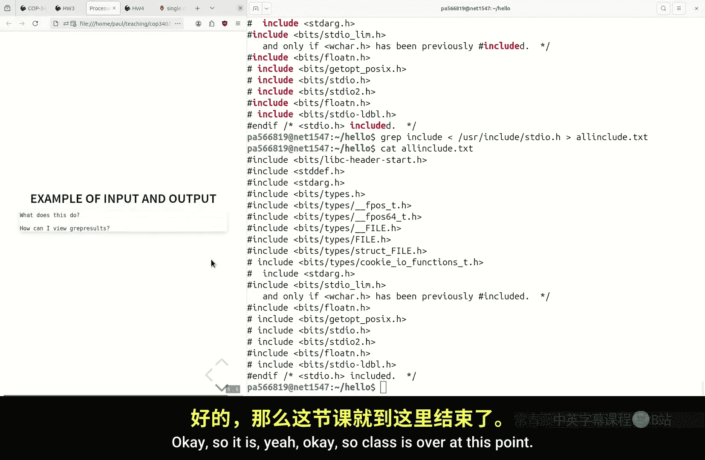

# 系统软件：P5：使用命令行：进程 (COP-3402 Fall 2024)





## 概述
在本节课中，我们将学习操作系统中的另一个核心抽象概念：**进程**。我们将探讨进程是什么、为什么需要它，以及如何在Unix/Linux命令行环境中查看和管理进程。我们还将回顾上一节关于文件系统的作业，并介绍标准输入/输出（Standard I/O）的概念及其在命令行中的强大用途。

## 回顾：文件系统导航
上一节我们介绍了在命令行中导航文件系统的基础知识。我们讨论了分层文件系统的本质，学习了路径的概念，包括绝对路径和相对路径。绝对路径总是从根目录（`/`）开始，而相对路径则是相对于当前工作目录（`pwd`）的。每个运行的程序（进程）都有一个由内核维护的工作目录。

以下是关于路径的一些核心概念：
*   **绝对路径**：以根目录 `/` 开头的路径，例如 `/home/user/file.txt`。
*   **相对路径**：相对于当前工作目录的路径，例如 `./subdir/file` 或 `../parent.txt`。
*   **当前工作目录**：可以使用 `pwd` 命令查看。

## 作业回顾与文件操作
在深入新内容之前，我们先快速回顾一下上节课的作业。作业要求大家通过一系列文件操作，将一个给定的目录树结构修改为另一个目标结构。

一种方法是使用 `rm` 命令删除不需要的文件或目录。使用 `rm -r` 可以递归删除整个目录树及其内容，但需要格外小心，因为此操作不可逆。

另一种更安全的方法是组合使用 `cd`（改变目录）和相对路径来定位并操作特定文件。关键是要时刻清楚自己当前在目录树中的位置（使用 `pwd` 和 `ls`）。

## 进程抽象：运行中的程序
本节中我们来看看操作系统中的另一个基本抽象：**进程**。

一个进程，简单来说，就是一个**正在运行的程序**。程序是存储在磁盘上的一系列指令（机器码），而进程则是这些指令被加载到内存中并由CPU执行的状态。

为什么需要“进程”这个抽象概念？主要原因有几点：
1.  **并发执行**：现代计算机通常需要同时运行多个程序（例如，浏览器、音乐播放器、编辑器）。即使只有一个CPU，操作系统也可以通过让多个进程快速轮流使用CPU（称为**时间片轮转**），制造出它们同时运行的假象。
2.  **故障隔离**：如果一个程序（进程）崩溃，操作系统可以终止它，而不会导致整个机器停止运行。这得益于进程间的隔离。
3.  **资源虚拟化**：操作系统为每个进程提供一个虚拟的、独立的执行环境，让每个进程都感觉自己独占CPU和内存。内核则在背后管理这些虚拟资源到物理硬件的映射和调度。

进程的状态（如CPU寄存器值、内存映射等）由内核保存。当操作系统决定切换进程时，它会保存当前进程的状态，并恢复下一个进程的状态，这个过程称为**上下文切换**。

## Unix中的进程创建：Fork 与 Exec
在Unix哲学中，创建新进程主要涉及两个系统调用：`fork` 和 `exec`。

*   **`fork()`**：此调用创建一个当前进程的**副本**（子进程）。子进程拥有与父进程几乎完全相同的内存映像、文件描述符等。调用 `fork()` 后，系统中就存在两个执行相同代码的进程。
*   **`exec()`**：此调用用磁盘上的一个新程序**替换**当前进程的内存空间。调用 `exec()` 后，原进程的代码和数据被新程序覆盖，并开始执行新程序的 `main` 函数。

常见的模式是：父进程调用 `fork()` 创建子进程，然后在子进程中调用 `exec()` 来运行一个新程序，而父进程则继续执行原有代码。这就像是细胞分裂后，其中一个细胞转变成了全新的个体。





系统中所有的进程都构成一棵树。第一个进程（通常是 `init` 或 `systemd`）由内核在启动时创建，所有其他进程都是它的后代（通过 `fork` 产生）。例如，当你通过SSH登录并启动 `bash` shell后，在 `bash` 中运行的每个命令（如 `ls`, `ps`）都是 `bash` 进程 `fork` 并 `exec` 出来的子进程。

## 在命令行中查看进程
我们可以使用命令行工具来查看和管理进程。

以下是几个常用的命令：
*   **`ps`**：显示当前终端会话启动的进程。
*   **`ps aux`**：显示系统中所有用户的全部进程信息。
*   **`ps axjf`**：以树状格式显示进程，清晰展示父子关系。

例如，运行 `ps axjf | less` 可以浏览整个系统的进程树。你可以看到 `init` 进程（PID 1）是所有进程的根，你的 `bash` shell及其运行的命令都是这棵树上的分支。

## 运行程序与 PATH 环境变量
在 `bash` shell中运行一个程序非常简单：只需键入程序名即可。例如，输入 `ls`，`bash` 会找到 `ls` 程序，然后通过 `fork()` 和 `exec()` 系统调用来创建并执行它。

那么，`bash` 如何知道 `ls` 程序在哪里呢？它依赖于一个叫做 **`PATH`** 的环境变量。`PATH` 是一个由冒号分隔的目录列表，`bash` 会按顺序在这些目录中查找你输入的命令。

你可以使用 `which` 命令来查看某个命令的完整路径：
```bash
which ls
```
这将输出类似 `/bin/ls` 的结果。

如果你想运行当前目录下的一个程序（比如你自己编译的 `hello`），你需要指定路径，例如 `./hello`，因为当前目录（`.`）通常不在默认的 `PATH` 中。

## 标准输入/输出（Standard I/O）与重定向
Unix设计的另一个巧妙之处在于**标准I/O**。每个进程在创建时都会自动打开三个文件流：
1.  **标准输入 (stdin)**：文件描述符为0，默认从键盘读取输入。
2.  **标准输出 (stdout)**：文件描述符为1，默认输出到终端屏幕。
3.  **标准错误 (stderr)**：文件描述符为2，默认也输出到终端屏幕，用于错误信息。

C语言中的 `printf` 和 `scanf` 函数就是分别向 `stdout` 和 `stdin` 进行读写。

`bash` shell 的强大功能之一是可以**重定向**这些标准流，而无需修改程序本身。

以下是重定向的几种方式：
*   **输出重定向到文件**：使用 `>` 符号。这会创建新文件或覆盖已有文件。
    ```bash
    ls > file_list.txt
    ```
*   **输出追加到文件**：使用 `>>` 符号。这会将内容添加到文件末尾。
    ```bash
    echo "New line" >> file_list.txt
    ```
*   **输入重定向来自文件**：使用 `<` 符号。这会将文件内容作为程序的输入。
    ```bash
    grep "search_term" < input_file.txt
    ```
*   **组合重定向**：可以同时重定向输入和输出。
    ```bash
    grep "include" < source_code.c > includes.txt
    ```

这种设计使得命令行工具能够像乐高积木一样通过管道（`|`，下节课内容）连接起来，形成强大的数据处理流水线。



## 总结
本节课我们一起学习了操作系统中**进程**这一核心抽象。我们明白了进程是运行中的程序，操作系统通过进程来管理并发执行、提供故障隔离和资源虚拟化。我们探讨了Unix创建进程的 `fork-exec` 模型，以及如何通过 `ps` 等命令查看进程树。此外，我们还深入了解了**标准I/O**的概念，并掌握了如何使用 `>`, `<`, `>>` 在命令行中进行输入输出重定向，这是实现强大命令行工作流的基础。掌握这些概念对于理解系统软件如何工作至关重要。