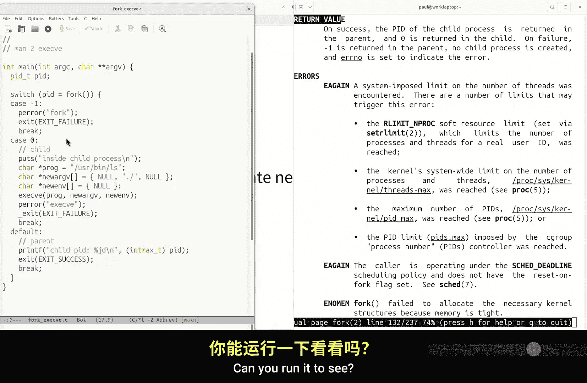
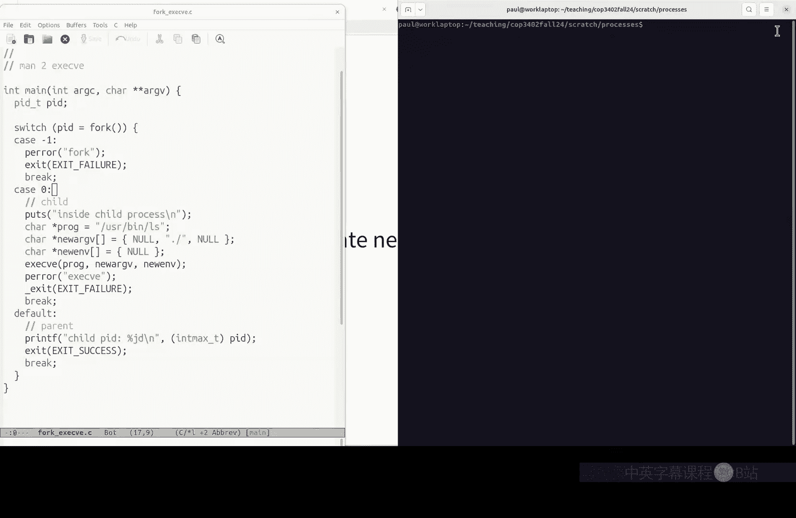
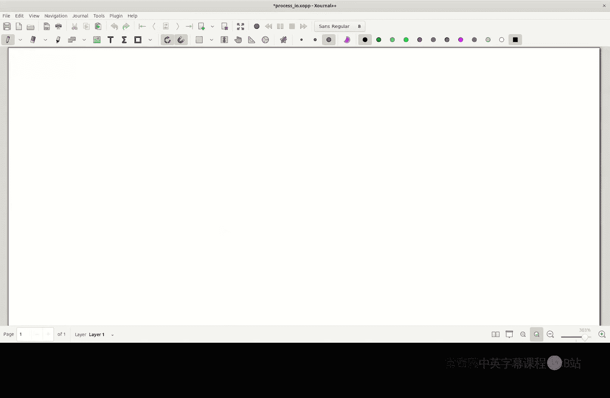
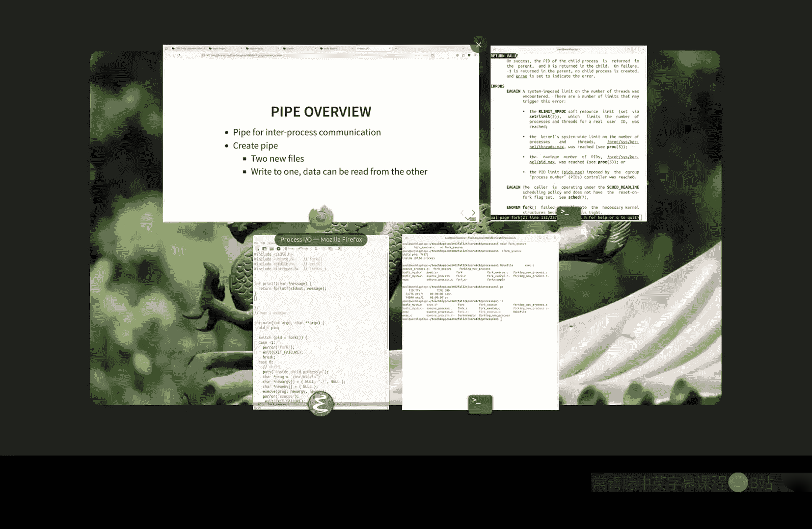
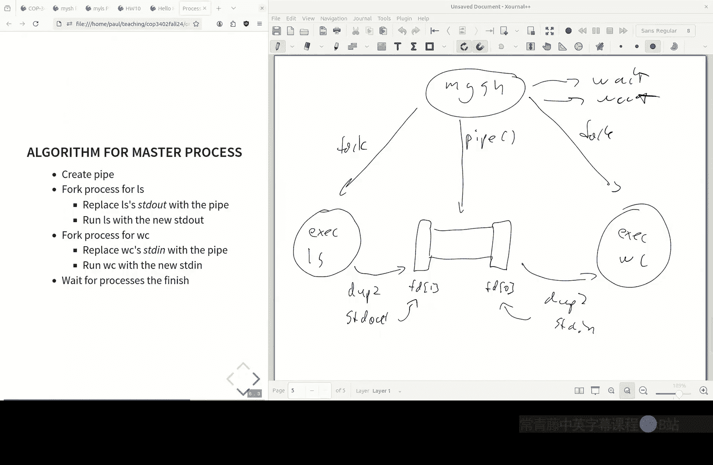

# 佛罗里达大学 【中英⚡系统软件｜COP3402 Fall 2024, Systems Software】 p12 P12 Systems programming： Process I⧸O (COP-3402 Fall 2024) -BV1v6vdBKEHB_p12-

All right everyone， welcome back to System Software。

Today we are right in the middle of learning about systems programming here。In our syllabus。

Last time we went over creating processes and one of your fellow students asked， well。

 how can these processes can they ever talk to each other again and today we're going to talk about one mechanism for process IO that we'll use for our next project。

But before I get into that。So the Hello project has been graded， the vast majority of people。

Gladly got six out of six。There was a few people who got a zero。 if you got a zero。

 it meant we didn't see your repository because if you look at the。

Project requirements in order to submit it you have to use Git to submit it and you just get a point for that for submitting it so if you weren't able to submit it then it means that you didn't have a repository on the Eustace and we weren't able to clone it or we think we weren't able to clone it so。

So for the course rules you have to submit in order to be able to reubit。

 but come to my office hours if you thought you should not have gotten a zero because you tried to submit come to office hours reminder this week。

 this is the normal office hours tomorrow it'll be synon。

But you can still be able to help you with Git and I have office hours today。

 so come to office hours。If you got a zero。嗯。The grader also made a little mistake in how。

He checked that the program runs correctly so a program running correctly would mean it print Hello world。

 but he was checking the exit code and there are some so some people put void Ma instead of in Main it's supposed to be int Main and this actually allowed。

A kind of garbage value to be returned is the exit code， which violated his script。

The instructions don't ask about exit code， you still should use mainin。

 not void Main but let me know also if you have that issue and we'll restore that point。

Any questions on the Hello project？That besides those who need to come to office hours。Yeah。非常的。

Oh yeah as well。 yeah， if you have any questions at all， Yeah。

 we can always come to office hours Yeah， for sure。

 so if you lost a point you don't know why come to office hours we' go over the grading script。

 it could be because of this checking the exit code so the greater did assure me that he went back and looked for all the cases where it was due to the exit code and regraded those but come to office hours and what we can go over。

So it could also be that the repo didn't contain only five files。

 so if you accidentally push a binary in there， you'd lose a point for that because this is the normal convention and source version controls that it's supposed to have the source code。

And then build automation that will generate the program for you。

 so you have no need to store the binaries in source versus control。Okay。All right。

 so we also had a homework from last time， which was to read。About pipes and。

My question for you was what is the Duke 2 system call this very esoteically named system call。

 so what does it do？Who kind of wrapped their head around with yes？So。金流べ？You want to rewroute。

Even when。But you also don't want to run。Closing some。Theres already been。この前に。

This will automatically。This type to be。よ。Yeah， and that's what it's useful for。

 It's useful for doing pipes。 But all it really does is it just duplicates one open file descriptor to another open file descriptor。

 That's really at its core。 all it does。 So you have a set of open files and if you want to copy one of these open files to a different file descriptor。

 that's what it's useful。 and that's a super low levell thing to do。

 but where it's useful is what we' look at today in using in doing pipes。Okay。

 so any other thoughts on Duke 2， so who totally understood the reading？And got it。

That is a little too technical， okay， all right， we'll go over today how to do pipes。

 you'll need this for the next project。😊，嗯。Any quick questions on myLS。

 kind of quick clarifications or any quick stuff on file API system calls for files？Yeah。

pretty exact。As shows。Yes， yes， but to make that easy， I've given you the actual print F。

Format strings to make it sure that it will print exactly。 So if you follow these instructions。

 it will print exactly as expected。 So the name is limited to 16 characters。

 The preview is limited to 016 characters because you only have to read 16 characters and the rest are all given to you。

 yeah。So you could do that。The real reason is that for number five。

 all you need to do is just tell Re to give you 16 bytes。

And you could certainly limit this to 16 characters as well， but if you didn't use read correctly。

 you may not have all 16 characters， so that's why I didn't put it as part of the print statement。

 whereas the name you have no control over generating that name。So we use the print string。

To only print out part of it。All right。Okay， other questions on mys？

Let me give you a quick preview of the MySH project， we're going to go over this more on Thursday。

But here， just like in my LS， you made your own version of LS here we're going to make our own version of a command line shell。

 so you're actually going to build a very simple version of a command line processor yourself and see how you can use the system assist calls that we've been going over this week and last week to actually do exactly what batchsh does for you create new processes。

 run programs， redirect input and output。And so youll actually you know it takes no input。

 you'll actually make a program called MySH and it'll read in commands。

 so for instance it'll read in the exit command and exit will terminate for you。

 it will terminate the process， you'll be able to change directories。

 and importantly you'll be able to run other programs by just giving their name。

So here's an example of running LS inside your shell。

 so your shell will take this command and it will produce this output by running the LS command and passing in the command line arguments。

And you'll even do piping。So who knows piping in bash？

I went over it a couple weeks ago you' should all have seen it， so what do pipes do in bash yeah？

Yeah， exactly。For instance， here。What does what does the LS command do？Yeah。

List the files in directory， what does the WC command do if anyone remembers？Yeah， word count is WC。

So this will count the number of words。In out so it'll take LS， which will print out。

All the files in your current directory and it'll take that output instead of printing it to the command line。

 it will pass it as the input to WC or pipe it as the input to WC。

 and then WC will take that as input and do its word count program。

So you'll actually write a command line shell that can take a command like this。

 set up all the processes， set up all the IO， and do exactly what Bash does。

Or something very similar to what Dash does too。Allow you to run this pipe。

Through these two commands。All right， so that's a preview of what I'll assign in more detail next time we'll go over the algorithm for doing this next time。

 but today prepare for that， Id like to go over how to actually use pipes。

 how to set up IO between processes。Using pipes。Okay。So first， let's go over processes。

 went over process creation last time。What is a process， who remembers what a process is？Yeah。我在。

A program， okay， so are programs and processes the same thing？Running program。

 so a program is just the sequence of instructions。In a program。

 that could be something stored on disk， could be in your head， could be on paper。

A process is a currently running program。So a process is not only a program where in a stored program machine。

 it's stored in memory and then the CPU is currently executing the instructions in this program。

 that's a process。Questions on that， questions on the process。Process is a running program。Yeah。

 process of running program。So why the distinction。

 why do we have this distinction between programs and running programs？

Why do we bother having this distinction？Yeah。Something。声。Well， saying processes can't be changed。

 well， I mean， technically you could have self modifying programs that change as they run。Right。

 right。嗯。I guess why bother making the distinction？

Why does the bother like why doesn't the kernelel just run the program and that's it？Well， okay。

 let's see， what do what you have to say？Well， so yeah。

 that's one reason is that the reason the colonel doesn't just say， okay。

 give me a program to run and then run it。Is that we may want to be able to manage multiple processes on our machine。

Otherwise， even if you didn't care about multiple pro， you may just have an exec。System call。

 and that's it and just have exec。And just。In your system。

 just have it run a program and then wait for the next program to run。

And you kind of like spiritually have a running program， so have a process。

 but a process is an abstraction that's actually created and maintained by the kernel。

So it actually has a table that lists out all the current processes， information about them。

 like where in the program they're be running， what the state of the CPU is。

So the process is to help manage multiple running programs on the same machine。

Is one of the main purposes of having a process， okay。

 so how do we create these processes in UniX in the UniX world or Poss world？Fork fork creates。

 fork creates processes。 What about exec， does exec create processes？AhOkay， good。

 exactec does not create pro， it just replaces。The current processes program with a new program。

All right， good。Questions on processes， forking， exec。Yeah。Is there spooning okay， very clever。

 maybe maybe there's some operating system that use these pun terms， what would spoon do？

Maybe child processes， they're like nested together， nested processes。

 not that I know of there you could write you could certainly extend maybe take an OS course and extend。

 you can actually add your own cis call to Linux so you can add a spoon system call。呃。All right。

 so last time we went over fork let me actually show， let me show the code for。Thats。

So we actually went over an example of。For can exec。So if you called last time。

The way you use fork is you just literally call fork， and what's the return value of fork？

What second？It's an integer， that's its type， but what is the meaning of its return value？Okay。

 so one， one case there's an error， yeah， process identifier of which process。Second噶。

The child' process， okay， are those all the possibilities， process ID or negative one？

Let's look at the system call， let's look at the return value。On success。

 the PID of the child process is returned。In the parent。And zero is returned in the child on failure。

 negative one is returned， so what does this mean， how can it possibly have two different return values？

Yeah。It's creating well， it's creating one process， but there are two processes involved here。

 you have one process that's calling fork。A new process is created。

And those two processes are two different running programs now they're running the same program code。

 so there's is another distinction why the process program distinction really matters here is that even though this is the same program。

We can have multiple processes all running the same program。

 you know imagine you run LS 20 different times and 20 different directories。

 you have the exact same program code running。But because the input is different。

That running program will take a different sequence of instructions potentially。So in this code here。

 and so in programming， how do you write a program that will have multi different sets of instructions depending on its input that will execute different sets of instructions。

What's the construct you all learned yeah？A conditional， yeah。

 conditional takes some value that will come from the input if you want different behavior。

 you take some value from the input。And it will run a different sequence of instructions。

 depending on what that value is。 That's how you get a program which is static to behave in different ways。

 depending on its input。And so it's the same thing here where we've got not a conditional。

 but a switch statement， which semantically behaves the same way。

And it will check the return value of fork。And so after the fork is executed。

 there will be two processes instead of one。And once it。

And each of those will have a different return value for fork。

And they'll both be running the same program code。But because this return value of fork is different in the parent process for the child process。

 we can test that with a condition or a switch statement。

And have the child and the parent execute different sequences of code within the same program。

Just like you could by passing a different input to the same program and using a condition。

Questions on this， questions on the process concept。Everybody's either really confused or very clear。

I'm not sure rich everybody's there questions on this。Yeah。Well。

 not piping in the sense of a Unix pipe。But what do you mean by pipe， what do you mean by pipe？对呀。

Well， okay， so this is this is what the kernel does for you。 So the kernel will it'll copy。

 So it has a take an OS class for like the actual the real， the real story on this。

 but all the process really is in the。It's okay， so I don't want to go over past lectures。

 but all the process is it's really just it's kind of metadata about the process。

 so it's what register values are set at that time， the location in the program that you're running。

 the place and memory that's been allocated for that program open files。

 so it's really just a set of information about the running program in some sense。

That's what a process is， it's a collection of that data and there's a data structure in the kernel that holds that information。

 and so when you fork， the kernel is basically just duplicating that information。

 it's copying that information into a new entry。So kind of like if you you make a new person。

 then you add a new phone book entry for that person， that person's like a clone。

 a half clone right of you， and so you you give a new entry in the phone book or in the registry for that new person。

 it's the same thing here， you make a new entry in a table that records all the processes。

And just copy all the information about the previous process。

But the main difference is when you return fork， you give a different value to fork。

 otherwise everything else is basically the same in the two processes。

 that's the only thing that differs。In those two processes is that three you because the system is itself producing the return value so it can it's free to give a different return value to those two processes does that clear things up yeah？

Run it， sure。

So this is called fork。Exactly。So I just all I did was compile it。呃。Does that help。

 so I ran Fork Exec PE？And so you can see here。 So this this is doing more。

 This is also running exec。But this is， you can see put string here。

It's printing out inside child process， and you can see in the parent process。

 it's printing out the child PID， which as you can see here。Does that help？

So if you look at the lecture last time， I actually showed。

If you know you run PS to see the process IDs， if you put a sleep command in here and you have both a parent and the child sleep。

 you'll see that two processes are running at the same time， so before the fork。

If you sleep and pause the program and run PS， you'll see one process。

And then after the fork you'll see that same process exists。

 but a new process exists as well and yeah。All right， so that's processes， forking and exec。

Questions on。Proces。I'm sorry。I don't know， that's why I'm asking you。It should be， yeah。

 it should be an executable。If you look at the book you can also there are shell。

 you can actually execute shell command so there's a shell execution command as well。

 which under the hood basically does exec， but yes， it should be a。An executable program。

 And so we'll see this when we talk about compilers， but the operating system， the system software。

And the compiler all work together all need to kind of coordinate on the format of executables。

 what should go in them， the machine you're running on these all have to kind of be in coordination on these binary file formats。

 so the compiler needs to produce machine code that will run on this system and needs to produce machine code that the system tools will be able to work with。

 the system tools need to produce executables that the。

Operating system knows how to load the binary format。

 so there's actually a binary format for this systems called EF that this program is stored in。

 so EF is just a way to lay out a binary file that has machine code in it and then the operating system loader。

which if exec is effectively the loader or calls the loader。

 will know how to read that binary format to find the text segment and put it into memory and start running it。

So we'll go over like the whole sequence from a source code to an actual running program a process once we start talking about compilers in a couple weeks actually。

 but yeah， these all need to work in concert in order for this。Exec thing to work。

But yeah that's a good question。Okay， so remember， pro are running programs。

The kernel maintains a table that records all of the currently running programs。

 the information about them， like open files， where in the program is being executed。

And fork is how you create a new entry in that table。

 and the only way to do it in the Uni Poss world is to duplicate an existing one。

And so that you can distinguish have a program that will do something different after the fork。

You use the return value of four in order to distinguish parent child。

 and then to create a new running program， a different program use exec to replace that processess machine code with a new program。

Yeah。こ性？で怖い。啊。そ育はな？No， no， that's a good point so the process maintains the program counter where in the program you being run and so that actually gets duplicated as well。

 so yeah that's a good subtle question。That part of what the process stores is the CPU state and one of the CPU states。

 which I think you learned in computer organization， is the program counter or instruction pointer。

 depending on what system you on， and that instruction pointer also gets duplicated。

And so the processes continue running from after the fork。But that's a good subtle question。

All right， other questions on processes。So hopefully at least get conceptually how processes work。

How they're created， and then today we're going to talk about one mechanism for communicating between processes so somebody actually asked this last time so you know once you running exec。

 you're in a different program so these are in different memory。

 these have different these have different virtually these are different memory that's being allocated to them。

 the kernel enforces isolation so that these two processes cannot touch each other's memory because you wouldn't want some other program to be messing with the memory in your program。

Because you may get unexpected results。But we may want to communicate between processes。

 so can you think of a case where we'd want to have two different processes communicate with each other？

Yeah。Sure， yeah， like we saw the pipe example， maybe you want LS to send its information to WC。

Another example is when you go to a web browser or a website。

You want to connect to a web server on another machine。That's a running process。

 that's a running program on that machine。 Well， how are you going to ask it to give you the website。

 you need some sort of。Communication between the processor of a web browser and the web server。OK。

So that's interse communication I had to give this example。Just a quick review。

Who remembers what standard IO is in thepos world or the UniX world？Yeah。Yeah， basically。

 so every running process is given three open files when it starts from the systems。Input。

 output and error output， standard in， standard out， standard error。So if you've ever。

So for instance， print F。Print F is the same thing。As saying F print F。Standard out。

Who's used F printntf？And so what's FPF do？Print F to a file， it's like print F but to a file。

 but actually print F is really just an alias for saying F print F standard out。

Because when you call F print F， you're always printing to a file， all IO is to a file。

 or at least that the Unix philosophy， all IO is to a file。 So F printn F is really。The same thing。

O不是。The same thing。As saying F print F。Let's just make a simple version of so printf is its definition is a little more complicated。

 but let's pretend it's this。This is what printf does。It just。Has a default file for you。

 that default file is standard out。And what is standard out， standard out？

Is the output file that's opened by the operating system for you？So I'm running Bsh， for instance。

 and I run the LS process。Which file is open to standard out for LS when I run this？

One hint is where' is the output going？T， yeah， the terminal， the terminal is a special file。

 a TTY file， or whatever it's called a special character file。And that's what standard out is being。

Initialized to。When you run a program from Dash。And actually。

 it's because you're duplicating your forking dashsh and its open files are becoming LS's open files。

Okay， so hopefully with piping， you'll see why standard IO is so useful in the Poor and why it's become kind of a real standard。

 a positive standard for operating system design。Okay， so。Let me show diagrammatically how。

Piping works。あさ。Okay， I don't know why this isn't rain。Open this again， apologies。Okay， there we go。

All right， so if I've got some running program。What。

So if I have them my program dash and it forks a new process。

Some reason it doesn't like to be full screen。So bash， so okay， so let's say， well。

 let's forget about Bsh for a second， let's just say we have a program called LS， a running program。

 LS， so this is now a process， which I'll denote with a circle。And it has three open files。

 so it's got。Standard in。Standard out。And standard error。And remember。

 these files are not defined by LS， they're defined by whoever calls it。

 whoever creates this process and starts running LS has to supply it with。Standard standard IO。

So if Ive forked LS for my program。What files， what standard IO files does it have if I forked it from my program。

 it's kind of subtle question about the behavior of fork。Yeah。They're the same， yeah， so fork。

copies all open files including standard IO files， so when you have Bsh Bsh is set up to have standard IO input and output to be your terminal when it forks LS and runs LS。

The terminal will just naturally be the standard IO for LS that'll inherit that from its parent process。

So if I don't want that to happen instead， I want to invoke another program， WC。I want to take this。

Standard out。And I want it to be the input to。The standard in to WC。

I don't have to reprogram WC or LS。😡，To perform this kind of inner process communication。

Because I know both will have。And open file descriptors for Standard I Standard In。

And because the developer of these used the Uni philosophy and they designed it around standard IO。

The trick I can do is I can instead create a pathway here。To connect。Standard IO。

And standard out between these two processes that。Connection here is called。A pipe。In the UniX world。

And so pipe is really just a set of two files because remember these。

These standard IO and standard IN， these are files。So do files have to be？Data on disk。

In this notion of a file， who thinks files are data on disk？Okay oh yeah。So what are files。

 if they're not just data on disk， what is a file？In the kernel world， yeah。Yeah。

 it's an abstraction， and the abstraction just says， if I have some object。

 anything that I can read and write bytes to。I can use the file abstraction for it。

 so just like the process abstraction the kernel is maintaining。

File descriptors are maintaining a table of open files and theyre。

They're maintaining a complex set of infrastructure for all sorts of different types of files。

 but at the end of the day， you have the same set of system calls read and write for reading and writing contents to these。

And so a pipe， pipe is kind of like。An artificial file that the kernel creates that you can ask the kernel to create。

 and when you call pipe， what it'll do is it'll create two new files。Let's call it。

We'll call it the right end。And the read end。What I call pipe。

It will create two new file descriptors for me。And， yeah。This one。This is word count。

 the W word count program， so is the this is。How we implement this pipe between LS Command and WC command。

WC is word count， counts the number of。Characters， words， and lines from its input。

These are programs， so when I call LS， this is the output when I pipe。You know。

Pass LS's output to WC， WC takes whatever its input is and accountss the number of。Characters。

 lines and words。えの。Is that right， characters？Print new line word and by oh sorry， lines。

 words bytes。For the file。So I can type WC and I can say hellello world。

 what am I going to get from WC， how many lines am I going to get if I hit enter？One line， two words。

 14 characters， that's what WC does。Does that answer your question？あきそうです。

So this this we covered in like the process， I think advanced processes in the lecture。

 if you go over that lecture， you'll see how this， I mean this pipe here， this pipe character or。

You mean here？Oh so this is how it's implemented in the system I'm explaining how this。Ppe。

Command is being interpreted。At the kernel level this is how it's actually implemented。

So there's a system called called pipe。Which creates two new files。

We can think of them as the read end and the right end。

And whatever data you write to the right end file。Will be made available to the readent。

 so if you write contents。To this end of the pipe， you can read contents from the other end。

Because files， they're independent from processes， any process can。

Read and write any file using system calls。We can use this pipe for inter process communication。

Questions you had a question。Okay。Questions on the concept of a pipe。

So it's just a special file or a special set of files。That has。Two file descriptors。

 one is the right end， WRITE right end， one is the read end。

 or you can think of it as the left end and the right end。To make it more confusing。

 but there's an input end to it and there's an output end to the pipe。And so under the hood。

 the kernel will just buffer any information that's being written to the pipe。And whenever。

Someone reads from the read end of it and will pass that information back to it。

 so it's almost like creating a temporary file。where whoever only one person can write to or one has one special file for writing to that file and a different file for reading to it。

Weing from it， that makes sense。Yeah。Exactly， yeah， yeah。

 So to make the IO part of this even more confusing。 So this is the。

This is the input end of the pipe， but the way we use it to execute this command is we take the output of LS。

Let me clean up my terrible writing a little bit here so we take the。Standard output of LS。

And we redirect it to the input or the right end。Of the pipe。

And we at the same time redirect the output of the pipe。To the standard in of WC。The read end。

 the standard N ofWC。Does that they make things little or clearer？Yeah。Exactly exactly right， yeah。

 yeah， so we take advantage of this standard IO to say， well， okay。

 these programs will have an input and output file， we know that。

Because it's guaranteed by the operating system by the kernel。

And so we also have this tool called a Pa。Which gives us two files， one to write to。

 one to read from。And so we redirect the output of one program and into the pipe and redirect the input of the other program from the output of the pipe。

This is like plumbing， actually， that's why it's about a pike， I mean。

 it's literally kind of like plumbing right， and actually this is this kernel stuff is sometimes it actually is called plumbing。

You're just hooking up processes to each other。Questions on this concept。对。Yeah， there are two files。

 so there are two files that are created from it， but in the kernel they're actually writing to the same space so one file is right only one files read only whenever you write to one of the files it gets stored in a kernel buffer or。

 whenever you read from the other file， it gets passed out to whoever's reading it。So this concept。

 if you can wrap your head around this concept of pipes。

 or really this concept of inter processed communication。

You'll have a good basis to understand how networking works。

So you can think of networking as my browser， so I use Firefox。Pipping as output。

 which is like your URL request。2。I don't know a web server like HtTPV， a hasache's HTTPV。

And so what actually goes on here is the browser will create a new process。Effectively will。

The browsers have complicated process management， but you can think of the Firefox process。As。

Sending， it's not standard out， but as pretend it is。

 actually there are tools that will like curl and other tools that we can do like low level network communications。

 but you can think of this as sending a URL。Like。Two， let's say。Cs。ucf。

edu actuallys that's not quite this isn't quite accurate to how networking works。

 but you can think of this as sending a request。To another process。The web server process。

And one way to think of this is that Firefox is just writing to a file。That is very much like a pipe。

Where in one end I can write data at one end and a process on the other end will read from it。

But instead of a pipe that's being managed by the kernel。This may be。Sent。

Over the so called internet。But really， it's just a very long distance physical connection between this machine and this machine。

 and these aren't called pipes， these are called sockets。 if you ever heard。

 who's heard the term socket before internet sockets。 So sockets are a little more well。

From the abstract level， from the user level， I don't want to downplay sos because they're much more complicated。

 but from the user point of view， they're really just open files that you read and write to。😡。

Under the hood， there's a rich stack of technology that is getting those bytes from the file you're writing。

to the other endpoint， to the other machine， but from your programmer point of view。

 you're effectively just reading and writing files the same way you would read and write to a pipe。

 to pipe files。They're also usually bidirectional but。

But you can think of an internet socket as just a very。

 very long pipe that goes across different machines。Because from the programr point of view。

 you're just reading and writing bytes。To each of these endpoints。

So if you can wrap your head around using。Pippes， then you'll have the basis for a whole suite of inner process communication。

 including networking。Yeah。Its create pipe too。That's a very good question。

 so I'll actually have you in the project have to do two pipes in a row。So what what？What will。

What we'll really end up doing is we need a program that's going to create。

 do the forking and do the piping for us。And so what's going to end up happening is Bsh。

 Bsh is the parent program of all of these processes， Bsh will fork。And exec。LS。

And it can also fork an exec。WC， and it can fork an exec。Something else like we can run。

What else can we can run Gr maybe？On that。And in between， it will call。Pype。And create。

So I know my artwork is getting progressively worse。

This kind of bash program is kind of a master process that's orchestrating。

The forking and exacting of all these processes and creating all the pipes or asking the kernelel creates these pipes and hooking up。

 doing all the plumbing to hook these up。So you can， you know。

 I don't know if there's a limit in the UniuchX world but you can。

 and actually I showed this one went over piping。But you can strain together an unbounded number of these programs probably bounded by some limit in bash or the kernel probably has a limit on the number of open pipes at one time。

 but it's very very large you can do hundreds of these pipes all at once and yeah so this bash parent program is what's orchestrating and redirecting all of these processes so does that answer your question so yeah you can make many。

 many pipes and for homework or for your project， I'll ask you to do two pipes maximum and then as a bonus you can do unbounded pipes。

 it's a little trickier to work out。All right， questions on the concept of the pipe。

So it's taking this notion of the file of abstraction。

And it's using the file abstraction to allow processes to communicate with each other。

 using the same abstraction that we use for reading and writing files on disk。Okay。

 let's see how to actually use。Use pipes。So let's start with okay。

 so let's forget about forking processes， let's just look at a pipe。

 so pipe is separate from just like forkkin exact are separate。

Things that do one fine grain task at the kernel level， pipe， all it does。

 and let's look at the man page for pipe。Let's look at it' use this so that。

I don't get any weird documentation differences like before。So man page section two for。System calls。

Ready for use this？Okay。So let's look at the instructions for。Wow， this is really slow。我。Okay。

 so this is the key。Documentation of pipe creates a uni directional data channel。

 it means it only has one read end and one right end。

The array pipe FD is used to return two file descriptors that refer to the ends of the pipe。

Pype FD0 refers to the read end。And pipe51 refers to the right end in my mind。

 this is a little backwards because。The left program。The left program writes。To the read end。

Which is actually the second element in the array。And the。Wite program reads。From the。

Read end of the pipe， which is actually the first。Process， so just read the manual page。

 I had to like read it over and over again and check myself when I'm writing this code。

But F0 is the read end of the pipe， F1 is the right end。

So data written to the right end of the pipe is buffered by the kernel until it is read by the readed end of the pipe。

So in other words， anything you write here， a kernel will hold on to it for you until some other process or yeah。

 some process reads from the read end。So that's why there's two file descriptors because we want to have two different processes。

 have two different open files， it's un directional， so we want to have a read end and a right end。

In the network world， setting up these file descriptors is a little more complicated。

 this is where IP comes in， actually addressing the other machine and servers come in where you wait for a connection。

But the principal is the same you set up file descriptors on either end， two different processes。

 in the sockets world， they're bidirectional so you can read and write。to the same socket。

 but the concept is the same here， we have two different file descriptors because we have two different processes that they're running in。

 but we want those to be file those thought descriptors are connected via this pipe utility that the kernel sets up for you。

Okay， questions on the Ss call， pretty straightforward for a system call， right？

It doesn't have a lot of inputs， doesn't have a lot of behavior to it， they're of course。

 error conditions。On success returns zero on error returns negative one， kind of like before。Well。

 it might be a little。Unique is that you don't get returned the so C has different modes of returning values。

 if you want to return multiple values， the way to do it is to pass like a reference as an input and then the system code will modify the value at that reference。

The stat。Call is like this where you pass a reference to the statbo。

Qu on this before we go into the actual example。All right， so let's see how it's used。

 forgetting about making multiple rusties， forgetting about bash pipe。

Let's just look at an example of。呃。Doing a simple pipe within a process。So， let's。

Let me- oh actually， sorry， I do for a process to do it， but I do it within the same program。

All right， let let's start from scratch here。And I'll walk you through。Okay。

 so I've got an array to hold our two pipe descriptors。I've got a buffer， which I're going to use。

yeah， for storing the information that I read， and I'm going to do a fork to make- so I'm going to store the child process of fork。

 yeah。哦， yeah yeah。还有 that。Much better， okay， sorry about that。Okay。

 so what this program is going to do。Is。We're going to start with our current process。

 this program is called pipepe。And。We're going to fork a new process。Actually， sorry。

 we're going to create a pipe。First。We're going to create this pipe， get our two file descriptors。

And then we're going to create a new process。It's also going to be called Pis because it's the same running program。

And we're going to set up the parent to that I said of the parent。

The parent to write to the pipe and the child to read from the pipe。

SoThose are going to be the steps， the kind of pseudocode in this program。

 we're going to create the pipe。Fork a new process。

Do the redirection or actually we don't even have to do redirection。

 we can just read and write from the pipe itself。We're going to create the pipe fork。

And then from the parent， we're going to write to that pipe and a child we're going to read from the pipe。

All right， so here's what it looks like。Let's create the pipe first。

So this works because this array is so yeah， why is it that I can just pass pipe FD in here。

 So pipeFD is going to actually return。A going to be。Overwritten by the pipe command。So and see。

 what are arrays， really？Over the hood。Pointters， yeah， theyre pointers。

 so I'm actually just passing a reference to this array here。So I call pipe and then I of course。

 have to do my error checking。So I'm just going to use。My。呃。Pieierrere for this。Okay。

 so now let's take a look at the parent。Versus let's fork。The new。Child。Again。

 I've got to do error checking here。So any questions on this so far， what I've done so far？Yeah。CPID。

For is created a new process， CPID will be different depending on whether I'm in the parent process or the child process。

So if the PID returned is zero， am I in the parent process or the child process？Child， yeah。

 so I'm in the child process here， otherwise I'm in the parent process。Yeah。

 so I've covered that here， Ive covered that here。So yeah， probably this could be like an Elsif。

Probably that's maybe a little less confusing。嗯。O。So you don't strictly have to do this。

 but you'll want to do this。So I'm going to close the。

The second element of the pipe is at the read end or the right end。Yeah， I always forget to。

 so the pipe one refers to the right end of the pipe。So I'm in the child， so my goal is to。

Make a child。Right from the parent。To the pipe。So this is a good example of using。

YouThe tortoise approach where you write out comments of the steps you want to do to the pipe。

Read from the child from the pipe， read in the child， right？From the parent to the pipe read。

To the child from like。Okay。Index1， that's the second element。 This is the right end of the pipe。

 so my child is going to read， so I'm just going to close this right end。In the child。

 remember when I called fork。All open file IDs， including the pipepeFD file descriptors。

Were duplicated， so both the parent and the child have copies of the pipe filescriptpers， yeah。Right。

 so the file descriptor is like a pointer to an open file rather than the file itself。

So as long as there's an open file descriptor， that file is available for reading or writing。

It just says file descriptors， so file descriptors just file descriptors。

If you've opened them for writing or opened them for reading， which you can do when you open。

 the kernel will enforce that， it'll just throw an error or whatever it does when you try to write to a read only file。

Okay， so I'm going to close and then I'm going to close the。A read end。In the parent。

 so close the read end。Because。I only want to。Right to it。

 I think you could have both read and write to each other。

 You wouldn't have coordination because they're all going to be filling up the buffer。

 So typically pipes are used in a unidirectional， they are unidirectional。

 so you won't be able to tell the difference between who's writing to it。Close the right end because。

The child will only read from it。We'll only write to it。All right， questions so far。All right。

 so let's write， let's now write to the pipe。So remember these two different branches will be executed in two different processes。

 why？Why will these two branches be executed in two different processes？Because yeah。

 the return value of the fork。All right， so let's write， let's see what I had here。All right。

 so that's right to the end is which one's the right end of it？Index  one。So let's write to it。

 So this is the right system call if you。Need documentation on the right system call。

 use the man page， so it's the file descript you want to write to。

 pipe gives us the file descriptors， the string you want to write and the amount of number of bytes you want to write。

So here I'm going to take whatever is in AG V1， so where does AGV1 come from？Command line。

 this is a command line argument。 So I'm going to take R V1 and。Trust that。It呃。Has some small length。

Okay， and then once I'm done writing。I'll close the pipe and I know these are system calls that you should like check。

 so you should do error checking here。On being lazy and not doing it， close this。Air checking。嗯。

And this weight waits for the child to exit， I don't know if this is strictly necessary in this exact example。

 but you'll need to use this when you're writing your bash。呃。Tool， because you don't want。Best exit。

Okay， so I've written to the right end of the pipe and now in the child。So again。

 why is this the child code？Just to hammer this home， yeah。Because PiID is zero when I called Fork。

 another process was created。And when that process sees zeros the return code。

 you know you're in the child process so okay， so heres。

The kind of C systems way of reading reading from a file。

 So's the file which index is the read end of the pipe。It's zero。

And if you want to look at the documentation again of read。File descriptor。

A buffer to store the information and the number of bitetes you want to read。

 so I just I created a little character buffer up here。呃。Yeah。

 I should probably use mallick to do this is this is。So this code is actually unsafe。

 Now they realize the code that I wrote is actually a little unsafe because。This。

Did I really not create？This should really be。嗯。Yeah， this should really be not just a character。

Yeah， that's a little dangerous。 so yeah， my original code was just like。Getting the address of buff。

 but that's not， that's not very safe。 Okay， so I just， I need a buffer here。Oh， I see。 I see。

The original code was only reading one， I think I might have taken this from the book。

 the original code was just reading one character， so it's safe to do that。All right， so anyway。

 this is the this is the seaway to。Read from。A file。And so I'm going to write whatever I read。

Whatever I read to standard out。So this is the right， the rights is called again。

 but instead I'm not writing， where am I writing to instead？Standard out， Yeah。

 I'm writing standard out。 So in my child， I'm reading from the pipe。

 writing whatever I see in standard out in the parent I'm。Writing to the pipe。And exiting。

Writing whatever my command line argument is。All right， questions on this code。Yeah。W whichch one？

This one， well so standard in is read only。You read from standard in and you write to standard out in standard error。

Does that answer your question？So standard in is a read only file that。We'll have data that's。

So it's being。So someone else outside the process is writing to Standard In for you。

 but the process itself is reading from Standard In， it's the input。

Let's hold off on DUP we'll show DUP next so there's no DUP there's no dupe here yeah once we yeah。

 we'll get to do， du is when you want to yeah， we'll get to that， it gets a little confusing yeah。Oh。

 so this is because of the behavior of Re。嗯。So this is the return value on success。

 the number of bytes red is returned。嗯。If。Zero indicates end of file。

So this is reading one bite at a time， and as long as one bite is being returned。

 we're looping again to try to beat again。Until either there's an error and we just don't do any clever handling or the file's empty。

 the file end ended and we'll get a zero and so the loop will stop so that's the clever trick I think I took this from the Linux。

Programment Facebook or some example， just a clever way to not have to have a larger buffer。Yeah。

So Wade is just waiting for the child process to end。Yeah， I didn't actually go over this。

 I have an example for it in the slides。You'll need it， we'll talk about it next time。

 you'll need it for when you write D because you'll want to wait for all your child processes。

 so that's all it does is waiting for the child process to end yeah。The parent is writing。

 so remember this branch is only executed by the parent。

 this branch is only executed by the child why。Exactly， yeah。

 so these two branches are going to end up being two different processes being executed。Okay。

Let's write it。Wow， no compiler errors， I mean， I was copying so。Should have had of me。Let's pass in。

Let's see if it works， Okay， so not very exciting， I wrote hellello， where was the argument。

And it printed out Hello world， which is， which is exactly what we would expect。

 So let me make this slightly more interesting。So you can believe that this is not just like print F for something。

So let me do a printf in the parent and the child。And we can like sleep for two seconds in each of them。

So that we can see。The processes is being created。Okay so。

You can see here I've got two processes right now。So the parent printed this， the child printed this。

Hopefully I should convince you that there really are two processes here and these two branches really are the code running into two processes。

 yeah。えごい？Yeah， we talked about as last time somebody asked this。

 it's not I don't think it's guaranteed by the standard。

 I just suspect it's an artifact of how the scheduler works。

 like it probably takes a little time to create the process and the colon is rescheduling the parent first。

But I don't think it's guaranteed。But I actually don't know for sure。 I suspect that's that's why。

 All right， so here's the two processes。 You can see each process printed their corresponding print statement。

And。The trick here is that I'm only writing in the parent。The child does not do anything with RrgV。

Writing in the parent AV。And I'm reading from the pipe。And the child。

So the only possible way that I could be writing。Hello world here。

Is if it's being read from the pipe。believelieve that that make sense？

So I'm writing here to the pipe。And pipepe F1 is definitely not standard out。

Because I created this from the Pi command。And here。Writing to standard out from。This pipe。

 this other pipe file descriptor。So the only way my argument could be output so let me continue writing this process。

Oh， okay， so I didn't give an argument here。It's probably trying to read so here's my。

Here's my output。'm going to wait two seconds。And there it prints。Through the pipe。From the child。

Two， two here。Another way I could show you this is。By having the child sleep。For longer。

And you'll see。That the。That here I've got two processes。

The child is given the next available process number， which is 21。If I continue running。

It printed out， the child printed out the text from the parent or the parents's still running， oh。

 the parents's waiting， that's why。The parents waiting for the child， that's why。

So I wonder what happens if I remove that？Let me kill this previous one。Okay。

 so there's my two processes， let's see if the parent will。Die and let the child run。

 I don't know if it will， let's see。This sleep didn't happen， I think when the parent died。

 I think it the child I think it killed the child too。

 we'd have to reverse the input see to see the child by or see the parent run by itself okay， anyway。

 you got a question。二点ね。でかなけ。Name of the file where。But where， put it where。あけ。No， no。

 the argument is。The argument is just text that's passed to RV。So， if I。You knowWell， let's see pipe。

c。It's just going to literally print pipe。c。That makes sense？Sleeping for 10 seconds。So yeah。

 the only way you'd have a file on disk being read is if you。Is if you called a file open command。

 an open command。But we don't do that here， we create。Fileles through the pipe command。

Because remember files or not。Data on disk files are an abstraction。

An object that you can read and write bitetes from， yeah。Okay， so that's actually the next example。

 questions on this。Questions on this seeing this pipe。Work。Yeah。First floor。S the pipe。

 it doesn't know。都是咱。Yeah yeah， that's right， the kernel the kernel will actually buffer。

 so if you look at the directions are they in manual。

 the kernel will buffer whatever data you send to it， there's probably some limit on it。

 but it'll buffer whatever data you send to it。Yeah， it doesn't know where it's going。

 it doesn't care。嗯。As long as you don't， I guess close both file descriptors。

 that data will remain there until someone reads it until some other process reads it from the read end of the pipe。

other questions on this？I'm going to reverse these real quick， because I want to。Show what else。

Attempting the show。Let's see if this still works。よし。The wrong direction。

So there's the two processes。就是量对我。Okay， so this is what I was attempting to show before。

Let me walk you through。This。So now I've got two processes。Because I ran fork。Five is the parent。

 six is the child。When Lala gets printed。The child is now doing the writing。

 so it writes to the pipe and just exits。And you can see here that the。

Parent is still running because I slept after reading。I slept。

Or actually I'm waiting for the child and then I slept so the parent is still still running here。

 and so it can actually read you know even from the pipe， even if the。

processces that wrote to it has terminated， it can still read from it。But anyway， a minor thing。

All right， other questions on this？All right， let me preview the exact version of this。

We're going to have to finish it next time because it is a little bit more complicated。

 but let me go over kind of the pseudocode of it first before we look at the code。

 how we actually can do this。With system calls， how we can create LS， create WC， create a pipe。

Redirect do all the plumbing to redirect everything and pass them to each other。 let me do this。

 I think I did this diagrammatically already， but let me go over this again and actually like highlight the system calls that we use to do this。

All right， so the setup of this is that。There's going to be three processes involved。

 the kind of master process， or you can think of it as BH， the She program。And we have。

The two processes that we piping between。And this kind of master process or bash process creates the pipe。

Calls fork and Exec on both for both of these programs， so Fork and Exec is kind to be called twice。

From the parent to create these two processes。And in each of these child processes。

 it's going to replace the appropriate standard IO， so it's going to replace the output of LS。

To be the pipe and it's going to replace the input of WC。To be the pipe's output。Clear on this setup。

 it's basically this。Diagram that I've showed here。Where Bsh。Is going to call fork and Ex， well。

 this is three times， but it's going to call forkin Ex twice for LS and WC。It's got to call pipe。

Here it's going to do the redirection and then just let everything run until they terminate。Okay。

 so let's go over the pseudocode and then I'll also try to diagram this while I。Show you c code。Okay。

 so let's say we're in bash or。Maybe more correctly， Michelle。

 which is what you're going to be writing。So the first call you're going to make。Is pipe。

Pippe is going to create。Two file descriptors。So these are the file descriptors we can call this。呃。

Let's call this F。The one。And FD zero。There's no F2， there's two pro of base zero， so F1 is 0。

 F2 is1。And remember the right end is。Pippe F1， okay， and then we're going to call fork。To。

We're going to call fork。To create a new process。And all pro get standard IO set up for them。

 so we're going to redirect using Dupe。Juop will。Replace。

Duke will replace standard Io standard out with。Pike F1。That's what du is going to do。

 D is going to replace the file descriptor for standard out， which is file descriptor one with。

Whatever file is being pointed to by the pipe yeah。You can look at the main page。

 Doop will take whatever the next file descriptor is available to duplicate it。

 Doup2 will allow you to overwrite。An existing filescriptor I think that's the。Distinction。

 let me make sure I'm not lying to you。Yeah， it allocates a new file script that refers to the same open file oh。

 it's the other way。lowest number of files sorry， sorry， duplicates an existing file descriptor。

But it uses the next open available one， so what you'll do is you'll close standard out。

 then call Duke to duplicate the pipe file descriptor so that it becomes the standard out file descriptor。

When I go over the car， I'll go over this， as you can see I'm not an expert in system calls but。

I mixed up those two things， so you can see dope。嗯。What's that， No， they're only going to do three。

Oh there is Dupre， oh my god， there is Du free， all right， so as you can see。Three， there's three。

 so anyway， don't worry about that， don't worry about that。

 we'll go over the details assessment calls next time。But we call fork。We use Doup2。

 we actually will actually close standard Out， and then we'll call Doup2 in order to take the pipe file descriptor and replace standard standard outs where the standard out file descriptor normally is。

We're going to replace it with the pipe file descriptor。And then we're going to actually call exec。

We're going to call exec。In this process to start running LS。And similarly。

The parent is also going to call fork。To create a new process。To hold WC。

And here it's going to close。The standard in file descriptor。And use Dupe 2。In order to replace。

Standard in。With the pipes。Output file descriptor。And finally， call execec。To run WC。

Once all this is set up。The exec will just run the program and the program this program will write to standard out。

 which has now been replaced。With。The Pi file descriptor。So yeah， so we'll talk about it next time。

 but when new file descripts are created， there's just an account from base zero file descriptors。

01 and two are standard out standard in， standard out， standard error。

We're going to close that and now that file descript is available so we're going to use Du 2 to replace that file descriptor。

Do the same thing for standard in， let all this pan out， My SH is going to call weight。

So that we don't run ahead processing new commands until these are all done。

 at least for our shell command。And then once all these are done running。

Return control back to mySH and we can start processing more commands。All right question oh okay。

 we're at 120 all right， so that's a preview of what we're going to do next time， take care everyone。

