# 系统软件：P16：编译器基础：语法分析 (COP-3402 Fall 2024)

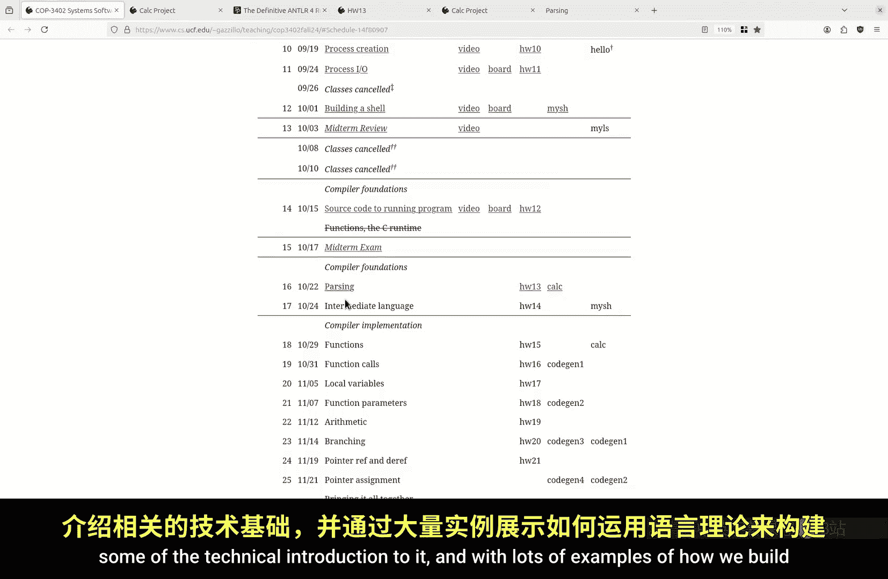

在本节课中，我们将要学习编译器的基础知识，特别是语法分析（Parsing）部分。我们将探讨其背后的哲学思想和技术原理，并通过大量示例来了解如何构建解释器和编译器。

## 编译器结构概述

上一节我们介绍了从源代码到可执行程序的完整流程。本节中，我们来看看编译器的内部结构。

编译器通常分为两个主要部分：前端和后端。

*   **前端**：处理输入语言，分析其语法，并生成一个**语法树**来表示程序的结构。
*   **后端**：接收语法树，并利用它来生成目标机器的机器代码。

你可以将这个过程想象成树遍历。在CS1或CS2课程中学习的树遍历算法，在这里有了实际应用——我们通过遍历语法树来处理和翻译程序。

## 中间表示与LLVM

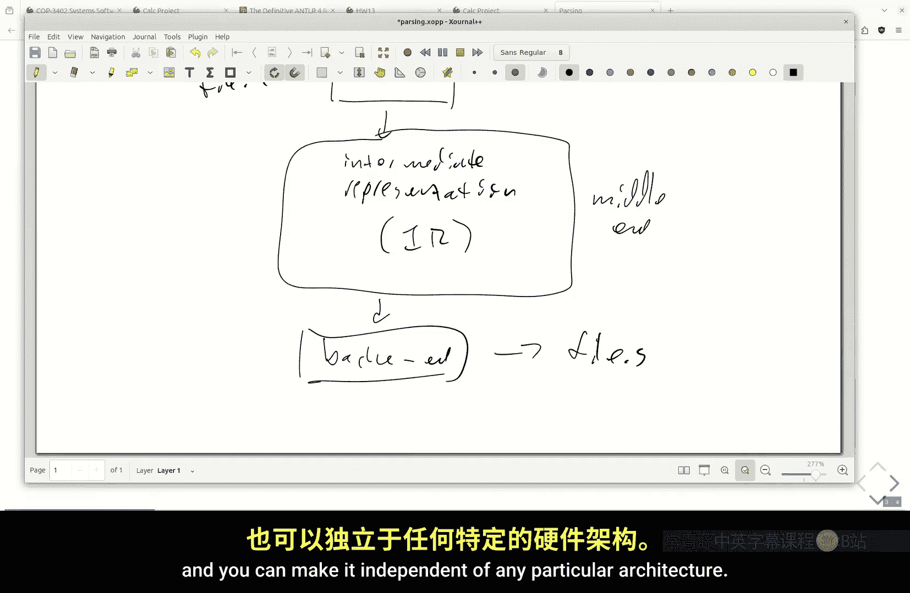

上一节我们介绍了编译器的基本两阶段结构。本节中，我们来看看一个更复杂的现实世界架构。

许多现代编译器引入了一个称为**中间表示** 的环节。前端将源代码编译成一种中间语言，然后由后端将这种中间语言翻译成目标机器的代码。

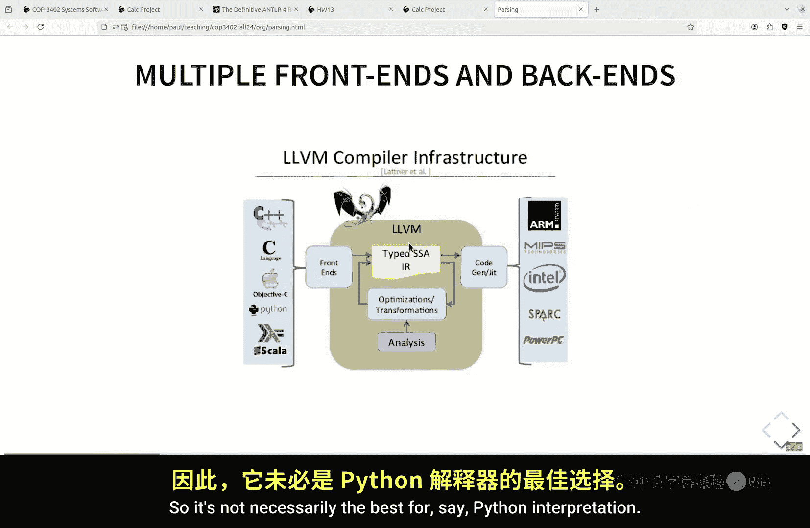

为什么需要这个额外的步骤？主要有以下几个原因：

1.  **支持多目标平台**：如果你想为X86和ARM两种架构生成代码，你只需要编写一个前端（将源代码转为IR）和两个后端（分别将IR转为X86和ARM代码），而不是两个完整的编译器。
2.  **简化编译器开发**：中间语言通常比真实的机器指令集更简单、更规整，编写针对它的编译器后端相对更容易。
3.  **实现优化**：可以在中间表示这个层级进行大量与具体机器无关的代码优化，提高生成代码的效率。
4.  **支持解释执行**：中间表示本身也可以被虚拟机直接解释执行，例如Python的字节码和Java的字节码。

LLVM项目是这种架构的一个著名例子。它定义了自己的中间表示，并围绕它构建了丰富的前端、优化器和后端生态系统。

## 符号与意义：哲学背景

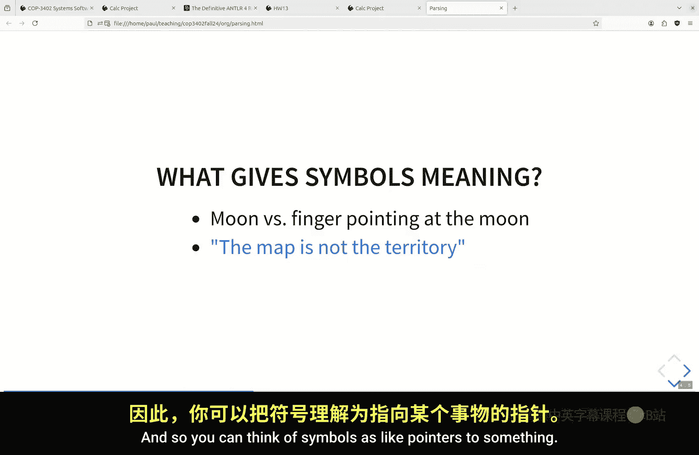

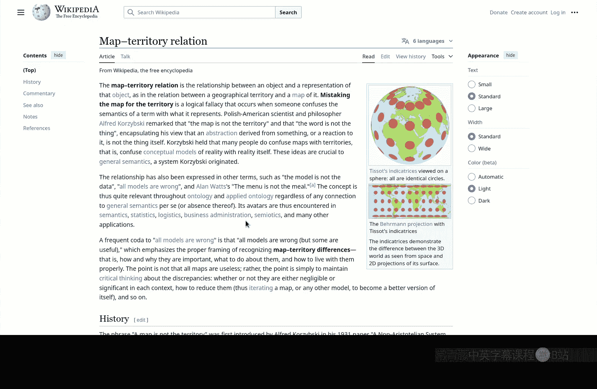

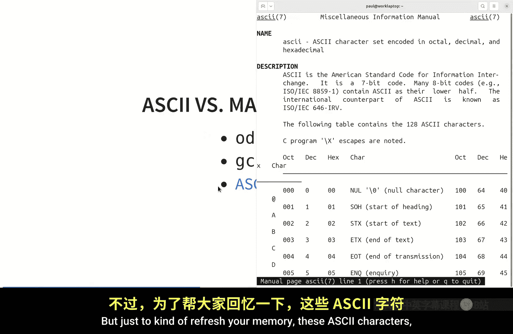

在深入技术细节之前，让我们思考一个更根本的问题：符号本身有意义吗？

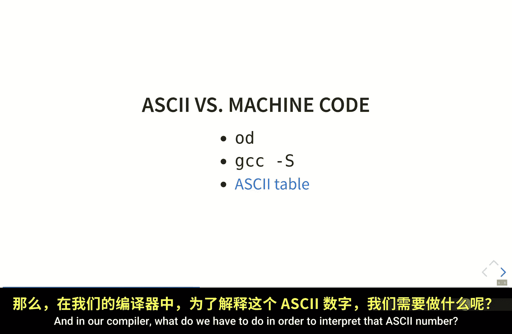

考虑这个算术表达式：`1 + 2 * 3`。对你来说，它的含义和结果是明确的。但符号`1`、`+`、`2`、`*`、`3`本身对计算机并没有内在意义。在计算机中，它们只是存储在内存中的特定ASCII码值（例如，字符`‘1’`的ASCII码是49）。

是什么赋予了符号意义？是我们定义的一套**规则**，这套规则解释了如何解读这些符号的组合。我们即将构建的编译器，本质上就是在为机器编写这样一套解释规则。编译器将符号（源代码）翻译成另一种符号（机器码），而机器码对硬件有直接的意义。

这种思想也体现在自然语言中。同一个词（如“store”）在不同的句子结构（“The store is closed” vs. “Squirrels store acorns”）中含义完全不同。**语法结构**在很大程度上决定了符号的意义。

## 语法树：从自然语言到编程语言

上一节我们讨论了符号和意义的关系。本节中，我们来看看如何用结构化的方式表示语法。

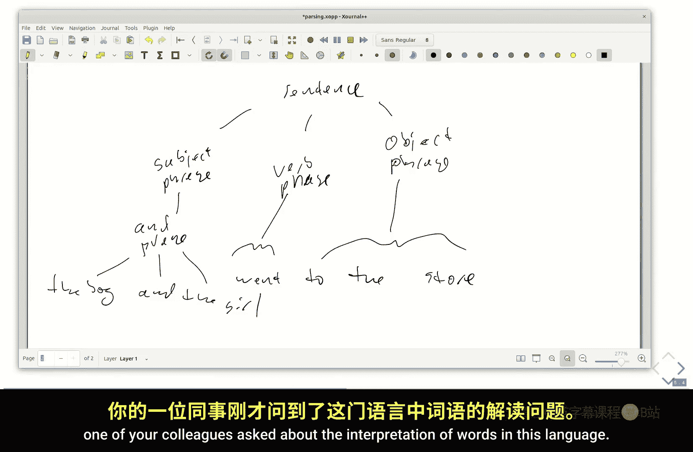

在自然语言中，我们可以通过**句子成分分析**来分解一个句子。例如，句子“The boy went to the store”可以分解为主语（The boy）、谓语（went）和宾语（to the store）。这种层次化的结构可以表示为一棵树。

编程语言的处理方式与此类似。我们使用**语法树**来明确表示程序的语法结构。树的每个节点代表一个语法结构（如“表达式”、“语句”），叶子节点代表基本的符号（如数字、运算符）。

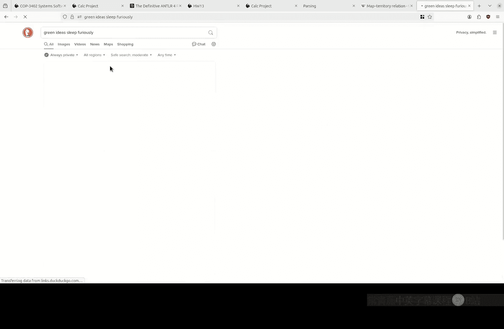

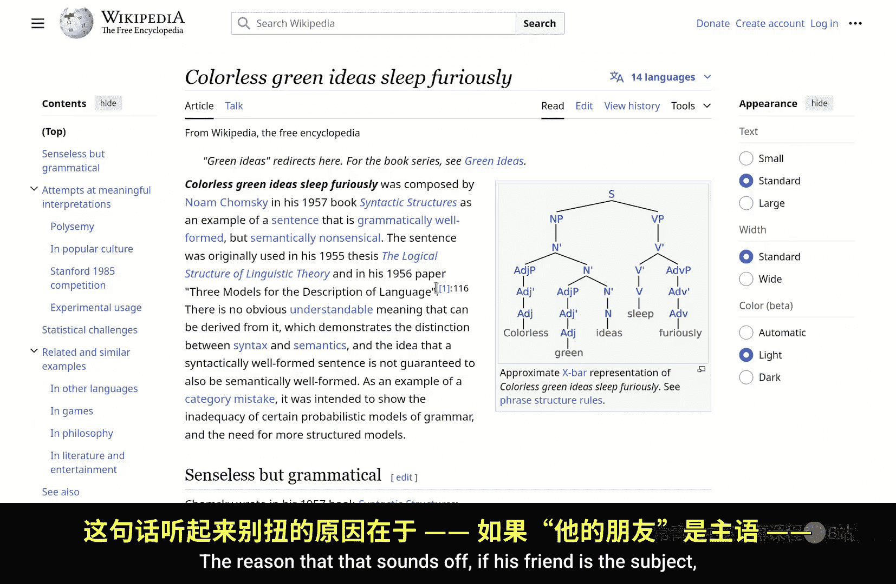

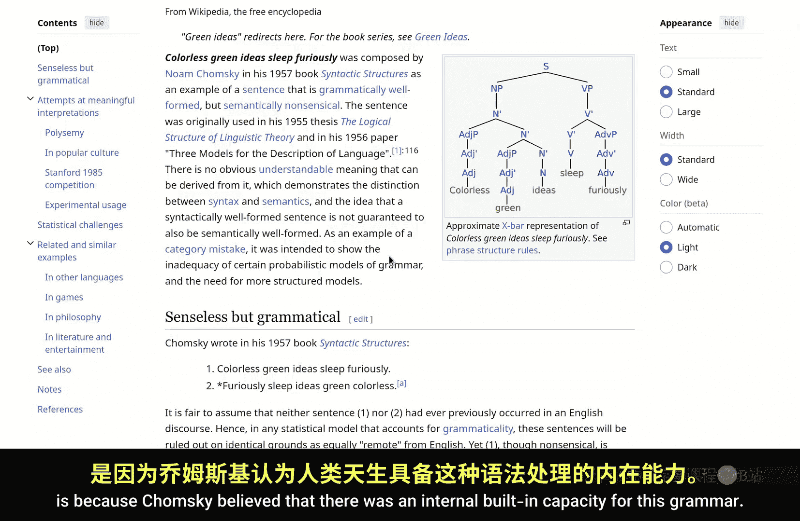

让我们为一个简单的算术表达式`1 + 2 * 3`构建语法树。首先，我们需要定义这个简单语言的语法规则。

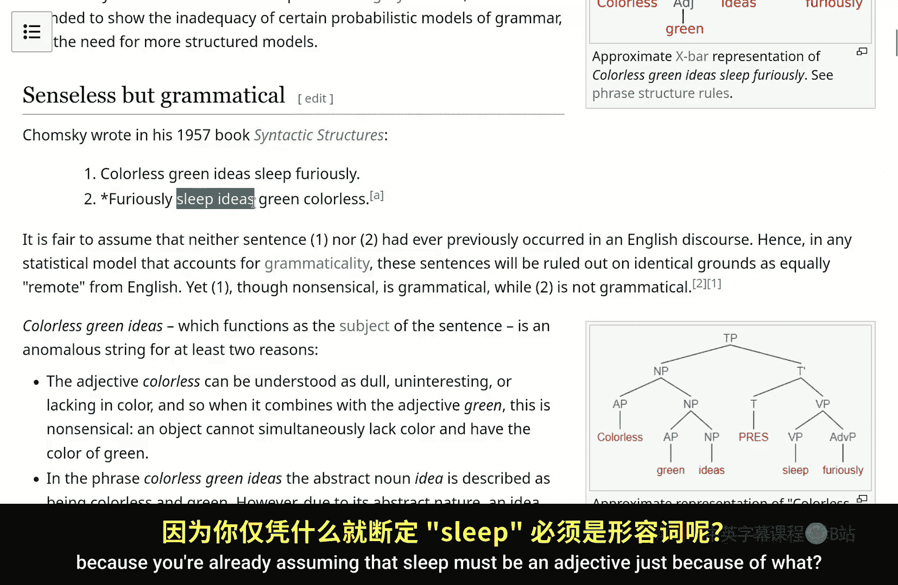

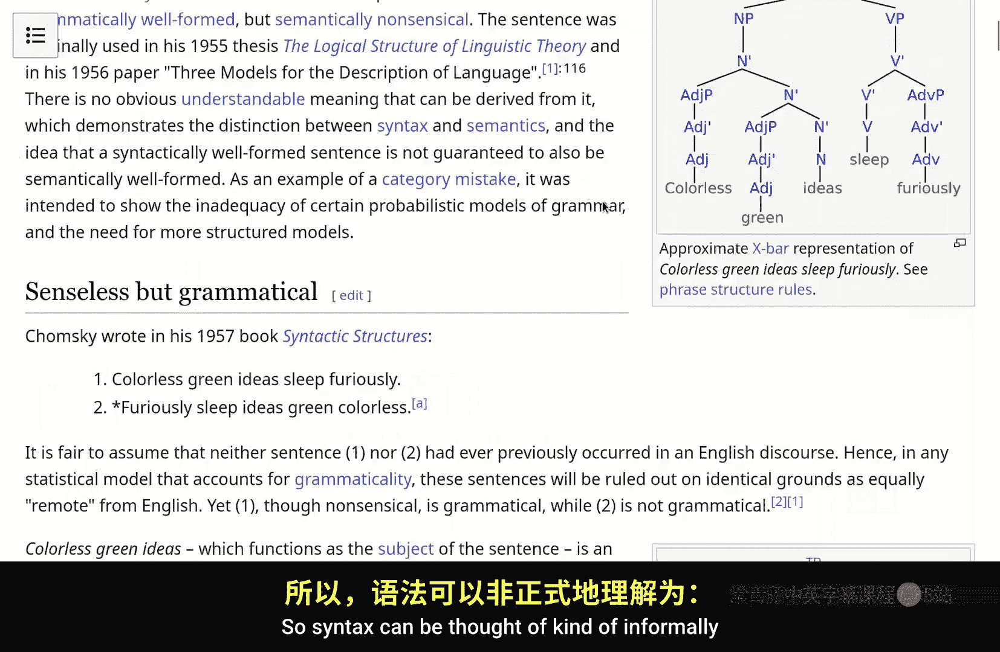

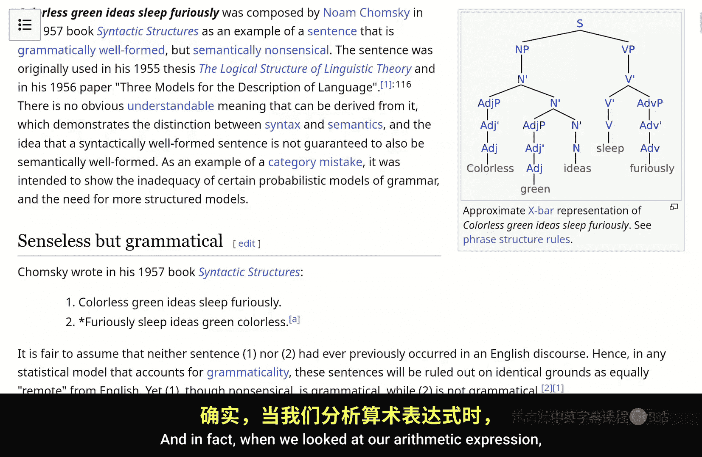

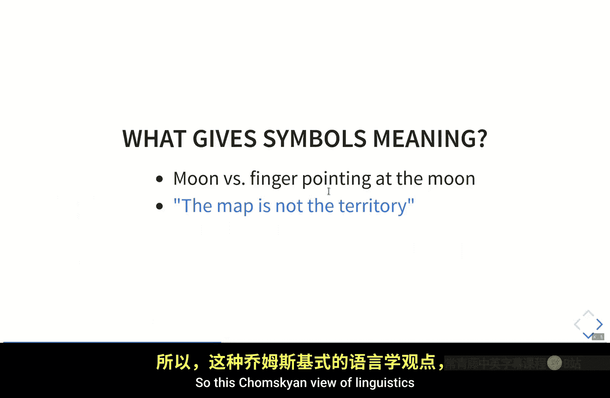

以下是该语言的语法规则示例：
```
E -> E op E | num
op -> + | - | * | /
num -> 1 | 2 | 3 | 4 | 5 | 6 | 7 | 8 | 9
```
其中：
*   `E` 代表表达式。
*   `op` 代表运算符。
*   `num` 代表数字。
*   `|` 表示“或”。
*   `->` 表示“可以推导为”。

根据这些规则和运算优先级（先乘除后加减），表达式`1 + 2 * 3`对应的语法树如下：
```
        E (op: +)
       / \
      /   \
     /     \
    E      E (op: *)
   / \    / \
num  op num  op
 |    |  |    |
 1    +  2    *
```

这棵树明确表示了`2 * 3`作为一个子表达式先计算，然后其结果再与`1`相加。

## 解释语法树：赋予意义

我们有了表示语法结构的树，下一步是如何从中得到结果（或生成代码）？这需要通过**遍历树**并应用语义规则来实现。

一个简单的方法是**后序遍历**：

1.  当遍历到一个`num`叶子节点时，将其字符形式（如`‘1’`）转换为机器能理解的整数值（如`1`）。这可以表示为规则：`num -> 将ASCII码转换为整数值`。
2.  当遍历到一个`op`节点时，将其转换为对应的运算函数（如`+`转换为`add`函数）。
3.  当遍历到一个`E (op: +)`这样的内部节点时，规则是：先得到左子树`E`的值，再得到右子树`E`的值，然后应用`op`对应的函数。用伪代码表示：`E -> apply(op. function, left_E.value, right_E.value)`。

通过这种方式，我们从纯粹的符号结构出发，通过定义明确的解释规则，最终得到了表达式的计算结果。编译器的工作与此类似，只不过它“解释”的结果是生成另一套符号系统——机器代码。

## 课程总结与作业

本节课中，我们一起学习了编译器的基础概念。我们了解了编译器前后端的划分，认识了中间表示的作用，探讨了符号、语法和意义之间的关系，并学习了如何用语法树表示程序结构以及如何通过遍历语法树来解释程序。

以下是本节课的核心要点：
*   编译器前端负责**语法分析**，生成**语法树**。
*   编译器后端根据语法树**生成代码**。
*   **中间表示**是连接多种源语言和目标架构的桥梁，便于优化和移植。
*   符号的意义由我们定义的**解释规则**决定。
*   **语法树**是程序语法结构的显式表示。
*   通过**树遍历**并应用语义规则，我们可以解释或编译程序。

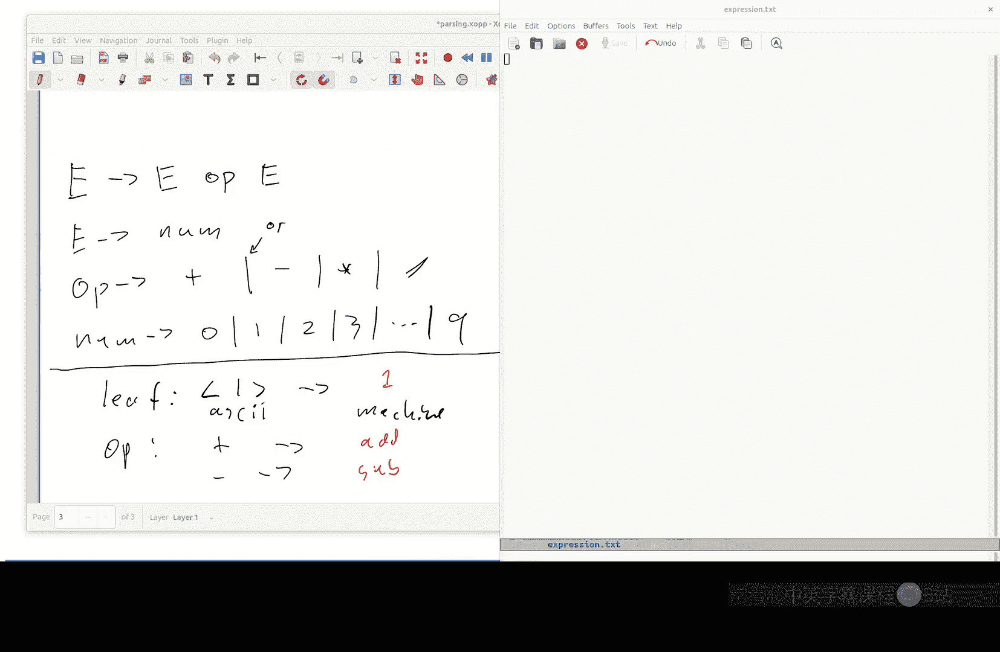

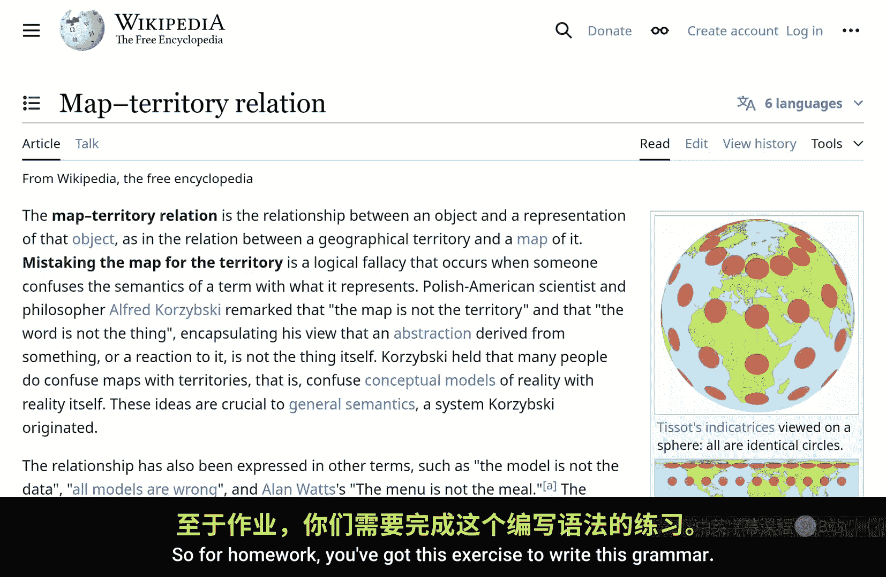

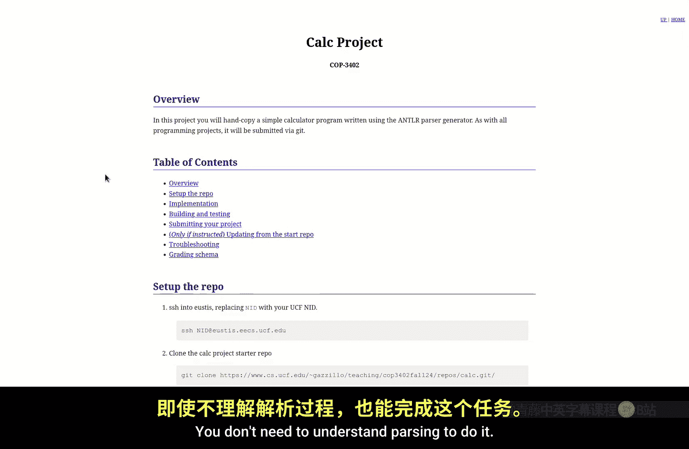

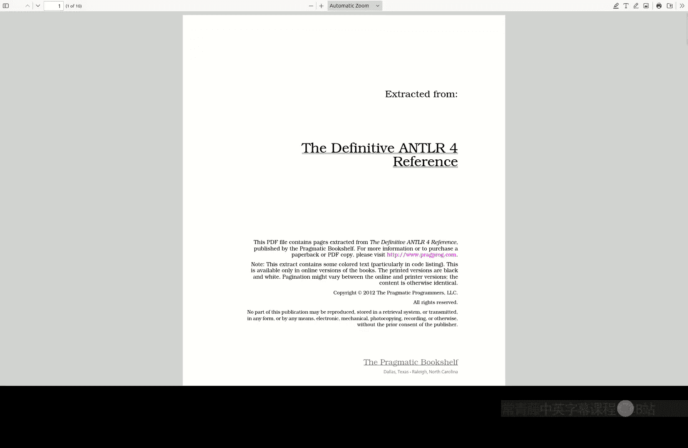

你的作业是尝试为逆波兰表示法编写类似的语法规则。你也可以开始计算器项目，下周我们将完成语法分析的讲解，并开始我们的编译器项目。