# 系统软件：P17：编译器基础与中间语言 (COP-3402 Fall 2024)

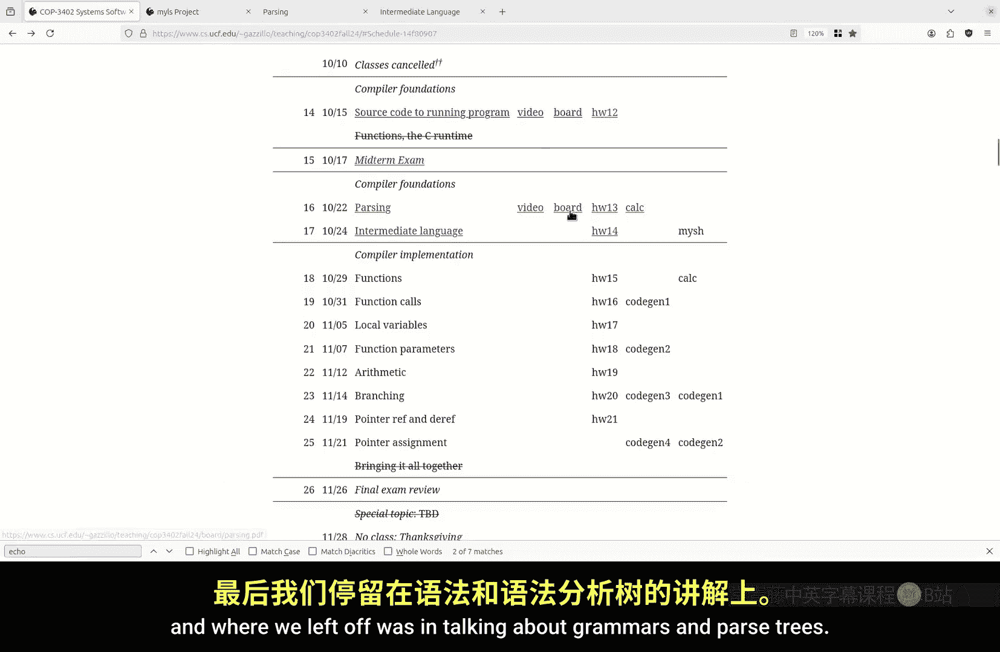

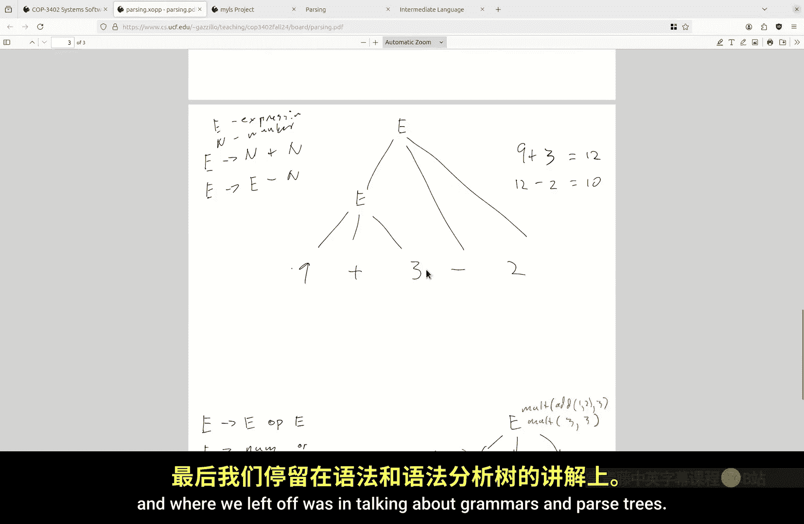

在本节课中，我们将完成对语法分析的讨论，并介绍我们将用于编译器的中间语言。我们将学习如何通过形式化语法来定义语言的语法和语义，并了解如何利用语法树进行解释或编译。

## 语法分析与语法树

上一节我们讨论了编译器的内部结构，以及符号与其含义之间的哲学关系。我们结束于对语法和语法树的讨论。

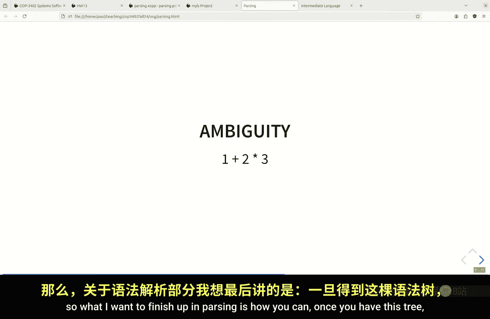

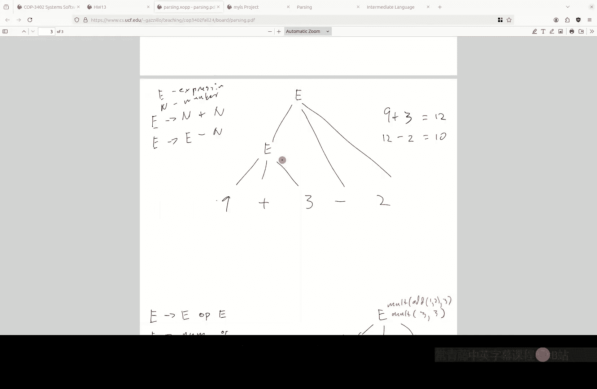

语法定义了语言中所有合法句子的结构。语法树则直观地展示了单个句子如何根据语法规则构建而成。

以下是关于语法的一些核心概念：

*   **终结符**：语言中实际出现的单词或符号。在算术表达式语言中，终结符是数字（如 `0`, `1`, `2`）和运算符（如 `+`, `-`, `*`, `/`）。
*   **非终结符**：用于描述语法结构的元符号，它们本身不出现在最终句子中。例如，`E`（表达式）和 `N`（数字）是非终结符。
*   **产生式**：定义非终结符如何由其他符号（终结符或非终结符）组成的规则。例如，规则 `E -> E op E` 表示一个表达式可以由两个表达式中间夹一个运算符构成。

形式化语法的精妙之处在于，它能用有限的规则描述一个无限的可能句子集合。这类似于递归函数定义，一个规则可以生成无数个具体的实例。

## 解释语法树

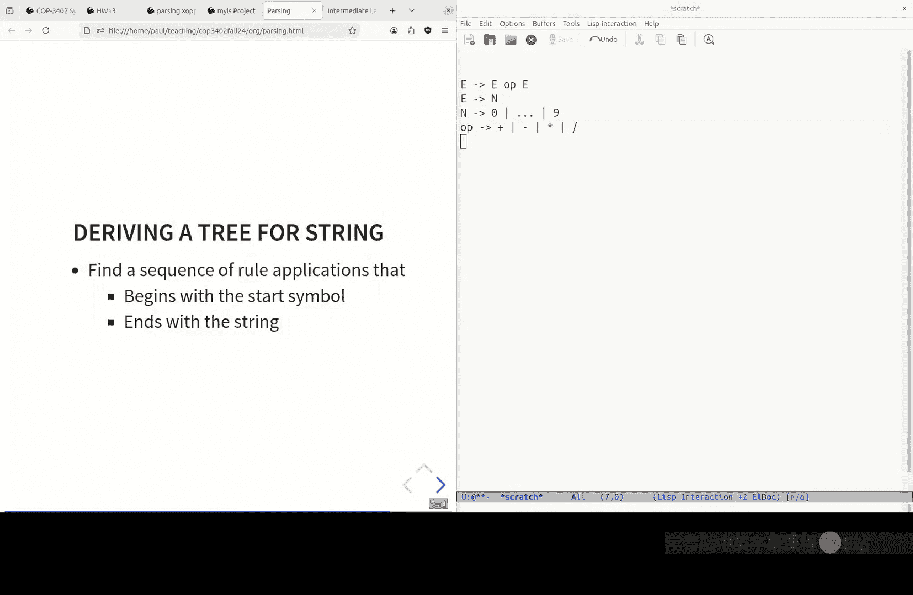

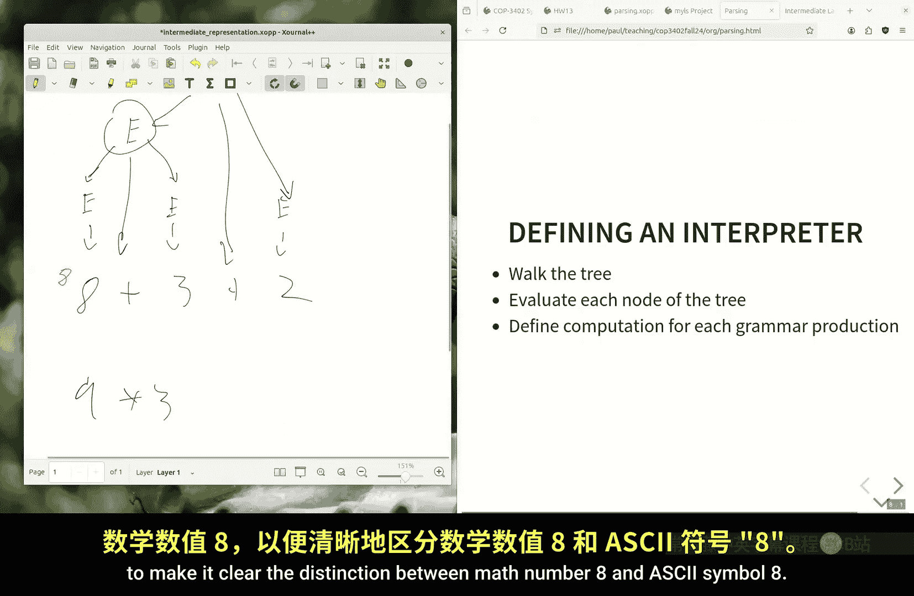

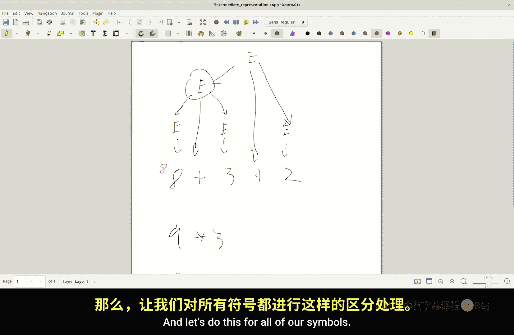

一旦我们有了表示程序结构的语法树，就可以定义规则来解释或编译它。

以算术表达式 `8 + 3 + 2` 为例。其语法树如下所示：

```
        E
       /|\
      E + E
     /|\   \
    E + E   2
     \   \
      8   3
```

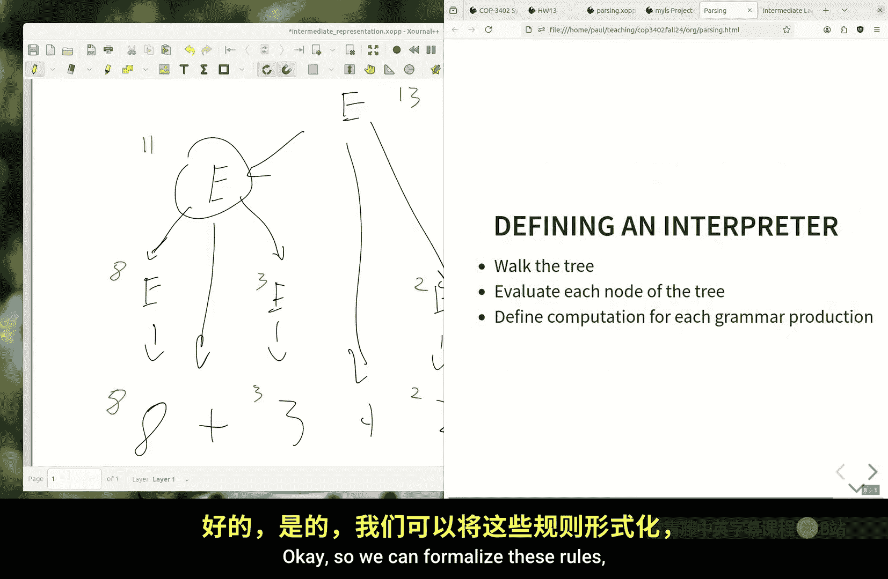

为了解释这个表达式（即计算其数值），我们可以为树中的每种节点类型定义语义规则。

以下是解释算术表达式的规则：

1.  **数字节点**：如果一个表达式 `E` 直接匹配到一个数字 `N`，那么该节点的值就是该数字对应的整数值。用伪代码表示：
    ```
    E.value = ascii_to_int(N.symbol)
    ```
2.  **运算节点**：如果一个表达式 `E` 的结构是 `E1 op E2`，那么该节点的值是对左右子表达式值应用运算符 `op` 所对应的数学运算的结果。用伪代码表示：
    ```
    E.value = apply_operator(op.symbol, E1.value, E2.value)
    ```

通过后序遍历这棵树并应用这些规则，我们就能计算出根节点的值，即整个表达式的结果 `13`。这个过程明确了如何从纯粹的符号（`8`, `+`）推导出具体的含义（数学值 `13`）。

## 编译：语法树到代码生成

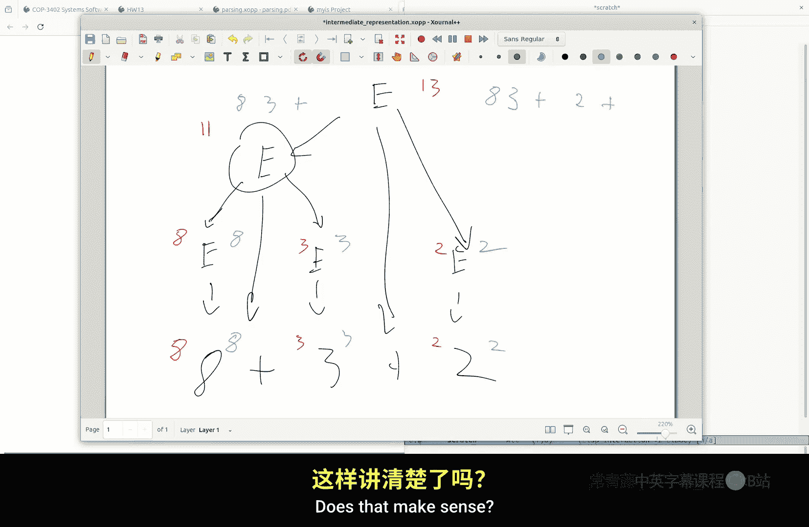

解释器直接计算程序的值，而编译器则将程序翻译成另一种语言。我们可以使用相同的“语法规则加语义动作”框架来实现编译器。

以中缀表达式转后缀表达式为例。我们不再计算节点的值，而是定义规则来生成代表后缀表达式的字符串。

以下是中缀转后缀的编译规则：

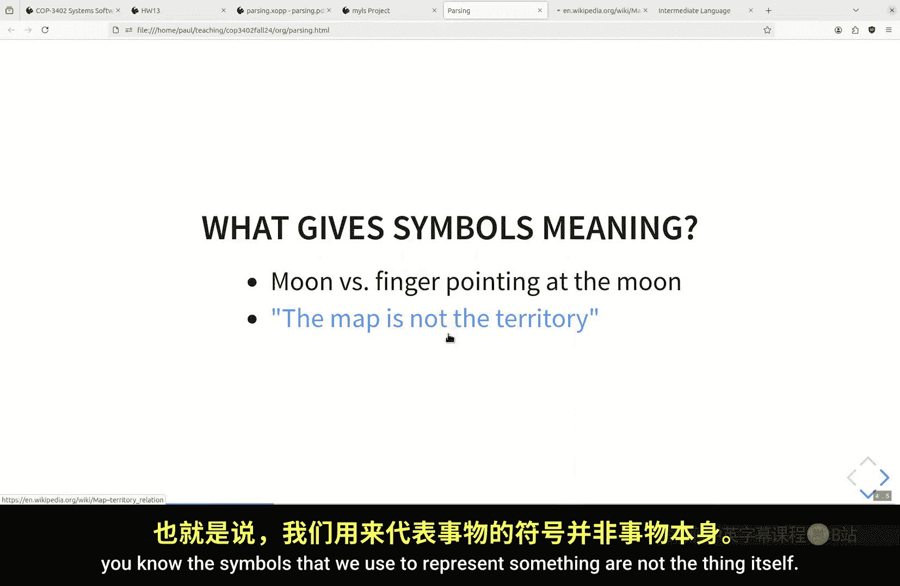

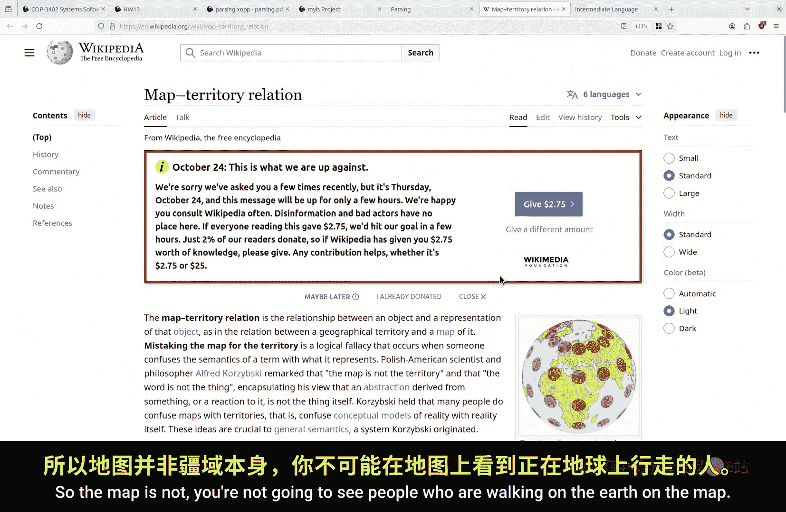

1.  **数字节点**：直接输出该数字符号。
    ```
    E.code = N.symbol
    ```
2.  **运算节点**：先生成左子表达式的代码，再生成右子表达式的代码，最后附上运算符。
    ```
    E.code = E1.code + " " + E2.code + " " + op.symbol
    ```

将这些规则应用到 `8 + 3 + 2` 的语法树上，我们会自底向上生成代码：首先得到 `"8 3 +"`，然后与 `"2"` 和 `"+"` 结合，最终得到后缀表达式 `"8 3 + 2 +"`。

这清晰地展示了编译器的工作模式：识别输入程序的语法结构，然后为每个结构生成目标语言的代码片段。

## 引入中间语言：Simple IR

现在，我们来看将用于本课程项目的中间语言，称为 Simple IR。这是一种比 C 语言更简单、更接近汇编的语言，便于翻译成机器代码。

一个 Simple IR 程序文件对应一个函数。其基本结构如下：

```
function_name: local_var1, local_var2, ..., local_varN
parameters: param1, param2, ..., paramM
// 指令序列
return value_or_variable
```

以下是 Simple IR 支持的主要指令类型：

*   **赋值**
    ```
    x = 5        // 常量赋值
    y = x        // 变量赋值
    ```
*   **算术运算**（单操作，无嵌套表达式）
    ```
    z = x + y
    a = b * 2
    ```
*   **函数调用**
    ```
    result = call read_int
    call print_int, x
    ```
*   **控制流**（类似汇编）
    ```
    top:
    if x <= 0 goto end
    // ... 其他指令
    goto top
    end:
    ```
*   **指针操作**
    ```
    p = &x       // 取地址
    y = *p       // 解引用（取值）
    *p = 10      // 解引用（赋值）
    ```

让我们看一个计算幂运算 `base^exponent` 的 Simple IR 程序示例：

```
power: base, exponent, result, temp
parameters: base, exponent
result = 1
top:
if exponent <= 0 goto end
temp = result * base
result = temp
temp = exponent - 1
exponent = temp
goto top
end:
return result
```

这个程序展示了如何使用标签、条件分支和无条件分支来实现循环逻辑。它非常类似于你将要生成的汇编代码结构。

## 总结

本节课中我们一起学习了编译器基础中的几个关键概念。我们探讨了如何用形式化语法描述语言结构，以及如何通过语法树进行解释（求值）和编译（翻译）。我们特别介绍了中缀转后缀作为编译的实例。最后，我们详细介绍了将在项目中使用的 Simple IR 中间语言，它简化了从高级结构到低级汇编的转换过程。

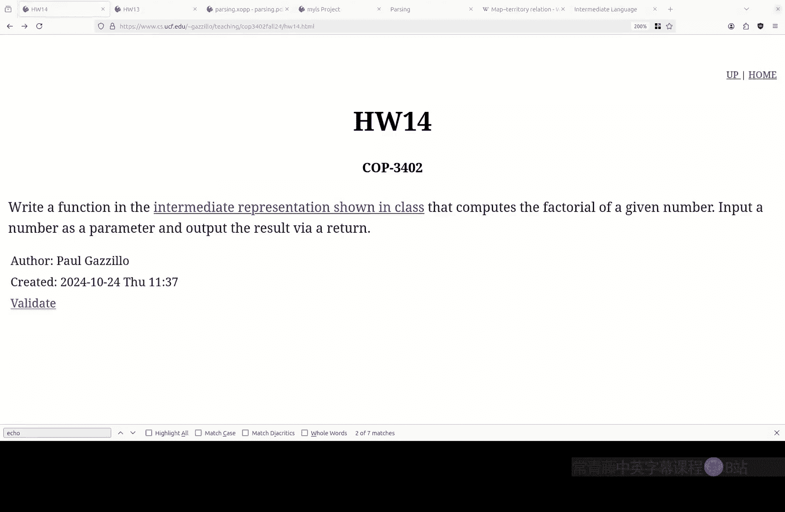

理解符号（语法）与其含义（语义）之间的区别，以及如何用明确的规则将它们联系起来，是编写编译器的核心思想。在接下来的课程中，我们将开始学习如何将 Simple IR 程序编译成实际的汇编代码。