# 佛罗里达大学 【中英⚡系统软件｜COP3402 Fall 2024, Systems Software】 p18 P18 Compiler implementation： Functions (COP-3402 Fall 2024) -BV1v6vdBKEHB_p18-

All right， everyone， welcome back to System softwareftware。

So now we are going to start our implementation of the compilers。

 so we went over a really brief crash course in parsing。

 we looked at the intermediate language that we're going to be compiling to assembly。

So and don't forget tonight， you have the CALC project due， and that's just copying hand copy。

 hand typing out code so you can get your environment set up for the compiler framework。

Questions on the kind of concept of parsing， questions on our intermediate language。

I've also released the first project description。And we'll go over this more next time。

 but you'll be。Compiling part of our intermediate representation to。Assembly。

 and this part will just be for function definitions and function calls， so no parameters。

 no local variables， just functions and function calls。there's the code for this is pretty short。

 but there's a lot of subtlety to the assembly。To doing this， and we'll go over today。

 start going over today， this notion of functions and how they actually get implemented on the machine because the C language notion of a function is not quite supported or is not directly translatable into。

X86 assemblyly code。O。So let's。Get started。All right， so first let's start off with。The kind of。

Saamme question you always hear in every class， is a function。

 what is a function in programming languages？Yeah。That's a good word， encapsulates code。

And how do you call it？Well， how do you identify that the concapsulated pizza code？Well。

 do you actually specify an address when you call it？It's named， yeah， it's name， so yeah。

 that's a perfect definition we have encapsulated code， some computation that's named。

And the benefit of that。Is that？You can call it multiple times。

 you don't have to rewrite the code every time you do it。

And a function is really a method of abstraction in code， you can add new terms to your language。

So if you think about C， you have several keywords like if and while。呃。But with functions。

 you can actually add your own names to the language。Just like the variables。

 you can add your own name and that name is not just storing some memory like a variable。

 storing some data like a variable， you can actually name a computation， add it to the language。

 and now you can use that name whenever you like when you're writing code。

And so that's kind of a nice definition of a function abstraction， It encapsulates a computation。

And say at least it's defined by a name， there are other language that have anonymous functions。

 and also as you're getting at， also it's input and output。So a function is not just a named。

Chunk of code， it also has IO Does anyone know the term for a function like thing a named piece of computation where you don't have an IO specification yeah。

Oh okay that's a good， that's a good one， so macro is sort of like that macro is really just text replacement。

You probably it's subrtine have you ever heard the term subrtine。

 so this is like old school language implementation。

 but a subbertine is like a function except there's no real IO specification， it's just a name。

 a label basically a branch to a lines of code and this IO behavior and the way functions handle this actually sets apart quite a bit from a branch or a subrtine which is。

What we'll have to deal with in our compiler yeah。Oh s chicken， yeah， sure。So if you've never。

This is more like。Old school。

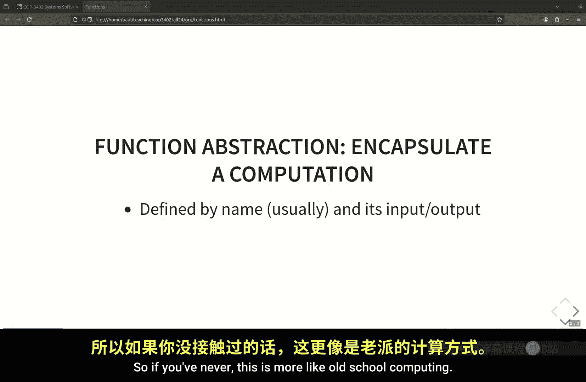

Computing。Subroutine。

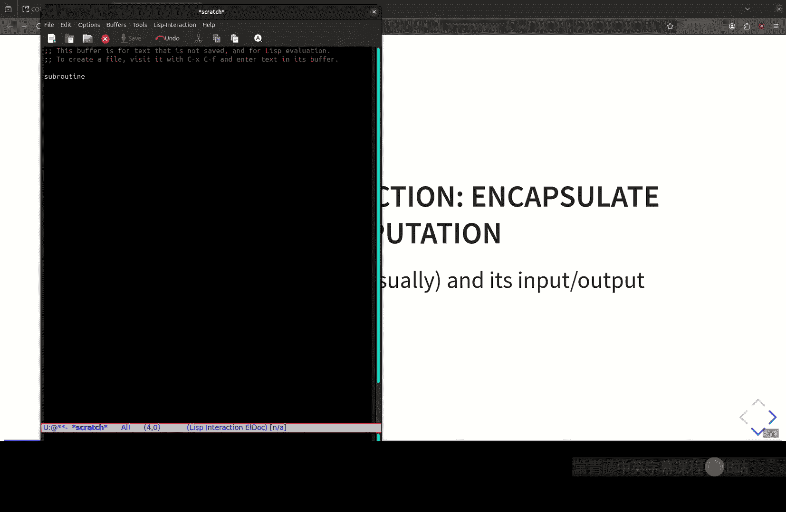

So you don't really see these called out very much in current languages。

 the kind of abstraction you use for encapsulating code is functions。

 pretty much all popular programming languages have some function abstraction。

And you're probably very familiar with their behavior because you've written C。But has it work。

 when you make the call， you get the name， you put the input values that you want to pass as input parameters。

And then the caller freezes， it stops executing， right。

 and it waits until this function has completed execution。And then it comes back to the caller。

 and then that returns its value and then continues running。

So this is probably all really obvious you probably know this。

 but if you think about some other behavior like our Fork system call。It worked in a similar way。

 but then we had multiple processes， so we didn't get this blocked freezing state。

 there are also functions， non blocking IO functions in the kernel level。

 but functions in C work like this， transfer control to the colli function， the collar freezes。

Give input values to that colee。Call E does some computation， computes a return value。

 passes it to the caller。That function is done， and then the caller can resume exactly where it left off。

Questions on that。So this feature， this ability to freeze。

The state of the call because you're running when this color function is running。

 it's operating on memory， it has its own variables。

And that stays sound that doesn't get messed up by your color function， called E function。嗯。

Unless you want it to， if you pointers， for instance。

But the abstraction preserves this state of each function。

So let me give an example of what this looks like。So here's a set of three functions we have main。

Main prints out the result of calling F and passing three。F takes in one parameter。

Passes that parameter to G， adds one to it。That called a G， it takes its parameter。

 and multiplies it by two， returns its value。Questions on this example。Okay， so what we call Maine。

Main calls F。F has。A variable A that it holds is three。And F also calls G。

And it has a value when G is called from F in this program。

 what's the value of B when it gets called？TheV of B when it gets called。Three， so A is three here。

 when we call G。A gets evaluated and C， A gets evaluated。And that's used as the input parameter too。

Gi。So when we first call G。Its input parameters is named B inside of its own function。

 and so that B gets assigned to whatever its call or past it as input B。It's also free。

Now what happens， what's the return value？G returns。What value does a compute， compute six？

And so we get back to this。😔，Call here。We can just think of that call being replaced with its return value。

And then。呃。Then F computes its return value。To7。And inside of the call to F of3。

 that gets replaced with whatever its return value is。Questions on this。Yeah。

Void functions are not meant to have return values。It would be avoid value。

 I think it would probably be a compile time error in C it would probably say you can't assign avoid value。

Something。But any questions on this， just the kind of basic semantics of a C function？Okay。All right。

 so let's see how this actually gets implemented。So let's say instead of having a local variable。

 we had x here as a global variable。What's the return of？So if we call F。

 I didn't put the main function here， but let's say we call F。We run F what gets printed out。

 so we assign x to 1， we then assign y to whatever the return value of G is。We print X， we print Y。

G assigns x to two， returns its value。So it gets printed out。Okay， who says one， two？

And you had a different answer。Ttu， who says tutu？Okay， so's let's walk through it。

And can use our diagram here to keep track of our state。All right。

 so we've got this global variable X。We have some variable Y， which I didn't even declare。All right。

 well we call F。When we call F， it assigns x to 1， so x gets1。

It assigns Y to whatever the value of G is。But in order to compute this， we need to freeze。

Hait for freezeze F state。Because it has its own state， has a position that it's executing at。

 if it has any local state， has local state， and we go off and we compute G。So we go to compute G。

 what does it do， it assigns x to 2。So which x gets modified？The Global X， it's a global X。

That both F and G have access to。So this x here， this global X gets updated to two。And we return to。

 although nobody's there to accept the return value。

We return and we return exactly back to the place where we left off or strictly speaking the next assembly instruction。

And this what's the value of G？Here， so we return oh sorry， it does get used。

 so two gets returned here。And what's the value of。The call to G after we。Complete executing。这个。

So what's the value of why here？Also two。you had a question？Wow。

 but it'll be quite different because then it wouldn't be。

It wouldn't be a global variable and that's exactly the point here is that when you have a global variable。

 these are really just subrtines， there's no local state to these functions。

 it's no different than just having a branch。😔，In assembly。But okay。

 let's finish it out to make sure everybody's clear， so then we've got a print statement。Print X。

Print why？So what's the value of accidentally printed here？It's two。

 what's the I of y also two So those who said two， two， you're right， those who said one。

 two were probably thinking， well， this x you're used to having variables being local to functions。

So。It must be one too because x is local， so you're probably already thinking of the function abstraction in your head without realizing it。

Okay， so this is exactly what your fellow student asked said， what if we have functioned local state？

Just to make sure everybody's on the same page， let's go through this。

So the only difference with this。The version of the program。It's the same program， except。

X is now inside， declared inside of F and G， there' are actually two。Versions are two different x's。

So let's just make sure we're all on the same page about how this program executes。So inside of F。

 so let's start executing F here。I assign x to1。What happens to X？Okay， which X？The 1 andF， yeah。

 so we can think of our memory as now being divided。Into variables for。Different functions。

 they can have the same name， but they're actually different locations in memory。

And so you can actually even draw out。Write your RAM and say， all right， well， this is F' x here。

And we can make a separate。Space for GX， so they have two different memory locations。

 somehow this is going to have to happen right， it's going to have to have some different memory locations。

😔，For these。Okay， so we sign x to1， which x gets assigned to1。And then we have y equals。

Whatever the return IOG is。Let's make。A space for Fs。Why here？So how do we compute the value of G？

Pause， yeah。Yeah， we pause the execution。And we。Start computing。The value of G， all right。

 so G is now going to assign x to2， so which x gets assigned to 2？Jesex。So Fx stays one。

And so I know for sometimes this probably seems like very simple， right。

 like you can figure this out on your own。But how this is actually done。

 we're going to learn how we actually， because the assembr will not do this for you。

Your compiler has to be able to manage memory automatically for you All right， so X to G's X2。

We return x， which is two and resume control back here。Replacing G with two。So when we print。X。

 and then print Y。What do we get？Which X gets you theory？F it's Fx， which is one。

So we print one and we print two。Questions， questions on this。So because you go all learn C。

 you just sort of know about scope， you know that because。This X。Is declared within F。

 you know that all x's that appear within the body of F all refer to this x。And you've been trained。

 you've learned that if you see an x。Used in。Another set of curly braces in another body。

 but that's a different X somehow， even though they have the exact same name。

 they're actually a different X。And now using that is pretty straightforward once you learn it。

 the trick is， how do we write a compiler that will generate assembly code that will manage this for us because I can remember。

What does X mean to the machine？What's the x representation of x here in this text file？

In this text file， what is x？It's an ASI symbol， so this has zero meaning。

To the machine in terms of its computation， so it's the compiler it needs to interpret this。

And create a memory location for it。 So sure， when we write the compiler。

 what we're going to do is we're going to associate these。Sybols with memory locations。

 but there's nothing intrinsic in the source code that does that。 It's the compiler that will。

Create that behavior that will create that semantics that will specify that semantics。All right。

 I know this is probably like seems like really rudimentary indeceive questions on。This behavior。

Yeah。ば。因？No， the syntax， no， it's a simple idea， it's an intermediate representation。

 we don't have any of those， so that's just syntactic。

So there's nothing different about that syntactic sugar， so to speak for in X， in Y， in Z。Right。

 and you only do intermediate languages I mean you won't have to compile C。

 the intermediate language， it'll be much easier if you want if you're interested in the full compiler toolch。

 take my compilerss class next semester， if you're interested in doing that。

 but yeah we're going to have a much， much easier task。

 but in order to compile functions because functions are C like in our IR。They're not assembly like。

 so you're still going to have to implement it。The behavior of sea like functions。In your compiler。

Okay， so that's local state， functions have local state。

And you can think of that as separate memory locations for all of the local variables to that function。

 even if they have the same name。Each function gets its own allocation of variables。Okay。

 let's look at the second， yeah，A very good question， very good segue into my next section here。

So what happens when we do this with recursive calls， so we've got a nice okay。So。Let's see。Yeah。

 so in this example I have。A staticically allocated。Variable here。So it's function local。

 but it's actually so statically， you can think of it as global。嗯。It has its own local variable。

But yeah， we'll see what this looks like when we go to run this static function。Okay。

 so this is a classic factorial with a little bit of a modification。Let me get a new page here。

All right， so let me just walk through it to make sure we're all on the same page。

So this factorial takes one integer x as an input， it declares a local variable that is local to itself only。

 so if there's another old X declared somewhere else that's going to be a different memory location。

 it has its own memory location for this X， we'll talk about static in a second。

If that x is less than equal to0， we return one， it's my kind of lazy error handling otherwise。

We copy the x， for some reason， we copy it to this old x variable， and we decrement x。

Maybe it's not the best way to write it， this is the way I wrote it。

And then when we compute the return value， return， whatever that old x was。

 multiplied by a factorial of the new X。Questions on the algorithm。

I know you might question why I wrote it this way， but questions on。The algorithm。

Does it compute factorial？Okay， let's， let's see what it computes。All right。

I'll just lay out the memory here， so we've got a space for。Old X， we've got a space， well。

 let's give a space for x first， we've got a space for x。We've got a space for old X， and yeah。

 that's all we need，' got a space for X and a space for old X。All right。

 so let's say we call F factorial F3。I'm just going to say F of3 because I'm lazyvy， so F of3。

 when we start executing tuial with F of3。What's the value of S？对。Okay。

So then I go to this line here， x less than equals0， is this true or false？It's false， so we go here。

What does this assignment do to our memory state？Yeah。Okay， so old x is3， and now x equals x minus 1。

 what happens to our memory？That becomes two。All right， so in order to compute old x times factorial。

Let's。Write this down so we don't forget it。But yeah， so what's the value of x here？

So we call F of2 oldX。We know is three， so we're going to be computing three times whatever the result of FF2 is。

So what do we have to do in order to compute？In order to figure out what this value is。Yeah。

 and regardless of whether it's recursive or not， we just have to call this function。

 which means we pause the state of our current call。😔。

And go off and start executing kind of another version of。

 we just start running from the top effect Okay， so when we do F of2。

What's the value of x when we do F of2？It's two， so this variable stays the same。

 the size stay the same。And is x less than or equal to zero？No， so we go down to oldX。All right。

 so what's the value of old x here？It's 2。All right， so now old x is 2， and what's x here？我。嗯 right。

So then we've got a compute。Old X。Times。F of1。All right， now we compute f of1， same thing happens。

 x is already 1， old x gets turned into1。And we'll call。F。Of zero。So F of0。

Finally triggers our return of one。

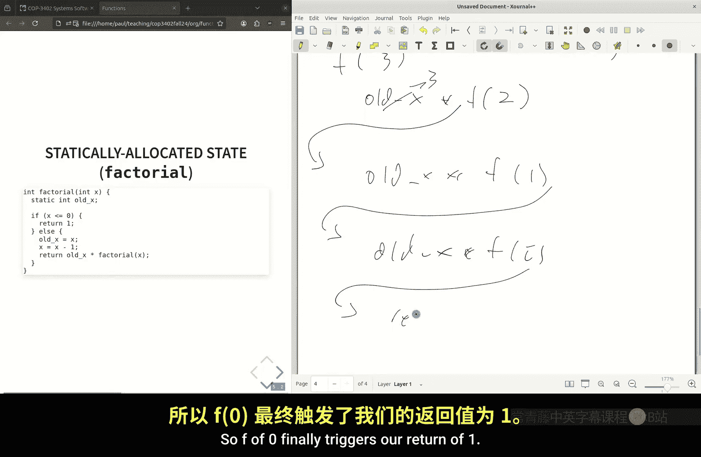

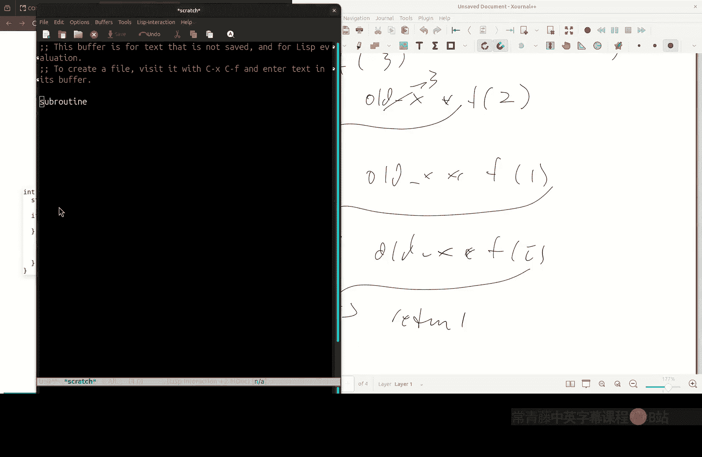

So here is。

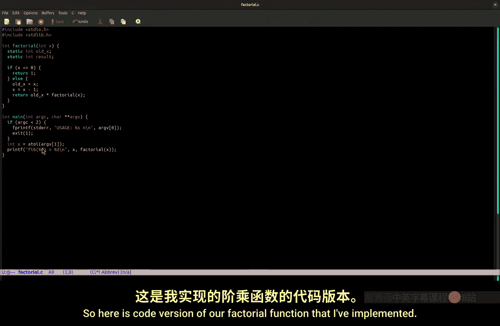

Code version of our。Factctorial function。That I've implemented。Okay， so when I run factorial。Here。

I get one。And the reason is that。

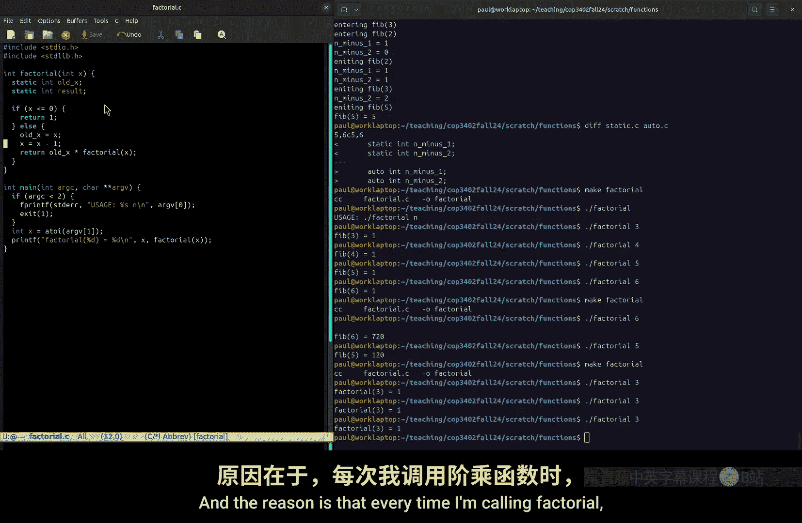

Every time I'm。Calling factorial， I'm reusing the same。State in memory。And so this。

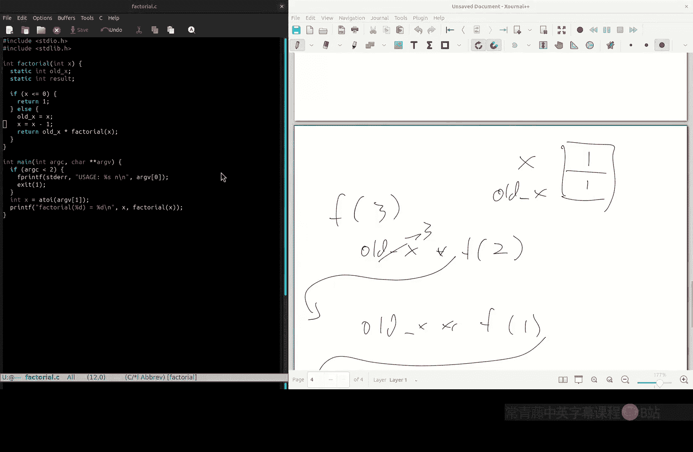

Blows away the previous old X that I had。And I just want to confirm something that this actually works when you take out static。

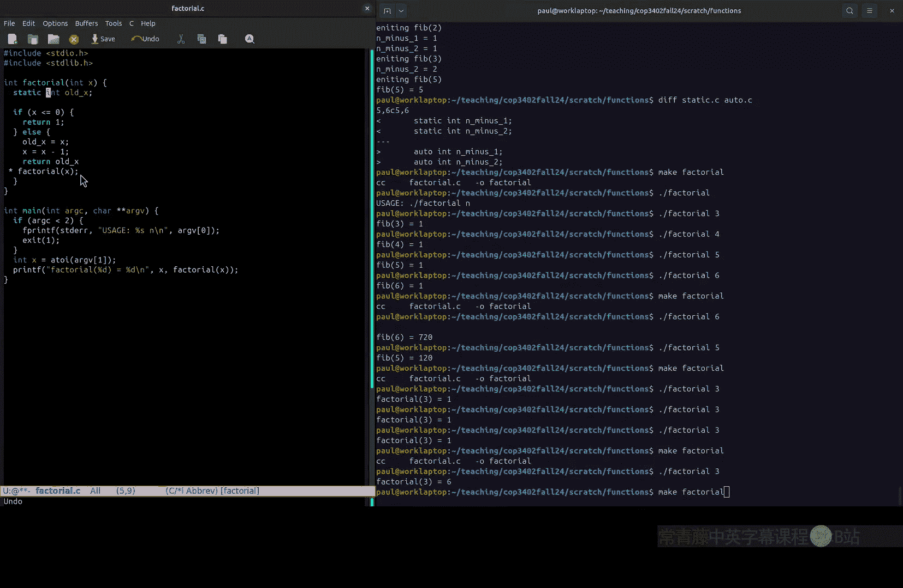

So anyway， so the fact that we're reusing the same state every time。

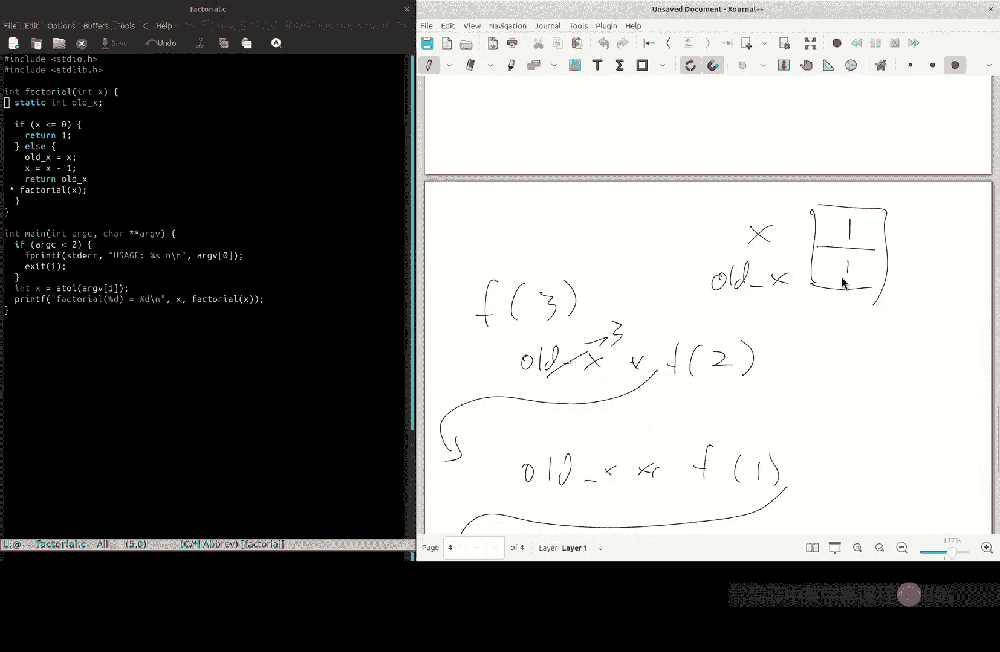

呃。或者。

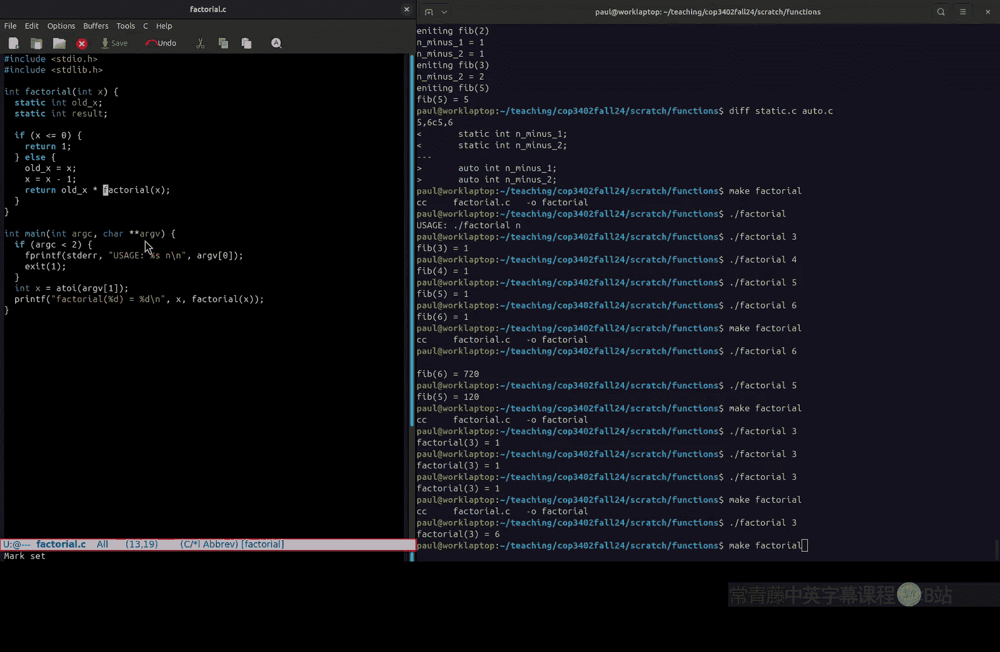

呃。Sorry， I think I made a little mistake here。So I。Put old X first。I think OX should be second。

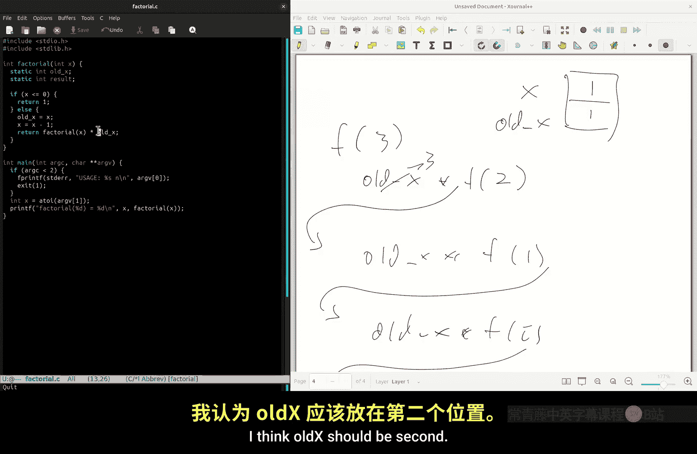

6。Let me just double check。

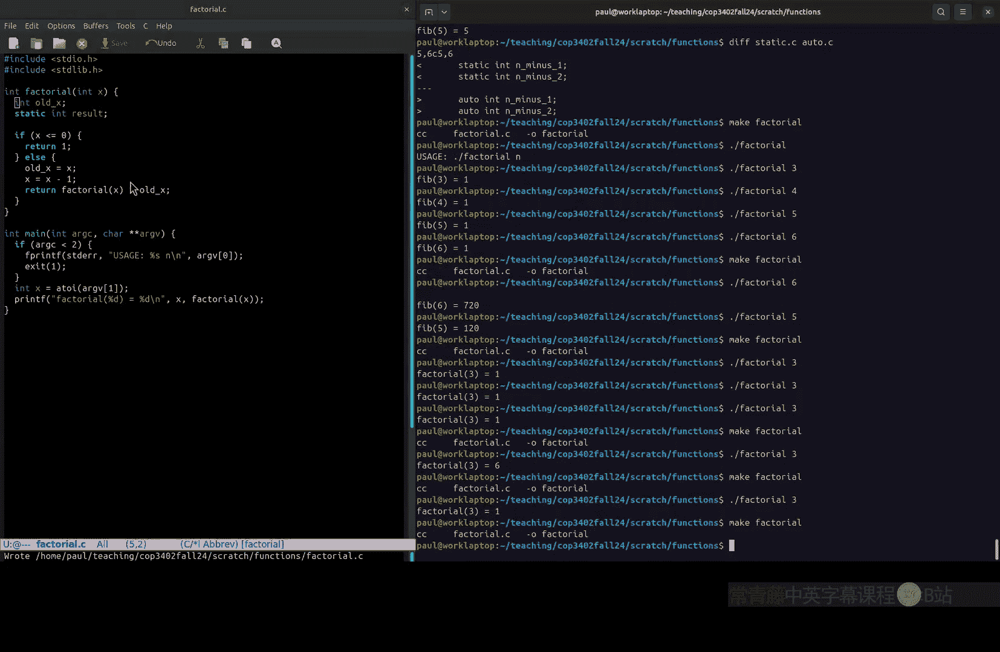

Okay， so。Sorry about this。 So let me let me make clear again。 So the problem is， is that。

When I go to call。The next F。I reassign old x inside of F。Let me walk through this。Again。

 I think the reason it was happening was because of some reorderings that the compiler was doing。

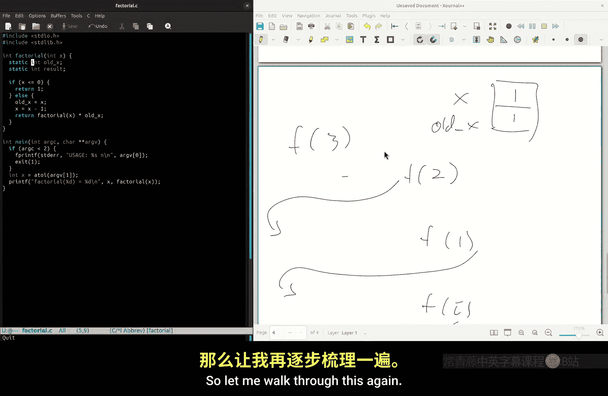

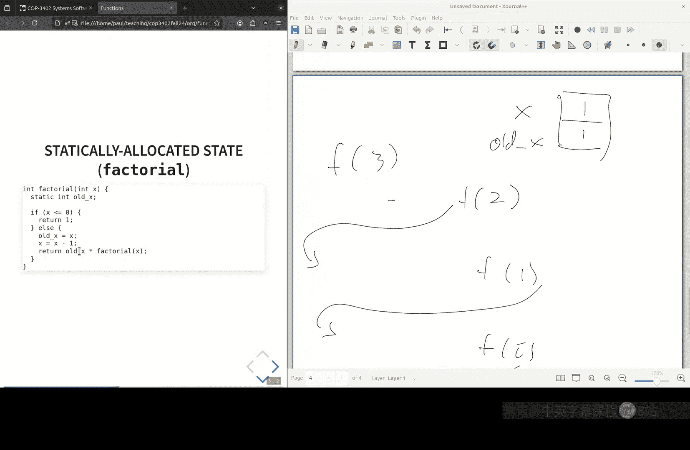

Let me show what this guy。Okay， so。When I first call F3。Let me walk through this again， so old X。

Is assigned to three。否则。Exccs2。When I call f of 2， old x is assigned to two and x is assigned to one。

F of1。Old x is assigned to1 and x is assigned to zero。So the problem is。

 is that the next thing I do after returning from F of2 is I go to compute。

Factorial of x times old x。You climb back up the tree。So let me write this out again。I say。

Old x equals 3， x equals 2。And then I compute F of2。And then I compute bold X。Times whatever FF2 was。

 the result of FF2。In order to compute this stuff， I need to first。Go off。And。Run。F of2。

In order to compute F of two， I first need to compute F of1。Well。

 we don't know what it returns yet until we run it。And then I need to compute old x times f of1。

But before I do that， I need to first compute f of1。And we have the same。Old x is supposed to be1。

 x is supposed to be。Zero。And then in order to compute this， I need to compute f of0。

And then finally compute old x times f of0。So F0， we have to run the function and we'll get one as a return value。

Okay， so the problem here is that。When I go to compute F of0， we get one。

And what do I get from my return value for F of 1， I have old x times F of0。

 what's the value of old x？It's wild。And I get one times1，1 times1 as's my return value。

So that's what gets returned for F of1 back to the call to F of1。

 so we know that this is going to be one。With me so far。Let's far on this。

 so this f of1 is going to be one。The problem is what's the value of old x？Well。

 if we had a single memory location。For old X。Its current value is what。

Because when we called F of one。It overwrote old X with the value one。Yeah。なんだか。チンした resultsチた。我咩。

どこで使す。Aqual to one。Exactly， so the static is what's doing it。

 what static is doing is saying just give me one memory location for F。😔。

So F has functioned local state， it has its own variable called old x。But every time I call F。

 it's reusing the same。😔，Memory location for old S。 So we got the kind of behavior we wanted for。

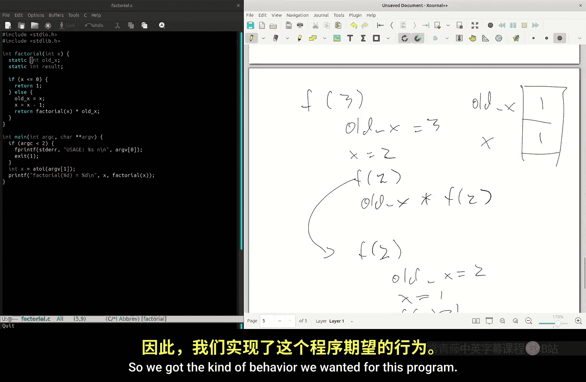

This program。We got this behavior that we wanted because now there's a unique x for each function。

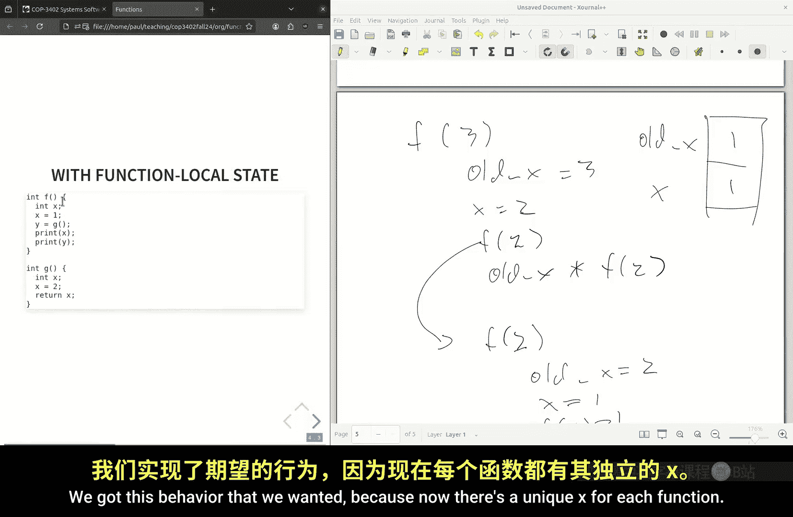

But something went wrong when we tried to write this recursive function。Yeah。Yeah。

 so what we really want to do is we don't just want to have function local state。

 we want to have local state for each call to the function， each instance of the function。

And in some sense， you could kind of rewrite this program。I'm gonna do it in。

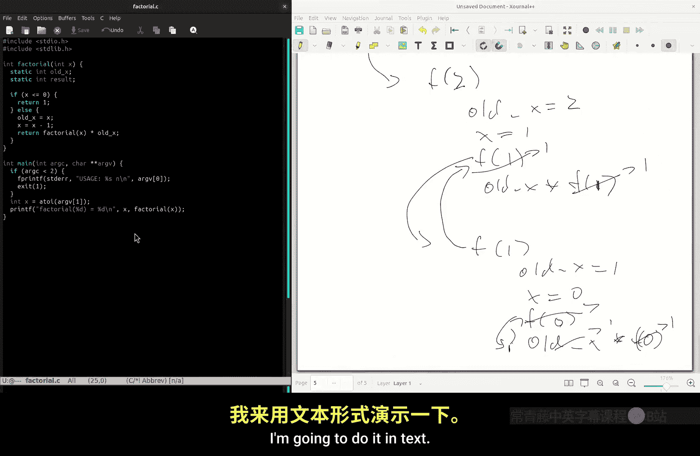

Text， you could rewrite this program that we really want， what's that？Let me know if you work it out。

 I'm not exactly sure， so what you mean？Each call， if you have as a local variable。 Well。

 so one way to think of this is that。Each call to the function is like creating a new statically allocated function。

 So if we had written rewritten factorial to take to make a new version of the function。

 a new definition of the function for each one of its arguments， so for instance。

Factorial3 would be factorial that would normally take three as a parameter。

 but if we made a new function for it。Then because of function local state。We would get the right。

 the right answer for。Factorial of。3。It kind of makes sense here， so I've made。

A new copy of factorial for every time I call it with a different parameter。Questions on that。

 does that make sense？seemss dubious， some of you seem dubious about this。Yeah。大統領に。Yeah。

 I'll do factorial0， so factorial0。Is our base case。And it just returns。What。So first of all。

 do you believe this， that this will work correctly？All right， let let me run it then so let me run。

呃。I'll just run。Factorial of three。Let's get rid of this。All right， so I've rewritten this。

 I've just made this new set of functions， one function for each parameter to factorial。

 I've left this static。So this defining the static in my recursive version caused a problem because we only had a single memory location and when we popped back up to the parent caller that oldX was rewritten with the child call。

 but here I've just copied the function three times， four times。For each version of it。

 and actually we don't need we don't even need the base case because it's。There is no a here。呃。

I need to rerite this a little more， so x is just hard coded to be three。Oh。

 so I just want to illustrate to you。That。When you make a function call， recursive or not。

It's not just that you have function local state。But that every time you call the function。

 each instance， each call of the function needs its own state。Otherwise， recursion won't work。Yeah。

 right， exactly in a stack， so who's heard of using a stack for function calls？Okay。

 so still not most people I want to kind of get to this。

For those who have not learned about stack allocation yet。All right。

 so here is my hand copied multiple versions of our factorial function where I make a new copy for each input parameter。

 so you are just hard code。I hard code x equals 3。That's the parameter。

So now assuming I didn't make any mistakes， which I probably did， this should。

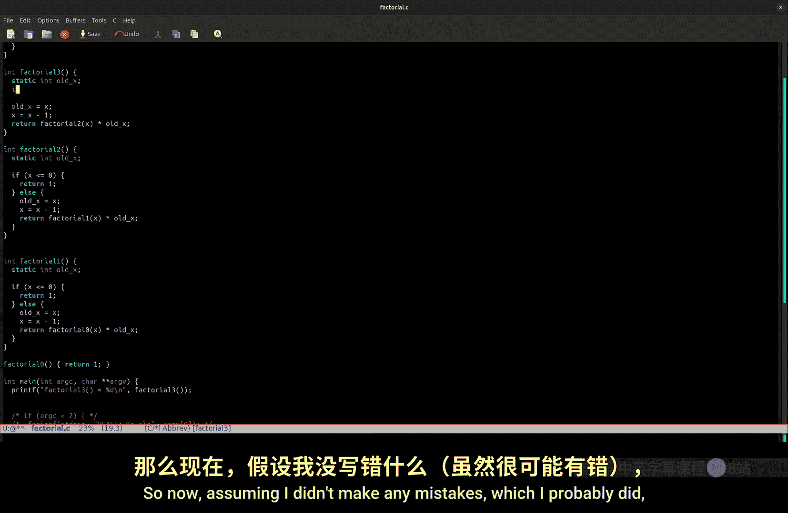

Give us the correct value for factorial of three。What did I mess？Oh， there。Yeah， that's okay。

 see they don't see their own declarations， but so here we get six for factorial 3。

 the factorial 3 function。

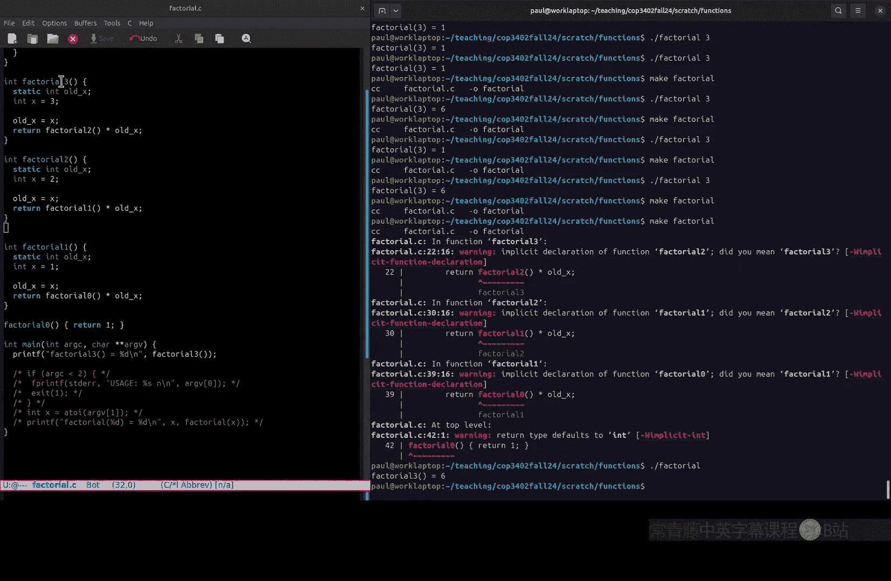

And that's because unlike when we went through our recursive version with a statically allocated variable。

Each function had its own copy of old X。

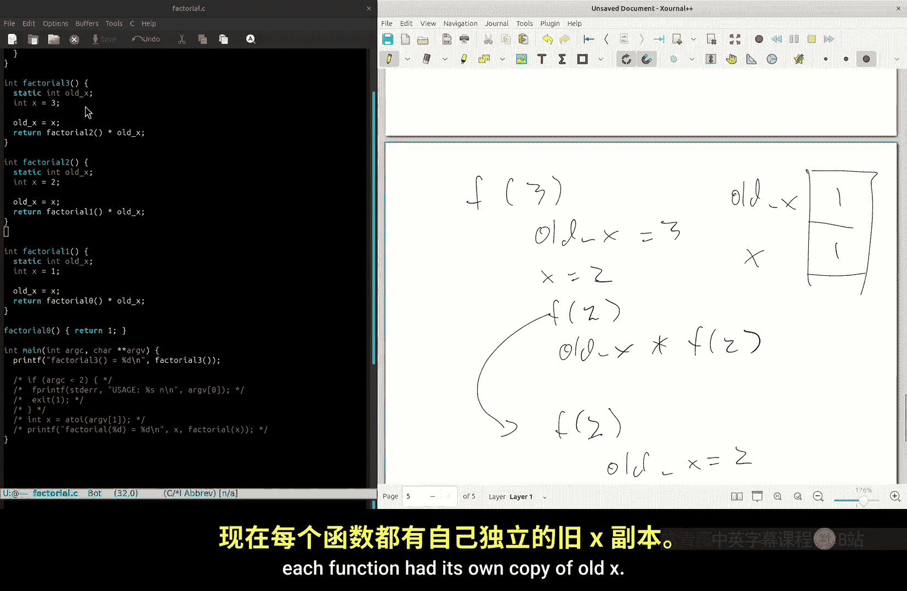

So just like this example that I think everyone got that each each。F of G。

 F And G each had its own version of X。

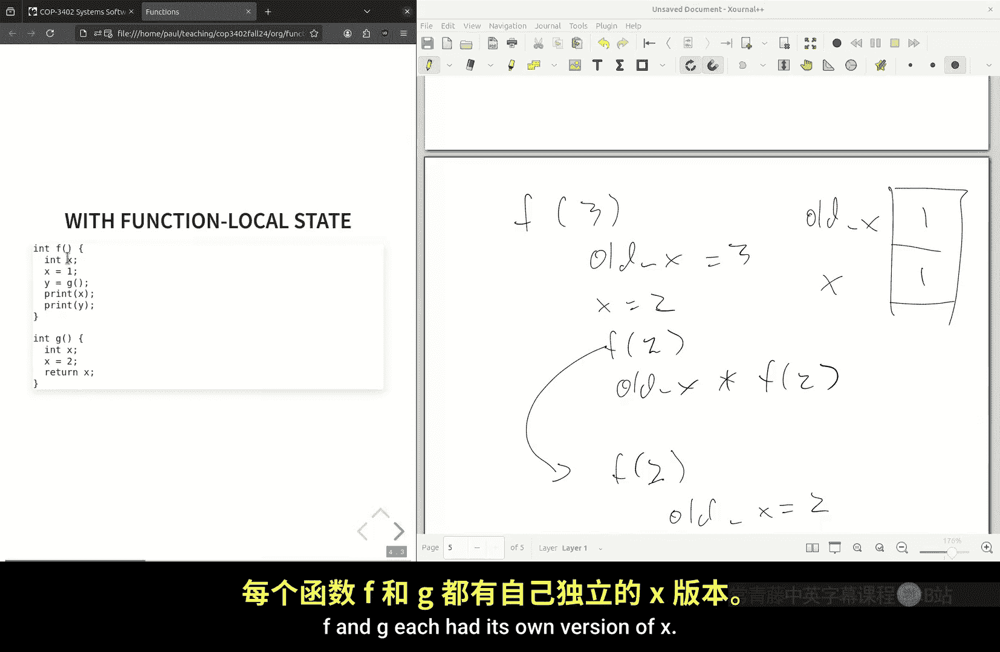

So we've written。Four different functions here， they might be named factorial 3。

 but there are three different functions， there four different functions。

And so they each have their own copy of old X。And so this works， this doesn't have the same problem。

Because we don't call the same function multiple times， we don't call it recursively。

Questions on this， on this。And so if you've ever had trouble understanding recursion。

 one way you can。Make it a little simpler is to think of each call to that function as not as the same function。

 but as a different function。So if you think of the call plus its parameters as a unique function。

 that might help you kind of work through recursion a little bit。Yeah。

Another way to think of it as a tree of calls。 So each， so rather than thinking of it calling itself。

 thinking of it as a separate call， where each call is a new instance of the function。

All right questions on this， questions on this construction here。

So now doing this by hand is a massive pain if you want to write recursive functions。

 so what's the solution your classmates already said it is the solution is to have the compiler。

Automatically make sure that there are new memory locations for every call to the function。

 not just every definition of the function， but we want to make sure that every single call to the function has its own。

Memory location。For its local variables so that we not only pause where we're running in that function。

 but we also freeze all of the local state。That that function call has associated with it。

Questions on that notion。So we're going to automatically allocate new memory locations every time we have a call。

At runtime。 And so that's not so difficult to conceptualize on paper。

 The tricky part is making the compiler。Generate code that will do this creation of memory。On demand。

呃。W， the program runs。

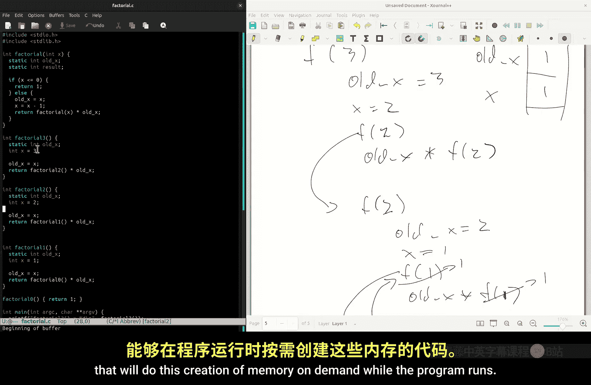

Right， but first let me get through， let me show you。What stack allocation looks like。

So first of all， in C。The keyword for doing this， static is the keyword to have what we just had where there's a single memory location for all calls to a function。

 that's called a statically allocated。Variable。The alternative or one of the alternatives is auto allocated。

 and it turns out that if you just write int old X。You're implicitly declaring an auto。

An automatically allocated variable， so auto is a keyword that who's seen the auto keyword。

 probably almost no one right， you never see this in C because it's implicit every time you declare a variable inside of a function it's automatically or it's by default has the auto keyword in front of it and auto just means it's automatically allocated memory at runtime。

Rather than statically。All right， so let's see what this factorial looks like when we've got automatically allocated variable state。

So it works as a stack as your fellow classmates pointed out。And so here's our memory location。

 here's our memory， so let's let me bring up the。

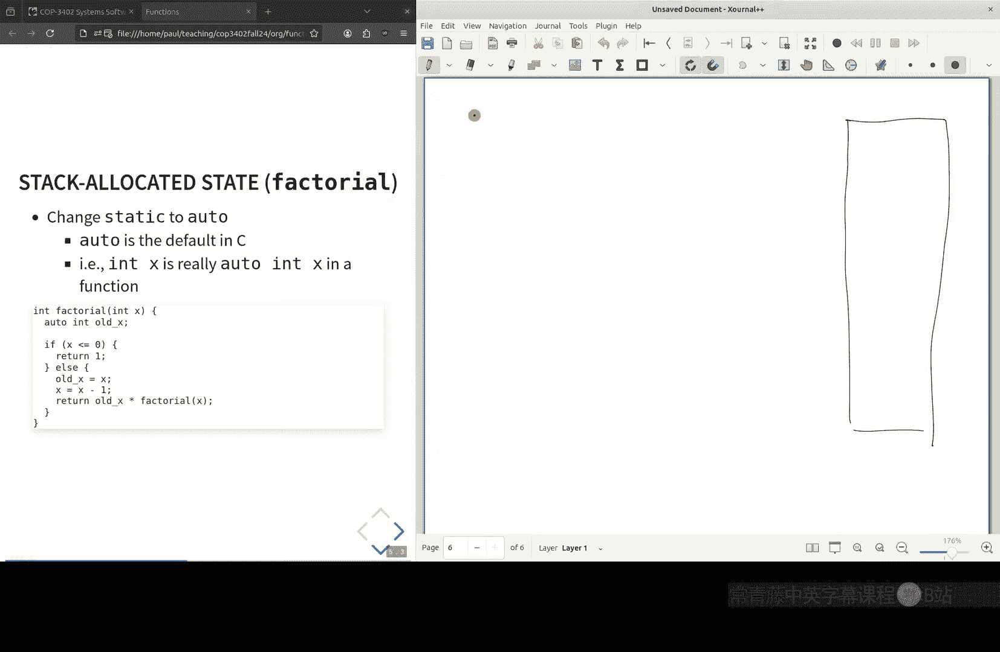

Vactctorial function again， so this is the one。I'll be looking at it。

Let me just get this off the screen。So here's our function， again。

 here's our original factorial function。So when I call F of three。

What happens if x is assigned to three？And so on each function call。The language。

 the language runtime， will allocate a fresh。Set of memory locations for all the local variables in that function。

 So this is the。Memory locations for the call to F。Given and threat。So we go to assign。

Old x to x or3。This call to the function has its own memory to store those values。😡，All right。

 so now let's call。And so then we update x to 2， so this updates x to2 here。

 and so now when we call F of 2， what happens？We get a new chunk。

We get a new chunk of memory allocated。For that function call alone。Set of memory。

Is only for that function call FS2。So you see this。

Function state for F of3 doesn't get overwrittend yet。20。Is that on the stack？Yes， yeah。

 so all parameters are also local variables。

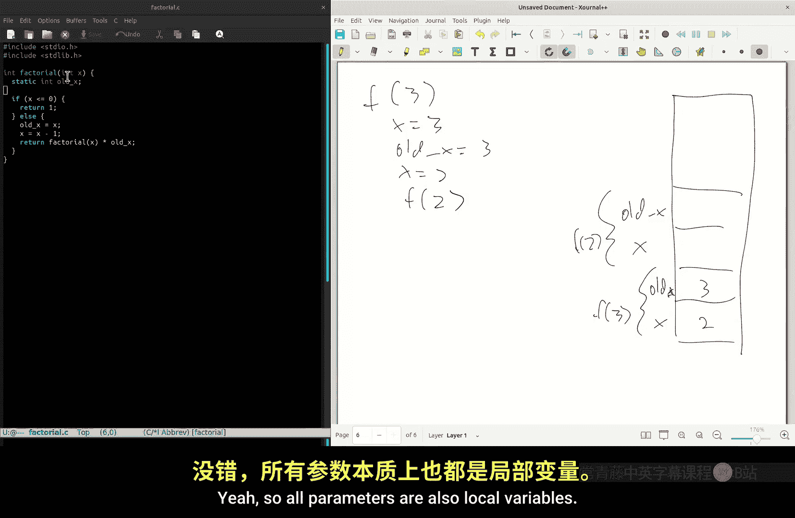

And you can actually see this in the original。呃。The original C function。

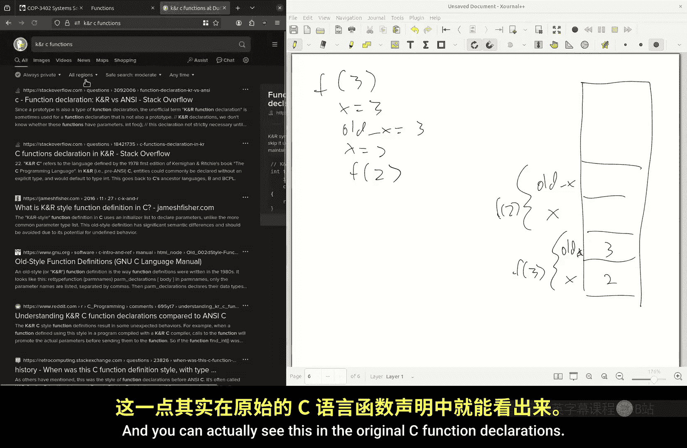

Declarations。Which would so this is the syntax for。Defining a function in the original KNR。

 Kirnahan and Rich AC。The declaration of the parameters looked a lot more like local variables。それか。

やちらい？Yes， exactly， so to make this really explicit in our IR。

 you declare local variables separately from parameters。

 it also makes assembly code generation easier。So all parameters are local variables。

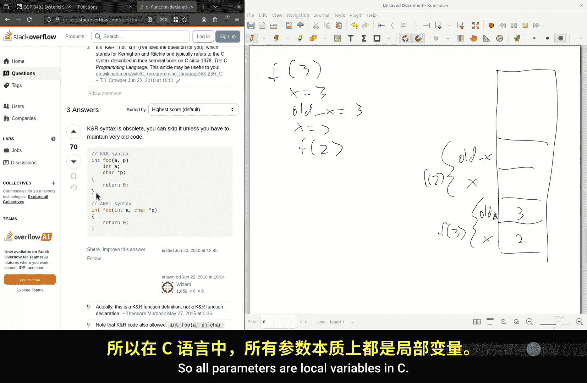

In in see。Okay， so when we call F of2 here。We allocate new memory locations for x and OX yeah。

Exactly， exactly。You could figure that out now in practice we won't be able to know it's very hard to figure out how many calls there will be while writing a compiler。

 so the trick me using in the compiler is to not have to know and instead we maintain a stack so let me show what this looks like in this call and I'll show you how the compiler will generate code that automatically manages this state。

So whenever we see a call， we just push。😔，New memory slots onto a stack。

For whatever local variables we have now we know easily how many local variables they are because we make the developer tell us。

 the developer tells us like in IR， we have to list the local variables in C you have to declare them。

 so it's very easy to know statically that is that compile time。

 exactly how many memory locations we need。So whenever we see， whenever there's a new function call。

We generate code that will push more memory slots onto a stack， so then when we run F of2。

 what do we have to do here， X is2。So x is 2， and then old x is assigned to  two as well。

And then x is decremented。And so we update。X。To walk。Questions on that execution of F of2。

So just like before， except we have a separate set of memory locations for old X and X yeah。以上か。

So we have the same memory location， we only had two slots for all calls。

So when we got down here to F of1， old X and X were blown away， they were overwritten。😔。

So F of3 wants OX to still be three， so that when we compute。You knowOd x times F of2。

 f of33 times F of2， this is what we want， we want old x to be three。

But because we use the same memory location for older of X。😔，When we called F of1。

That overwrote the memory location for all X。And so by the time we pop back up the stack， you know。

 here we don't have a stack， by the time we got back to continuing to execute FF3。

 OX had been redefined。😔，To one。That's why when I ran the statically allocated local variable with F of3。

 we just got one。That exist that I go。Oh， so the only difference is this static keyword。

So the compiler will do this kind of allocation for you。

 so if you say static you're telling the compiler I just want one memory location per function definition。

When you say auto， you'rety the compiler， I want one memory location for each call。So static says。

One location for each definition。And auto。Means。For each call。

 So this is the kind of key distinction here。Is that whether we allocate memory for each definition of the function or whether we allocate memory for each call to the function？

And that doesn't make a difference in。A lot of cases it may not make a difference if you only call a function once。

 if you don't have recursion。But if you have recursion or you're calling the function multiple times in the same any kind of recursion really。

 is really the only case where one of the cases where it matters。

Or with initialization of the variable and when you call it multiple times。

This automatic allocation for each call makes the difference between having it correct。

Execution of factorial recur factorial versus the incorrect one。Yeah， this is auto。

 this is the auto version。This is the static version。Really， this is statically allocated。

And this is automatically out。No problem other questions so far。So now we've executed。All of FF2。

 except。We have to pause again to execute F of one。So here's our call to F of two。

 here's our call to F of1。Let me actually do this the way I did before。Where I had a。Separate call。

 so F of2， we need to go make a call to F of2。So now here we may need to make call F of1。

 so how do we allocate memory for F of1？We go to the stack here and we make more memory allocations for。

F of ones。Versions of these variables。So here x starts out as1。Bold X。Equals x， so old x gets to be1。

X equals x minus1。So now x is updated to zero。In order to compute the result of this。

 we need to compute f of0。So that's the base case。I'm going to skip executing it all it does is test X and then return one。

So now once we've completed executing F of1。We can finish computing the return value。

 so what's the how do we compute the return value of f of 1。

 well it's f of0 times whatever old x was。And so because F of1 has its own copy of OX。

This is where we find the value of old x， we find the value of old x in its own memory location。

Old x gets has the value 1， F of0 has the value 1， so this is the same when we had statically allocated。

Before。So the result of this is one。S。F of one。Its value is one。I have to make a separate call here。

So then in order to compute F of2， we need to first compute f of1。

We've now determined that this is one。So now we need to compute。F of1 times。I'm sorry。Yeah。

 f of1 times whatever old x is。In order to complete the execution of F of2。

So what's the value of f of1， it's1， we just computed that， what's the value of old x here？

So this is a call to F of2， it has its own memory location。For its local variables。

 and oldx here is preserved as two。So now we can finally complete。

The call to F of2 and tell the caller that F of2 is 2。So now in order to complete compete。

 compute the result of F of3， we have to do。F of two times whatever OX is。

 same thing in order to find about F of3's value of OX， we look in its。

Allocation on the stack and it's two。Both and I said， oh， sorry， old X is three。Oldex straight。

 sorry， old extra straight reading Bra。F of2 is two， old X is3， and so we actually finally get six。

 the correct value for F。Questions on that？So let me show this a little more conceptually。

 this is kind of the like line by line。All that happens when you have- so even if we've got a program。

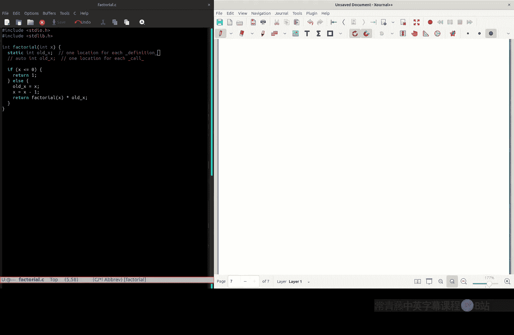

Like this， where we have F calling G。We have F calling G。When there's a function call。

It gets its own。Allocation of memory on a stack。And any nested calls。Are pushed。Onto the stack。

And when that call finishes， that memory is effectively deleted。

And both control of the processors return to F and also。The current state。

Is restored by using the stack。😔，So for factorial。For our first call。

We pushed local state onto the stack for FF3， and when we had a nested call， we paused computation。

Left that state on the stack。And went to go compute F of2。In order to compute F2。

 we had to pause computation。Save it， state onto the stack， and then go and compute effort while。

And then eventually。Make a new call to F of zero， give it new space， pause F of1。

 leave it state onto the stack。And so you can quickly see that if you don't have a base case。

What's going to happen， this recursion is going to be unboundund。

 if you're going to get a stacked overflow， classic stacked overflow。

And so because this version of F has a base case， that is it has some branch。

 some path through it that doesn't make another recursive call。😔。

We know that it will terminate once it terminates and this function terminates。

We would delete its state from the stack and return control back to whatever its parent call was。

Once that finishes， we delete its state from the stack and return control to whatever its parent call is and so on。

 and so we finally get back to our original function call and complete computing its value。Quions上ね。

Makes sense， yeah。ですイいた。Does what main absolutely mainine is mainine is just that frame， yeah， yeah。

 so if we were calling name here， yeah， Maine would be the first。

Stack frame for our function being called once F3 is done。

Main call it it will restore its value back into main and then main is also a function call so it's once it's finished its state will be cleaned up and this is the loader that manage this there's an entry point start in the program and this is the C runtime gearup back into the basically back into the。

What was homework 15， it's okay either way， either way。Yeah， you can show either way。So yeah。

 to give a preview of the question。Yeah， how many stack frames would you have。

 so if you include main or not， that's okay。こ bear beさ although。Yes。

 global variability outside and in fact， I think this is， let me see if this is skipping ahead a bit。

Where is it。There's a really good。Diagram that I。Oh， I think this is a yeah。So binary。

 this is your executable file。It's got， this is your actual program binary。

Did you learn about this in the stack versus the heap in？

Who learned about stackck versus HeEAP and computer organization， okay。

 I think everybody should learn about that。So your running program has stack and heEap。And， you know。

 heap is for like Malik， for dynamically executed stuff。 Stack is for。

These automatically allocated variables from functions。

 and there's also usually a segment for statically allocated stuff， I guess that's。This12。

I guess it's here， yeah， I I guess it's just put kind of in the heat at the bottom of the heat。

 I think it's a different segment in the assembly file。

 but you basically have a segment for statically allocated stuff and that includes global variables that may also include statically allocated data like string literals。

We appear in this static segment。Yeah。お前？No， things you define outside the min function are global variables。

Yeah。you only have local and global variables in C。All right。Questions。Questions on us。All right。

 so I have another。that's factorial。IfI have an example of this with Fibonacci。

 I think it's probably unnecessary at this point， but you're going to get the same problem with。

 I was going to explain it with this， but I think factorial is this will be even more complicated。呃。

Let's see， all right。So we can do all right， I'll just go over the slides， as this。Okay。

 so this this。Allocation of memory。It's called a stack frame。

So as you it sounds like you learned in computer organization。

Every running program has this segment of memory called the Sta。

And how do you what are the machine instructions for？Adding and removing data from this stack。

What's that？Pop and push in the stack。 Yeah， pop and push。

 So they're actually and lots of machines have instructions for。

Adding and removing data from the stack， pop and push。

 They actually have machine instructions for managing the stack data。

 So the system and the process are actually set up for。

Having this kind of automatically allocated memory location at runtime memory slots for variables at runtime。

All right， so let me go into some of I'll start some of the details of how this actually works at the machine level。

 kind of support you have at the assembly at the machine level。So just to get some terminology here。

So， the。So the set of memory here that holds all of the state for a function instance。

It's called a stack frame。It's a stack frame because it's not just one piece of data。

 it's all of the data needed for this function call。Sometimes called an activation record。

 so if we think of the function as being currently active。

But it holds all the information you need to freeze the state of the function。

 so that includes local variables， but it also includes parameters because parameters use local variables。

It also includes information in order to start resuming execution of the call function。

So I didn't make that clear here， but how is it that？

The processor will know where to continue execute。The in the parent call function。

And the way that's done is the address of the next instruction to start executing when you resume is also stored in this stack frame。

And it also stores a linkage。Or a pointer to the parent's stack frame。So哋。Let's see if I've got。

 yeah， I I'll draw it here。So in addition to data。Each of these stack frames has a pointer to。

The parent stack frame。So why would we want to do this， Why would we want to have pointer to。

The parents that friend， yeah。Yeah， exactly， so we don't have to know at compile time。

Where the location and memory of this parent stack frame is。😔，And in factor。

 all the stack frames may be the same size because it's the same function。

But when we go back to name， it might have a different size from factorial。

So the way we get around this is we just store a little pointer called the base pointer。

That points back to。The parent collar her stack frame。We also have a return address。

That points to the program counter that we need to restore in order to start executing。The parent。

Again， continue executing the parent。I questions on this so far。

So this is the contents of the stack frame， parameters and local variables。

 a return address that's the next program counter to start executing。

 that's how you resume executing the parent and also the stack frame of the parent。

 that's how you restore the state。Of the parent。Okay， so。Prameter passing is very system dependent。

 the easiest way to do it is to just push those parameters onto the stack。

So that the callee will have access to them。In X8664。

 it's a little bit more complicated they use a combination of registers and the stack frame。

So we won't have to worry about this。Or let's say did I， where did I？I think this is in Cogen2。Yeah。

 this is in Cogen2， so we'll cover this a little bit more for the next project。嗯。But basically。

 the first six parameters are in registers and the rest of them are on the stack frame。

 so this is the stack frame。That X86 is。X 86 and the System filed this like the UniX Convention for doing this。

 you have the first six parameters in registers。And the rest of the parameters are in the stack frame because you know。

 they're just like local variables， they're stored in the stack frame， you have the return address。

And then the RBP， this is the base pointer， this is the pointer to the parent' stack frame。

And then local variables。So this is all by convention。

 this is the UniX World's X86 version of the stack frame。

 different processors may have a different organization。

 different operating systems may have a different organization。

 but the key here is that local parameters， local variables， the return address。

And the pointer to the parent stack frame， the base pointer are all stored。In memory in this stack。

Questions， questionsions on this。So the details of this we'll get into details more when we get into parameter passing。

 it's a little annoying because in the 64 bit X86 version of the UniX World system called the System 5 applicationpplication binary interface。

The first six parameters should be passed through registers。 And why would you want to do that。

 Why would you want to pass parameters and registers instead of。The stack。对。Well。

 they're all easy to access right， I mean the memory you have access to all the memory you want。

 you have access to register Sam。Regs are faster， yeah I think that's the reason it' performance reasons that you'll just have faster function calls to do this it's just something we have to deal with I'll give you some code to help deal with this。

 but okay， so that's how we pass parameters。All right， just to。Finish up。

 so here are some of the key assembly things to know。

 so there is a special register in the Intel world just for storing the base pointer。

And so this register is meant to always hold the current stack frame appointed to the current stack frame。

And so while functions aren't directly。Executable in Intel assembly。

They do have special registers and instructions to help you， the compiler writer。

Generate code that will correctly implement functions and a couple support they have。

 a couple pieces of support they have is a register that is supposed to hold the current stack frames pointer。

 pointer to the current stack frame yeah。Exactly， yeah， so that' that's what you would base off of。

 So in order to find local variables， you would。Have an offset from the base pointer。

 you can think of it as a pointer to an array。And when you want to find local variables。

 they're an offset from that pointer， so it works just the same way and you can see at the processor level。

 you know what pointers and arrays really look like at the operational level。

 there's also a register that's always supposed to hold the stack pointer or that really does hold the stack pointer。

Now I say it's supposed to hold the base pointer because if you make a mistake is that the pilot writer and mess up the management of this pointer。

 this base， this register， it may not hold。The stack frame， the correct stack frame。

 or the stack pointer may not hold the correct stack pointer。And actually。

 theres some security ramifications to making this mistake in coding or in the compiler to allow the machine to get into a state that doesn't actually return to the function that you want it to return。

There's also a call instruction which isn't like call in the C function role because it's not going to pass parameters。

 it's not going to create the stack frame for you， all it's going to do is it's going to save the return address for you。

 which in the in exit86 world it's called the IP or the instruction pointer that's the same as the program counterter。

 it's going to save the next address for you， it's going to save the return address。And that's it。

 and then it's got a branch。To the function， the functions address， the functions label。

 So this all this is is a branch instruction， you give it a label and it'll branch to that label。

But before it branches， it saves the return address for you。

So you could certainly do that on your own， you could just push the instruction pointer and you could just do a branch。

 but call does two things for you， but it does not do parameter passing， does not do return value。

 so it is not like an actual C function call。And then you have the kind of converse of that。

 the return instruction。Which。Pps， next whatever the address is or next whatever the thing the data on the stack is that pops that off and branches to it。

 so you could also do that with two instructions yourself you could do pop and then branch to that address。

This does the opposite of call。Call pushushes the next address， the return address and branches。

 this pops that address and branches to that address。Questions on that？

So this is really all the support you get at the machine level for implementing functions and then it's up to us as the compiler writer to generate the correct sequence of instructions that will set up all of this memory for us and just to kind of reiterate again and again。

 your compiler is not creating。These stack frames， your compiler is creating code that at runtime will create these stack frames。

 this is a kind of confusing part of compilation we not。

Computing the result we're generating code that will compute the result at runtime and when we get into functions。

That at runtime create allocations of memory， generating that code can get kind of tricky in the compiler。

All right。Yeah， let's actually three minutes left， so let me discover this。

 I look like some people are eager to leave， but just to some more kind of definitional stuff。

 we'll get into the actual assembly next time。嗯。Whenever you generate code for the function by convention。

 the beginning of the function always has a prologue which sets up the rest of the stack and an epilogue。

 which tears down the stack frame and returns yeah。Yeah， kind of， yeah。

 they do actually force a pre and post condition on the memory on the stack， yeah。

 they enforce a pre and post condition。So。The epilogue will set this stuff up here。Sorry。

 the prologue will set up。This stuff here， it'll save the old base pointer。

 it'll set up local variables。And the epilogue will tear these down and then call returnturn。

So just just also as a little preview， because the caller is what has access to the parameters。

 the caller sets up this part of the。Stack frame so this stuff in green is what the caller sets up in the stack frame because it has access to the data for the parameters and so it passes it also had knows what its next return address is。

 so this half of the stack frame is set up by the caller。The call instruction is made。

 the return address is saved， and then it's up to the callee in its prologue to set up the rest。

 including the saving the base point of the parent， setting up local variables。

 and then the epilogue does the inverse， the epilogue tears down this stack frame。

 restores the base pointer to be the parent' base pointer and then calls return in order to pop this return address。

And go back to the call lu。All right。All right， questions on that。对二。I think yeah you can look at it。

 I haven't shown the assembly code yet but it's in there it's in that instruction so by all means you can start working on it。

 get the project set up yeah that's why I try to put up a little early so you can actually start getting the development environment set up it's very much like CalC I've given you template code and I've given you like all the code to generate and how to use Python so sure yeah by all means get started on yeah。

There's only one file to create just compiler s code Gen Pi。

 so here's the layout of the project most of this is given to you except for code GenO Pi。

So you just do code Gen do pi， here's skeleton code for it。

And these are the only functions that you need to implement for this version of the project。

And you' have you'll have a function call support it if you implement this correctly and here's instructions for we can go over that more next time we actually talk about what the assembly looks like。

 but yeah it works very much like the CAC project you use PipN for having the shell and all right so all right it's 120 so thanks all I think we ended at a good time。

 see you next time。Let's go。我れ我没是。

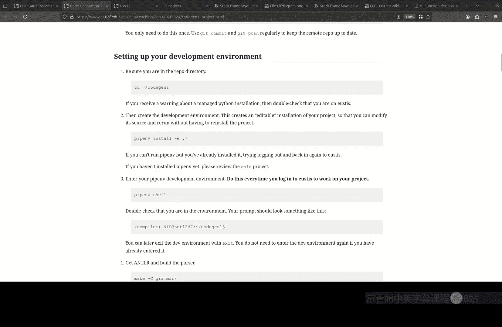