# 佛罗里达大学 【中英⚡系统软件｜COP3402 Fall 2024, Systems Software】 p26 P26 Final exam review (COP-3402 Fall 2024) -BV1v6vdBKEHB_p26-

All right， welcome back to System softwareware， so as I said before this is the last lecture we're going to go over last lecture of this class。

 we're going to go over the final exam and just to reiterate， it is in person。

 you must take it in person or an SAS。And you can take it on web courses on your laptop。

 or your own personal laptop， where that's the only thing you have open。

And we'll be proctoring to monitor this， or you can take a paper exam， I'll bring paper exams。

Make sure you have your UCF ID will confirm your ID when you enter the room and check you off。

The laptop is the only device you can have。If you need notes。

 bring paper notes just like with an in person exam， so it's just like the in person paper exam。

 except the exam sheet and the answer sheet are replaced with web courses。

But everything else is identical to the midterm， so same amount of physical pages。

Any worries about the amount of physical pages you want more because it's a slightly longer exam？Yes。

 more all right so since it's like。You know， 16 to 24， there should be eight to like 12。

 how about that？12 for。24 well， 24 sides， 12 pages， so that's like 50% more exam is 50% more。

 so let's do it that way。So I think that should be plenty。You can probably like。

Copy all the most amount of reference material that we have in the class。

 so you will need more like for you know， if you want to remind us on the assembly code and simple IR it's not going to be very different from the code we saw in class so you could like you know。

Take examples down， little explanations， practice with the different move operations。

 but there's a small finite number of assembly operations that you need for the class。No， yeah， no。

 no。 You won't like literally be writing。 Yeah， I'm only。

 I'm only asking you to do kind of hand translation or， yeah。

 let me let me go over the the topics when we're done with logistics。

 Any other questions on logistics。So it's just like the midterm in person。But you can take。

 instead of the paper， you can use web courses and web courses only。And nothing else in your laptop。

 everything else is the same paper notes， although it's 12 now， is it's updated 12， now it's updated。

嗯。No putting answers on your pencil or writing implements， which has actually didn happen before。

Actually， it has been used for like SAT cheating and have answers on a pencil。

 so no additional information besides your notes。Oh yeah， so it's 24 questions。And。

The final is worth 16 points， so each question is worth two/3s of a point。

To make some annoying fractions for grading。嗯。More than half are multiple choice。

And then we have short answer and long answer。So let me go over。Let me go over the exam。

So all of I should say also that the long answer ones where you're doing like coding。

 these are all new content， so you won't have to like do system call programming。

Those will be like multiple choice， so don't worry too much about like being able to write。

Systems code， let me just double check to make sure that I'm not lying Yeah。

 you won't have to write like systems code like you did on the midterm。

It'll be like multiple choice questions about systems code。That's for the long answer。

 long answer ones， there may be short answer ones on mid termm。Okay， so let's go over content。

So file systems navigation， why is the UniX file system hierarchical， what makes it hierarchical？

Yeah。メつ？正に。代と論である。From there。要记得吓快。Yeah， so directors directories， and now what are directories。

 how are directories represented in the file system？Special files， yeah， directors are also files。

 right there are also files that just happen to contain a mapping。Of names to other files。

That's what makes it hierarchical， absolute versus relative paths， what's an absolute path？

Start at the root， otherwise， doesn't start at the root。嗯。Working directory。

 what's the working directory？Yeah， that's it。Yeah， directory you're in， well， more specifically。

 it's the directory that the process is currently in。So when you're in bash。

 the bash process is running and the kernel maintains the state of what're director。

 how do you change the working directory？CDN Dash， what about in a system call。

 how do you changed to working directory？CCHD， right？So there's CD in batchsh， CHDR。

In the as a system call。So oh that's prosth。How do you rename a file？Yeah。Move envy。嗯。

What will show you the text of a file， this should be Uni standard utility， cat。

 how do you delete a file？Yeah， Rm remove。Okay， so some basic multiple choice stuff。

For file systems and navigation。No you know， big cis call implementation for files all right version control。

 I hope everyone has learned about version control because if you're going to be a software engineer you will absolutely use Vi control and I know it was probably very frustrating to do this on the command line and learn about it and have merge conflicts and。

Learn about distributed version control， but let's go over some core questions for version control。

So how do you copy commits from the local repository to the remote repos？Get push。 Very good。

How do you copy commits from the remote repository， the local one？Yeah， Paul。

How doWhat get command stages a new file？Get add， good， get add。

And what Git command creates a log of the change to a stage file to the local repository？Yeah。Commit。

 let's commit。So anyway remember， there's four。Pieces。There's four pieces， working directory。

 staging， local repository， remote repository。😊，Working directory to staging is add。

 although if you do commit， it' will also add for you and then commit does。

Staging to local and then push and pull， go to and from remote repositories。Let make sure I'm not。

Missing anything。All right， so that's Vi control， any questions on version control or any of these？

I think you've all used version control， you hopefully know at a fine grade level。

 the difference between commit and push and how that affects your local and remote copies。And。

I've actually gotten feedback in comments for many people like I'm glad we learned to get now because very few people use it in class and they like use it at their internship they were sort of。

Benefited from it， so I hope that at least helped you all right processes。

How do you redirect standard IO？From a batchsh command to a file。Yeah。ちょと然な。Yeah。

 it's the angle brackets， so the kind of mnemonic for this is you think of it like an arrow。

So if the angle brackets are pointing to the file name from the process。

 that's redirecting output to the file， so think of it like an arrow pointing to the file and if it's the other way pointing to the command name instead of。

Using vague hand gestureers， let me show you。What it actually looks like。So for instance。

 if I have LS2。Out file。I think this kind of looks like an arrow pointing to the out file right。

 so it's writing to the out files， taking the standard out， writing to the out file I've got。

Cat In file。Arrow is pointing to the program so you can think of that as input to the program。

Oh did I give an example， yeah， if I want to redirect Grs out into the file。

I don't know what I said out in to the file rep。What do I type yeah。

 so if you want to go out if I want to grab well for a real Gr command I'd need to。

Have some input to it and I need to match something like hello。

This would save the results of GrP's output。I could also search for Hello in a file。And that will。

Take the input to GrP from Gr。n。You don't have to if it's a single word。Yeah， this is。

Nitty gritty details of dash syntax definitely not going to make you understand this。

 but quotes will turn。诶。Something with spaces into a single argument。

 basically is what quotes will do for you。But yeah， there's a lot of。Narly details to Bash's parsing。

嗯。How do you redirect standard out from one command to another command standard in。

 so let's say I want to have find and then count it with WC。Pippe character， yeah， so this is。

Equivalent to doing。で。This pipe。Is like。Doing this。

 what's that shorter and you also don't need to have a file stored to disk Yeah or well there's still two commands being run。

 but the pipe is a special file for a special file that's created in kernel know managed by the kernel memory to basically make a temporary file for you so effectively yeah。

おこ。Actually no the well the。Canoe utility， you can just run fine by itself。

 I think if you're on Mac and you tried to type find it probably complained。

 I think because it's a BSD version and you need to give an argument for whatever reason to the BSD version。

 but no you can run fine by itself and it just，Does the current directory。So if I run find， it just。

Gives you everything in whatever the current directory is。

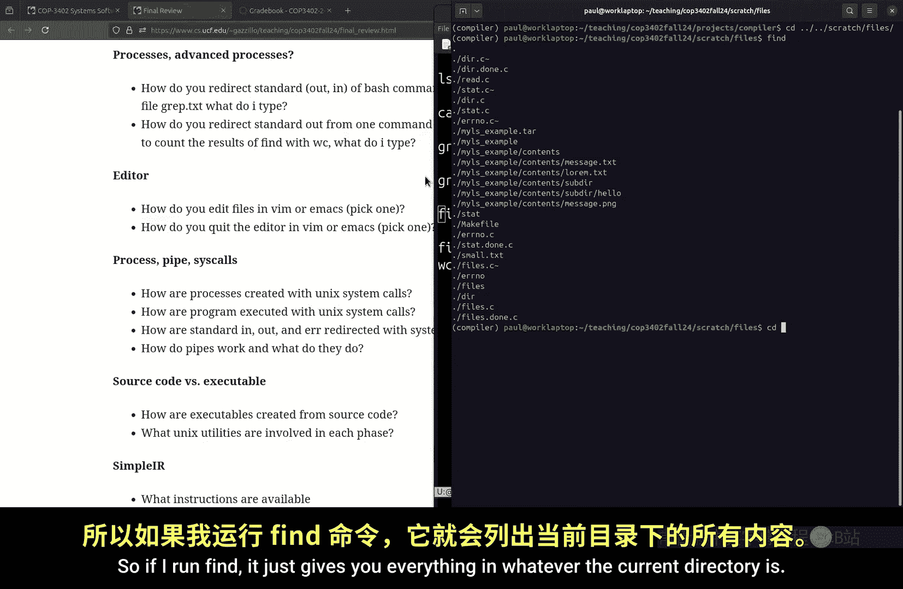

All right， editor。How do you edit files in VM or EMX？Yeah。Yeah， that's how you edit done。

 how do you quit the editor？Co and Q for VM， if you want to write the file， Col WK， what about EMX？

は大。やり。Yeah。Yeah months。Control X， control C for freem， okay。Yeah。

 I'm not going to ask too much about editors。Maybe there'll be a freebie in there。呃。Okay， processes。

So this is like from the midterm， how do you create a process？In the Uni system call world。Let's get。

 yeah， yeah。Well， yeah， well， you fork and actually， as soon as you fork。

 you've already created a process， you don't have to exact it。But how do you execute a program？

With a Uni system called exec。So what does exec do？Yeah， yeah。そセ在。就咁啊？Well， that's at a high level。

 but what does it do to yeah？Yeah， it changes the running program。

 so remember the running program is loaded into memory in the text segment。

Or that's in the executable file， but it's literally the machine code of the program is in memory。

 exec overwrites it with a new program and then starts running it at the beginning of the program。

なとで。Now don't worry yeah， don't worry about that you can always run you know。

 look at the man page for that how do we redirect system calls or how do we redirect standard out。

 et cetera， using system calls in a program。Yeah。Dpe， yeah， dupe or dupe2。There's also do three。

 I think， but yeah， the du command does that。What do pipes do， the pipe system call。

 maybe we just described it yeah。5。Yeah， yeah， it creates like a kind of a temporary file for you in memory that you can read and write to from two different filescriptors。

 it's like how sort of a one way queue almost。Okay， so I think that's。

 let me see if there's anything else on processes。Oh yes， okay， yeah。

 that's that's the other category。I think that's everything。For these categories， all right。

 source code versus executables， I think we this had to be a little compressed。Due to the。

Purricane stuff， but okay， so you have a source code， you have a C file。

 how does that become a running program， how does it become an executable。

 how does it become a running program？Yeah。Yeah， do you you remember the pieces of it at all？Yeah。

 yeah，please。あメいんだ。なかめと。もし otherで。嗯嗯。And班。It it read。

Yeah the program binary or is a program binary and that's the exact part right that's how it comes running so you have the preprocessor which we didn't talk too much about then the actual compiler which goes to assembly。

 assembly goes to an object file， which is the machine code version of assembly and the linker as your classmate said。

 combines multiple object files， combines multiple compiled C files because you don't have to write。

The entire program in 1C file and you might have libraries like standard C libraries。

Then that's what gives you an executable file。Once you have an exccutable file。

 the loader in the kernel， which is invoked with one of those exactec variants。

 turns it into a running program by overriding that machine code， that program binary。呃。

In the current memory of the currently running process。

And then change the program counter to the beginning of that machine code。か咋ね。

So just remember compiler goes from C to assembly， assemblyr goes from assembly to machine code。

 and Lier merges multiple assembly files。like。Actually like。いうこ。Just wait over。I mean。Technically。

 yeah， like if you mean into physical Ram， yeah， yeah， it's kind of the same way storage works。

Relaunch it。Oh yeah， that's a feature of the kernel where it will。Yeah， I think it will actually。

Actually， it's that right。I'm not sure if that's for a program， I think that's the case。

 but I'm not sure， oh， that actually notes might be because when it was loaded from disk。

It might have been the disk that was cached。So that file stayed mapped into memory。

 I think that might be what's going on It is the case that libraries are shared between processes so if you load one dynamically loaded library in one process and then use it at another。

 I think Colonel Walman's features to make that sharing。Make that faster。But yeah， sorry。

 I don't have more detail。All right， oh yeah， and then the UniX utilities。

 so what's the utility for linking called？那是不见。P it。It was close， it was sorry with L， so it's LD。

Which is really， there's like a misnomer because I think it's supposed to be abbreviation for loader。

 but actually it's a link， it's not a loader， assembler is AS。Compilr is GCC。

 and then I'm not going to ask about this， but the CP pre processoror。

 it actually has a separate utility called CPP， doesn't mean CP++ it means CP pre processorcessor。

 so I'm not going to ask you about that。Just know that the compiler。

 all the compiler does is produce assembly， it's the assembler that produces a machine code and the linker that combines those。

嗯。Individual object files。All right， I'm not going to ask you too much about。That。All right。

 so let's get into the bulk of。The final。🤧。All right， so simple IR。

 what kinds of instructions do we have in simple IR， if you know from memory， let's like name them。

 I guess， yeah。Okay， assign it。Everything else， yeah。Yeah， pointer operations， DF F， assigned DF。じ。

And stress is very annoying。I guess the statements you have in the language。Or the constructs。Okay。

 so let's go， you got three more， let's give someone else， let yeah。

You got our arithmetic operations， yeah。Function calls。So you can see the whole grammar。嗯。

In your project。And so hopefully you。

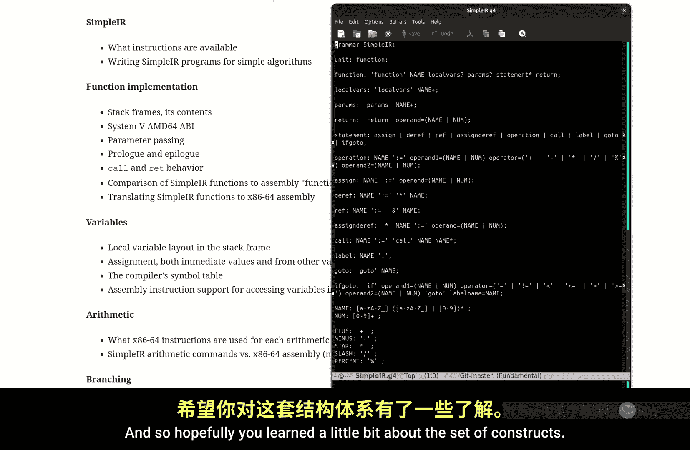

Learned a little bit about the set of constructs， so you can either use the grammar which might be less readable for you or just like have an example program or several example programs so know you can define functions and let me show an actual。

Example of code here。Let's do。Let's look at my mallik。Program。So this contains a couple of examples。

So you can declare the function， you can declare local variables and parameters。

It can set a return value。You can do arithmetic operations， function calls， the ref assignments。

D reference assignments， de referenceences。嗯。So I don't know the best way for you to remember all that。

But it's just like an assembly you you have， and I broke it down。

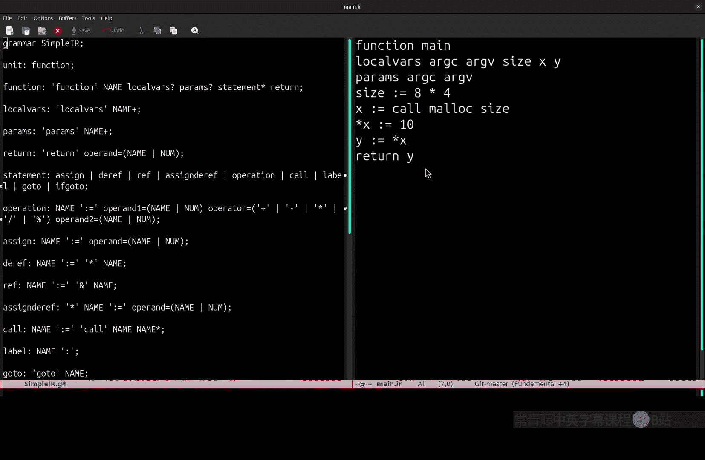

In class， into these categories like。Functions and function calls。

Local variables are part of the function definition， function parameters， part of the function calls。

And then these are the operations that you have， arithmetic operations， branching operations。

Poiner operations assignment we covered in local variables。

 but those are like kind of the four categories of operations you have。Once you define the function。

 you can do assignment， arithmetic， branching， pointer stuff。

So I'll have a question that asks you to write a simple IR program。

So hopefully that won't be too bad， yeah。Yeah， ideally， yeah， I mean。

 you can just have really put an example program in your notes。And I think that should help， right？

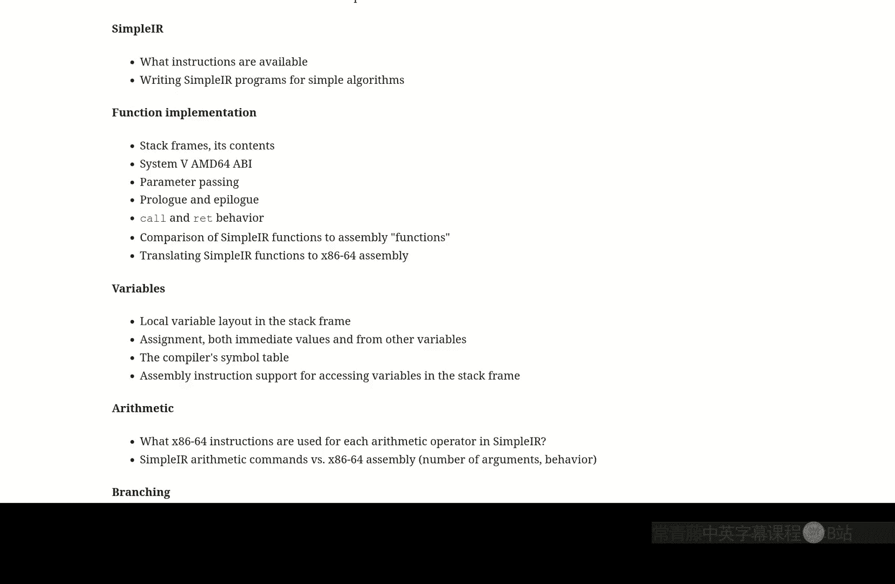

嗯只好。

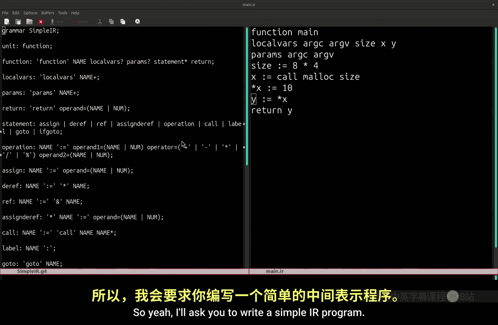

I'll ask you to write a simple IR program。Let's see。So yeah， be able to write it like a simple。

 a small， simple IR program， you know， use branching， use assignment。

if you've done MIPS or assembly shouldn't be too bad。

 it should be easier I think right now if you get like little syntactic errors that's fine。

 just have a couple of example programs like I think I even had a homework question where I asked you to write S IR program so just review that homework。

Review all the examples we have in class。And with three or four examples。

 you'll have the whole language， examples of the whole language。

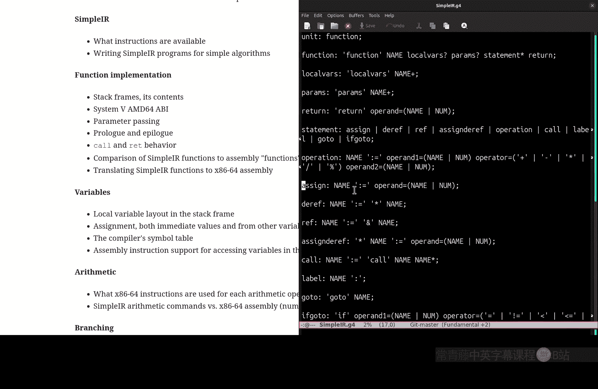

All right， questions on that， questions on simple I。

 so it's just like the homework where you have to write a simpler program yeah。

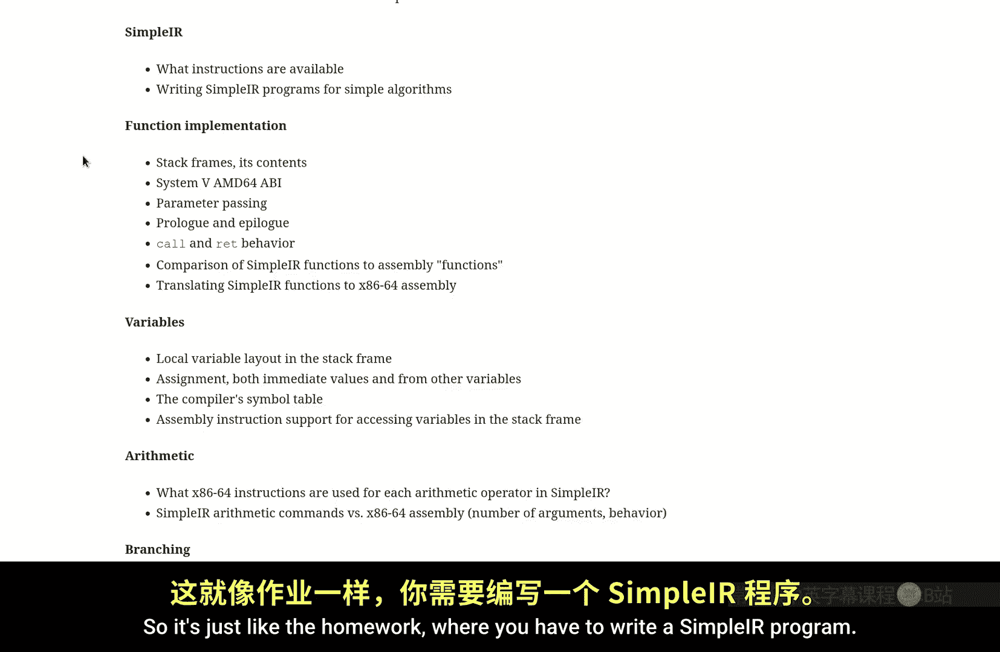

嗯。Because I just didn't write the code to like do the point arithmetic。

 but you totally could just like。You know。Start doing point arithmetic here。

But this is I really just wanted a test to make sure I could actually call Malik correctly。

 which is very exciting to actually get Malik code and be able to play with pointers。All right。

 so functions， we went over this a ton， the stack frame stuff。

 so you should definitely know what's in the stack frame， so what is in the stack frame。Yeah。最近とで。

下面のこと。Inrov， yeah。So return address。Old base pointer， he said local variables and parameters。

What about the order of those， what's the order？That they're going to be from high memory to low memory。

 yeah。手な多い。Yeah， the diagram is。In here somewhere。So you can use this diagram。This is the。

 this is the high address stack grows downwards。So what's the first stuff in the stack frame？Yeah。

なだ増れて。さ。Okay， so this is what's not in the stack frame， the registers， the first six sorry。

 the first six parameters are in registers， remember that？In this ABI。

 and I'll actually specifically say， system 5 MDD64 ABI。

The rest of the parameters are in the stack frame。 I know for a lot of our examples。

 we didn't have any parameters in the stack frame， but they're going to be there for any whenever you have more than six parameters。

 So parameters come first remember the。We're growing downwards our stack。

 so the first things pushed are the parameters， who pushes those。

 the calling function or the called function。Calling function， yeah， the caller。

 then we have return address。Old base pointer， local variables。Okay， so epilogue。

 what does the epilogue do？Yeah。大てのか。The飞。え私？また？So but yeah， it tears down what the callee set up。

 so it tears down the locals and the old base pointer。And yeah。

 the way we did it was we just set our RSP to be where it was before we had the prologue。

 which is at the return address。So that's what the epilo does。Okay。

 so these are a little subtle and I think yeah， and I do ask questions about these。

The difference between。Simple IR function calls or function definitions versus assembly function definitions。

 so the assembly。Call instruction， What does this do？In the machine。Yeah。なばすなと。Yeah。

 it sets the return address or it saves the return address and then just branches。

 it just jumps to the function。And what about the return instruction？Yeah。

 does kind of the opposite of it， it pops the return address and branches to that。

So how does that differ from a simple IR function call。

 so in simple IR function call what happens in the function call for simple IR？Yeah， what's it？

So you're saying the simple IR function call just does go to， and that's it。So let's look at the。

Function implementation。Sual， or do I have？Function parameters。

So if I've got a call here in simple IR。What does this do at the assembly level？

Where' is the assembly code？I think it's probably better to look here。The full example。

So if we have a。Function call， like here。A lot more is happening than just branching。

We have to set up the stack frame， right？So we have to。

Pass all the parameters via registers and the stack。Do the。Assembly level call。

 which doesn't just branch， remember， it saves the return address and does a branch。

And then when that call happens， the function prologue gets executed。

 which sets up the rest of the stack。So that's the first part of what a simple IR calls the same thing that happens in C。

So the difference between a。highigh level function。

 a kind of a real function or a programming language function。

 and an that an assembly calls just a branch。Whereas。In a C function or a simple IR function。

 we're implementing which you might call true functions， functions that have function local state。

Because remember， if we tried to just do a branch for， say， a recursive function。

 we wouldn't necessarily get the result。That we wanted， that was that whole lecture on。

What happens when you do factorial with static or global data？

My version of factorial didn't work as expected because we don't have functioned local state。

And one of the main purposes of。All of this。The stack frame set is to implement functions with function local state。

 which a simple branch won't do。Doess that kind of make sense？Questions on that。

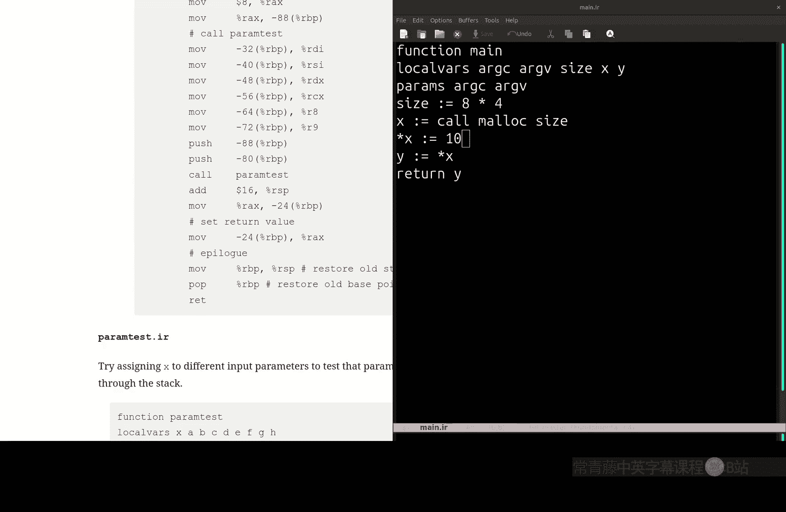

So call in second say， yeah， remember what call and return do in the assembly level。

And just you know remember function local state， how this is managed。It's managed with。The ABI。

 which tells you how to pass parameters。Tells you how to set up。The stack with the prolong epilogue。

And that's what makes these kinds of functions， these programming language functions different from。

Assembly， simple assembly branching。So yeah， remember how parameters are passed。

First six are passed with registers。Any others beyond six in this AB are passed by being pushed onto the stack to construct。

Start constructing the stack frame。So you remember that， remember how callers pass parameters。Okay。

So variables， I think we went over this quite a bit。嗯。But let's go over how variables are accessed。

So if I have， say。Let's go back to。Local variables。Those are pretty ugly。So if I say assign x to 11。

How does the state of the machine change when you assign to a variable？Yeah。

 so remember at the assembly level， there's no notion of symbols like x。

 so the compiler maintains an offset from the base pointer。

And uses that at runtime in order to compute what address the machine computes for you。

 what address to store into。So variables are。Assigned and read from。

By translating variable uses into offsets from the base pointer。For S IR， it's always eight bytes。

 yeah， for our language， simple IR。That's not the case for all。Perically later is or4 C。

 that's not the case。So this is covered in local variables。How this gets stored。

 how they get translated to assembly。So this was our translation from assigning x equals 1 to the assembly code。

So what does this mean？What is this yeah。十あ。男せ？Yeah。絶たいださい。Yeah。

 so you're taking whatever's an REX and storing it into the memory address that's held in RBP minus 16。

And why is that x？Yeah。せ品で。Yeah， so in the compiler， you map。Read up at this。In the compile， you map。

For table。Have this somewhere。Yeah， in the table， in the compiler。

 you keep a table that maps the name of the variable to an offset from RBP。

And that's how variables are translated to assembly。To locations in the stack frame。

So that covers the。Simple table。Immediate values， this is。Using this syntax。

That minus should be there。Versus this syntax immediate versus。Stack frame loads。

So essentially reductionuction support for access variable to the stack frame， that's just this。

Special syntax for loading and storing from offsets from RVP。

So I think it went over that quite a bit， I hope that has stuck a little bit。

 but just know keep some examples in your notes， little reminders of what the assembly code looks like。

So that you can， so I'll ask you。I think a couple of times， let's see。

So at least ask you at least once。To write assembly code for at least a piece of simple IR。Yeah。

 so I'll ask you to write a piece of simple IR。嗯。So for instance， for arithmetic。

What X8664 instructions are used for arimetic operators， you know we have plus dash。Slash and star。

 so what X86 instructions corresponded to each of those？Yeah， add mallt。ID， a stub， malt ID。

 this was all in the lecture on arithmetic。Where each operation。It is listed here。So， add。Sub。

Mt oh I， sorry imm in a germplication。And I did four。Division。

 I'm not going to ask you to do the division because it's just kind of annoying in x86。

So that's arithmetic。嗯。Yeah， just remember that in。呃。So for instance in。In simple IR。

 we have three parameters to an addition。The left and right operas and then the variable to store to。

But in Intel， there's only two arguments， so what is the meaning of this？Well， it doesn't move it。

 it adds it， yeah， it adds it and then stores the result in RAX。

 so just a minor difference between x86 assembly。I was actually looking at risk five。

Which actually looks a lot easier to compile to， so I may maybe not next semester。

 but maybe next year I'll actually try risk five or some arm instruction said it doesn't have all this。

Complexity。They actually have three argument additions， so that may it a' be easier， but anyway。

 we've done Ntelx 36 here， so just you know， keep keep notes， keep examples of these。Hy。All right。

 any other questions on arithmetic？Well， it's always initialized。 It'll always have some state。

 I mean， I guess when you start the machine， I don't know if it's。Iitialized to zero， it probably is。

 so it'll always have some value。Not initialized means just like in C。

 if you don't initialize a variable， there's no guarantee about what data you're going to get。

So it'll just be whatever you had previously said it to。

 I don't know if it gets zeroed at the start of the program。

I doubt it would hold the data from a previous process， I guess it might get zeroed。

 but I don't know。But in the course of your program， if you haven't correctly translated simple IR。

 then RAX may hold some data that doesn't actually correspond to the thing you're trying to add。

So there's no real notion of uninitialized data， the registers always hold some value。All right。

 any other questions on arithmetic？So yeah， I'll ask you， let's see。My question is on arithmetics。

So I may ask you which instructions are used for simple IR for variables， I may ask you。

How to use a move operation， there's various move operations， there's move immediate。

There's move to and from a variable using that offset syntax， and then there's also we'll get to it。

 but there's also pointer moves。That stack frame question。Prameter passing question。

So I may ask you to look at a snippet of simple IR and ask me have you tell me what the value of a variable is。

 is like sevantics of simple IR。嗯。Yeah， there'll be some of those just being able to look at simple IR code and understanding what it means。

I'll ask you to do one question， very simple assembly to turn it into S hire， kind of decompile it。

But it should be a very simple one。嗯。Yeah， I'll ask you to write simple I。Okay。

 so I'll ask you to draw out a stack frame for a particular function。So。You can just list it。

 you don't actually have to try it。Just in a list， just like I think yeah。

 you can just put it one line at a time or you can use dashes。Either it fine。

Oh I'm also going to ask you to take a C program and write simple IR for it。

 so that'll be a tricky one， but we covered that。A couple lectures ago。And writes some yeah。

 assembly code for a simple IR program。All right， that's a good branching。So branching in。Simple I。

You've only got two types of branches， you have if Gos。They look like this。

 and you have unconditional go tos。In assembly， how did we do conditional go tos。

 if you remember an assembly yeah？Yeah， the different variations of jumps。

 so you have to first do compare CMP。And then that sets this hidden state in a hidden register。

And then you just use the jump corresponding to whatever you want to test。 So if you're trying to do。

R A X less than or equal to R B， X， Then you do compare R B， X， R X and then do jump L E。 So why。

 why does this correspond to R A X less than or equal to R B， X。Because yeah in this syntax。

 the second opera is the left opera end， just like in addition， is subtraction。So for instance， here。

We're asking for x less than or equal to 10， we put x x is value in Rx， 10s value in RBx。

I'm not going to be too super nit pickky if you make these little mistakes。

 I know these are annoying details of X86。あの。Okay， you raise your hand again。So yeah。

 just remember that you do CMP for compare and then pick whatever jump command that corresponds to the condition that you'd like to test for yeah。

So we're doing。あま。あ。Yeah。Yeah， you would just invert the condition。Yeah。

 a simple IR doesn't have a knot。Relational right， it only has these simple I。

 but these are the only operations you have。For if cots。So do your best on the AT&T syntax。

 I know it's confusing。Just have examples of。The translations between simple IR and AT&T syntax。

 and I think that should give you enough material to answer some of these。Oh yeah。

 so this is a good question， so how do we implement。If while and4， so for instance， if。

 how do we implement if？

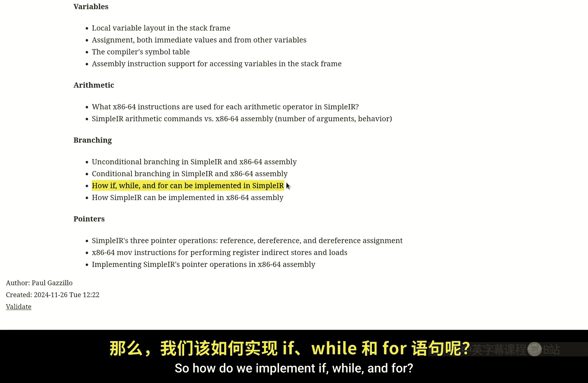

In simple IR。Well， it was a little trickier than that， if you remember。

 so if I have if x less than or equal to 10。呃。X equals three， let's say。呃。

How would I write simple IR to do this same thing， and just a snippet of code？Well， I could say if。

X less3 equals 10。 go to， you know， some label。But what was the challenge of doing this？

If I set x equals 3 here。Well， then， yeah， you could do it this way。

And then have an unconditional go to here。To get past that。

 but that was the main point that if you don't have this go to。

Both branches are going to set x to three， so you can either write it this way。

Or you can invert the condition。呃。Well， let me not make this continue counter just say。Another label。

But maybe it's confusing to， I don't know。 And so this is the。This is the。Branch that skips the body。

This is the body。Equals 3。Any questions on this， I think we went over this。

For almost a whole lecture， right like half a lecture， how these translations work。

There'll be one question on this where you'll have to do this translation。Just one。

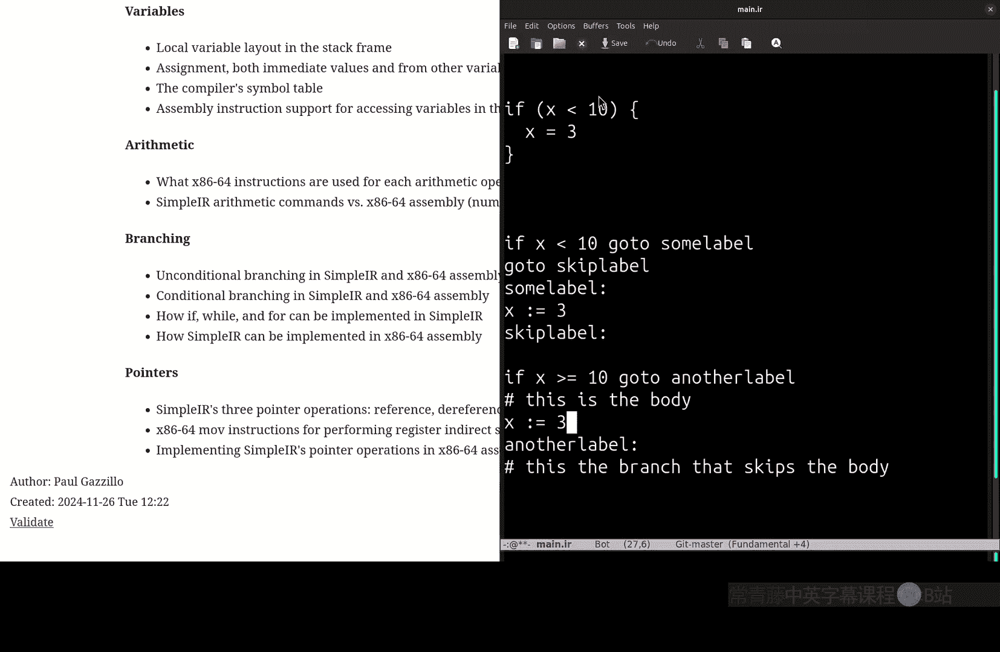

こ始道 this。I can't tell if this's all review for you or you're just completely confused and blanking out on the whole second half of the semester。

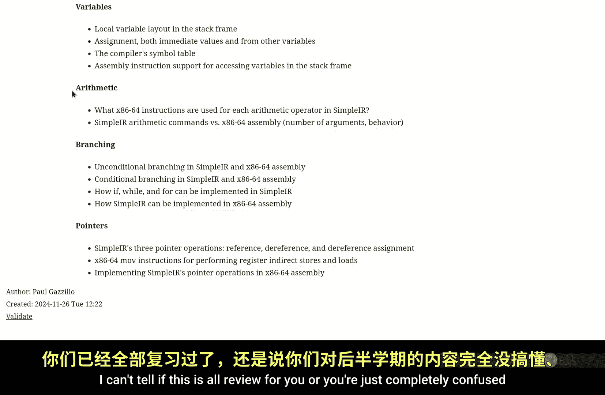

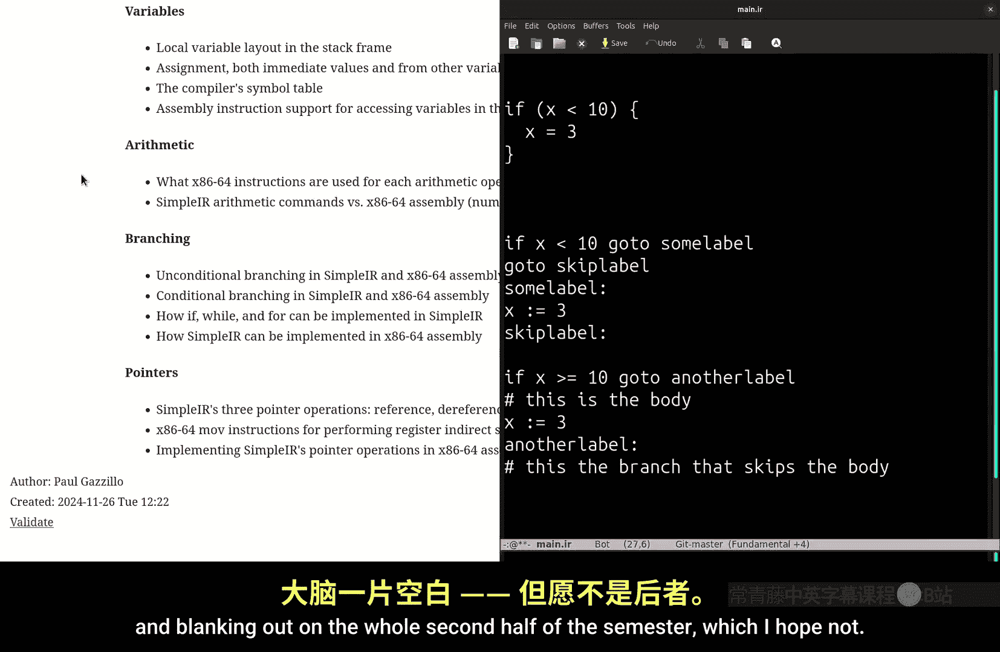

加油干。呃。Yeah， and we talked about this compare。And jump with the condition code like jump L E， jump L。

So， you know， just bring notes， bring notes on this， youve got 12 pages。

 you can bring notes with examples of IR， examples of assembly。

 and there's tons of translation examples， well maybe that makes it harder。

You know take a couple of these representative samples。Of translations。嗯。To help you during the exam。

I questions on branching？And then we come to my favorite part， pointers， the most confusing part。

We went over this， I think also quite a bit that we spent two lectures going over pointers。

They are confusing because you have to。Keep in mind the distinction between the variables。

 location and memory and the value of the variable which holds a location。

 the value of the variable holding a location。嗯。So I think this example that I went through last time。

Illustrates quite a bit of this。This is for assignment。So there was let me check the questions here。

So what does this register indirect move do， what does this syntax mean？Yeah。Yeah。

 so take whatever the data in RBX is， don't copy it to the REX register。

 but instead look at the address that's in the REX register and do a store。Of RBx to that。

 what's that？You can think of this as a dere， Yeah， this corresponds to a D referenceence。Well。

 you reference assignment？え？Exactly， yeah， yeah， so the full translation of this first store populates RAX with。

The value。Of the because member， this is a。This is a D Ref assignment。

 so it takes whatever the value of T1 is that's the we want to we want to store to that address because we're doing a D reference assignment here。

 so we take the value of that。Address or take the value of that variable。And we store to it。

Questions on that。So I went over that quite a bit。All right。

 so this is all the topics in the final exam， so you'll there'll be。

 let's say have many questions on the pointer stuff。There'll be a couple， there'll be one where。

You'll need to write assembly code for simple IR code that does some pointer operations。

Just to make sure you grasp that。呃。There'll be some writing simple IR code for。

Like a if or a wild construct。They'll be writing X86 code for some branching or。Aithth arithmetic。

 simple I code。And there'll be some questions on writing like a simple IR program。

There'll be a question on writing a simple I instruction that is a possible decocompilation of some X86。

I tried to make it very simple， so don't worry too much about that if you know how to go。

From S IR to Act 86， the decomilation shouldn't be too hard， I hope。And again， yeah。

 all these conceptual questions about the Col convention， arithmetic operations。

 branching operations in X86。Yeah。じ最は。Yeah。Simple I code， yeah。

 so that there's an example of simple I code。This one doesn' or I guess I have an example here too。

Go here。This is a couple of examples is an example of some。Branching S our code。Yeah，我问下我。ちとがて。No。

 no， I won't ask you to decompile simplerC there's one question on decompiling x86 to simple IR。

Likely supplier。And simple IR to assble yeah。And there's one question on C to supply R。

Which I know we didn't cover extensively， but it's like an example we did in class。こいたもいいで。

The oneYeah， very similar to the one I just did。For this one。I didn't write it， but I。

You can try to write it to we do some assembly code for this。You're stretching my assembly cell。

 So I'm just going to assume。X is in。This offset from our negative8 from RVP。All right， so let's do。

This one。So if I make errors， I'm not going to penalize you for those errors。

 but it'll be something like。Oh， okay， we got a。Set up two registers for ourselves here that contain the values we want。

 So I'll put the left one in Rx， and I'll put the。WRight one in RBX， this is a。

Immediate store or immediate load of 10 to RBX。'm sorryrry， so now RAX contain our。嗯。

They contain our opera for。A if go to， so I want to compare these two。

 so I'll compare remember the arguments are。Like swapped in the AT&T syntax world。

And then I'll do a jump less than two。Some label。So let's put our label down here。呃。

Our unconditional go tos are much simpler to translate。

 it's just taking go to and using the Intel unconditional go to， which is JMP。

And then here we've got an assignment。So。There's several ways to do it。

 so you could do the immediate， like I'll do how my compiler works。

I put the value I want to store into RAX， so I'm taking three and putting into RAX。And then， I。

Do a store to the memory location associated with X， which is what's the upper end for that？Okay。

 good， not losing everyone。And then we've got our skip label。And that's the assembly code。にろ発てう。Yeah。

 I didn't do the full program let's I ask。I ask you to do a。Don I ask you to do a complete program？

No， I don't make you do yeah， I don't have you do a complete assembly program because it's just kind of a pain know with the pseudoops and the prologue and epilogue and everything。

 just know what the program the epipilogue do。I'm not going to ask you about a complete X86 assembly program because it is kind of a pain。

に全部。来。Yeah， yeah， so know be you can put it in a web courses box and actually type it out or on paper。

 write it out shouldn't be。Too long。Trying to see what the maximum length here。

I haven't worked out the maximum length。I haven't， I mean。

You have almost three hours for the exam so and there's there's only five of these open ended ones which are。

All some form of writing， simple IR or assembly。In different ways。Its like on the midterm。

What does this X86 instruction do？Let's see what else we have。You know writing yeah。

 it'll be like something you can I think you can do on a single line or describe in a sentence or two。

Yeah， so yeah， that'll be the short， so there's five of these。嗯。

There's five of these long answer ones。Yeah。

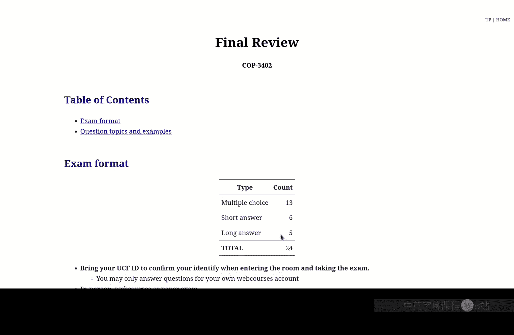

It did， but I didn't need it anymore after I。Oh no， it didn't hold the address。 It held the value of。

X， but I blew that away because I didn't need it anymore。Oh。

 we never stored the address of X in this example， the only time you ever need to store the address of X in a register directly is to when remember doing pointer operations。

Of pointer operations。Since we only have three minutes， let me show you the one from class。

So we had an example here of。Getting the reference， getting the address of x。

So the assembly code here is this。So， we get the。So this is the reference。

 so we're actually going to compute the address of X so this is starting with RVP and then' subtract the right having an instruction that subtracts the offset。

 now REX holds the address of X and we store it into T1。So this is the distinction between。

Poiners and non pointer usages。 So when it's not a pointer。

 the machine will do this computation for us。The machine will do this computation for us with this argument。

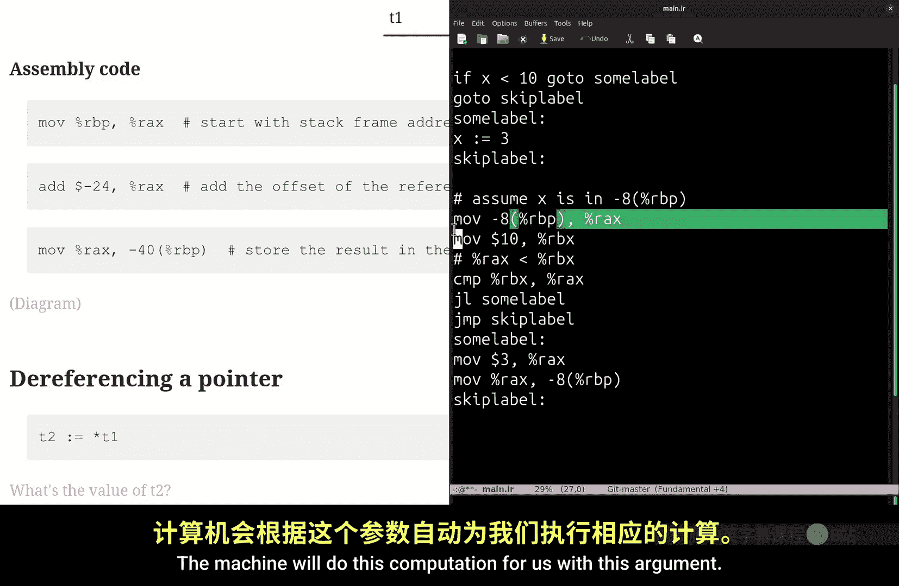

When we're dealing with pointers， if we want the reference， we have to compute that， generate code。

 that'll compute that。When a variable is a pointer that already holds an address。

Then we can just use that data。In that register， so， for instance， for。This， where we dereference T1。

 that is you go to its address and get its value。Then this is what the code will look like。

 so we get the value of T1， which holds an address， it's an RAX。

And then we de reference that address to get the value at that address。 So this is getting。

The value at the address that points to x。I don't know if that helps， but。We only have one minute。

 it looks like there's another class that is。Very eager to come in。Yeah， one more， yeah。I think。

見てくだない。Oh， that's a note for me to draw on my whiteboard。So it's not a good link。

 but it's if you look at the board， this board thing here。

 that contains those diagrams it's really an instruction to me。No， no。

 it's it's just a reminder to me。 All right， everyone。

 have a good break and we'll see you next week or actually come to off hours。 I have offs now so。😊。

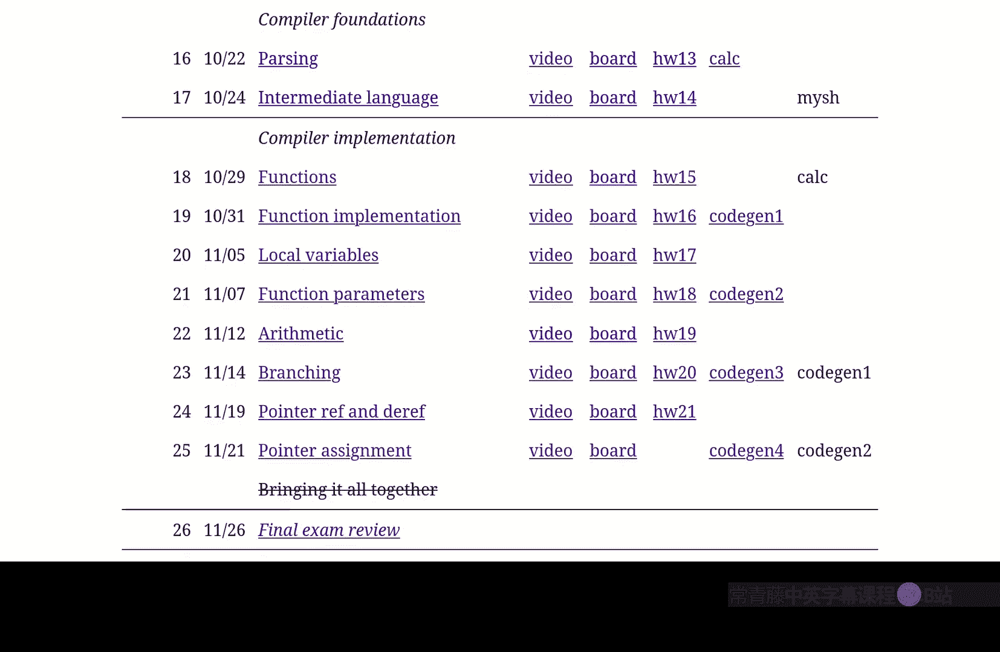