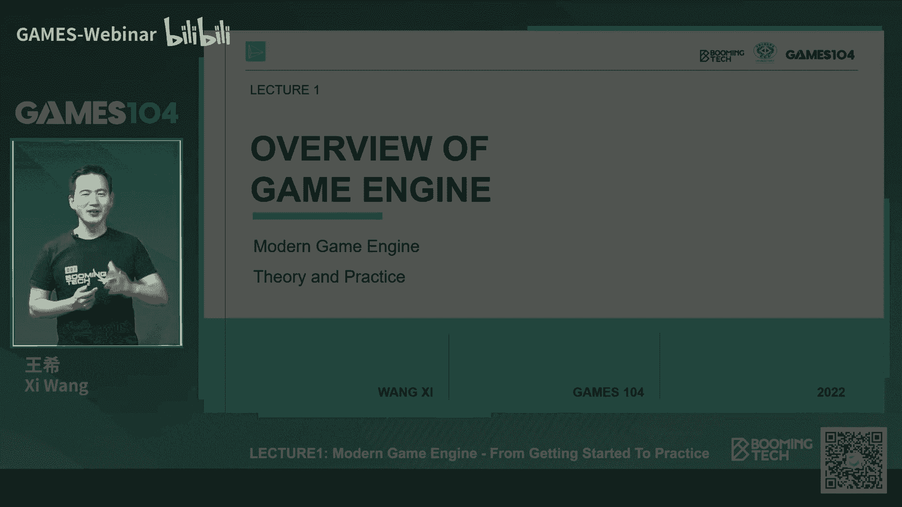
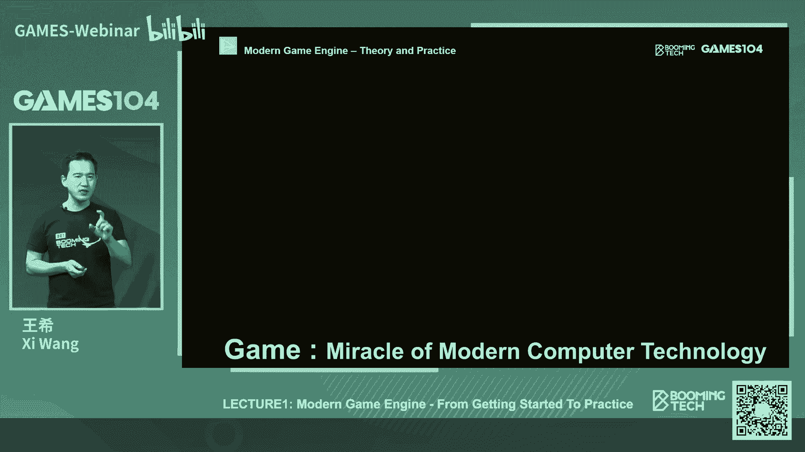
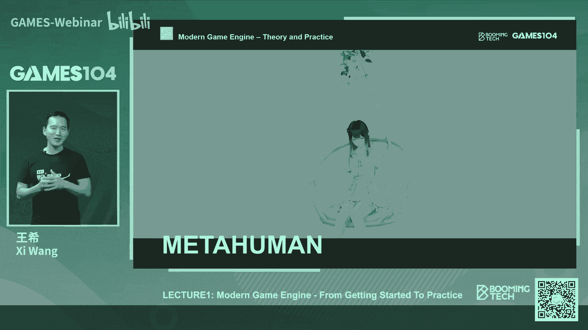
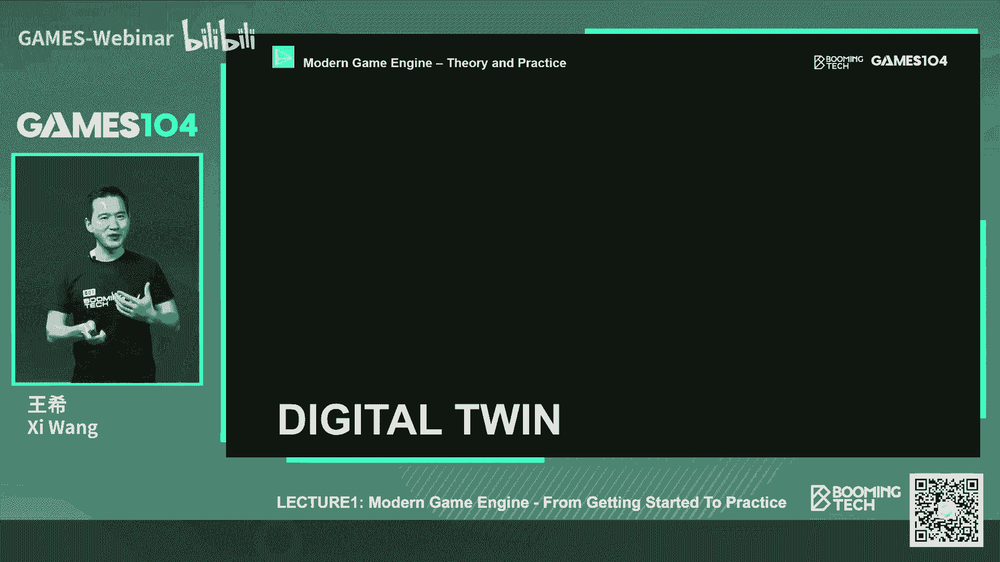

# 01.游戏引擎导论 ｜ GAMES104-现代游戏引擎：从入门到实践 - P1 - GAMES-Webinar - BV1oU4y1R7Km

Hello，大家好，欢迎大家来到games104，现代游戏引擎的理论与实践，很开心啊，今天我们可以开始这门课程，这门课我们已经筹备了非常久了，这一直以来是我们的一个夙愿。

我们特别希望能写一个系统性的课程，能够教大家如何去构建游戏引擎，一步一步的去创造出这样一个神奇的世界，因为游戏引擎它是集结了现代计算机科学，所有的最前沿的技术，他很像是皇冠上的钻石。

而这个技术它最终支持的是什么呢，我认为是未来构建黑客帝国，那么这门课的话呢，其实是一个非常系统性的课程，我们将用20多几个课时的时间，带着大家一步一步的去领略，这个用人类计算机科学构建出来的。

这样的一个奇迹，那么首先的话呢介绍一下我自己，那个实际上我的背景非常有意思，我本科是就读于浙江大学，我是在CDCG实验室，那个是很老牌的中国图形学的这个圣地吧，然后呢我研究生的时候去了清华。

在清华的同时，我去了微软亚洲研究院，在那个时代是一个非常热血的时代，就是是我们一群中国的科研的小伙子们去，在那个老师的带领下，去挑战西瓜，去挑战全球最前沿的这样的一个图形技术研究，我到现在还记得。

那个时候我们被关在那个小黑屋里面，然后跟我们讲说，你们是中国科研的国家队，你们并不比STANFORDMIT的学生笨，那你们去一起去冲击那个顶级会议的论文，所以其实那个时代给我们铸就了一种一种信念。

就是说如果我们努力，如果我们去真的去啊用功的话，我们也可以做出世界顶级的东西，那么其实在那之后的话呢，我本来认为我的职业路径一直是走这个，就是啊学术，但是那个时候发生了一件事情。

就是2004年虚幻三的引擎面试，当时整个行业都被震撼到了，因为那个时代真正让大家见识到了，什么叫次世代，然后那样的一个精彩的光影细节，我我身边的朋友知道问我说，哎王希。

你能不能够就是也做一个一样的东西出来，那这里面有什么技术，你们会不会不会做，当时我看完之后，我觉得哎这些技术好像我们都会做呀对吧，因为你做完research，你会认为所有的系统它无非就是算法。

每个算法我们都知道怎么去做啊，但是的话我会那时候在想，这是为什么我们做不出这样的一个，大型的系统和平台，所以当时也怀疑这个问题吧，我那个时候就决定说啊，不再去做research而去干嘛。

去针对到工业区去看，所以那时候就决定离开那个研究院，跑到那个美国去参加那个bta studio，那到bug studio的时候呢，实际上对我来讲是一个非常interesting journey。

在BG的话呢，实际上我用了大概5年时间，参与了两啊四款游戏吧，黑O3hero o d s t halo reach，以及这个destiny就是命运这四款游戏的研发，特别是在班级的最后3年。

因为那个时候我们在做下一代的游戏引擎，大家知道最早黑龙用的是自己的in house引擎，但是等我们决定启动做命运的时候，我们会发现就是这个行业发生了巨大的变化，游戏引擎。

我们要跑在一个完全不一样的计算机的，软硬件架构上面，因为那个时候我们会面临多核的时代，还有一点就是过去我们做的是单机游戏，那未来我们要做的是什么呢，是可以在线上，无数的玩家可以互联的这样一个游戏。

那么它的体系结构需要发生这样的一次革命，我在美国整整啊呆了5年吧，那个时候我毕业的时候，我觉得哎我我可能是这个又学了一个PSD，其实刚去的时候，这个转变是非常非常大的。

就是也是我今天开学这门课的一个很大的原因，就是说我们的同学，可以在学校里学到很多的算法，计算机科学的基础知识，但是我们有了这样一些算法，我们可以发顶级的paper，和我们作为一个高水平的系统。

这之间的差距到底是什么呢，其实我刚去美国的时候，我就想想回答这个问题，跟大家分享一个小故事，就是那个时候我在微软研究院的研究院的时候，我还自以为自己编程还可以，但是呢等我到了那个班级的时候。

我的前半年几乎是没有办法往那个引擎里面去，check任何一行代码，为什么你必须要理解那几百万行的那个系统，它是按什么逻辑，什么架构做出来的，所以今天那个halo3的纪录片中，中间还有一个我的镜头。

就是他们早上六点钟跑去在拍摄，那个就是早晨大家上班的样子，结果等他们摄影摄制组到了，我们的工作室的时候，发现有一个人没有走，然后我就趴在桌上睡着了，他问我为什么没有走。

我说我的feature还没有check in，所以在黑龙三的时候，那时候我记得我做的是那个可交互的水体嘛，其实那个系统的话啊，还是非常非常有意思的一个系统，所以我在讲就是其实用整整两年的时间吧。

就是我自己亲身经历的，就是如何从一个ARGUAGEAGORION算法feature，到一个真的系统的变变化，所以10年前也就是2011年，那个时候我决定从美国回来，就是啊创立了不明团队，为什么呢。

我觉得中国有很多很聪明的人，但是呢我们没有人愿意聚集起来，去做一个比较复杂的一个系统，真的把这些聪明，这些系统这些东西集合成一个system，因为算法和系统是有本质区别的，就是算法是这样的。

就是说我有个很酷的idea，我花几个月把它实现了，然后呢我就能发表一篇paper，这个周期是很短的，大概六个月左右，但是呢如果你作为一个系统的话，首先你要接受非常良好的，这个就是系统工程的训练。

知道一个大型软件系统架构的，而且另外一个就是你需要知道你的特定系统，怎么下，当我们真的开始去架的时候，很多时候可能是一年时间，你什么都看不见，所以啊我们这一次的话，就是说今天的话也非常开心。

有这样一个机会，就是通过games104这个平台的话呢，也是把我们的毕生所学系统性的整理出来，也是希望有更多的，就是同学们会对这样的东西会感兴趣，那么今天的课程我们讲的是什么呢。

是现代游戏引擎的那个理论与实践，其实游戏引擎它是为什么服务的，首先是为游戏服务的，对不对，那说起游戏的话，每个同学都应该是非常的熟悉，我们今天这个时代，我相信未来的时代一定是一个gamer的时代。

就是说啊哈我我相信游戏会改变世界，那么这是一个让我热血了，整整20年的一个行业，那这里面的话呢我们讲了一段视频，其实我们的编导组织玩这个视频的时候，我有一个小小的抱怨，就是为什么就只有情绪，没有老头环。

难道你们觉得老头环画面不够好吗，所以说其实我每每看到这个视频，我都会很激动，但是老头还没有做进去，我的机动会稍微少那么一点点，那么其实游戏它最奇妙的一个地方是什么呢，就是每个人都很熟悉。

就像你身边的手机一样，每个人都会用手机，但是有多少人能意识到，就是说其实在一个小小的手机里面，集成了全世界最前沿的半导体技术，最前沿的材料技术，最前沿的计算机技术，对不对，其实游戏你看到的每一个画面。

每一个细节，他都是在计算机里面用零一去模拟出来了，大家想象一下，如果我给你一个体育场，几万人，每个人手上举个牌子，可以打出不同的颜色，然后我说OK，我给你们每个人写一套算法，然后听我的指令。

这个时候你在那个体育场上看到的是一个，能跟你互动的画面，而且越来越真实，这件事情大家如果仔细想想，它其实是非常amazing的，这就是为什么今天我们去说啊，一个游戏做的好，做的不好，有这样的细节。

那样的细节我们会讲起来非常的轻松，但是真正的能做出一款游戏，它非常的难，它几乎集成了computer science，就是计算机科学里面几乎所有的知识门类，它本身的复杂度就是一个操作系统。

所以我们我们我认为就是说游戏，实际上作为虚拟现实，是作为现代计算机科学的一个，非常核心的一个应用。

而且这个应用的话它的技术含量也是最高的，那么游戏引擎的话呢，就是我们讲的这个皇冠上的钻石，因为它是躲在下面看不见的东西，其实中国的话我相信有将近几亿的游戏用户，对不对，那么会做游戏开发的人。

我觉得应该有几百万，很多人学会哎呦，我我会用unity，我会用ARREAL，会用一个游戏引擎，但是呢会用游戏引擎是你学会了开车，但是今天我们再问一个问题是，中国有多少人会造车，而造车的话。

你就需要知道怎么去造发动机，发动机的底层工作原理是什么，它需要什么样的一些技术，是有什么样的问题，什么样的这个材料，所以你会发现越到核心的东西，即使不止在中国，在全球真正做这件事情的人就会越来越少。

所以呢game engine，它是实际上是我们这个行业的皇冠上的珍珠，而且呢它的技术壁垒也是最高的，而且这个它是一个就是技术和这个设计，的一个结合体，所以的话呢。

这也是我们games104课程的一个设立的，一个核心的目的，那么哇为什么我们要学习游戏引擎，这个问题其实非常有意思，刚才我看到同志们弹幕里很多人在外面说，哎我是不是要学很多其他的课程。

我才能够去上这门游戏引擎课对吧，然后呢还有同学说哎我如果不会C加加这个课，我是不是上得了，这个其实是我们当时在设计这个课程的时候，我们很重点的在想的一个问题，就是说呃我简单来讲一下，我们立个flag。

就是我们尽可能在整个课程中讲人话，也就是说并不一定需要，你有非常非常多的计算机的编程开发的技术，但是呢你学完这门课程的时候，你会对这样的一个现代的一个大型软件系统，架构有一个基本的一个理解。

为什么这件事情很重要呢，这就是我特别想跟大家分享，为什么我们我很愿意去做这门课，跟大家分享一下游戏引擎的底层架构知识。

因为我们相信下一个时代，将会是用游戏引擎技术构造的，一个虚拟现实的一个时代，就大家今天看到的很多东西，其实它背后底层用的技术都是游戏引擎技术，比如说大家非常这个现在越来越火的，叫虚拟人技术对吧。

这是我们那个虚幻引擎的meta human，也就是在过去的这个10年到20年，在游戏中我们对人的皮肤的3S材质，我们对毛发的simulation。

对这个人物的这个procedure的agent做的越来越好，像这个鹿鸣大家是不是觉得很好看对吧。

那么大家想象一下，未来以后，我们打开我们的支付宝，打开我们的银行终端，你跟你交互的，他都是个虚拟人对吧，他可以去啊观察，你会给你交互，让你觉得这样你的一个小助手，那这样的一个技术它背后就是游戏引擎。

而且未来的虚拟人，会越来越多的进入到我们的生活，所以这里面的话，当我们做越来越多的虚拟人的时候，我们有没有想过我们背后用的是什么引擎，那么引擎这件事情到底重不重要，那么另外一个很大的领域是什么呢。

大家可能想象不到，就是影视行业，这是那个HOLYWOOD，用那个就是游戏引擎，在一个巨大的LET平台上形成了一个虚景，然后这样演员可以对着它进行拍摄，所以今天我们在就是很多广告，或者是电影里看到的场景。

它其实是用游戏引擎基础渲染出来的，这和传统大家理解的那个offline，就是这个离线的渲染农场的方法，已经又不一样了，这样的话我们的导播，我们的导演可以在现场调整光照，调整布景，那么第三个的话呢。

就是说军事模拟其实大家知不知道，就是我们每世界各国，各国都在用游戏引擎技术在训练他自己的军队，因为只有游戏引擎能够提供，这么真实的这样的一个场景，大家想象一下，我玩的很多这个战争游戏。

是不是它就是一个战争模拟器，就是无论你是这个步兵还是开车，这个坦克车还是开着飞机，其实他都需要最前沿的引擎技术，帮助大家去，这个就是身临其境地演练你的战术，去检测你的战法。

其实这件事情的重要度现在已经是越来越高了，因为现代化的战争是越来越复杂，是系统对系统的对抗，那么另外一个很大的领域的话，就是数字卵生这个概念，我相信同志们可能最近听说过一些非常啊，hot的概念。

比如说工业4。0啊，工业数字数字化呀，那么这个背后有一个很热门的概念，叫做数字孪生，包括最近大家一直在讲的元宇宙，那么其实数字卵生的话呢，我们可以认为就是说，它会把现实世界的很多东西。

把它虚拟化的表达在计算机世界里面，这样能帮助我们更好的去理解，更好的去管理，更好地去构建未来的世界，那这里面我举个简单的例子吧，比如说我们现在最热的这个无人驾驶，其实所有的无人驾驶车99。9%的。

它的驾驶旅程其实是跑在那个游戏引擎里面，因为我们不可能把车子在路上开10亿公里，所以这个时候我们就要用游戏引擎，模拟各种各样的下雨啊，各种各样的路面的情况啊，包括行人各种异常的情况。

那么另外一个的话呢就是下一代的，比如说车载系统，其实它的人机交互界面背后用的全是游戏引擎，这样我们才能看到那么漂亮的。

立体的这样的一个界面，所以这就是游戏引擎一个巨大的价值，那其实这个一切呢，这也是为什么我们开始这门课的，一个很大的原因，就是我认为就是在未来的10年到20年，每个人都多多少少需要知道一些。

这个虚拟世界是如何构建的，而且这个虚拟世界最重要的一个foundation就是game engine，那么我们开始这门课的话呢，这一趴我们就先讲一下这个游戏引擎的历史，就是一切都是从最原始的时代开始。

其实我们这个行业game行业其实非常视频，游戏行业非常的短，大概只有50多年的历史吧，那最早的时候其实这个行业最早的时候的话呢，我们的机器很简陋，这个机器我不知道有没有同学玩过叫红白机。

那上面有很多我们童年的快乐了，比如说魂斗罗啊，比如说这个这个马里奥对吧，大家都觉得特别特别的经典，但是在那个时代的话呢，实际上没有游戏引擎的概念，游戏都非常的简单。

然后那个时候最开发游戏最核心的能力是什么，是我如何把一个复杂的这个元素，把它放入到一个非常小的，比如说40KB的这样的存储空间里面去，那么这个时候大家如果去看那个就是啊，任天堂的有些报告，他会告诉你说。

那个时候为了节约资源，我一个云彩，我把它变个原神，比如说把白色的云彩，这张贴图变个颜色放到地上，它就变成一个草丛对吧，作为一只小乌龟，我把它正面反面来回播放，已经看起来了，小乌龟在地上走，其实那个时候。

其实做游戏是一个非常有趣的事情，我记得以前啊我在美国工作的时候，有一个微软的这个副总裁跑过来给我们做报告，他告诉我这么一个事儿，他说他说啊，我在我加入微软之前，我一年做了四款游戏。

所以在那个时代当时我们就听傻了，因为我们是几百人对吧，做3年才能做一款3A游戏，在那个时代，他一个人20多岁就能做这个四款游戏，那为什么呢，因为那个时代的游戏非常的简单。

那个时代其实我一直认为是游戏的黄金年代，就是大家有很多很多的创意野蛮生长，就有点像那个寒武纪生命大爆发一样的，就是那个生命会变得各种多种多样的姿态，但到后来你会发现现代生物它越来越集中，越来越。

比如说轴对称啊对吧，一定有两只眼睛，两个腿啊不对，这里面讲一些生物学的概念了，那就随着这个系统的演进，我们会发现它有一些变化，那第一个提出游戏引擎的人是谁呢，那我觉得这里面我一定要去这个提这个john。

ta对吧，就我们我们传说中的叫卡神，他绝对是啊，我们这个行业里面，我认为是这个教父级的人物吧，直到今天，他还在这个为FACEBOOK的那个奥特莱斯在努力，我其实最近刚刚听了他的一个报告。

就讲那个VR的这个这个这个虚拟现实的东西，我我还非常非常的就是崇拜和敬佩他，就是说他还是那么谦卑，而且那么多务实在讲一些具体的东西，但其实他是个非常睿智的人，就是说在那个时代，他是最早做了一款游戏。

叫wolf step，就是重返德军总部，如果小伙伴们关心游戏的话，知道最近好像有一款重置的3D版再次上线，那么这也是这个非常经典的一款，就是可以说是开创了FPS这个时代，就像我们在做游戏的时候。

我经常跟我们团队在讲，就是说大家千万不要被现成的东西给束缚住，因为有的时候比如说今天我们要游戏从业者，我们会说哎呀，这个我要做一款什么什么类型的游戏，但是其实啊任何一种现在我们看见的游戏类型。

都是被一款产品给创造出来给定义出来的，所以说未来世界，我觉得会有很多新的引擎会出来啊，新的游戏类型会出来，而在那个时代的话，世界上没有一个物种叫做游戏引擎，但是john kmart他看见了一个东西。

他说诶当我在写各种各样的游戏的时候，中间有很多的代码是可以重用的，那么这些宠物的东西我能不能抽出来呢，我要不要把它定义成叫做一个game engine的东西，所以呢这个老哥就说干就干。

然后他做了第二款游戏，那也是经典中的战斗机吧，就doom，doom的话，诶我忘了中文叫什么名字了，反正到现在doom还是一个非常棒的一款，这个这个射击游戏，那么doom的话在做doom的时候。

他把doom里面的核心代码变成了一个游戏引擎，然后这个引擎呢他授权给了另外一家公司，另外一家公司做了一款游戏，叫做shadow caster，就是这个阴暗影魔施法者，这个游戏我居然在商业上成功了。

所以如果说我们今天在学习游戏引擎的话，我们会认为ta的这个doom的引擎抽出来，应该是全球的第一款的游戏引擎，而且很幸运的是，第一款引擎商在商业上就已经成功了，不过今天我们这个课程叫什么呢。

叫现代游戏引擎，那么从早期的游戏引擎啊，大家只是意识到说诶我只是一些代码的共用，但是真正的现代游戏引擎的概念的话，我认为还是从quick时代开始，但是这个quick实际上也是卡马克大神的。

卡神的这个作品，那么我相信很多小伙伴，那个可能是听说过他的如雷贯耳，但可能没有没有没有玩过，在那个时代，quick的话是最经典的射击，而且呢是对战游戏，那个如果讲一个就是很有年年代感的东西。

就是quick一个很著名的叫做火箭跳，就是你可以拿这个RPG对着地上去轰，然后呢反作用力会让你跳的更高，那个时代给我们创造了无数的快乐，而且它是第一款系统性的研究过，就是联网对战下。

这个网络怎么去同步的，这样的一个一个一个游戏，而quick的引擎的话也是那个时代真正的经典，那为什么会出现这样的一个质的飞跃呢，这里面不得不讲一个划时代的东西，出来了什么东西呢，就是显卡，显卡。

今天的话同志们，如果你们喜欢打游戏，如果想做游戏开发，每个同学每天脑子里心心念念的是哎，我的那块3080什么时候能到对吧，现在肯定是买不到了，那么其实在最早的时代，其实游戏计算机是没有显卡的。

直到很后面大家才意识到说，图形运算和这个逻辑运算是不一样的，图形运算是大量的向量运算，而且有大量并行化的运算，所以说如果我拿CPU去做图形的话，很麻烦，所以第一第一代的显卡五度显卡出来了。

而quick呢就抓住那个时代，所以他做了第一代的这样的一个3D的游戏，当时他的画面，他的沉浸感，实际上是震撼了那个时代所有的玩家，到今天啊是很多人在讲那个FPS游戏的时候，都会讲一个东西叫做什么呢。

叫做晕3D，我不知道我们的这个同志们，有多少人是晕3D的，我知道有很多那个玩家是晕3D的，就是打着打着就会to了，那如果你想了解什么叫晕3D的话，我强烈推荐quick，基本上是包你这个当场就可以吐出来。

那么但是的话呢，确实他创造了一个前所未有的这样的一个体验，所以这里面的话呢我们会跟同学们讲一个概念，就是游戏引擎为什么会越来越发达，而游戏引擎会越来越重要，其实这里面讲一个核心的一个关联度啊。

叫做硬件的发展，其实在那个时候我我们在思考，就是说啊，我们这个技术平平台的driver到底是什么，我一直认为是硬件的发展，我们以PLAYSTATION为例的话。

第一代的PLAYSTATION它的算力值有多少呢，只有0。06个GBS，那么一直到P2P3P四到我们现在的PS5，那PS5的效率是多少呢，十个ta flos，那所以就意味着。

就是说算力整整提升了20万倍，那么当你有了20万倍算力的时候，这意味着什么，同志们很多很多的这个就是游戏从业者，包括我们很多玩家会说哇，太棒了，我可以做一个很棒很棒的东西出来，对不对。

但实际上这个从软件工程上来讲的话，这是一场巨大巨大的挑战，因为随着你的计算机算力会越来越丰富，越来越强大之后，你的系统就会越来越复杂，那个就是你所表达的这个效果，你说你涵盖的这个就是模块就会越来越多。

这就像那个操作系统，最早期的时候操作系统谁都能做，对不对，会很多人都能做，但是为什么到现在，操作系统只有极少数的这个公司才有能力做，为什么呢，是上亿万行的代码，那同样的就是像游戏引擎也是这样。

早期的游戏引擎其实是非常非常简单的，但是到现代游戏引擎的时候，动辄就是几百万行到上千万行代码，而且呢里面的算法非常的复杂，其实游戏引擎的算法密度是非常非常高的，而所以呢经过这将近30年的发展吧。

从九几年开始，今天我们可以看到一个非常丰富的，游戏引擎的生态，大家非常熟悉的这个虚幻引擎，unity引擎，还有前些年其实非常厉害的，就CRYTEK引擎，这些年稍微有一点有一点点，那个就是说掉队吧。

然后呢，其实这是我们非常熟悉的一个商业级引擎嘛，但实际上全球的游戏大厂，比如说像育碧啊，像那个那个ea啊，像那个就是这个啊，包括威慑啊，都有自己的游戏引擎，比如说大名鼎鼎的寒霜引擎，对不对。

如果大家如果你是一个FPS游戏的玩家，你一定知道战地这款游戏，他那种开阔的战场的感觉，那这就是寒霜的这个巨大的，这个这个能力的表现，那么那个ENVIL就是说铁毡吧。

铁毡引擎是那个我们大一必做这个刺客信条的，虽然说EB的游戏我总觉得有点塑料，但是不不妨碍他的引擎确实做的非常的好，那么刺客信条里面，我这里面就是大家很著名的一个案例，就是说巴黎圣母院对吧，以前是非常棒。

大家都可以访问，当一场大火发生之后，我们只能够在这个就是刺客信条里面，去感受和体验一下巴黎圣母院的那个盛况，所以呢包括像那个威慑的这个这个source引擎，那么同时也包括一些就是免费的引擎，大家知道的。

比如像ta呀，像这个就是说armory啊，像这个的高ta，但是呢这些商业这些免费引擎呢，目前我看了一下，主要是以轻量级的休闲游戏为主，比较偏2D的啊，偏这种简单的游戏，真正到这种复杂性来讲的话。

和这些大厂的商业引擎和商引擎相比的话，还是有些差距的，那么同时的话呢，就大家去理解这个引擎的生态的话，其实不仅仅是引擎中，引擎中间内部的东西，实际上是随着游戏行业的发展，我们会发现有些东西它非常的复杂。

比如说物理运算对吧，早期的游戏引擎里面都会自己写物理的，比如说结算器怎么去做物理碰撞的检测，但是后来大家发现这个问题越来越复杂，就会出现专门的就是做物理的这个模块，我们叫做MITA表，叫中间件，中间件。

这里面包括比如做物理的ta和physics对吧，还有专门做声音，其实在游戏里面的声音效果是非常非常重要的，比如说你们去玩一个恐怖游戏，走进那个房间，你听到那个声场脚步的回声，对不对，当你去打仗的时候。

一个炮炮炮弹在你旁边爆炸，你听到耳鸣感，这些是有专门的声音的引擎，比如说像wise啊，像f mod，那么还有包括像那个做这个自然的植被的，做光照的强大，名鼎鼎的speed tree，那他是做什么呢。

做这种很漫山遍野的树木，大家知道就是有一款游戏叫指环王，指环王的话，当时他的那个场景哦是阿凡达，我记得好像是阿凡阿凡达，他做那个茂茂那个茂密松松的外星星球，其实用的是speed ta的这个技术。

那么mito while的话呢，这里面多说一句，就说mito well公司总是会不停的爆发出来，但是呢一般生命周期都不是很长，我们经常开个玩笑，在业界里也会说，就是中间件公司最好的归宿。

是被某个游戏大厂或者游戏引擎大厂，也说过了对吧，所以的话呢就是，但是其实它在整个游戏引擎生态里面，扮演了一个非常重要的一个模块，所以啊，OK我前面简单的把游戏的这个历史介绍了一下，同志们有没有什么问题。

啊哈哈，同志们说要收购，你们是想把虚幻引擎收购了吗，啊行那我们就接下来了，进入到我们这个啊课程中生哦，过程P啊，你讲的是那个就是那个PCG对过，我后面会在课程中谈到，就是那个就是啊就是内容生成的。

这个就是或者叫场景生成的这样的一些中间件，其实这项目中间件其实蛮多的好，那接下来的话呢，就是我们进入到我们课程的正文了，就是首先的话介绍一下什么叫游戏引擎，那么这里面的话呢就是传统的异能吧。

就是我们一般讲什么定义一个词，最首先寻找的是VKPEDIA，维基百科告诉我们什么叫游戏引擎，这是我从微机开始摆开上扒下来的一句话，就是什么游戏引擎是一个软件的这个框架对吧，专门设计为游戏开发做的。

这样一系列的软件的工具的合集，这句话的我听完之后，我的感觉就是基本上等于什么都没有讲，对不对，就是这就循环论证了，那么当然了，后面也有些好心人就说哎呀，游戏引擎包括什么什么场景管理啊，什么什么。

讲了一大堆的这个这个更具体的细节，其实我觉得这两个定义都不是特别的准确，因为一个是太概括了，就像是说什么是人哦，两只脚吃饭能走路的叫人，那肯定不是人对吧，还有一个就是讲哦这个人有眼睛，有鼻子耳朵。

这些都不是人的本身，那么什么是游戏引擎呢，我觉得我给了一个意义，就是说，首先它是一个构建黑客帝国举的技术底层框架，Take foundation of the matrix，那么黑客帝国大家知不知道。

就是啊，这是一个20年前一个非常经典的一部电影啊，今天刚刚那个新的星座上市了嘛，那黑科技国内面，它构建了一个非常伟大的一个想法，就是我们是不是生活在一个虚拟的世界，今天我们虽然能够感知到彼此。

我们觉得好像我们生活在一个真实世界里面，但是what if，我们是缸中之脑对吧，我们是通过一系列的传感器和一个计算机模拟，模拟出来一个一切的实在，而其实游戏引擎在过去的30年，我们在做的一切的事情。

都是说在模拟一个虚拟世界，也就是未来，当我们戴上了VR的眼镜，当我们戴上了插上了耳塞，当我们身体穿上了触感的皮肤，我们可能无法区分我们是生活在一个虚拟世界，还是一个真实世界。

而游戏引擎它所有的软件和体系的架构，都在为这件事情在服务，那么第二个呢引擎游戏引擎的定义，我认为是就是是一个生产力的工具，就是它是什么生产力的工具呢，创意或者是人类的想象力。

也就是说通过这样的一个一套工具体系，我们可以把我们想象的那个世界，在这个一个虚拟的空间里面构建出来，我们可以构建一个高达几英里高的，一个一个巨大的一个建筑物对吧。

我们可以创造一个从来没有存在过的外星星球，那这是过去我们对这种东西想象是停留在哪呢，停留在我们的书本上，我们写一个故事，或者停留在我们的画面上，我们的画一幅画，或者我们拍一部电影。

但是游戏引擎提供了这样的一个工具，让大家把这个世界真的能够，身临其境的创造出来，就是摆在我们面前，那么最后一个呢，这是我个人的一个观点，我认为它是一个复杂性的艺术，因为当你有这么强大的需求和能力的时候。

这个系统绝对不简单，它是非常复杂，所以说几乎不存在一个完美的，紧致的一个引擎架构，实际上它是一系列妥协，一系列决策的一个结果，所以我认为是一个复杂性系统的一个艺术，所以呃我我其实有一本书啊。

我其实特别喜欢叫啊，The complex complexity of system，就是系统复杂之美，其实当我们在越来越深的去理解，游戏引擎的时候，我们发现，我们去面对的就是一个超级的复杂性系统。

那为什么就是为什么讲我们在构建这个世界呢，其实我一直就是，我10年前我才去讲游戏引擎的时候，我特别喜欢用一张图，就这张图展现的是一个吸满血的蚊子，当我们用这个就是显微摄像机拍下来的时候。

我们可以看到这么的美，他那个身体的那个材质无数的细节对，所以其实大家想象一下，就是今天我们看到游戏，我们说我们的次世代，我们的画面无比的真实，但是你跟大自然相比，我觉得我们还差的特别的远。

就是这里面跟大家剧透一下，为什么我这么热爱这个这个之前这个视野，我记得10年前，当时我看完那个阿凡达这部电影的时候，我特别的激动，我跟我的小伙伴讲，我说10年之内我不会失业。

为什么我们要10年甚至更久的时间，真的通过游戏展示在大家面前，让大家真的在这个世界里面可以交互，但今年育碧刚刚做了一个这个阿凡达的游戏啊，实话说我个人觉得哎呀还是没有达到我的期望，没关系。

我们这个游戏引擎和游戏行业的同学继续努力，那么其实在真实世界，在上帝所做的这个游戏引擎里面，他对细节的展示，是让我们人类觉得自己太渺小了，这个太粗糙了，根本没有办法表现这样的一个细节。

那么那么这个东西讲起来非常的简单，但其实在这个虚拟的世界里面，我们实际上一切的东西都是用简单的，0101的逻辑去表达的，大家知道现在计算机吗，其实现在的计算机，它的最基础的理论模型是什么呢。

我们叫做图灵机，这个地方的话有点高能啊，我简单预警一下，就是图灵机的逻辑是什么，就是说我们大脑所有复杂的运算，所有复杂的决策，图灵老先生在几十八十年前，90年前，他用数学就会告诉你说。

你可以通过一个可以打孔的纸袋，我有个有个头可以读和写，然后呢按照一定的机械规则去这样去运运，运动的时候，我就能够完成这样的一个计算，这简直是一个非常了不起的事情，他他当时说是。

只要有一个无限长的时代就可以了，当然了，那个那么现在计算机是越做越复杂，你们看来越来越花哨，但它的本质就是读写计算，读写计算，那么用这样一个简单的零一变化，零一变化，我们要构建这样的一个世界。

其实是非常挑战的，我给你举个例子，就是这是两个人在联网了，去做一个简单的动作输出那个游戏，那大家首先看到的肯定是A，我们要把这个人渲染出来对吧，我们让这个人能动起来对吧，我们需要有一个渲染器统。

我们要有动画系统，这个是我们看得见的，但其实看不见的，有很多的系统，比如说我们要第一个，他的这个就是物理碰撞系统，一旦被打中了，我得知道你打的中我吧，对不对，第二个就是说我需要有它的整个控制系统。

因为我的一切输出能够进得去，还有什么呢，还有更复杂的网络怎么同步，因为这两个人在两个不同的计算机上，当A同学按下了键盘的一个键的时候，他在自己的世界里做了一个操作，在另外一个世界里的B同学。

是不是也要看到同样的操作，如果他那时候做了个闪避操作，他两个到底算是闪避成功了还是没有成功的，那么这所有的complexity，都躲在一个用一句话就能描述的，这样的一个游戏行为下面。

所以这是这个系统的复杂度，那么其实呢就是说，这里面我要跟大家科普一个概念，这也是上我们这个课程的同学，我特别希望大家能够建立的一个概念，就是这个课程的话，就是上班之后。

当有人告诉你说哎我会做很多的rendering，很多的渲染，所以我就能做游戏引擎了，那上完我们这个games104的课程，同学就说这事情绝对没有那么简单，这个是游戏引擎非常经典的一本书。

叫game engine architecture，他画了一个游戏引擎的结构图，然后我自己是学图形学的科班出身的嘛，但是我我很卑微的发现，就是原来我们的大图形学，只在整个游戏引擎中占那么小的一个部分。

所以啊所以我是大概差不多花了，这个就是本科研究生都在研究图形学，但是那时候觉得自己做学习还可以，但是没想到当我做游戏引擎的时候，又整整花了15年，学习他所有的相关的一个知识体系，所以的话以后有人问你说。

我做绘制是不是就能做游戏引擎了，那么需要我们games104课程的同学，就可以很自豪的回答NO，你还要学另外90%的知识，那就是游戏引擎，它最大的一个挑战是什么呢。

我们刚才讲的是说哎我们是构建一个黑客帝国，构建一个虚拟的世界对吧，但是我们真实的世界假设全是虚拟的，我一我经常在想，上帝老人家特别厉害，为什么他有无限的算力，他没有带宽的延迟对吧，它有无限的存储。

所以呢它可以采用暴力算法，就是大家如果对物理学了解的话，就是量子力学最基础的，这个理论是非常非常简单的，对不对，就只有四个基本力，现在好像只有三个了，那么再往下推，如果弦论靠谱的话，一切都是震荡的弦。

然后通过这些弦的震荡，我们居然能形成这么丰富多彩的世界，和他的意识世界，对不对，所以上帝很牛逼，他有他的效率算法，但是很可悲的是，在现代计算机里面，我们的算力是被严格的限制住的，大家想想看。

就是在那个计算机的CPU主频一直在涨，对不对，但是你有没有发现，这几年主频涨的速度是变慢了，我们几乎已经hit到了摩尔定理的这个上限，然后呢我们的硬盘，我们的内存也是有限的对吧，就那么那么多G怎么办。

还有一点就是有一个很可怕的东西叫做带宽，同学们在网上那个下载电影啊，看视频都会知道带宽是很头疼的对吧，我每秒钟能传输的东西都是有限的，还有什么呢，还有一个叫延迟，就是说我今天在AD的地方发生的事情。

我要传到B地方，我这个时间是有延迟的，需要传输的，那么有这么多的约束条件，但是呢我们要在计算机里面模拟一个，很像真实世界的东西，大家想想看这个东西是不是很难搞，这其实就是游戏游戏引擎的复杂度。

而且呢更让我们觉得痛苦的东西是什么呢，这也是游戏引擎的一个核心设计的边界条件，就是real time实施，这个是大家学习游戏引擎，特别要记住的一个关键性的概念，就是说啊无论我有多么fancy的。

多么厉害的算法，我能做出多么好的效果，如果你不能够在1/30秒，也就是33ms之内，把这个计算结果给提交出去的话，那你这个算法就是无效的，而且这个实际上也不可能给你那么大的算力。

比如说我们在做游戏引擎的时候，我们的整个预算只有33ms，但是呢每一个系统，比如说我去做个非常漂亮的这个医疗模拟啊，我做一个非常棒的一个水体的效果啊对吧，或者说我作为一个非常酷的这个物理爆炸。

我可能只给你一毫秒到2ms，而且同志们现在玩现代游戏的时候，我们会对什么东西要求越来越高，叫做帧率，对不对，现在打做一个男啊，玩一个动作游戏，如果你低于60帧，我就觉得哇这个画面没有办法接受了。

60战意味着什么，天哪我的计算只有15ms是吧，fitting到一个这么短的一个时间片里面，这其实就是现代游戏引擎设计的核心难点，所以roll ta将会是引擎的一个核心关键点，那么另外一个是什么呢。

就是也是我们讲的引擎的第二点，其实引擎它不仅仅是一系列的算法，其实引擎呢它是一个生产力的工具，其实从最早期的quick时代开始，大家就意识到了，说诶游戏引擎的用户不是成不仅仅是程序员。

它真正最大的用户是什么呢，是设计师和我们的艺术家，那么好，艺术家需要有一整套工具在里面，去构建他的世界，对不对，他会去构建那个就是啊我要摆放，我要把关卡的规则放好，对不对，我要放各种各样的敌人NPC。

那么其实在早期的时候，工具链是很简单很简单的，比如在quick时代，大家看到的就是这一个编辑器就可以了，但是呢大家打开一个现代游戏引擎的话，我们是一个庞大的工具体系，比如说而且非常有意思的是说。

每一个工具，它的使用者都是学习不同专业技能的人，比如说我们的动画师，我们会用一个就比如说角色编辑器，我们在里面编辑角色所有的动画，所有的行为，那么甚至我还给他做上物理的模拟，布料的模拟。

那我们这个关卡的设计师，他会在设计这个关卡里面，所有的山川河流要看上去非常好看，对不对，但是呢唉我们的这个designer，就是他要去给他们设计各种各样的规则，让这个规则的话呢变得真的好玩。

包括的话我们还要给他们一个工具，让他们设计这个游戏里面各种各样的AI的行为，AI to的行为，也就是说一个引擎，它如果只是一段一一大堆的代码，只是一个SDK的话，实际上它是没有办法用的。

它实际上必须要提供一个非常强大的工具体系，这也是我们上完games104课程课程，同志们要建立的一个非常强的概念，就是做引擎首先要学会的是做工具，而且工具的用户不是程序员。

而是我们的艺术家和我们的设计师，那么当然了，其实程序员也是引擎的一个非常重要的用户，为什么呢，因为当我们在设计这样的一个技术底层的时候，我们不可能知道所有的游戏类型，比如说我要做一个场狂闯关动作游戏。

我要做一个开放世界的冒险游戏，我要做一个剧情的mm RPG，那其实每一款游戏里的玩法，变化都是多种多样的，这样的话呢，我不可能把所有的玩法都做进到游戏，引擎里面去，所以就要求让我们的这个程序，这个长。

这个游戏的程序员能够快速的去诶，开发出它的特定的玩法，所以一个引擎在上面进行二次开发的，能力的强弱，也是一个引擎最重要的一个评判标准之一，那么还有一点的话呢，这个也是在这门课里面。

我们要给同志们讲的东西，就是引擎，它是一个我们讲它是生产力工具嘛，它一个很重要的一个属性，我们叫做协作的，可协作的生产力工具，这个听上去有点抽象啊，那我接下来讲人话，就是相当于。

比如说我一个人可以把整个世界构建出来，对不对，我一会儿换棵树一块做个规则，一会儿让这个小人动起来，听上去都很简单对吧，但是如果我把这件事情拆成三个人，三个不同人做，每个人只做自己的一小块。

那他们在之前是不是要有一个协作呢，那大家如果看一个现代游戏的这个啊，这个studio就是一个工作室的话，他动辄就是上百人，而且这上百人的话呢大概有20~30个大的，这个就是这个分工。

每个人的技能都不一样的，会写写程序的人非常的少，然后呢也不是所有的艺术家绘图中的，有的人很会画贴图，有的人很会建模，有的人很会做动画诶，有的人很会去搭这个环境啊，有的人呢很适合去调这个。

这个这个就是做做这个气氛，做过场动画，那好了呀，那这样的人在一起，我们怎么去协作呢，这个时候引擎的工具链非常的重要，然后刚才看到同志们有人在讲，这个叫工具人，你说的没错，我们就是工具人。

所以我们一直认为就是引擎，对游戏开发团队的姿态是什么样子的，我记得有一幅很著名的话，就是我们是这样的，是哦我们的设计师美术师大的，然后呢我们把他们服务好，而且做引擎有个很大的那个心理建设。

就是说啊虽然做引擎很挑战很难，但是呢我们一定要把自己放的特别低，因为我们的目标是，服务好这些优秀的艺术家和设计师，所以工具是生产力，工具是引擎最第二个非常重要的标签，那么最后一个呢其实就是引擎的复杂度。

其实引擎是一个非常复杂的东西，我讲一个，这里面只讲一个点吧，就是说呃当我们把整个这套体系设计好，这些工具设计好之后，是不是就完事了，其实不是的，其实他在这个随着时间的推移。

我们要不断地去对它进行完善升级，更好的算法，更好地展现，对不对，更好的一些feature，比如说我会把光照做的越来越漂亮，我会把这东西做的越来越细腻，然后呢可以做更逼真的物理模拟等等。

但是你这些底层技术一直在升级的时候，过去大家做的那些资产，做的那些游戏逻辑，必须都要全部能跑得起来，不能够说你一声滴答就不能跑了，所以我们行业里面有一句话叫做，你要在一架飞起来。

在飞机上把它的零部件逐渐换掉，甚至把整个引擎都换掉，它这个飞机是不能掉下来的，那这里面的话，其实在引擎基础最开始架构的时候，就会做这样的一个设计，那么所以的话呢就是如果同学们。

当然我就是将来有机会去参与到，真正的引擎研发的时候，我觉得我们一定要做好这样的觉悟，就是我们面对的是一个超复杂的系统，我每次都特别喜欢用这张图，因为这真的代表，当你面对上千万行的游戏引擎代码的时候。

你的内心的真实的感受，但是呢我们这群人最厉害的地方，就在于能理解这个flow，所以呢当然我今天讲的就是我们课程，很多的小伙伴，大家可能不会从事引擎开发，你们可能会从事游戏游戏开发。

甚至是你不会做游戏开发，你只是用游戏引擎的理念和概念，去做一些这个其他方面的应用，但是呢我觉得通过这门课程大家学到的方法论，学到的这个体系结构，实际上会对你做很多的，面，对很多复杂系统。

复杂问题都会有帮助好的，那接下来就到了大家最关心的问题了，就是我怎么去学游戏引擎，刚才听我这样一讲的话，我怀疑很多同学可能会吓到，会说哇天呐怎么这么难，我真的能学吗，我连C语言都不会，我能做游戏引擎吗。

那这里面的话呢就是啊，这是我们在那个，就是其实在我们行业里有个大牛，他在GITHUB上发了一个一个长途，就讲说你要成为一个游戏程序员，你要去这个学了多少的书，当时我把那个长途看了一遍。

然后说哎呀我的天呐，好像好多书我也没看对吧，其实如果说今天大家真的想去做专，业的游戏引擎开发，确实你会涵盖到computer science，几乎所有的专业领域。

那对大家已经点出了我们这个大理论的名字了，那么但是的话呢，这个这个现在第一个是时间有限，第二个我们只有20节课的课时，所以我们的挑战就会非常大，就说诶那我们怎么样子用这么短的课时。

能够把大家带入到这个世界里面的话呢，我所以我们定了一个课程的策略，我们称之为叫做啊只沿着主干道行径，也就是说，如果我们认为游戏引擎是那个远处的珠峰峰顶，你看到的是个云遮雾绕的一个山峰。

但是呢你可以往左走，往右走，往前走，还有所有东西都跟你有关，但是我们只找一条路径，沿着那条主干道，我们一路走上去，其他的东西我们都会点到，但是我们不会去展开，为什么呢，因为其实这门课程。

我认为最核心的目的是，帮助大家建立一个就是知识的体系结构，这就相当于是说我们上完了大学，上完大学并不意味着我们会成为专家，但是呢你上完大学之后，当你未来在你的真实的场景中，遇到任何挑战的时候。

你知道去图书馆翻哪一本书，然后我去啃它就好了，所以我们认为，在学习这种大型的系统工程的时候，体系结构就是fm work非常的重要，而且这门课的话呢，最核心的目标就是帮助我们的同学建立。

现代游戏引擎的知识体系框架，而且每一个体系的话呢，大家先不用急着钻的太深，因为未来我们有大把的时间去往里面去钻，包括像我们这次开的这个games104课程吧，也就是为什么我们当时订成1to呢。

就是我们希望这个课程的话，把大家的基础框架搭好，就让大家不要过早的陷入到，一个个具体的技术点，一个具体的一个特别牛逼的一个点上，而是说哦，我知道这个问题是在哪个体系框架里面。

然后呢我知道在哪能找到它的最前沿的资料，我知道这个行业现在发展的几个点在哪里，然后如果我希望要做更好的话，我可以去专攻这个点，所以这个也是大学教育之精神嘛，就是说他不会教你如何做事。

但是教你去正确做事的方法论，所以啊我们的104课程的话，也会秉承这个精神原则，就是以轻技巧，所以这也是为什么我们说那个不会去过度要求，同志们要变成那个就是说编程大牛，我一定要和C加加。

其实我们有一个小小的野心，是说我们希望比如说我们的美术同学，我们的设计师同学，也能听懂这一门游戏引擎的课程好，那接下来的话呢我跟大家就快速的介绍一下，我们接下来20节课的课程内容。

这也是今年上半年我最重要的工作，就是要把这么复杂的一个体系结构给讲清楚，其实游戏引擎它的研发呀，从某种意义上很像我们呃，大学学的这个有一门课程叫数据结构，他在一开始的时候呢，它其实并不是你本科学。

只是大家在工程实践中逐渐总结出来了，很多方法，很多这个很多的实践，当我们做了足够多的实践的时候，我们会发现我们需要一套体系化的方法，把它这个知识给这个固固化下来，然后呢你会发现在很多类似的问题上。

这些方法这些模式都可以重用，所以的话呢我们在这个课程设计中的话呢，我们也尝试了把这个虚拟世界构建的，这个低基础的结构梳理了一遍，然后呢每一块我们着重讲的是它的方法，所以我们的课程的第一节课呢。

就是会介绍一些游戏引擎的最基础的构建，在这里面的话呢，我们会把大家就是说哎游戏引擎，当你面对一个这么复杂的问题，你你按什么方法去理解它，去设计它，比如说怎么去理解MVVM的这个设计模式，对吧。

这个听上去有点抽象，我们不讲不讲那么复杂，我们讲人话就是哎游戏引擎到底分几层，比如说第一层，为什么我要把整个操作各个硬件平台，操作系统全部要虚拟化掉，第二层，为什么我们要抽象出很多公用的东西对吧。

那么这些东西的话呢，就是我们一层层跟大家讲，那这个听上去，现在大家会觉得诶这个这个课程到底讲什么，我这里面给大家讲一个take away啊，就是如果大家听完了，这个我们的104课程的第一节课的话。

就真正实战的第一节课的话，当你打开比如说像虚幻像游戏体，或者像任何一个游戏引擎的代码，你就知道说诶我该从哪开始看起，这里面我先剧透一下，如果你打开任何一个引擎的代码，你首先看的是什么呢。

一个函数叫做update，也就是说它每隔1/30秒，他会去调的一个ta函数，你从那个入口看进去，你就能够顺藤摸瓜抓到他引擎所有的细节，那这节课我们讲完之后，就把这个小窍门教给大家，让大家知道说哦。

原来这一团乱麻，我从哪个地方可以去下手去解它，那么第二节课呢我们讲rendering，rendering的话呢，games101闫令琪的话，教的那个图形学那个课讲的非常的好。

然后呢他就是闫令琪是我的师弟了，然后那个他这个算法讲的特别棒，那我就跟力气再说，我说哎这个课程我们讲什么，其实这两门课程的话呢，首先我的目标是大家去听这个，你们游戏引擎的渲染的话。

可以不需要有图形学的基础知识，没关系，我们讲的是一些基础的算法，但是的话呢呃我们讲的是他的体系结构，就是说当我知道了这个世界有材质，有光照对吧，有这个网格，有动画，有这个这个大气构成的时候。

我怎么把这些东西拼到一起，大家还记得我刚才讲的一件事情，就是在我们的游戏引擎的这个，或者叫虚拟现实的这个世界里面的话，所有的事情都必须是real time。

我怎么把这么多东西fitting in到30ms里面去，那我该怎么用什么一种pilot去组织这些元素，所以大家就会听到著名的，比如说differ rendering对吧。

Forward rendering，对不对，包括我们会跟大家讲，就是说frendering forward rendering，他在这个就是现代游戏的架构中，它的各自的优劣势优劣势。

其实如果大家听完这堂课的时候，大家就会知道一些很有趣的一些点，举个例子，比如说一个小小的玻璃板，透明物体，就会给我们整个渲染管线带来巨大的困难对吧，大家可以可能都想象不到。

说我这个地方如果有好多好多的玻璃，这个渲染器会非常的挑战，那么包括大家看到很多很前沿的，比如说诶这个卡通化的渲染啊，包括自己可以定制的渲染管线啊，就是那种比如说SRP这样的东西。

当我们学完这门课程的时候呢，我希望同学们说的哦，我懂了，其实这只是各种图形学算法的组合，那我根据我不同的应用场景，比如说我需要做一个仿真模拟的，我追求的是这个数据量特别特别大。

我要我要画一个很大很大的场景，还是说我想就想表达一个一个一个角色，一个虚拟人，我要把他表现得特别漂亮，或者说我要把这个世界表达的非常的二次元，那么我该在哪儿找到这些部件，按照什么逻辑把它们拼到一起。

那这就是游戏引擎课里面所讲的渲染，所以说我们不会讲太深的算法，但是我们会讲这么多算法，它是按照什么结构拼到一起去的啊，美术生说我也怕玻璃和透明物体对的，所以说我们用笔画世界。

透明物体就很难用计算机画世界，透明物体非常非常更是更难对吧，那么好，那我们的第三个part呢，就是我们的课程的第三个环节是讲动画了，动画的话呢，其实啊其实也是一个非常大家很熟悉的概念。

就是我们的角色只要动起来了，我们需要动画对吧，动画有很多的理论，很多的实践，那在我们的这个游戏引擎课里面，动画这个section的话，教大家是什么东西呢，就是当我们用这个max maya。

做出了很多很精彩的动画素材的时候，我怎么样把它变成一个可以玩起来的东西，举个例子啊，比如说当我做了很多人走路的动画，当这个人跑起来之后，走路的动画和跑起来是怎么过渡的呢。

然后呢我我这个时候再走到一半要变跑的时候，突然有人打了我一下，我从左边打了我一下，我这个人该怎么去变化，而且这些东西的话，就是说我可以把一个一个动画做出来，但他用什么方式在现代游。

游戏的引擎里面把它组织起来，而且它最神奇的地方是什么呢，就是我们要提出一种组织结构，就是animation tree blto try，让设计师能够参与进来，当然这个东西讲起来非常的简单。

我会讲一些更有趣的概念，比如说当我把这些动画做出来之后，我还要用手抓住空中的那个苹果，比如说敌敌敌人的一把剑，这个砍过来对吧，我要表演百分之百空手接白刃，我怎么能保证我这个空手接白刃。

在游戏里面一定算的是准的，那这个就是游戏的动画系统，它的核心的设计理念，所以他不会去讲动画的基本的这个啊，skeleton啊，就是骨骼呀，rigging啊，或者skinny这些东西。

当然他会讲的是非常这个就是gimme gimc，就是说强调交互，强调变成一个玩法的这样的一个变化的一个系，一个体系，而且在这里面已经开始，大家能接触到一些，就是如何把这些技术变成一个。

让设计师能够理解的工具，让他们构建那个精彩的这个游戏世界，那么第四趴呢就是我们讲的这个物理，那物理其实是一个非常有意思的概念，大家如果玩过这个一些现代游戏，或者现代游戏引擎的话。

比如说你看见地上有个方块，你就想一脚去踢它，那个方块呢它就会它就会动，它就会跑起来，但是学完这一节的话，同志们就会意识到哇，哦这件事情并不是天然的，因为前面那三趴，他只是把东西展现在你的面前了。

但是如果你真的让这个世界真正的互动起来，其实这些所有的东西有另外一层的表达，我们叫做物理表达，也就是说它是跟现在这个表达是个孪生世界，那么在这个物质表达里面，我们要用最简单的钢体对吧。

box那个capsule，这个sphere这种求援助胶囊去表达这个世界，而且呢我们要用钢体力学模拟它各种运动，但这个听上去是不是很酷，那想象一下，如果我们再复杂一点，假设这个世界是软的，可以压得变形的。

那我们是不是需要一些，这个就是弹性力学的东西，然后呢我们这时候有水有烟，有头发对吧，流体模拟式又来了，然后这一切都有了，对不对，但是想象一下，我能不能把这些东西变成一个一个系统，比如说我造一辆车。

这个车轮子在转，它在雪地上，在泥地上，它的运转都会不一样，那其实这些东西在我们认为现实生活中，很自然的事情，但是在游戏的这个引擎里面的话，physics是一个非常重要的一个底层框架。

但是呢我们不会讲的那么深，但是我们会把整个这个结构告诉大家，这样大家以后看见一个游戏的时候，比如说你看见一座墙，你想用一枪打他，那个墙打不倒，你千万不要觉得有意外，你会说哦这个墙只是做了个碰撞体。

但是他没有做破坏，所以这个墙你是炸不烂的，你就不会去怪策划，怪那个设计师没有去做对，那是因为很可能技术上可能做不了这件事情，所以这是我们物理的这一趴，然后呢，接下来的话呢也是游戏引擎架构。

最核心的一个东西，叫做游戏性的架构，因为有前面的渲染呢，这个物理呀，动画呀对吧，那我们其实是可以构建一个世界，这个世界你拿脚踹他一下，你会觉得这已经有点真实了，对不对，但是这是个游戏嘛，这不是游戏。

它只是一个世界的simulator模拟器对吧，那只是把这些东西放在这儿，你能和它交互，它本身并不是一个好玩的东西，而真正好玩的东西是什么呢，哎规则就这个世界，你你你把一个一个子弹打出去。

可以把敌人的五点血打倒，敌人如果受伤了，可以呼叫他的小伙伴来支援他，对不对，这一切的规则是怎么样子用告诉计算机的呢，而且大家知道这里面的规则，这个并不是由程序员写出来的，是由我们的设计师设计出来了。

那我们怎么样能让设计师来表达这个世界呢，所以这里面就会教他一大家一个最基本的，比如说事件系统啊，如何用脚本系统啊，包括如何用图形化的方法去表达，这个世界的规则，其实大家到学到这一趴的时候。

大家就会明白一件事情，就是说所有的现代游戏本质上是个规则体系，那么这一节课的话呢，我想给大家的take away是什么呢，就是大家会突然有一天意识到说，无论我学的是任何一种语言。

还是说我只是在这个一个一个一个graph上，连一些图用图去做一个逻辑，实际上我都在去编程，所以就像我，我个人是特别喜欢那个to new jobs的一个观点，他认为所有的现代人都要学会一点编程。

但是编程并不意味着就是对着电脑敲大敲代码，当你用一些这种原件去构建一个逻辑的时候，那就是编程，其实我有时候心跳的感觉，就是我们实际上是在做一个什么呢，电路板设计软件，就是我给你一堆二极管三极管。

然后你把这些二极管三极管电容串在一起，就能造出一个非常棒的，现在的电子设备，其实game play系统就是啊给你设计了一堆二极管，三极管电容，然后呢，我们可以设计师脑子中想的是一台收音机对吧，一个电视。

一个这个这个这个电灯开关，智能开关，但是用这些元件如何能组装起来，这也是游戏引擎特别特别的一个地方，那么讲完这些的话，我觉得基本上同志们就可以做一个，自己想做的游戏了，那这个时候我们会给大家补充一些。

就是颜值比较高的系统，比如说我们特别喜欢的特效系统，那其实大家想象一下，就是我突然要冒个烟，冒个火对吧，那么其实特效系统的话，它的设计的有意思的地方，就在于它不能用程序写死。

他也要提供一整套的框架和结构，让艺术家可以创造各种各样的可能性，我们经常讲一个电影拍的不好，就五毛钱的特效，其实游戏里面如果特效做的不好的话，也是五毛钱的特效，那么还有一个像一些杂项系统。

还有一个就是寻路系统，那么我们在游戏里看到很多的智能体的吧，AI这些东西，那他真的是他是怎么知道认路的，他怎么知道往左拐往右拐，那么如何他对这个世界的认知，我们人对世界的认知，通过我们的眼睛。

我们去扫描，我们去看这个世界，但是在计算在那个游戏的世界里面的话，它是没有办法扫描这个世界的，我怎么样告诉AI哪有强，哪有路，哪有障碍，那这地方就有一个寻路系统的一个体系，怎么介绍。

那最后一个的话呢是大家可能会注意不到，但是其实每天你打游戏都会感觉到的，就是相机系统或者说传说中的3C系统，比如说大家如果喜欢玩那个射击游戏的话，你会发现就是那个枪杆，那个镜头感是非常非常重要的。

所以这些系统和前面的系统配合在一起的话，大家基本上就可以做一个，比较有意思的小游戏了，而到这一盘的话，我们开始介绍一些，就是跟游戏工业化比较连接的比较紧的东西，第一个就是它的工具链。

因为我们刚才一直在讲，就是说啊造游戏本质上我们是什么，刚才同学给我了一个打了个弹幕，叫工具人，对我们就是工具人，我们就是帮助大家构建虚拟世界的工具人，那么所谓游戏引擎的研发者的话。

最核心的需要构建一个就是工具体系，那么工具体系的话呢，因为一个一个的工具会非常的多，比如说大家非常熟悉的场景编辑器啊对吧，我们构建我们的世界，比如说动画编辑器啊，角色编辑器啊，但是呢在我们这个课程里面。

我们不会去介绍这些编辑器怎么用，因为这是教大家如何做游戏的课程教的东西，而我们104课程讲的是游戏引擎，所以呢我们去讲如何去构建一个，可以给别人用的起来的一个游戏开发工具体系。

那这里面最重要的概念就是反射体系，这个就比较抽象了，这个这个这个它会比较高能，然后的话呢会告诉大家，就是说如何你做了一整套工具，你后面会不停的升级它的数据格式，但是呢过去的数据，未来的数据你都能兼容。

这样的话使得你做100个工具，1000工具，这些工具之间彼此还能to，所以这一趴的话，如果大家担心需要C加加的基础，这个这个编程的能力啊，在这一趴可能是需要担心下。

但是呢我尽可能用最简单的语言去讲这套体系，那么接下来的话呢我们要讲一个就是这个啊，Online gaming，也就是网络这网络这一块，其实这一块的话实际上在现代游戏引擎中，我们认为是会越来越重要。

包括就是那个你可以看到就是那些商业引擎，在过去这一趴做的时尚是比较弱的，但是呢现在我们会发现，我们越来越需要联系到彼此，那么在游戏的这个世界里面，为什么网络这一趴这么重要，但又这么难做呢，我给大家举。

刚才我举了个例子，就是说我们做游戏本质上就是做上帝做的事，我们在对这个世界进行模拟，对不对，但上帝他对世界的模拟它有个优势，它只要模拟一份，就是我们所有人是在一个容器里面进行模拟的，对吧。

我们在一个宇宙里面，但是真实的网络游戏是什么概念呢，就是我们实际上，比如说我在我的机器上登录一个游戏，实际上我在我本地跑了个宇宙，然后呢另外一个跟我的小伙伴们，那是联网的，对不对。

他在他的本地也跑了一个小宇宙，实际上是两个不同的宇宙，那我们要做的事情是什么呢，就是当我在这个宇宙里面挥了一下手，我得把我挥了这个手的信号发到另外一个，他的那个宇宙里面，他的宇宙里面有一个我的克隆。

然后呢他把也一样把手举起来，然后他看见我举手了，他也对我举个手，那好再信号的传回来，就相当于说无数个平行宇宙，我们通过信息的沟通，让每个宇宙里发生的事情都尽可能的是一致的。

大家想象一下这件事情是不是很复杂，那么这个东西的话呢，其实就现在大家在玩游戏的时候，你觉得哎我放了个大招对吧，我就要打中你，大家觉得这件事情哇很酷，你打不中，我觉得这个游戏很很很很很很傻很笨。

但实际上如果大家懂了这个游戏，引擎的底层原理的时候，就会意识到这件事情其实很复杂，在这里面我们会把它的复杂性，一些最简单的一些基础的方法告诉大家，比如说著名的这个异步的这个同步算法，和真同步的算法对吧。

但是呢实际上这里面我们不会讲的，特别的具体的算法，但是让大家建立这样的概念，因为就是说光光光光这个服务器这一块的话，实际上它的深度是非常深的，因为我们这里面啊就是可以这么说吧。

就是如果说游戏引擎基础课程，这么厚的一本书的话，讲服务器到我们可以再写一本这么厚的书，应该没有什么太大的问题，所以的话呢也就是说我们上完这节课之后，同学们再去玩一个游戏，如果你的放了个大招。

你觉得你打中了对面，但是对面没有，其实没有打中的时候，你至少不会那么生气，你说哦，我懂了，这是一个说明是网络延迟，网络同步出了问题，这个算法写的不够好，等我以后学会写代码的时候，我自己来再写一遍。

好的那讲完这些，其实讲完这些啊，我觉得基本上一个骨干的一个架构，基本上就讲完了，所以呢在这个课程的最后三三节课呢，我就讲一些大家喜闻乐见的东西，因为我当时答应我们的games，就是说我们会给同学们介绍。

一些比较前沿的概念，那还是老规矩，就是说虽然这些是非常前沿的一些概念，但是我们尽可能讲人话，就是说让大家能听懂哦，这个技术原来是这样的，比如说我们的第一个前沿课。

会给大家去讲这个motion matching对吧，就是说在计算机里面我们如何能用search的话，用那个search的算法加上一点deep learning的算法。

我能够让这个角色看上去非常的活灵活现，它能够适应各种各样的场景，而且很多的动画它是自动通过通过searching，通过matching能够合成，那么还有一个呢，就是刚才有同学在弹幕里问我了。

就是那个PCG的东西，对的，其实现代游戏一个很大的挑战，就是我们要构建一个越来越大的世界，大家都知道，现在我们很喜欢流行什么做开放世界，对不对，好了呀，我我作为一个几百平方公里。

省上千平方公里这样的一个世界的话，那上面的每一棵树，每一个石头，每一个草都要我们的艺术家种上去，那大家是不是把艺术家给累死了，那我们能不能够把这些植被的规则对吧，写写成一套算法。

能够自动的把这个地方生成，那这件事情的话呢，其实是一个游戏里面，一个非常热门的一个前沿研究领域，那么最好的技术我们可以直接把一个城市，比如说一个中世纪的巴黎城，我们用一个算法的生成起来。

这个我想到这的话，大家可能可以想到一些很有趣的游戏了对吧，那么前沿技术的话，第二排的话呢就比较硬核了，就是我们会给大家介绍一些最前沿的，这个游戏引擎的架构理论，比如说面向数据的编程。

还有就是说那个多线程的任务系统，这一段是比较硬核，但是如果大家有志于做游戏开发，我我会很鼓励大家去听这一趴，为什么呢，因为我刚才讲了就是游戏的引擎，它最挑战的事情是所有的事情必须是实时的。

那么我们如何把所有的那么复杂的运算，对这个世界那么多的模拟，在30ms内全部做完呢，那我们有一个帮手是什么呢，叫多核，也就是以前在一个和尚跑的东西，我们可以在八九个和尚是那个十几个和尚。

甚至几十个和尚同时跑起来，那这样的话，其实你的底层架构就会发生很大的变化，所以的话呢我们的数据可能会要以数据为中心，组织我们的逻辑，然后呢我们要一个叫job system，翻译成翻译成人话就是任务系统。

就是我们把我们的复杂的模拟，拆成一个个的小任务，然后呢有一个有一个调度者天天拿到任务说哦，我觉得你很行，我把你分过去，你完成之后我再把你收回来，这样的话我能够把很多核的算力全部用起来，那这个技术的话呢。

在有现代游戏引擎的话，是一个非常关键的一个一个一个技术，那么最后一趴呢也是大家非常喜闻乐见的，因为我们在行业的业界的标杆，比如说虚幻引擎，大家都觉得虚幻舞特别棒。

那虚幻五最重要的两个feature是什么呢，一个就是全局光照对吧，那就是著名的lumen技术，还有呢就是说它无限的几何细节，对不对，就是上一个像素级的这种面片，我们的NANA的技术。

那么就是games104课程的精神是什么，就是这个把一切的高深的技术全部给他平民化，所以我们也争取用两节课的时间，就是啊用一节课的时间，把这个神秘的面纱给大家揭开来，如果大家这样，至少能够帮助大家。

如果大家有兴学习研究这些基础的时候，至少知道从哪下手，知道它的要点在哪里，所以呢哈哈对，我看到有同学打弹幕说这个太难了，是的，其实呢就是当你面对那个几千万行代码的时候，你肯定是觉得很难。

但是如果你知道从哪个入口下手，像庖丁解牛一样的，就是你从那个地方下刀子的地方下下刀子的话，其实呢它的难度是可控的，我相信我们的同志们都非常的聪明和优秀，OK所以说以上就是我们的课程的，这个就是主体了。

那最后呢跟大家去讲一下，我们课程的整个这个流程吧，首先的话呢就是呃非常感谢我们的课程，那个呃那个团队就是大家是花了很多的时间，我们觉得这个课程的话呢信息量比较大，包括我们很多的课件。

同学们可能在这一个多小时的课程中，不一定能够完全能消化的掉，所以我们就做了一个课程官网，在看网上的话呢，我们会把这个我们的课件上传上去，包括可能是我们的视频也会上去吧，我不确定啊，然后呢。

我们会把我们的那个，就是大家如果有什么问题的话，也可以在我们的BBS上进行q and a，包括我们做了一个微信公号，同志们的话呢可以扫描这个微信公号，然后加入到我们这个那个微信公众号群里面。

大家有什么问题可以在里面去讨论，那么另外一个的话呢，就是说大家会问我说诶，那我们这个课程需要什么参考书对吧，刚才也提到了，就是那100多本，这个就是这个书肯定是看不完的，我个人呢是推荐这个游戏引擎架构。

现在已经出到了第四版，就是好像第四版我没看到他的英文啊，中文版我看到的只有英文版，但如果大家不是那么新的话看，比如说第三版的中文版，我觉得应该也可以，因为这本书的话，那为什么我会推荐呢。

就是当时我在去架构我们的引擎的时候，其实最早我参考的书籍也是这本书，因为那个时候，其实我已经做了将近67年的引擎了，但是当我去全面系统地去思考引擎架构的时候，我觉得我还是需要一本工具书，整个看下来。

所以的话呢同学们结合顺这个课程，然后呢沿着这个课件，沿着这本书的章节往下读的话，我个人觉得是一个比较好的一个配合，那么总比没有参考书要好一点对吧，然后那个接下来的话呢也给大家讲一下。

就是我们的课程组做了一个准备工作，就是我们做了一个小引擎，这个是我们花了蛮多时间的，因为我本来想把我们的引擎开源，但后来代码实在太大了，五六百万行那个，然后呢我们说那这样吧，我们重新做了一个小引擎。

这个引擎非常非常的小，但是呢大家看到那个编辑器嘛，它也是里面有基本的游戏的编辑功能，还有它的动画系统，我们还自己做了一套小小的物理引擎，在里面就可以做简单的物理碰撞和模拟。

包括游戏那个状态机的规则的定义，那为什么我们会做这样的一个小引擎呢，就是说我们希望同学们在一边听课的时候，一边可以，这个就是说在这个小引擎上去改一些代码，然后呢实现你各种想要的功能。

因为游戏引擎它是个系统科学，所以的话呢我首先得给大家一个系统的平台，在这个小小的引擎里面，麻雀虽小，五脏俱全，而且为了这个简化整个环境的话，我们就全部用C语言去写了，这样的好处。

就是让大家不用在多个语言里面去切换，那么这个引擎的话呢，我们很快就会上传到GITHUB上，同志们可以去下载这个引擎，然后去改，这就牵扯到我们扣这个课程的这个这个，接下来是这个高能的部分。

就是到底有没有作业，那这个课程的话呢，我们原则上是不布置作业的，但是呢我们每节课讲完之后，我们会就是给大家出一些小小的命题，大家可以在这个小引擎上，我们尽量控制它的复杂度。

大概是一两百行代码左右就能够实现，实现之后呢，大家可以把它提交到我们的这个官网和BBS而来，然后呢，我们的助教的大大们会帮大家，把这东西给大家一些回复，如果大家写的这个地方需要帮助的话，我们也提供帮助。

但是呢这件事情不是一定要做的，就是说因为我讲的这门课程，是所有人的一个游戏引擎的通识课，所以的话呢如果你只是想了解这些基础概念啊，想知道这个东西是怎么结构的话，其实听听课程就可以了。

并不需要去真的去编程，但是如果大家有志于将来以后做游戏开发，将来也有也想去做这个，甚至是更难的游戏引擎开发的话，那这个小引擎的联系的话，我觉得会对你有很多的帮助，那这个地方也是花了我们很多的心血。

那么所以的话呢大家可以通过这个网址去提交，这个你你自己的这个这个课程，所以的话呢我们的课程到最后呢也不会有作业，但是这个小引擎呢我们现在有一个小小的野心，就是说啊想顺着我们这20个，20节的这个课程。

大家一次做下来之后，能做一个非常小的联网对战游戏，注意啊，我们想做的这个联网对战游戏，现在我们有点在立flag，因为其实教大家做一个引擎里面一些东西呢，打来打去难度不是特别大。

但是呢如果让这个这个这个游戏模式，还能够联网对战的话，其实是有点挑战的，那么这一点这个挑战的话呢，现在是我们课程组自己给自己背上了，那我也希望同志们跟我们一起吧，我们看看我们能不能够104课程。

创造一个经典，就是一节课程上完之后，我们能做一个网络游戏出来，这最后的话呢我要感谢一下，就是其实这个课程有很多的那个，我们的那个就是同志们一直在帮我们，就是我们有一个共创官官的这样的一个招募。

所以呢来自于学校，来自于这个行业里面，很多小伙伴都非常的热情地加入到，我们的共上班，对我们的课程就是提供了很多的意见和帮助，包括我们后面的课程的设计的话，可能会越来越多的邀请我们的共同话。

跟我们一起参与，那另外一个的话呢，还有我们的课程团队，大家看到了这个将近只有二三十个人，确实是我们花了很多时间再去思考和整理，因为这门课程从来没有存在过，我们都没有现成的课件。

所以我们是就是去年年底接到这个任务的时候，我们现场的去做编排，做设计，说这个课该怎么一个个的讲，所以的话呢这也是一个非常有意思的一个挑战，也是一个一个一个经历，所以这就是我今天的第一讲的课程吧。

就是说啊希望大家喜欢这个挑战，喜欢这个历程，因为我觉得就是说构建虚拟世界的话，是一个充满乐趣的东西，就很多人在问我说，为什么你这么热爱，就是作为引擎引擎这件事情，我说这个感觉真的像上帝一样。

就是你去定义这个世界的最基础的规则，然后按下一个按钮，然后当那个计算机在疯跑的时候，这个世界真的出现在你的面前了，这种这种快乐，这种创造的快乐，是没有办法拥有语言可以形容的，所以对。

所以说那个这个也是我希望所有上games，104课程的同学的话，都能够跟我一样去享受这个历程，因为未来的世界一定是一个就是充满想象，充满直觉的这样的一个世界，所以我们相信下一代的就是人机交互的界面。

一定是个3D的，这个身临其境的这样的一个体验，而游戏引擎的话，那将会是这个时代的最重要的一个基础软件，所以的话就是，这也是我们整个啊团队最大的一个愿景，所以希望那个同志们跟我们一起，开始这段伟大的经历。

好的谢谢大家，今天就是我课程的全部，那那个大家有什么问题可以问我吗，嗯啊有个同学问我说，可视化编程是不是未来，比如蓝图啊，这一点的话呢，我我的个人观点是yes，因为很简单。

就是说在游戏引擎的早期时代的时候的，实际上是以我们的技术为主，我们很会写代码对吧，但是你会发现，这个世界上最pressure的最珍贵的是什么呢，是这个创意是想象力，他并不一定要需要你受过良好的编程训练。

比如说一个七八岁的小孩，他所想象的世界就会非常的精彩，那我们做引擎的人就要有这个觉悟，就是我们给大家提供一个工具，你就可以很简单，很直觉地构建出你脑中想象的那个世界，所以我个人认为，可视化编程的话。

将会是一个非常非常重要的一个，基础的编程语言，或者基础的这个人机交互界面，帮助我们的这些创业者构建这个世界，同志们还有什么问题，哇这个问题啊，有同学问我说原神联机是不是元宇宙，首先是这样的。

就是我知道这两年元宇宙的概念特别的火，但是呃我个人觉得元宇宙到底是什么，现在没有人给能给出一个很好的一个定义，那么就是说我们想象的，大家能想到最像元宇宙的世界，是可能是电影头号玩家的那个世界，对不对。

那我们是做游戏引擎的，而且是在很前沿的方面去探索，那我个人认为就是说，事实上我们离远宇宙还很遥远，因为有很多底层的软件的，硬件的挑战还没有解决，简单来讲就是我们做一个世界。

我们把几千人上万人放到一个世界里面，他们可以互动，可以同时玩耍，就这么一件事情，无论从绘制到网络同步到状态同步，到它的游戏规则，都有非常大的挑战，所以这也是现代引擎还在突破的东西。

那么真的把人类社会搬上了这样的一个，虚拟世界的话，这个挑战其实比大家想象的要大很多，这也是我希望未来10年到20年，我们和我们课程的小伙伴一起去探索，一起去努力的东西。

啊有同学问我说游戏引擎和一些工程用的引擎，比如说to u web基尔的，至于ban的这样的1ban的ban，给大家科普一下，b i m beam就是那个建筑信息那个管理，那么实际上是这样的。

就是像这些引擎呢，它下面跟游戏引擎很多底层概念是通的，但是呢这些专业的工工程引擎呢，实际上他会专门为各自的领域做很多的模块，比如说啊比如说beam引擎，建筑信息，他会要读那个很多建筑图纸。

建建筑图形文件的格式，比如RAVETO的这样的一个格式对吧，那像web gl的话呢，它为了保证在各个端上能跑起来的话，实际上他做了很多的功能的裁剪，所以它从底层的架构逻辑上，是有很多共同的东西。

包括这些引擎呢实际上到后来都会面都会遇到，就是让别人能编辑，让别人再次创作的这个挑战，其实这和游戏引擎的挑战是一模一样的，所以说我觉得如果大家想去做这种工程相关的，引擎的研发的话。

其实学游戏引擎这门课对你的帮助会非常大，因为它很多的工程理念是非常接近的，而且游戏引擎呢在这一点上去，突破的是比较远的，因为这是一个被充分竞争的一个一个市场，所以的话呢很多最前沿的一些理论和概念。

都在这里面进行了一些尝试，所以我我觉得是有很多的借鉴的东西在一起，啊那个有同学问我们说，这个视频在哪可以看到回放，对那个现在我们暂时先把它下载到B站上，我们的games的公众号上面，那后面的话呢。

我们会在更多的渠道把这个视频发出来给大家，哇这么多问题，啊啊啊这个这个显然是专家，我现在被问到一个问题了，就说同学问，我说ECS和那个DDOP是什么关系，那这个是非常专业的。

这个我们在那一趴呢会就是高级课，那一趴会跟大家去讲，就是其实这两个关系度还是蛮高的，就是啊e cs是一个现代游戏引擎里面的对象，组织的这个模型。

它的全称叫这个就是entity component和这个system，这个就是叫什么，翻译成中文叫什么，来了，脑子转不过来了，叫啊那个实体这个组件系统对吧，那他这个这样的一个组织形式。

实际上就是为了更高性能的去跑，但是呢，你为了更高性能的去模拟这个世界的话呢，你需要把这些数据按照to p，就是面向数据的方法去组织起来，这样的话，我的计算机才能够快速的批处理，这些所有的构建。

所以这两个东西关系是很大的，所以我们争取在那节课的时候，也跟大家介绍一些基础的e e cs的概念，对好的，今天那个时间也比较多，我看同志们问的问题好，越来越热烈了。

那这样的就是说同志们还有更多的问题的话，可以到我们的群里面和微信里面去提问，然后的话呢我们的团队会尽可能给大家解答，今天是我们的第一节课，所以的话呢很很多东西，我们准备的可能不够充分。

大家也对我们多多的体谅，然后我们争取在未来的三个月，和我们的小伙伴们一起去成长。

一起去提高好。