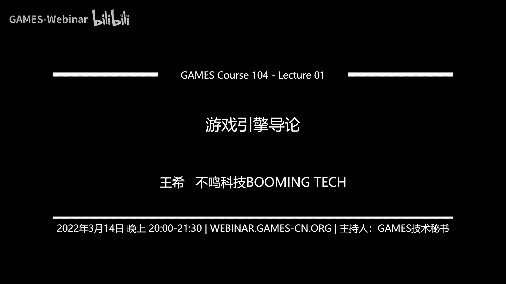
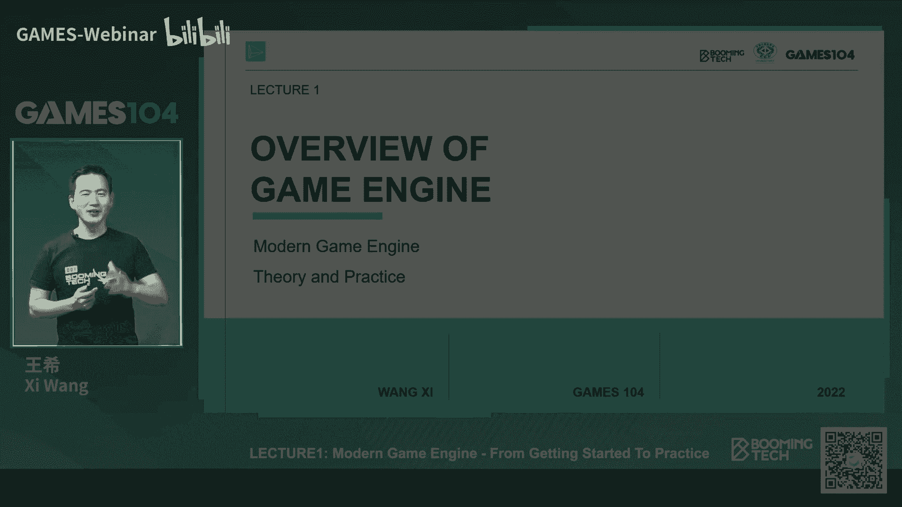
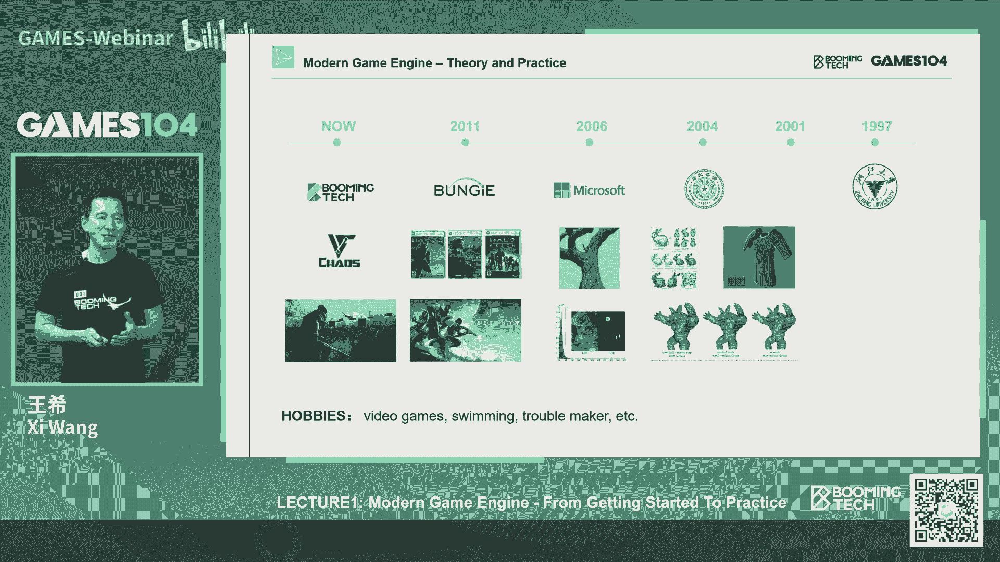
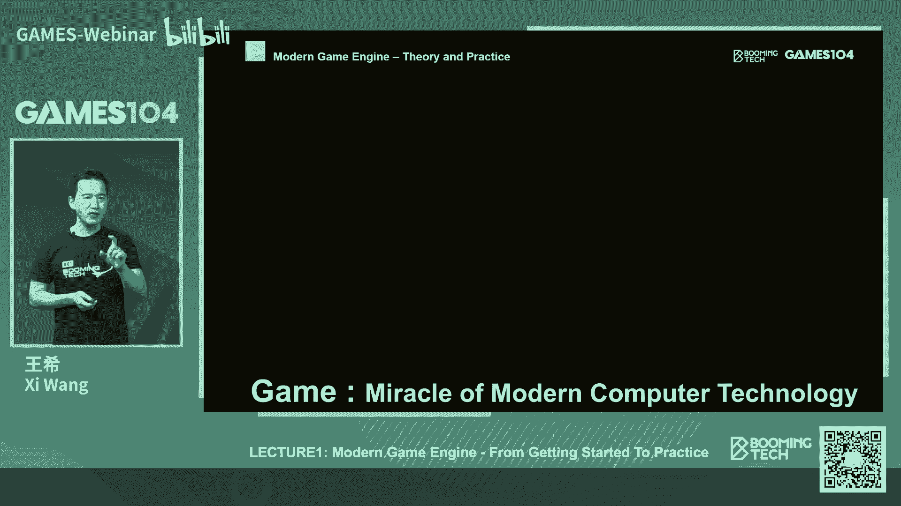
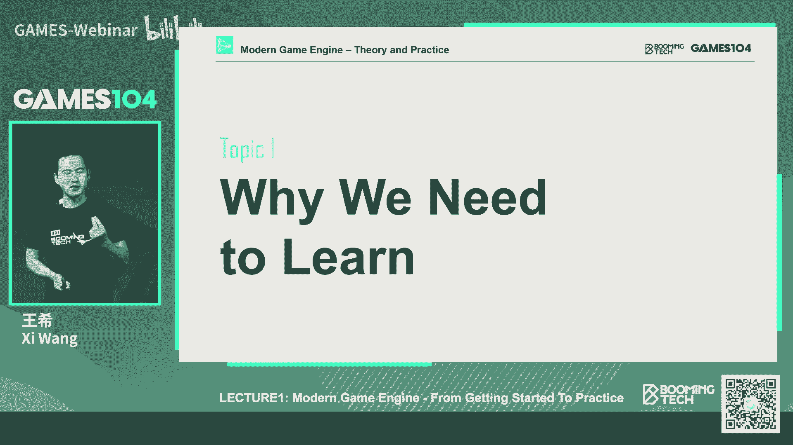
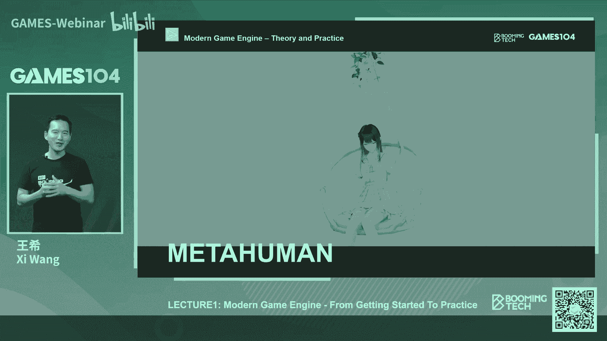
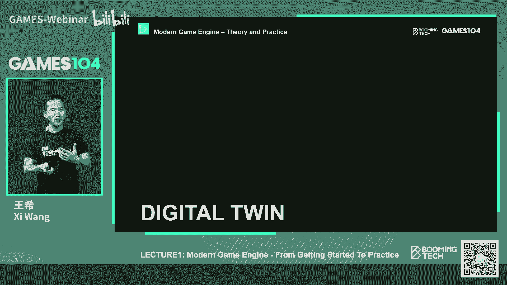
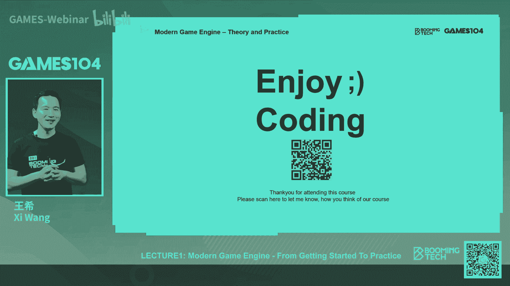

# 🎮 课程01：游戏引擎导论 | GAMES104-现代游戏引擎：从入门到实践

## 概述
在本节课中，我们将要学习游戏引擎的基本概念、发展历史及其在现代计算机科学中的核心地位。我们将探讨游戏引擎为何被称为“皇冠上的钻石”，并了解它如何作为构建虚拟世界的底层技术框架。

---

## 什么是游戏引擎？
游戏引擎是一个软件框架，专门为游戏开发设计，包含一系列工具和功能。它不仅仅是代码的集合，更是构建虚拟世界的技术底层框架，是创意和想象力的生产力工具，也是一个处理复杂系统的艺术。

### 游戏引擎的核心定义
1.  **构建黑客帝国的技术底层框架**：游戏引擎致力于模拟一个虚拟世界，其终极目标是创造一个让人难以区分虚拟与现实的体验。
2.  **生产力的工具**：它允许开发者将想象中的世界，在虚拟空间中具象化地创造出来。
3.  **复杂性的艺术**：游戏引擎是一个极其复杂的系统，是各种技术决策和妥协的结果，体现了系统工程之美。

---

## 游戏引擎的发展历史
上一节我们介绍了游戏引擎的基本定义，本节中我们来看看它是如何从无到有发展至今的。

游戏行业的历史相对较短，大约只有50多年。早期并没有“游戏引擎”的概念，游戏开发的核心挑战在于如何在极其有限的资源（如40KB存储空间）内实现游戏功能。

### 里程碑事件
以下是游戏引擎发展过程中的几个关键节点：

*   **起源**：约翰·卡马克（John Carmack）在开发《德军总部3D》和《毁灭战士》时，首次意识到许多代码可以复用，并将其抽离出来，形成了最早的“游戏引擎”概念。
*   **质的飞跃**：随着显卡的出现，图形运算从CPU中分离出来。《雷神之锤》引擎抓住了这个机遇，开创了3D游戏时代，并系统性地研究了网络对战同步问题。
*   **现代引擎生态**：经过近30年的发展，形成了丰富的游戏引擎生态，包括商业引擎（如虚幻、Unity）、大厂自研引擎（如寒霜、Anvil）以及一些免费的开源引擎。

---

## 为什么游戏引擎如此重要？
了解了游戏引擎的历史后，我们来看看它为何在现代技术领域中占据核心地位。

游戏引擎不仅仅是用于开发游戏，其技术已经渗透到众多前沿领域，成为构建未来数字世界的基石。

### 游戏引擎的广泛应用
以下是游戏引擎技术的一些关键应用领域：

*   **虚拟人与数字人**：游戏引擎中关于皮肤、毛发、动作模拟的技术，是构建未来虚拟助手、虚拟偶像的基础。
*   **影视工业**：游戏引擎被用于虚拟制片，允许导演在现场实时调整光照和布景，改变了传统的影视制作流程。
*   **军事模拟**：各国军队利用游戏引擎技术进行高真实度的战术训练和战法演练。
*   **数字孪生与工业4.0**：在无人驾驶测试、智慧城市管理、工业数字化等领域，游戏引擎用于构建现实世界的虚拟映射。
*   **下一代人机交互**：车载系统、各种设备的3D交互界面背后，也大量使用了游戏引擎技术。

---

## 游戏引擎设计的核心挑战
游戏引擎的应用如此广泛，但其设计本身面临着巨大的挑战。本节我们将探讨这些核心难点。

游戏引擎需要在严格的约束条件下，实时地模拟一个逼真的世界。这并非易事。

### 主要约束与挑战
1.  **实时性（Real-time）**：这是游戏引擎设计的黄金法则。无论算法多么精妙，效果多么华丽，都必须在极短的时间片内完成计算（例如33ms或更短）。**公式**：`帧时间预算 = 1 / 目标帧率`。
2.  **资源限制**：算力（CPU/GPU）、内存、存储和网络带宽都是有限的，无法像“上帝”一样采用暴力算法。
3.  **生产力工具属性**：引擎的最大用户是艺术家和设计师，而非程序员。因此，必须提供强大、易用且可协作的工具链，让非技术人员也能构建世界。
4.  **系统复杂性**：现代游戏引擎动辄拥有数百万至上千万行代码，算法密度高，模块众多。同时，引擎需要持续升级，但必须保证旧有内容和逻辑的兼容性，即“在飞行中更换引擎”。

---

## 如何学习游戏引擎？
面对如此复杂的系统，初学者可能会感到畏惧。本节我们将介绍本课程的学习策略和方法。

本课程的目标不是将大家培养成某个技术点的专家，而是帮助大家建立现代游戏引擎的知识体系框架。

### 课程策略：沿主干道行进
我们将游戏引擎比作一座云雾缭绕的山峰。本课程将选择一条主干道，带领大家直达山顶，建立完整的知识图谱。对于分支路径上的细节，我们会点到为止，让大家知道其存在和位置，便于未来深入探索。

### 课程内容总览
以下是本课程20节课的核心内容脉络：

*   **基础架构**：理解游戏引擎的分层设计，找到阅读引擎代码的入口（如 `update` 函数）。
*   **渲染系统**：重点讲解如何将各种图形算法（光照、材质、网格等）组织到实时渲染管线中（如前向渲染、延迟渲染），而非深入单一算法。
*   **动画系统**：探讨如何将美术制作的动画素材，组织成可交互、可混合的动画状态机，实现丰富的角色动作。
*   **物理系统**：介绍如何用简单的刚体形状表达世界，并进行动力学模拟，让世界真正“互动”起来。
*   **游戏性系统**：讲解如何让设计师通过事件、脚本或可视化编程来定义游戏规则，这是游戏好玩的关键。
*   **工具链与数据驱动**：深入引擎作为生产力工具的核心，讲解如何构建编辑器、以及反射系统等支持工具协作和数据兼容的底层机制。
*   **网络系统**：揭开网络游戏同步的神秘面纱，解释多个“平行宇宙”如何通过信息交换保持一致性。
*   **前沿技术**：介绍动作匹配、程序化内容生成、面向数据编程、多核任务系统以及虚幻5的Lumen、Nanite等前沿概念。

---

## 课程资源与安排
为了帮助大家更好地学习，我们准备了丰富的配套资源。

### 学习资源
1.  **课程官网与社区**：提供课件、视频回放，并设有论坛供大家提问和交流。
2.  **参考书籍**：推荐阅读《游戏引擎架构》（Game Engine Architecture），可作为课程的补充读物。
3.  **迷你引擎实践**：我们开发了一个用C语言编写的小型引擎，麻雀虽小，五脏俱全。大家可以通过修改它（约一两百行代码）来完成每节课的实践挑战，最终目标是协力完成一个简单的联网对战游戏。

### 课程理念
本课程是一门通识课，旨在“讲人话”。无论你是程序员、美术还是设计师，都可以听懂并建立对游戏引擎的整体认知。实践部分是可选的，但对于有志于深入开发的同学将大有裨益。

---

## 总结
本节课中，我们一起学习了游戏引擎的基本概念、发展历程及其作为构建虚拟世界核心技术的巨大价值。我们了解到，游戏引擎是一个在严苛的实时性约束下，融合了图形、物理、动画、网络等多领域技术的复杂生产力工具。它不仅是游戏产业的基石，更在影视、模拟、数字孪生等前沿领域发挥着关键作用。

通过本课程，希望大家能建立起对现代游戏引擎的体系化认知，掌握分析复杂系统的方法论，并激发起共同探索和构建未来数字世界的热情。未来的交互将是3D的、身临其境的，而游戏引擎正是开启这个时代最重要的基础软件之一。

让我们开始这段充满创造乐趣的伟大旅程吧！