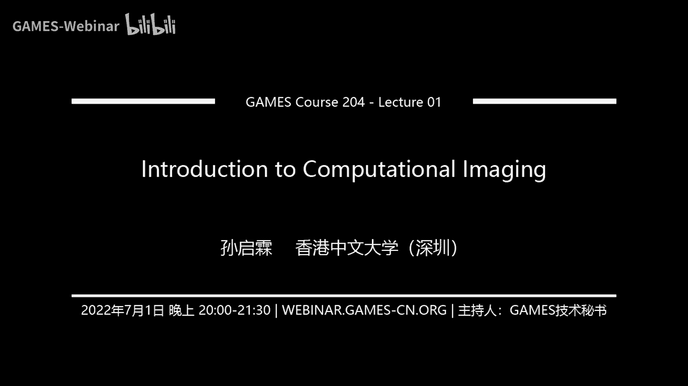

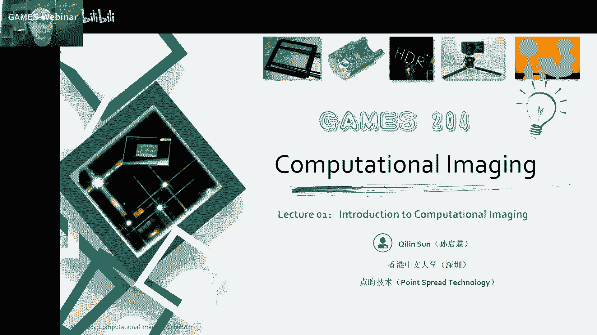

# 01.计算成像导论 ｜ GAMES204-计算成像 - P1 - GAMES-Webinar - BV11N4y1g7Z8

## 概述

在本节课中，我们将介绍计算成像的基本概念、发展历史、应用领域以及计算方法。通过学习本节课，你将了解计算成像的基本原理，并对其应用领域有所了解。

## 计算成像的定义

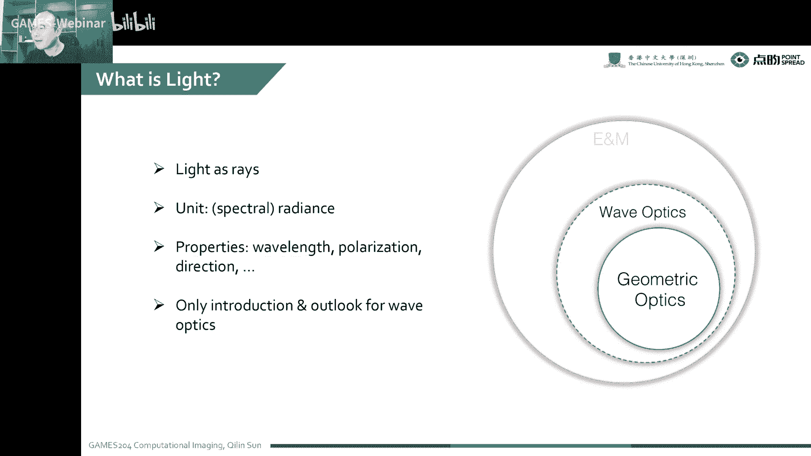

**计算成像**是指利用光学系统、传感器和计算算法，从真实世界中捕获信息，并通过计算或算法进行解码，最终恢复出物理世界中多维度的信息。

**公式**：

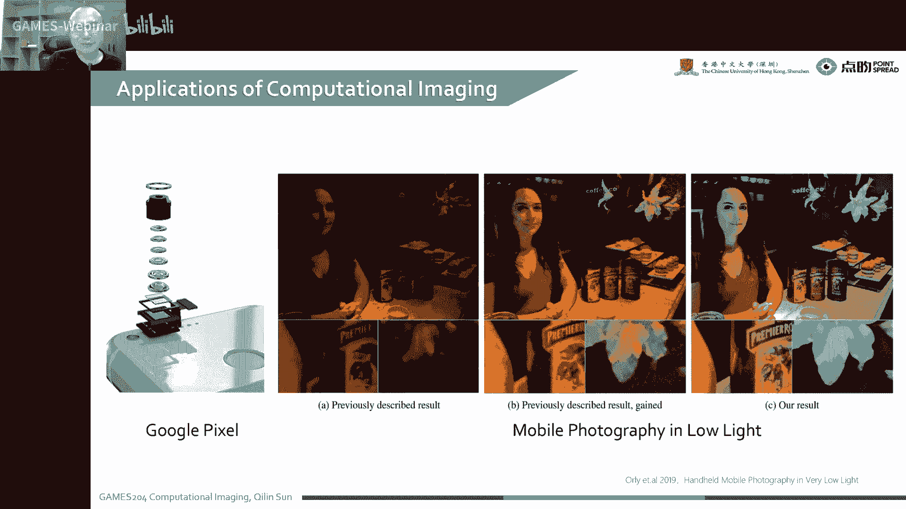

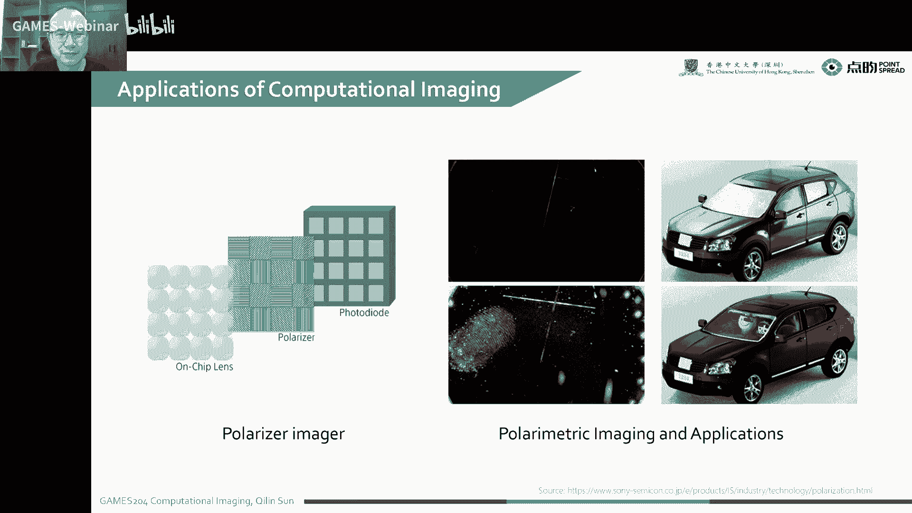

$$
B = A \cdot X + \text{noise}
$$

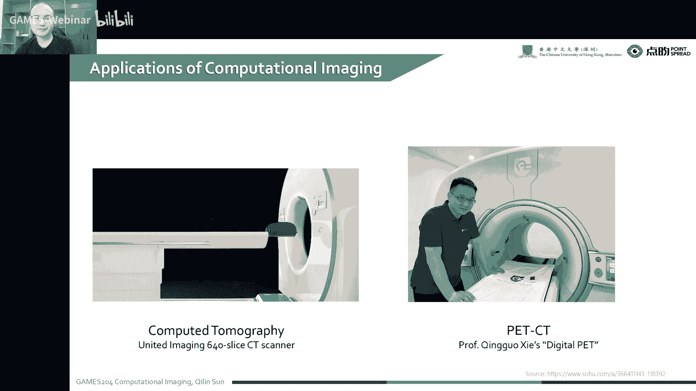

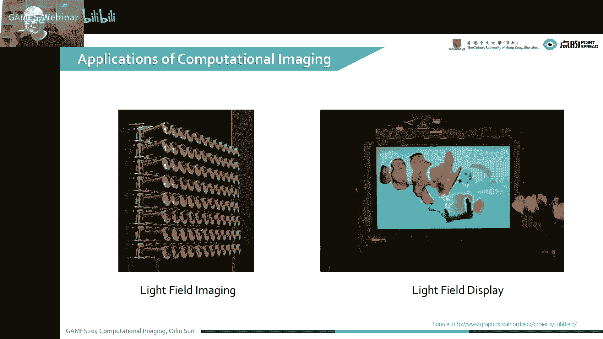

其中，$B$ 是传感器上获取的信号，$A$ 是成像过程中的光学调制，$X$ 是物理空间中的信号，$\text{noise}$ 是噪声。

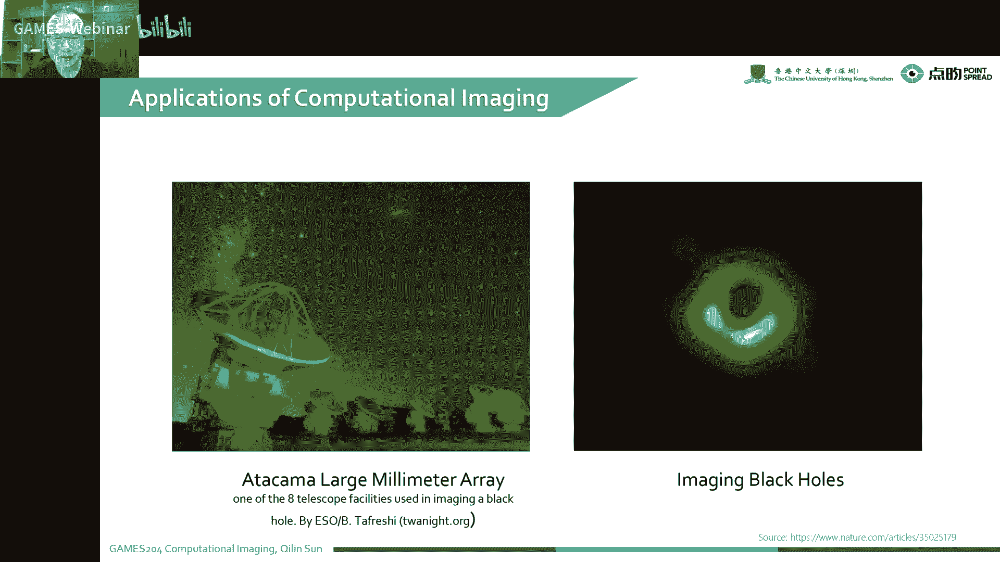

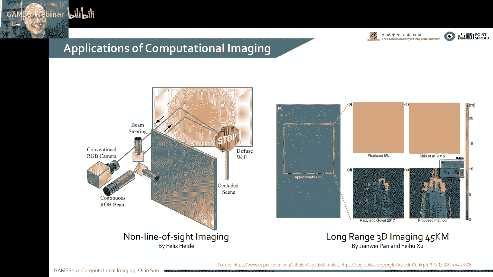

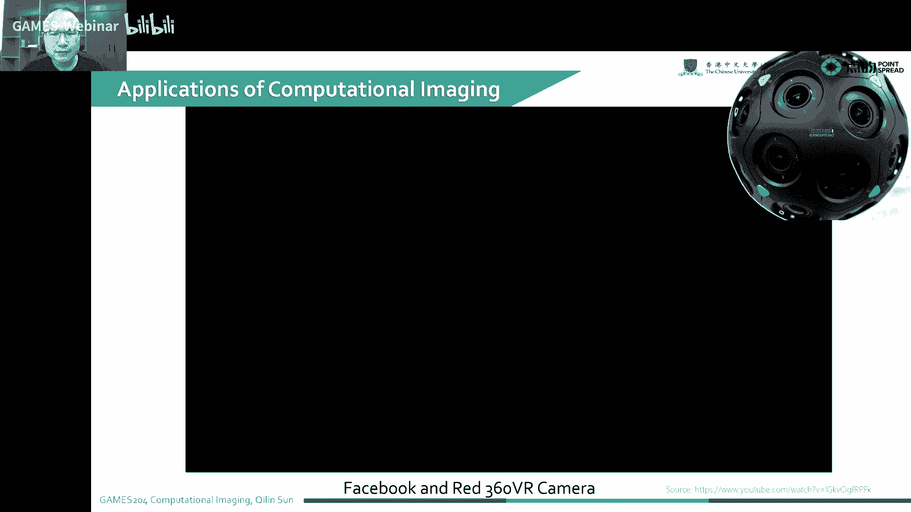

## 计算成像的应用

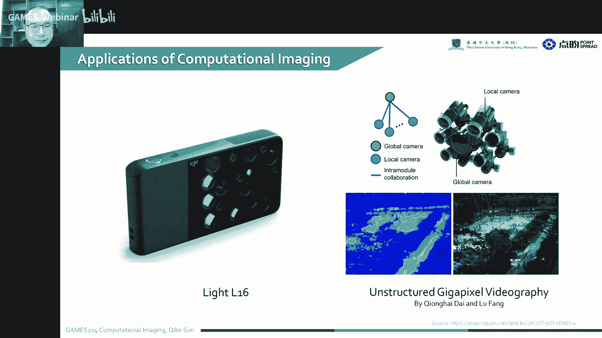

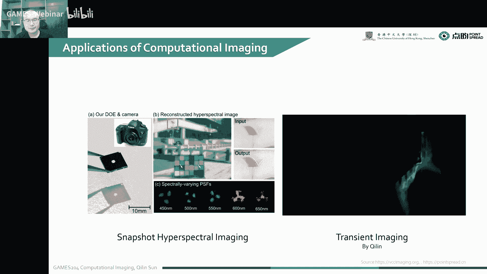

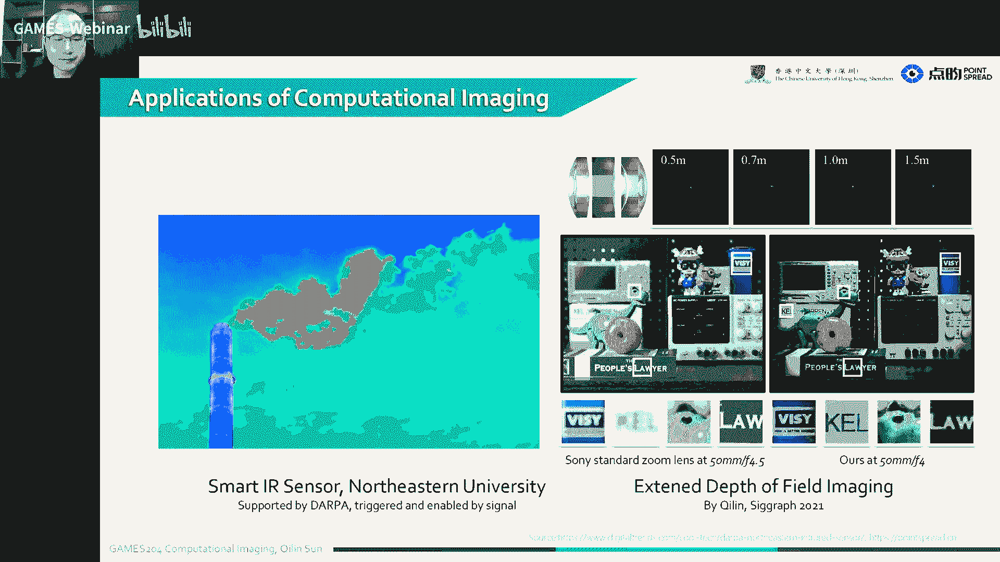

计算成像的应用领域非常广泛，以下列举一些典型的应用：

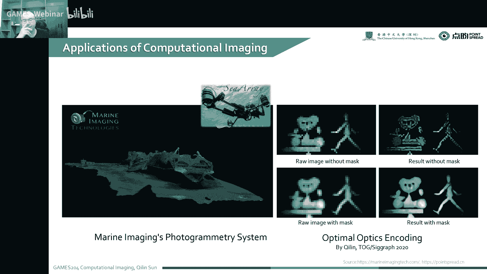

* **手机拍照**：通过优化光学系统、传感器和算法，提高手机拍照的画质和功能，例如夜景模式、HDR、人像模式等。
* **医学成像**：例如CT、PET、MRI等，用于疾病诊断和治疗。
* **光场成像**：记录光线的角度信息，实现3D成像和视频。
* **太赫兹成像**：用于安检、遥感等领域。
* **水下成像**：用于水下探测和观察。
* **红外成像**：用于夜视、遥感等领域。

## 计算成像的方法

计算成像的方法主要包括以下几种：

* **图像处理**：例如直方图均衡化、滤波、边缘检测等。
* **深度学习**：例如卷积神经网络、生成对抗网络等。
* **优化算法**：例如梯度下降法、牛顿法等。
* **物理模型**：例如光学模型、信号处理模型等。

## 课程内容

本课程将涵盖以下内容：

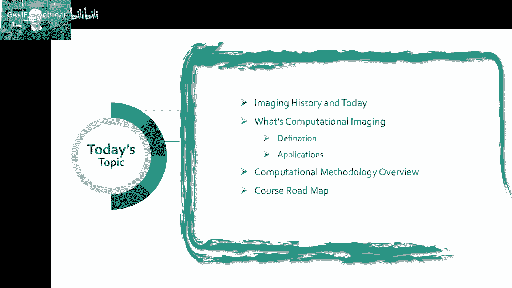

* **成像历史和现状**
* **计算成像的定义和应用**
* **计算成像的方法**
* **人眼视觉系统**
* **相机和传感器**
* **图像处理**
* **计算光学**
* **深度学习**
* **优化算法**
* **前沿课题**

## 总结

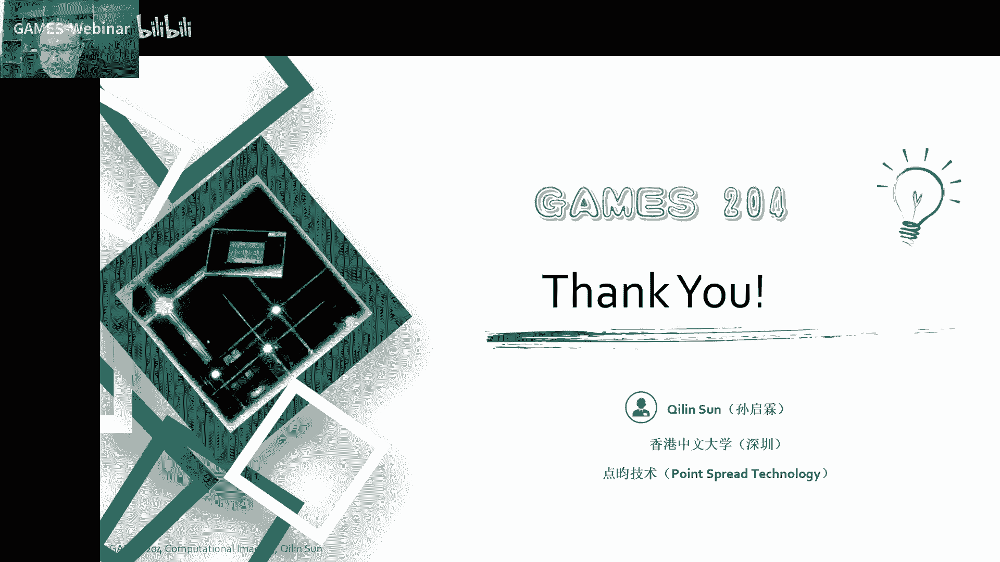

本节课介绍了计算成像的基本概念、发展历史、应用领域以及计算方法。通过学习本节课，你将了解计算成像的基本原理，并对其应用领域有所了解。