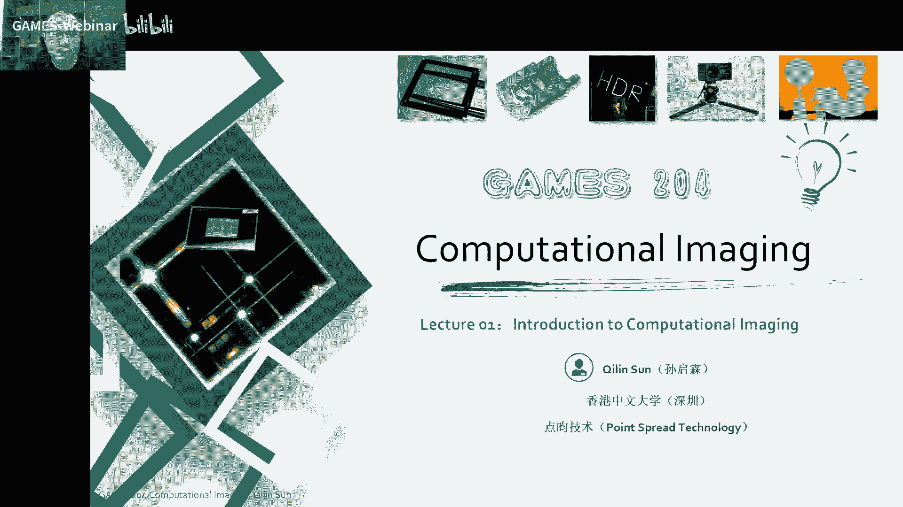
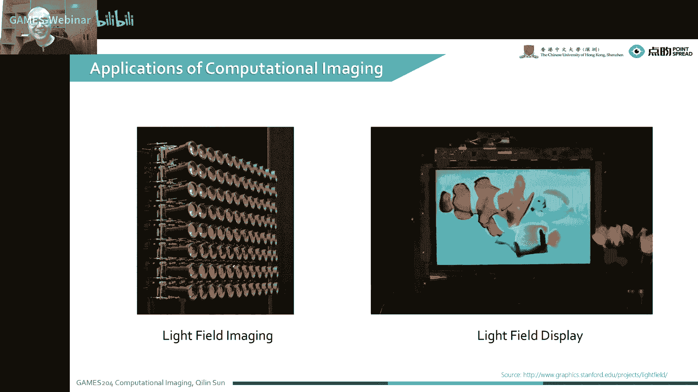
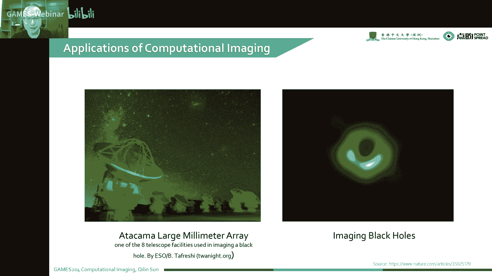
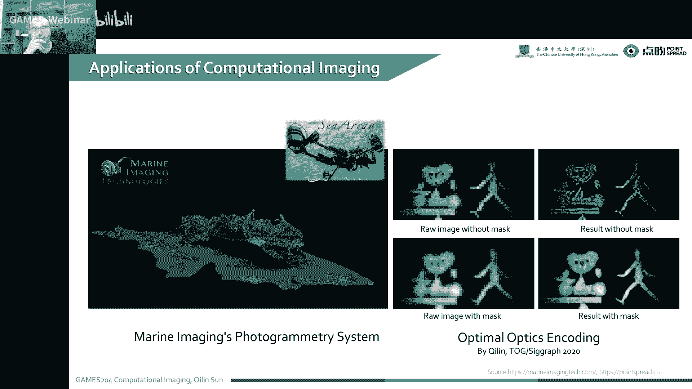
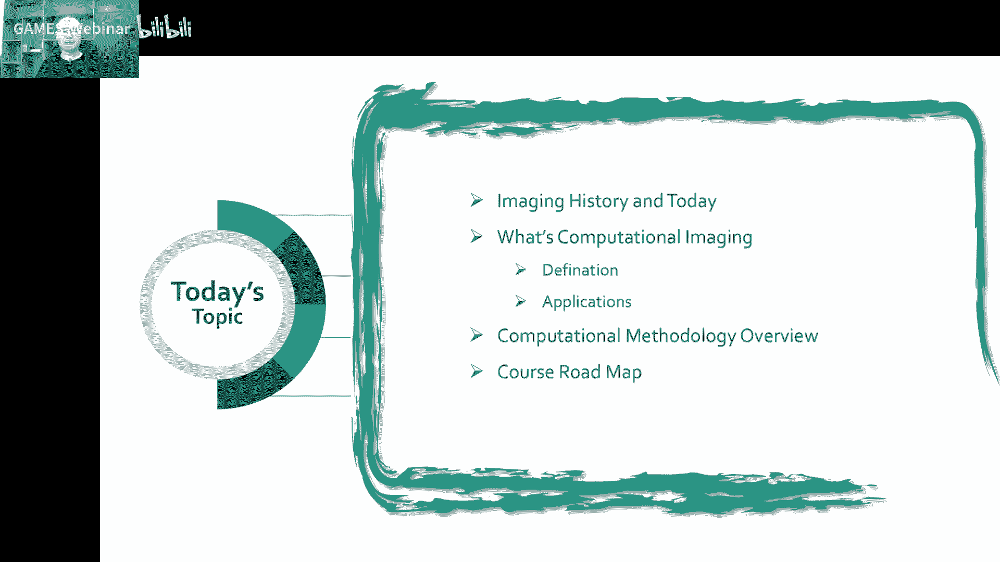

# 01.计算成像导论 ｜ GAMES204-计算成像 - P1 - GAMES-Webinar - BV11N4y1g7Z8

呃首先欢迎同学们来到games204计算成像啊，Competition imagine，是一个近年来非常热的一个课题，然后随着一个时间的发展，特别是计算能力的发展，光学跟算法联合设计。

逐渐成为了一个非常热门的一个方向啊，今天格局给大家嗯，开始介绍一个什么是计算成像，然后开设了一个计算成像的课程，其实本质上来说，像计算成像在国内还是国际上，是有两个比较大的圈层。

一个是在图形学一个圈层做计算成像，还有一个是在光学的一个圈子去做计算成像呃，两个不同不一样的圈子，在方法上会有很大的一个不同，当然是随着近年来呃，计算跟光学慢慢不断的交叉融合。

现在两个光学跟图形学两个圈子的一个成像，慢慢的开始交融，大家会有更多的机会去见一些更新的，一些好玩的计算成像的一些内容啊，今天是个很特殊的日子啊，其实这么多年风风风雨雨呃，国家字幕过来是非常不容易的。

所以说这里希望同学们好好学习，努力把自身价值的实现，跟祖国的命运结合在一起啊，早日的投入祖国的现代化建设之中好了，现在我们开始讲解我们的。

第一课计算成像，首先自我介绍一下，我是在香港中文大学深圳校区，然后是在一个数据科学学院啊，同时也是点云技术的创始人，我们起了个名字叫pop spread technology。

大家可以很明显的看到这是一个点扩散函数，为什么叫点云呢，因为叫点cos可能太难听了啊，我是本科在华中科技大学读工学，然后后来又在沙特的cost，阿卜杜拉国王科技大学读计算机啊，这是一些我的信息啊。

包括我的一些主页，还有邮件，大家有什么问题啊，包括交流啊，学习啊，科研啊，都可以通过邮件就来找到我啊，research主要fox在断料端的相机设计啊，Deficial optics。

就是包括可微的一些呃衍射跟折射的一些透镜，还有一些优化呀，还有一些VR这些领域，当然最近呢又偏向一些做一些competitional image的，专用的processor。

就是把一些很比较难搞的一些优，优化的求解器嗯，就是大家一些小伙伴们一起，致力于去把这整个通用的求解器，专门针对计算成像，各种算法去做一个硬件的加速，这样的话所有的老师啊。

同学们都可以在这个硬件的一个平台上，去做自己各种想要的事情，啊另一位老师是彭一帆老师啊，彭一帆老师是目前在香港大学，刚加入香港大学做assistant professor，然后他是在斯坦福。

在golden weston教授那做一个做了一个博后啊，之前是在UBC，然后本科跟浙大，本科跟研究生时代浙江大学，然后他跟我是同一个导师，是我师兄啊，这是他的一个网页，就是还有一个邮件。

大家有特别是相关HOLOGRAPHY的一些问题，他在这方面是一个很大的一个专家啊，在research方向，它主要是集中在一些啊光光学的一些设计啊，图形学啊，vision还有AR。

还有microscopy image啊，一些低层次的la vision，还有一个人机交互的这么一个系统，然后整个cross staff我们有，现在目前有四位助教同学。

包括来自apple跟CMU的一个柴子立同学，还有来自cos的杨欣哲同学呃，来自清华的讲普华科学，还有来自中科大的沈鹏飞同学啊，这四位助教同学都非常优秀啊，大家有什么问题也可以跟他们进行交流啊。

课程注册是可以在这个games204的一个网站上，这是一个新成立的网站，可能会有bug，大家要耐心一点去注册它，后面我们会把一些呃像作业呀，就是交作业，收作业都通过这个啊课程网站来完成。

这是类似一个blackboard一个网站啊，整个课程资源可以在下面这个网址去搜索，包括一些呃，像参考了一些slides，还有一些视频都可以通过这个地方找到入口，嗯先自我介绍一下啊，这整个研究生涯哈。

其实在学术上有两个比较让我觉得满意的，一两个成果吧，第一个就是可微的衍射模型，这个是18年5月份提出来的，这可能是世界第一个，但是我不是很确定，因为当年有好几个就是类似的一个东西，同时发出来。

然后另外一个就是可微的复杂透镜模型，就是真正的实现了物理模型，跟后面的一些算法的一个登录端的优化，这个应该是世界第一个，没问题，在工业上的一个achievements，就包括跟点云的一个合作啊。

首先是做了一个高速的一个高精度，低延时的RGBD相机，然后大家可以先做一个产品先试一试试试水，可以做到120HZ，120帧率的，120帧的帧率，毫米级的一个precision，可以做一个实时的三维重建。

同时我们也做了一个超低功耗，超低延时的一个全变型异构的ISP的IP核，今天我们的课程会从四个方向来介绍，计算成像的一个全貌，首先给大家介绍一下整个成像的历史和今天，还有包括什么是计算成像，包括它的定义。

还有应用，然后给大家一个计算方法的一个overview，最后我们去讲整个课程的一个ROADMAP啊，这个road map并没有完全定下来，但是可以给大家做一个大致的一个指导。

大家可以看到具体我们每个章节学什么，整个计算成像的思路是什么，因为计算成像本身，现在并不是一个非常成熟的学科，它有非常多的一些方法啊，都还在一个比较前期的一个阶段，就是但是通过这样一个梳理。

大家对整体有一个大致的印象，就可以后面做研究啊，还是去找工作呀，都可以有一个比较清晰的一个思路，嗯首先给大家介绍一下整个成像的历史，今天啊，就最早就是大家对整个pino camera。

就是小孔成像有一个非常早的研究啊，最早有一个是墨子，在公元前4000年到公元前390年，因为那个时候墨子我们的伟大祖先，还有一个伟大的一个莫派的创始人，墨子，就已经发现了这个小孔成像的这么一个原理。

当时在墨经里面就有记载，井道再无有端这个道哈是通假字，是倒着的道，就是倒立的道，就是我们的整个景就是有了一个倒立在午有端，这个五可不是中午哈，这个五是中间的意思，就是我们光线穿过了一个中心这么一个意思。

景光之人兮若射，下者之人也，高，高者之人也，下就是我们整个景变成一个倒立的一个型号，是一个非常早的一个小孔成像的一个案例，然后又是一个亚里士多德啊，亚里士多德在公元前大概300年左右啊。

通常我们小时候看物理书啊，什么，有时候就经常会收到这个，亚里士多德曾经说过啊，通常是举反例哈，但是本身其实亚里士多德还是非常厉害的啊，那个时候他也他又是政治学家，又是物理学家，又是各种各样的学家。

那个时候他也发现了一个小孔成像的一个，这么一个现象，还有一个就是解码，是1544年有一个小孔成像的一个记载，啊，到了后来就真正的有了一个，可以记载的一个图像，就是最早哈这个叫1826年。

还可以看到右边这张图啊，最早的一个就是存在的一个拍照了一个图哈，就其实可能还有更早的，只是大家没有发现，然后这个是通过了八小时的曝光，还有一个就是developer来实现了最后这么一张图。

其实当时啊其实受限于技术的一个问题，当时就是大家把那个底片上涂满了那个溴化银，溴化银就是在光的一个作用下，就会产生一个它的一个性质的一个改变，这样的话就可以把图像的明暗记录下来，在那个时候。

大家也起了一个非常有意思的名字啊，叫hello graph，Hello，就是太阳的意思，然后把整个拍照的过程叫sun writing，这个是非常类似于现在一个光刻机的一个绰号。

就是大家就是把一个光刻胶抹在一个微博上，然后通过光学去曝光，去刻在一个pattern上，也叫writing，其实最早的时候，整个曝光成像就已经叫writing了，在那个年代1830年代啊。

这这个整个成像过程是非常新奇的，因为以前大家没有见过啊，顶多就是油画，大家画一画做了几个小时，这是一个非常新颖的一个体验，也是一个非常就是有影响力的一个媒介。

那个时候就是有非常多人去描述这么一个photography，这么一个事情啊，有人说哈，Capture memory a very very experience，In reform，就在一个方框里面。

我们记录了大家人对着一个物体本身的印象，还有起的非常有诗情画意哈，像painting with the light，就是我们又光画了这幅图像，做一个光的艺术。

还有这个HENRYMARTI就说了一个executed，Not the truth，我拍下来就是谁知道是真是假是吧，到了后来随着一个技术的发展哈，到了就是19世纪末到20世纪初的时候啊。

这人们对一个成像的一个photography，拍照的这么一个印象就改变了，这个时候像可以大家可以看到一些新技术，特别是右边这个图像，Marriage。

You use the high speed photography，就是人们真正的就拍了一个视频，就admit image screens，就通过拍了一系列的一个图像的一个序列，然后把它播放出来。

就形成了一个视频，这就是实现了一个非常大的突破，实际上本身就多了一个维度嘛，是把一个二维的一个黑白图，再加了一个时间轴，二维变三维了，其实整个成像的过程，特别是计算成像的发展也是有这么一个趋势。

就是不断的维度不断的增加，比如说大家现在最早最早哈就是一个黑白图，后来又加了个时间轴或者加了个彩，现在也可以记录好了，过分可以记录相位是吧，后面还会有光场，光场记录光线角度的信息啊。

这个就课程就非常有意思，大家慢慢慢慢的，就把整个光全部的一个形态去捕捉下来，可能未来的一个相机就不再是一个RGB的一个，点阵序列，或者是一个经过编码的一个视频，可能每一个像素点都是一个tensor。

我记录了非常多的一个东西，就变得非常有意思啊，这个时候同学们可以看到，人们对一个photography的印象，就从一个bucket word，就变成了一个人们就是怎么描述它呢。

就是一个need tainer，就是一个小的一个东西啊，可以装很多东西，比如说装像像用在activation，Music compilation，各种各样的一些信息都可以存在这么一个呃。

一个小的一个相机里，这时候人们还停留在相机，这个时候还停留在一个record world wac，就是记录大家看到了什么，或者是嗯拍到了什么，还是在一个像个小方框框一个显示里面。

但是成像真的是只是这些吗，大家可以看一下一些，更新的一些成像的过程，其实整个的相机啊是每天每时每天每刻，无时无刻不在我们的生活之中，包括我们像最常见的哈，特别是近几年我们这个马路上的这个摄像头啊。

这个拍照就吃了罚单是不少啊，这是一个非常典型的一个时代信息的一个应用，还有一些像像手机拍照啊，嗯像单反相机啊，这录像机哎对，刚才这有个同学博鳌士敖博士同学嗯，写了一个相机和录影机的区别哈。

这个其实大家买摄像机的时候，买相机的时候，相机跟录音机的区别最大，就是在后端存储的一个地方，就是录音机通常是可以支持绕data的，一个快速存储，就可以我把这些饶图拿到整个SQUENCE群啊。

这个输出量是非常巨大的，拿到这个图之后，我们再拿到一些后面的艺术家手里去，把这个图去修好，然后超越了今天的一些成像的概念之后，后面的成像会是一个什么样的过程呢，这个时候就给大家一个讲一下。

是the photography beyond the film like，首先啊就是大家生活在一个空间之中，是一个多维的，它有非常多的维度啊，首先它有我们的场景是3D的。

让我们的场景之间有各种各样的光源分布，每个光源都有自己的形状，都有自己的位置，就有自己的光谱跟强度分布，本身呢像用图形学的一个角度来说，我们的一些身体上的一些材料啊，包括衣服啊，皮肤啊。

都可以用一个B2DF，或者是用更高级的一些模型，比如说BSSDF来描述经过多次反射，本身物体也有形状，也有自己的位置要运动，从你的观测点，你的观测，特别是你相机的位置，大家学过games，101。

可以知道我们整个相机ISP成像一个up vector，还有一个呃另一个vector一起去描述，这个时候就有它的位置，有它的运动，还有一些投影的一些问题，这么多维度的信息是我们真实的生活。

这个物理空间的一个信息啊，然后我们计算成像的任务是什么呢，就是通过光学这么多维度的信息，经过一个光学系统，然后去调制或者结合的传感器一起去调制，最后在我的传感器上拿到了这么一个。

不知道是什么样的一个调制过的信息，经过处理啊，后面的一些算法来处理，然后再结合着图像的synthesize啊，重建啊，渲染啊，就可以用现在一个multi dimension display。

比如说像现在的VR眼镜或者是VR眼镜里面，我们再用一个光场显示，我再结合一些更多的一些信息，同时也可以用于理解，最后大家的目的就是真实的复恢复，物理世界中这么多维度的一个信息。

这是一个非常有意思的一个事情啊，讲了那么多呢，就是给大家定义一下什么是这个photography，然后什么是一个COMPETITIONALIMAZING，就什么是计算成像，其实本质上来说哈。

像除了传统的一些胶片啊，或者最早的什么都不处理的一些数码相机，后面的一些所有的和计算相关的事情，都可以叫计算成像，但是大家通常又不这么叫，就是为什么呢。

来给大家定义一下什么是competitional imaging，就computer amazing啊，或者是PPT photography，通常是一个有光学编码或者光学调制，或者光直接光学直接成像。

把这些信息从一个真实的世界，然后去捕获出来，然后通过计算或者算法来做一个decoding，就是简单来说哈，就是光学调制，算法解调就是这么一个过程，然后我们的目标呢就是拿掉你最后想要的信息。

比如说你想拿到一个二维图，那就让它的点扩散函数最小，比如说你想拿到广场，我们就可以放一个list，就是MICROYARRAY，或者是搞一个相机阵列，就每个不一样的一个应用场景。

都可以有配套的光学配套的算法，然后去拿到你想要的东西，但是本质上就是光学代码算法解条，与之相对应的呢，就是这个不得不提一嘴，就是一个competitional display，就是计算了一个呃。

就是这叫这叫显示哈，这是怎么翻译，也不是很清楚，它是跟计算成像是一个相反的过程，我们是用一个计算去编码，然后再用光学去解调这一个逆过程，这样的话就可以把更多的信息给大家展示出来，就最典型的一个例子。

就是裸眼3D或者是光场显示这么一个过程，computational imagine跟display本身哈，嗯你可以理解为一个图形学的一个分支，它是图形学的一个分支，但也不完全是我们可以看到右边这张图啊。

整个计算成像跟计算显示跟图形学相关，跟计算机视觉相关，跟光学有相关，因为光学是我们捕捉信息的一个必要手段，同时呢我们在方法上又有一些优化，还有求解逆问题的一个过程。

然后呢跟本身的传统image也是相关的，跟各种各样的一个人的perception，或者是物理学的prior，物理学的约束，物理先验知识都是一个相关的，总结了一下来说就是新的光学，新的传感器。

新的illumination，新的照明方法，还有新的计算方法，这是一个非常新的一个集合哈，这个有同学说这是一个大杂烩，但其实本质上也不是，这整个其实计算证件的目的非常清晰。

就是为了拿到我最想要的一个信息，然后我在这个前提下，我去优化光学系统，优化我的传感器，优化我的照明，优化我的算法，对最开始有同学问到呃。

这个computer image跟computer photography，到底有一个什么样的区别哈，其实本质上大家都可以混着用，它没有一个strict区别。

但是一些像academic community，还有一些像工业界通常有倾向，大家这个倾向，比如像computer image就是联合了光学一起优化，对着我，我要设定一个成像的目标。

光学跟算法联合一起优化，但是computer的photography呢，大家通常理解为traditional optics，就是我们传统的相机，我为了拿到更锐更清晰，更漂亮的，是更大进光量的一个图像。

当然很大程度上，就是大家认为日常生活中，接触了太多的一个真爱，一个词，就特别是大家手机厂家就是把这个计算摄影啊，可能是符槽轨做到一个非常高的一个维度啊，包括有非常多的经典的一些东西。

就是像HDR plus，google的HDR plus啊，还有一些像light16，大家后面会讲到这些东西，但本质上这个photography跟amazing没有太大的区别。

大家可以简单的就是理解为scientific，跟玩一玩就CONTROPHOTOGRAPHY，这么一个就是这么记一下也没没什么问题，你讲到计算成像了，你不得不说的一个事就是什么是光啊。

光本身在这里通常表现了一个是一个光线，但是计算成像呢又不能只局限在一个，一个光线的一个直线传播的一个过程，首先我们的光里面大概是涵盖的范围啊，计算成像涵盖的范围。

就是在这个wave optics跟那个job optics，这两个大圈圈里面，我们用到很多的性质，光学很多的性质，包括光学的一个波长，光学的一个偏振，还有光学的方向。

嗯这个我们会介绍一些像呃一些wave optics，特别是像d o e metal surface的一些优化方法，是特别是在后面的课程里面。

说了这么多，就是计算成像有什么应用呢，其实大家最直观，第一个想到的可能就是手机拍照，就是左边是一个google pixel的一个相机啊，它有很多的镜片，然后搞了一个非常大的一个sensor。

就是如果大家买到了比较特别是最近呀，就这两年买了一个新的一个手机，这个发展趋势是什么样的呢，就是传感器的底越来越大，就像素越来越大，然后整个呢光学系统越来越复杂，就越来越厚啊。

这是都是为了一个更好的一个像制，因为这个底大一级压死人啊，这是大家在搞摄影的里面，一个非常常见的一句话哈，就是我同样的一个像素大小，两微米的边长，一边的边长，进光量就差了四倍。

像你单反相机里面通常是六微米的一个像素，六微米跟一微米差不多，就差了一个36倍的进光量，所以对你的信噪比影响是非常一个大了，尤其是在夜间拍照的时候，说有喜欢摄影的同学就发现这个夜间拍照。

这个手机已经这么强了，怎么还是不如单反拍的清楚，就是底大一级压死人，但这个还跟光圈的设计啊，包括一些其他相差的校正是非常相关的嗯，特别是现在手机镜头啊，已经用了非常多的一个非球面的技术啊。

甚至现在有的厂家已经我知道了，已经用上了个WLO，就是我在用做那个就wafer上，就是我们像做半导体那一套工艺，去来做这个镜头啊，对整个element啊其实是特别是生产最新啊，是有一个很大的一个提升的。

当然它也有自己的局限性，这个设计的时候就比较困难了，特别是压膜，特别是像手机里面透镜啊，通常也不是全部好，大部分都是一个塑料的一个特性，就是pm i或者一些光学的一些嗯，就是有机材料。

它生产的是先做了一个模具，然后我去压模压膜，就要考虑热胀冷缩，其实整个生产工艺是非常复杂的，所以大家这么便宜，买到一个非常好画质的一个成像的手机，其实整个产业界在做了一个巨大的一个努力。

这个google pixel啊，其实在整个手机成像里面，有一个非常高的一个地位啊，就是他算是非常早的做一个计算成像的，这么一个东西啊，达不到光学波动波动光学的级别啊，这有个lab cg同学问了一下。

这个现在手机成像里面达不到光学成像的级别，是大部分都达不到，但是长焦是可以达到一个接近衍射极限的，一个问题的，像手机成像里面通常有什么事呢，就是大家最常见的一个就是夜景。

所以大家夜里想拍清楚这个事怎么办，还有一个就是HDR，就是高动态范围成像，大家想要看到一个更大的一个范围的，一个亮暗的一个程度，所以说这个时候，google那时候是一个叫MARLV的一个老师。

stef Mark lee老师是大名鼎鼎啊，是我们整个计算成像领域的鼻祖之一，就在这个方面做了一些非常大的一些贡献，像一些传统的，这是一个google19年SIGGRAPHASIA的一个论文。

它是move photography in low light，然后传统的一些像HDR plus呀，在暗夜里面拍的一些情况是非常非常呃，也不是非常差啊，其实因为本身已经做了多帧融合。

本身的噪声是已经降下来了，METALLIES应该暂时没有，还有一个是就是他们在暗夜的一个情况，会有一个什么问题呢，就是它的白平衡啊会比较差，就是在比较暗的一个光照下，就是我的色彩会很容易出现问题。

就是因为这个时候，本身这种器件的噪声是已经非常大了，那这个时候捕捉的图像，特别是前面有个滤光片就变得变得更爱了，其实这个时候就非常受一些本体电流啊，比如环境光啊，然后去影响我最后的色彩颜色。

这个东西本身也是挺复杂的一个东西，它并不是我们光学的里面说了一个波长啊，光波长，那那叫频谱啊，这个本身啊就是这个颜色，它是一个跟人心理相关的一个反应啊，不过人眼的一个响应，大家学过更直。

101应该知道就是人眼对光的一个反应，叫LMS这么一个三个响应的曲子啊，所以很多色彩都是根据最主要是CR1，1931，根据十几个英国人的一个看到一个眼睛，得到一个色彩标准，然后到后来又到了70年代。

又有一个新增补的一个CRE的一个标准，那本质上都是跟人相关的一个这么一个色彩，但为了这个追求暗夜的一些成像，很多传感器厂家，手机厂家都会想一些非常就是各种各样，很有意思的一些方法，包括像多摄融合。

比如一个黑白的看一个彩的相结合，增加它的细节亮度，确定支持它的噪声啊，还有一些像google，像google plus这个团队好。

是不是GOOGPIO这个团队他们做了一个auto white balance，就是用了一个深度学习的方法做了一个小网络，然后去做一个就是暗夜下的一个色彩的校正，那为了提高进光量。

还有很多五花八门的对传感器的修改，包括像呃RYYC，因为我们通常理解的月光片啊都是RGB，现在有很多RYYC的就是黄通道嘛，黄的本来就是绿的，然后加上这个红的，这样我这个进光量不是更大了吗。

但是这个时候就是它的色彩会有偏，就我们最后产生了色彩下载的时候，特别是显示的时候，我们是跟我们的基色有关系的，就是叫primary light，我这个是怎么做color matching。

跟我们这个就是sensor的一个filter啊，都有非常大的一个关系，那也有很多其他5号版本的方法，比如说像呃那个RGBW留一个通道哦，不用不看绿的了，直接全部就是黑白的，整个光全都进来。

还有像一些提高一些特殊的器件，比如说现在的QIS或者SPA器件，就单光子水光光光电二极管阵列，这些期间灵敏度会比较高，但是有什么问题呢，就是像素比较大，就是放在手机里面是暂时是比较困难的。

当然我相信这些厂家在不久的未来，可以做到这么一个缩小，就QS跟自拍的像素的这么一个问题。

像第二个应用就是非常典型的，就是利用我这个偏振信息啊，就是跟传统的一个传感器有什么区别呢，这个传感器前面放了一个四个方向不一样的，一个像白滤光片的一个POLARIZER。

就是每个像素2×2的一个像素区间，有四个方向的一个偏振片，那也可以跟彩色结合嘛，那就是最后一个44个大blog，这个偏振成像就比较有意思了，比如说像微小的划痕检测啊。

比如像我们传统的相机拍出来上面那张图哈，就是基本上很小的一些划痕是很难看到的，这个时候在特别是在生产手机壳呀，就是手机玻璃啊，或者是一些比较光滑的表面的一些工件的时候，一些零件的时候。

这个微小划痕检测是非常重要的一个环节啊，有传统的一些摄像头，就算加了算法增强，因为信号本身的差异太小了，这个时候是对整体的，是一个比较困难的一个事情，但是偏振成像就可以检测到一个偏振信息。

从而就是我可以非常清晰地看到，我们这个划痕的一个问题，还有一些举个例子啊，就是比如说像我们自动驾驶啊，或者是就特别是那个现在可能最高兴的就是，就是做那个马路边上那个监控。

比如说以前像汽车的反光玻璃是非常严重的，就可以通过一定的计算，很容易的把这个反光式去掉，这个时候我就可以很清楚地拍到，车内是谁在开车，就是我吃罚单，就是我开罚单的时候。

就可以很清晰的拍到到底这个是谁的责任啊，所以也会有很可以用到像车内驾驶员的监控啊，特别是大家国内人很多人都戴眼镜，有反光的时候，你很难看到眼睛的状态，这个时候偏振成像就会有，一个非常大的一个作用。

啊最早的计算成像，在整个计算成像概念出来之前哈。

其实就已经有一个非常经典的一个，计算成像的一个东西了，这个叫competition tomography，就是大家拍的ct，这个T呢他用的一个原理叫RANDOTRL，就我扫一圈，我这个像这么一个光线啊。

我这么扫一圈，扫一圈之后，然后通过一个random transform，我可以把这个一个截面的一个成像恢复出来，然后我再整个把这个人体啊扫那么一遍，就是把这三维结构呈现出来，现在这个CT啊，啊。

这个是应该可能是现在当今世界上最先进的，一个640乘的一个CD，就叫nunit image，就是国内一个联影医疗，他们可以做到一个非常快的一个就是ct的扫描，然后T本身扫描之后。

大家图形学的一些知识又可以用上，我怎么去realize我这个3D的data去给医生，或者是给后面的就是神经网络，而且更好判断啊，这个病灶还有一个就是非常有意思的一个PPT，就是新的一个CD啊，叫pad。

它是一个正电子发射断层成像，首先它是一个什么原理呢，就是往身体里面打核素，是啊，大家不用担心哈，这个核素对人体健康影响非常小啊，这个核素会在人的病灶处，特别是像肿瘤啊这些地方快速的汇集。

然后通过一个正电子的发射，然后我探测器用的是一个SPA p d啊，或者是一个光电倍增管，这个检测到非常快速的一个伽马射线，这个时候就可以快速的定位一个小的病灶，pad ct就可以定义非常早期的一个。

就是检测到非常早期的一个癌症，然后这位就是我们谢庆国老师，就是以前我读本科的时候，我们隔壁学院的一个老师，他在pad里面就是做了非常大的一个贡献，特别是数字派的PPT，他刚才同学们也有提到广场哈。

其实广场本身广场的捕获啊，最早广场这个概念是什么呢，就是我记录我光线在空间的一个点，还有光线的一个角度，这是最早的一个广场定义，当然本身哈这个广场到底有几个维度，一直是一个谜啊。

西电的邵晓鹏老师就是专门写过一个专栏，就描述过广场这样一个现象哈，就是他到底有多少个维度，到今天还是一个谜，就是公说公有理，婆说婆有理，就是每个家对广场的定义都不大一样，但是最早呢就是一根光通过一个点。

然后有有方向的一个点，这个最早的这个概念是1836年，由我们的伟大的电磁学家法拉第提出来的，这是非常早的一个东西，然后到了后来特别是199几年的时候，有Mark away，别给他们判断。

HARAHA去首先提交了一个光场成像跟光场渲染，这么一个东西，后来才会有大家的一个光场成像，光场成像本身有几种方法，像相机阵列这个方向，就是国内在清华就做的非常好，就是用一个很多的相机阵列。

去来做一个光场成像，还有一个就是像micro ray，在我的焦平面上，就是我相机的一个焦平面，后，焦面上放一个micro liner ring，加上每个MICROLENS就相当于一个小相机，这个相机。

然后后面就会记录各种各样角度进来了，一个光线啊，还有一些像万花筒的办法，其实这个光场成像在早期也会上有非常多，五花八门的一些方法，非常有意思，虽然说现在已经淘汰了，大家回过来看。

其实都是非常有创意的一些东西啊，啊光场成像呢就有光场显示，这就右边这个是斯坦福的高中维斯塔斯老师，做了一个光圈显示就可以，这个原理是什么，有两层或三层就LCD，而且我去调制光线的角度去把它显示出来。

这样的话就可以展示，那么一个给大家展示出来的，就是一个真3D的一个成像，但这个时候特别想提一嘴哈，就现在很多就VR眼镜就戴着非常不舒服啊，就是为什么不舒服呢，就是就带着时间长会非常累，有几个原因哈。

首先是现在延迟大，这个咱不讲在显显示上面有什么原因呢，就首先这人眼睛啊，就是人的眼球的对焦，跟这个双目立体这个深度啊，就是你晶状体的对焦位置，跟你两个眼睛就是拐这个弯，这个对焦位置是一致的。

这是neural link，就是神经link在一起的，如果这个地方不匹配的话，你的大脑就会接收到错误的信号，就会显示的不舒服，其实光场光场显示啊，在这个VR眼镜里面是一个。

我感觉为当然现在显示质量是太差了，这后面如果解说这个解，解决这个显示质量的问题啊，可以很大程度上解决VR显示不输出一个问题，当然这也有很多其他的方法，比如说像那个就用音圈马达直接调焦啊。

或者是像hello graphy啊，每个方法都有各自自己的一些优缺点，都非常有意思，当然就刚才最开始同学提到了一个black hole image。

我去怎么拍一个远距离的一个黑洞，但这个是当时是一个比较巨大的一个工程，他用了全世界很多地方的一个射电望远镜去拍，各个在全世界各个位置，就相当于一个差不多像地球这么大的一个口径，它的衍射极限就是非常大了。

人类拍多远，拍多大细节，很大程度的都决定了我这个透镜能做到多大，这个时候就相当于我们的口径就像地球一样大，然后这里面成像技术比较复杂，它的数据量非常大，都是通过硬盘寄送的，然后还有一个很大的问题啊。

就是拍照的时候，我要因为这个黑洞这个里面的一些电磁波啊，经过非常远的一个传播啊，这是一个非常就到了很远的地方，实际上是一个平面的，它的相位我们来进入它的一个精准的记录，他的一个相位。

这会对时钟的要求就非常高，就我如何实现这么多观测点的，一个高精度的时钟同步，当时就用了一个原子钟这么一个技术，然后还要考虑一些像相对论的一些，引力的影响啊，来去校正这个时钟。

最后才能拍到一个这么模糊的一个，一个黑洞的一个图像，这是一个非常伟大的一个进步啊，当然现在呃如果大家感兴趣的话，其实可以关注一下引力透镜，这个像恒星边缘啊，就是我们的光线会受到引力的一个作用。

产生一些弯曲啊，弯折大家如果有兴趣，可以做一些这方面的研究，比如我把太阳当成一个大的透镜，把太阳周边造成一个大的透镜，我就相当于把一个透镜的中间给扣掉，然后用周围的那些光线的边顶。

去呈现一个更远距离的一个高清晰的一个分辨，大家有兴趣的话，可以做一些这方面的研究，其实现在还很少有人做这些，嗯还有一些比较有意思的就applications。

像nonsite image，就是我拍到一个墙后面拍不到的一个东西，这是通过一个什么原理呢，就是光够快，我一个快速的激光打到一个墙面上，然后反射到一个球面波，然后就往外传播。

传播到我一个墙后面的一个物体，然后这个物体再通过这个一个平板啊，然后映射到我最后拍到了一个图像成像里面，就可以呈现我这个墙后面的这么一个场景，这叫not lismeting，这个地方就对比如说像反恐啊。

像武警啊，武警救人啊，救火啊，警察啊，这些地方就是比较有用，当然最后能不能实现，这个也要看技术手段呃，还有像大家可以，可能这个计算成像是一个敢想敢干的事情，首先你得敢想，你怎敢实现，我们潘建伟院士。

中科大的潘建伟院士，跟徐飞虎老师，就做了一个45km外的一个三维成像，这是一个非常就是大的一个数字啊，45km的三维成像，首先所以说这个计算成像有意思的地方，就是敢想敢干，就你敢想，你就能敢实现。

大家现在可能是市场非常关注的，一个是一个VR的一个捕捉，就是很多现在VR360全景的一些VR成像，大部分都停留在一个2D的一个VR全景，就全景有非常多的办法，比如多个摄像头，或者像以前手机。

大家转那么一圈儿去拍一个全景啊，那这个FACEBOOK自己去做了一个，这是19年C8FAA的片头文，后来又跟red camera做成一个产品，就可以做到，我实时的用那么十几个red camera。

去呈现一个带有3D场景，我可以你可以看到可观测的角度的一个，就VR场景重现，然后画质也是非常清晰，这个是但是这个东西非常贵，一台可能要100多万，这个我估计后面如果能国产化，就会做到一个比较低的价格。

可以驱动整个VR和元宇宙的一个发展，在提到计算成像啊。

不得不说这个light16啊，其实早先大家在新闻上都看到了，就是我用这么一个相机，后面密密麻麻的那种小摄像头，长焦短焦啊，黑白的，然后再加上彩的各种各样的大小尺寸，把它这个图像拼接在一起就可以。

就是oin om out就远了，近了就是各种光线明暗了都可以看清楚啊，当然这个产品有个失败的地方，就是它的这个功耗啊，实在是非常大，然后计算速度也非常慢，然后后来呢就是最近啊。

就是清华的戴琼海院士跟方露老师，就做了一个UNCONTRACY的gpixel video graphy，就是通过这么一个摆放的一个相机阵列，然后有各种各样不一样的焦段啊，然后去拍摄。

记录我周围的这么一个2D跟3D的一个，高清的一个场景，这是一个非常巨大的一个工程啊，还有一些比如像计算光谱成像。

就光谱成像，特别是在国内，他们在光谱成像就做了一个非常大的一个贡献，大家可以关注一下各位老师的一些工作啊，还有一些像传送的image，就是我以前做过一个一个小玩具，还可以拍摄到一个20皮秒的一个分辨率。

到非常高的一个速度，像以前西北大学，美国的西北大学啊。

做了一个smart r hor嗯，这个说是跟计算程序相关的，但是又不是很相关，这个东西是什么呢，就是一个可这个可以做间谍，用好这个地方，它可以非常长时间的待机，这个信号是我有红外信号之后。

然后去触发这个相机去开始记录拍摄啊，这叫smart r r sensor，其实整个红外的应用非常多啊，包括像E红外夜视啊，包括像红外遥感啊，去探测石油啊，去看农作物啊，或者是看就非常多的军事目标。

或者是看一些啊不一样的温度啊，电场监控啊，燃烧的监控啊，这非常多的应用，但红外本身因为这个本身传感器啊，就是硅基啊，还有一些三五族化合物的，就是硅基，顶多就是能感受到110NM的那个范围啊。

在场的范围就要用三五度差化合物了，比如像褶机的呀，或者是用一些深化音甲，这个时候噪声就比较大了，那红外的处理其实是比较困难的，就是它噪声会比较大，所以说这个红外其实在国内，有非常多的老师去做红外啊。

包括像嗯北里的金玟岐老师去做那个红爱了HDR，解放军夜视啊，这不能说啊，还有一些像extended depth of field imazing啊，这个是做一个大景深的一个成像啊。

包括可以跟索尼一个标准去对比啊，就可以再做到远了近了，在一个很大的一个噪声范围内，然后就可以实现一个非常清晰的成像，这个地方可以用到什么地方呢，比如说像扫码成像，就是大家比如拍手机二维码的时候。

有时候离得近了，离得远了，拍不拍不清楚了，对不对，这个时候在物流分拣里面，也会有非常多的一个大学生的一个问题，就是我要想扫上这个码，就只能摆到一个特定的一个范围内，做了这么几个景深延展了。

就可以远离近的太清晰，你这个随便一扫就可以扫上了，这时候在物流里面扫码呀，或者是体系识别啊，当然这个在摄影里面就特别是最近的一些呃，像摄影就是大家拍电影啊，拍电视的也会有一些对大景深的需求。

那么景深本身这个东西啊有好有坏，大家有想要虚焦，有时候也想都要清洗，这个就是具体看需求，哈哈小变大，那那那是。

还有一些像一些水下的一些三维成像啊，这个叫marine imaging technology，这家公司做的，大家可以看到是一个很巨大的一个三个，还是四个相机摆那么一个小阵列，然后拿到水下。

其实水下的一些二维跟三维的成像，是比较困难的，首先说被动成像啊，就水下的被动成像本身就是因为也看不远嘛，因为光在水下也看不太远，你到了几10米深，上百米深下面就已经全黑了。

这个时候你成像它的一个距离啊非常有限的，他主动的一些成像呢，比如我打出一个激光，因为水下本身对红外的一些吸收，就是长波段的吸收非常厉害嘛，可能在480NM左右就有一个窗口，就是需求最短的。

大家可以在水下成像的时候，三维成像就可以，通常用一些比较短的一些波长的激光照明，特别是像蓝光啊，或者是532532比较便宜，这个时候在水下成像又会有什么问题呢，那主动成像。

大家知道水分子啊会有一个背向散射的问题啊，我们往前打一个这么一个光，它就会很多往你反方向的去散射，这个时候对你的一个探测器，就会有一个非常大的干扰，就是说水下这个成像就是非常困难，而且特别是本身啊。

因为水里面环境比较恶劣啊，就是特别是海水大概有风有浪，就大家去喜欢去浮潜的同学，就会看到很多地方就是水都是非常浑浊的，能见度可能2米呀，这就看不见底下到底是啥了，就是对摄像头。

对相机来说也是一个非常巨大的一个挑战，啊右边这个是以前做了一个工作，就是光学的一个optical，就是最优的一个采样函数，就可以让我传感器拿到一个最优的一个，采样过程，可以看。

可以看到经过调整跟不经过调制，做这么一个超方面的一个效果，就是对一个采样的一个问题，是潜艇用的不是这技术啊，美国的潜艇应该暂时没有用上这个技术，说实话还是在比较早期的阶段，都是拍完之后。

然后回来再慢慢算，潜艇上肯定不会用这么一个不稳定的一个技术，现在很多像美国的潜艇，应该用的还是以声纳为主，光电探测其实是非常少的，当然水下也可以试一下长波，但是长波分辨率就比较低。

还有一些像太赫兹成像啊，是这个非常近邻啊，非常有意思的一个东西啊，太赫兹是啥呢，钛合兹是一个超远红外，介于超远红外跟电磁波之间这么一个东西，这时候就它有一个非常宽的一个普段啊。

这个超远红外这里面就性质就非常多了，钛合子本身它既有光学的性质，又有电磁波的性质，然后本身上它的透镜通常就是塑料的哈，就现在也有比较多的应用啊，比如说像大家安检，就是检查你身上有没有一些金属啊。

或者是呀，这个整体伤害基本又基本上没有，钛合资，在安防里面已经有了非常多的一些应用啊，不是微波啊，它比微波炉更接近光那么一点，它是就是大几百个G赫兹，到一个接近电磁波这么一个波段。

当然本身哈太赫兹也有非常嗯不一样的，光源跟成像设施就是不一样的，因为它一整个带宽实在太大了，就不一样的，有不一样的一些设备，这个作品呢就是我们就庄松林院士啊，朱一鸣老师去做了一个这么一个研究。

这庄院士呢本身是国第一，算是第一代国内的就光学成像的一代人，那个时候呃，庄院士那个时候是非常困难的，国内光学设计，但那时候都靠手算，大家知道手算这个光学成像了，这个设计是非常非常困难的。

后来这个张松林老师就自学编程，那时候条件非常差，当时都是那种很老旧那种286啊，或者是386那种老旧的电脑，那个时候就边学编程，那时候编程语言也非常困难，不像现在有高级语言。

实现了中国第一套的一个工业设计的，这么一套软件，那个时候对国内是有一个非常非常巨大的贡献，这是一个从0~1的贡献，所以说我们要不断记住，我们这些前辈的一些贡献，然后去努力向前辈们学习啊。

右边这一个是用在一个optical cn，就光去计算，因为光本身计算这个神经网络啊，就是做福利变换呀，或者做一些卷积啊，其实是非常容易非常快的，现在这个现在的技术可以做到，11TP的一个范例啊。

直接用optical cn，除此之外，其实还是有非常多的其他的应用的，但是今天我们时间问题，就先讲一些计算方法的一些问题，本身呢我们先考虑一下整个forward的一个problem，就是正向的一个课程。

就是大家以前学过的101，里面讲的一些渲染的课程，然后从我的observation，但是本身啊像caption imaging跟ration，就是解决一个inverse problem。

它是一个逆的问题啊，我们要恢复的一些是一个物理空间中，我observation，我物理空间中的一些property，如果要恢复光学的一些相位啊，或者恢复的光场，像正向的一个过程通常是描述如何呃。

就给你一个physical objects跟一个参数，就是在一个观测到了一个结果中，它是一个从model到observation的一个过程，特别是像我们像很多大家同学们喜欢搞，那simulation。

Simulation，水的一些波动啊，或者电磁或者磁流体的一些改变啊，或者这两年就对衣服的这个仿真啊是非常火的，嗯特别是用在图形学中或者是image operations，像逆问题呢。

其实通常描述的是一个从observation到一个mod，的一个过程，这个linear inverse problem，就是大家最常用到的一个地方，就是。

我们发现整个正常的课程可以用一个linear operations，特别像matrix tensor来描述的一个过程，这样我们解密问题的过程，就可以用一些线性代数啊，或者一些优化的方法去来。

很容易的去做到，所以大家就非常喜欢linear inverse problem，但也有很多物理学的约束，大家最后解起来会变得比较困难，但这个都是可以解决的，说到整个就先验知识啊。

先验知识分为一些generic跟specific，的两个方向，就是更通用的一些呢就是比较wicked prior，但最常用的就是大家图像，特别是二维或者三维的图像，或者更高维的一些tensor。

整个信号的分布啊，包括它信号的分布，还有信号它的梯度的一些分布都是比较稀疏的，是一个比较常用的一个物理学的一些，就是先验知识，然后稍微更就是具体一点就叫一个generic basis。

我们可以用一些小波变换呀，或分裂变换的一些G，就是我们不再有直接表示规定的，你可以间接的表示这些东西，这样的话就是它的一个物理的约束会变得更强，但是呢同时又可以就是我explore它的一些性质。

到了再具体一点，我可以我们可以先用一些learn base，包括像conclusional space coding，像像那个学一个dictionary，我学一个小神经网络，就当一个prior。

那更具体的就是一个特别具体的一个东西，比如像一个场景，像iphone tower，我就要恢复一个iphone cover，这个我都知道我把这个踩了信号，按这个方向去恢复就好了，就是就从弱到强。

有不一样的一个程度的一个物理学的先验知识，那通常大家有时候也叫这个东西叫约束，有了物理性的约束，我再把我的观测的东西，向我根据我物理学的约束，去向我最终的目标去靠拢，就给大家展示一下。

现在当下的一些比较常见的一些问题，的一些先验知识，首先就是我们忽略掉就是物理的性质，跟就是我们的先验知识，就可以考虑到我们一般的图像处理，比如说要做一个直方图均衡化，和一个简单的一个media tua。

或者一个CASSISMOOTH，或者是那么拉普拉斯算子去做一个商品，这个时候我们同样忽略忽略物理的过程，然后去考虑一个更强的一个约束，就是更强的一些性知识，就通常就是一个学习的一个power。

就是通常是大家最近关注的比较多的，就是深度神经网络呀，包括可以用到single shot learning啊，或者是去denoting啊，transer learning啊，或者用一些干啊。

或者端到端的一些学习啊，或者是fundamental models，这些，用这些我们通过数据获得到的一些，就是线性支持啊，同时再往上一层哈，我们要考虑一些物理的一些知识了。

就比如说我结合一些物理跟我要的一些prior，比如比较弱的一些像classic Steal，就完全只是用物理去算，也没有啥prior，然后到了现在，比如说用deep Steal，就是用深度学习。

然后用两个图像来实现一个三维的一个结算，像微信里面也有非常多的应用，特别是我想说一下这个classical optics，就是以前计算摄影中用了非常多的东西，叫p sf engineering。

这个也是没有啥prior，就是大家就是explore，它是物理学的性质，像渲染呀，microscopy啊，Inverse optics，或者是if infantry，这是叫answer感受成像。

这个时候就是我去探索它的物理性质，通过这些物理性质来获取我更想要的信息，现在的一个趋势呢，就是同时结合我的物理一些特性，然后再结合一些我们学到了先验知识，比如像deep optics。

或者是我以前做的那个defensible retraction optics，就可以真正的实现光学跟算法的一些联合优化，这个我们给计算成像的一些问题，做了一些分类啊，我们可以从首先从空间时间啊角度啊。

光谱还有偏振这些性质来做一个横向的分类，然后在coding with information，就是我对照明进行调整，对光学进行调制，对传感器进行调制啊，做了这么一张表，大家感兴趣的话可以仔细研究一下。

就是通过不一样的性质，跟不一样的一些coding的方式去哎，就是分了一些计算课程的问题，但大家也可以用这张表的一些知识去，就是想到一些更一些先进的idea，去做一些有意思的research topic。

就很多的一些逆过程啊，就可以很容易地总结出来这么一个公式啊，就是大家很多问题，都可以通过这么一个公式的形式，无论你是用学习啊，深度学习的方法也好，也是用传统优化的方法也好，还是用基础的算法也好。

那你求解一个逆问题的过程啊，大部分场景都可以用这么一个公式来描述，首先说这个B啊，就是一个我们最后在传感器上拿到了一个东西，那A呢就是我成像过程中，比如说我加一个光学进行调制。

X呢就是你物理空间中的信号，你经过光学调制，再加上物理空间的信号，最后拿到的应该跟你的一个measurement，应该是近似的，这是一个前面的一个语data term。

后面呢就可以加一些前面大家讲到的一些image，prior或regular rior，就是我们先验知识，我可以让我的gradient是spars，这个时候，比如说前面这个A是一个是一个模糊。

这么一个过程，然后我模糊加上我要一个清晰的一个信号，这A是模糊的过程，B是模糊的，观测加一个规定系数这么一个约束，我就可以截到一个比较清晰的一个图像，即使我的观测是模糊的。

我也可以拿到一个比较清晰的图像，后面我会教大家去怎么解这么一个问题啊，就是解它是有比较多的方法，下面来讲一下整个cross的一个ROADMAP，就是我们这个课程是怎么设计的，对诶这个同学有个同学说。

某科学，这个同学说和制造的基本公式是结构是一样的，这个给大家说一下，计算成像本身它就是一个噪声受限的一个课程，他很多的最后拿到的结果，很大程度上都决定造成了多少，你可以理解为计算成像就是一个噪声受限。

跟我的带宽受限，的这么一个两个受限的一个过程，所以说有时候大家做计算成像的时候，要尤其考虑噪声的一个问题啊，为什么要学计算成像呢，呃首先计算成像有一个非常巨大的一个，市场空间。

每年以22%的一个速度在增长，然后包括现在有290亿美金的一个，只是在山地成像，就有290亿美金的市场，还有更大的一些各种各样的探测，因为它是一个建立，你就是你物理世界跟你的虚拟世界。

或者是素质世界的一个桥梁，因为大家知道80%多的信息啊，人都是通过视觉来捕获的，但整个计算成像也是一个捕获信息的一个窗口，它将是整个信息捕获的一个，变革性的一个突破口。

但是他也我们学它也有一个很大的想象空间，因为它有非常多的课程可以带大家去探索啊，当然它本身是一个非常迷人，非常有意思的这么一个课题，呃首先我们刚开始要讲的就是给大家讲一下。

就是human vision system，Human vision system，包括人眼的一些性质啊，啊对焦的对焦的人眼对焦的一些问题啊，包括演的市场啊，演的accuracy。

因为这个是跟我的display相关的，还包括人眼的动态范围嗯，像人影的一些相差，比如说像这个像近视眼啊，或者是散光啊，这个相差是怎么来的，然后还有一些人眼的一些对比度的问题，包括像你锥状细胞跟感状细胞。

所以不一样的宫墙跟不一样的色彩，响应都是不一样的，嗯但是色彩这个问题啊，我会专门抽一节课给大家讲啊，色彩这个东西还是比较复杂的，会给大家cover掉一些呃，Spectrum。

还有power distribution，就包括光谱光强的，这个大家可能学学过了，但是这个还是有必要大家复习一下，包括呃颜色的生物学基础，这尤其是跟人眼相关的。

包括像人眼睛的一个photo center response，不过人眼的concel response叫ms响应的曲线，这个时候又跟大家相机的设计比较相关。

像color filter array这个response啊，还有一个MATERISM，就是用不一样的颜色，不一样的一些光光的一个分布啊，可以产生一样的颜色，这个时候就得显示就比较重要了。

大家现在看着屏幕啊，所有的屏幕不一样的牌子不一样的，就primarily beyond theater，其实大家看到的色彩都是不一样的，如何把这个统一起来，这个是要在颜色这一章给大家讲到的。

包括像display reproducing color，如何从我的color filter位匹配到了一个颜色空间，然后这个颜色是怎么在我们的显示，跟我的后面的背光。

跟我们的一个LCD的一个color future去对应起来，然后再到人眼呈现一个跟人眼比较，当然也不是非常真实啊，就比较真实的这么一个色彩，这叫color reproduction。

这里面就涉及一些呃一些线性代数啊，或者是machine function的一些问题，也会给大家讲一些class space或如何，大家是如何把这个颜色是统一的，因为这个颜色啊涉及人的心理学跟生物呃。

这个事儿就比较麻烦，嗯然后第二后面就会给大家讲一些camera的问题，包括camera lens啊，比如说摄影的小技巧，整个sensor的一个捕捉的一个过程，还有大家感兴趣的话。

可以讲一些大家returing of realance，就是我用图形学去做reaction，去如何复现一个真实拍摄的一个效果，尤其是在sensor这张会给大家介绍一些像素啊，Califa arra。

Exposure，Soo dynamic range，尤其是noise，noise这个东西会单独拿出来给大家说一下，因为这个地方非常重要，然后给大家讲两个大工具包。

第一个工具包就是image tokit，然后第二个工具包就是计算的TK，这两个工具包会给大家就是分别介绍啊，包括像开始介绍一些光学的一些问题，包括光学的基础性质啊，成像的机理，光线是如何弯折的，呃。

还有一些比较像大家同学关心的，一些比较高阶的一些就是透镜啊，就是大家可能在生产生活中都会用到的，像doe metall，还有一些自由曲面或者非曲面的一些透镜，然后给大家讲一些相差，包括相差。

包括SEO operation，就是大家基础的像呃求差会差，相反厂区机电子会差会差这些东西，然后讲一些相差的一些微方的分析，就拨弦分析，就包括点扩散函数啊，就model穿梭的方式这一块。

我的光从我的镜头到我的传感器，我会拿到一个就是通常啊就是基本的一个成像，就是一个RGB的每一个东西，如何把这个RGB你转化成一个，最后大家可以看得到的这么一个，比较好看的一个图嗯。

我会专门抽一节课给大家讲一下，Image processing，开盘就是一个基础的一个图像处理的一个过程，包括像我在白夜读卖一些处理，包括像我dead pixel correction。

这个dead pixel啊，就是还有Deft pixel，Hot pixel，还有一个就是这是啥意思呢，that pixel就是我加工过程中坏了的就完全不亮，hot pixel也是坏了的，就是完全晾着。

还有一个中间的一个就是完全是一个值的，就是三种这个pixel怎么去校正，还有就是黑电瓶的校正，还有像剧造啊，这因为这个剧造加到这个绕狱里面，因为本身啊经过一些链路的一个处理。

噪声会分布会比较变化会比较大，这个时候处理比较困难，然后就专门给大家讲一下绕欲的渠道，还有像3A就是大家常见的一些自动白平衡，自动曝光，还有自动对焦。

还有length shading correction，叫叫见运，这个叫为什么叫见运呢，就是中间亮边上按这个叫见运，还有一些像去反走样啊，像去马赛克啊，就边缘增强啊，就是false color。

什么意志啊，就是如何教大家如何调brand control，教大家如何去调伽马，还有做tomappt mapping，就是把一个特别大的一个动态范围的东西，压缩到你的显示一个。

比如你一个八位的一个显示器，怎么样，在你这个八位的显示器上，就显示一个比较大的一个动态上面的一个东西，这个时候就需要一个比较好的一个COMBPPT，讲完了，这个ISP呢会讲一些比较高级的一些。

图像处理的过程，就不像HDR成像，HDR成像这个事儿哈，就是我专门写过一个综述啊，他大概我总结大概有六种方法，就包括从增加警的容量，但是井容量大了嘞，这个这就是它整个过程会响应，会变得比较非线性。

这个对后面处理比较困难，第二个就是食欲调制，就比如多报多次曝光，如何一个短报一个长报，然后大家把这个fusion在一起，这个课程我可以涉及到这个HDR fusion这个问题，那还有空余曝光。

比如说像现在其实产业这时域曝光控制，曝光都有应用，像STG的，像hr就是大家一行长长长曝光一行短，曝光不是像棋盘格一样，这块儿是长的，旁边那块是短的，在一块长的这块短，这个把这个结合起来。

就是实现一个比较大的一个动态范围，那还有一些其他的方法，像一些特殊的成像器件呀，或者像我用一个DV去曝光啊，这这个HER这个课程啊非常大，它这个非常的就是很有意思的，文化版本的一些方法。

呃这个除了这个还有一些，因为VR现在成像会比较火热嘛，所以大家给专门开一个就是3603百六十度，这个全景成像那个小专题，小课程包括有哪些方法呢，就包括大家图像的一些拼接，还有一些呃就折返式图片系统。

因为除了大家买一个相机阵列，或者一个相机扫一圈去拍一个全景图像，还有个漫画，就是光学有个折返透镜，就做了一个那种那个抛物线式的这么一个透镜，然后这边放一个sensor啊。

搞这么一圈一圈的图像都可以经过这个反射，然后再加上一个折射透镜，最后呈现到我这个传感器上，这个也是非常有意思的一个课题哈，还image fusion，包括像wait average里面非常基础的。

包括像拉布拉shing gossian premium gradient with fusion，这个image fusion，很多地方就是用到金字塔的一个fusion，为什么要用金字塔呢。

这个跟图形学了一个miss，map的方法是比较类似的啊，这个本质上来说，这个跟大家学生的网络了，学那个就是深度神经网络里面，那个UZI也非常相似，为什么要当3P呢，就一层一层到三分点。

其实是在提取不同尺度下的一个品质特征，就相当于在不同频率下，我对这个东西进行采样或者提取，这个时候对呃边缘和拼接边缘啊，或者是一些小的过程就会有一个比较好的效果，嗯还有一个EMOJDK。

就是MINATION，就是我怎么样科学的照明，我怎么样照多长，给多大的光强，就是我打光怎么处理，我这个颜色波长，还有偏振，这个照明怎么处理，或者甚至是食欲的想怎么处理，我就可以给用脉冲光。

也可以给一个相位调制的图像，这个同学问了loving purple，这个图像配准会有设计，因为我讲就是3。0图像拼接，这个一定是要涉及图像拼接的这么一个问题，这是image to kids。

然后除了imagine two kids，第二个大的一个部分就是计算部分，就我们如何去实现对光学前面的一个系统，进行一个校正，就是我的一个mathematical的一个。

COMPETITIONAL的一个TOK，这是总结了一个如何包括我们信号处理啊，包括信号里面的采样啊，或者是信号的一些就digital signal processing，Econvolution。

线性系统，物理学基础的基于物理学约束的方法，就包括AD m m half correct disability，诶，继续学习的一些方法，就是现在大家主流的一些learning的一些方法，Noise。

我会专门出一家给大家讲一下啊，这个这个，noise它有非常多的一些源头啊，我们要分析一下这个噪声是怎么来的，才能更好的了解一个这个噪声的这么一个问题，包括像我热噪声散粒噪声，散粒噪声。

你无论你相机怎么样，我这个搜索CTING的个课程就是光子来的过程，它是一个你可以假设它是一个随机的一个过程，他这个来这个过程它就是一个普通的一个课程，它就是一个shot noise。

它叫flick north，叫F1F分之一噪声分之一噪声，这就是因为大家公平的一个就是特别是试电啊，50hz，60HZ在闪啊，这个问题怎么解决，其实有的一些传感器厂家已经解决这个问题。

就是我让我传感器成像那个周期啊，这大概是你这个试电的两倍三倍，这个时候就flickering这个地方就可以解决掉，还有一些像supply voltage的noise，Read out noise。

就是reset noise，Fix pack noise，有这么多一个噪声来源，我们要分析它，然后去去除它，包括像一些传统的一些tutor啊，高深tutor media future嗯。

比较通用的一些方法，像look not local me和bm CD block magic method，这个BMCD是目前来说比较通用的，最好的一种方法。

但后面会有一些learning base method，但我感觉整体就是没有BMCD普适性那么好，对这个大家没必要刚开始就懂，就是这个给大家推荐一下这个书哈，嗯关于这个输出问题。

因为这个本身计算成像还不是特别成体系，就没有像以前大家图形学以后，有虎叔可以看这个，大家跟着就是slides一点点学就好了，这个encoding包括有special encoding。

就可能可以对这个PPT进行一个coding，也可以对sensor进行一个coding，over color光谱呃，超分辨啊，HDR来自广场啊。

也可以对innovation进行ECODING这个这个including啊，这个就是比较有意思，会给大家讲一个比较长的一个时间哈，那除了空域调制，还有食欲调制，食欲调制就是大家经常用到非常多的一些。

就是叫time of fighter，是不是叫time is solved image model，就包括像呃lock in sensor base的sweet image，就是大家常说的IOS。

就包括一下微软的key ne，跟包括跟我们做的那款相机都是基于IOS，那这个问题就会比较多啊，除了这个还有像direct time of flight，就是就现在大家常说的一个speed。

就发出一个脉冲光，我直接记我们脉冲跟最后接受了一个时间差，来算我整个3D的一个场景啊，还有一些其他的应用，包括像nancflowrison lifetime，就是latin flight。

Polarize，还有polarized tm flight，就是相当于刚才的一个那个加一个加一个，就是他们fly sensor，前面加一个polarization的一个filter。

这个地方大家可以就是特别有意思啊，就可以比较提高一下他的信噪比，但本质上都是基于一个i top跟t top，或者是有其他的一些，像blur的一些springs的encoding。

这个都有非常多的一些方法，那最后会给大家分享一下，一些比较前沿的课题啊，包括像light to the image，就光场成像，还有光谱成像，光谱啊，这个成像其实这是比较困难哈。

这个以前啊大家通常有一个光栅，最早就是用一个棱镜，要把这个棱镜把这个一根光去分开，然后发到成像传感器上看一看，后来工艺进步了，大家可以做那种光栅，包括透射式光栅，还有那种闪耀光栅。

去把这个光谱去比较均匀的分开，然后去捕捉它，但光谱有什么问题呢，就有些通道啊是非常暗的，这个噪声就会比较大，这个时候处理也比较困难，但spectrum免疫体本身因为通道比较多哈。

大家可能关注CPR多的时候就发现诶，这个图像从三个通道输出到32个通道，但实际生活运用多，特别是像卫星啊，就是摇杆啊，那里有几百个上千个通道，这么大一个数据量如何存储，然后暗通道如何处理。

这个sal image是一个比较复杂庞大的一个课题，嗯polymatic image这个地方也是比较新，因为这个传感器最近出来，刚出来没几年，它是在怎么实现的呢，就是我在我普通的传感器前面加了一成。

像metal surface的一个东西，这个地方就是可以实现就像白滤光片一样，那个这么一个pattern在上面，我估摸着哈，这个他们实现可能是用一个灰度曝光，或者是一层一层刻的一个画层。

因为本身像光刻机啊，有一种叫stepper成像一个投影仪一样的地方，我不一样的mask，我可以往上面投，这个生产过程中，其实他无论在对齐啊，或者是精度啊都会非常非常的高。

最后可以给大家分享一下defensible and PPT camera image，题材就是如何把我的光学系统做成可以微分的，大家可以用数据的方法去驱动整个光线的设计，在设计光学的时候。

配套的算法也跟着一起出来了，就可以实现大家对特定的场景，进行一个比较好的一个成像，也可以在光学跟算法之间做到一个成本，或者是你想要的一个东西的一个平衡。

然后还有一些lot of interesting topics，今天主要给大家讲了一些image的历史和，今天还有一些就was compimage，还有一些它的应用啊，包括整个计算成像的方法啊。

最后给大家介绍一下整个课程的一个ROADMAP，感谢同学们，今天我们就到这里了，谢谢大家。

大家很多同学问了很多问题啊，这个我来先解答一下，作业是作业应该会这个我在第二节课会列出来，这个作业大概是5~7个coding的作业嗯，要求是要求就是课程本身那个要求呃。

综述综述方向就是啊如果你要看前沿的总数，就可以看一下我写的一个计算成像前沿进展，如果大家想要看的比较细的话，我推荐就是南理工，左超老师写了一个计算光学成像，过去，今天。

未来就是写了个180多页的一个巨著啊，这个大家可以看一看，有非常多的细节的东西，可以看一下，四方向捋网实现诶，这个很有意思啊，啊那个11T的算力就是实力，这个就大家算，就是无论是AI推理。

就是有个单位叫t flops，就是你就是单位时间，你这个INT8或者F16或者int32，就算了多少次，这么个意思，画了多少章节哈，这个章节我没数过诶，不好意思呃，空顶作业暂时不需要GPU。

就是为了大家统一比较容易写吧，就是这个大家统一都用Python好了，我会给大家约束用了哪几个库，然后给大家一个比较详细的一些指导，大家教大家，怎么实现这个遥感和计算成像的关系。

这个SUNSTREAM同学问的嗯，摇杆其实你说是属于计算成像啊，他也不属于，你说他有一个比较交叉的一个范围啊，就遥感呢其实也有非常多的一个普段，包括像红外啊，可见光啊，还有一些像甚至是电磁波的一些探测。

这个有一部分交叉，但是也不是完全交叉，这个遥感我推荐大家去看一下，武大有个叫宫雅健院士，大家可以关注一下，宫雅健院士的一个遥感的工作，这是我们遥感领域的一个非常大的一个大咖，touch还不会。

这个touch其实不会也还好，你可以最后会给给大家做一个选择题吧，大家可以选就优化的，也可以选那个不可能全都做了，你在这么短的一个课程内，让每个方向都做好也不大。

可能就是给大家会有几个topic可以选择，这个你可以去选优化方向，就是Python直接写优化就好了啊，左超老师那个不是书名啊，这个它是一个综述，叫计算成像，过去今天未来，就180一页一个大综述。

这个相当于一本书，啊扩大暂时不用，因为这个以教方法为主，不是以大家练，大家coding为主，呃讲到硬件，这个会涉及硬件的这个本身计算光学成像网，这个光学其实是一个嗯，当然也不会涉及太深，讲太深太深的话。

其实对大家也and blend deconvolation，呃，这个本来是特级射程是没有的，如果大家想的话，嗯这个可以给大家搞一搞，这个作业做完有什么奖励，那这个以前大家上这个课的时候有什么奖励啊。

这个我还不是很清楚啊，硬件就是普通的电脑就好了，就是大家无论是windows还是LINUX或者Mac，直接大家干脆包一个康纳的包，然后用Python，然后下一个库我会给大家写一个vim。

vim文件去让它，大家直接装个电脑就好了，光学方向的知识，我建议大家补充一下这个嗯，我想看哪本书呀，这个，这个如果有精力的话，推荐大家看一下张艺谋老师的应用光学，如果实在是当那个没必要完全吃透啊。

那个太复杂了，呃可以看一下嗯，这个我后面直接补充到课程网站上啊，这个几何光学和波动光学都要涉及，因为会涉及到DOE，但这个也不是特别复杂，可以给大家嗯去我会课程上会给大家cover掉。

就是我课程上都cover掉的东西，就是大家不需要单独去太深刻的去看啊，计算成像的物理模型，能知道深度学习训练吗，呃现在是可以把物理模型做成可以微分的哈，就可以用深度学习的方法去训练，这是可以的。

但是指导学习训练，这是啥意思，非旁轴光学设计，没有这个没有，啊裸眼3D啊，有同学这个裸眼3D的内容，其实可以提及一些哈，我现在跟大家说一下，裸眼3D有有非常多的一些玩法哈，这个有像像前面加个柱状体啊。

他前面加那个一个小口，一排排小孔，这个还有一些像光场显示，其实大概也就这么几种，其实可以专门做个素颜slides给大家分享一下，这个龙眼3D的一个都行，但是它实现是比较困难的哈。

它有非常多的一些视野的限制啊，包括计算的一些限制，计算全息，这个暂时就不cover了，因为这个内容已经够多了，但一般老师可以给大家看一些专题课，因为一般老师对，整个计算全息是比我更专业一些。

可以让伊万老师给大家看一些真题课，正向推理速度有多快啊，这个你要看你的图像大小，那你用了多少倍，其实你做了CSRT加速，或者是用专用的像INT8加个动态规规划，是会做的非常快的。

嗯这个林李林同学问了一个无透镜成像，这个会的，因为无透镜成像是一个嗯挺关键的，一个阶段性的课程，会给大家讲，红外会涉及一些，但是不会涉及太多，因为红外本身课题会比较敏感，大家如果想要学红外的话。

我会给大家推荐一下老师，可以去跟他们学，这个神经网络处理哈，这个我还真有做过比较深的一个研究哈，这个推理它有一个你无论速度有多快啊，比如说你4K8K啊，你最后处理比如你可以做到120帧。

但有一个问题就是非常难解决，就是他这个延时问题，因为我们神经网络也会有非常非常的feature map，我这个feature map在我的处就是GPU或者CPU，在他们跟我们后面。

这么一个这么一个DDR里面，相互交互的过程中，这个交互因为DDR本身还有一个瓶颈啊，它的颜色会比较大，是这个神经网络推理是可以有非常多的快的，但是就是这个延时会比较大，有用rust，rust啥意思。

啊存在计算这个是有的，这个我们确实在做这一块的内容，当然也不是完全的存储计算，这是一个比较异构的计算，就是很多地方就避免跟内存的一些交互，VR商用暂时没有用到，因为现在的VR其实还停留在一个。

比较基础的一个阶段，因为现在的一些VR成像就是很多，就是没有做到一个比较完善，因为所以说这个整个VR的市场，还有一个非常巨大的一个空间，它是需要计算成像的，比如说像刚才那给大家讲一个全景成像。

就是要呃这个VR啊，这个闪电同学问到经常能用到游戏里嘛，其实这个这个rendering是可以用到游戏里的，比如说我要rendering一个比较复杂的透镜，产生更真实的相机，哪个效果是可以的。

你也可以模仿整个motion，不料一个过程，因为现在游戏啊其实做到帧率非常高，大家为什么要用这么高，你感觉有时候60帧还有点感觉的卡，这是就是因为它本身是motion blur，这个地方没有做的特别好。

其实大家可以，现在motion blu慢慢慢慢已经加到游戏引擎里面，就电影为什么24帧大家不觉得卡，就是因为有模拟这个motion blu，其实大家可以在模拟里面，其实写一个逆向的一个计算成像。

也是非常有意思的，NERF研究会有帮助吗，这个会有一定的帮助，因为很多基础知识在这里面是有介绍到的，呃光神经网络，其实现在吧这还不是特别成熟那个主要，而且公路系统会比较复杂。

那你光学加工出来之后就已经定，那就是不能像普通神经网络或者改来改去，就是很很容易几轮的时候遇到哪些人工痕迹，这个要看你不乐程度，不乐清的话，其实你加油物理，其实prior其实可以做到非常挺好的。

那你有时候就比较嗯特别大一个坑种啊，或者特别复杂的一个坑种的时候，就是比较容易有帮助的一些水纹啊，或者是一些ARTIFEX，嗯这个你要做计算成像相关的课题，你要调参的话是挺有用的。

这个因为你有物理学的约束啊，你没这个约束，就说你那个餐调不出来的，这个，而且对你设计的loss function，也是挺有挺有挺有帮助的，嗯这个今天已经超时了哈，这个同学，那今天这课程就这样结束了。

