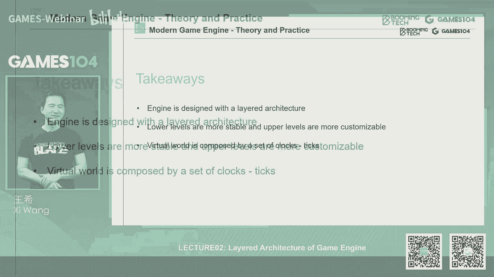

# 02.引擎架构分层 ｜ GAMES104-现代游戏引擎：从入门到实践 - P1：0 - GAMES-Webinar - BV12Z4y1B7th

hello嗨，大家好，欢迎回到那个games104，现代游戏引擎的理论与实践，我是王鑫，那个今天的话呢我们开始我们的第二讲，就是游戏引擎的分层架构，那在上一讲的话呢，我们跟同学们讲一下。

那个做研究现代游戏引擎的重要性，那么今天的这一讲也就是我们的第二讲，将会是真正的进入到这个游戏引擎的海洋里面，我们去理解它的这个内核，真正知道它下面有什么东西，其实呢。

同学们开始学习这个游戏引擎知识的时候，我觉得大家大家的第一个困惑是什么，我觉得是一种恐惧感，其实当我第一次从这个学术界，走到那个工业界的时候，我看到那那么大那么大的一个代码，其实我是很慌的。

那么多代码我从哪个文件开始看起来了对吧，然后我很慌，那我去找本书看，当我们找到游戏引擎架构那么厚的一本书，1000多页，打开一个第一个section叫做introduction。

然后你看到的是那么丰富的一个系统，其实你会非常的就是无从下手，这其实是我们所有开始学习游戏引擎的，同学们的一个很天然的感觉，所以的话呢我们对一个事情的认知呢，一般都讲由浅入深，所以我觉得先不要着急。

我们先用一个最简单的方法，就是我们浮光掠影一样的去感受一下，一个游戏引擎大概有哪些层次，所以呢我们做一个非常快速的这样的一个，一个旅行，那首先的话呢就是这里面我们举一行，我们在学一个知识啊。

我们先假设要一个人物，比如说我们小时候学英文，我们会说诶我们有一个同学叫小明，小李对吧，那我们假设我们有一个很好学的同学叫小明，他现在要开始学游戏引擎了，那么它下载一个现代游戏引擎。

它首先看到的东西是什么呢，可能不是源代码是什么呢，是各种各样的编辑器，对不对，你我们可以在那边编辑我们的关卡，我们可以做角色，做动画，看上去眼花缭乱，而且这边机器本身功能也是非常的复杂和丰富。

好像感觉这些东西我拖拖拽拽，边边，好像真的能做出一个我想要的一个游戏世界，所以这其实是大家对游戏引擎的，最直观的第一印象，所以呢这个时候也就接触了引擎的最上面，那一层，我们叫做什么词呢，叫工具层。

那么小明是比较好学的，那工具层之后他就会问哎，那这些东西怎么可以动起来，其实这时候他就想了，如果我要做一款游戏的话，那我这个首先我得能把这东西绘制出来了，那么游戏绘制的过程。

本质上是把一个虚拟虚拟的三维世界，把它一帧一帧的转化成一啊，一帧一帧的二维图像，从这个三维转换成二维，这个绘制过程是不是我们需要有渲染对吧，然后在这里面的话，所有东西它不是静止的。

所以呢我们可能还需要这个一些动画，让它动起来，然后这里面的这个世界我们要让它能够碰撞，因为我们要有一个物理的世界，对不对，那我们一个一个一个小石头在地上，我一脚能把他踢飞。

那我们是不是需要有一些对于它的物理的表达，物理的计算，那么当然了，我们做的不是一个简单的世界放在那，而实际上这个世界是可以玩的，那这里面我们有很多NPC啊，很多那个敌人啊，还有各种各样的游戏规则。

那我们是不是要有脚本啊，AI啊，包括状态机这些东西能定义这游戏里面的行为，那么还有呢就是作为一个现代商业游戏的话，你肯定需要有这个就是跟用用人机界面的交互，这个东西其实很容易被大家忽略。

但其实非常的重要，比如说啊我们打游戏最在乎的是什么，我我打一个boss，boss的血条还剩多少，那这个血条是什么，它实际上根三维绘制没有关系的，它实际上是个二维的一个一个一个gadget，是一个小东西。

然后他会一直在变一直在变，那么所以说其实这里面我会发现，我需要大量的跟游戏相关的这些功能，这些这些基础服务我们呢叫做功能层，那么功能层它核心做的事情其实非常的简单，就是我们能够让这个世界可以被看得见。

可以动得起来，而且呢还可以玩得起来，那其实基本上小明学到这儿，他已经应该有感觉了，觉得嗯，我大概已经知道这个游戏引擎该怎么去做了，但是呢这个时候如果他再往深处想一层的话，小明就会发现另外一个问题诶。

我我的游戏不能够通过很多很多一行代码，一个引擎就能跑起来，对不对，我是有大量的数据，大量的文件，这些数据和文件其实来自于，比如说有的是来自于PHOTOSHOP，我的一个画图软件，我有的是来自于3D。

max和MAYA这些3D建模软件对吧，当然我还有比如说声音的编辑，编辑文件这么多的图形，那个几何包括声音，甚至是视频，还有其他各种各样的复杂的数据，这些数据在游戏引擎里面是哪一个层，来处理它呢。

这个时候我们的in resources层就呼之欲出了，那个时候小明就会发现哦，这些成百上其实应该差不多是上万到上10万的，这些数据文件是在我们的游戏引擎里面，有个专门的词叫做resource层。

资源层负责加载管理这些资源，所以呢这个引擎的在功能层下面，其实就是我们的资源层，资源层，你可以理解成，就是给我们的功能层提供各种各样的弹药，让他去处理，让它去生成对吧，如果我不能够把这个角色的模型。

它的这个就是动画漏进来，那在游戏引擎里面我拿画什么东西呢，这就像一个画家一样的，就是说你没有给他，这个就像一个拍摄的电影导演，如果你没有一个场景，那电影导演他再大的本事他也拍不出来。

所以呢resource层是在功能层之下，那到这是不是就OK了呢，其实到这基础上，我觉得作为一个游戏引擎的开发者，你基本上可以工作了，但是呢我们的小明是一个非常敏而好学的，他观察到一个非常有意思的现象。

就是我在上面写了动画系统也好，我写的物理系统也好，写的绘制也好，包括各种各样的系统，它会频繁地调用一些很底层的代码，这里面底层代码其实看上去都非常简单，比如说最基础的容器的创建，最基础的内存的分配对吧。

还有比如说哎我要开一个县城，我的县城要管理，那这些东西的话，其实好像既没有出现它的功能层，也没有出现他的资源层，其实呢这个时候小明很好学的，小明这时候就遇到了引擎的另外更核心层，我们叫做核心层。

而核心层你可以理解的是什么呢，就像一个工具箱，就像一把特别像个瑞士军刀，你要内存管理好，我给你个内存管理的一套工具，你要这个各种容器分配，我给你中期分配的一套工具，你要做大量的数学运算。

比如说这个线性代数坐标变换诶，我这边数学模块也给你提供的很好，所以说其实我们上面的这些游戏，相关的逻辑管理，全部是架在这个call这个底座上面，所以CORE呢是引擎非常核心的一层，基本上到了这一层之后。

大家觉得嗯，我应该已经知道一个游戏引擎该怎么写了对吧，大家想想看数学最底层的内存分配管理，数学我都知道了，再网上的话，这个资源文件怎么下载，我大概也知道了，再网上呢我做各种各样的动画呀。

那个就是绘绘制啊，这些功能我也都知道，然后呢我再做上一些编辑器，好像我就能做一个游戏引擎，做一个游戏引擎加游戏了，但这个时候呢，其实是有一个特别容易被大家忽略的一层，是什么呢，我们叫做平台层。

其实啊就是说你做了所有的这个游戏引擎，包括游戏机所生产出来的游戏产品，它最终是要发布给用户的，但用户的设备千千万万，对不对，你可能用的是台PC，他可能用的是台Mac对吧，还有的人可能用的是一台手机。

那么包括很多可能是XBOXPLAYSTATION，而且用户的区别还在于它的输出不一样，有的时候是用键盘鼠标对不对，但有的人是用的是手柄，那么更丧心病狂的，还有人那个各种各样很奇怪的。

比如说像V的那个这个，那个就是有那个那个就是说体体感操作，比如像connect这种体感操作，那么我前天看了老头环，我看到有一个家伙开着那个驾驶方向盘，然后那个过了那个那个那个那个。

就是那个大黄金树的守卫怪，当时我整个人都震撼了，而且他戴了个头盔，所以说明什么，就是无论你来自于什么样的一个输出设备，到我的游戏世界里面，都要翻译成一个统一的语言，那包括就是说其实这种平台的差异。

不仅仅是在于硬件设备上的，还包括什么呢，还包括你的这个软件的发布平台，举个例子，我们著名的这个steam对吧，就是我们的威慑的steam，是我们大家最喜闻乐见的，这个这个这个游戏获取平台。

但是呢还有跟他竞争的是什么，e e p s EPIC game store对吧，那么EJS的话呢，它你如果把你的游戏要发布发布给EJS，发布给steam的话，你可能的接口收费模型就会完全不一样，当然了。

还有我最喜欢的XXGP也是非常好的平台，所以说其实在这一层的话，引擎还有一层就是处理各种各样的平台，那所以从这从下到上就是调查一行的，就是首先我有一层平台层，然后呢我上面构建了我的所有的功能。

处理的内核，就是我们的核心层，然后再网上呢我们构建了我们的资源层对吧，我们的各种文件可以加载，有了这个平台的东西，我也处理好了，这些所有的数学工具我都有了，然后呢我自愿也进来了。

这个时候我就开始可以做各种各样，游戏相关的事情，而这些游戏相关的事情的话呢，我还可以提供一个编辑环境，让别人可以编辑起来了，所以我上面还有一层工具层，所以这就是现代有引擎啊。

最最简单的一层架构就是五层架构，那么当然了，这个就是说这是极其简单的，实际上的话呢，如果我们还可以分得再细，但是呢因为不同的就是流派，大家的分法是不一样的，所以我会推荐同学们就是用这种简单的方法。

记住就可以了，那当然了，这里面还不要忘记了，就在第一集的时候，我们讲过说，其实现代游戏引擎是非常的丰富，基本上每一件事情都有别人会专门做得特别好，比如说专门做物理的。

像havoc physics就做的非常的好对吧，那这个时候在我们这些第三方的代码，它也要集成到我们的游戏引擎的生态里面，那这里面包括像这些声音啊，像这个speed tree啊，做简化。

那个就是做这个面片简化的这些工具，比如像simple top，那么第三方代码的话呢，其实在引擎里面是一个非常特别的存在，它有些代码是通过SDK的形式呢，直接集成到我们的引擎里面去。

就是说引擎里面编译的时候，我就要把第三方代码进行编译进去，但是呢还有一些第三方库呢，它实际上是变成一个独立的工具，它和引擎之间的数据交换，只是通过文件格式进行交换，我举个例子吧。

比如说像simple count simply，can t的话呢，这个就是他是给你一个非常复杂的几何，比如说几10万个面片，那现在游戏是不是跑不动，但是我们想看的特别细，怎么办，诶它可以把你面片做简化。

那么simply这个工具的话呢，我们就是在外面会有一套，你就可以就是说让艺术家用，把面片一层层的简化，但是呢我们在引擎中其实还可以集成一套，比如说引擎中有一些特别复杂的东西，我可以实时的做一些简化。

当然这个讲起来就比较深了，所以其实大家基本记住这个就是5+1的，这个层次的话，就涵盖了我们现代游戏引擎的话，几乎所有的代码和体系，那基本上讲到这儿的话，我觉得我们小伙伴。

我们的同学们应该都非常非常的聪明，大家就会产生一个强大的自信，说啊我明白了，我知道现在的游戏引擎是怎么加了，那我是不是就可以开始去做游戏引擎呢，实际上没有那么简单，那就是说我觉得我们的主人公。

比如说小明，这时候他也会非常的兴奋，他说诶，我觉得我知道我怎么去这个，开始写游戏引擎的代码了，但是呢这件事情啊，可能比大家想象的要复杂一点，所以接下来这也是今天啊我们这一节课的重点。

就是真正给大家讲清楚，现代游戏引擎的五层架构到底是什么，你们具体是怎么做的，那么我们认为呢，就是说学一个东西最好的方式是什么，最好的方式肯定是练习它，所以呢我们就给我们的小明出了一个难题。

说哎你既然觉得你懂了游戏引擎怎么做，那我们就做个小小的挑战吧对吧，这个现在大家很流行互联网上挑战，我说OK你现在做一个可以动起来的角色，在游戏中对吧，一个animate character。

然后呢你从下往上把这些代码写到游戏里面去，那小明就在想诶，这件事情好像啊我既然知道了引擎的五层架构，我将要去想我每一个功能模块，我到底怎么去写它，这其实也是一个非常有意思的脑力劳动，同学们可以先停一下。

想想刚才我讲的那个五层架构对吧，这个平台层核心层，然后那个就是这个资源层，功能层和工具层，那如果小明想做一个啊可以动起来的角色，在游戏引擎中的话，那它的代码分别该怎么去做呢，大家去想一想。

那其实这件事情的话呢，啊比大家想象的稍微复杂一点点，而且我在这一讲中的话，给大家点到这每一层，也顺便会讲一下每一层的要点是什么，但是同学们在接下来的过程中，可能会有一点点高能。

因为里面会有一些前沿的基础的东西，但是呢我尽可能用大家朴实的语言，给大家讲清楚，另外一个就是有些同学同学听不懂也不用着急，因为很多东西我们在后面会详细展开来讲，今天这节课呢。

关键的是帮同学们建立这样的一个，我们一直讲的叫框架，那么我们就随着这个小明的这个挑战，就是做一个动起来的角色，这个挑战开始，真正的钻入引擎的深水区的一场journey，一场旅行。

那首先的话呢他遇到的第一个挑战是什么呢，就是说我好不容易求我的会做美术的好朋友，帮我做了这个角色，我的好朋友很棒，他会用3D max做了一个很可爱的小角色对吧，还做了他的很多的贴图，对不对。

还做了很多的动画，但是这些这些词，这些东西叫什么，叫resource，叫资源，它每一个数据的格式都是不一样的，对不对，有有的是点max文件，有的是MAYA文件，有的是PSD文件。

那么这些数据其实肯定不可能在引擎中一一的，打开了，大家想想看，我们如果我们今天写个小软件的话，大家会说哦行，我要下载一个声音，我要去问你的声音是什么格式啊，你是mp3对吧，你还是WMV。

但是在游戏引擎那么复杂的环境里面的话，我们不可能去读这么多复杂的数据格式，还有一点就是说其实比如像PSD啊，像max maya的这些数据格式，它是为了它的自己工具，就是做的非常的复杂。

你们有大量无效的信息，如果这些数据直接在游戏引擎中下载的话，事实上效率会非常低，所以呢我们会做一步转换，就是我们叫做干嘛呢，我们会把这些数据全部转换成引擎的高效数据，这个这个转换一旦发生之后。

我们就把它叫做什么，叫做asset，asset的翻译成中文叫什么呢，叫资产，那么就是从resource到资产，它一个很大的不同是什么呢，我给大家举个简单的例子，比如说啊如果是一张贴图。

无论你是JPG还是这个PNG还是这种格式，那么它里面有很多的压缩算法，而且它的数据格式存储的话，其实如果在GPU中的绘制起来，效率是很低的，但是呢我们在这个这一步处理，在这一步的时候。

我们会把所有的贴图，不管你是什么格式，我们把它转成那个DPS这个格式，那么DDS这个格式呢它是按照16个BT，把这个数字呢，把这个贴图一小块一小的元素全部还不好，那这个格式可以直接扔到显卡中。

成为它的那个纹理，就是我们在游戏中看到所网上漂亮的花彩，漂亮的颜色都是用这种格式，直接灌到我们的显存中的，所以说其实这一步帮我们做了很多的工作，那包括就是在max里面。

你们编辑一个就是这个漂亮的mesh，如果你们会发现max问题也特别特别大，但是呢一旦我们把它导成仅引擎的acid，你会发现把很多编辑的数据全部扔掉了，这个这个这种感觉是什么呢。

就像是比如说我写我想写一篇文章，我用word去写，那word是不是存下载的文件，你们看会比较大，但是呢如果我只取文章里的内容，我把它变成TXT的时候，你们就发现那个TXT文章非常的小。

这个importing做的这个工作就是这个工作，所以呢我们的小明同学，第一步他就要把这些数据进行这种引擎化，我们变成我们的资产，那么这些资产呢大家关注关注他，第二个问题是什么呢。

就我们有比如说我们要表达这样的一个小角色，这些资产实际上呢他们是关联在一起的，其实大家也没意识到，就比如说我要表表现这个小角色，比如说这个小可爱的小机器人，那么首先这个小机器人是由这些网格。

就是它的它的形体，它上面的贴图还有一大堆的动画资源，但是在引擎代码中没有一行代码，说这些资源彼此之间是什么关系的，所以这个时候我们要定义另外一个资产。

这个资产呢啊有个说法叫composed i acid，什么意思，就是说它更大家可以理解成是一个相当于一个，呃关关系的这样的一个一个一个脚本，这个脚本，比如说我们这里面我简单的用XML做了个案例。

就是说它定义了一个资产，叫做啊robot的这个asset，他说诶我的match是什么，我的纹理是什么，然后呢我该用什么什么动画，当引擎读取了这一段XML的时候，诶他就知道了哦，我要下载以下这些资源。

所以这个本身它也是资产之一，在这里面的话呢，要跟大家讲个概念，就是在游戏引擎中啊，就是特别的现代游戏中，其实最核心的功能是什么呢，就是数据之间的关联，或者我们叫做reference。

就是说大家如果打开任何一个现在游戏，你们打开你们的那个游戏目录的话，如果是没有加包，加那个加包压包好的话，是有很多很多文件，当然现在游戏发布的时候，一般都会把它package成几个大的package。

但实际上那里面有大概几10万甚至，上百万个文件，而这些文件之间呢就是有的是贴图，有的是生意，有的是有的是那个动作，它都会像一个无数的网关联在一起，那这里面的话，大家会遇到一个非常有意思的概念。

叫做good，叫GUID叫唯一识别号，就是在现代游戏引擎中，我们希望给每个资产设置一个唯一识别号，这个这个东西有个最简单的比方是什么呢，就相当于是说比如说我这个小机器人对吧，我我的我的贴图。

我的mesh这些资产，我现在是通过他的路径找到他，对不对，但是这就像一个人一样的，比如说你有几个朋友，如果你记得都是他的住址的话，那你的朋友搬家了怎么办对吧，在在在现实生活中也会这样的问题，那怎么办呢。

很简单，每个人有一张身份证号，所以说你的朋友小美小小红可能会搬到上海，搬到北京没有关系，但是呢他只要这个身份证号在你永远可以找到，说哦我有两个朋友，一个叫小美的小明，我一查哦。

他们两个可能一个搬到北京了，一个搬到上海了，所以呢这个故意的全称叫做全球，全局的唯一编号，实际上是我们的游戏资产的，每一个的身份识别号，那么当我们把这个游戏的这些文件，原始的散乱的文件变成资产。

进入到我们的资源系统的时候，支持小小明就会发现一个问题了，就是说诶我在引擎中，我不能把这个文件放在这，对不对，我们实际上的话呢，需要一个就是实时的资产管理器，这个资产管理器其实非常简单。

就像我们读了这么多文件，在我的引擎中就会管理，其实如同刚才我讲的那个reference关系一样的，其实这些资产在我的这个rtasset manager里面的话呢，是事实上RUNTIME就表示实时。

就是游戏跑起来也是一个一个文件放在那儿，当然这个去头去尾了就支持内容，但是呢他们会互相指向对方，这个时候呢，我们在游戏引擎设计中，会经常有一个叫很重要的系统，叫做handle系统。

那么憨豆系统简单解释就是一个，就像你的有有那个有mao box一样的，就是说你可以搬来搬去，我也不知道你在不在，但是呢我就会始终有你的邮箱的这个钥匙，我知道你是105华邮箱，这样的话邮箱的主人有没有。

邮箱的主人还在不在，其实我可以只要问这个邮箱就知道了，这个地方讲起来比较深，我们以后会讲，但是简单来讲的话，其实这个资源层啊在我们的游戏中，最核心的是管理所有的，我们做的这些资产的生命中期。

所以资源城市游戏引擎，非常核心的一个一个一个层次，那么这里面为什么生命周期管理费这么重要呢，其实大家可能没有意识到，就是现代游戏，比如说我一路闯关杀将对吧，我在关卡A到关卡B到关卡C。

但是我每次这个关卡的时候，大家也没意识到，其实很多的资产是要无效了，我们要下载很多新的资产，那么这个时候其实啊，当这些资产在不断的根据我的，这个就是当前玩家玩的进度，在不断的下载和卸载。

这你们的这个关系是非常非常复杂的，所以刚才我讲了那个故意的系统，讲了这个handle系统都在解决这个问题，那么大家如果有一定的编程基础的话，特别大家如果学过C12话，学过java。

知道有个概念叫做DC对吧，就是垃圾回收，但是大家知道就是现代游戏里面，一般来讲GC做不好，就会让整个系统的效率变得非常的低，大家如果去观察现代游戏引擎的架构的话，特别是很多游戏产品。

你会发现他突然就会变得很慢了，那很多时候就是GC没有做好，就是说我一个关卡打完了，我要下去，然后呢另外管家起来了，但是呢大量呢就那上万上10万的资源，一下子要回收，如果你没有写好的话。

那一帧当场机器就卡在那了，那么实际上这里面的话有很多很很难的策略，另外一个呢我们叫做延迟加载，延迟下载指的是什么，就是说我希望人走到哪这些资源在下载，因为我的内存很小对吧，我的硬盘很大。

那这个时候就是我希望根据我玩到哪儿，在不断的去加载，大家如果玩那个就是有用虚幻引擎做的，这个这个游戏的时候经常有个细节，我不知道，现在最新版美眉修掉，就是经常一个角色出现在你的面前。

诶他一开始看到那个贴图很模糊，突然哒哒哒一点点变得更清晰，其实那个东西就是延迟下载所导致的，所以呢其实resource层，是游戏非常核心的一个管理层，它管理好整个游戏引擎跑起来了。

生态的它这个资源池的分配，它是管理好我们每个资产，在实时的这个生命中期，所以你如果我们今天要做一个游戏的话，我会建议大家先去看一下资源怎么去分配，所以说其实我当时10年前，我们在做引擎的时候。

其实我的第一个半年并没有像大家想的说，我们写了很多的这个graphics feature，写了这样这个很漂亮的那个rendering啊，那个SHADER实际上我们首先定义的就是数据，定义的是数据格式。

schema这些东西，然后呢定义这些数据在引擎中它应该怎么呈现，在编辑器中，应该怎么呈，现，在文件中怎么呈现，所以这是其实引擎开发者真正的核心好，那我们有了这些资源进入了游戏的时候。

这时候我觉得我们的这个小啊，小明同志就可以开始做他的游戏，游戏的真正的玩法了对吧，那我们那个挑战还记得吗，就是说我们要做一个会动的角色，那怎么让角色动起来呢，就像我在上一讲给大家讲过。

就是说啊这也是我们立的flag，就是说我们希望这一节课上完之后，同学们看到一个引擎，知道从哪下手，这一趴就是真正的游戏引擎的功能，那这里面要讲个很很有趣的概念，叫做tick，其实我蛮喜欢TIK这个词的。

就是其实我一直找不到一个很好的一个，中文翻译，这个tick tick，tick好像是敲一下还是怎么样，我不知道，但是非常像那个一个永动机啊，就是它的它的每隔一个固定间隔，就会把这个世界再往前推一小格。

我自己是个狂热的民间物理科学爱好者，所以我认为上帝也是在替我们的，上帝的TK是多少呢，是一个普朗克时间，大家如果有时间去那个研究一下，就是普朗克对吧，普朗克时间有那个普朗克那个长度，对不对，普朗克能量。

还有一个普朗克时间，非常非常小的一个时间片段，就是我们认为任何一个物理过程，可能不能小于普朗克时间，那在游戏中的话呢，其实我们的每一个tick，就是我们构建的这个世界里面的普朗克时间。

那么这个tick呢就是当一个tick来之后，我们的系统就会依次的把所有该做的事情做啊，比如说我先去看看输出输出，我读一下，我动一下我的相机，动一下我的这个这个人物和角色对吧，我播一下动画。

然后呢我还可以就是绘制一帧的画面，我还可以做一些，刚才我讲的那个memory g c当然很抽象了对吧，那我整个逻辑的往前走一遍，其实在游戏的世界里面，是如何让这个世界动起来了。

这其实就是利用现代计算机非常高的计算速度，然后呢我们在每隔1/30秒，把整个世界的逻辑和绘制全部跑了一遍，这就是tick的魔力，T i c k，那这里面的话呢我就要隆重介绍两大神兽了。

就是大家看现代游戏引擎啊，我会非常推荐大家去找到这个tick函数，但是这个名字不一定叫tick，那么一般在main函数里面，我们看到一个tick tick里面的话呢，就会出现两大神兽。

一个叫TECHNOLOGIC，一个叫TRENDER，就是就像我昨天那个上上周的第一集讲的，就是说游戏引擎不只是渲染，或者说渲染只是其中的一个不是很大的一部分。

也就是说其实你看他一般会先take a logic，再take a render，他这个关系是什么呢，就像我要继续回到我的这个这个民间物理，科学家的这个这个思维方式啊。

就上帝如果把我们整个世界是虚拟出来的，那它首先呢把整个世界的物理规则，全部计算一遍，好整个世界的物理规则算完了那一帧，比如说我现在就是这个姿态对吧，那这个姿态呢其实你无论绘制它不会是它。

它这个姿态已经存在了，如果这个时候我有惯性，那我的在下个题考来了时候，我是不是要再往前走一步，那这个也是它是自动符合物理学规律的，但这个时候如果有个观察者，比如说小明出现了，他有两双眼睛。

他会选择一个视角，他会去观察这个世界的姿态，所以呢这个时候我们就以小明的眼睛，生成一个二维的画面，这就是他所看见的东西，所以这个过程叫什么呢，这叫渲染，所以说我们是对这个世界的模拟为先。

就take logic，把这个世界模拟出来为先，然后呢再去去渲染它，所以说这就是现在游戏的两大神兽，就大家去看游戏，基本上就是一个是逻辑，一个是渲染，那么逻辑呢一般做什么呢。

就是哎呀我把这个这个输入输出读一遍，我把整个世界的物理算一遍，把这个camera动一动吧，角色动运动，把碰撞检测检测对吧，就是比如说张三有没有打中李四，这件事情是逻辑的事儿还是渲染的事呢。

我如果上完我们104课程的同学就知道了哦，那是逻辑的事，因为大家知道就是无论你看见没看见，张三是打动了李四，而且扣了李四的五点血，这就是逻辑，其实以后我们讲到网络的时候，这个过程会更复杂。

但是呢这个逻辑和绘制一定要严格的气氛，就是说一个没有受过系统训练的游戏引擎，开发者的话，很容易把两边的代码写的混合在一起，但是呢如果大家把这个表现绘制和逻辑，分开来的话，基本上你的代码无论怎么写。

他都不会重合在一起，那么渲染的话呢就更专业了，就比如说我们会做各种裁剪呐，我们会做这个就是光照啊，会做这个相机的shadow啊，这些因素，那这个呢我就跟我讲过，就会在我们的后面几节课程给大家介绍。

在今天的博士为重点展开，所以其实大家可以看到，就是说啊这个就是一个案例，比如说在这里面的话，我们每个30秒tick，你可以看到就是啊在他的左边，我们一直在做个裁剪，大家可以看到就是很多。

你那个看不见的东西就会被裁掉，你只看到你看得见的东西，然后呢在右边的话你可以看到，其实人物的动作树叶，它都是一帧一帧一帧的在变化，所以motion grass，整个动画的基础理论就是人是靠视觉残留。

感知一个连续的世界了，而这一点的话，在现代游戏中会充分的去利用起来了，那么其实呢我今天只是讲了一个就是功能层，最简单的东西就是从logic radio，但今天因为不是会展开，但是我想跟大家讲一个概念。

就是说其实功能层是非常非常庞大的，这里面我继续引用我们的上古神书，就是游戏引擎架构成，本书中关于功能性这一块，你会发现这一块内容是最多的，就是真的是无所不有，什么都有，而且呢就是说公认层。

其实我有的时候在很多引擎的架构中，我们会发现，它会经常会和具体的游戏关联在一起，什么意思，就是你无法区分，举个例子吧，比如说相机控制，你觉得是游戏引擎提供的功能呢，还是说你只要提供基础的相机的这个。

这个绘制能力，然后呢相机的控制我交给我的游戏，某一个特定的游戏，比如说我做一个第三人称射击游戏，我希望这个相机特别有内容，就是手持那个摄像机的摇晃感对吧，那这个时候我的这个相机的摇晃啊。

这个镜头的模糊啊，拉远拉伸啊，它其实是跟那个游戏是有密切的关系的，那这个模块是不是作为一个游戏的代码，而不是作为一个游戏引擎的代码，所以呢其实很多时候哪些功能属于游戏，哪些功能属于引擎。

基本上就会在功能层这边打架，但功能层呢有些模块是很清晰的，属于这个我们的游戏引擎的，比如说绘制对吧，我们的rendering，我们的pipeline，对不对，我们的整个这个就是资产的管理。

这些一定是属于我们引擎的东西，所以功能层呢，在未来也会作为我们的一个介绍的一个重点，那么刚才讲的就是上古的两大神兽嘛，其实这一点的话呢，我也在这课程，希望同学们也会注意到一件事情。

就是说其实现代计算机的架构啊，已经逐渐在十几年前逐渐的从单核走向了多核，其实呢未来的这个多核时代，也会是游戏引擎架构一个很核心的方向，这里面的话呢，就是大家知道最早的这个游戏引擎是单线程的。

就是一个线程跑到死，然后后来有多核了，那最简单的做法是什么呢，就是我们把任务，比如说刚才讲了一个叫tik logic对吧，一个叫tik render，那最简单做法。

我把logic和render分到两个线程里面去，然后当然我还有额外的线程，比如说做下载，这个呢是一个比较基础的多线程的一个算法，那么其实在现在的这个商业引擎的话呢，比如说像尤里安瑞尔。

他们会再往前走一步，比如说他们会把一些特别容易并进化的计算，比如像物理呀，像一些其他的animation呢，它会把它单独的fork出来，分散到很多很多的引擎上，这就是我我们称之为叫这个就是图片中间的。

就是现在很多主流引擎都是这样做的一个架构，那么第三个的话呢，就是我们认为是未来的这种引擎的架构，就是说我们能不能把所有的任务，变成一个原子的，我们叫做job，然后呢你有四个和你有八个和你有16个。

16盒没关系，我就一直认认认认认把你每个核吃得满满的，这个就是大家从这个图上来看的话，是不是就觉得哎，好像第三种方案看上去更漂亮一点，确实是这样，就是同学们不用懂啊，就是这个我们的引擎。

到底是按照这个哪一种架构，其实有个很简单的做法，就是你打开一个游戏，然后呢，你打开你windows的那个CPU的那个profiling的那个工具，他每个CPU不是代表了一个小窗口吗。

你去看那个小窗口是不是都吃的满满的，还是说有的被吃的很满，有的吃不掉，如果出现了就有的吃的很满，有的吃不掉的话，那他的多线程大概率是没有采取，就是我们高级的这个job系统去做的，但是这件事情的话呢。

可能比大家想象的要复杂得多，为什么呢，因为其实当大家真的去写这个游戏功能层的，这样的一个工作的时候，你会发现他很多计算中间是有一个依赖关系的，我们的学术叫做学术术语叫做dependency。

举个简单的例子吧，比如说我现在做一个拿刀，拿手一挥，我手上假设想打出个特效，那我首先是要这个动画系统要算完，知道我的手在这个位置，然后这个时候我才能把我这个位置，传导给我的粒子系统对吧。

然后把这一个个的小的光的粒子发出来，那他这俩就是粒子系统的计算，和这个动画系统的计算，就这一对于这个角色来讲的话，他必须要有个先后关系，而这一套就是说非常高效率的，多核并行架构的话。

它真正的难就难在这个dependency的管理上面，能够让他不会出乱子，但这个呢是一个很高级的课程，但是我觉得学我们games104课程的同学的话，我希望大家建立一个概念。

就是说未来的引擎架构一定是个多核架构的，所以说大家前天如果开始进行底层架构的时候，我会非常强烈的推荐大家，就是从多核开始去设计和思考整个底层代码，所以呢我觉得其实我们的引擎之旅啊，基本上到了这一趴之后。

我觉得我们的小明已经非常非常厉害了，就是他已经知道了，就是说把自己动画的系统，这个角色挂到我们的主的TIK上面，他知道我在去做这个动作的时候，我就tick到。

我在这tick logic里面加一个叫tick animation，这样的话，我每次从资源里面把我的那个一个个动画，真读进来了，这样的话我又把它把它骨骼驱动起来了，那这个人就可以动起来。

然后我在那个render里面每一帧去绘制那个同学，那个那个角色就绘制出来了对吧，其实呢小明肯定不止于此，因为我们的同学是什么，我们是要做这个这个游戏引擎的，这个时候我们就会接触到真正的核核心层。

那核心层呢最容易引起大家关注的，就是他的数学库，其实呃在这个游戏的引擎里面啊，其实数学用的并不是特别的高深，当然有些特殊的场合，我们数学用的是非常高的，比如说像物理，物理用的数学是非常深的。

但是呢最简单的如果是绘制，包括游戏逻辑的话，我个人认为大学的线性代数基本够用了，就是你基本上知道矩阵向量这些概念对吧，那么那个闫令琪老师的104课程上讲的也，101课程讲的也很清楚。

就是这个比如说我怎么去旋旋转一个坐标呀，我怎么对一个物体进行二维的三维的放放缩呀，基本上我我个人认为就是一个周末吧，你再关把你关在那个刺绣教室好好学一下啊，做几套演算题，基本上就能算得清楚。

我们游戏引擎所需要的这个数学的库，那么也就是说它这里面的话呢，这些基础的数学概念其实并不是特别的复杂，那为什么在这个就是游戏引擎里面，这些数据库我们会单独写的，这里面就会牵扯到我们游戏的一个。

很独特的需求，就是我的第一集讲到的就是游戏引擎的一切，都是为效率服务的，它是一个real time这样的一个application，就是说所有的用户的输入和它的反馈，必须是al time。

那么其实我们所有的数学股是非常sensitive，对，就是非常敏敏感于它的效率，这里面就又搬出我们的那个上古的那个神人，就是john ka，就joker有个很著名的案例，就是在那个quick3的代码中。

他发现就是说算那一个数值的这个这个导数，平方根是特别慢，什么叫导数平方根，就是一除以根号X对吧，大家想想开个根号再做个除法，其实这如果转换成我们计算机指令的话，是无数条LU指令，而且是浮点型的。

确实效率会非常慢，然后呢我们的KMARK就写了这样的一段代码，这段代码我不知道我们在座的同学，有多少人能读懂啊，我实话实说，我也没有完全读懂，但是呢你可以发现这里面还有一个magic number。

他自己都会说，哎呀，不好意思，这是个hack对吧，那其实它不是个hack，它是什么呢，它是首先求了个近似解，然后后面用牛顿迭代法快速的去逼近那个数值，因为在游戏引擎中啊。

我们很多时候不追求你算的数值绝对正确，大致正确就可以了，而这个算法就康Mark的这个实现的效率，会远高于你直接调用系统的max库的那个s qr t，那个square root，在这做个除法。

这个这两个效率相差会非常非常多，那么当然卡马克那个时代的话是很古老的，但是在现代游戏啊，在现在计算机中的话，有个东西我是非常推荐同学们去注意的，就是这个SIMDSMDSMD什么概念呢。

就是大家刚才讲到的，就是在游戏的引擎中啊，很多时候我们就是一个矩阵和向量的加减乘除，什么叫矩阵，什么向量不就是4×4对吧，16个数，然后向量是四个数对吧，四个数加四个数，那我可不可以一条指令。

把四个数加四个数全部做完呢，诶我们想到了这个CPU的设计厂商，他们也想到了，所以呢他们就提出了这个semi的这个概念，这个概念就相当于说你一个LRU，把四个运算全部做掉。

而这个呢其实也是我们在引擎的数据库中，广泛使用的这样一个技术，所以比如说你们在读一行代码的时候，看那个注释叫SSE的时候，你就知道那一段代码实际上是做向量运算的，它的它直接扩CPU的这个这个并行化的。

这个向量运算能力，它的性能是要比这个直接掉浮点数了，快好几倍的，所以这个其实我们引擎的数学库，对效率的要求其实是非常的高，那么当然了，核心层不止于数学了，其实核心层呢是为我们上层的所有的逻辑。

提供了基础服务，这里面有个很重要的问题，就是数据结构，其实首先的话想做引擎的话，如果真的想做引擎开发，你一定要理解数据结构，数据结构是什么呢，其实比大家想象的要简单。

比如说我需要一个array存储一串数据对吧，我需要一个链表，一个练一个，一个练一个，一个练一个，那么我们需要做一个二叉树的结构，去查找一些东西，这些都是一些非常基础的概念。

而且呢包括在C加加语言的标准中，就是STR中是有标准的，这个就是这个容器的，这个这个东西叫容器的实现，那为什么在引擎的核心层，我们要全部重新做一遍呢，因为大家如果仔细研究。

你会发现就是C加加提供的标准容器啊，当你进行高频的诶，我增加增加数据，我要删数据，我在增加增加数据，删数据的时候，它会在内存中产生大量大量的空洞，而且呢它的内存的使用是不受你控制的，给大家讲个小的细节。

就是vector，比如说一个一个数组，在那个C加标准视频中，你如果比如说我一开始分配了100个元素，假设我现在出现了100一个元素，它会怎么办呢，至少我记得上一版的时间。

是直接很粗暴地把它的空间放大一倍，就是说它的空间是以这个就是这个倍数，网上去涨了，所以到最后你的一个游戏跑起来，你的内存的消耗是多少，你完全不知道，而且这些内存会分散的非常的开。

那你这个游戏就会变得非常的慢，所以呢在核心层，我们需要做一套我们自己的数据结构，让它没有几乎没有内存碎片，而且访问效率要非常的高，所以呢其实这里面的话也是核心层，最最重要的一个功能就是内存管理。

其实我的第一集跟大家讲过，就是一个游戏引擎啊，它的开发实际上非常接近于一个操作系统，也就是说，其实内存管理是操作系统最重要的一个，一个工具，比如他通过堆栈来管理操作系统啊，管理那个我们的内存资源。

但是在游戏引擎中的话，我们预先申请了一大块内存，这块内存将会有我们自己管理，为什么呢，我们在追求最高的效率，这里面就讲一个科普一个概念，就是说其实现代计算机啊，大家会看到两个我们可以看得见两个指标。

比如说我的CPU跑的有多快对吧，我的内存配的很大，大家很多时候呢去买计算机的时候，我们会买那种ACPU，主频非常非常快，内存也很大，但你们我不知道同学们有没有注意过，这两块芯片，同一个厂家主屏是一样快。

但是有一块芯片啊，有一块CPU就卖的比另外一块贵贵很多很多，如果大家有注意到这个现象的话呢，其实他的很多时候它的差别是在于它的cash，就是紧贴着CPU的一个一个缓存，那个缓存的话非常非常的贵。

但是那个缓存越大的话，他那个CPU从下面取数据的效率就越高，然后呢这个时候我在跑游戏，我再去这个跑分的时候，效率就会高很多，所以同学们以后啊买这个CPU的时候，不要只买主频高，你们还看它缓存有多大。

所以内存不是越大越好，CPU不是越快越好，缓存其实很多时候是核心的卡点，那么其实在这里面的话呢，就是在核心层，我们在做内存管理的时候，其实会用一个铺，就是一个很大的一块。

我们先把所有的那个这个内存资源全部关起来，然后呢我们自己管各种各样的数据，比如说向量呀，树啊，这个历史的这种，这这些这些这些数据资源的分配，但这里面讲起来就比较抽象了，其实这个东西的理解也比较简单。

就是我觉得我们上古大神就是图灵，其实其实现代计算机啊到最后它还是个图灵机，图灵机的结构比大家想想，大家想想想，其实非常的简单，就是说它就是一个穿孔纸带，然后呢里面有代码时代进来拉来拉去。

上面的话就是读写读写就可以跑出所有的逻辑，那你想想看，我这个图形机如果效率高，我该怎么去处理，该该怎么去管理数据呢，其实它的规则就三条非常简单，第一就是我尽可能的把数据放到一起。

这样我这个纸袋依次访问的时候，是不是速度快一点，第二呢我去访问他的时候，数据尽可能沿着那个纸袋的顺序来，就是1234567，不要是179356对吧，那这样的话它的效率就低了，第三个呢就是我的数据。

如果是诶我要申请，我要去写它，或者说我要去抹掉它，不要一个一个的把它抹掉，而是说一次一批的抹掉，其实讲这个游戏引擎的底层内存管理啊，包括像C加加的最新的，比如C加17啊，21啊。

有很多很高端的这种属性课程，那个那个功能啊，很多同学学的感觉感觉是云里雾里对吧，但实际上它的底层逻辑至少以我的经验总结，就这三条，就是把数据放在一起访问，数据的时候尽可能顺序的访问。

然后最后一个呢就是说你去读写的时候，尽可能一起去读写，所以的话上过我们games104的课程，同学们的话，如果有同学给你们讲那些高端的这个，内存管理的知识的话，基本上游戏引擎里面所摸索出的这三条。

基本上够你去混到这个初级架构师吧，应该问题不是很大，这里面我们小小的这个这个这个凡尔赛一把，所以说其实这也是做游戏引擎，我我们个人非常喜欢的东西，我也特别推荐同学们都学一点引擎的知识。

因为你读完这些东西之后，你就可以像当你面对一个巨型软件系统的时候，你不慌，你知道他怎么从底座一层层的构起来，而扩的这一层的话呢，实际上是操作系统，操作系统底层和类似的东西，所以我们的这个好学的小明。

如果他把括这层东西学完的话，我觉得他已经非常强了，其实CORE在整个游戏的这个引擎层的话呢，是一个核心层，那么它的代码呢一般要求质量非常高，而且呢轻易的不要去动它，所以一般来讲你们看到一个游戏工作。

一个游戏游戏引擎公司吧，可能是几十个上百个开发人员，但是能写CORE的程序员不会很多，都是这种很资深的同学去写的代码，他要保证它的绝对的安全性，绝对的效率，所以呢我们一些最核心的东西会放在这一层。

那个就是维护起来好，那小明学到这儿，我觉得这样的同学们讲了，我看到弹幕了，有人说小明这时候应该没头发，我觉得差不多写到括这层应该就没有头发了，那么就是其实小明这个时候把这个游戏都已经。

从上到下全部写完之后，他就会遇到他的另外一个问题是什么呢，就是说哎我要找我的小伙伴去得瑟一下，我们一般传统那个故事里面都会讲，小明旁边一定有个叫小美对吧，那这个时候他会发现我把这游戏做好之后。

小美我想在小美面前得瑟一下，我发现小美用的是一个Mac好了吗，我用windows开发的一个游戏在Mac上怎么跑起来，你们会发现不同的平台，它连文件路径的格式都不一样，一个是正斜杠，一个是反斜杠对吧。

一个是C冒号什么什么，一个是volume冒号什么什么，这就很晕啊，但其实我不可能在我引擎的代码，从头到尾都这个重写一遍，对不对，所以呢这个时候平台层就会变得非常的重要。

平台成本质上就是说你在上面写核心代码，你在上面写功能，可以无视这些平台的区别，而直接sorry，而直接去写它核心的逻辑，那么这个时候的话，其实平台词我们叫做平台无关系，就是把所有平台的那个差异度。

全部把它给掩盖掉，这一层，其实也是现代游戏引擎非常核心的一个东西，为什么呢，我我刚才讲的这个文件路径，其实还是个比较简单的，真正让大家头疼的是什么呢，我给大家举个例子，就是当我想做一款游戏的时候。

当我们是在PC上，我们面对的可能是DX对吧，DX有DX11，Dx12，那么当我做到那个Mac的机器上的时候，我遇到的是什么，是metal对吧，当我遇到那个安卓的机器上，我看到的是什么呢。

可能是open g r e s，我们看到的是win，这个时候上面写那些图形学feature的人对吧，我们去写那些那个那个SHADER的人是不是很崩溃，所以其实在现代游戏引擎中呢。

有一个非常重要的一层叫做RHI，就是render hardware interface，就是它重新定义层graphics API，然后呢把这些各个硬件的这个SDK的区别，把它封装起来。

大家可以看到这是一小段这个那RH的代码，但发现其实我的天哪，这些函数你就全部重新定义了一遍对吧，而且全部是那种虚函数，虚函数是个比较高能的概念，其实如果学会C加的同学都知道，就是他要等着你去实现。

就是说你要把它编译成这个MICHAEL的，编译成这个PC的，编译成这个移动端的，你自己实现一遍，但是呢上面写那些效果的同学，其实呢就不用管了，但这一层其实比大家想象的要难写很多了。

这个我只有我们好学的小明，我怀疑这时候小明的头发应该已经掉光了，为什么呢，因为就是我举个简单的例子吧，比如说DX11到DX12都是微软的全家桶对吧，但是如果做过引擎开发的同学。

就知道它的设计理念是完全完全不一样的，那么如果你把DX11的代码深编译成，就是DX12的代码的话，你的游戏的不是跑的越来越快了，反而会突然一下子跑得非常的慢，因为你必须要利用DX12很多的特性。

去做很多底层的优化，但是呢在上面写那些游戏功能层的同学，一般是不知道这下面是怎么做的，这个时候我们做底层的同学就头发就全掉光了，因为这个确实是非常非常的难，所以平台层是一个很容易被大家忽略的一层。

但其实呢这也是一个引擎的水平的高下的，一个很重要的一个分水岭，那么其实这种这种差别的话呢，不止在这个我们看得见的graphics啊，我再给大家讲一个更丧心病狂的，就是大家想象过没有不同的平台。

他连CPU的架构都不一样，这里面的话我给大家举一个，就是那个大家特别喜欢的PLAYSTATION的例子，这是第三代PlayStation PS three，那么在p S3里面，在我们传统的习惯的CPU。

它这里面叫PPU之外，有几个小的协助CPU，叫SPUSB的速度是很快的，但是呢它的访问的内存，它是直接可以写到显存里面，这个讲起来比较抽象了，简单来讲就是说我们在做各种绘制的时候，有很多数据预处理准备。

包括一些独立的AI逻辑运算，索尼爸爸说，诶你可以把这些运算放到我的协处理器上啊，好了，索尼爸爸是一辈好一片好心，对不对，但是当我们在做游戏引擎架构的同学，头发就瞬间掉光了，为什么呢，因为我的天呐。

我在上面写AI写逻辑的人，写这个就是比如说这种资源准备的人，我是需要知道我这个算法，是具体跑在哪个和上面吗，大家想象一下好，我如果这样按照PS3我去写了，那我假设编译一个XBOX版本怎么办。

然后我再编一个PC版本，怎么Mac版本怎么办，我的核可能是，比如像现在我们的很多很多arm的芯片，有大小核的概念对吧，那我哪一个算法后呢，哪个核才合理呢，其实这也是我们在游戏引擎的平台层。

非常非常痛苦的一件事情，所以同学们千万不要小瞧这个平台层，平台层做的好坏，其实对你引擎的效率影响是非常非常大的，所以小明如果今天如果想在小明面前展示出，她做的最牛逼的那个动画角色的话。

他首先得解决平台呢，不过我觉得在目前来讲的话，我们这个要求下，小明呢大概把文件路径搞对，我认为他这个游戏就能跑得起来了，因为毕竟很简单，但是你要做一个非常非常复杂的游戏，比如说像全战这样的游戏。

比如说像那个就是使命召唤这样的作品的话，你可能这个这个层的话，是要非常用心地去设计过的，那基本上讲到这儿的话，其实游戏引擎的RUA的部分基本上就讲完了，这也是我们讲游戏引擎，它我们可以理解有两大块。

一块是实时的，但是呢还有一大块就是我们刚才讲了工具层，工具层我们为什么放到最后讲了，因为它我们经常讲它不是软弹的，但是工具层其实对引擎到底意味着什么呢，我们再回到我们小明这个例子，小明想做一款游戏。

但是他一上来这个角色啊，动画美术资源都是找他的小伙伴去要的，这个时候假如说哎我这个功能已经做好了，我想请这个小张来帮我去做他自己想做的角色，对吧，更酷一点，这个时候他发现啊，他需要设计一整套的工具。

让小张给他的这个世界里添东西，所以呢工具层的话呢，实际上就是啊允许别人与level editor，就是以地图编辑器为中心，形成的一系列的编辑器，比如说我们经常很熟悉的蓝图逻辑的编辑器，对吧。

还有材质编辑器，让他去调这个角色的各种细节的材质，那为什么在游戏引擎明白吗，单独做个材质编辑器呢，实际上是这样的，就是说因为一个东西我在比如说3D max里面，玛雅，你看到的效果。

和我在游戏引擎中看起来效果是不一样的，所以呢游戏引擎的材质编辑器，它会保证就是你在这里面预览看到的效果，和你在真实游戏中看到的是一模一样，这个对我们的艺术家是非常非常重要的，所以工具这一层啊。

在我看来就是是真正的生产力的工具，你的创造力实际上，就是靠工具这一层去释放出来了，但是工具这一行的开发呢就是很灵活，就是说引擎一般来讲我们都是用C加去写的，因为他要追求最高的效率嘛。

因为他是RA实时的去保那工具这层的哈，其实它的开发方式非常灵活，比如说如果你喜欢C加加，你可以用qt啊去做它的整个界面，它是以效率优先的，而是以开发效率优先的，不是以运行效率为优先。

那么如果你可以选择c#，用强大的WPF做它各种各样的控件，对不对，你甚至可以用那个H5，去全部用web端做一个工具，其实也没有问题，所以的话呢工具这一层，每一每一个引擎它的选择都会不太一样。

但是呢最核心的一点是不能变的，就是说我们的工具层，实际上是允许别人去创造游戏的内容，而工具层的话也是引擎，可以说是最核心的一个一个体系，这里面给大家讲个概念，就是虽然在五层的分化中，工具层只占了一小层。

对不对，但实际上工具层的代码量，很多时候是比引擎还要大的，它的维护起来了，门槛复杂度也会更高，那么其实呢我们除了自己啊，开发了各种各样的编辑器之外，还有呢很多我们叫做DCC。

DCC这个名字听着很高大上啊，叫digital content creation，翻译成人话就是别人开发的这个资产生产工具，比如说大名鼎鼎的3D max，MAYAPHOTOSHOP对吧，F mode。

还有还有大名鼎鼎的胡迪尼，就是大家看到很多大片，那个效果都是胡迪尼做的，那这些工具生成了大量的数字资产，和我们自己的编辑器生成生成的这种数字资产，通过我们的一条管线全部变成我们游戏统一的。

就是我在前面介绍的叫什么asset，那这个管弦叫什么呢，叫做asset conditioning pipeline，这个名字听着很高大上，其实简单来讲就是各种各样的导出器和导入器。

就是比如说在3D max里面，在MAYA里面，我把这个市场导出去，对不对，然后呢再把它导成我们自己的id，然后呢这些东西进入到我们的游戏引擎里面去，所以这个就是我们自己开发的编辑器。

再加上我们这个资产的导入器和导出器，共同构成了我们的工具层，工具层有个很神奇的特性啊，就是说我们可能自己开发了，就是十几种不同的编辑器，然后呢我们还用了七八种别人的编辑器，这几十种工具之后。

它会互相形成一个链，在这个链中间的话，这些数据都必须要彼此通畅，彼此要能够说话，这件事情其实比大家想象的特别的要难很多，因为数据之间的知识实现互导的话，他必须要有一个统一的数据格式。

所以现在的话呢很多的那个厂商也在提，这个就是说一些通用的数据格式，比如说著名的那个啊FBX对吧，这是十几年前大家在推的东西，那现在这次现在大家都在说USD，对不对，这是那个就是应该是PIKA。

还是迪士尼在做的这个数据交换格式，但这些东西呢for电影，for这些东西都可以，但是呢在游戏中的话呢，一般来讲游戏引擎会自己定义一套自己的格式，所以这一套工具层的话呢，是构成了一个完整的游戏的生态体系。

所以大家看一看，就小明同志为了做一个一个简简单单，也可以动起来的角色，如果他真的是一个隐形程序员的话，他要做这么多东西，所以呢这就是引擎的一个全貌，这也是一个非常快速的进入到引擎的一个tour。

那就是为什么引擎要分层呢，其实用一些学术的话去讲吧，就是第一个它是decoupling，这个复杂度就是我我在我的第一集跟大家讲过，就有现代游戏引擎，我觉得是一个复杂度的一个艺术。

就是他因为我们在模拟整个matrix嘛，那么我们对这个世界的模拟，它的复杂度是非常高的，所以呢我们通过一层一层每一层控制变量法，就是每一层只关注自己的事情，而不用再关注过多的东西。

那么越往下的这个层次的话呢，提供基础服务，那么其实这个analogy像什么呢，特别像我们的真实世界，举个例子啊，同学们生活在一个大城市里面，我想问你个问题，你你你大家有没有想过。

为什么我现在每天电灯打开就有电对吧，我写一个地址，我的东西就能寄到别人，其实一个现代城市，它也是一个ecosystem生态体系，它也是分层的，比如说最基础的我们叫做facility。

就是说基础的水电排污，这些都是城市的最基础的设施，是很多老百姓根本看不到的，这像不像我们的这个拉风和扩这层，干的事情对吧，然后再网上诶，我们有城市的物流资源调度对吧，每天我们吃进去的东西。

我们这个扔出去的垃圾，这些资源在调度，而且我我的城市垃圾场不会爆掉，是不是我们有个资源系统，对不对，好，再网上，我们在这个城市里面，我们要生活，我们要经商，我们要做更多的业务，我们要创造财富，这是什么。

这是我们的功能层function层，大家仔细想想是不是也是一层层，其实这是一个现代啊，现代系统科学的一个很重要的概念，叫in capsule，叫封装，其实这个世界如果只是没有封装。

只是把所有的概念散乱在这儿的话，是不可被理解，也是不可被管理的，举个例子吧，这个世界一切都是由原子构成的，但是当我把足够多的原子合到一起，它形成一个东西叫篮球，这个篮球你可以玩了。

你不用关心篮球有多少个原子构成，你知道他是个篮球对吧，那一群人拿着篮球去在一起打的话，我们看到的是一场篮球比赛，篮球比赛又是个封装，所以其实一个复杂系统，它就是一层一层一层一层的分分封装起来的。

所以这也是为什么我说游戏引擎课，这个是很有意思，就是说大家通过这样的一个思考的话，就能理解一个复杂问题，我怎么解决，但这里面还有一个很有意思的东西，是说其实在这个架构中呢，我们有一个基础语。

有两个基础原则，第一个原则是什么呢，就是说越往底层的东西越不要去动它，比如说我们的platform这一层，我们的核心这一层和这和这一层，基本上代码拆开之后几年是不要改的，因为他那个一改上面就很麻烦对吧。

但是上面的代码像功能层的话，代码改来改去，工具层的话几乎每天都在变，我今天想到了，我要做个什么玩法，我需要一个什么工具，明天就去做了，但是的话呢就是说，所以说其实呢当我们的需求不断来的时候。

我不需要从上到下去动它，所有的系统，我只需要动它外面的上上层的系统，越网上越灵活，越往下越稳定，这其实也是分层结构的一个很大的好处，在这里面讲了一个更重要的一个概念是什么呢，就是说其实啊。

当我们未来在做任何一个需求的时候，其实同学们首先要去想的是，我做的这件事情应该属于哪一层，而不是急急忙忙的我把这个算法写出来，这个其实在我们在看到，就是很多人就很想做一游戏引擎嘛。

经常会框框把很多功能对在哪，就说哎你看我这个效果做的特别特别好，但是真正做过这种系统性训练的同学，就会知道说，我首先要去想我这个功能到底属于资源层呢，对吧，比如说我们作为一个大类型。

我到底是在资源层写什么代码，我在核心层写什么代码，我在功能层写什么代码，这个要一层层分得特别清楚，再讲个小trick，就是说功能层之间的调用的话，各个层次现在调用的话。

我们一般只允许上面的层次调下面层次的功能，但不尽量应该是绝对不允许，就下面反向掉上面一层的功能，这就是分层的一个就是核心的体系结构，其实大家去研究现代引擎的话，如果做得好的话，一定是分层的。

每一层都要很清晰，所以这就是我们这一节课的一个最核心的内容，就是给大家讲清楚我们的这个游戏，一层的分层的基础价格，我不知道，讲到这，同学们，是不是已经对游戏已经有个基础的概念了对吧，是不是像小明一样。

觉得我们已经可以完整的开始，交付一个有意思的功能了，那么的话呢，这里面就到我们课程非常有意思的1part了，就是说我们的明年整，对我们想了大概一个多星期，我们终于决定给我们的引擎取一个名字。

对我看到同学们有在弹幕里说，唉我已经开始害怕了，同学们不要怕，因为这节课呢，我是把整个引擎整体的介绍了一下，但实际上在未来的实际讲里面，我会一点点的去讲，而且我们的project实际上是蛮简单的。

所以呢我们做了一个非常非常简单的引擎，叫pilot，那为什么叫pilot呢，就是说呃我们叫做领航员，也就是说当大家面对这样一个一个洪荒怪兽，游戏引擎的时候，我们这个小引擎就作为大家的一个领航员。

帮助大家真的能够看见一个引擎，怎么一点点的构建起来，所以我们的课程组真的很努力啊，他们先写了第一版，就是C和C加加的，那么代码量控制的很好，只有1万1万5100行代码，那么其中的话呢。

RUNTIME那个部分大概是1万3000行，然后呢，那我们还做了一个2000多行的一个编辑器，那么我们的引擎代码的话呢是严格的，按照就是我们的课程讲的分层，就是说诶在run on的话。

我们会从这个平台层这个核心层功能层对吧，然后呢一层层的网上分，然后呢我们还有一个编辑器，独立在外面给大家看到，那么就是说这个小引擎虽然很小，但是同学们那个我们课程组还真的很生气，居然还支持了LINUX。

还支持了Mac，那我们现在正在编译它的m one版本，所以呢，预计我们这个周五会把这个引擎整个上传的GITHUB，让同学们去下载，那么现在的我们的第一版引擎开放的什么功能，大家看到没，有。

一个小小的编辑器，你可以在这可以直接进行拖拽拉编辑，然后呢我们还做了一个对，还可以去编辑这些东西啊，然后现在呢我们第一步先要把物理开放出来，我们先让你做一个小小的胶囊。

我只把它锁定到那个那个Z的一个高度，所以呢它的碰撞没有看见，你看见它可以自由地穿透所有的场景，那我们下一节课的时候，我们讲到物理的时候，会把这部分给大家开开出来，然后呢这个时候你就可以在家走来走去。

走来走去，然后这个小小的引擎里面还做了所有的反射，所以当你点击你们所有的元素的时候，它的面，那个他的那个所有的属性都是可以编辑的，而且这个引擎呢还是可以就是一键play，就是说你这边编辑器编辑完成一点。

就可以直接play，虽然麻雀虽小，五脏俱全，那么其实在接下来的这个就是啊，我们的课程中的话呢，我们会逐步的就是放出这个隐形的功能，那这里面的话呢我们会放出我们的，就在这个周五的话呢，我们会放出编辑器呀。

放出最简单的这个camera control啊，再放出那个绘制，它有全套的绘制，还有呢4月系统，还有呢我们的一键play的系统，那么在后面的课程中的话呢，我们会逐步放出，比如说动画系统。

就你看大家可以看到角色可以动了对吧，还可以放出那个物理碰撞，还有我们立的那个flag，就争取这个课程学完之后，同学们可以自己做一个网络对战游戏，这里面我特别想highlight1件事情啊。

就是我们的项目组同学们写这个小引擎写嗨了，就是他们居然把全套的ECS给做进去了，就做了一套小小的ECS，这个e cs的概念比较比较，那个就是啊比较高端了，就是我们课程后面会讲，就是就现代游戏引擎。

那个就是对象和组件构建的方式，好像还能支持多线程，所以我觉得我们小伙伴们是做这件事情，做的特别来劲，所以的话呢争取到那一趴的时候，我跟大家去讲，所以啊这个所有的这个SCODE。

我们在这个周五会上传到GITHUB上，然后呢就是希望小伙伴们就是顺着我们的课程，就是一点点的去摸这些代码，因为这个代码其实非常简单，就是大家去找TECHLOGIC对吧。

tick render基本上就能看懂他所有逻辑，所以你不用再对应的，基本网上代码的引擎去看了，其实这个小引擎虽然很小，但是它的结构搭得非常的工整，所以大家呢就能够很清晰地看到整个体系结构。

这也是我们104课程的一个精神，就是说我们要把一个非常复杂的东西，把它庖丁解牛讲成一个非常清晰的结构，因为我相信我的我们的同学们，将来以后会在游戏，游戏引擎，游戏产业以及游戏引擎所衍生的产业的。

各个方面都会去做各种各样的事情，那你有了这个框架之后，你很容易的就知道说我要在哪个维度去发力，对吧，所以希望同学们不要被吓跑，不要被这个困，不要被这个复杂度给这个吓破了胆。

而相反跟我一起进入这个非常有意思的journey，好的，这就是今天的话呢我的课程的主要内容，一个小时的课程，同学们是不是听了我的信息量特别大，大家可以忘记我刚才讲的所有的东西，那么这个课程的话。

大家只要记住三件事就可以了，第一个呢就是引擎是分层架构的，大家还记住引擎热达几层，五层，最下面一层平台，我要把平台变得无关，然后呢上面是一些核心的内存管理呀，数学公式啊对吧。

容器容器分配啊这些的一个工具层，那么这就是那个核心层，再网上呢是资源，就是我要把我大量的各种各样的资源，进入了我的游戏，我去管理，我要下载我的关卡，我的玩法，我的逻辑好，最上面一层是真正的游戏玩法。

相关的就是功能层，然后呢这些东西全部有了之后，我在上面还多了一个编辑器，你可以自由的编辑这些属性，123455层，一个由现代游戏引擎，就就是游戏引擎就已经出来了，然后另外一个的话呢。

就是说这个这个架构中的话呢，就大家只要记一个概念，就是说越底层的代码越稳定，质量也要求越高，越上面的代码呢设计的越开放越灵活，能够适应不同的游戏产品，不同玩法的需求，这就是游戏引擎架构的核心逻辑。

那最后一个的话呢，就是说这个游戏引擎的世界里面，它的核心是靠一个这个tick函数，tick tick tick把这个世界驱动起来，所以记住这三点，你就知道了，现代游戏引擎的核心架构。

这也是我这节课的全部内容，好的谢谢大家，同学们有没有什么问题，问题，好有同学在问GITHUB上看还是零食，对我们现在还没有上传，大家稍安勿躁，我们还在那个，因为我们其实现在开发的功能呢比这个多。

但是呢我们打算这个放出来是一步一步的放，就是说跟着我们课程放，我们担心一下子代码放的太多的话，同学们看了之后很难一下子看明白，所以呢我们就是先只放最基础的这些功能，所以这个代码我们先清出来的话。

大概周五能放出来，好windows可以支持的，没有问题的，VC也可以去支持，对，啊同学们还有什么问题，啊其实每个引擎它的命名都会有，就是有同学在问我说分层的结构在UE4中啊。

比如说在unit之后是不是一样的，其实每个引擎都会有自己的大致的差别，包括像特别像那个功能层吧，在很多引擎里面又会分成好多层，但是呢它的大致的基础，比如说像platform平台无关，这一层。

基本上每个引擎都要都要做的，像核心层，基本上所有的引擎都要都要做的，然后呢resource这一层基本上也会有，但是在function那一层的话差别会比较大，所以的话呢就是大家就是抓这个大的，这条龙的话。

一般问题不会很大，而且呢所有的游戏引擎，它都是从这个就是tick tick开始，它可能叫update，可能叫tick，但是核心就是到了固定时间，他就tick1行，包括所有网络啊。

网联网对战逻辑也是这样的一个逻辑，所以啊应该来讲叫大同小异，啊有同学问我说，为什么标准的STR库做不到这么高效，哎这个是一个让我头疼了很多年的一个问题，就是说呃我从我开始学C语言编程的时候。

我就很喜欢用STR库对吧，STD那个vector，s t d array用的很舒服，但是呢实话实说，我也不知道为什么当年那帮大神，那个代码写的时候，就没有关注这个内存的，这个这个这个这个是使用效率。

但也有可能是因为我们在游戏引擎中，我们对这个性能的这个敏感度非常高，其实我们经常讲的就是，你同样喜欢三写写一件代码，如果你对内存管理没做好的话，其实你的效率可以下降一个数量级，就可以卖十倍的。

这个不是开玩笑的，这个其实是我到时候到那一趴，我跟大家详细的去讲，所以呢其实大概在十几年前吧，就是游戏行业就是有个大神，就是那个我们的ea团队，他们就寒霜引擎那个团队，他们做了一个自己的叫ESTR。

他们去做了一个就是更高效的，更紧致的内存管理，然后呢我们很高兴的看到，就是在最新的C加17吧里面，就把这一套STL库就放进去了，然后呢，让我们也能够享受想在标准的STR库里面。

享受到这种内存高效的这样的一些这个容器，同同学的问题是什么哦，还有同学问好像是VR游戏的开发是吗，呃其实呢是这样的，就是我觉得VR游戏现在还在一个，就是同学有同学在问我说。

VR游戏的开发和普通游戏的开发有什么区别，首先的话呢我个人认为啊，就是VR游戏还在它发展的早期，这不是坏事，这是好事，就是10年后20年后VR游戏会发展成什么样子，我们真的不知道。

也许它的未来是不可期的，未来也许VR是最主流的形式，但在今天的话呢，VR游戏它受制于硬件的那个算力，就是因为VR游戏，现在主流硬件都是在它的GOGO上面去运算，它的算力非常有限。

所以VR游戏呢它在它的这个场景设计啊，复杂度上面，对性能上要求会更高，所以这一点的话呢是在VR游戏，我们一般会讲强调就是强交互，强体验，而不去拼那个视觉的细节，因为他不可能做到有一个3080。

3090显卡对吧，这个这个就是一天120瓦的，这个这个机器在里面跑的内容非常3A的视效，但是呢就是这件事情，我觉得未来如果通过一些更好的无线传输啊，这些机制能够解决。

因为现在的问题就是无限常输的latency太大，所以呢我们的计算放在PC上传过去很麻烦，然后呢有线传输的人带着又很难受，所以现在VR的主流方案计算都是在架构上面，所以这个是目前就是大家所遇到的困难。

但我相信随着硬件的升级的话，这个问题会解决掉，而且我个人认为VR未来跑的游戏，它应该是超3A级的，因为你想两只眼睛，我要看到8K的画面，而且是110秒钟，120帧的刷新。

而且那是真正的一种沉浸式沉浸式的体验，所以我认为V2如果这个硬件问题解决的时候，解决掉之后，我们应该看到那种超3A的声明，其境的这样的游戏体验，啊有同学说上节课没作业，怎么现在又有作业了。

我们再次声明啊，这个作业不是强迫的，大家把pilot的引擎下载下来之后呢，再只是你去玩，你去编，你去看，不需要去写太多的作业，而且呢我们大家如果想写的话，在哪写，我们也尽可能给大家标准出来。

所以说这个取决于就是，如果大家以后想做这个游戏，以及游戏已经开发的时候，这个作业我们倒是建议大家去做一做，啊小引擎什么，这个问题，啊有同学问我说，小引擎是不是从平台上开始搭建的，呃实际上不是的。

小引擎首先是要从这个啊call啊，从功能啊开始搭建，但是呢搭到后来，我们肯定其实他是这样的一个现代引擎开发的，它不是这样一层层开发者，就是可能是三四个同学，有的同学负责写平台，有的同学负责写功能。

有的同学负责写和，然后呢这些代码大家合到一起一上来，把规范定义好，所以它也是一个小的mini project，好的同学们还有什么问题吗，啊现在小引擎的话，我们这次发布的版本的话，还是hard code。

在C加加里面，因为我们还没有把脚本系统开放出来，因为那套系统的话，它比如脚本系统黑C加加，怎么怎么去交换数据啊，怎么去接口，其实很复杂的，我们打算我们看后面是，如果我们讲到这一趴的时候。

可能把这一趴开放出来，所以我们目前的规划是，小引擎是一点点的往上加，因为如果一上来给大家一个代码量很大，很复杂的东西的话，我觉得很多同学没有基础嘛，可能很难一下子就get到点，所以这次小引擎拿到的时候。

我会推荐大家就是编译一下能够跑通，然后呢找到那个tick那个函数，看到一个叫tick render，一个tick logic，然后所有事情就了然于心了，好的那今天因为那个已经差不多了。

那我今天的那个课先讲到这，谢谢同学们，那我们争取下周我们开始我们的第三讲好。

