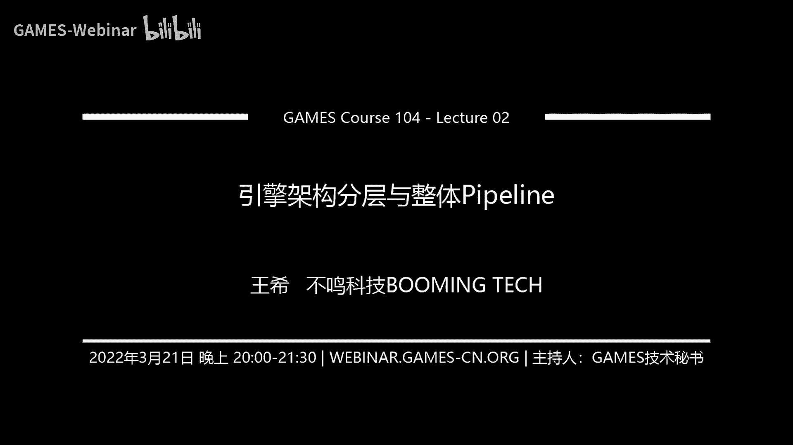
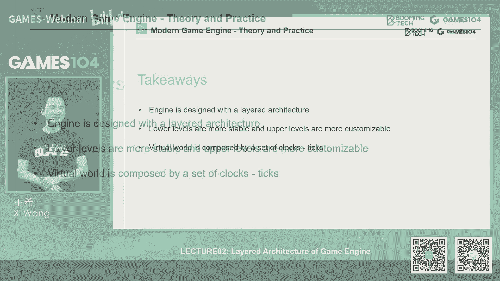
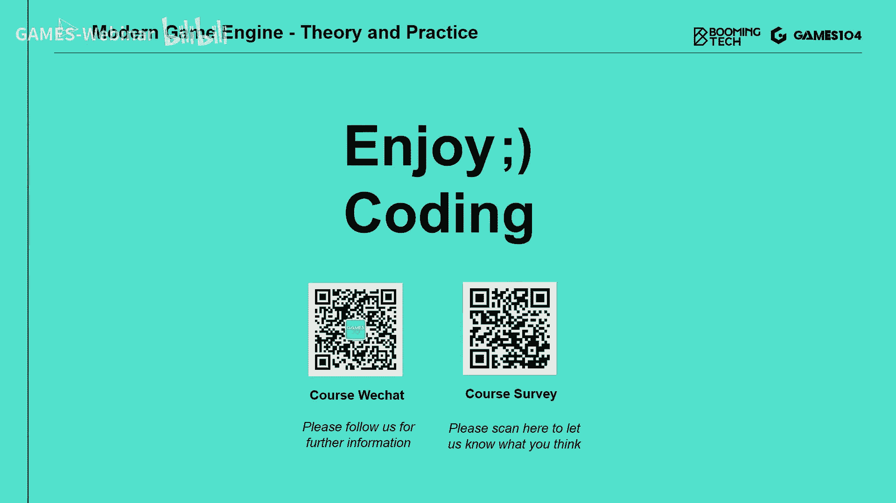

# GAMES104-现代游戏引擎：从入门到实践 - P1：0 - GAMES-Webinar - BV12Z4y1B7th

## 引擎架构分层

### 概述

在本节课中，我们将学习现代游戏引擎的分层架构，了解其核心组成部分以及各层之间的关系。

### 工具层

**概念**：游戏引擎的最上层，提供各种编辑器和工具，用于关卡设计、角色制作、动画制作等。

**示例**：关卡编辑器、角色编辑器、动画编辑器。

### 功能层

**概念**：负责实现游戏的核心功能，如渲染、物理、AI、脚本等。

**核心概念**：

* **渲染**：将三维场景转换为二维图像。
* **物理**：模拟现实世界的物理规律，如碰撞、重力等。
* **AI**：模拟智能行为，如敌人行为、NPC行为等。
* **脚本**：定义游戏逻辑和行为。

### 资源层

**概念**：负责管理和加载游戏资源，如模型、贴图、音频等。

**核心概念**：

* **资源**：游戏中的各种数据文件，如模型文件、贴图文件、音频文件等。
* **资产管理器**：管理资源的加载、卸载和生命周期。

### 核心层

**概念**：提供底层服务，如内存管理、数学运算、容器管理等。

**核心概念**：

* **内存管理**：高效地分配和回收内存资源。
* **数学运算**：提供各种数学运算功能，如线性代数、坐标变换等。
* **容器管理**：提供各种数据结构，如数组、链表、树等。

### 平台层

**概念**：负责处理不同平台之间的差异，如操作系统、硬件平台、图形API等。

**核心概念**：

* **RHI（渲染硬件接口）**：封装不同图形API，提供统一的接口。
* **平台无关性**：使游戏引擎能够在不同平台上运行。

### 工具层

**概念**：提供各种编辑器和工具，用于游戏开发、测试和发布。

**核心概念**：

* **编辑器**：如关卡编辑器、角色编辑器、材质编辑器等。
* **DCC（数字内容创建）**：如3D建模软件、动画软件等。

### 总结

现代游戏引擎采用分层架构，将复杂的系统分解为多个模块，每个模块负责特定的功能。这种架构使得游戏引擎易于开发、维护和扩展。

**本节课中，我们学习了游戏引擎的五层架构，包括工具层、功能层、资源层、核心层、平台层和工具层。通过了解各层之间的关系和功能，我们可以更好地理解游戏引擎的工作原理**。