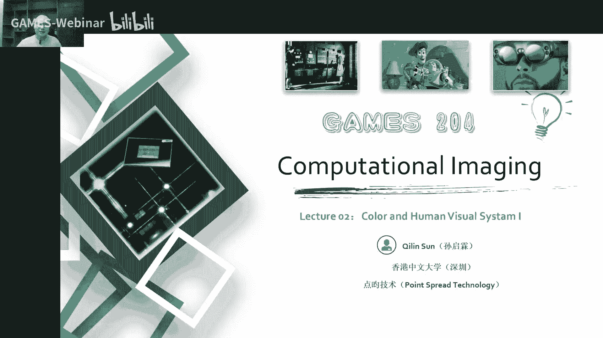
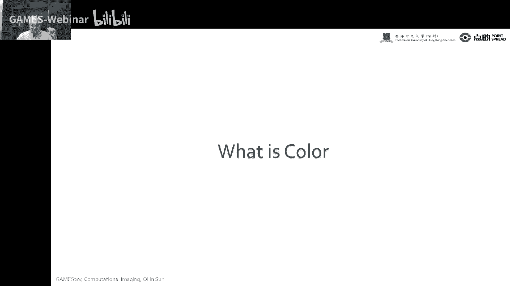
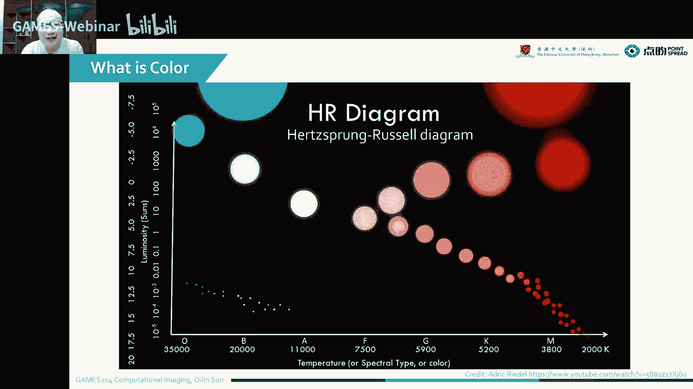
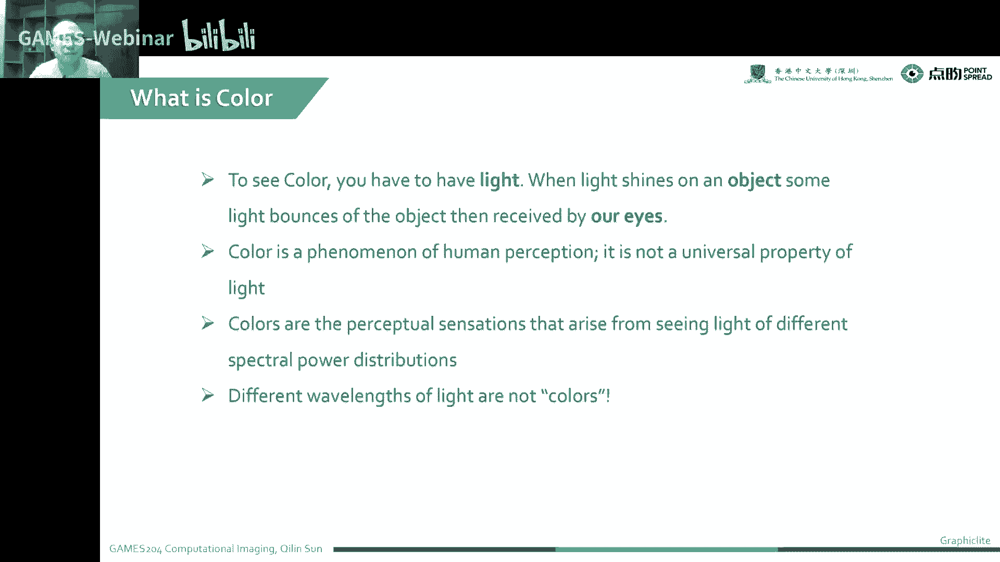
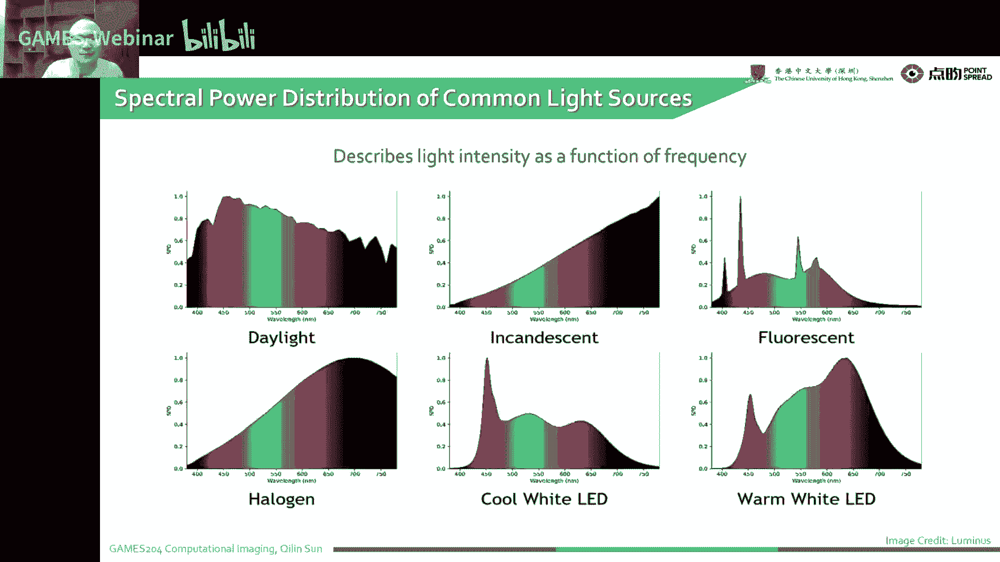
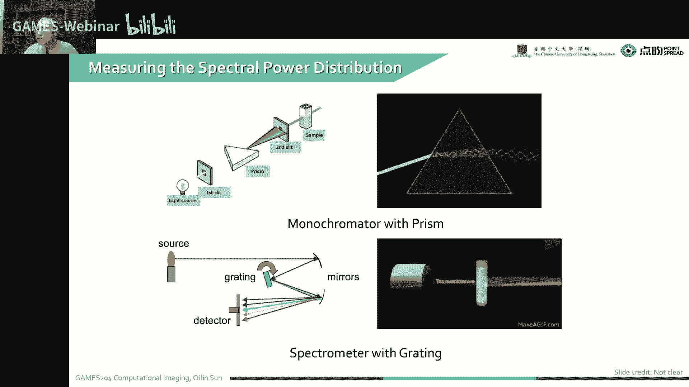
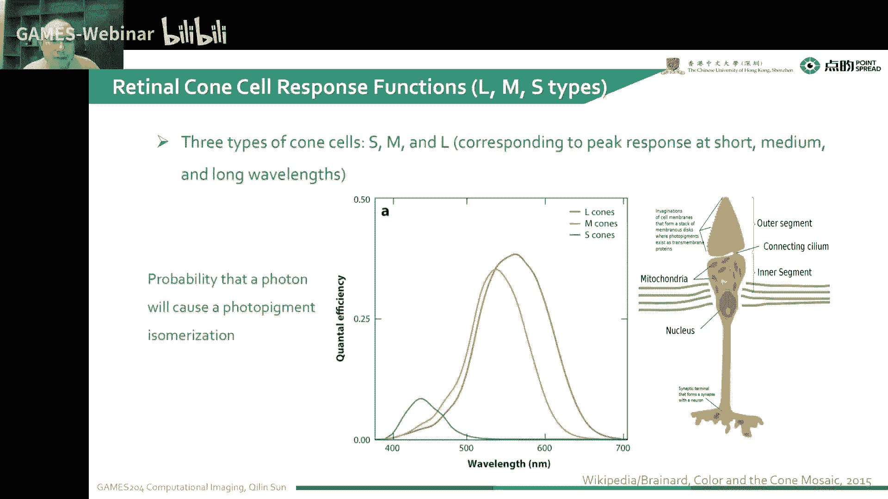
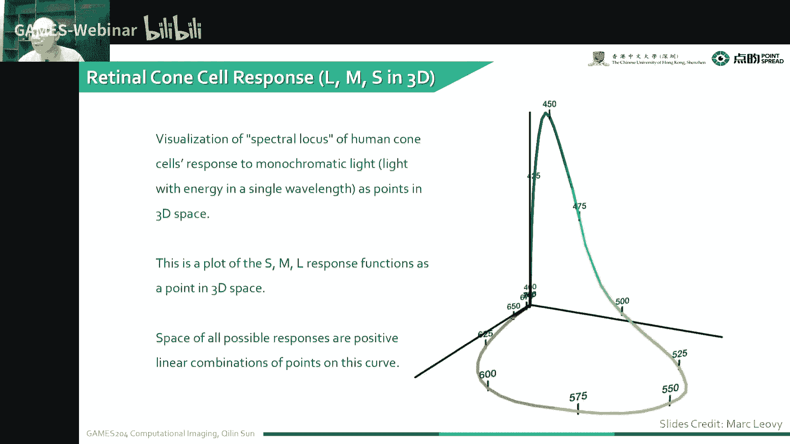
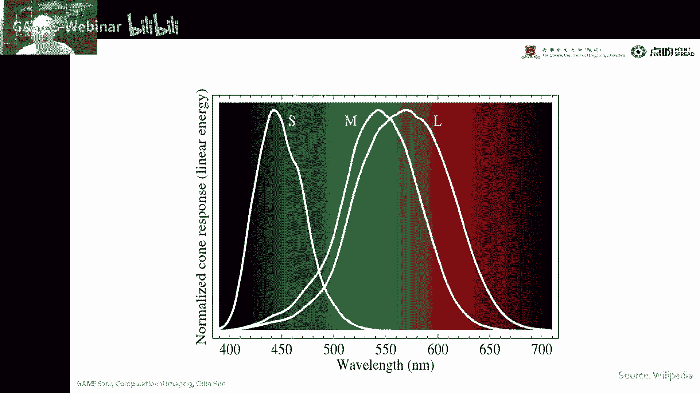

# 02.色彩和人的视觉系统(I) ｜ GAMES204-计算成像 - P1 - GAMES-Webinar - BV1ff4y1d7kq

8點了，同學們歡迎來到Games204計算成像的課堂。

今天發生了很多事情，包括像日本前首相安倍晉三遇刺，然後國務戰場上也發生了一些變化，但是這個都不影響我們同學們學習的熱情，今天的這個課程算是給我們做整個計算成像做一個鋪墊。

因為色彩跟人眼的視覺系統是非常重要的一套系統，在這個地方我們想給大家先分享一下，整個色彩是怎麼形成的，色彩形成的肌理跟color matching。

這個可能會跟之前前面的課程會有一些像圖形學的課程會有一些重複，但是這個是給大家重新梳理了一遍，就是開始告訴大家什麼樣是色彩，大家以前看到莫榮富經常打播別人的時候，就會經常聽到青山常在綠水長流。

咱們後會有期，這個青山綠水這種自然界的顏色都是怎麼產生的呢？而且因為彩色攝像與顏色是密不可分的，所以說對整個顏色的研究和成像是一個非常重要的問題，顏色可以對大自然來說是一個非常重要的組成部分。

但是它又不同於我們自然界的光譜，今天來給大家分享一下顏色。

上一節課就是沒有很注意到我們的課程實際上是一個小時，所以說之前的課程都是按一個半小時準備的，這次把每一節課拆成兩部分，來給大家去更詳細的講解一下這些知識，今天首先是給大家介紹一下什麼是顏色。

然後告訴大家一個顏色裡面非常重要的一個概念叫，Spectral Power Distribution，這個有一些同學可能學過，但是有一些同學可能沒有接觸過這方面的知識，然後其實非常重要的一點就是人眼。

Biological Basis of Color，就是人這個色彩跟人有什麼關係，它是怎麼樣被人感知的，我們人眼的感光細胞就是retina，就是攝望膜是如何跟光譜進行響應，然後最後產生顏色的感覺。

最後給大家說一下人眼的就是追撞細胞，是怎麼樣對這個色彩形成一個什麼樣的分佈曲線，響應曲線，這個很類似的就是像一個我們圖像傳感器中的，一個color filter array。

就是RGGB或是RYYC這種濾光片，這個人眼的濾光片又跟人眼的一個retina，跟這個濾光片又有什麼樣的關係，人眼有一個非常重要的性質叫meta rhythm，大家有同學可能學過這個叫同色異譜。

這個同色異譜是怎麼產生的，它又有什麼作用，今天這一課就給大家揭露整個顏色的感知，還有最後告訴大家一個人的color perception，就是人的對顏色彩的感知，包括我們的色調，Q，飽和度。

saturation，還有brightness，這個叫明度，本來這一節課是拆成了兩節課，其實這一節課先給大家透露一下下節課的內容，包括我們採集到圖像傳感器，採集到這麼一段積分過後的一個。

spectral biodescription之後，我們在我們的傳感器，在我們的一個顯示器上，是如何展示這麼一種顏色呢，因為我們的primary light，也就是基色是不同的，我們如何做這種匹配。

如何去計算，在下節課的地方會講到這些問題，包括一些基於線性代數的一些方法，還有一些suit geometry interpolation，下節課的重點就是講color space。

我們為什麼要講color space呢，因為我們各種顏色都需要有一個統一的方法去表示它，在不一樣的顯示器材，不一樣的一些成像器材，或者是顏色的一種標準化的表示。

都需要color space的知識來做一個基礎，最後告訴大家，Bi-Filter就是我們的綠光片，包括像我們的RGB綠光片，或現在還有一些多光譜的綠光片，它是怎麼樣產生一個什麼樣的曲線。

我們應該怎麼樣處理它，首先看到這張圖，大家會有一個比較熟悉的感覺。

這是一張就是大家如果是拍攝影，或者是拍一些其他照片，大家會有一個color check board，這個color check board是幹什麼用的呢，它就是每一個色塊裡面都有一個標準的顏色值。

這個顏色值在我的camera去拍它的時候，它會有一樣的RGB三個值的響應，當這個值的響應去跟這個標準的顏色值去匹配，就可以得到一個顏色的轉換矩陣，這個有同學問會講HDR嗎，這個會講HDR。

我們在Image Signal Processing這個Pipeline之後，會講到HDR的知識，包括像現在的HDR Fusion，或者是還有一個Tone Mapping的知識。

這兩塊來展示HDR的一個顯示，這邊當然回到這麼一個color這個問題，color這個東西到底是怎麼產生的呢，其實這個並不是大家所自然界所說的光譜，它是一個人感知的心理的過程，光源被觀察的物體和觀察者。

是形成顏色的感覺的三個不可或缺的一種要素。

再給大家舉一個例子，大家如果去過摩洛哥，就可以看到這個藍色小鎮，有一個非常漂亮的藍色的屋子的樣子，雖然說這個面積會比較小，大家剛開始看的時候還是比較漂亮的這種色彩，這種色彩是怎麼產生的呢。

下面就給大家揭秘這個色彩的一些產生，除了這個這是一張哈勃望遠鏡拍到的一張外星空的一些星雲，人眼是如何區分這些顏色，然後又是如何感知這些顏色，這個跟我們平時的顯示器，包括我們的打印機。

這個又有什麼樣的聯繫，先給大家鋪墊的一些問題來告訴大家，這是像左邊這個是一個標準的一個燈箱，他就是剛才講到我們的一個光源，觀察物體還有觀察者，這三個是產生顏色的一個要素。

左邊這個是一個標準的一個光源的一個燈箱，它會產生一個比較均勻的照明，然後整個光源又是一個標準的，比如說像第五零第六五的一個光源，在這種情況下去觀察這麼一張圖，就會得到一個它在這種狀態下。

一個比較標準的一個表現，就可以跟最後我們要比如說大規模部署的像雜誌，或者是一些海報都會有這種校色過程，然後大家也可以觀察到像我們的，在我們的屏幕上面，跟我們在打印出來的這麼一張圖。

它的色彩我們可以感受到在屏幕上面，它的色彩會更加艷麗，這個是又是為什麼，但是當我們打印到我們的紙上了之後，它的色彩就會顯得那麼灰濛濛的，下面來給大家講解一下什麼是顏色。

首先看到這張圖叫，Probe-Russell Diagram，這個橫坐標是一個它的一個溫度，就是在不同的一個溫度下表示的，這個是在開示溫度下表示的，從最右邊的2000K到左邊的35000K。

我們的縱坐標就是它的一個Luminance，就是它的一個，它這個是以一個太陽為標準單位，大家可以看到在下面這個是，中間這個地方，這個地方是一個標準單位，就是一個太陽的亮度。

當我的溫度就接近2000K的時候，就是溫度比較低的時候，也就是大家把那個，拿一個鐵把它燒到非常高的溫度，就產生一個紅色，就大概2000K，就是1000多度這麼一個溫度，它會產生出一個比較偏紅的那種顏色。

就是人眼觀察到是偏紅的顏色，當它溫度不斷升高，升到太陽這個溫度的時候，就會得到一個大概是6500K，這麼一個色溫，然後再不斷地升高我的溫度，當我達到11000或者是2000到3500。

它的這個發出的本身這個溫度，在這個溫度下物體發出的波長不斷變短，而人觀察到的顏色就不斷偏藍，就從低溫到高溫，就是由紅到變藍，它是隨著波長變化而變化的，但是顏色又不同於波長，這個時候我們就可以觀察到。

為什麼當這個爐子燒紅的時候，就會顯得變紅呢，這是一個黑體輻射的原因，就是當有一定的溫度之後，我們所有的物體實際上都是在發光的，我們包括即使你在一個全黑的夜晚，你看到的物體它基本上都是在發光的。

只是這個光它的一個波段，跟我們人眼觀察到的波段不是很一樣，比如說人體的溫度差不多是36。5度，在一個全黑的環境下，人會釋放出紅外線，這個波長大概是9微米到11微米，這個可以通過一些儀器感測到。

但是人眼是觀察不到，感知不到這個能量和顏色的。

現在給大家說一下，到底什麼是顏色呢，就是剛才講到光源被觀察物體和觀察者，是形成顏色感覺的三要素，顏色是光作用於觀察者的視覺系統，然後產生一系列的複雜的生理活動，跟心理活動的綜合效果。

也就是說每個人看到的顏色都是不一樣的，它跟這個人的眼睛的精妝，就是那個視網膜，還有人的一些認知都會有區別，就是顏色跟嗅覺味覺其實是一樣的，是在一些外界作用的一些刺激下。

然後在觀察者的一些大腦中的一些認知，怎麼定義這個顏色呢，就是光作用於人眼引起空間屬性以外的視覺特性，也就是說我們的眼對光線的刺激，會產生一些生物電流，這些生物電流會傳遞到大腦。

大腦然後對這些生物電流進行加工處理，包括形成了顏色感覺的在內的一些視覺。

在自然界我們可以觀察到的一些電磁波的波段是非常大的，從一些comic streak rate到γ射線，再到x射線到紫外，再到我們的可見光，我們的可見光是一個比較短的這麼一段波段，然後就會到了一個紅外。

還有微波，在遠紅外跟微波之間，又會存在一個非常神奇的波段叫太赫茲，太赫茲其實它既具有光的性質，又具有電磁波的性質，又有一個非常寬的一個波段，這個就會產生一些非常奇特的光源性質。

太赫茲成像目前在我們的一些生活生產應用中已經得到了應用，比如說像我們像安潔，太赫茲就可以對人體沒有損傷到這些安潔，但是像x射線就會產生一些比較不好的輻射效應，然後再長了之後就是微波雷達。

雷達波然後再到一些廣播的長波的，甚至是水下的長波的波段，人眼本身大概可以看到的一個範圍，大概在380納米到780納米之間的電磁波，但是本身顏色和波長的關係並不是完全固定的。

光譜上其實有三個點是在人眼的觀察下顏色不變的，包括572納米就是一個比較偏黃的一種顏色，還有503納米還有547納米，這三種顏色就是在亮度變化的時候，就是你觀察的顏色是固定的，但是其他的顏色。

比如說像這個660納米的紅光，投射到視網膜的時候，當我們把這個光強的值降低到以前的1/2的時候，想要產生相同的顏色的感覺，就必須減少波長的差不多有30個納米，才能保持原來的色調，其實這個我們可以理解。

越短的一些波，它會有一些更強的能量在裡面，所以說這個時候，當然這個也不是特別好解釋，這是一個比較複雜的過程，但是就有這麼三個點，它的亮度變化之後，人對顏色的感覺是不變的，除了剛才所說的紅色以外。

比如說像我們綠色光，比如說525納米的綠色光，在相同的條件下，就是我要降到我的亮度值，能量值的1/2的時候，我想要觀察到相同的顏色，我需要增加波長20幾納米，才能感受到一個相同的顏色。

這種顏色隨著光強度變化而變化的現象，叫做貝楚德普克爾效應，如果一片可見光頻譜，可以轉化成RGB數值嗎，這個我們可以給一段響應，比如說我們對RGB的響應，然後把這個可見光的頻譜，在這個響應範圍裡面做積分。

就可以拿到我這個RGB的值，但是我這個RGB的響應曲線，要先定義好，最後其實就是顏色自己，與色彩感覺，並不是一個簡單的因果關係，它是一個非常複雜的生理跟心理的過程，所以說大家現在，所有的手機大廠。

大家為什麼要調教，我最後拍照的一個效果，其實這個調教的人並不是技術人員，而是有一些心理學家，去調教顏色這個問題，從而讓人感覺到一個更有愉悅的感覺，下面給大家講解一下。

Spectral Power Distribution，就是我的這個怎麼翻譯呢，通常它是縮寫為SPD，它的意思是什麼呢，就是我的這個能量，在一個單位的一個面積上，然後單位波長，我們可以看到M(λ)=φ。

就是Luminous，也就是Radiance Extents，在一個單位波長，還有單位面積上的這麼一個值，它的一個單位就是，Units per nanometer，也就是瓦每納米。

但是有些時候大家也會把這個事情，叫做Unitless，我們忽略它的單位，其實這個並不是很重要的單位，我們通常就是我們要展示的這個，Spectral Power Distribution的時候。

通常我們會想要用一些，皈依化的這麼一種表示方法，我們會選取一個最高的點，然後去把它皈依化，這樣來顯示出來，讓大家容易看一些，我們不同的，其實整個要感知到視覺，光源是一個非常重要的一環。

就是光源被觀察者物體，觀察者我們剛才講到，整個色彩感知的三要素，光源產生了一些不一樣的光譜跟能量，這個時候打到物體上，然後再被人眼感知到，但是不同的一個光源，有不一樣的頻譜分佈。

比如像這個日光Daylight，它就會有一個比較均勻的，一種光譜的分佈，還有像Incandescent這種Light，這個就是白石燈，紅外跟紅色光會比較多，有一種就是以前大家小時候用的那種燈棍。

這叫螢光燈，螢光燈算是什麼原理呢，我是產生一些紫外光，紫外光然後去激發這個螢光，表面我的這個燈棍表面塗一些螢光粉，我用紫外光激發這個螢光，然後去產生一個可以照明的一些可見光，這種就會因為整個螢光的光譜。

就是分佈會比較集中，有幾種散發一些比較集中的能量，這個時候它的照明效率是比較高的，還有像下面的Hologram，還有像冷光源的LED，還有暖光源的LED，這個就是材料跟摻雜的不同。

就導致整個LED光譜的不同，冷光源大家買LED燈泡的時候，比如說到一個超商去買燈泡，可以看到3500K、4500K、5500K，有的還有暖光源就6000、7000K的，越暖的光就會越偏紅。

越冷的光就越偏藍，但這個暖光其實對人眼的傷害會小一點，但是冷光會顯得比較白、比較亮，我們光源發出的光譜。

來舉個例子，上面這個是200W的一個日光燈，我們可以看到它的整個譜帶是比較均勻的，當我們用一個棱鏡或者是光纖，把這個光譜去打開，我們可以看到它整個光譜是比較連續的光譜。

這個Pixel就可以理解為不同的顏色光譜，這個是用一個EV的光纖或者是Preserve，去把這個顏色散開，大家可以理解為橫軸，就是一個光譜的分佈，不同的波長，但是我們可以看到像這種CFL這種光。

就是它在各個波段，像汞啊或者是其他的一些元素，這個時候就會產生它自己對應的一些光的譜段，這個時候就是它的能量效率比較集中的，除了剛才講到的一個發射譜。

還有一些吸收譜，我們很多的一些物體，它本身是自己不可能發出我們人眼看到的可見光的，這個時候就需要光源照射到物體，然後這個物體反射到人的眼睛裡面，這個時候就會有一個概念叫吸收譜。

這個吸收譜也是一個隨著光頻率變化的一個函數，大家可以看到就是左邊這張圖，它就是一個右邊這張圖的一個平均的吸收譜，也就是說我們這個藍色跟紅色吸收的會比較多，但是這個綠色就基本上不怎麼吸收。

最後大部分反射光就是綠色，人眼觀察到的就是那麼一種綠色，這個吸收譜在我們打印的過程中是比較重要的，因為我們觀察到的就是被反射過來的光，我們要打印的材料就是一種吸收譜的一種。

說到吸收譜就不得不說一個Spectral Reflectance，大家經常做到像多光譜成像的時候，我們拍攝到一個多光譜成像有非常多的譜段，就是不同於RGB三個通道，我多光譜的相機或是高光譜的相機。

可能會有幾十個或是幾百個上千個通道，這個時候就大家直接拍到自然界裡面一個物體的時候，我們拍到的是它一個光譜的一個響應，但是考慮到光源，就大家會在整個我拍攝的視野裡，比如放一個白色的小參考的一張小塊。

然後這個地方是監測到我背景照明光的一個光譜，我的這個捕獲到的光譜響應，在處於這麼一個光源的響應，就可以拿到Spectral Reflectance，也就是光譜的一個反射，包括像可見光的近紅外的。

還有中紅外的都會有一些應用，比如舉個例子像這種石油的勘測，它的整個光譜比如在中紅外，近紅外的地方，它的一個reflectance就比較大，但是在一些像可見光的波段，它的反射就會比較小。

再舉個例子比如說水，水在一個可見光的波段就會有一定的反射率，但是到了紅外的一些波段，基本上就是吸收的非常嚴重，也就是說為什麼我們看到的一個水，會是一種偏藍的顏色，就是大概是在480納米左右。

水的一個透過率是最高的，所以說最後大家看到的一個水，就是把其他顏色都濾掉了，然後最後觀察到一個藍色，這也就是很多水下成像需要用主動照明的時候，通常會選擇480或者是532。

藍綠色的吸收不多的顏色來做照明，然後我們這個SPD。

就是Spectral Pilot Distribution，是怎麼觀測它呢，通常大概最早，然後同學們都是用一個Preserve，就是一個棱鏡來觀測到這個，我們可以看到右邊，一個白光打到一個棱鏡上。

就是因為不一樣的波長，對一個相同的材料來說，不一樣的波長它的折射率會有變化，折射率會有變化就是，我最後我入射的，我們可以由Snes Law來確定，就是不同相同的一個光，不一樣的折射率。

最後它的入射角相同的時候，折射角是有變化的，這個時候就會有把顏色就會散開，經過兩次的這麼一種折射，顏色就會散得比較開了，然後我們通常是用一個光源，然後前面放一個窄帶的這麼一個狹縫。

然後再通過狹縫就是一個移速線光，到了這個棱鏡上，棱鏡再通過兩次的色散，最後再通過一個橫著的狹縫，然後大家就可以測到這麼一個，不一樣位置的這麼一個光譜，然後現在就是技術會變得比較好了。

大家會有一些閃耀光栓，有光栓大概有透射式光栓，有反射式光栓，閃耀光栓就是其中一種反射式光栓，我的光源達到我這個透鏡，然後有這種反射式光栓，光栓就可以比較好的，比較均勻的把這個光譜散開。

大家可以看到下面這張圖，就是整個光譜散開的一個過程，本身這個光源分配它是一個線性的過程。

這個slide是從NG，本身我們可以看到，比如說這個藍色的一個球，經過一個spectral meter的時候，我們發現它的一個不線響應，就是這麼一個分布，然後一個黃色的呢，它的波長會長一些。

然後把這兩個同時通過，用這個spectral part，那個radio meter去測它的時候，最後發現它的結果，實際上就是一個簡單的線性疊加，當我們考慮整個發光的光譜和反射的光譜，是如何作用的。

我們把這個光的一個頻率，記為μ，然後光源發出來的一個spt，我們可以記為fμ，然後本身我們的一個物體表面，的一個反射的一個spt，可以記為gμ，就是反射譜可以記為gμ，那最後它的一個結果。

就是一個簡單的相乘，這個時候大家，比如說尤其是這種多光譜測量，或者高光譜測量的時候，有一個白色的參考光，就白色的一個參考的小白塊，我拍到它，就可以測到我整個光源的。

這麼一個spectral part distribution，然後我在用我的相機，就多光譜相機，去拍攝這麼一個圖像的時候，就可以把這麼，然後結合之前測量到的一個光源的光譜，就可以把我的反射譜拿到。

但是這個顏色本身是比較複雜的，如何複現這個顏色，也是一個非常困難的這麼一個問題，因為不一樣的人眼觀測者，顯示設備物體，都會產生不一樣的一種顏色的感覺，如何精準地去複現這種顏色，尤其是對顯示領域。

是一個非常有挑戰性的東西，下面就給大家先分享一下，人眼的視覺到底是怎麼形成的，我們的生物的一個視覺是怎麼形成的，首先說一下這個人眼的一個，是怎麼一個形狀，就是人本身像相機一樣，人有一個瞳孔，就是啪啪。

但是在相機裡面這個就是孔蘭，然後我們有一個透鏡，也就是晶狀體，再後面是玻璃質，這個就是一般的介質，然後再往後，就是我們有一些攝網膜，攝網膜上面有不一樣的細胞，有追撞細胞，就是像一個比較長條的一個錐子。

這個是對一些暗視覺比較敏感，還有一些像那個，感狀細胞對暗視覺比較敏感，還有一些像追撞細胞，我們有三種追撞細胞，分別是RGB三種顏色，感狀細胞的分佈，是遠遠多於追撞細胞的，然後我們整個眼球。

這個地方有種叫，Fovea Central也就是黃斑，黃斑也就是人眼睛，就盯在哪裡看，那個中心的地方就是黃斑，黃斑它裡面的一個視覺，就是感光的神經細胞，是最密集的，也就是說人中心視野的，你盯在哪看。

你那個地方的一個分辨率，就是視覺是最好的，大家可以盯著屏幕看一下，你視野中心，你注意力集中的地方，那個地方是完全清晰的，實際上你邊緣的一個，就是看到的東西，是比較模糊的，也就是說為什麼人眼的像素。

說高也很高，說不高也不高，但是為什麼人眼能看那麼清晰呢，就是有一個，這麼一種注意力機制，就是我的中心黃斑，我的一個視覺是非常好的，但是我一些邊緣的視場，就會變得比較差，除了這個呢。

還有一些像optic disk，它是一個盲點，就是我視神經傳導的一些地方，這個地方是盲區，大家如果有興趣的話，可以找找你自己的盲區，在什麼地方，因為人眼是一個單透鏡的系統，這個單透鏡就難以避免了。

就很難去做到一個，就是比較大的一個視場，就是我視角比較大的時候，我這個邊緣的一個相智，是很難保證的，人眼本身就是大自然的，巧奪天工的一個精巧設計，就我設計的這麼一個人眼鏡，就是中心視野是最清晰。

邊緣是模糊一點，但是人眼又是怎麼樣，感知到這個色彩呢，首先說一下這個，photosensor的response，就是我們輸入的當然就是一些光，就有一些。

spectral power distribution的一些波長，然後我們最後本身的，我們的接收的傳感器，也就是我們的視網膜細胞，就會產生一個響應，就相當於在我這個響應下面，做一個積分拿到一個數值。

然後通過視神經，就是進行光電轉化，拿到一個生物電的一個信號，本身光譜的一個響應的方程，它是對一個，本身是對波長敏感的，不是渲染方程，而是光譜響應的一個方程，更大的一個，比如說我們響應更強。

就是對一種波長其實就是更敏感，那最後我，比如說有一個響應函數，f lambda，然後還有一個輸入的光譜的密度，我在一個R通道，就是紅色的一個通道，得到一個這麼一個積分，就拿到了這麼一個數值。

也是大家剛才那個同學，問到一個RGB是怎麼產生的，然後總結一下，大概有六個步驟，光源發出具有一定功率密度的光線，光線接觸在物體表面的時候，一部分被吸收，一部分被反射，反射過來的光，這種進入人眼。

這個反射過來的光，有一定的一個SPD，就是功率密度譜，通過一個晶狀體的一些折射，然後聚焦到我們的攝網膜上，然後經過感光細胞感受，感受到生物電，經過積分，就拿到在不同的一個追撞細胞進行積分。

就可以拿到我們不一樣的一個顏色的值，這個就會轉化成神經信號，給大腦感知到，然後經過心理跟生理的過程，就可以看到顏色，這個說到視覺，就不得不提到人的兩種細胞，一個就是肉子，也就是感狀細胞。

然後還有一個就是Cones，就是追撞細胞，感狀，這個感狀細胞，就是在人眼中是分佈是比較多的，大概有120萬個感狀細胞，也就是1。2億像素，也就是以前大家經常會看到新聞，就是人眼應該有過億像素。

這個它的響應峰值在什麼地方呢，就是人的感狀細胞，這個是沒有顏色的，大概在500納米的時候，它的響應是一個峰值，這就是Aesthetic Vision，就是暗視覺，然後本身的追撞細胞，是一個對量視覺。

Fotopic Vision，量視覺響應的一個主要細胞，它的一個分佈也就是，大概600萬到700萬的，這麼一個追撞細胞在人眼裡面，也就是說人眼能感知到色彩的一個像素，大概就只有六七百萬像素。

這些追撞細胞，它的一個響應，中心在555納米，這是它的峰值，不同的這種追撞細胞，就會產生不一樣的一個，Spectral光譜的一個響應，這個時候就會產生這種顏色，剛才說到我們可以看到。

這整個我們不一樣的一個細胞的分佈，我們看到人視野中心的時候，在黃斑的地方，我的這個感狀細胞的分佈，是非常密集的，稍微增大一點視場，這個追撞細胞是非常密集的，稍微增加一點視場，追撞細胞的數量下降。

感狀細胞變得更密集，到了最邊緣的視場的時候，這個基本上它就是感狀細胞的傾向，我們可以看到，這整個不一樣的細胞的分佈，大家如果注意觀察到，左邊這張圖可以看到，人的細胞的分佈。

跟本身規則排列的RTGB的Pixel，是不一樣的，人眼這個細胞排列，是有一個自由化的過程的，如果大家同學們學過噪聲的分佈，就可以知道有什麼粉紅噪聲，有白噪聲，然後這個人眼的這種分佈，就叫藍噪聲。

這個藍噪聲這種分佈，對我的信號的採樣，大家學圖形學，應該會對藍噪聲比較熟悉，藍噪聲的這種分佈，可以拿到一個比較優質的，這麼一種採樣的過程，我在我相同的像素下，可以拿到一個更優的，這麼一種採樣的結果。

也就是說我更好的一種圖像，這個給大家說一下，這個，人的一個攝氏細胞，大概就在幾微米一個量級，大概跟大家的一個ASPC畫幅的，這麼一個相機的一個像素大小差不多，它的反光能力就跟面積相關，說到人追撞細胞。

是如何感覺到顏色的呢，其實追撞細胞有三種，就是分別是Short Medium Long，就三種，然後每一種都會有一種，不一樣的這種光波響應，大家可以看到中心這張圖，這個就是不同追撞細胞。

產生的一個顏色的響應，這個你看到藍色，綠色跟紅色，這麼一種響應的過程，其實這種結構，就是追撞細胞的結構，通過我們觀察到，它大概就是像一個樹一樣的這種結構，這是一種可以說是，比較高階的超表面的技術吧。

就是三維的超表面的技術，可以對一些光譜進行濾波或者是反射，然後能通過我們這麼一個濾光器的東西，這麼一種結構的濾光片，就會達到感光神經，然後其他的光就被盤出去了，然後通過有三種這種追撞細胞，它的常暖不一。

這種結構 歸納結構不是很一樣，就可以產生這種三種顏色的響應。

通常人們就是喜歡把這些東西去規劃，我表示的時候把它規劃就可以了。

然後Stanford的Mark Lowey老師，就畫了右邊這麼一張圖，就是它是把整個響應，做成一個三維的這麼一種分布，就相當於做了一個查找表式的一張圖，然後這個包括它的一個強度。

這整個信息全都包含在這麼一個，LMS這個響應曲線裡，所以說我們空間中，所有可能的一些響應，都是在這裡面的一個，就是整個三維曲線中的一個，直的一個線性疊加，通過這麼一張圖我們就可以產生，在這個正空間裡面。

基本上所有的顏色，說到人的一個視覺系統，其實由多種波長混合而成的光，其實擁有非常多的自由度，因為我們最後能觀測到的一種響應，就是我功率密度譜，根據我的人眼的LMS曲線，去積分的過程。

也就是說這是一個光譜積分的過程，光譜積分就是把我多維度的，這麼一個功率密度譜，然後在攝網膜上積分成三個通道，也就是積分為一個，就是LMS就是RGB，大概這麼一種三維的信號，然後這種功率密度譜的積分。

實際上是丟失維度的，也就是它是一個從高維度，到低維度的一個映射，這種映射其實我們反過來看，就是我有一個積分過來的值，我們是不是可以反向的去找到，非常多的一種組合呢，這種就導致了一種現象，叫同色異譜。

叫meta-rhythm，這個大家在圖形學裡面應該學過，就是擁有不同的功率密度譜，或者是不同光譜的兩束光，我們看起來其實經過人眼的一個，響應曲線積分之後，就可以看到一個相同的顏色，因為從高維到低維。

它的映射必然會出現一個，多對一的一個現象，就是不一樣的光譜積分過去之後，拿到一樣的值，但是我們看到一種顏色的時候，我們就沒有辦法反向的，來確定一個入色光的光譜，這個時候說是一個好事，也是一個好事。

因為這個為什麼呢，這個就會對顯示裡面就變得簡單，大家可以用混色的原理，不一樣的光譜，去把這個色彩以比較低的成本，去展示出來，下面就給大家分享一下，這個meta-rhythm，就是同色異譜。

同色異譜叫meta-rhythm，怎麼定義呢，就是兩個不一樣的光譜，在這個lms取線積分之後，可能會有不一樣的光譜，來得到同一個響應，也就是說兩個光，然後最後我的視覺的感受是一樣的。

這個原理對一個顏色的一個複現，是非常重要的，大家剛才講到，我們想要得到一個比較低成本，一個漂亮的顯示器，這個同色異譜就起到了，一個非常重要的作用，我們去研究它如何科學的混色。

然後一個接近於自然顏色的色彩，所以說現在大部分顯示器，都是通過3D色，通過控制這個基色的強度，來進行混色，然後拿到一個比較好的，這麼一種展示的效果，我們今天用到了大部分的顯示器，顯示設備包括像打印機。

都是要感謝這個同色異譜的原理，要感謝人眼，其實這種很精巧的一個設計結構，這個本身這個同色異譜，是一個非常重要的現象，這是我們展示了，四種不一樣的光譜，但是最後會產生同樣的顏色的感覺，比如當這第一幅積分。

第二個就是三個單色光去混色，然後產生同樣的感覺，然後不一樣的光譜，最後積分結果是一樣的，這個時候就會有非常重大的應用了，最早的一些color matching，就是顏色匹配這些實驗，是怎麼做的呢。

可以看到我們有一個觀察者，選一個正常的人，就是沒有色盲的一些人，色盲是咋回事呢，說到色盲，可以提一下，比如說我們有三種追撞細胞，他們大概可能是有一種追撞細胞失能了，這個最後就會導致色盲的一種現象。

當然也有可能是一些心理的過程，這個就比較複雜了，我們如何去觀察這麼一個color matching，就是我有一個測試的公園，右面有三種顏色，我通過不斷的混色，然後讓觀察者去觀察，直到這兩個顏色。

我調不一樣的光源的光域，直到這兩個顏色區分不開為止，就可以拿到RGB三個值的value，來混色出我測試光的這麼一個顏色，比如說像左邊這麼一個測試光，我用一個三種顏色來去混它。

這個時候我們這個藍色給多一點，這個綠色給第二多，右邊這個就是P1給多一點，然後藍色給少一點，然後繼續調整，我們可以看到，再繼續調整，增加一些綠光量，右邊這個把這個綠減掉，最後經過不斷的混合。

我們可以看到左右兩邊都同時拿到了，兩種相同的顏色，我們可以拿到RGB三個混色的值，有一個奇怪的現象，大家可以看到右邊有一個negative的值，它的綠色光是負的，這個負的是咋回事呢。

超出了我這個三個顏色的色域，後面下一節課我會講到色域的過程，超出這個範圍之後，整個的色域就沒有辦法去表達了，需要一些複製去表達它，所以在我們選顯示器，選基色的時候，選色域的時候就非常重要。

當我們的顯示器，顯示一些超出我們色域的東西的時候，這個顏色就會產生難以匹配到，就沒有辦法匹配到正常人顏感受的顏色，這時候顏色就會發偏，CIE是怎麼測試的，它是用三種單色光來去測。

這麼一個color matching的experiment，這個是CIE的一個RGB的primary light，就是基色的一個標準，就是不一樣的人眼的一個響應，大家可以看到這個藍綠紅。

紅色的地方就會有一些負的值，就是我們沒有辦法對這個超出色域的東西進行表示，這就是剛才大家可以觀察到的，為什麼會有這麼一個負的值，但是我們要注意。

這張圖它是一個color matching的curvature，不是響應的curvature，或者是一個primary spectral，這張圖只是反映這三個顏色混合的值的分布，然後有一個非常重要的事。

color matching的experiment是線性的，剛才做混色實驗的時候，也講到它是一個線性疊加的過程，非常簡單，直接疊加就可以拿到最後的結果，這個顏色又是如何被感知到的呢。

這有三個不得不提的東西，就是Hue， Saturation， Brightness，顏色可以大概分為彩色和非彩色的兩種標準，彩色就是大家常見的赤橙黃綠青藍紫，非彩色比如說黑白灰大概就是這種。

但是如何表達人對顏色的感知呢，就是通過Hue， Saturation， Brightness，也就是大家說的色調，飽和度，還有明度，明度不是亮度，色調是什麼呢，色調是我們人的眼睛對物體呈現出顏色的感覺。

這個色調的數目其實是非常多的，Hue大概有個一千多萬種，人眼大概可以分辨出來三百到四百種色調，當然這是專業的顏色藝術家可以分辨出來的，正常人沒有經過訓練是難以分辨的，飽和度是什麼呢。

飽和度叫Saturation，這個就是刻畫我這個顏色的純潔程度，表示這個顏色純不純，這個光純不純，所以說白色的飽和度非常低，整個我拿到的圖像，它的頻譜分佈越均勻，也就是頻譜越寬，它的飽和度越低。

反過來光的譜帶越窄，顏色的飽和度就越高，第三個就是說明度，明度其實它不是亮度，明度是人的一個主觀的感覺，但是它這個跟亮度，其實人們通常表示的時候，就通常用亮度的一個輻射功率單位去表示它。

但實際上它並不是亮度，它主要就是一個感覺，色度飽和度明度這三個屬性，就會給人最後的一個視覺感覺，當然也會出現剛才大家所說的一個，同色異譜的現象，如何描述這麼一個現在的色度學呢，通常大家用格拉斯曼定律。

還有格拉斯曼有四條基本定律，第一條定律就是說，兩個顏色表現的不同，就是因為什麼呢，也就是說這句話的意思就是，人眼就只能對明度色調跟亮度，就明度這三個變化來感知顏色，然後第二條定律說的是什麼呢。

就是兩組成分在混合混色的過程中，透過一種顏色的光譜連續性的變化，整體混合出來的顏色，變化也是連續的，第三個定律是什麼呢，第三個定律就是顏色外貌相同的光，不管他們的光譜組成是不是一樣。

在顏色混合中它具有相同的效果，這個我們就可以說出，但凡在視覺上我們看到的顏色是相同的，它都是等效的，剛才大家說的一個方向，Metarism也是這麼一個東西，凡是視覺上感受相同的顏色，它就可以相互去替代。

最後一條，也就是說當我們混色的時候，它的顏色叫亮度相加定律，這是一個線性的過程，也是一個叫Albeniz law，今天就給大家分享了整個顏色，什麼是顏色，然後顏色的光譜響應，人眼是如何感受到顏色的。

通過人眼這個顏色的性質，因為它是一個從高維到低維的映射，就會產生同色異譜的效應，同色異譜的效應可以拿來混色，去做一個顯示的作用，最後給大家分享了一個，整個顏色是如何感知的，包括人眼的Hue。

 Saturation， 還有Brightness，下節課會給大家繼續講一些，比較深刻的顏色認識，包括我們的顯示器是如何複現這些顏色，包括我的顏色會如何通過，先行再述的方法去重現這些顏色。

也可以給大家提一些，Pseudo-geometric interpolation的一些知識，最後給大家分享一下Color Space，還有最後我的圖像傳感器，它的光譜的響應，是怎麼樣搞到這個視波器上的。

謝謝大家，大家有什麼問題可以詢問，請不吝點贊，轉發，打賞支持明鏡與點點欄目，因為這個色彩本身是比較神奇的一個東西，這個大家最好理解深刻一點，因為整個顏色會有一個專門的學問叫色度學。

它是一個比較龐雜的系統，下一個課程會比較涉及一些數學知識，這個時候就是我這個不一樣的光譜，最後我們去匹配它去把這個顏色複現出來，這個時候就會有一點問題，感光的過程可以給大家講一下，顏色的書。

我記得以前學過一個應用光學，我不記得裡面有沒有講這個事，作業現在還沒有，因為第一個作業是我要講過整個圖像的處理過程，才會佈置第一次作業，有作業，大概我們這個課會有五到六個作業，Projects。

給大家分享一下這個人眼感知顏色的一個過程，大概就是六個一個過程，外UV通電的讀到亮度跟色彩其實是比較分開的，色度學只涉及可見普遍，基本上就是完全根據人的眼睛的一個小應來說的。

這個沒必要了解太透，這兩節課覆蓋到的一個顏色的知識已經足夠大家用了，這個人眼的感知過程是怎麼回事呢？大家可以看到左邊這個slide，首先我們的光源會發出一個有一定功率密度譜，就是SPD的光線。

這個光線作為照明，然後打到物體上，物體表面會有一部分被吸收，然後另一部分被反射，被反射的東西最後進入人眼，反射的東西也會有一個SPD的功率密度譜，這個經過聚焦到人的視網膜細胞上。

這個視網膜細胞會反射光的功率密度譜，有三個LMS三個響應曲線，這三個響應曲線分別對這個功率密度譜進行積分，就會拿到一個三個值，三個值就是人眼的一個顏色的響應，這三個值會產生不一樣的生物電的信號。

這些生物電的信號就被視神經傳到大腦中樞，最後就可以經過一些心理過程，就會使人看到一些有顏色的圖像，這個作業最後是會在註冊的那個，註冊那個類似Blackboard的網站上面，有個課程的一個網站上。

大家可以從官網進到課程裡面，註冊之後就可以找到作業，最後答案也會在那個作業系統裡面去發放，關於這個Moses這個同學說的YUV通道的獨立性，這個跟還不是很一樣，色度值採用的增強方法。

這個這塊好像還真沒有研究過，這個之前研究過很多像HSV的這麼一個，HSL跟HSV，這個HSL跟HSB就剛才講的，Q， Saturation， Blackness是一樣的，這個HSV呢。

這個V是Value，又不是一回事，這個Value就是它的強度，這個強度跟這個明度是比較近似的，但是實際上它又不是一回事，這是一個比較簡單的解釋，這個Value是一個比較簡單的解釋。

它是一個比較簡單的解釋，它是一個比較簡單的解釋，它是一個比較簡單的解釋，它是一個比較簡單的解釋，它是一個比較簡單的解釋，它是一個比較簡單的解釋，它是一個比較簡單的解釋，它是一個比較簡單的解釋。

它是一個比較簡單的解釋，它是一個比較簡單的解釋，它是一個比較簡單的解釋，Camera跟Eye的原理還不是特別一樣，這個Camera本身就大概比較類似，基本上都是一個鏡頭加一個傳感器。

但是Camera基本上都是比較規則的排列，人眼的整個像素的排列，還有一個注意力的機制，包括不一樣的像素密度的分佈，是不太一樣的，所以說現在其實這個手機的多色融合，比如說一個黑白的，然後去融合一個彩色的。

去對彩色的存在增強，這個就跟人眼有點類似了，這個同學問的是什麼意思，知道一個主要是彩樣的，一個主要是彩樣的，一個是調色的，穿白色衣服顯泡，這個可能得問一下美術老師，這個還不一樣，這個HSB基本上。

它只是對人眼的這麼一種響應，HSV它是一個色彩空間，就是它的概念不太一樣，也不是說調色用的，它是一個色彩空間，就是它的概念不太一樣，(音樂播放)，(音樂播放)，這個又超時了，不好意思同學們。

今天的課程就到這裡，感謝同學們的觀看，歡迎大家繼續關注Games。

謝謝大家。