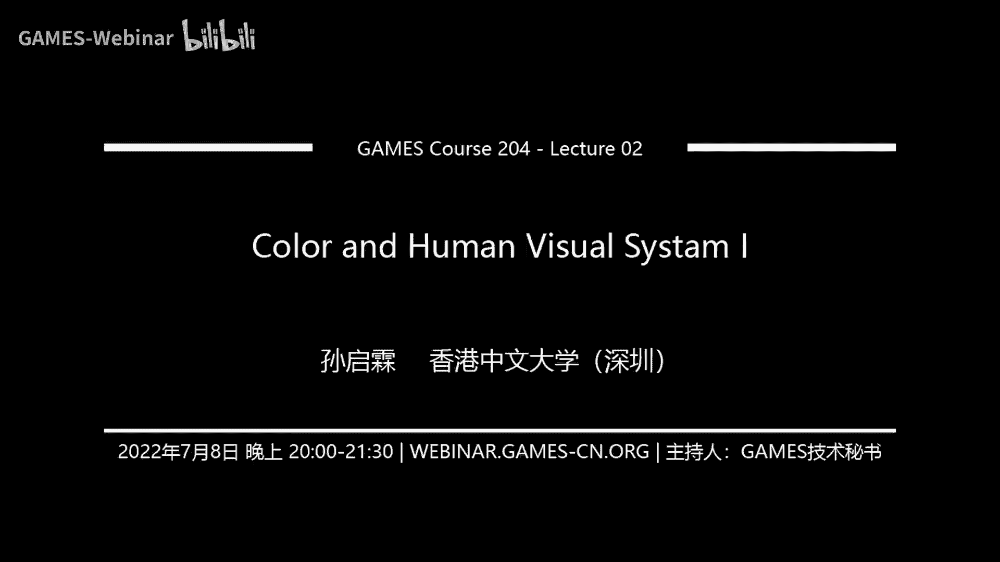

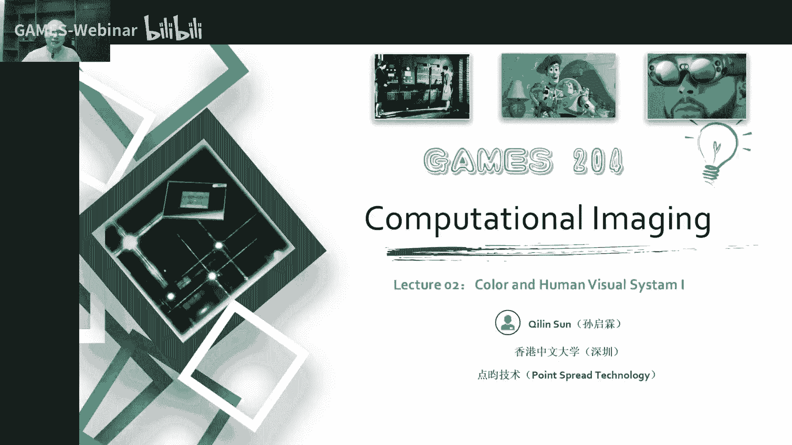

# 02.色彩和人的视觉系统(I) ｜ GAMES204-计算成像 - P1 - GAMES-Webinar - BV1ff4y1d7kq

## 概述

在本节课中，我们将学习色彩和人的视觉系统的基础知识，包括色彩的形成、色彩匹配以及人眼如何感知颜色。

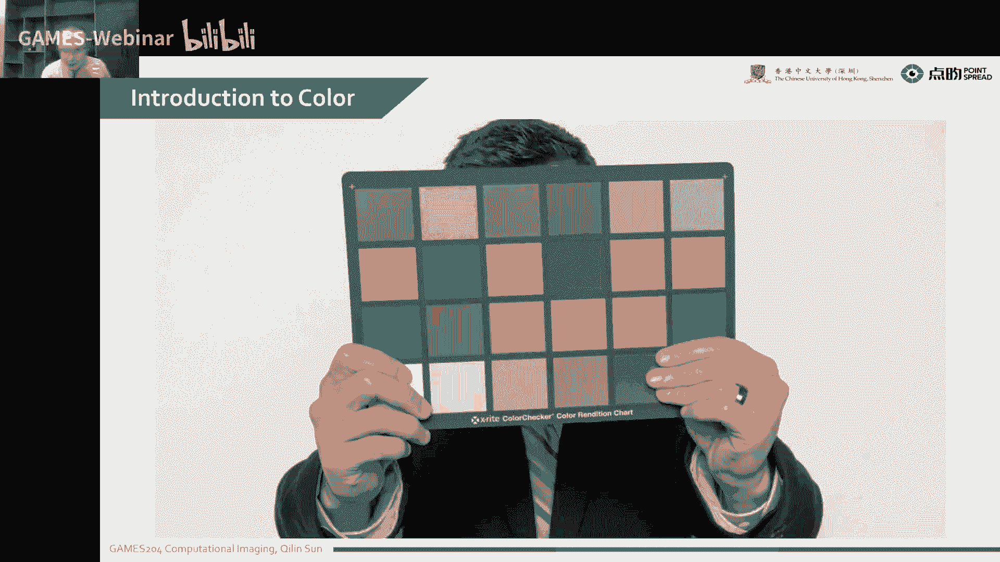

## 色彩的形成

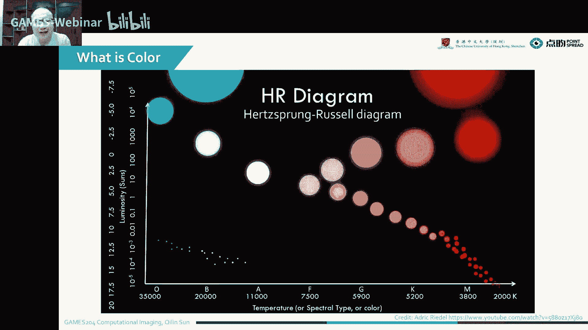

### 色彩的来源

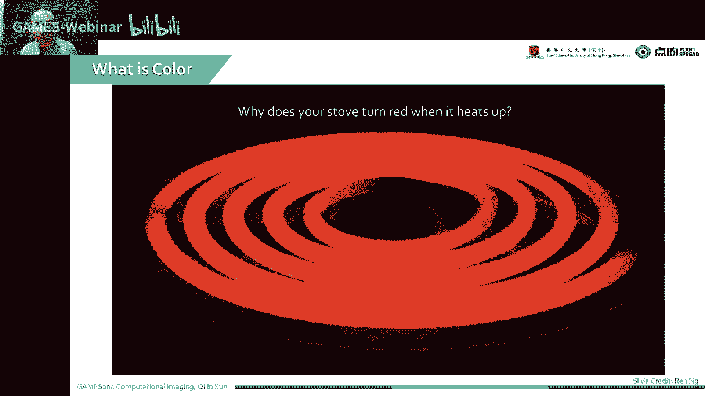

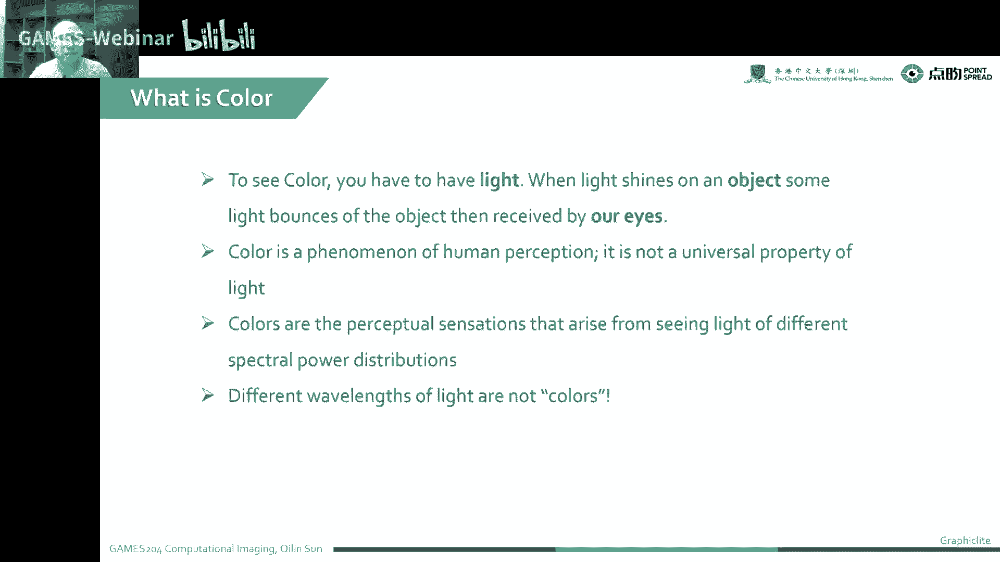

色彩来源于光源、观察物体和观察者三个要素。光源发出的光照射到物体上，物体反射或吸收部分光，反射的光进入人眼，经过视觉系统处理后形成颜色感知。

### 色彩与光谱

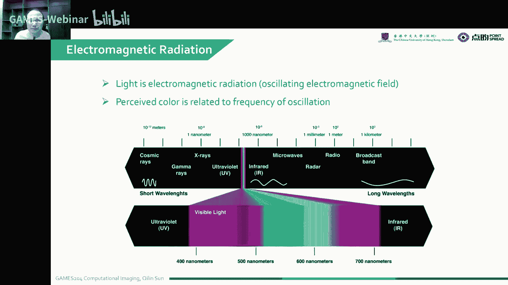

色彩与光谱的关系并非一一对应，存在一些特殊的波长，即使亮度变化，颜色感知也不会改变。这种现象称为贝塞尔普克效应。

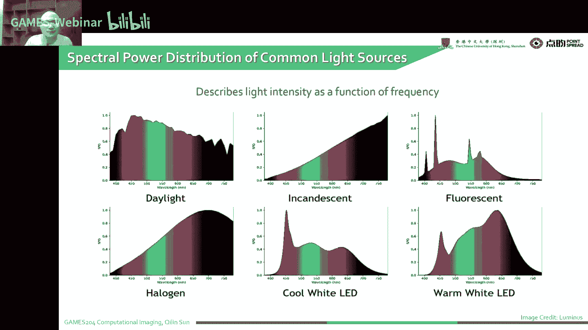

### 色彩与能量

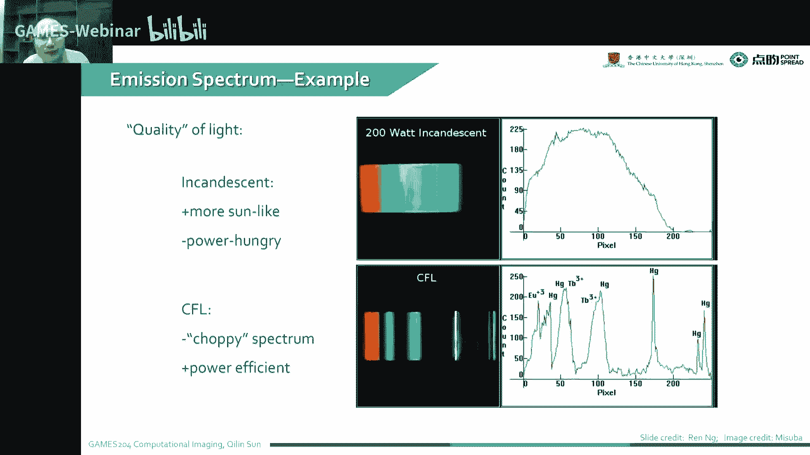

物体在特定温度下会发出特定波长的光，温度越高，波长越短，颜色越偏向蓝色。这种现象称为黑体辐射。

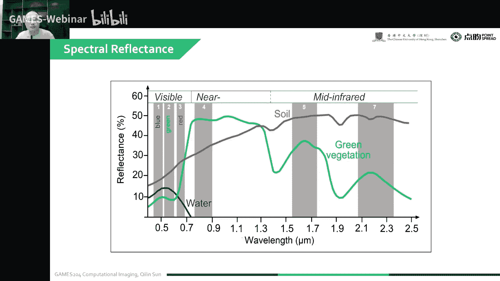

## 人的视觉系统

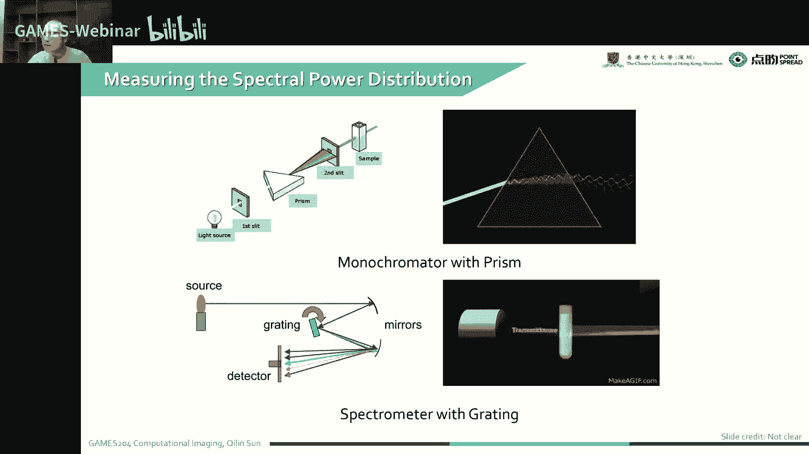

### 视网膜

视网膜上有三种感光细胞：视杆细胞、视锥细胞和感光细胞。视锥细胞负责感知颜色，分为红、绿、蓝三种类型。

### 色彩感知

人眼通过三种视锥细胞感知颜色，这三种细胞对不同波长的光有不同的响应。通过这三种细胞响应的叠加，人眼可以感知到各种颜色。

### 同色异谱

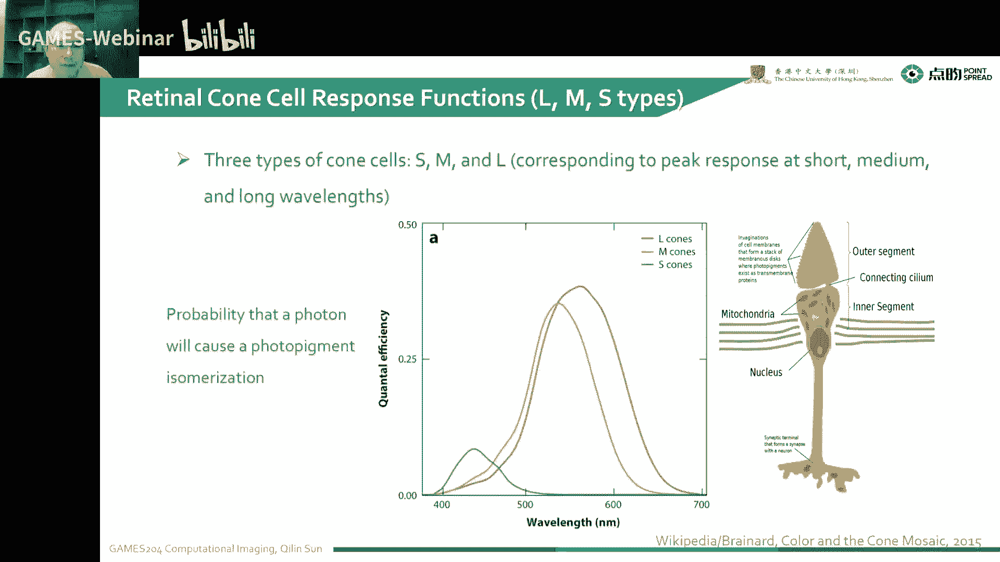

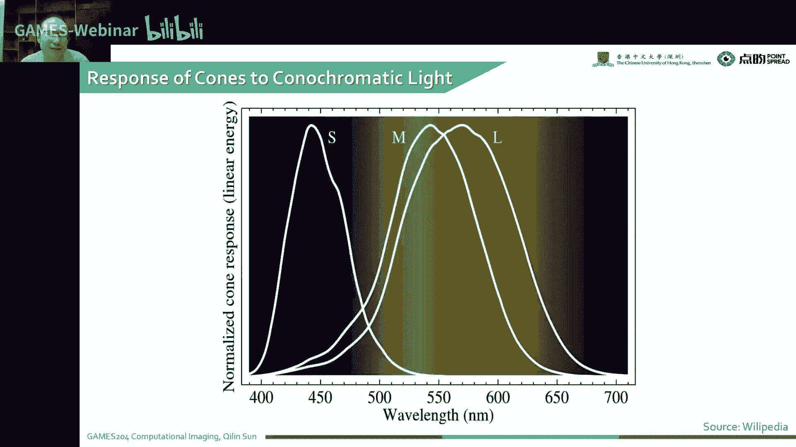

由于人眼对颜色的感知并非完全基于光的波长，因此存在同色异谱现象，即不同波长的光经过人眼处理后产生相同的颜色感知。

## 色彩匹配

### RGB颜色模型

RGB颜色模型是一种常用的颜色匹配方法，通过混合红、绿、蓝三种颜色的光来产生各种颜色。

### CIE颜色标准

CIE颜色标准是一种基于人眼视觉特性的颜色匹配方法，通过定义三种基色（红、绿、蓝）的波长和强度来描述颜色。

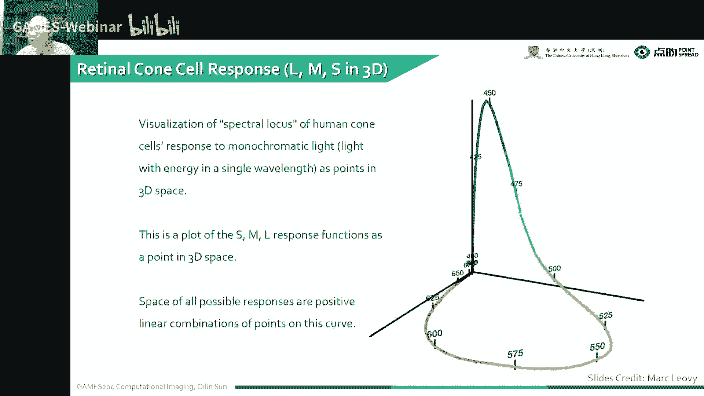

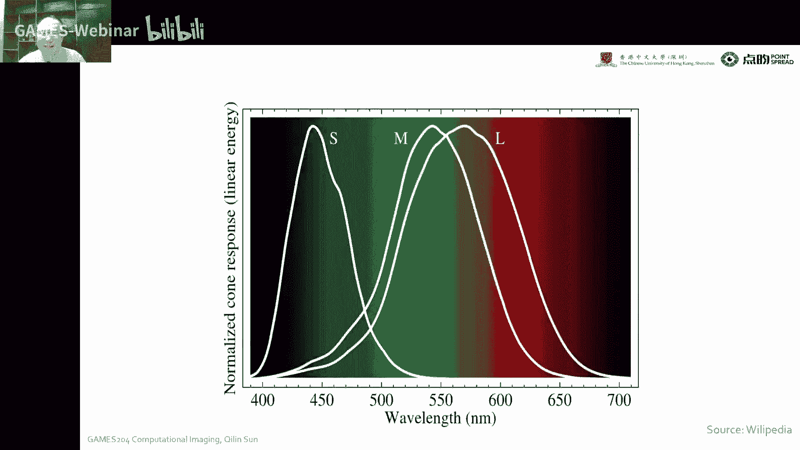

## 总结

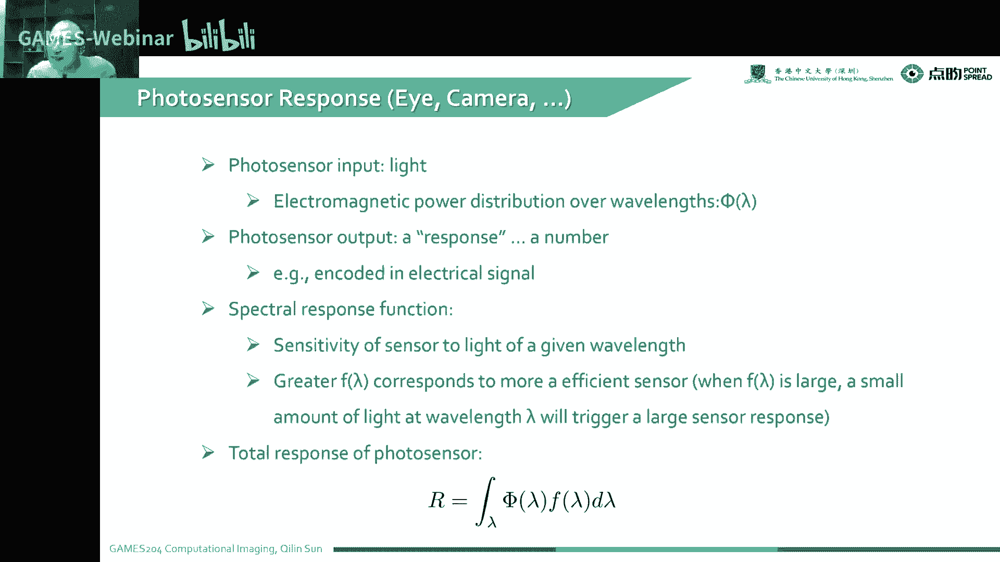

本节课介绍了色彩和人的视觉系统的基础知识，包括色彩的形成、色彩匹配以及人眼如何感知颜色。这些知识对于理解计算成像和图像处理等领域具有重要意义。