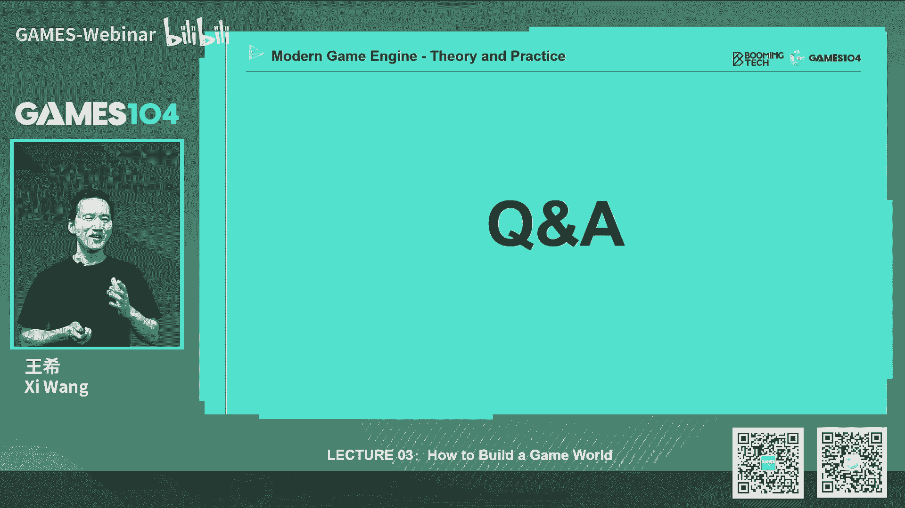

# 03.如何构建游戏世界 ｜ GAMES104-现代游戏引擎：从入门到实践 - P1：0 - GAMES-Webinar - BV1YY4y1p74P

哈喽诶大家好，那个我是王茜茜，欢迎同学们回到games104课程，现代游戏引擎的理论与实践，那么今天这节课呢，我们要讲是如何构建这个游戏世界，因为在上一节课，我们的小明学会了就是游戏引擎的基础结构。

我们知道现在游戏引擎基本上分为五层村，最核心的硬件平台层，到上面的这个核心层，在上面的这个我们的资源层，然后呢接下来是很丰富的，这个就是我们的功能层，再往上呢就是大家每天看到的工具层。

各种各样的编辑器对吧，非常的庞大，当然还有我们很多第三方的这个内裤，在支持我们，但是有了这些知识，我们只是知道这个大厦长得是什么样子，但是我们并不知道说这个大厦里面的建筑，这些砖石。

这些水电是怎么在一起work的，所以今天这节课呢，将会是一节含金量非常高的课，就是告诉大家说，唉我们怎么去构建一个真正的游戏世界，那么这个如何构建一个游戏世界呢，其实我们就要明白说。

这个世界到底有哪些东西构成的，那么这些东西呢他们是怎么去被描述，然后呢他们彼此之间又是怎么被组织，怎么被这个就是调动起来，所以这件事情的话呢就是我们游戏引擎的核心，而且这节课的核心就是。

教大家如何去构建这样的一个游戏引擎，那我们继续回到一个实战的例子吧，比如说我们那个聪明好学又非常自信的小明，他学上一节课，假设他学会了如何在一个游戏引擎里面，做一个动画系统。

并不意味着他知道如何做个游戏，那我怎么知道如何做一个游戏呢，我们就举个例子吧，比如说小明玩了战地2042，觉得这个游戏很好玩，但又很拉胯太多的bug了，他就决定说，那我就索性自己再做一个游戏引擎。

能做一个比2042更好的游戏出来，那么假设他设定了这个目标的话，他首先要去想象一下诶，这个游戏世界应该有些什么东西，那首先的话呢，我们需要对这个游戏事件进行拆解，那首先我们想到的东西是什么呢。

是一大堆的这种可交互的动态物，比如说地上跑的坦克，天上飞的无人机对吧，还有端着枪冲着这个NPC的小兵，当然了，还有火炮，还有导弹，看上去非常的酷，这些东西呢它都可以动来动去，可以根据你的行为。

甚至你可以直接上去操作这种东西呢，在我们的现代游戏里面，一般叫做动态物，叫dnan game object，那么这一类东西也是大家最容易关注到的东西，那么第二类东西是什么呢，就是默默的静态物。

比如说高高的瞭望塔，比如说飞机的机棚，比如说房子，我们在游戏中看到很多东西对吧，放在那边，但是呢它虽然不可以交互，但是它整个构成了我们这个游戏的各种各样的，关键性的game类的元素。

那么除了这些动态物和静态物之外的话，那我们还有什么呢，其实是大家最不容易注意到，但是却是无处不在的，比如说地形系统就是无处不在的大地，那么地形系统呢它就会无限的绵延下去，那么它又是我们现在所有的这些。

就是这个动态物啊，静态物的支撑的这个托盘，那么在游戏引擎中的话呢，地形系统一般是一个单独的系统，我们在后面讲其他系统会讲到，那么还有大家注意不到的是什么呢，就是我们的天空，其实很多时候大家好。

没有注意到我天蓝蓝的天是什么，但其实大家想象一下，就是我如果真实的在一个游戏世界里面，我要保，我要表现日夜的变化，我要表现阴天晴天下雨，大家看到那个天上那个变幻莫测的那些云，其实这样的一个动效和视效。

本身并不是特别的简单，就是我们专门有一个说法叫TOD，就是time of the day，就是日夜变换这样一个系统，但今天呢不作为我们这个课程重点的展开，还有一块很大的这个物体对象是什么呢。

就是我们的这个比如像植被对植被很有意思，你说它是动静态系统吧，确实它是固定在一个地，一个地方不太能动，但是呢风吹了它，炸弹炸了它，它又有交互对吧，但它本身又有一定的变化，而且植被的特点是什么呢。

它的量特别特别大，其实这些东西也会是构成我们的叫environment，环境的元素，那么小明分解到这儿，我们有了动态物，我们有了静态物，我们有了环境，基本上我们就可以画出我们所有能看见的，这个世界了。

对不对，但是这个作为游戏来讲够不够呢，其实还不够，因为游戏本身是要玩的嘛，那在游戏中呢其实还存在着大量其他的物体，比如说我们有一个叫trigger box，就是一个一个一个一个检测体。

检测体做什么东西呢，它你是看不见的，但是当你走进去的时候，他就知道了，举个例子，比如说我到了一个多七点，我走过去的时候，诶，我的积分就可以一直在涨，一直在涨对吧，包括我们去玩那个游戏的时候。

我们最讨厌的东西是什么，比如说空气墙，那些空气墙的话，那也是一个物体，对不对，我相信大家玩战地的时候最讨厌的东西是什么，就是我开一架飞机飞得正嗨呢，突然告诉我说你已经飞出了war zone。

然后五秒钟之后就把你击落对吧，但是这个东西我是怎么知道的呢，可能又放了一些你看不见的东西，甚至包括整个这个游戏玩法的规则，它其实也可以抽象成一个物体，所以呢就是在现代的游戏中的话呢。

我们会发现就是说无论你是静态的，动态的还是啊，当然大题和填空是独立的，但是像游戏规则啊，像检测题啊，我们都会把它统一的抽象成一个叫game object，游戏对象，那么这个game object的话呢。

在行业里大家会经常把它就是缩写成叫GO，注意啊，这里的GO和我们那个go那个语言，不是一个东西，包括围棋的英文go也不是这么练，我们一般都叫GO，就stands for game object。

就是在现代游戏引擎中呢，我们一般会把所有的这些东西全部的统一，抽象程叫做game object，这就是这个一个方法论，就是小明这样一想哦，我明白了，我要构建这个游戏世界。

那我就是要管理好这一系列的这个game object，就可以了，好那我们就知道了game object，那有了game object，我们怎么去做一个游戏呢，那首先我们就举个例子，比如说小明想。

那我先做个最酷的吧，比如说一个可以自动巡逻的无人机，对不对，那么它在战场上会飞来飞去，会帮我监控整个战场的环境，这个听上去非常的酷，那这个无人机怎么去做它，那我们去分析无人机的行为，那无人机你会发现。

当你去描述一个无人机的时候，你一般会得到两类的东西，第一类的东西叫什么呢，就是它的比如说它的外形对吧，它的外面的几何用三角形表达的外形，他的各种动画，还有他空间的位置，还有它的血量，还有它的那个油量。

它的电池量是多少，这个东西叫什么呢，我们统一的叫做属性property，那么另外一个东西是什么呢，这个无人机它是不是可以飞来飞去对吧，它可以move，可以移动，同时呢它还可以可以就是说去巡逻。

它沿着某个固定路线，或者有一定的AI算法控制台可以去巡逻，它可以追踪一些人，那这个本身呢是一些API的行为，你会发现就是说啊，当我们在游戏世界里描述所有的物体的时候，它你可以把它归类成两类。

一类叫做property，一类叫做behavior，就是属性和行为，你基本上就可以描述几乎所有的物体，那么在游戏引擎设计中的话呢，我们也是按这个进行分类，那么假设我们会去这个写最简单的，同学们的语言。

无论大家是学java呀，还是学这个啊，C语言还是c#，whatever就是只要是现代语言面向对象的，你会很自然的就会说诶，那我们定义一个类，比如说我们定义一个类叫无人机john。

那你看到我们会把所有的它的属性，定义成它的这个property对吧，各种变量，比如说你的位置我定义成一个三维的向量，Vector3，然后呢你的血量我定义成一个标量，就是比如说零到啊，100这个值。

你的油量我可以定义到0~1的油量对吧，那我会有两个我的内屏函数，就是我我的函数定义我的行为，比如说我是不是可以木啊，我是不是可以这个巡逻啊，那么这样的东西是不是一个很完美的一个，类的定义。

就是我把我的数据和我数据，所有的方法都放在一起了，其实呢这个东西虽然看上去很土啊，但是最早期的游戏还真的就是这么架构的，非常的简单，非常的直觉，那么你有了这样的一个描述之后啊。

实际上我们呢就可以基于它做更多的变化，比如说小明说诶我觉得不过瘾，我要做一个叫查打一体的无人机，我不仅可以巡逻，我还可以看到目标，我可以攻击，那这个时候他就会非常简单了，就说那好。

那我再给这个无人机增加一个行为，比如说叫做这个attack攻击对吧，那么的话呢那这个时候我既然攻击的话，我的子弹是不是不是无限的，所以呢我还再加一个它的属性叫做这个armor，它的弹药量是多少。

那你看只要再添加两行，我好像一个更多的行为就构建出来啦，同学们如果会写代码的话，特别是大家对有一定的语言基础，这种时候肯定就跟小明一样，很快意识到，那这样我就用对象的派生和继承的关系。

我定义一个类叫做无人机这个类，然后呢我再派生一个类叫做查打一体无人机，就是那个COMBRHI，然后这个时候诶我多加一个变量，多加一个行为，这个无人机它就有有了这个攻击和察，打一体的能力，其实这个最早期。

这就是一个标准的一个，面向对象的一个思维方式，这个方式呢其实非常的直觉，和我们对世界的认知，其实最早期的引擎的时候，我们真的就是按这样一个面向对象的逻辑，去构建这个世界。

但是呢这个方法它虽然非常的简单易懂，但是它有一个缺陷，就是随着我们的游戏世界啊越做越复杂，我们就会发现哎，这些东西它并没有那么清晰的父子关系，我们经常看到很多混血儿对吧，就像我们知道。

比如说我们看到一辆坦克，那么我们看到一辆船，但是呢如果我把坦克和船合到一起，我们会得到什么东西叫水陆两栖坦克，而坦克本身呢是派生似于车辆，船呢本身是比如说一艘一艘巡逻艇是派狮子船。

那你这个水陆两栖坦克到底他的爷爷是坦克，是车辆呢还是船呢，这个是一个非常经典的，这个就是面向对象的一个问题，这个呢不仅在我们的游戏引擎的架构上，其实在就现代编程语言中，我们也会发现这样的问题。

那这个问题的话怎么解，其实那个有一个很经典的解法，也是现在引擎最常用的方法叫做组件化，就是我们把对象拆分成他的行为，拆分成无数的组件，就像这辆玩具的这个挖土机一样的，你看起来是个挖土机。

但是我把他的那个铲子换成各种各样的部件，比如说可以把它变成一个小推推那个压路机，也可以把它变成一个小的推土机，也可以变成一个小的举重机对吧，这就是一个组件，可以把同一个模基础，变成各种各样的模块的东西。

那么我相信大家的话呢，在现代游戏中最喜欢玩的东西是什么，叫做啊自定义，对不对，比如说我们玩一个现代射击游戏，我们会把枪各种组件模块定义来定义去，我加上一个那个三倍狙，我就是一个就是一个就是一个狙击枪了。

对不对，三倍镜我就是个狙击枪对吧，我加上个消音器，就是我一个微冲了，所以呢其实现代的武器，包括游戏设计里面，我们也有大量的这种组件化的思想，而这个思想呢其实在十几年前甚至更早一点。

在现代游戏引擎设计中的话呢，我们会用这个思想来重新描述和定义这个世界，那在这里面的话呢，就是回到刚才，我们那个小明的无人机的案例的话，我们重新理解这个无人机的行为，我们会发现嗯它在空间上的位移。

Transform，我们是不是给他一个组件，就表示它在空间的各个位置占用关系，然后它的外形我给他做一个组件叫model，这样的话我能够把它的外形表达出来，然后呢我还有一个组件叫motto。

motto是什么呢，就告诉我说这个无人机的各种运动属性，比如说它的最快爬升速度啊，它的加速度啊对吧，这些它的这个整个的移动的惯性啊，那还有一个组件是说叫health，告诉我说这个无人机还有多少血。

包括他的API行为，它的物理行为，它的动画行为都变成一个一个一个的小组件，然后呢当我把这小组件模块拼到一起的时候，诶我就有一个我自己的无人机出来啦，其实如果动手能力很强的小伙伴。

你们现在买现在的很多玩具啊，你会发现它都不是包装好的，都是提供了各种选项，你自己可以去选配，对不对，这是在真实的物理世界，但其实呢在游戏世界里面，我们很早就按这个逻辑去构建。

游戏的整个一个基础的物体逻辑，那这个时候啊大家好，会写代码的小伙伴就明白了，就是这个时候就非常简单，我们呢如果假设用C语言为例的话，大家只要定义一个叫component base，一个鸡肋。

他同意好这个每一个组件的基础行为接口，这里面大家注意到一个细节没有，我们有个函数叫tick，待会我会讲，为什么每个组件都要拍摄一个tick这个函数，然后呢我们的各位移呀模型啊，他的这个动画这些类。

全部派生自这个component pace，那这样的话我们就可以在一个机构里面，管理一组各种各样的component的小组件，在一起就可以协同工作了，那这样的话如果按照这个思想的话。

那小明的这个挑战就会变得非常的简单，对不对，那我的这个transform，我的model，我的animation，Model physics，这些东西无论是你是只能飞飞的这个侦察飞机。

还是这个我能攻击的超大一体机都是一样的，但是呢因为我可以攻击了，所以我的API可能要换一个模块对吧，ATTACKBOAI的模块，那么呢我本身呢还加一个战斗系统，就是能够帮助我瞄准啊，索敌呀。

那这两个组件一换诶，我一架无人机就变成了另外一架无人机，所以非常的简单，对不对，很直觉符合大家的想法，其实这就是现在游戏引擎架构的一个核心理念，就是我们要尽可能符合大家的直觉，为什么呢。

因为现代游戏引擎啊，它的整个基础结构，第一个要让我们的开发者好维护好理解，同时呢，我们要交给大量的艺术家和设计师去使用，我们要把这个世界的组织啊，各种交互符合他对天然和直觉的理解。

因为我在第一节课就跟大家讲究，隐形游戏引擎的架构本质是什么呢，它不是一个就是我们技术啊，炫耀我们技术多厉害的一种技术炫耀体，它是什么呢，它是一个生产力工具，就是大家很方便很容易去理解。

才是我们这个引擎设计的一个底层的需求，而这件事情的话呢，其实是呃我们引擎的行业的一个，基本的一个方法，就是大家如果有玩过，比如像unity area这些商业引擎，你会发现这里面的话呢。

他们都会去提供这个叫component的概念，如果大家打开应用例题，点开任何一个物体，你会发现下面出现一小串，一小串的它的各个组件，而且这个组件你可以增加，可以自己去定义，甚至可以给它写脚本。

那么在ARMA里面其实也是类似的东西，那么在这里面有个细节啊，就是大家看到就是在如果大家看他们的代码，特别是像aria，你可以看到源代码，你会发现诶他所有的东西就派生自一个you object。

那这个呢我这里要跟大家同学们讲一下，就是这个u object呢它不是我们讲的GO，它更像是那个就是我们像高级语言，或者是那个里面讲的，比如像c#里面的object，就是他要确定任何对象的生命周期的管理。

比如说你创建啊那个内存释放啊，就是我们讲的GC啊，需要的一个一个句柄，就是我上次讲过那个handle，那么包括unity里面那个object也是这个概念，所以这跟我们的机油不一样，举个例子。

比如说像在aria里面的话，更像我们机构的概念，可能是actor拍摄的这些这一系列的东西，那么其实在现代引擎里面的话呢，component组件的这个这个就是说呃，他的这个能力是非常综合的，举个例子。

比如说我们在游戏里看到各种各样的光源，比如说无论是点光源啊，还是面光源啊，还是这个方向光啊，在ARMA里面它也会被定义成一个组件对吧，在unity里面的话，各种行为。

我们比如说我们的动画这个物体模型都是组件，所以我们用组件作为积木，去构建出了整个这个现代游戏引擎的，这个技术结构，基本上听到这一趴的话，很多小伙伴我觉得如果开发能力比较强的话，已经收已经痒痒了。

很想去写这样的代码，其实我在一开始学这些系数的时候，我也是这样的，就是我听了听了我就很想去写，自己去实践它，那么所以呢课程讲的这一趴的话呢，我觉得同学们只需要记住两件事就可以了。

第一个呢就是说在游戏世界里面，我们把几乎所有的东西全部抽象成了，一个叫做game object机油这样一个东西，然后每个机油我们用各种各样周功能的组件，把它组合起来。

所以component又是GO的原子，那这两件事情基本明白了，你就明白了现代游戏的组合的一个基础逻辑，好，那有了这个东西之后，我们就小明就很自信了，他觉得我就可以，我可以去构建这样的一个游戏世界了。

但是你真的想构建一个这样可以打起来可以，这个就是说真正可以玩耍的东西，好像还少了点什么，大家觉得少了什么呢，这个世界是静止的对吧，我怎么能让这个世界真的动起来，这个世界因为这我我的坦克要能开得起来。

我的飞机要能飞得起来，那这里面的话呢其实也不是特别的难，为什么，我记得在上节课里面我讲过，就是如果听完我们第二节课，就知道，在游戏引擎里面最核心的一个函数叫做tick，就是我们每隔1/30秒。

让这个世界往前走一步，就如同我们的真实世界里面，一个普朗克时间一样，那个上帝，如果我们是生活在一个simulation里面的话，我我我会认为每个普朗克时间，就是上帝给我们设置的tick。

那么在我们的游戏引擎里面有一个tick，那这个tick，怎么像我们的游戏世界里的这些对象传导呢，其实非常的简单，就是我把一个每一个机，你的每一个component依次去TK1遍，比如说我的一个坦克对吧。

或者一架飞机，那我首先TK一下我的MOTO，直到我现在往前走了111小步，如果我现在知道我的速度是10米，每秒1/30秒0。03，那我知道我现在要往前移动30cm，这个时候我的动画告诉我说。

诶我要去卷一下我的履带对吧，那这个时候我的那个那个那个主跑好像转一下，这个时候呢我的战斗系统能告诉我要开一下火，所以在在这30分钟一秒里面的话，我把我的这个坦克的机油里面。

每个component一次就哒哒哒TK一下，那如果我们把整个游戏世界里面，所有的物体都tick1遍，我们的这个世界是不是就动起来了，所以tick其实非常简单，所以刚才我们在讲这个component的。

鸡肋的定义的时候，就大家如果自己动手，无论你写的是java c#还是CC加加，那你在写component积累的时候，一定要加一个tick函数对吧，但是真实的这个游戏引擎比这更复杂。

那你们还有什么pretty postc，我们以后带着同学们在深度的理解，但现在呢大家只要只需要知道，我们有个tick函数就可以了，我们去TIK它，但是呢这个非常符合我们的直觉，对不对，非常的直觉。

但是在现在游戏引擎中呢，我们一般不是按照每个对象进行替开的，我们会把一个个系统进行TK，比如说我们先把这个MOTO系统全部替开一遍，所有的物体往前走的，往后走的，往上飞的全部印下来。

接下来呢我们会替你的control control是什么呢，就是你的物理碰撞检测的东西对吧，还包括我还检测一些位移的阻挡这些东西，然后呢我在动画做你的动画，我在做你的东西，这东西听上去好像有点反直觉。

就好像是说诶我一个人，你为什么一会儿让所有人先动你的头，让所有人在动你的手，所有人在动你的脚，不是每个人把自己的头，手脚自己动掉就可以了对吧，感觉有点反直觉，那为什么会这样呢。

其实有一个最简单的一个类比是什么呢，就是大家想象一下，我们假设做汉堡包，那么我们假设一个汉堡店有五个工人，大家最直觉的做法是什么，OK那每个人对吧，你先去烤面包，然后烤牛肉，然后呢洗蔬菜。

然后呢放上你的butter，然后放在一起哇，一个香甜可口的汉堡就做出来了，但这样的生产效率高不高，显然是不高的对吧，大家知道我们现在这个工业最核心的概念，叫什么，叫pipeline，叫流水线。

那最高效的做法是什么呢，就是有人专门去烤面包，有人专门去烤牛肉，有人专门去洗菜对吧，大家配合好，然后呢到了十天啪一起合成一个汉堡，这样的效率是最高的，而这个这个原因呢在计算机上面的话呢。

还有一个很大的一个好处是什么呢，就是我们所有的component的数据，我们都会把它尽可能地集中在一起，这样我一次处理的时候，整个就是一次批处理，大家还记得我的上节课跟大家讲的，那个图灵机的那个故事吗。

就是那个无限长的那个纸袋，我说过，就是在图灵机上效率最高的处理方式是什么，我们要把同样的数据尽可能放到一起，然后呢我们一次一次一次把它处理完对吧，然后呢无论读写都在一起做，而这样的架构呢。

它的读写和处理效率是最高的，那但是呢这个就是其实我们在我们的高级课程，会讲到那个ECS啊，这个TOTS这样的架构的时候，我们会深入讲，那这节课呢我只是简单的点到，就是让同学们知道就是这样的一个架构。

接下来一个tick系统的话呢，就是你直觉得project的tick和反直觉的，每个component的类型的tick，其实在游戏引擎架构中都是有的，但是现代游戏引擎的为了追求效率，逐渐逐渐的会转向。

就是按照那个每个system，或者是每一个每一种component的进行tick，所以我想这个东西应该也不是很难，同学们如果真的不理解，就记住一句话，就是我要造个流水线，这样流水线的话我可以批处理。

所以我的效率高，就这样就可以了，非常的简单好，所以那我有了这样的一个东西的话，那小明其实不是可以，构建了一个动起来的世界了，我的坦克也能开了，我的飞机也能飞了，但是这个世界呢还缺了点什么什么呢。

这个世界是没有交互的，也就是说我坦克自顾自的表演，我飞机自顾自的表演，但是坦克和飞机和人之间没有任何关系，我现在举个具体的例子，什么叫gay gay，比如说我现在跳上了这辆坦克。

然后呢我朝敌远处的敌人开了一炮，那好我要把远处的敌人击倒，这个是我的目标，但是诶好像每个GO之间都是自己的tick，我是开一炮，我怎么样的，让那个机油知道自己被我打伤了或者干掉了呢。

这里面其实就需要基欧之间，彼此是要能够告知彼此，那这件事情的话呢，其实最简单的想法是这样的，就是来我们坦克开了一炮，这个时候这里面讲一个小小的细节啊，就是说当我一个机油开炮这个行为发生的时候。

我这个component可以再去SPA，就可以再生成一个新的机油，那个机油什么叫炮弹，哎，我们有一个炮弹叫GO那个炮弹，那个机油出来啦，炮弹那个机油呢它就自己有一个输出的，对不对。

他就每每个TIK就往前跑跑跑跑跑跑，他突然在某一个TIK的时候，他发现自己上一个T的位置和即将要跑的位置，这条线好好像和比如说地面有一个交点，什么意思，说明哎呀我要炸了对吧，炮台说我要炸了。

这个时候炮弹说不行啊，我我我光炸弹没有用啊，我得我得炸死旁边的这个，这是我的敌人，对不对，好他就开始就寻找了，说哎我旁边有一个人，我旁边有一个有一个直升飞机，我旁边有个坦克，还有一块石头。

那我这样我在我要爆炸的这个逻辑里写道说，我查询一下我周边的这些对象，如果他是人，我掉的人，我要我要见你的血，如果是飞机，我要见你的血，如果是坦克，我要减你血，如果是石头，石头表示说我完全没有影响对吧。

但是如果是这样去写的话呢，这个逻辑呢我们叫做hot cold，其实这个东西大家不要笑，最早期的游戏引擎有的时候真的是这么写的，就是大家好多同学会写hot cold，这样就写。

但是随着这个游戏世界变得越来越复杂的时候，大家会发现这个hot code它其实是不work的对吧，那怎么办，那这里面我们就有一个更优雅的解决方法，我们这也是现代游戏引擎最重要的一个机制。

叫做event机制或者叫事件机制，我们不要那么粗暴的，就直接敲人家的门对吧，跟人家说，你被我打了一下，这样太粗暴了，而且我还需要知道我所有的邻居家，我要认识所有的人，这很麻烦，那我怎么办呢。

我给大家写写邮件，你们每个人呢在家门口都放个邮箱，我不需要认识你，我只需要知道方圆，比如说20米之内所有的邻居，我给你们每一家寄一个邮箱，现在我这封邮件肯定不好了，叫我们英文叫做blackmail对吧。

就是告诉你不好意思，我打了你，扣了你100点血好，我把这个游戏邮件放在这儿，这样你明天早上起来的时候，也就是下个tick的时候，你突然一看，哎呀，原来我这个这个这个被人家扣了100点血。

如果我这个是一个health component的话，假设我这个GO是一个小兵的话，我查查自己说嗯我身上只有70点血，你居然扣了我100点血，那好吧，我只能死给你看了，那这个小明就只能倒在地上死掉了。

所以其实你看本来是一个非常复杂的，这个一个框，就一个问题，通过一个简单的事件机制就会变得非常的清晰，而且明确这个呢在系统架构中我们叫做解耦合，就相当于把各个机构机构之间的通讯，本来我们需要知道。

所有可能其他的那个跟object对象类型影响，包括每个机油里面的component的类型，这个太复杂了，我们统一的变成了一个叫event的机制，你只要发出一个event给对应的那个CEO。

让他来处理就可以了，这样的话，各位机油和component之间的逻辑的话呢，它就是上就结耦合了，这样的话是不是变得就非常的干净对吧，那这个时候的话呢，其实在现代游戏引擎里面。

比如说我们讲unity unreal的话呢，这也是大家非常常用的一个机制，基本上所有的商业级引擎，我们都要做这样的机制，举个例子，比如说像unity里面，就是你可以简单的三的一个注册一个message。

注册一个event，然后呢三的event这里面它是用一个字符串说诶，damage event好，大家就知道了，然后那个那个物体的health component，他如果收到了这个这个。

这个这个这个这个一般的之后，他有一个回调函数被激活，然后它就会调调自己的血，这一切的话用字符串match就可以了，因为ARREAL呢是比较复杂，其实我个人觉得ARRA架构做的太复杂了。

其实它是用C加native code去做的，所以你需要一套比较复杂的，这个就是说呃反射机制，就是把C加加里面，你要注册这样的一个event，说诶当这个event发生的时候。

这个每个component哪个函数被毁掉，但其实它的基本道理都是大同小异的，那为什么unreal会做的这么复杂呢，因为当你注册这个一个event的时候，如果同学们有现代引擎使用经验。

比如说像ROO的经验的话呢，你们会发现就是有个蓝图，对不对，你注册了这个东西之后，那个蓝图就会增加了这样的一种消息类型，然后呢在你在一个比如说你做了一个炸弹的，他的行为的机油的时候。

你说诶我撞到地面的时候，我蓝图你们就会说，我要给大家发出这样的一个消息，这个一般的出去，那么另外一个比如说在你做的另外一个东西，他比如health component里面，它就会蓝图里面就会收到。

它又可以加一条选项，说如果我收到了damage这个消息的时候，我会怎么去处理，它的本质上就是说能够让这个整个接口，这些消息我们可以不断地扩张去定义，其实大家做游戏引擎啊。

最核心的就是要做一个可扩展的消息系统，让我们的游戏开发者可以在我们的引擎之上，可以不断的定制，跟自己玩法相关的各种各样的消息类型，然后呢，他们可以定制各种各样自己想要的component，去对这些消息。

对这些事件进行自己想要的逻辑的处理，这就是现在有游戏引擎的话呢，最核心的一个工作，所以讲到这一趴的话呢，基本上大家就知道怎么去做游戏了，但是呢先不要急，这里面还缺一个东西，就是在我们的游戏世界里面。

有那么多的机油对吧，在一个比如说单机游戏里面啊，就是大家比较喜欢的一个单机游戏里面，一般是几百个这个洞的机油吧，但是在有很多游戏里面可能到几千甚至上万个，那每个机油的话，这个就是那我发生的每一件事情。

我怎么去通知到这些机油，那回到我们刚才这个例子里面，所以那在小明想做的这款战争游戏，我有这么多的，比如说NPC的大兵，我还有飞机，坦克大炮这些东西，那我怎么去管理它，这个时候就有一个管理的概念了。

这里面就讲两个比较基本的概念，就是第一在我们的游戏实践中啊，我们每个机油一般都会给他一个唯一的编号，我们就也叫一个UID，就是unique id，其实刚才我上次上节课，讲到那个资源管理的时候。

也会讲的就是它有一个GUID对吧，当我们全球进行唯一的标识，这个对这个就是现在游戏引擎非常重要，因为我们很多时候去标识定位这个物体的时候，就像你们家的门牌号一样的，我需要给你一个门牌号，另外一个的话呢。

每个物体它在空间上基本上都是有各位置的，我们需要知道你的position，那好了，你们每个人都有唯一的标识了，然后呢不是不再是NPC12345了，而是说哎307405对吧，然后呢你们的位置有个经纬度。

那这个时候我们就可以进行场景的管理，那最简单的管理是什么，最简单的管理是不管理，假设小明很粗暴说，反正我没有几个人，没几个兵的好，每一个阿莫的就是那个炮弹的那个component，里面。

当我发生爆炸的时候，很简单，我把场景里所有的机油全部发一遍消息，或者说呢我做的稍微优雅一点，把场景里每一个机的位置查询一下，然后判断它的位置是小于我的爆炸半径对吧，一个一个爆炸半径好。

我就告诉你说我对你有伤害的输出，这样写行不行，其实这样写也是可以的，如果大家做一些小游戏的话，没有问题，这样完全能跑得动，但是呢当我们场景中有，比如说几千到上万个机油的时候，这就会是一场灾难，为什么呢。

因为这就是我们今天要讲的就是游戏，引擎的挑战，叫做N平方的挑战，什么意思，就是说我每一个物体都会可能，和其他的物体发生发生互动，如果每一次，我要和另外的所有的物体去问一遍呢。

那就是N乘以N减一约等于N平方嘛，那么只要是N平方，比如说有1万个物体的话，N平方是多少，是一个亿，对不对，那这样会对计算机造成巨大的负担，尤其你的这些数据，如果分散在内存的各个地方的话。

这个效率是非常低的，那么这个时候最简单的方法就来啦，比如说我们对世界画格子对吧，分而治之，Divide and conquer，这是大家最直觉的做法，其实画格子大家不要嘲笑他。

我们把这个世界化成均匀的格子，然后呢就相当于你有一个门牌号，然后这个时候我就可以找我临近的格子，这个方法虽然听上去很简单，但其实在很多场景里面是使用的，比如说我的这个场景并不是特别大。

那我就可以这样简单的画格子，那么它唯一会出问题的是什么呢，就是当这个场景物分布的不够均匀的时候，那么现在游戏中，我们的这个就是长期五分布的均匀，到底是均匀还是不均匀的，实际上呢是很不均匀的。

我在以大家特别喜欢的这个，比如说3A大作主机游戏为例啊，在主机游戏中呢，其实你看的是一个很广阔的世界，对不对，但实际上你会发现作为一个玩家，我们能走的地方是非常受限制的，以前我们在国外做游戏研发的时候。

我们这个叫做touch touch的意思是什么呢，就是那个那个打仗的时候挖的那个战壕，就是我们设计师会认为，就是我们给玩家挖了很多条RENCH，玩家只能在我们的这个账号里面走来走去，所以沿着站好。

我们的东西会放得非常的详细和密集，当然账号之外是非常稀疏的，那这个时候如果你把这么大的世界，均匀的打格子的时候，同学们会发现是不是又慢又非常浪费，那这个时候呢，其实就有一个非常简单的算法来啦。

就是说哎我们能不能够用一个层级结构，也就是一个hierarchy的架构去管理整个场景，刚才有聪明的同学告诉我，已经讲到八叉树了，说明很多同学是非常的厉害，已经做了预习，那么其实他的思想其实非常的简单。

就是说就像我们的地图一样，整个世界很大，但是呢我们把世界分成国家，国家分成行省，行省分成城市，城市分成街区区，再分成街道，那这个时候假设有一颗有一个事件发生的时候。

比如说我知道这是北京海淀区的某一条大街，发生的事情，那我很简单，我只需要在北京海淀区那个小区域里面去找，是不是就可以了，但实际上的话呢，这样的一个hierarchy的管理方法。

就是一个非常有效的场景管理方法，那么它几乎就回到，我们刚才小明这个案例里面的话，我们可以根据这个地图上的这个，这些机油的分布，我们不断的比如说以空间的四差进行划分，对不对，如果这个地方人数假如是足够少。

只有一个两个了，那我就不再划分了，如果人数很多，我就不停的划分，这样我就形成了这样的一个树状结构，大家同学们如果学过那个数据结构的话，就知道这是个典型的四叉树对吧，那么当我任何一个事件发生的时候。

其实我知道我是在师大树的哪个节点，当我去寻找我的周边的时候，我只需要上上或者向下去寻找，或者找我的这个sibling，就是那个我的这个叫什么呢，叫兄弟节点对吧，或者我的parent节点。

或者是我的那个那个那个那个sun节点，往下去找就可以了，这个呢是一个数据结构的课程，同学们不用钻的太深，其实非常的简单，因为实际上在游戏中的场景管理啊，随着现代游戏的发展啊，这个是一个最简单的策略。

但实际上呢有很多的流派，比如说啊最简单的二叉树的流派，我们把世界按一刀一刀的把它分掉，那这个二叉树的画分呢，有的时候我们会做的更精致一点，比如说沿着墙去分，那么还有呢最经典的比如说八叉树对吧。

刚才有同学已经提到了OCG，那orchestra的话呢也是一个非常经典的，对空间不断细分的一个方法，那么现在游戏引擎呢比较流行的是BVH，就是说我们用这个就是bounding box。

就是每一个物体有一个小BINBOX，我们从小往大慢慢喝，慢慢喝慢慢合，当我去发生一个事情，或者说我作为一个一些比如说像一些计算，比如说最常见的是什么呢，这就已经跳课了，比如说世界追的裁剪。

那我们就要用BBS快速的把很多东西全部扔掉，那么当我们去打出一条子弹，一个弹道的时候，其实我们也需要用这样的一个技术，去帮我们去快速定位，所以special的就是空间上的数据管理，是场景管理的核心。

那么在真正的不同的游戏产品中的话呢，我们会采取不同的方法来解决它，比如说啊假设同学们做这个引擎，我们想做一个比如说呃2D的，像SUPERMARIA，就超级玛利亚这样的游戏。

我们英文叫做planet former，这样的一个游戏的话，你可能就不需要这么复杂的场景管理了，但是如果你想做一个像cod啊，像quick这样的游戏的时候，那你一定要花心思去仔细的设计。

你的款场景管理的方法，就是呢能够尽量节约你的计算资源，所以在我们这个案例中的话，小明的话我觉得他用一个就是说那个四叉树啊，或者是一个BFEH啊，基本上能够完成他的需求，所以呢到这一趴。

我们的课程的核心内容，基本上就是给大家讲明白了，就是说其实在游戏中啊，所有的这个物体都是一个object，然后呢，每一个object呢都是用component base的方法去描述它。

那用这个component组合出物体的不同的行为，那么就是说所有的component呢，我们用一个tick的方法，就会不断的去替他各自的逻辑去往前去走，那么在这个就是呃component里面的话呢。

我们所有的机油之间通讯是什么呢，通过了一套复杂的消息机制来彼此进行通讯，那么我们在这么多物体在管理的时候，我们需要一套这个非常高效的，层次结构的场景管理机制，基本上听到这儿。

我觉得如果动手能力比较强的同学，已经可以动手去构建，大家想要的这样的一个游戏引擎了，那实际上的话呢，就是说我们讲这个就是游戏引擎的话呢，真的大家是在商业学期做的时候呢，可能就有些更复杂的情况。

我这里面的话呢，这一页就跟大家讲一些比较高能的东西了，举个例子啊，比如说在这个我们在游戏中，最常见的东西是什么呢，叫物体之间的绑定，那比如说像以我们大家都特别喜欢的深海，这个游戏里面。

大家最喜欢的是什么，是开着车飙车对吧，那你开车的时候你是个机油，那车本身也是个CEO，但你那一刻你就被绑到车上面去了，对不对，那这个时候那个车在动你的，你的位移是被车锁锁定的。

那你们两个之间的话该怎么去在一起联动呢，实际上这个时候我们在机邮局tick的时候，就有一个先后关系的问题，比如说我们一般会要求这个附节点腹肌会先替，可，然后呢我挂在上面的东西在后面T格。

这样的话当我自己被踢开的时候，我会去问诶，我的车在哪里，我的车已经往前移了30cm的好吧，那我也往前移30cm吧，我在做相应的动作，但是呢这样的一个T课程序，当我就是说有更多的东西举个例子。

比如说我们假设刚才讲的那个一个，一个component去听歌的时候呢，会变得相对复杂，但这件事情为什么这么重要呢，这个顺序这么重要，就是因为其实现在游戏中啊，当我们去T1个component的时候呢。

我们很多时候是要分散到很多，很多的CPU上去执行的，就是他很多的T恤是并行执行的，而并行执行的时序是非常重要的，那这件事情的话呢，其实就引入了我们另外一个难题，就是我们刚才讲。

就是说其实我们机构之间的通讯，是不是通过一个叫event event，就相当于我给你写信，就是我冲到你家门口，把游戏邮件塞到你们家门口的邮箱，对不对，但是这件事情它是有一个逻辑上的悖论的。

这个悖论是什么呢，举个例子啊，就比如说大家在大学，有没有跟女朋友分手的经历啊，比如说当你去兴冲冲的写了一封封分手信，打算投送到你女朋友的寝室的时候，你突然发现你的女朋友也穿着衣服从寝室出来。

手上拿着另外一封信，你那时候是不是马上要怀疑是是不是她的，同时给我也在写一封分手信，那到底是你耍赖你女朋友，还是你女朋友耍赖你呢，这件事你就讲不清楚了，对不对，我相信同学们在日常生活中。

都会遇到这样的一个公案对吧，那这个时候其实在游戏世界里面，如果我们让GO直接彼此之间可以写信的话，它会产生很多我们叫做逻辑上的ambiguity，就逻辑上的混乱性，这个混乱性呢在很多时候你会注意不到。

但实际上的话呢，对游戏的他的这个影响是非常大的，因为在游戏中啊，我们希望当用户是一模一样的输出的时候，我希望游戏世界里发生的行为他是确定的，一致的，不会变的，我们叫做deterministic。

就是它的确定性，那举个例子吧，比如说同学们很喜欢玩各种对战游戏，对不对，当你打完了对战游戏之后，你最喜欢看的东西是什么，是精彩回放，而精彩回放本身呢，就是一个引擎提供的一种核心的能力。

那一般的精彩回放是怎么做的呢，它并不是这个把刚才的你的游戏过程，整个状态全部都录了，像那时候那个录像的文件就会非常非常大，他是存不下来的，他怎么办，他只录了每一个小伙伴的输入。

然后呢他把这个游戏重新又跑了一遍，但是呢重新跑了一遍之后，他和你刚才打的时候效果是一模一样的，那这个时候，如果大家所有的物体都是依次执行的话，那没有关系，一样的输入我一定跑出一样的结果。

反正假设这个顺序是你负责先去送信，接下来才是你的女朋友的话，那你一定是你女朋友先于你收到这封信，对不对，所以你永远确保说嗯是我先甩了他，但是如果这个时候你们是并行的，就是分散到不同和尚。

就是我们叫做多线程的运行的时候，它的结果就会完全不一样，大家能理解这里面的这个复杂度吗，那这个时候呢，我们就要引入一个很关键的第三方了，怎么办，我们要引入一个叫邮局，你们所有人都不许给彼此去直接写。

投递这个信了，你们要比如说你要给你女朋友写信，你先把信寄到邮局去，然后邮局在统一时间把信发到每一个人，每个人都是统一的，第二天能收到你的心性，然后呢你第二天收到这个信之后，诶，我再去决定下一步的工作。

比如说你女朋友看到你的这份分手信很生气，打算写一封信来骂你的时候，他也是只能当天晚上写完，然后再寄到邮局，第二天早上你才能收到，这样的话，我们能能就能确保它的时序是严格一致的。

所以这个就是真实的在游戏引擎中，这个消息的传递啊，比大家想象的要复杂得多，所以刚才我讲的就像tick对吧，其实它是最简单的一个体格，但实际上的话呢在所有的component实现中。

会有一个叫predict和POSTC这两个函数，它就是为了解决各种各样的实质性的问题，这种持续性的问题的话呢，在我们基于component base的这个，游戏世界构建的时候，实际上非常的重要。

再举一个例子啊，就比如说呃我们这些component呢，大家其实是有一个依赖关系的，比如说刚才我提到诶，我要先动一下，比如说我现在MOTO告诉我说，你现在的移动速度是5米每秒。

这个时候呢你的状态就从走路变成了跑步，对不对，那这个时候接下来我tick我的animation emission，说好的，我懂了，那我把我的动画从走路动画变成跑酷动画。

但是其实呢那个animation呢它又会触发什么呢，触发我的物理，对不对，当我腿动了之后，我的这个物理的碰撞体是不是就伸出去了一下，对不对，伸出了一下之后诶，我说不定我的脚迈出这一下。

我会撞到某一个东西对吧，或者是我的一些东西发生了变化，那么这里面当然今天我不讲了，过于复杂了，但是这些系统当我的状态发生变化的时候，它是不会反过来又会影响到我的位置，所以在我们真实的游戏引擎开发的时候。

会经常遇到这种，就是说诶，他们彼此之间好像有那么一点点循环依赖，所以大家看到很多游戏他如果写的不够，那引擎写的不够好的时候，经常会发现有一个行为，他有大概一周到两人的lg就是说延迟，而这种lag的话呢。

很多时候就是因为时序问题导致了，所以今天为什么我会花这么大的一页，跟大家讲这件事情呢，就是说其实当大家理解了什么叫做component，什么叫做tick，什么叫消息机制的时候。

其实每一个组件他去替他去发消息，他的对象是在哪一帧，就是他之当前帧还是在下一帧才收到消息，收到消息之后是当场做动作，还是在等着做动作，其实对游戏的那个核心逻辑，影响是非常非常大的。

那这个的话呢就是说我希望同学们，当大家兴冲冲的开始在做自己的引擎的时候，这一点一定要注意，就这个是游戏引擎最精妙的一个东西，这个就是那个我们这节课的主体内容，那这里面的话呢就是说我顺便再说一下。

我们的小引擎，首先跟大家道个歉啊，我们那个本来上周要上线的小引擎，这个pilot的引擎被我们推迟了，那那原因呢，其实是确实是工作量比我们想象的大的多，我们课程组真的是他那些同学们非常的辛苦。

然后我们最主要主要的原因就是，为什么要把这个相应情，就是这次作为一个大的改版呢，就是我我们上周在做code review的时候，因为我们本来是我们课程组分了两波同学。

一波同学是专门负责写这个pilot的小引擎，给大家，另外一个同学准备课件，但是后来我们上周的code review发现，就是课程上讲的这些命名啊，这些写法结构和小引擎的实现有很大的差别。

因为最大的差别就是我们当时想做e cs给大家，但是一旦上了ECS之后呢，这个小引擎的结构就会变得非常的复杂，所以我们后来经过整夜的讨论吧，到半夜我们做了一个很痛苦的决定，我们说那不行。

我们得把相应请重新写，要按照课程的逻辑去写，为什么呢，因为否则很多基础就是没有太多基础的同学，跟不上，那也有很多同学问我了，说哎那这个小引擎的话，我们也想看ECS啊对吧。

那有会不会有e cs这样的东西呢，首先的话呢就是在我们的课程的高级那一趴，会跟大家去讲ECS这套体系，那同时的话呢，就是说如果同学们会对这个东西感兴趣的，因为我们这个104课程呢是一个基础课程。

面向很多可能基础不是那么强的同学，那我们后面的话呢随着时间的这个充裕的话，我们可能会准备一些专题，也会邀请同学们跟我们一起，我们深度的探讨就是基于ECS啊，基于这个面向数据编程啊，怎么样做更高的效率。

当然我们也争取能够哎再搞一个版本，但这件事情我现在还不敢保证，因为我现在知道我们的团队他工作量非常大，但是好消息其实呢，就是我们争取在下周的release的时候，直接把动画系统和物理系统都放出来。

所以大家看到这是我们相信现在的最新的效果，就是你们的角色是有简单的动画，和它的物理的碰撞，那为什么把它跟我们打算一起放出来呢，因为我们会发现就是说如果没有这些模块的话，大家看到的只是一个编辑器。

而不是一个真的可以互动，可以playable的这样的一个游戏，所以呢有这个东西之后，同学们就可以基于它自由地放飞，构建各种各样你想要的东西，所以我们希望给大家创造一个相对好的基础，然后另外一个的话呢。

就是那个就是我们的课程组一时兴起，还给我们小引擎设计了一个小小的图标，大家如果住的那个注意，注意到屏幕下面有一个小三角，那个像一个像一个小旗帜，像个小风帆的东西，就是我们的PIO引擎的图标。

我们也希望就是这个小引擎的话，能够成为大家进入快乐的游戏引擎，航这个世界的这个嗯一个领路人嘛，这也是我们这个课程的一个一个，一个很humble的就是一个目标，我们很希望能达到这个目标，所以这里面的话呢。

就是我要特别特别的感谢一下我们的课程团队，他们真的非常的辛苦，我们今天这个课件的话整整改了38版，这个是到今天晚上，我看来我们版本号已经升到了38，因为确实就是没有一个就是游戏引擎的这样的。

一个一个就是现代游戏引擎这样的一个课程，然后呢每一节课怎么讲讲什么，怎么把一个比较晦涩的引擎设计的pattern模式，变成一个大家很容易懂得这样的一个案例，其实我们花了非常多的心血啊。

其实爆肝做了很多东西，所以的话呢我是特别想，就是那个感谢一下我们的课程组的同学，然后呢，所以呢因为这也是我们第一次做这样的课程嘛，我们也很担心我们的课程讲不好，所以呢我们想做一个小小的调研调研问卷。

就希望小伙伴们你们去扫一下这个二维码，然后告诉我们说诶你现在是在哪上学，就是你是上大学还是在上研究生，还是你在做什么工作，然后告诉我们课程哪个地方讲的不好，一定要讲的不好，包括哪些地方讲的。

如果大家听不懂，也可以直接问我们，我们去给大家教，就是我们后面会调整我们的难度，或者大家觉得我们讲的太简单了，我们可以加入一些更深度的内容，所以的话呢就是也希望同学们和我们一起，打造一个精品的这个课程。

我们也很希望就是说这个我们的games，104课程上完之后，我们的每个同学人手一个自研引擎，这也是我们104引擎，大家一起做的一个flag，如何好的，那今天呢我的课程的主体也就到此为止。

那同学们有没有什么问题可以问我，啊对哇，这个同学问的很专业，就有同学问我们说如果一个tick时间过长的话，游戏引擎怎么处理，这个确实是在现代游戏引擎中，很常见的一个挑战，为什么呢。

因为我们会假设说一个游戏，每隔呃就是30ms，我们会tick一次对吧，但是如果有的时候一个引擎，它的计算机就那一个T，可我的计算机过于复杂了，那我算不完怎么办，那机器只能算完，算完之后。

那等我下次来的时候，可能已经过了40ms，已经过了这个60ms，但这里面处理方法有好几种，比如说一种最简单的处理方法是，我每个tick的时候呢，我会把那个部长传进去，这样的话比如像我的位移啊。

现在这些东西我会把它补偿起来，这样人不太会注意得到，那么还有一种方法呢是我直接跳过一个tick，我就直接TK两针两针，但这个东西的话呢是比较比较危险的，那么实际实际上呢这个T和过程过长的话。

一般来讲我们都会去优化，整个引擎和游戏的设计，举个例子吧，比如说当我们一个游戏，比如说发生了一个一个爆炸，突然一下子产生了很多物体的受击的这个事件，那这个时候一下子系统就处理不过来了。

那这个时候呢我们有一种方法叫做differ的，这个processing，什么意思，就是说我们并不需要把这一件事情全部，比如说这几十个上百个物体都放在这一帧处理，我们会把它分成几批，一批处理20个。

一批处理20个，差个五帧处理完，因为五帧的话呢，在人的视觉中的话，还就是0。6秒到呃，呃呃0。2秒到0。2秒左右，所以有的时候大家还是能接受的了，所以这里面确实有很多的策略来解决这个问题。

这个这个问题问得非常的专业，好的大家好，有什么问题，我看到问题刷得特别快啊，空气侠其实刚才举的不是一个特别好的例子，其实在游戏中啊，我们用的最多的这个看不见的机油呢，比如说像那个trigger。

就是各种，如果大家打开这个一个游戏的编辑器的时候，你会看到很多非常多的这种，这个透明的这种东西，就是你走过去触发一个什么事件，比如说你在做单机游戏的时候，你走到一个地方。

然后呢突然天上一个boss掉下来，开始虐你了，对不对，这个地方一般是个trigger发生的，像这种invisible object非常多的，那空气墙有时候也做机优势做事呢。

比如说啊我们在做单机游戏的时候，我们会有个地方有一面墙，我不能让你跳过去，因为那边我没有做东西对吧，但是呢我一开始有几何又没有做的特别好，那怎么办，我会人为地放一个blocker放在那儿，把你给阻断。

当然还有一些就是比如说我们做这个visibility，做做就是做那个视觉裁剪的时候，我们也会放一些看不见的东西，告诉你说这个你走到这儿的时候，可能我有些呃场景，有些东西我会加载。

否则的话你会看到那边是空的，所以这里面的话直接看不见的东西会非常多，空气墙呢一般也会作为一个机油，但是呢有的时候我们会一个大机油就解决掉了，有的时候也会分成很多很小的机油，所以作为做引擎的人来讲的话。

你就不用管了，你就反正就你随便你怎么定义它的shape，但是呢空气墙我们一般有一个建议，就是说都会用最简单的形体来构建，就是有不会直接导你的mesh，很多时候我们空气墙会用一些简单的面啊，圆柱啊。

或者是一些参数曲面来表达它，哇我发现我的同学们都很专业啊，有个同学就在问我说check的时候，渲染线程和逻辑线程怎么同步啊，这是一个非常非常专业的一个问题，其实呢一般来讲就是我还记得我在上节课讲过。

就是一般来讲两大神兽，tik render和TIK逻辑对吧，所以呢其实logic线程，一般来讲会和逻辑和渲染线程会分成两个线程，当我们一般TIK这个render的时候啊，TIK逻辑的时候是TIK。

各位component的逻辑的部分，那么但是呢tik render的时候呢，他很多时候是做各种数据准备，包括一些render specific的东西，举个例子，比如像例子系统。

它的tick就在render线程里面进行，那么实际上的话，现在呃在在现在的游戏引擎架构的时候，我们都都不只是一个线程做render了，可能是很多个线程在做这些，相应的准备和数据准备。

所以的话一般来讲的话，但是如果从最简单的好去理解这个事情的话呢，我们一般会在tick logic产生的结果，会在tik render是在他后面，所以有的时候会如果引擎做的不好，会出现什么情况呢。

就是逻辑会先跑一帧，然后你看到的画面又会延迟一帧，然后呢再讲一个更专业的，就比如说你画面准备好了，绘制出来你的FRAMEBUFFER，交换的时候又会延迟一帧，所以如果同学们在研究生在游戏引擎。

你会发现就是我们以前有一个指标，就是当我在游戏手柄上做了一步操作之后，到我眼睛能看见这个延迟有多少，比如说大家很喜欢玩的，比如像XBOXPLAYSTATION的手柄，在最早期的时候。

我们会发现这个可以达到100多毫秒，也就是三针到四针的lag，你才能感应感应到，但是呢我们做了大量的设计，让大家觉得这个东西打击感是很实时的，但这里面就有很多很深的一些trick在里面了。

所以一般回到最原始的这个问题的话，就是啊tick logic会比tick render稍微早一点，而且呢我们一般会把它分成两个不同的线程，好的还有没有什么问题，同学们嗯，啊对其实这个同学问的也很专业。

他说空间竟然划分了我那些动态物体，怎么办呢，其实这是真的是要处理的问题，为什么呢，因为我们不能够对整个场景每一帧都更新一些，但这是最简单的做法了，比如说我每一帧。

我把空间中1000个物体全部再去生成一次，比如说二叉树，八叉树啊，但这个效率就特别低，大家如果以前学过数据结构的话，应该都学过叫树的这个插入和删除节点对吧，比如说有些节点消失了，我的有的有的节点要合并。

如果有些节点插入了之后，我有些节点需要再一次再一次去分裂，包括有些节点发生移动了，我们去看怎么去表达它，所以呢其实刚才提到的几个算法，比如像BVH，比如说像那个啊BYH，就是那个包围盒的那个。

那个就是那个绑定那个vertical，那个就那个volume的HRHI嘛，就是包括像那个BSP啊，像OCTREE啊，他们都会有一个共同的问题，就是如何去更新，一般来讲的话呢。

就这也是我们在做游戏选择的时候，一般会选择那种更新起来比较比较，就是轻量的东西，我举个例子吧，比如说我们假设做一个室内的设计游戏，这个时候我们用那个就是啊二分世界，比如像P那个BSP税tree。

或者p vs这个技术是可以的，因为这个世界基本上是静态的，我人只是人和小怪在里面走来走去，那我把世界进行静态划分，我甚至设置一些窗口啊，能看到彼此就可以了，但是的话呢。

如果假设我想做一个像小明想做的一个，类战地这样的游戏，我是个open world，那你BSP的话呢，它更新起来第一个效果不太好啊，效率也并不会特别高，那这个时候呢其实用更简单的叫BVH会更好。

因为BBH的话呢，它就是一大群物体的bd box，合来合去，它的算法其实你做的最简单的就是一个个的球，球的合并半径变得更大，所以呢，这个时候其实我更新的代价会非常非常低。

那这样如果场景中所有的东西都动的话，那我们会推荐说你用BFEH效率会更高，所以这就是一个就是说如果我们做引擎的话呢，我们会推荐大家要支持两三种以上，比较经典的这种空间划分的算法，交给游戏产品。

根据自己的需求去选择，好的啊啊这个问题我没听清楚，同学再说一遍，哪个模式哦，组件模式有什么缺点是吧啊，这个问题问的很挑战啊，组件模式呃，其实缺点还是很明显的，比如说啊组件模式。

如果用最基础的一个实现的时候，它的效率肯定没有你直接写一个class，效率会高对吧，因为你每一次都要找到那个组件，找到它的接口去访问它，那么但是的话呢组件模式的话呢。

就是这就是为什么我们后面要讲的高级课程，ESS很重要，就是说我们要把同样的组件全放到一起，把数据全放到一起，然后呢用方法快速的去处理这些数据，这样就避免了，就是说我们在切换的时候，它的成本特别的高。

组件模式，第二个缺点是什么呢，就是说其实刚才我们讲的通讯嘛对吧，比如说我一个机油，比如说这个小小明他要发个消息给小美，那他之间的话又有一个event机制，对不对，其实组件之间的话。

其实也要有一套通讯接口机制，而这个机制呢很多时候因为当我一个组件，他并不知道在同一个机构里面还有多少个组件，比如说我现在有一个组件叫做我的API对吧，那么API的话，假设我作为一个游戏里的人工智能的话。

我的行为会发生变化，比如说我的血量很高的时候，我更有攻击性一点，对不对，当我的血量不够高的时候，我这时是不是更倾向于防御一点，那我就要不停的去问说哎我现在的血量多少，但是当我写AI组件的时候。

我并不知道你有没有给我这个机油，挂了这个血量组件，所以我要不停的去query，就是去询问说，我有我有我有这个这个血量组件吗，如果有的话好，那告诉我现在血量是多少，而且你还告诉我绝对血量是多少。

我这样我才能决定我的行为，而这个过这种query的过程的话呢，在一个非常高频的调用里面的话，其实他对效率的影响是非常大的，这也是组件模式本身带来的一个巨大的弊端，但是呢就是世界上的事情就是这样的。

就是你凡事有利都有弊，所以说这就是我们愿意付出的代价，啊有个同学问了一个比较有意思的问题，就事件机制怎么去调试，这个其实是一个蛮难的一个问题，因为其实如果做真实的游戏产品的时候，大家会发现啊一帧的时候。

那真的是很多很多条，这个就是这个事件，所以呢我们一般，比如说像很多引擎里面的做法是什么呢，比如说像unreal的蓝图对吧，你可以逐帧的去看它的走动，你可以看到这个时候一个GO多少个事件出来。

比如像有些游戏里面的话呢，我们会锁定一个GO，然后呢我们会把这个CEO你现在发出去的，你现在收到了所有的消息，我们全部在你的头上顶出来，让你看到这个东西到底是怎么处理的，包括我们去这个。

其实这里面讲一个非常黑科技的东西啊，其实在很多复杂的游戏里面，我们认为最有效的debug机制就是这个log，就是不停的打log，你可以在这个你的log文件里面找到，那一刻发生了什么事。

那么当然当然当然了，就是游戏呢，它是一个就是啊就是艺术家的使用的工具，比如说对大量的这种，比如说啊非技术背景的同学，比如说像我们的设计师啊，很多时候他需要去debug，他的这个组件的行为的时候。

我们还是会做很多可视化的方法，把这些消息，把每一个消息，消息后面带的这些内容，全部显示到3D的这个空间里面去，比如在游戏中有一个debug模式，我能让你看到所有的消息。

这样的话我把这一帧pose注所有同学都看到哦，现在发出了什么消息，现在收到了什么消息，然后他判断说这个消息是不是没发出来，如果消息发出来啦，哎我这个机油，我这component不是没有处理。

那这样的一个可视化的这种debug模式呢，现在的话呢也非常的多，所以的话呢这也是一个比较好的一种，就是第八个模式，但是实话实说，就是他肯定没有直接去掉那个东西很方便，而且的话呢就是真实的游戏里面。

他的消息类型和种类是非常多的，所以这也是现在我们一个就是啊，重点在优化的东西，其实今天我们要讲的就是，其实像刚才讲的，如果所有人能把消息都寄到邮局，邮局都把消息发到所有人，其实大家可能没有注意到。

就是这个消息的发送，接收分发本身如果做得不好，也会成为我们的游戏引擎的效率瓶颈，因为游戏引擎一个我在第一节课讲过，就是它最核心的挑战是什么，就是everything is real time。

所有的东西都是要实时的，所以他要求效率非常的快，这个同学问的问题就比较难了，就是物理和动画互相处理的影响的时候，怎么去处理这个case呢，其实是比较比较复杂的，就是啊我们举一个例子吧，比如说呃。

现在在很多游戏中有这么一个那个表现，就比如说当我一个人被受击的时候，那最早呢我们会把这个人切到一个布娃娃系统，对吧，那整个人就像没有骨头的人一样，这样就被打飞了，虽然看上去很物理真实，但是觉得好假。

那我们的动画师呢就会设计一个动画，就是说诶我们把这个动画去，这个这个有一种很酷炫的一种表现，当然其实基于深度学习的话，会有一些更好的一个结果了，那今天不展开，那这个时候其实它物理和动画。

彼此之间就会有影响，那讲个最简单的方法，比如说现在的很多主流的做法是什么呢，比如说我们是用插值的方法，比如在刚刚收集开始的时候，我先切动画的表现，然后呢越到后来我这个动画的这个位移。

比如说我一打肩膀往后一靠，然后呢我的手一伸长，把这个东西作为我物理的出师输入，然后物理再去模拟，这样到后面越来越多的，我就把它交给物理去模拟了，这样的话当大家看起来的时候。

就会觉得诶这个人倒地的姿势又很英雄主义，很有设计感，但同时又非常的物理的真实，最后他在地上躺在那的时候，那个手和脚的姿势也很随机，很真实，所以这就是一个很典型的。

就是物理和动画和互相影响的这样的一个案例，好的那今天的话课程的话我们先到此这个结束，也今天这门课学完的话呢，就今天这节课程，我觉得同学们基本上就可以尝试去，构建自己的引擎了，当然你要解决渲染的问题。

在渲染的问题的话，相信后面的节课我们会大家讲，就是游戏引擎的渲染的基础课，那我们的课的话呢，不会讲过于详细的渲染的算法，而更多的会告诉大家，就是在游戏的这个引擎里面，怎么去。

怎么去组织这些渲染的数据结构和它的算法，选择这些算法，所以的话呢就是同学们的话呢，如果有更多的问题，可以到我们的微信群里面继续问我们，然后另外一个就是也欢迎大家，就是希望大家帮我们去做一下这个SWE。

告诉我们说我们的课程在什么地方做的不好，什么地方需要优化，我们也希望和大家一起把这个课程，就是越做越好好的。

