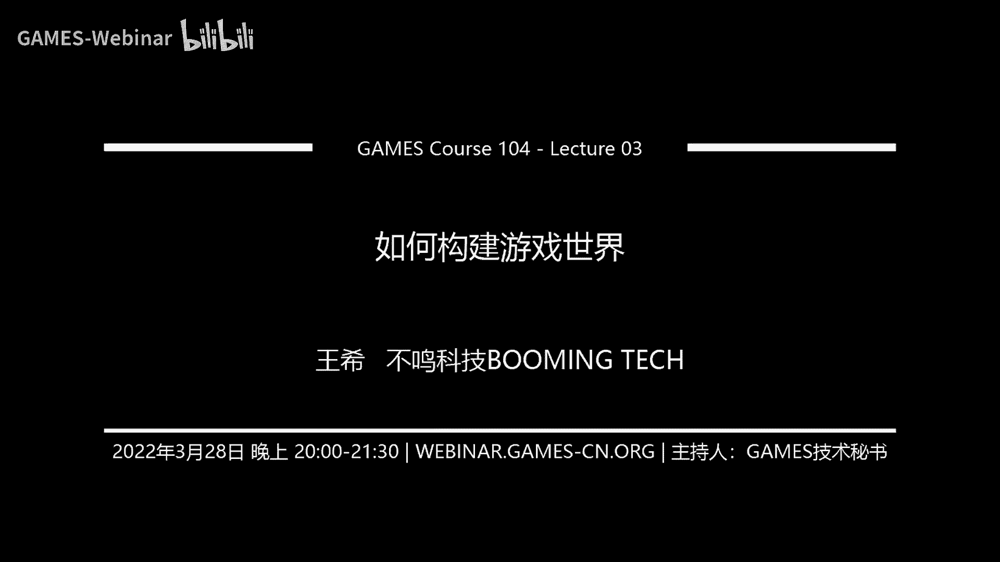
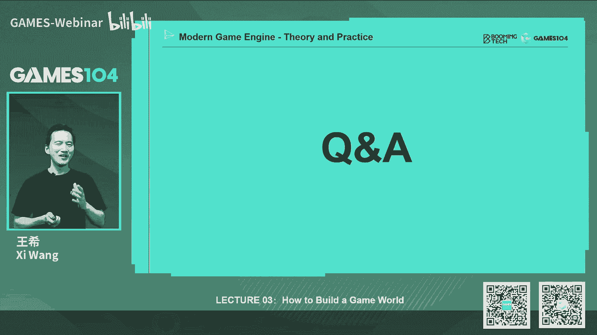

# 03.如何构建游戏世界 ｜ GAMES104-现代游戏引擎：从入门到实践 - P1：0 - GAMES-Webinar - BV1YY4y1p74P

## 概述

在本节课中，我们将学习如何构建游戏世界。我们将了解游戏世界的构成元素，以及如何使用游戏引擎来组织和控制这些元素。

## 游戏世界的构成

以下是游戏世界的构成元素：

* **动态物 (Dynamic Objects)**: 可交互的动态物体，例如坦克、无人机、小兵等。
* **静态物 (Static Objects)**: 静态物体，例如瞭望塔、飞机库、房屋等。
* **环境 (Environment)**: 地形系统、天空等。
* **触发器 (Triggers)**: 检测体，例如触发积分增加的检测区域、空气墙等。
* **游戏规则 (Game Rules)**: 游戏玩法规则。

## 游戏对象 (Game Object)

在游戏中，所有元素都可以抽象为游戏对象 (Game Object)。游戏对象由属性 (Property) 和行为 (Behavior) 组成。

* **属性 (Property)**: 描述游戏对象的特征，例如位置、血量、油量等。
* **行为 (Behavior)**: 描述游戏对象的行为，例如移动、巡逻、攻击等。

## 组件化 (Component-based)

为了更好地管理和扩展游戏对象，我们可以使用组件化 (Component-based) 方法。将游戏对象拆分成多个组件，每个组件负责特定的功能。

* **组件 (Component)**: 负责特定功能的模块，例如位置组件、模型组件、动画组件等。
* **组件基类 (Component Base)**: 组件的基础行为接口。

## Tick 函数

游戏引擎使用 Tick 函数来更新游戏世界。Tick 函数会遍历所有游戏对象，并调用每个组件的 Tick 函数。

## 事件机制 (Event Mechanism)

游戏对象之间通过事件机制进行通信。事件机制可以解耦游戏对象之间的逻辑，并提高效率。

## 场景管理 (Scene Management)

为了高效地管理大量游戏对象，我们需要使用场景管理 (Scene Management) 技术。常见的场景管理技术包括：

* **四叉树 (Quadtree)**: 将场景划分为多个四边形区域。
* **八叉树 (Octree)**: 将场景划分为多个八边形区域。
* **包围盒 (Bounding Volume)**: 使用包围盒来表示游戏对象的空间范围。

## 总结

在本节课中，我们学习了如何构建游戏世界。我们了解了游戏世界的构成元素、游戏对象、组件化、Tick 函数、事件机制和场景管理。这些知识将帮助我们更好地理解游戏引擎的架构，并构建自己的游戏世界。