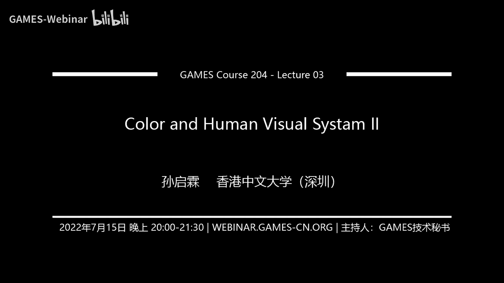

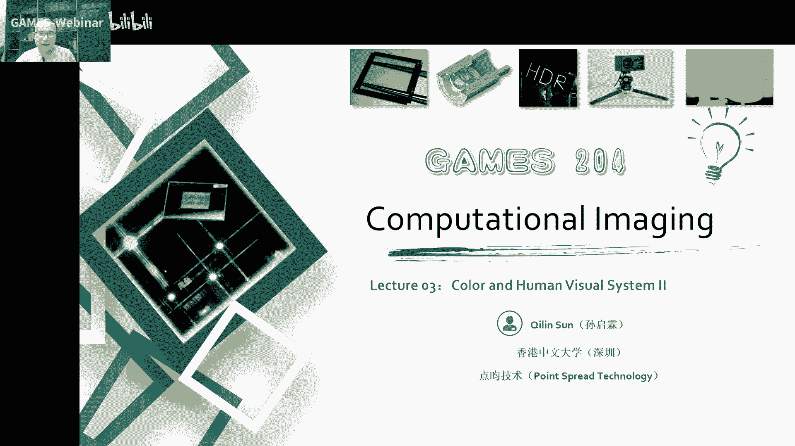

# 03.色彩和人的视觉系统(II) ｜ GAMES204-计算成像 - P1 - GAMES-Webinar - BV1WU4y1i7m5

## 概述

在本节课中，我们将继续探讨色彩和人的视觉系统，重点关注色彩空间、色彩再现以及相机中的色彩感知。

## 色彩空间

### 颜色定量表征

为了方便人们对颜色的认知和交流，我们需要一些统一的方法来量化精确地表达各种颜色。颜色定量表征涉及人类的心理和生理问题，以及照明和观察物体的物理条件。

### CIE 1931 标准色彩系统

国际照明委员会（CIE）在 1931 年提出了 CIE 1931 标准色彩系统，形成了 RGB 色彩空间。我们将在后续课程中介绍各种不同需求的颜色空间或颜色模型。

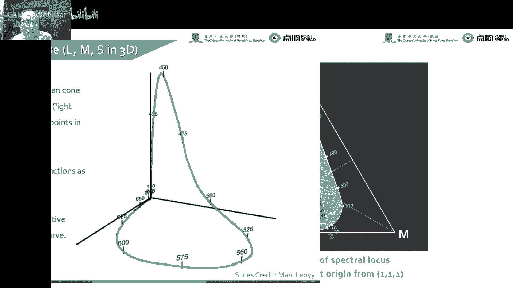

### 颜色空间定义

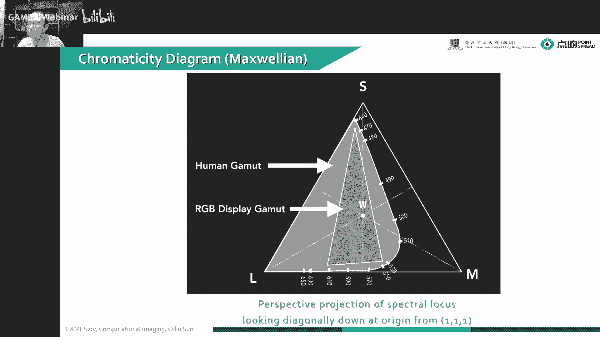

颜色空间可以定义为一种表示颜色的数学方法，用表示颜色的基本参数来描述和记录颜色。常见的色彩空间分为两种：

* **与设备相关的色彩空间**：例如 RGB 色彩空间。
* **与设备无关的色彩空间**：例如 CIE 1931 色彩空间。

### CIE XYZ 空间

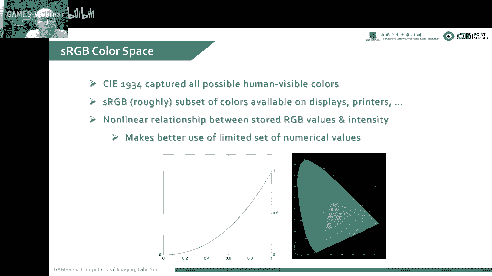

CIE XYZ 空间是一个采用数学方式定义的色彩空间，可以表示出人眼可以看到的所有颜色。

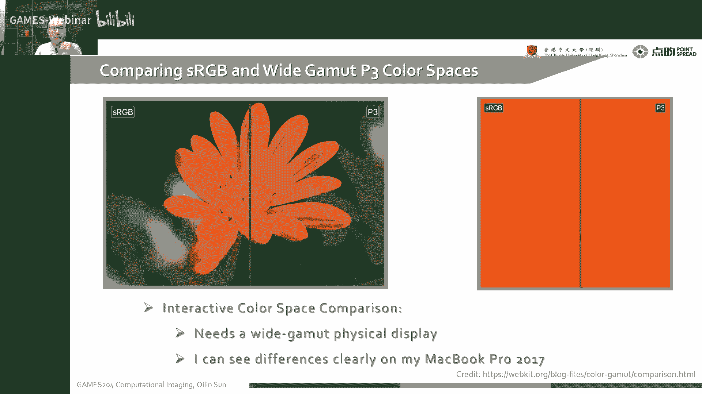

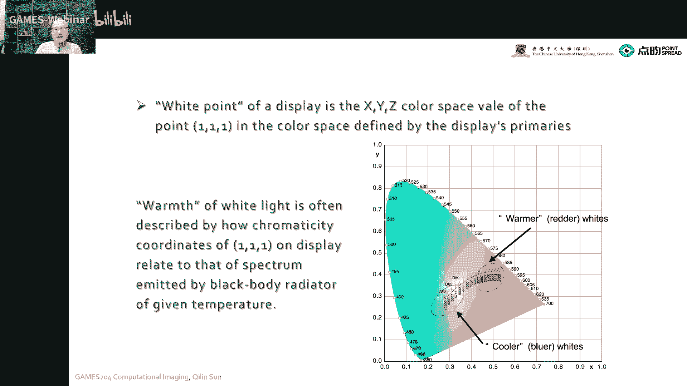

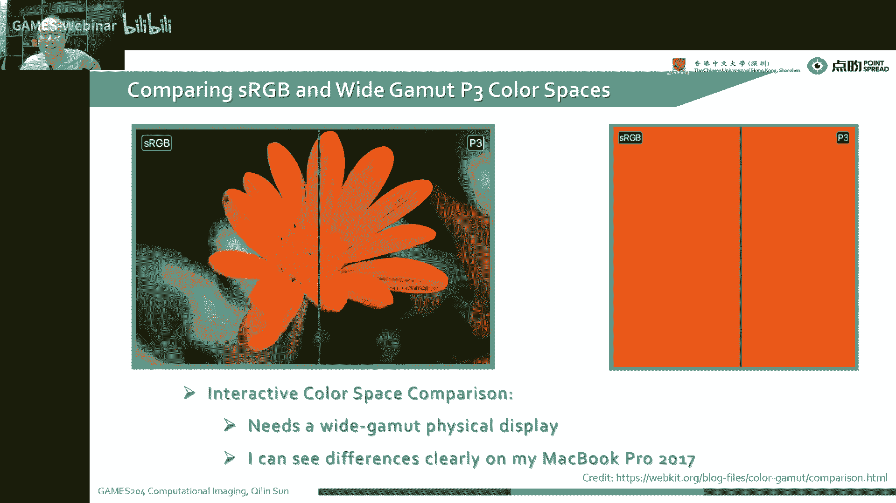

### 色度图

色度图将 CIE XYZ 空间投影到 X+Y+Z=1 的平面上，建立了人眼和它表示的关系。

### 色域

色域是人眼可以感受到的最大色域，例如 sRGB、Adobe RGB 和 Profoto RGB。

### 白点

白点是各种颜色最均衡的地方，也是整个颜色空间的重心。

### HSV 空间

HSV 空间比 RGB 色彩空间更接近于人们对色彩的一个感知经验，可以直观地表达出整个颜色的色调、饱和度和明暗程度。

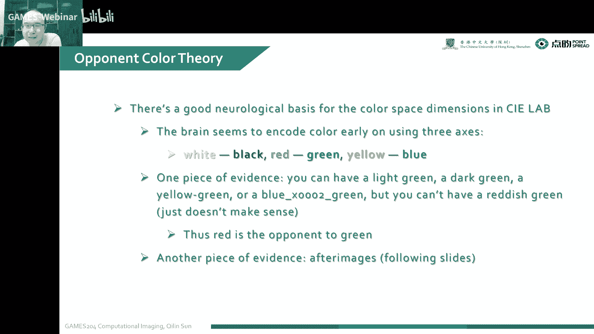

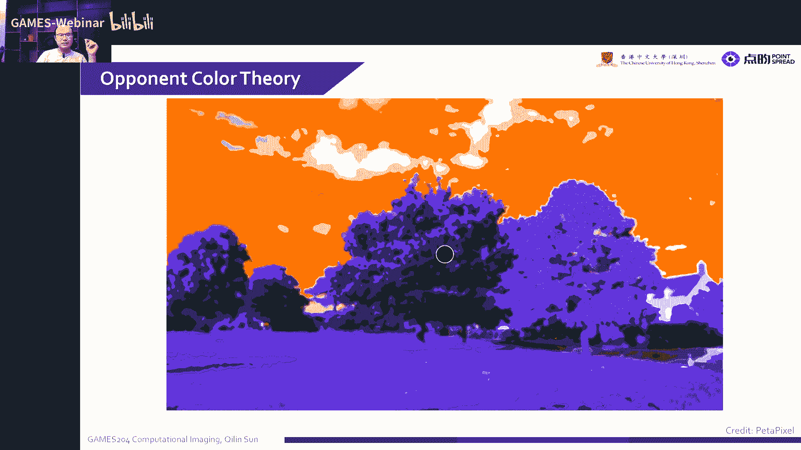

### 孟赛尔颜色系统

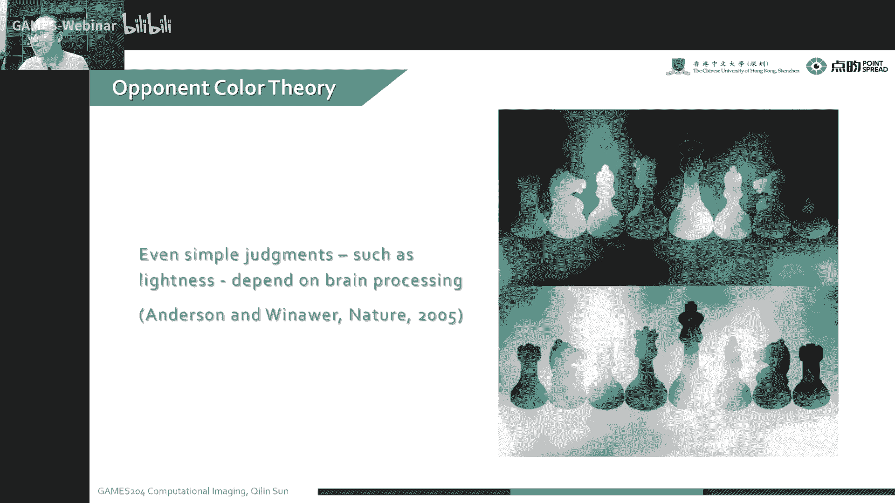

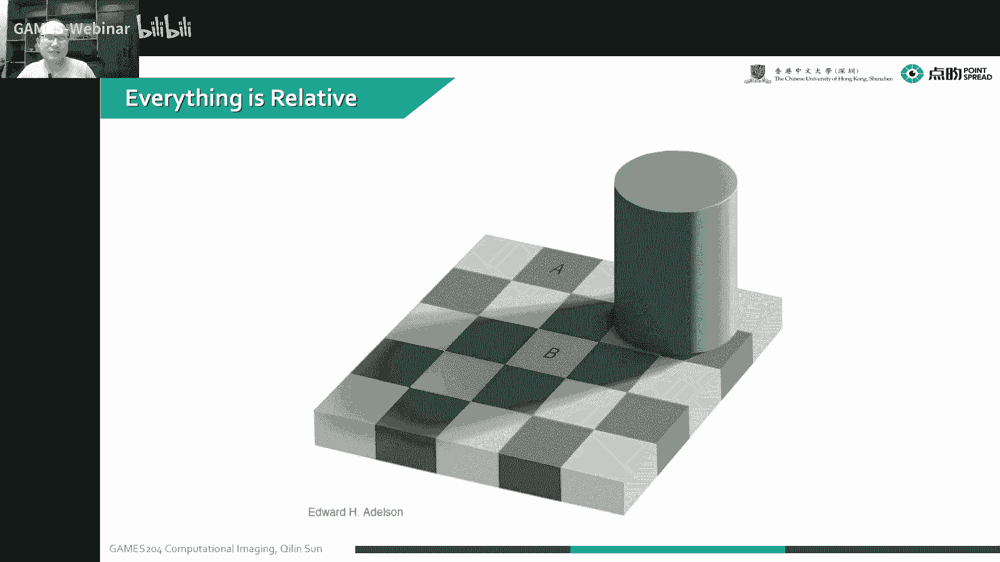

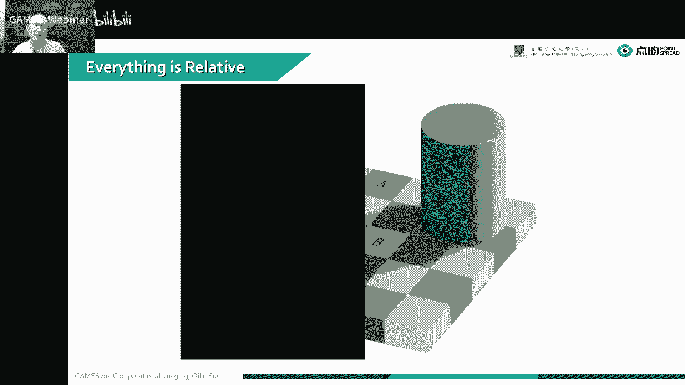

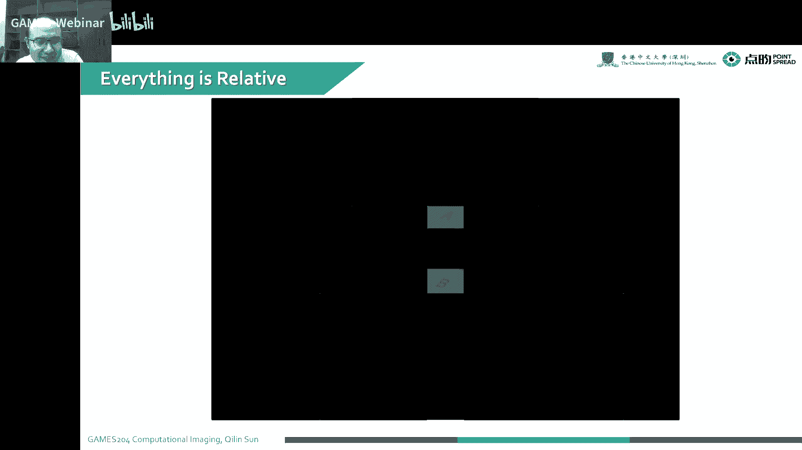

孟赛尔颜色系统是色度或笔色法中，通过色调、明度和彩度三个维度来描述颜色的方法。

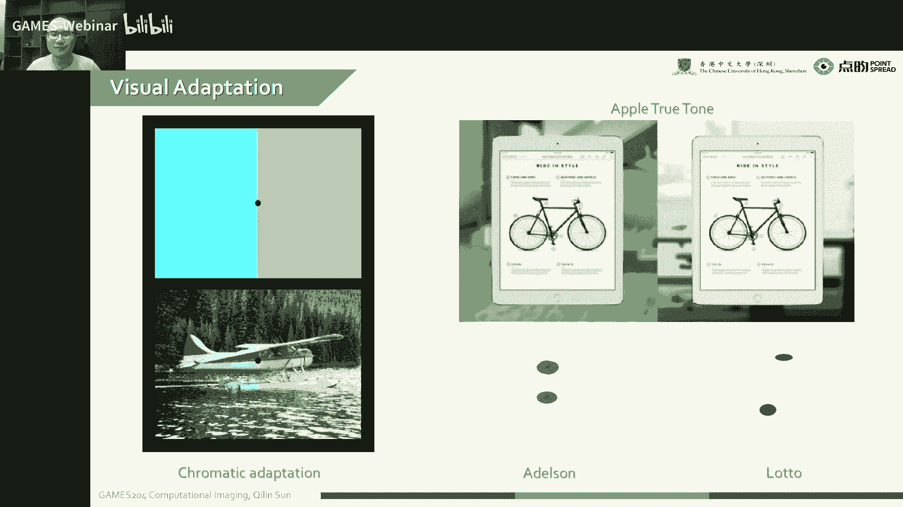

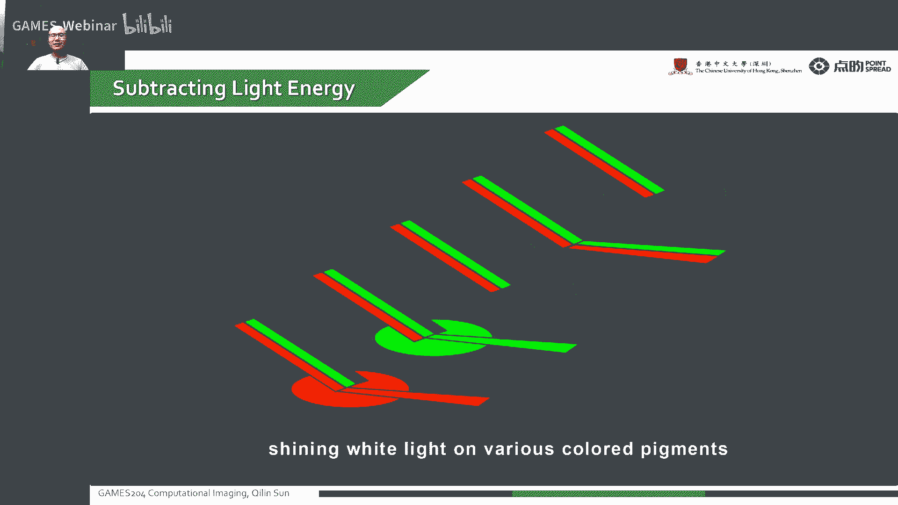

### CIE LAB 空间

CIE LAB 空间是 CIE 提出的描述人眼可见的所有颜色的最完美色彩模型，通常被认为是与设备无关的一种模型。

## 色彩再现

### 色彩再现方法

色彩再现方法用于将 RGB 值转换为显示器上显示的颜色。

### Gamma 校正

Gamma 校正用于调整显示器的亮度响应，使其更接近人眼的感知。

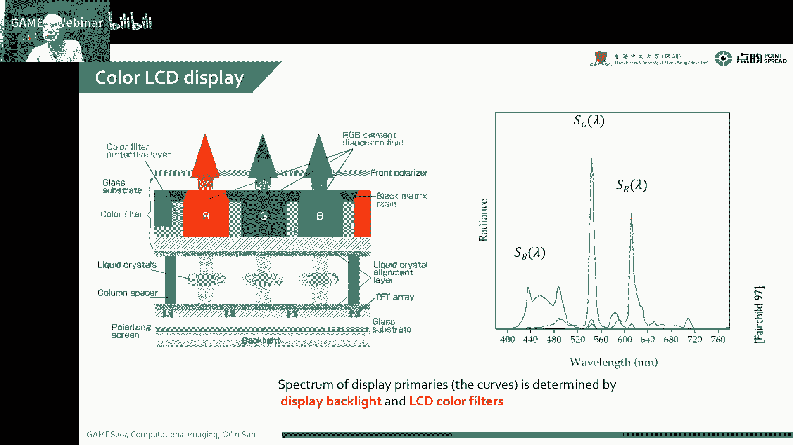

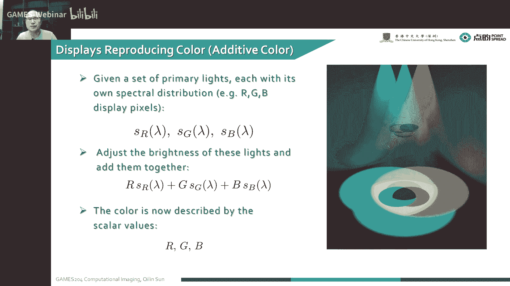

### 色彩管理

色彩管理涉及将颜色从一个颜色空间转换为另一个颜色空间，例如将 RGB 转换为 CMYK。

## 相机中的色彩感知

### Bayer 滤镜

Bayer 滤镜是一种用于彩色成像的阵列，它通过不同的颜色滤镜来捕捉图像。

### De-mosaic

De-mosaic 是从 Bayer 滤镜图像中恢复原始 RGB 图像的过程。

## 总结

在本节课中，我们学习了色彩空间、色彩再现以及相机中的色彩感知。这些知识对于理解图像处理和计算机视觉至关重要。

**本节课中我们一起学习了**：

* 色彩空间
* 色彩再现
* 相机中的色彩感知