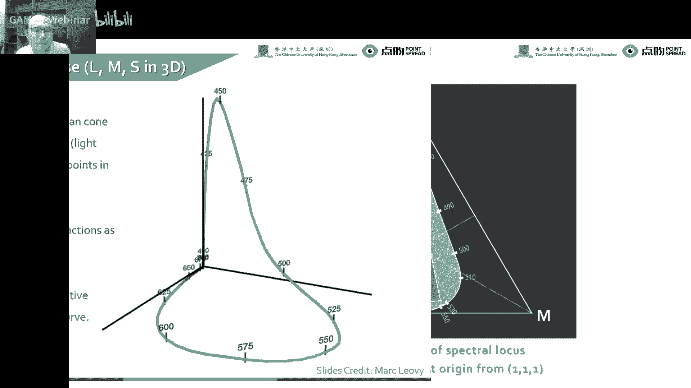
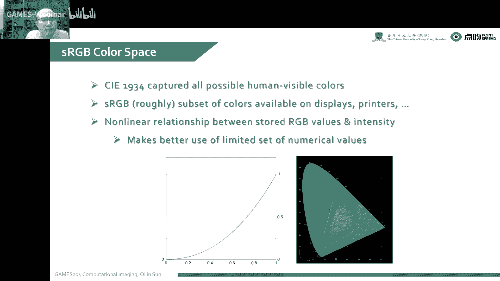
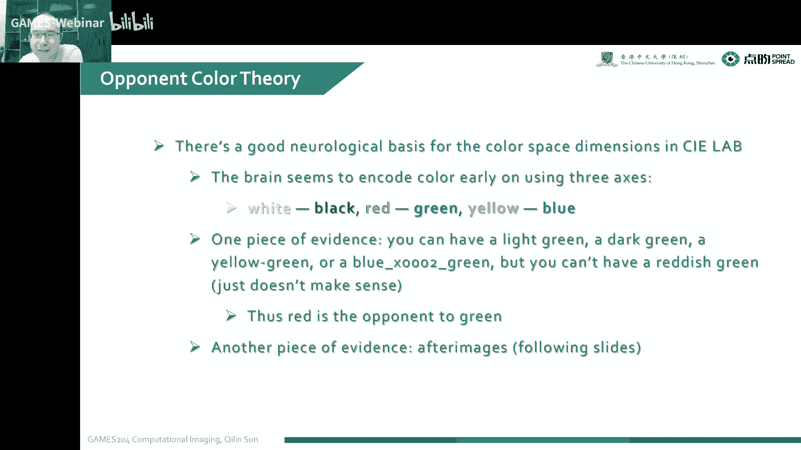
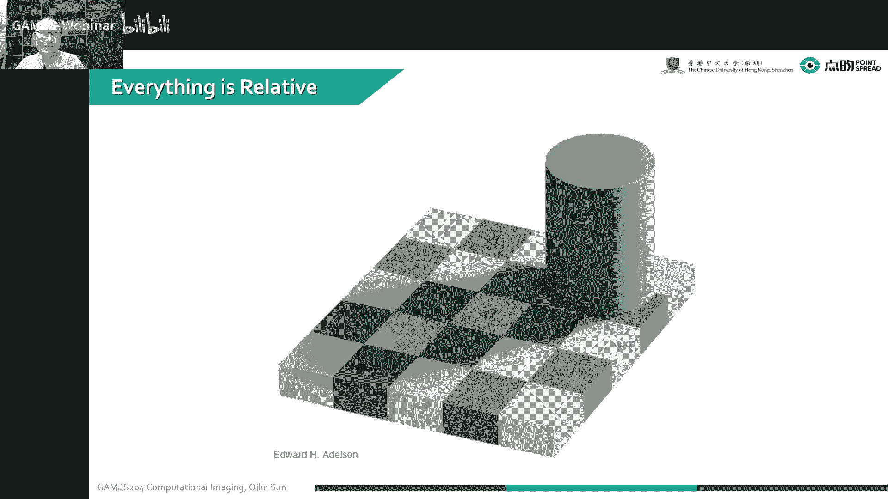
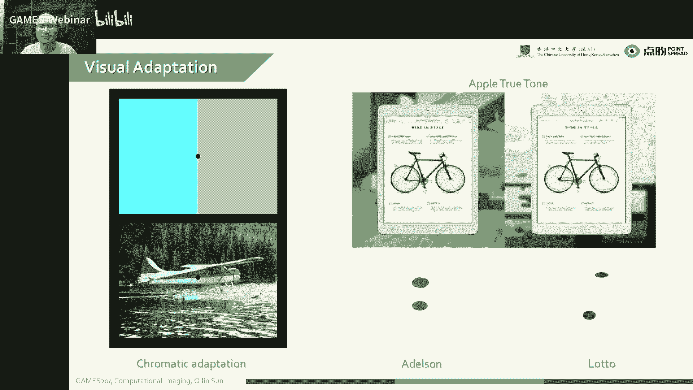
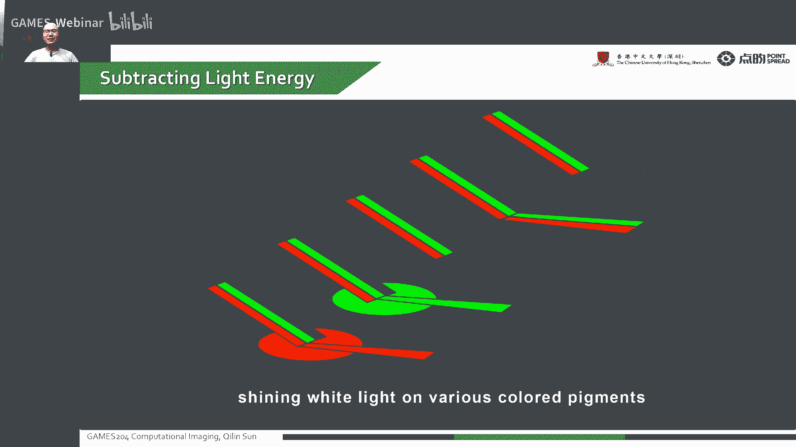
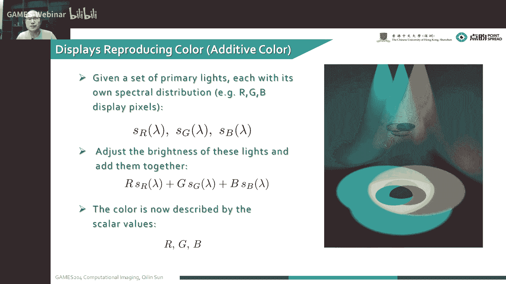
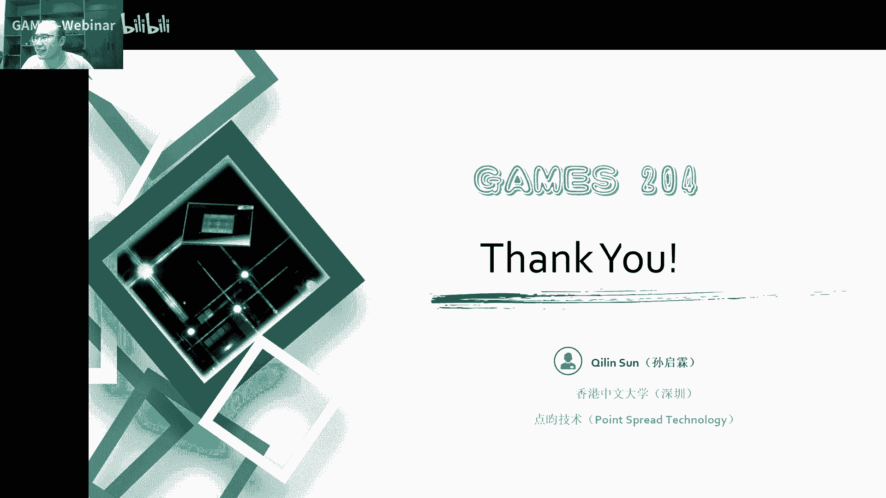

# 03.色彩和人的视觉系统(II) ｜ GAMES204-计算成像 - P1 - GAMES-Webinar - BV1WU4y1i7m5

对了这堂课开始之前想跟大家分享一下。

就这两天被一个韦伯望远镜刷爆空间的一件事情。

就是说大家前几年就NASA发了一个，就是替代以前的哈勃望远镜的一个韦伯望远镜，这有很多那种六面体的一个镜片，就是金属镜片去组成的，然后前两天终于他传回来的一张图，大家可以看到这几天朋友圈已经刷爆了。

大家可以看到就这么一张图，右边是传回来的一张很远距离的一个星空的图，差不多有几十亿到几亿光年几百亿光年这么一个距离，但是大家同学们有没有注意到，就是我们拍到的特别亮的一些星团或星系的时候。

就会产生这么一个六角形，或者是再加上横着边上的一个八角形的一个星毛，这个星毛是怎么形成的呢，这要从这个韦伯望远镜的一个结构说起，这个韦伯望远镜自己，大家可以看到左上角这种结构。

然后右边是垂直垂面的一个图，它是由很多这种六角形的镜片组成的，这个其实每个透镜是非常大的，只有接近一个人这么大，然后我们可以看到，它有自己的一个支撑杆，然后它是一个微微有一个弧面的反射式的望远镜。

然后在上面加了一个探测器，大家可以看到整个我们这个，telescope的一个望远镜的口径，就是它的一个aperture，就像一个由很多小六边形组成的一个大六边形的，这么一个望远镜。

所以说我们对这个孔蓝做了一个费列边上之后，就可以看到，大家可以看到它的整个六芒星的一个形状，比如说我在我这个形状的一个孔蓝下，就我们最后拿到的一个点扩散函数，就是这么一个像一个六芒星。

或者是再加两个小边边，这个6+2这么一个点扩散函数的形状，最后我们拍到的图，就可以看到这种类似星芒的一种情况，后面我可以给大家过一次作业，就是如何把这个星芒去掉，然后拿到一个更真实的色彩。

也就是image deconvolution，我们去模拟这个点扩散函数，比如说我们现在已经拿到这个口径的一个形状了，我们去做它的费列变换，拿到它的一个点扩散函数，然后通过这个点扩散函数。

构建一个求解逆问题的这么一个方程，最后我通过ADMM，然后加上一个我们常见的图像的一个regularizer，primer像total variation，就是我的gradient sparse。

最后求解这个逆问题，就可以把这个blur去掉，把这个绿芒星去掉，拿到一个清晰的图像，其实这种星芒，大家喜欢摄影的同学们是比较常见的，左下角我列出了一种叫星芒镜的一个东西，就是把这个它是比如说你四个星芒。

它就是像方格一样的结构，六个星芒就是像六边形一样的结构，通过这六边形的一些微结构，有这么一个镜片，我放到我的镜头前面，就可以产生这种星芒的效果，大家感兴趣的话可以买一个试试，就不用搞相机了。

就可以怼到自己的手机前面，大家如果还有一个特别有意思的现象，就比如说同学们拿一个自己的手机前置摄像头，对着一个点光源很亮的点光源去拍，你手指在你前置摄像头上，横着划一刀，就会出现一个竖着的星芒。

然后竖着划一刀就会出现一个横着星芒，这是由指纹产生的一个微大结构，最后在你的图像传感器上，就可以拿到两边形的这种星芒的结构，这是课前的一个开胃小菜，当然今天我们的主题还是要讲，继续讲我们的色彩。

因为色彩无论是在成像，在人的视觉中，还是在图形里面，都是一个非常重要的课题，我们稍微调整一下顺向，今天给大家首先讲解的是一个色彩空间的问题，包括我们常见的RGB色彩空间，HSV色彩空间。

还有比如说以前视频传输比较常用的，VLCRCP也就是VUV的一个升级版的色彩空间，还有最后我们的一个国际标准CIE LAB空间，然后给大家分析一下，我们整个monitor，就是我们的display。

是如何复现这些色彩，我们如何通过基色的混合去复现这些色彩呢，然后这就需要通过color reproduction的一个方法，我们是怎么样反向解出来，我们最后要显示的RGB的一个值。

最后把一个真实的色彩就复现给大家，到了最后我会给大家稍微分享一下，这个biofilter还有一个sensor的perception，因为后面我会专门在我呈现的环节中，讲到biofilter的一个问题。

biofilter有非常多的种类，包括RGB、YYC、RGBW，还有像translationXY，其实五花八门的，在人类发展的进程中，有非常多样的一个带流光片。

首先感谢一下今天对于slides的credit，包括Wolfram Hedges老师，还有任恩基，还有等等，就贡献了很多这堂课的一个slides，首先给大家分享的是一个叫color space。

为了方便人们对颜色的一个认知交流，我们需要一些比较统一的方法，来量化精确表达各种颜色，也就是说颜色定量表征，涉及人类的心理和生理的一些问题，同时也涉及照明，涉及观察物体的一个物理条件。

经过很长时间的一段摸索，国际照明委员会，也就是CIE在1931年，提出了CIE1931的标准色彩系统，就形成了RGB的颜色空间，我们在这个课的一个后面，会陆续给大家说出来，各种各样不一样需求的颜色空间。

或者颜色模型，那么这个问题来了，首先什么是颜色空间呢，因为颜色空间可以定义为，是一种表示颜色的数学方法，用表示颜色的基本参数，来描述和记录颜色，比如说像我们的日常常见的一个色彩空间，大概分为两种。

一个是跟设备相关的一个色彩空间，比如说RGB的色彩空间，还有跟设备无关的色彩空间，也就是方便大家去置换的一种色彩空间，也就是CIE1931，我们通常用三种维度，就是三个数字去定义我这种颜色。

但是我整个的颜色空间，也就是用三个维度去来定义，举个例子，比如说我们的一个显示器的，这么一个色彩空间是怎么定义呢，我们想定义一种用RGB，这三个标量来定义一种颜色，然后去产生这一种。

就是可以在显示器上显示这种颜色，最后你拿到的这么一种功率密度谱，就是RGB三种颜色的，三种primary light的一种组合，对不对，但是如何得到一个RGB的值，因为这个RGB的值。

在不同的一个显示器上，在不同的亮度，不同的伽玛都会产生一种颜色的差异，这个问题怎么解决，是我们在接下来的课程中会给大家解答这个问题，然后还有一种就是RGB的本身的这种色彩空间，它是跟我的设备极其相关的。

比如说我在我的显示器面前看到的颜色，跟大家在自己的显示器上看到的颜色，只要是厂家不一样，它的颜色多多少少会有一些出入，同时受限于我们本身的primary light，表示的色彩空间。

比如说像一些vivid yellow，就是这种颜色没有办法在我们显示上去表达，这个问题怎么办，也会给大家在接下来的课程中去介绍一下，在整个颜色空间的数学模型中，我们通常用一个三维的坐标值来描述这个颜色。

我们可以判断解决如何判断这个颜色是不是一样的问题，但是如何判断颜色的相差，仍是一个比较大的一个烫手的一个问题，所以说在整个颜色研究的过程中，我们国际照明委员会定义了cie XYZ这个空间。

它是一个最先采用数学方式来定义的色彩空间，因为cie XYZ最早是在20年代，19世纪20年代后期，一个叫David Varite和Juan Guit，通过做了很多的一些实验。

然后得到了这么一个色彩空间，他用的是一种三色加法的一个模型，然后通过这种三色加法，混合了不同颜色的一些分量，最后就可以达到我们最后就显示出来的一种颜色，然后最后并用xyz去表示。

这个xyz它是可以表示出我们所有可以人看到的一些颜色，但是我们要强调一下，就是我们的matching function，就是我们上一课讲到的matching function，它一定像是正值。

比如说像我们特尤其是我们显示的时候，就我们的光不可能是一个负值，然后其中外值也就是代表了luminance，也就是代表了整个的明度，当然我们可以看到我们左下角的。

CRE color matching function，我们是用虚部去表示的，因为有一些值它就是负的，我不得不得已，然后去表示了这么一种，用虚数去表示它的一个方法。

这个图它不是一个color matching，它不是一个spectral的一个响应，它只是一个color matching的一个值的一组对应关系，最后我们xyz的值是怎么得到呢。

我们color matching function，还有我们公寓谱函数，在每个条曲线上积分，然后拿到了一个值就是xyz的一个值，对这个是有一点抽象，有的同学说这个有点抽象，后面的话会给大家慢慢的解释到。

这个为什么要这么定义，而且整个包括跟RGB色彩空间的关系，这样的话大家就会对整个颜色空间，就有一个比较透彻的理解，同时我们也可以换一些机，因为我们有时候做显示的时候，我们想换一下它的颜色空间。

或者换一下它的primary light，这个时候我们是可以通过这么一个，三乘三的一个matrix，来去对一个颜色空间进行转换，比如说我们想要在一个标准的CIE RGB之间。

与一个CIE xyz之间去做一个色彩空间转换，然后我们就可以用一个三乘三的矩阵来表示它，就是做这么一个非常简单的变化，其实这个大家非常能理解，下面来给大家说一下这个明度，有时候大家也会说亮度。

但是这个最好不要混淆，其实有时候大家觉得明度跟亮度是一回事，但是这个明度跟亮度还是稍微有一些区别的，然后通过我们上节课的一个Coloring Matrix的实验，我们可以表明人是怎么样感知到一个颜色的。

但是我们可以用各种各样，我们知道我们整个产生了三种颜色，是通过对我的一个公义谱函数，对人眼的LMS曲线进行积分，拿到了一个三个值，这样的话就会产生一个同色异谱的现象。

因为我是整个积分的过程是一个多对一的过程，但是我反向解我的解空间几乎是无限的，还有上千万种颜色，这个时候我们就想问一个问题，我们看了一种两种不一样的颜色，但是相同的公语，这个亮度是怎么表示的呢。

下面就要给大家讲一下Luminance，亮度这个问题，亮度也是在CIE XYZ空间中的外，我们人眼就有两种细胞，一种是上节课讲到的追撞细胞，还有一种感光细胞，在我们整个的可见光谱内。

就是人眼对不同频率的光线的感性，就是感受的一种程度也是不一样的，这样的话我们就可以用光谱敏感函数，也就是右边这个图，大家可以看到一个不同细胞的光谱敏感函数，也就是光谱效率函数。

我们可以从图中看到一个追撞细胞，可以能吸收的可见光的光谱的频率的光，就是右边黑色的一个曲线，它在差不多555纳米的时候最为敏感，而对于一些比较短的波长，比如说像低于420纳米的。

还有超过650纳米的这些光，就变得不是很敏感，所以说感撞细胞，也就是对暗视觉显现的细胞，它是大概可以覆盖整个可见光的一个光谱，但是与肢体细胞相比，它对较高频率的一些光感受性就比较差。

感撞细胞差不多是在507纳米会达到一个峰值，而对超过像比如说超过620纳米的感撞细胞，基本上就是不响应了，然后我们最后能感受到的亮度值，就是我们演的光谱效率函数，然后对整个光谱进行积分。

他们一个成绩进行积分，最后你就拿到一个亮度的感受值，所以说人眼为什么对绿色比较敏感，就是我们在555纳米的时候，人眼睛是最为敏感的，就是光谱效率是最高的，而且人眼整个如何测量人眼的一个光谱光效率。

函数也就是我们可以用调节一个单色光的一个过程，我们去扫那么一遍，然后去看到人眼对亮度的一个感受，把它记录下来，就可以感受到我们这个颜色，就上一课我们看到这么一个光谱轨迹的一个函数。

叫Spectrum Locus，它是这几年才专门去定义的一个计量员的名词，就是差不多到2015年才会有的，就以前大家定义颜色空间的时候，又没有考虑到它在一个三维空间的一个响应。

这是我们对它在一个三维空间中的一个Virualization，也就是绘制了人眼的LMS曲线，在三维空间中的一个分布，它跟我们人能感受，它基本上表示了我们人眼所有可以看到的一个颜色。

但是这个跟我们的颜色空间有什么关系呢，大家就是最常见的一个叫色度图，有时候也叫马蹄图。

因为它叫像一个马蹄一样，将我们前面这个Spectrum Locus，就投影到X+Y+Z等于1的这个平面上，我们就可以拿到这么一个色度图，这个就建立起了整个人眼，和它表示的一个关系。

这个有同学问有没有做图形学的看这个，因为这个其实挺近似的，因为图形学里面这个也是必要的一课，但是这个地方又不得不给大家补一补，也就是说我们拿到的一个色度图，是一个从三维到二维的一个映射。

我们可以看到最外围的这个包罗，是我们人眼可以感受到的一个最大的一个色域，像我们的通常我们的显示器，它能表示的一个色域，是比我们人眼能感受到的要小得多，通常是比如说最常见的。

大家Display这个显示器上能看到的一个颜色色域，就是sRGB，好一点的显示器可以看到Adobe RGB，你的单反相机，比如说我们索尼A7，它是可以捕获到一个色域到Profoto RGB。

它是一个比较大的一个更接近人眼色域的，这么一个大色域，但是一般的显示器是没有办法显示出，那么大的一个色域的，对同学们要购买专业显示器的话。

可以参照这堂课，大家可以看到我们色度图，是如何跟人的LMS响应之间构建了一个关系的，就我们近似的想用一个线性的方式去来表示它，右边我们可以画到不同的设备，它在一个最外围当然是人眼的一个色域。

当然就像Apple P3，就是可能Apple比较专业的显示器，可以看到P3，就我们正常的一个显示器就可以看到一个SRGB，就SRGB是一个网络上最通用的一个色域空间，有同学问HDR10是什么意思。

HDR10它是一种HDR的显示标准，大家可以在这个显示标准下，能显示出HDR10的一个标准，但是它还有更高的一些规格，像杜比HDR这是一个比较更高的一个HDR显示规格，可以显示出更大的动态范围。

但跟本杰克没什么关系，但是我们表示我们设计的时候，通常我们想把这个Luminous Y就分开，因为我们不是很想让我们的一个亮度，来干扰我们对颜色的一个表示，同时我们就可以。

因为我们已经投影到了一个X+Y+Z等于1的这么一个平面，然后我们就想把这个Y单独分离出来，所以说在我们的这个，我们用X表示为X+Y+Z，这么一个方式，因为X+Y+Z也就是它们的一个叫色平。

也就是它们之间的比值来表示，这样的话我最后只表示我颜色的时候，就因为X+Y+Z等于1，就是最后我们可以把Z忽略掉，最后就用XY还有一个Luminous来表示，一个坐标来表示整个颜色和亮度。

这是一个C+E的一个色平的图，我们可以看到这整个就是色域的一张图之外，就是越往边缘的位置，它就是越纯净的颜色，也就是说我们饱和度就越高，越往中间，它是颜色也就是越脏，也就是颜色混合的程度就越高。

在正中间就是我整个重心的位置，也就是X=Y=Z=1/3的时候，这个时候我们就可以看到这是一个白点，就让我们的各种颜色的能量是一样的，它是最脏的一个地方，在我们定义了不一样的标准颜色空间。

刚才大家讲到sRGB，它是怎么来的呢，sRGB是一个叫BT709，还有一个BT601这里面没有写到，它是早期显示的一个标准，而且也是当今在互联网，还有一些显示器里面用的最广泛的一个标准。

就是你如果这个图你不知道保存成什么的一个色域的时候，你通常表示成sRGB，它最后打出来的颜色是比较安全的，大家显示器基本上都可以显示出sRGB，然后CIE的RGB它有一点不一样，它是通过用三种波长。

用546。1纳米，435。8纳米，还有一个700纳米的三个波长，来产生的一个颜色，这个怎么来定义呢，大家可以看到这是一个，在我们的整个我们的色域里面，我找三个点。

大家学过Games 101的时候可以知道，我们叫Biosentric Coordinates，我这里面的颜色，我都可以用这三个点的群众来表示，比如说三个点ABC，我分别其中的一个点就可以。

一个点的坐标就可以用αA+βB+γ=C，来表示其中αA+βB+γ=C，比如说我最大，我这三种三个顶点的一个参考的颜色，就是我画到这个三角形里面的颜色，我是都可以表达出来的。

但是我这三个primary light之外的，是没有办法表示的，但是同学们问题又来了，这个CIE RGB，它这个三个primary light，它这个三个基色是怎么定义的呢，为什么选546。1 435。

8，还有700纳米，也就是说因为546。1跟435。8，是拱蒸气放电产生的色线，就是拱蒸气产生了一个光谱，就有这么两个比较强的点，那为什么选700呢，因为700就是，人影对这个700纳米。

它的波长变化不是特别敏感，所以说在primary light颜色上有一个小的误差，对结果影响也不大，所以说那个时候就为什么选了这种三种颜色，来做一个三原色，CIE RGB的一个三原色。

然后就引出来从RGB，就引出来一个standard RGB，也就是说我们各种各样的，为什么要用standard sRGB呢，因为早期就是这个颜色没有办法统一，就每个设备之间都有差异。

我们就比如说记录下来的RGB值，其实就是不一样的，不一样的一个设备，就是记录的RGB值不一样的，所以说为了解决这么一个问题，那么在1996年，其实没有多久，是1996年开发出了sRGB的这么一个系统。

这样就方便了大家对具体的条件和设备，来确定一个色彩的配置，那个时候就是96年那会儿，就是sRGB的配置文件，就以常见的CRT显示器为基础，一般是针对家庭和办公环境来设计的。

sRGB是电脑显示器和互联网的，一个标准的色彩文件，因为这个时候就是刚才大家也提过，在这种情况下，就是在各种不受控的条件下，各种不一样的显示设备，还有存储设备不货设备。

我都转化成一个标准的一个standard sRGB，这个时候就可以统一大部分场景，来显示出一个，大家可以让大家看到一个比较真的一种颜色，大家刚才说到就是CIE的一个标准。

就捕获了所有的人眼可以看到的颜色，sRGB它是相对大家可以看到，这个相对整个人眼的色域是非常小的，是非常小的一个subset，我们可以看到在不同色域的显示下的一个比较。

左边黄花右边黄花，我们可以看到整个色彩的液力程度是非常不一样的，而且大家可以看到右边的一个P3跟sRGB，就在一个P3色域下，我们可以看到如果大家显示器比较好的话，就可以看到它不是一片红的。

它是有一个图案在上面的，但是把它转化到sRGB的一个色域下，它就没有办法去分这两种颜色，说到整个颜色空间，就不得不说有同学问如何判断显示器支持哪种色域。

大家可以看到红色的图。

左边是sRGB的一个，右边是P3的一个，现在的一般设备都可以大概覆盖90%或者99%的Adobe RGB，大家可以看到左边跟右边这么一个区别，左边sRGB是分不出两种颜色的。

右边P3就可以分出两种颜色的，如果要判断你整个显示器支持哪种色域，我建议同学直接看一下显示器后面说明书，这个上面会直接标出来你可以显示出什么色域，说到整个色域。

我们就不得不提一下白点，白点无论白点就是顾名思义，它是各种颜色最均衡的一个地方，也就是整个颜色空间的一个把心的位置，就是马蹄图的中心，我们在整个CIE的右边CIE的色图图上标注出来。

这么一行就是它的一个白点，因为白点对整个显示器最终显示出来的颜色，也是非常重要的，因为它并不是只是影响我白色是什么样的白色，而是白点定义之后，大部分的色空间中的颜色都会受到白点的影响。

除了一些专业的显示器，像我们大家平时日常用的消费级显示器，整个白点基本上说是没有是准的，基本上都是五花八门都是很准，大家不信可以测一测，大家显示的时候，它白点基本上是不会落在像D65或D50。

这么一个标准的白点上，我们自己因为看一台显示器不是特别明显，大家把这个显示器台式显示器跟笔记本显示器放在一起，看一个同样的颜色，差别是非常明显的，当然白色的定义也会根据色温。

就是大家上期课来说的一个色温来定义的，包括像D50 D65，它都定义了冷暖不一样的一个白色，大家在做摄影的时候，做白平衡的时候，就是不一样的环境，我们需要做不一样的白平衡。

但一般情况下大家通常用一张白纸，黑色的白纸，然后一拍做个白平衡就可以了，但是实际的专业器材里面有一个叫白平衡卡，通过拍摄在这个环境里面一个白平衡卡，我们先对相机一个白平衡参数进行校正。

然后再去拍摄就可以拍出来专业级的一个大片，当然这个显示设备也被定制上，我们如何利用这么一个色域图呢，大家可以看到我们当定义了白点之后，通常会有一种非常有意思的现象，就是我A点跟B点，C点跟D点。

这两个是对着的，我这两个像素按它的一个亮度加全之后，就可以拿到一个黑色白色，或者甚至一个灰色的这么一个东西，所以这个A点白点对应的颜色，或者是C点D点对应的颜色，后面大家会讲到这是比较补色的一个东西。

这两种颜色的对比是最强的，然后我们对我们显示器来说，我们要定义了三个primary light，就是PEPRP3，大家可以想到我们在一个，Barycentric coordinate三角坐标里面。

我可以表示出我这三个点以内的所有的颜色，当然它不能有负值，因为我这个重心，因为Barycentric coordinate里面这个值都是正的，这就是你能表现的最大的色域。

所以说我们的显示器能表示出什么样的色域，它的一个基测的光的位置是非常重要的，然后现在给大家batch一下HSV，上一块我们讲到了一个Pure Saturation and Brightness。

今天我们讲了一个方便表示颜色的空间，因为我们自然环境下获取的一个图像，就非常容易受到光照遮挡，阴影一些的影响，就是它对亮度是比较能感觉，我们刚才讲到RGB的颜色空间，我们RGB的三个值。

都跟亮度是密切相关的，就是我们它的亮度只要一改变，大家显示器我们的亮度稍微调一调，三个分量都会改变，其实它这个颜色是会变的，但是人眼又对RGB三种颜色的敏感程度是不一样。

所以说这个时候整个就不是很好调节了，因为RGB颜色空间它是一个均匀性比较差的颜色空间，它颜色的相似性如果用欧式距离来衡量的话，它的结果跟人眼的感觉会有一个非常大的偏差，我们也就是说用RGB表示的颜色。

我们比较难用一个很精确的三个数值分量去表示它，所以说像我们说到的一个RGB的颜色空间，就更适用于显示系统，但是它并不是适合图像处理，根据以上这种理由，我们聪明的人类就发明了HSV这种空间。

它比RGB更接近于人们对色彩的一个感知的经验，而且可以比较直观的表达出整个颜色的色调，就是鲜艳程度还有一个明暗程度，这样的话就比较容易对颜色进行对比，在我们HSV的颜色空间下。

比RGB的一个空间里面更容易追踪我这个颜色，到底是一个什么颜色，也是比较容易对一个特定颜色的物体进行分割，我们通常用图中的柱状图来表示HSV的空间，它的整个柱状图可以表示成一个极坐标系。

就是H表示极坐标的一个极角，Q就是我的一个色相，S就是saturation的饱和度，越靠近边缘的地方饱和度越高，也就是说代表这种颜色越纯，然后V实际上就是它的一个value，它是一个强度的一个值。

这个同学问老师带研究生吗，那肯定是带的，然后HSV空间这三个字母代表什么意思呢，Q也就是我们说的一个色调或者是色相，Saturation就是它的一个饱和度，也就意味着它的一个色彩纯净度。

这个value大家要注意一下，这个叫它的值，它是对光的量或者是光源的功率的感知，这个跟大家提到的SSL空间，就是Luminous，QSaturationLuminous。

这个和Brightness还有value不一样的地方是什么呢，就我们的value通常是被认为是光的量，可以是任何颜色，但是这个Brightness，就是这个L通常是用为白的量来解释的。

所以这两个是很近似，但是是稍微有点区别的，这个BD同学问，数学学得很好，数学学得不是很好能搞CV吗，因为我不是搞CV的，这块我不是特别熟，我们是做Computer Imaging。

最近在做RCC文件对色彩管理是比较麻烦，所以说最后大家做色彩映射的时候，通常会搞一个3D LUT，就是3D Lookup Table来做它，这样的话就是能比较精确的去表示出这个颜色，欢迎申请。

这个工作也是没问题，有工作经验，下面来给大家分享一下Mosaic Color System，这个翻译叫Mosaic颜色系统，它是色度或者是笔色法里面，通过我这个value。

就是Hue还有一个Chroma，就是叫彩度，Chroma叫彩度，三个维度来描述颜色的方法，这个颜色系统是美国艺术家孟赛尔，在上上个世纪末创立的，差不多上个世纪30年代，就是采纳为泥土研究的官方颜色描述。

到了今天仍是一个比较色法的标准，因为我们早期的几个色彩体系，将颜色放在不同的一个三维色的立体空间里面，但是孟赛尔是第一个把色调，明度跟彩度分离成感知均匀和独立的一个尺度。

而且是第一个系统在三个空间中表达对颜色的一个关系，大家可以看到右面这个图，在孟赛尔的系统，尤其是再标记法是基于严格的，基于人类受测试者的一个视觉反应，它是根据人的一个视觉反应的实验科学来定义的。

它是基于人类的一个视觉感知，哪怕是到了今天，现在的色彩模式已经非常丰富了，但是在一些特殊领域的一些用途，仍然是牢牢占住了它的地位，哪怕是今天的CIe LAB，还有CIe CAM的一个空间出现了。

在整个孟赛尔的一个系统，仍是很受欢迎的一个广泛使用的一个系统，大家看到CIe 1931里面，大家比如说画几个圈圈在上面，叫MACDAME Eclipse画几个椭圆在上面，我们可以发现在蓝色区域。

我这个点稍微移动一下，其实我这个颜色变化量是非常大的，相反比如说你在绿色或者是红色那个角，你颜色稍微变化一点，但是它的影响基本上就不大，这个时候我整个色度图，人类对这种颜色的感知是不均匀的。

就是我们表示它的时候，在这个色度上表示的时候，我们对蓝色稍微变一点值就会变非常大，这个对大家来说就是一个比较不好的事情，所以后来人们就发明了一个更新的一种，叫CIe 1971，这么一个色度图。

就是来把整形了一下，然后我在不一样的颜色里面看起来更均匀，下面来给大家就是batch一下，这个CIe LAB空间，这个CIe LAB有时候叫CIe Lab，是贯肠最好不要叫Lab。

叫LAB分开念它就有信号了，是贯肠用描述人眼可见的所有颜色的，一个最完美的一种色彩模型，因为这也是CIe提出的，它整个信号大家最好也不要省略，它是全民的一部分，它表示L* A*和B*，就不同于LAB。

因为红黄还有绿蓝这种对立的一种颜色，就是人对人的追撞细胞对这种对立颜色，类似于梦黛尔值的变换响应的一个差异，就CIe LAB是一个adam的色彩，也就是chromatic value空间里面的一个。

这三个值基本表示坐标的一个L，就是比如说我这个L*等于0的时候，就是黑色，大家可以看右边这个图，这个L这个value最下面的时候就是一个黑色，然后最亮的时候就是100这个值的时候，就是一个纯白的颜色。

我们看到AB这两个值，这个就是从红色从A+就是红色，然后慢慢到品红再到绿色之间A，这两个就是A+和A-这两个是补色，补色中间，中间的位置就是没有颜色就是灰度，就是我们在最下面的。

再把这整个往下拉的时候就是零，最上上的时候就是一个白点，就已经建立的这个LED颜色模型，通常来说是跟设备无关的一种模型，就只要认识到我们其实在视觉表示这种颜色，是没有办法是完全的精确去表示的。

但是这个概念就可以比较清晰的表示出，我们在三维空间中表示出的颜色模型，当然它也就是牵扯出了这么一个补色的这么一个原理，就是这个A-A+B-B+是一个复补的一个颜色。

现在讲一下CIE XRZ到CIE LAB，这个两个空间的一个相互转换，其实这个相互转换是比较简单的，因为这个纯粹是这个公式纯粹就是根据它，这个画的这个圈模拟出来的，也没有说特别精确。

但是大概这么表示就没有问题，大家把这个公式记住就可以了，但是要记住一下这个要注意一下这个Xn Yn Zn，它是对应着我在这个CIE XRZ空间里面对应的一个白点，刚才大家说到这个1931这个标准。

就是感觉这个均匀性不是特别好，尤其是对这个蓝色区域稍微动着一点，我这个整个颜色就变得一个变化就非常明显，所以说在1976年，这整个国际照明委员会，就把这个做了一个升级，改成一个LAB这么一个空间。

最后就把我们右边这个马蹄图，经过这边一个整形变换，就大家上面这个上一页这一页这个公式做了一个整形变换，我把它整成一个方的了，就可以拿到一个感知比较均匀的这么一个，人类的一个色域图。

大家有兴趣的话可以参照一下，这个CIE 1931跟1976的一个标准，还要看一下这两个定义的一个故事，链接是给大家了，大家可以课后点开去仔细阅读一下，其实这个CIE 1931那时候定义的并不是特别严谨。

他就是最后是17个人，17个标准的一个观察者，我这去观察这些颜色去做一些区分，你要说从今天来看其实挺玩笑的一个，但是那个时候就也是精挑细选，那么17个人定义了这么一个颜色标准，其实生活在不一样地区的人。

或者是不一样生活环境的人，就比如说咱在北极的人，那个颜色的感知它就是不一样，所以说这个定义也不是这么的完美，到了1976年其实人们就对这整个色彩空间的定义，包括CIE XYZ的定义，就会变得更科学一点。

刚才讲到CIE XYZ空间就牵扯到了一个补色的问题，什么是补色呢，就是说我这两个东西是相对的，就是我大脑里面对这两种颜色，就我的感受是最强烈的，比如说补色就白对黑，红对绿，黄对蓝，这个就是现代色彩理论。

比如说像RGB加色模型，或者是打印的CMY减色模型，就形成这么一个互补的一个对，但这个补色理论就一个非常有意思的事情，大家可以看到这么一个图，大家以前上图形学的课可能会看到。

我们盯在屏幕中间的小黑点盯个20秒，来倒数，15，14，13，盯在中间一个点，11，10，9，8，7，6，5，4，3，2，1，这一瞬间的感受是什么。

有没有看到彩色绿色蓝天，绿草，这个就是一个人的补色的一个响应，同样的给大家看到一个非常有名的一个，black and white的一个城堡，15 14，他自己倒计时了，大家可以看到，盯着屏幕看。

有没有看到颜色，在这一刻我们的脑补自己就补出来这么一个颜色，其实补色它是有一个标准的理论的，哪怕是一个非常简单的调整，比如像我的一个照明的情况，它整个都是基于你大脑的一个处理。

没有大家可以回头再看看视频，再盯着去看一下，我也会把slides发给大家，大家可以在自己电脑上多盯一会儿，对立集中一些就可以看到这个颜色是脑补出来了，而且我们很多的事情都是相对。

大家这个就经常常见的，A跟B它的灰度是不是一样了，遮挡一部分A跟B，这个时候看着还是不一样，这个时候看着还是不一样。

咋办呢，继续做遮挡。

这个AB看着还是不一样，就是相对的感觉，它确实是一直没法消失的，我们继续遮挡，这个时候我们看着AB还是不一样，这真的不一样吗，是不是，再继续遮挡，我发现这个A跟B它是一个灰度，是真的是一模一样。

人眼都是有一个叫visual adaptation的一个能力。

叫人眼的一个适应能力，就是大家可以看到左边这个图，其实大家可以看到就下面这种，它这个色彩其实都是不对的，但是人就可以脑补出来它的色彩，其实这下面这个东西是没有色彩的。

大家也可以看到就是apple true tone，这么一个东西，就是它在不同环境下，它最后感觉到我们自行车显示出来的东西，你感受到的感觉是差不太多，这个颜色也能感觉出来，像刚才我们看到的AB块。

它的颜色我们到，还有像乐图，比如这两个块，这中心黄块跟上面这个，褐色的块，这两个是一个颜色吗，在我们这里看，因为人眼的visual adaptation的一个效应，看着完全不一样的，但实际上这个AB。

跟玩具中心这个位置，它确实是一样的，是吧，这就是人眼的，在骗了你的大脑在骗你，你也可以说你的眼睛在骗你的大脑，讲了这么多，就不得不说，一个就是我们以前最早的一个。

像我们如何把三个颜色混在一起，产生颜色，因为这个对我们的一个显示还是打印，都是至关重要的，我们从小时候就学过，对光学上自然课，对光的就是绿色红色蓝色混在一起，就可以得到那么白色这么一个感觉，对不对。

然后红色我们看到了红色的物体，直反射红色，绿色的物体是因为它直反射绿色，蓝色的是因为它直反射蓝色，像镜子全都可以反射，但是黑的啥都不反射了，然后这个时候，因为像我们的显示器通常是用这种颜色相加。

来混合出颜色，但是对我们的打印机或者是我们的绘画，它就有点不一样了，这种我们就需要用检测法，因为我们最后我们打印出来的一个颜色，它是通过吸收跟反射光，来产生这么一种颜色，比如它是像比如说涂料，染料墨水。

还有各种天然色素混合，这种橙黑颜色，就大家小时候觉得，红黄蓝混在一起咋是黑的呢，是不是，这个时候就叫检测法，也就是说，这个黄，我们就通常定义一个CMY，就是CM Magenta跟，就是青色品红还有黄色。

用这三个颜色就是CMY空间去做一个打印的颜色，这个CM青色就是，我们整个的白色减掉一个，一个红色也就是说，它是B跟G的相加，Magenta就是品红，也就是这个蓝色跟红色的一个相加。

黄的就是绿的跟红的相加，这么一个表现方案，就是我们最后我们是要想让他看到它一个反射谱，而不是它的吸收谱，今天这个课有点长不好意思，因为内容太多了，这个我后面讲快一点，就是大家可以看到，右边的这张图。

就我在我们CMY打印出来一个空间，我把三个通道拆开，就可以看到像，CM Magenta品红还有黄色把它混在一起，就可以产生我们最后是这么一个颜色，因为它是一个补色，就是反射的一个减色，用了一个减色法。

它是用于颜色的混合的一个地方，老师是做打印机的色彩管理吗，对CMY空间通常是用在打印机，除了打印机，大家就是绘画的时候也都是通常用CMY，所以为什么要加个K呢，K就是简单来说就是黑色的一个墨粉。

用K之后主要是为了省墨，最右边大家可以看到，我们用了黑色之后，我整个品红蓝黄可以少用非常多，来混出黑色，因为黑色这个东西便宜，我们用墨就可以了，所以说只要加K主要是为了便宜，为了经济性更加的保障一些。

然后说到YCR CB CR这么个，黑色也不用做灰平衡，对这个也倒是，主要是为了省墨，灰平衡就是需要三个颜色去对它做一个平衡，这个YCR CB是用干嘛的呢，它主要是用于优化彩色细频信号的传输来的。

最早大家可以接受到YUV，为什么叫YUV呢，它的Y就是它的亮度，U跟V反映了它的一个颜色跟饱和度，为什么要用这个，其实这个有历史原因，早期在彩色电视没有普及的时候，黑白是混着用的。

最早搞YUV就是为了我这个格式又能给彩色相机看，又能给黑白电视看，我不能把一个RGB传给电视，所以说就搞了YUV这么一种格式，就Y黑白电视我可以只看Y通道，彩色电视又把后面色度跟饱和度一起。

拿出来看一下，对就是大家所说的黑白电视，但在RGB跟YCR CB空间，这个YCR CB实际上就是后来大家对整个，BT601跟BT709的一个显示标准，对YUV进行了升级。

最后拿到了一个YCR CBCR这么一个颜色空间，就是数字电视的颜色空间，它在YUV之间的转换是比较容易的，它对应的是亮度，色度还有一个饱和度这么一个问题，我们可以直接很容易的用下面的这么一个式子。

来做颜色的一个转换，又不得不提一句，这个YCBCR在影片处理中，特别是影像的连续处理中是非常常见的，但是有时候大家同学会看到Y'就是外撇，为什么有来这个外撇呢，突然想到了这个外撇跟Y是不一样的。

Y就是它的一个luminance，而外撇有时候大家看到外撇，这么一个东西，大家先到外撇，它表示光的浓度，因为这个，它的表示是光的浓度，大家要想清楚，但这个外撇通常是非线性的。

我们通常需要用一个γ校正来做编码处理，CB跟CR就是蓝色跟红色的浓度的一个偏移量，YCBCR它不是一种绝对的色彩空间，它是一个YUV的压缩和偏移的一个版本，它的整个Y是跟YUV是一样的。

但是CB跟CR比YUV的也都是指一个色彩，对这个是有人，很多书都会写这个，但是有时候值不一样，大家要是8位的时候，256的时候是可以用这个值的，要0的1的时候要注意一点，尤其不要让最高那一位去做饱和。

写代码的时候要尤其注意，YCBCR其实用的非常广泛，比如说像大家JPEG MPEG DVD，像摄影机，很多时候都会采用这种YCBCR的一种格式，当然一般现在可能大家对YUV跟YCBCR也不大分歧。

YUV也基本上就是俗称，这也就是我们YCBCR的一个俗称了，就是，Y'就是大家讲到这个Y'，这个跟YCR不一样的地方，就是像我们现在讲的YCBCR，它是对RGB的一个彩色进行编码。

其实最后真正我们要显色的时候，是要根据一个色盘就colorrand，然后去查找之后来显示的，就是刚才那个同学要在调RCC profile，也就是要调显示器的颜色，要根据RCC的数据，最后在色盘里的查找。

最后才能显示一个比较真的颜色，有时候大家通常喜欢用Y'CBCR，去做一个简单的图像压缩，通常有这个，大家经常可以听到什么呢，就是比如说YUV444，大家这个地方就是按俗称来，YUV444。

YUV444就是这三个通道，就是采样率是一样的，就是每个像素的一个都是一个完整的一个采样，最后我们，比如说8位的，这一个像素点就是三个byte，就YUV422，大家有时候说422，422指的是什么呢。

就是我们在这个图里面，它的水平方向的色素采样，是444的一半，我们后边那两个通道是不是就可以，做一个压缩了，就是我整个最后采出来的东西，是从一张图三个byte，到了两张图四个byte。

就是缩减了1/3的一个压缩量，然后还有一些像YUV420，就是我在这个采样了之后，我一张图里边，我搞个Y'CBCR就是420这种一个方式，下一张图就是422，但统一都说就是420。

它可以做一个简单的快速的有层压缩，因为我们后两个通道色彩，其实对我们整个看到的图影响不是那么强烈，就不像整个亮度的通道，它对细节的分辨率感觉特别明显，当然这也是由人眼性质本身决定的。

就是彩色的感知能力就570块像素，但是你的一个感双细胞，它对亮度的感双能力有1。2个亿，有一个本质的人眼的区别，刚才这同学也提到了RCC profile的一个问题，这个就涉及到了一个颜色的转换。

我们给了一个标准的颜色空间，就是sRGB，我们想要打印出来，就是转换成一个CM2K的这么一个值，最后打整，因为我们最后要它的一个任务，就是要对我们输出的，反射出来让人眼感受到的光谱是匹配的。

这个时候整个之前讲到的，一个同色异谱的效应就比较重要了，但是这个东西其实是非常困难的，比如说像我们的VR显示，跟打印机最后显示出来的东西，色域还有整个颜色管理都是不一样的。

而且我们有非常多的一些管理方式，比如像刚才同学说的RCC profile，也可以用Adobe Color Management，这个问题就比较复杂了，如果在Color Matching。

我们在这节课后面会给大家讲到，提到Gamma Correction，就不得不提CRT显示器，因为我们老式的CRT显示器，它这个音级视线管，就是它电流和最后显示出来，灵光响应的灰度。

它会有一个Gamma的值，比如说我最后打出来的一个光景，跟我这个偏压，就是跟我加的电压，它有这么一个Gamma差不多等于2。5的差别，也就是说我这要是Yuv传的话。

我这个Y通道就需要把它反向的拉这么一个，1/2。5的一个指数的一个值，才能在我的显示器上拿到一个别的颜色，这有历史原因，比如说右边这个，右边是我们想要看到的一个图，左边就是没有做Gamma矫正。

当然这个Gamma矫正发展到了今天，因为现在的Gamma很多都是，用的都是一个local tarmac，就是除了像我只是简单的做一个Gamma之外，我在我量暗变化比较大的地方。

我想过模仿人眼一个测预知的效应，然后去产生一个local adaptation，来对一个边缘的更加增强，也就需要像特别是在HDR显示里面，有一个time mapping这么一个环节。

而local time mapping就是对我图像的局部进行增强，然后这样的话我整体的量暗，包括对比就会看来更加舒服明显，讲了这么多，我们最后我们的显示器，到底是怎么把这个颜色显示出来的呢。

刚才我们讲到了，就是我整个色域图里面选三个点，这三个点里面我用它的一个加权权重，就是当值都是正的，就用biosensor code算了之后，其中一个点这个颜色就能表示，但对显示器来说。

比如说我们常见的显示器像LCD和LED，就是我最后我能表示出来这个谱线，它跟这三个基色是密切相关的，就是举个例子，像LCD来说，就是LCD就是有三个日光片，然后还有一个背光灯。

就是你最后三个基色发出来的颜色，就是你的背光，大家可以看到，大家把这个显示器可以，当然这不建议大家去撕了，表面上液晶撕下来之后，大家可以看到一个均匀的云光板，这个云光板就是我们最后的所谓的背光。

它的一个均匀的白色光，我透过这么个三个基色的一个color filter，然后就会产生三种的一个primary light，它最后的颜色就是我整个color filter的一个。

透射的光谱乘以我们最后它发光的光谱，就拿到最后三个光的波长的响应，LED显示器一定是LED它自发光的，直接就是这三个LED的一个光谱，然后通过这三个基色的组合，然后就可以拿到我们最后想要表示的色域。

当然这三个基色我们可以直接在我们的，马蹄图里面找到三个点，就是马蹄图里面直接找到三个基色的三个点，这里三个点的里面，就是我最后能表示的色域，表示出的颜色，当然我们显示器它是主动显示的一种显示器。

还是RGB三种颜色的相加，我们也可以调这种三种基色的一个亮度，来通过它的组合来最后拿到我想要，所展示出来的一个颜色的色彩，然后这个颜色的色彩它到底是怎么精确的，跟人眼的LMS曲线去匹配的呢。

这个时候就要涉及，一个color reproduction的一个环节。

就是我这个颜色到底是怎么跟，我这三个基色它有自己的响应曲线，我怎么样去混合，来跟我的人眼的LMS曲线去匹配呢，这个时候就是一个最后涉及到显示，到底是怎么显示出来的这么一个问题。

大家还记得这么一个matching function，对于任意一个光的光谱，S我们把它记为S，我最后感知到在一个CIE RGB的一个空间里面，就感知到这么个颜色。

它在我们RGB的color matching function，里面的一个积分的响应，也就是说我是每个通道对它自己的一个，光谱在通道的响应曲线上进行积分，拿到了这么一个值。

大家注意这个图不是color matching的curve，它不是一个primary spectrum，它是一个color matching的值，它有负的这个地方，通常说有时候大家把这个翻上去。

因为我们最后显示出来的时候，我们那个光发光不能有负值，所以有时候大家会用一个虚数来表示，有时候这时候我们色域就受限了，这个问题大家要注意到，然后继续像刚才的，当时我们这个积分过程。

有时候计算机不是很喜欢这种连续的积分，大家就可以把它离散采样，大概可能几百个上千个点就够了，大家这个地方就假设是n个点，它的积分实际上就是两个vector，做一个内积，最后我就得到一个值。

一个就是我光谱响应，我把它离散采样做成一个vector，另外一个就是我这个CIE，RGB上的一个响应拿到那么一个vector，两个vector相乘，然后大家做内积最后就是相加，实际上就是积分。

就可以写成这么一个形式，这样的话对于我们的计算机来说，是更容易去计算的，然后我们把这三个通道，就写成一个矩阵相乘的形式，我们可以看到我们的R值，就红色通道值，就是R bar，然后做一根S成一个内积。

然后其他的两个通道类似，就可以做到那么一个n乘3，三乘n，然后再一个n乘1，这么两个矩阵相乘，最后得到RGB三个值，实际上就是对它做积分，我们整个color reproduction的一个目标是什么。

也就是说在我们这么一个像素值上，我们拿到跟人眼睛匹配的这么一种颜色，就是我最后响应的值，我怎么去跟基色，还有人眼前人曲线去匹配，实际上我们的目的就是拿到了，我要给电脑的RGB三个值。

然后这三个值通过驱动了一个primary light，然后到最后在人眼里面显示的颜色，就跟自然空间里面看到的是一样的，这就是我们的目的，这个时候我们可以看到右边，我们最后显示出来的光谱。

我们就把它记为sdc，然后我们给到了显示器的三个值RGB，然后sr就是我们三个通道的一个，就是基色的一个谱线，我们当然把这些都写成vector形式，我们的目的就是让我们的display的光谱。

然后通过积分之后，对下一次可以加一支笔，然后把这个积分之后，就是跟人眼的lns曲线的积分，最后是一样的，这个怎么做呢，就是我让我的display的这个东西，就是人眼的lns曲线的响应。

就跟我最后display的光谱相乘，我这个display就根据上一页，我们可以把两个拆解，就可以拆解成我人眼的相应曲线，乘以三个基色的光谱响应，出光谱曲线，还有RGB的值。

然后我display里面的光谱，最后要跟自然界的光谱去匹配，比如说我要把我们左边的这一部分，跟自然界去画一个等号，然后来求解RGB的一个值，然后因为我们display的lns的值。

最后要跟真实物理世界的lns的值一样，对不对，这个是我们最终的目的，然后大家就可以看到，就跟自然界里面一样的一个颜色，我们把上面这个smr display，跟下面的smr real画一个等号。

然后就可以连力得到一个方程组，然后去求解RGB的值，我们在我们的显示器上，把这三个值输给电脑，就可以显示出跟自然界一样的一个颜色，对我们把它滑了一下，就是让它们画个等号，那我们可以把前面这一部分。

这个是n*3，然后乘以一个3*n的这么一个矩阵，最后拿到一个3*3的矩阵，因为这个响应大部分都不是，都是有响应的，所以说我们通常认为最后拿到一个3*n，然后乘n*3，最后得到一个3*3的矩阵。

它是可逆的，基本都是可逆的，它是一个满质的矩阵，那再通过一个人影的一个响应，还有本身这个spectrum的一个响应，我们通过这么一系列的求解，就可以拿到我在我，我给电脑最后的一个3个RGB的值。

看到的跟自然界的一样，然后大家可以看到，我要求解的事情，就是这个RGB的一个value，然后前面部分是一个33矩阵的e，后面也可以写成一个1*3的矩阵，大家简单一点，其实把这些写在一起也是没有问题的。

最后就得到一个RGB的一个value，就是最适合它显示，把前面一起组合了，再去解它，都一样的，反正这三个方法就是，纯新代数的算法，这个大家可以自由选择，大家要注意的是，本身我们去复现这个颜色的时候。

我们三个基色的颜色，是不可能是负的，这个大家要特别注意的，因为我们不可能产生一个负的光，但是我们可以用一些其他的办法，就是一些补色的原理，就大概让人感受到这么一个，负的RGB的值。

就最后把这个颜色给映射显示出来，也是让人感觉到也没有太大的问题，但这个时候就会严重的限制我们显示器的色域，就是比如说大家用有好的相机，比如说像索尼A7，我拍了它一个图。

我这个图是Profoto RGB的这么一张图，当然我们的显示器通常做不到，Profoto RGB这么大一个色域，通常顶多就是Adobe RGB，色域不如我这个图的色域小。

然后这个我硬是要显示出来这么大一个色域，然后这个时候就颜色就会，看到颜色就会发青，就偏灰的这种一种感觉，这个时候就是颜色显示，没有能力去显示它，但除了像我们刚才讲到了一个，imagery的一个方法。

其实还有一种方法叫，Pseudo-Geometric Interpretation，其实这个资料倒是不多，但是我看着倒是挺好的，这个东西可以讲一下，就我们的一个显示器，就是之前讲到了。

它是在一个比较低的一个，就是维度的一个，就是子空间里面去显示一个，就是各种各样可以，就通过各种各样线性的，对基色的一个组合来显示出来，这么一个子空间，在我们Color Reproduction的过程中。

就给了一个，响应的一个谱，就是一个光谱，它一个比较高的维度，它有非常多的一个点，就我们想用这么一个，窄色的一个谱，就S'，把它记录为S'，然后在我们显示里面，就用一个低维度的一个S'。

去对人眼的IRS群体，就产生了这么一个，相同的颜色，其实也就是做了一个，Dot Production，就是Dot Production as a Projection，我们想用一个高维度的一个投影。

就投影到这三个vector上，然后最后我们就可以，就想象，就是右边你可以想象一下，就我们在一个，有3D的模拟的这么一个空间里面，去把RGB的一个值，或者是抽出来，其实本身这个性质，就可以作为一个投影。

但这个时候，之前我们说到，这是我们对从一个高维向，一个低纹度的一个投影，然后我们想用，更少的一个三个基色，去表达出这种，对人眼IRS群体，一个相同的一个响应，这个时候我们就，想用一些垂直的一些基去表示。

这个就不细讲了，因为这个Circular Geometric Interpretation，的资料太少了，就大家有兴趣的，可以专门找一节，这个节看一下，大家可以去看一看，这个CRT显示器的一个三个基色。

然后我们就想用这么三个，SV SG SR显示，A高的一个颜色，对不对，因为这个CRT显示器，它是一个灵光发光的一个东西，它有自己的一个特殊的一个补件，它整个绿光片的材料，不能像今天LCD里面那么发达。

我可以去调绿光片的一个补件，不是这个不是风，那个同学问了，为什么会有四个风，它这就有三个风，最后这个是我要想要发出来的一个光，就是一个发出来的颜色的感受，这个就是，也不是不是，这个是这个四个风。

它这个两个风就SR，它确实有两个风，这是灵光它的一个响应，就是我CRT显示器表面是一个，我用阴极色线打到一种荧光材料上，我整个florescence的一个荧光的响应，它就是这么的红色的地方，就是两个风。

这个时候其实就挺有意思了，你在色素图上画到的，其实是相当于是四个点，但有两个点的一个相对位置是固定的，这个就是我们常见的一个LCD和LED的一个响应谱，蓝绿三个组合，是iPhone5。

iPhone5应该是LCD的，LED的，这个可能是LED的，然后通过这种基色的组合，我们去跟人眼的一个LMS去匹配，就可以最后显示出来，就人眼想要的一个效果。

最后给大家简单的科普一下这个Bayer filter，因为我们知道人眼的LMS曲线响应，其实到了我们成像那一关，其实就是我最后一个绿光片的一个响应，就是说这个时候大家就可以把这个套用过来。

这个其实是完全一样的，这个同学是LCD，对，这两个确实是工业界确实是太慢了，这个就是大家成像的时候，以前大家成像想要成色彩色的，就是在一个Bayer绿光片发明之前，想要成一个彩色的图像。

通常会用一个半透半反镜，然后每个地方加一个单个的绿光片，就好几个传感器，我去补着这么一个彩色，这个时候其实就是比较昂贵，系统也比较复杂，为了经济性，人们就做了一个color filter array。

就是像一个马赛克块的那么一个图，在一张传感器上就可以通过不一样的对光的过滤，来达到一个颜色，当然它也是有自己的一个想象一个谱的，就不一样的，就是绿光片它的一个透过的光谱，想象曲线。

也就是说对我最后补照的图，就会有一个不一样的色域，这个就比较简单了，它就是这种组合，除了之前大家说到的RGB，其实这几年就是手机摄影，图像是会产生混叠的，就是你采样的时候，确实是有问题的。

所以说大家要de-mosaic，de-mosaic还是一个很大的一个课题，就是从零几年到现在搞的论文是非常多的，就包括很好用的一个Marvel Zip，大概de-mosaic的方法就有五六种。

但是它本身有一些算法是可以抗混叠的，这个时候就是最后插足的时候，大家一定要特别注意，它极易对那些高频的地方就产生混叠，它是会产生混叠的，那就随了这几年，就手机的一个拍照的驱动，就对整个上游的产业链。

就是大家想出来各种各样，五花八门的一个color filter，就从最早的RGB到RYC，对是的，所以有很多研究去做驱马赛克，像RYC，这个Y咱就想了，它是两个通道的相加，C也是两个通道相加。

这个时候整个进光量就变大了，就说RYC RYB这种特殊的color filter rate，它对整个暗夜拍照的进光量是更大的，有性噪比是更高的，但是像用这种东西，大家可以就在色录图上划了一下。

就看到我用这几种颜色去组合，其实我最后的一个色域是变小了的，比如说我们能表示的颜色更少了，它为了进光量，牺牲了一下颜色的这么一个东西，但除了这些还有RGBW，我留一个通道是白的，还有RGBRR。

就有一个通道看红暗的，通过红暗的，我去增强这个图，其实受整个需求的驱使，它是五花八门的这么一种玩法，还有一种比较高级的一种绿光片，我这个叠三层，一层绿光片可以透，就直接下面跟一个sensor。

把这个透过去了，下一层，然后其他的红跟蓝通道是透过去了，然后下一层就是把绿的拦着了，然后感知到把红的透下去了，就这样叠在一起，这个方便这家公司就是搞一个，你不用代价filter，我就用更高级的。

一个像素才有三种颜色，是不是，但这种成本会比较高，最近也没有推广，但它的颜色也会受影响，因为整个透射跟反射的谱，它是受整个结构的这些，被绿光片的设计的影响，就是它颜色的质量会更差一些。

到最后颜色怎么补货，会给大家专门在后面成像的环节里面去讲，今天不好意思讲的有点长，就给大家讲了一下color space，如何去复现这个颜色，然后最后在我们的相机里面，颜色是怎么感知的。

对前面的铺垫基本上到了今天就完成了，后面就是下一节课，就给大家正把紧讲一下整个相机的这么一个系统，就是一般的一个成像的相机是什么样的系统，后面再会给大家讲到。

这个Optics Imaging Toolkit，Mathematics Toolkit，后面一些应用举例，好，谢谢大家，今天的课程就到此为止，有什么问题大家可以现在就问，现在没有问题了吗。

刚开始这一刻可能会有点抽象，但是用完后大家可能对整个，4代工具的理解就会越明白，它本质上都是一个Spectrum Low-cost的一种投影，下一课我用Pad讲，这个Pad可以画一下。

现在笔记本不大好画，下节课开始给大家用Pad好了，给大家写一写到底是咋玩的，色彩管理这个不会讲了，这个跟成像关系不是特别大，可以让伊凡老师后面专门开一节，Display的课给大家讲一讲。

现在都还在补基础的阶段，还没有完全进入整个成像的一个体系里面，明度亮度色度，其实明度其实就是人眼对这个东西的感知，这些大家理解就好了，不一定要背下来，这个关键在于理解，明度亮度色度。

这个东西主要是这个色度跟这前面两个没关系，就是先说明度跟亮度，明度就是Brightness，亮度是Luminance，就明度就是进光亮，然后这个亮度就是这东西有多白，你可以理解为就是明度。

它是一个可以你可以说一个单一色彩也可以更亮，但亮度通常就是说我这个整个就是白色的有多白，就是大概是这么一个东西，然后色度又不一样，色度就是我这色相，就是我这个颜色到底是啥，概念不用背，这个就是理解。

关键是要理解，就理解这个颜色空间怎么回事，最后怎么表示它，哪个空间用啥，三文成像会讲，这个会给大家讲三文成像会讲涉及到双目，结构光还有一个i-Tof跟D-Tof，我有时间的话，我可以给大家讲一下。

Abido 3D这一块，对，因为色彩这后面你会用到了，就因为主要是大家对显示这一块可能用的比较少，如果涉及到显示底层的话，比如说要做一个显示芯片，这个时候你对整个色彩理解就要比较透彻了。

这个时候你要会专门设计整个色彩的学解器，或者是RCC的profile或3D lookup table这些东西，这些同学们还有问题，偏振，这个要看后面有没有时间，本来规划是有要讲，因为偏振区成像这两年。

就已经越来越，对工业界的影响越来越大，亮度和灰度数字可以等同吗，就尽量不要等同，但你要硬化等号，确实是不行，好了，看同学没有问题没有了，今天的课就到这里，谢谢大家，好，同学们再见，下周见。

