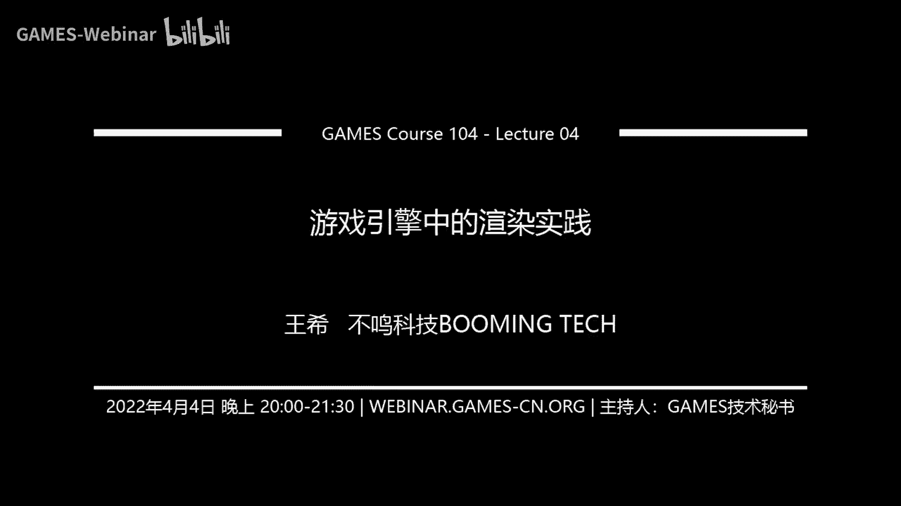
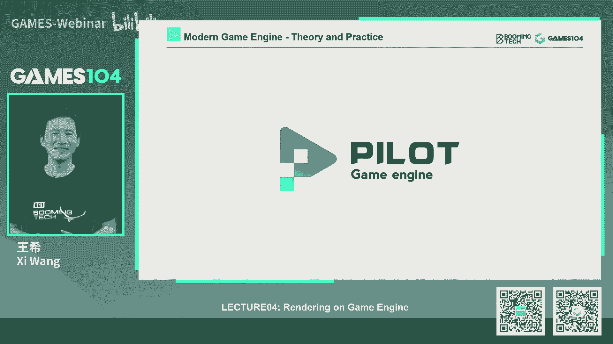
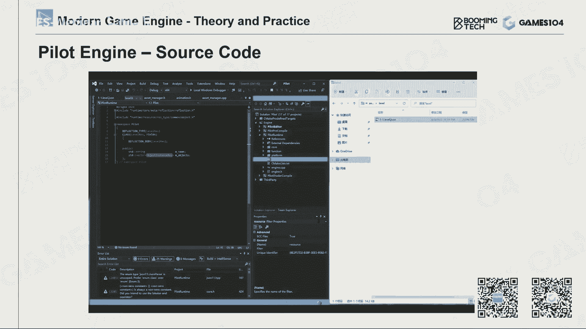
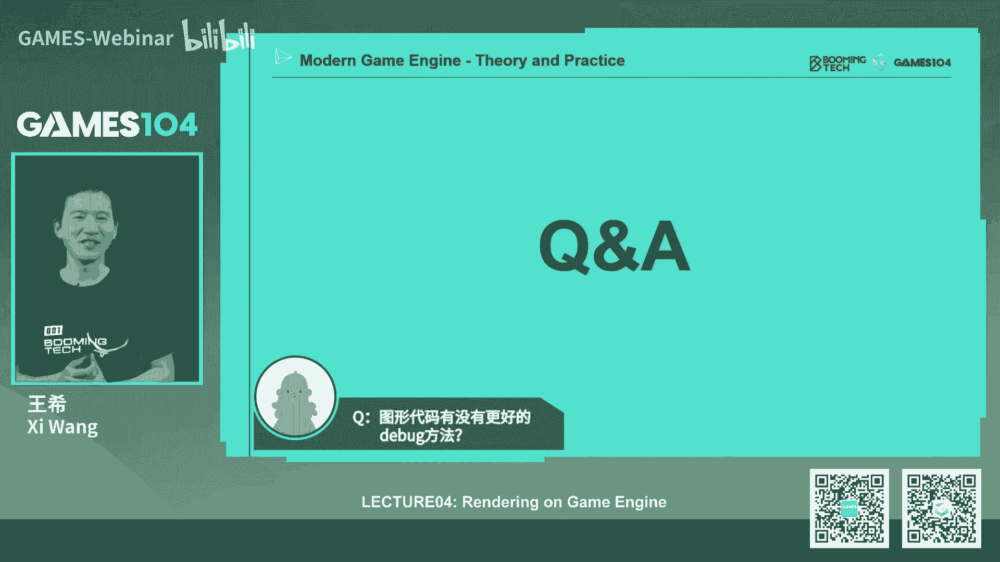

# 🎮 课程04：游戏引擎中的渲染实践 | GAMES104-现代游戏引擎：从入门到实践

在本节课中，我们将要学习游戏引擎渲染系统的基础知识。我们将从渲染系统面临的挑战开始，逐步深入到GPU硬件架构、可渲染对象的数据组织、可见性裁剪等核心概念，并了解现代渲染管线的发展趋势。课程内容旨在为初学者建立清晰、实用的知识框架。

## 📖 概述：游戏引擎渲染系统的挑战与特点

游戏引擎的绘制系统是一个庞大且复杂的模块。从最早的示波器时代到现代的高性能GPU，渲染技术经历了巨大的演变。虽然游戏引擎远不止渲染，但渲染系统无疑是技术难度和专业壁垒最高的部分之一。

绝大多数现代游戏都需要绘制系统。计算机图形学理论为渲染系统提供了算法基础，但游戏中的渲染实践面临着独特的工程挑战。

上一节我们介绍了游戏引擎的整体架构，本节中我们来看看渲染系统具体面临哪些挑战。

以下是游戏引擎渲染系统区别于理论图形学的四个核心挑战：

1.  **复杂性**：游戏场景需要同时处理成千上万个不同类型的物体（如角色、植被、水体、天空），并整合多种绘制算法（如毛发、皮肤、水体）以及大量的后处理和光照运算。这是一个“All in One”的复杂组合系统。
2.  **硬件深度适配**：渲染算法必须高效运行在特定的硬件架构（如PC、主机、移动设备）上，而非理想化的计算模型。这要求开发者必须深入理解当代硬件的特性。
3.  **严格的性能预算**：游戏必须保持稳定的帧率（如30FPS或60FPS），无论场景复杂与否。渲染算法必须在固定的时间预算（如每帧33ms或16ms）内完成，且随着分辨率提升（如从1080P到4K、8K），预算愈发紧张。
4.  **资源共享**：渲染系统不能独占全部计算资源（如CPU）。它通常只能占用约10%-20%的CPU资源，其余需留给游戏逻辑、网络等其他子系统。因此需要进行性能剖析（Profiling）以确保不超预算。

这些挑战使得现代游戏引擎的渲染系统设计，与传统计算机图形学理论有较大差别。本课程章节（共四节）将聚焦于这个高度工程化、经过近30年迭代优化的软件系统。

## 🧠 第一部分：理解渲染与GPU硬件基础

在深入渲染管线之前，我们需要理解渲染的基本要素和其运行的硬件基础——GPU。

### 渲染的基本要素

渲染的核心工作是计算。其过程可以简化为：将三维空间中的顶点通过投影矩阵变换到屏幕空间，光栅化为像素，然后为每个像素计算颜色（考虑材质、纹理、光照等）。

一个基础的渲染计算通常包含以下几种操作：
*   **访问常量**（如屏幕尺寸）
*   **数学运算**（如向量点乘、矩阵变换）
*   **访问变量**
*   **纹理采样**

其中，**纹理采样**是一个复杂且昂贵的操作。为了抗锯齿（Aliasing），纹理通常存储为多级渐远纹理（Mipmaps）。一次纹理采样可能需要访问多个像素并进行多次插值。

### GPU：渲染的核心硬件

GPU（Graphics Processing Unit）是现代渲染的基石。它的强大算力源于两种关键架构思想：

1.  **SIMD（单指令多数据）**：一条指令可以同时对多个数据执行相同操作（如对一个四维向量做加法）。
2.  **SIMT（单指令多线程）**：这是GPU的核心思想。GPU拥有大量小型计算核心（如NVIDIA的CUDA Core）。一条指令可以同时在数百甚至数千个核心上执行相同的操作，但每个核心处理自己的数据。这实现了极高的并行计算能力。

公式：`总计算能力 ≈ 核心数量 × SIMD宽度 × 指令吞吐量`

现代GPU（如NVIDIA的Fermi、Ampere架构）由多个图形处理集群（GPC）组成，每个GPC内包含多个流式多处理器（SM）。每个SM内集成了大量CUDA核心、专用纹理单元、特殊函数单元（SFU），以及共享内存。最新的架构还集成了张量核心（Tensor Core）和光追核心（RT Core）。

### 硬件架构对渲染设计的影响

理解硬件架构后，我们可以总结出几个影响渲染系统设计的关键原则：

1.  **数据局部性与缓存**：CPU/GPU从缓存读取数据比从内存/显存快得多。设计数据结构时，应尽量让连续访问的数据在内存中也连续存放，以提高缓存命中率（Cache Hit），避免缓存未命中（Cache Miss）导致的性能下降。
2.  **避免回读（Readback）**：从GPU显存向CPU内存回读数据速度很慢，且会造成流水线停滞，增加延迟。渲染系统应设计为**单向数据流**，尽可能让数据从CPU流向GPU，避免反向操作。
3.  **识别性能瓶颈**：渲染管线是一个流水线。性能瓶颈可能出现在不同阶段，如：
    *   **ALU Bound**：计算单元过载。
    *   **Bandwidth Bound**：内存带宽不足。
    *   **Latency Bound**：等待数据的时间过长。
    优化时需要找到并解决当前的主要瓶颈。

上一节我们了解了渲染的挑战和硬件基础，本节中我们来看看在游戏引擎中，一个物体是如何被组织成可绘制数据的。

## 🧱 第二部分：构建可渲染对象（Renderable）

游戏世界中的逻辑对象（Game Object）本身并不能被直接绘制。我们需要从中提取或关联一个**可渲染对象（Renderable）**。

一个基础的Renderable由以下几部分构成：

1.  **网格（Mesh）**：描述物体的几何形状。通常由顶点缓冲区（Vertex Buffer）和索引缓冲区（Index Buffer）表示。索引缓冲区通过存储顶点索引来复用顶点数据，节省存储空间和带宽。
2.  **材质（Material）**：描述物体表面的视觉属性（如颜色、光滑度、金属度）。它定义了光线与表面交互的方式。从经典的Phong模型到现代的基于物理的渲染（PBR）模型，材质系统在不断演进。
3.  **纹理（Texture）**：是材质的重要部分，提供表面细节（如颜色贴图、法线贴图、粗糙度贴图）。视觉上区分不同材质（如光滑金属 vs. 生锈铁皮）很大程度上依赖于纹理。
4.  **着色器（Shader）**：一段在GPU上运行的程序代码。它接收Mesh、Material和Texture数据，并执行具体的渲染计算。在现代引擎中，艺术家可以通过着色器图（Shader Graph）可视化地组合材质，引擎再将其编译为Shader代码。

### 子网格（SubMesh）与实例化（Instancing）

一个复杂的模型（如角色）通常使用多个材质。因此，引擎会将一个Mesh按材质划分成多个**子网格（SubMesh）**。每个SubMesh引用一段连续的三角形索引，并关联一套独立的材质、纹理和着色器。

为了高效管理资源，引擎会将相同的Mesh、Texture、Shader数据集中存储在不同的**资源池（Pool）**中。场景中的每个具体物体只是这些资源定义的一个**实例（Instance）**。实例化渲染技术可以一次性提交一个物体的多个实例（仅变换矩阵不同），极大提升绘制效率。

### 纹理压缩

游戏中的纹理不会以BMP、JPEG等通用图片格式存储。为了节省显存和带宽，纹理会进行**块压缩（Block Compression）**，如DXTC（DXT1-5）或后来的BC（BC1-7）系列。

核心思想：将纹理分成4x4的小块，存储块内两个极值颜色（如最亮和最暗），其他像素则存储在这两个颜色间插值的索引。这种格式支持随机快速访问，且压缩/解压速度很快。

移动平台常用**ETC**或**ASTC**格式，原理类似但分块更灵活。

上一节我们知道了如何组织单个物体的渲染数据，本节中我们来看看如何优化整个场景的渲染。

## ✂️ 第三部分：可见性裁剪（Visibility Culling）

绘制所有物体是非常低效的。可见性裁剪的目标是尽可能剔除（Cull）掉相机看不到的物体。

### 基础概念：包围体（Bounding Volume）

与复杂网格直接进行相交计算代价高昂。因此，我们使用简单的几何体来近似表示物体的空间范围，即**包围体**。常用类型有：
*   **包围球（Bounding Sphere）**
*   **轴对齐包围盒（AABB， Axis-Aligned Bounding Box）**：最常用，计算效率高。
*   **定向包围盒（OBB， Oriented Bounding Box）**
*   **凸包（Convex Hull）**

### 空间加速结构

对场景中所有物体的包围盒逐一进行视锥裁剪仍然很慢。我们需要空间数据结构来加速：

1.  **包围盒层次结构（BVH， Bounding Volume Hierarchy）**：将场景物体组织成树状结构。父节点包含子节点包围盒的并集。测试时从根节点开始，如果父节点不可见，则其下所有子节点都可剔除。BVH在动态场景中更新效率较高。
2.  **潜在可见集（PVS， Potentially Visible Set）**：将游戏关卡空间预先划分为多个区域（Zone），并预先计算每个区域能看到哪些其他区域。运行时，根据玩家所在区域，只加载和渲染PVS内的区域。此思想也常用于资源流式加载。

### 基于GPU的裁剪

随着GPU能力增强，许多裁剪工作可以移交GPU完成：
*   **遮挡查询（Occlusion Query）**：将简化包围盒提交给GPU，GPU返回一个布尔值表示是否可见。
*   **Early-Z / Hierarchical-Z**：利用深度缓冲。在正式着色前，先以最低成本渲染一遍深度信息（生成深度图）。后续渲染时，如果一个像素的深度值比深度图中已有的值更远（即被遮挡），则直接跳过该像素的着色计算。这是一种非常有效的逐像素裁剪。

**核心优化思想**：最高效的优化就是让计算机“什么都不做”（Do Nothing）。可见性裁剪正是这一思想的体现。

## 🚀 第四部分：现代渲染管线的发展趋势

游戏渲染技术持续演进，主要趋势如下：

1.  **GPU驱动渲染（GPU-Driven Rendering）**：将更多原本由CPU负责的工作（如裁剪、LOD选择、动画计算）转移到GPU上，利用其强大的并行能力。这包括**GPU Driven Culling**和**GPU Driven Pipeline**。
2.  **集群化网格管线（Cluster-Based Mesh Pipeline）**：这是应对超高清模型（数百万面）的新管线。传统管线以整个物体为单位处理，而新管线将模型分割成许多固定大小（如64个三角形）的**集群（Cluster）**。
    *   每个Cluster独立处理，适合GPU并行。
    *   可以结合**网格着色器（Mesh Shader）** 或**放大着色器（Amplification Shader）**，根据距离动态生成或简化几何细节。
    *   允许更精细的裁剪（如只裁剪掉角色的一只手）。
    *   虚幻引擎5的**Nanite**虚拟化几何系统是这一方向的杰出代表。

## 🛠️ 课程总结与作业

本节课中我们一起学习了游戏引擎渲染系统的基础：

1.  **渲染是一个工程实践**，深度依赖对GPU等现代图形硬件的理解。
2.  **渲染的核心数据**是Mesh、SubMesh、Material、Texture和Shader，并通过实例化进行高效管理。
3.  **可见性裁剪**是优化的关键，目标是尽可能减少不必要的绘制工作。
4.  **发展趋势**是GPU驱动和集群化管线，以应对日益复杂的场景和更高的视觉保真度要求。

**课程小引擎项目**：我们提供了一个简易但结构完整的游戏引擎框架（Pilot Engine），供大家学习和实践。代码已重构，约2万行，包含了编辑器、组件系统、资源管理等基础框架。

**第一次作业**：下载并编译小引擎，成功运行后截图提交。目标是熟悉游戏引擎项目的基本结构和搭建流程。

---
**下节课预告**：我们将深入探讨现代游戏中的光照模型（如PBR）、材质系统以及着色器模型，学习如何渲染出符合行业标准的视觉效果。