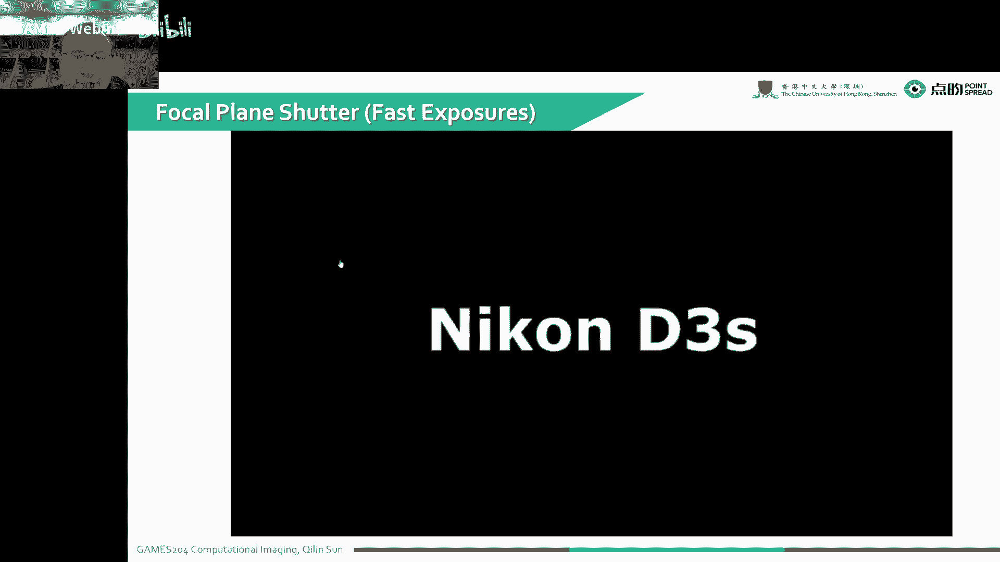

# 04.相机系统 ｜ GAMES204-计算成像 - P1 - GAMES-Webinar - BV1gG4y1i7m5

今天上课之前想跟大家先说一下。

我们的课程内容，后面的一些内容会稍微往前提一提，这节课讲完相机部分，想直接把SP部分提到下一课，因为这样的话就可以把作业第一次作业，布置下去，不用做太长的铺垫，因为我们现在已经到现在为止铺垫了4节课了。

第一次作业也是可以放上去了，而且现在在整个系统里面，已经注册了有150位同学，接近150位同学，我们可以通过系统把代码框架放下去，大家就可以直接在系统里面，就下到我们的一个代码框架。

然后再往通过代码框架去实现我们自己的，一个第一个作业，就是让大家写一个简单的IP，第二个作业大概是让大家写一下，Advanced Image Processing，我们的助教同学会给大家去修改这些内容。

有关注册应该是这两天应该就要截止了，大概因为整个第一次作业布置之后，就不大好再往后去接受同学注册了，如果大家想要注册的话，可以抓紧时间，整个作业我们大概会有6次作业，可能会有5个比较小的作业。

还有一个最后的一个比较大的project，覆盖的内容是第一个project，是一个让大家写一个简单版的一个图像处理的ISP，第二个就是比较一些高级的IP算法，比如说像HDR Fusion。

像或者是图像的一些拼接，还有可能让大家去选择去做一下像，Gradient based image fusion或者是其他的一些方法，到了第三次作业，就要给大家去写一个求解逆问题的一个基础方法。

就包括像类似像Half Quadratic Splitting，或者写一个ADMM，或者是一个Proximal Operator，去大家求解一个逆问题，可能会有几个选题。

选题大概覆盖有single pixel camera，就是我用一个像素，去做压缩感知，然后第二个选题可能就是coded aperture，第三个选题大概应该就是。

Time domain的一个encoding，这个也有可能会跟后面的一些课程，可以往后稍微放一放，因为ADMM本身不是大家考察的重点，因为这个难度也不是特别大，到了第四次作业，会给大家布置一个。

用一个简单的一个deep learning，或者比如说一个unet或resnet，求解一个computation imaging的逆问题，第五次作业可能就稍微难一些，第五次作业是要大家自己去想一个系统。

去实现一些比较好玩的一些东西，到最后一次作业就是一个Large Project，可能会给大家覆盖一些像Differentiable Optics，或者是一些Time of Flight Imaging。

因为后面我们会分别介绍非常多的课题，最后一次作业会让大家在，自由的在这几个课题里面去选一个去做，因为全部都做下来是可能不是很现实，所以说可能会给大家布置一些，像Polarization Imaging。

Time of Flight Imaging，或者是Coded Aperture这一系列的一些内容，就大家选一个最后一次作业选一个就可以了，今天这个时间差不多了，我们先开始吧。

其实之前我们前两节课首先介绍了一下，就是计算成像里面覆盖了什么内容，然后上一节课我们花了很多时间，去给同学们介绍一下色彩，包括色彩的捕获，色彩的复现，我们色彩是怎么形成的，其实色彩本身也就是人视觉。

跟心理学的这么一个过程，大家还记得三要素，包括光源，然后观察者，还有是光源反射的物体，这一课就给大家从真正的进入到整个成像这么一个环节，就给大家介绍一个传统的一个Camera。

是怎么样实现的这么一个成像的，当然按照回忆观念。

就是刚开始还是得给大家介绍一下，整个的一个成像过程，然后会给大家简略的去写一下整个的Imaging Optics，包括像简单的最早的一个小孔，或者是一些Simple Lens的模型。

或者是我们现在更复杂的透镜，是怎么样用来成像的，包括透镜的一些会产生一些的相差，或者一些不好的效应，我们会通过怎么样，是通过后面的算法去把这个校正过来，那么Aperture对一个相机来说。

就是它的一个孔栏，孔栏其实对一个光学成像系统来说，是一个非常重要的指标，就是我这个孔栏是我约束整个光学，就是整个口径的这么一个东西，它可以有非常多的作用，它一是可以把很多杂光消除掉。

就是我不想要杂光我用孔栏消除掉，第二个就是它是整个系统的一个比较核心的地方，它是决定你的一个进光量的这么一个物理量，就是Aperture的一个size，然后就给大家说一下Depth of Field。

就是本身我们的镜头设计的时候，它会有一个对焦的位置，它对焦的时候就会产生一个弥散源，就当我的弥散源小于我像素的时候，这个时候大家看到的时候，都是一个比较清晰均匀的图像，当我这个弥散源慢慢变大。

就是我这个物体在一个对焦的位置，离对焦的位置太远，这个弥散源就会变大，也就是它点光的函数变大，当超过这个像素尺寸的时候，这个时候很明显的就会产生模糊了，我们在整个弥散源的范围，就是前后的那么一段范围。

把它定义为Depth of Field，就是你可以看清晰的这么一个范围，就有时候大家想要的Depth of Field大一点，就因为像很多工业或者扫码应用，想要这个东西大一点，很多时候像我们这样拍照。

像单反拍照的时候，我想要做背景虚化，这个时候就想让大家焦身小一点，大家需要注意一下，有时候它毕竟是一个好一个坏的一个东西，后面会给大家讲一下整个视野，视野就很简单。

就是整个相机可以看到了一个最大的视野范围，然后给大家分享一下，整个拍照时候的一些小Tips，就是怎么样让图像拍的更好看去构图，还有一些像Diffraction Limit。

包括Sensor本身是怎么样补过到光子，然后最后成像，然后给大家简略的介绍一下Noise，后面我们会专门开一节课去讲Noise，所以这一节课就给大家粗略的介绍一下，Noise是怎么回事。

非常重要的一个物理指标就是Exposure，就是整个曝光，曝光整个相机它的一个核心就是曝光，我这个光有进来了我才能补过它，才能形成一张图像，到最后看有没有时间会给大家分享一下Dynamic Range。

因为我们Advanced Image Processing那节课，会专门讲一下Dynamic Range，就是这个讲不讲就看时间，当然也是国际惯例先感谢一下，Slides Created。

其实这个相机最早，这个叫就是Nautilus的一个眼睛，它是世界上生物界存在的一个，可能是唯一一个小恐龙像了，就是大部分都是有一个透镜的，大家有晶状体的这么一个眼睛。

但是这个Nautilus就是什么大王无贼，它还是停留在一个小恐龙像，这么一个阶段，像有时候同学夜里面会好奇，有时候我们看到猫的眼睛或者是狗的眼睛，好家伙它那个光就会直直地反着给你。

就会有一个很亮很亮的眼睛看着你，夜里看起来挺吓人的是不是，这个眼睛到底是怎么回事呢，其实我在第一节课提到过，这个猫眼它背面有一层这个叫，Capitum lucidum，就是一层像镜子一样的一个反光层。

就一层角质，它是可以反射，就是我没有被我这个retina，也没有被我上膜吸收的光，然后经过反射一次，再次打到了我这个上膜上，就可以很大程度的提高猫或者是其他动物的一些，夜间的一些对光的敏感程度。

就相当于光被吸收了两次，效率就提高了一倍，右边这个就是一个牛的眼底，它这么一个反射层，这是一个从National Graphics里面，就是抛出来的一个复演的那么一张图。

就是这个对应的就是可能现在的一个光场成像，因为整个相机的一个形成，基本上就是参照生物界里面，眼睛的这么一个过程，包括像单个的相机，就是像比如说像我们手机摄像头，或者是手机摄像头。

包括像单反相机都是单个特定的设计，像这种比如说像光场相机，这个就是类似于这种复演式的设计了，当然我们之前前一刻讲到色彩的时候，并没有对人眼一个视觉系统进行总结，人的一个视觉系统总结下来。

就是我们视觉能看到的一个accuracy，就是准度，就是20-20，也就是大概一胡分，这么一个范围，就是达到这个一胡分之后，你又可以说你是retina display，每只单眼，我们每只眼睛。

它覆盖的一个视野范围，横向就是190度，然后你双目视觉，就是你两个眼睛的交叠区域，你在这一个120度之间的范围内，是可以感受到立体视觉的，也就是两个monocular的一个交叠处，就是120度。

然后纵向大概有个135度的这么一个范围，就是人眼的整个的视野，大概人的分辨率，这个分辨率，人的时间分辨率，就是很多时候大家会看到，我们为什么我们电影是30帧24帧，打游戏是60帧，144赫兹。

这个就是跟人眼的一个时间分辨能力有关，当然这个也是跟，我们本身的画面的对比度，或者是亮度有关系，我们在彩色视觉的时候，可能会快一些，像我们就是感状细胞反应会，对，彩色会反应慢一些，感状会反应快一些。

这个时候暗里面其实，特别对黑白的变化，我们是可以比较敏感的，可以看到5060赫兹，但是像彩色的看电影，就是230赫兹，大概那么一个，电影基本都是24赫兹，大家为什么看着不卡。

因为电影里面它有个叫动态模糊的，这么一种感觉，我们真实物理场景过程中，我拍的时候它是有一定的模糊的，但是我们打游戏那会，打游戏，调到60帧了，我们还是感觉卡，是不是，这个就是因为整个游戏的渲染过程。

采样的过程中，它没有对一个动态模糊，进行处理，所以说有时候经常大家打游戏，非得要开到120赫兹，或者是144赫兹那种电竞屏，才能感受到它不卡，人的眼睛的一个动态范围，什么叫动态范围。

就是最亮跟最暗的这么一个比值，大概人眼的一个范围，其实也不是很大，因为你要是直接去算它，就该大概是6。5，2的6。5次方倍，但是人眼就本身就有可以调节的能力，这个可以最大最大可以做到46。5个。

Fstops，就是2的46。5次方倍，就是很吓人，当然大部分人是走不到的，就是只有在很多极端的情况下，是可以达到这么大一个动态范围，当然人眼能感受到色彩，就是上一课讲到的CIE XYZ。

或者投影到一个XY+Z+1的一个平线上，就是我们人能感受到的一个色域，叫CIE XR Diagram，人眼是通过双目视觉来感受到3D的，这就有一个就是vertex focus conflicts。

就是什么意思呢，特别是大家戴VR眼镜那会儿，就是为什么现在戴VR眼镜，这么不舒服，这么难受呢，大家戴一会儿就会感觉到晕，实际上这个就是我们人眼的精状体，精状体会调焦，调焦对的位置跟你两个眼睛旋转的。

这个角度是要匹配的，如果这个角度不匹配，就会产生一些不舒服，眩晕恶心这种感觉，因为它本身这个角度叫vertex，还有我们精状体对焦的位置，就叫focus，两个是neuralink在一起的。

当你的这个戴VR眼镜的时候，你一直对焦在那个屏幕上，就你focus是固定的，你vertex又一直在变，所以说这个时候就会给你大脑产生错误信号，这个时候就感觉到不舒服，人眼的一个account rate。

就是我最大最远最近，可以看到一个什么样距离，就是从8厘米到无穷大，当然你这个虽然年龄越来越大，就是你就是你的视力会退化，就是调节能力变弱了，就是越远的地，就是你最近的一个距离会变远，你可能到我这个年龄。

就可能只能15厘米到个无穷大，这么一个，大家可以看一看最近能看多近，就是说明大家年龄差不多有多大，这个也有个体差异，本身就是对比人眼跟相机。

其实这基本上算是一模一样的，就包括我们也要有自己的透镜系统，也包括有自己的pupil，就是我们的瞳孔，实际上就对应的Aperture，然后我们有自己的就是视网膜，就是我们的传感器。

其实基本上算是可以一一对应的，然后为了改善到彩色，人眼有三种不一样的，LSM三种不一样的一个追撞细胞，然后但是整个相机就可以用一个，白绿光片来实现这么一个彩色的一个捕获，下面给大家讲一个第一部分。

就是Imaging Optics。

其实最早成像的Imaging Optics，最早出现在差不多有2700年了。

那叫Nimbler Lens，就是这个考古发现了，这么一个水晶的这么一块透镜，那时候可能是只是为了太阳打个火，不一定是为了成像，但那时候透镜是已经有了，就是它可以干什么呢，就是那个时候大家对透镜的认知。

就是这玩意可以聚光，聚光的时候就可以打火了，特别是像以前尼罗河沿岸，像非洲北部或者是沙特那种地方，就是日照非常强，大家需要点火，就很困难，就弄一个透镜去给人来点火，然后第二个作用就是放大镜。

以前这个人的视力也会出问题，就是老花眼怎么办，古代发现这个东西可以放大，是吧，这个放大镜就可以看清细节，但一直到列伍古赫才会发现显微镜，但那个放大镜对2700年前来说，已经是一个非常伟大的进步。

这个透镜是怎么成像的呢，首先我们有一个物体。

在左边这个位置有个物体，这个物体我们把它定成object，然后这个物体所在的这个面，它就是雾面，然后通过一个透镜走走走，走到一个，走到整个所有的发出的光线再次聚焦，我们发现这有一个得到了一个实像。

这个是一个实像，这个时候大家初中已经学过，这个成像的距离位置放大率都非常简单，就是雾距分之一，加上相距分之一，最后就等于整个焦距分之一，对不对，然后我们放大率实际上就是。

这个real image的size，跟这个object size的比值，当然我们这个地方用负的，因为它是个倒向，这个real image是个倒向，就负的S2比S1，最后就可以拿到，我的一个放大率就是F。

比上个F-S1，但这个里面我们画这个时候，有一个假设，因为我们这个中心，假如说是一个薄的凸透镜，我中心那个地方，它是没有曲率的，没有曲率，这个光就可以直接穿过中心，到达这个位置，然后我们横着画一条光。

然后看到这个光会过焦点，然后再来一根光，从这个虚像反着连回去，这个平行光，然后会过前焦点，这样的话就把这个虚像，这么一下就打出来了，当然你要把这个物体，放到我们焦距范围内，这时候就变成了放大镜。

这时候就是你的VR眼镜了，就是实际上，大家在那个VR眼镜里边，它那个工作原理就是个放大镜，比如说实际上你这个object，就是你要观察的屏幕，你的virtual image，就在屏幕后方的一个位置。

然后你其实现在的VR眼镜的放大镜，基本上一面是这种非球面镜，或者球面镜，另一面为了做薄，我就做成费尿头镜，其实对人影的感受不是特别强烈，就可以，但是像质还是挺好的，然后另一种就是放小。

你要把它做成一个凹头镜的时候，也是在我要看一个物体的时候，我这个成像就成一个虚拟的像，这两个都是虚拟的像，就会呈现在焦距内，就会和放小的这么一张图片，讲透镜就不得不讲一下相差。

因为我们后面的这些计算成像，基本上都是根据相差，很多时候也不是基本上，就是大部分像日常生活中的成像，包括我们像镜头的设计，包括现在很多的ISP，基本上都是围绕着相差来去校正它的。

那就像相差跟噪声这两个位置，理想的情况下，我们一些平行光打过来，打到一个透镜上，它是可以汇聚到一个点的，但是实际情况是不可能的，但不是因为加工缺陷，就是设计有缺陷，像比如说像我们这一个平面的。

一个球面的这么一个透镜，我经过平行光汇聚，然后汇聚到，我发现离轴不一样的位置，我打到光线，最后我的焦点位置都不一样，我在一大片区域不一样的离轴程度，就是r，不一样的r对应着不一样的焦点。

这个就是spherical aberration，就是球差，然后另一种相差就是随着入射角度，变化而变化的相差，角度越大，比如说像我们左下角这张图，我们这斜着沿着一个θ打过来，我比如说过中心这个位置。

沿着就是靠近这个轴斜着打过来，靠近中心轴的位置，我最后能量越密集，然后靠边缘的地方，我就聚焦在别的地方了，然后它的能量会稀疏一些，这个时候就会产生一个，像彗星这么一个一圈一圈的这种，一种相差。

这个叫彗差，然后还有一种，它是随着整个轴变化而变化的，这么一种相差，叫antigmatism，这个叫怎么翻译的，好像是应该翻译为，这个叫散光，就是有一个就是意思就是有一个，注面镜了。

它整个就是点块的函数的一个形状，就是变成一个不是一个，不是一个就对称的那么一个形状，然后还有一种就是大家常见的一个，distortion，也就是畸变，就是对这相反，还有一个就是大家常见的一些畸变。

有统型畸变，整形畸变，就大家就一般都是要把它叫好，最后特别是大家做双目视觉，或多目视觉，特别是多目的一些光场相机，我们要匹配之前，是不是要把distortion叫掉，如果不叫掉的话。

你在空间中匹配的时候，就会产生一个比较大的一个错误，当然上面讲的这些都是叫，这个叫单色的一个相差，当然本身因为我们透镜，就不同的波长，同一个同一种光学材料，不同的波长，或者它那个折射率是不一样的。

不一样折射率就是大家就是聚不到一块去，就相当于聚不到一块去，就会产生这么一种叫chromatic aberration，就是彩色的一种相差，这个有时候就叫色散，给大家看一看。

有这个lens aberration的时候。

会是什么样子，当然我这个一个图非常锐利的时候，大家看的很清晰很舒服，当然我们加了一些光学的，比如说像球叉，包括像我们的一个color，这个一个彩色的一个色散，就是大家可以看到又模糊。

然后又会有这种微彩出现，这些东西都是大家不想要的，所以说很多时候，大家设计光学镜头的时候，就会想用更多的镜片，来相互矫正这个相差，我通过不断镜片堆叠，然后比如说还有一些特殊的结构，像双钢丝结构。

就可以叫畸变，我前三片镜片跟后三片镜片，是完全对称的这么一种设计，前面那三片产生一个正向的畸变，后面那三片又产生一个反向的畸变，这样就把这整个畸变抵消了，最后拿到了一个无畸变的一个透镜。

Aperture就是我们所说的一个孔蓝。

也就是大家拍摄的时候对应的光圈，我们可以看到一个点，整个光线的角度是被我们实际上，被我们的一个孔蓝，也就是被我们的光圈是约束掉的，我们可以看到，它除了控制光线数的角度，还很大程度的控制了一个进光量。

我这个进光量是由Aperture来控制的，就是Aperture越大，我的整个进光量也就越大，可以看到有不同尺寸的一个Aperture Size，大家比较好的透镜，就是卖的比较贵的那种单反相机。

或者手机也可以做到一个F1。4的，这么一个，这个F Number就是，是N等于F/D，这个F是什么，F就是这个里边的F就是一个焦距，D就是我们的Aperture的直径，F数越小，就说明我们的孔径越大。

就进光量也就越大，当然对应的就是我们的景深也就越小，我们可以看到F2的时候，F2。8，就很多变焦透镜的一个变焦镜头的，一个F数都是2。8，因为这个变焦镜头需要在不同的，一个焦距里面去做一个平衡。

就它是比较难，把这个F做小，还有一些像F4，F4有时候在监控镜头上，就是说就比较常见了，F5。6 F8工业里面会，特别是STIKO的镜头或者是，M12 M14的这种镜头里面会出现比较，小的光圈。

就F就是大光圈比较困难，这个我们发现，我们的Focal Plane在这个位置的时候，就我们相机对焦在，前面这一个Focal Plane的位置，超过往前挪一挪，就发现到最后，我在我的传感器上，经过透镜。

就没有办法形成一个比较小的一个点，这个时候我们的图像，就会受这个迷散源，半径太大了，就是每个点都是一个迷散源，然后最后积分起来，是不是就是，像做了个卷机，你拍到的图像就会显得模糊。

另一种情况也是Auto Focus，就是我焦距提前了，就没有对好焦，这个最后也会产生一个比较大的迷散源，我前后景深，它都是有一个范围的，就是因为这个范围的限制，我们就导致最后就没有办法拿到一个。

比较理想的图像，这个图好像有点bug，这应该是在前面这个位置，这个时候我们就可以看到，我在我的Focal Plane前面后面，各有一个边界，就在这个边界内，我的迷散源没有超过我的像素的大小。

所以说在这个范围内，就我最后呈现的一个图像，它就是都是清晰的，这个就是我们大家常见的一个，景深这么一个东西，就是大家拍照的时候你发现，对接到人脸的地方，这个时候是清晰的，但是背景都是虚化掉了。

这个就是因为背景的迷散源已经太大了，就只能呈现出一个模糊的图像，这个时候有利有弊，大家喜欢拍照，比如拍花草，想要那种虚化的感觉，但对很多工艺的场景，我们不想要那么小的一个景深，我想要更大的景深。

就需要在牺牲一下光圈，或者是在我们光学镜头上，做一些特殊的一些设计，包括像端道端的光学预算法联合设计，就可以在保证光圈的情况下，一定程度的扩展它的景深，这个特别是在工业里面应用会比较多。

这个就是所谓的Depth of Field，这个Depth of Field怎么算呢，算起来其实并不麻烦，整个Depth of Field，它跟什么相关呢，就是跟我的一个物距相关。

也是跟我的一个就是Diameter，就是整个Aperture的一个size，是成正比的，然后还有一个就是我的一个，放大率有关系，也就是说我这个Aperture越大，我的景深实际上就是越小的。

所以这个C它是一个反着的系数，我们也可以看到，这个C是它的就是弥散源，弥散源就等于一个放大率，乘以一个Diameter，再乘以一个就是整个弥散源，在我像素上的一个大小的一个尺寸。

就是我这个Aperture投影到大小，这个Aperture上一个，就是传感线上一个尺寸，就是这个弥散源的一个倒数，就是我们除以这个Pixel大小，实际上就得到我们了，最后一个景深的那么一个参数。

我们看到整个弥散源的大小，是怎么变化呢，就是在我的焦前，就我靠近我相机的那一端，它是猛然的就是下降，直到我对焦那一刻，对焦这个弥散源基本上就是一个点了，然后随着慢慢变化，然后距离不断变大，距离不断变大。

然后最后会收敛到一个比较大的，一个比较平衡的一个位置，然后我可以接受的这个弥散源的大小，就是不超过像素的位置的时候，这个就是我所用的对应的一个景深，有时候大家对焦到一定的距离之后。

比如说我要对焦到10米20米，一个比较远的距离之后，我再往外，再往外面看，其实这个就已经全都对焦了，然后这个面，就是刚好就是再往后，全部对上焦的这个面叫hyperplane，这个怎么翻译有点记不清了。

但是那个位置叫hyperplane，大家就可以很直观的看到。

不同的depth of field，是什么感觉，我们分别把Aperture的size，调到f1。8 f4跟f8，我们可以看到光圈越大的时候，我们可以看到景深实际上它是越小的，然后我们不断调小光圈。

就让调到f4调到f8，在同样的观测距离下，我们可以看到，孔越小就孔径越小，最后拿到的景深是越大的，这就有一个很矛盾的地方，我越想要大景深，我越想要大的一个Aperture，这个时候就比较困难了。

当然这也不是没有办法，这个就是在不同的一个光圈下。

因为光圈还有一个矛盾的地方是，我这个光圈，它是跟我的最后的拍照的时候的，这么一个exposure time，就是曝光时间，是一个比较对立的一个过程，我曝光时间越长，我要小光圈。

比如一个小光圈曝光时间越长，这时候有动的物体就怎么办，比如我们很多时候拍一个运动的物体，这个时候就产生了矛盾，就是光圈跟我最后的曝光时间，会产生一个天然的矛盾，大家又想光圈大，又想曝光时间小。

这个时候挺矛盾的，大家可以看到当光圈比较小的时候，我就需要一个比较长的曝光时间，最后看到鸽子整个全都模糊掉了，然后不断的增大光圈，减小曝光时间，就可以看到这个是拍的挺好的。

但这个时候光圈就会跟我们的景深，会产生一个矛盾，实际上这个矛盾就是景深跟曝光，跟曝光时间的一个，也就是噪声，曝光时间越短，我噪声越明显，就跟噪声本身是有一个天然的矛盾的地方，所以说谁好谁坏到底怎么选。

就需要大家用经验去判断一下，还有一个就是Field of View，就是我们整个能观测到的视野。

这个对相机来说是非常重要的，大家选相机的时候，想要特别是手机，有时候大家会听到手机厂商去吹超广角，我们可以看到非常大的一个全景的范围，这个有时候大家又想要拍那种特别远距离的东西，比如我们在一些自然公园。

像一些黄石，有些野生动物，不能离太近拍它，我就要离特别远的位置去拍，我就想用一个长焦镜头，在一个非常远距离的地方拍得非常清楚，这个时候就会有一个Field of View的问题，就是越长的一个焦。

在相同的一个传感器尺寸下，越长的焦它对应的一个Field of View就越小，实际上我们假设一个透镜，基本上都是在一个理想的透镜模型，我们其实你要硬算它的一个Field of View的时候。

你就把这个透镜当成一个小孔，因为我们透镜中心，理论上实际上不是这样的，理论等效的一个薄透镜的中心，光总是沿着直线穿过这个中心的，实际上跟大家把它想象成一个小孔的相机。

来算Field of View就可以了，这个怎么算非常简单，我的Focal Length是固定的，我传感器是固定的，我传感器跟Focal Length，穿过透镜的中心的时候。

就可以直接算到这么一个Field of View，就很简单，2倍的Arc Tangent，就2分之A是除以Focal Length，就直接可以算出Field of View，但这个时候要注意一下。

大家特别是对传感器选行的时候，会看到H Field of View，还有V Field of View，Vertical Field of View，就横着跟纵着的。

还有一个就D Field of View，就简单，我整个传感器因为是长方形的，我对角线的Field of View，就我这个透镜，我最后能覆盖的范围，一定要是要能cover掉。

我对角线的这么一个Field of View的话，这样的话就不会有黑边的问题，大家可以看到不同的Field of View。

本身跟尺寸也是比较有关系，就相同的一个透镜，我最后的底儿，就是我们传感器的尺寸越大，我就可以看到我最后的Field of View，对应也是越大，不同的传感器。

就对这种不一样的一个尺寸，这个还是有必要给大家分享一下的，现在大家市面上能买到的一些，就比较大的一个传感器，就是中画幅，还是有大画幅，因为大画幅，基本上都是非常专业的一些用户，其实现在已经不多了。

因为现在很多都是数码相机，就传统的相机，就那胶片，就是挺大的一个大胶片，那就是大画幅，大画幅它的传感器的尺寸，就是差不多53。7*42，40。2这么一个尺寸，很多高端的一些大画相机，像哈苏，菲斯。

马米亚，冰德，这些很高端的一些相机品牌，就会有一些中画幅的一些相机，这个时候就比较贵了，因为你传感器越大，对应的光源系统也越大，这个时候就都比较贵，大家日常生活中，比较常见的一些中高端机型。

就是用的很多都是全画幅，叫Full Frame，它的尺寸就是，36*23。9，也就是传统的135画幅的，这么一个相机，它的一个，大家可以看到这次面积，就跟中画幅相比，全画幅将近差了三倍的一个面积。

这个时候这个时候品牌就会比较多了，像尼康，佳能，索尼，现在大家大部分都是主打全画幅的，一个，中画幅的现在已经，不是特别多了，再往小一点，就是，再阉割一下尺寸，实际上就是，APS，或者，4/3，一英寸。

1/1。63，或者更小，到你的手机那端，就只能到一个，差不多1/3。2，但现在很多很变态的一些手机，就已经上到了1/1。1，就是索尼自己家，产了一款传感器，产了一款手机，它那个底就做到了1/1。1。

其实这个是非常大的，结果就是后面导致后面的光线系统是非常大，也就是大家手机后面，会凸出来很大一块，但这个可能尺寸小一点，因为传感器大了之后，它是非常有优势的，你看到10维米的像素，跟1维米的像素。

它的进光量，差了100倍的，所以说这个时候，就大家要注意点，这个像素高了，它不一定好，就像素小了，它也不一定好，像素大了之后，但是它光线系统就贵，所以说现在，特别是手机摄影。

就大家这所有的厂家都在陷入一个，就非常焦虑内卷的一种状态，就是大家，又想要这个好，又想要便宜，又想要它小，这个就很困难，但这些厂家已经不断努力，其实对整个大家手机拍照的质量，做出了非常卓越的贡献。

但也考虑到整个相机的一个fieldview，就因为我们的，就是单反相机，它是一个非常大的一个传感器，我对应的一个focal length就比较大，想要获得一个相同的一个视野，就拍到一个相同画面的一个图。

对应的手机，就是我一个小的一个传感器，对应一个短的一个焦距，我们实际上就是像素大小的一个对应，按比例的一个对应，当我们固定了我们传感器尺寸的大小之后，这个时候发现，这个焦距越长。

我最后能观察到的视长角就越小，就比如说就是我们8毫米这么一个透镜，我们装放到我们一个全画幅的一个相机上，我可以看到180度这么一个范围，到了像25就是很多25，28，35，这么一个波段。

经常就是用来拍人的这么一些镜头，这个时候它大概对应的一个视野范围，就是六七十度的一个视野范围，到了50度，就很多大家这个镜头是定焦到50度的镜头，这个是非常常见的，因为这50度的镜头它的量大。

所以说这个就特别便宜，比如说佳能的小弹云镜头，50毫米的镜头只要几百块钱，就可以获得一个非常好的一个相机，几百块钱就可以拿到一个F1。8的一个，好相机的定焦的50毫米的镜头，就是因为它量大。

这个时候覆盖掉的视野范围，差不多是43度，到了你要1000毫米，这个时候就会只有2。5度了，这么一个视野范围，就是非常小，大家可以也很显而易见，就是离着焦距越长，往中心连着传感器一算。

那个角度是变得小很多的，大家可以看到就是换不一样的焦距，我最后16毫米可以拍到这么大一个范围，我最后70毫米的时候，只能拍到这么小一个范围了，你到了5001000就只能拍到一个，人头这么一个范围。

大家喜欢用那种望远镜，就拍月亮的时候，就发现这个月亮到最后，我望远镜中间只有一个大月亮，这个时候它的视野范围就是非常小，因为它焦距已经做到非常长，上周也说到过这个微博望远镜。

微博望远镜它焦距到底是多长呢，因为这个微博它是一个反射式的望远镜，但它也有自己的一些焦距，它的一个等效焦距是131。4米，就是我们的焦距100多米，比我们现在这些单反镜头大了非常多，但除了这个之外。

就很多摇杆的一些，卫星摇杆的一些镜头，也是可以做到几米几十米的这么一个焦距范围，那哈勃望远镜我记得是50几米的一个焦距，有一些历史原因在，大家最后算这个35，大家最后算这个FieldView的时候。

通常就会拿这个，就是35毫米，Format的Field就是全画幅的这么一个，来算它就是135画幅来算，这是历史原因，大家算的时候都喜欢这么来算，拿这个35毫米的这么一个，就是穿上去来说，17毫米的一个。

透镜，就对应了一个广角104度，到200毫米的一个望远镜，望远的透镜一个，大家喜欢叫长枪短炮，200毫米的一个大炮，差不多就是12度的一个视野范围，有时候我们在手机摄影的时候，通常会有一些像等效的焦距。

比如说像等效的28毫米焦距，实际上它并不是一个像，真正的一个28毫米的焦距，因为28毫米焦距在手机，就比手机已经厚了非常多了，28毫米差不多这么厚了，实际上是一个等效的这么一个焦距。

它是拿135画幅的这么一个东西来去等效的，实际上情况是物理尺寸是，因为它像素比较小，它物理尺寸是实际上是差不多是5~6倍，或者更短，对微博那几个键盘是基本上，是接近一条直线了，有一定角度还是有的。

本身其实透镜除了像刚才讲的那些像差，它还有一个衍射极限在，我们以前上物理的时候，就会发现有个东西叫爱里曼，那时候就是1。2λ/d对吧，就是我过了一个孔，这个孔的大小是d，我最后到了一个下面的时候。

差不多就是1。2λ/d，这个东西，阿贝就是1837年的时候，对太空望远镜不需要大大幅度，因为这个数据量是很恐怖的，太空望远镜主要是需要是口径，因为它会面临的像现在这页说的，就是衍射极限的问题。

就口径越大，我这个衍射极限它也就是越小，就我最后的一个可以观测到的这么一个d，实际上就是约等于λ乘以一个f柱，我们最后本身就刨掉我们的，不要看我们像素的一个分辨率，就我这个光源系统的透镜的分辨率。

差不多是等于一个λ/f，就比如说我们的f柱是1，我的波长是550纳米，这么一个绿的，就是我最后的迷散源的半径，就是550纳米这么大一个数，我们很多那种microscopic。

这个f柱或者是它的一个倒数叫numeric aperture，numeric aperture就等于nθ，就是一个折射率乘以一个θ，在我们的microscopic就是我们的显微镜里面。

这个是它决定分辨率的一个东西，就我们最后的一个极限的分辨率，就是λ/2b的numeric aperture，所以说我们想要我们分辨极限更高，我们想要分辨更小的东西的时候。

我这个时候就需要一个更大的numeric aperture，对不对，所以说这个时候光线系统，我要想把这个数值口径做大，要把它的口径做大，其实是挺困难的，所以有的科学家就想着我这个n。

从公式上写不就是numeric aperture nθ，我这个n现在是空气，我把折射率提高，我这个分辨率就不是提高挺多的吗，比如说我把空气折射率是1，然后我把这个样品沁油。

我用一个折射率比较高的一种光学的一些油，就沁在样本跟最后一个透镜之间，比如我用一个折射率是1。6的那么一个油，沁着，最后我的分辨率实际上是提高了1/1。6，就提高了1。6倍，就可以分辨更小的一个物体。

它整个限制实际上也就是一个空间跟一个带宽的，一个乘积的一个限制，就是我的一个空间带宽机是固定的，就我由于物理学里面的一个不确定原理，我的空间带宽机是一定的，我想要提高一个，就需要在另一个地方去动手脚。

下面给大家分享一下拍照的一些小技巧，大家可以观察到，就是不一样的一个，对光刻机是有沁油的，但是现在的一些主流方案都是为了像用集子外，说到光刻机还真想给大家batch一下，就本身光刻机。

大家有时候可能概念上会有一些混淆，光刻我们要做一个芯片的这么一个流程，大概有几个步骤，第一部分就是写眼膜，我用大家就像激光止血去写一个二值的一个mask，就先甩胶完之后，我在胶上刻mask。

然后多了一层隔，它就会出现一个二值的一个图案，对不对，然后我把二值图案放到一个striper上面，这个striper有时候也翻译成光刻机，这个叫不近视光刻机。

我这个striper比如说我刻了pattern，我分辨的是一微米，我这个striper可以把从一微米，我可以缩小10倍，就可以出现100纳米，这么一个东西。

但是我要想要实现100纳米的这么一个投影的分辨率，这个striper就是大家所谓的生产时候的不近视光刻机，这个时候我光源就需要比较短的波长，到最早，包括像那种像DUV到现在的EUV，就是波长越做越短。

就是为了提高我这个，想当于微纳级的投影仪，就striper它最后的一个分辨率，其实这个striper做起来是比较困难的，现在可能，我见过一下striper，那个striper有200多个镜片。

就英特尔跟台积电好像各有一台，差不多有三层楼这么高，然后每个镜片的口径差不多有十几米，然后有200多个镜片，每一层都需要调硬力，因为硬力都变形了，然后除了还要调温度，都会引起最后的一个形变。

我最后生产的时候，12寸的一个生产线上，我这mask刻好，可能刻三次成mask，这边一曝光，曝光拿出去，曝光图案拿出去，然后再一层工艺，就通过几十层的堆叠就做成了芯片，但striper难度是比较大的。

这个是可能是最核心最难的一个地方，这个给大家讲一下拍照的一些技巧，像这种我们这种16纳米，我也可以看到，背景看的是比较远的，构图的时候，我们不断增加一下，它的一个焦距，我们看到可以把后面的背景。

拉的显得近一些，这就是它一个构图的一些技巧，我们想要背景远一些，我们就可以用一些广角的镜头，我想要背景近一些，就可以用一个比较长焦的镜头，它是一个符合一个，你要用透镜的时候，你就把它想象成一个小孔。

它是一个perspective conversation，就是你的这一个就是投影变换，就投影的一个构成，你想要这个图构成什么样的成分，你可以用一个像这种，就不一样的视角，然后构图我们后面背景的范围。

你看这个焦距越短，后面的背景越大，然后焦距越长，我们后面的背景就越小，就是你想要背景更清晰一些，或者是涵盖的东西，覆盖的范围更大一些，你又可以去调一下这个对焦的问题，你要调完，你要换不同的焦距。

你就不得不就是走远点或走近点，去调一下你主要要拍摄的人，或者物体的这么一个距离，这是一些不一样的投影的一个构图。

你们要最后你要选到这个构图是什么样子，大家可以先在草纸上先画一画，然后根据这个构图来去选择你的一个投影，什么样焦段的一个投影，这里面技巧其实是非常多的，反正这个也不是本课的重点。

就是给大家讲一些拍照的技巧。

首先就是选择一个你要拍的一个物体，差不多覆盖你到1/3的一个画面，这么一个地方，第二个就是选一个比较好的一个投影的视角，就是投影的就是你物体跟后面的一个，背景的一个相互之间的一个投影关系。

这个时候你又想找到一个比较好的一个构图，然后最后你可以调一下镜头的一个焦，或者换一个镜头来去，然后移动你一个相机的位置，来最后实现你的构图，最后其实还是要看你这个艺术细胞，这个只要看你这个审美的感觉。

大家可以手机上也是可以的，大家可以拿手机给大家拍个照，选一选构图，最后对大家找女朋友什么是比较有用的，提到构图就不得不说一说杜比，其实杜比zoom对整个物体的强调，其实是一个非常好的一个这么一个案例。

给大家看一下，放梦，就是它会对不一样的场景进行强调，手工拖镜头条，好像视频格式有点问题，它会有一个镜头由远拉近的这么一个过程，就是从一个很广的背景，拖到一个比较小的一个背景，这样的话。

就会对你的本身的一个物体，产生一个强调，产生一个更强悍的视觉出镜，这个视频有问题，回头我把这个视频单独放出来，给大家看一看，对，就这么，背景，由远到近，这么一个镜头拉伸的过程。

大家也是拍摄那种电影的一些常见的一些技巧，来讲到关键了，传感器，其实对相机来说是一个非常核心的一个地方，这个是一个传统的胶片式的传感器，胶片式的传感器其实问题是非常多的，就包括它是一个响应。

它是一个非常非线性的过程，我们可以看到右边这个，就不一样的一个，这么一个曝光的一个程度，看它最后拿到一个曝光的一个密度，就看这个好家伙它不是一个线性的，最后拿到的图看起来，挺难受。

而且我们这个已经是放上对数了，还还是不是特别线性，所以说这个，特别是在一些比较低的一些，比较暗的一些区域，其实这个是不是很好，而且它的一个动态范围也是比较受限了，就是我们传统的胶片式的化学式的胶片。

它的一个动态范围差不多是，比如1000比1或者是更多一点，但是有一个好处，它扯那么多它不好的地方，就是它有时候对色彩的还原，其实还是挺好的，就是不得不佩服，而且以前化学化工的调教。

对这个色彩其实保留是比较好的，当然这个还是，我们还是要说一下，现在的一个modem的一个传感器是什么样子，这是一个像素，它是一个像素的一个拆解图，我们一般最上面它是一个micro lens。

micro lens是干嘛呢，主要是为了收集光线，提高它的一个光线收集的效率，实际上也就是提高灵敏度，第二个原因就是用了micro lens，实际上就是靠滚别，我们本身有时候它填充率，我感光区域。

因为我的像素大小不是特别大的时候，Fill factor比较小，感光区域相比pixel比较小，这个时候我们要采用一个高频信号，这个时候用一个比较低频的一个玩意，一个像素分布。

去采用一个空间中分布的一个高频信号，这个时候就会产生走样的问题，就是alasing的问题，所以说micro lens第二个作用就是，收集到更多的信号平均起来，然后填到一个低通力国际。

去把这个alasing这种效应去给它pk掉，过了micro lens之后，它就是一层color filter，比如说像最经典的RGB，然后每个像素之间就有一个对应的，一个小块color filter。

这上面两层都是塑料的，如果大家手上有不建议大家抠了，这一层塑料可是可以用那种小铅笔，铅笔木块，你把铅笔木头削下来，削成一个小木刀，小木刀就可以把这层塑料刮掉，但是不会损伤后面的半导体传感器。

这个时候你就可以把一个彩色的传感器扣成黑白的，这个事我是干过的，然后到了后面，就会有一个光电的一个偏移节，大家可以看到，就是爱因斯坦就很厉害，他除了像那种，这个光电效应对他来说是一个比较小的发明。

就是那时候他的相对论出来之后，当时评选纳瓦尔奖的这些委员会，对相对论拿不准，他不敢直接把这个东西，就是通过相对论给纳瓦尔奖，就选他一个光电效应这么一个成果，就把纳瓦尔奖颁给爱因斯坦了，然后我们光子来。

就是激发我的光子控学队，就会导致我偏移节之间的一个电导率的变化，电脑率的变化，因为有变化了，我就可以往我后面的一个well里面，potential well里面去充电，这个时候就会产生一些电子的移动。

我的整个光产生电子的这么一个数量，一个光产生了另外几个电子，这个概率就叫QE，Quantum Efficiency，它就是我约1000个光子打过来，然后就产生了几个电子，它的比值就是QE。

就现在的一些半导体传感器，QE是可以做到非常高的，就有一些波段是可以做到85%，那么一个高的一个QE，除了光电传感器，就是photodiode，然后它下面是有一个叫potential well。

这个potential well是存储，我曝光之后产生了电子的，然后我这个电荷就可以通过ADC，去把它读出来，就可以最后读到我们接到传感器里面的值，后面这个Macro lens。

因为很多Macro lens，其实设计的不是特别好，大家可以看到边缘这些区域，还是有一些盲区，然后甚至因为是光线角度变大，很多光收不进来，就导致量子效率的一些浪费，还有一些就变成一些漏光的效应。

所以说之前我们做时间自己玩的时候，就发明了一种3D的Macro lens，上面是一种非球面的Macro lens的排布，下面是做了一些，就是用推优化优化出来的一些形状，这个光打过来之后。

然后反射到这个面上，这个面因为是经过精心设计的，它把所有的光都通过全反射，始终约束在这个柱子范围内，最后就所有的光都会可以，打到光线传感器上，它的一个fill factor。

就填充率基本上可以提升到100%，这是我们之前自己玩了一个这么个东西，就是用双光子吸收做了一个3D的微大结构，说到本身的光线传感器的这么一个响应，大家可以从右边观测到，我基本上在一定范围内。

就我光子数来到了光子数越多，我最后就产生了一个电子数据越多，它是一个比较线性的一个过程，就问大家一个问题，就是这个角度这个slope代表了什么，就问大家这么一个简单的一个问题，你可以回答一下。

这个很简单，这个就是电子数除以光子数，实际上就是QE，Quantum Efficiency，因为我们在一定的范围内，它是一个保持比较线性的一个，有一个良好的线性度，但是我到了一定范围内。

因为我potential well慢慢饱和了，这个时候到这个时候就我们不再曝光，这个值没法往里积了，到这个时候就会饱和了，对QE，然后在我们就比较暗的区域，特别是特别暗的区域。

它也会有一定的非线性的效应，所以说大家拍照的时候在暗的地方，其实就是很容易导致一些色彩的失真，除了跟造成有关，还是跟本身的一个器件设计也是有关系的，然后后面我们会专门开一节课，会讲HDR。

因为我们这个范围，我想要更大的范围内都是得到一个线性的，我说怎么办，怎么样得到一个HDR图像，因为我们受限于我们传感器的一个动态范围，就是我们线性的一个区间，就是很多没有拍张图。

因为我们自然场景的一个动态范围是非常大的，就是拍这个图，有时候基本上要么暗了，然后要么亮了，过曝了，就总是没有办法就同时捕捉好，所以说现在有很多很热门的话题，都是在做HDR成像，为了捕捉到彩色图像。

其实一个比较常见的方法，就是用一个color filter array，然后我整个因为我们每个像素，基本上只能感受到光强，然后我就用一个RGB的一个，就是color filter，然后铺到传感器上。

然后就可以拿到这么一个彩色的分量，当然这是牺牲了一定的分辨率，这按是后期p的效果，也不是就是曝光量不够，然后给大家说，但是这个就是会导致一定的一个，就是分辨率的牺牲。

就假如最经典的一个RGB的一个传感器，还有两个通道是绿的，然后一个通道红的，一个通道是蓝的，然后我基本上我蓝的值要差个，剩下三个空就要差一个蓝的值，然后绿的也要差个一倍，然后红的要差三倍。

所以说一个好的马赛克算法，其实对大家来说是一个非常重要的，一个去马赛克的算法，是一个非常重要的一块，就去不好，比如说像简单一点，Bilinear，Bicubic像Marble。

这种一些比较简单的一个去马赛克，就会产生一些比较明显的，就微彩效应，特别是边缘的地方，会产生一些微彩的效应，本身color filter array，其实就挺简单的，最经典的就是RGB。

当然现在还有很多，就是很多五花八门的，一个采样的一种效率，包括像华为P30和P30 Pro的时候，那时候大家打暗夜色彩，他们就提出了一种，可能是定制了一种叫RYYB的这种感光元件。

RYYB就是yellow，yellow是啥呢，yellow就是R加上G，就是我让R跟G两个通道同时过来，我这个进光量是不是一下子就大了，我的心脏比立马就高了，对不对，然后这个时候大家会有一个问题。

这个东西本质上是牺牲，就比较低光颜色的一个色准，来换取心脏比，这为什么呢，首先这个东西RYYB这种设计，就是R加上G等于Y，我们这个通道的，它心脏比是变高的，因为我们是R跟G。

两个通道的能量都同时来到传感器，对不对，但是R通道跟Y通道跟R通道，在低光下都是有噪声的，这个噪声其实是，并不是暗光下就是噪声越大，其实我们学过随机过程，就是整个破松抗性的一个过程，就我抗性的时间越长。

就我抗性的光子是越长，实际上我最后累积的噪声是越多的，但是这个时候我们的心脏比也是提高的，暗处因为我们累积的时间比较短，信号比较弱，它噪声虽然比较小，但是心脏比比较低，所以我们为什么老是说。

在暗夜情况下噪声大，但实际上只是它心脏比比低，实际上是更亮的时候，基本更长的时间，它的噪声是更大的，但这个RYYB，你要最后就算出来green，算出来绿的时候，实际上它噪声是基本上是放大了一倍的。

所以说RYYB这种设计，我的感觉好像就是为了牺牲，就是暗光情况下的颜色，来换取一个比较高的心脏比比，就是比较容易出现一个色差的问题，这个中国算法是比较难叫的一个东西，这个是比较困难。

除了像刚才讲的那些传感器。

给大家总结了一些比较常见的一些半导体传感器，包括像CCD叫Charged Couple Device，像半导体氧化物就是CMOS，还有像FORWAY那种，叠一层的，这个跟公义没关系。

除了这个还有一些就很好玩的一些传感器，包括像Charged Interaction Device，CID，还有光电倍增管，光电倍增管就是来一个光子，通过雪崩气穿，一个光子激发电子。

然后有很多电极去给反复加速，就一次一个光子来，就会产生一个大的一个反复加速的过程，就会产生一个比较快的信号，这个性道比是比较高的，但是光电倍增管这个东西比较贵，可能全世界可能只有一家日本的叫冰松光电。

是可以做光电倍增管的，还比较好玩，像CASCO的Ray Tubes，像SPED，SPED跟QRS这两年是比较火的，这是两个是激素形象机，这SPED咋回事呢，就是我这个APD工作在盖格模式。

就是我工作在反向极端区，来一光子就会触发雪崩，所以说叫雪崩光电极管，把它做成阵列，就是做成一个图像传感器了，这个用处就非常多，可以做3D探测，或者非视域成像，或者很灵敏的一些探测，当然它最主要的还是。

生物预设的一个Florescent Laptime Imaging，还有一种叫QRS，Quantum Image Sensor，它是可以获取在暗处比较好的一个心造笔，因为它也是一个激素形象机。

就是跟SPED的区别，就是它没有一个TDC，没有一个时间的一个转化电路，还比较好玩的，像2Bucket Sensor，就是我一个传感器后面有两个积分的尺子，我可以通过一个开关。

去选在哪个switch里面去积分，这个时候就可以在实际上去做调制，我既可以做Debray，也可以去做像ATR，就是比非常多的应用，大家可以搜一搜相关的论文，还有像PMD，就是大家所谓的Itof。

Indirect Time of Flight，还有很多，像不同的一些感光元件，它有一个不一样的拼图响应范围，我们可以看到，像这个CCD，就是它在近红外其实是比较敏感，然后CMOS。

它是大概是可以做到380到1100，这么一个范围，下面人眼大概就集中到550，所以大家可以对比看一下，不好意思又超时了，这个我讲快点，然后给大家讲一下Noise，Noise怎么形成的吗。

首先我们光子就打到传感器，因为我们光子到达传感器的一个过程，在一个比较短的时间内，大家可以看它是一个相互不相干的过程，就是一个破松过程，光子过来之后，它是随机的一个到达了这么一个东西。

所以说最后形成的分布，就是一个破松content的一个过程，就我们最后拿到的分布是一个破松分布，这是第一道造成的，就是破松content noise，这个造成无论是你后面的传感器，设计的多么好多么完美。

这个造成是永远存在的，就是你只要物理信号它里面就是这样的，还有像受限于传感器本身加工的一些问题，它会有一个fixed pattern noise，就是它我们不抠黑电瓶的时候。

就我们会看到它有一个条纹一样的那种形状，一个fixed pattern noise，这个在红外成像里面，fixed pattern noise是特别明显。

然后像additive noise受限于amplifier，包括感光度iso的调节跟争议的调节，也会有一些额外的造成，最后ADC采样的时候，我们受限于ADC的位数，就是到模拟到数字转化的一个过程。

比如我转化到10位，我一个模拟信号量的尾巴都丢了，就会有一个contentization noise，然后最后我们就拿到了这么一个绕图像，其实这个噪声其实是很多成像系统。

包括我们计算成像系统的一个最大的限制，它基本上就是比较坏的一个东西，它来源也非常多，包括热噪声，电磁噪声，就是放大噪声，就增益带来的噪声，光电转化的噪声，还有像坏了一些pixel的点，就非常多。

但是比较经典的就是两种造成模型，一个就是高斯，第二个就是婆松，像高斯噪声基本上有像热噪声，就是readout noise。

还有amplifier noise，它是一个跟信号无关的一个噪声，就我可以看到它最后跟噪声叠加是这么一个效果，它跟信号的强度关系不大，但实际的情况下，这个噪声大部分还是以婆松噪声。

特别是按的时候以婆松噪声为主。

它是跟信号本身相关的，因为我们最后光子抵达传感器，它是一个婆松过程，我们可以看到一个婆松分布，我们来n个传感器的时候，我最后sigma就是，就是我最后搜集到的一个光线的分布是一个2n。

sigma是一个2n，2n分布的时候就是更换2n，它也不是一个变化的过程，但是我们不断变化n，n非常大的时候，比如上面这个公式，这个lambda非常大的时候，我们用一个近似，这个lambda我这么大。

最后大家算一算，发现这个就变成高斯分布了，它是一个extential的，这个是非常有意思的，就是我们婆松噪声，婆松过程，抗听过程就不断变大的时候，光比较亮的时候，光的数足够多。

我噪声分布就变成一个高斯分布了，整个心造比的计算实际上就是，我最后pixel value的一个。

跟我最后pixel的一个，standard rotation的一个比值，实际上就是signal跟noise的一个比值，它是，比如说我们有这么p定义为，我们来的一个photon flux。

就是给来的光子数，然后乘以它的qe，就是我最后转让成电子的过程，对不对，然后通过一定时间的积分，就是拿到总的光子数，然后受限于dark current，或者是一些本身的，一些器件的一个影响，有个dt。

然后n是一个radio-off noise，我们发现，这个光强越强，SNR越高，但随着光强越强，比如说光子数越多，它本身噪声分布实际上是更大的，噪声是更大的，但它心造比会提高，就很多。

就大家做CV的同学，对这一块可能不是很敏感，大家有时候做去噪，基本上都是拿来高斯造成去做的，但最后发现，用到手机参考器，或者是用到成像的时候，实际效果并不是很好，就是因为对这个噪声模型。

并没有做到一个很好的分析，这些scientific sensor，就是比如说scientific CMOS，SCMOS，或者是一些比较好的CCD，它可以做制冷，就是很多噪声是可以避免掉的。

这个时候在生物荧光寿命，或者是比较弱的情况下，就比较有用的，但是其实制冷，就所有的噪声我都可以干掉，但是本身的photon content noise，就是这个photon content的过程。

是没有办法去除的，这个噪声是永远存在的，所以说说到这个photon噪声，我们干脆第三个作业，就给大家布置一个，就是photon噪声的denoise，说到一个曝光，曝光也很重要。

就是比如说我们这时候要拍一个。

比较快的一个photography，就比较快的过程，这时候我们针跟针之间的一个时间，是非常短的，就我需要比较短的一个曝光的过程，然后除了这个，因为我还要能量比较强，要不然我在短时间内光子数比较少。

我就需要一个比较强的一个照明，然后第三个就是我需要一个，同步的一个情况，我触发我的相机去补，因为我们会首先存储，我们不可能把所有的数据都存的，对不对，这是一个长曝光，你飞机起飞。

飞机翅膀上就有灯了，通过这么一个长曝光，我们可以看到轨迹是非常漂亮，飞机拉升，然后平稳，然后再去平稳飞的一个过程，我最后的一个曝光，它这个。

Q就是时间乘上它的一个，irradiance，我们曝光时间T，它是为什么控制，它是被一个shutter控制的，大家所谓的一个快门，这快门现在也有机械快门跟电子快门，还有它的irradiance。

最后我的光能达到，我传感器上的这么一个能量，这个是被，F数来控制的，就是，Aperture size跟Focal length，两个因素共同决定的，实际上就是F数，F数越小，曝光量越大。

所以我们可以看到，曝光1/3秒的时候，拖影只有这么长，曝光，当我想要拿到相同的曝光量，我把F数再调大一点，然后曝光两秒，这个就拖了那么长了，所以说，Aperture本身，是跟运动之间。

它是有一个天然的矛盾的，然后说到一个概念。

就是Exposure levels，我们通常用stop来说这个事，我们像，一个stop，就是两倍的曝光量，我们可以看到，中间那些正常曝光，我们按一个stop，就是削弱两倍，跟增强两倍。

就是到右边那个感觉，实际上我们，有时候人眼，我们把动态范围，有时候也用stop来表示，比如说像，相机，我们的动态范围，是比如说用12个stop，或者14个stop，实际上很简单，就是相机最后是多少位。

大概就是多少个stop，然后本身我们控制。

曝光的一个三要素，它是一个Aperture，就是我的光圈，我的shutter speed，就是我的快门，还有最后的一个，感光度的一个调节，因为现在很多感光度的调节，基本上就是模拟过数字的增益。

大家可以看到，像这么一张图，就我最后我随着光圈越来越大，我最后的景深是越来越小的，对不对，然后但是大家可以看到，我的曝光时间越长，然后对运动的模糊，就越不好，对不对，所以说景深跟运动的模糊，跟曝光时间。

通常是有一个矛盾的这么一个点，然后最下面是我们就不断调到ISO，就在相同的一个光线启存架，就是相同的其他几个变量都一样，我们就调大感光度，感光度越高，它的噪声是越大的，这个ISO本身设计是为了放大信号。

提高它的信号比例，所以说大家有时候在特别暗的时候，是可以调通过调节ISO，现在基本上就是定义为模拟增力，来去提高一下我们这个成像的质量，反正Fnumber我们刚才讲到。

它是一个F数跟diameter的一个比值。

就比较常见的一个F数，在我们现实生活中就比较常见的1。4，2 2。8，最小可能做到32，一个小口径的一个透镜，就一个stop，就是对我们整个成像的一个曝光程度是翻倍的，然后我们最后怎么记这个F数呢。

就是我们比如说F数是2，我们写就是f小f-2，或是大F2这么一个写法，就是它的F数，然后我们控制整个曝光，基本上就是用通过三个，就是光圈快门速度，还有最后感光度，这三个共同的值，来控制我们的曝光。

Fsize很简单，就是我们进光量，然后shutter speed就是控制曝光时间，ISO就是模拟增益，最后来一起决定了曝光值，这是列举的一些不同Fstop，就在比如说我们最后拿到一个相同的曝光情况下。

我们F数跟shutter speed这么一个关系，就F数越大的时候，我曝光时间就需要越长，说到感光度，还是给大家多讲一些，感光度这个叫ISO，它是衡量底片对光的一个灵敏程度，它是由敏感度的测量学。

测量得到这个数值，其实数码相机并不存在一个底片，然后底片上的一些化学反应，这时候这个ISO就是类似于胶片上的一个ISO的指标，是一种等效的感光度，就是我们数码相机的一个ISO，它是一个等效的感光度。

它也是一个传感器的一个比较标准的参数，就是它表示着每个像素能感受光信息能力的强弱，比如说光圈、跨媒我们都不变，我获取光强度的一个能力越强，就是在同等条件下获得更高的一个曝光。

也就是说我抓到更多的一个光信息，实际上其实我们现在的一个数码的传感器，它的ISO是调节光线的灵敏程度，通常就是模拟增益，就是我们有一个ADC，也不止叫运放，Amplifier，来去给它做一个模拟的放大。

之后再去采样，但这个ISO跟增益之间的关系，有时候同学们会混淆，就不同的相机，就是原生的感光度是不一样的，而且这个增益又是在原生的感光度基础上进行操作，所以说单缩增益，对很多相机来说就没有办法互通。

但是ISO是相当于对增益做了一个标准化，就是大家把这个增益标准化，就统一说成ISO，本身我们这个传感器，刚才说到了，第一个它是一个模拟的放大，采样之前的模拟放大，第二个它是一个比较现进的一个过程。

比如ISO200，实际上它需要的进光量等于，在按一倍的情况下去，等于ISO100，它是一个比较现进的过程，100 200 300 400，就是一个直接这么一个现进的一个过程。

这对比一下我们就是在一个相同曝光度。

我们就实际上不一样的ISO，它对应的一个噪声程度，实际上就是越往后，ISO越大，实际上它的这个光圈是一定的，就是它的这个场景越暗，越暗的话，它就经过放大之后，噪声就比较明显，给大家看一下。

就是这个物理上的快门，你看到这么一个快门，这个快门的速度实际上是非常快的。

这个也是人类机械工艺的巅峰之作。

很多比较好的快门可以做到，很精确的8000分之一秒的这么一个shutter speed，当然有这个shutter speed的。

就是这个曝光快门的速度，就会有一个很大的问题，比如说曝光时间比较长的时候，像我们物体运动或者是手抖，都会造成图像的模糊，有时候现在大家需要加光圈防抖，或者是降低一些对一些手抖的人。

就是我减少一下曝光时间，那就来换取一个比较清晰的图像，但最好的是大家直接就用一个三脚架，把那个相机固定住，这个就是最好的，当然现在随着技术的进步，云台越来越多了，其实大家搞一个手持云台。

或者是这种拖着的云台，就可以保证我的相机始终是不晃，这个时候就会拍的效果比较好，比如说像我们曝光时间长。

就是shutter speed比较慢的时候，就会产生这么一个模糊，快的时候就还好，本身除了我们机械快门。

还是有很多电子快门，电子快门我曝光之后我要去reset，reset之后我又可以再去曝光了，像我们有一种叫rolling shutter，就是叫卷连快门，就是我一行曝光完，reset一下，再一行曝光完。

再reset一下，我这一行曝光，一行reset，这个时候每次搞那么一行，我这个物体动的时候会怎么办呢，或者是我的摄像头动，这怎么办，就会产生一种叫rolling shutter的artifact。

也就是所谓的果冻效应，大家可以看到，就我侧面好家伙来了一个rolling shutter，我前面那一行跟后面那一行，曝光时间不一样，这个时候就会产生倾斜的，这么一种果冻效应。

这个在飞机螺旋桨看起来是特别明显，大家可以看到右边飞机螺旋桨拍的图片，出现rolling shutter之后，这个就已经不像螺旋桨了，对土豪妹同学说的一个，攻击脑袋就能做云台，对了，这个是现在的云台。

基本上就是基建于击头效应，通过击头效应来去做一个激情的预反馈，就有很多实际上日常生活中的一些，这种效应都可以做成一些产品，比如说平衡车，平衡车的一个原理就是倒立摆，就是我怎么去让一个摆立起来，这么远。

就是人实际上就是一个杆，把它当成一个杆，平衡车就当成一个摆，这攻击击头就可以做成云台，就通过一个预交阵去把，通过电击去反向的控制来补偿这么一个运动，所以大家有的比较有意思的，爱玩激情运动的时候。

比如骑自行车，我把摄像头绑在一个机脑袋上，我背着这个机去爬山也是没有问题的，说这个rolling shutter。

就是这种果冻效应，大家可以看到比较快的速度，会产生一些artifacts，比如像这种变形，这种是不可避免的，为什么，刚才讲到的，它一行曝光一行reset，一行曝光一行reset。

最后最上面那一行跟最下面那一行，就会产生一个时间差，因为我rolling shutter，是为什么要用rolling shutter呢，主要是为了快，这个rolling shutter是真的很快。

我一行读完，边读这一行就是这一行曝光完之后，我边读我就边曝光下一行，边读曝光下一行，好处是非常快，然后坏处就是，上面跟下面曝光时间不一样，所以说根据这种缺陷，大家就搞了个global shutter。

我一次性就曝光整张的，对不对，但是global shutter就需要，在内存里面去缓存一帧，就是我们也可能是一个RAM，就是block RAM，在我片上block RAM去缓存一帧。

缓存一帧就会有一帧的延时，就没有rolling shutter快，反正就没有很理想的，这么一个最后的一个，这个看过了，这些rolling shutter的一些效应。

就刚才讲到一个整个景深。

跟我的motion blur，它是一个矛盾的，就为什么，我景深就对应了Aperture，Aperture大了，然后我Aperture小了之后，Aperture大了之后，我曝光时间就越短，它的景深就越小。

所以Aperture小了之后，我需要获得相同的曝光度，需要增加它的一个曝光时间，这个时候有运动的时候，就会有motion blur，所以刚才讲的就是depth of field。

跟motion blur，它是一个天然的，很矛盾的这么一个点，这是一些，但是一些比较浅的一个depth of field，其实是可以比较产生一个，比较强的一些影响力的，比如大家拍。

人头的一个人的一个像的时候，我对背景虚化，实际上对这个和拍的目标，是做了一个突出的，对不对，大家可以看到左右两张图，我们左边就很容易的，就注意到前面这个花，右边之后，就是整个画面都是满的。

就是就很难看到哪个是主体，所以为什么拍照的时候，有时候就喜欢搞背景虚化这些东西，这个动态范围稍微讲一讲。

时间不够了，就是大概人眼的一个，就是luminous一个动态范围，它是6。5，这个上面写的不是很准，就是Sony BROKE Technology写的，本身的现在display的一个luminous。

差不多就是三个数量级，就是10^3 1000比1，差不多这么个概念，现在好一点的H。2显示器，可以得到1万比1，和100万比1可能也有，但是就是那个比较专业的显示器了，像那个叫什么。

叫日本的一个是日本的吗，不是叫一卓那家公司，就有一个非常专业的H。2显示器，它是两层LCD交合在一起的，每一层的大概是1000比1，两层按像素交合在一起，就是100万比1，这是一个很贵的显示器。

之前我们买过一台花了20多万，然后这个就可以做一些，光处理做参考，人眼差不多10^5这么一个，挺大的一个就是1万，就是10^5就是10万了，这么一个级别，说到H。2显示，就不得不提。

现在就比较大家廉价生产了。

能遇到的一个，LCD的一个动态背光的技术，就是我们在一个，就我们现在背光很多，以前传统的都是一个，均匀的一个背光板，想要产生一个动态的一个范围，就比如在低频的一个效应里面，就产生一个比较好的。

动态范围的感觉，就可以在后面的背光里面，就用一个小LED，就一个低频的LED去灯珠去做，就是照明，然后前面高频率的LCD，这个时候，这个就叫bright technology。

这个是我导师Wolfgang，提出来的一个技术，现在已经被工业界广泛应用，retracing lens。

real lens，下一课再讲，因为这一课已经时间太长了。

就对整个我们用光线追踪的方法，去怎么样去实现一个，对一个真的一个透镜的光线追踪。

就到下一节课讲吧。

今天就讲了这么多内容，就覆盖到了相机的介绍，imaging optics，Aperture depth of field，其实整个相机里面的一个基础流程，是大概就这样，下一节课会给大家讲一下。

我相机设计成怎么样，最后拿到一个彩图，这个彩图是怎么拿到的，这个叫image signal processing pipeline，然后这个也是大家第一次作业。

下一节课会把这个image processing pipeline，去好好讲一下，大家可以消化一下这节课的内容，就因为这一课是下一节课的基础，有什么问题的话可以快速问一下，这位ZYF同学问。

像素主像素分别控制曝光，有希望广泛应用吗，其实这个东西主要是控制起来比较困难，成本比较高，其实这个广泛应用的一个前提，就无论是大家生活中里面用什么东西，它能广泛应用的一个前提就是成本比较低。

做下来才是可以的，这个LAMP CG同学是ISO是增益，还有存在的必要吗，这个是非常有必要的，因为是特别是在暗光情况下，就是比如说我这个信号已经比我们最后ADC的，最后最小的一位还要低。

如果我们不加一个模拟的增益的话，这个图像是采不到的，就是纯黑了一片，所以说ISO的增益是非常必要的，它在一定的程度上是可以提高它的信道比的，同学们既然没有别的问题，我就谢谢大家。

就欢迎大家听Gamker204，就是计算真相是还是非常有意思的，后面课程会越来越有意思，我们会讲得越来越深，谢谢大家。

