# 📸 课程04：相机系统 | GAMES204-计算成像

在本节课中，我们将学习传统相机系统的基本原理与核心组件。我们将从成像光学开始，逐步了解光圈、景深、视野、传感器、噪声和曝光等关键概念，为后续深入学习计算成像技术打下基础。

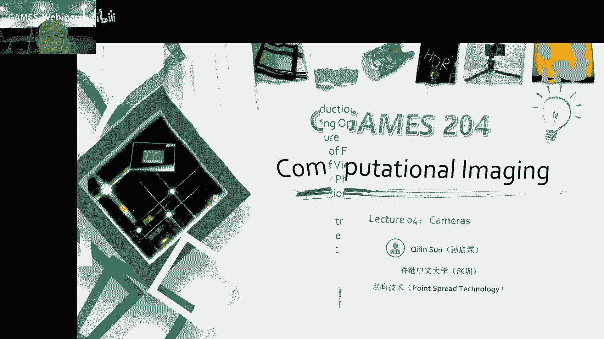

---

## 🧠 成像光学

上一节我们介绍了色彩的形成与捕获，本节中我们来看看相机如何实现成像。成像光学是相机系统的基础。

最早的成像光学器件可以追溯到约2700年前的“Nimrud透镜”，它主要用于聚光生火或作为放大镜。透镜成像遵循一个基本公式：物距、像距和焦距之间的关系。

**透镜成像公式**：
```
1/u + 1/v = 1/f
```
其中，`u` 是物距，`v` 是像距，`f` 是焦距。放大率 `M` 为：
```
M = -v/u = f / (f - u)
```

然而，实际透镜并非理想模型，会引入各种像差，影响成像质量。以下是几种主要的像差：


*   **球差**：平行光经球面透镜后，不同离轴距离的光线聚焦在不同位置。
*   **彗差**：斜入射光线导致像点呈彗星状拖尾。
*   **像散**：点光源成像为不对称的线条或椭圆。
*   **畸变**：图像发生桶形或枕形扭曲。
*   **色差**：不同波长的光因折射率不同而无法汇聚于同一点。

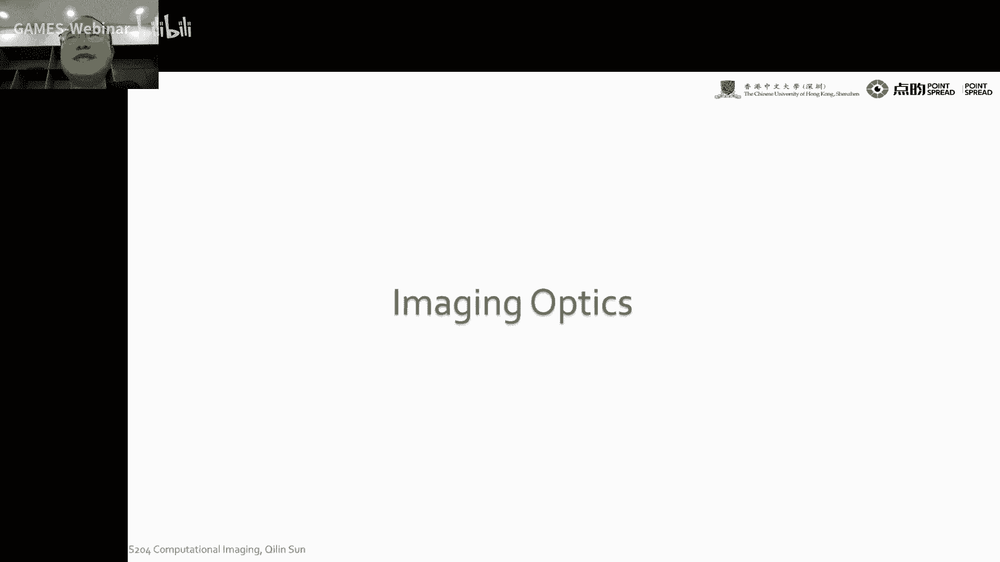


这些像差需要通过复杂的光学设计（如使用多片透镜组合）或后期算法进行校正。

---

## ⭕ 光圈

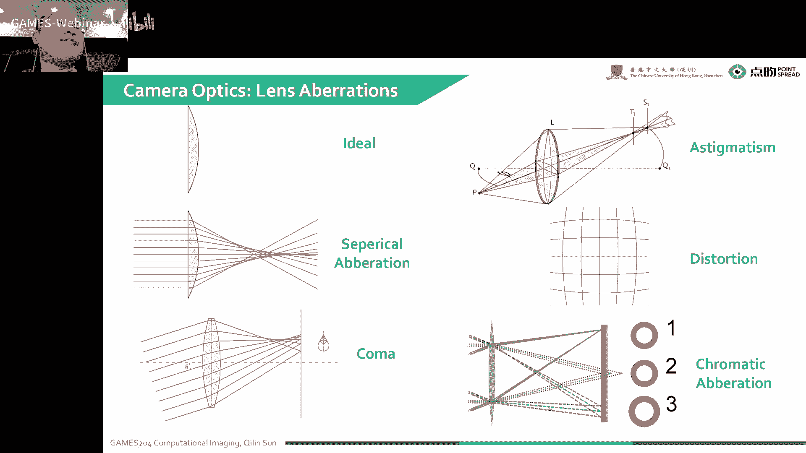

光圈是相机中控制光线进入的孔径栏。它有两个主要作用：一是消除杂散光，二是决定系统的进光量。

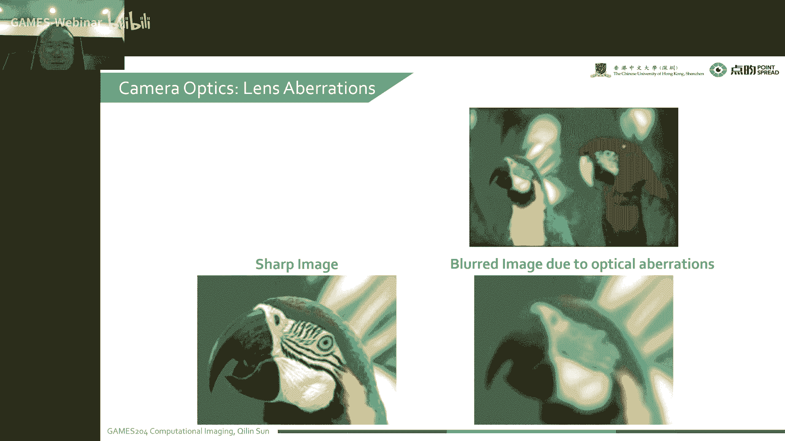

光圈大小用F数表示，其定义为焦距与孔径直径的比值：
```
F数 (N) = 焦距 (f) / 孔径直径 (D)
```
F数越小，表示光圈孔径越大，进光量越多。

---

## 🔍 景深


当相机对焦于某一平面时，只有该平面上的物体成像最清晰。其前后一定范围内的物体，虽然成像点会变成一个弥散圆，但只要这个弥散圆的尺寸小于传感器像素尺寸，人眼仍会认为图像是清晰的。这个清晰成像的前后范围就是景深。


景深受物距、光圈大小和放大率影响。光圈越大（F数越小），景深越浅；反之，光圈越小，景深越深。


以下是景深与光圈大小的关系示例：

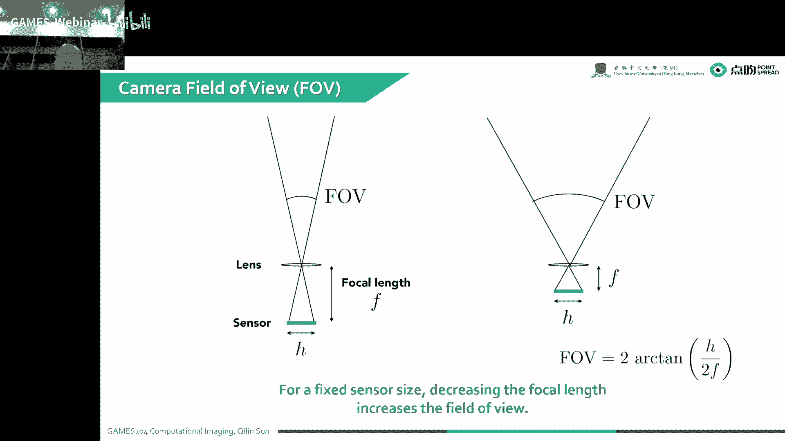

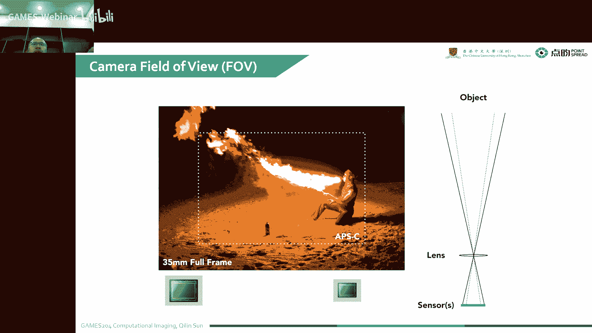

*   **大光圈 (如 f/1.8)**：景深很浅，背景虚化效果明显，适合突出主体。
*   **中等光圈 (如 f/4)**：景深适中。
*   **小光圈 (如 f/8)**：景深很深，前后景都较为清晰，适合风光或工业检测。

景深与曝光时间存在矛盾：使用小光圈以获得大景深时，需要更长的曝光时间，这可能导致运动物体模糊。

---

## 🌐 视野

视野是指相机能够观察到的最大角度范围。它由焦距和传感器尺寸共同决定。

对于一个理想薄透镜模型，其视野可近似用小孔成像模型计算。水平视野的计算公式为：
```
水平视野 = 2 * arctan( (传感器宽度 / 2) / 焦距 )
```
同理可计算垂直视野和对角线视野。

传感器尺寸越大，在相同焦距下，能获得的视野也越大。常见的传感器画幅包括：

*   **中画幅**：约53.7mm × 40.2mm，用于高端专业相机。
*   **全画幅**：36mm × 23.9mm，主流专业和高端消费级相机。
*   **APS-C/4/3画幅**：更小的尺寸，常见于入门相机。
*   **手机传感器**：尺寸更小（如1/1.1英寸），但通过算法优化成像。

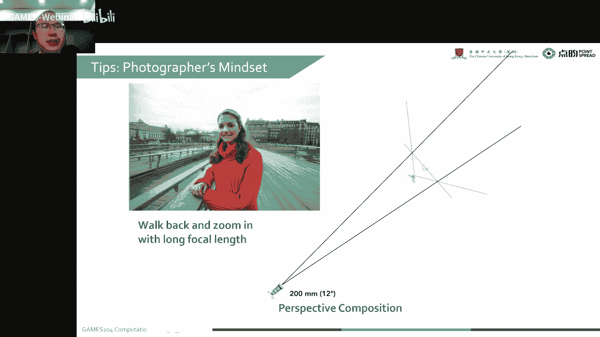

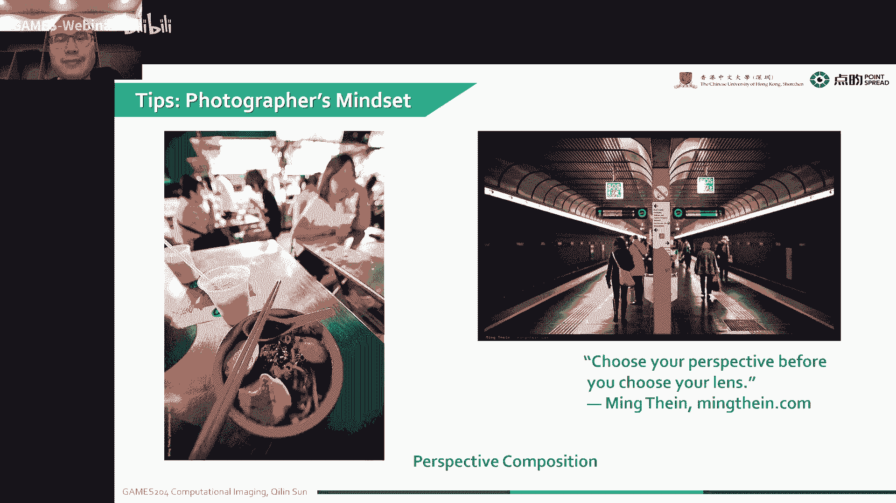

焦距越长，视野越窄，能将远处的物体“拉近”；焦距越短，视野越广，能容纳更多场景。

---

## 📷 传感器

传感器是将光信号转换为电信号的核心部件。现代数码相机主要使用CMOS或CCD传感器。

一个像素单元通常包含以下结构：

1.  **微透镜**：收集光线，提高填充因子，减少混叠效应。
2.  **彩色滤光片**：通常是RGB阵列（如拜耳阵列），使每个像素只感应特定颜色的光。
3.  **光电二极管**：利用光电效应，将光子转换为电子。
4.  **势阱**：存储曝光期间产生的电荷。
5.  **模数转换器(ADC)**：将电荷量转换为数字信号。


传感器的关键性能指标是量子效率，即入射光子产生电子的概率。现代传感器的量子效率在某些波段可达85%。

为了捕获彩色图像，需要在传感器前放置彩色滤光片阵列。最常见的拜耳阵列由1个红、1个蓝和2个绿滤光片组成，通过后续的“去马赛克”算法重建全彩图像。


---

## 🔊 噪声

噪声是成像系统中不可避免的干扰，主要来源于物理过程和电子器件。


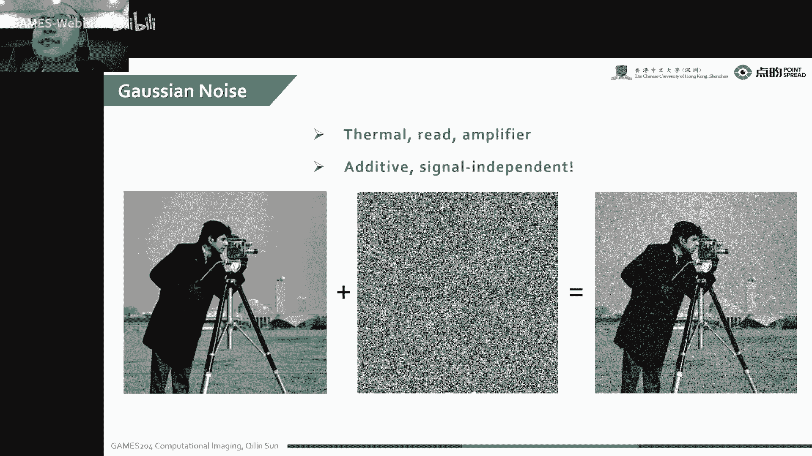


成像过程中的主要噪声类型包括：

*   **散粒噪声**：光子到达是一个泊松过程，其噪声标准差为 `√N`（N为光子数）。这是无法消除的固有噪声。
*   **读出噪声**：与信号无关的加性噪声，如热噪声、放大器噪声，通常建模为高斯噪声。
*   **固定模式噪声**：由于传感器制造工艺不均导致的固定图案噪声。
*   **量化噪声**：模数转换过程中因精度有限产生的误差。


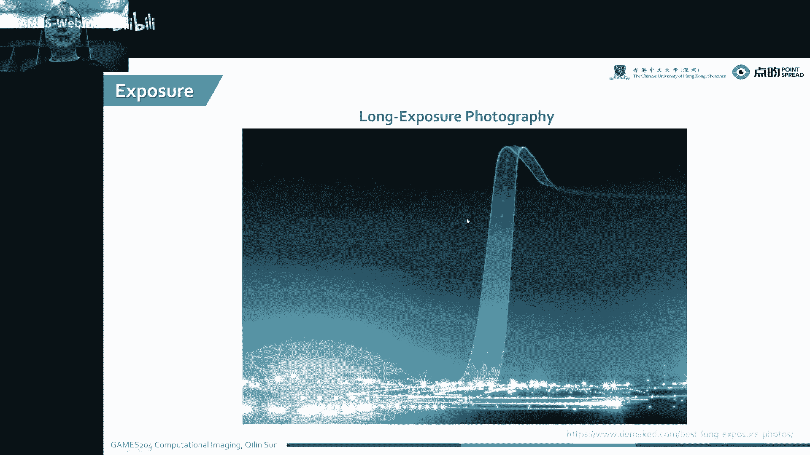

信噪比是衡量图像质量的重要指标，其定义为信号强度与噪声标准差的比值。光照越强，信噪比通常越高。


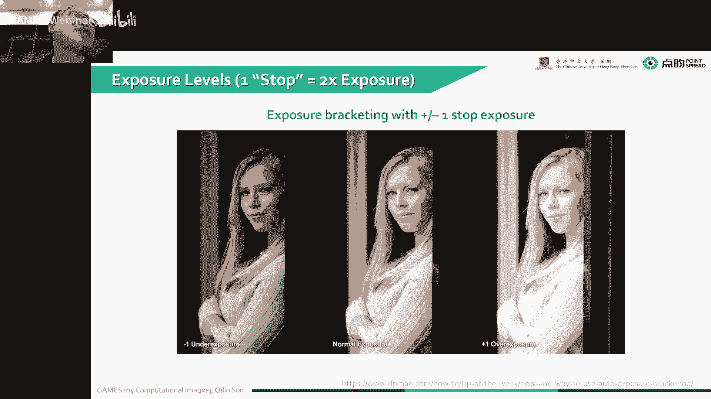

---


## ⚡ 曝光

曝光是指传感器接收光能量的过程，由曝光量 `H` 衡量：
```
H ∝ 辐照度 × 曝光时间
```
辐照度由光圈控制，曝光时间由快门控制。

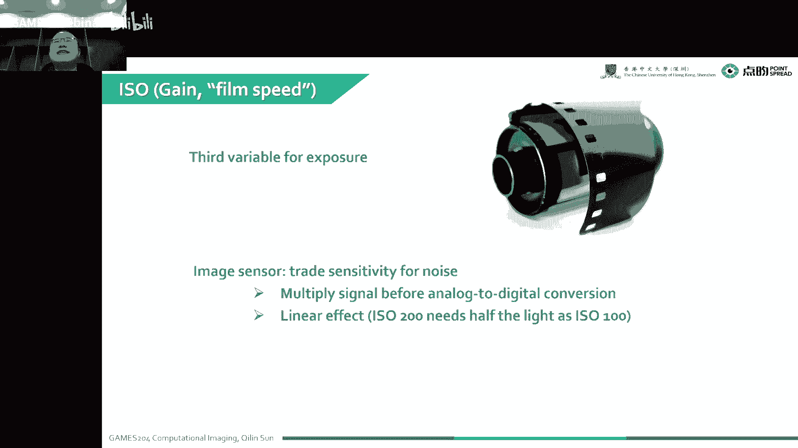


控制曝光的三要素是：


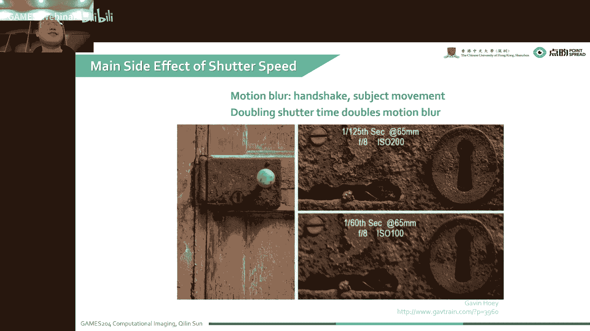


1.  **光圈**：控制进光量和景深。
2.  **快门速度**：控制曝光时间，影响运动模糊。
3.  **感光度(ISO)**：控制信号放大增益，影响图像噪声。

三者需要协同调整以达到正确曝光。例如，增大光圈可缩短曝光时间，但会减小景深；提高ISO可补偿暗光，但会引入更多噪声。


快门有两种主要类型：


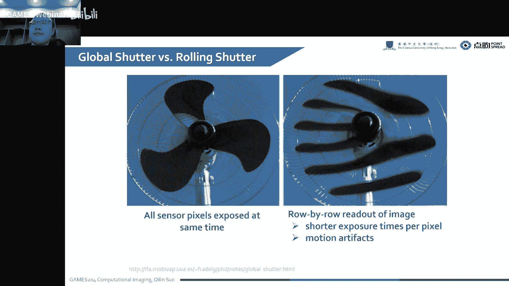

*   **全局快门**：所有像素同时曝光和读取，无变形，但速度可能较慢。
*   **卷帘快门**：逐行曝光和读取，速度更快，但在拍摄高速运动物体时会产生“果冻效应”。


---

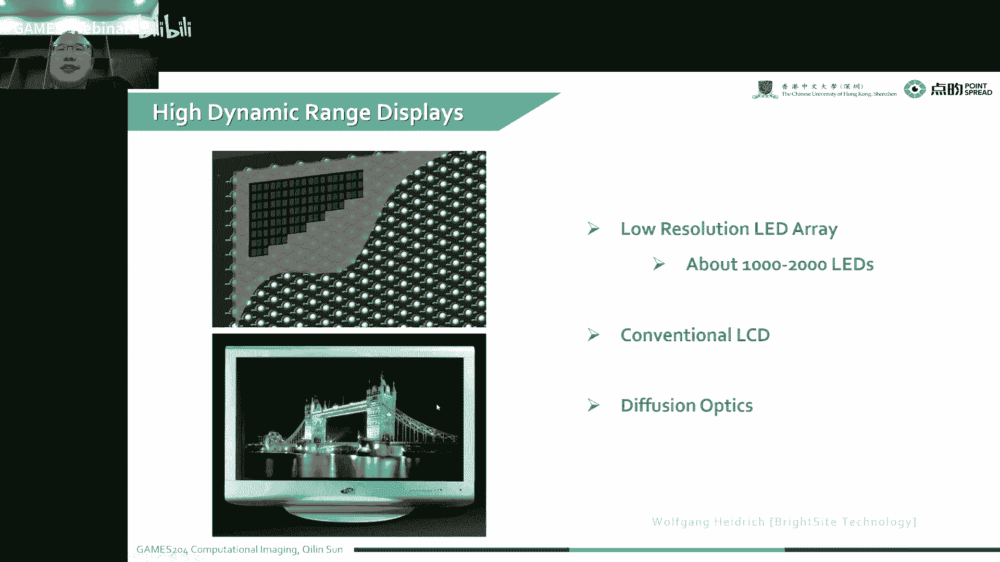

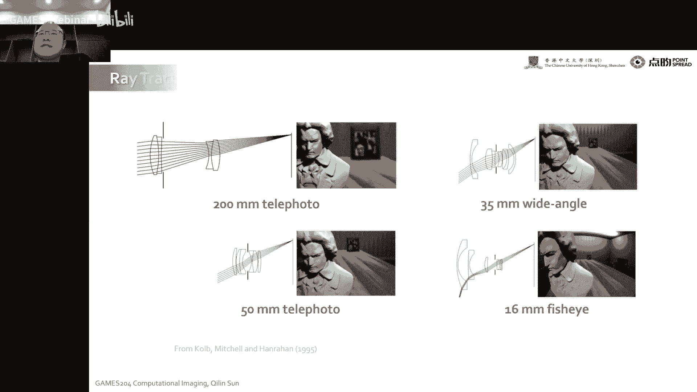


## 📝 总结


本节课我们一起学习了传统相机系统的核心组成部分和工作原理。我们从成像光学的基础公式和像差开始，理解了光圈如何控制进光量与景深，视野如何由焦距和传感器尺寸决定。接着，我们探讨了传感器将光转换为电信号的过程，以及在此过程中产生的各种噪声。最后，我们掌握了控制曝光的三要素——光圈、快门和ISO——及其相互制约关系。这些知识是理解后续图像信号处理流程和计算成像技术的基础。下一节课，我们将深入探讨图像信号处理管线，并布置第一次作业。