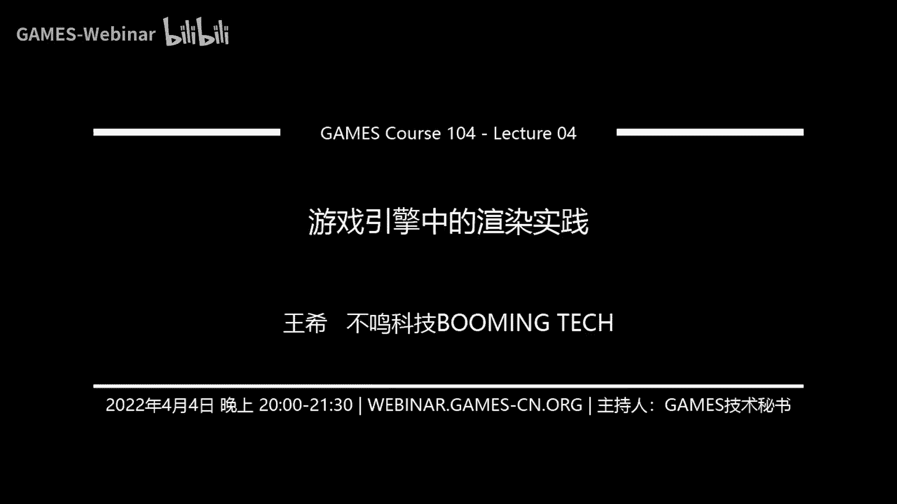
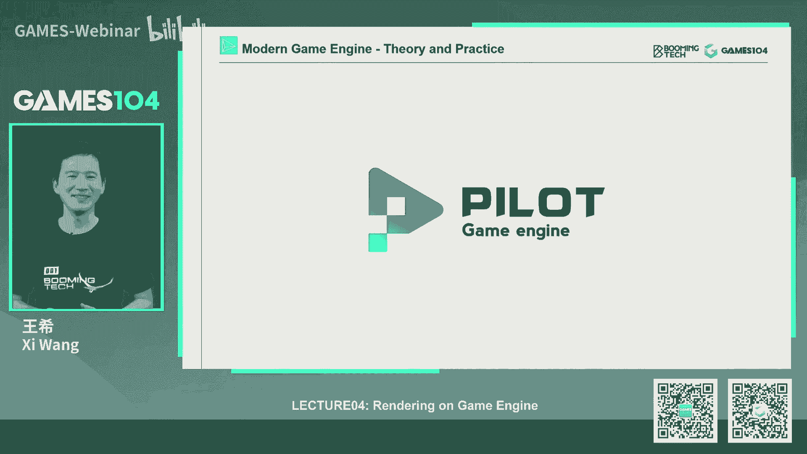
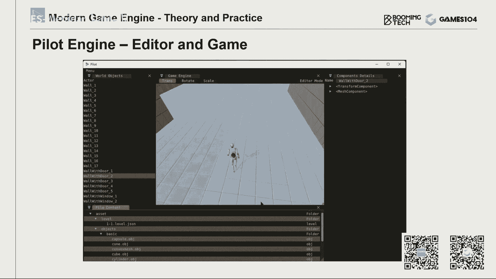
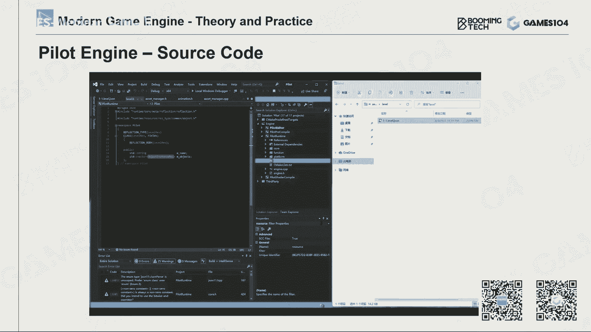
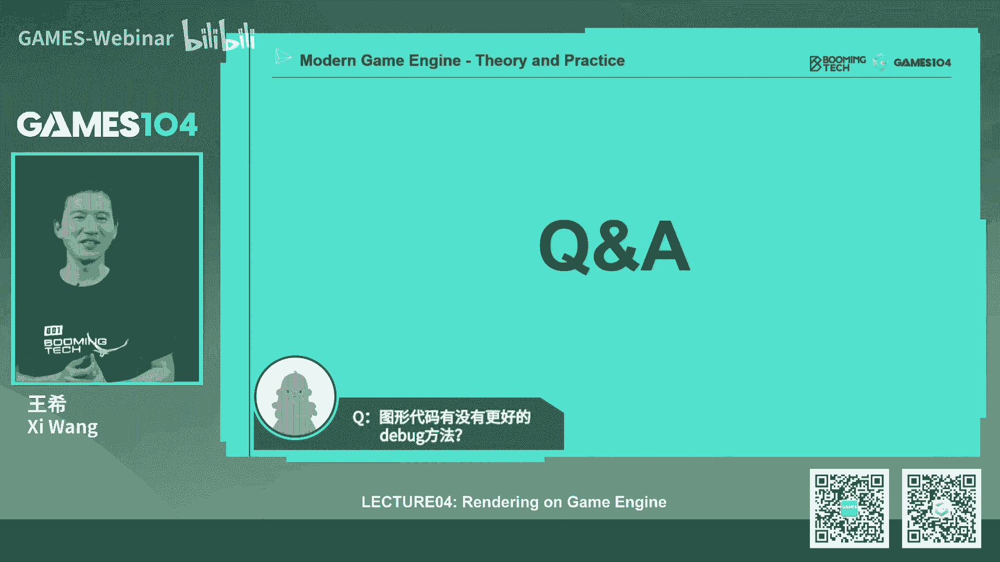

# 04.游戏引擎中的渲染实践 ｜ GAMES104-现代游戏引擎：从入门到实践 - P1：0 - GAMES-Webinar - BV14r4y1p7tt

哈喽诶同学们好，我是王希，欢迎大家回到这个games104课程，现代游戏引擎的理论与实践，那么今天的话呢是这个即将开启，我们一个很大的一个section，就是绘制系统，那么现代游戏引擎的绘制系统。

将会是一个非常大的一个就是模块，那我们会用四节课的时间给大家讲一下，游戏引擎的绘制是怎么做的，那么实际上的话呢就是从游戏刚刚开始的时候，我们就和绘制走在一起，其实最早的游戏大家知道就是在50年前。

那个时候的显示器就像一个示波器，其实在那个示波器时代的话，我们已经很努力的要表现这些画面啊，小飞机飞来飞去对吧，那么就最早的红白机时代的时候，如果大家去读过那个时候的回忆的文章的时候。

它实际上是一行一行扫描，每一行只能放几种颜色，现在这种情况下，我们还是很艰难的写了一个绘制系统，然后能够把一些很精彩的游戏奉献给大家，也是我们童年的回忆了，那么实际上在今天的话呢。

现代游戏的绘制系统是已经是越来越丰富，越来越复杂，所以就像我们在第一节课跟大家讲过，就是很多人就是提到游戏引擎会下意识的说诶，游戏引擎是不是就是绘制引擎，那显然我们上过我们前三节课的同学。

就知道说游戏引擎其实是不止绘制，但是呢绘制呢又是游戏引擎，非常非常重要的一派，而且呢它其实从技术难度，到他的专业的壁垒来讲的话，也是最高的一趴，那么就是这里面我就抛一个问题来了，我们的同学吗。

就是有没有游戏是不需要绘制系统的，同学们想一想，那这里面的话跟大家，就是那个啊开个小小的玩笑，其实是有的，比如说有一种文字游戏叫做MAD，就是说你通过打字说你进入了一个房间，然后呢房间里有一张桌子。

你要不要走上桌子呢，你跟谁说了一句话呢，其实这种文字游戏它虽然也是电子游戏啊，它其实是不需要绘制系统的，那么但是呢现在大家玩的绝大部分游戏，都是需要绘制的，那这里面的话呢我们要cute cue一下。

就是那个101课程了对吧，我们的严厉起闫老师，那么练习的话呢，他在101课程里面给同学们系统的去讲了，就是游戏计算机图形学的一些理论，那这里面的话呢我们学了各种各样的算法，各种各样的基础理论。

这些东西的话呢，毫无疑问，他是这个就是游戏的渲染系统的一个基础，那这里面的话呢我们可以看到就是说啊，我们学了那么多知识，那在游戏的渲染系中中中，它的区别是什么呢，其实我们会发现啊。

就是在计算机图形学中我们学的东西呢，他第一个解决的问题是比较明确的，比如说你去一般绘制一个或者几个物体，绘制某个特定的效果，比如说我们要绘制这个透明物体translucency，对吧。

我们要去那个去做你们的他们的那种，就是那个就是那个比如折射和反射的效果，比如说我们要做水面，我们要做这个3S的这个透半透明材质，那这都是一个非常明确的一个需求，另外一个的话呢。

就是说其实在那个图形学理论中啊，我们一般不会特别关注它的硬件是怎么实现的，我们一般会关注他的算法或者数学上的正确性，比如说在我那个大学学图形学的时候，我们学过一个算法叫辐射度算法。

他就是一个完全按照光学理论去给出的模型，然后计算机也跑个几天，算出一张非常漂亮的图，他也很好看，所以在我们的那个同学学的时候，我们那时候做到30帧以上，甚至20帧以上，我们就说yeah。

我们是个ROA的一个算法，如果呢我只能算到十帧左右，我们叫什么呢，我们叫做interactive，就是说可以交互性的事实了，那实在不行，我不能实时，但是我画面做的特别好，比如像电影级的cg的渲染的话。

那我可以是几个小时甚至几天只渲染一帧，那么有的时候数据会大佬，连那个就是内存都装不下去，甚至很多台机器离散的去存储，我们叫什么呢，叫out of CORE rendering。

所以这个呢其实是就是理论的图形学，计算机科学学和游戏呢是有一个很大的区别，就在这一点，那么在游戏中的绘制系统，我们面临的挑战是什么呢，第一个挑战呢就是说在游戏的绘制系统里面，我们同时要处理的物体对象。

以及物体的各种类型，包括我需要实现的各种效果是极其复杂的，举个例子，就是说在我的场景中，有成千上万的这个物体的对象对吧，而且它每个形形式都不一样，有的是比如像水体，有的是这个这个foliage就是植被。

有的是角色，有的是天空中的云，那么我需要用到的这种绘制算法，比如说毛发的算法对吧，皮肤的算法，水体的算法和这个植被的算法，还有地面上材质的算法就完全不一样，然后我整体上还要加大量的后处理。

大量的这个就是说光照运算，所以这everything into one container，就是所有东西都放在一个容器里面，那大家想想看，这个游戏的绘制系统是不是会非常的复杂，这是我们的第一个挑战。

就是它非常复杂，它是一个all in one的一个组合，那么第二个事情呢，就是说其实在游戏的绘制系统的话呢，我们并不是跑在一个理想的，或者是一个一个idea的一个设备上，就SERRALLY。

我们证明它正确了，就能做，恰恰相反，我们需要跑在现代的硬件基础上，比如说这是一个很经典的计算机的，这个PC机的架构对吧，它南桥北桥，如果同学们自己组装过电脑，就知道说诶。

我要把这个显卡和这个CPU插在哪个地方，对不对，那么硬盘插在哪个地方，南桥北桥，那我们做的所有的算法，它必须要在这些现代的，比如说我们的PC或者是主机，或者是我们的这个小小的switch上面。

要跑得非常的快，那我们就需要对它的硬件了解的非常的深，我才能做的特别好，所以今天的这节课呢会相对来讲有点硬核，我会跟大家讲一些硬件的东西对吧，大家要做好后面高能的准备，我高能之前的话。

我一定会给大家做个预警，所以说我们的计算机图形学，渲染系统的第二个挑战呢，就是说你必须要深度的去适配当代的硬件，那么第三个呢，也就是说其实在我们在统计学理论的时候呢，我们其实一般来讲一个算法。

我们觉得这个效果做出来了，基本上能达到一个相对好一帧率，我们觉得不错了，但是在游戏中啊，其实你的场景是千变万化的，对不对，但是你的帧率必须是稳定的，举个例子，比如说我不能够一开门走出去。

看到一片巨大的山谷，然后呢很开阔的世界突然帧率掉了一半，那大家觉得这个游戏就不好玩了，对不对，我看了那个就是很多在网上，大家看到一些新的游戏的点评的时候，如果发现那个游戏打着打着帧率就掉下去了。

你们就会说这是很差的游戏，但是大家想象一下，我们在游戏世界里面，构建的场景是不是非常的多样，一会儿你在一个密闭的小房间里面，就几个怪物围着你打，你突然一下子跑到这个楼顶上，你看到一个整个城市的场景。

但是无论你是看到大还是小，无论是细腻的还是粗糙的，它都要保证是在1/30秒，就是30ms跑完，而且现代的游戏呢要求越来越高，比如说我们讲电竞，大家现在打一个FPS游戏的话，我们是不是都要求要60帧呢。

对不对，包括现在电竞屏的要求到120帧左右，那么我们的画幅呢又越来越大，最开始的时候我们叫做1080P高清，那现在的话呢，我就我相信我们很多同学的家里的那个游戏，电脑已经全部变成了4K了对吧。

即将我们到来的是8K的时代，想象一下，就是说如果大家在做绘制系统，说这个game engine的话，这个压力会多大，也就是给我们的时间越来越小，但是大家对我们画面的要求也越来越高，所以呢在大家去理解。

就是说游戏引擎的绘制系统设计的时候，要要理解一件事情，就是说他的这种就是绘制的算法，它必须装在一个非常固定的这个预算里面，就是你绝对不能超过大，你超过大的话，一帧率就掉下去了，那玩家的游戏体验就没有了。

所以这也是我们就是做和这个游戏引擎，其他的这个比如说设计师啊，美术啊，天天打架的地方，就是你把这东西弄得太复杂了，那你就会影响我的游戏性了，那么最后一个呢也是同学们可能会忽略的。

但是其实呢也很简单的一个道理，就是说我们这个游戏跑在我们的一台电脑上，显卡线我们可能可以百分之百的把它吃掉，但是CPU也就是我们最重要的计算单元，我们可以把它百分之百的吃掉吗，如果把它百分之百的吃掉。

那我们前面讲了那么多的游戏逻辑啊，游戏玩法是不是跑不起来了，对不对，包括网络啊，所以实际上的话呢，在我们的就是真正的游戏引擎里面的，绘制系统的话，它不能像我们在图形学课上。

我能百分之百的把车计算资源全部吃掉，我们硬盘只能吃掉大概10%到20左右吧，剩下的大部分的话，我们还是要让给我们其他的这种gap类的系统，所以这个呢也是一条阴线。

所以说当我们去做一个真实的游戏开发的时候，我们有一个很重要的工作叫做profile，然后呢那那个那个profiling的，现在一般游戏引擎都是全自动的，就是每天我们会自动的去跑，然后会告诉你说。

哎你这个系统好像超过了我的预算，你得赶快改回去，否则的话我这个游戏就不许你发布，所以这也是对游戏引擎的绘制，系统的这个巨大的限制，这四点挑战的话呢，也就导致了现代游戏引擎的渲染系统的设计。

会和传统的就是计算机图形学的理论，讲的是有比较大的一个差别好，那所以呢我们这一个章节，也就是我们连续的四节课，就是争取用大概四节课的时间，把游戏引擎中的绘制系统给大家讲清楚，在我开始讲这节课之前呢。

讲讲这些东西之前，我想给大家建立一个概念，就是我们接下来讲的所有的东西，它不是一个理论模型，它是一个工程实践过的，就是这个非常practical的，而且呢是经过这个行业将近30年的，这个迭代优化。

heavily optimized这样的一个software system，也就是说它是个软件工程系统，它是一个实践科学，其实大家以后在学一些理论，和学实践科学的时候，你会发现他们之间有很大的区别。

如果学理论科学的同学啊，其实比较舒服，为什么呢，一般理论知识它更新换代的速度不会特别的快，基本上那些基础理论你基本上十几年调一调，问题就不大，你就是差不多它的，就像数学，有些东西你是不会变的，对不对。

但是如果你是一个工程实践科学，就是它代表比如说最前沿的制造，制造制造技术，最前沿的计算机的体系结构技术，最前沿的这个游戏引擎的技术，和游戏引擎的渲染技术，那么它更新换代速度是非常的快。

因为它是在工程实践中演化出来的，而且呢它是会随着我们的硬件，整个游戏产业的环境的变化，在快速的不断的优化和迭代中，所以在这节课中的话呢，我们不会跟大家纠结一下，它的理论模型是什么样的。

我们更多的会跟大家讲什么东西呢，就是说这些工程上为什么是这么做，这么做，为什么是这么多最优秀的聪明的大佬，发现是最优的东西，所以它是一个practical的software system，这个概念的话。

我希望同学们建立起来，实际上也是到我们最难的这一趴了，就是今天是那个清明节对吧，我们的课程组的小伙伴们非常的干，其实非常的辛苦，那我们真的是花了很多很多时间在想一个问题。

就是说如何把这个游戏引擎的渲染系统，塞到四节课里面，因为大家知道就是游戏引擎啊，这个东西，它本身它的绘制系统本身就可以，成为一个20节以上的基础课程，而且20节还是非常浓缩的。

如果我们做一个叫real time rendering in game engine，这应该是这么厚的一本书，没什么太大问题的，然后的话呢，我们20节课给大家建立一个基础概念，也是没有什么太大问题的。

但是呢我们的挑战就是说，把这所有的东西用四节课讲清楚，所以呢花了很长时间，我们想了一下，就是说那个我们把这个课程分成四趴，第一part呢，就是今天我们会给大家讲一下，基础的GPU的硬件是怎么回事。

包括基于这个硬件的架构，我们对渲染的数据，包括体系是怎么管理的，包括可见性裁剪这些基础的东西，你至少知道说我给了你一堆东西，它怎么画出来对吧，那么第二节课呢，我们会讲一些就是真正在实战的。

比如说在现在游戏中，你的光照模型到底是什么，比如说最著名的IB2模型是怎么回事对吧，那么就是那个然后呢给大家介绍，就是现在行业最标准的就是材质系统，比如说PB2的材质，那么两种最经典的材质。

它模型它的优异度差别，然后最后呢会跟大家讲一下，就是说我们的SHADER模型，其实你把第二节课听完之后，你基本上能画出一个看上去非常非常就是CBB，就是跟现代游戏看起来很像的这样一些东西。

那你就不用再去纠结说我怎么去用这个模型，那个模型基本上你看第二节课的模型的话，做出来的东西看上去就很像我们叫做什么，来叫行货的东西了，那么第三节课呢我们会跟大家同学们讲一些。

就是其实游戏中很多很重要的这个子系统，比如说地形系统对吧，还有天空的这个系统，包括后处理系统，其实你们看到很多的3A大作，它的后处理其实是非常非常重要的，这些算法呢其实很深，也比较有比较有挑战性。

那当我们在三节课的时间，学会了这所有的基础的数据组织，基础的绘制算法，材质模型之后，那我们要讲什么东西呢，就跟大家讲就拍拍，那大家可能听说过很多很著名的pine。

比如说different shading对吧，延迟渲染，那different shading为什么要这么设计，它的点在哪里，包括就是说我们真的去做完了绘制之后，是不是这个不用管。

说显卡怎么提交到我们的屏幕上，那这里面他的这种绘制的，这些内容是怎么管理的，包括在屏幕上怎么去，那包括在这里面的话呢，我们也可以跟同学们讲一下，就是现在比较前沿的这个叫TBRENDERING。

所以说我们把所有的东西全部压缩到了，这个四节课里面，所以呢应该来讲就是知识密度有点高，有的时候可能有点挑战，如果同学们听不懂，不要慌，没关系，因为我们后面会上传录像到B站上。

所以同学们的话呢可以回头再去看，而且呢也不需要全部都懂，因为你只要知道一些核心的东西就可以了，那么今天的这节课呢就是我们可能需要拖点堂，就是我们前面所有的课程，都希望控制在一个小时之内的。

今天这个课我目测一下，好像一个小时有点有点难，没关系，就是希望既然是放假了对吧，我们就在一起，好好的在知识的海洋里面遨游一下好，那我们就开始今天的第一节课，就是渲染的基础。

那其实呢哦对在这节课里面的话呢，我们虽然已经尽了我们最大的努力，但是我们得向同学们坦诚啊，有些东西我们还是没有办法装进去，实在容量不够了，那比如说大家特别喜欢的这个卡通画渲染，大家都喜欢的二次元游戏。

对不对，那其实呢同学们不用慌，因为这个就是说你学完这节课的基础知识呢，你再去上面再学二次元的，就是mp2的非真实感渲染的知识呢，也不会特别难。

他其实他用的很多理念跟那比如说post processing啊，后处理啊，这种理念是相通的，那么包括呢像很多的2D游戏，其实我们叫的2D游戏引擎，它有一些很深的一些一些方法论的东西。

但是呢现在的其实很多2D引擎，现在也是采取3D引擎的方法，就是把这个东西在3D空间展开来，所以的话呢你这些知识也是可以相通的，当然了还包括一些大家特别喜欢的，比如说非常炫酷的这个皮肤的3S材质对吧。

就是半透明效果，比如说我们特别炫酷的毛发效果，这些呢都特别适合作为一些就是独特的专题，跟大家去讲，如果后面的话我们有时间或者有机会，我们会开开一个高级课程，或者开个专题讲座。

跟同学们去分享这些领域里面的，一些前沿的探索，所以呢这里面也跟大家道个歉，就是说虽然我们已经很尽力的往里面塞东西了，但这节课还是有很多的就是计算机图形学啊。

就是那个return rendering的东西，我们没有办法放进去，好的那我们就开始今天的课程的正文吧，先跟大家就是因为这是一个新的section的暖场嘛，我们几乎花了15分钟的时间。

给大家建立了一个基础的就是render系统，到底是个什么东西，那么好，那我们开始在做rendering之前的话呢，我觉得首先同学们要建立一个概念，就是说这个rendering到底是由哪些要素构成的。

那这里面的话呢，我们就那个扩一下我们的这个101的课程，对吧，我这个这一张图是从我们的101课程，练习的课件中扣下来了，然后我跟他讲，我说我要听你的课程，那么这里面的话大家可以看到。

就是说哎其实渲染好像也不难，对不对，他就是有很多的顶点，空间上的顶点，然后呢连成了一个个的面，这一面呢经过一个投影矩阵投到我的屏幕上，然后呢我们有个过程叫做rust rizer。

Rust ization，那么它就是把这个三角形呢就是rust rise，就官烧光栅化成一个个的小像素点，然后呢在每个小像素点上，我们去找到它的对应的材质啊，它对应的这个纹理啊。

就给它就就是给它渲染成各种各样的颜色，你可以考虑光照，可以考虑它本身的花纹，然后渲染出我们最后的效果，所以呢最后我们可以选出我们的这个结果，所以简单来讲的话，就是你看到这里面的话，有成百万的这个顶点啊。

三角形啊对吧，有上就是几千万以上的这种像素，有并联，觉得就是10亿级的这种ARU的和text的运算，这就是我们rendering的一个最基础的东西，那这里面的话呢我们可以看到，就是说在绘制的话。

它最核心的工作是什么，我们叫做computation对吧，计算机你要去画出一个东西，还要工作，其实这里面我给大家讲个概念啊，就是其实绘制系统对于游戏引擎来讲，就是说我们就做那种躲在像素之后之后的事情。

我记得以前在SIGGRAPH上有个section，就讲游戏引擎绘制嘛，在这中间的话呢，我们就会提到一个东西叫做the men and women behind，The pixel。

就是躲在像素之后的男人和女人们，为什么呢，因为就是说我们大家看到的那样，一个壮丽的画面，实际上是现代计算机一个一个像素堆起来了，那么这里面的话呢我们的计算第一种是什么呢，比如说最简单的投影和光栅化对吧。

这个在101课程中讲的特别的多，就是我们找一个相机位置，然后呢进行它的投影，无论是正交的还是这个那个透视投影，然后呢，我们得到这个屏幕空间上这个三角形之后，我们把它关上化成一个一个的像素。

这就是我们的投影，那么投影光栅化之后呢，诶我们就开始对它进行着色，就是绘制，绘制呢，其实这里面我们取一段就是我们看到这个球，对不对，我们取一段最简单的一个叫，就那个他的成它的代码的案例。

那证明这里面的话，他会发现它的运算其实也就几种，比如说第一种，我要去从这个这个常量里面取很多的常量，比如说我做个绘制，我需要知道屏幕上有多少长宽，有多少个像素，那我们是要访问一些常数呢对吧。

这些常数在每个像素里面我都要去访问它，那我们中间呢会做大量的加减乘除的运算，比如说我们要算一个缝模型的时候，你需要知道说法线在哪里，光线在哪里，我的眼睛在哪里，我就可以算出来说，诶，这个光有百分之多少。

会被我这个就是这个这个衰减掉对吧，那么我这个小球上有很多的花纹，那我是不是要把它存到一张这个2D的贴图上，我在那个点把那个贴图上那个颜色取出来，放到一起，这些东西就像炒一盘菜一样的，你用这几种运算。

就是说啊数学运算常数的访问变量的访问，再加上这个就是texture的访问的话，你就能得到你想要的结果，那这个事情呢其实听上去很简单，但这里面呢我要跟同学们建立一个概念，就是说其实在绘制中啊，有一个过程。

大家可能注意不到，但其实它非常的复杂或者是昂贵，就是什么呢，叫做texture，就是踩踩这个纹理，那为什么这个东西它其实非常的复杂呢，大家想想一下啊，就是这里面给大家讲个概念。

就是说啊我们在人身上贴个花纹，比如说我们作业面砖墙，这个砖墙离你很近的时候，你会看到一个一个的像素，对不对，但如果这个砖墙离你非常非常远的时候，其实啊你在屏幕上看到的一个像素。

在那个纹理上其实是隔了很多很多的像素的，那这个时候如果我们不去对它进行一个，叫做这个专业的说法叫滤波，做一个低频滤波的话，你当我的这个砖墙由远及近的移动的时候啊，由由近及远的移动的时候。

你会看到那个画面一直在抖动，这个东西叫什么呢，叫做走样，我相信很多同学玩游戏的时候，你们会有一个叫图形设置，叫NTL型防走样，对不对，那么如果你的显卡特别好的话，你会把你反走样开的特别高。

其实呢这也是一个很重要的反走样的方法，那在纹理上面的话呢，我们实际上每一张贴图我们会存很多很多层，当我作为一个屏幕上一个小小的像素点，我去取一个纹理的时候，实际上我首先我取的位置不一定在那个。

就是那个像素点上，所以呢我要取四个点，要对它进行插值，然后呢我还要在两层的放比例上去取，那这里面的话考大家一个数学题啊，我们要做一次纹理采样，我们要访问多少数据，我们要做多少次差值呢。

对这个答案是这样的，就是我们要是这个图上已经画的很清楚了，就是如果我们做一个采样，我们要采样八个顶点啊，就八个像素点的数据要做几次差值呢，要错四七次差值，所以大家想想看，就是我取一个最简单的颜色。

我的计算机要做这么多的工作，所以这件事情呢，其实也是绘制中的一个很重要的运算，所以这里面的话呢，我们就要隆重推出我们今天的主角了，就是GPU对吧，graphics的这个process unit。

那么实际上也就是大家讲的这个显卡，那么显卡这件事情的话呢，是非常了不起的一个发明创造，就像我们第一节课也讲过，就是现代的很多引擎，之所以能够就是啊有突飞猛进的变化，就是因为随着独立的显卡出现。

我们可以把这些复杂的运算，用一台更高效的机器进行处理，这样的话我极大的释放了我的这个CPU，同时的话呢我们可以把画面越做越清晰，所以说如果你想成为一个就是游戏引擎的图形，程序员的话，那这是你最好的伙伴。

你最好的buddy，包括我们现在游戏引擎里面，很多绘制系统的基础设计的话，它都是基于现代显卡的架构的理解，所以接下来这一趴呢会非常的高能，就是我要跟同学们讲一下，就是我我已经是尽可能的。

讲一些比较简单的东西，就帮助同学们建立就是显卡的基础架构，让大家知道，就是当我们架构一个系统的时候，我们需要关注什么，但是呢呃对于就是没有基础的同学呢，稍微有一点点高能啊，反正同学们如果听不懂的话。

会会可以告诉我们，我们后面再去看看怎么去补充好，那我们进入一个最基础的硬件的这个漫游概念，那要想理解显卡呢，我觉得首先要建立两个概念，就是叫SMD和SMT，这个听上去是不是很高大上。

其实SMD就是这个是我们的老朋友了，大家还记得我们在前面讲过，就是现在CPU里面的话，实际上呢已经广泛地使用了，这个就是要单指令多数据的加减，这个数学运算，简单来讲就是一个四维的向量对吧。

就那么当我做一次加法指令的时候，他的XYZW坐标同时在做运算，所以我一个指令能完成四个加法或者四个减法，这个听上去很简单对吧，就是那个在我们的那个，就是很多的高性能运算中，我们会呃，我跟同学讲过。

就是如果你们看C加代码，会看到有些叫SSE的这个扩展宏，那实际上就是在调用SMD的这个指令，大家想象一下我们在渲染的时候，是不是有大量的这种，就是这种类似于这样的运算，比如矩阵运算对吧，坐标变换运算。

所以SMD就是我们最好的朋友，这个概念非常好理解，而但是呢在现代显卡里面的话呢，我觉得同学们一定要理解，另外一个更有趣的概念，叫做SIMT叫single instruction。

Multi threst，就是他的想法呢其实也非常的简单，就是说如果我的一个计算内核，我把它做的很小，但是我可以做很多很多个，我这样的一条指令的时候，我可以在很多很多的盒上同做同样的指令操作。

那比如说我假设有100个盒放在那儿，那我一条指令下去，我是不是可以做100个四个数的加减乘除呢，那是不是我的计算效呢，以前是乘了四，我再乘了100，所以那我的比例是不是放大了400倍。

其实现代的这个显卡的话，大家如果去看的话，它本质上就是一个我认为是个大蜂巢，就是放了无数个小小的盒，那现在比如像那个NVIDIA的，就N卡的话，一般是放了无数个小库大盒的，后面我们会详细的讲到。

但是这个呢实际上就是现代显卡，为什么算力这么强的原因，那么就跟大家讲了基础的概念，就比如说像现在的很多显卡的，好的计算的这个性能，如果我们有一个有个概念叫flops，就是一个浮点运算能力吧。

就是那么一秒钟你能完成多少次浮点的计算，那么这个现在的显卡，一般能达到十个以上的TREFLOS，对不对，比如像XBOXX或PS5，但是呢现在的CPU的话呢，一般在很难达到一个turf。

它两个数量已经超差距，已经超过了一个数量级，那为什么显卡能够遥遥领先于CPU呢，本质上是显卡耍流氓，就是说CPU很老实对吧，我就是一个人闷头处理所有的事情，但是呢显卡很流氓，就是招了很多小伙伴。

虽然每个人能力都不是很强，但是大家一起来协作，所以他的算力非常的快，那为什么要让同学们知道这个SMT这个结构呢，就是说我们在做所有的绘制算法的时候，做所有的运算的时候，都尽可能是用同样的代码。

大家让大家一起跑，然后呢每个人分别访问自己的数据，这个时候你可以在显卡上跑起来非常的快，而且是远远远远超过你在CPU上算出来的东西，这个是做图形程序的话，最重要的要掌握的一个概念。

那么你有了这个概念的话呢，其实大家就可以窥探一下，就是现代GPU的这个架构了，那这张图就比较高呢，同学们看的是不是觉得很晕啊，密密麻麻的，如果有密集恐惧恐惧症的同学会觉得很难受。

其实呢这个图虽然很复杂吧，但是呢我们有一个简单的方法，就是你可以发现啊，其实它的结构是重复的，就比如说这里面我们选用了一个相对简单的，就是那个费米架构，费米架构大概是10年前的。

10年前的那个N卡的架构了吧，最新的架构应该是安培最新的哦，是四零系列的话，有可能是那个Hope的架构，那我们先当然他技术原理的差不多吧，那我们就用那个这个费米这个架构来给大家讲，就是一块显卡上。

他放了很多的内核，但是呢它分成一组一组的，这每一组叫什么呢，叫做GPC，其实是graphics process cluster，就是一个图形处理集群，然后在这个图形集集群里面的话呢，你可以看到很多的。

就是他们叫做那个就是那个string multiprocessor，这个stream multiprocessor里面装了很多的小的块，小内核，一般在N卡上，我们放的是库塔的盒，这个库塔核干什么事情呢。

它就做大量大量的数学运算，然后呢这个这样的一个那个string multiprocessor的话，你给他一条指令，这些小孩就哐叽就一下子狂跑起来了，然后在这里面的话呢，他有专门的硬件帮你去处理。

他的这个就是各种texture，就是我刚才讲的非常废的纹理采样的工作，包括呢做一些比较复杂的数学运算，比如说啊同学们要有概念，就是当你们将来以后做这个绘制的时候，如果你想在显卡上跑加减乘除没有太大问题。

但是如果你要扩一些像什么sign啊，cos啊这些什么这个这个这个三角函数啊，对吧，你可以明白它的运算速度会比较慢，还有专门的SFU帮你去处理这件事，这个讲讲起来就太深了，我们今天不展开。

其实大家如果看最新的，比如说安培架构里面的话，这里面会塞什么呢，会塞一个叫tensor CORE，就是这个著名的人工智能的这个，这个这个这个核心还放个什么东西，还放一个叫RT CORE。

就是大家喜闻乐见的光追，那其实那里面有个专门的核心去支持这件事情，所以这其实呢就是现代GPU的架构，但同学们怎么去理解这件事情呢，就是我们的很多的运算，这个CPU上都是分到一个个的。

这个叫这个string multiprocessor这个单元去处理，那么这里面的话几十个核的，其实他们不仅是并行的处理工作啊，他们还可以互相交换情报，形成这样的一个一个一个协作体。

所以呢这里面可以看到他们有shared memory这件事情，如果同学们如果有写过这个叫多，就是那个KROUTINE啊，就是B进化编程的时候，你们就知道说哦，我们的这些CPU之间还可以交换数据的话。

我可以做一些非常酷炫的运算了，所以这个是现代GPU最重要的架构，也就是我们几乎所有的运算，都是跑在这样的一个架构上面来，那么这里面的话呢，就是第一个，我们把这个SMT的架构这个概念教给大家，那第二个。

我想同学们建立了一个基本概念是什么呢，就是其实啊，我们的数据在这个计算机里面流动的时候，是有成本的，就是从我们计算机诞生开始的时候，我们用的是什么架构呢，这个有一个很著名的学术名词叫冯诺依曼架构。

冯诺依曼架构它的核心是什么呢，就是把计算和数据分开，这个架构非常好，会让硬件设计变得非常的简简单，对不对，当然其实现在有一些很前沿的研究，就是想打破这个架构，那我们今天不展开啊。

那么这个架构所带来最大的问题是什么，就是我每一个计算我可能需要去找数据，后来大家发现就是找数数据，这件事情是特别特别慢，而且数据呢在不同不同的计算单元中，搬来搬去也是非常慢，我们举个例子啊。

就比如说在这个，就是大家刚才还记得我们一开始的那个南桥，北桥嘛对吧，那个北桥上面我们放了一个这个CPU，这边放了一个显卡，但CPU呢它里面装的是一个主主内存，然后这里面的数据。

如果我把它上传到我们的显卡的显存上的话，这个速度是非常慢的，而且呢还有一点是什么呢，就是说我们GPU不是算的非常的快吗，显卡算的非常的快，但是呢大家想想看我的一个计算，如果我先从CPU准备好。

交给显卡去算，显卡算好，我把它的数据读回来，CPU再基于你对这个计算的结果再做一些判断，然后再告诉CPU怎么绘制的话，这个我们叫做这个数据的DK force吧，那实际上会有一个非常严重的问题。

什么问题呢，就是说啊因为在现代引擎架构中啊，一般绘制和逻辑是不同步的，但是你如果有一部绘制运算，需要等着他们来回去back force的话，实际上你很可能会导致就是半真到一帧的。

我们叫做这个latency，那整个画面就是我们经常会看见，就是这个逻辑和画面不同步，有的时候可能会因为这件事情会导致，所以呢在游戏引擎的绘制系统架构中，我们有一个原则，就是我们尽可能把数据单向传输。

就是CPU送到显卡就完事了，然后呢尽可能的不要从显卡里面读数据，这也是现代计算机结构，导致了我们的设计上的一个要点，那么第三件事情呢，我希望同学们对硬件掌握的建，建立的概念是什么呢，就是cash叫缓存。

那么其实cash这件事情是对现代计算的性能，影响是非常非常大的，可能远远超过大家的想象，我给大家建立一个基本的概念吧，就是说呃大家知道就是我们在CPU上，现在CPU啊，如果我们去做一次加减乘除。

可能一个clock就做完了，对不对，但是如果这个时候比如说我说A加B，但是A我找不到了，A在我的内存上，大家写代码的时候，是不是觉得就是内存上放数据，对不对，但这个时候实际上。

如果CPU发现不在自己的缓存里面，我需要去内存去找内存已经非常快了，对不对，实际上它要等100多个时钟周期，也就有那个时间，我已经做了几十个上百个运算走了，所以这就是为什么我在上一节课给大家讲的。

就是说数据一定要放在一起对吧，其实它就是为了cash去做这样的准备，这件事情呢在我们的图形，在我们的显存上是非常非常重要的，那包括就是说比如说有些数据过大了之后，它也会导致这个cash很难背这个利用好。

所以呢这里面两个概念，就是当我做每次计算的时候，如果A恰好数据都在我的缓存上，我们叫做什么呢，叫做cash hit，就是我们的缓存被命中了，那么如果呢这个时候我数据不在缓存中，我们叫什么呢。

叫cash miss，数据就是就我要等很久，所以你很多时候做这个计算机图形学的啊，就是做那个游戏引擎的绘制的时候，如果你的这些纹理这些计算没做好，老师让计算机产生catch miss的时候。

它的效率就直接下降了，所以呢这节课呢，我们高能的部分基本上快结束了，但是呢我跟大家去讲一下，就是如果大家以后有机会进入到这个就是啊，图形程序，这个对于我们的这个就是游戏引擎的话，你会学会很多黑化。

现在互联网黑话呀，你比如说这个au bound对吧，就是这个这个就是呃我的数学计算太多了，导致的就是说我其他的纹理采样什么都来得及，但是呢就是等你的数学运算结果，比如说像favorite bt。

就是说我所有的运算都算完了，但是呢我写到那个缓存，你的速度太慢了，结果就是一直要等大家都堵在那了，其实你会发现它的整个现代的计算机，它就是一个流水线，只要有一个环节它没有平衡好，它一旦卡住了。

你其他东西优化的再快，它也会被卡住，所以棒的这个词是一个最常用的一个黑化，所以但是今天呢我不展开，因为这个太深了，就是也不，或者说以后大家再进入到这个，就是游戏引擎开发中间的话，你们都会遇到。

所以这些东西其实让大家深度的理解了，就是现在的游戏，特别是呃就是非常复杂的顶级游戏的话，他再去做渲染系统的设计的时候，是会非常关注这个对GPU的使用和利用的，那么其实呢这里面我要跟同学们讲一下。

就是其实硬件的结构一直在变对吧，那么最像从最早的DX11时代，大概差不多10年前吧，我们看到的就是可以做更细分曲面的，更更加灵活的SHADER，包括可以更通用的计算SHADER，到今天的话。

我们看到了就是更容易去处理的这种mesh shader，这些结构一直在变，那么包括呢就是这里面，我们可以在之前经常跟同学们讲的，就是说当我从PC走向了主机之后，那主机的架构又不一样。

因为主机的话它是一个叫u ma，就是它的内存全部是共享的这样的一个架构，那你的这个引擎架构又会不一样，那么还有一个很著名的，就是这个大家现在天天见到的什么叫手游，手游是跑到哪了，是跑在移动端，对不对。

但在移动端上的话呢，他考虑到这个就是功耗，考虑到它的处理芯片的这个能力，因为这个就是说其实访问数据是最昂贵的，我一直讲过嘛，所以呢他们就develop的这个tale base renderry对吧。

就是我们你看着手机上一个，比如说1080P或者更高清的4K的画面，实际上它是一小块一小块的渲染出来的，那这些东西的话呢，其实你会发现我们所有的引擎架构都适合，硬件的架构息息相关的。

所以同学们在学渲染之前的话，我是特别特别希望同学们能够先去了解一下，这个显卡到底是怎么工作的，你理解了显卡是怎么工作的话，你对这种各种渲染的这个引擎算法，就有更深的理解。

所以这1part呢是相对比较高的，同学们听不懂没有关系，建立一个基础概念就可以了，那么同学们会说诶，那如果我不是做引擎的，我需要了解这些东西吗，我个人认为的哈，如果你是做游戏开发。

如果你是做有特别是游戏的这个art，就是艺术家的话，我觉得多少掌握这些概念还是有好处的，为什么呢，因为就是说当你去设计你的游戏的玩法的时候，你会知道硬件在什么地方会卡我们。

所以我们不会把这个场景做得无限的复杂，我能更专注于在我的玩法上面，好的高能的部分基本上讲完了，那接下来呢就我们把难度下降一点，给同学们讲一讲，就是那好了，我们已经知道这个显卡是怎么做出来了。

那现在可以让我去做一个简单的绘制了吧，那这个地方的话呢其实并不是特别的难，比如说我们打开一个游戏吧，我们看到的是什么，在上一节课我们讲的就是，这个世界里面大部分东西都是叫game object，对不对。

那么这些所有的game object的话呢，就是构建了这个世界，但是上节课我没有跟他讲的，是说我们对游戏里面的每一个物体，有很多的描述，比如说它是一辆车，它是一个飞机对吧，它可以有血量。

它可以有各种各样的行为，但是同学们意识到这里面所有的东西，它只是一个逻辑的描述，这个东西它其实是绘制不了的，所以这里面的话呢我们需要区分一个概念，就是说就是一个逻辑上表达的，这样的一个游戏对象。

和你真实可以绘制的东西是两个东西，所以那天我们在讲到这个组件的时候，会讲到有一个component叫什么，mesh component对吧，实际上这个名词呢，在不同的引擎里面有很多的变化。

有的人叫做mesh component的，有的人叫做skin mesh component，比如说skin mesh component，就是说假设这个mesh它是有骨骼的，可以一直去变形。

比如说我们做一个角色的时候，他可以动来动去，但是它的底层理念是大同小异的，那我们在这个component里面，存了一个很神奇的东西，我们一般在行业里叫什么呢，叫做RENDERABLE。

RENDERABLE是什么呢，就是可绘制的东西，就是我拿到了这个RENDERABLE这个物体，我就能把它绘制出来了，所以说这是我们这个绘制系统的，核心的数据对象，那么一个RENDERABLE怎么来了。

那我们首先看这个物体本身吧，那比如说以我们的这个小明，想做的这个，超越2042的现代战争游戏的为为例，它请了一个艺术家，做了这样的一个很酷的视频的角色，他就会发现诶。

这个家伙身上好像首先有很多的网格mesh对吧，就是它的几何形体，比如他的头盔，他的枪很帅，然后呢每一个mesh呢上面有各种各样的材质，比如说有的像布，有的像那个金属对吧，有的像皮肤。

然后呢这些材质上面呢还有很多的花纹，所以我们会展现出各种texture，但其实还有比如说它的normal对吧，normal就是说诶更细的，你没有办法用mesh表达的这些细节，我们用normal去表达。

好像你看这些东西是不是可以绘制的东西，这就是我们RENDERABLE的最简单的一个building block，但实际上RENDERABLE在现代游戏引擎中，比这个更复杂，但是这些是最基础的一个概念。

那我们再top down一下，就是说那首先咱mesh在我们的计算机引擎里面，游戏引擎里怎么表达呢，就是说如果大家不去做引擎的话，这些数据你是不用关注的，就比如说大家想象一个。

我从那个max用一个导入器导进来了，诶这个模型我在那个unity你就能看见了，对不对，其实这里面我们首先要定义一种叫做mesh，Primitive，对吧，这个primitive这个词呢。

其实有的时候会跟几何会通用，但我们这边就是简单的叫max primitive，那最简单的表达一个目的是什么哦，我们有很多的顶点，顶点上呢有很多的数据，比如说顶点的到底在哪里，这是一个数据，对不对。

还有什么呢，它的法向朝向，它就是它这个面是这个顶点是朝向哪的，还有一个是什么呢，比如说它的UV啊，还有其他一些各种各样的属性，然后每三个顶点我们放在一起，是不是就变成了一个三角形。

那我们把这些三角形放在一起，就形成了这样的一个外观，这个形状，当然了，这种数据存储方式是一种很笨的方式，实际上同学们如果写过这个，open gl和direct的代码的话，最基础的同学代码就知道。

我们会把数据用index data和vertex data去定义，什么意思呢，就是说我们把所有的顶点放在一起，三角形呢不会再把顶点数据再存一遍，我只存这个顶点的索引值，那为什么这么沉呢。

其实道理非常简单，就是说我们打开一个真实的模型的话，你会发现诶，他很多顶点是被很多个三角形共用的，实际上的话呢大家如果用数学算一下，就是很多模型中，大概顶点的数量只有三角形的数量的一半。

而一个三角形里面又有三个顶点，所以说你用这种index的方法的话呢，理论上它的计算存储量可以节约六倍以上，因为顶点的数据很费，它要存这个三个float的，它的空间位置对吧，三个float。

它的那个法向可以不需要三个float层了，比如说还有一大堆的UV这些数据，所以的话呢就是说这是在实战的系统中，一般采用的方法，这个东西是不是很好理解对吧，那么包括的话呢。

就是呃这里面还有一些简单的概念呢，比如说同学们想一下，如果我把顶点存在一起，我可不可以不需要index buffer呢，实际上是可以的，比如说大家知道有一种概念叫triangle strip。

就是说呃在我们的这个，就是他同学们小时候有没有做过，叫一笔画的问题，就是我假设一个复杂的网络，我用一一帧一笔把它所有的边全部勾勒出来，如果我所有的勾勒的过程的话，都符合一个个的三角形的话。

其实我可以每三个顶点，每就是D12，比如说我们顶点数是01234567，2012是一个三角形，123又是个三角形，这个234又是个三角形，这样的话呢我不用再单独的存储它的index buffer。

实际上呢它也能表达一个mesh，而且呢这样的表达还有一个很大的好处，是什么呢，刚才我们在前面讲这个GPU的架构的时候，想到一个很重要的东西，叫什么叫做cash缓存，如果我们每个三角形绘制的时候。

对顶点数据的访问都是这样顺序的话，是不是对缓存来讲最friendly，所以在早期的这个这个游戏引擎里面的话，我们会尽可能的想办法把一些模型变成这个，Triangle strip，也是这个道理。

但是呢现在游戏呢一般比较强大，所以我们也不太会特别强调这件事情，那这里面的话呢我跟同学们讲一个概念，就是这是我在最早做从，因为我以前是学计算机图形学嘛，当我开始做游戏引擎的时候，我当时就很晕。

我说为什么每个顶点都要从一个法向，这里面一个很简单的一个数学知识，就是说呃我们每个三角形可以算出它的朝向，对不对，那用邻近的几个三角形就可以average出来，就可以平均化出来，我的顶点朝向。

这个呢对于大部分情况下都是对的，但是呢一旦你的表面它是有这个硬表面，就是有一条折线的时候，你会发现两个顶点的位置是重合的，但是呢它的法向完全不一样，这里面举个例子就是正方形的Q，所以同学们在一开始入行。

去写游戏引擎的绘制系统的时候，在你定义你的顶点数据的时候，一定要给每个顶点单独定义它的法向方向，这里面也是我以前踩过的坑，所以当我今天在准备这个课件的时候，我就特别想把我这个当年犯的错误。

跟大家去分享一下，当然我相信我们的小伙伴可能比我聪明的多，也许说这么简单的问题，我怎么会不知道呢，唉那这就是我们的这个max形状数据，那么另外一个数据呢，就是刚才已经讲的就是材质对吧，我做出了他的样子。

那我就说这东西看起来像石头呢，还是像金属呢，还是像布呢，还是像漂亮的塑料呢，其实材质系统啊，它非常来自于我们真实的生活，你会发现早期的材质系统的表达，是非常非常接近于我们在物理世界，对东西的感知。

那么最早的这个这个比如像逢魔型的时候，大家就会说塑料它的反射应该是什么样子的，这个金属应该是什么样子对吧，石头那个非金属应该是什么样子的，但是的话呢就是说这些材质系统的话呢，其实大家讲一个小小的知识。

就是在后面我们讲到物理的时候，其实还有另外一种材质叫physics material，它其实跟这个东西呢很容易混到一起，那个东西更多的表达的是这个东西，它的摩擦系数对吧，它的这个你撞上去之后。

它的弹性反弹力是多少，和这个概念，其实你你有时候会觉得他们相近，但但是在现代引擎中的话呢，一般我们在绘制系统中定义的只是视觉材质，而物理材质呢我们会单独的去定义它。

那么材质系统呢其实经过了这么多年的发展，从图形学中最经典的，比如说缝模型对吧，大家最著名的缝模型，到现在的，就是我们在下一节课会给大家详细讲的，这个基于物理的。

就是physics based rendering，基于物理的PV2模型对吧，包括一些特殊的效果，比如说我们讲的这个半透明的3S材质，其实我们在这个行业里面，已经积累了一大批非常优秀的这个材质模型。

那么有了这些材质模型对吧，然后呢，接下来我们需要的是什么呢，就是这个需要纹理，其实啊在表达一个材质的时候，文理扮演了非常非常重要的作用，其实现在的这个就是计算机那个图形学里面，在我们的游戏引擎里面。

其实很多时候材质你觉得它是像金属，还是像一个这个这个这个生锈的非金属表面，并不是由材质的参数决定的，很多时候是由它的纹理决定的，在这个里面大家看到这个生锈的铁球，你怎么区分那个光滑的金属表面。

和那个生锈的非金属表面，那个就是那种他其实也算金属，但是你感觉像是石头或者什么东西在表面的话，实际上是通过这些纹理，比如roughness这样的纹理来区分的，所以纹理呢也是材质非常重要的一种表达方式。

那最后一个呢就是大家会忽略掉的，就是是不是我们有了这个材质的表达，我们有了文理，有了mesh，我就能够绘制出我的东西呢，这里面有一个无名英雄叫做SHADER，Shader，其实是在游戏引擎中啊。

一个非常奇葩的一个存在，因为我们做引擎的，一般会区分什么叫做数据对吧，就比如说我们做或者叫ASA的资产，我做的各种各样的模型是资产，对不对，然后呢什么东西是什么呢，叫source code。

是我写出的程序员写出的源码，一般艺术家设计师你们碰数据，程序员碰源码，但是SHADER呢是一个很神奇的存在，它首先肯定是源码，对不对，我们是要用大量的代码写出来，我这个怎么去表达这些材质。

但是呢他在游戏引擎中又会当成数据来处理，就是当我去绘制每一个东西的时候，我告诉现在的显卡说啊我要画一个球，OK这个球上贴了一个虎皮花纹，这个时候你还要给他一小段代码，我们一般叫一个block。

就是一个二进制的一个数据块，这是我的一个编译好的一个SHADER代码，你说你就用这个程序去把这些元素合到一起，绘制成我要的东西，那么SHADER其实变化也非常大，因为从固定的这个著名的材质模型。

包括现在在现代引擎中，大家可能听说过一个概念，叫做shader graph，shader graph是什么东西呢，就是当艺术家想表达各种各样的材质的时候，它就像搭积木一样的。

把各种元素组再按自己的方法进行组合，那它组合完之后呢，实际上它会生成一个一个不同的SHADER的代码，而这个设置代码的话呢，它又会编译成一个数据，这些数据呢又会和这些mesh存储在一起。

然后呢让我们去形成多种多样的游戏世界，所以SHADER也就是着色器的代码，它也是一种关键的RENDERABLE的数据，那好了，我们有了这样的一个东西的话，那我们就可以在引擎中绘制东西了。

因为我们有了我们就知道绘制东西，它有网格，我们有这个啊材质材质里面最多的数据是什么，是纹理，然后呢还要配上一小段的这个shader code，我们就可以绘制一个东西。

那这个时候呢我们开始绘制其实非常简单，就像我们在101课程里面会讲到，说我们先做个投影变化嘛，那就就是首先的话呢我把物体放在这儿对吧，我首先把它每个物体做好的时候，它在自身的这个坐标系。

我们要把它乘上一个叫模型矩阵，把它从自身的坐标系移到一个世界坐标系里面，然后呢一到世界坐标系的时候，这时候我确定一个相机的位置，我们用一个叫view matrix把它投影到相机坐标系。

然后呢相机呢我们再去对他进行正交，或者是这个这个这个这个透视投影，把它变成我们在这个屏幕坐标系里的东西，这个课程呢在这里面我们就不展开了，因为这是大家如果去学open g2，如果是学过101的课程。

这都是我们绘制的一个基础的东西，这一趴很简单，对不对，接下来我们就开始很愉快的，按照上一章节讲的东西，我先把你的vertex buffer，Index buffer。

就是这个mesh的东西我提交上去对吧，然后呢我把你的材质参数提交上去，我把一个个的这个texture提交上去，给我们的显卡，然后呢我再给你一小段代码，说显卡你看到的每一个顶点。

每个像素你就这么执行就对了，好显卡就很愉快地跑完，这个时候就把我们的这个物体，真的就绘制出来了，对不对，这就是这个时候就完成了，从一个抽象的逻辑上的游戏对象，变成了一个RENDERABLE可绘制的东西。

但这样位置对不对呢，其实我相信聪明的同学很快就会发现有问题，比如像我们的图片的这个，这个就是啊右边的这个这个角色，你会发现诶他不是这个人身上有很多的材质吗，如果我只是简单地这样去写的话。

一个物体我如果只设它一个材质对吧，一个纹理的一套纹理的话，他好像就画错了，所以呢那我身上有那么多材质，这个数据我怎么去整理呢，所以这里面我们想引入一个，就是说这个非常重要的一个概念叫做SUMESH。

就是其实在现代游戏引擎中啊，我们对于一个一个GO一个对象的话，它的一个所有的mesh，一个mesh我们会根据他身上用的材质不同，把它切换成很多的smash，就英文叫做SUMESH。

然后呢每个3mesh的话呢会对应于自己的材质，自己的纹理和自己的这个shader code是什么样的，但是呢我们一般会把它的顶点啊，把他的这个三角形呢，全部放到一个大的这个buffer里面去。

所以每个some mesh呢你只需要存一个offset，就是说哎我的index buffer从哪个点到哪个点去offset，就可以了，同学们能想象这个结构吗，也就是说我们把整个网格放成一个大的。

一个一个一个铺一个buffer，但是呢我每个smash呢只用了buffer中间的一小段，这样的话我就知道了，这个这个这从从这个起点到端点之间的，这些三角形，我需要设置成什么样的材质。

什么样的SHADER，什么样的texture来绘制它，所以呢some mesh的概念，其实是现在引擎里面特别常用的概念，如果大家打开，比如说像虚幻引擎啊，像很多引擎你们都会看到类似的这种结构。

可能名字叫的不一样，但基本逻辑是这样的，那这个时候，如果我们这样再去做这个游戏引擎的话，你会发现一个非常有意思的事情，就是当我去绘制很多很多东西的时候，我如果每一个机油，我们都去存储它的整个这一套。

从这个mesh到some mesh，到它的各种各样的材质，到他各种各样的这个SHADER，各种样的texture的话，这个数据量会不会非常的大，对不对，而且大家如果仔细观察。

你会发现这里面很多的mesh，甚至是有些贴图，甚至是SHADER，它都是一样的，那我们怎么样子节约它的空间呢，所以在现在游戏引擎中呢，我们一般的做法是会建立一个铺，我们把所有的mesh放到一起。

形成了一个mesh的P，我们把所有的texture也放在一起，比如说我们作为一个一个人吧，他身上很多的纹理，其实在在其他人身上可能会共用的对吧，特别是SHADER，比如说如果大家用的都是PP2的话。

那我们的SHADER是不是长得一模一样，我假设有1000个这样的对象，我是不是只需要存一份，所以SHADER我也是放在一个铺了，那这样的话当我绘制一个场景，各种各样的这个角色，各种小兵的时候。

你会发现它只是通过一个指引，指向了各自所需要的我的材质啊，我的mesh的网格，这个呢是一个非常经典的游戏引擎架构，所以同学们如果你们加自己的游戏引擎的话呢，就记住两点。

第一我要去通过sam mesh把每个对象，每个物体，每个mesh按照这个材质进行切换，但是切分好之后呢，我们要对把相同的材质全部归类到一起，有相同的纹理归类到一起，用一个大的push管理。

然后呢相同的mesh也放到一起，也是用一个大库去管理，到时候我去绘制每一个物体的时候，我就找它相应的对应就好了，这样我存储空间是最小的，那这里面其实就引入了这个游戏引擎架构里面，一个很经典的概念。

我们叫做instantly instances的意思是什么，意思叫实例化，就是刚才我们讲的那些数据啊，它都是它的定义，就是我定义了一个小屏，他的rainbow应该长什么样子对吧，但是呢。

当我在屏幕上画了这个几千个小兵的时候，那其实每一个小兵只是那个数据的一个实例，其实这个概念啊，在游戏引擎的设计中是从头贯贯彻到尾的，不仅是在绘制这一趴，其实在我们做游戏逻辑啊。

游戏的这种场景物的管理啊等等，都是有这个叫object definition，object instance这个概念，所以的话呢因此这个词同学们一定要牢记于心，当你做引擎的时候，一定要区分的非常清楚。

就是这个数据是我的定义对吧，那这个数据呢是我的实力，一般来讲我数据创建了实力之后，还可以再加一点点的变化，但这个讲起来就比较复杂了，今天我就不展开，所以讲到这一趴的话呢，我觉得同学们基本上已经知道说。

我怎么样的去构建一个可以绘制的，一个有很多很多物体的一个游戏世界，那这里面我们就往前再走一点点，就是说哎我们刚才讲的GPU啊，它其实有个有个特点，就是它特别懒，就是你给他设置了一个参数。

你每次去改变他的时候，他都很烦，他说啊你要改我的参数了，你是不是要改这个贴图啊，你要给我换SHADER扣的，大家想到那个刚才那个那个那个那个string，multiprocessor sm那个结构对吧。

你每次去换他的那些东西的时候，是不是那32小时都说啊，那我们停下来吧，等你把这个数据换好，我再去运转吧，其实在GPU上，在显卡上每一次换这个数据他都很烦，他都觉得你很慢诶。

这个时候呢聪明的小伙伴们就会想到一个办法，那我这样好不好，我们把这个场景里不是有很多的物体吗，比如像这个里面，你看了这么多的这个地上的那个碎木头，它其实都是同一个材质对吧，一个材质它就有相相相同的参数。

相同的纹理诶，我把整个场景的物体按照你的材质进行排序，那么把相同材质的东西国服到一起去，我设置一次材质，然后呢我就绘制这一个月的sub mesh，那这个速度是不是会更快呢。

实际上你去算它的计算量好像是一样的，但是呢你交给显卡的时候，这样速度确实是真的会变快，也就是包括在我们以后，如果有机会跟同学们讲，就是现代的这个一些，比如像DX12，像VULKAN的它的架构的话。

实际上它会把对CPU的状态设置，专门抽象成一个就是render state object对吧，一个就是他每个沃肯和那个都不太一样，它命名，不然它的基础逻辑就是说我对显卡的状态设置，实际上是预先非运好的。

一次性是好，尽量不要动，然后再做一大堆的预算，所以呢你这个绘制的时候可以用材质进行排序，把同样的smash归集在一起，那今天的话呢还可以，这其实在现代的游戏中的话呢，不只是这一步。

实际上我们会发现很多的这个子物体啊，它其实是一模一样的，这些物体的话，实际上我把它依次的去绘制，设置VBIB也是很浪费的，所以我们实际上现在用现在的计算SHADER，或者是其他SHADER的能力的话。

可以一个桌括设置一次，VBIB和它绘制的一堆位移的数据，也是一张就是一列数据放进去之后，我一下子一个桌括就是一次绘制指令，可以把几百个上千个东西全部创建出来。

这个东西呢就是GPU based bachelor，rendering的这样的一个思想，这个地方我们在今天课上不展开，但同学们要建立这个概念，就是我最后跟同学总结，就是说现在的游戏引擎架构中的话。

我们会尽可能的把绘制运算交给GPU来运算，而不是用CPU运算，那么这个东西呢，大家想象一下什么地方特别有用，比如说我们要绘制大量的树啊，草啊对吧，看起来差不多，但是我一下载要绘制这个几百米开外。

甚至上上公里的这样的东西的话，这个东西其实非常的有用，所以大家理解了，就是我们把一个对象怎么chop成材质，some mesh之后，那你这个时候就可以做很多，很有意思的这个优化了。

但最基础的概念还是mesh，Some mesh，这是我们的基础概念，那有了这样一个东西之后呢，其实我们基本上就开始可以作为绘制，一个小小的游戏场景了，但这样的绘制它是不是高效的呢，实际上并不高效。

为什么呢，大家知道我们的事件锥对吧，我们的世界锥实际上是一个锥形的东西，在你任何时候我们去看这个世界的时候，其实其他部分的东西我们是看不见的，比如在这里面案例里面，小明做的这个战争游戏的话。

当它的相机开始在移动的时候，你会发现，其实七八十%以上的空间我们是看不见的，那那你们的物体啊，对象啊，粒子效果，我们是不是都不需要绘制，包括地形。

所以呢viewer就是那个visibility colin，就可见性裁剪，是游戏的绘制系统的一个，最基础的一个底层系统，这个东西的话怎么去做，大家还记得我们在上一节课的时候讲过。

就是这个我们这个每一个物体它都有个包围盒，对不对，那我们这个包围盒呢，当我们给一个四面，就是四棱锥的这样一个view frustrand的话，你是不是可以去判断说做个最简单的数学运算，就知道说哎。

我这个包围盒是不是在这个事件吹里面，这个其实就是卡林的一个最基础的一个思想，那么这里面的话，我想给同学们讲一下，这个包围盒的一些数学概念，其实啊在游戏的这个这个这个体系里面，有性引擎的体系里面。

包围盒是一个非常重要的概念，基本上不仅是在绘制，包括在AI逻辑物理，我们都要用到包盒，那包围盒呢其实有很多种方法，他基本上从这个最简单的，比如说我把这个物体上面画一个球。

把这个人装在这个最紧的这个球里面，这叫什么bounding sphere对吧，就是包围的这个叫包围球吧，那么呢还有一种呢更常用的我们叫做AABB，什么叫AABB呢。

就是这个access line bounding box，就是说跟各个轴对称的包围和轴是什么呢，就是我们在我们游戏世界里构建的XYZ空间，因为它所有的东西啊都是轴对称的，你只要存两个顶点，就是端点。

两个端点，你就可以把这个一个一个a b box就能构建处理，而且它的计算的效率也是最高的，然后呢他要把仅次于球包围，球应该是最高的，然后呢在后面的话呢，我们有的时候包围盒，如果是贴着这个物体去走的话。

那我们叫什么呢，叫object o b b就是object的那个BINBOX，那么还有呢就是用凸包CONVEHALL，就是凸包，凸包呢在很多物理运算中，是特别常用的一个概念。

所以其实呢无论我们在做visibility，还是做游戏引擎的其他运算的时候，我们对很多物体的表达，因为一个物体的形状是不是非常的复杂，比如说一个角色，他是几万个面，我不可能跟这个几万个面进行一计算对吧。

那我就用一个包围盒大致表征你占领的地方，然后我判断说我这时候子弹能不能打中你，我这时候能不能看见你，所以包围盒是很多计算的基础，那有了这样一个包围盒的话，我们依次计算，实际上就能做卡点。

但这个效率大家知道一定是不高的，那我们在上一节课你们讲了什么诶，我们对这个空间里的物体进行各种各样的划分，那么最比较经典的，比如说像四叉树这样的划分，对不对，那么还有呢比如说叫我们叫做上节课。

教大家一个概念叫BVH叫bounding box，Bounding volutarchy，对吧，就是把这个绑定涡轮133，就像是这个这个这个这个树状结构的往上顶，那这样的好处。

就是当我去做一个卡林预算的时候，我可以从上到下一层层去问，比如说当我这几十个物体变成一个节点，我说哎你这个最大的包和我是不是能看得见，如果我看不见算了，你们这几十个物体我就不用了，不用画了，对不对。

但如果我能看见你，然后继续问说你是里面有没有更精细的划分呢，如果有我在一直问到你的业界里，我就知道哪些物体可见了，那么它的计算复杂度就会下降非常非常的多，那么其实呢就是在现代的这个游戏里面的话呢。

BBH用的是蛮多的，因为这个算法其实非常简单，也不是最高效的算法，那为什么他用的特别多呢，因为现在游戏里面他动的东西很多，就是很就像刚才我们讲的那个，小明要做的那个战争，游戏里面很多小兵会跑来跑去。

对不对，那这里面就有一个很复杂的问题了，就是我的这个b vex，就是这个树状结构构建好的时候，当我的这些节点发生变动的时候，那我在构建它的成本要尽可能的低，不能每一次你虽然去做这个卡点的。

速度是非常的快，但是每次我构建那个树状结构花的时间最久，所以呢BVH在这一点上是有很多的优势的，所以那个在现在游戏引擎中的话，BVH用的是蛮多的，特别是动态的东西，特别多的东西。

那么关于这个visibility ci呢，我有一个算法也特别想跟同学，就是其实呢不止于这一种算法，其实有很多很多的算法，那么这里面的话呢，我只想再讲一个非常有意思的一个一个算法，这其实是一个思想。

这个叫p vs，这个思想呢就是这个啊，就是那个potential visibility set，这个思想呢就是我们一直崇拜的john kmark，就是游戏引擎行业的支付，也是我们的大神。

当年他在做这个早期的FPS，我我忘了是doom还是quick的时候，他突然觉得哎呀，这个我们的机器性能那么差对吧，我在一个小房间打来打去，我把那么多房间的东西都化了，这是不是很亏呢。

他就想到了一个办法是什么，这个方法其实很简单了，就是说我先用BSP啊，这个讲起来有点专业了，就是说简单来讲，就是我把这个空间分成了一个个的小的格子，一个小方块，每个方块之间呢通过一个叫做pal。

就是大家如果玩过那个威慑的游戏叫pal的话，就知道，但是两个空间之间连接的窗口对吧，大家想象一下，比如说在一个建筑物里面的房子，是不是都通过门啊，窗啊连接在一起，那好了呀，我站在一个房间里面。

我能假设是一栋楼啊，111个，比如说我们豪华的大平层里面有几十个房子，那你在每个房子的时候，这个房子的门你能看过去，能看到其他几个房子，其实是不是固定的，对不对，所以PVS的想法呢非常的淳朴。

就是你在每一个房子的时候，你通过他的门或者是窗，你最多能看见哪几个其他的房间，比如说我们假设给每个房间有编号，1234567，比如说你站在那边的7号房间，你发现你最多的只能看到就是123对吧。

6123这三四个房间，那就意味着就是说当我站在7号房间的时候，我只需要渲染6123房间里的，无论这个房间本身，还有你们的物体，这个想法是不是非常的简单。

straight forward这个想法呢确实是非常的简单，而且非常的直觉，但是呢他执行的效率非常的高，那么实际上呢虽然我这个原理讲起来非常简单，但是PVS的计算包括对空间的划分。

partition的算法其实还是蛮复杂的，如果大家有兴趣的话，可以去看一看，去写一写，这是一个非常好的，大家的这个数学和编程能力训练的一个东西。

那为什么我会在这个就是visibility count里面，一定要讲这个PVS呢，实际上这是现代游戏啊，其实据我所知，就是真的全面的用p vs做卡林的kiss，好像已经没有那么多了。

但是这个思想其实非常的有用，为什么呢，比如说呃我们做一个单机游戏，大家很多小伙伴是不是喜欢玩，主机上的3A大作，对不对，那3A大作里面的话呢，我现在是在上节课讲过，就是我们很多时候设计一个关卡。

它其实是个linear线性的，虽然你觉得你是在开放世界，但实际上你走的都是在我设定好的，各个叫我们叫做创始里面好，我们假设把这个游戏玩家能经过的世界，分成一个个叫zone。

这个zone是不是像PV里面一个个的小房间，那每个字之间是不是有一个峡峡谷，有个关口，有的时候甚至是一道门挡住了，那我在每一个zone里面的话，我是不是就知道说你能看见其他几个Z。

那这件事情除了做visibility还有什么好处呢，实际上是资源的加载，就同学们玩一个游戏的时候，我不知道大家有没有注意到，就是当你闯关打过了一个boss之后，你通过一道门的时候，有的引擎如果做的不好。

你发现诶他好像在夹杂了一小会儿，这是为什么呢，就是因为哦你换了一个zone了，你需要你这时候能看见的东西，特别是有些远处的zone，他这时候被加载上来了，所以PVS的算法的话呢。

虽然呃我们认为就是在做visibility上面的话，已经没有像以前那么火了，但是呢这个思想其实非常的有用，就是说帮助我们进行各种资源的调度，所以我也希望同学们，就也要了解这样的一个思想。

但实际上我讲的这两个算法，都是非常经典的算法，就像我在前面跟同学们讲过，就是说游戏引擎的渲染系统，它是一个高度practical的一个工程事件，随着现在的硬件的性能发生了，突飞猛进的一个变化。

实际上越来越多的卡里，已经不再是，用刚才我讲的那些很精巧的算法来解决了，实际上就是用这个GPU就可以做掉，比如说一个很著名的叫accution query，什么意思呢，就是说我把很多物体扔给显卡。

显卡后来反反馈给我一个叫比特瑞，就是一群零一构成的一个一个一串数组，就是说这个第一号物体可见就是一，如果第2号物体不可见，就是零，我一看我就知道这个东西可见内容不可见，因为显卡它是B型。

它算起来非常的快，那包括呢就是像view flashcaring的话，我们现在可以很粗暴地把这些，帮你box直接扔过去，然后呢让显卡给我算完，其实速度也不会太慢，当然如果你想精彩一点，你可以用这个。

就是说显卡的这个这个，这个就是你你也在显卡上构建一个，hierarchy的数据结构，这个其实用现在的computer or也并不是特别的难，所以我这里面为什么跟同学们一定要讲GPU，base卡林呢。

因为这其实如果大家真的走上了工作岗位，真的在做现在的游戏的这个开发的时候，千万不要用老的算法去限制你的想法，一定要理解说能在硬件上做的事情，我一定做完，那这里面我跟同学在讲另外一个概念。

就是啊HZ的概念，或者叫early z的概念，什么意思呢，就是说其实显卡有个很聪明的能力，就是说当我发现我要绘制的一个像素，一般一般来讲我们在绘制的时候，像素就是因为像素数量特别多嘛。

比如说这都是几千万以上的像素点，每一帧，那我发现这个像素呢，其实已经被别的东西挡住了，我就不会它了，那其实呢一个最简单的思想，就是说我先把场景绘制一遍，但我什么渲染都不做，只是把它的深度绘制出来。

就是这边大家看到这个黑白的这个图，白的就离我近一点，黑的就离我远点，但实际上在GPU上存储的数据是反的，那这个时候如果我在绘制任何一个东西，只要它比它那个就是在后面的话，我整个绘制可以跳掉了。

甚至是整个物体都可以跳掉，这个呢就是一个非常淳朴的early z的思想呢，包括现在有些更复杂的，比如说基于这种hierarchy的方法，去做这个Z的处理，但是呢他的整个思想我认为是大同小异的。

就是说都是用GPU高速的并行化能力，然后呢加上这个就是我能够尽可能快的，廉廉价的成本形成一群遮挡物的深度图，然后呢把很多的东西能扔掉，尽可能扔掉这件事情，对于那种就是说非常复杂的这种场景很有用。

比如说你进入到一个房间的时候，你可以发现啊，就是这个世界的99%以上你都不见了，其实你就关注在这个房间里面这些人，所以这个当我们在做游戏引擎设计的时候，非常在意这些东西。

所以这就是calling的最核心的思想，那有了这些东西之后呢，我们基本上就可以做渲染渲做渲染了，那这里面的话呢，我还跟同学们讲一个另外一个很关键的概念，就是纹理压缩，大家会觉得很奇怪了。

哎今天我们不是讲渲染算法吗，为什么你老师围着数据跟我讲的，现在我讲的就是渲染的一切的基础叫RENDERABLE，那RENDERABLE里面呢就是可被绘制的东西呢。

其中有很重要的component叫做纹理，那纹理是不是可以像我们在电脑上，比如说打开一个图像，打开一个照片对吧，你可以发现照片会存成什么格式呢，比如说JPG格式啊，这个就是这个这个这个这个PNG格式啊。

或者什么很多很分散的格式，但是呢我想让同学们建立一个概念，就是说在游戏引擎里面，纹理不是像我们想的图片文件那样去存在，比如说像BP基本上没有人会用的，我们一般会把纹理进行压缩，那有其实大家知道。

就是说在计算机的那个照片的话是会被压缩的，大家如果比较一下，没有压缩的b mp格式和压缩过的街拍格式，是不是差别特别大对吧，有的时候能差到十倍以上，但是在游戏引擎里面绘制系统里面。

我们的图片压缩不能够用那些非常好的算法，为什么呢，因为这些压缩算法它不能够随机访问，就是说比如说我给你一个JPG文件，我突然要看坐标7567832的这个点的话，他很难快速的去拿到。

而且呢它的这个计算的复杂度非常的高，而在计算机的这个图，图片那个texture压缩的时候呢，我们一般采取的思想，就是那个绘制里面一般采取的思想是什么呢，叫block based。

就是说我们把图片切成一个个小块，最经典的就是一个4×4的小块，然后呢我们去压缩它，这里我给大家介绍一个非常经典的一个，一个算法，就是那个就是在DXD这种文件里面，它很简单，比如说我有一个4×4的这样的。

一个小的色块，我去找它最亮的就是颜色最鲜艳的那个点，和颜色最暗的那个点，那我们就认为这里面其他所有的点，就是这两个点之间的差值，因为呢在很多图片啊，它相邻的像素之间其实都有一定的。

我们叫做coherence，就是关联度，所以呢你就可以把它的最大值，最小值以及每个像素存一个诶，我是离你最大值近，还是离最小值近的一个比例关系，其实我就可以近似的去表达。

我这个像素的这个这个这个小色块的颜色，其实整个在计算机图形学里面的，texture compression都是基于这个思想，我们叫做block compression思想，那么在这个就是DX里面的话呢。

最经典的就是我们叫DXT系列的这个压缩算法，全家桶对吧，一整套，那现在呢研发了像BC系列，最新的应该已经到了b c seven了，就BC7了，那么但是呢，其实在这个这个算法其实有非常大的好处啊。

它好在什么地方，举个例子啊，你你生成了一个纹理，它可以在CPU上实时的把你压缩好，因为它这个算法无论是压缩还是解压缩，效率都非常的高，那么另外一派呢，就是我们现在在手机上用的比较多的。

就是STC这个算法呢我也不是特别熟，因为我一直在做这个PC和主机的游戏，但是呢它的它的分块就不再是严格的，就是4×4了，它可以任意的形状，而且呢据说是HTC的压缩的这个效果是最好的，解压缩的效率也不低。

但是呢就是说它的压缩的预算稍微有点费，就不能够我们叫做on the flight，就是在运行中进行压缩，但是呢它整个计算机的这个，就是这个渲染系统的话，我们的纹理压缩的基本逻辑。

是按这个思想来进行压缩的，所以这件事情为什么大家要知道呢，因为当你去构建游戏引擎的时候，其实你对texture的压缩和管理，是一个非常重要的一个模块，而且你下载到你的先看里面的话呢。

你肯定是基本上应该是个压缩过的，这个数据格式好，所以有了这样的一些东西的话呢，我们今天的一个最基础的绘制，基础的东西基本上是讲明白了对吧，那这里面的话呢，我们就讲这个rainbow到底是怎么来的呢。

我们一般会讲说这个东西，我们要放到工具里面去讲，是你要用大量的工具去构建，那样的小屏模型，但是呢我觉得作为引擎开发，特别是做这个到图形这一趴的时候，其实你需要对工具有所了解，那我们去构建一个物体的话呢。

最经典的是什么，3D max玛雅对吧，包括现在越来越流行的blender，我我其实非常看好blender，就是说因为它是越来越强大了，那大家在这里面就是点线面，我去构建我要的各种各样酷炫的模型对吧。

比如说我们经常最著名的是做一个枪，我要卡线，卡住那一个个关键的点，由粗到细的构建这个模型，但这个呢实际上在十几年前是非常的火了，但是呢现在受到了巨大的冲击，但是就是我们的ZBRUSH就是雕刻性的工具。

就是大家知道我们在真实的世界，塑造一个形体的时候，就是sculpture嘛，就雕刻家对吧，我就可以不断的把这个，就是把这些材料给它切削掉，然后形成我的形状，但实际上的话。

这种雕刻行为在计算机里面可以更自由，我不对，不仅可以切削掉哇，可以把它往上拎出来，那这样的话艺术家可以构建一些更加自由的，这些形体，那这个呢zbrush base的这样的一种。

就是说sculpture的这种啊素材生成工具的话呢，现在其实也是越来越火，那么另外一个第3part呢，就是这个大家知道了，最著名的这个扫描，我不知道同学们有没有见过，就是哎手机上有些app。

你绕着一个物体拍几张照片，他就能把3D的东西给你建起来，对不对，你们觉得很酷，这个呢也是得益于我们现在的人，这个深度学习啊，包括这些这个registration这些算法的提升。

所以其实在我们的3A的游戏行业里面，就是基于实体扫描的这种模型也越来越多，比如像这里面这样的一个非常复杂的，古代的武士的盔甲，那我们通过一圈扫描的话，能形成非常高精度的，达到十几个亿面级别的。

这样的一个这个非常的这个细腻的，这样的一个网格，这个精度也是远远超过人手工构建的，这样的一个网格，那么最后一个呢也是现在发展非常非常快的，就是说诶我们能通过一些算法。

通过一些规则自动的生成这样的一个网格，这里面我们讲的是个胡迪尼这样的，一个很强大的工具，它能生成漂亮的这个地形的网格，对不对，但实际上的话呢，现在有些前沿的人工智能的这个研发的话，它可以生成一个啊很多。

在Mac上我们要的这些细节，我个人认为的话呢，这也是这个游戏引擎工业的话，未来一个很重要的一个发展方向，因为我相信就是他能把我们的艺术家，从越来越繁琐的这种细节的，这种工作中解放出来。

能够真正专注在创意上面，就不用再花那么多时间做细节了，我用人工智能把你自动给补上，那其实这四种方法呢各有利弊对吧，那其实呢有的更flexible一点，有的呢可能更这个难以调整一点，比如说scan。

大家会觉得诶是不是特别方便，我把一个东西放在这一扫描一下就得到了，对不对，但是它有个很大的难题是什么，你首先得有这个东西对吧，所以说我们以前有个很著名的故事，就是某个大型大厂，他们为了做一个游戏。

先去逛淘宝，买到这些东西，扫描过来，我们就可以进入到我们的游戏了，所以呢其实不同的工艺制作方法，它会产生不一样的数据，而这些数据的话呢就是我们计算机绘制的粮食，就是我们的口粮，对不对。

那为什么我会在这一趴里面跟同学们讲，这些资产怎么去构造呢，这就想引出我今天的最后一趴了，就是讲渲染的，今天讲渲染的最后一趴，就是现代的游戏引擎的pipeline，在往哪个方向去发展。

因为刚才我给大家介绍了，比如说像这个mesh啊，some mesh啊，纹理啊，Shader，大家听上去是不是虽然说有点难啊，如果没有基础会有点难，但是实际上还是可以理解的不行，看两遍应该也能理解。

但是呢其实现在游戏，它的发展的工艺变化非常大，也就是说比如说现在现在大家玩的游戏，你们有没有发现就是细节越来越多对吧，而且呢地图越来越大，我们叫做开放世界，那么我一个同样一个射击游戏，同样的精度。

如果是传统的射击游戏和开放世界的设计游戏，它的在每一帧里面，你看到的这个这个数据量可以大十倍以上，一个数量级，同样就是随着我们刚才讲的那种sculpting，就是ZBRUSH这样的工具的普及。

包括3D扫描的普及，其实我们得到的这个模型的数据量是越来越大，这里面举个例子，一个很简单的一个小雕像，你推进之后，你发现他有无数的细节对吧，我相信我们的小伙伴们，就是现在如果你喜欢玩那个3A游戏的话。

你很在意就是说这个场景的精度够不够，这个东西当然是非常非常的重要，但是呢这恰恰又是对现代引擎的基础架构，产生了巨大巨大的冲击，所以我特别想让同学们建立一个概念，就是说这个游戏引擎的绘制系统。

它不是一个静态的，它的技术一直在往前去进步，那其实这里面的话呢有一个很重要的发展方向，我们叫做就class base的这个mesh pipeline，这是一条新的。

这个就是我们的这个这个模型表达的一个管线，它的基本思想呢其实在很早就有了，大概2015年吧，最著名的那个就是啊，育碧他们在做那个就是刺客信条大革命，那一作的时候大家回想一下那个游戏长什么样。

是不是有很多非常华丽的这种建筑，对不对，很多很多的细节，其实他那个时候就提出了这样的一个，基于class pine，那么经过56年的发展，同时硬件呢也越来越成熟了，实际上有越来越多的引擎。

再往这一条新的拍拉机转去去去去转移，那这个这个pipeline它的核心思想是什么呢，在这节课上我没有办法详详细的展开啊，我只跟大家讲一些最基础的概念，就是说当我面对一个非常精细的模型的时候。

我把它分成一个一个的小的，我们叫做max也好，我们叫做一个啊，小的这个这个这个小cluster也好，whatever对吧，那么他每一个小MESLIDE呢就是固定的，比如说32个三角形或者64个三角形。

当我看到这条龙，这条龙大概是几10万的面片，我把它分成了很多很多小的，64个面片的mes，那为什么要这么去做呢，因为是这样的，就是现代计算机啊，我们的显卡已经能够非常高效的。

就是说创建很多很多的几何细节，基于数据，而并不需要像传统的我们的管线说，你要预先把vertex buffer，index buffer构建好，就是把那个卖时间传进去，它的很多的几何是可以凭空算出来的。

而且你给他一个三角形，它可以给你生成无数个三角形，所以呢当你把每一个MASA的大小固定住之后，它的计算其实都是高效的一致的，大家想象一下刚才我讲的那个GPU的架构，它是不是有很多很多小盒。

所以你看到这条龙虽然很复杂，但是呢他很多的计算是不是都是完全一致的，所以说class base mesh pine a核心就是用这个思想，这个讲起来就比较复杂了，这里面的话呢我们就讲硬件的升级了。

就是最早的那个大家想到了学统计学的时候，你们学到的是什么，就是哎就是我们的构建好这个模型，构建好材质，然后呢有一个叫vs，就是那个每个顶点的着色器，还有个PS，每个像素的主色系，对不对。

这是个经典的一个pipeline，其实最经典的连vs p s都没有了，那从这个十几年前我们发现诶，我们可以在显卡里创建很多很精细的集合，我们加入了这个就是比如像whole shader对吧。

这个这个DOMINSHADER，还有这个geometry shader，它的核心目的是什么呢，就是你可以把你放进来的三角形，进行无限的细化，生成我们想要的细节，但是的话呢其实随着最新的这些硬件的发展。

我们干脆就提供了一个mesh shader，或者叫amplification shader，这两个两个不同的SHADER，不他的名字在open jia，VULKAN和direct里面都不太一样。

但是它的核心想法就是你可以用一个算法，基于数据凭空生成很多的集合，而且你可以根据它离你相机的远近，选择它的精度，那这样的话我们机CPU就是我们的显卡，处理起来最高效的，是不是都是大小一致的一个个小块呢。

大家想象一下这个是不是更快，这个是有点抽象，大家去想象一下，其实这个就是基于这个cluster base的，这个mesh pipeline呢，他对程序员的要求是比以前高很多了。

那么我们要做大量的处理和运算，而且这个代码写起来已经不太好去理解，但是呢它的好处是什么，它可以产生无数的细节，而且呢就是我们的艺术家可以自由的去发挥，而且我个人认为呢。

这是一个非常值得大家关注的一个前沿的引擎，的一个发展方向，那这里面给大家举个例子，比如说如果我们把这个这个这个这个，这个这个怪物叫阿玛提诺，我们如果学过通讯学的同学，都知道这个怪物的名字。

那么它有很多很多的面片，对不对，我把它分成了mesh的话，你会发现当你的相机在移动的时候，这个怪物就是他会会被裁剪掉，就以前我们的裁剪只能按照物体去裁剪，但是你会发现，现在这个时候。

我可以把他手的一部分就裁剪来了，因为每一个method他有他自己的绑定，我们在我们的GPU上可以实时的算出来，说在目前的这个相机的情况下，你这个东西不需要去绘制了，所以它的效率是非常非常高的。

那这里面的话呢就不得不提一下，我们大名鼎鼎的那个虚幻引擎的NT对吧，大家都知道虚幻引擎，那个叫这个像素级的网格密度，其实now night呢，你可以认为是这个思想又往前走了一步了，就做得更加的工业化。

更加的成熟，但是呢这也是我们认为就是现代引擎啊，它的拍发展的一个重要的方向，所以这节课呢我们给大家教育了，教教给大家了最基础的游戏引擎架构的思想，包括让大家去理解什么是显卡。

但是当同学们真的到这个行业里面的话呢，我们是非常希望同学们能够关注一些最前沿的，这些技术发展的趋势，其实呢渲染这个系统你怎么去理解它，我们这节课呢也就是就第一节课，我想给同学们建立这样几个基础的概念。

第一个的话呢就是说嗯游戏引擎的绘制系统，它是一个工程科学，它是深度依赖于你对硬件的现代图形，硬件的理解，所以说如果你想成为一个graphics engineer。

你必须要花时间去理解显卡的架构是怎么回事，知道它的性能卡点在哪里对吧，就是各种棒的这个水口就飞出来就可以了，那么第二个的话呢就是说其实在游戏里面，我们核心要解决的就是mesh模型。

材质这些数据之间的关系，那么最经典的mesh和smash，就是一个非常好的学习方法，但是呢在最前沿的话，我们有些变化，第三个呢，我希望同学们建立了一个一个概念的话，就是说我们在这个绘制的时候。

尽可能的通过一些运算，把绘制的东西减到越少越好，这样的话能够把性能变到最大，所以visibility非常的重要，那这里面跟大家分享一个大神的一句话，我忘了这个大神是谁了，他曾经以前有人问他说，哎。

大神这个你认为优化的最和高的境界是什么呢，那个大神说了一句叫do nothing，然后很多人就懵了，说DNI是不是我什么都不要做了，其实大神的意思是什么，就是你要通过你的算法，让计算机尽可能少的做事情。

那你的效率一定是最高的，所以叫do nothing，所以呢当我们去做这个优化的时候，我们尽可能让我们的计算机读nothing，那么最后一点呢，也是我认为是非常重要的一个趋势，就是说越来越多的绘制运算。

包括一些复杂的处理，我们都从CPU上移到了GPU，利用现在GPU10倍以上的高速的处理性能，包括这个里面呢有一个大词啊，我们叫做GPU driven对吧，这个词的意思是什么呢。

就是说把很多需要在CP上做的一些复杂运算，比如说我们后面可以讲的像动画系统对吧，我们教给大家的是最经典的动画系统架构，但是呢其实现在很多动画系统，全部都移到显卡上来做了。

这也是那个就GPU来帮CPU分担负担，的一个重要的发展方式，所以呢当大家去理解我们的绘制系统的话，把这四点记牢在脑子里面，基本上你就知道这个绘制技术发展的这个大的，这个方向，基本上我们今天这节课的内容。

已经讲的差不多了，那个不好意思，时间有点长，确实没有办法，以为我已经是这个就是怎么说呢，千挑万选，把很多的能够跳到的东西都跳掉了，但是还是要塞这么多，那么那剩下的时间呢我想给同学们讲一下。

就是这个我们期待已久的，也是我们欠大家的，就是我们小引擎的项目，实际上上次小引擎的话呢，这里面我是特别要感谢一下我们的这个课程组，同学嘛，因为上周我们为什么小引擎被delay呢。

就是因为我们发现就是那个引擎写的太抽象，太复杂，而且的话呢就是那个代码写的也不够好，还有不方便同学们阅读，所以其实在过去的这个，差不多有两周时间不到吧，整个团队几乎每天晚上都通宵，就是再去写。

我们其实一开始第一版的小引擎，大概是1万多行代码，这次整改完的话，小引擎代码大概是2万多行，2万多行，大部分基本上都是重写的，然后呢，我们希望能够给大家一个相对完整的框架，那么所以呢昨天夜里面吧。

我们拿到小引擎的最新版本了，然后呢，我本来想，今天我想怎么去跟大家讲一下小引擎怎么用，因为我觉得把这些代码扔给大家，同学们也不知道怎么去看，怎么从哪儿下手，所以呢我现在有没有办法在现场给大家去演示。

小米怎么怎么去看，所以呢，我就昨天晚上在家里面录制了两个视频给大家，因为我们家里条件有限啊，所以这个视频上面声音有很多的噪音，大家先听一听，首先的话呢大家去看一下小引擎，如果跑起来。

它的编辑器和它的引擎应该是什么样子的啊。

大家好，这是我们的小引擎，然后呢中间这个窗口就是我们的编辑界面，大家在用这个界面的时候，注意一定要把中文输入法关掉，然后呢首先是按住鼠标右键，这样你就可以就是上下左右的调整你的相机。

然后呢ASDW就像一个FPS游戏一样，你就可以去这样飞来飞去，看到这里面的东西，然后呢这是中间最重要的一个就是编辑窗口，然后你的鼠标左键点住每一个物体，它就会呢有一个坐标轴显示，就表明这个物体你选中了。

然后呢每个物体选中的时候呢，它就会出现很多的component，比如说在这边的panel，就是各个component的这里面，可以看到它很多的那个属性，这些属性呢都是用反射的方法自动生成的。

这个编辑UI，但是同学们如果不明白，没关系，先假设就是东西自动给你生成好了，然后呢在这边的话呢，就是当你去动它任何一个数值的时候，这边你可以看到它的数据的变化，比如像这个那个墙，它实际上是有碰撞体的。

那这里面的话呢我们可以看到有些物体，比如说看一下一个小小的，比如说这个你看到没有，它其实只有那个位移和mesh，所以呢这个它就没有碰撞，就是我们为了给大家展示清楚，然后呢比较复杂的是我们的主角。

然后呢主角你去选中它，你可以发现它不仅有位移，还有他的动画，我们做了一个非常简单的动画component的，它你会下载资源，同学们可以打开自己研究，然后呢它还有就是MOTO就控制它的移动。

我们是设置了一个就是移动速度，还有呢就是它的那个相机，因为一旦进入游戏模式的时候，相机就起作用了，所以这个虽然很小，但是它其实是一个完整的一个游戏引擎架构，然后呢它的整个引擎呢就是作为核心。

然后外面加了一层编辑器，那怎么样去切换呢，上面有个小小的按钮，你点它，你看它这边有editor mode嘛，就告诉你现在我在编辑模式，但是呢如果你点它一下诶，我们就进入了游戏模式。

这样这个小人物就开始进入游戏的T，可以叫动词了，当然现在的动画模型做的模式做的非常的简单，所以他就在循环播放一个动画，也不会停下来，因为后面真正的所以这速度和位移的话，去调整动画。

包括在比如说站在那idol和漫步，和这个基本的动画之间切换的话呢，实际上是要有动画不烂的一些基础的，我们在这么短的时间里面，暂时先不开放这些东西，然后呢刚才讲的像这些东西，它有碰撞，所以它要拦住。

有个简单的物理的阻挡，那么像这个呢就是没有做碰撞，你可以穿过去，这也让同学们知道就是不同的component，怎么在一起作用，那么这个时候如果你觉得游戏的这个模型，我已经看清楚了。

我我在哦整个这个引擎的话呢，现在我们实现了一个简单的PV2的材质，所以大家可以看到这个光照，基本上也能看到一些很多的细节，然后呢但是我们现在为了简单，就是先使用了那个forward的那个CD啊。

这个时候同学们如果想进入到编辑模式的话呢，可以按一个out，然后呢鼠标又出来了，然后切换到游戏模型模式啊，editor模式在这里面的话呢，大家可以看到就是说哎这些角色就会停在这，这个小橘子还蛮可爱的。

上面还有一个小小的我们的引擎的logo在上面，对吧，piano的引擎，然后呢这个编辑器里面呢还有很多细节，比如说这边是场景中所有的物体的列表，就是这是一个标准的一个游戏，编辑器的一个架构。

就是object list，就是所有的对象类的，包括这个角色自己呀，这是角色自己，还有哥哥的墙体物体，然后呢还我们还做了一个content browser，就是说你所有的资产在这边你都能看见。

比如说我们一定要好的各种物体，各种东西，同学们在这边的话呢，如果点击的话，其实他可以再加载进去的，所以说这个小小的编辑器啊，麻雀虽小，五脏俱全，所以整个小引擎团队还是蛮辛苦的。

他们这一个多星期疯狂的加班，然后基本上我们想给大家一个完整的现代，游戏引擎以及编辑器的一个架构。

好的这个说实话我昨天看到了还是蛮感动的，就是同学们是这样的，就是说虽然这个是一个公益课嘛，但是大家一旦做进去了之后就忍不住了，就说我们想再做的再好一点，然后呢尽可能给大家一些我们理解的引擎的。

最规规范的一些架构的一些知识，所以做了很多很多的小细节，那么接下来呢我还录了另外一个视频，就是说啊真的想钻进去写自己引擎的同学对吧，我们这个课程，很多同学是要立志要做自己的作业引擎的。

我们的口号叫课程结束，人均一个字眼引擎，那我们就要把给大家看代码，所以呢我这个也没有办法在现场打call vc，所以昨天夜里在家里面又录了另外一个视频，就是带大家简单的go through一下。

我们的源代码是怎么架的，好的，我现在跟同学们简单的讲一下，我们的引擎源码结构，那你其实拿到我们的引擎之后呢，无论你是从GITHUB还是我们的安装包，你首先可以看到这样的一个解码出来，这样一个结构。

当然这个build这个目录需要你自己构建的，然后呢这里面的话有个read me，如果大家打开的话，你可以看到就是说对于不同的平台的话呢，它会有不同的这个SIMC指令，大家正确的run。

比如说windows run cmc指令之后呢，你就可以生成啊，你想要的这个工程文件，一般我们会放到这个build目录下，大家注意这个build目录要自己创建的，你会得到这样的一个solution文件。

那么好，那这个时候呢，我们拿到了我们的整个这个源码嘛，那这个源码的话，大家如果看的话，在这边其实它的结构呢，引擎最核心的叫pilot one time，就是这个结构，如果大家点开呢，你会发现它是严格的。

按照我们的引擎的框架，就是从平台层，核心层，资源层，功能层，然后一层层垒起来，那么编辑器呢我们把它单独做成一个工程了，那这样也是以适合引擎的核心做出区别，那么然后在这里面的话呢，大家可以看到。

就是说我们的SHADER是单独放在一个工程里面，因为SHADER比较特殊，它虽然也是源码，我们选的选的是这个GLSL，但是的话呢它编译出的binary的话呢，需要单独的去管理，那这里面比较复杂呢。

是有一个就是PRECOMPOLE这个这个文件夹，这个这个工程，这个工程是什么呢，就是说我们在这里面的话呢，用了类似于虚幻的这种反射机制，就是说我们在C语言里面，定义了各种的数据类型。

然后呢我们做了一个decoration，它就自动的反射出了，你在这个资资产资源里面，应该用什么方式去读取，这个的话呢，实际上是游戏引擎非常重要的一个东西，那么就是说简单来讲的话呢，在这个引擎里面的话呢。

就这段这里面生成的代码全是全自动生成的，以后我们再讲到资源系统的时候，会跟同学们详细的去讲，那在功能层里面呢，大家可以看到就是标准的像动画呀，component control啊。

input怎么一层层怎么去管理，那么这里面简单跟大家讲一下，你在哪去找到我们游戏的资产，在目录下呢，你可以看到有就是有一个字目录叫做啊，就比如在那个根这个根目录下，你可以看到有个目录叫做。

engine里面有一个目录叫做asset，那这个asset里面的话呢就放了我们所有的资产，那你们举个例子，比如说我们有个叫level，大家可以发现我们是用JASON去存我们的数据，那我们点开一个关卡。

你发现这个数据，那引擎是怎么读这个数据呢，其实大家可以发现，就是在我们的资源层里面，有一个叫resource type的这个文件夹，这里面其实我们在C语言中，定义了每一种资源的描述。

比如说你看到一个宏叫做decoction type，它就说明这是一种我们可以反射的，就是可以读进来了资源类型，然后呢这里面的每一个结构它是一层能签到，比如这里面我们会定义每一个物体的instance。

它应该怎么样，如果大家去看一下它的定义的话，你发现它也是一层就是带反射的这个类型，那这里面的话每一个变量名，实际上到最后就会变成JSON里面的一个描述文件，你看到没有，这里面有name啊。

每个物体有name，然后呢每个物体有它的这个啊transform位移，位移里面也包括position，rotation和那个就是他的那个啊skill，实际上的话呢和这里面的是一一对应的。

但这个技术点相对来讲比较复杂，我们今天不展开，但是呢同学们按照这个思路可以逐步的理解，整个就是polo的引擎架构，那我们为什么去这样去做呢，实际上我们是希望给同学们建立一个。

相对规范的现代引擎的体系结构，也是我们尽我们所能吧，就是说尽可能把一些经典的这个，商业引擎的建结构教给大家。

这个就是说其实这里面的话呢，小引擎虽然很小啊，2万多行，但是呢它里面还是有一些就是有意思的，一些结构和和那个架构，比如像反射对吧，这个其实跟虚幻引擎的基础结构是很像很像的，但这个东西的话呢。

可能要到后面的课程同学们才能理解，所以他拿了小引擎之后呢，别慌，就是那个我们的第一个我我我先不剧透吧，我们的第一个作业，大家先呢把它编译过去就可以了，那在这个小引擎呢，这版那个发布的时候。

我们会把基本的编辑器啊，基本的这些物体啊，这些对象的东西全部都有，它其实是一个小小的游戏的框架了，刚才我看到很多同学说我的毕设就已经有了，确实是你拿这个小引擎改吧，改吧的话，我就做个毕设应该还是蛮酷的。

然后呢，我们在后面的话呢会把一些呃更好的graphic，因为我们这次时间仓促啊，我们把那个我们还是用OBJ这个模式，我们后面可能会切到那个FBX，因为方便同学们构建自己想要的，各种各样的模型。

包括我们会把这个mesh sumesh的整个结构，给大家搭起来，包括我们会就是可以跟同学们作业，或者是我们自己做，就跟那同学做一些简单的animation blending系统。

这样你可以看起来像个真的游戏一样的，这个人跑起来跳起来都会不太一样对吧，那那么的话呢就是说包括呃我们这次呢，那个其实课程组还是挺努力的，我们支持了这个windows Mac啊，还有那个LINUX。

但是max的m one的话，好像现在还不支持后面的呢，我们还要再优化一下，那么因为我上节课也讲了，就是说我们看了一下ECS的代码，实在是太抽象了，而且本身的话扩展性也不是特别好。

所以呢我们把ECS这一趴先撸掉，就以后再说，包括在这个架构中呢，我们就没有把这个多线程的架构放出来，因为那个会极大的降低整个代码的可读性，和可可观的，因为我觉得同学们一开始的话呢，还是要经常加断点。

去看这个功能到底是怎么跟进去了，这个主要是以学习为目的的，这个就是说这个引擎架构，所以我们是希望就是先把最基础的东西，通过代码，就是就是我们经常有个说法，叫做你代码写的好的，不用写注释。

大家就能感觉得到，那这里面的话呢，就是我们同学们剧透一下我们的作业吧，就是首先的话呢你得把小引擎下载来了对吧，那有两个两个下载渠道，就第一你可以从我们的官网上，有一个有一个下载好的包。

你也可以访问我们的GITHUB，在上面去去下载引擎，这样的话我们后面根据同学们的反馈啊，包括同学们如果写的一些非常优秀的代码，我们也可以考虑mg进去，这样同学们可以一直看到他的更新。

这个呢我们也是第一次这样去做，所以啊可能会有些地方一开始会遇到一些问题，希望同学们给我们多多的这个反馈，告诉我们该怎么去优化对吧，然后呢，希望这个小小的三角形，能带着我们真的进入到游戏引擎的这个世界。

那我们的第一次作业是什么，其实非常的简单，就同学们把我们的小引擎下载下来，然后呢你能编译出来，然后呢你跑起来截一张图，然后呢提交就可以了，因为这事虽然说你不用写一行代码，但是你真的把整个这个工程搭起来。

就像刚才我的视频中那样，看看每个资产是怎么放放的，每个资产是怎么定义的，那个数据和类，每个数据源代码是怎么放的，实际上的话会帮助你建立一个，最基础的游戏工程的这样的一个意识，这个东西的话呢。

我认为作为游戏引擎真的动手的第一节课，我认为非常重要，就像当年我去学游戏引擎的时候，我并不是一上来就去写什么东西的对吧，虽然我们知道，我那时候已经学了很多图形学的算法，但是我大量的时间在干嘛呢。

是我先去静静地去读别人的代码，跑别人的引擎跑了跑，然后加很多断点去看到每一步发生了什么事情，这样我其实心中就有感觉了，我知道这个东西是怎么做的，所以呢我们做了一个这样的一个一个。

就是同学们可以到我们的课程官网，然后呢有一个作业提交系统，这个是我们可以games一起做的，同学们你们做完了的这个这个这个作业，就是那张截图的话，同学们写上自己的名字。

按照我们的规范就提交到我们的官网上，我们每一次作业的话呢，在我们官网上都有非常非常详细的说明，那么如果大家觉得不清楚的话，一定要告诉我们，因为我们有很多的共创观，我们还有很多的微信群。

所以同学们可以在群里面，把我们做的不周到的地方反馈给我们，包括其实像上一次我们的课件中，有一张虚幻的图讲错了，那个后来有个同学告诉我们，我们还当时觉得哇这个幸好他告诉我们。

我们现在正在想办法更新我们的视频，去解决这个问题，因为这一次呢是我们第一次去筹备这个课，其实过去的差不多四五天了吧，我们的团队十几个人基本上都没怎么睡觉，就是每天都搞到四五点钟。

有些同学到昨天到现在还在通宵，就是我们是非常非常希望能给大家准备一个，尽可能好的课，我们希望我们讲的每个东西，都是尽可能是正确的，但是真的很多错误在所难免，也希望同学们给我们多多指正，好的。

这就是我今天课程的全部的内容，那同学们有什么问题吗，呃其实GO就是一个非常典型的，就有同学问我说引擎中还有其他因素的案例吗，其实JO就是game option，就是个很典型的因素案例。

比如说刚才你在资产里面打开的，每一个GO的定义的话，就是每一个比如说角色啊强啊，那个地面上的方块，它在数据中就是一个定义，比如说一个方块它放在哪啊，它是长多大，什么样子对吧，但是呢我在这个关卡里面。

我那个方块可以放十个，放100个，我那个墙可以放很多个，对不对，可以横着放，竖着放，那每一个墙它其实就是一个instance，所以instance的话呢在游戏中的案例特别的多，再举个例子。

比如说音乐或者音效，那么我的一声音效，比如说呃子弹打中墙的声音，大家想想这是不是它的定义，对不对，但是的话当我在一个游戏中的话，你拿着加特林对着墙一扫，是不是一瞬间可以听到十几个子弹。

黑的黑得到墙的声音，那每个内每个声音呢就叫instance，所以包括像粒子系统啊，像地表上的这种草啊，植被啊，全是用伊森的概念去做的，啊这个同学问的就比较专业的。

他就问我说mesh shader和class based match，未来会怎么发展，那我个人呢，这这这纯纯属是一家之言啊，就是因为我们也是在行业的前端，去看这些行业的发展。

我个人认为这是未来的发展的方向，为什么呢，因为硬件不可能会越来越简单对吧，他一定会越来越复杂，而且功能会越来越强大，所以的话呢其实mesh shader它它的核心计算理念。

就是把所有的因素啊全部并行化掉之后的话，包括每一个单元只处理简单的运算，这个思想实际上我认为是正确的，至少在未来10年一定是这个方向去发展，所以呢我们把一个复杂的游戏世界，拆解成一个一个个固定小的单元。

然后用这些B进化的计算迅速的完成的话，我个人认为是未来的发展的方向，所以的话那个就是说我认为这个pipeline的话，未来可能会取代掉，今天我在课程中讲的那个最经典的pipeline。

但是呢我觉得你要去理解那个pipeline的话呢，经典pipeline还是要学，因为你要去理解，因为即使切到那个pipeline的话，材质网格index，包括根据材质进行世界的破分。

这个基础逻辑还是需要在的，啊有个同学问我一个很扎心的问题，就是引擎有必要自写这个渲染管线吗，呃其实呢就是很多的引擎都会去写，自己的渲染管线，但是我个人认为其实渲染这个问题。

就像我一上来就讲的就是游戏game engine的渲染，它是个工业化的问题，其实只要是工业化的问题呢，你会发现随着时间的积累，在同样的这个技术水平下，大家最后的解决方案是大同小异的。

所以呢我会认为就是渲染管线的话呢，尽可能的去多学习，多去向别人请教，关注行业最前沿的发展方向，然后呢选择最主流的方案去构建你的管线，就是特别特别特别的不一样的关系，我个人认为的话呢。

就是它维护和发展起来挑战还是非常大的，这是也不是我们特别推荐的一种方法，所以我会建议就是说你自己写是可以的，没有问题，但是你的架构，尽可能要符合整个行业和工业的标准，哇这个这个问题有个同学问我的问题。

这个就太难了，叫图形代码有没有更好的第八个方法，呃，实话实说，这个问题非常的难，因为如果大家真的做了这个图形程序员的话，我自己就是图形程序员出身嘛，那我们的debug，应该是仅次于服务器端的那个难度吧。

因为你的很多计算全是在GPU中，然后GPU你就像那个你的子弹打出去了，你根本不知道在里面发生了什么，然后最后一个结果给你出来了，那实际上的话呢就现在的这个就是显卡driver。

包括各家厂商提供了很多的第八个工具，比如说每个像素的，每一到周末可以看到它的数值的变化，包括SHADER可以PERCEPT去debug，但是呢这些都比当年要好很多了，但我个人认为的话。

就当你去写图形程序的时候呢，一定要非常的谨慎，而且我会我一般建议的方法是，不要一次性把所有的代码全写完，最好把你的算法拆成很多小布，然后呢每一个小步实现验证，反复验证，证明没有问题了，再往上再加一步。

这样的话你出了问题之后，你可以至少退回去，然后再看哪一步错了，千万不要看到一个算法特别牛逼，哐哐就把它全写了，那到时候你死了都不知道死在哪里，所以说图形引擎的debug呢，实际上啊难度是蛮大的。

而且特别需要这个程序员的经验，就是他要经验非常的成熟，好的，因为今天的时间比较长了，我看了一下，我们讲了将近100分钟了，所以要不我们今天的课程先这样。

再次谢谢同学们，就是那个这么好学，在这个假期里面，还是一起来进入到游戏引擎的知识世界，那我们期待呢，在下一周我们继续深入的讲那个图形渲染对吧，这也是游戏引擎中最sexy的一个部分，大家能看到好的。

那今天我们先到这里。

