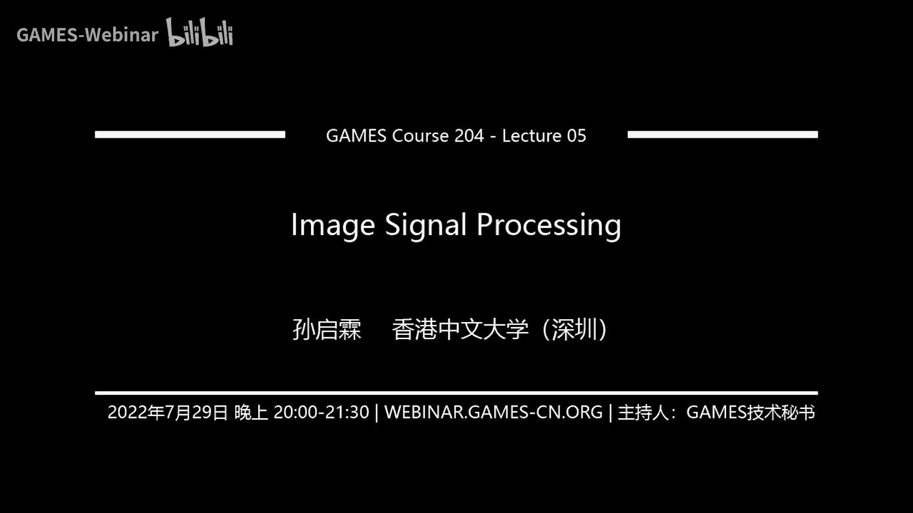

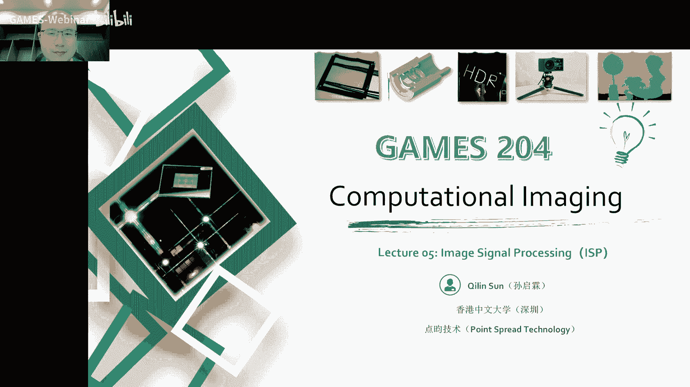

# 📸 课程05：图像信号处理基础 | GAMES204-计算成像

在本节课中，我们将要学习图像信号处理（Image Signal Processing, ISP）的基础流程。ISP是将相机传感器捕获的原始数据（RAW图）转换为我们最终看到的彩色图像的关键步骤。我们将按照处理流程，逐一介绍每个核心环节的原理与简单实现方法。

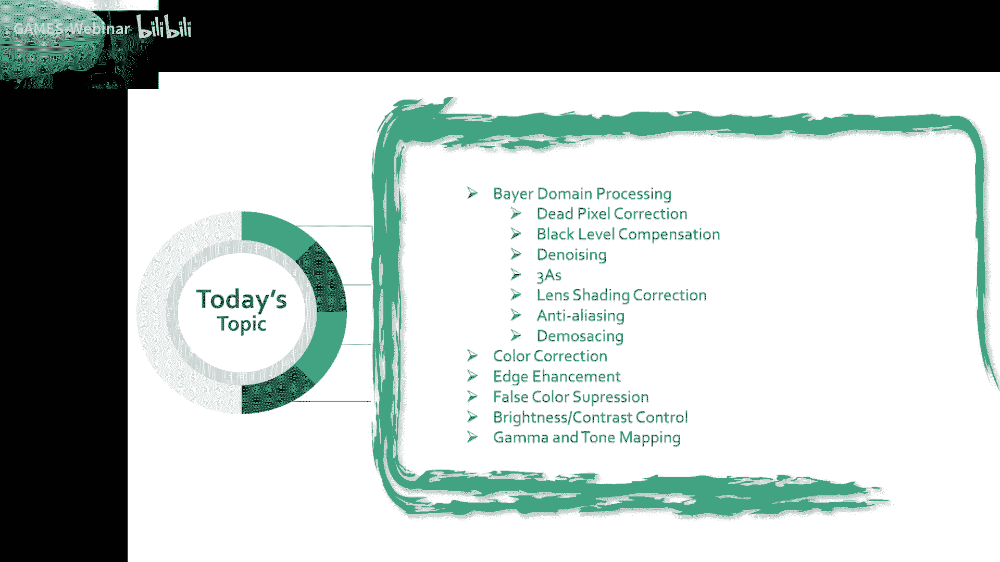

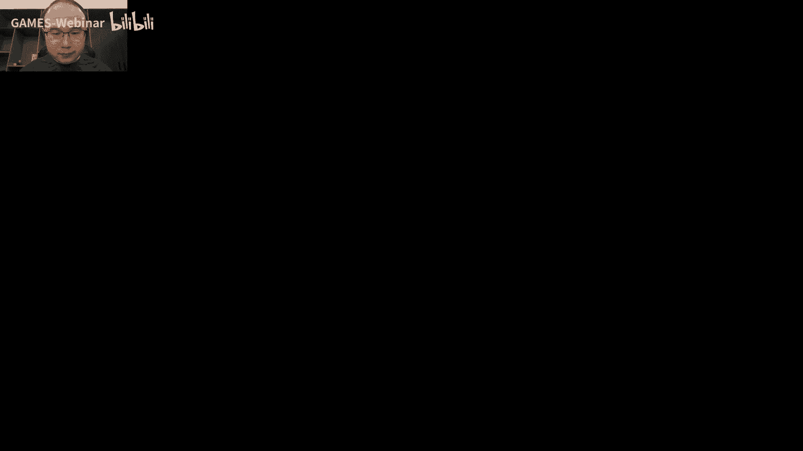

---

## 🧠 概述：从RAW到彩色图像的旅程

上节课我们介绍了相机成像的整个过程，包括调整光圈、曝光和白平衡。那么，从传感器捕获原始数据到最终呈现出一张悦目的图像，中间经历了怎样的处理呢？这就是今天要揭晓的答案——图像信号处理。

整个ISP流程可以大致分为在RAW域（原始数据域）的处理和在RGB/YUV域的处理。我们将按照这个顺序进行讲解。

---

## 📊 RAW域处理

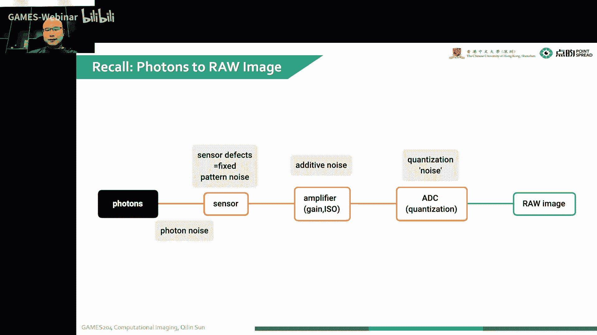

传感器捕获的图像是经过拜耳滤色片（Bayer Filter）排列的原始数据。在这个阶段，我们需要进行一系列校正和预处理。

### 坏点校正

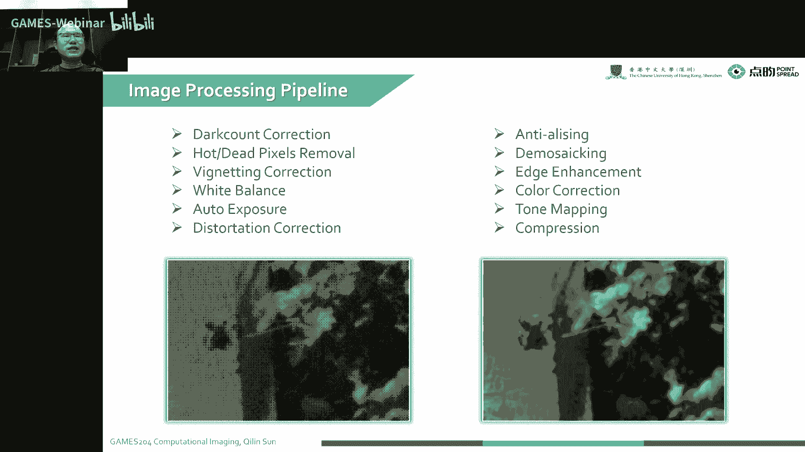

首先，我们需要处理图像传感器上的坏点。坏点是由于传感器制造工艺缺陷或电路问题导致的，表现为某些像素值固定为黑、白或某个灰度值，甚至动态闪烁。坏点会影响后续的插值和滤波操作，因此需要最先处理。

坏点校正通常分为两步：
1.  **检测坏点**：计算中心像素与其八邻域像素的绝对差值。如果差值超过设定的阈值，则判定该中心像素为坏点。
2.  **修复坏点**：对于判定为坏点的像素，通常采用插值方法修复。一个简单的方法是计算其四个方向（水平、垂直、两个对角线）的梯度，选择梯度最小的方向，用该方向上相邻像素的平均值来替换坏点值。

### 黑电平校正

黑电平是指感光元件在完全没有光线照射时输出的信号值。由于传感器电路存在暗电流，并且为了保留暗部细节，厂商通常会施加一个偏置电压，导致RAW图像的黑电平不为零。

如果不进行黑电平校正，图像会呈现“灰蒙蒙”的感觉，并严重影响后续白平衡等操作的准确性。校正方法通常是从每个像素的原始值中减去一个固定的黑电平偏移量。这个偏移量可能由硬件预设，或通过传感器边缘的遮光像素实时检测得到。

### 镜头阴影校正

由于镜头设计的光学特性，图像边缘的进光量会比中心少，导致图像四周变暗，这称为镜头阴影（Lens Shading）。有时还会伴随颜色偏差（Color Shading）。

校正方法通常是通过拍摄均匀的白板，计算图像每个区域相对于中心亮度的增益系数，形成一个校正图或查找表，然后在处理时对每个像素乘以对应的增益系数。

### 去噪

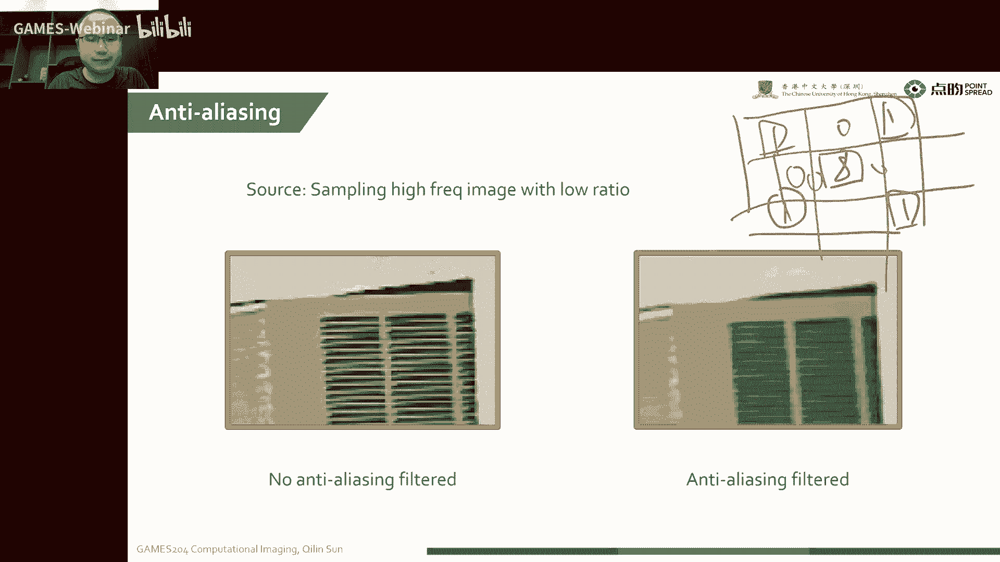

噪声会严重影响图像质量，特别是在低光照条件下。在RAW域进行去噪效果较好，因为此时噪声的分布未被后续非线性处理破坏。

以下是两种经典的去噪算法：
*   **非局部均值（Non-Local Means, NLM）**：利用图像中存在的许多自相似块。通过寻找与当前块相似的多个图像块并进行加权平均，可以有效抑制噪声。
*   **三维块匹配滤波（BM3D）**：这是目前效果最好的传统去噪算法之一。其核心思想也是寻找相似块，并将这些相似的二维块堆叠成三维数组，然后在变换域（如DCT）进行协同滤波和阈值处理，最后再逆变换回图像空间。

### 自动曝光、自动对焦与自动白平衡（3A算法）

这是相机自动化的核心，通常作为一个反馈回路动态调整成像参数。
*   **自动曝光（AE）**：通过调整光圈、快门速度和ISO增益，使图像整体亮度适中。常用方法有平均亮度法、加权亮度法和直方图法。
*   **自动对焦（AF）**：
    *   **被动对焦**：通过检测图像的对比度或高频信息。当图像最清晰时，对比度最高。相机通过移动镜头寻找对比度峰值来完成对焦。
    *   **主动对焦**：通过发射红外光或超声波并测量其返回时间（ToF）来直接测算被摄物体距离，从而驱动镜头到对应位置。
*   **自动白平衡（AWB）**：校正不同光源下的颜色偏差，使白色物体看起来是白色。常见方法有：
    *   **灰度世界法**：假设整幅图像所有颜色的平均反射率相等，通过调整RGB三通道增益使其均值一致。
    *   **完美反射法**：假设图像中最亮的点就是镜面反射点，代表了光源的颜色，以此作为白点进行校正。

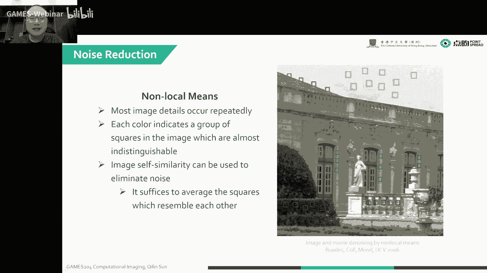

---

## 🎨 RGB/YUV域处理

经过RAW域处理和去马赛克后，我们得到了线性的RGB图像，接下来需要在这个域进行色彩和视觉增强处理。

### 去马赛克（Demosaicing）

这是ISP中最关键的步骤之一。拜耳滤色片使得每个像素点只捕获一种颜色（R, G或B）。去马赛克的目标是通过插值，为每个像素点重建出缺失的另外两个颜色通道的值。

最简单的方法是双线性插值，但它在边缘处容易产生伪彩色和细节模糊。更先进的方法会考虑边缘方向。例如 **Malvar方法** 的基本思想是：在插值绿色通道时，不仅使用周围的绿色像素，还会利用红色或蓝色通道的梯度信息进行校正，从而在边缘处获得更好的插值效果。

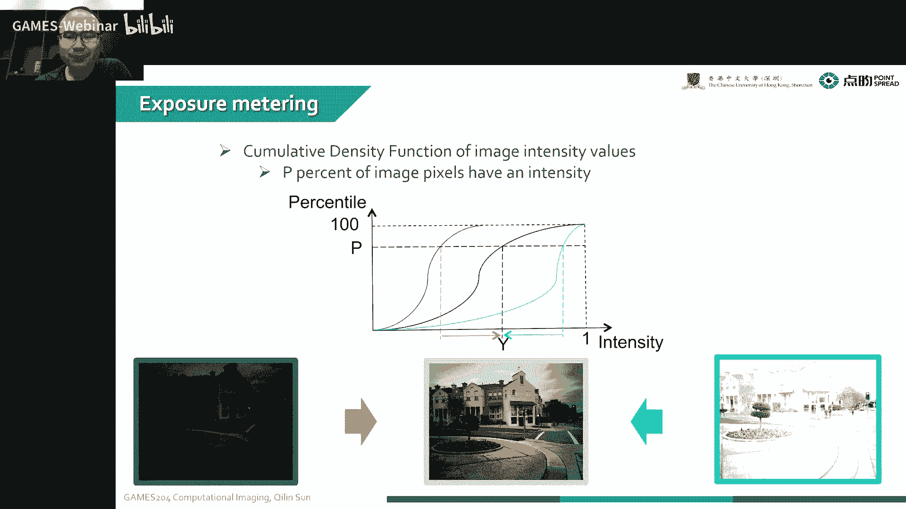

**核心公式（Malvar方法中插值G通道的简化思想）**：
`G_interpolated = G_bilinear + α * (R_center - R_bilinear)`
其中，`α` 是一个根据邻域梯度调整的系数，用于校正颜色差异带来的影响。

### 颜色校正

由于传感器、滤光片等因素，相机捕获的颜色可能与真实颜色有偏差。颜色校正的目标是使图像色彩更接近人眼所见的真实场景。

最常用的方法是使用一个 **3x3的颜色校正矩阵（CCM）**。通过拍摄标准色卡，将相机输出的RGB值与色卡的标准值进行比对，利用最小二乘法求解出这个校正矩阵。处理时，对每个像素的RGB向量乘以这个矩阵即可。
`[R_corrected, G_corrected, B_corrected]^T = CCM * [R, G, B]^T`

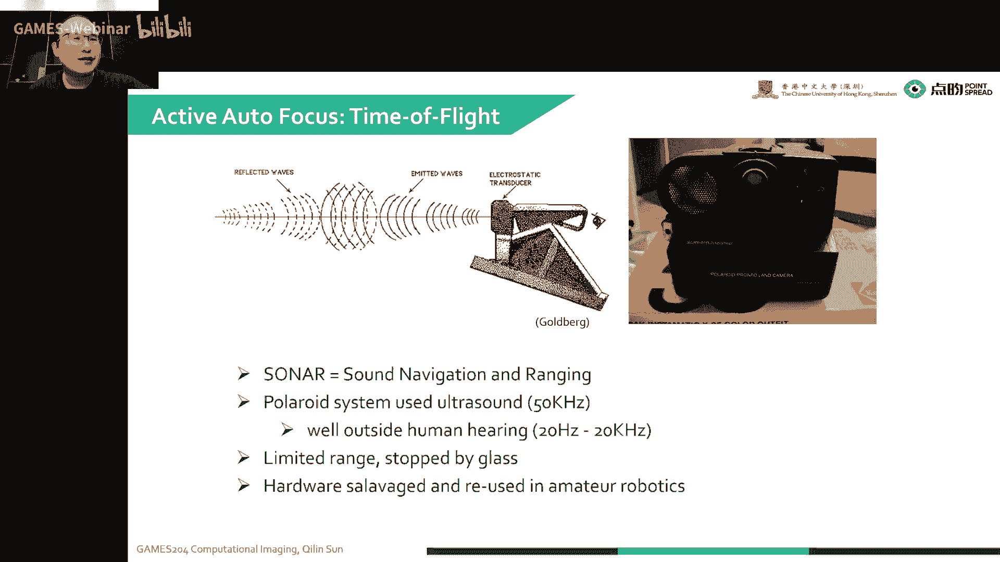

对于要求更高的应用，会使用 **3D查找表（3D LUT）** 进行更精细、非线性的颜色映射。

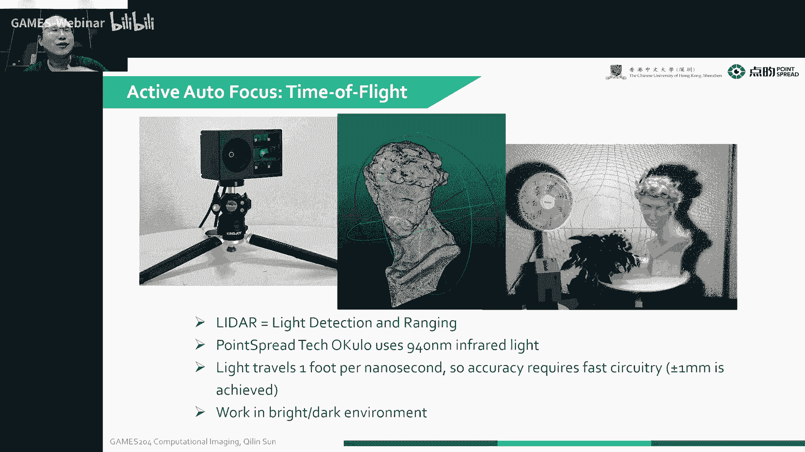

### 边缘增强

经过之前的处理，图像的高频细节（边缘）可能会有所损失。边缘增强旨在让图像看起来更锐利。

一个简单的方法是使用 **拉普拉斯算子** 进行边缘检测，然后将检测到的边缘信息按一定比例加回到原图像上。通常在YUV色彩空间的Y（亮度）通道进行操作，以避免影响颜色。
`Y_enhanced = Y_original + β * Laplacian(Y_original)`
其中，`β` 是控制增强强度的系数。

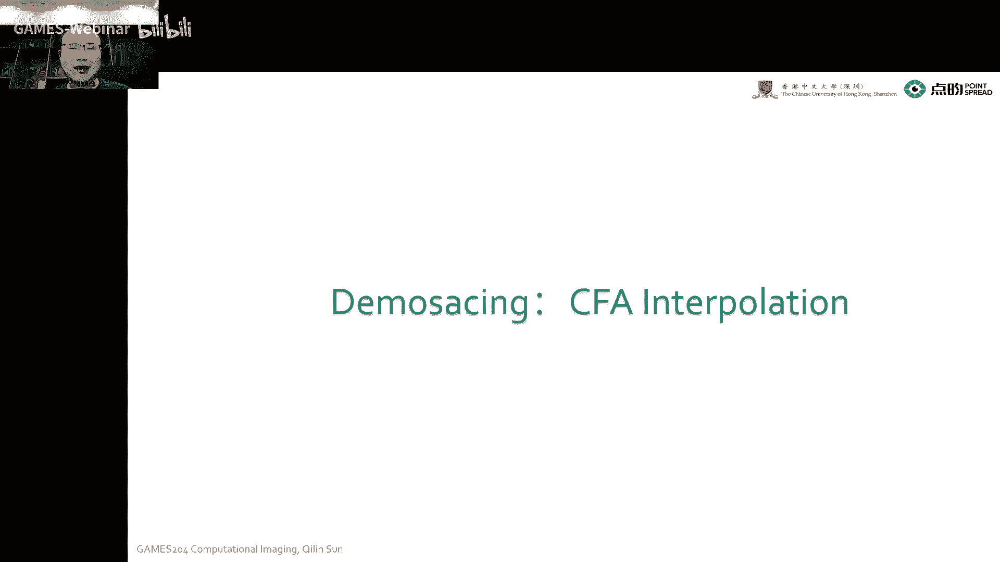

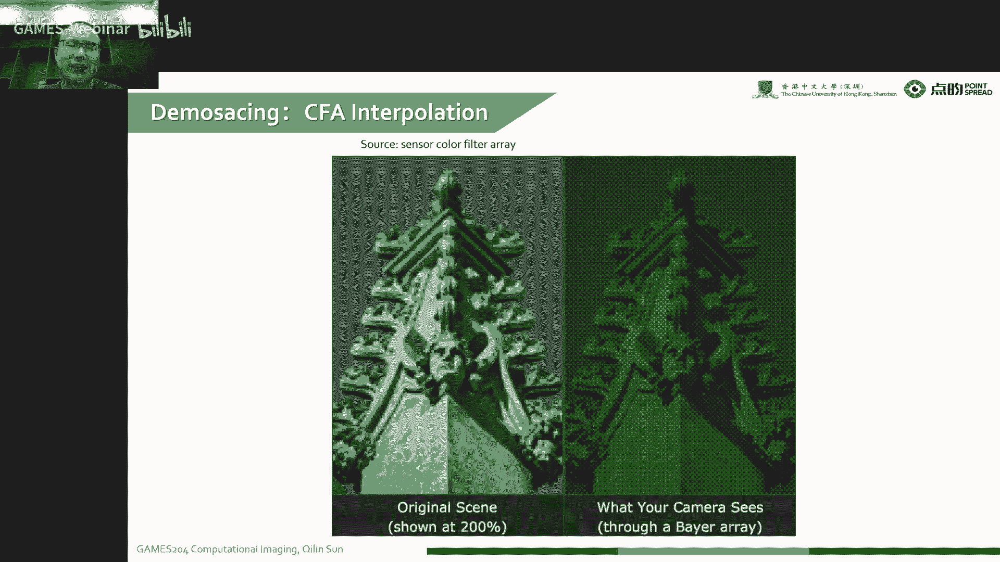

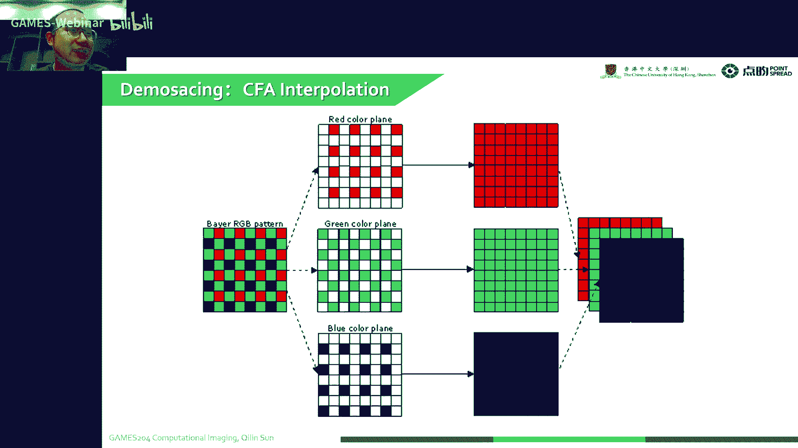

### 伪彩色抑制

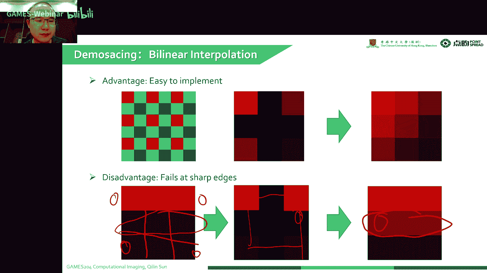

在去马赛克等过程中，图像的尖锐边缘处可能会产生原本不存在的彩色条纹，即伪彩色。抑制伪彩色通常在YUV空间进行，对Cr和Cb（色度）通道在检测到的边缘区域进行平滑或衰减处理。

### 亮度与对比度调节

这是最直观的图像调节。
*   **亮度调节**：为所有像素的亮度值加上或减去一个常数。
    `I_adjusted = I_original + brightness_offset`
*   **对比度调节**：围绕一个中间值（如128）进行缩放。
    `I_adjusted = contrast_scale * (I_original - 128) + 128`

### 伽马校正与色调映射

*   **伽马校正**：由于历史原因（CRT显示器的非线性响应）和人眼对暗部更敏感的特性，我们需要对图像进行一个非线性变换。通常是对线性RGB值开一次伽马（γ）次方根（γ通常为2.2）。
    `I_display = I_linear^(1/γ)`
    这实际上是一个全局的亮度调整，将更多的数值空间分配给暗部细节。

*   **色调映射**：当图像的动态范围（最亮与最暗的比值）远大于显示设备的能力时（例如HDR图像在普通显示器上显示），就需要进行色调映射。它的目的是在压缩动态范围的同时，尽可能保留亮部和暗部的细节。这比伽马校正更复杂，常常是局部进行的算法。

---

## 📝 总结与作业

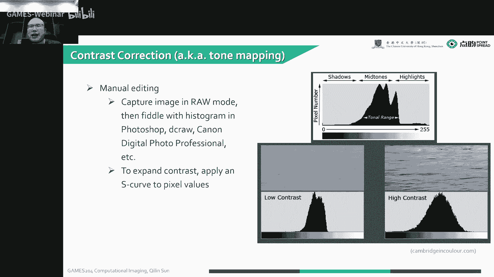

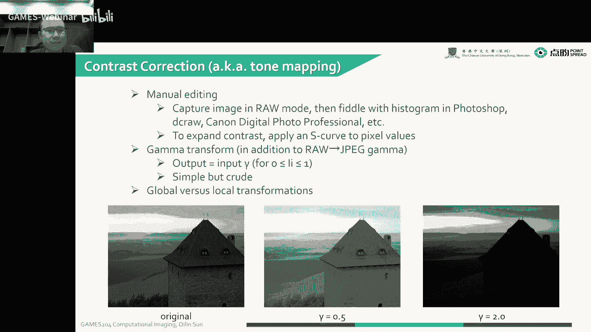

本节课我们一起学习了图像信号处理（ISP）的完整基础流程。我们从RAW域的坏点校正、黑电平校正、去噪和3A算法开始，然后进入到RGB/YUV域的去马赛克、颜色校正、边缘增强、伪彩色抑制，最后是亮度对比度调节以及伽马与色调映射。

这些步骤共同协作，将传感器捕获的原始数据转换成了我们日常所见色彩鲜艳、细节清晰的数字图像。

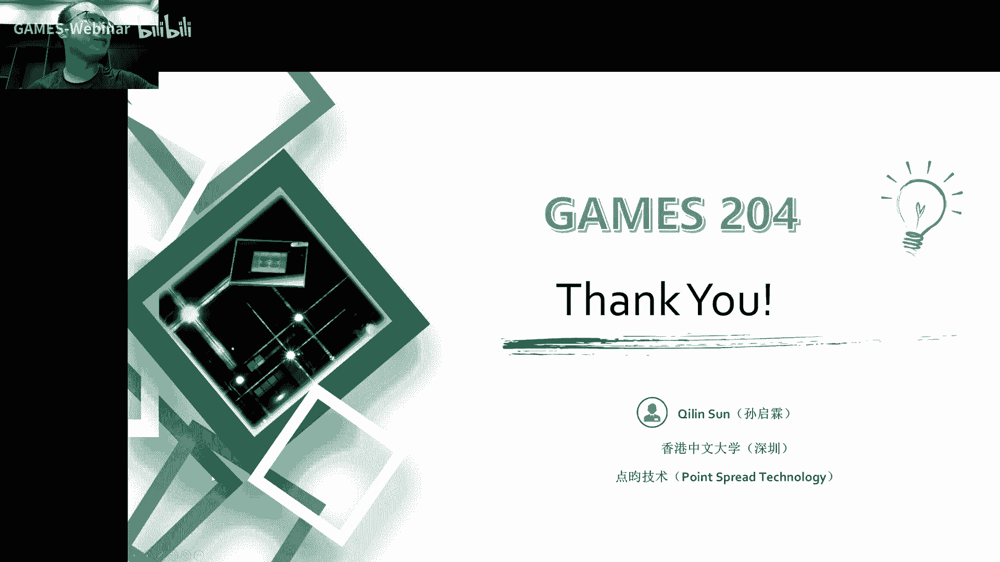

**作业提示**：你的第一次作业将是实现一个基础的ISP流水线。请按照课程介绍的顺序，逐一实现各个模块，并尝试将一张RAW格式图像处理成美观的彩色图像。注意处理好各模块之间的衔接，并关注最终图像的视觉质量。