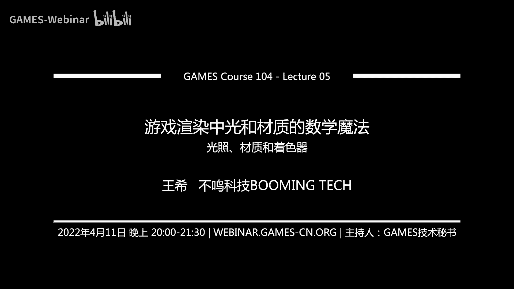
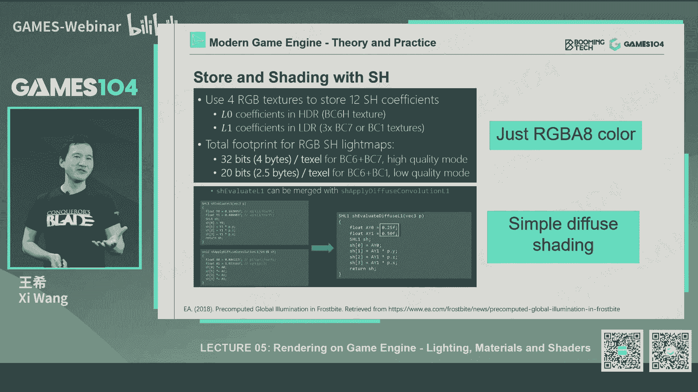
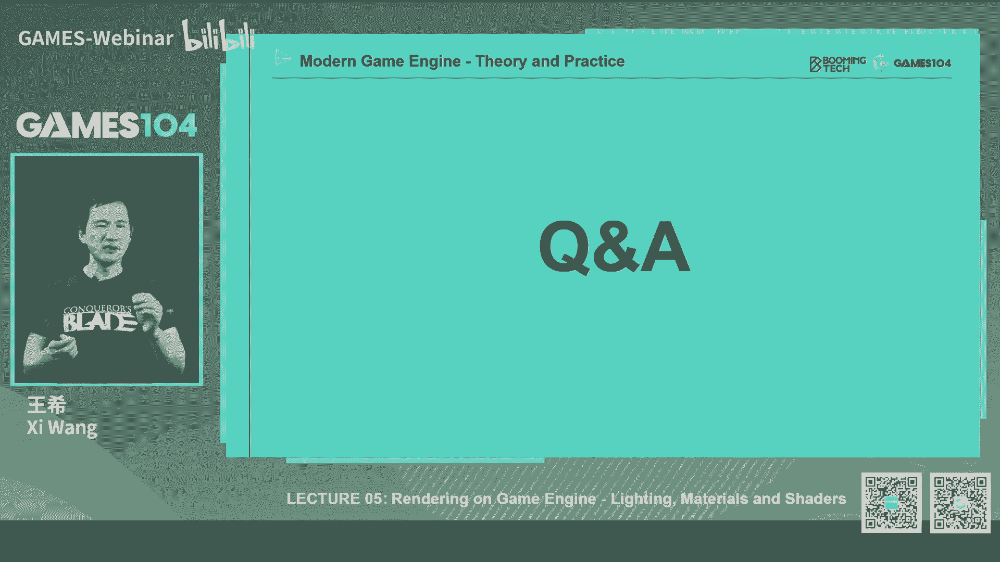
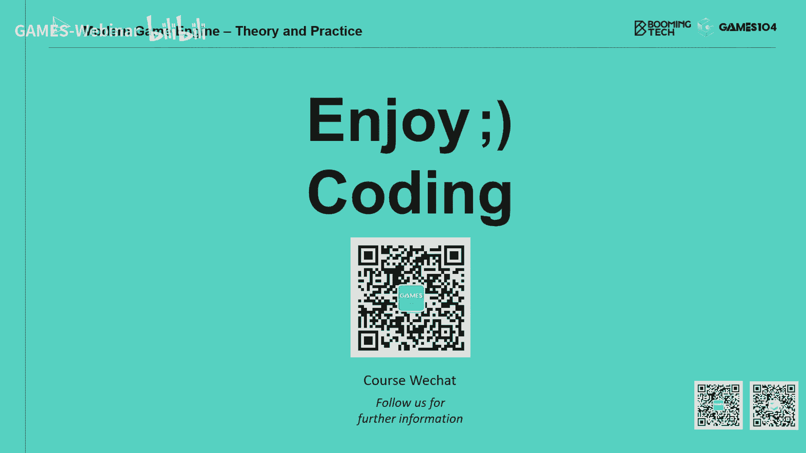

# 05.渲染中光和材质的数学魔法 ｜ GAMES104-现代游戏引擎：从入门到实践 - P1：GAMES104_Lecture5-change - GAMES-Webinar - BV1J3411n7WT

Hello，大家好，欢迎大家回到games104游戏引擎的理论与实践，那个今天这一讲的话呢，我们会继续讲渲染，那么这一讲的话呢，其实也是我自己认为是难度最大的一家，我们整整爆肝了一个星期吧，然后说实话。

我到现在虽然写完了整个课件，但是我并不是特别有信心，我们能把这一讲解好，为什么呢，因为这一讲的内容实在是太大了，如果说我把今天这一讲的内容，分成十节课来讲的话，我认为也没有什么太大问题。

那么今天这讲什么呢，我觉得就是讲绘制绘制最核心的，绘制的核心是什么呢，其实像上一节课我们讲的就是A材质对吧，讲到这个材质啊，那个mesh啊，包括一些GPU，你怎么怎么去组织管理，听上去好像都非常有道理。

但其实这些道理呢，你把这么多数据放在这，你让GPU去做，但其GPU到底怎么做呢，他需要绘制，那这里面的绘制的第一个主角是什么呢，就是光光的核心就是光子，就是光子发射出来反射被吸收反弹。

最后进入我们的眼睛，形成这个事件的光的原理是什么，那么第二个呢就是这个光和材质，就是和物质到底怎么反应对吧，我这物理是当你把你光是反弹回去，还是把你吸收进去，还是再让你在我里面转来转去。

那么你的这个物质和光是怎么反应，这件事情又决定了这个东西，我们看起来是什么样的，那么最后一个的话就是说，我们我们的SHADER该怎么去写，有很多复杂的运算，所以其实这节课讲的这个东西啊。

就是说我们讲lighting material shader，就是光材质与这个着色器，实际上是一个非常庞杂的一个系统，我自己啊竭尽所能把它挤进去了，但是这一节课的课件长度，已经接近100页左右了。

90多页，我记得好像有90多页，然后其实我自己有感慨啊，就是我我写完这个课件的时候，跟我们的团队在一起，我学着我们是把过去几十年，就是全世界最聪明的这些理论学家。

就是图形学的这个科研工作者和工程师在一起，各种非常惊人的聪明的想法集结在一起，但是这里面有很多大胆的讲，假设非常这个我认为叫厚颜无耻吧，这个打个双引号，就是说基本上是什么都不管不顾的。

各种hack放到一起，他居然就work了，然后就终于形成了我们这种，非常棒的这个游戏体验，所以说啊这节课的话呢，我觉得我们就是虽然讲的东西非常的硬核，而且中间我首先高能预警一下，会出现很多。

非常非常这个这个看起来让大家头疼，肚子疼的数学公式，但是呢大家可以当成一个故事来听，就像我我我是我跟大家讲，我是一个很民间的民间的物理的这个爱好者嘛，就典型的民科思维方式。

所以我最喜欢的一本书叫量子力学300年对吧，他就是把这个人类认知怎么怎么从简单到复杂，一步一步的去建立，这样的一个一个就是对对世界的本源，认识的越来越清楚的过程，这中间就是各种的观点的碰撞。

各种人的想法在一起打架，这事读起来津津有味，所以我我其实今天在写这一趴的时候，我基本上说那来这样吧，既然硬核的知识讲不了太深，那我就跟大家讲个故事吧，所以呢首先的话呢，我们就从这个故事的原点开始。

这个这是最著名的，就是渲染最核心的那个我们的宗师吧，叫柯基亚，那卡西亚的话呢，这个这个是个日本老哥，日益老哥，我不是，我忘了，他是在美国大学教书，还是在还在日本工系统，好像是在在美国。

然后这这位我们的大圣，那个我们的先贤在35年前就提出了，那个时候sf大家记住了，那时候sf好像还没有电子版，我印象特别深，好像是那种打印出来的版本，我觉得是惊为天人，然后呢老人家就写了一组方程。

说唉呀同学们这个全世界所有的渲染，用这一个六维方程方程基本上就讲完了，你们就就膜拜吧，其他的事情你们就不用想了，这个方程看上去很高大上啊，但其实也蛮简单的，你仔细看他说呢，就是说你在一个点。

你去观察一个物体的表面任何一个X点对吧，这个点可以是啊二两维的点也可以，三维的点，这个多少具体多少维度要数一下了，那么你首先有一个观察角对吧，就是那个欧米伽O，那就是你人的observer的观察角。

那么首先的话呢那个点它是不会自我发光，他如果自我发光的话，那他在omega那个O的那个角度射出来的光，肯定会让你看到，对不对，好第二个呢他得加上什么呢，加上说这个点，如果被很多其他的周边的光源给照上了。

去的时候，它会最后反射出来会是什么样的，一个一个一个一个一个结果，那么这个时候它就是一个呢积分项，就是说从所有可能的球面上的入射角，射出来的光，然后呢它投影到你的表面。

这里面注意要乘上一个cos theta，这cos c塔是什么东西呢，就是说你可以理解成就是如果光斜着照过来，同样的光强，你的表面上能接受的能量是不是会越来越低。

这件事情听上去好像很这个cos西塔很高大上，其实呢去理解它其实非常的简单，比如说太阳光照到地球是不是无差别的，对不对，那为什么在纬度高的地方就会冷，纬度低的地方就会热呢，因为在同样的单位面积上。

纬度高的地方的话，它乘上了一个就是你的那个那个高纬度的那个，球面上的那个那个就是我们的垂直向，就其实就是法向和太阳光的那个角度，那如果在极地的时候，那cos theta几乎为零对吧。

在那个赤道的时候几乎为90度，所以呢你接收到的能量就会很高，然后呢这个时候有另外一个方程，我们叫scattering function，就是说呢他会跟你说，哎你在这样的一个入射角下。

在这样的一个出射角下，你大概有多少能量能够被反射回来，这里面到底发生了什么，很奇怪的就是光电子反应，那个就是卡基亚同志呢也没解释，但是说这肯定是一个思维方程就能解决了，这个思维方程呢就是这个最著名的。

我们叫做BRDF叫双向，这个那个反射分布方程对吧，这个是让我们所有做图形学的同学，做graphics engineer的同学，都是这个叫什么叫魂牵梦绕，这个这个就是既向往又害怕的这么一个方程。

所以凯基亚同志的话，这个这个六维方程，基本上就把渲染的东西全部讲完了，对不对，这个是将近35年前，但是呢这整整35年，我们整个行业就被这件事情搞得死去活来，那为什么呢，因为真实的世界的光照非常的复杂。

就是大家看这张图吧，这张图的话也是一张很经典的图了，他就跟你讲说，你看啊，我就画这么简单的一个书桌的一角，你看到它有直接的光线照在我的书桌表面，变得很好看，对不对，变得很亮，然后呢。

有些地方它呢就是那个光会被一个物体挡住，它会形成一个我们叫做shadow阴影，对不对，大家玩游戏的时候，最在乎的就是这个shadow做的好不好，这个阴影其实比大家想象的非难很多，好这事我们就忍了诶。

但是这个光呢你打到这个很多表面，它又反射了，反射了之后，它本身又变成了一个光源，又照亮了别人，这就很蛋疼了对吧，这个就是我们在那个有个很著名的说法，叫COLORBBLEEDING。

就是比如说你这个反射面如果带颜色的话，这个颜色还可以去反射出去，然后呢你还有一些非常glossy的物体，它本身像个镜子一样的，就直接反射回来了，然后呢还有一些半透明的物体。

光在里面就是做了reaction，就是在里面折射，做了好多次光机又出来了一下，那你想这么多东西，这么多效果，这个你说它符不符合科基亚老先生的方程呢，是非常符合他的方程的，但是呢问题是我怎么解对吧。

而且我所有的东西必须要real time的去解它，这就是我们的挑战，那这里面呢我们很难的点是什么呢，就第一个就是以下的这几个挑战，是我纯个人总结的，就是我我得声明一下，就是因为呃。

很少有人像我对这个老先生的这个方程这么的，就是不能讲是不公吧，就是内心充满了这个抱怨，就是说老先生你只是给我们指了一条路，但这条路怎么走对吧，我要带什么道具，这个带什么，带多少干粮，你都不告诉我。

然后我我在这饿得死去活来，累得死去活来，所以呢我我就借用这个课程，小小的向老先生表达我的这个作为一个学徒吧，就觉得师傅帮我不够的这种抱怨，那我第一个抱怨的就是说老先生，你有没有意识到。

其实visibility to light就是你一个点，你告诉我有个光，我能不能看见他这件事情其实并不简单，那么这个visibility to light呢，从我们大家最熟悉的方式解释是什么呢。

那就是shadow阴影对吧，就是这里面讲一句，这个我在在在这个就是课程上不敢写的话，这个里面就是政治不正确，就是以前在我们游戏行业里面，有一个非常资深的一个一个图形学的大佬。

他讲过一句话叫shadow beech，就是说阴影实际上呢是计算机图形学里面，最常用的一个效果，但是呢几乎所有的graphics engineer，他告诉你说，我在做几乎所有的游戏的时候。

shadow想做的好，那都是非常非常难的，有大量的hack，而且你解决了情况，A情况BCD可能就要出问题，所以就这么一个简单的visibility，Visibility to light。

就解决了我们死去的活来，那么但是呢这个东西这个效果可可不可以没有，那显然是不能没有的，因为你一旦没有了阴影之后，大家看到这个就这右边的这个图的话，那基本上这个空间关系会让你产生很多的错了。

因为我们很多时候是利用这种明暗的遮挡关系，人员的大脑是判断它的层次结构的对吧，那么这是我称为叫这个第一组挑战的，第一个挑战，道光的可见性，第二个挑战呢是大家不太注意到的，但实际上又是非常常见的。

就是这个光本身啊，它很复杂，为什么呢，因为我们想几个最简单的光源吧，比如说那个方向光源，比如太阳在无穷远的地方照过来的，其实它不是无穷远，那我们可以假设太阳光是平行线，这个呢还简单一点。

然后呢接下来来了一个就是点光源，点光源其实也还好，我们也有办法能处理，然后呢路灯下大家经常见的什么是一个spotlight，就是一个锥形的光源，就是大家也很常见对吧，但是呢突然给你来一个叫面光源的时候。

你会发现这件事情就变得非常的复杂了，而且面光源也就意味着说，当我一个物理我接受的光照的时候，你你同样有光什么强度变，我把那个光源自身转来转去的时候，你会发现下面的东西完全就变掉了。

那么其实光源本身它也具有一定的复杂度的，这个是很麻烦的一件事情，所以这就是我我觉得它的方程，这个就是IRRADIANCE，就是进来的这个光给我的挑战哦，忘了给大家讲个概念了，就是这个在我们图形学里面呢。

大家一定要学两个黑化，一个叫做radiance，一个叫ERENCE，先讲radius是什么，radius呢实际上是叫辐射度，或者叫你辐射出去的能量，就是它源自于黑体辐射的逻辑。

就是说比如说我一个光照到物体上，它往外反射出的能量叫radius，对不对，那好那入式的能量呢，我们以前叫做incoming radiance，但是呢我们把两个词合到一起了，叫一瑞典，就是入射的能量。

那么在球面空间上，我们的整个reading的分布，或者这个它的信息的获取，其实呢这在我看来是第一组挑战，这个挑战已经很麻烦了，那么第二次挑战是什么呢，就是老先生讲这个材质那个方程，大家看下面那个方程啊。

我是要在整个球面函数上跟对，把它的这个光和他的那个就是BRDF模型，那个四维函数在一起去积分，同学们想一想，这个是不是很头疼，非常头疼对吧，当然我可以很粗暴的用这个那个数值的解法，就是一个个采样。

我一个个解，但是大家想象一下，在实时的时候我怎么办，我做不到，对不对，那我怎么样能够快速的去算出，这个光和我的材质之间的这个卷积的，这个结果呢，这件事情其实很麻烦，非常麻烦，我后面会跟大家具体讲到。

所以这其实是我们第二条，就是说如何做，用一个graphics的话讲，就是你如何做shading对吧，我我告诉你光了，我就把整个球面的光我都告诉你了，那你把这个材质的效果做对，其实这件事情也并不简单。

那么这是我的第二个材料，就是积分怎么做，那么第三个呢也是让我个人觉得头疼，肚子疼的东西，就是说其实在一个真实的世界里面，所有的物质它本身就是光源，为什么呢，就像这张图讲的特别明显，就是你的地面上那个点。

你光直接照到我了，OK我亮了，没问题对吧，这个时候呢你打到墙上，那个墙上又会bouncing回来，又把我照了一遍，然后呢你再bouncing1遍，再别BING1遍，两遍又把我照了一遍。

就是它可以一次BANCING，二次BANCING，所以在图形学中有一个很著名的案例，大家可能已经就是如果上过101课程，202课程的同学们应该知道叫康奈尔box对吧，这是我们图形学最经典的一个一个案例。

这个里面的话，两边为什么有两个不同颜色的墙呢，他就是告诉你说，光在这里面来回的几次bounce之后，它会形成一个非常复杂的光影效果，所以其实我们在做渲染的人，经常会拿康纳box说。

This is ground truth，就是这是拿真实的算出来的结果啊，这是我一个hack的算法，跟他之间side by side进行比较，看看我们能够逼近它多少，所以其实这就意味着什么呢。

在场景中我们有无穷多个可能的光源，所以这三个挑战在一起啊，其实对我们来讲是一个很大的折磨，当然我这里面得声明一下，就是这纯属games4104课程，就是这个我我自己私人的，私家的这个总结的三点挑战。

但是可能每个人说法不一样，但是我自己做rendering做了就是很长时间之后，我自己感觉最痛苦的事情，第一个就是说你对incoming的那个ERIS，实际上我很难去得到它对吧，我如果得到了沙的问题。

我就解决了，第二个的话呢就是包括那个面光源的问题，我就解决了，第二个的话呢就是光源我全部拿到了，但是呢我去磕我的表面的材质，进行做这个CD运算，它是个积分运算，这事情又让我很头疼。

那第三个呢就是说哎因为光是可以被弹出来的，所以的话呢你光一旦开打开之后，场景里每一个物质都是我的光源，这就意味着什么呢，这就意味着说你第一次计算出来，那个每一个每一个物质的。

它的那个就是light的output，就是它的输出实际上要作为下一次的输入了，所以这里面是一个无限递归的东西，所以说问题三又会把问题一变得更麻烦，这个简直就是一个恶性循环，所以说呃在最早的时候。

我们在做这个场景光照的时候，有个很出名的算法叫retracing对吧，那么retracing呢，你们还有一个方法就是基于这个叫啊分布教师，distributed retracing嘛。

我记得那个算法就是它最大的问题就是你一颗，你一跟瑞打出去之后，他得不停的发散发散发散发散，最后那个rain就会爆炸掉，但是现在没有人真的这么去写了对吧，这么写的话呃这个就算是离线，他也扛不住。

但是呢我讲它但它确实反映了光学着，它本质是这样的，因为我经常讲一件事情，就是说上帝它的存储空间，它的算力是无限的，所以它可以用最简单的风头去解决这个问题。

但是呢到了我们这种graphics engineer的时候，我们会需要在非常有限制的这个这个计算机上，去模拟他老人家做的事情，所以这这这这个地方呢就是我个人的总结，就是卡基亚老先生。

把这个render equation扔出来之后，我们折腾了我们才30几年，实话实说，到今天的话，我们也没有完全解决他老人家汽车的问题，但是我觉得现在看到了一些希望的苗头，我后面会讲到。

就是说那接下来我要讲今天我们的正题了，就是how to do这个rendering in the engine，那这件事情的话呢，其实后面会讲到大量的公式会越来越复杂，那我在写这个课件的时候。

我就想一件事情，我说其实当年我在学图形学的时候，我在学最开始做游戏的时候，我真的需要学那么多复杂的，这个什么BRDF模型对吧，各种球面调和函数，各种什么积分对吧，这个这个信号的这个从这个各种信号的转换。

好像也没有，其实我最开始写这个游戏引擎的渲染，包括写渲染算法的时候，实际上是非常非常简单的，所以而且呢这会会帮助我们建立一个，非常清晰的，这个就是说引擎的它的渲染的基础流程是什么。

后来我想那这样咱们这个课也是这样的，因为这个课games焦虑四课程的这个课程的话呢，我希望是能让越来越多的人能听懂，所以呢我觉得咱们也不要好高骛远，先从最简单的开始，就是最最简单的渲染是怎么回事。

那首先的话非常简单嘛，这个世界我先去简化它嘛对吧，你不是光滑很复杂吗，那我就用最简单的光源形态，比如说我第一个叫主光dominant light对吧，那我给它设置一个，你要么就是一个方向光。

要么就是个点光，要么就是一个这个spotlight，一个一个一个就是那个叫柱状，那叫什么叫圆锥追光追光，感觉有的时候脑子反应不过来啊，然后你你的球面上不是有很多的这种广场，我不知道嘛。

哎我第一个东西叫做ambient light，ambient light是什么概念呢，就是说我假设把这个主光刨掉之后，环境给我的光，我可以用一个他的命，就是它的那个平均值代替。

那我是不是可以得到一个叫AMBNOL的，这个东西对吧，大家四面抛来的光，我就就是用一个数值把你带到了第三个呢，哎我这样的话，其实这个东西最牛逼的一件事情是什么呢，就是说在最早的硬件上。

完全支持了他所有的所有的光的这个这个效果，那这个时候我的我其实这个时候东西会输出来，已经很像那么回事了，诶我还不满足，我想一想这个环境中，可能我假设我的这个物体表面，它是个非常光滑的东西。

它是不是要来反射一下环境，其实这个时候呢它既不是主光，但是黄金的一条光正好跟你的就是它的那个啊，就是我们的最著名的那个，就是你的你的那个入射光的方向和，法线和那个反射光的方向正好和法线的重合了，对不对。

那我要看到一个很漂亮的反射，那我们想了一个简单的hack，我们研发了一种东西叫做什么呢，叫做环境贴图，大家有没有印象它是一个六边形的，就是大家想象一下，我一个立方体，我把它切出来是不是正好六个面。

对不对，那个六个面的话叫环境贴图，好，我根据我眼睛看的角度，我呢根据你表面的法向我反射一下，砰，在那个那个包着的那个，这个这个大的方形盒子里面找到那个点的图，诶，这个又把我的那个就是广场那一部分。

也表达清楚了，那这样的一个简单的组合的话呢，实际上大家回到这个卡基亚老先生的方程，你会发现，虽然我们用了最最简单的方法，但其实我们是符合它的方程的，本质上，我们把一个半球形的这个光照光场的分母。

把它模拟成了一个均匀的环境，光的一个入射光，再加上一个突出的dominant light，然后呢在环境过程中一些高频的东西，我用一个environment map把你表达了，这样的话呢。

我把你BRDF中特别敏感的那个spectra，那一项给你反映出来了，但这里我提前讲解一下什么叫SPL，大家想想这个是不是就是我们在学数学的时候，我给你一个通用函数，你去求它的积分，求它的解析解是很难的。

对不对，通用的方程，但是的话呢我一旦把方程参数特例化之后，诶这个方程我就能求它的解析解了，其实最早的这个我们的graphics engineer的话，没有被卡基亚老先生给忽悠，我们想你你的方程牛逼。

我觉得你都是对的，但是呢我们很土，我们写算法的人，我们写硬件的人，没办法，我们就用这种最土的方法去解决了，所以这是最早的这个光照模型，我们就用这种方法去解决了，那么好，接下来就是材质了，对不对。

材质这件事情呢就非常的神奇了，如果大家有机会去研究一下这个整个材质的，就BRTF模型发展的历史啊，那简直就是百花齐放齐放，各种理论，现在最前沿的都已经到了，这个光的波动理论。

就是讲这个光之间会互相干涉衍射了对吧，这个绝对的高大上，那个数学公司看的你绝对是这个，这个觉得，我恨不得大学回去再去多练两个专业专业，但是呢其实在材质模型中，有一派是我特别特别喜欢的一派，叫什么呢。

叫做经验派，就这帮人是这样的，就是他也不去研究你，物理空间到底的本质是什么对吧，第二个呢我也不做实验，说这个实验，我去真的拿我的模型跟你的实验去进行比较，我就根据我的观察，我觉得哦材质是有什么呢。

诶有这个漫反射像对吧，就是说你一个光打进来，我四面八方看起来好像都是一样的，漫反射像还有什么呢，还有那个诶很很亮的那个反射，就是说诶我这有的有的表面非常的光滑，油的表面呢。

它非它它这个这个反射的loop叫NOLOB，loop的话呢它相对比较缓慢一点，大家想一想，看在数学上什么方程能够让我一调，我就能够把那个反射的那个那个波，把它调的变宽变窄了。

其实最简单粗暴的就是这个power函数，就是几次幂对吧，你的一次幂，二次幂，三次幂，四次幂，那你的这个函数摔的是不是就是越来越抖，越来越越来越宽，诶，就用这个方法，所以呢，这个这里面就必须要说说。

我们的大名鼎鼎的布林风模型了，那么它其实是非常非常的简单，就是说ok defuse，他就说用cos你入射角，然后呢我就把你的光的能量那个算一下，然后我就把你反弹出去了，但是呢我和我一个反弹率。

因为有些能量可能在我的内部被吸收掉了对吧，我可能我只能反弹这部分能量的，比如说20%，30%，40%，那么呢你还有一些特别漂亮的东西，我用那个sparkler把你冰给你反射出去，让你看上去很像金属。

很像那种光滑表面的感觉，就我有我们看到的高光，那用两个简单的方法加到一起诶，我们就能形成了这样的一个材质模型，所以不吝风模型的话呃，说实话虽然它很简单，它很粗暴，但是呢我直到今天我还是觉得非常的亲切。

比如说今天假设我要去教图形学课的话，我会让我的同学们先去实践一下，bling phone这个模型，那么其实在这个BINFO模型里面啊，这也体现了一个非常简单朴素的光学原理，叫什么呢，叫光可叠加原理。

其实刚才我在讲的那个卡基亚方程的时候，也忘了说这件事，就是它那个方程，为什么你的出射光和他的这个所有的光，都能够积分起来，就是这是光学的一个基本假设，就是说我的所有的光不管你是来自于什么地方。

我最后都是可以用linear的线性的叠加在一起的，那么这个bling phone的这个模型的话又简单又好用，但是它的问题是什么呢，其实有两个比较大的问题，那第一个问题呢，这个问题在最早我们做那个。

就是说游戏渲染的时候，还好，我们其实无所谓的，但是呢如果你用不灵风模型做一些真正的，就是比如说离线渲染的时候，你就会发现点出问题，为什么呢，他的那个能量其实是不守恒的，也就是说在这边你你在那边写的时候。

那个那个SPARKER的参数，diffuse参数，包括SPER那个power，你会发现你的入射能量，最后通过它的方程反弹回来得到的出射能量，这个能量可能会比如说超过一，就是你进来能量是100份出来。

假设是101份，这个听上去好像还可以，对不对，你人也注意不到，但是如果你假设真的做了一个，就是光线追踪算法，在这个在这个里面，它会无限的进行来回反弹追踪的时候，你就会发现这个震荡就会放大。

所以刚才你看这个在左边的这个图里面的话，就是一个retracing，如果用blink phone的话，里面本来是应该一个黑枪对吧，但是呢只要有光漏进去之后，他在里面就开始无限无限的来回倒，倒了之后。

反而内部的东西反而变亮了，这个在一些离线渲染的时候，就是要要人命的事，要出事的东西，所以我们有一个说法叫做energy conservative，那个a conservation。

那么很多很多人把它翻译成叫什么呢，叫能量守恒，然后我个人是觉得这个翻译其实是有问题的，应该叫能量保守，为什么呢，因为能量是不守恒的，它的光射到我的表面的时候，肯定是有被我这个表面会吸收的。

所以你要损失能量的，但是呢你要确保是说，你从一个球形的空间射进来，所有的能量，最后我以一个球形的把你弹回去之后，我出去的能量一定要小于对吧，到等于或小于你的入射能量，所以我的能量是损失了。

我要保守一点对吧，所以他不守恒，所以我觉得翻译成能量守恒的话，这个我个人觉得还是有点误导的，反正我当年学B2DF的时候，我就学着，我就很懵，我说能量怎么守恒呢对吧，能量守恒的话，那我那个参数乱调。

他岂不是就不对了嘛对吧，所以说话这个地方的话呢，就是说它的能量就是不能够爆款，那个就是那个唉呀，我也被带偏了，就是它的能量不能保守的话，它在retracing的这种环境下就会出问题，那么第二个问题呢。

也是这个这个这个artist的深恶痛绝的问题，就说不定风非常的简单，但是呢他并跟真实的世界的东西啊，关系没有那么大，当你去表达越来越复杂的材质的时候，你会发现bling phone它表达不了那种细节。

比如说像左边那个图，那么你靠左边的这个小图的话呢，就是用bling phone做的这个模型，你无论怎么调，你就柏林风有个特点，就是你做什么看上去都很塑料对吧，就是你做那个木头，石头做着像塑料。

金属做的也像塑料，就是很很有意思，非常有意思，那么但是的话呢你看现代材质，比如说后面我们会提到的pp r材质的话，它就能非常好的把金属的非金属的对吧，塑料的这个那个这些材质表达得非常到位。

所以说我们在现代游戏里面，基本上看到的材质已经不是不灵风了，但是呢这毫无这个这个毫不影响，柏林峰在我们这个渲染上面，很经典的这样一个地位，那么最后一个呢就是讲这个visibility to light。

那么shadow呢其实很简单，就是说它实际上呢就是说指我在我眼睛看到的，这个场景里面的每一个点，它道光是不是可见它其实解决的就这一个问题，这个问题当然这个假设是那个光，要么是方向光。

要么是点光或者是spotlight，而不是更复杂的光啊，如果是更复杂的光的话呢，它实际上是有一个百分比的，那么其实在这里面啊，就是回顾图形学的早期，大概在二三十年前，其实很早很早的时候。

大家就提出了很多的shadow的算法，那么我印象特别深的叫shut volume，大家如果去看那个早期的什么quick啊，还有那个我记得好像quick那个时代用的shadow，好像就是shadow。

因为那时候硬件不支持shadow map这些东西，然后包括就是呃还有一些perspective shadow这种方法，就是就是真的是百花齐放，如果你们去search grx的文章，就是特别有意思。

就是你看大概呃15年前，20年前的那组paper的话，基本上都是各种各样的方法，但是其实呢在游戏引擎行业，我们呢还是很坚定的，我们说我们只信shadow map，所以游戏行业在过去的整整十几年的。

20年里面的话，我们基本上只用了SHMAP这么一个简单算法，但是我现在讲的是他是foundation，就SHUTMP的思想其实非常的straight forward啊，也不叫非常smart。

我觉得很聪明，他说你不就是想知道道光的这个这个，这个可见性吗，那我从光的视角渲染一张你的场景，这个渲染呢我不需要你告诉我他的什么名啊，这些东西我不需要知道，你只要告诉我它的深度对吧。

那这个深度就表示了你到光的点的那个距离，那么好，我当我去做正面的相机位置的渲染的时候，我每一个点我通过反向投影，把你投影到那个光的那个，就是那个光源的那个视角的那个projection那个地方。

然后呢我也也可以得到一个距离，如果我这个距离大于那个就是那个最近的那个，遮挡物的距离的话，那我知道我就在shadow中了，如果我等于或者小于的话，那我就不在shadow中了，这个方法其实是非常的简单。

那么具体的更更多的算法细节呢，我觉得在这个课程我就不展开了，如果同学们想了解的话，可以看看那个也令奇的那个101那个课程，他讲的更细，讲的非常的好，我我发现了令奇的课讲得特别的细。

把每个算法讲得都很清楚，所以给我这边省了很多事，就是所以呢我这边的话就跟大家讲一下shadow map，最基本的思想，那shadow map其实问题有没有，那当然有了对吧，就是首先最最简单的一个问题。

就是说其实你在渲染，从这个光源那边形成的一个shadow map的话，它的采样率我们叫sampling rate，和你从相机这边去看过去的那个世界的采样，它两个采样率是不一样的，如果大家学过信号和系统。

就知道，就是说如果采用率是不一样的话，他们就一定会产生各种各样的artifact，那这里面的话就是这个就是shining map的话，最头疼的问题就是说哎自遮挡的问题对吧，特别是那种很精细的结构。

如果sha map的精度不够的话，或者说你采样率不够，或者是他那个depth的那个精度不够的话，就会产生很多artifact，那这个课这个事情的话呢，我们游戏行业里我们都是hack大佬，我们怎么办。

最简单吧，加个boss就解决了，就是哎我就把它的容差变得更大一点，但是呢你这样会出什么问题呢，就是那个非常简单的就是人脚是浮空的问题，所以大家如果看一些早期的，做的不是特别好的游戏的话。

你会发现那个人的阴影离地总是隔个，那么比如说五公分，十公分，这就是很常见的一件事情，那么这件事情的话呢，其实在shadow里面，我给你讲一个故事，就是到直到今天吧，如果用SHADO爸妈的技术。

如果当光源特别特别靠近地平线的时候，那个时候shadow都是最难做的，为什么呢，因为那个shadow会拉的非常非常的长，但是呢你知道我们在真实的做游戏的时候，你如果去问艺术家说。

你想怎么设计一个场景的时候，艺术家很多时候都想做那种叫夕阳残血的效果，说诶同学们，我想表达一个环境对吧，血红的夕阳下，然后那个那个天空出现了五彩的云，然后呢这个建筑拖了长长的影子。

然后一个人只能看到他的剪影，当艺术家开始这样描述的时候，一般graphics engineer那时候就开始抓头了，就说我我的天呐，大哥你这是要整死我的杰作，我给大家讲一下，就是现在的游戏，游戏的话。

我忘了是什么游戏的，是最新的一个很不错的很不错的一个游戏，他那个当时是说我做了两套shadow算法，当那个那个阳光基本上还是比较，靠近天顶的时候对吧，比如说在傍晚之前。

我用了算法A当你开始逐渐逐渐接近地平线了，比如说清晨和傍晚的时候，诶，我慢慢的传C生成另外一套算法，才能解决这个问题，所以说我具体echo一下，就是那个graphics大佬说的话，就是shadow。

真的就是我们做graphics，程序员最头疼的一个问题，所以抱怨不会抱怨，但是这个是我们的革命的老伙伴，所以其实啊这样一个非常简单的solution对吧，我用一个简单光源加上AMINOL。

然后呢用environment map去hack一下，这个你的快速的反射，然后呢，我把你的这个render equation的光的那部分，给你hack掉了，然后呢我用bling phone对吧。

把你的这个这个这个卷积的问题，也变得非常的简单了，我也不算那么多东西了，我就直接给你几个几个，就是其实是POLNOL，就是这个多项式的这种计算的时间，我就能算出你的光照了。

然后呢唉我再加上一个shadow map对吧，一个简单的就是在光源空间去采个样，我就能大概骇客出来，我到光到底是不是可见，我把你的三个挑战基本上全解决了，其实啊就这么一个东西。

它最后形成的结果如果配上很好的艺术家的，出的效果并不差，这边的话是动画的画面吗，就是我个人觉得就是说你不仔细看，你觉得诶这个画面还可以，至少不影响我去享受这个剧情了。

所以这个呢我我我在写到这一趴的时候啊，突然就诗兴大发了，就是我突然想起来了，我们中国特别可爱的五九改对吧，就是远抗，因为我是一个那个这个名民科，加上一个这个伪军迷，所以我就远看五对负负重人。

就是你那个五九改，五九在最中间那个地方，但是我们见过40年对他各种魔改，其实啊这些我刚才讲的那个三件套的那个，那个方法呀，实际上即使到今天在有些特殊的场合，他还是挺管用的。

比如说在一些啊游戏超低配的时候，诶我就全部切到这个非常简单的方法去做了，包括一些如果硬件的技能不是特别好的时候，比如在移动端的时候，我其实也可以这么做，所以呢而且呢大家在理解渲染的时候。

这个呢是大家最基础的理解渲染的东西，所以这个老伙伴我的建议是大家一定要先学，先掌握它，然后呢我们在进入我们真正的高端的部分，这也是所以接下来的课程的话，就会相对来讲比较高能了，那这个东西。

这个这个东西是怎么就是是怎么产生的呢，首先得说一下，这个很著名的就是3A游戏行业对吧，我看国内很多游戏开发者天天说我们要做3A，我们做3A是3A，这个行业还是蛮有意思的。

就是我觉得3A这个行业最大的特点是什么呢，就是自己给自己找麻烦，因为我以前在美国做游戏的时候，我还是蛮能感受到那种文化，就是说每天早上醒来会问自己，就是说我怎么样能够给自己搞一些，更挑战的问题。

就好好的日子，不过就是既然你的三件套那么好使，那我为什么要给你们做的一样的对吧，我既然自称我是个3A的人对吧，我就要高人一等，那我就得这个做的跟你们就不一样，对这其实就是这样一份执着对吧。

其实本质上就是想把大家钱包里的钱，全部掏出来，那作为3A同学们，我们的这个这个行业的工程师们，就每天早上起来就想说，我一定要做的跟大家不一样，其实呢这个行业呢，我个人觉得它的一个最大的突飞猛进。

其实从15年前开始吧，就是特别是在2003年04年，学着这个SHADER，就是可编程硬件的出发，其实你会发现就是商业行业的游戏的品质，和一般的游戏差距就会拉的很大，对不对，那么这个是那个刺客信条。

15年前的画面，老师低低座的刺客信条，那可是我第一次热爱上，怎么就跳草堆了，这个草跳草堆这种事情，我居然会非常喜欢，而且觉得哇那个站在那个顶上看世界，简直是一种享受，但实际上呢我把这个图截下来之后。

我一看哎呀好像画面哎也就那么一般般了对吧，好像那个资料还有点僵，那么其实呢在这个过去的10年里面，我们还是以刺客信条为例啊，你会发现他的画面真的是越做越好，越做越好，你比如像5年前这一作起源对吧。

那你看到他就做了很多在精彩里面探秘啊，各种内部的光照，看着你就就就是说这个如梦如幻，但是呢最新的像大革命啊，像这些那个那个娃哈娜，这个就越做越好了，那今天我不展开，因为我今天这一趴讲的是什么呢。

是这个上一个时代的3A游戏做的效果，注意啊，我讲的不是最新的，最新的，我最后回去点一下，因为那个太复杂了，那我先讲一下，就是呃大家印象中的，比如说五到10年前这个行业，这10年里面我们所研发的这个技术。

那么这个还是按刚才那个思路来讲，就是说首先我们要解决的问题是什么呢，还是光照的问题好，这光照问题很难对吧，就是这个球面的光怎么办，这个其实我我我，我把它简化成一个暧昧的一个常数，这个实在是太不礼貌了。

这个卡基亚老先生知道了肯定会很生气的，对不对，虽然他扣不了我的工资，那我们就想到了一个办法，说唉算了，我预计算好不好，就是我把这些，我反正假设场景中90%的东西，它都是不动的，假设太阳的角度。

我每个关卡我就锁死了对吧，那我是不是可以通过预计计算，这就是计算机那个图形学里，或者计算机引擎里面，最常用的一个思路叫什么呢，我相信大家以前学过那个数据结构的，知道有个说法叫什么叫空间换时间对吧。

大家记记不记得，其实这个就是一个非常典型的，空间换时间的思路，就是我用PRECOMPUTER，我来去看看能不能把这个这个这里面哦，不好意思，有一个词儿我还突然冒出来叫global nination。

这个词，听上去非常的高大上，全局光照对吧，我相信现在很多同学买游戏的时候都会问，这个游戏支不支持全局光照啊，对不对，全局光照on and off会有什么效果呀，它本质上就是说哎我的这个光啊。

就是比如说来自四面八方反射的光对吧，就是如果想能分解一点，就是直接光照和间接光照叫inja light都有的，这种光照叫全局光照，那我们呢把这个所有的这种光的效果，全部预计算出来，那怎么办。

就是那首先的话呢我们要解释一下，就是说为什么全局光照这件事情这么重要，那这里面就是左边和右边这个图，就是在游戏中啊，我们有大量的场景，他其实比如说你坐在一个房间里面对吧，那如果比如白天家里是不开灯的。

对不对，那你这个如果只算直接光照的话，你看到的是什么呢，你看到的就是这个像我这个图，这个左边的这个样子对吧，那好那我们怎么high，我可以high啊，我可以加个N倍的，但是MING的加上去。

它的一个特点是什么呢，就是你家里面所有东西都统一变量了，看上去非常具有平面感，如果大家回想一下，你们以前玩的这种20年前的游戏的话，15年前的游戏吧，你进到室内的时候，特别是一些网游。

你会发现感觉这个里面的房间特别的平面，就是你几乎感受不到什么光照，这个原因呢，其实不是因为那个就是程序员不努力，是因为他真的没有做全局光照，因为你要做全局光照的话，你才能模拟出来这种诶光照到地上对吧。

地上反弹回来，又把房间的天花板和墙应亮了，这样你走的人的话，他才有种光的感觉，所以全局光照啊，其实对于这种真实感的刻画，实际上是非常非常重要的一件事情，那这个时候我们的挑战是什么呢。

就是这个全职光照拿到之后啊，它实际上是一个在球面空间的一个采样对吧，你可以把一个球像地图一样展开这个map，那么但是我如果存了这种东西的话，它的数据量会不会非常的大对吧，如果我整个场景只踩一个没问题。

我服了对吧，那我也能存好，就算你能把整个场景的这个光照全部踩下来，你这个时候你我给你一个材质，你说我这一个DE图片和整个这个材质上的，球面光照怎么去算，他的这个这个就是积分呢，啊这这又是要命的一个事情。

对不对，那你当然了，你可以用最粗暴的，比如蒙特卡罗的方法，就是我就是在这个球上撒无数个采样点，比如撒100个好，我每一个每一个方向都给你算一下，算一下，我再积分一下，但是大家想想看，我们在做绘制的时候。

每一个这个屏幕上你看到像素，我要去做它的shading的时候，我都要跟这个这个这个球状的，这个整个光照函数的积分一下啊，都都都做一下采样，然后再做一个累加对吧，其实这个卷积运算了。

那是不是这个要疯掉了对吧，那这个所以的话呢我们需要去想一种方法，能让这个积分非常快速的能够进行，这其实就是摆在我面前的挑战，这个时候呢我就要哎对这个地方开始高能了，但但这个地方。

如果大家上过那个101202的课程，这个地方我们我觉得我们俩课程真的要联动了，我这两天一直在跟林奇在聊，我说你简直救了我的命，我发现你很多东西你的课程已经讲的非常好了，我直接就框包括这张图。

这个图我是直接从他的那个啊课程里面，直接抠出来了，我觉得他讲的特别好，因为本质上啊回到上野啊，就是不好意思，回到上一，回到上一页那个这个球面上，它是一个无穷为的，这个这个这个信号它是个连续信号对吧。

你你只能在它进行采样表达，它实际上是无限的向量，那这时候你碰到这种信号的时候，你怎么办，那我不得不说我们的傅里叶的这个老先生，这是啊1830年去世的一个数学家，我现在真的想不明白，就是他在那个时代。

为什么搞了这么一套特别牛逼的傅里叶变换，这样能够把各种循环的这个信号，它能够把它分解成几个不同的这种频率的信号，的一个累加，我真的想不出这个应用，但是我我我今天还特别饶有兴致地，做了一件很无聊的事情。

就是我查了一下麦克斯韦，老先生是哪一年出生的，我发现是麦克斯韦是啊，他是1930年死的，麦克斯韦是1931年出生的，也就是说他死后一年后，麦克斯韦才出生了对吧，因为你到无线电的时候。

比如说我我无线电的信号来的时候，我是调频啊，截屏啊，我需要这套技术，但是我不知道数学家为什么那么牛逼，有先见之明，把这套数学工具就给出来了，但是呢这个分裂变换听上去非常的高大上啊。

但是其实它非常的非常的有用，就是说比如说我在空间上的一个信号，这张图也是从另起的这个课件上透出来的，我觉得特别好使，就是你给我一张照片，我可以把它分析成一个，傅里叶变换的一个频率谱。

就是把这个从空间域变成频域，这个时候呢，如果我在频域中只截取前面的一小段，实际上我就完成了对你的信号的一个，非常粗糙的表达，但这个表达虽然会粗糙，但是呢基本上能让我看出来这是什么东西。

比如像这里面他只取了九项，你就能看到这个小女孩的大致的样子，这件事情是不是很神奇，对不对，本来我要存一个完整的照片，到这边我就诶就可以拿到这个小姑娘的照片，这个就是怎么说呢，在我知道福利变换之前的话。

如果有人让我写这个效果，我只能用最简单的就是加权平均，加权平均吧，土的要死诶，但是你一旦上到了这个傅里叶变换之后，你发现他的一切就有数学的这个解释了，所以正是因为这个方式它其实有很多好处，第一个好处呢。

就是你本来像这个小女神的照片对吧，他是呃差不多，我看了一下大概200×200的像素对吧，1万45万的数据，但是呢他可能用九个参数就能够大概表达出来，这个小姑娘长长什么样子对吧。

但是我不知道这个数据是不是真的久，也许要更多一点，但反正anyway你确实是可以压缩，高速高效的压缩这个数据的，第二个好处是什么呢，就是当你啊对这个图像和另外一个图像，做任何的叫积分运算，或者讲的。

其实大家如果学深度深度学习的话，有一个词用的特别多，也是我这边的这个标题叫做卷积，就是对它进行这种卷积运算的时候，你会发现你不需要那么傻傻的，对这几万个数据点进行一次的，这个叫乘法加累加运算。

那会算是你的诶，你只要把它投入到频域空间的那几个参数，进行一次卷积就可以就可以得到它的结果，这是一个非常厉害的牛逼的一个数学性质，所以当大家把这个性质提出来之后，接下来就来了一个大名鼎鼎的。

这个球面调和函数叫sofa harmonix，这个SUVHARMONIX是真的是非常了不起，就是我当年学到这一趴的时候，我真的是惊为天人，你知道吗，而且呃我特别崇拜，就特别佩服，就是把这个数学工具。

引到我们graphics领域里来的这个人，这个老哥呢如果我没记错啊，叫peter pex lo，叫皮皮斯隆，我们叫他皮斯隆，这个老哥我是特别讨厌跟他一起开会的，为什么呢，他是个北欧人。

身高大概有1米9几，快接近2米了，每次我跟他开会的时候，我就这样看着他就特别有压迫感，你知道吗，就是所以我跟大家讲，就是你跟老外开会的时候，最好自己个子高一点，如果你的个子像我这样只是在中国叫中等的话。

你很多时候尽量远离北欧的那些科学家，因为他的专业上给你强不强不重要，首先从气势上，他就把你碾压到了，那么皮特帕克斯龙同志呢，他真的是非常了不起，他那时候还在微软，在direct team，他就想到说诶。

他当时就提出来那个叫PRT对吧，然后呢他就是pre computer，什么那个什么什么reader transfer吧，那个全称叫什么来着，我已经有点忘了，然后呢他就说他想到了这个基函数。

这个方harmonics啊，它其实它是一组sin和sin的一个函数集，你听上去非常的复杂，但其实啊它的数学性质是非常非常简单的，那么你看到了，比如说一阶的这个函数，它就是一个加权平均嘛。

在球面上所有的型号加权平均二阶函数呢，你其实可以想象成在球面上的每一个方向，那么大家想想啊，如果是个球坐标记坐标，你有CTF两个角度对吧，决定了一个方向，那么如果你在笛卡尔坐标系里面，你去表达它的时候。

是不是就变成了一个归一化的一个向量，XYZ啊，虽然它有三个值，但是就是X平方加Y平方，加Z平方一定要等于一，对不对，所以它其实只有两个自由度的，那么实际上它的第一阶的那个三个基函数呢。

就是Y值ZHX值简不简单对吧，当你在X轴的正面正面的时候，那个值就是X对吧，在X轴的负的时候就是负负负负负的这个值，那么ZY也是一样的，那么即使到了第二节的时候，他其实也不复杂。

你会发现就是说他每一次上一节，他的多项式就多上了一一阶而已，但是呢它的外形看上去就特别的魔幻，这个图的话大家看一下，就是呃绿色表示是正直，红色表示负值，你发现没有，就是说实际上它在这个空间上。

是不是就是在一阶的时候，像两头鼓出去的一个泡泡，这个形状其实非常的漂亮，然后呢到二阶的时候就变得更加精彩了，三阶四阶越来越好看了，这里面很神奇啊，就是他的这些所有的这些无限维的这些函数啊。

它们都是什么的，都是正交的，正交的什么意思，就是说你把它们卷积在一起，它的值永远是零，这个非常有意思，那么这个东西呢实际上真的是，我觉得我我自己一直觉得，上这个这个世界的技术原理。

到底是物理的还是数学的，我觉得大概率可能是数学的吧，如果氢原子里面的那个电子轨道，跟这个东西几乎是一模一样，我这边还今天还特别的这个这个，这个闲得蛋疼的，就是去找了我们同学说。

哎同学们查一下氢原子的电子轨，我记得以前我在学习for harmonix的时候，好像老师跟我讲过这个事儿，我们又查了一遍，发现诶好像是对的，真的是这样子的，所以说这个harmonic函数也是非常了不起。

就是在这个讲的数学上更更深一点，更有意思的一个属性，就是说它的二阶导永远是零，什么意思呢，就表示它这个函数永远是光滑的，它的变化永远是非常的流畅和光滑，你看多么的和谐，就这么一个简单的函数。

它就解决了我们所有的问题，那这样的话，当我来到了一个球面的光照信号的时候，你就可以用非常简单的一个POLNOL的，就是这个一个多项式的一个，其实连多项式的就是一阶多项式，一个乘法加加法。

你就可以把这个信号大致地表达出来，那这里面的话，你看到下面有几个非常复杂的信号吗，实际上你用几阶的这个就是SAFARMONIX，就能近似的表达表达出来，当然了，在我们的游戏中的话。

我们一般不会用的那么复杂，我们一般用到像最早我记得在做halo的时候，我们用到了好像是二阶还是三阶吧，但是的话其实现在很多时候，大家只用到一阶就完事了，为什么呢，因为我只需要表达低频。

这里面给大家举个例子啊，比如说当我有了这样的一个工具的时候，我在这个场景里面，我在任何一个点，我这时候看到的东西是什么呢，诶是一个是一个light probe对吧。

就是或者叫erence prom进来的光，那我把这个球呢，假设按地图一样的展开成，一个一个一个一个地图，就像这边屏幕的右下角，出现在那个小长条形方块，我用SAFHONEX对它进行压缩。

这里面呢我们只取它的这个，就是说呃S0和S1总共只有四个参数，那大家看看我重建出来的这个图，是不是虽然看上去非常的糊，但是呢它基本上能告诉听说光从哪边来对吧，哪个比较黑，哪边比较亮，这件。

而且它的整个过整个数据是非常连续的，而且如果我要去问，在任何一个方向的光强到底是多少的话，只要用一次线性的就是vector运算就完成了，这张图呢，我是选自于2018年的戴斯的一个报告。

他讲行双引擎里面他用的这个技术，那么其实他就说这个其实够了，为什么呢，如果我用它去做一些就是表达环境光，因为环境光大家会发现啊，如果我把主光给抠掉之后啊，环境光很多时候它就是低频的。

所以这样压缩它的效果其实基本够用了，而且这样的话呢，它就有一个非常有意思的属性了，就是我去表达一个点上的，它整个一个球状的光的话，你会发现它只需要14个12个参数，那为什么是12个参数呢。

刚才我们讲了四个参数嘛对吧，那为什么这个时候变成12个呢，其实因为它的颜色是有颜色的，就是说我要去压缩一下诶，蓝色的在这个层面上的分布，我要说要绿色对吧，红色RGB3个颜色，所以呢就是4×32个参数。

这里面的话呢就要讲个细节，这个细节我觉得觉得我觉得他讲的非常的好，这里面我也分享给同学们分享一下，就是说它虽然有四个参数啊，但这四个参数权重是不一样的，比如说你的一阶L0。

就是说那个那个均匀的球的第一个第零阶函数，它不是相当于对我整个环境的广场，做了一次加权平均吗，那这个时候呢因为我们现代游戏基本上是HDR的，所以呢它对它的压缩采取了HDR的压缩方法。

它这里面选择了就是那个BC6H，这个H可能就代表这个high resolution的这样，一个东西对它，但是它只是一个阿尔法channel的去压缩，但是的话呢他对于他的那个剩下的两个接的话。

他用的都是这个LDR的压缩方法，那实际上就算他用高精度的，比如说这个b c seven去压缩它的话，那实际上它的一个球面上的，整个一个光照的表达，他只用了多少呢，只用了大概24个beat。

这个事情其实非常的了不起啊啊啊啊，这个啊32个beat，这32beat是什么概念呢，就是我们在游戏里面存一个颜色，假设只有这个一就是一个BT，表示一个测的就是256个色阶吧，都不是HDR颜色。

我存一个RGBA就是32个那个by a beat，所以这意味着什么，就是我用了一个存在阿尔法的颜色的空间，就能存一个在每个点上的一个光照，所以这件事情是非常了不起的，他那么他带过来第二个很大的好处呢。

这里面我今天不展开了，就是说我因为把这个光用SAFARMAX去表达，那我去算diffuse，甚至我在算SPEARKER的时候呃，其实在那个death的文章中，他只算了diffuse。

实际上在最早halo3的这个工作中的话呢，我们把SPARKER也做，因为hero3当时对这个SAFARMA存在接触比较高，好像我记得存到了二阶或者三阶了，那么实际上你都可以把它转换成。

两个向量之间的点击或者是卷积就完事儿了，非常的简单，大家有如果有兴趣的话，可以去推导一下这个，这个反正就是如果大家没有兴趣没关系，直接在网上找公司，你就按这个去写，一般来讲不会错。

但是注意有些有些有些parameter要归化对吧，经常你有时候忘了除一个派，这个就这个整个数值就完全不一样了，所以呢但是呢他的思想他就告诉你说，我在球面上两个函数的卷积可以简化成。

你把两个函数分别投影到，SURFHONICS的这个机上去，你投影出来的参数，这两个参数之间的卷积就等于他们的结果，这个事情其实非常的了不起。

所以有了这么神奇的这个数学工具之后，我们就可以做一件非常丧心病狂的事情了，就是大名鼎鼎的LIGHTMAP，那这里面我要跟大家澄清概念，就light map这个词啊，不叫光照贴图吗。

实际上不是为了做全局光照发明出来最早light map，如果我没记错的话，应该是在还是我们那个大神吧，KMARK在做最早的quick时代，好像他那个shadow算不过来。

他好像就已经用了light map，预先的把这个这个shadow就算好了，但是呢后来随着shadow的技术，比如说shadow map这些技术的发展，大家就觉得哇塞真是太土了，我们就不这么干了。

但是呢等我突然发现，我们需要算全局光照的时候，诶，这个老祖宗的利器又被寄出来了，我们发现我们应该用light map的思想，就是把整个场景的这个光照，给烘培到一张图上去，因为我有我有很了不起的数学工具。

叫SAFARMONIX嘛，所以说你会发现，就是基于全局光照的LUMAP技术啊，是在peter park sloan，好像是提出了PPT之后才爆发出来了，如果我没记错的话。

好像halo是第一家做这个东西的人，那么当然这个这个有待查实啊，因为我现在没有那么多的时间，在做其他的research工作，但是呢基本上是这个思想，允许我们去做这样一件事情了，那么这边的话。

你看的就是那烘烘烘烘焙出来的贴图，那个图我们一般叫什么呢，叫做atlas，atlas呢，翻译成中文叫做航海图或者地图，就是你就是把很多的几何拍到一张图上去，我们叫做atlas，那怎么个拍法呢。

首先呢你要对这个世界进行几何的简化，就是你不能用那个非常fine的那个geometry，就非常清晰的结合geometry，因为什么呢，因为这里面有一个有一部，有一部课程叫PRIMARIZATION。

就是说把三维空间的复杂的几何，把它投影到二维的空间，如果你是一个比如说一个方块或者是一个球，这个promotion呢就是参数化呢是比较简单的，但是大家想象一个任意的形状对吧，无数个三角形。

它的参数化是比较复杂的，所以呢我们会对这个几何进行简化，然后呢我们要进行这个在参数空间进行分配，这里面有个小小的细节，就是我们尽可能希望，在同样的这个面积或者体积里面。

我分给你的这个texture resolution，就是那个那个那个就是texture的那个精度，基本是类似的，这东西听上去很抽象，但是我觉得这张图讲的特别好，就是如果我把每一个text标成不同的颜色。

但就是大家现在看到的格子吗，你发现他反向投影回这个世界上，你看诶好像每个格子大小都比较均匀，这件事情啊是一个LIGHTMAP很重要的一个需求，但是呢真正大家在数学上写一写，还不是那么简单的。

我如果没记错的话，direct大概在呃十几年前专门开发了一个API，就帮助你做这个参数化展开的那个这件事情，那个东西的话其实啊很重要非常重要，但是我们当时一直在用，一边用一边抱怨，他的好像有很多小问题。

不知道现在修的怎么样了，然后呢这个时候我其实开始给他做lighting了，这个lighting呢，实际上这个讲解来就比较丧心病狂了，就是这个lighting。

实际上我们有一个巨大无比的叫light farm，这个farm呢是有很多台很快的电脑，这个做成的一个集群，然后呢这个当美术做完了场景之后，把光源设置好，参数设置好点，一个叫烘培。

我们叫做那个叫我记得以前叫baking点一下好，这个时候美术可以干什么事情呢，美术就可以出去买一杯星巴克了，然后呢可以坐在阳台上跟同学们一边抽着烟，一边喝着星巴克，一般来讲会半个小时到一个小时左右。

所以我记得那个时候，当我们用LIGHTMAP这个技术的时候，呃，我实际上就很痛恨这个技术，我觉得我的天呐，这个会让我们3A游戏开发的效率急剧下降，所以当我后来自己做引擎的时候。

我就坚决不肯上light ma，宁死不从对吧，但实际上的话那效果上肯定会打折扣的，因为light烘出来的效果确实是很好看的，那么它可以烘出非常漂亮的这种这种来，这个就是全局光照的效果。

然后呢你再把它附上这种就是直接光照在一起，你会发现这两张图的比较，就是这个是啊只有LIGHTMAP的图，你会发现很多光在里面bouncing的效果都会有了，而且你能看到就是两个临近的很近的建筑物之。

间的物体之间的这种软阴影，但是呢你这个时候再加上domino lighting，就是主光源的时候，整个这个光这个环境就非常的饱满，然后你再配合上材质，你会发现这个感觉就非常的真实，如果这个关卡的话。

就这个这个场景的话，如果没有LIGHTMAP的那个就是那个补充那个GI的，就是全局光的东西的话，它看上去会非常的难看，为什么呢，因为你看你会发现它的光只能照进场景的，很小的一块。

而且呢你就算用安静的去补的话，其实那些不能被光照到的结构，它的名啊，它的几何关系你是看不出来的，所以说这个GI就是global emission的感觉，对三游戏来讲的话是非常重要的一个一个属性。

那么所以LIGHTMAP的话呢，这个技术的话呢，我这里面不会展开特别的细啊，但是希望同学们就是分享一下我自己的理解，它的好处是什么呢，就是说你别看它烘培速度特别慢，但是呢它在实时的时候。

RUA的时候其实效率非常的高，因为它成本非常非常的低，那么第二个的话呢，就是说它因为它是离线baking的嘛，他把整个空间这个分分解之低下之后，它可以产生很多很细节的，很subtle的这种效果。

这种效果的话说实话艺术家是非常喜欢的对吧，就像这里面那个飞船，它在地上那种软软的那种就是明暗关系，会让你一下子觉得这个东西跃然于纸上的感觉，那么它的缺点呢，刚才也讲了，第一个就是非常长的这个预计算时间。

包括今天我在准备这个课程的时候，我没有办法去给大家一个完整的来看我的图，为什么呢，因为我们的引擎没有，然后在网上搜也没搜到，因为我当时我做引擎的时候，我就特别不想做这个玩意儿。

我觉得这个东西实在是太麻烦了对吧，那么你要构建一个lion f，然后呢，第二个呢，就是说它只能处理静态的物体和静态的光，大家想想是不是就是当你的这个物体一旦变了，或者光源一旦动了。

你以前烘焙的东西就全部完蛋了，当然有些同学也很丧心病狂的，想做那种可以real time更新的light map，但是在工业界呢我见到的好像比较少，就比较难，其实确实很难。

但是呢动态物体其实是有办法hack的，就是以前比如说在做一些简单的游戏的时候，我们可以说哎，我从这个物体从周围去sampling一个点赞的LIGHTMAP，我就能获得猜到黄金光长什么样子。

这时候我给他一个光照，那么但是呢这个效果其实有很多的问题呢，就比如说以前最经典的一个bug是什么，就是地上LIGHTMAP投入了一个shadow，你这个人走上去的时候，这个人那么大。

一个小小的shadow，把人突然一下子变黑了，你人在走开的时候，哎这个人又变亮了对吧，这个效果就非常的这个非常的塑料，非常有问题，那么这其实也是LIGHTMAP一个很大的一个挑战。

那么第三个挑战呢就是我想了，既然咱们是一个叫空间换时间的策略嘛，那在run time的时候，LIGHTMAP本身占用个几百啊，几十兆到几百兆的存储空间是很常见，一般来讲是几十兆到100兆左右吧。

这取决于你的场景有多大，但是呢就场景大了之后，它导致的问题还烘焙时间也足够长，这个方法呢就是实际上我在后面会讲的，就是现代游戏中啊，我个人认为啊，light map的方法可能会逐渐被淘汰掉了。

但是呢为什么我是特别喜欢，特别希望跟大家去讲一下，这个light map的这个方法呢，因为他的有两个思想，其实我个人觉得是非常了不起的，第一个思想呢就是说啊空间换时间对吧。

我用存储空间把大量的一句算放在这，第二个思想呢叫我对整个游戏的场景，把它参数化到一个比如说二维的texture上去对吧，其实我也可以把它参数化成一个，三维的WORKO上去，当我把这个空间啊。

就是本来大家理解一下游戏的环境，它是非常复杂的，各种各样的几何面片东西，但是我一旦把它变成一个非常容易管理，非常容易表达的这样的一个2D的texture，或者是3D的一个涡轮的话。

其实我很多的计算就可以去做了，所以这个思想的话呢，我希望同学们能够get到，所以说我们今天这个104的课程，我一般会跟大家讲，就说我不会特别纠结于每个算法的，具体的时间的细节。

但是呢我是特别希望和同学们分享一下，就是说当你遇到一个，因为今天我讲的所有的算法，可能并不能解决你未来真的在做引擎，真的在做游戏，你所遇到的困难，但是你一旦掌握了这种方法之后。

其实你可以发明你自己的新的算法，所以这就是like map，OK好，那接下来的话呢，就是其实也是非常straightforward的一个想法了，那你既然把空间上去。

把这个把这么复杂的这种几何给我拍平了对吧，太麻烦了，对不对，大家如果有人写过那个就是参数化的算法的话，你就知道那绝对是恶心的不得了，写写不好就一堆bug，我来个更简单粗暴的。

我在空间上撒一堆的这个采样点对吧，我们叫什么叫light prop，你不是说每一个点上的那个光照，就是一个一个一个一个半球嘛对吧，那就是个泡芙嘛，好我就放一堆light pop对吧。

你看这张图中就是这个图，不一定大家能看得清楚啊，你可以看到那个字，如果仔细看你会发现那个这是一个这是FA，就是那个啊就是微软的当家花旦的赛车游戏，这是当年我最爱玩的一个赛车游戏之一吧。

我我这个这个我还是蛮喜欢这个游戏的，然后呢是force最新的一座horizon，他就用了这个light prop的这个技术，他就讲解说，你看我在平面。

我在这个赛道上撒了无数的这个light probe对吧，然后呢我对于每个prop诶，我采样它的整个广场，当这个你们任何一个物体或者人，在你们去移动的时候，诶。

我就去找我周边的这些那个light probe，对它进行一个差值，就算出我的光照，它旁边那个小动画，大家自己看那个小球的颜色一直在变，为什么呢，因为它当它在动的时候，它的邻居一直在变。

这里面的话就是一个很简单的空间体系化的，这么一个算法，就是我要把这些light problem变成一个个的点，然后呢我连出很多的叫四面体对吧，Trohr，然后呢我就可以对它进行插值了。

这个算法其实啊如果大家稍微学一学，难度并不大，那么我就可以采样，其实light pp呢有一个很有意思的问题，就是哪个老哥去把这些点摆上去，在早期的live power。

比如早期我们做一些规模比较小的游戏，的时候呢，我们喊粗暴说对吧，我记得以前我我我我我跟ARTI思想说，你不是想要pp吗，来我给你做个工具，你自己点吧，对artist说好，我要这个效果，我也我愿意点对吧。

但是呢其实到后面他就发现这事他不想干，为什么呢，因为level artist他经常会改这个关卡的设置对吧，我今天放了这个点，我沿着这个通道很精彩，因为你不能乱点，你尽量沿着这个玩家走的通道去放嘛。

对不对，那好那每一次你关卡一旦变了之后，你得再重新改，而且这个地方经常会改错，而且会有无数的bug圆缺，所以呢我看了一下，就现代的游戏呢，很多时候它是有自动化生成的方法了，那简单来讲的话。

就是我对空间的几何进行，我首先均匀的产生采样点，然后呢根据玩家的可大大区域，包括建筑物的这个几何往外往外做一个延拓，我然后呢相对均匀的去把这个点撒出去，这个算法其实并不难，但是呢就是说这个呢。

我认为说如果今天同学们做light pro算法的时候，假设是真的工业级应用的，我会建议就是大家想办法，就是写一个这个这个light pop自动生成的算法，因为这样的话你会发现。

当你进入到真正的就是这个生产流程的时候，艺术家会爱死你，那如果你让他手动点的话哦，他肯定会恨很恨你的，你要小心点，嗯所以这是垃圾pop怎么去生成，那你这里面再讲另外一个很有意思的概念。

就是说其实light pp呢我们去采样的时候呢，一般会踩的比较密，但是呢我们可能会用一些压缩算法，比如说把精度压的非常的低，因为我主要用它做光照模，讲的就是光照，如果做diffuse的话。

其实可以非常的低频，就这个地方如果我有算法和max压缩，也没什么太大问题，但是呢我们在游戏里面有很多非常光亮，不灵不灵的东西，对不对，那你这个人走在这个环境里面，他身上反射的东西是不是要经常会变呢。

所以呢我们会有的时候会专门做一种prop，叫做reflection probe，就是说反射pro它的特点是什么呢，首先呢我做的不会特别多，但是呢它做的它采样的精度很高，为什么呢。

因为那个反射它对高频是非常敏感的，所以我希望能看到大概清楚周围的环境，这个里面的话呢，一般来讲它会分开的，和这个就是啊，就是那个光照的那个problem去采样，它的密度会低，但是呢它的精度会高。

所以基本上你把这两个东西放在一起的话，你就能够实现一个诶还挺不错的一个GI的效果，它的好处是什么呢，就是第一个RUA其实也是非常快的对吧，然后呢它能处理就是静态物体和动态物体。

而且呢它有个很好的优势是什么呢，就是说你其实啊是可以在RUNTIME的时候，可以更新它的，就是你这个场景如果发生了一些变化，包括人物发生的位置发生的变化。

实际上现在计算机上light prop是可以软弹更新的，这个里面呢有一个细节，就是说啊我要去做light pop怎么做呢，大家想想看怎么做，我是不知道是不是在这边放个相机，然后呢朝上看看，朝左看看。

朝右看看，把周围拍六张照片，诶我把它拼成一个图，然后这个图拿到之后呢，我再用我快速无比的这个GPU的SHADER，对它进行各种各样的处理，那个速度其实也非常快。

那么一般来讲呢我们去做light pop更新呢，它的特点是说我们不会每一帧都去更新，这个prop，就是说我们基本上隔几帧，或者说我会判断你的位置，是不是发生了巨大的变化呀，场景是发生变化了。

而且我一旦发生变化的时候，我也不会马上就更新，我可能会找一张比较空的时候去更新，所以这个呢也就是说在现代引擎架构的时候，我们会有一个概念，就是说有一些update我们会differ就不会马上做。

否则的话，你会导致你的帧率在那一下子突然就不稳定了，所以的话呢就是说呃就是light probe的一个一个，很很有意思的一个特点，但是呢它的缺点呢就是他比不上light map。

因为它能给你里面动的物体，非常好的光照感对吧，环境也有这种感觉，但是呢他没有办法实现，就是像light pap那种，非常nicely的这种soft shadow的感觉啊，这个物体之间那种交叠的感觉。

这个感觉真的做不到，包括有一些非常漂亮的那种color的，leading的效果呢，他做的也不是特别的好，这就是因为你的材料太稀疏了嘛，对不对，人家light map对吧，在一个地图上。

他要采大概几百万个点，你light problem你再狠几万个也就不得了了，所以你是人家几1%的采样率，你肯定达不到人家这个效果，所以这个世界是很公平的，所以你用这个方法的话。

就是说light map加light prop方法，基本上在过去的就业就是说十几年的话，你能够hack出来一个还挺像那个样子的，一个光照的效果，那么好，光的问题我们用这种方法就基本上解决了。

接下来我们要解决第二个问题就是材质了，这里面呢就要引入我们大名鼎鼎的这个，基于物理的材质系统来打physics basement based material，pp r对吧。

其实应该是physical rendering pdr，那个p r rendering pp r material对吧，他这里面其实概念挺多的。

比如说p p r lighting pp r这个camera p p r这个material，但是呢这个都是吓唬人的，我们今天的话呢，这个既然这个数学上或者说行业，你们大家喜欢吓唬人。

那我今天就决定这个也也失从一下来，先给大家看一个非常酷的东西，就非常吓唬人的东西，叫微平面理论，这个其实呢大家如果学习过图形学理论课的，同学们都知道我对吧，听上去非常的高大上，但实际上呢是蛮简单的。

就是在在这个里面的话呢，我觉得他有一点讲的特别好，就是他他用一套假设解释了就是各种光学现象，他认为就是说一个表面它就是无数的反射，那么如果你假设是一个全是金属表面吧，你看起来粗糙。

看起来这个就是说那个他的那个就是光滑，实际上跟他表面法向的聚集度有关，如果他所有的这个小表面的法向都集中在一起，那你看上去就非常的shining对吧，反光很好，如果全是一个方向的话，那就是镜子了。

对不对，但如果它分散的比较开，你看上去就比较糊，这个逻辑其实是非常非常简单的一个逻辑，那么这里面的话呢，就引入了一个非常著名的这样的一个一个模型，就是这个这个模型呢，其实现在大家用的最多的是GGX模型。

说实话就是我在这个行业待了这么久，到现在为止，我还没搞明白为什么这个模型叫GGX对吧，但是大家到后来发现我们都在用GGS这个模型，这个模型大概是2007年提出来的吧，那个包括我查了原文。

他这个文章中突然出现了，叫GGX这三个字的时候，没有任何解释，然后我就一脸懵逼，我说啊怎么回事，那其实呢，它这里面有一个很很有意思的一个解释，这里面的话呢其实讲解的很高大上，但实际上很简单。

就是说其实一个光啊打到物体表面，它无非就发生两种事情，第一种事情呢就是我把你的光弹回去了对吧，弹回去呢我能弹多少，取决于我表面的这个法向的这个分母，就是roughness，它的速度。

如果它的法向特别散乱，那我们彼此之间的话呢，就会这个这个这个就是发散，就是就是说你可以看到高光很发散，但是呢还有些光它会设计到物体里面，好这里面高能的地方来了，就其实也也不用那么复杂。

就是如果是金属对吧，金属的电子可以捕获这些光子，那那些电子呢就把这些光子给笑纳了，对不对，但是呢如果是非金属诶电子，它就没有能力捕获这些这个光子，这个光子就在里面来来回弹几下。

然后呢以一个随机的方向射出去了，就相当于一度一束光射到物体表面，在里面发生了几次这个折射之后，啪就全散出去了，这个东西是什么呢，就是diffuse对吧，非常简单，所以呢PB2的材质。

它的模型实际上就是两趴，一趴呢就是number version的漫反射的这个部分，这个部分其实非常的简单，就是如果你把球面上所有的这个漫反射的部分，积分子起来的话，就是一个派分之C。

那个C就取决于你的这个多少部分的能量，进来对吧，这个大家有兴趣可以记一下，其实非常的简单，这个这里面当然需要一点点的这个，微积分的那个支持啊，但是呢还有另外一个很著名的part，就是哎反射的一部分。

它引入了一个著名的叫cook torres模型，那库库托斯模型呢，它的数学公式看上去就很漂亮了，大家可以看到一个很著名的三项叫DF7对吧，这个DFG呢听上去很高端对吧，看上去像什么黑社会的这个标识一样。

但其实它每一个字母呢是代表了一种光学现象，它其实也很简单，那这个DFG是什么呢，我先跟大家讲一下D吧，D就是大名鼎鼎的这个normal distribution function，就就是法向分布的方程。

它本质上讲的就是这个normal，分布的是更加的发散，更加的聚集，然后呢cook托老先生呢，他就推推推推推推推了一大堆诶，他最后给出了这样的一个方程组，这个方程就现在大家呢normal di图片的方程。

大家都会习惯用什么呢，用的这个GX这个模型，GGX4种模型呢，其实数学上那个公式大家可以看一下，其实看上去很复杂，其实就是一堆的这种啊，多项式的加减乘除的运算，其实你真的去SHADER去写。

下面我们给了一段尾代码，大家看其实并不复杂，而且这个事情非常有意思的一个事情是吧，就是我它引入了一个RA那个值就会叫阿尔法，阿尔法是什么呢，就是roughness对吧，你们可以尝试一下。

把阿尔法设成零时长，0。5，时长一，你算一算那个出来的值是多少，其实呢你不用特别理解他的这个公式是什么，其实练习的课程能讲的会讲的更清楚一点，我觉得我在我这个课程的话，因为我更多的教大家怎么做引擎嘛。

所以说大家大概有感觉就可以了，但是呢做游戏引擎的人，我们需要知道什么东西呢，啊这个是当时那个GG那个材料原文中，我个人很喜欢的一张图，他就讲啊那个缝模型诶，高光你看到的是这样的一个曲线图对吧。

那么GJ呢是另外一张选图，大家如果在视频上能看得清楚的话，那个绿色的那条线是GG的，这个NDF的那个方程的图，大家发现它的特点是什么，如果用一句简单的话讲，就是他的高频的就突出的地方。

大家发现它是不是更加陡，更加尖，对不对，很很尖，但是呢它在低频的地方，就是哎它不像缝模型或其他的模型，快速的就衰减于与接近于零了，它呢还是在往外延拖很久，这个东西如果大家玩音箱的话，我不知道。

你们知道音箱里面特别讲究一个东西是什么，知道吗，就是我要买个很贵的音箱，叫高音，要足够的清脆，够高，低音要足够的沉，那这就是个好音箱，它的表现力就比较强，对不对。

其实呢当然这是我个人发明的非常粗暴的理解，为什么大家都在用GG这个光照模型，其实它对高光的表达，真的符合这个一个好音箱的标准，就是我要表达那个清脆的，高亮的那个高光的时候，诶你这个波峰足够懂。

但是呢当我这个声音是混响，我的光也是混响，你的高光不会消失的那么彻底，如果大家用浮模型啊，你们会发现当我去调那个power那个参数的时候，一调不好，你会看到一个非常生硬的高光的边界线，就特别的硬。

感觉就像那个一个物体上贴了个狗皮膏药，但是呢你用了这个cookies模型，你用了那个GG这个模型的时候，GGX这个模型的时候，你发现诶它的过渡就很柔和对吧，所以这个大家如果怎么去理解，为什么行业。

你最后大家都用了这个GX模型的话，就用我今天这个非常土的这个比方，就是你买一个音箱，高音要脆，低音要沉对吧，要足够广就完了，这个那这个好的这个光照模型就出来了，当然了，我们得感谢我们的这些理论工作者啊。

就是用一堆的数学公式积分简化骇客，最后说，你看最后你用这种简单的数学公式就拿出来，实际上我为什么你们讲个hack呢，因为大家如果仔细读这些推导，你会发现大家做了非常多大胆的假设对吧。

那个也就是说real time render的精神是什么，就看起来基本对的，就拉倒吧，你你可以大胆的做各种的猜测和简化，只要不要把这事演砸，你这事情就过了嗯。

所以呢这个就是distribution的方程非常重要，而且这里面引入了一个非常关键的参数，就是roughness，就是它表达了你的法向分布的这种随机度，如果roughness越高，它随机性越强对吧。

roughness越低的时候才随机性就越弱，他就越聚集越像一个镜子好，你既然有了个随机度的时候，其实呢你就可以得出另外一个东西，就是那个GG是什么呢，就是叫几何这个微表面几何内部的内遮挡。

它简单的光学解释是什么呢，就是说哎你每一个表面不是凹凸不平吗，当我的视角看过来，我可能会被自己挡住，对吧好，当我的光射进来的时候，光可不可能被其他的东西也会挡住，所以实际上这里面只要理解一个方程。

就是那个GGX那个方程是什么呢，就是说那个叫那个斯密斯那个方程，它是实际上哦对之间的一个方程，他就算了一个东西，就是说我基于微表面的假假，假设你的表面上法线形成一个分布分布的，这个RP分母方程。

我给你对你一个假设之后，其实啊我可以用一些积分的方法大致估算出来，你在每一个不同的角度，我有多少的光会被挡住，然后而且那个挡住有个特点，就是因为我是全随机的分布嘛，所以说它只和你的这个你这个角度的啊。

怎么说呢，就是你的那个垂垂直的，这个就是这个这个这个cos应该是cos，还是sin的投影有关吧，而跟你的如果你是一个各项匀质的材质的话，我跟你的朝向是没有关系的对吧。

那好我对你的视线的阻挡是满足这个分布的，对不对，如果你是个均匀分啊，你这个随机分布的话，其实你的光过来也是一样的，所以你会发现诶他最后GGX材质的话呢，他就耍个流氓，他说诶我把光这个算一遍，你的阻挡性。

再把视线算一遍，阻挡性，我就知道有多少的光从入射的这个表面，到弹给我的时候全部被挡掉了，这里面最最简单的解释一下，比如说啊啊一个光百分之百的能量射进来，我根据你的normal碎片方程。

就是你的roughness，我知道比如说30%的光被挡住了，那我知道我剩下来的是多少，70%好，这些光呢又是无数的光子，开始往眼睛里面去跑的时候，因为这个分布是isotropic的，就是各项同性的诶。

又有70%中的30%被干翻了对吧，所以最后流到我这儿的就多少呢，应该是啊70%再乘70%，应该是49%的光到我这儿来了，它其实就这么一个简单的原理，但是它这个公式很妙的一个地方是什么呢。

就是我们在算那个它的这个D的，就是normal的实现方程，我们引入了一个阿尔法这个参数的时候，它又完美的直接用在了这个G的这个选项，所以你就只要设置一个参数，就是roughness。

你就能得到两个结果好，那第三个那就是大名鼎鼎的FNOL对吧，FNOL就费尼尔现象，我相信很多同学都已经啊，如果学习过图形学的话，或者说上过图形学相关的课程的话，再次提我的师弟另起的课啊。

那他讲的很很通透，大家不用担心讲的很清楚，如果实在大家想不清楚，过两天天很热，大家去柏油马路对吧，站在路上晒一下午，你看到远处的路面上出现了那个车的倒影，你就知道了哦，那就是FNOL的这个效果。

简单来讲，就是说当你的眼睛的视线非常非常的，这个靠近那个表面的那个这个切线方向的时候，它的反射系数会急剧的增加，然后呢这个时候你就会产生这种倒影的效果，就是我们的海市蜃楼的啊，当然这不是海蜃楼的成因啊。

海蜃楼它更复杂，它空气的密度是不一样，我们不展开，但是的话肥料的话，它本身它就能让你看到这样的一个倒影的效果，那么其实呢，它其实也是可以用微表面的方程去推出来的，但是呢这件事情我还是要感谢这些理论的。

这个这个图形学的这些研究工作者，他们就直接给了一个说哎，你把这个参数给个参数，你自己调，然后呢比如说你是非金属，你是金属，你是什么材质，这个数值范围是多少，我就告诉你了。

然后呢给了我一个很著名的叫做五次方，我记得从我开始学图形学的时候，我就一直在问为什么是五次方对吧，然后呢老师就会告诉我说，嗯这个是人家推出来的，然后呢我就默默的相信了，直到今天我自己我我得坦诚啊。

我还没有推导过我，我我觉得我以，我现在已经把大学的数学还了一半，给我的老师的这个这个现状的话，我觉得我得好先复习一下我的数学，才能推得出来，反正就是说大家记住了，这里面有个大牛推出来，这是个五次方。

好这个方程完美了，所以大家发现就是说诶，这个时候COTAS这么复杂的一个反射方程，实际上我只要用一个roughness这一个参数，阿尔法，再加上一个FNOL参数，我就能够非常符合物理的基础。

假设的去表达一个材质，所以这件事情真的是非常的了不起，所以这种工作啊，他他是能够上这个这个很好的这个paper的，cotton上这个paper，但是呢很遗憾，就是一些其他的一些方程的话。

好像我没看到他能上上C挂在C其实蛮难，就是对rendering其实不是特别友好，我待会儿会跟大家讲这个问题好，所以那其实呢，我们的计算机的这个引擎的工作者，其实包括我们的这个就是做动画电影的工作者。

我们就做了一个非常了不起的工作，就是这是著名的这个就是那个MRER这个lap，这个lab是非常了不起的，这个我如果没记错的话，是在德国吧，还是在欧洲的一个地方，他们做了这套设备，不一定是那个设备。

但是这是一个很经典的，这个就是b r d f measure的这个设备，就是光啊，和他的那个就是摄像机的角度一直在变，然后我就把这个所有的真实的材质给裁出来了，因为我这样踩出来之后啊。

我就可以告诉艺术家说，你对不同的材质，你的阿尔法你就是你的rough，你该怎么设置，你的这个就是啊你的FNOL该怎么设置对吧，包括你的diffuse应该是多少，这次其实这其实真的是一件非常了不起的事情。

那么当我们有了这样这么多感性认识的时候，我记得当时我在做啊，刚刚进3A行业的时候，我们其实那时候用的就是CUTORS模型，那时候我们已经不用不用不LIN缝了，也不LPHONE，其实3A行业很早就不用了。

但是的话呢，事实上，那个时候普通人的模型真的是有很多问题的，就是artist经常会把它用的，怎么说呢，就是匪夷所思对吧，你会经常看到很奇怪的bug，特别是刚才我们讲了吗，就是说如果你的能量没做好。

不守恒的话，那么这个light map就直接炸掉就死给你看，然后你就开始去调，你说为什么怎么回事，因为light map它会模拟光的来回的BING，你就会死掉了，那么这个时候实际上的话呢。

我们这里面要引入一个大神，这个这位老哥也是我非常敬佩的一个老哥嘛，就是迪士尼提出了这个BRDF的principle，最著名的迪士尼那个信条，他中间讲了几个点，为什么我今天就是作为游戏引擎课。

我会把这个东西再开了，其实这个老哥呢迪士尼是在做动画电影的时候，他们首先引入了就是PB2，基于物理的材质，但是呢他提出了几个信条，这个信条呢，我认为是跟游戏引擎设计的理念是高度相关的，他比如讲了第一条。

他说每一个参数它必须要符合艺术家的直觉，对吧，就艺术家不能不懂，你不能够用，这个就是说非常抽象的这个物理概念对吧，然后呢，第二个就是说你不能，就是你不能像做一个理论物理模型说啊，这个东西的它的波长。

它的，就比如说你设置你这个材质的反射光波长对吧，那个光那个电子的这个吸收光谱的频率，那你跟艺术家讲，艺术家当场死给你看，他都不知道这个这个游戏，这个东西应该怎么做了，所以他必须要让艺术家能够理解。

第二件事情是什么呢，就是说你要尽可能少的参数，这一点真的让我回想起我痛苦的过去，十几年前，当时我们在做游戏的时候，那个材质参数是这么差，非常差，真的这个调到后来自己都晕掉了，你不知道在调什么。

经常是你调到上面的，下面的就嘭一下就变了，但是呢它它解决不同的问题，而且呢第二个的话呢就是说他希望是啊，所以第二点说参数要尽可能的少，第三点呢所有参数的值的范围最好是0~1哎。

大家想想bin phone里面那个power，就是那个高光的那个那个参数，是不是可以23456789，你你高兴写到100都没有问题，对不对，但是我问那个布林峰，那个100和50和十到底什么关系。

你想不清楚对吧，但是这个就是BRENT同志，他就这样说，我们迪士尼的信条是我设置所有的参数，最好一定要0~1对吧，但是呢在有些特殊情况下，我也能允许你超过这个范围。

但是呢它必须要有一些有意思的这个结果出来，那么这就是说明你这个模型是有一定的，就是叫创作弹性的，那最后一个也是非常非常重要的，就是说这些参数你去调它的时候，随便你怎么调。

它的组合不会产生那种非常诡异的结果，它每一个组合基本上都是有意义的，其实这五条啊你看似很简单，但我在游戏的图形学里面，甚至我在做游戏，比如说做游戏的物理，我在做游戏的AI的时候。

我给这些这个我们的designer，我们的artist去暴露出来参数的时候，你会发现事实上你如果能够实现这个五条的话，其实是非常的难的，但是这件事情为什么我一定要去讲呢。

就是说当同学们在做游戏引擎的时候哈，呃一定要意识到引擎本质是什么，不是对自然界的一个模拟器，它实际上是一个工具，他的真正的用户是我们的设计师，是我们的艺术家，所以你必须要用他能听得懂的语言。

去帮助它来构建他想象的世界，所以所有的复杂，所有的这个困难留给我们自己对吧，把悲伤留给自己，把困难留给自己，把这个快乐留给我们的艺术家和设计师，所以我个人对这个迪士尼信条，是非常非常的推崇对。

所以这个这个人的话，我还专门找到他的照片放在这，我们的课程上供起来，这样大家以后下载我们的课件的话，每天可以对着照片膜拜一下，我觉得我我我我，我特别喜欢在课件上给大家讲一些，我们崇拜的大神。

因为确实这个行业能走到今天，真的要感谢这些大神，那么基于这个逻辑的话呢，他就提出了一些一堆的概念，实话实说啊，就迪士尼那个那个那个他的P2吗，T2，有些材质属性到今天，引擎支持的也不是特别的好。

比如说像那个啊clear coat对吧，我就是表面生成一层木漆的效果，包括shame这种很像抑郁的这种效果，实际上呢就是迪士尼它自身也在一直进化，它的材质模型，但是呢我们的引擎因为我们是实渲染它。

它是离线嘛，所以我们一直在追他们，但是呢以及仔细去读他的每一种材质的表达，真的符合他的原则，就非常的直觉，非常的明确好诶，我今天好像时间有点长了，已经一个多小时了，后面还有好多东西啊。

我我我想想看我怎么去给大家去加速一下啊，OK这确实今天的东西实在太多了，我们我们这个准备课件的话，这这这一周多干的真的是爆肝，肝没了，但是说实话我们还是对自己很不满意，我觉得课程准备的还是不够好。

确实有意思的东西实在太多好，那其实这里面的话呢，我们只有直接直奔主题，就是作为同学们的话啊，因为PB2的知识量很大，那我觉得同学们先聚焦，就现在这行业里面用的最规范的，PPR模型是什么。

我们就介绍两种对吧，最主流的第一个就是啊，spector glasses的这个模型就简称S级模型，它这里面的话呢其实它很巧妙的一件事，你就说他几乎没有什么参数，所有的属性全部用图来表达了对吧。

我相信很多同学这时候很激动了，对我很熟啊，如果你们用了substance用什么，你们肯定就知道这个模型，这个这个材质模型，那么很简单，第一个defuse to对吧，那么它有三个通道。

RGB还有一个什么呢，就是spectre to spectre图控制什么呢，控制它的那个就是说那个他的那个就是那个啊，FNOL那个参数对吧，然后呢第三个图是什么呢。

也是RG比较它的free nol是三种颜色，它的free nol是不一样的，为什么呢，当我去表达，比如像黄金，像这种带颜色，像铜这种带颜色的金属的时候，它对于不同的色彩，不同的角度，他的反应是不一样的。

这个也是非常了不起的事情，就是被这帮老哥居然给研究出来了，那最后一个参数叫glasses对吧，就控制哎我这个区域到底是更粗糙，更光滑一点，就4G模型的话呢，我认为是一个全模型，它非常的完整，非常的经典。

那么而且呢它符合迪士尼的principal，就是每个参数都是0~1之间对比，大家看一下好，那当我踩到了他这些参数的时候，我拿到他的SPEER，拿到他的diffuse，拿到了normal对吧。

还拿到它的一个向量，就一个不是向量，是标量，就是那个他的那个光滑度的时候，哎我就可以写一段很漂亮的SHADER了，这个SHADER的话呢具体的细节我不展开了，但是大家可以看他在前面做了一系列运算。

比如说他通过GLOSSLESS用一减这个值的话，诶我算出了roughness好，包括我的那些中间值全部算出来之后，大家会发现没有，我就可以带入到前面讲的那个就是AGGX。

那个就是那个cot模型里面的那个，就是F那一项，就是那个FNOL那一项，我可以算出他的FNOL那个part是多少，我可以算出他的geometry，就是他ACCUTION那一项我算是多少。

我可以算出什么呢，我还可以算出他的那个就是那个啊normal distribution，那个方程的像多少，把这三个项乘到一起，你就能得到它的一个非常漂亮的，COTANCE的反向值。

你看这个伪代码的就是第一个函数的最后一段，是不是就三个数一乘，你就能出道你的结果对吧，那这里面当然当然大家真的去写这个这个方，写这个代码的时候，一定要注意，就是有些规划要做，比如说有的要除以派啊。

有的要怎么样，这个地方的话呢，在初学的时候是特别容易写错的，我自己最开始在写PPP的时候，我我们其实也是经常会发现哇，这个材质看上去怎么这么假，后来又发现哦，里面某一步运算你知道吗，你整体算错了没问题。

它就是变量变换，有的时候你中间有一项算错了，你在很多时候你觉得你都是对的，但是突然在一个时候你发现错了哦，原来里面的某一项，我没有把它规划做一些必要的处理，因为他的所有的数值意义都是积分出来的嘛。

就积分你在球面上积分，你最后求出来的那个那个总的那个膜，是个派还是四分之派还是派分之四，whatever他都有有讲究的，所以这个东西呢大家要小心，但是呢如果大家严格地按照书上的说方法，去实现的话。

一般问题不大，所以你会发现就是spectre glasses这个模型的话，它很巧妙的一个地方，就是你几乎不用设置任何的参数，大家还记得刚才我们在讲bling for模型的时候。

诶你要设置一个诶我的那个这个SPECER啊，我要设置我的这个就是那个啊这个diffuse，这些东西现在全部变成土了，这样的话就artist可以精准的进行像素级的控制，而且他无论怎么控制它。

金属的就真的像金属，非金属的，真的就像非金属，就像这边左边的这个球吧，这个案例的话，其实它非常完美的展现了这个PP2的这个power，他的他的这个实力。

但是呢这个PP2呢SPECTACROSSNESS模型的话呢，它实际上是有个小问题的，就是说它太灵活了，特别是SPEER那个RGB那个通道，artist呢它一旦设置不好。

它就会导致这个FNOL内向就炸掉了，那个那个那个内向叫F0内向，一旦炸掉之后，这个材质啊看上去就非常的奇怪，所以呢在工业界大家后来呢想了一个土法炼钢，说我们研发一个新的模型叫MATIC，Matic。

那个那个那个roughness对吧，这个就是mr olic roughness，这个模型呢它就很粗暴，他说你首先设置一个base color，color放在这儿，你别动。

那么你呢设置只需你设置一个值叫roughness，就是你的roughness就表示你的粗糙度，这个没问题，我支持你设一个值叫什么叫metallic，这个词其实很关键，这个直接表示叫金属度吧。

你可以解释一下金属金属度它的意思是什么呢，就是如果你这个金属度非常低，你不就是个非金属吗，对不对，不好意思，你的这个颜色就不能够进入到他的那个diffuse，那个SPEER那个反射那个项里面去。

就是那个那个那个就是FNOL那个项里面去，但是呢如果你是金属的话，你的颜色就会被我大量的抽走，放到这个就是这个free nol内向里面去，所以这样的话F0的话就这里面大家看一下。

他其实他的做法非常的有意思，就是说他你可以认为就是说啊，MR2这个材质模型是在cs系模型外面包了一层，大家怎么去理解呢，就是我写个函数，这个函数我写了一个通用函数，非常强大对吧。

但是通用函数很强大之后很多人会用用错，比如说我做了一个啊，我做了一个软件，然后或者做了一个app，这app功能很强，大家什么都能用，但是一用用不好会变会把整个操作系统搞炸掉，对不对。

嘿那我在外面再包一层小白用户指南，我只允许你这几个开关，你开关变少了，但是呢我会保证你所有的参数都是有意思的，这样我的系统我的系统不会炸掉去，MR2的它的核心思想就是这个思想，然后呢它里面有个ERP。

就是根据这个metallic这个值，它在如果你是非金属的话，非金属我就直接把你锁死了，那个值好像很低，我忘了，好像是0。02还是0。3，就是你的base color。

就是你的那个那个那个color只能这么多，那个呃那个那个spectra整的那么多，但是呢如果你是这个金属的话，诶我逐渐的就从你的这个base color里面，把你的纸给取出来，这样的话虽然作为艺术家。

他的灵活度下降了，但是呢他很不容易出问题，所以其实在现在游戏行业的实践中的话，越来越多的工作室呢，会倾向于用MR2的这个材质，而不是用S级，因为其实就是这，这就是为什么那个迪士尼那个principle。

非常了不起，就是说当你管理一个几百人的团队，在做游戏的时候，实际上啊这种可控性反而是非常的重要，诶不好意思，我今天已经讲了将近一个半小时了，不好意思，我争取后面半个小时能结束吧，我们这个这个部分。

所以就同学们如果在学PB2的时候呢，我觉得大家重点的学习，就是这个SPECTACROSS这个模型，然后呢接下来再学习一个MR2这个模型，这两个模型基本上够用了，那么包括同学们去经常见到的一些引擎。

比如说像那个unity啊，Aria，大家也是这么实现的，那么呃就是刚，其实刚才我已经讲了他们的优缺点嘛，那么当然MR2这个模型呢它其实是有坏处的，它的坏处就在于，就是说当你在非金属和金属之间过渡的时候。

它容易产生一个小小的白边，这个白边呢你不注意可能注意不到，但是你仔细看也是能看得见的，这个问题其实真的就是MR2的一个问题，到目前为止的话，我们还做了一些研究啊，发现好像没有特别好的解决方案。

但如果同学们如果发现有的话，也不妨告诉我们，那我们马上把引擎改一改对吧，其实这个事情也让我们挺头疼，但是实际上我们的artist的话呢，确实蛮喜欢这个MR2这个模型的，因为MRR模型确实更加的符合直觉。

而且更不容易出错，好这就是大名鼎鼎的PP2的这个材质模型，那接下来呢就讲一个更加大名鼎鼎的，就是image based lighting光照，那这一趴呢其实有大量的数学公式，那今天因为时间不多嘛。

所以我可能公司会跳着往下讲，就是让同学们去快速的知道他的核心想法，其实他的想法也非常的淳朴，就是那好，什么叫光照，我们一直讲它是来自一个球面对吧，那球面的表达是什么呢，哎它就是一个一个一个一个。

就是说你可以用一个cube去表达，他最著名的cube map，一张texture，我就能表达来自于四面八方的所有的光照，如果你把这个cube展开，就是这个十字架这样的图，对不对。

大家看那个地平线和天空对吧，你把想象一下一个折纸游戏，你你就算折成一个cube texture，那么IB2的它的最核心的想法是什么呢，就是说如果我能够对这个真实的那个，这个环境的光照做一些提前的预处理。

我是不是就可以快速的把它，整个环境对我的光照，和我的这个材质的卷积运算直接算出来，在前面我讲的就是，我们用SAFAMONUX是不是也能表达，对不对，但是呢SAFMX那个表达其实是比较粗糙的，实话实说。

它能让你有些明暗的感觉，但是呢达不到我们想要的那种场景的，我们叫做这种细节感和凹凸感，那么而且呢当我们在游戏中去走的时候，你周围的环境一直在变嘛，其实我们是希望特别是主角身上。

他的比如说我的光从正面照过来对吧，我背面看到部分照亮了，那还有很多地方是暗部，那我希望暗部也有很多我们想要的这种细节感，这个时候呢就是有个很聪明的人，提出了这个IB2的这个思想。

这个AB2思想呢其实讲解来也很简单，就是说大家去看我们的这个材质模型，第二天为大家看到数学公式是不是很头疼对吧，它其实实际上就两趴，一个是defuse的部分，一部分是SPEER的部分对吧。

那么刚才我们已经详细讲了这两个函数的构成，对不对好，那diffuse部分，其实大家仔细观察就会发现它非常简单，它本质上就是一个cos函数在球面上的分母，那好对于任何一个就是比如说法向的朝向点。

那我是不是给定一个光照的时候，我是不是可以算出来，说这个这个面和这个球面上所有的点，进行积分之后，用cos loop进行积分之后，它的值我是不是可以提前算好对吧。

那我是不是就可以直接先算法一个叫diffuse，这个这个它的卷积的结果，这个这个图叫什么呢，叫diffuse erous math，对行业里这个叫法，其实这个词我认为不是特别准确，但是呢它的解法就是说。

当我知道了一个环境上的这样的一个一个，一个这么漂亮的一个光照的时候，我知道它的diffusion部分，无论你这个表面上的法向怎么转，比如说以我的身上这个衣服为例，诶，我知道光照过去，我我选一个方向。

我去采样，这个就是diffuse unity map，我就知道我和整个这个广场卷积的结果是什么，大家这个又是我们最经典的那个概念，叫什么叫空间换时间对吧，我先帮你把这个这个卷积计算给你做好了，放在这了。

你就记住就黑了，那这个东西为什么很重要呢，因为你想我这个空间上的光场采样，我比如说采样一个32×32吧，他也就是几万个点，这个卷积运算用硬件加速是非常快，但是呢当我去渲染这个游戏引擎的画面的时候。

实际上我屏幕上是几百万甚至是上千万的像素，而且呢我每一帧都要做，就是每每一帧要做啊，每一秒要做30次这样的运算，至少那这个运算量是非常大的，所以如果这样的话，我这个计算用一张这个小的计算texture。

就是其实这已经预先算好的，这个你可以理解成他这个计算表对吧，我查表我就能知道它卷积的结果的话，哎我的速度是不是会快很多，这其实就是IB2最简单的一个思想，defuse也是最好解的。

那SPECULAR呢实际上是比较复杂的，今天呢我们本来是认真的去推导一下，今天下午我们还自己再核算了一遍，确保一下我们的理解全部是对的，但是呢这个工程这个工程量太大，我今天就是因为时间确实太长了。

我就不展开，而且呃它实际上呢我觉得就这几个公式，没有那么容易讲清楚，但我跟大家讲几个最核心的想法，第一他这个对于SPECTRE的解释的话呢，这个解决方法我们我认为不是特别的这个呃。

呃我认为就是它它是一个不准确的一个解法，它实际上做了大量的假设，它本质上是三个方程乘法的积分，它变成了三个独立的这个方程的积分的乘法，这个讲解来有点拗口啊对吧，但是没关系，这个大家理解一下就好了。

但是它最核心的一个想法是什么呢，就是我们在这个我们也是把SPER这东西进行，沿着光，沿着这个自己朝向的积分，对不对，但是我不是有个很著名的量叫做RAGHNESS吗，粗糙度嘛。

那你不同粗糙度它接记错的结果不是不一样吗，诶它有一个非常巧妙的方法，就是他用了那个硬件上的q map里的meme map，这个功能，就是它把不同粗糙度的结果，存到了这个MMAP的不同的层级。

就像大家现在看到的这张图对吧，为什么呢，这个事情是很有道理的，第一个就是说，我相当于我可以在三维空间去查这个数据了，第二件事情的话呢，你会发现粗糙度越高的话，它对光照的这个敏感度就越低。

他就越低频的数据，对不对，所以我就可以把它放到mp的最低级，所以注意啊，这是你们的map，不是用mr map，就是俩二合一二合一合出来，他是真的一每一层要单独算出来的，这个大家一定要注意。

千万不要写错了，但是呢那而且呢它实际上是一个，它实际上是一个速算法，你的那个你的roughness从0~1的时候，你就可以在里面迅速的去查就好了，那么还有一个值呢，就是这个这个是这也是个。

其实这个学名叫look up table，大家如果玩过excel的话，都知道这个概念，就是诶，我把一些计算法的事放在一个look up table里面，我这边输出任何值的时候，他在里面去找对吧。

这个logo devil有两个维度，一个是什么呢，哎一个还是你的RPENCE往里往里面放，第二个呢就是你的那个斜角cos theta，记住啊，他只是如果你的表面是这样的，它就是这个cos theta。

就是你的这个角度跟这个这个环境的关系，你用这两个词合在一起，这个时候你会发现一个很神奇的事情，就是那个他的FNOL那一项的话，变成了一个线性项，就是放在里面。

你就基本上能够模拟cook torren的这样的一个，在这个就是环境光照下的效果，所以这个IP2的话呢，它的这个对SPEER的解决，我个人认为啊，也许我想错了，如果讲错了，同学们跟着我。

就是他其实是做了大量的假设的，给出了一个近似解，但是他的很优良的一个点是什么呢，就第一个，他第一次让我们能够在这个，就是说环境光照里面看到了一些高光的东西，注意啊，这个高光不是那种非常生硬的高光。

那其实用q map就能解决它，真的让我感觉这个地方好像诶有一点光亮，但又不完全光亮，而且呢它能模模糊的让我感觉那边有东西对吧，这个其实是非常了不起的一件事情，那么所以的话呢这两个方法合到一起。

就是一个完整的一个材质在环境光照下的效果，那这里面给大家看个图吧，就是这个左边的话是没有IB2的结果对吧，右边是那个对，右边是有IP，你会发现第一个看上去眼睛是不是舒服了很多，第二个大家如果仔细看的话。

你会发现这里面的层次结构很清晰，很漂亮，这个其实是IB2很妙的一个地方，所以这也是为什么十几年前，这所有的3A大厂毫无疑问的全部上AB2，这就是有道理的，他就是，所以其实呢IB2呢。

严格来讲是一种光光光照的方法，但是呢就是我们在讲的时候，我们发现我们必须要先把PB2是什么，讲解清楚，我才能讲IBR这两个真的像孪生兄弟一样，就是一下子让我们的游戏看上去真实很多。

大家看这边这个场景的话，是不是感觉就很真实，就很有这种感觉，所以这也是3A行业的话呢，就是大家最后总结出来的这样的一个方法，好最后一个就是shadow shadow的话呢。

我们今天的话因为shadow它的数学很复杂，我们今天不展开讲，但我只讲解一下，就是说在经典的3A游戏里面shadow几号啊，其实我相信很多同学如果听说过的话，能猜到，其实在经典的这个游戏里面啊。

shadow的最主流的解决方法叫casket shadow，对这个这个，这个当时我最早听到这个名字的时候，我就觉得我就想象成一节一节的台阶下去，我脑子里立马出现这个画面，其实它也是非常的简单。

就是像我讲的，就是我们的游戏世界越做越开阔对吧，但是呢你从光那边踩过来的沙特map的精度，它永远是不够的对吧，你我方圆一公里，方圆这个就是100米10米，那我都要看他shadow，比如说远处有座山。

我要看到它的影子，对不对，近处有10米之外，20米之外有棵树，我要看它的影子，对不对，门前地上放了一把枪，我要捡起这把枪，枪也得有影子吧，你其实这个东西如果你要把山的影子。

树的影子和枪的影子全部解决的话，这个shadow就非常的痛苦，你这个精度怎么设置都不对，那诶有个很聪明的人，他提出来了，说我把shadow分成几层对吧，就是他通过你眼睛视锥的方向诶。

我在你近处做一个很高密度的shut map，那个sha map的话呢，实际上就是精度很高，但是呢他一般做10米左右，然后呢接下来就是比如说30米的，然后呢100米的。

接下来就是2km的更大的这个shadow这样的一层，就是这这边有下面有个图，就是从你人眼看过去，你用的不同密度的，那个绿色的是密度最高的对吧，那个蓝色的是最稀疏的。

我形成了这样shadow的这样的一个图，而然后呢我其实这样的话，我这样的话我形成了最后绘制出来的shadow，他就近处看着足够的清晰，远处看着足够的系数，它也符合一个光学原理，为什么呢。

因为远处那些shadow他就算有一个边界的话，投影到你的眼睛的话，相对来讲实际上也并不是特别的大对吧，所以它是就是近大远小的原则嘛，所以远处你的眼睛的采样率也是下降了。

所以说呢哎你你你眼睛的采样率下降了，我把你的光的那个从光的那个方向，采样率也下降了，怎么样，我们两个就完美的配合在一起了，所以这就是casket shadow的一个简单淳朴的想法。

但是这件事情真的非常神奇啊，这么淳朴的一个想法，但真的是统治了这个游游戏行业将近十几年，就是我看了很多的游戏，基本上这是一个最经典的一个学习方法，就是在当然后面一些fancy的东西出来之前啊。

现在天下已经大乱了，但是在过去那个时代，casket shadow绝对是王者，那么他有一个经典的挑战是什么呢，就是说你在不同的层级之间，你要做这个差值要做，否则的话呢你可能会注意到一条硬的边界。

特如果你不做任何差，你会意识到就是当你的相机推动的时候，你看也有一个固定的地方，那个shadow那个地方会破掉对吧，但是你要做很多的处理，但具体的处理呢都是SHADER，你那些hack。

这个hack的话都非常dirty吧，就是说我当年也写过这些hack，所以我个人感觉就是不耻讲出来对吧，这这都是程序员内部的一些小小的这个，黑暗魔法在里面对吧。

所以的话呢就是说blend between the casket shadow的话，那就大家如果去写的算法的时候啊，一定要认真的研究一下几个不同的方法和套路，然后呢去看看自己选哪个方法去解决好。

那这里面的话呢，其实要讲的另外一个就是这个cos cocky shadow的话呢，它的问题呢就是他要以空间换时间，它的存储空间是蛮大的，另外一个就是说我要生成远处的shadow。

其实我相当于把场景给绘制了一遍，那时候你要画大量的东西，其实这个成本其实是不低的，就是大家如果了解一下，就是在就是那个游戏引擎啊，其实shadow的rendering。

实际上是游戏引擎里面最贵的一个独立的一套，而且这是让你真的很蛋疼，就是他并不是你真正绘制那种，漂亮材质的组成部分，它只是确保你的光的可见性是正确的，但是呢如果我们的绘制假设是30ms给我啊。

shadow很多时候会吃到4ms，甚至到5ms都有对吧，如果在一些比较复杂的场景，如果做的这个比较复杂一点，所以shadow我我自己的经验是，很少能做到2ms以下，对。

我不知道其他有没有大牛能做到这个级别一下，反正shadow你想做好的话，基本上是要到这个量级，所以shadow其实是非常非常expensive，尤其casket shadow对吧，你要绘制四次。

然后对场景要做四次的这个裁剪，因为你因为你在绘制那个最密的那个shadow的时候，你并不希望他花很多问题，其实你要重新算一次visibility，然后再算它，这里面就一堆的，怎么说呢。

就是这个老大说说做做凯斯克沙的，大家都很开心，但是真的去写的时候，发现卧槽无数的这个细节在里面好，那今天的话呢我顺便再说一下，就是其实啊shadow，因为过去给我们这个graphics。

程序员带来了无数的困难，所以呢其实我们后来也也想了很多办法，比如说我们就特别喜欢软阴影对吧，做游戏引擎的人都特别爱soft shadow，那么呢就是这里面的话呢，因为今天时间的关系我就不展开了。

因为我我我看了一下，就是啊闫令琪的课程的话呢也讲了很多算法，但这里面我就重点讲几个点几个吧，就是说第一个就是大名鼎鼎的PCF对吧，其实PCF真的是个好东西，就是他就是非常scientific。

用滤波的方法告诉我们说你怎么去做这个软硬，那么呢基于p cf的话呢，大家实战中用的算法就是PCSS对吧，它呢更精妙，他说哎我考虑一下你到底离光源的远和近对吧，我再用一个sample0。

我就能选中shadow，其实这个PCS的话呢，在过去的就现在很多引擎里面都是属于标配，就所以很多引擎里面，你去看他的shadow时长都带一点点软阴影，好像ARRA如果我没记错的话，就有PCS。

那么这样的话，你能看到那个阴影是稍微有点软的，那这个效果的话呢，实际上就能够极大地缓解我们的这个shadow的，这个alias对吧，OK不好意思，我讲课讲的比较忙，所以没空看大家的弹幕。

到时候我统一回答大家的问题，因为我现在赶时间，我希望我发现我已经讲了一小时40分钟了，争取两小时学习是结束战斗吧，所以这个我们的games课程的这个传统，是什么叫拖堂，然后呢我在前面一直控制的很好。

但自从一到图形学这一趴的时候，我发现这个就控制不住了，好那最后一个呢给大家讲解就是warrens shut up，那个soft shadow map，这个呢也是就是具体的算法，大家可以去研究一下。

我这边偷了令旗的这个课件啊，我觉得他这个灵魂画手画的这张图，是我见过把vs上单map解释的最好的一个一个图，我觉得这个讲的特别好，就一下子讲清楚了什么叫正态分布，什么叫方差的这个概念。

所以他简单他的想法其实非常的简单，就是说哎我去用它的二次方，一次方，我能算出它的方差，算出它的均值，这样的话当我知道我一个depth的时候，我其实就有一套数学估计方法对吧，这里面有一个叫切克夫不等式。

然后呢我就大概猜到我说我是大概百分之多少，这里面其实是无数的骇客，但是呢你架不住他最后真的work了，所以其实那个virus soft shmap的话呢，实际上很多引擎也是真的在用的。

而且实战效果还真的很香对吧，所以大家如果做shadow的话呢，基本上把这些方法搞明白了，根据你的情况去选择的话，就能达到一个你想要的这样的一个结果好，那所以呢其实在上个时代吧，我觉得这也是我今天课程的。

主要就是大家可以理解就是当我做渲染的时候，光我一般用LIGHTMAP加light prop的方法，一般来讲很多引擎的这两个方法都会去用，就是在一起它它解决不同的问题的，那么然后呢我去材质的话。

大家这个真的就是天下武功吧，一统江湖就是PBR1统江湖，真的这是当今世界毫无争议的王者的存在，然后呢诶我对于这种背光面的表达，对环境光照的表达，大家现在也基本上也一统江湖了。

就是image base lighting，所以说你掌握了PP2，PP2只需要掌握两个模型，一个是S级模型，一个是MR2模型对吧，在学会IB2，你基本上光照这这个材质，光照这一趴就够了。

然后呢这个时候你遇到最难缠的shadow怎么办，还这个大神已经帮你指出了一条明路，就是casket shadow对吧，这真的是大神，我觉得那那篇paper我还读过，好像我记得好像是一篇CH对吧。

我也很奇怪，c graph居然能发这么工程的文章，这个然后呢就是casa shadow，然后呢你再用比如说vs sem，就是那个warrants soft shadow map。

或者你或者用那个就是那个啊PCSS对吧，Percentage clothes，Soft shadow，这技术加上一点点那种软阴影，恭喜你，你基本上有能力可以写一个大概呃。

5年前到10年前的3A游戏的渲染引擎了，这个基本上可以出来找工作，没有什么太大问题了，但是呢这个后面这1part我会讲的比较快乐，就时代真的在一直快速的变化，因为就是就像我在第一节。

第一节课和那个就是在rendering的第一节课，我讲的这个概念嘛，就是说我们真的要感谢，就是这个硬件的飞速的进步对吧，这个这个N厂A厂都很都很努力，得天天掏空我们的钱袋子，然后呢DX十二十二。1。

然后VULKAN出来，然后实际上的话呢它极几乎是彻底颠覆了，就是渲染的底层算法和逻辑，这个我真的要这么说，为什么呢，因为他把整个的计算全部开发出来了，就过去我们很多想干不敢干的事儿。

他现在在硬件里面我们都可以看，第二个就是它的硬件算力对吧，基于一个WAP，基于一个就是wave，它的算力非常大，而且之前数据通讯同步数据的，就是来回的倒来倒去的非常的方便。

所以其实刚才我讲的像light map啊，像light property算法，在最新一代的这个游戏里面，我们真的在这个突破的边缘，所以我在这个就是RNN的这节课，第一节课我讲了一个概念。

就是说如果大家真的在这个实践的这个行业，这个领域里面去金砖的时候，你会发现比理论领域很累，为什么呢，因为你要去不断的跟进最前沿的知识和体系，特别是在硬件发生革命的时候。

各种新的算法和方法就雨后春笋的就冒出来了，那这里面比如说大名鼎鼎的对吧，叫实时光追对吧，实时光追这个东西，实际上本质上就是硬件提供了整个这个方法，就是诶你可以把三角形扔进去，他帮你构建好一个。

我们在这个老早以前反复讲的叫b vs tree对吧，这个时候你输出一个瑞，他就会告诉你说你是hit到一个东西呢，还是什么都没黑到，如果hit到了，我给你回调函数，没H的到，我也给你回调函数好。

接下来怎么办，你自己处理，那么实时光追这个东西呢其实非常有意思啊，就是说现在游戏的标配，你的也要有个实时框架，否则你都不好意思说你是现代游戏了，但是呢你仔细看，在现在游戏中。

我用我看的比较多的都在用来做反射，就是甚至我我再提一下，就是那个当时那个微软最著名的那个FA，赛车游戏，他当时那个最新一作horizon，说我实时光追的时候，他故意把那个就是那个汽车的那个GG。

做的非常的bling bling的，就很多很多的反射，我就说啊大哥你为了卖一个feature对吧，也是也是很用力，所以说呢其实我自己也很很好奇，就是说实时光追这个东西啊。

它其实或者叫recasting这个这个模块啊，它能解决的问题绝对不止这个SPECTRE这些东西，或者不只是retracing，实际上我个人认为，它会彻底的改变我们的光照体系。

就是real time的格罗布image information，就实时的全局光照，我相信同学们在看那个就是说啊，虚幻五最新一代引擎的时候，大家最震撼的是什么，lumen那个效果对吧，很漂亮。

那么实际上呢这就是硬件的能力解放出来了，那其实现在做JI的很多方法在互相的形成，比如说最高效的screen space gi对吧，在评论空间我去快速的形成这些GI，那包括就是说哎我基于有向距离场SDF。

我做的这个GI，包括呢我把这个世界分成各个WORKO对吧，那么这个最著名的就是SVOGI，就是那个叫spars这个vocal这个OCRGI，那么还有什么呢，就是这个VXGI，但是现在也是当红炸子鸡。

大家都很火，包括还有就是那个real reflective shmap对吧，还有这个什么RTX的GI，听说是大家是眼花缭乱，对不对，那个没关系，这个首先大家建立一个概念。

就是说当这些real time的积压起来之后，整个游戏的画面真的会有一次质的飞跃，我个人认为，就是现在作为一个商业级的游戏引擎的话，这个real time的格罗布是必须要解决的问题。

而且呢它的解决方案其实并不简单，就是我们在这个课程的这个后面的高级啊，就是后面的有一个专讲，我就讲一些前沿技术嘛，我们会专门拿至少半节课的事情，努力的把这个比如像lumen的技术给大家讲清楚。

就提前给大家剧透一下去lumen里面的话呢，它并不是一个单一算法，它实际上是把三四种算法应该是四种吧，如果没记错，四种算法保保这个组合到一起去用，最后能产生我们想要的那个效果。

所以其实它是个非常复杂的一个工程问题对吧，但是我个人认为的话，同学们，今天如果想跳到这个图形学这个领域，里面来的话，我是我，我会鼓励大家密切的关注这个领域，因为这个领域真的是蓬勃发展。

有大量的前沿的技术和观点再出来，说实话，有时候连我都觉得这个几个月不看paper，或者说不跟大家去聊的话，我都会感觉有点落伍的感觉，而且我真的感觉就是有一个巨大的革命，正在地平线升起来，就这件事情。

这个时代已经到来了，那么另外1part呢，就是说在现代的这个3A里面的话呢，就是这种比较复杂的这种材质的渲染，比如说3S的皮肤材质啊，毛发渲染，都在推到了一个非常非常高的一个，一个一个维度，为什么。

比如现在毛发渲染为为例吧，现在由于GMRSHADER这些技术很发达，就是我可以迅速的生成无数的细节，而且它光影效果会做的非常的复杂对吧，3S材质的话，我可以用这种就是强大的算力。

可以模拟光在那个材质里面的，refection的一些数学结果，所以这也是让这个就是这些东西都变成了可能，所以比如像cs才知道，最近这两年的那个新的方法和paper是非常的多的，所以的话呢他很遗憾。

就今天这个课程实在内容太多了，所以没办法给大家去展开，我现在的语速好像也是越来越快了，OK好，那最后提醒大家，就shmap shader map的话呢，传统的CASA的shadow是挺好用的。

但是呢我会提醒大家注意一个新的一个方向，就是这是我们前段时间去研究虚幻五的时候，发现一个非常有意思的事情，就是他们提出了一个virtual shmap，这个想法其实呢很淳朴，就是大家如果以前学过啊。

这个这个还是还是跪拜我们的john ka这个大神啊，他以前提出很牛逼的概念叫virtual texture，就是说我把这个游戏环境里面，所有的你要用的纹理，全部拍到一张巨大无比的纹理，纹理上面去。

那个纹理叫什么叫VERTEXTURE，就是你要用的时候，你就把它调出来用，你不用的时候把那些texture卸卸载掉，offload掉，那么virtual shadow map的想法跟那个有异曲同工之妙。

诶你不是要做cask shadow吗，你要做很大的地方吗，诶他先用算法去算说我每个地方，哪些地方真的需要去这个生成式的map对吧，这个山的麦密度到底是多少。

我就在一个完整的这个这个虚拟的shut map上，去分配它的空间，然后呢你就一小块一小块TID，去generate你的shut map，当我用camera去渲染的时候，我打出每个物体。

其实我可以知道说你应该取哪个沙雕web的值，然后我就反向去取它，这个想法其实是非常的有意思的，而且呢我个人觉得它能够解决，就是那个casket shadow的话，空间的在有些场合下利用率不够高的问题。

而且也很废的问题，所以呢这个方向，我觉得如果大家现在做现代引擎的话，我建议大家去关注一下这个，这个这个新的方向好，那最后我花5分钟吧给大家讲一下，这个就是大家可能注意不到的事情，就是其实在游戏引擎中啊。

有一个东西很麻烦，就是大量的SHADER，非常多的SHADER，这个里面就是扩一下我以前的老东家那个班级，班级做完destiny之后，这个其实这个项目我也参与了，所以我知道他们讲的这个所有的东西。

就是确实是很蛋疼，然后呢他就讲了一个例子，就是说一个关卡，你看过去就是一针下去几千个水准，跑跑出去了对吧，哪里来的那么多SHADER呢，其实有两个源泉，第一个源泉呢首先怪我们的艺术家对吧。

艺术家他会做大量的shader graph，大家理解就是每个shader graph，到最后它们都会变成一段SHADER对吧，这个艺术家的想象力是不受你控制的，所以这个SHADER的数量会很吓人。

那么第二个的话呢就是我们程序员自己的问题，就是大家去想象一下，就是其实在游戏中啊，各种的限定条件非常多，比如说你这个材质是在点光源下，是在面光源下，是在这个全球光照下。

sf server harmonix下，你是单面渲染，双面渲染，你带不带阿尔法是不是一堆的变换，如果你把每一种变换组合都单独写个SHADER，这个SHADER的数量是非常非常大的。

所以呢我们一般会写一个完整的SHADER，这个SHADER叫什么呢，叫UBERSHADER对吧，这个词同学们可能听过，然后这里面呢我们一般会用宏定义，去把各种情况给它分出来，那么每一种红灯异。

就代表了函数的一种可能的分支，大家还记得我以前讲过，就是那个GPU里面，他呢最讨厌的就是分子，为什么呢，因为比如说一个函数跑起来，它有一个分支的时候，就会导致它的执行的时间长短是不一样的。

但是呢他那个GPU采取的是SMT的架构，他希望我1P指令扔出去的时候，结束的时间最好是一致的对吧，所以我们就会把这些所有的分支编译成，铺天盖地的学着，这里面我举个魔引擎的例子啊。

就是大概有165个我们手写的SHADER，Template，就UERSHADER它的生成多少，生成7万多个SHADER，这里面我随便截了个图，大家看一看对吧，这个就非常的非常的丧心病狂。

但是为什么uber 这件事情是有道理的，因为你想期望那个学着，假设今天我发现了一个bug，我要去改一类SHADER的算法的时候，如果你不采取五本式的这个方式的话，你得逐次的改它。

所有可能组合这个很可能就会改错，对不对，但是用UBER的这种方式的话呢，它自动就编译出了各种组合了，所以它是有道理的，但是呢这些学着就是warrens或者叫permutation。

其实是现代游戏引擎非常重要的一个，方法论和概念，那么OK，那么最后一个，大家很容易忽视掉的一个问题是什么呢，就是说其实SHADER啊，这个这确实要怪行业，比如说我写引擎，我写C加加语言。

我是不care你是用什么平台的对吧，SHADER这么常常用的东西，居然你给我搞了这么多语言对吧，GRSRHRSR对吧，然后apple还丧心病狂的好好的open gl es不用。

他非要去搞一个自己的metal，对不对，但是呢所以当我们在做商业级引擎的时候呢，就是跨这个平台的编译其实是很重要的，那么现在的话呢很感谢开源组织，他们做了一个就是spell那个V的。

这个这个这个开源的这个第三方的库诶，它能够帮我们在各种学着你们编来编去，包括像那个PLAYSTATION的那个叫p s cl吧，其实也可以编译，所以这个的大家在做引擎的时候。

当我们去学习SHADER的时候，我建议一开始就会尝试，把它编译成VULKAN的版本，编译成这个就是metal的版本，编译成这个其他的版本，这样的话就避免你以为对不同的平台，你在单独写一套。

因为他的debug起来是很麻烦的，但是呢就是说这个也是很重要的一件事情，所以你有了这个东西，你的SHADER基本上就能管理起来了，好那我今天呢终于这个紧赶慢赶，把我的课程的主要部分集中在这个两小时。

讲完了，最后我跟大家讲一下我们的小引擎，pilot的引擎，这个首先非常的感谢大家，就是我们肖引擎的话，上线之后很快就能收到1000，好像1600多个赞了嘛，真的很感动，这我能感受到大家对我们的支持。

就是说确实我们呃能力有限，而且呢就是确实我们是使出了我们的吃奶的劲，想把这个小引擎做好给大家，那么而且呢像一上线之后，很多同学帮我们去快速的修各种bug，我们自己那个就是我们的项目组。

同学的话也是努力的，就是尽快的把大家同学们提的问题修好，那么的话呢跟德告诉大家一个好消息，就是现在的小引擎版本，终于可以支持mr one的这个这个，这个就是apple的MR2。

神奇的mr one的那个CPU的这个这个这个版本了，那么同学们讲了一些编译问题，一些bug问题的话呢，我们这边也会快速的去处理，那么最后呢我我我最近也在想一件事情，就是说啊我们如果一起做小引擎。

大家做的很开心的话，我们可能后面会考虑，逐步的把一些就是比较复杂的一些算法，一些东西放进来，就是我想跟大家社区一起嘛，一起做个好玩的引擎嘛对吧，就做一些比较fancy的东西，比如同学们千呼万唤的这个。

比如说像什么就算比较简单了，对不对，我们要不要搞个IP2对吧，我们要不要搞一个自己的这个GI，搞一个real time returing在里面，其实你现在这个框架在上面加的东西，并不难的。

那么这件事情的话，到时候我们也会跟社区的小伙伴们一起去讨论，因为我觉得这就是开源的精神，这是我们不明第一次跟开源触电，其实真的是蛮有意思的，我因为这件事情对于我们来讲的话。

就是我们也希望能够扎扎实实地为行业，为大家做一点事情，真的我们的口号是什么，就是这个课程上完人手一个这个自研引擎对吧，那到时候中国自研引擎大爆发，这也是我们很愿意看到的一件事情。

那么最后跟大同学们讲一个坏消息啊，就是呃我们经过慎重的考虑，决定了五一节我们让自己休息一下，真的课程组实在是干豆累爆了，大家今天看到我们的PPT slice的量，也知道我们过去七天是怎么过来的。

这基本上就是已经是快爆炸了，但是呢我们会坚持，就是坚持把rendering的剩下两节课讲完，就是然后呢五一节正好那天是小长假，我们打算呢ring讲完之后，请大家允许我们休息五六天对吧，我我我我自己讲。

我说我一定要休假了，因为我周末基本上从来就没有休息，没办法休息，因为周一就要讲课，所以周末的礼拜五，礼拜六礼拜天对我来讲就是地狱模式啊，所以其实今天为了备课的话，实际上我们是要很认真的去查很多资料。

确保我们讲的东西尽可能的不要犯太多的错误，其实肯定会有是有错误的，刚才我自己讲的时候，我就发现PPT上有很多错别字，我还来不及去改对吧，所以说呢呃我们打算就讲完rendering，这一趴的时候。

五一节的时候我们好好的休息一下，请同学们给我们放个假，然后呢，五一节之后我们就开始讲更可爱的动画系统，给大家好吧好，那就今天我课程的全部，那剩下来还有几分钟，同学们有什么问题可以问我一下。

再次感谢一下我们的课程组的同学，其实课程组的同学们已经不止这些了，我后面把它名单再再变得更长一点，然后这个同学们有什么问题问我们，哇这个第一个问题就非常挑战，同学们问我说基安未来会怎么发展。

我个人认为就是在游戏引擎中积压的问题，随着硬件的发展，可能在未来的5年左右吧，可能会彻底解决掉，也就是未来的游戏引擎，它应该上来就是GI的，就是说比如说我在读研的时候。

我特别喜欢一个算法叫风投map对吧，就是那个pd haham，就是STANFORD的一个大牛，大家说他提出的方案，我个人认为是最elegant的一个GI的光照算法，然后的话呢其实我现在一直在想一个问题。

就是说哎，哇这个这个东西，能不能现在做到游戏引擎里面去了，我现在看到一些paper已经讲这个事情了，所以说我觉得随着这个就是general computer的这个，这个这个彻底的开放的话。

我觉得其实GI已经很明显的看到一个，彻底解决的这样的一个苗头了，对这也是刚才我的课程中也讲到，就是说如果大家考虑未来10年的引擎的话，那既然是一个must，需要彻底的去攻关，去跟踪前沿的一个方向。

啊这个同学们问我的问题更专业了，他说云渲染能不能解决卡基亚的这个问题啊，这个问题其实呢是一个，我觉得比较深深度的一个问题吧，我我想我其实这个问题我得首先得承认啊，我想的不够深，但是我确实是想过的。

那我先抛一个我自己个人的一个不成熟的观点，就是呃我觉得云渲染的话，如果采取端云协同的话，说不定还真的能解决，卡基亚老先生提的一些问题，为什么呢，你会发现在这个渲染方程里面。

有些计算是view dependent的，就是跟你的观察者是有关系的，有些计算呢其实是跟view没有关系的，就是空间上我就要算法的，比如说那个light problem light map吧。

包括像那个我刚才讲GIGI，有个很著名的叫SBOGI对吧，就是sparse workworks的那个worker orchestr算法，那这个东西的构建的话，那实际上他构建好一份，你有一一个人去看。

十个人，看100人去看，他都是一样的，那这样很多计算机可以share，那这样我实际上就可以把卡基亚老先生的，一些计算就在上面统一的资料，因为我一个人算一次很贵对吧，但是如果我100个人，1000个人。

我只算这一次放在这的话，他可能就比较便宜，其实在这方面的话呢，好像如果我没记错的话，有一些团队，一些很优秀的团队已经开始在探索这件事情了，啊有同学们问我的，问这个问题就比较practice。

他说游戏里面的动态日夜，怎么去解决光照的问题啊，这个问题呢，实际上在第三节课我们会讲到一点点，这个系统呢在早年有个说法叫做TD，叫tf day对吧，就是你去模拟一下，从早上太阳升起到中午对吧。

哎再到下午慢慢下垂，到傍晚出现晚霞，再到夜里面月亮升起，这一套的光照的变化实际上是非常复杂的，这个复杂还不止于此啊，就是说因为你是这个在地球的不同的纬度，不同的气候环境下，你这个光影的感觉是不一样的。

其实在以前最早我们在研究这个系统的时候，是要精确的去理解，就是说比如说在极地，在温带，在热带，在在海洋性气候的地方，它会怎么样，但是这个讲解来听说去是不是很玄乎，但实际上如果你要做一个非常沙河向的。

而且非常其实这样的游戏，你真的要解决这些问题，其实这里面的话有很多很优秀的文章，在解决这个问题，那这个问题，为什么我们在这一课里面没有去讲呢，因为它实际上你去模拟的光照。

你要和天上的就是那个sky rendering，SKYON的rendering是有很大的关系的，因为比如说我说这个天很亮，它不是一个光源，打的很亮就完事了，它周边的那个天它就会变亮对吧。

旁边如果有云云也会被点亮，其实那个就是你看一个天球吧，亮的区域和暗的区域它是有个分布的，所以的话呢包括就是呃白天和晚上的光，差别度是非常大的，如果我没记错的话，能差个大概10万倍以上。

就是如果你是正午的阳光的那个流明，应该是晚上的月光的光度的好像是上万倍以上，所以的话呢你的这个材质，所以刚才为什么讲PB2，Pb2，实际上他的PBR的light，就是这个就是基于物理的这个light。

实际上讲的就是这个道理，就是你敢不敢把真实的这种，几万倍以上的光学参数输进去，你做的结果也是对的，你因为你只有这个东西做对了之后，你才能够做出真实的那种感觉，还有就是那个艾比尔对吧。

你整个天球给你的光照，因为天球光照，其实在整个光照中的贡献度并不低的，就是说如果以白天为例的话，如果我没记错的话，这个就是环境给你的光的话，能达到你的光呢大概1/5左右。

所以说特别是你走到那种树荫下对吧，走到那种广场不是特别强的地方的时候，那个环境光是非常重要的一个CONTRIBUTER，所以的话呢在这节课里面，我们讲了一些基础的数学表达，但是呢你真的想做出一个。

日夜变换的效果的话啊，其实有很多很细腻的东西要解决，对哦对，跟大家说一下，忘了这个今天因为时间我实在太长了，所以不好意思，不能回答大家的太多问题了，有些问题的话，同学们可以在我们的B站，我们到视频上。

大家可以问我们，包括我们的很多微信群，然后我也尽可能我们去回答大家，其实很多问题都不是我能回答了，因为为什么呢，因为量太大，就是我们拜托我们的工商公司，跟我们一起来回答，然后呢，另外一个就是那个啊。

这节课呢我们暂时不布置作业，因为rendering的作业啊，这个不布置就算了，一布置就很大哈，所以呢我们可能会在整个render结束的时候，给大家布置一道作业，然后给大家更充足的时间去做它。

所以这两节课呢同学们只要认认真去听，认真去想，然后呢选去思考和选择你感兴趣的东西，另外呢利用这个时间熟悉一下小引擎，因为一旦开始需要写东西的时候。

你就需要知道在哪儿塞入你的代码，这个我经常讲的就是学引擎跟学算法不一样，学习算法你搞懂了原理，你上来就可以去写对吧，你只要下载一个，比如下载一个direct open gl的案例，你改进行SHADER。

你看他效果就能出得来，但是的话先引擎的话，你首先得搞清楚，在那个代码，那个那个那个那个那一堆中间，我在哪去塞入我的东西，所以这个地方的话呢，我希望大家都给自己多留点时间好的，那今天的话呢这个不好意思啊。

我超支了，拖堂了，严重脱单已经整整两小时了，所以今天的话我嗓子也哑了，所以我今天就先容我告退，然后呢一个星期之后继续跟大家一起比干对吧，我们再去干一个暴涨物理的PPT给大家。

然后那个就是一个星期后见那个，谢谢同学们好。

