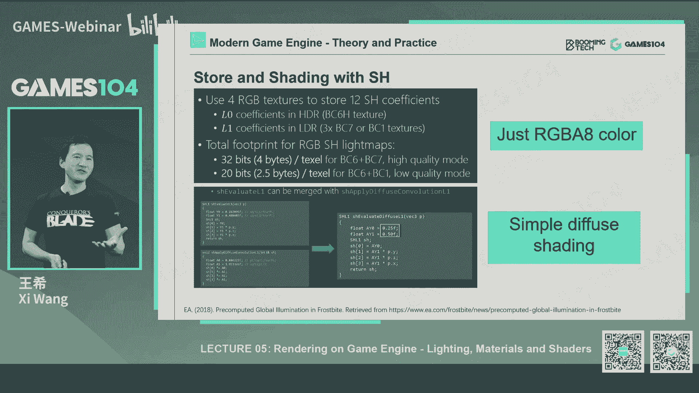
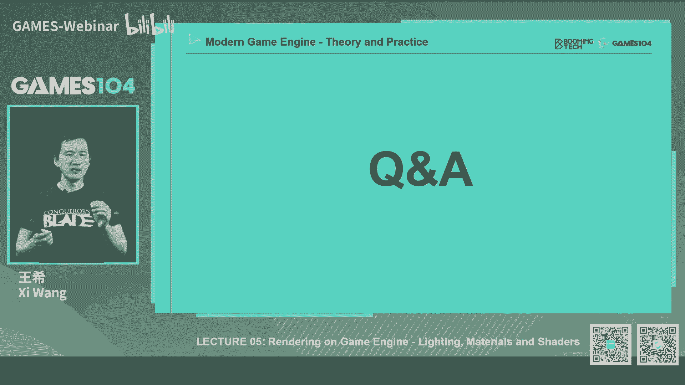

# 课程05：渲染中光和材质的数学魔法 🔮 | GAMES104-现代游戏引擎：从入门到实践

在本节课中，我们将深入探讨游戏渲染的核心：光、材质与着色器。我们将从最基础的渲染方程出发，逐步了解游戏引擎如何通过一系列巧妙的数学工具和工程实践，在有限的实时算力下模拟出复杂而真实的光影世界。课程内容将涵盖从经典的光照模型到现代的基于物理的渲染技术。

---

## 概述：渲染的核心挑战

上一节我们介绍了渲染管线和GPU的基本组织。本节中，我们来看看渲染最核心的数学基础——渲染方程，以及它带来的巨大挑战。

渲染的本质是模拟光在场景中的传播。35年前，Kajiya提出了著名的渲染方程，它用一个六维方程描述了所有渲染现象。方程指出，一个点出射的光由它自身发光和所有入射光经过表面反射后贡献的总和决定。这涉及到在半球面上对所有可能的入射方向进行积分，并乘以一个描述表面反射特性的四维函数——双向反射分布函数。

然而，这个完美的理论方程在实时渲染中面临三大挑战：
1.  **光的可见性**：判断一个点是否能“看见”光源，这直接关系到阴影的生成。
2.  **复杂的积分运算**：对球面光照和BRDF进行卷积积分，计算量巨大。
3.  **全局光照**：场景中所有物体都可能成为次级光源，光线会多次反弹，形成无限递归。

正是为了解决这些挑战，图形学工程师们发展出了各种精妙绝伦的“魔法”。

---

## 第一部分：经典渲染的“三件套” 🛠️

在硬件能力有限的早期，工程师们采用了一套简单而有效的组合方案来近似渲染方程。

### 简化光照模型

以下是早期游戏引擎中常用的三种光照简化方法：

*   **主光源**：使用方向光、点光源或聚光灯来模拟场景中最主要的光照。
*   **环境光**：用一个均匀的常数来近似模拟来自四面八方的间接光照。
*   **环境贴图**：用一个立方体贴图来模拟光滑表面的环境反射，捕捉高频的反射细节。

这套组合虽然简单，但通过将复杂的光场分解为均匀环境光、突出主光和镜面反射，巧妙地符合了渲染方程的基本思想。

### 经验材质模型：Blinn-Phong

在材质方面，早期广泛使用的是Blinn-Phong经验模型。它基于直观的观察，将材质反射分为两部分：

**漫反射项**：`Diffuse = k_d * (L·N)`
**高光项**：`Specular = k_s * (N·H)^p`

其中，`k_d`和`k_s`是反射系数，`L`是光方向，`N`是法线，`H`是半角向量，`p`是高光指数。

这个模型简单高效，但它有两个主要问题：**能量不保守**（在光线追踪中会导致能量累积）和**表现力有限**（所有材质看起来都像塑料）。

### 阴影生成：Shadow Map

对于光的可见性，游戏行业长期依赖Shadow Map技术。其核心思想非常直接：

1.  从光源视角渲染场景，只记录深度信息，生成一张深度图（Shadow Map）。
2.  从相机视角渲染时，将每个像素点变换到光源空间，得到其到光源的距离。
3.  将该距离与Shadow Map中存储的最近深度比较，如果更远，则该点在阴影中。

Shadow Map虽然会产生自遮挡、锯齿等问题，需要通过偏移、滤波等手段来“Hack”，但它以其简单和普适性，成为了游戏阴影的基石。

通过“主光+环境光+环境贴图”的光照、“Blinn-Phong”材质和“Shadow Map”阴影这套“三件套”，早期游戏实现了在有限算力下可接受的真实感。

---

## 第二部分：迈向真实——全局光照与预计算 🌍

随着对画面品质要求的提升，3A游戏开始追求更真实的全局光照效果。这催生了以“空间换时间”为核心的预计算技术。

### 数学工具：球谐函数

处理球面函数（如光照）的积分是核心难题。球谐函数提供了一种完美的解决方案。它类似于傅里叶变换，可以将球面上的任意函数分解为一系列基函数的线性组合。

以下是球谐函数前几阶基函数的直观理解：



*   **第0阶**：一个常数，代表球面上的平均值。
*   **第1阶**：三个基函数，分别正比于x, y, z坐标，可以表示光的主要方向。
*   **更高阶**：能表示更复杂、更高频的分布。

球谐函数具有正交性、旋转不变性等优秀数学性质。最关键的是，**两个球面函数的卷积可以简化为它们球谐系数的点积**。这意味着我们可以用少量系数（如4个）压缩存储一个点的光照信息，并快速计算光照与材质的卷积结果。

### 光照烘焙：Lightmap

基于球谐函数等工具，Lightmap技术得以广泛应用。其流程如下：

1.  **参数化**：将场景的静态几何体展开（参数化）到一张或多张大的纹理图集上。
2.  **烘焙**：在离线阶段，使用光线追踪等方法，计算每个纹理像素（对应世界空间一个点）所接收的全局光照信息（通常用球谐系数存储）。
3.  **运行时采样**：渲染时，根据像素对应的纹理坐标，直接从Lightmap中读取预计算的光照信息。

Lightmap能产生非常细腻的间接光照和软阴影，但缺点也很明显：烘焙耗时极长，且只能用于静态物体和静态光。

### 动态补充：Light Probe

为了给动态物体提供全局光照，引入了Light Probe技术。

1.  **布点**：在场景空间中均匀或按路径放置大量的采样点（Probe）。
2.  **采样**：在每个Probe位置，捕获其周围的环境光照（通常存储为球谐系数或立方体贴图）。
3.  **插值**：对于动态物体上的点，找到其周围的几个Probe，进行插值得到该点的环境光照。

对于高光反射，还会使用精度更高但数量更少的Reflection Probe。Light Probe可以在运行时更新，兼顾了动态物体和一定的实时性。

通过Lightmap处理静态全局光照，Light Probe处理动态物体光照，游戏画面在真实感上迈进了一大步。

---

## 第三部分：基于物理的渲染 🎨

材质模型的进化目标是更符合物理规律，同时让艺术家更容易使用。这就是基于物理的渲染的核心思想。

### 微表面理论

PBR材质基于微表面理论：宏观表面由无数微观镜面组成。光线的反射行为由这些微表面的法线分布决定。
*   **粗糙度低**：微法线集中，表面像镜子。
*   **粗糙度高**：微法线分散，表面漫反射强。

### Cook-Torrance BRDF模型

现代PBR常用Cook-Torrance模型，其反射率由三项相乘得到：
`BRDF = (F * D * G) / (4 * (N·L) * (N·V))`

以下是三项的物理意义：

*   **D (法线分布函数)**：描述微表面法线的分布。常用GGX模型，其“长尾”特性能让高光过渡更自然。
    ```glsl
    // GGX NDF 示例
    float D_GGX(float NdotH, float roughness) {
        float a = roughness * roughness;
        float a2 = a * a;
        float NdotH2 = NdotH * NdotH;
        float denom = (NdotH2 * (a2 - 1.0) + 1.0);
        return a2 / (PI * denom * denom);
    }
    ```
*   **G (几何遮蔽函数)**：描述微表面间互相遮挡的现象。常用Smith-Schlick模型。
*   **F (菲涅尔方程)**：描述反射率随观察角度变化的规律。掠射角时反射率最强。Schlick近似是常用公式：
    `F = F0 + (1 - F0) * pow(1 - (H·V), 5)`

### 艺术家友好的参数化

迪士尼提出了一套PBR材质设计原则：直观、参数少、范围在0-1、组合无异常。由此衍生出两种主流工作流：

1.  **Specular-Glossiness工作流**：
    *   **Diffuse Map**: 漫反射颜色。
    *   **Specular Map**: 镜面反射颜色（F0）。
    *   **Glossiness Map**: 光泽度（光滑度）。
2.  **Metallic-Roughness工作流（更流行）**：
    *   **BaseColor Map**: 基础颜色。
    *   **Metallic Map**: 金属度。非金属时，BaseColor作为漫反射；金属时，BaseColor作为F0。
    *   **Roughness Map**: 粗糙度。

MR工作流通过金属度参数自动处理漫反射和镜面反射的分配，更不易出错，深受艺术家喜爱。

---

## 第四部分：基于图像的照明与环境反射 🌟

即使有了精确的材质，也需要真实的环境光照来“照亮”它。基于图像的照明技术将预计算思想发挥到极致。

### 核心思想

IBL的核心思想是：既然环境光照可以表示为一张贴图（如立方体贴图），那么材质与环境的卷积积分也可以预计算成贴图，在渲染时直接查表。

### 漫反射部分：Irradiance Map

漫反射部分`(N·L)`的卷积结果只与法线`N`有关。我们可以预计算一张**Irradiance Map**：对于立方体贴图的每个纹素方向（作为法线`N`），卷积计算所有入射光`L`的贡献。渲染时，根据法线方向采样这张图即可。

### 镜面反射部分：预滤波环境贴图与LUT

镜面反射部分复杂得多，它依赖于视角和粗糙度。解决方案是：
1.  **预滤波环境贴图**：根据不同的粗糙度等级，预卷积环境贴图，生成Mipmap链。粗糙度越高，采样的Mip层级越低（越模糊）。
2.  **BRDF积分贴图**：将菲涅尔项与几何项的复杂积分预计算成一张2D查找纹理，参数是`(N·V)`和粗糙度。

在着色器中，结合这两张预计算贴图，就能高效地实现精确的环境镜面反射。

```glsl
// IBL 着色伪代码示例
vec3 iblSpecular = prefilteredEnvMap.sample(roughness, R).rgb;
vec2 brdf = brdfLUT.sample(NdotV, roughness).rg;
vec3 specularIBL = iblSpecular * (F0 * brdf.x + brdf.y);
```

IBL技术让物体能够逼真地反射周围环境，极大地增强了场景的真实感和沉浸感。

---

## 第五部分：现代阴影技术进阶 🕶️

随着场景规模扩大，传统的单一Shadow Map无法兼顾近处细节和远处覆盖。级联阴影映射成为主流解决方案。

### 级联阴影映射

其原理非常直观：
1.  根据相机视锥体的远近，将其分割成多个层级（如近、中、远）。
2.  为每个层级分别从光源视角生成一张不同分辨率的Shadow Map。近处层级分辨率高，远处分辨率低。
3.  渲染时，根据像素在相机空间中的深度，决定使用哪一层级的Shadow Map进行可见性判断。

这种方法匹配了透视投影下近大远小的采样率变化，有效解决了阴影的质量与性能矛盾。层间过渡需要通过混合来避免接缝。

### 软阴影技术

为了生成更真实的软阴影（阴影边缘有半影区），常用以下技术：
*   **PCF**：对Shadow Map进行多次采样并滤波，模糊硬边缘。
*   **PCSS**：在PCF基础上，根据遮挡物距离动态计算滤波核大小，模拟半影效果。
*   **VSSM**：利用Shadow Map的矩（均值和方差）来近似估计遮挡概率，性能更高。

---

## 前沿展望与总结 🚀

本节课我们一起学习了从经典到现代的游戏渲染核心技术栈。回顾一下，一个典型的现代渲染方案包括：
*   **光照**：Lightmap（静态GI） + Light Probe（动态GI）。
*   **材质**：基于物理的渲染模型。
*   **环境反射**：基于图像的照明。
*   **阴影**：级联阴影映射 + 软阴影技术。

然而，时代在飞速发展。实时光线追踪硬件的普及，正在引发一场渲染革命。实时光追可以更精确地解决可见性、反射和全局光照问题。新的实时全局光照算法，如SDF GI、VXGI、Lumen等，正在挑战传统的预计算方案。Virtual Shadow Map等新技术也在重新定义阴影的生成方式。

渲染的世界充满了“魔法”，这些魔法是数学智慧与工程实践的结晶。从Kajiya的完美方程出发，一代代图形学人通过大胆的假设、巧妙的近似和极致的优化，在有限的实时算力内，一步步逼近物理真实，创造出了我们眼中绚丽的虚拟世界。希望本课程能为你打开这扇魔法世界的大门。




---
**总结**：本节课中，我们一起探索了渲染中光与材质的核心数学原理与工程实践。我们从最基础的渲染方程和经典“三件套”出发，逐步深入到全局光照的预计算技术、基于物理的材质模型、基于图像的照明以及现代阴影算法。这条技术演进之路，体现了图形学如何在理论理想与硬件现实之间寻找精妙的平衡，最终构筑出令人信服的虚拟世界。