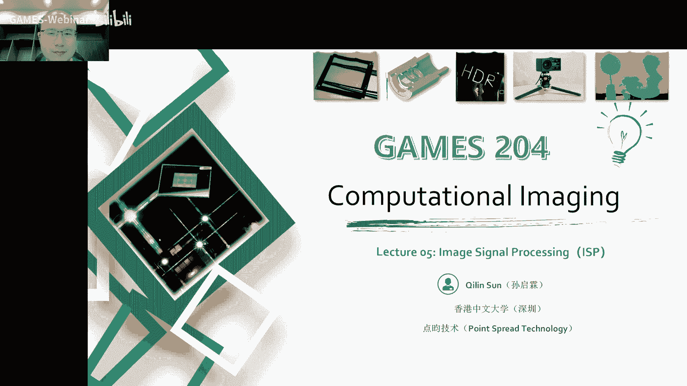
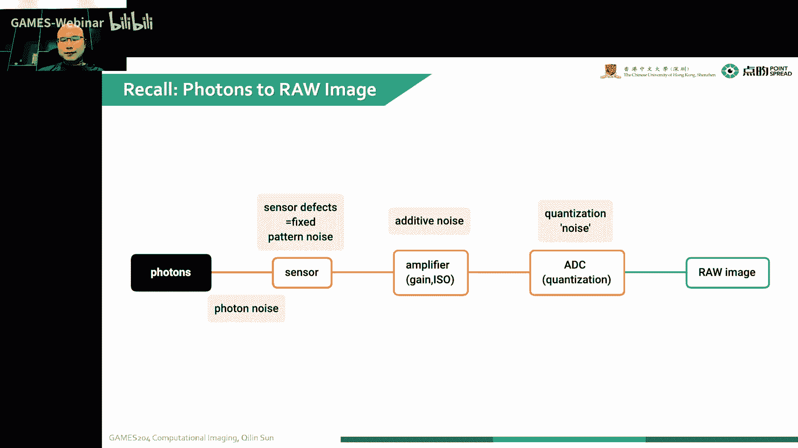
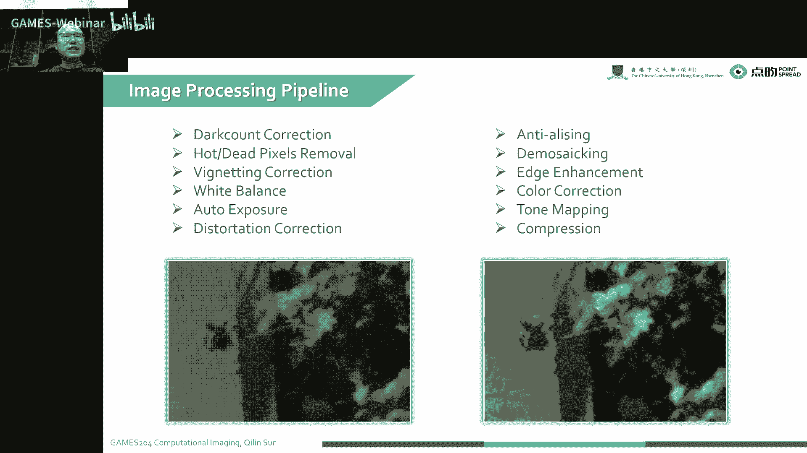
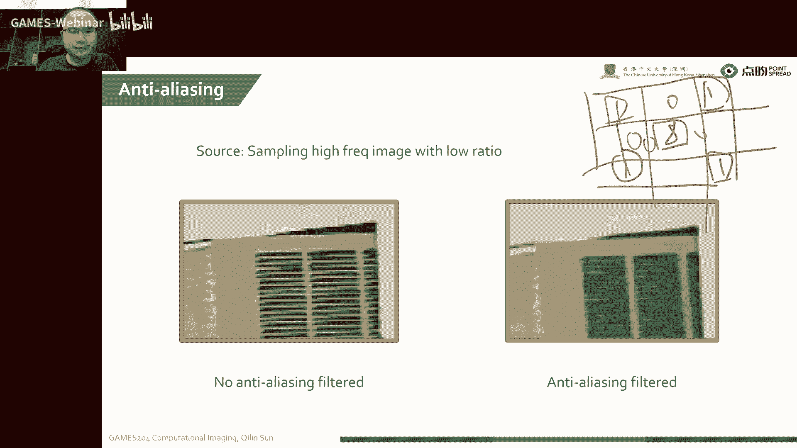
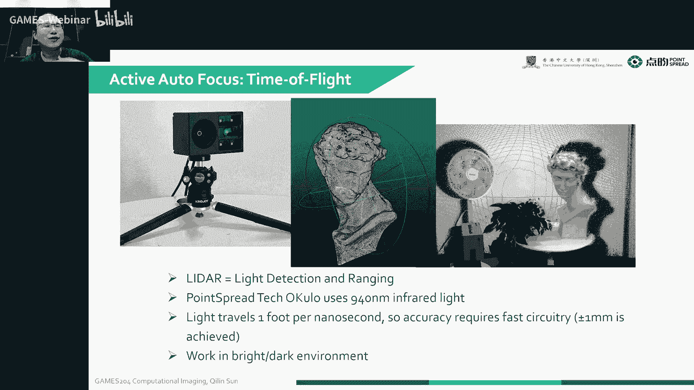
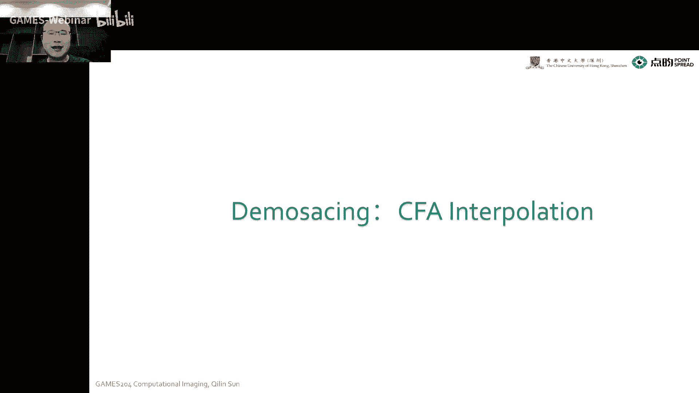
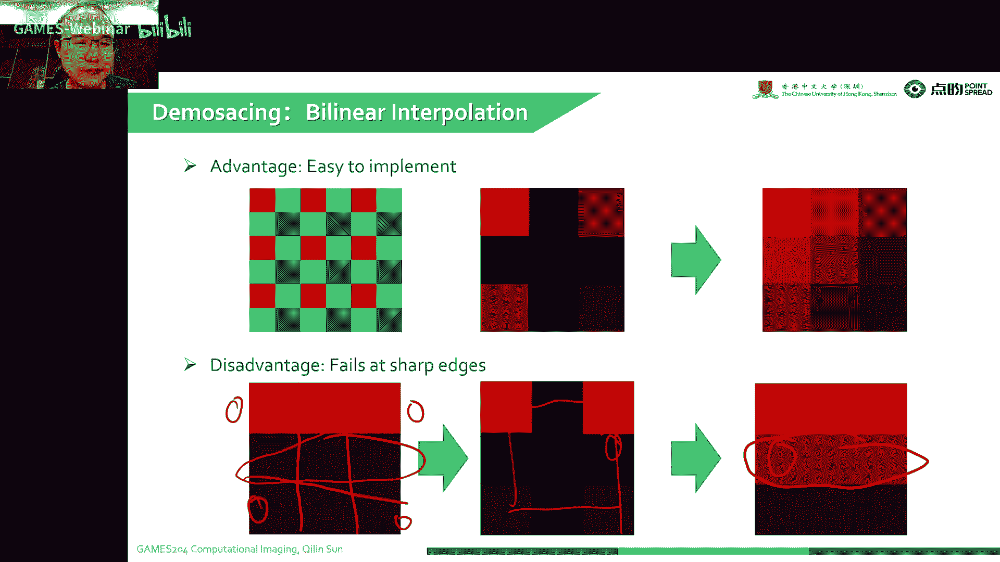

# 05.图像信号处理 ｜ GAMES204-计算成像 - P1 - GAMES-Webinar - BV1YB4y1b7VH

好时间差不多了，那我们今天就开始吧，首先欢迎同学们回到204计算成像的课堂，今天要给大家分享一个主题是image signal profession。

有时候也叫image signal professor，也就是大家常说的image i hp，这个前节课我们讲到这整个成像的过程，相机成像的过程我们可以调光圈啊，嗯去调曝光了，然后去调白平衡了。

然后他整个我们拿到了图像，到我们最后可以呈现出来的图像，这些经历了怎样的过程，就是要今天来揭晓这一个答案，也就是image signal processing。

今天的这个课程结构啊，只是这样，就是我们就是根据它的一个处理的一个域来做了一个简单的分类呃，首先呢就是一个bear bear y，因为我们的传感器就会有一些i p t d啊。

或者是其他的一些嗯这样颜色排列的一个白金装片，就我们传感器拿到了图像，呃，其实已经是这样一个呃分布的一种财富的一种呃，原始向我们在这个原始图像域里面需要做呃，像校警校正啊啊是黑电平校正啊，去造啊。

但格利亚包括像风筝cd collection，就是大家所说的那种啊电音电音的教程，还有一个像盘子啊，然后经过这么一系列的处理，到一个关键环节，也就是去马赛克，我可以调一下，声音比较小，现在呢。

现在声音还小吗，呃我们到了一个关键的环节，就是去马赛克，然后去马赛克呢实际上就是一个color theory information的一个问题，就是我们差值差到这么空缺的位置。

然后推出一个rgb 3星号的一个值，但是这个时候我们拿到的图像还是有一些颜色的色偏啊，所以说接下来一个步骤，我们需要在h e或者是一个y v e去做一个颜色的矫正。

通常我们用一个颜色的一个矩阵去做一个简单的乘法就好了，再来更复杂的一些需要更精准的一个教材，我们可以用直接look up table，然后呢我们需要对边缘精彩，因为我们经过一系列处理嗯，一底噪。

要不就换个机，等下，我想去换个，只有右声道，看看加一个什么处理会不会好，也可能是那个风扇声音太大了，所以说搞了不少伤，就这样好，有没有怀旧，这还有到他们同学，嗯，增加平衡思路在低，哦我知道了。

只有单声道，我看看哈，等一下，你现在呢有没有好一些，那我们继续吧，就是我之前经过一系列的处理处理啊，诶现在是好还是不好呢，零现在又有造型了，这样吧，这样是好还是不好，不好看不好，现在呢，我把这个重新。

现在呢现在好了吗，我换了一个usb的一个网卡声卡，零，还有嗯真的换一个，还没告诉你不知道。

微微，嗯现在呢。

诶现在声音怎么样，有没有变好，我换了个耳机，然后我们继续呃，刚才说到了这个这个为什么要做这个age enhancement，就是我们之前做了很，我们之前做了很多的这个，我之前做了很多的这个处理之后。

他的很多边缘会变得模糊，也就是我们会有一些高频分量的损失，这时候我们要拿到一个比较锐利的图像，这个时候我们是想对它的边缘进行做一些增强的，而且呃还有一个什么问题呢，就是我们在去马赛克之后。

就有一些他的一些就是伪彩色的出现，就是我们也叫false carry，呃，我们要对这个伪彩色进行抑制，就是我们不想让它那些边缘的地方会出现一些不好的，一些像彩虹一样的一些色彩。

最后我们要对它的一个亮度呀，对比度啊，呃进行一个变换，这就是一个控制，然后在显示给大家的时候，我们要做做一个伽马的一个拉链的一个就是一种调节，然后还需要去做套白品，因为我们最后我们其实拿到了一个图像。

可能它的位数非常多，也可能是十位的，也可能是14位的，所以说这个时候我们想要让我们最后拿到了这个更好的，就是我们想嗯就需要对它一个动态范围进行压缩，实际上也就是tmap的一个过程。

然后到最后我们就也可以做一些简单的一些节拍的压缩呀，最后就拿到了你们最后可以看到的一张图片，啊这个一我们已经上了四节课了，所以说现在想要给大家先把这个作业布置下去，就是第一个assignment。

这整个第一个assignment大概就是这节课覆盖的内容啊，呃就是我们要第一个assignment就是去实现一个基础的image signal processing，太烂。

包括在外的一个processing，这个占总共100分哈，这个占50分，嗯，就是that gives correction，然后black level conversion就是黑店名叫正十分。

就我这里会大概讲到两种制造的方法，呃，就包括像nal in跟dmd，这个我们后面会再造声那一节，去单门去讲这一节，所以说这个大家可以看一看，就是先提前留意一下这个事情。

然后啊就是有一个简单的antilain可以在十分去马赛克二分，因为去马赛克还是比较重要的，然后在其他的意义大概从color correction嗯，边缘增强false pression嗯。

还有伽马tmap，这个要tmap这个问题会比较重要一些，所以说这个才20分，就整个嗯我们会把那个cold framework，还有还有一些拍到的数据啊，通过这个课程系统叫c e s阿尔法。

有一个新系统嗯，在周末的话可以给大家放出去，这个dd呢就是8月15号的11：59，因为这assement to是啊mone的延伸版呃，就包括了像图像的一些牢狱的图像的融合去做hdr，然后还做一些呃。

有可能会涉及一些就不乐呀，安妮普乐呀，就是local tommy，就是local toming啊，嗯还有一些像嗯也有可能会覆盖到那个就cross channel prior。

就是颜色通道的一个边缘对齐的一个问题，就是第二次作业的是第一次作业的一个延伸，所以说第一次作业，大家同学们尽可能的去用最短的时间去把这个效果调到最好，当然有精力的同学也可以沿着这个作业去往下再做一下。

就是尽可能的让视觉效果达到最好，因为我们计算成像啊，计算摄影除了嗯本身它是一个科学以外，它还是一个艺术性比较强的东西，就我们最后想拍到的东西嗯，除了跟就是科学理论有关系，它更多的是对人的眼睛。

还有心理学相关的一个，它是让人愉悦的一种过程，就说我会给大家一张参考了一张图片，然后大家可以根据这张参考图就去，然后把这个饶图去往上面调节啊，然后大家也可以做一些自己想要的一些尝试啊。

啊这个都是都是有加分的，我们就统一都用python写好了，而且给大家说一下，就是整个cold framework，就是大家自己写好了，也尽量不要在就不要尽量了，就不要在这个公网上就放出来。

包括像github呀，或者是呃那个step of flow就能放出来，因为这一放出来就是明年的同学们就不大好用，啊这个就参考了很多像open sp啊。

啊包括wolf from page老师ng lv laya的一些资料，就是上节课我们说到这个我们这个color filter rea，它是一项比较经典的，就是rg g b的一个排列。

然后我们在一个灰度的一个就是一个cmos和ccd的一个图像传感器，前面放了这么一个cut，福特锐，我们最后踩到了图像啊，就是他会拿到一个就是四个通道的，一个在在这么一个平面上的一个分布啊。

然后我们最后拿到的图像，其实我们要直接看的话，可能是非常难看的，就是我没有办法直接理解这么一个排列的一个图像是什么样子嗯，但是但是为了拿到这个图啊。

首先我们要把这个image formation去来说出来，就是我们从物理世界中嗯，然后到了我们传感器上，究竟它这个过程是怎么样的，那这个本身啊我们的物理世界就是我们第一节课讲到了，就整个物理世界第一。

它是有一个非常多维度的，就包括我们生活中的空间，它是一个三维的，然后光呀光有自己的性质，就比如说像相位啊，呃角度啊，偏振态呀，波长啊，而且我们整个的场景也是随时间变化的。

所以说就会拿到这么一个fly optic function，这个叫中文叫什么呢，呃这个就是所谓的全光函数ln这个前缀啊，line这个前缀啊，我给大家写一下哈，可能这个前缀有一个意思呢。

就是全能的万金油的意思，然后我们可以通过这么一个全功函数来完整的描述，整个光在空间中是怎么分布的，这个概念最早是1939年啊，由高盛的一篇论文里面和提出的。

后来被anderson和burger在就是90年代在论文中完善，并给出了我们最后的一个全光函数的一个形式，就简单的来说，这整个全包函数可以描述空间中任意一点，就是任意一个点。

然后穿过这个点的一个光线的一些强度啊，包括描述这整个全光函数，它是一个就是也就是大家常说的一个所谓的一个广场的一个函数，这广场函数有多少个维度，到至今来说一直也是个谜题，就大家有兴趣的话可以参照一下。

这个就邵晓鹏老师的有一个关于就是计算成像的专栏，它里面专门讲到了一个光场，还有全国函数的这么一个问题，但一般哈大家就是通常理解为这个全国函数为七维，也就是呃xyz就是空间为呃，角度为下位为。

还有一个像大家在这里看到了一个跟它的一个波长相关，但随时间变化就是像动画呀，还有一个就是跟它的偏振态相关，就是包括横片呃，纵片这些各各种各样的信息，整个就构成了这么一个全功函数。

但我们目前所接触到的是一个成像，就把这个情况还是稍微搜了一下，我们其实我们可以看到在我们最后拿到图像传感器上这么一个积分啊，有很多都可以忽略掉，就是我们只考虑我们的角度啊，波长啊。

还有时间在我们传感器上拿到的积分，这样的话就是实际上我们拿到了一个像素值，到最后，当我们拿到了像素值，我们最后怎么突，就是我们的相机是怎么样捕获到这个像素值呢，首先就是还要感谢爱因斯坦发现了光电效应。

我们的这个光子打到传感器上，然后上节课讲到了，就是会激发那种呃空穴对，电子空穴对，然后在电场作用下，然后被整个就是后面的一个叫vil capacitor去捕捉到，然后经过一些放大呀。

就就是我的传感器传感器在这个时候啊，就会有一个因为受限于传感器本身的一个加工的一个问题，就会有一个fix pattern noise，就是我们这是加工工艺跟电流的一些影响啊。

它有一个fix patternoise，然后我们在这个积分的一个井里面，我们就叫井里面，然后通过一些放大呀，包括呃有一些模拟的增益啊，或者iso把这个信号就是电信号放大放大之后。

我们通过一个analog to dividual converter，也就是a d c就是模拟数字转换器，把这个模放大后扣的模拟信号转换成数字信号，最后就拿到了我们这个饶头像。

但这过程中会有大概呃四种主要的一些噪声啊，就包括呃光子在积分的过程中，我们上节课讲到了一些嗯就是photo noise，就是整个泊松过程的一个noise，然后第二个就是游戏，就是传感器本身的电路啊。

还有一些工艺引起的一些fake peternoise，然后还有一些在增益过程中引入的noise，还有最后一个量化噪声，就是为我模拟到数字转换，假如说我有个八位的一个a d c。

就是我最小的那一部分就就被就被干掉了，这个时候就会有一个a d c就qualization noise，最后我们就拿到了一个rog图像，但我们可以看到左边那个图啊，就是我们实际上拿到了这么一个绕图。

它本身是没有颜色的哈，我们拿到这个图啊，我们可以看到它是rgg b4 个通道，然后经过这么一个绿光，然后在传感器上直接拿到了一个值，我们要直接用d c r，然后去打开的话。

这个导图看的就是一个就是灰不隆咚的一张黑白图啊，怎么样去转换到我们就是实际日常生活中，看到了这么一个漂亮的一个彩图呢，我们又需要经过那今天讲到的一系列的过程来实现这么一个呃。

由饶土到最后拿到了一个漂亮的彩图的这么一个过程，但是这个过程就包含了比较多的一些内容，就包括像，dark cos correction，呃，还有hot dtc correction。

也就是我们要去掉它的一个一些坏点，然后去做一些呃建运的教授叫vnt，也就是呃大家有时说的lcd lcting其实就是呃透镜的禁运，就是它是由透镜本身呃引起的一种问题，当然还有一些彩色的一些建议。

大家待会可以给大家详细的讲到，然后我们拿到这么一张彩图，在各个通道我们要做一个白平衡，我们要在一个我们想要的色温下，或者是想要的白点一下就拿到，我们就是就是一个最好的一个白色的一个点。

这样的话我对我们整个的一个颜色的控制就可以就比较好，还可以做一些呃自动曝光呀，呃去做and distortion嗯，然后呢本身由于我们就采样的过程啊，就是因为我们是用那个卡拉菲特瑞采用的过程中。

它是间隔采样的，就会有一些allazing artifacts，这个时候我们要做一个呃反怎样的过程，就是实际上也就是一个低通滤波器，但是怎么去设计这个低通滤波器，在这里面学问很多。

我们又不想丢掉我们的边缘，但是与此同时又想尽可能的就去掉这个aza带来的影响，就退学，学里面学的alyzing非常多啊，包括像超采样，超采样，还有一些而且包括fter啊等等一些方法。

但是有很多方法就是我们不能太随心所欲的，像图形学里面就是因为我们物物体是已知，这个时候我们解的是逆问题，就我们可能就只能采取一些嗯，就是就以前有很多放弃。

很多就是没办法随心所欲的一些措施来去设计一下它的antvc puter，最后来重建一个比较好的效果，那去马赛克啊，其实是整个sp里面的众筹之众，就实际上就是差值过程，就我们这个差值过程你要插不好呢。

就很容易引起这个就边缘的色彩的一个微踩，而且还会插不好呢，还会有一些呃细节和频率的损失，然后去马赛克嗯，所以经历了这么多年啊，去马赛克算法嗯，每个几十种也得有上百种，就是非常多，但是各有各的优劣。

到今天为止，去马赛克人世界中的一个比较热的一个课题，如何快速的嗯高效的，然后没有围采的就不丢失细节的去马赛克啊，这一直是整个呃计算摄影啊，包括传统成像领域的一个研究热点啊。

包括还有一些age enhancement呀，color correction呢还去做动态范围的压缩来显示呃，其实也就是对细节进行一个增强，那最后可能会有一些像jpc的一些压缩，这节课就可能覆盖不到。

下节课给大家稍微说一下。

整个的image processing pi大概就是这么一个流程，从某图像传感器呃，然后第一步我们就要把坏点抠掉，因为这个有一些坏点啊，他会对后续的后续的一些操作进行不好的影响。

比如说我这个点一直在闪烁啊，这个点一直是黑的，这个点一直是亮了，这对我们后续操作也不好的影响，那这个时候我们就第一步要先把这个快点干掉，然后第二步呢呃就是要做黑电瓶的意志，为什么会有这个黑电瓶的问题。

呃，这个黑电平这个历史上也挺复杂的，就是有时候为了保留暗部的细节啊，就是大家一起传统的公司，为了保留暗部的细节，就是我在我们a d c，因为我们a d c采样的位置有限。

所以说这个时候大家会在那个采样之前会给一个偏压，尽可能的去让这个暗部的细节可以被踩到，但是除了这个还有一些像本体电流的一些影响，就是它在黑的地方就不可能是零，那基于这些原因呢，就是我们要对黑电平进行。

就是早早的进行校正，如果不叫它黑电平检查，会有那很大的后果了，就是它会有一种灰蒙蒙的感觉，这个后面会给大家详细讲到，然后要快速的去做这个length setting correction。

然后嗯然后去做去噪，因为以前的传统的i s p去噪的时候，通常就在后面的情况下，但是就是近些年人们发现啊，包括现在大部分的手机摄影，很多时候要把这个noise放到扰动脉，这为什么呢。

因为就是我们的传感器啊，基本上它的一个捕获的积分的一个过程，它可以近似为看成一个线性，我没有在做太多的处理之后，我们本身造成的一个分布就是没有被破坏，也就是说我们噪声的一个表现形式没有变得更复杂。

这个时候处理我的噪声其实可以拿到一个最好的一个效果，所以说现在的一个modern i s t通常都是把这个牢狱的渠道呃，来做到一个拍拍里面，它还有一些3a就包括自动对焦呃，这个这个自动曝光。

还有一个就是呃自动白平衡这3a呢，所以它有一个反馈的回路，是可以对整个输入的镜头啊，然后还有一些链路进行一个动态的一个调解啊，这个前面这一部分就是牢狱的一个处理，疗愈处理完之后，哎这个我们做个差值。

做个卡拉夫特respiration就到了，rgb或者是也可以做个变换，去到我们讲到的vcr cp或者cv空间去做处理，这个时候我们查到一个拿到一个线性的图，我们可以快速的做了一个就是颜色的校正。

然后再去做伽马校正tmaking嗯，然后再转换我们的色彩啊，包括呃也可以，这个时候再进一部分的渠道，当然现在其实呃有非常好的算法在绕语里面去把这个噪声干掉，其实后面的有很多制造的方法就可以直接就扣掉。

但最后还是要做一些呃false color pression，还有一些还有赛车性的一些控制，然后再做边缘增强啊啊然后就是对比度和亮度的调节啊，最后拿到我们最想要的图像，这个图大家记住哈。

因为我们就是写作业的时候，要根据这个链路来去实现我们的这么一个第一次的一个assignment，就我们就是用单反拍相机的拍，就拍一个照的时候，我们就拿到了一个meta data。

就是就是我们这个参考的数据是什么样子呢，我们可以看到就是我可以拿到这个一些就是文件名啊，就是说这个是jpc一张图，然后可以拿到这个相机的型号，也可以拿到它报告时间f数啊。

还有像呃呃exposure的一些就是就是就是那个program这里面选的是一个mu，也可以看到就是它的一个偏执的一些值，还有最大的光圈值啊，那我们iso用了多少这个meta data嗯，这个就很重要。

所以说这第一次作业里面，我我用了一台佳能的相机给大家拍了一组呃图像，就整个meta data都是存在最后的一个dng的图里面，大家可以通过饶派呃去看到这个metadata。

因为这个metadata可以对后面的处理直接就去用它，当然这个代表框架我会给大家就把这些metadata嗯先给大家弄出来吧，先给大家弄出来，然后大家就可以直接在这个papi里面去用，下面来到正题。

就是我在待遇是如何做处理的，这个为什么第一个就是做了一个坏点矫正，为什么要做坏点校正呢，它是这个坏点是从怎么来的呢，就是坏点就是有时候也叫dead pixel，有时候也叫bad pixel。

就是他是就是图像传感器上光线采集点，就是这个像素点啊，在我最后加工的过程中，就是就做那个就是整个fabrication的一个工艺上的一个缺陷，然后或者是就是光信号转换成电信号的过程。

也可能后面后面电路的一个问题，就导致这个图像就是有可能是一直一直是低的，就是我一直是黑的，就大家从里面看到了这个that pixel，然后呢如果这个图像一直是亮的，这个就是叫hot pixel。

也就always high，还有叫stock pixel，这个就是他一直有一个灰度值，它既不亮也不暗，它就是一个固定的值，但除了这个这种一般啊，像我们列出来的这三种叫静态画点。

就是它一般都是不怎么动的哈，就是这个叫静态的，但除了这种静态的换点啊，还有动态的观点，就我一个像素啊，他跟着bling bling bling一直在闪，诶，这个时候就比这个静态的更难受。

因为这个静态的坏点啊，我们也可以标定一下，或者是可以直接记住，就是每次处理的时候诶就非常容易，那这个动态换点呢呃就比较麻烦了，就是我它是随着一些呃，比如说我们的温度升，就是变高了，传感器的温度变高了。

增益变化了，这个时候都会对这个坏点的一个闪烁呀，或者是值啊，就是有一个影响，所以说这个时候就就比较难过了，你为什么要把这个dp so放到最前面的，为什么要放到最前面处理，就如果这个图像存在坏点的话。

就我们后面的一些i s t，就比如说在插值或者去噪的时候或者滤波的时候，它会影响周围的一些像素的值啊，所以说我们一般都是在最前面去把这个坏点进行校正，而且这个有时候换点比较多的时候。

你要这时候来个去马赛克，这边缘就非常容易出现伪采了一些it fect，啊怎么去的呢，这个坏点去这个去除坏点大概两步走，第一步呢就是我需要检测到这个坏点，这个还是比较容易的啊，这个怎么去做这个坏点检测呢。

就是我们用了那么一个，首先哈这是我们拿出这一个rg g b4 个通道里面任意一个，就把这个中心设为p0 ，我们去做它这个八零域的一个差分，就我们看它的一个绝对值的一个差分。

然后如果这个difference就是这两个领域之间的一个差值，超过了一个threefold，我们设置一个thresh code的时候，哎这个时候我们就认为哎这个pixel有问题。

就直接判断这个pixel有问题，那如果呃这个没有超过这个threat错了，我们就是说哎这个没有问题，这个时候就可以把这个扣掉对，然后就因为我判断这个pixel有问题了，然后就需要进行第二步。

第二步是干啥呢，我我检测有问题了，就是我要把这个原来原有这个错误的值剔掉诶，这个时候一般大家是用一个差值这么一个做法，来去把这个就是坏掉的这个值插出来。

然后一般哈一个简单的一个做法就是用一个gradient base的future，这个怎么算呢，其实也很简单啊，就是我算这个p0 啊，跟p2 p7 之间，这么一个它的一个鬼点子，就四个方向的鬼点子嘛。

就是横竖斜着这几个方向，算到它的规定之后，我们找到它这个梯度最小的一个方向，就梯度最小的方向呢，我把这个呃比如说这个时候这么对值一来给它做一个一平均下，那个他这个值加上加一，为什么要加一呢。

因为怕有什么有的地方有零的过程就不好，然后这个时候再找个梯度最小的一个方向去把它这个插出来，这个就非常容易就可以把这个换脸抠掉，那第二步就是做这个黑电平校正，这个黑电瓶啊。

叫black level correction，因为这个黑就是我们拿到这个饶图啊，这个黑电瓶就是黑色数据的最低的一个值，也就是我们通常有时候指这个感光图像数据为零的时候，对应传感器的一个信号电平值。

就是我把整个摄像头给用那个摄像头盖儿盖住，这时候拍一张图诶，这个最小的值也就对应的这么一个黑电瓶，低电平形成的原因其实是挺复杂的，比如说我们的cmos传感器经过一系列的一个转化。

生成了一个绕图像的一个数据，我们就拿这个12位的一个最小差感器为例哈，这个12v的图像传感器，它最后能表现的一个像素值是0~4096，但实际我们a d c啊，就是一个12位的a d c就魔术转换芯片。

它的精度就没有办法把一些很小的一些模拟值啊，就转换成数字部分，就我这黑色小值比那个最小那一节，比如这二的12次方分之一还小，这时候就踩不到他，诶，这个时候咋整很多，就是这个传感器厂家就非常聪明。

就我现在我的这个模拟信号上加到一个偏压对吧，加到一个偏压之后，就固定的一个偏移量哈，然后再用这个ad去拆，这个时候嗯就是它会有一个最小的值，但是这个最小的值可以让暗部的细节完全保留。

但这个时候你要加一个偏压吧，就很多亮的地方就会有有，当然也不会太多哈，就是有一些亮亮亮的地方，它会过曝，这个时候就会损失一些细节，那这个也还好了，这个因为我们这个很多时候他的目的啊。

就是为了想找了一些暗部区域的一些细节，然后我们本身i s p后面还有一些呃，length shing correction，a w v啊，伽马呀，其实这个亮度量很很亮很亮的地方汇报一下。

然后这个事大家基本上也能忍，所以说最后通常大家去做了选择，就是保留暗部的细节，除了这个做一个本身给他一个偏压哈，就是就是整个传感器电路cc电路的本身还存在一个暗电流，就是导致在没有完全没有光照的情况下。

这个像素单位也会有一定的就是输出电压，而且按这个按电流啊其实也挺复杂的，按键按电流跟曝光时间，跟着我的增益都是有关系的，而且受限于工艺的问题，我这个按键流好家伙，跟在不同的像素区域。

他的那个值也是不一样的，这个时候有时候会说诶，大家有时候这个增益变大，发现电路的增益也变大了，这个按电流也变得增强，所以说有时候很多暗器啊会把那个在不同增益下减掉不一样的一个呃，黑电瓶。

比如说有有很多传感器要输出着的时候，为什么要把它也放到一个比较浅的位置呢，就是这个附加黑电瓶如果不去除干净，就是又要耗越复杂嘛，干扰的信息会影响后面整个ip的一个处理，会导致特别是一个白平衡。

自动白平衡的一个不准，就大家可以算一下哈，这个我们这个做黑电平校正啊，实际上其实也挺简单的，就是把这个后面这个值扣掉，那做白平衡的时候呃，如果你不把这个黑电瓶扣掉。

就会呃出现一些就是整体偏绿或者偏红的一种就是问题啊，而且会给大家一种蒙上一层雾的那种感觉，就是灰蒙蒙的那种感觉，现在主流的一些就是黑电平校正的一些方法，就有一些，比如说我硬件设计的时候。

直接就是很简单的，就是最简单的一种办法，就直接点了一个固定值，诶，我其他的不管了，然后第二个就是可以根据不同增益设定的一个不一样的固定值，但有的时候那些厂家会给一个黑电瓶，随着温度和增益的一个漂移曲线。

大家可以根据这个函数去来对这个黑电瓶进行校正，当然我还见过一些，因为我这本身是用过这个传感器的，我见过一些，就是有一些厂家啊，就把一些边缘的像素，就是比如说我们一个1920x1080那个像素。

实际的我们比如说像索尼的这个传感器，实际上我们拿到了这个图啊，会比这个图稍微大一点，就我们边缘还有那么两三行那个像素是就没有被读出来了，就是不是也不是没有被读出来，就没有就有有两有那么几行额外的像素。

这个额外的像素是干嘛的呢，它本身就是全黑的，就是前面给你全部涂黑，就是让你没有办法接触到外面的光，但这个时候我就可以实时的动态的检测出这个黑电平是多少诶，我最后把这个图像捕捉过来。

我根据那几行就参考了一个呃，一个像那那几行像素，然后那么一减，最后就可以拿到一个比较好的这么一个去黑电平的这么一个东西，而且这个值啊是一直是随着动态传感器的动态在变化。

就是这个时候去去去除这个效果会比较好，这antella呢其实就是比较好理解，就是大家上过图形学的课，那就不知道我们要就采样一个高频的一个图像的时候，因为一个比较低的一个采样率。

这个时候就会产生一些怎样的一个问题，就是说呃通常这个时候antilizing filter呃，大家加一个，其实这个时候对对对，一个饶狱的一个until lining也很简单，因为太简单了，就没有列出来。

实际上给大家画一下，这个就是，比如说这一个像素有，这么一个隔着几行的这么一个filter，大家用一用就可以了，这些中间都是零，这一个filter直接fter过去。

就是可以给很大程度的意义上这个analyzing filter啊，去去抑制它的一个怎样的一个问题，然后说到监狱呢就是类似cd。

这个有时候大家就叫剑玉哈，有时候有时候叫那个就类似cting，咋翻译啊，这个有点记不清了，这个它是由什么引起的呢，它实际上是由就是我们设计透镜的时候，它是有很一般我们的透镜是由一个或多个镜片组成的嘛。

而且这个是为什么呢，因为后方的一个原件就遮蔽了一些前方元件的一些公路，这个时候就会导致前端透镜离轴的，就是有效入射光减少，结果呢就是光的强度由中心向周围减弱。

这时候有时候我们在我们图像传感器拿到图像会发现呃，可能就是周围的一些亮度会变暗，可能会就是按照50%这么一种情况，也会有一些呃颜色的偏差，像一些color ching啊，这些问题。

这个就直接影响到了我们这个图像的一个整体效果，整个类似shing呢就是大概分呃，罗马试点就是亮度的均匀性跟一个color试点就是彩色的均匀性，这个亮度的经营性啊，就是大家可以看到这个图啊。

就是我们本身就是我们在这个我们整个出口的位置入射光线，光线首先就是我投影到了一个呃，首先我这是这个光被投影到这个像素上，然后呢这个像素我们可以看到随着这个角度的变大，然后我们看的这个光线啊。

假设是均匀的话，就会有一个cos的四次方的这么一个呃decrease的一个问题，但除了这个还有一些其他的，像刚才讲到的呃，透镜就遮挡问题的一些影响，就会产生一个亮度的一个禁运，然后彩色的界面就更复杂了。

就是由于就是我们这个镜头啊对不同，大概我想啊这个这个color设定可能大概有四种吧，大概有四种就产生的原因，就是第一种就是镜头对不同光谱光线的一个折射程度不一样。

就我们知道啊这个哦这个同学问只有边缘有黑电瓶吗，对，因为只有我不是是所有的，就是整个图像传感器的就是都会有这个黑电瓶的问题，它边缘是加两条黑边，让你去把这个黑边值采出来，就当黑电平校正。

然后就把它点掉用，然后我们哎我们回到这个cl city的问题，就我们刚才就是说到这第一种的一个原因呢，就是我们这个镜头因为对不一样的就是波长的光线折射程度不一样，这个时候就会导致入射光线的不同。

波长的光线落在我们传感器的一个位置不同，这时候就会引起一个cover设定的一个问题，还有第二个问题啊，就是我们有时候会用那个红外截止滤光片，为什么要拍彩色的图像，会加一个红外接的滤光片呢。

就是我们有时候加了一个rg d b filter之后，它本身就是我们自然界里面还是存在非常多的一个近红外的一个光，然后我们那个就是红色那个通道或者是其他的蓝色，绿色通道就绿不到。

这个滤不掉这个r fter说这个时候就会呃导致我们这个图像偏色，然后呢同时为了影响就是踢掉了这个镜头外，就是额外的一个影响，就会引起一个红外截止的一个滤光片，但是红外截止滤光片了这个膜呀。

嗯就是在我们角度比较大的时候，就是就是那个光线角度比较大的时候，就是红外光在我们这个红外截止滤光片的一个大盘射角上，会有一个比较强的反射，然后这个反射就比如说我这一个画完结局光线这一个大角度射过来。

反射之后，哎，经过我们这个镜头内部多次反射，诶，这个时候诶竟然被传感器看到了是吧，这个时候就会引起这个图像偏色的问题，当然还有一个呃就是也不是很常见啊，这个可能很多书上都没有讲到。

就是这个是传感器上的微透镜，他那个c r a与那个镜头的一个c r a就cherry angle，叫主观性的一个角度，就是我们这个维和天津店，有时候大家都是均匀排布，但实际上不是的。

特别是像一些就是广角的一些超广角的一些就是传感器啊，他为了适应那个大角度，然后为了提高一定的施工能力，诶我这个时候我这个mellia它是有一定的角度的。

这个时候v途径的角度要是跟我们主镜头的一个chef，安卓chef啊，叫什么主光线不匹配的时候，诶，我这个有时候，所以这一个一个通道就是说g我这个光像素哈，这个像素本来就都是透明的，基本上算是透明的。

我这个光线角度比较大的时候，诶，好家伙，我这一个光打到就穿过这个绿色通道之后，又打到旁边的一个红色通道了，诶这个时候也会出现像素之间的串扰，然后比如说整个光线都出现这个问题的时候。

这个时候就会产生一个比较明显的这么一个color ching，当然还有一个可能性就是大家标这个类似交际类似设定的时候，就是交通参数计算不准，也会引起这个color ching的问题，可能还有其他原因哈。

就我大概记得可能就是四种，这个叫他的时候，他咋叫呢，就是实际上其实也挺简单的，就是我们要对一个均匀的一个白光板，就是大家做那个就是这种视觉校正的时候，有一个均匀的一个白色的一个屏幕啊，或者一个白箱子。

这个时候拍的时候覆盖到整个视野，拍这么一张图，然后把这个图分成一个m3 ，成为了一个小块里面每个块儿，然后就乘一个系数，然后也有课，有时候有时候大家也是可以做成一个look up table。

去做一个查找表，去把这个边缘的增益给它增上了，他其实最后大家算的时候嗯也可以偷偷懒，就是比如说我用一个就二次，就是二维的一个曲面方程去拟合，哎，我拟合这么一个图，我只存这么一个方程。

结果我每次叫它的时候，我直接乘上这个方程对应的这个像素点的一个值，然后最后就可以拿到一个比较好的一个建议的一个焦点，那去造呢其实就是算法非常多啊，就包括大家以前学这个数字图像处理啊。

嗯或者学一些就是乱七八糟的一些方法，就就包括像呃双边滤波器啊，就是medium filter啊，像高斯滤波器啊，这些都各有各的优点和缺点，但是这个我不会覆盖这个内容哈。

我会讲一些就是我们真的觉得比较好的一些算法，就是第一个呢就是一个去噪的算法，叫ame not local me，呃这个是翻译过来就是非局部平均，这个时候是2005年吧。

最早由那个叫boss一个哥们儿提出来的这个算法，这个原理是啥呢，就是我们这个算法利用的是我们自然界的图像中啊，就我们就是随便拿一张自然界的图，它有非常多的冗余，就是我们这个哥哥。

然后有非常多的一些就自己相似的一些块应用这些块的自相似性呢，然后我们去找到一个匹配的一个相似块，然后去做一个平均诶，这个时候就可以很好的去掉一些像高斯噪声啊这么一个噪声，它本身利用的一个基本原理。

就是图像的一些特征的一些自相似性，这个是一个当然一一出来就有一个非常好的效果，就拿了工艺，刚开始呃，就一个非常好的效果，当然还有一个更好的就是叫block machine three d future。

叫就bm three d，就是叫也叫三维快匹配滤波，这个哪怕到了今天，这个是07年出来的，就哪怕这个b之一到了今天仍然是就是效果最好的算法之一，就包括b m b系列的一些这个算法的思想。

就是这个我仔细讲一讲啊，就跟a m是比较类似的，也是在这个图像里面寻找就是相似块的方法进行滤波，但这个时候这个这个bmg g比那个me还是复杂很多的，就是整个bm c d啊。

我们可以看到就也是寻找这些相似块，然后呃可以理解为就是做一个平均哈，然后最后这个他是到底是怎么做的呢，就是我们这个b m c d我们可以看到有下面那个图可以看到啊，大概还有两部分。

第一部分我们叫step one，叫基础估计，然后第二部分呃叫最终估计，然后每一步大家可以看到都有一个相似的一个部分，这block iation这个这两个部分都会有这个地方，啊这个这个地方扣掉。

这个有这么三个地方是可以直接给那个呃进似的哈，先说一下这个，然后这这三步就翻译成中文叫啥呢，一个叫grouping，也就是相似块分组，然后第二个就是呃collaborative filtering。

也就是协同滤波，然后第三个步骤就是呃做那么一个aggregation，也就是聚合，其实这里面也就对应了这一步两步，这个叫collaborative fitting，这个这个叫coloration。

三步一步两步三步诶，这这包括基础估计跟最终估计都是离不开这三步，首先说这个这个grouping啊，也就是我们要把这些相似的块垒的垒在一起，就比如说我们像一个噪声图像里面。

选择一个这个k8 k的一个大小的一个参照块，然后考虑到这个算法的复杂程度，我们可以隔那么几行，就隔那么几个像素去选一些，就可以大大提高它的一个速度，然后把这些参照块周围就是一个他一个锚定。

一个就是选定的一个区域，就是它可以说n n乘n的一个区域里面进行搜索，在这个n乘n的区域里面搜索到一个很多，就是就是特征相似的一些小块，然后这么多小块之后诶，我把这个第三个维度叠在一起。

就形成了一个三维的一个矩阵对吧，这个就是3d的由来哈，那这个顺序就无所谓，然后我们拿到了这个一个就匹配过的一个相似的一个三维的小块呢，就一个一个三维的一个呃数据立方体吧。

然后不一样的特征会当然会对应的不一样的一个三维数据立方体，然后将每个啊，这个我们叫这个每个就是数据立方体内有一个矩阵的二维小块，进行二维变换，我们可以用这个小波变换，也可以用d c t。

所以大家都可以试一试啊，然后经过二维变换之后，然后我们再对第三个维度，就是纵向那个维度进行一个呃，这个叫hdmd transform，叫叫可能叫阿阿达马变换对吧，然后这三个维度再做一个变化。

所以说变化而后我们对这个三维的一个矩阵啊，就是做了做了做一个hard的一个threcording，就是给他一个硬的一个阈值，将小于值这个系数全都置为零。

然后这个再通过一个这在每个维度一个第三维度跟它的逆变换，跟这个二维的一个逆变换来，最后拿到一个图像的一个像素块，然后拿到这么一个相册块之后，我们就可以做就做一个聚合将。

就是每个就是嗯这些融合的块就是打回到原来的位置是吧，就是每个像素的一个灰度值，就通过呃每个对应位置的一块的一个家庭平均，最后拿到这个，他当然他这个权重哈。

这个家庭平等权重决定于这个智联的个数跟这个噪声强度，然后这叫基础估计，然后最终估计呢它这个过程跟基础估计估计比较类似哈，就是第二部的这个最终估计就是它的聚合过程跟地步比较类似，但是有一个不一样的地方。

就是他会拿到两个三维数组，就是我们之前拿到了一个就是噪声图，拿到了一个三维矩阵跟最后基础估计达到了一个三维数据，两个三维矩阵，然后两个三维矩阵都进行一个上一部那样的一个二维跟一维变换。

那这个时候这个二维变换通常用一个d c t的一个变换，然后我再用一个哎，这个时候问题就来了，我们就使一个维纳滤波，将图像的将造成图的一个形成了一个三维矩阵进行技术缩放。

这个系数通过基础的估计的三维矩阵的值，然后跟那个噪声就可以得到它这个系数，然后最后给我们这个整个整个都处理完之后，把这些小块就融合到原来的位置，也就是这个时候我这个这个时候加权的群众就来自于维纳滤波了。

我就是维纳滤波的一个系数跟造成强度了，所以说这个时候就可以拿到一个比较好的那个结果，但是b m40 p这个算法复杂度啊真的是非常大，因为他在一个很大的一个范围内去搜索匹配啊。

然后去做那么呃就是反复的做那么三步啊，聚合呀，然后啊去然后去去协同滤波啊，这么一个，其实这个工作量是非常大的，它的就是整个算法复杂度大概是这上面的2~3倍。

就以前大家用bm c d搞一张5月2x52的图，好家伙，这就算了好几十秒，但是这个就是这个月哈，就是我们做了一个呃一个eea，用一个做了一个eec芯片的一个ip。

就实现了绕月的4k的b m video的一个处理，就是实现了一个实时的一个处理，这个bm举例我建议大家自己可以写一下，在我会在noise那一章里面去详细的讲解每一步到底怎么做，因为这个时间太太紧了。

然后说到这个就不得说的这个3a算法就自动曝光，自动聚焦，还有自动白平衡，我自动曝光，我们上节课讲到整个曝光啊，是由光圈，曝光时间，k s3 个变量同时决定的，就我自动曝光的目的是啥。

这个自动曝光的目的就是为了让我们拿到一个就是更好的曝光，一张图就是这样的，不要太亮，暗的，也不要太暗，这个时候保存更多的一个细节，这个时候我们能调的东西就有三个，就是光圈，曝光时间，还有i o综艺。

但有一些我们这个镜头啊，就是特别是手机镜头，就通常就是有一个固定的一个方式，它它不能调哈，所以说这个时模拟和数字增益就比较重要了，有时候就比较好单反，因为他那个像素啊太大了，就是太敏感了。

特别是在那种正午的大夏天，这个时候光线特别强，这个这怎么办呢，就会大家加一个nd future，也就是加一个衰减率更片，让光变暗一些，就是目前就是自动曝光里面比较常见的算法有一个呃。

比如说像这个平均亮度法呃，还有一个权重均值法，还有一个亮度直方图啊，这个其实还是比较多的，就是最普遍的就是一个平均亮度法，这个平均亮度法这个条曝光了是咋回事呢。

就是我让这个图像就是所有的像素就求个平均值，然后就直接呃通过这个都不断调整这个曝光参数，来达到这个最终的一个平均亮度，这个时候其实啊就是比较简单粗暴的一种办法啊，然后另一种方法叫那个权重均值。

就是对整个图像不同区域设置不一样的权重来计算，就是整个图像的亮度，比如说呃我们这个是单反相机啊，有些像测光模式，就测光模式就可以把这个图像分块啊分块，然后根据不一样的区域来做一个不一样的权重。

从而实现这么一个曝光的一个调节，还有就是亮度直方图，我们把每个像素点的它的亮度直方图统计出来，然后把这个直方图的这个风的一个位置作为不一样的分配来实现呃，计算这个图像的亮度。

然后这个自动曝光的这个过程啊，大概有这么几部吧，就是嗯自动曝光过程大概有五部吧，就是我们当前把它定义为五部，就第一步就是呃对我这个图像进行亮度统计对吧，我们就把这个直方图统计出来。

然后根据当前的亮度确定一个合适的曝光值，然后呢第三步就是计算机的一个曝光参数，曝光时间，光圈增益对吧，然后把这个新的曝光参数用到相机里面，就是第四步，那第五步就是重复前面1~4。

直到我们亮度满足一个需求位置，这个这个这这一页slides里面这个图表现了一个什么情况呢，就是从左到右这三张图就对应着嗯不一样的这么一个曝光的一个纸哈，大家可以看到最后啊。

我的这个communicative cdf就是概率累积函数，我们它的一个呃不一样，像素不一样，亮度像素的一个百分比可以看到诶，这个中间这个这个好像这个值就是拿到一个比较好的一个位置。

其实啊就是我们就是要说到一些摄影的技巧，就是具有一定反射率的一个物体，就是我们说一个就是一张，比如说一个衣服吧，就一定反射率的物体，在最终的图像中，我想把它还原到就是它所对应的一个灰度等级。

所以有时候大家买这个时候买这种卡的时候会有一种灰度卡，就摄影师里面属于那种中性的灰度卡，来测试这个曝光到底是不是正常的，但实际上我们这个相机在拍自然场景里面其实还是挺复杂哈，他没有办法呃。

这个识别物体的一个反射率，这个同学问呃，土豪们同学问，怎么把人曝光没了，这个你你把那个iso调到顶，然后再把光圈调到最大，再把那个你的这个曝光量调到最大，再打一个大灯，然后这个人基本上就没了。

刚才说到这个自然场景，就是其实有一个非常简单的一个简单粗暴的一个办法，就是我们可以把这个图像整体的一个平均亮度，设成一个中性灰的一个亮点，也就是就是有时候就好多科学家好，就是把这个自然界的平均反射率。

就是我们所有的东西都有了，就把这个估计平均反应率设成就18%这么一个呃经验值，这也就是大家所说的18度灰，就18度灰呢，就是为什么有时候看这个18度会比较舒服，就实际上它是所有所有场景。

他最后统计拿到了一个中性灰的一个亮度，也就是平均反杀率就是18%，不是动态上，就是所有的反射率哈，不是就拿到了一个图啊，就是反射率有时候拿到这个18度灰呢，嗯但它也不是万能的哈。

就是比如说我们要拍摄一个纯白的场景啊，特别是雪景要增加一些曝光补偿，这个时候就会偏暗，所以说这个有时候这种很白的一些场景，它的亮度实际上是远远大于这个18度灰的，这个时候就诶呃这18度灰就不适用了。

所以说有一句口诀啊，就大家记住啊，叫白增黑，减，白的时候这个曝光比18度会稍微亮点，黑的时候把这个18度会稍微降一点，就白色黑点，有时候这个大家统计完这个直方图呢，比如说我让那个99。5%的呃。

播报就是0。5%的一个地方不过曝，然后可以看到这个highlights这些部分也有是嗯直接让10%的一个呃，the exposure也可以拿到一个就是一个shadow，是一个图像。

大家可以看到右边这个图，然后自动曝光呢，呃就是在其中找到一个中间值，就是我让比如说让0。1%的，就是就是整个0。1的播报，然后0。4的就是稍微暗一点，就拿到一个比较好的自动曝光的值。

第一张图的两人已经曝光不见了，哦，不好意思，我还问觉得你这个问的是怎么样让一个人曝光没了，然后说到这个自动对焦啊，自动对焦很简单，它有一个主动的方法跟被动的方法。

这个被动的方法其实呃通常大家就可以理解为啊，这个被动的方法实际上就是就就做这个contrast detection，也就是测它的一个对比度，然后我们看到当这个我们这个自然聚焦的情况下。

我对比度实际上是最高的一个情况下，就是大家可以看到我们这个整个图啊，当我们聚焦这个这个这个这个这个位置呢，我这个图像按理说来说应该是最清晰的，这个时候就是因为我没有弥散圆啊。

就是这个时候它的对比度应该是最高的，然后，经过就是他离交之后，因为受到模糊了，它边缘已经丢掉了，这个时候它的对比度会下降，所以说呃这个工程师就很聪明，通过这个算它的这个对比度。

算这个整个图像的一个对比度，也就图像的对比度来直接判断诶，我最后这个有没有对上焦这个，然后大家可以这个时候对比度比如说大了小了稍微调一点，比如说这个位置稍微调一点，诶，发现这个对比度变大了诶。

就再往这调一点，一直调到这个稳定到这个聚焦的位置位置，然后反了之后就发现这个对比度变就差了，就往反方向调节诶，这个时候就可以快速的，当然这个这这种条不是很快哈，这种被动的调法不是很快。

有时候大家也会直接算一下mtf，这个后来直接就算in对焦，这个m p f呃，变大了，就最后通过率变大了，又高频信息更多了，也可以认为它是聚焦的，所以说有时候这个这个有时候也叫被动的一个呃对焦。

就是这是大部分很多很多很多的一个相机啊，嗯像单反相机啊，都是基于这个被动对焦的这么一种办法来进行对焦的，包括像以前传统的以以前很早以前就没有这个主动对光的情况下。

其实它是特别是像spd和top单点的tp，用到手机上去做一个快速辅助对焦的时候，这被动对焦那时候市场还是非常大的，大家说一下啊，这个就我们拍电影那个镜头，它是没有自动对焦的，这个他不行哈。

这个万一自动对焦就很麻烦，就是最后拍着拍着发现这个主角没了，这个被动这个自动被动的自动对焦呢，它需要反复的测量，然后反复的计算它的一个ctrl and racial，诶，这个时候大家也是挺不友好的，嗯。

这个就可以理解为它算是一个depth to focus的那么一个过程，它就需要比较长的一个时间啊，来去稳定的达到一个聚焦的一个位置，那这个时候比如说举个例子哈，就是大家单反相机拍照的时候啊。

我们这个比如镜头里面都有一个伺服电机，大家来看一下，像这种相机里面它会有一个自动对焦的这么一个镜头，对诶他可以看到诶，这个时候他就自己就动了，有不一样的位置诶，对对对，它就自己就动了。

这个时候就是它的伺服电机会跟踪我这个物体来，然后直接进行调教，然后第二步呢就是对那个嗯对焦与测光，然后通过这个如果物体成为焦点，我就出发，然后告诉你可以拍照了，或者是我直接已经按下快门了，它自动对焦完。

然后就就出发去拍照了，那我们也可以看到找到最严格最近的物体啊，呃来去自动调焦，但是有时候呢我们手动触发自动对焦的时候，如果发现我们对一张白纸，这个没有纹理啊，这个就contrast racial就不变。

咋整了，这个时候就就失效了，这个时候就真的是没有办法对这种被动对焦来说，那这个被动对焦失败的时候诶，这个时候就会有可能主动对焦的方法就来给大家，像比如说这个就主动对焦的话。

叫time of flight，这个也可以是光的，也可以是生的，就有很多声纳呀，通过这个收纳回拨的时间来测这个距离，就大概知道我对焦的位置是啥了，就是我根据这个测算的这个距离来直接去对焦。

但这个时候就主动对焦有一个坏处，就是因为我要发射声波或者光波嘛，这个时候我整个探测距离就会比较受限，然后这是一些光对焦的方法。

就是time fly传感器，这是我们做了一款就是光飞行时间的一个深度探测，这个时候就可以很快速的通过光的方法啊，进行一个嗯深度的一个探测，那通常就是我们手机里面或者相机里面用的都是一个单点的。

就用一个单点的就够了，大概或者或者4x4，顶多8x8，那就不可能再高了，因为再高就比较贵了，8x8的这么一个小东西，然后去做一个主动探测，来做一个快速的辅助对焦，当然也可以用一些像三角测距的一些方法呃。

去来测测这个深度呃，三角测距的这个方法也是work的，就是大家加一个散板结构光啊，或者是加了一个这么一个三角测距来进行一个快速的测距来辅助对焦，哎这就是主动的方法，啊为什么要叫白平衡呢。

就是我们可以看到嗯自动白平衡在3000k的色温，5500k的色温，6500k的色温跟自然界的情况下，我们呃就是把这个白平衡呢就是设到不一样的一个色温的情况下。

就可以拿到非常多不一样的这么一种色彩的感觉啊，它本身做这个白平衡的一个校正呢，实际上就是为了让我们拿到了一个图像更接近真实的，更自然的一种色彩，就是自动白平衡校正大概有两种，就是大的一个体系方法。

一个就是手动白平衡，就是比如说像我们之前就说到，我们在拍照之前拍一张18度灰的卡片是吧，然后计算这个卡片在当前的一个白面，等下我rgb 3个通道对应的增益值对吧，这个然后这个18度灰的一个增益值。

然后直接乘以一个系数哎，就在这里做一个白平衡校正，这个时候是比较准确的哈，这个18度灰卡出来还是比较准确的，还有一个就是自动白平衡，就是我们通过一个呃自身的一个算法来算到这个不同通道经验增益。

来做一个白平衡，那个白点更白，然后颜色更加真实，这其实这个做法也比较简单啊，实际上就是呃你给这个红色通道跟那个蓝色通道做了一个争议，但实际上这这个两个绿通道有时候嗯它会有一些工艺的问题。

这个值也会稍稍有一些差异，最后有时候增益的时候大家可以看到，经常有时候这个增益是三个通道有增益，虽然说那个嗯gr跟gg b这两个值就差的比较小，但是有时候还会再加一个增益来的话，就是更稳定一些。

最常见的一个自动白平衡的方法叫灰度世界法，就是灰度世界法，就是它是基于一个假说哈，这灰度世界就是假设我们有一任意一张图像，它有非常多足够的一个色彩变化，就是它的一个这个当这个我们色彩足够丰富的时候。

这张图啊就是它的就是r g b分量的这个值，就自然统计里面就会趋于相等，那这个时候就说诶我这个三个通道加起来这个值是一样的，这个时候就是不是就很简单了。

大家把这三个值加起来就是rgb 3个所有的通道就只加起来一算，我把这个争议是很简单的，就把这个争议算出来了，对不对，然后第二种比较常见的方法叫这个完全反射法，当然这些都是经验值哈，这经常会贵的。

如果拍到一个图，只有绿色，只有红色，这个时候你这个rgb这样它相等，这个时候肯定就不对了，对不对啊，这个是也是基于一种经验的一种方法，也不是完全每种环境都适应，那第二种方法叫就比较常见的话叫完全反射法。

就完全反射法也是基于一个假说，就是这个假设是什么样子呢，就是比如说一个图像里面最亮的像素，就是我们会经常会有一些就拍到玻璃啊啊，或者是那种光滑的球啊，就是这种最亮的像素就是相当于这个镜面上的一个点。

就是它直接就表现了这个场景里面照明的一些信息，如果这个景物里面有这个纯白的地方，哎我们就可以直接从这些像素里面这个纯白的地方提出，就取这个光源信息，因为镜面或者是有光泽的平面啊。

就是这种平滑的表面是它本身是有全反射，不吸收光线的，所以说哎这个时候反射的颜色就可以理解为是光源的真实的一个颜色，嗯所以说这个也是完美反射法，就是利用这种特性来进行听，就是整个图像调整的。

我们最后就用的时候呢，就是先检测图像中里面就是亮度最高的一些像素，把它作为参考白点，所以说基于这种思想的方法就是叫完美反射法，比较镜面法，就就就是通俗一点说就是最亮的地方。

就是白点或者是镜面反射出来的一个光，当然这个时候也会有各种各样的bug，所以后来呃同志们就搞出来了这个完美世界跟灰度呃结合的一些方法，但是现在还有更多就基于神经网络去做一个神经网络，白平衡的一种方法。

那就是在很多场景呃，灰土世界呀，包括像很多预设的一些白平衡的值，大家就首先可以先测一下这阴天呀，呃是不是在一个市里面的那个灯光环境下，还会和很多参考的一些值呃，会有一些更好的一些效果。

但除了这个还有一些就基于这个色温的一种方法嗯，就是我们首先就是先对这个环境光，我估一下它的一个色温，然后铺完色温之后，然后再去做，根据这个色温去做白平衡，其实这个好像我记得是哪家手机厂，是努比亚。

努比亚是哪家的，还有一个就是oppo好像都有这个关于用色温传感器来，首先我拿到环境的色温，然后再通过这个环境的色温嗯，来这个进行一个白平衡矫正，但这不是很常见的，这是呃手机摄影内卷的这一种结果。

但这个方法是非常好，这很准，哎讲到关键的地方了，就是这个呃carver fter interpolation，就是去马赛克，就我们实际达到了一个场景是这样的。

但是我们这个传感器上拿到的图呢，经过一个白绿光片之后，就拿到右边这么一种感觉，我想把这张就是很多哎这种就控不到的rgb b的这个bpon插出来，对不对，实际上表现在就是把这些空白的一些红的。

绿的，蓝的这些插出来，就是拿到一个完美的一个彩色的一个图对吧，其实这个呃简单一点就是大家想想到像同学里面最简单一点诶。

我是做一个呃bination，这个行不行，其实也可以，但是这个是非常容易去实现的，但是会有什么问题的，就我们举个例子哈，就是我们拿到这么红的这四个位置，红的几个位置诶。

我用一个简单的一个差值会发现a得到右边这个图a挺好的，这个灰度是逐渐就value是逐渐变过去的，但是我们遇到一些就比较锐的一些边的时候对吧，像我们比如真实的物理情况，这一个红的，然后后面跟着一个大块。

但我这个通过采样呢，然后通过采样呢，诶我就发现这几个位置哈，诶采样过后发现我们拿到了这个采样的值，是这样子，我经过一个简单的一个呃inia inflation，双线性差值a是吧，诶这个稍微差全红了。

这个一插就中间的这个灰度值，这个一插中间会出值，这两边一插会的，那就发现哦，好家伙，这中间这个值跟我真实的情况不一样了，对不对，哎这个时候就会出现一些呃就频率的损失吧，这个叫，那这种情况下又怎么处理呢。

嗯就是我们除了这种方法。

还会有很多的像呃呃比如说像a marvel method by cubic interpolation，这个大家课后可以试一下，但是我们这节课主要讲的是一个marvel这个ation。

当然这个也会有时候遇到噪声的一个情况下，就是理想的呃，这这这个图哈，比如说理想的一个原始图，然后通过一些噪声啊，有噪声的时候去马赛克去怎么查他啊，这个时候哎就非常就是有讲究了，这个时候给大家讲一下。

这个就非常好的一个快速的一个方法，我们把这个边缘也考虑进去，这个叫叫marble method，这哥们儿是04年提出来一个叫high quality linuflation for demosecond of fire。

pattern colummer jump jump，因为他是是他提出来的嘛，呃这个就叫marvel method，首先我们要对这个边缘呃进行一个就是我们要预测一下边缘，然后去根据这个边缘就调整。

就整个luminous就是跟这个rgb的这个值是相关的，然后边缘呢我们就假设是整个呃这个力亮度的一个变化，然后首先我们这个要查出来这个这个g的值在r这个地方，就是说像第一张图，我们要把这个g的值插出来。

对不对，然后当这个r的值就跟这个我先用这个双线性插值插出来啊，当这个r的值，然后跟这个，就是binipation cha这个值有很大的变化的时候，我们就也可以说这个叫lous changes。

我们这个时候就可以用双线性插值的方法去给它做成一个校正，就是我不一样了，我我一个通道不平滑，我用另一个通道的一个梯度值就来给就这一个通道去做一个矫正，这就是marble method的一个思想。

哎这个不好意思，就讲超了，今天这个内容有点多哈，我讲快一点，然后就要对图像进行一个颜色校正，其实这个颜色校正很简单啊，就是我们最后基本上颜色校正就是通过拍这么一个色卡，一个标准色卡。

标准色卡都一个颜色的值，通过这个标准色卡这个颜色值我们就可以做一个最小二乘法，最小二乘法，然后就可以拿到这么一个3x3的一个，有时候大家就直接把它补成一个4x4的。

一个homogeneous和homogeneous matrix，然后去做它正常时候也就3x3，加个offset就够了，这个时候通过啊这么一个就是就是就是这个叫叫色卡吧。

就叫色卡跟它的标准对应的值在一个标准光源下，然后对算出来，通过最小二乘法去算一下这个coration matrix就可以直接做一个颜色校正，那这个时候校正其实呃不是特别严谨。

就是我们对于一些显示要求特别高的一些情况下，我们通常会找一个three d look up table，通过一个three d look up table呃，来去呃。

做一个color correction，这样的话就可以得到更加真实细腻的一个色彩，这个通常比如说像大家手机量产标定或者是显示器量产标定。

而这个时候会做一个呃这个color correction的一个问题，就是特别是随机look up table，但有的这种图像看图软件也会给他们一个就是随机look up table，经过一系列的东西啊。

就是处理啊，就是很多边缘的信息会损失，这个时候我们就要想对边缘进行一个增强，这个边缘增强了，我们就要考虑啊，这个边缘增强多少啊，我这个呃增强的范围是多少啊，我给这个阈值啊，这几个点都要考虑。

当这节课我们讲到讲一个讲一个简单的话，就讲讲一个嗯拉普拉斯的算子对边缘进行一个增强，这有时候大家这个算个rgb啊，算了这三个坑道，这个挺累的，就是可以把他这个换到vv里去算一算这个yuv呢。

这个y就是它这个len，因为边缘通常就是对一个亮度变化进行一个增强，我们把这个rgb变成为微距呢，哎这个事情就变得比较简单，我直接用一个age future做一个拉普拉斯的一个增强，这个就可以了。

当然大家也可以直接去检测边缘啊，然后通过这个检测边缘去增强，哎这个时候注意到哈这个一个fter，这个这个其实就是做作业的时候就有一个简单的一个conclusion future。

大家做的时候要特别注意一下这个噪声的一个影响，这个噪声这种的az enhancement是噪声是会放大的对吧，当然我们也有其他的一些方法进行变异增强，大家有兴趣的情况呃。

可以在我们自己最后的这个作业里面去写加进去，这个时候大家就可以嗯，我会给大家一节课的机会，去每一每一个assignment会挑一个这个比较好的，就给大家建一个小club，然后让大家去交流一下。

然后有还有其他的方法，就是通过这个呃提取这个map，然后通过这个map，然后找一个一个look up table啊，比如说这个叫em l，通过这么一种方式呃，来对边缘进行一个增强。

当然我们会在这个时候设设这么一个surprise code，它它其实原理非常简单哈，它就是这么一个呃，就是中中间就是不响应的一个曲线，就在这个threefold一下就不响应。

然后再骑的这个关于这个threefold，就给它在不同程度上进行增强，那这个时候我们就可以算到四个不同不一样方向的一个梯度，算那个横竖斜这几个方向的一个梯度。

然后去呃找到这个最小的一个就是minimum的一个average值，来作为这个梯度的一个方向的一个替代，这个时候就会有这么通过这么ema的一个一个增强，就是我们直接在一个就歪了一个外uv那个y通道。

加上这个em拉这么一个值，当然要经过一个clip，就我们会clip掉，就是不想要的一些啊，这个范围的一些值，特别是一些过大过小的值，clip之后。

实际上我就是通过这个鬼点的把这个这个规定呢就把这个边缘找到，然后再加到原始那个y u v那个图上呃，这个呃这个放到作业里面，大家这两种方法都对比一下吧，一个简单的拉普拉斯算子嗯。

或者是再加上这么一种像我们这种emt这种a d20 ，这两个都试一试，其实大家可以看看这种效果的一个区别，然后这个false color suppression是怎么来的。

这个他是我们在这个去马赛克的这个过程中啊，有一些就特别特别就是细节的限制地方，就是我会受到一些就采样的问题啊，或者差值的问题诶，我这个时候会产生一些就围采的一些效应，除了这个呃，还有像我们这些镜头啊啊。

或者是一些光学的一些滤滤光片啊，绿绿就是还有一些像动态压缩的这些过程中，都会产生这一个false color，那我们要对这些呃就围采进行校正，这个时候我们仍然是在yuv必须做这个事情。

然后直接对cr c b这个channel去操作，然后我们忽略掉这个uma就是illuminous，这个是因为这个彩色跟这个y已经分开了，对不对，那这个时候怎么办呢，我整个ky的g，然后我首先还是一样。

就把这个age map，这就违踩边缘的一个age map就检测出来，就像那个检测就玩uv那个luminous那个一样的方法去检测出来，然后我把这个h max去剪掉，这个拿到这个边缘图。

然后去把这个值这个值去算出来，就是这个时候其实也挺简单的，如果这个这个它是我们要做这个false color，这个抑制的时候，我这个cha channel。

它这个边缘应该是比那个最小的一个就是彩色的一个边缘就更大了，所以说直接大家通过这么一个三段式的这么一种方法，如果这个变化这个值的变化小于最小值的时候，我的cr cb value就不动它，对不对。

如果在我们这个最大最小值之间的时候，就说明这个时候有违采，有微采的时候，诶，我这个时候就可以通过这么一个校正边缘的一个增强的校正，就把他叫回来，然后到最后就是有一些就是超出了我们这个阈值的时候。

我们就直接就丢掉它就不要了，然后再说一下这个breakfast and contrast，实际上这个跟大家就是调这个这个显示器的时候，很像大家调这个亮度，实际上实际就是在这个亮度值上就加了一个值。

这个是非常简单的，就大家可以现在动手调一下这个显示器这个亮度值，那contrast呢以contrast就是这个对比度也是比较简单，就是我这个亮度减掉我这个中间这个值，比如说是-128~170。

然后把这个卡特拉增强呢，就这个值就给大一点，就是ctrl值就给它减弱呢就成小一点，就是减弱就会显得偏灰，增强了就会就显得这整个亮暗拉拉的亮一点暗一点，这就是就是亮度跟ctrl的一个调节，最后说到关键了。

这个伽马tmap，这个伽马就是有时候大家跟tmap一起用啊，这个当然大部分时候是分开的，这伽马校正就是有一些历史原因，就是我们以前的这个就是这个应急射线管，它跟它这个最后打到这个临光粉上就有一个响应。

然后最后他有一个一个proportion，这伽马等于一个2。5的这么一个就是它会变暗，伽马等于2。5，然后实际上这个时候我们显示的时候，就要做一个拉量的一个反向的一个过程，那现在很多显示器都没这问题了。

所以说这个有时候伽马的时候，这个是特别是对小值有一个已经有一定的救助作用，实际上就是我们最后存的时候开了个根号，就开了个嗯01：25之一或者01：22之一，那几个常见的一个s r g b这个域里面。

那伽马是1。2，实际上就是把这个按时拉量，就是实际上就是简单一点，就是加速开根号就直接，如果伽马是二的话，就是开根号，当然这个伽马校正它是一个整体的一些校正方法，它有一些局部的局部的细节。

但是局部的亮暗程度就调节的不是很好，所以说这个时候呃，大家为了适应这个显示器，如果要在这个显示器上，比如说八位的显示器显示一张14位的图，我为了让亮的更暗的地方显示的都非常清晰。

所以说就需要做一个套白品，伽马可以认为是一个global的一个糖白品，但除了这个呃，我们可以根据这个这个像人眼的那种侧翼的效应，比如说暗的地方诶，我给它拉亮一些，亮的地方给它拉暗一些。

就给他做一个local的碳白屏，这个时候local time白就挺重要的，就可以把一些呃按区域给它对细节进行增强，尤其是对边缘的一些增强，暗部细节的拉亮跟亮部细节的压暗，最终我在我的显示器上。

整个显示器都可以看到嗯，更多更亮的信息，跟更多各样的信息就压在这么一个小的一个显示器的一个显示范围内，这个时候以前传统这个摊卖品啊，就是就是暗的地方叫shadows。

就是阴影中间这部分叫middle tom，亮的地方就是叫highlights是吧，这个可以很明显的这个很明显的看到这种问题，比如这个contrash比较低的时候，我这个套比较拥挤的时候。

会看到它这个对比度是比较低的，就是看到这个边缘细节会减少，我看到那我们把这趟拉的比较开，有亮的，暗的拉的比较开，这个时候就可以看到右边这种视觉效果就比较好，所以为什么我们要做这个汤卖品。

也是为了更好的让眼睛看到一个更好的一个效果。

当然这个我们这个对整个图像的一个对比调节啊，就是有时候大家photoshop有时候会手工拉一拉这个曲线，当然现在也有很多自动的一个local tmap的算法啊。

这个我会在一个下节课下节课的advanced一个image processing里面去讲到，当然这也是下节课的一个作业，去做一个local的一个糖麦品，大家去如何去把这个图像亮了啊，那按r亮。

这样达到一个最好的一个视觉效果，在今年今天这节课会比较长哈。

我就覆盖到了一个by adamental processing color correction，agenhancement，还有一些微采的意志亮度跟ctrl调节嗯，还有一些像伽妈呀。

还有抗白品这些概念，大家搞清楚啊，然后作业的时候哦，我会在这个周末翻下去，然后让大家去开启第一次作业啊，这个今天的课程就到这里，就感谢大家来到games 204计算成像的课堂嗯。

欢迎同学们继续嗯钻研这个计算成像，因为这个是一个真正的一个朝阳产业，也是一个学术圈里面的一个清新的一个方向，就是对大家无论是工作还是做学术，都是一个比较好的一个方向，好谢谢大家。

唉有什么问题大家可以快速问一下，手机arm svd啊，这个你还真到点了呃，以前华为麒麟990是用了b m s v d，我不知道是拍照还是视频哈，这个嗯现在目前是都没有了，因为但是后面可能会有。

因为我们已经把这个b c d做到实时了，可能会给一些手机厂家合作，或者是可能会跟美国或者是韩国的一些呃厂家合作，去把这个mcd真正做到手机里面，同学们还有别的问题吗，那为什么呢，work，这个n。

这个这个这个这个不是我，我不是很专业，这个np问题，但这个他好像这个乐府工作的确实是挺好的，因为这2年的效果已经看到nf的一个第三维重建的一个威力，同样降采样就一定会引起混结构呃，这个不一定的。

就是我们实际上我们可以看到奈奎斯特采样频率的时候，就是我们对它做一个频谱的变化，如果你要想降采样，就先把那个高频的给扣掉，然后把那个光皮抠掉之后再去降采样，这个时候就不会先去混解，当然会产生频率的损失。

这个关于这个混叠的问题，推荐大家去看一下那个嗯digital digital signal processing是吧，这个叫叫什么，这怎么翻译，这这这本书倒是挺好的。

digital signal processing，大家可以看一下，呃前后处理环节是互相解，这个你说是哪些环节啊，比如举个例子是这个饶玉之前的，还是像3a啊，还是跟后面的。

这这这3a之前呢应该是它是一个完整的一个loop，后面跟前面的应该就是分开的，lsd correction和dnoise先后顺序怎么呃，其实这个也没有太明显的一个那个。

但是一般哈就是有时候大家会把这个dnose往往前放一放，因为this is chincorrection会给那个病人做一个增益，但你要用这种local的方法，就是其实无所谓，就是这个影响不大。

但你要用一些比较高级的一个deny算法，这个那是ing correction，是要放在demd noise后面比较好一些，呃这个去噪是十分影响去马赛克效果，如果你这个噪声比较大的话。

你这个就是整个边缘啊，就是会产生非常大的一个问题，就说这个噪声越小，然后对去马赛克就是越好，就是说前面的一些在绕月的去噪是非常重要，同学们还有问题吗，没有问题，大家就拜拜了。

