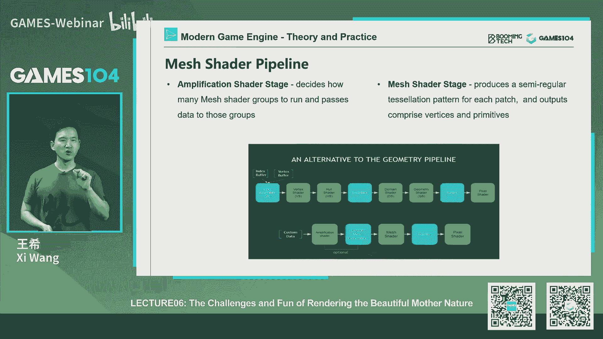
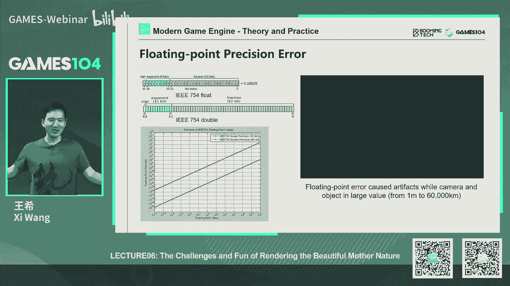

# 课程06：游戏中地形、大气和云的渲染（上） 🌍☁️

在本节课中，我们将学习如何在现代游戏引擎中渲染出宏大而美丽的自然世界。我们将从最基础的地形渲染开始，逐步深入到材质混合、虚拟纹理等高级技术，理解如何用代码和算法“创造”大地。

---

## 概述：从观察自然开始 👀

上一节课程我们探讨了游戏引擎的核心架构。本节中，我们来看看如何渲染游戏中最宏大、最美丽的组成部分——自然世界。我们的目标是理解如何将山川、河流、植被和天空，通过0和1在虚拟世界中表现出来。

这是一张真实的自然照片。我们可以看到天空、植被、河流和岩石。回到我们的主角小明，他打开自己的游戏，发现画面与真实世界相去甚远：缺乏天空与云的表达，地面植被和地形的绘制也非常粗糙。这正是本节课要解决的问题。

---

## 一、成为“大地之神”：地形渲染基础 🗻

首先，我们从相对简单的内容开始：如何绘制地形。在游戏引擎中，地形渲染一般被称为 **Terrain**。

### 1.1 高度场：地形的基石

最基础的地形表达方法是 **高度场**。它并非新概念，早在几十年前，人类就通过等高线图来表达地形的高低变化。

高度场本质上是一个二维网格，每个点存储一个高度值。左边的明暗图表达了高度，其形态与我们熟知的 **分形** 概念非常相似。自然界的山脉、海岸线、腐蚀痕迹都符合分形的自我相似规律，这个规律对程序化生成地貌非常有用。

拿到高度场后，渲染就变得简单了。最直接的方法是生成一个均匀网格，将每个顶点根据高度图进行位移，就能形成起伏的地形效果，再为其应用材质和光影即可。

**核心公式/概念：**
- **高度场 (Height Field):** 一个二维矩阵 `H[x][y]`，存储每个 `(x, y)` 坐标点的高度值 `z`。
- **顶点位移:** 在顶点着色器中，根据采样到的高度值调整顶点位置：`vertex_position.z = texture_sample(height_map, uv).r * scale`。

### 1.2 挑战：大规模地形的优化

上述简单方法在表达小型地形时可行，但对于开放世界这样数千平方公里的场景，生成海量三角形显然不可行。

观察真实地形：近处细节丰富，远处细节模糊。这提示我们可以进行优化。还记得前面课程提到的 **LOD** 概念吗？LOD 全称 **Level of Detail**，即根据物体在屏幕上的远近或像素占比，设置不同的细节精度。

然而，地形是连续的整体，其LOD切换需要精心设计，以避免产生裂缝（一个关键概念：**T-junction**）。

一个基本思想是 **网格细分**。我们真正关心的是视野内的区域。因此，可以让视野内的三角形密集，视野外和远处的三角形稀疏，并保证屏幕上每个像素覆盖的三角形密度大致恒定。

这里需要注意一个关键变量：**FOV**。FOV变窄时，相当于放大观察，地形在屏幕上占据更多像素，因此需要更密集的三角形。这正是游戏中“倍镜”效果的实现原理之一——并非真实光学望远镜，而是通过缩小摄像机FOV来实现放大效果。

**核心原则总结：**
1.  **近密远疏，FOV窄则密，FOV宽则疏。**
2.  **误差边界：** 简化网格时，要保证在屏幕空间上的几何误差不超过给定阈值（如1个像素），这样玩家就难以察觉。

---

## 二、实现自适应细分：从理论到实践 ⚙️

理解了方法论，接下来看看如何具体实现三角形的疏密分布。

### 2.1 基于二叉树的三角形细分

一个经典方法是基于等腰直角三角形的二叉细分算法。
- 初始时，将正方形网格对角线分割，得到两个等腰直角三角形。
- 当需要更高细节时，永远在直角三角形的最长边（斜边）中点切一刀，从而生成两个新的等腰直角三角形。
- 这个过程天然形成了一个**二叉树**结构。

**需要解决的问题：T-junction裂缝**
当两个相邻三角形的公共边细分程度不一致时，就会在高度变化处产生裂缝，露出背景色。解决方法很简单：如果邻居边的细分程度比自己高，那么就将自己的边也细分到同等程度，确保顶点对齐。

### 2.2 基于四叉树的地形表达

尽管三角形细分方法有效，但在现代游戏行业中更主流的是基于**四叉树**的地形表达。
- 直觉上，我们会将大地形像切豆腐块一样管理，而不是处理各种形状的三角形。
- 四叉树结构规整，符合纹理存储（也是方块）、数据管理和人的直觉。
- 通常，引擎会以一定大小（如512x512米）作为一个**区块**，再将其细分为更小的**地块**。最大的区块就是磁盘上的一个数据块，包含了该区域的高度图、贴图、植被等所有信息。

**四叉树的T-junction解决方案：缝合**
与二叉树动态调整几何不同，四叉树采用更巧妙的**缝合**思路。
假设相邻两个地块，一个细分了4次，一个只细分了2次。细分多的地块，将其多出来的中间顶点“吸附”到细分少的地块的对应顶点上。这样，就会产生一些面积为零的**退化三角形**。现代GPU的光栅化器可以很好地处理这种三角形（直接跳过绘制），从而在视觉上形成无缝的水密网格。

**核心数据结构：**
- **四叉树节点:** 代表一个地形方块区域，包含其子节点指针、LOD级别、渲染数据引用等。
- **数据块管理:** 将地形数据（高度、材质、植被）按四叉树节点组织成可流式加载的数据块。



---

## 三、GPU驱动的实时细分 🚀

现代GPU提供了强大的实时几何生成能力，使得地形渲染更加高效和动态。

### 3.1 从固定管线到Mesh Shader

在DX11时代，通过 **Hull Shader**, **Tessellator**, **Domain Shader**, **Geometry Shader** 这一套管线实现细分。这套命名抽象，流程复杂。
- **Hull Shader:** 处理控制点，生成细分用的面片。
- **Domain Shader:** 对细分后生成的新顶点进行位移（如采样高度图）。
- **Geometry Shader:** 处理细分后的顶点数据（如计算纹理坐标）。

新一代的 **Mesh Shader** 极大地简化了这一流程。它将顶点处理、细分决策、几何生成等步骤整合到一个可编程阶段中，给予了开发者更大的灵活性和控制力。

### 3.2 动态地形的魅力

当顶点位置可以在运行时于Shader中动态调整时，就能实现非常酷的效果：**实时可变地形**。
- **例子1：** 拖拉机驶过泥地，压出车辙。这可以通过简单的弹簧质点模型模拟压力，并动态调整高度图来实现。
- **例子2：** 雪地中的脚印、炮弹炸出的弹坑。这些效果可以通过在玩家周围维护一个“变形纹理”来实现，记录所有的交互痕迹，并在渲染地形时叠加这些偏移。

**核心代码思路（伪代码）：**
```glsl
// 在Domain或Mesh Shader中
vec3 world_pos = calculateWorldPosition(input);
float base_height = sampleHeightMap(world_pos.xz);
float deformation = sampleDeformationMap(world_pos.xz); // 从动态纹理读取变形量
world_pos.y = base_height + deformation;
output.position = mul(ViewProjectionMatrix, vec4(world_pos, 1.0));
```
当然，要实现完整的物理碰撞更新，还需要同步更新物理引擎中的碰撞体，这更具挑战性。

---

## 四、超越高度场：体素化表达 🧊

高度场无法表达悬空、洞穴等复杂结构。一个更通用的思路是**体素化**表达。

### 4.1 Marching Cubes算法

在三维空间规则采样，每个体素存储一个密度值。**Marching Cubes** 算法可以从这些体素数据中提取出一个等值面，生成水密的三角网格。
- 该算法非常有名，广泛应用于医学成像（CT）、科学计算可视化等领域。
- 对于地形，它需要处理多分辨率LOD下的水密性问题，已有相关研究解决了约上百种情况，但本质上仍是查表操作。

### 4.2 体素地形的意义与展望

尽管在主流游戏引擎中应用不多，但体素化表达代表了一种可能性：**完全动态、可任意破坏的地形**。就像《我的世界》所展示的，它提供了无与伦比的自由度和交互性。

作为引擎开发者，了解这种前沿方向有助于建立更广泛的知识体系。虽然当前算法和性能尚不成熟，但值得保持关注。

---

## 五、为大地着色：材质与纹理 🎨

有了几何形状，下一步是为地形赋予逼真的表面细节。

### 5.1 材质混合与纹理数组

真实地表由多种材质混合而成。基础方法是使用 **Splat Map**：一张贴图的每个通道代表一种材质的权重，通过艺术家绘制来混合。
- **简单混合的问题：** 直接Alpha混合会显得不真实，例如沙子像浮在石头上。
- **高度图混合技巧：** 在混合时，引入高度图进行比较。高度较高的材质（如石头）权重衰减更慢，高度较低的材质（如沙子）更快消失，模拟出沙子填入石缝的效果。
- **避免硬边闪烁：** 在过渡区引入一个小的**偏置**，让权重在阈值范围内平滑过渡，可以提升视觉稳定性和自然度。

当材质种类多达几十上百种时，使用 **纹理数组** 来管理。纹理数组的层与层之间独立，采样时需指定精确的索引，完美符合地表材质互不干扰的特性。

**核心Shader逻辑（简化）：**
```glsl
float4 weights = sampleSplatMap(uv);
float2 materialIndices[4] = decodeIndices(weights); // 从权重图中解码出材质索引
float4 finalColor = float4(0,0,0,0);
for (int i = 0; i < 4; i++) {
    float4 texColor = textureArray.Sample(sampler, float3(uv, materialIndices[i]));
    finalColor += texColor * weights[i];
}
```

### 5.2 虚拟纹理：性能救星

上述方法在每个像素进行多次纹理采样和混合，开销巨大。**虚拟纹理** 技术应运而生，它已成为现代地形渲染的主流。
- **核心思想：** 只将当前视野所需的地表纹理数据加载到显存中，其他数据留在硬盘。
- **实现方式：** 将整个超大地表纹理和混合结果，按照四叉树结构预计算成一系列固定大小（如128x128）的**图块**，并生成多级Mipmap。
- **运行时：** 根据视野和LOD，确定需要哪些图块。通过一个“页表”管理逻辑图块到物理显存中“缓存”的映射。需要的图块被实时烘焙（执行材质混合）并载入缓存，不需要的则被置换出去。
- **优势：**
    1.  显存占用有理论上限。
    2.  运行时渲染每个像素只需1-2次纹理采样，极大降低了带宽和计算开销。
    3.  便于集成道路、贴花等系统（它们也可以被烘焙到虚拟纹理的图块中）。

**前沿硬件助力：**
- **Direct Storage:** 允许压缩数据从硬盘直达显存，在GPU端解压，减少CPU和内存带宽压力。
- **DMA技术（如PS5）：** 实现数据从硬盘直接传输到显存，进一步缩短数据路径。

### 5.3 浮点数精度问题

当地形世界非常巨大时，会遇到 **浮点数精度** 问题。32位浮点数在数值极大或极小时，小数部分精度会严重丢失，导致顶点抖动。
- **解决方案：相机相对渲染**
    将摄像机位置设为世界坐标系原点，所有物体坐标都相对于摄像机计算。这样，在摄像机附近的物体都能享受到浮点数的小数精度，有效避免远处抖动。
- **应用：** 这在虚幻、Unity等引擎中是标准做法。对于星际旅行等超大尺度游戏，这种技术至关重要。

---


## 六、环境的点缀：植被、道路与贴花 🌿🛣️



一个完整的世界不止有裸地。

- **植被渲染：** 是一套专门的技术，涉及LOD（从精细网格到十字面片到公告牌）、批量渲染等。SpeedTree是业界著名的中间件。
- **装饰物：** 指草地、灌木、碎石等小物体，通常用简单网格或面片表达，需要处理与视点相关的旋转问题以避免“旋转草”。
- **道路系统：** 基于样条曲线生成，需要处理路面纹理、与地形的切割（挖填方）以及交叉口等复杂情况。
- **贴花系统：** 用于表现弹孔、血迹、污渍等临时性细节，可以叠加在任意表面上，常配合法线贴图或视差贴图增强立体感。

这些元素通常都可以整合到 **虚拟纹理** 的烘焙流程中，或者通过各自的渲染管线进行合成。

---

## 总结与回顾 🎯

本节课中，我们一起学习了游戏引擎中自然世界渲染的第一部分——地形渲染。

1.  我们从基础的**高度场**和**LOD**概念出发，理解了大规模地形渲染的挑战。
2.  探讨了两种主要的自适应细分方案：**基于二叉树的三角形细分**和更主流的**基于四叉树的地块管理**，并解决了关键的 **T-junction** 裂缝问题。
3.  介绍了利用现代GPU进行**实时细分**的技术演进，以及由此实现的**动态地形**效果。
4.  展望了更自由的**体素化**地形表达方式。
5.  深入研究了地表的**材质混合**技术，并引出了解决性能瓶颈的终极方案——**虚拟纹理**。
6.  提到了大规模世界中的**浮点数精度**问题及其解决方案。
7.  简要介绍了构成丰富环境的其他元素：**植被、道路和贴花**。

通过以上内容，你已经掌握了成为“大地之神”的基础知识，理解了如何从数据和算法出发，在虚拟世界中构建出坚实而美丽的地表。下节课，我们将目光投向天空，学习如何渲染“天公之神”的领域——大气与云朵。


---