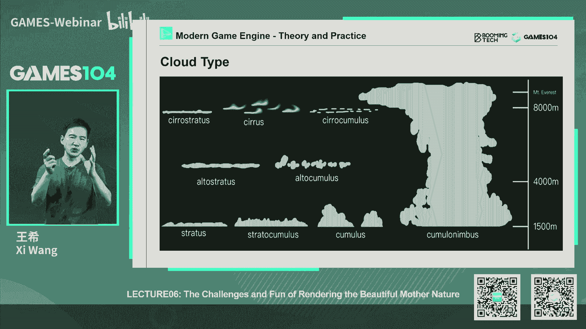
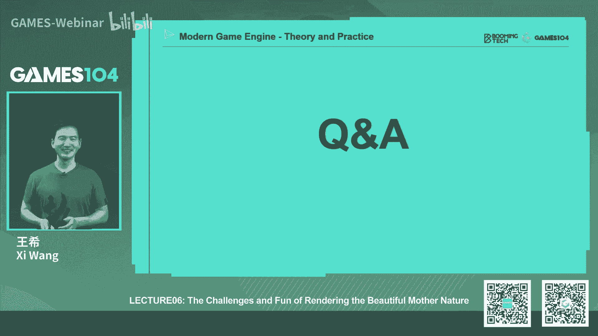

# 游戏中地形大气和云的渲染(下) ｜ GAMES104-现代游戏引擎：从入门到实践 - P1：GAMES104_Lecture06_Part2 - GAMES-Webinar - BV1i3411T7QL

## 概述

在本节课中，我们将深入探讨游戏中地形大气和云的渲染技术，包括大气模型、云的生成和渲染方法等。

## 大气渲染

### 大气模型

大气模型主要描述了光线在大气中的传播过程，包括吸收、散射和反射等。以下是大气模型的核心概念：

* **参与介质 (Participating Media)**: 指大气中的气体分子和气溶胶等物质，它们会影响光线的传播。
* **辐射传递函数 (Radiative Transfer Function, RTF)**: 描述光线在大气中的传播过程，包括吸收、散射和反射等。
* **体积渲染方程 (Volume Rendering Equation, VRE)**: 描述从观察者视角看到的场景，包括透射率和散射函数。

### 大气散射

大气散射主要描述了光线在大气中的散射过程，包括瑞利散射和米氏散射。

* **瑞利散射**: 当散射粒子的尺寸远小于光波长时，散射强度与波长的四次方成反比。
* **米氏散射**: 当散射粒子的尺寸与光波长相当或更大时，散射强度与波长无关。

### 大气吸收

大气吸收主要描述了光线在大气中被吸收的过程，例如臭氧和甲烷等物质会吸收长波长的光。

### 大气渲染算法

* **单次散射 (Single Scattering)**: 仅考虑光线与大气中的粒子的一次散射。
* **多次散射 (Multiple Scattering)**: 考虑光线与大气中粒子的多次散射，更真实地模拟大气效果。
* **预计算大气 (Precomputed Atmosphere)**: 预先计算大气中的透射率和散射函数，并在运行时进行查找。

## 云的生成和渲染

### 云的生成

云的生成主要使用噪声函数和纹理技术，例如 Perlin Noise 和 Simplex Noise。

### 云的渲染

云的渲染主要使用体积渲染技术，例如 Marching Cubes 算法。

## 总结

本节课介绍了游戏中地形大气和云的渲染技术，包括大气模型、云的生成和渲染方法等。通过学习这些技术，我们可以创建出更加真实和美观的游戏场景。