# 课程06：高动态范围成像与手机摄影 📱 | GAMES204-计算成像

在本节课中，我们将学习高动态范围（HDR）成像的基本原理及其在现代手机摄影中的应用。课程将涵盖从常见的图像格式、HDR图像融合方法，到动态范围压缩（色调映射）技术，并介绍两种经典的手机摄影算法。

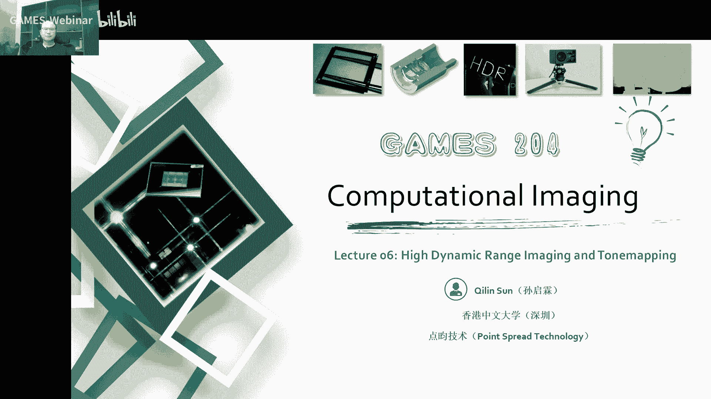

---

## 概述：常见图像格式 📁

在深入HDR成像之前，我们首先需要了解日常生活中常见的图像格式。不同的格式具有不同的特性，适用于不同的场景。

以下是几种主要的图像格式及其特点：

*   **TIFF/TAG Image File Format**：这是一种灵活的绘图模式，主要用于存储照片或艺术图像。它是一种高质量、无压缩的图像存储格式，可以显示上百万种颜色，并支持透明通道。其用途包括出版印刷、喷绘等需要高质量图像的场合。
*   **BMP (Bitmap)**：这也是未经压缩的纯位图格式。每个像素可以包含RGB三个通道，支持8位、14位等图像深度。
*   **JPEG (Joint Photographic Experts Group)**：这是日常生活中最常见的图像格式。它支持高级别的有损压缩，因此文件体积较小，便于在网络和网页上传输与加载。其编解码过程通常涉及离散余弦变换（DCT）和量化。
*   **GIF (Graphics Interchange Format)**：其最大特点是支持动态图像且文件体积小。尽管图像质量不高，但由于编解码简单、体积小且支持动画，至今仍有广泛应用。
*   **PNG (Portable Network Graphics)**：与JPEG不同，PNG采用无损压缩，并支持透明通道。这使其非常适合用作需要透明效果的图片编辑素材。缺点是文件体积通常比JPEG大。
*   **RAW**：这是数字图像传感器记录的、未经任何加工的最原始信息。它保留了ISO设置、光圈、快门等元数据，以及最原始的RGGb图像数据，类似于模拟摄影时代的底片。常见格式有CR2、DNG、ARW等。
*   **EXR (OpenEXR)**：这是一种开放标准的高动态范围图像格式。它可以存储16位或32位浮点数格式的图像，通道数量也可灵活设置。它最早由工业光魔公司开发，用于电影制作，便于后期通过多通道调整来获得完美画面。
*   **EPS/PDF**：这两种是文档和矢量图中常见的格式。EPS可直接记录线条、文字和贝塞尔曲线。PDF则是一种接近标准规格的格式，在操作、处理和显示方面均有优势。
*   **SVG (Scalable Vector Graphics)**：这是一种无损的矢量图形格式，在网页显示等方面具有优势。

---


## HDR成像基础与多曝光融合 🌅


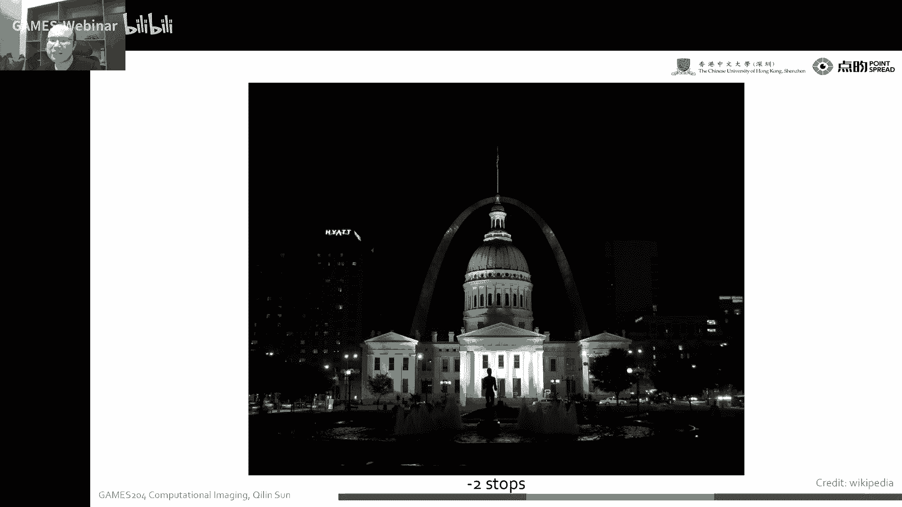


上一节我们介绍了各种图像格式，本节中我们来看看高动态范围成像的核心概念。动态范围简单来说就是最亮与最暗部分之间的比值。自然界的动态范围极大，而图像传感器的动态范围（通常为10-14位）则有限，这导致单张照片难以同时捕捉亮部和暗部的细节。


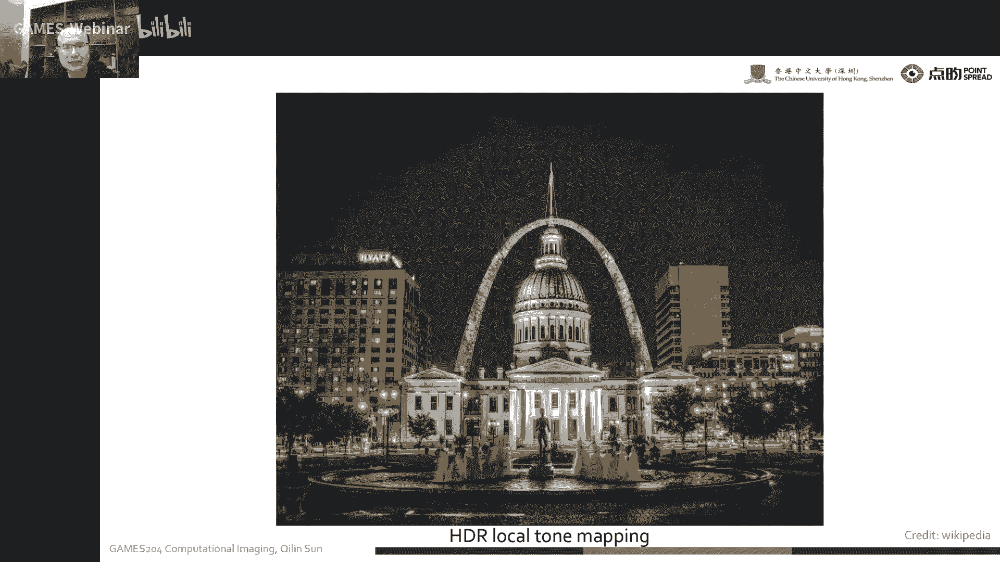

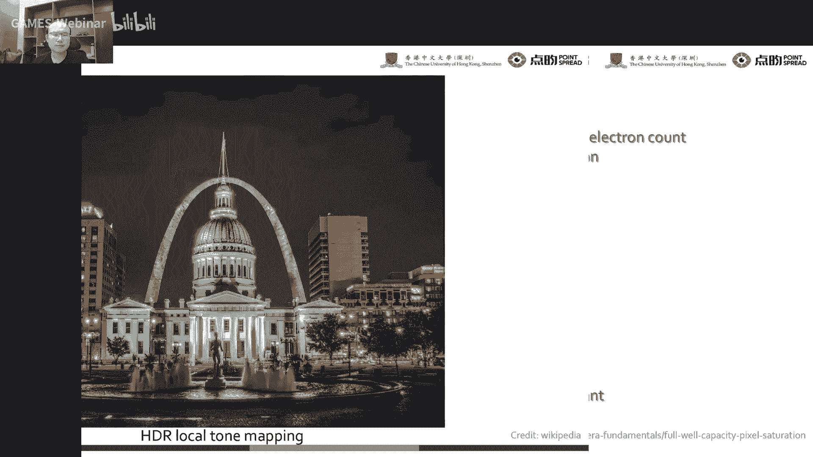

### 为何需要HDR？

传感器动态范围受限主要受两个因素影响：
1.  **满阱容量**：像素能存储的电荷数量有限，与像素尺寸相关。公式可简化为：`满阱容量 ∝ 像素面积`。
2.  **噪声与ADC量化**：系统动态范围常受噪声下限和模数转换器量化位数的限制。

为了突破单张图像的限制，最直接有效的方法是**多曝光融合**。即拍摄一系列不同曝光时间的图像，将每张图像中曝光恰当的部分融合起来，合成一张具有更大动态范围的图像。


### 多曝光融合流程

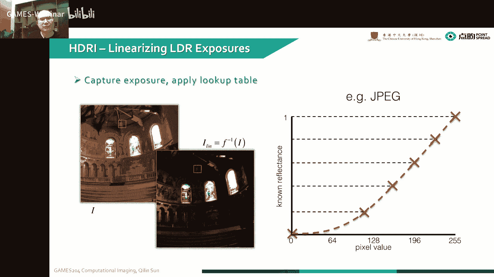

完整的HDR成像流程通常包含以下步骤：

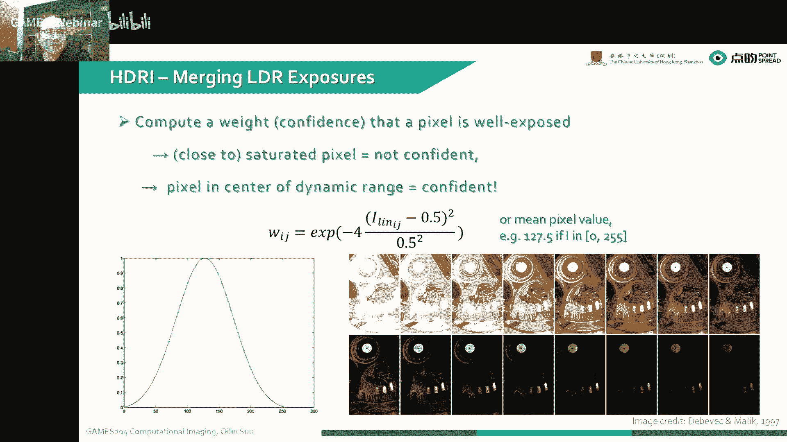


1.  **相机响应曲线标定**：将图像转换到线性响应空间。对于RAW图像，响应基本是线性的；对于JPEG等经过处理的图像，需要先进行逆变换恢复线性。这可以通过拍摄标准灰度色卡并拟合像素值与真实亮度值的关系来实现。
2.  **图像对齐**：由于手持拍摄可能存在抖动，需要对多张图像进行对齐。
3.  **权重融合**：在线性空间内，对多张图像进行加权平均融合。权重函数通常设计为高斯形式，给予中间灰度值（曝光良好区域）更高的权重。对于彩色图像，每个通道使用相同的权重进行融合。
4.  **求解HDR图像**：融合过程可以形式化为一个优化问题，目标是最小化合成的HDR图像与各输入图像之间的差异。考虑到人眼对亮度的感知是对数性的，通常在**对数域**进行优化。通过求解以下目标函数的极值，可以得到HDR图像：
    `argmin_logX Σ [w(Z_ij) * (logX_i - logΔt_j - logZ_ij)^2]`
    其中，`X`是待求的HDR辐照度，`Z`是观测到的像素值，`Δt`是曝光时间，`w`是权重函数。
5.  **绝对辐照度转换**：通过一个参考辐照度值，可以将相对辐照度的HDR图像转换为具有绝对物理意义的辐照度图。

---

## 色调映射：将HDR显示在普通设备上 🖥️


上一节我们学习了如何获得高动态范围的图像，本节中我们来看看如何将其显示在动态范围有限的普通显示器上。这个过程称为**色调映射**。

直接对32位的HDR图像进行线性压缩到0-255会导致大量细节丢失。常见的色调映射方法分为两类：

*   **全局色调映射**：使用与像素强度相关的曲线（如Gamma曲线、Reinhard曲线、ACES）进行调整。这种方法速度快，能避免光晕，但容易破坏白平衡和丢失局部细节。
*   **局部色调映射**：像素的调整与其邻域的亮度分布相关。这种方法能保留更多细节，但计算更耗时，且可能引入噪声或光晕。

### 基于亮度分离的局部色调映射


一种有效的思路是将图像分解为**基础层**和**细节层**：
1.  **分离**：使用滤波器（如双边滤波器）将HDR图像的亮度通道分离。低频的基础层包含大范围的亮度变化，高频的细节层包含纹理和边缘信息。
    ```python
    # 概念性伪代码
    base_layer = bilateral_filter(hdr_image, sigma_spatial, sigma_range)
    detail_layer = hdr_image - base_layer
    ```
2.  **压缩**：仅对基础层进行动态范围压缩（例如使用对数压缩）。
3.  **合并**：将压缩后的基础层与保留原样的细节层相加，再与原始的色度通道结合，得到最终图像。


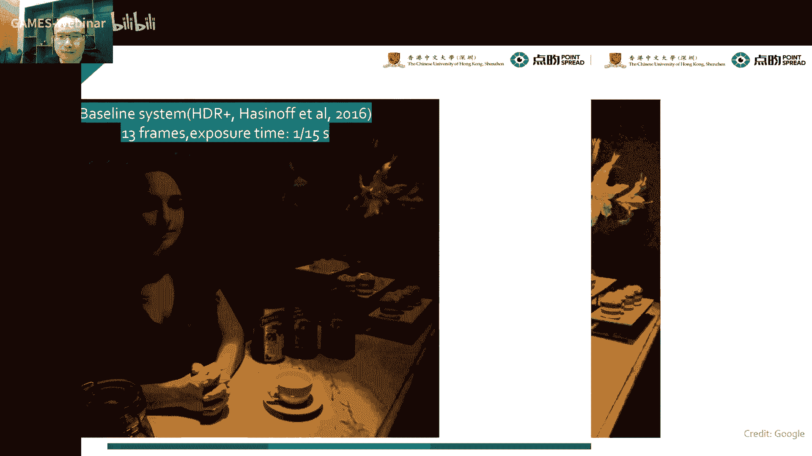

这种“低频压缩，高频保留”的思想也被应用于HDR显示技术（如局部调光背光技术），通过在物理层面控制背光的动态范围来提升视觉体验。

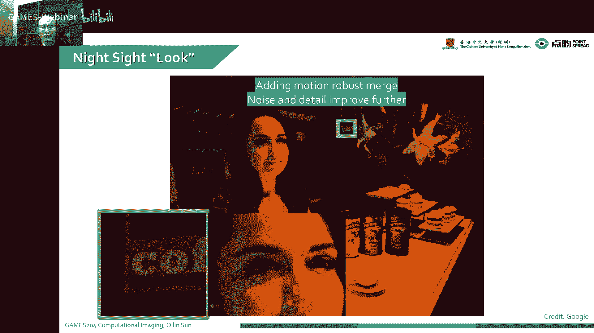

---

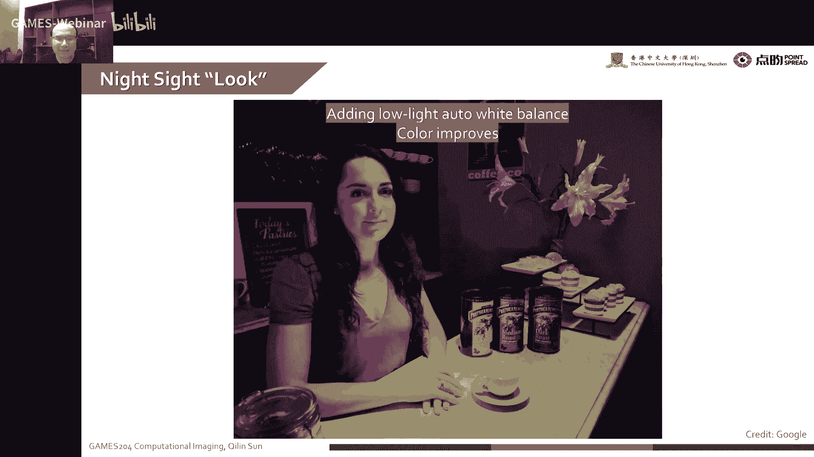

## 手机摄影中的经典HDR算法 📸


了解了HDR的基本原理后，我们来看看它在手机摄影中的具体实现。以下是两种具有代表性的算法。


### 算法一：HDR+ (Burst Alignment)

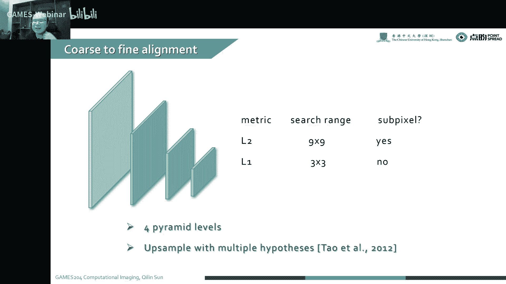

这是Google Pixel团队较早采用的经典方法。
*   **核心思想**：快速连续拍摄多张（如13张）**短曝光**的RAW图像，选取其中一张作为参考帧。
*   **关键步骤**：
    1.  **块匹配对齐**：在其他帧中，通过金字塔搜索策略，在频域（如DCT域）寻找与参考帧中图像块相似的块。这类似于视频编码中的运动估计。
    2.  **3D降噪与融合**：将对齐后的相似块在三维空间（空间+帧间）进行平均融合，有效抑制噪声。其思想与BM3D降噪算法类似。
    3.  **标准ISP处理**：将融合后的高位图像送入标准的图像信号处理器管线，生成最终照片。
*   **优点**：避免了长曝光带来的运动模糊。
*   **挑战**：在极暗光环境下，短曝光图像的噪声仍然显著。


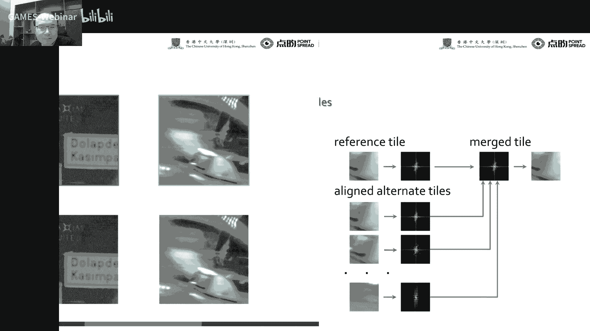

### 算法二：Night Sight (基于长曝光的改进)


这是Google Pixel团队针对极暗光场景提出的改进方案。
*   **核心思想**：拍摄张数更少但**曝光时间更长**的RAW图像序列。
*   **关键改进**：
    1.  **运动去模糊**：专门处理长曝光带来的运动模糊。
    2.  **自动白平衡**：在极暗光下，颜色容易失真。该算法使用一个小型神经网络来校正白平衡，使色彩更真实。
    3.  **融合与色调映射**：结合新的局部色调映射算法，在抑制噪声的同时，更好地提亮暗部、保留亮部细节。
*   **效果**：相比HDR+，Night Sight在极暗光环境下能获得细节更丰富、色彩更准确、噪声更低的照片。

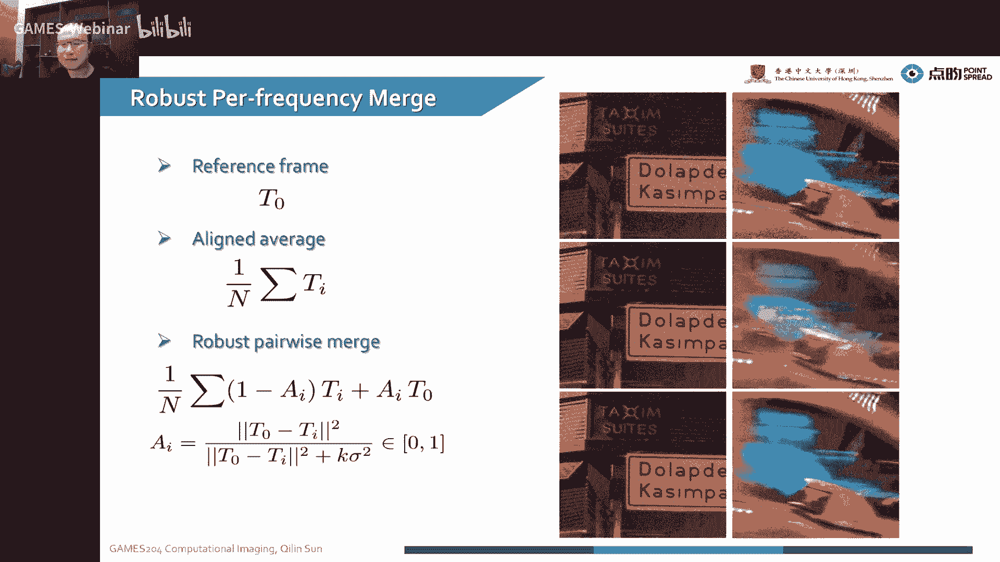

---


## 总结与作业说明 📚

本节课我们一起学习了高动态范围成像的全流程。我们从认识图像格式开始，理解了HDR成像的必要性，掌握了通过多曝光融合获取HDR图像的方法，并学习了如何通过色调映射技术将HDR图像显示在普通设备上。最后，我们分析了HDR+和Night Sight这两种在手机摄影中落地的经典算法，看到了从短曝光融合到长曝光结合先进处理技术的发展脉络。

**关于课程作业的说明：**
*   **第一次作业**：实现一个基础的图像信号处理器管线。给出的参数仅为初始值，需要大家仔细调整（如黑电平可调至小数位），以追求最佳的视觉效果。提交时请在系统内上传压缩版的报告。
*   **第二次作业**：将在第一次作业基础上延伸，实现更高级的算法（如复杂的去噪算法BM3D或Non-local Means），从而构建一个效果更优的ISP管线。
*   **后续课程**：本节之后将进入光学部分，讲解像差分析、点扩散函数设计等。随后将覆盖解调算法，并布置相应的作业。


希望大家通过实践，深入理解计算成像的技术原理与应用前景。