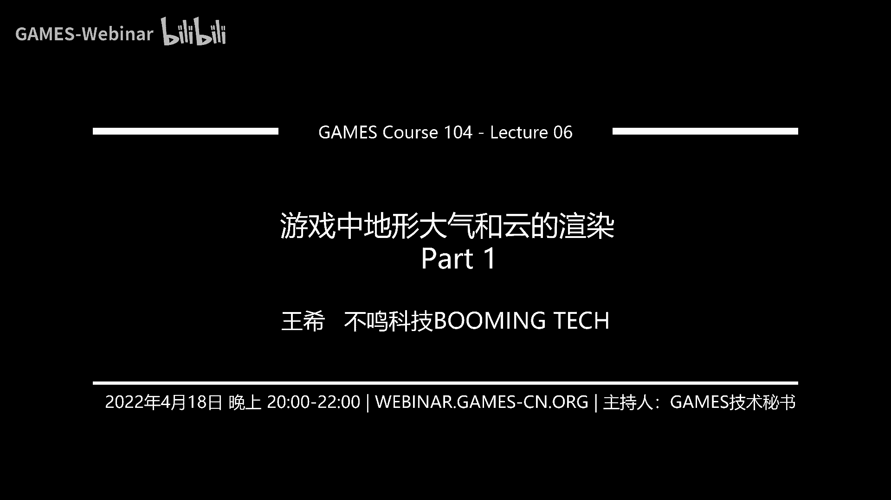

# 06.游戏中地形大气和云的渲染(上) ｜ GAMES104-现代游戏引擎：从入门到实践 - P1：GAMES104_Lecture6_Part1 - GAMES-Webinar - BV1au411y7Fq

(字幕提供：Sky Vision)。

Hello，同學們好，我是王希，歡迎大家回到那個Games 104，現代遊戲引擎的理論與實踐，那個又到了一週一次，我們大家互相比甘度的時候，課程組又爆幹了一周，幹出了這一節的課程。

那麼這節課程呢應該來講的話，我個人覺得是畫面最美的一節課程，因為我們這一節課程要講那個，就是我們大自然的一切，就是我叫Mother Nature，就是最漂亮的最好看的這個世界，但是呢。

就是我覺得這節課程呢，我寫完這個課件之後我的感受是這樣的，第一就是拓膽可能是一定的，應該內容太大，我實在沒有辦法把它壓縮在一個很短的課程中，但是呢我們總共只有四節講Rendering。

所以應該是個信息量蠻大的一節課，那麼聽懂呢我們也不能保證，因為裡面有大量的數學公式，然後這一次為了準備這個課件的話，我們很多公式都是這個現場去打現場去教研，說不定中間還有一個東西我們還沒查出來，那好。

那這節課我們在講什麼呢，就是說，首先的話呢我們這節課的內容就是講，我們如何把這個自然渲染出來，這張圖的話呢是換給大標客的，我個人覺得是非常的好看，它完美的詮釋了就是說。

我們所生活的這個planet的這個星球上面的，美輪美奐的這個世界，大家可以看到日夜變幻對吧，然後那個陽光天上的雲，然後下雨，樹木山川河流，真的是非常非常的美，所以這其實就是對於我們遊戲的這個。

研發者來講，尤其是我們Graphics Engineer，我們最大的一個挑戰，或者最讓我們興奮的東西是什麼呢，就是說，這個世界太美了，然後我們怎麼在虛擬的世界裡面，用零和一，把這個世界表現出來。

這件事情其實是非常非常痛苦的，經常是策劃說我要一個什麼東西，美術說我要一個什麼東西，然後下面的Graphics Engineer就會跑斷腿，那我們這節課呢，講的是一個Games 104的精神是什麼。

教大家如何做遊戲引擎，而不是教大家如何去，用現有的引擎做出這些效果，如果你要學效果是很簡單的，但是你要是做引擎的話，那我們就需要知道，它下面到底有什麼，那麼這個世界對這個世界的理解呢。

我們首先從觀察開始，這是大家看到的這一張，那個真實世界的照片，那在這個照片裡面的話，我們可以看到很多東西對不對，我們可以看到天空，看到大量的植被，看到這種河流，看到這種，就是這個大量的這種小溪啊。

石頭啊 亂石這些東西，那麼回到我們的故事的主角，大家還記得小明嗎，我講了上一節課基本上沒有提小明的名字，但是我們的小明同學還是非常想，把他那個能把《幹翻2042》的這個遊戲給做出來。

那他今天打開自己的遊戲，他看到的情況是什麼，哎呀 實在是差得太遠了，對吧 你看，我們好像很缺那個天空，以及天空中的雲的表現，而且呢，我們地面上的植被表現得非常的差，那我們呢。

還可能那個地形也繪製的特別的差，那這就是今天我們這一節課，要解決的問題，那麼好，我先從一個相對簡單的東西開始，先教大家怎麼去畫地形，這是一個油畫，我今天所有的section，我都是以這個油畫開頭。

為什麼呢，因為確實是啊，就是寫到繪製和渲染這一part的時候，人就會忍不住的覺得失信大發，因為確實是非常非常的美，而且從幾個世紀以前吧，上千年以前，我們的祖先看到這麼美人文化的世界。

他們就有一種強大的這種表達欲，比如說我自己個人是特別喜歡，像西班牙那個洞穴裡面的那個，就是那個原始人畫的那個岩畫，包括畢加索的那個繪畫也是受他的影響嘛，因為我覺得人類對這種自然界的這種喜愛。

那種表達是一種本能，所以當我自己成為了一個有性引擎的研發者的時候，我覺得這件事情是非常快樂的，所以這次這個課程的標題啊，我取成就是說，就是啊，是痛苦challenge，但是呢，又是樂趣去表達自然之母的。

他的美，那麼其實呢，在我們的遊戲的引擎團隊裡面，我們會經常會把同學們根據他做的事情不同，我們進行分工，比如說在我們的團隊裡，我們有一個有幾個同學，我們叫他什麼呢，叫大地之神。

就是如何你把大地上的一切表達的足夠美，那還有些同學我們叫什麼呢，叫天公之神，對吧，那就是如何把天上的天光雲表現的特別美，那這種稱號真的不是說我們編出來的，而是團隊自發給他取的。

因為我們這樣的這些技術apply上去之後，真的會讓整個畫面讓我們都非常的喜歡，所以呢，我們的第一趴先從如何做大地之神開始，那首先給大家上兩張美圖啊，就是這個是這個微軟的飛行模擬器。

大家知道最新一代的微軟飛行模擬器是喪心病狂，對吧，這個我忘了他的，他的那個整個package有多大，好像是接近一個T吧，就是你是沒有辦法把它裝到一個一個一張盤裡面的。

他是整個要不斷的就是你像買了這個遊戲之後，不斷要streaming data，他跟那個病的二次地圖整個連接在一起，像這麼大的一個世界，這麼多樣的地球的地貌，他能表達。

這其實就是遊戲引擎的現在對於terrain的彙整能力，哦，這裡面跟大家八卦一下，什麼叫terrain，terrain這個詞好像是這個古代英語中的這個就地球，Earth 地球之母的意思。

大家如果玩那個星際爭霸的時候，就知道有一個種族好像就叫terrain，就是人族，對吧，就是其實我還蠻蠻喜歡這個詞，因為這個詞總讓我回想到上古的神話，所以的話地形在遊戲引擎裡面，就是在遊戲的彙整裡面。

我們一般叫做terrain，那麼這是微軟的飛行模擬器，那我們這個技術只是在彙整地球嘛，那這裡面要點名另外一個遊戲了，就是無人升空，對吧，這個遊戲當年曾經是欺騙了我們很多人的感情。

但是我還是非常敬佩這個遊戲的studio，就是他們不放棄一直在往前去越做越好，那我們可以發現就是說這樣的一個技術，他不僅要表達Earth-like的這樣的一個世界。

我們還表達就是non-Earth-like，就不像地球的這樣一個世界，對不對，很alien的就是那很外星的地貌，比如現在大家特別想做那種火星地貌，對不對，比如說金星上的那種大裂骨這種感覺。

其實都會讓人覺得特別的fantasy，所以這也是我們的地形繪製技術要表達的東西，那麼就是Games10刺客的傳統精神是什麼呢，咱們先從最簡單的開始，如何表達地形，那麼最簡單的是什麼呢。

就是這個height field叫高層圖，那麼這個height field的這個東西，它不是什麼新的東西，其實早在幾十年前，對吧，我們人類還不會有這個計算機遊戲的時候，其實我們的社會。

它就已經能夠用叫counter叫等高線，它已經能表達出我們的地形地貌的高低的變化，比如說大家看那個過去的戰爭片裡面，那些將軍面前都擺一個高清晰度的這個沙盤，包括人造衛星對地球的掃描。

它也掃描出這種高層圖，大家看在這個圖的左邊，有一個用明暗表達的這個高度的圖，大家看這個圖像什麼呢，其實像不像那個，特別是它右邊的等高線圖，我相信大家仔細觀察，它像我們在以前學的一個什麼概念，叫做分形。

分形是什麼，大家都知道這個概念，就是它可以無限的放進去，無限的自我相似的這麼一個形狀，其實大家如果學自然界的一切，無論是一片雪花，還是我們的海岸線，還是我們的山脈的走開，它其實包括山脈上的這種腐蝕。

它都是符合分形的原則的，這個規律其實是非常有用的，因為我後面會講的，就是如何讓計算機，幫我們自動生成各種各樣的低貌，其實這個數學規律是非常有用的，那麼實際上的話，當我們得到了一個地方的。

它的高層圖的時候，實際上我們對它的渲染，就會變得非常的簡單，那麼這個就是這個Hide Field的話，這個技術非常的簡單，但是大家可能想像不到，如果它和紋理和光影去配合的時候，大家和材質配合的時候。

你看這個效果，這兩張圖是我從Artstation下載下來的，其實我自己也是非常驚訝的，因為在我的印象中，Hide Field是一個相對比較古老的技術，但實際上我發現真的是勢在人為，就是說你真的用得好。

它的表現力還是非常的強，這也是為什麼到今天，Hide Field還是在現代遊戲裡面，地形渲染的主力的方法，那麼拿到這個Hide Field，我怎麼去渲染呢，其實最簡單的方法，我們每個一米對吧。

或者每個半米，我做一個均勻的網格，那麼這個時候我把每個頂點，根據我的高層圖把它進行位移，實際能形成我們想要的一個地形的效果，對不對，是不是非常簡單，而且我在上面Apply它的各種，比如說高度它的材質。

這些屬性就可以了，但這個方法我相信我們的同學們，很快就知道它是有問題的，為什麼，如果我要表達一個很大很大的世界，比如說大家特別喜歡樂見的，叫開放世界，那麼這個方法顯然是不行，如果我們表達一個一公里。

那1000×1000，比如說一米一個格子，那我1000×1×2，那我是這個200萬個三角形，現在計算機覺得還可以沒問題，但是如果我要表達一個，幾千平方公里到上萬平方公里的時候，那顯然是畫不了的。

但是我相信就是說，大家很快就會發現說這個事情並不難，你看我們觀察這個地形，在近處可以看到無數的細節，遠處我看不到細節，那麼這個地方顯然就是有大量的，這個空間可以去優化，對吧，大家記得我們在前面的課程中。

給他一直在講一個概念叫做LOD，LOD其實怪我一直沒跟大家講，它的概念是什麼，LOD全稱叫Level of Detail，就是說根據那個我的觀察，它的這個它在我屏幕上，這樣的這個像素或者是遠近。

或者我對它的信號的敏感度，我可以設置不同的它的這個就是細節，細節精度，那麼顯然在這裡面是有Level of Detail的空間，但是不同於我們在前面去講的，各種遊戲裡面的object。

大家還記得Game Object的概念嗎，那這些東西我到遠處的時候，比如說我切換成一個更低精度的模型，沒有什麼太大問題，對吧，你就切就好了，但是地形它有個小細節，就是它是一路連續過去的。

待會我們會跟他講一個概念叫T-junction，所以說它的LOD是要用心去設計一下的，這裡面的話先跟大家講一個最簡單的一個思想，就是那個Mesh的Tessellation。

就是說我對這個網格進行不斷的細分，Tessellation這個詞就是細分三角三角網格化，那麼這裡面大家看到一個很有意思的問題是什麼，就是當我在遊戲中的任何一個時候，我看過去的時候，並不是360度看的。

對不對，其實我們看到的一個東西，只是一個眼睛看到的一個展開的一個追提，這個追提叫什麼呢，叫FOV，叫Field of View，我們會發現就是說，實際上我們真正關心的是在這個FOV裡面的東西。

而不是在FOV外面的東西，所以你可以發現就是這裡面已經給大家，就是提前洩露我們的方法的結果了，就是你會發現在FOV裡面的這些三角形，就會被很細密的去細化，我們會看到很多的細節，但是呢。

FOV外面的和遠處的，我們會把它這個三角形分佈的非常的稀疏，這個效果你其實是看不出來，因為我會保證就是說，在屏幕上每隔多少個像素，你看到的三角形，這個密度永遠是一致的，這個在數據上我們是可以做得到的。

那這裡面也跟大家講一個經常大家容易犯的一個錯誤，就是最早大家剛開始在寫這個，就是那個地形的Tessellation的時候的話，很容易會忘記一個變量，就是FOV就是視角。

因為就是說大家看到在這個圖的另外三個的話，你會發現就是它的FOV越來越窄，越來越窄，你會發現，為什麼當我的FOV越來越窄的時候，我的三角形會越來越細密呢，大家想想這裡面是不是有一個原理，其實很簡單。

就是說，當我的FOV越來越窄的時候，是不是在屏幕上，我們看到的效果是什麼，實際上是這個地形會放得越來越大，這個效果在什麼時候很有用呢，大家不是經常喜歡打這個，比如說我們打PUBG打吃雞遊戲。

吃雞遊戲中大家最想獲得的裝備是什麼，就是幾倍鏡三倍鏡八倍鏡，那這個三倍鏡八倍鏡zooming的效果是怎麼實現的，實際上並不是真的，我們做了一個光學的望遠鏡，實際上我們只改了一個很小的東西。

就是把攝像機的那個參數FOV變小了，這樣的話，你的這個在屏幕空間的話，一下子那個東西就放得很大很大，但是呢，你犧牲到的東西是什麼呢，是你看的視場變小了對不對，所以說會讓你的光眼睛更聚焦。

所以在這裡面的話就是說，當我們決定啊，就是其實不僅是這個地形，包括遊戲裡的物體，我要繪製它的時候，它的精度多少的時候，我們不僅要考慮它的遠近，還要考慮到它的FOV，就是以原則上來講，就是越高倍的望遠鏡。

它的FOV就越小，大家其實在現實生活也是這樣，你們可以試一下，戴上自己的望遠鏡，你會發現你觀察的角度會越來越窄，那麼這個東西最科學的一個解釋就是說，假設你的屏幕是同等像素量的話，那麼每一個三角形。

它在小的FOV下，佔的這個像素量就會增加，所以這個知識的話，我希望同學們一定要就是牢記在心，否則的話，你將來很容易寫出一些bug，好，那有了這樣一個基礎知識的話，我們其實就可以對網格進行簡化了。

這裡面跟大家講兩個基礎的原則，第一個原則，其實在上一頁已經講完了，就是說，我們採取近處密一點，遠處稀疏一點，FOV越窄，那我就密集一點，FOV越寬放，我看的那個面越寬的話，我是越來越那個。

就是說我也稀疏一點，那麼但第二個原則，其實是一個比較麻煩的原則，我們叫做Error Bound，就是說，這其實是我們在數學上保證說，當我對這些網格進行，無論是簡化合併的時候，因為我的採樣點變少了。

那我導致的定型高低之間的這個誤差的話，不要超過我一個給定的域值，但注意啊，這個域值實際上指的是在視空間上，也就是說，比如說你的誤差是0。1米，10厘米，那麼如果在距離你，比如說10米之外的地方。

你還是能注意到的，對不對，但是如果在距離你100米之外的時候，其實你注意不到，1000米之外的話，你可能根本注意不到了，對不對，那麼所以呢，我們要保證就是說在屏幕上，你的那個是不要超過，比如說0。

1個像素，或者是一個像素，對吧，理想情況下是只要不超過一個像素，一般人是注意不到的，所以這個呢，也是一個數學上，如果大家真的下去寫這個地形的這個adaptive tessellation。

就是說基於view的，哎呀不好意思，這個地方真不知道中文怎麼講，就是基於view的dependent的這個adaptive tessellation的時候，大家會把這兩個重要的原則引入，好。

那基本的方法論我們就知道了，對不對，我相信我們的Games104的同學們應該很聰明，應該能理解這件事情，接下來呢，跟大家講一個非常簡單的起活方法，就是到底怎麼去把這個三角形變得疏密相間，其實呢。

最簡單的做法就是三角形的鋪分，基於triangle的這個鋪分，那麼這個方法呢，也是一個非常經典的方法了，就是說，哎，大家可以看到就是我們一開始的地形是一個個的格子，對吧，我在格子中切一刀。

它就變成兩個等腰直角三角形，然後呢，它這個算法就要求說，如果你覺得你的密度不夠，你永遠在它的最長那一邊，等腰直角三角形，大家說最長的那一邊是哪，是不是直角對著那條邊，在那個邊中間找一個點給它切一刀。

那這一刀下去的話，大家是不是得到了兩個等腰直角三角形，對吧，所以它的整個這個算法的核心要求就是，你永遠把一個等腰直角三角形的最長一邊切一刀，這樣你永遠得到的是，就是二兩倍的那個兩個的新的等腰直角三角形。

那麼這個結構是個什麼結構呢，這其實是一個二叉數的結構，所以這個方法也叫做binary，這個triangle based subdivision的方法，具體的那篇paper的話呢。

我們在後面那個pdf那個link上會給大家分享，那麼這個方法的話呢，其實它會產生一個很有意思的細節，這就是我們在講我們在做地形的時候，這個大家一定要學會的一個黑話叫做T-junction。

這個詞聽上去是不是特別的高大上，實際上它非常的簡單，就是說當我兩個相鄰的三角形在同一條邊上，有一個三角形的話呢，這條邊沒有被切分，它就是一條邊拉直了，但是它另外相鄰的幾個三角形的話呢。

在那個邊上它拉出了一個點，那麼這個中間的一個採樣點的話，因為它中間就是它的高度會變化嘛，那這樣的話它會導致它兩個之間的這個就會產生一個誤差，就會你會看到地形上有個裂縫，對吧，那麼這個裂縫的話呢。

就是說如果大家在做這個就是地形的這種testation的時候，如果你不去處理T-junction的話，你會發現那個地形看著大致都是對的，但遠遠的總有很多地方露出那個白邊。

因為你露出的都是無窮遠的天空的顏色，所以的話呢，這個是graphics engineer很早就去鬥爭的一個東西，那它的算法難不難呢，其實也不難，其實非常的簡單，就是說如果你發現你邊上有鄰居。

這個它的對那個邊的切分比你密，那你沒辦法，你就開始把這個邊也給切掉，直到切到跟它的那個切分數是一樣就為止，這個具體的算法呢我就不展開，但是它基本的思想就是這個思想。

所以說因為一個最簡單的一個二叉數的結構，然後呢，我永遠用無數的等腰直角三角形，我就能拼出就是在前面那一頁大家看到的這個mesh，對吧，這個mesh的話就是一個很典型的，大家看到沒有。

那個高亮的區域就是你的view能看見的區域，那個黑色的就是你沒有看不見的，就這個view好像有點大，一般我們遊戲中的view沒有那麼大，這個view大概接近於已經快135度了，一般來講的遊戲裡面。

我們view很多時候做到大概70到80度左右，好那麼這就是一個最簡單的一個方法，但是呢，這個方法實際上在我們的遊戲行業用的不是特別多，那麼這裡面的話呢，首先這個方法是很有意思的。

就是說這裡面有一個有unity做的一個demo，這個demo的話呢，它大概是50乘50的平方公里，這個面積很大了，50乘50那就是2500萬平方公里了，2500萬平方公里了。

那麼它用這個tranql在GPU上直接跑出來了，所以這個方法本身的效率啊，繪製啊，都沒有問題，特別像這種一望無銀的這種地形的表達，但這個方法呢，其實是有一個很嚴重的問題。

就是說它無論是對這個地形數據的管理，包括它這個中間的剖分算法，其實呢，不符合我們在製作地形的一個直覺，大家想像一下，我給你一個很大的地形，你最天然的思想是什麼，你是把它切成豆腐塊對不對。

你是願意處理一群豆腐塊呢，還是願意處理像那個七翹板一樣，各種各樣的三角形，所以呢，實際上啊，在現代的遊戲中啊，大家用的最多的還是基於四差數的，這樣的一個地形的表達，這個方法就非常的直覺了，大家看就是說。

我們給你一個比如說128米，或者比如說128公里乘128公里的一個大地形，我就把它開始不停的切切切切切切到最後，比如說吧，很多遊戲引擎它是以512米乘512米，大概半公里左右。

為一個我們叫做一個block對吧，然後呢一個block呢，我在切比如說切成16塊，那麼比如說是一個64米乘64米的，我們說這是一個就是patch，就是各種各樣的，你這個名字隨便你取。

但是它核心的都是說符合這個四差數的結構，然後四差數呢，它的結構也是非常的規整，所以呢，我們呢可以對它進行就是各種各樣的就是說處理非常方便，那麼它還有一個很大的好處是什麼呢，你這邊的一個個的。

比如說我們一個block512乘512，大家想像一下，我們在計算機裡面存儲紋理是怎麼存儲的，是不是好像也是一個小方塊的texture，你見過什麼時候大家把一個三角形紋理往裡面漏的對吧。

那這樣就意味著是說，我有一半的存儲空間就浪費掉了對不對，所以說這個時候如果我用D塊的方法去管理我的地形，比如說我的height field呀，我的這個材質貼圖啊所有的東西的話。

是不是這個基於這種方塊的quad的方法，是不是更加符合你其他所有的數據的規範，實際上呢這也符合人對世界認識的規範，大家去看那個，比如說我們很多地方畫那個行政區啊，畫大家的分工啊都是打個子。

這符合人的natural，所以說這也為什麼Culture，是成為現在最主流的一種地形的數據表達方式，那麼它的那個算法呢，就這裡面有一個demo，你看這是一個用Culture表達了一個地形。

那麼呢最上面就是說我們是非常這個，很多很小的一個一個quad，這個大概可能是比如說是100多米乘以100多米，60多米乘60多米，但是呢你可以把它們兩個，四個四個一合四個四個一合。

你分到了那個最大的那個塊，那個塊在有的引擎裡面我們叫做block對吧，有的引擎叫做什麼patch，whatever叫什麼名都可以，但是呢你到這個至上的時候我們就不再合併了，一般來講的話呢。

這個就是一個非常那個規範的，一個就是磁盤上的數據塊，就比如說我把一個512乘512米的這樣的一個地形，它的head field它的貼圖，它的比如說植被啊樹木啊建築啊全部打包到一起，就是這個地塊我看到了。

啪我就把所有的數據load上來了，那麼你可以看到就是假設以中心點為中心的話，它的顏色一直在變化就表示，我在那邊對它細分的精度一直在變，所以這個方法的話，實際上大家如果真的在做自己的引擎的話。

我是非常推薦大家實現的方法是用quadray的方法，而不要用全構的方法，因為全構方法它只是一個rendering方法，但這個quad的方法呢，它其實暗含了資源管理的邏輯在裡面。

包括我們下面要講到的另外一個大名鼎鼎的，叫virtual texture對吧，就是虛擬虛擬紋理的這個方法的話，就是基於這個quad的方法去做的，好那麼其實呢，這個quad的方法呢。

跟那個三角形的方法也是一樣的，它也會產生這個T junction，就是這個地形的裂變，比如說我左邊的這個東西我切了四刀，對吧我右邊切了八刀，那四刀和八刀怎麼辦，那這個時候呢我要講一個很有意思的細節了。

這個其實是一個非常聰明的一個方法，就是它不再像那個三角形的binary tree的方法說，那不好意思既然你這個你這邊，已經這個切了這個刀術比我多，那我只能在自己身上再砍幾刀，保證我跟你的一致對不對。

這其實就意味著什麼呢，你要動這個幾何的turb結構，這件事情其實是很麻煩的，大家如果你如果真的寫過這個代碼的話，你就會發現這很麻煩，但是呢就有一個大神很genius的想了一個方法。

什麼意思呢就大家看我們的那個右邊的這個圖，假設兩個quad連的很近對吧，那麼你會發現就是說一邊切了四刀，一邊呢只切了兩刀，那他對不上了對不對，他提出了一個方法叫做stitching。

stitching這個詞的意思是什麼呢，就是吸附上去，大家你們在有時候在編輯器裡面，比如說大家如果用vso對吧，或者用一些寫powerpoint的，你會發現當你移動一些空間的時候。

當他靠近那個對齊的點的時候，他就會啪就吸上去了對不對，這個其實就是stitching，那麼這個方法是怎麼做的呢，其實很簡單就是你不是比我多了，比如像剛才一樣，你不是比我多了兩個中間點嗎，那我很簡單。

既然你要和我做鄰居，我這邊只切了這個就是說兩刀對吧，你這邊切了四刀，那你多出來的兩個中間點，你把它stitching到我上面去，大家看第二張圖就是，我先把上面的多出來的那個中間點，我把它移到上面去了。

那這樣的話實際上呢，這個三角形就是那個點，實際上和上面那個點重合了，你就變成了一個就是實際上是面積為零的，一個三角形對吧，它不會影響到這兩個之間的那個，這個就是watertight的，我們叫做水泥性。

這個三角形叫什麼呢，在圖形學裡面我們叫做退化三角形，這個大家如果寫，自己寫過這個圖形學的管線的時候，你們假設寫自己的Rasterizer，你一定要處理這種退化三角形的情況，就是面積為零，我怎麼去渲染它。

我到底是給它一個像素呢，還是什麼都不給呢，好像是，我記得好像是我以前的實現是啥也不給，我就不畫你了，因為你反正面積為零嘛，那麼如法炮製，下面那個多出來的那個切分點，我把它吸附到下面那個點。

其實呢這個你吸附到上面吸附到下面影響並不大，但是呢你這麼一吸附完之後，你發現整個這個Mesh就watertight了，大家有沒有發現，就是用quadtree的這個思路的話。

我去解決這個Tjunction，實際上是非常簡單的，就是如果大家寫過這個code就會發現，這個代碼是比剛才那個代碼好寫，剛才那個代碼其實挺麻煩的，而且你可能會切好幾次，假設兩邊的話。

它有一些很奇怪的形狀嘛，它有一個規則類表很麻煩，所以這是一個非常好用的實用的一個數據結構，那麼你有了這樣一個東西的話呢，同學們想去做這樣一個地形的話，理論上你就能表達出來。

這個的話呢好像是Far Cry的這個地形，對吧大家看到這麼漂亮的地形，它就是用quadtree去做的，怎麼樣，好像我成為這個大地之神，是不是覺得離自己並不是特別遠了，對吧，好我在講的這一part呢。

實際上是這個怎麼說的，是讓大家心安暖暖熱熱身，就大家覺得這個問題我可以學，好接下來呢我們要講一些真正高能的東西了，那麼好，那這個，這part還是比較簡單的，就是說OK，除了像剛才我用那個三角形。

我用規範的這個grid去表達地形呢，其實還有一種方法，這種方法用的其實不是特別多，但是呢我覺得在現代的一些前沿遊戲中，還是有人用，所以我覺得今天我來跟大家講一下就是這個，我用不規則的三角形去表達地形。

就是我首先地形我還是用Hide Fill做出來，它的密度非常高對吧，但是呢你會發現如果我的地形中，有很多的區域是平的，你無論用那個grid還用什麼方法，我還是會浪費很多三角形。

它索性呢就是用Mesh Simplification，就是面片簡化的方法，我把一些不必要的頂點全部簡化掉，但是我會把一些頂點，把它align到這個feature上，大家可以看到就是說。

對於這樣的一個就是沙漠的這種地形的話，有大面積的平的區域，那麼它其實用到的那個頂點數的話並不多，這個右邊就是它簡化完的這個網格，那麼這個方法呢其實，我看到最新的用處用在哪兒呢。

是用在那個好像是《現代戰爭》吧，《Mortal Warfare》裡面，就是它因為有很多在沙漠地區作戰，它發現就是說無論用剛才的那個三角形，還是Cold Tree的這個方法，其實都沒有意義 對吧。

我提前就把這個地形給你簡化好了好不好，我就 你看可以看到就是說，這是它簡化完的一個結果，這個面積其實很大，你會發現它中間有很多很大的很長的三角形，你不會發現它很多的頂點簡化完之後。

很巧妙的正好align到那個，一個個突出的山脊上面來，這個呢大家以後後面，學那個就是幾何的簡化的時候，就是Mesh Simplification的時候，大家可以學到一些算法去解決它，這裡面我們不展開。

那麼這個事情非常有意思，就是說這個方法它呢實際上很麻煩，你需要做預處理，而且呢你實際上是不能，就是你在Runtime的時候是很難對它進行調整的，但是它有個好處是什麼呢，就是它在很多情況下。

畫的三角形數量，比我們剛才前面講的兩個方法要少，你比如說在這個，他們自己取的這個例子就是，如果他們用這個就是，我們的這個Mesh的，就是Cold Tree的LOD的話，它大概要畫50多個面。

它自己畫的面就比那個要少很多，幾乎少了接近一個數量級，所以你會發現就是遊戲引擎設計啊，它為什麼比較難，就是你根據你不同的內容的需求，它確實它的算法一直在變，那麼這個就是非常有意思的一個算法。

我其實這裡面我想考大家一個問題，就是說，為什麼我那邊也實現了，就是這個View Dependent的採樣，為什麼我最後的三角形數量比它還要多呢，對吧，這個其實挺難，但簡單來講的話呢，實際上是。

你在那邊的採樣是一個叫等間隔的採樣，它不能保證我的每個採樣點，正好align到你的這個數據中的信號中的這個，就是什麼呢，就是我叫做，就信息量比較大的地方吧，這個真的不知道怎麼用簡單的語言去想，所以呢。

它的採樣率，它的採樣效率肯定是低於，你為這個特殊信號定制的這個採樣，這個其實大家如果學那個信號和系統的話，是能夠知道這個概念的，但是這個方法的話呢，我覺得大家只知道就好了，並不需要真的去實現的。

因為我看了一下，好像只除了幾個特殊的遊戲會用它的話，一般來講大家都不會用這個技術，好，這些呢就是我們的地形的方法，那有了剛才那樣的一個Culture表達的時候，大家很天然想到的東西是什麼，誒。

我能不能用現代的這個GPU，對吧，從我的Rendering的第一節課我就大講特講，現在的GPU確實是我們作為一個Graphics的Programmer，for game engine的話。

我們最好的夥伴，最好的戰友就是GPU，就是顯卡，那麼顯卡現在提供了大量的這個就是說，在這個Runtime幫你去做幾何的細化生成的東西，所以呢，實際上現在遊戲引擎啊，基本上都是用GPU based的。

就GPU driven的Test solution的方法，在很古老的時候，十幾年前，二十年前的時候，剛才大家看到這些網格，真的是要我們程序員全部build好，然後呢。

把頂點想個辦法在Shader裡面hack一下，然後呢一個個的一個一個一個把它拼起來，但是現在的話呢，基本上全部是在GPU裡面自動完成了，那麼這裡面的話呢。

講GPU based的Test solution的話呢，就不得不提提我們大名鼎鼎的，從DX11來的這個叫做Hole Shader，對吧，Domain Shader，還有Gemmage Shader。

實話實說啊，這個實際上是我個人最不喜歡，那個DirectX或者上一代的圖形Driver的地方，因為這幾個，首先從這幾個Shader的名字，我就覺得特別的反人類，實話實說我每一次只要我有幾年沒碰它的話。

我就已經完全忘了這個，哎呀Hole Shader到底幹什麼的，這個Domain Shader幹什麼的，對吧，Gemmage Shader幹什麼的，其實非常的抽象，那麼實際上呢，他們做的事情呢。

實際上是為了我們做這個Subdivision Surface，去做的一個東西，比如說你像那個Hole Shader的話，它實際上是生成了一個Subdivision用的一個Patch，那這個Patch呢。

就是Patch你可以理解成就是一小塊的這個這個三角形，或者不叫三角形，就是一小塊的起合區域，這個區域呢，它是有一些控制點，控制，就是這樣的話，我能夠劃平為凸，對吧，就是比如說我一個一個Cube的平面。

我可以變成一個很光滑的球面，同時呢，它這個Shader還要寫兩份，一份是告訴各個Control Point的數據，那麼還有一份是什麼呢，就是我現在看到的這個起合形體，如果你是三角形也好。

如果你是一個Quad，是個四邊形也好，你得告訴那個Tessellator說，你把我的邊Tessellated多少次，然後呢，這個時候交給一個硬件的固定排法叫Tessellator。

它會把這個QuadTessellated成很多的細密的三角形，如果看這個圖的往右邊走一點的話，你看到那是Tessellated後的結果，這個時候呢，就上了一個著名的叫Domain Shader。

這個名字實在是，我個人覺得是真的是莫名其妙的一個名字，然後呢，它其實幹了一個事情是什麼呢，就是說，你這些點，你的新的插入的這些頂點全部拿到之後，我可以根據比如說我採樣一個高度圖。

我把這頂點的位置移動一下，對吧，這樣的話我就能形成我們想要的那樣的一個起伏的東西，其實呢，這個時候它後面還有一個東西叫Geometry Shader，什麼意思呢，就是你這樣已經被動過位置的頂點了。

它再送到它的下一道流水線，在這裡面幹嘛呢，其實呢，就是把我們經典的Vertex Shader那些東西再算一遍，比如說我的Texture UVR，我的一些需要傳遞到每個像素的一些數據再走一遍。

其實我個人是非常不喜歡這三個名字的，我自己經常覺得那個Geometry Shader，我更願意叫做Post-Tessellation Vertex Shader，對吧。

就是Post-Tessellation Vertex Shader，對不對，我也一直不理解為什麼你要把Domain Shader和Geometry Shader分成兩個Shader。

反正就是這個事情讓我痛苦了快10年，所以我每一次只要不寫這個代碼，我基本上就忘記了，但是呢，你還不得不用，為什麼，因為你一旦要做地形，還有做一些高級的東西的時候，你還真的離不開它，但是呢，非常非常感謝。

最新一代的GPU的發展，終於這個世界人民喜大普奔的事情發生了，就是說我個人非常蠻喜歡的這一代的這個Mesh Shader的概念，就是一個Mesh Shader，它基本上把剛才所有要講的活全給幹完了。

就是它你就告訴我說，你要什麼東西進來，好，我知道了，那我生成一個一小塊，它叫做Mesh Slit，然後呢，就一小片頂點三角形，頂點三角形該怎麼插織，該怎麼塗包，你就讓我去寫就好了，對吧，我就相當於是說。

這個一個Mesh Shader，把它從最早的這個Hole Shader，一直到後面的這個Geramic Shader，其實包括前面的Vertex Shader，全部看完了。

包括那個Tessellation，我們也說了，硬件你就不要做了，你的Tessellation算法我也搞不清楚你怎麼Tessellate對不對。

我們自己既然能當這個遊戲引擎的Graphics Engineer，這點數學我們還是沒有問題的，所以全部被我們拿走了，所以呢，我自己個人是熱切的期盼，就是說我們的玩家的電腦快點升級，就是全面的支持這個。

這個就是說Mesh Shader，但這裡面就是有個細節，就是Mesh Shader必須是DX12以上，那麼這就來了一個我們很頭疼的問題，就是說大家知道，當同學們的就是玩家的電腦裝成那個Win7的時候。

它是不支持DX12的，然後呢，只有到Win10的時候才能支持DX12，所以我們每天在看一個數據，就是說Steam那個統計數據說，有多少玩家升級成那個就是Win10了，那我自己一直在講就是說。

但這個數據只要降的足夠低了，我不管了，全部升DX12，實在受不了那個很傻的那些東西，所以呢，其實從這裡面上面也可以看得出來，就是說其實我們作為一個引擎的開發者，你會發現就是我們會密切的和硬件的研發商。

包括我們底層的SDK，就是Driver這一層的這個開發商，在一起去配合的，然後大家呢，越來越把這個Flexibility開放給我們，然後我們就可以在硬件上實現非常多很好的算法。

所以大家如果要做Turing的話，那你是一定要對DX11的那個就是Pipeline，以及Mesh Shader Pipeline，一定要花時間自己摸一摸，但這個難度其實並不大。

大家網上有很多的公開的代碼，而且它的原理也蠻簡單的，好，我只是藉這個機會順便吐槽一下那個DX11的那個Pipeline，我真的是非常非常頭疼那個東西，好，你有了這個東西之後。

為什麼我要講這個GPU Driven的這種Real-Time Tessellation，生成的Turing非常的重要呢，大家注意到就是我們前面講過，就是在進出的我的Turing會不會生成的非常的密對吧。

遠處很疏，這個時候如果我所有的頂點的位置都是在Runtime。

在Shader裡面自動的去調整的時候，其實我們就可以做一件非常酷的事情了，就是這個Real-Time的Deform Motoring，就是我的地形可以有動態。

那這裡面有一個很著名的就是那個拖拉機駕駛的例子，大家比如說我記得好像在歐洲Steam上有個很著名的遊戲，好像就是那個農場的模擬，還是拖拉機駕駛的模擬，這個最重要的一個效果是什麼呢。

就是我在一片水稻田裡面，我這個拖拉機開過去對吧，我得去開出很多溝出來，就是我的路會壓出很多的溝，那這裡面其實呢，它的方法其實非常的簡單，就是我假設地面一下，每一個一個個小彈簧，我一旦受到壓力的時候。

誒我的彈簧就壓下去了，同時呢我還把一點點的物質往上擠，其實這個模擬呢不用做的特別複雜，可以做的很簡單，但是呢你就可以看到一個，誒這個拖拉機開過去就有很難效果，這個效果其實啊。

我個人認為就是如果大家做現代的遊戲引擎的話，我是強烈推薦大家把它實現了，為什麼呢，因為這個方法的它的基礎，就會讓大家看到一個你們特別喜歡的效果，來我來揭曉一下是什麼效果，大家看出這是什麼遊戲了吧。

不用我介紹了，大名鼎鼎的對不對，那麼它最這個，它跟虛幻5引擎包裹在一起，就是我們現在虛幻5的能力很強，其實這裡面的這個，Deformable的這個Snowground的這個效果啊。

實際上就是Dynamic Turing的方法，但是呢它具體的實現方法就很多不同的，那麼比如說吧，比如說我圍繞的這個我自己的周邊，我有一個有一個地方，我生成了一個。

Deformable就是Turing Deformation的Texture，那在這上面發生的所有的打鬥啊，我踩的腳印啊，我都會在這個Texture上記錄下來，當我自己移動的時候。

這個Texture也跟著我走，但是我會保證它的數據一致性嘛，然後這個時候，只要我的這個地形這些東西，它全是Real Time的Tessellation出來的結果的話，其實我再加上一層Offset。

當然了我這裡面還有很多的Hack，比如說我讓材質看得更好呀，我要加上很多粒子效果，但這些都是細節，但這不重要，重要的是，你的整個地形系統，都是用這個GPU Tessellate的，然後呢。

你能夠在Runtime的時候，就是在遊戲中，給它加各種各樣的變化，比如說大家想象一下，一個炮彈砸過去，砰在地上挖了一個大洞，對吧，這種效果，是不是我們小明想做現代戰爭遊戲，是不是也很想要這個效果呢。

當然這裡面還有一些更複雜的問題啊，比如說，像雪地它為什麼好做呢，因為雪地呢，只是Visualize，或者說會減慢你的速度，但是你的人的高度，不會因為我在地上挖了個洞，我就下去了，剛才我講的那個炮彈。

在地上打了個洞呢，那個東西稍微有點麻煩，為什麼呢，你要更新它的這個物理碰撞，否則的話，你會發現一個現象就是，我在地上挖了個半米深的洞，你發現人在走的時候，他還在那個虛空中走過去，對吧，那這裡面的話。

你要真的去做的時候，還有很多其他的細節，但是我這邊的話，特別想跟大家講這個東西，就是說，你會發現就是，就是做遊戲引擎的人，有一個很快樂的一個事情，就是說，你看到所有厲害的牛逼的遊戲，你首先是佩服它厲害。

第二件事情就是說，哎，我想想看我怎麼去做這個效果，所以這種過程是非常有樂趣的，好，那麼接下來的這一part呢，就是，就是更有意思了，就是說，大師這個自然界啊，它不只是高度的這樣的單一的。

就是我們叫做只有一個單一的數值的函數，對不對，我們地上有很多洞，其實包括我們的懸崖，有這樣很多反向的峭壁，對不對，那這些東西在我們的定性中怎麼表達呢，首先跟大家講一個最簡單最土的方法。

就是我直接放個物體上去，比如說我不是要做懸崖嗎，我這山起來之後，在以前的遊戲引擎裡面，其實大量的時候，大家只是在那邊插了一個物體，這樣的話，讓你看那個山的話，哎，好像有倒溝有懸崖的感覺。

但這個方法的話呢，現在呢，也在慢慢的在被優化，跟大家講一個分享一個很小的一個有意思的一個小hack啊，這個是那個啊，哎，我忘了這什麼遊戲了，那個這個遊戲的話，它的做法，我覺得很聰明，就是呢。

當artist說我要在山上開個洞，比如我要修個隧道，對吧，這是很常見的，對不對，我過公路，穿穿過一座山，我要挖個隧道，大家如果這個山是海底隧道，它整個都是watertight，都是水面性的，那我完蛋了。

對吧，我就看見面前擋了那個一個山的一部分，他呢，用了一個很巧妙的方法，就是我把我要挖掉的地方的頂點做個標記，這樣的話呢，我在我的shader裡面，vertex shader裡面，我輸出它的位置的時候。

輸出一個就是num，就是nan，那那是個無效整數，這時候現代GPU就很聰明，他說，哦，你這個頂點的position是一個無效數的話，那它就把那個頂點所有用到這個頂點的三角形全部幹掉。

這個裡面又用到了剛才我講的一個概念，這個三角形其實是一個退化的或者是無效的三角形，你這樣的話，事實上就可以一片一片的把你的地形上開出了一個洞了，對不對，但這個洞其實呢，它不好看的，zigzag很難看的。

就是那個zigzag的意思就是一折一折一折的，但沒有關係，我們的聰明的artist，他可以拿一個物體，比如說他把那個隧道做成整個模型，往裡面一插，噗，你這時候就能看到一個隧道的效果了。

所以這種小技巧其實說，為什麼我想就是大家做，今天我們這門課一直跟大家講，就叫理論與實踐嘛，就是說理論上的how to fill是非常簡單的，大家很容易理解，包括大家知道各種算法。

但是你真的把這個技術運用在現代遊戲的這個場景的時候，事實上你有很多地方需要注意，好，那接下來這一part呢，就是純屬我個人的私貨了，首先我給大家聲明一下，就是我接下來講的這一part的話。

好像在現代遊戲引擎裡面，大家用的很少，但是呢，我個人為什麼特別希望在我們的課程跟大家介紹一下呢，因為我待會會去講原因嘛，首先大家想一下，如果我們的地形假設用體速化的方法，就是volumetric的方法。

就是在三分空間上我踩一堆的點，對吧，那我是不是就能解決剛才我講了，我打洞啊，各種奇怪的結構的問題啊，對吧，都可以去做，因為你那個打洞你中間還塞物體，但是如果我這個世界就是體速化的表達。

我是不是可以自由自在做所有的事情啊，對不對，好，那我的三分空間，我在每個點我存一個值叫全重值啊，就是那個比如說0到這個多少，0到16這個值，那麼這個值的話呢，其實代表這個空間有沒有物質以及物質的密度。

這個時候呢就引入了一個大名鼎鼎的算法，叫做那個Martin Cube，這個算法實在是太有名了，大家如果有興趣的話，去查它的原文，這個原文也是有30到40年的高齡了，那這個方法呢其實非常的簡單，他說啊。

如果你在空間上有這些works的採樣，我其實可以找到一個它的等值面，就是這個當然講起來比較複雜，簡單來講就是你每個頂點的數據的時候，我可以在你上下左右找8個那個點，然後呢我就有大概14種方法。

去切分這個Cube，然後形成一個水密的一個三角面片，及把我這個形狀表達出來，這個方法為什麼這麼有名呢，就是大家如果做過那個CT掃描，就是掃描我的身體，那麼你可以掃，其實掃描出來的數據它是一個個的點。

最後我們為什麼能看到一個形狀，實際上就是用這種方法去生成的，包括就是在那個比如說模擬中間，比如說空氣動力學，比如像這裡面螺旋槳攪起來，那麼我們可以在空間上看到一個壓強場，那我怎麼去或者叫速度場。

我怎麼去visualize一個螺旋槳，在空間攪出那個速度場呢，其實你也要用這種volumetric representation，再加上matching cube的方法把它表達出來。

那麼大家現在去講那個，比如說虛擬人數字人，大家都覺得是很漂亮的小姐姐，很漂亮的東西對不對，我這裡面給大家講一個，可能會影響大家食慾的東西，其實真正的最早的全球最早的那個數字人，如果我沒有記錯的話。

應該是大概是20年前，美國有一個研究機構，把一個死刑的犯人經過他本人的同意，迅速的冷凍下來，然後用那個磨的機器，每隔大概是好像是一毫米還是幾毫米，我忘了磨掉一層拍一張照片，磨掉一層拍張照片。

那大家想想看，我把這麼多層的照片每個像素疊在一起，我們得到了是不是一個人體的體絲化的一個表達，對不對，那這個時候我們就要用大名鼎鼎的matching cube的方法，把這個人從表皮到你們的每個內臟。

每根骨頭全部表達出來，這個是非常有意思的，所以，所以怎麼說呢，就是這個是一個非常重要的一個方法，matching cube，那麼當然了，這個方法如果真的用來做地形比較複雜。

現在相關的研究工作也是非常少的，就是比如說吧，我不可能所有的這麼大的一個地形，我都是用一個同一個精度，我肯定是也是要近出密遠出小，那麼這個疏密相間的情況下，我們怎麼去保證它的水密性。

那這裡面的話就有人做了這個工作，大概是有100多種的情況，但是看上去很複雜，其實對顯卡來講很簡單，他就查個表就完事了，那麼這個方法為什麼我是特別想講呢，因為這可能跟我個人的一個fantasy有關係。

那這裡面就介紹一個大家大名鼎鼎的這個minecraft，對吧，這這簡直是宇宙number one的遊戲啊，那麼這個為什麼這個遊戲特別火，就大家可以自由的在這個世界裡面去創造，其實啊。

我我看今天的3A遊戲啊，其實有個問題就是，你看著它的畫面很漂亮，對吧，但是它的自由度很低，就比如說在戰地裡面，你看到一個地上的這個這個這個塑料做的一個牆，你都打不破，對吧，你也沒辦法去挖賬好。

這個說實話，我覺得what is game就是說，雖然我是我是我是很喜歡做rendering啊，但是我是覺得遊戲它本身是具有互動性的，是允許玩家去創造的，所以我覺得這裡面的話呢。

覺得我覺得這種volumetric的表達，大家可以去研究可以關注一下，但是我to be honest就是說，我覺得現在的算法還是非常的不成熟，但是呢，我覺得我們keep in mind。

就等著下一代的硬件啊，包括現在有一些前沿的算法，包括我也看到了一些很前沿的工作，就是說他們是能夠做到叫全動態地形，真的你可以在地上打個洞，挖到敵人的背後偷襲別人，我覺得這個真的很酷，所以我覺得呢。

就作為既然我們是課程嘛，我希望給同學們建立一個更廣泛的一個知識體系，所以我希望同學們關注一下這個方法，好，這個地方純屬我個人YY，不屬於行業的這個典型的解決方案，嗯，好，那有了這樣的一個地形啊。

地形我們有了這個幾何的表達，接下來一part是什麼呢，我得給它上色了，就上材質了，那麼這也是一幅油畫，你大家可以看到就是，這個幾百年前我們的畫家就已經非常厲害了，對吧。

大家看到這個地形是非常的漂亮非常的複雜，有很多很多的顏色在一起，他們在不停的在混合，這樣看上去就才是比較自然的一個東西，那麼實際上有一個真正的三頁遊戲的要求的話，那我們地表的材質量是非常非常大的。

比如說這裡面是ghost recon吧，那麼他自己統計就是說，他大概有十幾種的這個生物群落，有將近140多種的自然材質，在這個世界裡面去混合，你才能看到我們這個自然界的richness。

但實際上這個數字啊，也是做了極大的簡化，我們真正的這個mother nature，就是自然之母的話，比這個要強大不知道多少倍，所以我覺得做遊戲的人，他實際上是很有敬畏之心的，就真的知道這個世界的美妙。

那麼怎麼去解決它，我們先用最簡單的方法開始，對吧，我們永遠還是從，那麼首先我們的地形不就是各種材質嗎，好我們在上一節課跟大家講了，各種各樣的材質模型，假設我們覺得這個PBR非常好。

我們就是用那個MR的這個模型，就是那個Metallic Roughness這個模型，那我就存它的base color，存它的法像，存它的這個Roughness，就是它的這個粗糙度。

但是Metallic我也作為一個，Channel Alpha Channel Codec，到那個比如說base color這個圖裡面，那這樣的話當然這裡面還有個細節，我還存它的高度圖。

高度圖待會會講有什麼用處，那麼好，那我大概有幾種材質在一起的話，我還有個叫什麼呢，叫Splat Map，就是混合貼圖，這個貼圖就是每一個Channel，對應了一種材質的權重。

那我們就可以通過Artist的畫一些筆刷，刷刷刷刷刷，誒，我們就可以把各種各樣的材質混合在一起，下面的那個圖大家看到了就是，這個非常的難看啊，就是我都不知道這是什麼東西，但是呢，它確實很好的解釋了。

什麼叫做材質混合，這就是最簡單的材質混合，但這種材質混合呢，就是它每個人渲染的結果，我把它按一個Alpha混合在一起呢，這種方法其實呢，是有問題的，大家看啊，在真實的世界裡面，我們會發現就是。

它的各種材質是有它一定的邏輯的，比如像這個裡面，我一個沙子逐漸向石頭過渡的時候，如果你用Alpha混合的話，你可以看到一個很柔和的區域，但是那個非常的不真實，你感覺就像在石頭上面蒙了一層沙子。

那個沙子的話呢，是浮在那個石頭縫上面，對不對，那麼其實這種情況和我們真實觀察到的情況不一樣，你比如像這邊，誒，它這個，你會發現那個草，雖然草和石頭過渡的地方，它是先從石頭縫之間蔓延過去的。

而不是直接長在石頭上面的，這個邏輯上是很簡單對吧，那這個時候，我們的那個Height Field就起了作用，聰明的這個Graphics Engineer就想出了一個著名的hack，誒，這不是很簡單嗎。

我就在你的過渡過程中間，如果我發現我需要混合兩種材質，我非常簡單，我呢，把你的這個Height，用你的權重去做一個調整，然後我就比較說，你的Height高，那你的權重就下降的慢一點，對吧。

你的Height低，你很快就退掉，這樣的話呢，我就能夠實現那種石頭，好像那個沙子好像入侵到石頭裡面，但是呢，又不會長在石頭上面的效果，所以大家仔細看這個圖段，你可以發現比剛才這個來回比較一下。

是不是感覺自然的很多，對吧，就感覺沙子出現的縫隙，就一個簡單的Height Map，一個簡單的，就比大小的計算，我就能形成這樣的一個效果，這個效果其實是非常好的一個效果，但這個效果有一個問題就是說。

它在兩種顏色的切換，就是兩種材質的切換，它是一個靈異切換，這個靈異切換的話呢，你再清楚看問題不大，但是呢，當你的相機在移動的時候，對吧，你會發現這種這個信息可能很高頻，它就會有很多抖動，當你在遠處。

比如說你很低的視角看這個地形的時候，那個地方呢，那個分間線反而會顯得比較sharp，那這裡面的話呢，這個我們又發揚了這個，Real-time Rendering的精神，就是一切都是Hack，對吧。

那我們就這個又來了一個大名鼎鼎的Hack，就是大家加了一個Bios，所以這個這個遠代碼是我從原作作者上考的，其實我個人不喜歡它那個，它叫那個叫什麼叫Depth，我覺得那個就是個Bios嘛，就跟大家。

我在上一節課我們跟大家講那個Shadow的時候，就講過，就是凡事不舉加Bios，就加一點點擾動，它加了個0。2的擾動，這個擾動呢，它用了一個數據Hack，這個數據Hack簡單來講就是說。

當我們兩個的這個這個加權的高度差，在0。2之間的時候，咱哥們呢也不要就是這個要麼是你的，要麼是我的，咱兩個呢用這個權重做一個差值，這樣的話呢，讓它的過渡區域啊，還是有一點點的Abido的混合。

就是它的那個顏色的混合，這樣的話呢，它看起來也是挺自然的，第二個就是說呢，它的效果看上去也會更穩定，所以這個呢，其實是一個比較常見的這個Texture Splitting算法。

就是但這個是一個很小的一個細節了，就大家如果自己寫代碼的時候，你可以試一下，不加Bios和不加Bios效果，還是有一點區別，那麼我們在這個課件中的話，也提供了原作者的這個link，大家可以去看一下。

其實就是簡單的幾行Shader代碼，好，這就是Texture Splitting，那麼在實戰中的話呢，實際上沒有那麼簡單，我們沒有沒有只有三四種Texture那個材質，實際上在一個真實的遊戲中的話。

我們動輒就是幾十種甚至上百種材質，那怎麼辦呢，我們在現代的GPU中，其實這個方法呢，也很簡單叫Texture Array，就是說我們把所有的這個，比如說它的顏色的紋理，把它pack成一個。

一個就是array的意思就是，我下面有一個一個一個的Texture，那為什麼叫Texture Array呢，大家可能聽說過兩個特別容易混淆的概念，一個叫做3D Texture。

一個叫Texture Array，這個同學們經常會把這兩個概念混合在一起，但它倆區別是什麼呢，就是3D Texture，你可以剛才我們不是講到那個volumetric的表達嗎，提速的表達。

3D Texture的它實際上，當你在對它進行任何一個點進行採樣的時候，它在當前的Mipmap，就是當前的進度下，它是要對上下左右前後八個點都要進行採樣，你可以理解成就是，我很可能會落在就是這個。

比如說我在平面上看到的XY對吧，我3D Texture我下面還有一個Z對不對，那我在任何一點採樣的時候，我可能不會落在那個標準點上，那我就我要在我的上面那一層，採四個點進行一個Binar的差值對不對。

然後呢，誒我下面的那個那一層的Texture我也得採，又進行了一次Binar的差值，然後這兩個差值的結果呢，我還得再做一次差值，才能成為我的Texture值，所以3D Texture呢。

它是一個Tri-linear的Interpolation，所以呢，它的採樣是比較廢的，而Texture Array的意思是什麼呢，就是你雖然是很多層Texture疊在上面去了，但是呢。

層和層之間是沒關係的，所以它的採樣的時候呢，它就不在那個那個Z軸呢，就不再叫這個XYZ了，對吧，它叫什麼呢，它叫Index，就是你告訴我你是採第零層的，還是第一層第二層，你千萬不要跟我講說你採1。5層。

不好意思，哥們我不處理的，你得準確的告訴我，你採哪一層，這個是不是完美的符合了，我們在這個表達這個地表材質，對吧，我有30種40種，它們之間是沒有關係的，所以對於這個混合的時候。

我實際上我的Splitting Map呢，我會存兩個東西，一個呢，是我的這個權重，這是做混合用的，其實還要存一個什麼呢，就是我到底用了哪些材質的Index，然後我拿了這個Index的時候。

我就在那個就在裡面插表說，你用了第035號材質的這個點，好，它的權重是0。3，你又用了第13號材質，對吧，它的權重是0。7，好，我們在這裡面給你混合一下，這個方法是不是聽上去很簡單很直覺。

大家如果寫過Shader Code的話，應該就知道我在講什麼，並不是很複雜，所以基本上呢，就是在早期的，Torrent會長會智中的話，我們一般都會用Text Array，去把那麼多的地表材質。

剛才那個大家我剛才講了，Ghost Recon裡面，它不是140多種這個地表材質嗎，其實我一個幾組Text Array就全部搞定了，對吧，就也不像大家想的那麼難，好，那其實呢，剛才講的都是最基礎的渲染。

這裡面我給大家順便再提兩個概念，就是說，在這個現代遊戲裡，有兩個很著名的這個就是，這個繪製的表達，就是我有個法相貼圖的時候，我會形成什麼，明暗相間的凹凸感，對不對，這個時候大家眼睛已經發現了。

就是其實我們有什麼呢，叫視差貼圖，視差貼圖呢，其實它的方法呢，其實也比較簡單，就是說，我們認為假設那個地表下的幾何，它是有凹凸的，那你當前眼睛看過去的時候，因為它的空間位置是不一樣嘛，你會產生視差。

所以說如果你看到的，比如說是0。3、0。5這個點，但你的射線在斜角看下去的話，你實際上應該看到的不是0。3、0。5，很可能是0。32、0。51，那麼我的這個Offset呢。

我是根據位移序跟那個下面的幾何Height進行，它實際上是用那個Remarking的方法，就是往前走小步小步的方法去渠道，那我就會產生一個更加強烈的立體感，大家看這個Parallax Mapping。

你是不是覺得，它好像更有立體感了一點，你想想看我們地表上如果做了很多小石頭啊，對吧，這個小的雜草啊，如果我加上這個Parallax效果，是不是看上去更漂亮一點，這是很古典的一個做法。

那麼它的這個Drawback是什麼呢，第一個就是，它的每個像素的那個運算稍微要貴一點，因為它要往前走幾步要測一下，那麼第二個呢，它只能夠產生這種視覺上的這種凹凸感，但是呢，你如果仔細看那個幾何的邊界。

它還是像那個刀切過去一樣的，光滑的，那麼另外一個更徹底的方法叫什麼呢，叫Displace Mapping，就是剛才我不是講了，現代硬件做Tessellation非常方便嘛，對吧。

我大不了就是在進出把你的網格變得非常的細嘛，沒問題的，我搞得定的，然後我根據你的Height把你的地形給你變掉，其實呢，我們現在看很多遊戲啊，大部分遊戲實際上還是Bump的匯合，但是呢。

已經有越來越多的產品在試圖引入就是這個Parallax，或者說那個就是Displace Mapping，現在的在整個Turing中用的話呢，我見到的不多，但是呢，我個人認為這可能也是個未來的一個方向。

所以給同學們去介紹一下，好，那麼，這個方法其實非常的簡單，非常的直覺，但是大家想一想，這個東西真的在遊戲中用的時候會不會有問題，其實它問題就出在什麼地方呢，大家還記得我們在第一節課講渲染的時候。

講過一個東西叫什麼，叫Texture Sampling is Expensive，就是紋理採樣是很麻煩的，我採樣一個最簡單的2D Texture，大家想想什麼，要進行這個7次差值對吧。

這個經常可以來考大家到底幾次差值對不對，我採一個最簡單的8個點要進行這個7次差值就很麻煩，那麼實際上的話呢，如果我這時候有4到5種材質混合在一般是4種啊，在一個點上4種材質，那我這個數量就全部乘上去了。

我還有一大堆的這個各種各樣的運算，實際上這個運算為什麼昂貴了，就剛才大家看下面這個場景啊，在這個場景中只要你能看到地形的地方的每一個像素，你都得衝上去，把這些這個十幾張Texture一路的採樣一遍。

然後呢再加上各種加減乘除混合運算，所以這個其實會非常非常的慢，和非常非常的費，但是在早期的時候呢，我們還真的就這麼幹，對吧，就是所以的話呢，這個Train Rendering有的時候。

在早期的那個引擎寫的不好的時候，其實會寫的非常的非常的慢，就是你會把那個Texture Pipeline給的壓力非常的大，因為剛才我講了用Texture Array的方法放在那對吧，這個方法是很好。

你覺得很簡單，但實際上我跟大家講過就是，其實現代的無論是那個GPU還是CPU，它骨子裡面還是這個圖靈機的設置，這些數據它存在那個存在那個就是顯存上的話，你可以認為它是一個二維結構。

它就會經常的來回去尋指，就噠噠噠來回跳，比如說我一會跳到003號材質，我一會跳到075號材質，一會跳到064號材質，你想想看，你就想像你的磁盤的讀寫頭是不是來回的移動，當然這個內存中是沒有這個讀寫頭。

但實際上這種叫Address的這種，這種就是這個這個jumping，我們叫這個這個詞不準確了，就是Address跳來跳去的話，實際上它的效率是非常低的，所以呢。

實際上這個Splitting Base的這個Material Blending啊，實際上是非常非常費的，那麼這個時候呢，我們會發現一個很有意思的細節，就是說，事實上，我們在遊戲的任何一個時候。

你看到的地形，是不是也就是你地形的一部分，太遠的地方我可能被你cut掉了，對吧，就算你在，我實際上可以用很粗的幾何，很粗的這個Texture就能表達，那麼，那麼這個時候，我們有沒有更巧妙的方法。

不要這麼麻煩，那這裡面的話呢，我就要引出著名的這個，Virtual Texture，對吧，我相信同學們可能有很多，如果關注過遊戲引擎或者渲染的同學，應該聽過這個詞，這個詞非常的了不起，真的非常了不起。

這個，其實實際上大概在十幾年前，我忘了是哪一年，就是那個，最早我有一個很著名的技術叫Mega Texture，就是，也是我們的大神就是John Kramer提出來的，他的意思，他的邏輯是很簡單。

就是你的一個遊戲啊，包體其實非常非常的大，對不對，但事實上，你在渲染的任何一個時候，你用到的只是它的一個很小的字體，但是你為了防，為了隨時你要去用它，你就把這些所有的東西全部裝在這了，對吧。

然後你就開始很辛苦，就相當於是什麼呢，就相當於你去，出去上課，或者說你去出差旅行，你只出去一天，你雖然要換不同的地方，但是呢，你為了解決各種各樣可能遇到的問題，你背了一個巨大的旅行包。

把所有你的吃穿用意全放在這，但實際上你會發現，你旅行三天的時候，你只用到你們的毛巾牙刷，對吧，一件喜歡衣服就完事了，那麼其實Virtual Texture的話呢，它的核心思想就是，你只需要把你用的東西。

裝載在內存中，其他不用的全部扔在硬盤上，它是怎麼做到的呢，實際上它也是基於剛才我們講的，我們對地形分成一塊一塊的，你會發現這個塊，它是永遠滿足2的密次，比如說我一個512*512的塊。

假設我的Texture一開始，最開始吧，比如說我最密的一個塊，比如說是4米*4米的一個塊，我給它配一個1024*1024的Texture，對不對，但是呢，當你在遠處看的時候，這個地塊。

假設我其實是實際上可以8米*8米，就可以表達它的時候，它的Texture的輕度啊，實際上也不需要那麼高，我還是可以用一個1024*1024的Texture，就能表達在這個地塊上，我能看到的東西。

這個東西是什麼呢，這個講起來有點抽象了，你可以理解成Mip，大家看這個，就是在我們的圖的這個，就是說左下邊的這一層層的這個貼圖，你會發現這裡面是一個很大的，一個火山的一個地形嘛，對不對。

實際上你可以把剛才你所有要做的材質混合，全部都可以混合好，那它一開始可能這個巨大的，比如說幾十幾萬個，甚至幾十萬*幾十萬的這麼一個巨大的Texture，但是呢，它可以一層一層一層的分下去。

在這每層分下的時候，它的假設我用均勻的尺寸，做成一個叫Tile的話，實際上每個Tile，我永遠是比如說128個像素*128個像素，那麼它的Tile的總數，每下去一層直接少4倍，對吧，其實到最後沒有多少。

那麼當我當前在這個View看過去的時候，實際上啊，我只是看到了一大堆大大小小的Tile，Depends那個Tile我用到的LOD，那麼這個Tile的我說，誒，我需要看到它的時候。

實際上我可以臨時的把這個Tile所用到的材質啊，這個Tile所用的幾何呀，這些Mesh啊，把它Bake起來，就是存到一個Cache裡面去，這就是我們叫的Physics Texture。

就是真的真正的存到你的顯存裡面，然後呢，當我去繪製這個一個個Tile的時候呢，我是通過一個Index反向的指過去的，這個地方有點抽象，如果大家沒有任何基礎的話，可能聽不懂，但它最核心的思想是什麼呢。

就是說，我把我的打了個類比啊，就是我把我的所有的工具全部放在我的家裡面，然後呢，我不需要出去修車的時候，把我一屋子的工具全部拎過來，但這一屋子工具你可能都要用到，對不對，誒，很簡單。

我有一個小徒弟給我跑腿，然後呢，我在修車，我先衝過去，說這個車我一檢查發現了它有幾個毛病，我需要扳手，我需要幾號的扳手拿幾個，我需要老虎鉗，我需要這個什麼那個，比如說起步那個那個點火器這些東西，好。

我這些信號給我的這個小的這個小的這個這個小徒弟，他就去我們家裡把這個工具拿過來，好，我差不多就一個手提袋的工具就可以把這個開始修了，但是呢，我修著修著發現，誒，剛才的問題已經修好了，但是呢。

其他的地方又出了新問題，那我就跟小徒弟說，你把這個不用的工具送回去，把我新的工具再調上來，所以呢，在我旁邊永遠放的就是一個小工具袋，但是呢，我家裡面其實有一屋子的工具，這個方法呢，其實有非常大的好處。

其實第一個好處呢，就是說，我在顯存中的空間極大的變小了，大家自己想對不對，是吧，因為我只需要用到我用到的地方，其實在數學上我可以給大家證明，它的那個就是它最高的這個內存佔用啊，是不會超過一個預值的。

因為為什麼呢，因為你每一次你雖然你看的可以無窮遠，但是呢，你永遠是以1/4的精度，所以呢，大家知道那個集數嗎，就是1/4的1/4的1/4的2/4的3/4，你整個加下去，你會發現它是有上限的。

它不會爆掉的，第二個好處是什麼呢，就是剛才我不是講說我每個texture，就是對屏幕上的每個像素，我都要做那次blending嘛，實際上這個blending呢，可以在這個tile被加載的時候，誒。

我做好做好一次之後，as far as這個tile就在這個地方的話，誒，我就不用去動它了，這樣的話，當我進行屏幕上的繪製的時候，我就可以直接取它，就是我們叫做烘培好的這個值。

這個詞有個詞叫bake叫烘培，這個方法真的是非常非常的巧妙，那麼這個的話呢，應該來講的話，是現代遊戲引擎裡面最最主流的，這個一種圖形的繪製，那個地形的繪製方法，如果你現在在寫地形繪製的話。

如果大家還在用這個方法的話，這個不好意思，你寫的是一個學院派的理論的方法，那麼如果在遊戲引擎實戰中的話，大家一般都會用vertex，這基本上已經是一統天下了，因為確實它的好處實在是太大了，對吧。

那麼就是說呢，這裡面就講了一個概念，就是我實際上是在硬盤上面，和我的內存和我的顯存三個地方來回的去調度數據，中間有一個你可以認為叫內存管理器的一個算法，它就會不斷的說，誒。

那個內存管理器就是給那個小徒弟發指令的，那個人就說，誒，你給我拿扳手，你把這個老虎鉗放回去，對吧，那小徒弟就把老虎鉗放回去，然後把扳手拿起來，這個方法呢，其實它有一個問題就是說，其實啊。

我們上在上次一刻講了，就現在的遊戲那個計算機架構啊，它實際上是通過那個總線，我的數據是從硬盤讀到哪呢，讀到我的內存，CPU指令說你讀到內存好，再從內存呢，我再去讀到我的顯存，但是實際上誰是它的消費者。

大家想一想，它的消費者是不是是顯存，跟內存其實沒有什麼關係，CPU更沒有關係，所以呢，這裡面我給大家介紹兩個值得大家關注的前沿的硬件技術的發展，一個是這個Direct Storage，它的意思是什麼。

在現在新的一些顯卡上面，它可以呢，就是說讓你這個數據啊，只是在內存過一下手，但是這個數據它還是壓縮的，就在內存中我不去解壓，因為我們大量的遊戲數據都是壓縮過的，但是呢，它不解壓了。

它直接在顯卡裡面去就GPU裡面去解壓，這樣的好處是什麼呢，就是我從這個就是硬盤到內存，內存到顯卡，都是用一個非常壓縮過的數據傳輸，這樣我傳輸效率會很高，對吧，因為顯卡反正算力很強嘛。

我上上節也跟大家講了，就是顯卡算力應該是至少是現在CPU的10倍吧，所以它就是解壓的時候完全沒有問題，但這個呢還不是最酷的，甚至最酷的話呢，哎呀，這裡面我要開始給這個索尼大法做廣告了。

就是這個DMA技術，什麼意思呢，就是我覺得你們還是太笨了，對吧，你為什麼要在內存再轉一圈呢，你為什麼不可以直接在這個這個磁盤中讀到我的顯存中間去呢，所以DMA的方法就是你直接讀就完事了。

我個人覺得就是未來的這個隨著顯卡已經成為了現代計算機的一個基本標配的話，我認為以前的那種老的這種PCIE的架構啊，可能在未來的幾年可能會真的會被逐步抬頭掉。

就是說大家實際上就可以直接通過那個就是PCIE線，我就直接往內存，往那個顯存裡面寫書，往顯卡裡面寫書去，因為大量的計算我根本不需要CPU，CPU引握不進來。

那麼包括那個就是大家如果關注一下那個NV的最新的一些顯卡的時候，他們還實現了一個就是兩個顯卡之間我通過叫D-Link吧，還直接可以連在一起，就是顯卡之間的數據交換，以前都是要回到內存，在內存轉個手。

再轉到其他的顯卡，現在說你們別別別這麼麻煩了，我就直接連在一起去了，所以的話呢，大家去做那個Virtual Texture實現的時候，如果未來他們在寫下一代的遊戲的時候。

我建議大家要高度關注這個Direct Storage和DMA，就是如果你們能檢測到這個硬件有這個功能的話，那你就直接用它，比如說你寫個PS5的遊戲對吧，你就直接上這個DMA了，這個索尼大發還好。

索尼大發很香，對吧，我們就喊幾句口號，我們繼續往下講，好，所以的話呢，但是呢，在繪製地形的時候，其實有一個非常大家可能注意不到的問題是什麼呢，當我們的地形越做越大的時候，你會遇到一個非常神奇的問題。

我們叫什麼呢，叫浮點數的精度溢出，因為大家知道我們在遊戲裡面，我們寫一個數字，比如說375。673對吧，那麼你覺得我寫了，你就得按我這樣去存，但是不好意思，你所有的信息，你寫的數字，它越複雜。

它就代表它的信息量越大，但是呢，我們存一個浮點數，比如float，我只是用了32個bit，就32個01去表達了一個數字，大家想想看，它能表達的信息量是不是有限呢，所以說當我去表達一個。

比如說從這個地球出發到月球的距離上的每個點，你想想看，如果我這個切分的足夠細的時候，這個精度是不是會越來越不夠用，而且這個精度啊，實際上按照現在這個IEEE的浮點數的這個方法的話呢。

你事實上你會發現就是它隨著這個數字啊，越來越小或者是越來越高，特別是越來越大的時候，它在那個decimal，就是在它的那個就是這個小數部分的話，它的那個精度是非常非常低的，甚至是會超過1。

那這裡面有一條曲線就會告訴你說，用浮點型的方法的話，它到後面的那個這個精度會越來越低，那麼我稍等我把這個視頻給大家再放一下。

就是所以說呢，如果我們用做圖形去計算的時候，當你的相機離物體越來越遠的，你看到這個球，就是你這是相機和球一起往外越走，你會發現越走越遠的時候，這個球一直就在抖動，這個抖動並不是球真的抖。

它跟相機的位置從來沒有動過，但是因為你的浮點數精度已經不夠了，它已經溢出了，這個時候你會發現那個每個頂點的位置就會這樣，就來回就抖動了，這件事情的話呢，在這裡面我們展示的是一個0到6萬公里吧，這個區間。

那你會發現就是到6萬公里的時候，基本上就是一塌糊塗了沒法看了，這個在我們的遊戲中是非常常見的，為什麼呢，我給你舉個例子吧，就是現在的浮點型，浮點型精度的話，如果在2到3平方公里以上的距離的時候。

你比如說你現在假設以一米為單位，那你就會變成就是幾萬點幾，比如說我這邊放一個牆，牆上面我放一個小小的窗窗台，窗台是比如說嵌進牆大概0。05米，就小時點後0。05了，然後呢，我表面再貼一層畫面畫報。

這個畫報離這個牆的距離比如說是一毫米，你會發現當這個這個牆在兩公里之外的時候，那個畫報就開始瘋狂的和這個牆來回去打架，這個是一個非常常見的一個問題，那同學們說那很簡單。

我把所有的數據全存成double型，對吧，就是用64位去存，實在不行，我用兩個double型去存可不可以。

你當然可以了，但是的話你架不住那麼大的數據，你怎麼存，這就是其實現在遊戲引擎一個很大的一個問題，那這個問題其實今天給大家分享一個很簡單的解決方法。

這也是就是引擎中常用的叫做Camera Relative Rendering，就是相機相對性的渲染，這個方法其實講起來就非常的簡單，就是我把所有的物體坐標，全部以前不是在世界坐標系。

比如說我這個牆現在它在世界坐標系的是，2000米零50。1，那個2050米，我的畫報是2050米，它之間誤差只有0。1對吧，但我的相機可能是1990米，就距離這牆只有10米，那我很簡單。

我把相機的位置強行的設計成0，那牆的位置是不是就變成了10。01米了，對不對，那個畫報就變成10。01。1米了，它之間那個浮點式的星度就完全用起來了，這個方法實際上在虛幻和Unity中。

都是一個標準的一個解法，包括很多引擎都是這個解法，但是這個方法也不一定，就是比如舉個例子，比如說在虛幻5中，它現在實現了這個叫Sub-Level，就是我把一個關卡切成很多小的Sub-Level。

那麼其實它在每個Sub-Level的時候，它又會把世界坐標系又重置了一遍，這樣也在解決這個浮點數星度的問題，大家千萬不要小瞧這個問題，因為其實當我們在做一個大型的開放世界的遊戲的時候。

我們包括一些比較複雜的物理模擬運算的時候，其實浮點數星度將會是一個非常嚴重的問題，這裡面繪製的時候我們還有很多的hack，但是你們做物理模擬的時候你會發現，超大場景的物理模擬。

它因為它的這個數值表達的不準確，最後物理模擬就會直接爆炸掉，這個就是非常有意思的東西，就包括有人專門在研究定點數的物理模擬，就在解決這個問題，那這個技術為什麼這麼重要呢，我給大家講一個簡單的例子。

就是我這邊舉了個例子就是，如果我們要做一個像星際旅行的遊戲，你一會兒在地球上，你一會兒在火星上，你一會兒也飛得離太陽很近，大家想想看你那個數值有多大，但是這樣的遊戲有沒有，有啊很多遊戲都是這種星際旅行。

比如剛才前面提到了Low Man's Sky，對不對，那這個時候我們怎麼去解決它呢，實際上這個就必須要用這樣的一個技術來解決它，所以大家如果在做地形繪製的時候，甚至在做整個遊戲繪製的時候。

這件事情一定要注意，OK好，所以這基本上就講完了我們的地形，哎呀不好意思，我已經講了一個小時了，今天拖湯是一定的了，這個確實內容量很大，而且，呃待會我跟大家講，現在講的這一part還不算是高能的。

待會我們會講的更高能的東西，那麼好，那麼其實呢，在世界表達除了這個地形啊，貼上材質之後還有很多的細節，但這裡面的話我們就不會細講，比如說樹對吧，樹的話大家看到遊戲裡的樹啊。

實際上它是有一套很專門的技術去做的，就是說在進出的時候，你看到的真的是Mesh，到遠處的時候呢，我慢慢的用各個插片把它表達，這個插片呢會讓你感覺不到有任何error的，會越來越稀疏，越來越稀疏。

到遠到遠處的時候我就變成了標board，而且這個標board我一次就會大批，這裡面是一整套的技術，所以說其實tree的rendering啊，是一個非常有挑戰性的問題。

所以光一個tree的rendering的插件就可以賣幾十萬，就是這個道理，那麼這裡面就不得不提一個大名鼎鼎的叫speed tree，對吧，這個確實我個人認為也是目前做的最成熟的一個，那個那個樹木渲染。

就是其實是Foliage，就是植被渲染的一個中間件，那麼另外一個在在環境中經常遇到的東西是什麼呢，我們叫做decorator，其實今天我們不展開講decorator到底怎麼做的。

大家記住就是比如說地上那種草，還有這種小灌木叢，還有很多小碎石，在環境中我們叫decorator，decorator呢一般都會盡量用最簡單的mesh去表達，其實在早年遊戲啊，大家如果打開十年前的遊戲。

你會發現那個草的特點是什麼呢，就是你遠看那個草地很好看，鬱鬱衝衝，但是你走近了低頭一看，你發現那個草會隨著你的那個眼睛看著它在轉，對吧，這個這個就你看那些製作質量比較差的遊戲，你會經常看到這個效果。

實際上這是它的decorator，就是那個它的實現方法，是非常初級的，就是用那個插名片的方法，而且有的時候是用Mudependent的方法，但是呢，更高級的比如像現在3A遊戲的方法的話就更複雜了。

那今天我們不展開，但是我覺得大家在這個課程中能學會的一個詞兒，就是黑化，什麼叫decorator，翻譯成中文叫裝飾物，對吧，就這種就是你已經把地形畫完了之後，樹葉種好了，你要撒上很多decorator。

讓這個環境看上去非常的多樣性，那最後一個呢，跟大家講講大名鼎鼎的這個道路系統和這個D-Cal系統，D-Cal系統這個中文怎麼叫翻譯呢，叫貼花貼片，這個我待會再講，先講道路吧，道路呢。

其實是一個在遊戲引擎中非常重要的一個系統，但是它本身道路系統啊，講起來就非常的複雜，比如說大家關注這一次這個虛幻5的最新彈幕，它就做那個曼哈頓吧，它生成的那個道路系統，其實道路系統比較麻煩的就是說，誒。

我道路之間有穿插，對吧，我不能讓兩個貼圖直接blending覆蓋在一起，因為你會形成很多的斑馬線啊，行人馬路啊，那個算法寫起來真的是，我個人覺得是頭疼肚子疼嘛，反正我是很不愛寫這種東西的。

你有很多情況要處理，但是呢，大家知道道路系統的最常見的做法是什麼呢，叫spline，spline是什麼，樣條曲線，樣條曲線是什麼呢，就是各種控制點你拉拉拽拽，對，artist特別喜歡這個東西，就是誒。

我要拉一條這個蜿蜒的盤山公路，對吧，我要拉一條很筆直的高速公路，誒，你幾個點一拉，這個非常光滑的這條道路線就出來了，但是呢，artist是爽了，程序員就不爽，為什麼呢，因為程序員你會發現。

我在做道路的時候，我不僅要把它整個道路上的所有的這個貼圖，全部給你生成好，我還要對這個高度場進行這個叫做erosion，進行切割和腐蝕，為什麼呢，你hide fill生成的時候，這個山都是傾斜的，對吧。

那這個車是開不上去的呀，你修路的時候怎麼辦，我要把這個山挖掉，對不對，然後在那個地方挖平，對吧，所以你會發現當道路一旦拉出來之後呢，我們就要對高度場進行處理，那麼，Decal是什麼東西呢。

Decal實際上是一種小的貼片，大家經常在遊戲中可以看到一種Decal是什麼呢，比如打個比方，如果大家喜歡玩這個，繼續拿我們大明星的戰地或者射擊遊戲為例的話，你端起一個梭子衝鋒槍對槍一掃。

你會發現你打中的槍有什麼特點，上面是不是出現了很多槍眼槍洞，那些槍眼槍洞就是Decal，那一般Decal呢，我們有的時候會加上一些法像的效果。

有的時候會用剛才我講的那個叫Parallax Mapping，就讓你感覺好像那個地方還真的挖了個東西凹凸，但是那個小小的，你也不在乎過一會兒它就消失掉了，那麼其實Artist呢，在環境中啊。

會撒很多的這種Decal，讓這個環境看上去很有多樣性，所以呢，這些東西無論是道路，它的這個貼圖還是Decal的貼圖呢，它實際上在現代遊戲拍拍爛中呢，我就一股腦的給你bake到哪兒呢。

bake到我們的Virtual Texture上了，反正你這個64米乘64的地方，你是這個原來的terrain也好，材質混合也好，混合上去了對不對，好，你有道路的對吧，我把道路的文領啪也拍上去，然後呢。

你有Decal的對吧，我把Decal啪也拍上去，所以我到了渲染的時候，它就不管了，反正我就把你整個就渲染出來了，所以這個裡面的話呢，也是這個Virtual Texture一個很大的好處。

就是它把那個所有的複雜，全部放在那個bake那個地方了，等到runtime去渲染的時候，它的成本其實非常低，而且做完一次之後，只要這個tile一直在的話，它是不需要更新的，所以這也是非常好的一個地方。

好，所以講到這兒的話呢，基本上我們整個大地講清楚了，對吧，所以你可以，這些東西全部做完，你可以做大地支撐，這是一個非常簡單的一個地形編輯的一個過程，大家可以看到就是。

我生成了這樣一個Hide Field，然後呢Artist用手開始，Paint各種的Texture，因為其實這些東西的話呢，你其實用手全部是可以編輯的，比如說我這個地方是個翻裝的表面。

那個地方我可能是一個砂石的表面，但是這個方法的話呢，是現代做編輯的一個常用的方法，但是呢，我大家應該也聽說了，就是在現代遊戲中，我們越來越多的用程序化的方法生成這些東西，這裡面給大家看一個Demo。

大家可以看到就是說，我用Procedure的方法，就是程序化的方法，我可以生成這種流水對山體的腐蝕，就是你們經常看到的山脊，我可以生成道路，根據山的坡度，它的這個表面的材質，比如它是石頭還是土地。

我可以生成它的植被，包括它的海拔，它的高度，我可以選擇，比如說從這個闊葉林到針葉林的這樣的過渡，所以做這個遊戲引擎是非常有意思的，就是你都會發現，你到後來你會成為一個博物學家，你真的需要理解和學習。

很多自然界的各種各樣的規律和道理，所以說做完遊戲引擎的同學，一般來講都是比較博學的，這個不是吹牛，這是真的，所以我這也是為什麼，我特別希望就是，無論你將來是否真的寫引擎代碼。

你是應該學一些遊戲引擎的基本知識，所以基本上這些東西知道了，我覺得大家如果真的學會了，真的會做了，可以封你為大地之神一階了，對吧，好，但是呢，這事沒完，字幕：J Chong，我可以出去找你了，二胡。

