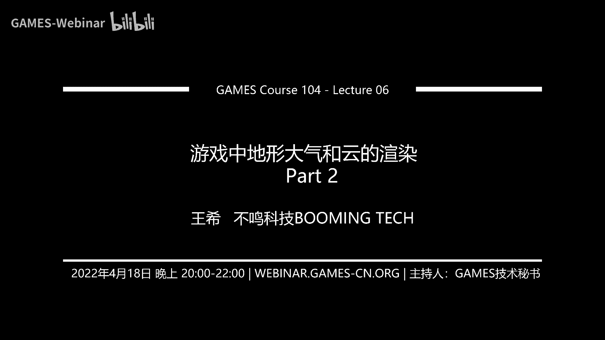
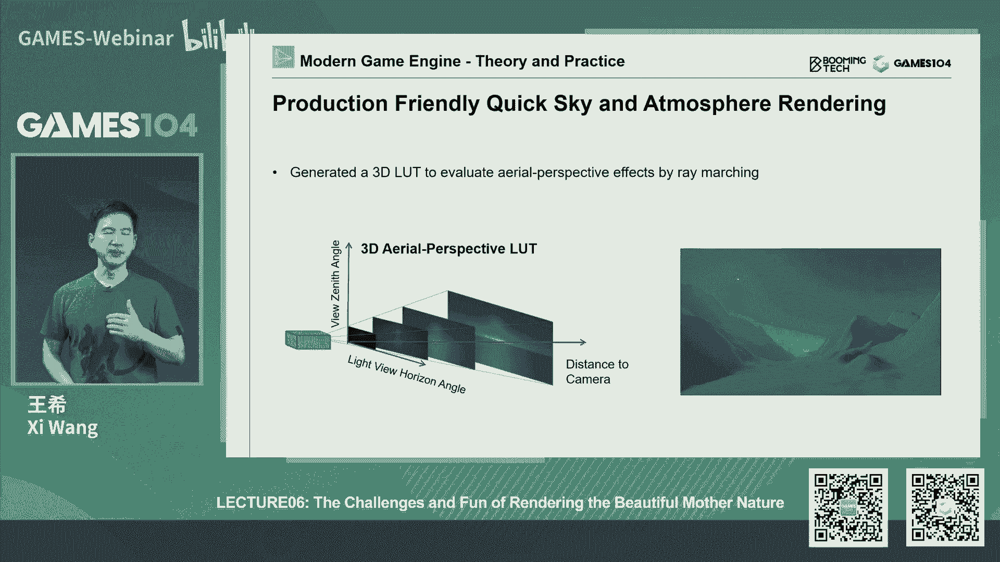
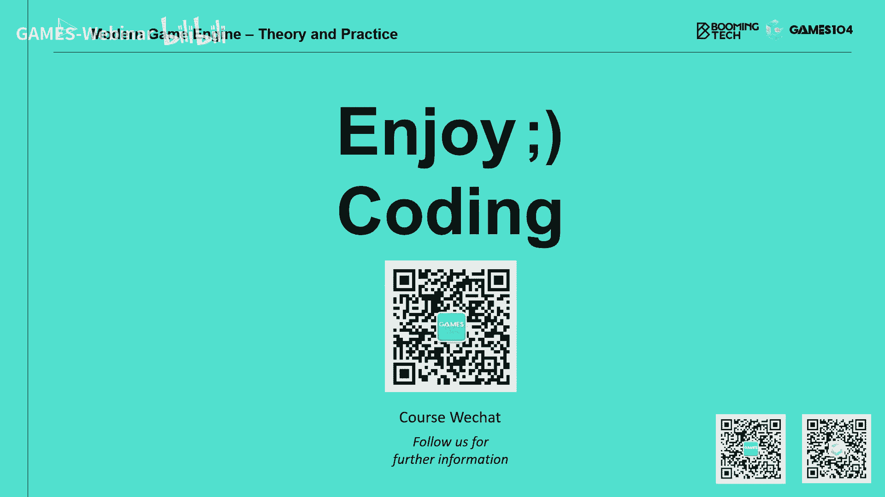

# 06.游戏中地形大气和云的渲染(下) ｜ GAMES104-现代游戏引擎：从入门到实践 - P1：GAMES104_Lecture06_Part2 - GAMES-Webinar - BV1i3411T7QL

因为接下来呢有一个更难的问题了，就是这个sky和天空，哎呀，我现在已经讲了将近一个小时20分钟了，那我今天我不知道两个小时能讲完，因为接下来sky这个东西啊，真的是就是让你又爱又恨。

我想跟大家大家先爱一爱啊，先这个就是打打气，天空真的很美对吧，我觉得就是一个游戏啊，它的整个一个氛围，我觉得天空和他的这个语音实际上起了绝大部分的这个影响力，真的你的情绪很多时候就是夕阳残雪对吧。

我的情绪就上来了，那比如说像这个horizon有一点那种异性的这种感觉，比较a脸的这种感觉，那么包括像这个老头环对吧，人家是特别善于刻画这样的一种情绪和气氛，对，这也是阿里特别特别喜欢的一个东西。

那么回到我们去表达这个sky的时候，你会发现它里面有两个元素，这一定要分开来，一个是什么呢，一个是天空sky对吧，就是大气，你看到的大气是什么样的，然后在大气层里还有一个东西很重要的东西。

就是特别visible的东西是什么呢，是cloud是云，天空和云是不能混为一谈的，因为天空它是一个抽象的一个球，你可以认为就是到大气层的上限，大气的上限是什么呢，就是霍夫面，大家听没听过这个概念。

就是它是离地表向上100km，我们经常讲，就是那个比如说埃隆马斯克嘲笑那个就是杰夫beos和那个谁，那个那个维维机航太空的那个两个两个人，他们说你们那不是太空飞船，因为你还没飞过100km呢。

你飞过100km，你才好意思跟我讲，你叫太空飞船对吧，那么那么呢但是云的话呢离我们很近，大概只有几百米上千米对吧，那么你当你移动的时候，你会感觉到语音的巨大的体量感，它是一个体量动力。

这两个东西是截然不同的两种表达方法，那其实还有一个东西是什么呢，是fog是雾，但是呢我们今天那个研究了半天，我们觉得这个fog的话呢，我们后面会放在效果里面去讲。

因为就是fog它不只是天空的大气现象的一种表达，实际上也是一种非常重要的一种，就是artist控制的效果，所以今天呢我们就把天空和云讲清楚，这个听上去是不是很简单，如果大家画画的话。

你会发现画天空画语音都是最好画的，寥寥几笔非常写意对吧，很有感觉，所以你怎么画，但是对于我们的游戏的这个这个这个引擎的开发者来讲的话，这绝对是这个头大的东西，接下来我们先讲这个大气对吧。

你可以看到这里面我用的刺客信条确实很漂亮，美得不得了，那传统异能天上的大气真的是随着日出日落对吧，你看到不同的角度，它有各种美轮美奂的颜色变化，那凡事不许怎么样呢，上拟合呀对吧，就像我上次讲材质的时候。

我也不管你下面到底是什么，这个物理的实实际是什么，我不懂，太复杂了，但是我可以观察，观察之后呢，我找一个模型去拟合，你对吧，这样不灵风雅了，所以我一直认为这个方法就是这个这个就有点像大世界的这个布灵风。

就是咣咣咣给了你一堆公式，你也不用管它，这边就两个参数，一个参数是什么呢，就是你向上看的那个角度到天顶，就是那个zis那个天顶的夹角是多少，但这个一般是零到这个零到派对吧，这个角度还有一个是什么呢。

就是你现在看的高度和太阳的夹角是多少对吧，那个它这里面是用了伽马对吧，好，你只要把这两个角度给我诶，我给你查一个表，诶，要把不是查个表，它是算了一个解析解，哎，你就能算出颜色。

这边他给出了一个ground truth是什么呀，他真这个老哥真的是拍了一下，然后呢他在游戏中也生成了这个结果，大家看看这感觉是不是还是可以的对吧，简单粗暴爽，如果我现在做过手游的话。

假设我这个就是是个无良坑爹的这个手游的话，我觉得这个方法也可以，就就混混也就拉倒了，但是呢它的好处就是非常非常的简单，但是它的坏处是什么呢，它的坏处就是说第一个呢你只能在地表，你没有办法做一个什么效果。

就是诶我从太空中飞过来，那个是什么感觉，还有一个就是它所有的参数啊，全部是写死的，你想你这个天空不可能是说永远是那一个一个形式吧，比如说你这个下雨的天，所以呢当我们要真的按3a游戏的标准去做天空的时候。

你会发现这个模型就不集中了，好接下来的部分就开始非常的高能了，我觉得我今天很可能我我看看我能不能讲完啊，ok那首先大家要学一个概念。

就是这个participating media这个词我都不知道中文怎么叫翻译，它，这个就是像空气中有很多的这种小小的这个东西，然后混合在一起，这个透明罐又不又不透明的，这么一个东西，这里面有很多的例子。

那么其实我们看我们的大气层啊，它实际上有两种粒子构成，一种粒子是什么呢，就是各种气体分子对吧，比如说氮气啊，氧气呀对吧，比如说甲烷，二氧化碳，著名的couple dixx型。

就是二氧化碳这个单词我学的最深，就是因为我最近老是听什么温室效应对这个词，每天的耳朵就过去了，其实温室效应最最火的应该是甲烷好，这个第二个是什么呢，我们叫气溶胶对吧，astral这个词儿呢是什么意思。

就是说诶我的空气中的灰尘或者是形成了一种小的这种气溶胶的分子，那么这些东西的话呢，它也会对空气形成折射和反射对吧，那这些就是我们的形成了我们光在这个厂里面走的，所有的这个就是我的戒指是什么。

就是我们周围的大周围不是真空的哦，里面有很多东西，正是因为有这些participating media的话，我们才会产生各种各样复杂的光学现象，那么这个里面就诶这个风尘看着是不是有点吓人了啊。

这个方程确实是有点吓人啊，就是说呢他在讲就是说啊这个光啊到底适合这个participant media，是怎么交这个怎么去在一起交互的，那么首先一头一束光射过来，你第一个效果是什么，诶。

我中间有我的杂质，对不对，我会把你的光给吸收一点，就吸收的效果对吧，我每往前走了一个单位的距离的话，我有多少的光被吸收，那是不是有一个常数对吧，这个就是吸收的一个常数。

一般我们叫做什么那个啊叫sa阿尔法对吧，西格玛阿尔法，那么后呢还有一个是什么呢，就是说哎这个光啊打中我的例子之后，我开始向四面八方开始散射我的能量对吧。

那么因为光就像你光打中了一个一个一个气体分子的时候，他就开始无差别的像四周方向去去去散射，那个叫什么叫out scing，就是说我我把你的能量往外散失的部分。

这个地方我就有一个就是sigma这个这个这个s skettering，然后呢它会跟着光的方向是有关系的一个方程，还有什么呢，哎我这个气体啊，假设是高温的气体，打个比方，比如说那个火焰对吧。

我还带点自发光，或者是我通了个电对吧，比如说我的一个闪电自发光，但其实自发光说实话，当你写方程，你去耍酷的时候，你可以把这个加上去，但是呢呃你不加也没问题，其实我至少you as far。

as i know，在游戏中好像很少有人真的这么干，因为前面这这这几项已经是让你头疼肚子疼了，最后一项那是最蛋疼的东西，叫in scattering，什么意思呢。

你在空气中的一个小的这个这个一个一个空气的一个介质，实际上你的光是不仅仅是你自己被阳光直接照到了这个行为，还有你周边的那些气体分子都被点亮了，对不对。

然后呢他们的他们的出射光就是他们的of scarring，又会打到你的身上，唉我的天，然后呢你要对你还记得我上次在讲那个b r d f材质的时候。

我说卡基亚老先生最让我这个这个不满的地方就是他给我的全是积分，而且全是球面上的积分，这个真的是很头疼，但是呢你要算他的那个in sketching，就是来自四面八方的天空的光，来的时候。

这就是在球面上的所有的光的贡献做了一个积分，哎呀我的天，这就是一个很复杂的积分，然后呢你把这四种效果合到一起，就形成了一个著名的叫rtf，就是radio transfer function对吧。

就是这个这个这个这个叫什么这个辐射传递方程，这个方程呢实际上我在这边写的是一个很简单的一个一倍方程嘛，但实际上呢在三维空间的话呢，它是一个梯度方程，那么那这个t的方程讲起来就比较复杂了，我们就不讲了。

那个大家如果在大学里面学过什么拉普拉拉拉斯算子这些东西的时候，就知道我在讲什么，但是说实话我也就是最近这两天我在备课的时候，我把这些东西全复习了一遍，我备课之前我基本上全忘记了，我说啊我的天呐。

怎么这么麻烦呢，对吧，我这个待会给大家解释，就是大家别怕，你需要知道这些概念，但是呢你不用记住这些公式，我我保证你绝对不需要记住好，接下来我们继续往下啊，好那么我从眼睛看过去，远处的一个点就是m我。

我现在眼睛在p那我看到的这个光的现象到底是由什么东西构成的，这个方程写起来又是各种玄乎对吧，它原则上来讲的话就是从m点，我一次一次一个一个点，我去算它的这个光被吸收的部分，光被散射出去的部分。

其他地方散射的光又再进来了，这个时候我其实呢会有两个值，一个值叫什么呢，叫那个transmittance，就是通透度，什么意思，就是说我在m点的看到的东西，比如说它是个蓝色的东西。

它大概有多少会保留到我在p点看到的东西，这是一个路径积分的一个结果，还有一个东西是什么呢，叫做它的这个skettering function，就是说你在这个你在你过来的时候，我又叠加了沿途的所有的例子。

它无论是从上下左右射过来的光，最后通过他的各种散射，又到我的眼睛去了对吧，那这个这个沿着这个路径的积分的话呢，就是它的scattering part，基本上你你知道了通透度。

你知道scanning power，你在那个m那个点，你放个什么东西，我知道它的光场的话，我就大概知道我看到那个m点是什么样子。

这个方程呢就是著名的就是这个volume render equation v r e对吧，你说这个呃这个我们的先贤们是不是很厉害，两页p p t两组公式，但实际上大家不要怕。

就是这个呢r t f是表示一个梯度，那你对这个梯度的积分啊，就是这个v r e，那不懂积分怎么办，没关系，不用知道了，因为这些东西呢到最后我们全部给你预测到好，待会我们继续往下讲，大家在这一定义里面。

只要记住两个概念，就是假设空气中有这个有很多participating media，就是中间有这种啊，不是真空的，有很多这种空气体的这种杂质的时候，你其实有两个很关键的变量，就是当一束光照过了。

第一个变量就是说在远处看到一个东西，它有多少能透视到我，就transmitters，就到你能到我的眼睛的部分对吧，那么第二个呢就是说哎你因为光打到这个空气的这个分子里面，你乱七八糟的散射到最后诶。

沿着这条光路方向给我的眼睛有多少能量，that's it，就这样很简单好，那我们继续研究我们的大气的真实的物理学啊，这里面就很高能了，这个真实的大气物理学啊，它实际上有两个主要的参与者。

第一个是什么太阳，太阳是一切的贡献者对吧，太阳的是一束光射到地球上，大家注意啊，太阳光你看到的是什么，是白色的对吧，但事实上呢太阳光是有大量的不同波长的光组成的，只是我们的人眼经过亿万年的进化。

我们把这个波长的组合定义成白色，仅此而已对吧，实际上它的波长很多，各种波长，第二个是什么呢，就是刚才我提到就是大气中有两类东西，一类是气体分子对吧，它的尺寸呢是小于这些波长的，一般的小于这些波长。

还有一类是什么呢，是这个就是气溶胶分子，它一般是接近于这些光的波长的，那么好了，它们的性质就完全不一样了，那这里面给大家介绍两种完全不同的散射模型啊，一个呢叫做really scattering。

这个翻译成中文叫瑞利散射，好像叫瑞利散是吧，这个名字取的好像个女生的名字，但实际上我也不知道这个名字为什么这么叫，可能是个发明酒的人的，那么的话呢它的特点是什么呢，就是当这个空气中的介质啊。

它尺寸远小于光的波长的时候，那么这个光啊就几乎会在四面八方几乎均匀的散射，不太具有方向性，其实还是有一定方向性，但是我会具体的讲，但是它有个特点是说对于越短的波长，它散射的越厉害，对于越长的波长。

它散射的越越越，那个就是越小，什么哪些波长短，蓝光紫光对吧，紫外线，紫外线嘛，对不对，那么哪个波长长呢，那可能就是这个比如说红光这些东西，那么还有一类散射是什么呢，叫密散射。

密散射这个哎呀真的叫叫米氏散射对吧好吧，就我们叫它米式散射，我真的不太记得他中文名叫什么了，然后呢这个它的特点是什么呢，它是由气溶胶，就是它的它的尺寸是接近或者大于那个波长的时候诶。

它就有一定的方向性对吧，它就是你沿着光的方向一般会略强一点，但是它有一个区别是什么呢，就是说它呢对波长不敏感，管你什么波长，我我都是一视同仁，这就非常有意思了，我们先讲这个瑞利散射，锐意散射。

这边是它的一个就比较假设光啊，沿着这个大家看左边那个图啊，右边这个图当光沿着方向过来的时候，它其实散射的这个分布啊，像一个什么，大家看像一个花生，对不对对吧，两头稍微大一点，中间稍微扁一点。

这也符合它的光学原理嘛，那么还有一点是什么呢，你会发现短波长蓝光的它的辐射度会高很多，对不对，但是呢这个长波上红光它的反射度就比较低，这里面就引入了一个大名鼎鼎的这个这个方程。

这个方程呢叫做这个fafunction，什么意思，就是说这就是我我特别想讲啊，就是这个呃这个数学家是很了不起的一个物种，就是你看到这个公式铺天盖地的很复杂对吧，大家不要怕，实际上它就两个部分。

第一个部分呢是它的就是叫face function，就是它的几何形状，这个几何形状你说它复杂吗，其实很简单，就是一加cos theta，大家学过那个就是高中的代数，你把cos c它的平方加上个一。

你得到的就是这个腰果的形状，大家仔细画一下就知道了，就是极坐标计算，所以我觉得这个方方程啊在我看来就是还你看着它很高端，但其实还是个拟合对吧，他就骇客了一下，说我大概就这样。

但这里面的话呢它引入了几个很有意思的参数，第一个它有一个number number，是什么光的波长，它这里面你会发现就是一除以number的四次方，意味着就是当光的波长越短的时候。

它这个散射的强度是不是越高对吧，第二个呢就是说它这个光啊，它这个是受制于什么呢，里面有个变量叫做h就是你会发现这个方程里面有三个变量，一个是number one。

我讲的是波长sa就是你跟它这个光的之间这个夹角，这个夹角的话呢，它是ice tate，就是它在旋转的时候是不变的好，但是呢h是很有意思的一个变量，大家一定要记住海拔高度，大家想想看大气的密度是什么变化。

是不是在海拔为零的时候，浓度最大，越往上它是有一个接近于线性的对吧，越来越稀疏，但这个到底是线性还是非线性就不重要，重要的，因为搞同学的人，我就还一样，我们就假设这个线性就是。

那么我们会认为你跟空气的密度在地平线上的这个区别到底是多少，我们呢就那个大案，就是说一个标准单位体系里面的空气的密度，和你在以真实的海拔高度的密度的变化，这样的话我们现在做什么。

比如说你从珠峰上开一架飞机降落到那个海平面上的时候，你看那个效果其实在里面你就会发生这个变化，所以呢这个方程你去理解它，就是所有左边那么长的一个东西，他到最后你会发现。

对于任何一个这个给定的这个海拔高度和空气密度来说，它就是一个常数，而真正沿着方向在变化的就是那个叫fafunction，那是一个方向，那个方程非常的简单，它实际上只跟一个角有关系对吧，那么有了这个方程。

我们去理解一个很有意思的光学现象，就是为什么天空是蓝的，你看硕图心学的人，他就是很有意思，就是我们真的是个博物学家，就是你会发现这很简单，就是当太阳直射的时候对吧，大量的蓝光它会呢在大气层里被散射开来。

然后呢经过多次散射进入眼睛，红光的是直接照在地上的，但你你不会抬头直看太阳，你往旁边看天空的时候，就天空来回bounce的，因为really散射的时候，那个蓝光的你们来回bs技能眼睛。

那为什么你到傍晚的时候天空是红的呢，因为那个他很斜，很多蓝光它照到在大气层边缘，直接往大气层外面去散射了，所以呢天空中蓝色的部分越来越少，反而红色的部分就多了对吧，但这里面和外面还有一个吸收线。

也会加剧这个红色，待会儿再讲怎么样完美的解决了天空为什么是蓝的对吧，这个这可是这个怎么说呢，难倒了我们人类物理学家上千年的一个问题啊，好那么密散射的话呢跟它不一样，历史你看啊。

这是我们看出来密散射的这个方程，这个方程是这个形状，我觉得真的是很神奇啊，我觉得是一只大带鱼还是大章鱼，我也不知道，反正就是这样一个很奇怪的一个形状，但是呢这个问题难不倒我们的数学家，数学家。

凡事不许上礼盒对吧，你看这个方程呢就比较复杂了，它其实啊左边那一夸啦，也是跟你的高度，海拔高度跟你的空气的密度有关系，ok我把你全部变成一个常数，不用管它，然后呢我要模拟那个形状。

它呢你可以看到它一堆cos c它的变化，但这里面它引入了一个非常有意思的我，我叫做gre parameter，叫g这个g很有意思，就是说当g等于零的时候，你会发现啊。

他这边的这个face function会退化成跟瑞利散射一模一样的，一个一个一个一个就是花生豆的形状不会这么复杂，但是呢当你的g大于一的时候，它就会越来越趋近这边的形状，但是g呢其实是可以小于零的。

呃大于零啊，当g小于零的时候呢，它表示的是说往往那个光线的相就是相反的方向反射的越多，但是一般来讲我们在用的时候，基都是大于零的，这里面只跟大家讲一个数学的东西，这个东西呢大家不要怕。

因为它实际上就是一个拟合方程对吧，它的计算也并不复杂，那么这个g呢我们一般会开放给我们的artist去调整，这个月是原则上来讲的话，就是不同尺寸的particle。

它的记忆会一直有变化好这就是我们的整个一个数学体系对吧，那这个那个这个密反密的散射呢，其实也是我们最重要的一个效果，比如说吧大家看到的雾雾是空气中的小水珠嘛，那么它其实就是个气溶胶。

那你看到雾为什么是白色的，这里面白色的太阳光照下来，所有的波长无差别的散射，最后你看到就是白茫茫的雾对吧，所以务实很多时候是没有颜色的，那么像那个我们看到的那个傍晚的日运的话。

也是因为逆闪是因为它是带有方向性的，所以说你看到这个光就差汇集到你的眼睛去了，所以在那个太阳旁边，你会看到那个how halo是光晕的，这个现象也是个点，包括你在雨天雾天看到那个路灯也会看到这个效果。

也就是密散射好，这个讲起来是不是很复杂，是的很复杂，因为你如果想做一个高水平的游戏引擎的话，这都是你必须要解决的问题，好了呀，这个就很麻烦了呀，那么还有一个很重要的现象是什么呢，叫做光的吸收。

能量被吸收，我们刚才讲了，刚才我们一直讲散射对吧，但其实还有个吸收吸收呢，这里面就讲一些物理学有意思有意思的原理呢，比如说我们大气中的臭氧和甲烷，它们呢都是吸收长波的高手。

那么它可以吸收这个这个红红色的光，所以呢比如说像那个就是那个海王星，为什么看起来是蓝色的，就是因为它表面有很多甲烷，所以当太阳光照过去的时候，它的红色都被吸收走了，所以我就剩下蓝色，你能看见了。

那么其实这个臭氧很有意思，我自己那天我们在我们在做备课的时候，还在说，诶，我记得那个臭氧是吸收紫外线的吗，其实你看v k p d啊，他也说它吸收了个uv嘛，就是那个紫外线。

但是呢我觉得可能是在可可进化波段，它吸收的是那个红色多一点，但是在不可见的波段的话，它有另外一种形式，那这个就更复杂了，我们今天不展开，但是呢当我们去计算大气的现象的时候，我们确实要考虑吸收效应。

但是呢在这里面我们要做个假设，什么假设呢，就是当我给出一个大气的模型的时候，我会认为臭氧和甲烷是均匀的分布在这个这个这个大气层里面，实际上不是对吧，臭氧层是在天上的，但是呢我们算的时候耍流氓。

我们就把它均匀算，因为这个这个模型实在太复杂了，好好了，这就是我们的整个大戏的物理模型，大家感觉怎么样，是不是基本上要爆炸了对吧，觉得这个这个怎么可能解呢，这个确实很难解。

而且这里面有很多的两重积分在一个地方，那么这里面再讲一个很著名的概念呢，就是说叫single skettering和multiscare，叫单次的这个散射和多次散射，其实它通原理上解释是非常的简单。

就是说当我眼睛看到一个远处的一个点，我看到的所有光线是沿我的视线看到的，所有的大气粒子被太阳光照亮，然后呢散射到我这个方向的这个点的能量的加在一起就是家和拉倒，这其实不是价格。

它就远处的那个点的能量还要被中间就是就刚才讲的transmitters，就是还要通过一个通透度进行这个积分到我的眼睛的结果，这就是单词的scattery，这件事情是不是已经很复杂了，对不对。

但是实际上呢我们去看大气现象，它绝对没这么简单，为什么在这些沿途的这些粒子空间的话，我们还有很多其他的例子，他们从各种角度去照我的眼睛对吧，比如说上面的一个一个一个一个例子，他虽然不在我的视线上。

对哦它不对，它是它，它虽然不在线，但是它可以照亮我路径上的一个一个点，那个点沿着我这个方向又一个能量的这个反射，这是什么呢，我们叫做multi scattering，实际上真正做大气现象的话。

最让人难受的，最让人头疼的就是这个东西，你想做一个美丽的天空，不好意思，你没有，这个效果是不息的，大家看这张图，左边这张图的话就是只有single casketchy，你看这个天空样子。

我觉得还是蛮好看的对吧，还可以，你可以看到就是太阳在地平线以下天上出现了那种诶有点这种暖色调，然后再向那个冷色调的蓝色慢慢过渡，但是你会发现山的背面是一片死黑，为什么呢。

single scattering的话，它基本上那个地方是没有光的，但是真实的大气是怎么回事，如果大气中有很多的例子的话，这些在你头顶上的这些空气也会被点亮，然后他光会散射开来。

然后呢又再把你面前的这些这个山背后的空气又给点亮了，所以你会发现虽然阳光照不到伤背面，但伤背面其实是有亮度的对吧，这个但这个大家注意啊，这个跟我们讲的那个gi不是一个道理。

因为积压指的是说我背后假设有个山的另外一面，它被照亮了，这个这个山的背面的光也反射过了，但是gi但是这个multiscattering指的是他是他没有清晰的面，他是无时无无刻不在的这种连续的。

就叫participate media，就是就是这个怎么比方呢，就是充满空间的空气，就像以前那个经典物理学家讲，就是充满空间的以太阳，每个以太分以太那个原子都在这里面干了很多的这个复杂的事情。

然后你一般把他所有的行为积存放在一起，这个时候你才能产生我们想要的这样的一个光学效果，这件事情听上去真的是很蛋疼，但实际上如果你在做今天这个时代的3a游戏的话，这是我们必须要解决和面对的问题。

好那这个问题怎么办，那前面我首先给大家介绍一个非常著名的一个，一个也是大名鼎鼎的算法，你看只要著名的算法都叫marching，这叫remarching，这个像这个算法呢其实非常的简单，就是沿着一条视线。

我把沿途的效果一步一步叫marshine，就是走路嘛一步一步的积分起来，那么比如说刚才我们讲的那个single skettering，就是单次散射的结果的话，是不是我沿着我的视线的方向均匀的踩很多的点。

然后呢我算太阳照到这个点上，这个离子的强度是多少，和它的方向，我根据他的scattering就散射方程，你把我把你的me啊，really啊，方程先算一遍，我现在算出说你头像我的这个光度是多少。

然后我沿路就这样积分下去，我是不是就可以算出来我的single sky那里面讲的还少了一个细节，就是远处的还要经过一次transmitters，就是说它是有通透度的计算的，但这个不展开了，它的核心思想。

就是说我就沿着一条射线直直接积分下去，实际上我们在算所有的大气效果的话，用的都是这个思路，嗯啊天呐，已经一个小时40分钟了，我怀疑我今天要奔着两个半小时去了，这个ok反正我看到同学们很希望我脱单。

那今天我们到时候看上b站视频的时候，我们看能不能切成两段，因为否则这个视频就太长了，好那么你有了这样一个remarching这样的一个数学工具的时候呢，其实我们就可以用我们的最著名的方法。

我记得在上节课，上节课我们反复强调的什么叫计算复杂，用空间来算对吧，就叫做就是用空间换时间，我们可不可以把这些复杂的计算预先算好，然后呢把它存在一个表上，然后呢到到渲染的时候。

我只是根据我现在视线的方向，太阳的角度，我查一个角就可以查得到这个想法，是不是很直接，对不对，那刚才我讲的就是你大气中的光学现象，其实只有两个最重要的部分，大家还记得吗。

第一个部分叫做transmitters，通透度对吧，也就是说我现在看到远处离我那么远的东西，我大概能看到你的30%还是70%，还是99%，对不对，这就是通透度，还有一个是什么呢。

就是scattering，来我这边的散射度是多少，那我们先算通透度怎么算，其实这里面我觉得我们要引入一个很著名的模型了，叫做pre computer atmosphere，atatmospa。

这个scattering就这个方法是非常非常经典的，这个是应该是brunton那个老先生在2000，不是老先生，这个人可能很年轻啊，大概2006年左右做了一个算法吧，就是说他想了一个办法。

就是我把空间中的任何就是地表，地球表面的任何一个点，我算它的海拔高度，在这个海拔高度呢，我存两个值，一个值就是你的视线和天顶之间的那个夹角，就是那个theta对吧。

我我用你的扩散theta进行参数化的表达，还有一个是什么呢，就是说诶我现在跟海拔高度的区别，然后呢你从这个点往大气层去看，因为我现在只能算通透度嘛，所以说我不需要知道太阳在哪里。

我只需要知道就是这个通透在哪里，那你从这个点出发，一路走到大气层的边界，一般我们设定为就是以地球中心，假如地球是6440米的半径的话，那应该是在6540米的那个千米的那个地方啊。

不算6440千米的那个半径的话，那么它应该在6540km的那个地方，就是1百米100km的后封面的那个地方，那么我这根线跟它的交角，就是我看到那个它的镜头，你应该看到的是通透是多少，这个是有点意思吧。

就是比如太空中有个东西的话，假设没有太阳，我们可以看到那个太空中的星星，说明什么，虽然大气层很厚，有100km，但是它是什么，它还是通透的，这个大家能理解吗，那么好，我其实呢就用这么一个简单的方法。

我就可以把整个大气层的通透的这个方程就表达出来了，那么好了，但这个时候呢我假设在远处，我有一座山，或者有一个光，有一个粒子的发射的光到底有多少能透到我的眼前，就在这张图中的话，你可以看到我们设置两个点。

一个是x v就是你眼睛所在的位置，还有一个点是什么呢，是叫xm，就是你中间有一个物质点对吧，middle的那个点不一定是mid，就是中间那个点，然后呢你会发现啊，实际上你有这个表，你可以去查。

在这个从xv就是你眼睛那个位置到大气层边界的这个通透度，把它呢做分母，它的分子是什么呢，就是从那个m点沿着同样的一条线到大气层边界的通透度是多少，然后呢你把这两个tto这样一个分子，一个分母一除诶。

你就能得到他的通透度，这里的具体的数学推导我不展开了，但这个方法真的是非常巧妙的，就是说他用了一个简单的二维的方程，把一个四维的值就给算出来了，因为一个简单的除法。

这个具体的同学们有兴趣可以推导一下对吧，但但是作为作为我当年就是我基本上知道这个东西了，我觉得太牛逼了，然后就大胆的去用了，就假设它永远是对的，对吧好，那么这个时候我有了通透度之后。

接下来我就可以算什么呢，我就可以算他的，大家刚才特别特别蛋疼的single scattering，就是你那个single scattering呢，就是单次散射确实很复杂，但是呢你有了通透度。

你就沿着那个那个刚才给的那个方程啊，你就一路一小步一小步积分，你是一定能算出来的，它真正的难点不在于计算说从a点到b点的这个这个，这个这个散射的强度的难度。

而在于是说我对于整个地球上这么大的一个就是3d的空间，我在各种各样的可能的视角，我在各种各样可能的太阳的方向，我怎么去对大家进行表达，这件事情是很复杂，那这里面的话呢。

我认为最重要的一个思想就是一个参数化的思想，什么意思，就是说我还是在地球表面离海拔高度选择一个爱h高度的地方，我呢朝一个方向去看，那这样的话呢我可以得到一个叫天顶角对吧，我的天顶角一个参数化的表达。

然后呢这个我会一路这条射线会达到大气层的边界，所以那个我不需要知道我的终点在哪，我我我因为是个球嘛，所以我永远知道那个大型的边界离我多远，只要我知道我的角度还有一个什么呢，太阳现在挂的角度，注意啊。

这个时候你看的这个角度和太阳卦的角度和天津的方向，它是个什么角，它不是个平面的角，它是个立体角，所以这里面我们就得到了三个角度量，第一个是太阳到天津的角度，大家想太阳到中午的时候。

是不是离听点越来越近对吧，那个cos的那个那个就是那个那个词儿，我叫n n格玛，还叫什么，whatever，就是它等于一，对不对，但是它太阳越靠近那个地平线以下的时候，它那个值就趋近于零了，对吧，好。

你呢看也是呀，你看天空看看天顶有个角度，然后呢看见旁边也有一个角度，那好那这个角度你也给算出来好，我们把天顶的轴线确定了，确定的话，那这个时候第三个量是什么呢，是我的视线和太阳之间的这个夹角。

在这里面是用fi去表达了，你会发现如果我们这是一个完美的球形的话，所以他在任何一个点上，他的天顶方向就是它的那个法线方向对吧，那你无论怎么转，太阳和你的相对位置怎么转，只要这个球上的大气层。

它是虹膜基尼的虹膜镜子，就是就是说它的各项同志的吧，它其实不不是红的，就是各项各个方向，假设是等等价的变化的话，实际上我只需要去存这三个角度的信息，我就能表达所有的从我现在这样看过去。

看到太空的点的这样的一个沿途的散射值，这个这个东西大家回去可以推一下，其实非常的简单，那么我再沿着高度进行一个采样，我就一路的这样去采，然后用这样的一个简单的方法，我们呢就可以得到一个四维表。

对这个里面是四维表吧，这个就比较复杂，但是呢感谢现在硬件我们有什么呢，有texture ray，大家还记得我们有texture re对吧，其实这里面不应该应该用3d texture，为什么呢。

我沿着他现在他的package的时候，沿着海拔高度依次进行采样，那么呢比如说我1百米踩一个，2百米踩一个，3百米踩一个，但是我人可能是在175米，这个时候我可能就在1百米2百米之间去采这个人。

因为这个信号全是低频的，所以差值是没有问题的，然后呢我在x轴的话，我把这个天顶角，我把这个我们和太阳的角度pk在一起对吧，反正这里面这个这是一个规划的一个细节，但这个大词你看你能明白。

实际上我前面通过各种复杂的计算，我实际上是把这个世界上的光啊，如果只有一次scattering，就一次散射的话，我全部就存下来了对吧，用remix的方法，那我有了这个通透度的分布图。

就是大气的这种就是光过来的这个通透性的transmitters的这个图，我又有了这个一次散射的图，我把一次散射所有的空气的点都会被散射的点照亮，对不对，我用这个照亮的点，再通过通透度再做一次积分。

是不是能得到就是二次散射的图，那么我可以做二次，三次，四次五次，其实理论上你可以做无穷次，但一般来讲我们做3~4次基本上就够用了。

那这个时候我们是不是就可以得到一个叫multi sketching的这个look up table，它的结构啊其实和这个表是一模一样的，因为这是一个完美的对这个就是这种光学现象的一个参数化表达。

但是呢只是你ma sketching的话呢，就是你会两张图看上的区别是什么，就是你每加一次这个那个multsketching，它这个图会看上去亮那么一点点，但是到后面这种变化你基本上已经注意不到了。

所以这就是很著名的这个computed atmosphere的这个sketching，算法的核心思想，它本质上就是说我用预计算的方法，预计算是用什么方法。

是用remarching的方法去把这种大气里面的这种散射现象，通透to这个现象全部变成了表格，然后呢一路给你算好，这样的话在我绘制的每一个点的时候，我就可以用这个效果嗯。

那么其实呢这个方法你看上去很复杂，但是呢当你把所有的一计算全部做完之后，那你在run time，你去用它的时候，那就真的是非常简单，而且的话它真的能够模拟日落日出的效果，这这几个游戏都是大作游戏啊。

比如像非法对吧，像那个就是极品飞车，这都是呃，这这边paper的话呢，就是戴斯的做的这个东西，就是大家可以看到就是这基本上已经达到了state of 2的效果，就是现在很前沿的一个效果，非常的漂亮。

那么那么一计算呢，实际上你一个关卡如果这些参数不动的话，就比如说你大气的参数不动的话，你太阳动，你人动，你一会儿坐飞机从地面到就从地表起飞到天空中都没有问题，他这个确实做的非常的强大。

那么当然这里面有个细节我就没有去讲，就是说呃远处我不仅看到天空的颜色，实际上远处一个物体我要加物效，其实这个方法呢在这里面有一个小的细节，就是在这里面就是说它实际上是那个我先算。

我当前看到大气层的边缘的时候，注射的这个这个这个sky就散射的这个这个能量，然后呢从你那个远处的物体的物理点，你散失的能量，然后呢你的能量又要被那个就是那个transpency的这个能量被减弱。

这两个的一个差值就可以算出来，说我的远处的山他接受了多少的天光，到我的眼里面，这个讲起来就比较复杂了，我就不展开了，但是你会发现就在远处的时候，比如说天假设是蓝蓝的，你看远处那个山。

它也会变得有点越来越蓝，而不是一个简单的只是变暗，其实就是这个效果，那么用这个方法的话呢，也能够完美地实现这个方实现这个效果，那么所以呢这个方法其实真的是非常经典的，就是那个brunton这个方法。

我认为是非常经典的一个算法，那么它有没有问题，其实呢呃它还是有很多的问题的，第一个呢就是它的计算是非常的费的，就是说你刚才可以看到就是我要做很我对每一个思维的表，我都要做一次remarching对吧。

然后呢就是说呃我们在比如说打个比方，比如说我们在移动端的这个手机上，这个计算就很蛋疼，现在我在pc上，我有computer shader，我可以算还可以，但是也是需要大概比如说呃几毫秒吧。

甚至有可能到一秒，但是呢我们可以把它分散到很多，真逐渐松的，比如关卡加载时我就算一下，但是的话呢当artist的说，唉你把这个大气算好了，我不干，为什么呢，比如说我要表达一个效果，是刚才还是蓝天白云。

突然开始要下雨了，那下雨的空气中有很多小水珠对吧，然后呢这个大气的折射和散射就会发生变化，那个时候你会觉得有点雾蒙的感觉，这种这个两个效果呢之间是要均匀的过渡的，每一帧都要插值的。

那这个时候你就很麻烦了，因为你就相当于说每一帧你都要再把刚才那个表再算一遍，刚才那个算表也很麻烦对吧，你怎么算呢，包括我们的artist在会在在编辑这个环境的时候，我们要经常调这个数值。

这个方法他也会很麻烦，你动不了，另外一个的话呢，在run time的时候，虽然尼德已经是用空间换时间了，但是大家仔细去推演一下，你会发现其实他要做很多次的高维表的差值，而且高维表的插曲呢是非常费的。

就是说啊，因为比如说我我硬生生的把一个思维数据pin到三维的数据的时候，其实我很多interpolation需要我手动去做的，比如说我要取一个值的时候，我要在四个点取值，然后再自己做差值，我要几次的。

而且刚才给大家讲的就这么大的texture啊，这个泰勒不大了，但是我的memory会降不来降不去，然后作为一大堆的数学运算，所以呢它其实很复杂，所以这里面的话呢这也是我们104课程的一个精神嘛。

就是说我们会跟大家讲一些点一些非常前沿的一个方法，这里面的话呢我们要浓重的去讲一下，就是今天那个在游戏行业大家在用的一个方法，就是也许我们可以用更简单的方法，但是呢是能解决这个问题。

这个方法实际上在啊今天的ue里面就用了这个方法，就是它是强调的就是如何叫a scalable，and这个这个就是production ready的这个sky and at the field的一个rendering technique。

这个方法我不展开，不讲的太复杂了，跟他讲一个他几个很有意思的一个思想，这个思想我觉得他们大家特别需要学习，他先做了一个非常非常大胆的假设，他说啊你在空气中最麻烦的是什么呢，算这个散射嘛对吧。

就msketching就是一次二次三次散射，但是他说散射这件事情特别的低频，对空气中的一个分子，你来自四面八方散射，你可以近似认为它就是在各项分布是同样的，这个假设是不是很大的，对不对。

但是这个大胆假设有一个很牛逼的属性是什么呢，就是说如果你来自于四面八方的光的是均匀的，那实际上这些光入射到你的点上，你再反射回来的话，是不是就是一个百分比的衰减对吧，也就是说光是四面方向均匀的进了。

然后呢你不管用什么方程散射，你就算是个什么情况，你你最后散射的各个方向都是均匀的，那实际上你就是个能量衰减的问题对吧，也就是大气分子被加热了，然后呢我们散射出了比损失了30%的能量。

所以呢你只要算出一次到两次的这样的一个散射，你就可以算出一个百分比，然后你会发现再往上的话，每次都是百分比的一个级数，这个级数就意味着什么，意味着说我可以用一个最简单的高中数学知识。

我就可以算出他无数次方次的时候，就是multiscaring的这样的一个贡献度，你想这个方法是不是很流氓，但这个方法真的就就work了，他就这么干了，所以就不用像我们那么麻烦的。

就是每一次算它的反射散射的时候，我们都要全部再做一次路径积分，搞得一塌糊涂，对就他就他就没有这个事儿了，那么第二件事情是什么呢，刚才那个卢卡表不是很麻烦吗，思维嘛对吧。

他都在想说哎呀你既然这个世界要动态，我就省一点事嘛，就比如说第一个我假设你的位置就不变了，你假设我每一帧都算，那你的高度，你我我对每个海拔高度去采样，对我有什么意义呢，没义对吧。

那我就把你们的这个h这个维度给它干掉了对吧，第二个就是说太阳我每一帧都算你太阳在每一帧的时候，它的位置不是固定的吗，对不对，好，那我把那个太阳那个维度就干掉了，最后他就用一个非常简单的方法。

就是说诶我一个是天顶角，一个是360度环角，我就把你这个天空的这个multsketching的反射就全部给你算完了，这个真的是非常的了不起，但这里面这个看到图应该是sk jsk scarring。

那哦这个这里面这已经是它的结果了，这个时候他还又算了一个东西，它是这样的，他就说ok我大气中的这种沿着路径的这种透明度的积分，对不对，那我就一路算过去吧，我就一路做过3d texture。

根据距离的远近，这个时候呢诶我又形成了一个积分，这样的话我整个天空的modescaring所有效果，这个图前面那个图有点错误，前面那个图应该只有single single sketching。

实际上啊它实际上那个表里面可以有msketching加上那个无效的效果，所以这个想法其实非常的简单，但是的话呢它就是符合我们前面讲的那个迪士尼精神，就是它并不是物理上完全正确的一个方法。

但是呢他对于我们的艺术家来讲是非常非常友好的，而且这件事情还有一个好处是什么呢，就是它能够让我们的艺术家可以创造各种各样的奇怪的星球，打个比方，比如说我天上有两个太阳对吧，不是一个太阳。

一个月亮都在照我，我看过太阳，太阳那边有日晕，看月亮，月亮那边也有月运，那这样的效果怎么办，或者这个地方的气体的效果是一直在变的，就是刚才我讲的这个，比如说一会儿下雨，一会儿起雾，一会儿怎么样。

他都能表达，所以这里面给大家看一下它的效果，这个是一个现在的慢慢慢慢的越来越多的公司在在用的一个方法。

那么它的好处就是在硬件上，实际上的话是非常的高效，而且呢跟那个brono那个方法呢，我个人觉得差别没有特别大，但是他自己也讲了，在有些情况下，就是比如说那个空气中的那个就是散射度过高的情况下。

比如说就是特别特别浓的这种大气的情况下，它的误差会有点大，甚至会出现色偏，那么好给大家看一下它的效果，大家可以发现就是说它能够表达很多动态的效果，这是一个很a脸的星球。

大家看到天上飘的都不知道什么什么星体，因为我们是什么，我们是做游戏引擎，游戏引擎是干什么的，就是我们在完全的创造一个想象中的世界，所以呃earth虽然是我们的母亲，但是我们要从earth上学的一些算法。

让它能表达各种各样就是beyond earth的东西，所以我个人的话是非常喜欢这个算法的，我觉得我个人觉得这个方法是非常有潜力，所以这个呢也是目前比较前沿的一个做大气的一个方法，同学们如果感兴趣的话。

我觉得作为你的毕设大作业是一个非常好的一个选择，就是难度其实并不像大家想象的那么大，而且有大量的代码可以去下载，但是你把这个东西真的吃透的话，你会发现非常的有意思，好好的，那我们基本上想到这一趴呢。

我们就把这个天空讲完了，我已经讲了快两个小时了，我后面这把会讲的比较快了，其实确实要抓紧时间了，那么接下来呢就是那个云语音呢，这个东西呢实际上是非常了不起的，其实人类对语音的观察是几百年前的最开关。

因为最早我们要关注天气嘛，对气象学家最早意识的语音是有三种类型的，一种是什么呢，一种是层云，就是那个status，就是一层的很很薄的一层云，然后呢就是那个umulus，就是说层积雨越来越厚对吧。

还有一种鱼是什么呢，叫serious，就是说卷云就是小小像卷羊毛样的，那么其实你会发现就是说我们在做这个图形学的时候，真的你不小心，你还得学很多气象学的知识，其实大气中的云啊。

它基本上就这三种的东西在组合在不同高度对吧，在低空的时候，你看到的就是层云和积云，然后呢到中空的时候呢，就是这个这个就是大概在几千米的时候，你看到叫高空的残余和高空的机云。

然后呢再往上的话就是高空的这种卷的层云和卷的这个基因，就这些东西，那么这个东西看起来很简单。

怎么去表达它，这里面的话呢我给大家去讲这个最经典的方法，最简单的方法是什么呢，就是用mash硬生生的表达这个方法，大家不要笑啊，这其实早年真的有人这么干过，但这个可能更偏学术一点，就是artist。

你去放几个大物体书，我大概想要这种形状的云，然后呢他用各种各样的noise啊，腐蚀算法呀，哎最后真的给你形成了一个语音的这样一个集合，但这个方法呢实话实说就是几乎基本上没有人去用它。

我们在过去的十几年甚至更早的时候，大家怎么做鱼大家我现在有很多同学能想到很简单，我们用大量的插片，半透明的插片，各种阿尔法的混合对吧，我们就能形成这样的云的效果，大家现在如果打开10年前的那些网游啊。

更早的游戏的时候，你会发现那些语音就基本上这种方法去做的，看着嘛像个天上飘的巨大的棉花糖，然后呢你觉得他不是云吧，他也是项羽，但是你看着总是那么差那么点意思，对不对。

那么既然我们要立志做这个3a游戏引擎的话，那肯定这个方法是不行的，那所以呢现在在主流的游戏中，最常用的语音的表达方式呢是用一个就是volumetric，cloud modeling的方法。

诶你看这里面又来了warning magic对吧，刚才我在讲地形的时候，我就吐血的推荐说，我们要理解一下什么叫用那个vocal的方式，就是volumetric。

就是用体积的每一个vocal的方式去表达空间，表达形体，你在做云的时候，你不理解这个方法，不好意思，你就真的做不了了，ok好那这个方法的好处是什么呢，就是它是全动态的。

全是在runtime用用那个cpu生成的，它那个云可以表现出很多的变化，因为呃它的形态也很多变，而且还可以还可以云可以飘移各种各样的效果，但是它的唯一的唯一的问题是什么呢，这个算法非常的复杂。

而且呢还很expensive，就是语音要做不好的话，会把整个游戏的效效效率下降非常非常多，但是呢架不住啊，就现在游戏对效果要求越来越高兴，大家基本上都在用这个方法去做一些3a级的游戏好。

那这里呢因为时间的关系啊，所以说我不会讲的特别的细，但是给大家讲一些他最基本的一个思想就好了，那么首先的话呢就是说他用一个叫visa texture，videtexture，有两个部分构成。

第一个部分呢就是说诶我随机的这个语音的分布在空空间的分布，第二个呢它的the texture channel里面存了一个0~1之间的值，其实代表的是语音的厚度，刚才我不是讲了那个陈云对吧。

然后那个就是陈云和积云之间的混合物，叫那个street umulus对吧，然后我们在这umulus就是我们的基因，那好就是0~1的值，诶我的云的厚度越来越不一样，然后你会发现就是说到那个值调整的时候。

同样是那个空间上那个云，你会发现它的厚度是越来越厚了，对不对，所以一张visa texture，这个texture很有用啊，比如说啊我们要想这个云飘起来怎么办。

我们就把这个via texture进行平移，这个语音是不是在天上就飘起来了，对不对，如果让这个语音有些变化的时候，我是不是可以对那个texture进行一些扰动，进行一些各种各样的变化。

这个语音也就发生了变化了，所以这件事情是非常有意思的，就是这是我们的magic好好，这里面我要给大家介绍两个大名鼎鼎的，就是noise function，我相信很多同学在做别的同学都听说过，就是噪音。

噪音是我们很讨厌的东西，对不对，但是呢在其实在信号处理，在这个图形学中，噪音是我们的好伙伴，那这里面有两个著名的方程，一个叫noise，那个pretty noise，就是那个哎中文不知道怎么说了。

反正叫pinnoise，然后呢他是一个非常了不起的一个方法，就是哎呀这个不展开讲了，其实关于poynurse，我觉得讲个20分钟都可以的，就真的很很聪明很聪明，就是用了一个多项式的时间。

就能形成这样一个像棉花絮的这样的一个效果对吧，那么那个另外一个很著名的叫word noise，warning noise呢，它它的近亲是什么呢，就是我们叫做玩i话，就是空间玩any分割什么意思。

就是说我给你很多点，我把我在空间把它分割成一个个以它那个点为最近距离的一个cl，这个东西是个什么东西啊，大家如果用电子显微镜啊，用显微镜观察那个很多的生物现象，比如说以细胞核为中心，它形成的细胞壁啊。

它就是一个玩让你划分，所以very noise呢，你把它反过来看，它现在形成很多那种泡泡絮的感觉，所以pretty noise，你会觉得像那种棉花丝的感觉，但是呢very noise。

它生成的是一个絮状的那种感觉，所以这两个noise方程是我们最常用的两个方程，当然还有其他的方程了，我们今天不展开，你有了这些，为什么这个地方我需要noise function的。

因为你刚才不是要声称云吗，你给了我一张texture，我一开始啊给你生成的云啊，其实是很无聊的，他就是诶这张图好像给错，哦对了，它是个柱状的一个一个图，这个看上去不像是云，是天上飘了很多白木头，对不对。

那我对这个这个形体用各种各样的noise进行腐蚀，这个里面有一大堆的加减乘除的太可，今天因为时间关系，我就不展开，因为我光讲大家就会觉得很抽象，简单来讲的话，就是说我用高频给他用。

先用低频用各种层次的lose noise对它进行，把一些地方给它咬掉，然后呢我再用高频把它一些细节加上很多的细节，这个时候你就能形成一个很像语音的效果，这个效果其实呢从那个刚才我讲，从数学上讲的话。

它可以模拟一个近似分型的效果，因为我不可能在run time每一帧去算个分型嘛，所以说我们用了这些大量的noise方程，让你形成了你想要的棉花絮的效果，这个算法其实真的不难，大家如果有兴趣的话。

可以自己去写一写，那么但是非常好玩，就是这真的就是shader，the hack，就是你的shader，你改行代码里面有很多很奇怪的magic number，你一动诶，那个云的形态就会发生很多的变化。

那么好，你有了这样的一个语音之后，你怎么去渲染它，这个地方是一个比较高能的部分，今天我不展开，但是呢这个云啊他不会真的形成一个面片给你，因为你想那个云的面表面都是那种zz的东西对吧。

那那那上百万上千万的面都会生成，那根本画不出来，这个时候就要请出我们著名的叫remarching的算法，就是当我从眼睛看上去天空的任何一个位置，我就往上打，我就打，看看我能不能打到你生成的那个体积。

云那么好，这个时候呢就有细节，就是我们会假设所有的语音是在某个特定高度，所以我根据我的相机视角，我第一步尽可能打的离云近一点，但是呢我接下来的步长也比较大，可能是50米，1百米，我就往前走。

但是我一旦hit到第一个云的时候，诶我之后就开始耍流氓了，我把它步骤就变得非常小，比如10米1步或者是20米1步，我直接一直到我飞出这个语音的边界，然后在每一个点的话。

我去算它的大气的光的通通透和它的散射，那个散射就scattering，而且scattering还要算multiscattering，这个具体在雨里面怎么去算，这个就是那个schattering的话。

实际上呢是一个另外一套技术了，这套技术呢其实呃比刚才我讲的那个sky要简单，为什么呢，因为如果我在这边的话，再去做的非常复杂的话，计算机是不允许的，第二个的话呢，语音的话呢，它因为通透度很低。

所以呢我们可以做很多大量的这个假设，就是对这个方程进行简化，就像刚才我在讲的那个就是那个最新的虚幻五，做那个就是天空的那个方法嘛，他为什么我个人很喜欢这个方法呢，就是因为他做了很多合理的假设。

所以大家以后如果做return rendering的话，一定要大胆假设，所以呢它就可以实现就是real time把这个体积云给绘制出来，所以大家可以理解是你在游戏中看到那个云啊。

并不是真实的在天上飘了个面片，它实际上是存在你的gpu里面的一个3d的虚拟的texture，然后我们是用remarking的方法把它解析出来的一个结果，这个想象就抽象。

但是呢这个算法本身呢还是比较expensive，所以呢我们一般会用第一的速率的去采样嗯，但是呢这个方法虽然有大量的假设，而且呢听上去呢又有很多noise，但是它实现的效果真的是非常了不起。

我给大家看一下它的效果，这就是用这个方法生成的云对吧，它不仅可以模拟很多复杂的云本身的光学现象，还有太阳在语音中间的通透啊，透视这种效果，而且语音本身呢可以模拟各种各样的transition。

就是说从薄到厚的，厚到薄的，然后呢各种风吹着它的洞，所以这其实是相对于就是说啊，十几年前的我们的游戏引擎技术来讲的话，是一个革命性的变化，所以今天的游戏引擎这个是属于标配。

你必须要做这样的一个语音的效果啊，大家觉得这个怎么样，画面是不是很美，反正我个人是非常喜欢，所以做刚才讲的天空啊，做这个云的话，我们一般称之为叫什么呢，叫天空之神，感觉是不是有神的感觉了。

好基本上呢就是哎还好，我基本上勉强控制在两个小时之内，我把今天的课程讲完了，本来我们还有一趴讲fog的，幸好在上课之前，我们临时决定把它给砍掉了，否则发今天的课程就收不了尾了，那么跟大家汇报一下。

就是呃我们的polo的引擎现在还在，首先非常感谢大家很积极的参与我们的引擎的这个一起的这个讨论啊，不更新，那这里面的话呢pio引擎的话呢，其实我们在过去的一周还是做了很多很多的工作。

就大家修掉了很多的bug，同时的话呢就是说同学们也积极的跟我们做了很多的contribution，这些东西起来，其实我自己这边的话也在想，就是后面可能我们会单独的录一些视频，就是有些同学跟我们讲说。

拍的引擎虽然已经很简单了对吧，但是如果我技术比较薄，我没办法不知道从哪下手，我到时候可能会跟大家一起做一个walk through，或者叫123这种视频，跟大家讲一下怎么去看这个pta的引擎代代码。

包括我们也希望就是在未来啊，就是在未来的12年里面，我们和大家一起慢慢慢慢的把，刚才我们在课程上讲了一些非常有意思的算法，比如说那个terrain的算法，比如说天空天空的算法，包括云的算法。

我们也在我们的小影中，大家一起来实现，我不知道同学们有没有兴趣啊，大家可以在弹幕或者留言告诉我们说，如果大家有兴趣的话，我个人觉得这是很好玩的，帮助大家一起在这样一个这个小引擎里面。

把这些前沿的算法都实现得了，这样的话我我们的那个那句话就不是空想了，人均一个对吧，自演引擎，所以po引擎的话呢就是我们的课程组的话跟大家一起去去去干下，去，继续去做。

那么另外一个给同学们讲一个就是我们这边的一个思考，就是说啊我们现在发现我们课程的信息量真的是太大了，基本上我们是跟大家去比干那个过程简直就是互相伤害对吧，你们每每周要听到我们这种拖堂的课程。

然后那么大的信息量，然后呢课程组也是死去活来，我跟大家分享一下，在过去的72小时，我大概只睡了十个小时，十个小时左右，那怎么说呢，跟大家分享一个我的一个一个一个能力啊。

这很像我当年写cio paper的时候的经历，就是我们那时候研究出来的时候，如果你不得不熬夜通宵做东西的时候，最高效的方法是每天凌晨12点到三点休息三小时，这样的话你起来的时候精力是可以充沛的。

你可以连续战斗大概4~5天左右，所以在过去的72小时，12小时也就三天的话，我就切换到这个叫每天三小时睡眠的模式，然后才把这个ppt我们团队才干出来，但是这样的话真的是实在难以为继。

包括这次我们想到五一长假的时候，我突然发现一个很有意思的事情，就是说我们实际上可以把我们的课程分成一个一个，比如说三四节课成为一个章节，我们每三四节课之后呢，我们休息一周，这样给同学们有时间去消化。

去体会，甚至提问，我们也可以给大家做一些简单的视频，给大家讲一些大家关心的问题，然后呢再去讲后面的东西，就是说如果大家没有意见的话，我们后面的话可能按这个方向去去讲，这样的话节奏也会更好一点。

另外一个就是呢我们每一节课程准备的时间会更加的充分一点，因为确实作为我们自己来讲的话，既然开了这门课程的话，我们还是态度非常的端正，就今天的这个p p t中的话，每一个公式，每一个符号我们都是检查过的。

都是用公式编辑器自己打过的，就真的是推演了一遍，所以公式不要打错了，虽然在课程中我给大家讲说，你不用管它，公式都很简单对吧，但实际上你打开课件的时候，你会发现的公式其实还真的是彼此关联的。

那么因为毕竟是作为一门课程嘛，我们特别希望就是说这个前所未有的课程，能够成为同学们真的能够最快速的最高效的理解现代引擎，它的这个前沿，它的全貌的这样的一个一个通识课程，所以的话呢我觉得咱们把节奏控制好。

就是每隔几节课休息一下，可能会是一个更好的节奏对吧，就像我们在国外这个一个叫什么semester，就是每隔几周诶，我们有一个小学期停一下，我们休息一下，再去再去那个往后做。

基本上我们的作业呢也会采取这种节奏，就是诶三四节课一个小章节，我们布置作业，然后呢留一留一周时间，我们准备下一阶段的课程，大家做作业，这样也节奏也比较好好，那基本上这件事情的话呢，也想征得大家的同意。

那个大家如果没有意见的话，我们后面的可能按这个方法去安排好，那就是今天呢我的课程的全部了啊，这个我们好像又创了拖堂的新的记录，现在应该是差不多是接近130分钟了。

好的接下来还是留几分钟就给同学们提一下问题，就大家关于今天的课程有什么问题问我，啊这个第一个问题很有意思，同学问我说本节课程讲的四叉式的管理。

和前面的课程中那个game objects 4杀四杀数管理是不是可以共用，哎这个同学真的非常的聪明，是的完全可以共用，所以四叉树为什么好，就是它可以把游戏里面的很多东西统一管理起来。

就都可以用这种配置的思想，就是可以在硬盘，在那个磁盘到主内存到显存之间来回调度，因为当我们真的做一个像开放世界的游戏的时候，你会发现基本上每个东西都可以把你的显存或者内存给炸掉，好。

哦第二对第二个同学的问题是哎呀，这个问题很有意思，他跟我说体积云的渲染会不会耗时啊，是的，刚才其实啊体积云它是它其实在我的理解中啊，它的生成其实还好，因为noise方程大家如果真的写一下。

就知道它的效率是非常非常高的，很快你就会在一个morning texture里面，3d的texture里面腐蚀出了一个云的效果，但是当你去做它的渲染的时候，你去做这个remarsh。

然后呢你要算它的所有的skettering，虽然这些curing的方程我们都做了很多的简化，你还要把太阳这些东西全部带在一起考虑，而且这个语音呢刚才我没有展开讲，其实那个云的颜色还要受到大气的影响。

大家想想看那个远处天边的云，它是不是要从天上这个天光中还要吸吸收阳光，这样看上去才自然，所以这些乱七八糟的东西加上去的时候，你会发现每一个像素你都要做这么多，很奇怪的，因为每个像素就代表了一根锐啊。

一根光线，大家如果学过retracing，就知道屏幕上看到每个点就是你的视线射出的一个光线，你都要做这样的一个因素啊，大家想想这是不是要死了，但是呢这里面有很多呃耍流氓的方法。

比如说我对屏幕进行down sampling，比如说我只是用1/2的尺寸，也就是1/4的像素算完，然后呢把它进行一个blue，把它贴回去对吧，那么包括那个我们后面可能会给同学们介绍的著名的这个大力水手。

dlss s d r s的话，也是能够帮助我们节约很多这样的cos的方法，啊有同学开始跟我抱怨了，这个同学第三回合的问题是说后期课程难度怎么样，会不会完全听不懂啊，是这样的，就是说其实呢我自己的体会啊。

rendering应该是最难的一趴哦，我我前两天我在跟林奇就严令奇严老师在讲，我就说哎我们俩课程要联动一下，因为如果在我的四节课中呢，有些东西大家真的听目标的话，我会推荐大家去听他的课。

就是说呃其实确实绘制这个东西啊是蛮复杂的，因为它这里面有大量的数学在里面，包括大家刚才也听到了，今天我们就画个天空，我们把整个光学物理学的东西全部给撸了一遍对吧，然后再加上数学又做了一堆简化。

还是这么复杂，所以呢但是呢其实如果你真的去做，真的去用的时候，你会发现啊，在这么多前人的工作之上，你真正把它看懂了之后，实现起来其实并不难，那么那么简单来讲的课程难度的话呢。

就因为我们在这个rendering这一趴的话，我们一般会跟大家讲一些就是state bar，就是现在真正在用的这些技术，一般来讲一个行业发展了30年之后，它不会太简单。

故意很多简单的方法其实都已经被淘汰掉了，他基本上都要求那种很极致的效果，所以的话呢会有渲染难度，那这个课程的话呢，我也会尽可能的把这些复杂的算法，把他的思想，把他的思路教给大家。

把一些关键的卡点交给大家，但是的话呢就是说呃，他应该不会影响你对他的宏观的这个思维方式的一个理解，所以后面的难度呢我的预判是会比rendering略微下降一点，这rendering确实是有点难。

啊接下来有个同学问我一个问题了，也很很很很专业了，他说这个大气散射计算的终止条件是什么，这个地方的话呢，实际上在我们的实践中，我们就说multisketching，你算到三阶四阶拉，倒不要再算了。

再算就死人了对吧，那基本上就是一个硬性的order算的，这并不像物理学说，比如说你的这个电子低于某个值了，我不算了，因为这个是一个非常理论的模型，但是在游戏引擎的实战中的话，我们一般是不敢这么算的。

对好的，那今天的话呢，因为我拖堂拖的有点厉害了，已经是这个啊两个小时15分钟了，那要不今天我们先这样，那个再次谢谢大家，就是说参与今天的课程，然后那个希望我们和大家一起把这个课程越做越好好的。

那我们下周见，咱们继续比干。

