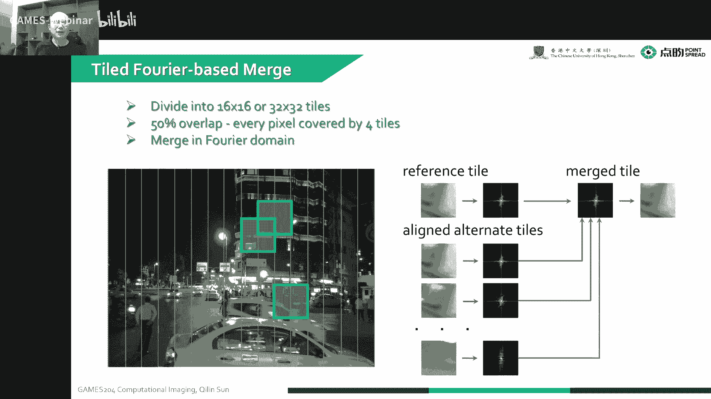

# 06.高动态范围成像与手机摄影 ｜ GAMES204-计算成像 - P1 - GAMES-Webinar - BV1KS4y147tp

啊时间差不多了，我们先说一下，就是那个作业的事，就是前两天我们把上周末把作业布置下去了，第一个嗯难度不是特别大，是写一个基础的sp啊，有些同学会问到，就是有一些我们会给一些基础的参数。

这些参数就是大家不要被这个参数局限住了，这个参数给大家的只只是一个初始值，是需要大家去调了，去调去看它的效果的，最后呃其实也不是很局限于呃，像我们slides里给的一些就是最后的一个结果。

就是大家可以自由的发挥，就可以调到让你视觉上最满意的一种效果，黑电瓶啊，大家可以呃就调到小数位啊，这些都是没有问题的，就是大家可以仔细调一调这些参数，去看一下到底是什么样的效果。

嗯而且这个我们最后交作业的时候呢，就是啊这个作业可能会比较大，就大家就是在系统里面只是提交一个压缩版的一个报告就可以了啊，还有交一个就是有比较清晰的图的一个报告的时候，嗯。

就建议大家我会给大家share一个one drive，因为那个系统也不是支持，也不太支持特别大的一个嗯这么一个文件的一个上传，就是大家以命名规则，待会会在群里发出来，嗯然后。

在整个系统里面呢就放一个压缩版的一个报告啊，这样的话大家也记好，打分也好做一个记录，啊第一次作业也是有关i s p嗯，然后就是第二次作业啊，会在第一次的作业基础上做一个延伸啊。

会让大家实现一下比较高级的一些算法吧，还有一个就是嗯比较复杂的一些去噪的算法，上一节课我们讲到了一个方法比较简单，嗯，其实呃我们需要再补充一下。

去把一个bm c d或者是not call me lome去实现一下啊，这样的话就大家对这个东西会有一个更深刻的理解啊，就是前两次作业就实现了一个呃效果比较优质的一个呃，i s t的pipeline。

这个怎么去做，它其实大家慢慢做完之后都会有一个比较深刻的一个认识，然后这前两节课之后，就是现在我们是已经是第六节课了啊，第六节课之前呢，其实我们这六节课都是一个比较基础的内容，从下节课开始。

我们开始会开始就是覆盖一些啊，整个光学的一个部分，就是它那个imaging tbox是分一个光学部分啊，像我们的相差分析啊，还有我们这个点破的函数怎么设计啊，这一个有一个image to box呃。

这个image top讲完了之后，因为，我们光学对计算成像来说是做一个调制嘛，嗯然后呢就需要用算法来解调算法的部分就覆盖啊，像一些物理学的算法和一个基于deep learning的算法。

还有a d m m或者是prom operator，呃，会给大家在就是三个算法里面啊，去挑那么两个去详细的讲解，然后大家可以根据这个讲解来实现一个啊，比如说对光学的点矿的函数的一个逆变换。

或者是实现一个就是呃single pixel camera，这样来作为第三次作业，就是这每个作业都是划环相扣，就希望大家能够紧跟这个步，伐就是真正的把计算成像这门课学好理解透啊。

其实这个后面就无论是大家做学术还是做一个上应用，都会有一个非常好的一个应用前景，今天给大家讲了一个主题啊，是一个hdr里面体，这个在当今的一个就是手机的计算摄像里面是非常重要的一个课题。

也就是我们的信噪比并不高，性价比并不高，所以说后来就是呃大家会发明出了非常多的方法，有那种等长曝光的，比如说报是几张图片，通过等长曝光去拯救它，是noise，那本身位数也比较高，可以是12位，14位。

且可以一定程度的实现一定的hdr，然后再通过他买品可以显示到大家手机上，而实际上还会有一个一样的不等长的曝光来实现这么一个hdr啊，但是这个burst中间的一个过程呢会有很多的好像alignment呀。

或者是像在tm creature里面处理一些细节，这个大家需要注意。

今天这节课呢就我们会从一个就先给大家简介一下，这个现在的一个流行的一个image format，这个花那么两页slides去讲一下，然后就开始给大家讲。

今天的主题是整个hdr成像在我们的手机摄像里面是怎么实现的，因为其实hdr成像里面有非常多的方法，我想提高满井容量呃，去做的多帧融合，去做食欲的调制，空域的调制嗯，还有像一些特殊的神像细节。

但今天我们讲的就是呃大家最常见接触的最多的一个手机成像，这么一个hdr到底是怎么实现的，也就是所谓的大家所说的一个多曝光如何啊，当我们就是做完融合之后，拿到一个非常高位的一个啊。

很多位数的一个就是hdr图像了，但是这个动态范围又特别大，这个大了之后怎么办呢，就我们要怎么样显示到我们一个八位或者十位的显示器呢，这个时候就需要把它的一个动态范围进行压缩。

但是压缩的时候我们又想尽可能的保留亮处和暗处的细节，这个时候就需要做汤卖品，然后还有一些介绍了一个两个经典的一个，在手机里面成像里面应用的一个算法，就是一个新的叫the next slug。

一个tomap的一个concurvature ti的一种方法，还有另一个就是著名的hdr plus，也就是burst alignment这么一种方法，哪来的。

嗯这节课就接近了非常多的一些优秀的一些size，还有lynx，还有fdm，还有lv，还有像google research的一些呃经验，首先给大家就是讲一下这个常见的一个image format。

就是我们日常生活中啊，这一常见的一些就是图像，它到底是一个什么样的一种表现形式，比如说哈就是我们最常见的叫t i s f或者tag image file，tag image file。

这个也叫嗯标签图像文件格式啊，它是一种比较灵活的绘图模式，主要用来存储啊，像那种照片呀啊或者是艺术艺术图像之类的一些图像，它是一个比较高质量的一种图像的一种存储的一种格式。

其实这个太这个这个这个t r f f或者tag image呃，和那个p n g啊，它的一个代名词呢其实就是非常高的质量，嗯，它是一个没有压缩过的一种呃一种一种图吧，可以上显示嗯上百万种颜色。

而且但是没有压缩过呢，所以说啊它的占比就会比较大，但质量就比较高，所以说用途呢就是像呃出版印刷呀，喷绘啊，写真啊，呃这种需要就肯特高质量的这么一个用途，当然它的一个也可以存储一个透明的通道。

就是来作为嗯，比如说我们像设计素材的这么一种需求，另外一种就是常见的格式，就是beat map，也就是b m p格式的，它也是没有压缩的，就是纯绘图，还可以有每个像素里面就是rgb 3个通道。

382 14位这么一个图像格式，还有一个最常见大家日常生活中接触最多最多的叫japc，就是叫jin photographic experts groups，这种是大家日常生活中最常见最常见的一种图像。

它支持一个非常高的一个级别的压缩，但是嗯这是一种有损的一种压缩格式，所以说通常说jpeg因为呃经过压缩，它体积比较小，所以说就很容易的在我们的网络上啊去传输啊，特别是在显示在网页上啊，去加载网页的时候。

唉这种jpg图像就非常有优势，体积小嗯，结算也不是特别复杂，它编辑码啊基本上就是呃做一个d c t啊，或者是呃做一个量化啊，这么一个比较简单的那一种便利吧，然后gr f这个其实大家都很熟悉啊。

这个gr f就是大家经常会看到那种搞笑的动图啊，其实啊它最大的一个特点就是这个东西它是动态的，而且动态之后呢，它体积又比较小，这个gf为什么到了今天，虽然它存图像质量不是特别好啊，但是直到今天。

就是依然有很多的新的这种动画的一种图像格式出现之后，但是这个gf还是表现出了一个很顽强的生命力啊，这个就举个简单的例子，像我们的一个png格式，我们压缩一个png那个代码其实挺大的。

就是大概有500k的这么一个代码，还要加上z lib这种一种压缩方式，但是gr f本身的编解码，大概你写个千万行代码就可以，完全就可以很容易地实现，就是它的编解码比较容易，然后加上体积比较小。

又可以播动画，其实嗯这个东西是非常好的，那另一种就是我们网络上常见的叫p ng png呢，就是跟jpc不一样的地方，就是png它的压缩是无损的，然后呢除了无损之外。

还是可以呃保留一定的一个就是透明的通道，这个透明的通道就可以作为像大家图片编辑的素材啊，就需要有透明效果，这个时候就比较推荐使用，看它的缺点就是它的体积会比jpeg稍微大一点，它压缩率没有解pk这么高。

然后下面就收到一个饶土，就是大家相机啊，特别是单反相机拍到这么一个绕土，cr two啊，啊，像dng啊，还有像比如索尼相机的一个点a r w，这都是一个绕图的一种格式，它是一种完全没有压缩过的一个图像。

为什么要绕呢，然后就是就是生的嘛，就是没有经过加工，所以说这个饶文件，它是保留了我们整个呃数字图像传感器的一个最原始的信息，像iso的设置，我们上节课已经看到了一个点绕图像的一些呃matter设置。

光圈快门这些，信息，然后本身它又是rggb最原保留最原始的图像，他就可以理解为嗯，像我们在一个模拟摄影时代的一个底片的这么一个东西，就经过对底片加工之后，我们最后才能拿到一个呃比较好的一个最后的图像。

然后最后说一种叫ex r格式，就是大家做图形学的时候，经常会遇到这么一个ex r的格式，其实ex 2呢有时候也叫这个open ex 2，它是一种开放标准的一种高动态范围图像的模式。

嗯其实这个用来存储数据啊，或者是呃存储一些高度发尾的图像，这个它就有一个比较大的优势，它除了，像呃现在我们常见的像八位啊，12位的图像，它可以存16位或者32位的一个flow的形式的格式。

那通道也可以随意改变，就是大家存三个通道，四个通道，五个通道，十个通道哎都是没有问题的，这就是e x r格式的一种优势，这个open ex呢最早是由这个叫工业光魔这么一家公司开发的。

它是一个呃最早是用在这个最早用在一个电影里面，叫叫哈利波特嗯，哈利波特与魔法石，可能是那个电影算是最早运用到ex r存储这个我这个电影文件的，然后从那个之后就是open 0 gx 2，逐渐就。

成为了一个很多电影里面去存储这个高端化学图像的一个工具，就是它的一个这ex格式的，可以把一些很高光，像那种defuse在漫反射呀，像阴影啊，就是透明通道呀，rgb啊。

这就是如果我们对渲染的时候渲染出那种图像的画面，高光啊或者是漫射呃，就是觉得不好的时候，就是我们可以人工的去通过这些通道进行调整，来产生出来一个更完美的一个画面。

也就是我们这一个多通道的那么一个多位数的这么一种就存储方式，会有一个比较好的优势，然后另一些就是呃像打印里面常见的eps，就是这个是一种矢量的一种表示方式，它可以直接记录他一个线条，就是文字的存储啊。

嗯像都可以有那个是贝塞尔曲线，不知道啊，这个都可以直接去用过，这通过这些方式啊，这个eps格式来存储出来，还有一个就是大家就用到了pdf，这个都是通常在文档里面用，嗯，它是一个pdf。

是一个非常好的格式，它是很接近一个标准的一个呃规格，就是大家无论是操作处理显示啊，都是一个比较有优势的这么一种格式，啊最后一种就是svg，这个叫scannable vector graphics，嗯。

它是没有一个损失或丢失的，它是嗯它也是一种矢量图，就是可以呃对对，这种在那个网页上显示呀，这种都会比较有的优势，那下面讲一个今天的正题，就是high mac range美景，我们知道这个动态范围啊。

就是实际上简说简单一点就是最亮和最暗之间的这么一个关系，就是我们就是更粗略的来说，就是对比度，就我们能展现出来或者是捕捉到最亮的亮度跟最暗的就是那种亮度，两个之间的比值，实际上就是动态范围。

我们自然界的动态范围是非常大的，其实呃最大的时候可以做到40个stop，就是上节课我们讲到呃，这个一个stop就是二的，就就是两倍，就40个stom吗，就是40多个stop就是二的40多次方倍。

这个动态范围是非常大的，所以说呢捕捉自然界中这么大一个动态范围的一个呃，光线的一个分布是非常困难的，所以说这个同学们就发生了这种非常多的一种方法，来实现这么一个东西，首先为什么要捕捉a t点。

因为呃我们那个传感器啊通常是十位，12位，14位，相比我们自然界里面40多位这么一个大动态范围，这个嗯范围是实际上是很小很小的，就是我们只能捕捉到一个12位或者14位这么一个小通道的范围。

这个举个简单的例子哈。

就是我们当然你看现在我们这一些灯光已经过曝了的情况下，这些灯光已经过曝了诶，但是亮亮的地方呢我是一点没拍到诶，这个时候你能说它它动态范围，小王其实他已经有了一个14位的一个动态范围了。

但是它还仅仅能表示出来从最亮到一个呃就比较亮的一个位置，但是它暗的地方仍然是排不到，那这个怎么办呢啊同学们可以说哎这个我可以增加曝光时间，对我们就来继续增加曝光时间，增加曝光时间之后。

我发现这个暗部的细节明显的变好了。

对不对，但是有一些灯光呢这个时候已经过曝了，就我更亮的细节的地方损失了，暗地方稍微好一点，但是暗的地方也不够亮，当我们继续的这个增大我的一个曝光那两个stop的时候。

所以说但是这个亮部的地方就是它a完全过曝了，这个时候啊，就大家觉得划不来，是不是划不来之后要怎么办呢，它受限于我们的那个传感器的动态二，对不对，让它变得更亮了。

那会儿哇，好家伙，这个亮的都已经完全看不清了，不好意思，这是上一个是零四stop，这个已经亮了，看不清了，所以说这个但是暗的地方又变得非常清晰，诶，这个是怎么办呢。

每一张图像都只能捕捉到它一个相应的一个动态范围，唉所以说有一个聪明的人类就想到出来这么一种方法，诶，就是我可以把这多张图像融合起来，来实现一个更大的一个动态范围，这个这个思路就是呃非常简单粗暴。

但是又非常有效的一种方法，然后呢通过一定的汤白品，大家也可以啊。

真正的把亮的暗的细节啊都同时的展现出来，因为这个我们对一个很高档的范围的图像，如果只是简单的啊去把它一个对比度拉下来之后，就是比如简单做一个skilling，我们感觉到很多亮的地方。

暗的地方并没有做到一个非常好的效果，所以说就是我们要把一个大动态范围的图像，完美的展示在我们一个小动态范围图像的显示器的时候，简单的一个student是呃做不到这一点。

所以说呃这个我们获得hdr图像之后，要显示出来还要经历的一个过程叫做tmp，我们怎么样去做一个好的一个tomaking，来更加的增强它的一个细节。

来让我们的整个图像更加完美，更加漂亮，唉这就是我们这节课的一个任务。

说到这个hdr成像呀是为什么呢，就是我们这个本身传感器的这个一个。

它是有一个叫量子井这么一个东西，就是也叫well capacity，就是这跟我们它这个井的容量跟这个像素大小是有关系的，它总是有一个上限在那个地方，那比如说我们一个4。

25微米的一个像元尺寸的一个传感器，他可能大概能存12000个电荷，就是它的一个井容量就是12000个电荷，6。5微米稍微大一点的像素就可以到4。5万个，这个这个电荷到11微米的像元呢。

就可以乘到a80080000 个电荷就越大，这个像素越大，除了我们之前讲到的一个性价比更高之外，它那个满减容量是变得更大的，但是呢就是我们这个平时用到的一个图像传感器啊，它为了一个面积的问题。

就是我们想让面积更小，这样的话它成本就可以做到更低，这个时候诶我们动态范围其实也是被压低了，除此之外啊，这个井容量啊也不能无限的变大，因为变得非常大之后，比如我们要一个像素，一个像素做一个1微米。

就是100微米，一个像素，这个行不行啊，能做出来，但是这个时，候它整个积分变得就是不是线性了，就光电效应在往里面积分的时候会变成一个非线性的一种效应，这个时候对我们后端的sp处理就变得非常困难。

所以说这个总有一个就是没有办法让完美的那么一个折中在这个地方，然后除了这个之外，就是减容量之外，他还受到一个a d c的这么可造成的一个影响，就实际上嗯我们大部分的一个hr成像的系统。

很大时候啊它的动态范围都局限于噪声，比如最亮的时候是6536，就按的时候是零，但是我有噪声的幅值到了十诶，那你这个对比度就是6536比好的十，对不对，其实这个噪声它也是一个噪声受限的系统。

同时它也会受这个我们魔术转换a d c的一个量化的这么一种影响，其实都限制了我们中的动态范围，这个其实就我们知道这些在动态上面，是有限的，但是没有想获得这么一个hdr图像，哎这个时候要怎么办呢。

就刚才讲了啊，就是我们想要把这么一个比如说像八位啊或者十位啊，14位，12位的这么一种呃图像合成一个像16位，18位，24位，32位的这么一个更大的范围的动态范围的图像。

这个时候我们就需要呃一个最简单的一个方法，就是多次曝光融合，那我先看一下这整个的overview啊，就是呃要做一个hr融合呢，首先我们要把这个camera response curvature。

也就是我对亮暗的一个响应关系能拿到，因为这个响应关系如果是线性的话，就变得非常容易处理，但是如果经过一定的sp之后，比如说是一个jpg图像。

他的这个这个camera restaurant curvature变得非线性了，这个时候处理就需要我们提前把这个呃图像的一个呃。

就是camera response curvature调到一个线性的状态下，再进行一个增长范围的融合，这样的话就可以获得一个比较好的连续性的一个效果，然后第二个呢就是我们要做融合嘛。

我们就需要获得一系列的这么一个ldl的图像，来获得一个hdr图像，或者是32位的这么一个hdr图像，最后然后呢就是通过啊这个convert。

我们把这个就可以转化到真实的absolute radiance，或者是globe，通过global skin来存储这么一张图像，当然也可以啊进行一个logo套卖品啊。

然后去增强一下它亮的按钮的细节来显示出来，这个这个response curvature呢其实挺简单的。

就是大家，就是我们可以用一张饶图，也可以用一张jpeg图，但是我们要知道它这个响应的曲线，我们可以用一个cabbation chart来实现这个东西，就是这个这这个东西叫色卡呀，叫比色卡皮塔。

除了颜色块之外啊，我们会下面会有一些灰度的块，就是代表了一个不同的一个灰度值，因为这些灰度值啊本身是一个线性分布的，唉我们就把这个呃像素块对应的值，就我们图像拍到的那个值，无论是jpg还是呃饶图啊。

嗯可以通过这个值来做一个呃这个pixel value进行一个对应。

如果诶如果发现是线性的牢狱，它肯定是线性的，它不能完全是线性的，它基本上就是线性的，大家看基层认为是线性的，而这个时候大家就比较容易处理它一条直线，但是经过一定处理之后，比如说jpg诶。

我这个时候他就是拉拉亮出了一个mile t，也拉出一个highlights，而低处的时候呢，它也也不是一个飞行用的，这个时候我们要想变到线性域里去处理，就要把这个图像呃，先拉到一个新星域。

这样的话就可以把这个jpc的这么一种呃，这个this response curvature拉成一条线性的一个玉，也就是说我们通常拿到了一张就是jpeg图像诶，我要先把它变到线性域。

就是做一个这么一个函数的逆变换a，然后再进行融合，其实这个这个a s d r融合其实就是非常简单粗暴。

也就是把一，个线性空间里面的一个就是线性的一个camera response的，一个一系列的这个曝光的图啊，融合在一起对吧，然后拖了一个hr图像，但这个融合怎么做呢，就我们在变完之后，变到线性域之后。

唉我们就可以对这些一系列的这么一个线性域的一个图，通过这么一个加权，这是一个高斯的一个加权，唉我们这个每一张图的系数啊，是根据这个中心这个亮度有关的，偏差越远，就是说你最后算到的系数越小。

离这中间的mile to越近的时候，哎我们就算到这个权重越大，最后通过这么一个呃权重的加权，最后简单粗暴的就把这个hdr图像融合起来了。

然后我们也可以对一些在其他的color channel用同样的一个权重进行融合。

这样的话就可以获得一个就是像样的一种效果，但是我们这个时候究竟对他来说是怎么融合呢，其实呃我们要是本身是定义一个就是list quare objective。

就是一个欧盟，我们要尽可能的就是优化我这个线性的hdr图像，跟我嗯各个权重之间的各个权重就是我跟不同曝光之间的一个差吧，也就是，但是我们这个地方为什么要由这个对数图像呢。

就是我们用了一个叫对数加权的这一个东西，因为这个对数加权是因为呃考虑了人眼的感知特性，就是它做人的一个视觉效果是比较好的，就是我们要最后要在不同的一个就是exporter time下。

然后解那么一个优化函数来，最后嗯实现就是算到呃我实际的一个hr图像到底是什么样子啊，说了说到这个人影的对手响应啊，就是我们还想到其实现在是有存在这个对数传感器的，就是它本身这个传感器的响应啊。

就是有一个对数响应，这个大家课后可以查一查看一看，那我们把这个objective方程o写出来之后，然后我们要想把这个hr图像截出来，怎么办呢，就我们要对这，因为这个明显嘛它是一个凸函数。

就相当于一个嗯简单一点理解就相当于一个一元二次函数，虽然它是一个比较一个线性方程嘛，但实际上我们这个解他的时候就可以用一个最小的乘法，或者是呃大家偷懒一点，因为它是凸的嘛，它整个是一个凸的这么一个形状。

我对它求导，然后等于零，就是它的，极值对不对，然后a我们就可以对它求导，对这个d o b d log x，因为求导它变量是log x啊，记住，让这个导数等于零。

最后我们解到了就是这个嗯hdr图像呢就是在对数域里面，他这么一个加权来获得的这么一种图像，这个就实现了一个hdr的merge。

然后还有讲到一个概念叫叫relative跟这个absolutely readings，就是仅仅是给了一个相对的一个radi，但是我们最后拿到这个hr图像的时候呢。

呃是可以根据一个参考的一个radiance，来达到一个真实的这么一个radiance的值，嗯，这个也就是一个系数问题，大家就可以注意一下，这个可以直接获得这个radiance的值了。

就刚才讲到了这个hdr图像是怎么获取的，就我们通过一系列的mod啊啊，或者给一定要的权重，通过在log space域嗯，我对它一个求导取极值，然后就可以把这个hr图像解出来。

但是这个时候我们要想把它就是比较好的这么大一个32位的图像，这个我们要想完美的展示在我们这一个八位的这个l dr display。

因为我们知道我们这个图像显示器就是这个display a monitor，它通常一个八位的红色通道，绿色通道跟蓝色通道都是一个八位的这么一个图，但是我们比如说我们获得了一个32位的一个a7 r图像。

这个时候诶怎么把这个32位的图像显示出来呢，就我们的显示设备的动态范围，是远远小于这个acr成像结果的动态范围，所以说对这个这个结果其实也就是这个结果的一个增加为太大了，就说我们这32332次方。

这比一这个跟那28x256比一，那个是差太多，所以说这个时候我们要显示的时候，就需要做一个动态范围的压缩，对不对，就是简单一点，就是刚才讲到了，我们做一个线性压缩。

我直接把这个32位的图压到一个0~25之间，诶，这个时候好家伙，这个很多细节就会丢掉，但是就只能保留到一些非常high contrast的一些，就是很很高对比度的一些范围的细节。

其他的一个对比对小呢在这个压缩过程中也都已经看不到了，所以这个怎么压缩呢，其实这种常见的解决方法大概有两类，就是第一类就是一个做一个全局的动态压缩，比如说像呃使用像类s的曲线，或者是rx的。

或者是a c e s的像素调整，就是这个像素调整呢本身就与像素的这个intensity有关系，但这个时候，这种话比如直接做一个呃伽马呀什么之类的，这种方法速度快，很直观，那可以避免光晕啊。

或者是饲料逆转，但是这个时候这种玩意儿非常容易破坏，就图像通道之间的白平衡也会丢掉局部细节，第二种方法就是大家所说的这个局部的一个动态范围压缩方法，就是local糖卖品像素的调整。

跟淋浴的一个亮度分布有关系，也是局部的方法，可以保留更多的细节，但是计算十分耗时嗯，很容易引起噪声，并产生一些光晕的这些问题，所以说这个嗯大家在这个方向做了非常多的研究，就是local糖。

白品我们就要保留细节，但是又不想破坏它的分布，那也想不要产生光影，造成这个时候啊，大家就是进行了非常多的一些成果，当然也取得了一个非常就是好的一个效果，并实现了一些呃工业应用。

就是我们可以看到啊这个hdr图像的时候这么一张hdr图像，我这个亮的地方太亮了，这个时候我就拍不到，就是我显示不出来这个亮部的细节，这个暗部的地方呢又太暗了，太暗了，也没有办法显示，对不对。

这个又有光暗的地方，又有饱和的地方，这个就是显示的不是很尽如人意，诶大家就是讲了，我们这个做一个简单的伽马，可不可以，我比如说直接我在一个图像上开个呃，2。2方分之一这么一个根号就行不行，诶可以。

但这个时候就会有问题啊，就是我们在直接开伽马的时候，就它的白平衡会被破坏掉，也就是我们这个呃颜色就是就显得很苍白的那种颜色的感觉，就是颜色也会发偏发灰，诶这个时候大家觉得嗯这个不是很完美，对不对。

哎不是很完美，之后大家就有想通到这个我们色彩就是我不想被色彩受影响了。

这个我们把这个色彩分离开，是不是就可以了，所以说有的同志们就很聪明，我可以变到外语v语，我只对这个y亮度做一个糖白屏，诶，我保留这个彩色的通道，这个时候我只对这个亮度和伽马，对不对。

但是这个时候呢你做完伽马之后，他最后所实现的一个intensity details，还是会有丢失，就是我亮度的地方还是会有丢失，这个时候嗯也不是很完美，是不是，所以大家也还是呃想获得一个更。

好更好的一种方法，这个怎么做呢，所以说这个时候人们就有一种这种基本思路，因为前面讲到了就是把呃这个亮度跟这个彩色的通道分离，但是分离之后呢，就是大家会发现这个细节会丢失，这个怎么办呢。

然后再延续这个思路，再往下去扒一层，就是我们可以使用各种滤波的手段，就把这个hr图像分解成基础层，就是也就是base层跟细节层，details层，唉。

我们这个细节想要就contrast的细节想尽可能的保留，但是呢又对基础层做一个对比度的压缩，这个压缩之后的基础层跟原来的细节层相加，就呃得到跟保留了细节层的一个定增范围的图像。

但是这个就会带来一个问题啊，就是我们怎么样分解这个基础层跟细节层，然后呃如何对这个技术层做一个动态范围压缩呢，你分离的方法是，那当我们分解这分分离这个基础层跟那个细节层，是有比较多的一个思路啊。

其实这个低频的地方就是平滑过度的地方，高频的地方就是我们亮度突变的地方，就是也代表了一些contrast跟纹理的信息，简单一点我们就可以用一个呃高斯滤波，但是这个高斯滤波平滑过后嗯，就丢了非常多的细节。

这个平滑过后的图像我们细节丢掉了嘛，就可以作为一个基础层，然后呢我们这个用原图减去这个平滑图像哎，就是丢失到细节层，就可以看到细节层，当你用不一样的滤波器啊，就可以得到不一样的分离。

说这个我我这这这个就讲这个用bletter filter，就用保编渠道的一种方式来对这个输入的hdr图像，它那个intensity呃来进行一个细节跟一个details。

跟那个base layer跟基础层的一个分离，就我们做一个快速的双，倍滤波用上保镖一场渠道，对不对，然后我们对这个贝斯的也就是低频的一个层做一个呃，就是动态上面的压缩，也就是这个let go的压缩。

然后这个details层了诶，直接保留，最后把这个d t l跟logo再融合在一起，再把之前的一个彩色通道加上，这个时候又可以比比较好的保留intest的一个contrast。

就可以比较好地保留这个颜色，然后同时又对一个低频的一个大动端行业进行一个压缩，最后就实现了一个比较好的效果，然后引申到这个地方啊，其实这种方法大家可能在别的地方也看到过，但这个时。

候就对应着就是hdr系统显示的方法，这个之前就是呃我们这个是我们当时是我们实验室啊，最早定了一种叫bpack technology，它也是基于这种思路。

就是我们就是他只是做了一个动漫高动态范围的一个显示器，因为我们现在日常的显示器啊，就很多时候就是背光的时候，对不对，但是我们的思路是，我们想要通过一个低频的这么一个更大的动态范围。

来展示这么一个hr的效果，所以现在大家市面上看到了很多的a7 r的一个lcd的显示器，有种技术叫动态背光，就我们，后面这个显示器面板后面有很多个呃小的一个led点亮阵列，然后前面是一个我们lcd层。

这个时候就相当于在低频做了一个动态范围的一个放大，也就是说我们可以用这种方法来实现一个hdr的显示，就来显示更大的动态范围，就是让肉眼真正的可以看到更多更亮更暗的信息，那同时它也是在一个低频域呃。

来就是进行动态照明的，所以说这个时候啊就可以很好地保留它的一个显示的一个细节，这个叫技术叫bacchnology，大家可以去搜一下。

唉这是一个呃用这个用batter filter做一个local tmap的一种呃效果图，就大家可以很清晰地看到这种细节是被很好的保留到了，就是我们在这个基础层次细节上分离的时候啊。

已经用到了一个双边滤波器，当然这个还有一些比较更先进的方法，就比如说这个local reaction filter，就是这个嗯是可能是工业里面一工业界应用了一个就是最先进的方法。

就已经是我们知道有一些公司已经对这些产品，就用这些方法对一些产品进行了落地，就他可以嗯最大程度上的就是实现一个比较平滑的这么一个亮的，暗的一个拉伸的这么一个细节。

就把亮的就是细节跟暗的细节尽可能的多的保留出来，那下面给大家讲两个，就经典的一个手机图像处理的这么一个修手机里面，计算上演的这么呃classical的一个method，比较新的一种方法呢。

就是就是我们会有什么问题哈，就是就我们在比如说拍一个夜景的时候，就是不一样的一个tc位置嗯，就是在一个夜晚上，我如果太亮的话，这个烫水拉太亮，哎，这个时候这个图看着好像白天一样。

这个时候究竟是白天还是夜里呢，但是我如果我这个图太暗的时候，就是很多就是暗处的细节是没有办法拍清楚的，对不对，所以说这种问题就比较难解决，量调亮了也不好，调暗了也不好。

然后但是我们调节的创客vature的目的是什么，第一个目的就是我们要压住就暗处的噪声，因为我们知道暗处的噪声虽然小，但是我信号也小，我其实s n r就是一个一个psr，就是我那个心噪比是变得更低的。

所以说造成显得就大，那第二个是我们这个汤要把这个这阴影部分的细节尽可能放大，对不对，我们想要呃让整张图像尽可能的曝光在一个middle town那个位置，而不是呃那个过量或高的位置。

但是同时我们要保住这个亮部的一个信息，所以这个这个套是怎么获得呢，这是google团队最新的一个呃论文。

这叫the npc look，这个这个大家他们自己称叫npc look的一个paper，实际上是一篇sequars的paper，叫c你extreme dark，大家可以翻一翻，后面会给出链接。

像传统的一种手机处理的方法叫hdr plus，这是叫hanive，也是google pencil团队呃，跟也就是马克老魏老师的团队里面做了一种baseline的一种方法，它是呃融合了13张。

曝光了一张图，总共花了啊，就是1/15秒，它大概的一个图像效果是这个样子。

当加了这么一个new tmap的一个在这个baseline里面诶。

就是我们就把暗处的细节拉得更亮一些，对不对，那把亮出的细节就是也是保持住了，但这个时候我们就发现而通过这种方法直接调这个comment，唉我就发现这个暗处的噪声啊是比较大的，但是这个是我们不想要的。

对不对，如果我们想要这个抑制这个噪声，最简单的一个思路就是延长曝光时间，对不对，通过延长曝光时间，我们就通过积分之后，这个就经过一定的积分，然后就可以把这个噪声心脏比提高来抑制住嗯。

这个后面的一个那个后面的这么一种噪声吧，但是这个曝光时间太长，比如说像这张图有个1/3秒，这个1/3秒，无论是人手抖一下，还是这个相机在运动，那这个这个噪声啊。

就跟这个呃这个motion blur也就产生了那么一种天然的一种矛盾，就我想要保这个没有motion blur，这就造成大，但是想要，噪声小，这个就motion blur，因为这个时候大家就很难受。

对不对，所以说这个时候这个googpixel团队就做了一个呃，就是把这个motion blur，就是motion deep，就再放在那个末日里面，就我们可以我们可以看到。

做了一个motion debra之后，我们这个整个的图像质量就会有一个明显的提升啊，这个时候我们可以看到这个图啊，还是有问题，我这个即使我们在融合的过程中把这个motion不给抠掉了。

但是嗯它这个整个烫就整个颜色其实并不是很真，它是有些偏红的，其实这个对我们很多就是暗，就是暗夜视频或者是暗处拍照的时候，它的颜色就是它的白平衡是非常困难的，就说说现在有很多论文啊，还是很多企业呀。

就这种集暗处或者是非常暗的一些地方来做一个比较好的拍片，白银衡通常是用一个呃，小的神经网络来实现这么一个呃白平衡的一个ti。

所以说当时这个google pixel团队就做了这么一个auto white balance，这么一个work就可以比较好地实现一个呃暗处成像的一个色彩。

先给大家看一下结果，然后再给大家呃揭露一下这个到底是怎么实现的，就我们可以很明显地看到这个hdr plus就是比较传统的一个呃。

13张图的一个位置，就是比较短的一个曝光，跟这个长曝光加上motion debra加上autoy balance这么一种新的方法啊，这两个都是google googpio团队做出来的。

但是我们可以看到呃，经过了34年的这么一种发展，这个技术可以得到一个非常好的效果，也就是我们在拍一个很暗的一个场景的情况下，我们就可以拿到一个非常好的一种提升吧，这个是怎么实现的呢。

就先说这个呃比较经典的一个classical local tming，就是嗯这个这种这种方法叫一个呃最经典的一种classical的local tmap，就是叫premiere，premise。

就是金字塔，我们在金字塔为什么要做金字塔，要诶我们可以看到这个每下采样一次，我这个频率其实就咔嚓掉了一半，我这整个无论是拉普拉斯金字塔还是一个高斯金字塔。

我最后啊实际上就是在不同的频率之间进行做一个融合，然后这个图呢就是我们可以就通过把这个hr图像作为输出，我们先构建一个一个拉的一个一个金字塔，然后我们那个wmap呢可以用一个高斯的一个金字塔。

然后把这个进行一个融合，融合之后就可以拿到一个最后的一个final comp image，这个就可以消除边缘一些不好的一个效应，这个大家可以参照一下，看07年嗯，matrix嗯。

还有一个1年paris和14年的outbrea，这三篇论文就大家可以看一下呃，不一样的一个金字塔下的一个融合是怎么实现的，来这个就刚才讲到了，我们这个曝光时间长。

就我们input burst，burst就是拍一串图，就当我们拍了一串图之后，我们因为我们物体不可能是静止的，它一直在运动的，我们想要啊通过这么多次曝光来进行融合了之后，我就拍那么一串图像。

把这一串图像就融合在一起，对不对，嗯，然后这个时候我们会通常在这个，比如说我要拍13张图，就是google plus，就是hr plus，就拍13张图，我们会挑一张比较好的一张图。

当一个reference就一个图，但是呃就是论文里面大家倒腾着玩的时候，嗯可能就是选，那么可能选个最好，的一张图就是优化一下诶，选一下哪个图，评价一下哪个最好，但是实际嗯就是生产过程中呢。

就是大家就是在企业里面要把这个产品零件产啊，就不可能去花那么多计算资源去给你找一个最好的参考图诶，这个时候大家就会啊，通常就是可能就选一个前三章里面一个最好的，就就就就就这么算了，其实效果已经挺好了。

就可以忍了，这个时候他通常是在牢狱做的，因为饶狱里面它是一个噪声分布才是线性的，就我们的响应也是线性的，这个时候处理是最容易的，当然这个也会受到一些motion bo的一个问题。

大家就可以找一个reference frame，就是motion不知道最小的一个reference frame，然后把其他的地方往这个reference frame上去做line啊。

这个就跟呃图像编辑码了这么一种块匹配的这一种方法就是近似，大家去找这个不同帧之间相似的块，然后去把那个vector去计算出来去，然后最后把这些相似的块呃，在一个三维空间中去做一个啊，就是平均嘛就可。

以这么这么理解，这个思想跟这个编解码就是说h264265 啊是基本上是一致的，就是这个时候这个也就是大家嗯可能就是看各个厂家就是标榜的时候，就是3d降噪，其实就是这么一个简单的原理。

那这个时候大家通常就会一些做一个cross to find的一个alarm，就是我们这个图像啊，就是boss的boss拍的时候，他总会多多少少会受一些运动啊，手抖的一些影响，就他那个图像并不是像素。

并不是按严格的这么一个嗯排布，就是来一一对应的，所以说这个时候我们要想要设置一个cross flegnment，就是现在出的一个呃，就是这低频的一个领域里面是对齐，然后在一个相应的搜索窗范围内。

把这个呃那个匹配那个快去找到，找到之后，然后再去呃做一个就是这么一个融合，平均，相当于然后在这一个低频范围内找完，再一层一层的嗯，去找一个更高频的一个那里面的一个alignment。

然后这次找高频的一块儿的一个匹配，这样的话呃就是可以最大程度上节省计算资源，这个如果大家学过这个图形学的时候啊，这个思想就跟这个mip map这个方法是一致的，所以这个不只是这里哈。

这个金字塔在各个地方都用得非常多，就简单一点啊，大家可以看到这个unit，这也是一个crossf这么一个一层一层下载一样的一种方法，这个大家有没有想过这个为什么要做这个下载一样呢。

实际上这每一层下采样就相当于我的频率低了一半，实际上也就是相当于我在频谱之间去找它的一个特征，就是在低频高频的特征的一个这个融合跟拆散拆解再融合，就这么一种思路，这个无论是在这里面图像融合呀。

还有像弥补map呀，嗯还有倒是到底是这个unit呀，这个整个思想都是一致的，但是这种思想也一会在图像分类里面，这个整个特征的提取啊，分类啊，也都是用，到这种呃这种一层一层的一个金字塔的一个思想。

那这个东西已经占据了产业界跟学术界呃非常大的一个一个份额。

唉这个说到正事了，这个我们找了一个就是最最最没有谋生不了的这么一个参考图对吧，我们可以看到上面那个参考图的各个细节，然后下面我们就要把其他的一个图像往我们这张参考图上去一个alan。

去找一个相似匹配的一个块，然后去然后也可以做一个简单的维纳滤波去呃，接底边一下去逆一下，这个时候再把它融合在一起，这个怎么做呢。

这个我们通常是把这个整个图像就是分成一个这个叫tifa base的merge。

这个跟那个b m c d的这种想法是挺一致的，就是我们先把这个啊，这比如说把这个分成16x16或者32撤销的一个小块，诶，我这个小块里面我做一个dc t或者是一个f t的变化，就把它变化到频域。

然后找到一个相似的一个匹配块，在一个不同帧之间找到一个相似的匹配块，然后匹配块这个可以把它默认在一起，然后做一个平均就可以很大程度的降低它的噪声啊，这个啊不跟那个bm c d不同的是。

这个是在针尖之中找相似块，这个针尖之间长相的话，因为我们运动啊它都有规律，它这个整个运动的一个vector是比较好容易估的，就我不需要在一个很大范围内进行搜索。

所以说这种类型的一块匹配思想的一个3d降噪啊，就相对bm d是比较容易实现的，因为我们那个搜索范围不是特别大，当然我们是呃思路是大概一致的，我找到匹配的块，把这个融合起来，融合起来之后嗯。

然后把那个低频加上做一个逆变换，就把这个原来的位置融合进去，这就是呃大家这个3d降噪的这么一个思想。

比如我们把第一张图做一个reference frame，其他的一个图呢就相当于呃在这些块之间做一个家庭平均，这个它是按一个小那块匹配的一种方式进行交易，平均啊，平均完之后a噪声变小了。

我把这个把它默认回去，那这就大家可以看到就可以拿到一个比较好的清晰的，然后噪声就比较低的这么一张图像，这个做这个3d降噪啊，就是有一个缺点，特别是工业界里面就不是很喜欢的一个缺点，就是它需要存图。

我可能要缓存好几张图，但缓存图呢就需要用ddd r d d r呢就会有功耗，说这个3d，降噪其实在一些比较严苛的，就是需要高速低延时啊，就是低功耗的一些场景下嗯是比较困难的，但是它的成本其实也不低。

因为我们要存这么多图呢，就像可能是单独挂一个dd r唉，这个时候就会比较贵，当然嗯这个它也带来了很多无与伦比的好处，嗯就是它的噪声真的会非常好，因为我们用到了很多真的一个一个图像了嘛。

其实它的搜索也比较容易啊，这个就是后来因为bmcd已经算是一个单张图里面的最好的算法，后来又有蝙蝠就变ford，也是在三维空间里面去做一个类似的一种，方式，但后来后来还有非常多的一种方法。

但这本身这个bd已经嗯到达了一个挺巅峰的一种位置，就是这么多年，在基于块匹配思想呢，呃一种方法在产业界中仍然是得到了一个最广泛的一个应用，这当然讲到了。

就是刚才讲到的都是在绕力的一个处理，这个绕力这个墨子完处理之后，我拿到了一个呃12位，14位，一个比较高位的一个图像之后，哎我们还是要通过嗯这这么一个传sp的一个papi。

来最后实现一个更加好的一张图像，这一这个跟我们上节课讲的一个ip基本机制呃，这个就做了一个一定的简化。

大家可以对比一下这个hdr plus跟这个新的这个boost photography for heared and law，light image of mobile phones，这是一篇呃。

这两篇都是西瓜和西瓜fa上的论文，就对比的一个不同的情况，就是，atm h加plus用的就是全都是没有过曝的一张first，然后这个the united size呢就是用一个更长的burst。

然后在中间做一个motion blur，然后再进行做一个快匹配，嗯其实这个时候因为曝光时间更长了嘛，然后就把motion blur去掉了，然后就拿了一个更漂亮的一个夜景的一个图。

当然这里面还有一个非常重要的技术，叫叫他们自己实现了一个用神经网络做了一个auto white balance，这个时候因为解决了就是在夜景里面这个颜色会失真的这么一个问题，好这节课就到这里了。

就今天给大家分享了一个就是你常见的一些image file for mates，就我们讲了一个简单的方式，叫做hdr，就是margin就是不同呃，曝光时长，然后把默认在一起。

然后实现一个更大的一个动态范围，但这个动态范围显示呢，我要把它压缩到我们这个显示器可显示的一个范围内，来，尽可能地保留亮处和暗处的细节，最后给大家分享了两个经典的一个手机摄影的一种方法啊。

就是长曝光去去底部，然后再做一个auto buy buy，然后老的hdr plus呢就是短曝光，就and a poser短曝光来融合在一起，大家可以选一个这两种方法都是选一个参考图就融合在一起。

区别就是一个是长曝光，影视短曝光，然后还有没有一个差一个auto white balance，最后经过在这我们牢狱里面处理完之，后，来经过一系列的这个finish pipeline。

就是后面的i s p，最后实现一个比较好的效果好，今天的课就到这里，大家有什么问题可以提问一下，这个我可以给大家进行解答。

大家有什么问题吗，啊对了，这个作为第二次作业诶，可以给作业中间的图像结果吗，这个可以嗯，让就是助教同学给大家就是发一些这种中间的计算结果，其实这个大家都可以想象到，其实没有特别难的一些环节啊。

这就是与大家有哪些同学就哪些在中间的一些结果，你不是很理解的，就是你能想象不到的那种结果，比如说这个可以举个例子嘛，啊助教同学尽可能的给大家嗯找到一个比较好的一个参考，对调参调参没思路。

这个问题呢就是这个整体的你是需要一步一步的来，就是我们要先把这个线性空间里面去做好，然后再去呃去马赛克，去完马赛克就可以进行在整个图像的调整，就是无论是lga呀，做local tmap啊。

我们可以做一个local main，就是我尽可能的让亮处暗处它的细节更加美好，我给了一个最自由的参考图，大家可以往这上面考，想一想哪个环节到底是怎么实现的，这个大家也是这个第一次作业。

好像也不大可能去实现，就是最后参考图那种效果，就大家先把这个流程跑通，然后第二节课先把基本的参数大概知道是怎么调的，然后第二次作业啊会给大家讲一个就像hdr margin这么一种方法。

然后之后就通过mod之后再去调它一个参数，可以调到一个更好的效果，这个中间结果会让助教给大家分享一下，大家可以就及时去问助教，同学还有什么问题吗，好既然没有更多的问题，感谢大家来到gz 204呃。

大家回头好好做作业，下一节课呢嗯可能会让给大家一个gas lecture，就是可能不一定是周五晚上，可能是周六上午，就具体时间我会给大家再确认一下。

就是我们会邀请一个来自berkeley的康利同学来给大家分享一下，这个we found sensing是一个什么东西，就是去做标签拨弦调试，波形调制是有非常多的应用。

这个玻纤调制就可以测整个透镜的面型啊，啊可以测这个大气的扰动啊，可以让星星是怎么闪的，来通过这么一个分享来给大家呃，就是更加的吸引下一个兴趣，这也是作为一个呃后面的一个光学的一个引子吧。

因为呃这节课之后就会给大家嗯，让伊万老师给大家分享1~2节课的一个啊这个display的这个内容，就是再加这个简单的一个pipeline，学完之后最后要显示出来怎么display。

这个display内容要给大家实时补一下，对这个开门想要曲线是每个开门，这是啥意思，对这个实时渲染里面也会用龙虎套卖品，因为我们这个渲染过程之后，他会拿到一个非常大众的范围的。

图像我想要做一个比较好的一个显示嗯，就要把亮的按了，同时显示清楚，就会也需要做一个local tmap，就现在很多很多显卡或者是游戏，我已经支持这个logo卡卖屏了。

这个我记得一个是叫什么赛博朋克2077，那个时候暗处的细节做的不是很好，然后就会呃按的地方看的不是很清晰，但后来随着技术发展，我们首先是有了一个retracing。

就是实时的一个retracing的一个技术，就是全局光照这么一个技术，让图像显得更亮，然后再加一个logo，糖奶品，把亮的按了，再那么优化一下，就是最后大家有打游戏的，时候显得这个这个非常漂亮。

啊详细虚线，你这个你不是你记错，这个问你最后处理的时候是带绕域，直接就是线性的了，那个解pd有他自己的一个标准的相应期限，大家直接查公式就可以了，如果要是公式查的觉得不准的话。

大家就可以拍一个啊这么一个就是色卡呀，或者是灰阶卡，因为汇集卡那个值都是呃线性一一对应的，然后找到这么一个这么十几个点呢，我们就可以拟合这个函数，把这个曲线给拟合出来，按标准的一些图像格式下jpg呀。

它是有自己的一个标准的一个tcp ature绕一就更简单了，饶就是线性的，就不需要标，啊对给大家说一下这个大家叫黑电瓶的时候啊，就不一定非要嗯就用到我就是整个图里面给的纸，大家叫黑电瓶的时候。

可以很仔细的调一调，可以调到小数点后几位，大家可以看一看，这个要细细的调一调，黑电平亮了，暗了都会影响色彩啊，还有最后的结果的一种感觉，这个也不是一个固定值，大家都可以去调，可以试一试，好在今天感谢。

再次感谢大家，同学们来到game 204啊，今天的时间也到了。

