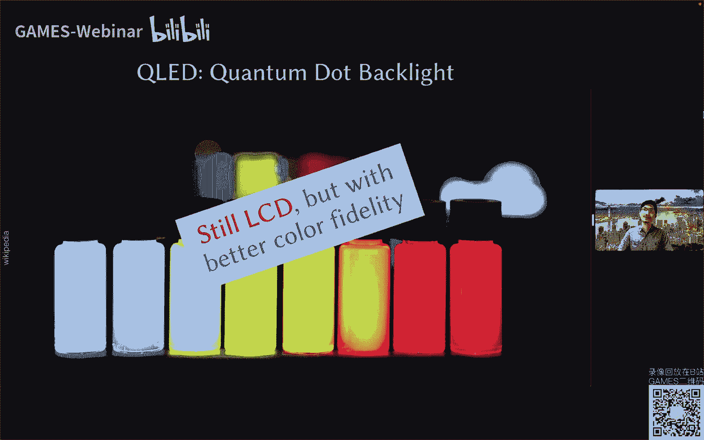

# 07.VR／AR主流显示技术概要 ｜ GAMES204-计算成像 - P1 - GAMES-Webinar - BV18g411r7Fn

OK那那个时间也差不多了，我相信这个技术的同事也做了很多的工作，非常感谢啊，那各位同学晚上好，这个我们上周由于是SIGGRAPH的会议期间，以及games的年度会议。

所以我们上周的这个games204的课程，暂停了一周对，所以就非常欢迎大家这个本周回来啊，那首先给大家说一下这个抱歉，由于我现在是在人在香港，所以在海外的IP，境外IP其实是这个哔哩哔哩的直播。

会有一些问题需要通过国内的代理，所以可能会有一些延迟，或者是一些嗯这个不稳定的地方，还希望大家多多包涵，那今天我们可能给大家讲一下，这个display的一些东西，因为之前几周的课程啊，孙启迪教授。

其实给大家在这个成像的一些基本的显示，基本的一些概念以及颜色，冷眼的一些信息处理方面，有一些比较基础的介绍了，那其实很多同学当时在弹幕也提到了，这个形式方面的一些东西，所以这周我们稍微花一个课时的时间。

来给大家简单的分享一下，当前的一些显示技术的基本原理，以及它可能在一些啊目前非常火热的VRAR，虚拟现实和增强现实方面的应用，对今天的这个课程可能会比较的出现，那其实只是一个抛砖引玉的作用。

就如果大家对这个方向还是比较感兴趣的话，那我们后面其实可以再花一些课程的时间，再好好探讨一下当前一些研究的热点，还有一些研究的技术，所以今天可能是更一些，怎么说。

就是display one of one，只是一个take off的一个课程，OK那我们开始呃，首先我自我介绍一下，我叫吴一帆，大家也可以直接叫我EVAN，来自香港大学。

可以大家可以看到我的slice吗。

因为我自己是看不到建这个延迟的，对所以我来自香港大学啊，最后一个简单自我介绍，香港大学的单位E跟cs一个john fish，然后我之前是在STANFORD的完成我的post store，博士后的工作。

在之前是在UBCBRITISHCOLBIA，英属哥伦比亚大学，攻读这个计算机图形学的博士学位，在之前是浙大光电的这个本硕对，然后我在这边主要的研究方向是光学跟算法的，高design。

主要是为了这个next generation vidual and social resistance，然后这边是我的个人主页，就如果大家对我的方向感兴趣的话，也欢迎就是到我的个人主页去看一下。

那也随时欢迎更多的宝贵的意见和沟通，那我这边其实也在啊，朝夕2023年的博士以及博士后，还有这个I等等，所以大家如果有兴趣的话，欢迎来探讨咨询，OK那我们开始今天的课程，我们今天在线上碰面。

所以我相信大家可能都已经习惯了，这种所谓的这个啊online conference，尤其是在3年的疫情期间，我相信大家也都会同意说。

Zoom every day i have more than right，所以其实是一个very few of pandemic windo，那其实我们也可以说它是一个很好的。

visual computing six的SUMPTION，那是什么呢，是所谓的teddy ication，所谓的视讯通信，我们说实际上这种啊telecommunication。

它是一个一个从capture到display的一个过程来，它是involve不同的这个啊DISPL，我们说希望好的这个视频会议，我们会希望有好的cameras，我们有好的sense。

但同时我们也希望获取的这个内容，可以在事件的另一头可以很好的显示出来，所以我们也需要有很好的display，当然随着这些年，尤其是疫情期间啊，大家这个技术的发展，如今的这个视讯通信已经做得非常非常的好。

比之前来讲，然而实际上我们依然是土地的这样一个，面对面的过程，而无法实现深邃地，所以你eventually，我们还是希望有这个three d的vision sensors。

He dirty displaced，大家显而易见，这个还有很长的学术道路要走，我们说这样的一个telecommunication system，它实际上是目前最火热的VRAR。

也就是所谓的virtual reality，meal reality的一个很好的平台，那我们今天也会从VRAR的角度来探讨一下，有哪些基本的体制技术的应用，可以去更好地促进VR和AR的一些发展。

那我们take a step back，回到一个很早很有意思的问题，首先什么是显示，从这个一个很枯燥的文字来说，我们说显示是把通过光板信息，以符号文字，图形图像的方式呈现出来的一种技术。

当然这是一个很官方的定义，那我们可以再细化一点，考虑到人眼来说，显示的对象是冷眼，我们说人眼的各种感知器官会从外界获取信息，视觉占据了将近60%的这个信息获取，同时听觉占据了20%，由此可见。

视听两个维度合起来，占据了能接收信息总量的将近80%，所以我们说显示是非常重要的，那关于这个问题，什么是显示，我们来看一个有趣的例子啊，回到100多年前这张图。

我相信之前这个孙教授其实也可能提到过，大家也看到过，在讲camera的时候，这是historic comments camera，Great strid university。

那我们曾经的step大农场，如何去获取这个啊奔跑的这个market的一个过程，但实际上当时是通过了一系列的这个camera rate，去拍摄的这个过程，这个是获取的，那拍摄完之后呢，我们希望看到。

接下来我们说这是一个显示的过程，right就当你把不同的这个啊啊films就是底片，the query的选显示出来的时候，你就可以看到一个单套的骏马，The horse in motion。

这是一个非常经典的拍摄和显示的案例，当然这是西方的实验，那同学可能会感兴趣，我们东方呢，我们说中国古人的智慧其实是非常令人惊叹的。

那其实早在千年前，我们实际上就有了日冕，通过太阳的阴影做一些显示，它其实也是一个视觉信息的一个感知过程，同样我们还有皮影戏，我们拥有这个走马灯等等，这些所有的这个中国早期古人智慧的这个东西。

都是早期的显示形式，于是我们再回到这个官方的定义，WIKIPEDIA是这么给显示定义，An awful device for representation of information in the visual tea form。

那这个teppt form实际上说的是说啊，一个触觉的这个形式啊，那在一些特殊的场合，特殊的群体，也比如说这个马来群体，我们也是希望这个电子显示有一个感知的过程，当然我这么解释。

可能大家会觉得还是非常的枯燥啊，无法有一个感知的直观的理解，到底什么是显示，我们来看啊，几个最再举一个身边的例子，Everyone watch team is right。

就我相信大家对电视都非常的熟悉，那第四个发展也是经历了将近100年的时间啊，这边我们展示了一张图，其实从30年代，50年代早期的这个非常啊boy，就是非常厚重的这样电视的模式，到70年代。

大家可以看到越来越像一个小的一个方盒子，那我不知道同学们小时候有没有经历过，这种所谓的一个啊厚重的这个电脑显示屏，或者是电视，它其实是一个球面的显示屏幕，我们称之为这个形象，我显示CRTY好。

我相信更多的同学可能是在经历了，90年代以及2000年代的，这种所谓的平板显示的电视，那这个时候呢我们就有了平面的的电视，而且它变得越来越薄，那在两千一零年左右，我们又有了这个所谓的客服曲面的显示。

这个电视完全进化到了一个新的一个模式，但其实我们是要显示不仅限于电视，那我相信有不少同学可能每年都会关注，apple的发布会，那我们来看啊，这个apple的IPAD更新换代以及IPHONE的更新换福袋。

除了越来越大的尺寸以及不断增加的重量之外，那其实每年显示的提升都是更新换代的，重型制作right，所以我们说mode formation display，大家可能会经常在看这个发布会，在看这个电视广告。

或者在卖场去选购自己心仪的电视和显示器，的时候，可能会关注到这些英文的缩写啊，CRT就是我们所谓的这个应急显示管，应急射线管，Story，就是早期的这个啊球面的这个电视的形象模式，那当然了。

我们现在可能更多的是PPT display，所谓的平板显示，包括了电容，包括了等离子LCD，OLED以及这个投影机等等，那其实你在市场上逛一圈，你会发现非常多的有意思的品牌。

大家可以看到包括我们这个邻国和韩国的双手，lg跟SUS，那以及其他的一些这个国际知名大厂，飞利浦，索尼，宏基，明基等等，但实际上如果说早期的这个液晶显示，就是不可忽视的，那这两年其实我们啊中国的产品。

这个代表新兴的企业，包括TCL的华星光电，那bio e也就是京东方对这两家国产的厂商，其实在啊厚积薄发，在这个显示面板，现在显示面板上面的这个基站和市场份额，是在不断提升的。

那今天我们可能更focus在一些大家经常会听到，或者是常用的一些显示上面，比如说LCD，Oled，Higher projection，OK我们来说lcd everywhere来。

那什么是lcd again，我们先来看一个很官方的VOIP点的解释，他说LCD是一个fpal display，Or alan is a journal modulating optical，Devs。

The uses the live moderating properties of liquirestric，Combined with horizons，我们说LCD显示器它是用了一个液晶。

那什么是液晶呢，就大家可能有这样的一个想法啊，就我不知道我们同学以前就是用手指轻触过啊，早期液晶显示器的屏幕，你会发现它其实会有一些水波纹的出现，那这个就是液晶的一个形态。

但液晶其实是介于这个spy跟liquid，是这个特殊的形态，我们首先来给大家讲一下这个立意识啊，其实音乐经的发现你是很有意思的，它是1888年的时候，奥地利的植物学家，他首先发现了这种所谓的相变现象。

然后由德国的物理学家在接下来几年，拉登他提出了所谓的液晶像这个概念，然后呢在1963年的时候，又发现了通过电子刺激液晶分子，它的透光方式会发生改变，然后在64年以及69年的时候。

商业化的液晶显示面板原型被开发出来，那这个已经是有100多年的历史，那我们说液晶显示器，其实最主要的工作原理是什么呢，它最简单的就是说在电场的作用下，它这个液晶分子的排布，它的排列方向会发生改变。

使得光源透过率发生了改变，完成从光而从电到光转换的过程，然后我们会通过这样一个RGB的滤光膜，实现时域和空域的色彩呈现，就可能有点复杂，大家可以看右边这幅图，那我们从右往左来看啊。

这是一个基本的液晶显示器的拆解的过程，我们有最后的这个case，就是他的啊外观的呃模组平和，然后我们的背光会通过第一层的promise line，就是呃偏振片产生了偏振光，偏振光会经过这个TFT。

就是所谓的薄膜晶体显示在这样一个器件，然后会经过液晶分子策，每一个液晶分子层的像素，其实都是有一个color theatters，那这个其实跟我们之前的课程讨论的sensor。

分手端的这个rgb filter是很类似的，它其实每个像素里面也是看到的啊，三个的啊滤光片，然后会经过第二层的这个评论，电provise filter，再经过cover glass。

最终deliver上门验，那我们来简单分析一下，怎么去实现这个调试的过程，来做一个简单动画，我们用这个tn最常见的tn液晶，所谓的扭曲向量LCD的面板来进行一个分析，这边我们展示了一些不同通电与否的。

这样一个模式下的一个图案，首先我们说它的液晶有上下两集的这个啊，垂直的排列，就像我右图所示的，那在这之间它的液晶分子是螺旋排列的，比如大家可以看到的，就是上面一行的这个液晶分子啊，它的排列模式。

这个时候我们从左边进来的背光，经过第一层的这个滤光片，它通过液晶分子后，它会发生发生了转变，right就从这里到这里，对它会有一个啊偏振方向的转变，那这个转变后的偏振方向呢。

跟我们第二层右侧的这个偏振片子，中间的那个偏振方向，大家可以看到这个呃横向的一个箭头啊，垂直于纸面的这样一个箭头方向它是呃相同的，所以这样一个偏振光就可以迅速的通过了，这个啊偏振片就被人眼观察到。

这个时候我们液晶看上去从外面右侧往里看，它是灰色的，这个是不通电的状态，那么如果我们将电荷加到这个透明电极上面，之后，会发生什么，我们会发现液晶分子会顺着电场的方向，产生一个平行的排列。

也就是大家看到的下面这一行的，这样一个排列模式，这个时候我们发现绿色的这个偏振光，经过了这个嗯液晶层之后，它的偏振方向并没有发生旋转，而这个光的偏振方向，是跟我们第二次用天正片的这个垂直。

纸面方向是完全垂直的，这说明了什么，说明了，这个光线是无法通过第二层偏振片的调制，那么它就被完全阻挡了，这个时候你看到的话术它实际上是近近，似乎是黑色的对，所以这样一个基本的原理。

我们也就可以通过控制电压去实现，控制液晶分子的排列的这个扭曲的程度，从而达到不同的灰阶显示，那这也就是最基本的液晶显示的原理了，那当然我相信大家经常会去啊，卖场购买显示器啊。

可能会所以这个不同的这个啊学术名词所困扰，包括tn v a或者IPS等等，那么我们说这些其实是不同的，这个液晶面板的类型，那如何去选择你所要的显示器呢，实际上不同的面板类型。

关系着关系的液晶显示器的响应时间，色彩可视角度以及对比度这些，那今天我们给大家做一个非常简单的，一些概念上的一些啊，一些普及吧，怎么说，我们说常用的面板有这个ta，就是TRI的扭曲向上行。

那以及可能大家经常听到非常熟悉的ISP，In print witching，就是在平面内的转换类型，以及vertical lemon，就是多项垂直配上三种类型，那我们首先来看这个ta。

就可能大家早期的这个显示屏，就如果大家有用的话，会发现我们通常说TM是软屏，什么是软屏，就是当你用手指去触摸液晶屏幕的时候，早期的显示器屏幕，你会发现它是可以轻微按压的，它会出现一些水波纹的形状。

所以我们称之为软屏，这其实是一种早期的LCD面板的显示形态，但直到现在它还是大量使用，为什么我们说它即使城市成本低，并且非常大的优势，在于tn屏的响应速度非常之快，可以达到一个毫秒甚至以下。

它不会出现残影，那这种材质的屏幕就可以用来什么呢，就所谓大家的职业电竞，就是我相信很多同学会玩DOTA，或者玩其他的这个啊电竞游戏啊，这个时候我们往往会希望有114，144HZ乃至于更高的显示速率，对。

才不会留下这个啊残影，这个时候才能体现你犀利的走位和犀利的操作，所以通常很多电竞屏依然使用的，这个是tn的屏幕，那么相对的它的缺陷也比较明显了，因为他输出的灰阶比较少，色彩偏白。

另外就是他这个可视角度还是比较受限的，所以我们说如果你从事的是啊影视设计，图像设计或者是观影娱乐时，对屏幕色彩有较高的要求，那我们可以选择IPS的屏幕，那我们说IP的题目它称之为硬拼，因为它的面板较硬。

所以当你用手指轻触现在的电脑屏幕，或者是你手机屏幕的时候，通常来说不会发生变形，嗯啊其实大家在购买显示器的时候，IP一个最大的生产亮点是什么，就是他认为说它的色彩显示，和它的可视角度范围。

要比传统的tn的面板要更好一些，最大的这个原生优势就是广视角，因为在啊看不同的视角的时候，它的这个亮度都是很好的，所以不会产生色偏，那这个时候大家在嗯，很多家居的所谓的家庭影院，选择大屏幕电视的时候。

通常来讲我们会选择IPS的屏幕，这样子你全家人一起观看的时候，它有更好的一个感官效果，那苹果其实一直是跟IPS人马销售的，所以大家如果钟爱Mac的用户，IP是一个不错的选择，那ITS目前最大的问题就是。

它可能需要更高的背光亮度来提升，所以它其实啊功耗来说相对是稍微高一些的，所以控制不好可能会出现一些漏光，所以通常来讲，如果是选择IPISP的话，我个人会建议选择一些啊比较大厂的牌子对。

那从另外一个就是所谓的UAVN电脑，VN也是软件，所以当你在清初的时候，你也会出现一些花纹，但这个时候vi出现的是一个梅花纹，而不是这个tn的水花纹，通常来讲，我们说VA这种面板是中高端显示液晶显示器。

所用到的这个面板类型啊，它其最大的特点是宽容度和对比度都更高，所以大家可以看到我这边列出的一个表格，在contrast对比度这一项，V1A的面板，通常可以达到3000比一来至更高的这个对比度。

所以它是需要显示这个，黑色和白色都会更加的纯净，那反之亦然，实际上它带来的问题是什么，就是大家可以看到在response响应时间上面，它会稍稍逊色于IPS跟tn面板对，所以总结来说。

就如果各位同学是属于职业玩家，电竞玩家那一类的，那需要很快的响应时间，那可能天平是更好的一个选择，如果追求优质色彩呈现以及影视专业的用户，或者是普普通的上班族使用的话。

我觉得目前的这个IP屏是一个非常不错的选择，OK说了这么多，就另一个非常有意思的这个啊缩写QED。

我相信大家可能在卖场都或多或少会看到啊，所谓的量子点显示，这个是非常有意义有意思的事情啊，现在很多东西大家都喜欢宣传为量子点，很多大厂，但实际上我说我想告诉大家，老师。

量子点显示并不是用量子点技术来去做显示，它本质上还是液晶显示啊，不过是说我们在背光的这个层面上面，因为我们用液晶是这个passive的一个被动式形式，在背光的层面上面用了一些量子点技术。

那什么是量子点呢，量子点是一种非常微小的纳米晶体，所以在受到高能光子撞击的时候，它会吸收光子，同时激发出一个另外一个波长，不同颜色的波长的光，那不同颜色的这个光取决于能量是晶体的大小。

那这个就非常有意思了，所以在液晶显示屏里面呢，我们可以用量子点这个技术来做绿光绿色成，比如说很多的这个目前的显示器啊，蓝光led的背光灯的光线穿过量子，增强成所谓的光纤DOS。

然后就可以将这些蓝光转为红光和绿光，这个时候量子显示，量子显示可以提高这个更宽广的色域，所以大家在看这个啊，在购买显示器和电视的时候，你会发现，通常来说pure l e d的显示的效果会更加鲜艳。

更加艳丽，它能cover的这个色域的范围会比传统的LCD，用led背光实现LGD要更高一些，我们称之为PPT，对这个技术实际上是这个索尼大法，在13年的时候将其商业化的，那目前来讲啊。

SAMSLG包括我们国内的华星光电，以及下部这四大厂商，实际上合计占了QLD是场的，大概70%的提升而左右对，但我相信大家也不要被这个各大厂商的广告，有名骗了。

实际上所谓的量子方TLED还是LCD显示显示，只不过它的这个色彩范围确实更好一些，当然它这个价格也稍微高一些，OK我们刚刚讲的会讲到两个方面的。

一个显示技术，一个是LCD，另一个就是所谓的OLED，我相信大家最近可能听得非常多啊，有机电池发光显示，首先依然是给出一个WIKIPEDIA的定义，官方的定义它是一个EMC的一个layer。

他是在有机薄膜上实现了一个一个啊，一个显示器件，对，那这个OLED实际上是由我们华联科学家CW藤，所谓的邓秋云教授在87年的时候，在我们非常知名的，可能有些同学现在已经没有啊，没听说过了。

柯达公司提出的对，然后在90年的时候呢，又研制成功了高分子系统有机发光，然后在92年的时候，由CAMBRIDGE剑桥大学那边成立一个新的显示技术公司，把它进行了一个商业化，那我们说他从和LAD。

就有最大的一个区别是什么，就是LED大家会理解成是有个PN结的东西，但实际上OLED它并没有欧莱最大的特点是什么，它有自发光性，它是active的，还有广视角，它有高对比度，还有低功耗等等。

那可能大家会比较熟悉的，OLED是在于它是柔性显示一个非常重要的载体啊，就这两年大家可能看到了非常多的所谓的啊，折叠手机，包括三送，包括毛孔，包括华为等等厂商都推出了折叠手机。

那大多数折叠手机的屏幕都是我们的OLED屏幕，根据驱动方式的不同呢，我们又可以分为啊active and passive的两种，就是所谓的主动跟被动啊，那这两种其实在显示技术上面并没有太大区别。

不过是说啊在active的这层主动的这个形式模式上，看到这两张图啊，我们可以看到多了一层TFT的这一层，所以它的结构来说相对会复杂一些，但是他可以啊，Sorry，但是它会有更高的一个刷新率。

同时可以有更小的功耗，因为这个TFT所需的外部电量要更少一些对，所以大家在啊目前购买购买的这个啊，智能手机也好，或者是OLED电视也好，其实大多数使用的面板都是AMOL。

所以大家看到这个AMOLED这个名词的时候，没有必要认为说他一定比传统的欧莱相机能，其实二者是完全一套一套东西，只不过是各大厂商在做一些宣传上面的，一些一些啊名词而已，那大家可能会感兴趣，说。

LCD液晶显示跟online，以及半导体显示会有什么区别呢，其实这张图非常好的直观的解释了，要怎么区别啊，我们说LCD包括所谓的led display，实际上是led做背光的LCD显示。

那它是一个martleg structure，多层的结构，而OLED它是主动发光的，实际上它只有非常simple的一个structure，那总结来说，我们说LCD需要背光，因为它是被动式的形式。

因此带来的问题是limit的contrast对比度有限，同时啊比它的功能利用率也低，但是它已经成熟了这么几十年的工艺，所以说目前来说这个成本是比较可控的低的。

那OLED作为近10年来比较新兴的一个显示技术，它是自发光的，所以它的对比度和颜色的表现力都更好，它的这个功能利用率也高，那由此也带来了一个重要的问题是啊，他的目前的这个成品率啊，它是有限的。

在实现大尺度高分辨率以及长寿命的，这样欧乐形式方面，目前它的成本还是比较高的，所以大家在购买的时候也可以酌情考虑，OK我们说除了这个通常的这个显示器的平板。

液晶跟OLED显示之外，我相信很多的家庭或者很多同学在宿舍，已经厌倦了这个50寸的这个电视的形式，或者是27寸的显示屏，所以很多的朋友可能会选择投影机，做一个家庭影院，那一旦存在投影机。

我们就不得不谈到一个非常经典的缩写啊，大家肯定也经常听到special live model s a n，那我们说它是一个object。

That can imposes some from the specially very motivation of lighting，那简单来说，它是可以对这个路上的光进行PERFEL。

就是每像素进行光调制的一个器件，它有点类似于这个sensor，也是像素级别的，只不过是主动式的对光线进行调制，那市场上我们可以看到各种各样的所谓，special modulations啊，品牌啊。

在学术圈可能大家比较熟悉的，包括霍乱爱德国的，那包括就是来自日本的三叉跟哈马马子，哈马马子就是所谓的啊冰封科技，以及大家非常熟悉的这个TI德州仪器，我们再来细化一下，L啊。

我们说通常来讲special language reality有两种，一种是air cos，所谓的liquid crystal or cirica，就是所谓的硅基液晶，这个是在1988年所提出来的。

应该是对它的工作原理，其实我不在展开，因为我认为它其实就是液晶，只不过是在覆盖在硅基上的一个液晶显示，那它最大的优点就在于，可以大幅度的降低液晶屏显示面板的生产成本。

所以通常来说它是一个反射式的一个显示对，所以我这里写了，他是一个basically is certainly lefty sd。

It's a standard component in projectors，And hamoji dispace，比方说google glass。

我们后面会谈到google glass的这个啊拆机视频啊，那这个时候呢我们在想，如果没有了，我刚刚前面讲到了第二层的这个啊偏振片，但实际上它就从强度的角色变成了相位的调制，所以这里我们不再赘述赘述。

第二个非常有意思的这个special greater，就是所谓的DMD啊，数字镇静镇定，它是一个MAMASTER的T0件的，对它实际上也是大家可能经常听到了，DJROSECDRP的一个核心科技。

我们可以理解为，它实际上呢就是很多很多微小的反射进入阵列，这边我展示了一个右侧，是一个啊显微镜下看到的无间进的一个图案，大家可以看到每一个小方块，它实际上是一个类似于嗯两个角度偏转。

正十度偏转的一个小的镜子反射镜，那它这个尺度大概在十几个微米，所以实际上它是一堆的消防设计，那么它怎么实现显示呢，就是他会通过这个呃，这个布在半导体上布置的这个微针微镜片，组成了这个矩阵。

去投影到画面中的对应的一个像素，然后这些证件呢可以在数字驱动信号给控制，下面进行一个偏转，就会倾斜十度，正十度的这个概念，从而使得入射的光线发生了一个偏转，处于投影状态的镜片，我们称之为泵。

也就是所谓的开关的开，并且随着数字信号的倾斜，你从投影状态倾斜到非投影状态，称之为官，所以本质上来说，他这个角度只有banner2元化的开源源光，那如何实现我们所要的飞度显示呢。

实际上我们是通过在这两个状态之间切换的，频率，也就是持续上升的，因为我们认为这个DMD的偏转是非常快的，现在大多数的这个投影机啊，就你可以在淘宝上面买到的这个所谓的微投，大多数使用的是第二批的一个形式。

作为投影显示人，它通常通过两种颜色的两种方式来产生彩色啊，就是包括单片的投影，以及我们这种三片dd合成的投影，对不对，OK那在这之前，我们花了大概将近半小时的时间，给大家普及了一些硬件方面。

关于显示的一些基本技术啊，那我们接下来考虑说，这些显示技术到底有什么用啊，全世界都在讨论METAVERSE元宇宙，所以我们会有这样一个想法，我really make a house。

其实这个问题就元宇宙到底有什么用，很难回答，我们这里也只是做一些抛砖引玉的探讨，首先我们来讲说电影，科幻现实，我不知道有多少同学其实看过这些啊。

science fiction movies这边包括了非常经典的这个啊，star wars已经好几个，Decade of a stop chat，Hero，Man，Register。

One mission，impossible等等等等等，就是很多不同的这个科幻电影，这个通常来讲我们去电影院看的时候，我们往往会被他这种所谓的啊全息显示，或者是虚拟现实显示所惊叹。

但实际上这些显示都是下一代的这样，一个显示技术，希望去肯定是大家说VR AI s coming，那我们回归现实啊，我们text debug，我们可以想想是什么样的这个display。

什么样的显示才是promising的，在短期内的这个dispair with jensity是promising，我们说啊通常来讲会有两种显示模式，一种就是啊上半部所所这个解释的。

它是一种多人的比较大型的，主要是在好多人的这个信息的分享的一个，显示模式，第二种就是我们说的nei displace，所谓的经营显示，通常是只在于提供一个immersive，沉浸式的个人体验。

但就像我们开篇的这个语言的这个例子来说，其实不论哪一种这个显示的场景，它都是一个SISTANTVER系统级的一个解决方案，它包括了CTURE，Ranging display，还有interaction。

那我们再来细化一下啊，什么是VR virtual reality，同样的这个是WIKIPEDIA的这个定义，就是committed to distination of three dimension。

Image of environment，They can be interacted with the，Simply rear of physical wave by a person。

Using special is the chinequipment，这个听起来非常的复杂啊，那我们如何把它这个直观一点呢，我们来说它其实就是一个啊头戴式的显示，那这边我们来说它为什么不重要。

这个是national academy of energy，I sorry of engineering，就是美国工程国家工程学院，他对这个21世纪，他列出了一个，21世纪的14个巨大挑战之一。

In test virtual reality，所以我们说从这个宏观层面来讲，它是非常有意思的，那它有哪些应用呢，就大家可以看到啊，在很多不同的领域，VR都是有非常好的这个啊应用价值的。

啊vehicle strong对吧，还有我们这个gaming of course，游戏娱乐产业，还有在医学领域，我们通常可以希望做一些robot的，虚拟现实的这个啊手术的一些training等等。

包括education，那接下来我们可能会更focus在一些啊，基因显示的一些东西，为什么呢，因为我们说实际上基因显示它是人类，就是啊个体用户跟我们这个地区的content数字事件。

一个很好的沟通的interface上的一个媒介，所以我们来从engineering的角度来考虑到，到底在VR跟R的角度，有哪些东西是非常的F有趣的意思啊，那我们说它其实是一个各个领域的一个集成化，对吧。

所以我们这里呢用一个大家可能非常经典的，头戴显示器来做个例子，我们对它进行一个拆解啊，我们会发现，我们有这个计算的单元对吧，我们需要有数字处理，所以我们有CPUGPU。

I pu and gpu right，然后我们需要跟这个啊外部的用户，跟外部的世界进行交互和感知，所以我们需要获取足够的信息输入，所以我们有SENSUS，有computer vision的内容。

我们要去感知这个世界，那我们得到了这个信息处理之后呢，我们需要给它显示出来，deliver到用户的人眼上面，所以这里我们会有光学，会用PHOTONICS。

包括会有一些human perception的东西，那么在这个维度，我们说显示display这里是非常非常重要的一个模块，可以说目前的这个所谓ZRR显示，王老师最重要的那个内核。

那这里的显示啊是一个网页上的显示，也包括了所谓的vision，视觉上的啊，可能有语义的，以及我们happy就是触觉上的一些东西，那当然我们希望我们的这个沟通啊不局限啊。

不只局限于你在进场范围内的这样一个沟通，我们希望能够有很多的亲人朋友进行沟通，所以我们会考虑到有更多的VR cameras，我们会考虑到如何对这个信号进行压缩，跟streaming传播等等。

那这个时候就会有clog computing，跟如何需要这个experience的一些探讨，最后我们还是会有一些啊，HCRSM肯定检查身，还有一些应用场景的设计，那所有的这些东西合在一起。

构成了这个VRAR的头衔，所以我们希望把所有的这些东西，集成到这样一个器件里面，这听起来可能不是一件简单的事情啊，是比较困难的事情，但是我们发现，我们最终希望的并不是这么多的一个东西，做不好。

我们希望得到的一个形态是什么，我们希望得到的是，This is what we want to be right，我们希望所有的系统能够尽可能的集成化，注意中能够有一些嗯。

Extremely lightweight and power about you，的眼镜形态的一个器件，然而很不幸，我们目前还没有这样一个场景和解决方案，能做到这样一个一个模式。

那啊对于这个power就是电源方面，我可能不是太懂，但即使哪怕从光学可显示的角度而言，我们都很难在目前的这个形态上面做到眼镜端，当然有不同的这个大厂一直在我方向探讨，大家可能也看到不同的新闻。

但实际上我们告诉大家的是，目前没有任何一项技术才能做到，在这么好的这个这么轻的这个眼镜形态上面，是集成了很好的VR，但是我们说我们不能被这个嗯这样一个，Challenge of discourage。

因为我们实际上人类真的是很聪明，在很多年很多年以前，我们实际上或多或少已经实现了类似的形态，Wait a second right，这个啊google couple和我们刚刚看到这样一个眼镜。

它是很类似的，还有呢我们再来看啊，这个是150年前，就超过一个半世纪以前的这样一个东西，是不是跟眼镜做的其实还是蛮像的，The only differences，只是说我们目前的这个显示上面加了一些。

I m m u，我们有一些更好的DIPPT的显示，而不是单纯只是胶片，所以但是从这个啊光学原理来讲，他们是类似的，不要我们进一步分解了，这是一个非常有趣的例子，最早的一个3D显示的案例之一啊。

这边是LEN啊，大家应该也认识啊，就是美国总统对，这是在11865年的时候给林肯拍的，这两张照片是两个相机左右拍了一个小角度，于是我们把它放到这里，我们会发生什么。

我们就有了第一代的discovery disposterious，Scultidispace，所谓的双视差，显示左右左右左右的这个市场的变化，所以大家可以看到啊，非常小的这个市场的变化。

就是你单独看的时候，可能看不出来太明显的区别，但是当你放在这里啊，Back at force，通过back at force的时候，你就会发现他的左右市场的变化，那么这个是早期非常有意思的。

Stereoscopic dispace，这个也由此引出了，我们来讨论一下VR的history，非常有意思的，刚才讲到1838年超过一个半世纪以前，在这两个世纪我们有了STERIOUSSCOTTI。

所以人类人类其实比我们想象的还要聪明，更早的就已经是对这个three d scenery，有一个interest，但是第二个我们能看到一个真实的产品，就已经要到一个世纪以后了，1968年算了。

我们有了IPHONE，提出了这样做了这样一个cat multi display系统，那实际上就是当年的一篇paper，是在一个join computer conference发布的一个paper。

那看起来有点科幻，有点像我们现在看到的这个呃，科幻电影里面的一些东西，那当时他实际上用了两个很小的两层，121英寸的这个CRT显像管显示在眼前，所以他非常的是KY，那么已经实现了所谓的3D显示的功能了。

然后又到了95年的时候，我们有了演唱者大可能非常熟悉，任天堂推出了这款产品叫做virtual boy，所以它实际上是一个first ba wiisp。

Commercial release of consumer haya，消费电子厂啊领域的一个第一款的heat，那它实际上已经是做到了一定的对吧，我们可以看到有一个可移动的手柄，一个control。

那它有双目可以提供这个3D的图像，但非常可惜啊，他并没有成为这个一个巨大的商业成功，当时的设计可能太过了啊，前卫了，因为在内容，计算机算力以及这个显示效果上面都没有看上，所以可能昙花一现。

接下来我们说在过去的10年间啊，VRAR是经历了一个爆炸式的增长，就大家可以看到非常非常多的品牌跟大厂，投入到这个领域，那熟知的国际大厂OCULUS，索尼，Htc microsoft，那包括我们国内。

基本上有无数的创业公司，都在往这个方向百花齐放，但实际上我们来看啊，回到这张图，其实经历了这么多年的发展，这二者的形态和基本原理还是类似对吧，但是又不完全相同，那这个时候我们就会思考到底问题出在哪里。

有哪些问题值得我们学术界和产业界去研究的，这个时候，Now take a step back，那我们退一步啊，首先再一次来回顾一下我们的human mage system，就我们到底双目是如何工作的啊。

这里说当冷眼去看一个感知外部世界的时候，实际上我们的眼睛它是会perform两个action的，同时我们说有一个BURGESS，就是所谓的双目的对焦。

那有一个augmentation就是我们的molecule，就是所谓的弹幕的一个自适应的过程啊，那这两个啊action实际上会对应的，通常两种不同的focal cues就是深度感知。

我们说呃binocular呢你会有一个binocular disparity，就是所谓的双目视差对，然后这个时候呢，你的molecule呢会感受到弹幕的这个retina，这所谓的市场是我们模糊。

就这个这样解释，可能大家有点不理解，我们来做一个简单的实验，就同学们可以伸出一根手指，然后呢放在你的双目中间的位置离前，那么往前移，然后你的双目呢尽可能尝试着，钉在你自己的食指，但你这个会发现。

实际上你的双眼是会尽可能地，聚焦到你的实验啊，实质上是有双目视为一个小小的一个rotation，的一个过程的，所以实际上就有了啊，板专科disparity以及逻辑融合了。

当这两个这个focal cues，我们就对真实的世界感知有一个深度的感知，有一个three d的war，这个时候我们讨论的就是3T的世界，而不知道是二维世界。

Ok so we need to know about ourselves right，那我们做一个简单的总结啊，我们来考虑人眼的视力，所谓的势力就是指视觉的灵敏一些清晰度，那我们说从像素的角度来说。

人眼的分辨率是非常非常之高的，实际上人也有超过1亿2000万个视杆细胞，将近700万的视锥细胞，所以严格意义上来说，人也是上亿级像素的相机，这也就是目前很多的这个新型概念的手机，包括小米，包括华为。

包括MOTO3星等等，都在宣传自己的这个手机，摄像头是一级像素对吧，所以人眼实际上的理论分辨率，可以达到18~20个角远，但是我们说每个人的感光细胞的分布和本身，都是有一些缺陷的。

那实际上的这个分辨率只能达到一个角分，而且是在理想的晴天白纸黑字的情况下面，你能看到这样的一个分辨率，那这个换算过来呢，就会得到所谓的这个writing a屏，就是所谓的视网膜屏了，我们后面会讲到啊。

那同样的我们说field view弹幕的，你可以看到将近180度，但当你双目合起来，重叠区域就大概有120度，在130度的这样一个范围内，那关于动态范围等等，其实是啊。

之前这个孙启明教授之前大家分析经过了，这里就不再赘述，我们来看一下所谓的rina display，就是视网膜屏，那什么是视网膜屏的，实际上就是一个非常简单的数学关系。

所以大家可以看到你有一个MACBOOK，当你放到它冷眼，距离大概12个inch的位置的时候，简单的这样一个计算，你就可以得到他的这个dpi了，Steven jobs tale told us。

It's about three，上去第一篇，这个是我们品，这max不告诉你，大概就是290左右，这个实际上就是所谓苹果视网膜屏的一个概念，OK经过过了这么多年的发展，我们现在做到哪一步了。

就我们其实这样想，就当你把一个VR头显去拆解的时候，拆机视频就会发现，实际上呢它很大程度上，他的这个发展，是由于这个啊手机产业的发展所促进的，所以你看啊我们拆解之后，他一个现代的HND里面。

所有的这个器件，基本上都是cfm industry的一些components对吧，但实际上我们会有一个比较lower，Cost high resolution display，我们有一些IU。

我们有一些光学器件等等，所以实际上最简单的如何pk黑暗了，你只需要把你的手机加上lessons，于是乎我们会见到各种各样的method file，Tv on display，我们称之为naif的。

就是非常好，初级的一些displace，各种各样的形态，大家都通过了这个binocular，去实现所谓的3D视觉和沉浸感知，但是这个我们会说啊，这样的一个模式它有好有坏，问题在哪里呢。

几乎所有的这个模式，你实际上它的光学原理看到的就是一个virtual to the，Image of micro display，被这个光学透镜所magnify，就如我这边啊，右图展示的就等同威力。

其实拿一个放大镜，通过放大镜去看一个啊手机屏幕，或者是看一个显示屏幕，那这样的一个显示模式呢，它带来的问题是什么，就是它只提供了一个fixed coco，就是这个时候你的聚焦平面是固定的。

那它就缺乏了我们刚刚前面提到了这个啊，Focu，这个时候就会引入了virtual commodation coffee vs，我相信大家可能在学习中，听到了很多这样一个词啊。

具体来说就是我们真实的看自然场景是A，你看的brawall in the focus distance，和你的virgin distance是重合的，Is no confit right。

但实际上我们现在看的这个黑鸭的啊，头戴显示器，这之间是会有一个perfect的，因为你最终是会focus在啊，前面的这个物理的显示屏是上面的，那这个VC会带来什么问题呢，这也就是为什么。

相信很多同学尝试这个头戴显示器的时候，第一下会非常惊艳啊，但是如果再超过5分钟或者10分钟，你会发现啊，有一些discomfort，头部大目眩等等等，这个时候就是冷眼和大脑。

视觉系统在不断的这个调教对焦的过程，他这个没法满足这个coffee，所以实际上会给你的感知就是discomfort，那学术界其实做了很多很多的工作，尝试去bypass，这个后面如果大家感兴趣。

对我们在花一呃一个课时的时间去探讨一下，这个大家如何去去by pass这个CONFID，好的，我们谈论了很多VR，那我们再来过渡到A2，所谓的argument l p增强现实。

同样的我们给出先给出一个这个官方的问题，P点和定义，And interactive experience of real world environment。

Where the objets reside in the real world，Part in hands by vitality，Perceptual information。

就说可能还是有些这个怎么来说，就是啊文字性的枯燥的有些复杂，还是来看这个视觉上面的东西，我相信很多朋友都玩过这样一个游戏游戏，Pokeman，这个就是一个非常经典的A2的一个例子。

或者中国某种程度上的A啊，Some kind of f，所以这里我们有这个forty or generated的卡，还有这边的各种说法，cheers跟我们现实生活中的这个场景，进行一个增强的一个过程。

This is a2，但实际上我们说我们关心的是，更感兴趣的是fancy的VA，就是如何把它实现到，我们的头戴式眼镜层面的A，那过去的树里面啊，大家可能也见到过非常多的a r display。

基本上是每个月都有一个新的形态出现。

那这边我列举了几个比较有代表性的，包括microsoft flowland right，到过了meta，那现在这家公司已经不存在了，对还有这个融资的20亿美金的GDP，非常有意思啊。

非常多的这个东西还是跟我们的VR一样的，我们在这里take a close，暂停几秒钟，我们take a step back，就考虑一下更早的时候的人们的这个创新啊，还有一点在啊10年前的时候。

我相信大家不可避免地会讨论到的就是google glass，The early generation of csu a r，早期的这个可透视a r display。

一定避不开的就是google googas，后面我们也会有一个解析分解啊，我们对于这个顾客啊做了一个拆解财经，同样的大家可以看到啊，同样是类类似于啊手机模组里面，不同的这个成分。

当然就是谷歌也非常好的工业设计风格啊，那跟这个VR比较大的不同是，这边会有一个光波档，就是把实现这个CSU的一个模块，我们后面会有具体分解，就这张图啊，这边实际上是一个啊。

good glass的一个专利的一个截图了，我们说实际上从光学的角度而言是非常simple的，它只是一个非常bey的这种啊，Semiches parent reduction。

所谓的半透半反的一个光学原理，那具体来说呢，假设我们希望看到这句阿来，我们从l cos左下角投进去一个图像，它会经过第一层的这个BB，这反射经过第二层最右边的这个啊再一次反射。

然后经过第二层的这个45度倾斜的啊，镜子的第三次反射，最终达到人眼是不是很简单，这就是最基本的这个啊，matthew regression的这种GOOGC思路的形态，但是实际上again历史告诉我们。

人类远比你想象的更加quality，实际上我们在一个半世纪以前，我们就有了类似的csl display，这个是叫做paper goes，是在1862年的时候，能ghost image，大家可以看到啊。

这个光学和我们GOOGAS是非常类似的，底下有个投影，你找到这样一个啊ghost的这个这个model上面，然后上面放了45度倾斜的一块，这个平板玻璃，能go right。

the office是跟google glass是几乎是一样的，以及或者事故多的，包括我们现在看到了很多这种啊，黑暗形态里面的这个optic combiner，几乎是类似的，当然从简单的这种反射式呢。

我们需要逐步的过渡到还有是否有其他的形态，这个时候我们就不得不提到，非常出名的这个MICROSOFTHOLOLI，那与之前的这种半透半反的模式，麦克斯大家可能会用听到这个web gun这个词。

所谓的光波的，那至今为止HOLMES已经有了两代了，我们首先来看第一代产品啊，这个是在啊56年前提出来的一个HOLENONE。

对它，实际上这个波导呢用的是一个defection，grading的一个模式，那这边可能比较光实的，我们就不再展开了，这边我放了一张这个显微镜，下图大家可以理解这个所谓的光波档。

就是在显微镜下是一系列的周期啊，排列结构的光栅式的结构，所以每一个小结构呢，实际上是在对陆射光进行一个呃，方向的调制和反射，对那第一代HOLIC最大的问题是什么呢。

我们说他的field of view是非常有限的，只有30~17度，那也就是说当你放在人眼看的时候，你并没有这个沉浸式的体验，因为它的市场价是非常熟悉的，那当然它的image quality也是有限的。

尤其是颜色上面，于是乎微软在啊三到4年前吧，对可能是更加量产的。

应该是两年前推出过HOLOLITO，那这个时候微软变得更加smart聪明了一些，他们从传统的这种投影显示的模式，变成了啊laser scanning with sky。

就是把一个two taco改成了一个激光扫描，中间扫描的模式，那这个带来的好处是什么呢，首先激光的模组可以做到更轻便，第二就是说啊，理论上，你可以实现更高的分辨率和更大的市场价，至少在微软层面。

他们可能可以实现到2K的输出，是单眼来讲，那同时这个第二代的HOLANCE，他们的视场角已经提升到了，52度的对角线的这样一个尺度，所以已经有property，是当前的AR商业报的AR产品里面啊。

最好的这个显示效果之一了，但是我们说我们说从刚刚前面所分析的，真实的这个显示的效果来说，It's far from sufficient right，所以实际上呢大家就会在思考。

就我们说目前的这个场景不够，目前的这个投影显示，液晶显示，都没有达到最好的这个3D显示的效果，那下一代是什么，Oliver，就我相信大家或多或少都听到了这个，那之前有很多节课，也有不少同学提出了。

是否能讲一下前期这个东西啊，那我们这里可能说全息是下一代显示，至少是很多人说believe的，下一代显示的一个解决方案，那什么是全息呢，它实际上利用的是啊衍射波动光学，去实现高的图像分辨率，高的对比度。

以及一些深度信息的一个显示模式了，那具体的光学原理，我们后面会再抽一节课的时间跟大家解释一下，因为包括也涉及到啊，成像部分也是有一些不同方式的部分，这个我们后面会再讲。

这里只是一个很简单的一个intuitive的感知，就是啊印象上面什么是全息啊，这里我展示了一些optic record hoges，就是通过光学和曝光的方式记录的全息图，大家可以看到啊。

就是第一眼直观的感受，它的显示效果是非常逼真的，有一点点以假乱真，比方说左边的这个图，就是可以看到virtual和real的这种object，他们是非常嗯类似的，是几乎是identical。

所以光学的这个全息图已经是发展的非常好，但是我需要提醒大家的是，从1960年代激光被发明出来，至今，经历了超过半个世纪的发展，全新技术依然没有进入主流的显示技术，那这个是为什么呢。

这个我们后续会在分析啊，就目前来讲，大家还在不断学术界的这个努力中，去实现更好的computer，General writing hotographic，也是所谓的计算权限，那这个时候抛个引子啊。

就大家可能会关心，但目前全新显示技术到底做到什么样的，一个水准啊，这个是STANFORD团队，我们在上周的SURAPH传奇传奇，去这个刚刚发布的一个啊这段曲线显示的工作，它是一个AFFIRMCGH存货。

可以实现two d2。5D三D和4D的cg h，最重要的是我们实现nature decovers，这里我们看到的是一个实拍的相机，前后对焦实拍，你们也可以看到的这个真实的显示的效果，大家可以看到啊。

从这个啊这个RUTTER从后往前奔跑的过程啊，我们可以对焦到后面的竹林，然后慢慢的对焦到前景的这个人物身上，当我们对焦的时候，它这个泥浆的部分的这个模糊是非常的natural。

And discomfort，Sorry，And comforter，不像目前很多的这个计算全息显示的工作，号称所谓的3D，但实际上在我个人看来，那就是伪3D，或者说2。5D并不是真正的3D。

因为真实的3D场景还是需要满足这种嗯，提交的真实的场景的同时，要有这个view dependent effect，对吧，那今天时间也差不多，我们做到做一个简单的总结啊，其实今天讲了很多东西。

其实最主要的一个核心概念，就是给大家这样一个一个一个概念，什么是所谓的显示显示，从早期的纯光电显示，慢慢的过渡到当前我们讨论的说计算显示，包括这门课的核心，也叫做计算成像，所以我们说计算显示。

它实际上它是啊一个过程，它是bridge in a different disciples right，我们说会有computer science，包括optimization，包括model。

包括了machine learning，我们说会有这个器件，包括我们之前提到的APOSLCD，以及各种的驱动等等，然后当然会有很多光学部分，有，包括我们传统的光学optics，当然有一些光电子的pt。

还有我们需要考虑到human vision的一些理论上，那把所有的这些东西尽可能的合在一起，实际上你就会去enable这个所谓的competitional display。

然后今天只是给大家讲一些比较high lever的概念，就如果大家后面有兴趣的话，我们还会再抽一节课的时间，给大家介绍一下这个3D显示跟全息显示，哦有同学说卡了对，可能刷新一下就非常不好意思啊，对。

因为我们现在是通过这个国内的代理对，进行直播间，因为我现在也在境外对，然后最后我做一个小小的，这个结束之前会做一个简单的广告嘛，就是啊如果大家对这个感知，计算成像和显示感兴趣的话。

我们这里有个学术的公众号啊，就我们每周会有一些呃，对当前比较好的一个论文的一些解读，就包括了计算成像，计算显示等等，那也当然包括了很多啊，STANFORD计算成像显示，计算成像组的一些工作的解读。

包括我刚刚前面提到的这个全息显示等等都有，所以欢迎大家关注，也欢迎大家如果有好的工作，随时来搞宣传交流对，OK今天的这个内容就到这里，就如果大家有问题的话，可以随时在弹幕中提出来。

那也可以就是直接给我邮件啊，放进一步的交流对，就今天可能讲的是比较high level的一些东西，因为我们实际上希望给大家普及一下，显示的一些概念，因为其实我们很多的这个受众的同学啊。

来自于不同专业或者是不同的这个啊年龄层段，所以我们不知道大家的背景如何，所以希望有一些东西，可以是先从一些fundamental的东西讲起，那后面我们会再抽一两节课时的时间。

就逐步过渡到从目前讲的这个VR，RR的显示技术上面，我们怎么去进一步的发展做一些啊，Life field，包括广场，包括holographic display，对这个后面还会有几个课程来讲啊。

我看一下这边有一些同学有什么问题，对同学会说，CP有哪些技术已经用在AR设备上面，这非常有意思啊，我们说我们这边讨论的可能更多是cg被图形学，但实际上CD计算视觉，或者说对计算机视觉的发展。

其实更向前走一步啊，比方说我们说有一个CP里最经典的就是flag，对吧，他在目前的tracking，在空间的定位上面已经有很好的应用bug，实际上你在玩手机玩破后面的时候。

你已经有很多CV的技术用到了这个里面，对这个的话，大家可以去了解一下，那国内其实很多CB的大厂，也都在这方面做得很好，BRAI光学设计可以申请两大博士啊，无相欢迎啊。

对那香港大学这块也其实目前也刚刚起步，就是如果有同学感兴趣的话，也欢迎这个浏览我们的主页，那通过申请香港大学的博士，可能还有一些CRITERIC要满足，这个可以参考我们广大的官方的这个WPAGE对。

同学们也可以看一下还有什么其他问题对，因为今天可能讲的比较这个high lever啊，所以比较啊浅显，就希望大家能够了解一下，然后有任何问题或者有什么建议和意见，也随时可以留言啊。

就确实实是今天稍微有点仓促，那后面我们会再花一点时间给大家讲一下，全息显示等等，啊有的有回放，我们我相信这个games应该会有录制这个RECORDA，但这个回放的上限可能要花一两天的时间等等。

啊有同学问说全新显示的UFOV，就是feel的视角比较小，是因为激光发散角小吗，这怎么说呢，就是其实全息显示也好，当前的所谓的这种啊，非全新的ARVR的显示也好，它的一个市场角啊。

和他的一个IBOSS是有一个TRAL的，我们说最核心的限制，实际上是光学器件给大家宽受限，那再理解来说，全息显示就是你那块显示的这个airports，special mode later的大小的限制呢。

理论上我们希望有尽可能大的special mrating，并且这个special moor的每个像素都尽可能少，也就是说我希望有一个空间，光调制器本身的尺度是大的，它又有非常非常多的像素。

那么这个时候他的filter view跟这个啊，high box都能做的比较好，但目前来讲最大V比较小，有这两方面的原因吧，对就是一个人来讲，我们说他的这个影视角本身也是很小的。

然后他的这个啊DISPENA也是很少的，就导致你看到的地方也是很少，啊后面的话我们会在全息的那个讲全息的时候，会专门讨论到这个file view的问题，对，因为这些是比较技术性相关的。

所以今天游戏时间游戏我就没有展开了，OK啊，有同学问到说这个超表面黑暗的前景如何啊，这个非常有意思啊，Mea service，这是怎么说呢，Holo deep neural meta quarter。

这些都是近期非常热门的一些词汇啊，meta这个东西呢，其实meta service无非是衍射走到一个极端对吧，它实际上也是个，我个人认为它也是影射的一种一种模式，只不过说我们把这个器件的尺度走到啊。

SUWON其实比传统的这种国产量级更小一个字，那它其实会带来一些很好的更大的优化自由度，包括我们也可以用到这个啊POLIZATION，那在ARVR目前有一些paper。

有些研究小组包括了像美国的KHARA把手，大家肯定也知道了，然后华盛顿大学的对，包括最近MEA跟URISTON，包括STANFORD，其实也有在这个方向来做meta surface的一些东西。

用到啊AR跟VR的里面去做一些呃，BWISH就是带宽拓展，就在于目前的问题是我个人的理解，就有两个方面的问题，一个来说就是这目前的meta service的加工工艺，很难做到大尺度的这个产品。

所以实际上做的东西都很小，都只是实验性的，第二就是目前的工艺也难以支撑，在这个呃有量的这样一个低成本的生产过程，所以我觉得还是需要一些啊时间吧，第二个就是说嗯，meta由于考虑的更细的这样一个电磁波。

电磁场的一个数学模型，所以在做仿真和设计的时候，它所需要用到的这个理论和算力，远比我们目前用到的这个折射光学，跟传统的衍射光学要来得更深一些，所以从算力的角度来讲，还有很多研究的空间，这也是很多这个啊。

国内外研究小组织在做的事情，然后从这个加工的工业角度来讲，那目前还很难做的，比较量产化可控成本，但是我相信这也是一个方向，啊有同学问说LCD跟OLED未来如何看啊，这个我们之前前面有刚刚做了一个比较。

就是目前来讲LCD跟OLED有各自的优势和劣势，对这个未来怎么看，那其实也看各大厂商怎么在压榜，就目前samsub lg已经慢慢把宝往上，这个OLED这么压了，对这些大厂，所以怎么看，我觉得也看工艺吧。

对，好M设备跟VRR设备有什么区别啊，实际上这个是很有意思的，就是通常来讲，我个人会倾向于把所有东西都称为X2，就是X2，Y就是无非是大家给了一个不同的一个定义，在名称上面。

VR大家可以区分说是一个VTUAL，是一个argument的，那M是什么呢，我今天看到一个非常有意思的评论了，就是VR是什么，老师你梦到做梦的时候梦到有鬼，然后A2是梦到看到了鬼，那挨骂是什么。

挨骂是跟这个梦到看到了鬼，同时跟鬼有一个交流，所以实际上你可以理解为说，它是一个更进一步的融合的东西，我们AA2无非是对现实中的场景做一个增强，但是那可能是更进一步的融合。

有了更多的一个交和交流的一个过程，实际上这只是一种定义而已，啊对有同学回答了，说下一代的A2是没有VIVISUALAMOUNDATION，coffee的问题的一个哪种技术啊，对这个也是很有意思的。

我刚刚提到了学术界和产业界，在过去的10年之间，无论是光学或者图形学有了很多的这个研究，尽可能的去bypass这个visual，对但是呢啊还是没有办法做的非常好，所以我们可以想到有像一些裸眼3D广场。

包括这个全息，那其实大家很多人都把好运在全息上面，尤其是近年显示，那我们也希望说在全新经营形式上面，能做出一些成果来，就希望大家等着看吧，但其实很多人也在看这个啊。

学术界也在等这个apple grass对吧，就从产业和风向标来讲，我们还是希望苹果能够有一些引领的作用，对这个其实就是敬请期待吧，OK今天可能就直播时间先到这里了，因为确实也比较晚。

然后周晚上我们也不希望大家，耽误大家太多的时间，就如果还有问题和建议，欢迎随时联络，那下周的话我们可能会在通知，是我们下周应该是会有这个啊，伯克利大学的教授。

伯克利的这个呃一位讲者divine speaker，来给大家分享一下，WIFENCING的一些非常有意思的工作啊，那由于时差的问题呢，所以我们可能需要这个直播时间会有些调整。

我们在下周的时候请大家继续关注公众号，我们会进一步的通知，对哦，当然最后问题是，VR在解决舒适度上面有什么新成果，而这个其实这两年有一个非常有意思的工作。

就是大家听过可能叫做for vii t rendering，就是啊，因为人眼，实际上你只有在中间，在一个很小的一个for visual region的时候，你是看的高分辨率的，所以在舒适度上面。

大家会把这个i checking跟for via random，结合在一起去，使得VR的显示效果做的更好一些，对这个我们后面也会再找机会跟大家cover，那我们的公众号以及我个人的主页上面。

也有很多这方面的工作，就是如果大家感兴趣，也欢迎这个呃去关注浏览一下，那同样的就是公众号，如果大家有什么想要听到分解就解读的一些paper，也欢迎告诉我们，那我们会尽可能的去去收集大家。

一些感兴趣的话题，那当然目前这个公众号可能就是还起步的，比较啊粗糙对，所以我们这个啊因为我们这个是自发的，这个是个人学术号对，所以没有太多的支持啊，所以这个精力也是有限的，那么我欢迎就是如果有志的同学。

也可以跟我们联络，那一起加入到就是呃去做这样一个学术平台，交流平台的这样一个东西，就我们还是希望做成一个非盈利，非商业的，一个更加具有一些干货的一个学术交流平台，而不是发一些软文的公众号。

OK我相信今天因为时间也比较晚啊，就是祝大家这个周五周末快乐啊，同样的就是请大家继续关注我们的课程，那关于下周的这个呃emt speaker的，包括这个时间和title，我们会在下周二周三的时间。

在啊课程的几个啊群里面会有一个发布，请大家关注。

