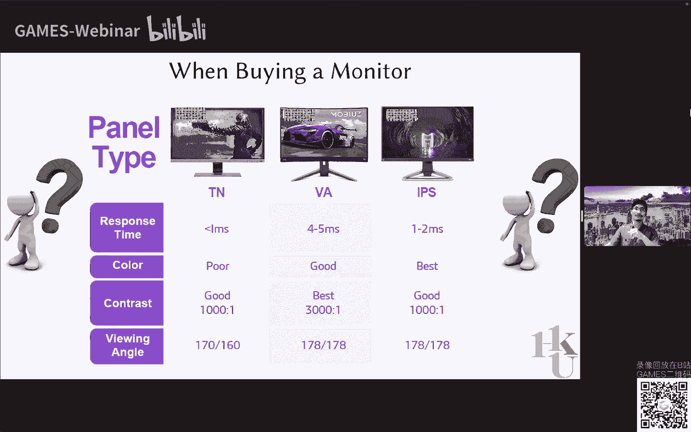
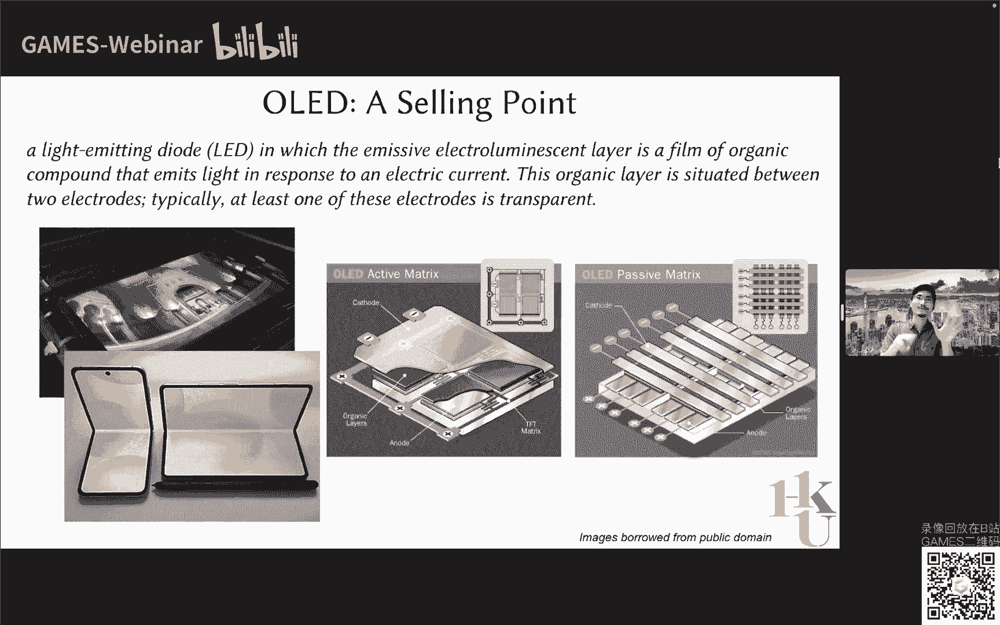
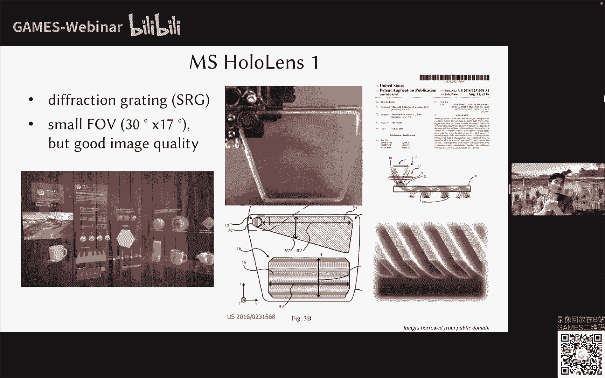

# 07.VR/AR主流显示技术概要 ｜ GAMES204-计算成像 - P1 - GAMES-Webinar - BV18g411r7Fn

## 概述

在本节课中，我们将探讨VR/AR领域的显示技术，包括其基本原理、应用以及未来发展趋势。

## 显示技术概述

### 显示技术定义

显示技术是将光信息以符号、文字、图形、图像等方式呈现出来的技术。

### 显示技术发展历程

*   **早期显示技术**：皮影戏、走马灯等。
*   **现代显示技术**：CRT、LCD、OLED、投影机等。

### 常见显示技术

*   **LCD（液晶显示）**：利用液晶分子的光学性质实现显示。
*   **OLED（有机发光二极管）**：自发光显示，具有广视角、高对比度、低功耗等特点。
*   **投影机**：利用光学原理将图像投射到屏幕上。

## VR/AR显示技术

### VR显示技术

*   **VR显示技术定义**：通过头戴式显示器等设备，将用户沉浸在虚拟环境中。
*   **VR显示技术原理**：利用光学原理和图像处理技术，将虚拟图像投射到用户眼前。
*   **VR显示技术应用**：游戏、教育、医疗等领域。

### AR显示技术

*   **AR显示技术定义**：将虚拟信息叠加到现实世界中。
*   **AR显示技术原理**：利用摄像头、传感器等设备，获取现实世界信息，并将虚拟信息叠加到现实世界中。
*   **AR显示技术应用**：导航、购物、游戏等领域。

## 未来发展趋势

*   **全息显示**：利用衍射波动光学实现高分辨率、高对比度、深度信息显示。
*   **超表面显示**：利用超表面技术实现更小、更灵活的显示器件。
*   **计算全息**：利用计算方法实现全息显示。

## 总结

本节课介绍了VR/AR领域的显示技术，包括其基本原理、应用以及未来发展趋势。随着技术的不断发展，VR/AR显示技术将更加成熟，为用户带来更加沉浸式的体验。