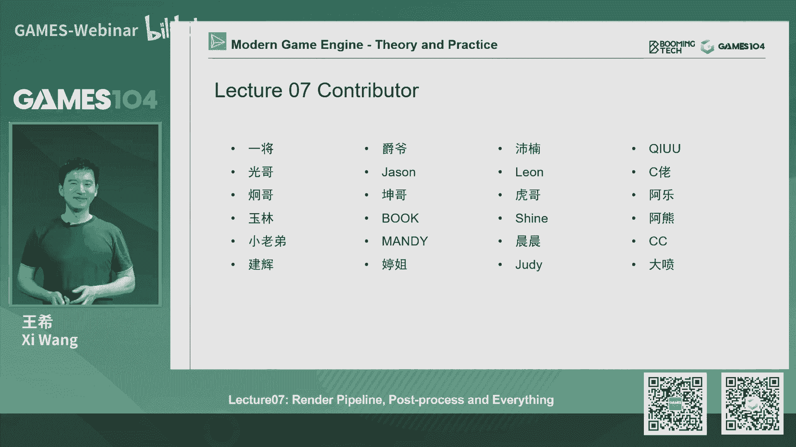
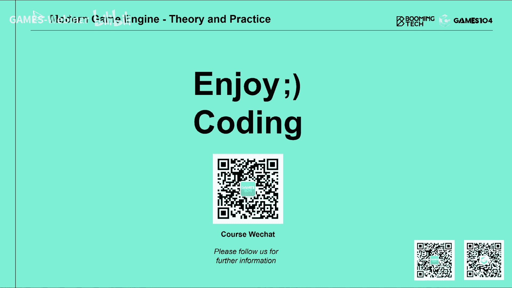

# 07.游戏中渲染管线、后处理和其他的一切 ｜ GAMES104-现代游戏引擎：从入门到实践 - P1：GAMES104_Lecture7 整段 - GAMES-Webinar - BV1kY411P7QM

Hello，大家好，我是王西，欢迎大家回到games104，现代游戏引擎的理论与实践，欢迎大家回到我们这个就是内卷之王，就是老师和同学们一起卷的这个卷王之王的课，那么过去一个星期的话。

我们又终于卷完了我们的渲染的最后一节课，其实呢在前面的几趴的时候，我们跟同学们讲我们的课程的时候，我们也看到很多同学们的反馈，然后的话呢就有些同学讲，说我们这很多的课程的东西。

数据量就是那个算法量特别大，很多很多的算法，然后很多算法大家都听不懂，其实这个当时我也看到了，我也在一直在想这个问题，其实这里面的话我想跟大家分享一下，我自己这边的观点。

就是说其实我在准备这个课程的时候，我们课程组的话其实也非常的纠结，因为如果我们讲一些比较简单的，比较基础的算法的话呢，实际上它是能很容易把大家讲明白的，而且呢我一个算法假设留20分钟左右。

那么它出现的问题是什么，就是这些算法实际上在行业里面，大家已经基本上不怎么去用了，那实际上他已经有点absolute了，第二个就是我一直在思考，就是说games104克到底它的定位是什么。

我的理解它像一个通识课，什么意思呢，就是说其实游戏引擎啊，它真的是一个非常非常博大精深的一个，就是啊计算机软件系统，它几乎涵盖了计算机科学所有的知识，其实在全球，我觉得能够完整地知道。

就是现游戏引擎的所有的知识点，和方方面面的东西的人，应该是非常非常屈指可数的，也就是说这样的话，大家想象一下，如果这么难，那么我们怎么可能通过一个就是零基础，通过一个20个课时的课程。

我就能够听懂游戏引擎里面几乎所有的东西呢，这个其实在是实际上是做不到的，其实不只是游戏引擎了，就是游戏，你们就单独指一个东西，比如说渲染，其实就如果我们找到一个计算机图形学的，这个同学的话。

他能够把游戏渲染的所有的功能，全部都能想得明白，理解了透，实际上都已经是非常非常的难，所以当时在我去思考这门课的时候，我认为这门课它的核心是帮助大家建立概念，建立知识体系，那么让大家去理解。

这就是我一直在前面的课程给大家讲，就是说哎你不用特别care那个公式，那公式看不懂很正常，因为那个公式你真的要去推它，真的要去理解它，比如说积分，你们每个积分项，首先你的数学基础要够好，但这个不重要。

我相信很多同学都是有，这个就是大学的高等数学的基础，但是的话呢你真的去理解，那整个每一个光学的那个工具方程式的话，你可能提前要花一一周，甚至一周以上的时间去读那些的方程，那么为什么我讲公式不重要。

重要的是什么呢，是思想，因为你理解的这个思想，这些方法的思想的话，其实在你未来的工作中的话，可以举一反三，其实我们在我想象一下，我们104课程的很多同学的话呃，就大家将来真正去做游戏引擎开发的是很少数。

但是如果你真的理解了游戏引擎设计的，遇到各种各样的问题，他选择了各种各样解决的方法的话，实际上在你实际的未来的工作开发中的话，你很容易的就可以举一反三，那么其实这个东西的话，不仅仅是对于我们的这个。

比如说将来你成为游戏的影游戏开发，还包括比如说你可能是technical artist，就是那个一一就是那个TECHNR的技术美术，你甚至是自己做一些，比如说我可能是WEBGL。

或者是数字孪生的一些项目，实际上这些方法论对大家都是很有帮助的，那么我怎么去定位games104这个课程呢，我就觉得这门课程我们用两二十个小时的时间，帮大家建立，最正就是我们尽我所能。

对行业的这个就是比较主流的一些方法的，这个解决问题的方法，包括它的整个一个知识体系，然后呢，这样为大家未来的这个学习的话做好基础，而且呢我以前是做科研嘛，其实我我有一个经验，就是我在那个时候。

我老师经常让我去读那个前沿的科研论文，那个真的是很难读，真的我可以花一天时间只读一个算法，你都读不懂，但是后来我发现一个办法，就是说如果有一个人告诉我说，诶这个文论文它实际上就是核心点，就这三点。

然后呢当我听到了这这个三点的点播之后，我再去读这个论文的话，我的速度就会快非常非常多，因为我知道我该看的是什么，我该忽略的细节是什么，所以其实这也是我们的games104课程的话。

我最想给大家传递的一个东西，另外一个就是说大家不要急，其实很多知识啊我们听到了放在脑脑子里面，你当时不明白，但是也许几年后你在做另外一件事情的时候，诶，突然你在104这个课程上，建立了这样的一个印象。

这样的一个知识的这个方法，一下子就能蹦跶出来，所以我在我其实我自己在读书治学的时候啊，实践上我以前很信奉一个方法叫囫囵吞枣，就是说你先大量的吸收知识，然后呢吸收一遍，再吸收两遍，不懂没关系。

然后我再去实践，当我在实践中遇到一个卡点的时候，我会突然发现，当时我好像听过一句话，我一下子茅塞顿开了，所以的话这就是说啊，这是我自己作为这个课程的这个，这个主导创造者的话，我自己对这个课程的一个理解。

就是大家怎么去理解games104课程的逻辑，他的逻辑就是说，帮大家建立一个整个的知识体系，大家听不懂没有关系，公式看不明白也没有关系，但是的话呢你一定要就是听懂这些方法，听懂它的整个一个知识结构。

以及人们怎么把这些知识串在一起，你这样建立了一个现代引擎的知识的全部体系，所以在这个这一节课开始之前的话，我先啰嗦这么一段，因为这个因为我发现，其实后台我们同学们反应还是蛮热烈的，我知道大家有压力。

但是的话呢我们一定会就是说，既能保证同学们能知道上面的体系，同时的话呢我们也会让大家能入得了手，能够落得了，就是能够做得了的东西，那就是我们的小引擎，后面会讲到，那么今天的话呢。

实际上是我们的渲染的最后一节课，实际上前三节课啊，我相信同学们压力很大，我自己压力也很大，然后我们基本上把这个真的是，把一个至少30~40个课程的东西吧，压缩到了四个课程，但这个是OK的。

因为实际上这一课，因为我们讲的是整个游戏引擎嘛，所以rendering这一趴的话，帮助大家建立就是渲染的游戏，渲染的基础概念，大家千万不要轻视这里面所点的每一个技术，因为这里的每个技术都是经过很多个。

就是成百甚至上千的优秀的工程师，他们在实践中总结出来的这些方法，所以它真正的价值就在这个地方好，那今天的话呢我们开始第四节课，那我先一开始呢，从一个相对比较简单的东西开始。

那就从我们的这个AMBULLOCUTION，就大家看到这个场景，这个场景是没有任何渲染，没有任何shading的，就是没有材质的，他让大家看到没有，就是你会看到非常清晰的结构空空间感。

这里面有很多的那个几何的细节，那么它实际上在广场中，表现出了一定的明暗关系，这个明暗关系呢和我们传统的明暗关系不一样，它实际上是你会发现诶有个小凹槽，它就显得比较黑对吧，那么有个小突出它就比较亮。

这个很符合我们生活中的这个实践，这种细节的光影变化呢，实际上也是满足凯基亚的光照方程，但是呢它实际上在渲染的时候，是非常难以做到的，为什么，因为它这个结构非常的小。

我们在计算机同学里面一般叫做myself structure，就中尺度的这个结构，那么当在他对整个天光都在进行照明的时候，你会发现它表面的几何细节会有相应的响应。

那么AO这个效果呢在平时大家可能注意不到，但实际上在现代游戏渲染中的话呢，AO的效果是非常明显的，给大家看一个例子，这是一个场景，大家看到这里面用了pp r材质，用了很很漂亮的光照，看着很好看，对不对。

但是其实这张图里面缺了AO效果，那现在的话呢我们把AO效果一打开，大家发现没有，就是说这个图，一下子就有非常强的这个立体感了，因为人眼对空间的结构的感知机，完全是基于我们大脑的深度学习的结那个基础。

所以我们大脑对这种光影的明暗的变化，是非常敏感的，而且我们可以根据这个光影的明暗变化，构建了我们一个3D视觉，就比如说大家一直以为，3D视觉是基于这个双眼BAROCULAR双目嘛，对是的。

双目是一个很重要的，就是空间立体感的perception的一个基础，但是你即使只有一张图的话，我们人也可以在大脑中构建出一个，非常有立体感的东西，那就要通过这个光影变变化，而在这个光影变化里面的话。

ambient cushion就是环境光照，那么呃这个好像不是黄金广场，我都不知道中文翻译翻译什么话，我们一般叫AO吧，就是那么它实际上的话呢，是一个非常重要的一个视觉元素，其实在很计算机图形学。

到我们游戏渲染很早期的时候，大家就意识到了这个AO的重要性，比如说在我们去渲染那个他的数学原理，刚才也提到，就是说实际上就是对于我的表面上的每一个点，那么他在它的可看见的正半球面的话。

它只有部分能够看见天光，有些部分被他周围的几何给遮挡住了，所以呢就会产生了我们的AO的这个效果，那么这个东西有点像什么呢，大家还记得我们在前几课讲那个COOKTOYS的，那个材质模型。

就是BRDF表面上很多小面片，它有个选项叫geometry对吧，就是他讲的是几何的自遮挡，其实你没有发现，这个AO跟那个几何字上是不是很像，实际上这个呢如果你把相机拉拉的足够远的话。

那这个AO所表现出的数学方程的话，其实你会发现他和那个B2DF是非常接近的，所以我就讲就是尺度它是相对的，就是取决于我们相机的远近好，那么其实呢AO这个效果是非常重要的，那么在最早期的时候呢。

我们的做法是比较简单和粗暴的，那就是哎我们比如说做一个角色，实际上这个角色我们在就是大家知道，在ZBRUSH，ZBRUSH里面，我们去雕他们那个高精度模型的时候，是有很多很多细节的。

比如像这个人的皱纹啊，他眼角的东西，但是呢一旦我们把它变成游戏里面消耗的，用的那个模型，就是说是低精度的模型的时候，这些细节我们全部把它烘培到那个法向上去了，但是法向呢它只是一种明暗的变化。

它实际上不能告诉你几何的变化，而且呢在做渲染的时候，我们实质上也不能够表现出这种诶，就是因为你凹进去了，所以呢你周围的天光看不懂比较少的效果，所以呢在现代的，比如说很多建模软件里面。

他都提供了一个叫AO烘培的东西，就像刚才这个老人的脸，如果我们把它烘焙成这个AO图的话，你会发现诶就是这样的一个图，这个图看着有点吓人啊，这个其实你们如果看所有的这个游戏的资，资产图的话。

无论是帅哥美女，你去看他的贴图的时候，就看见一张脸被拉得很丑很丑，所以说帅哥美女再漂亮，摊在哪儿都是很都是很恐怖的，那么当当我们有了这样的一张AO的，在渲染的时候加上去的时候。

你会发现这个画面右边的那个角色，他的表现感觉完全不一样，那么这种PRECOMPUTER的AO啊，实际上在游戏行业里面，十几年前可能更早就已经在用起来了，而且呢效果是非常的好，直到今天。

我们接下来会讲一些更多的real time的计算，AO的方法，但是呢这个方法还是不能被取代掉，为什么呢，因为我们的AO计算都是基于你有几何的，如果你没有几个，就是你的你的表面的。

没有真的真真真真切切的那些小的结构的话，我就算real time的方法我也是算不出来的，所以这个方法目前在很多character，就是角色的表达的时候，我们还是很重要的一张图。

如果就像我们在上一节课讲到，就是大家如果画一个角色的时候，那么AO这张图的话，一般来讲会出现在你的资产里面好，这是我们最简单的就是用预计算的方法，我记得我们在我们的课程一直在讲，这个思想是什么。

就是凡事不取一计算，什么意思，就是说用空间换时间对吧，我在离线的算好，存储在那，那我在real time的时候，我只需要去直接三里就可以了，这也符合我们空间换时间的思想，那么但是的话呢。

你现在只能表达一个一个的物体，但是我整个给你一个environment的时候，你会发现诶这个好像不行，因为比如说我一个桌子放在这个地板上，旁边有个椅子，桌子和椅子的位置一直在变呢。

那我没有办法在地板上pre bake，就是预先烘培好它的AOCAOAO的效果，对不对，这个肯定是不对的，那怎么办呢，其实这个方法有一个很简单的方法，这个方法呢我先介绍给大家，介绍一个最基础的方法。

叫screen space ambinclusion，叫ASSO，今天的话呢同学们一定要记住很多缩写，就是在图形学，计算机的图形学，和这个我们的这个这个游戏的渲染里面的话呢，黑化是特别多的，全是缩写。

比如说SSLO就是指的是screen space，Ambient occlusion，这个听上去非常的高大上啊，但其实他的思想是非常简单的，就是说诶，你既然我我从我我的一个相机渲染过去。

我就会得到我的一个场景，对不对，得到我的一生图像，一种图像我们看到的是颜色对吧，这个RGB的颜色其实不止一张，图像里面还有什么呢，还有它的深度信息，如果我们把每个像素点的深度信息，连到一起的话。

那是不是就是一个high field，大家还记得我们上节课讲地形是high field，对不对好，那如果我知道一个height field，那实际上我实事实上它就是一个几何。

我是不是就可以估算这个height field，对它的各个就是它的每一个区域的自制导的，自自制导的关系是什么样子的，那么他就这么一个简单的思想，那怎么做呢，其实比较简单，就是说哎我从这个眼睛射出去。

一根光线交到了我看见物体的任何一个点，我知道它在三维空间的XYZ，对不对好，我给您一个半径，我在它的半径的周边，随机的在球形球形的这个空间里面啊，随机的撒若干个采样点，那这个若干的采样点的话呢。

我再用相机去投投射，其实我就知道它的深度那么好，它的深度如果比如说我这个采样点，它的深度比我现在在z buffer里面的深度要更近，说明什么意思，说明哎我这个采样点是在可以看得见光的地方，对不对。

那如果我的这个深度的话，比现在Z8分的更远，说明什么呢，它一定被当前汇制中的某一个几何给挡住了，对吧，所以这里面一个很重要的思想是什么，这也是我们今天课程反复会出现的，就是screen space。

就是啊其实我们虽然在游戏里面，对整个世界有一个完整的几何表达，但是呢我们在做很多运算的时候，如果你真的把那上万个物体对吧，上百万的面片做各种各样的几何运算，它的效率是非常低的。

后来大家就发现就说哎我在屏幕上，因为我有深度了，其实我就得到了很多，就是只是对这个世界一个局部采样的几何信息，用这个局部采样的几何信息呢，其实我们可以做很多的因素啊。

所以今天我们讲的第一个技术叫screen space，Ambient cushion，就是利用这个原理，其实后面呢我们会提到，比如说screen screen space，shadow map对吧。

Screen space reflections，screen space gi这些这些放东西的话呢，实际上都是从这个原始思想出来的，那我们今天先不展开，我们先讲SALO那么好。

这个时候实际上当我比如说我是踩了呃，60个点对吧，随机的那中间假设有32个点可见的话，那是不是就意味着说哦我明白了，我大概有一半的空间是被挡住了，所以我的光枪只有它的一半。

所以他就给出了一个非常简单的方程，就是这个我多少个采样点N个，然后呢我有有这个讴歌被ACUTION格被挡住了，那我可以看见的光强就是一减它的分子分母。

这是他screen space amiddle ution的话，最古老的一个方程，实话实说呢，这个想思想是非常好的，甚至有人专门实践过，但是的话呢说实话，我觉得这个这个方程可能是错的。

这个方式错在很多很多地方，那其中第一个我自己当年看的时候，我最诟病的东西就是说大哥，你这不对吧，因为我的一个面能接受光的话，它实际上不是一个完整的球，是一个半球面对吧。

那你现在的话如果给我按个点去采样的话，那么假设你是个完整的平面的话，你是不是一定有按概率分布，有一半的点是在那个下半球面的，对不对，那你就是本来平面上应该是没有AO的效果的，大家想想。

平面是不是所有的光强我都能看得见对吧，但是按这个工程方方程的话算出来，你就是个1/2了，所以这个这个方程现在用的人应该非常少，而且其实大家都意识到这个方程是有问题的，那么很遗憾就是我现在找到他。

那paper上语文真好，他真的是这么写的，当然有人他已经意识到这是他加了个0。5，但这个不重要，重要的是，我觉得大家首先要理解就是screen space这个想法，包括我在这个。

以我每一个就是眼睛射出去的像素，我对它进行一个立体空间的采样，这个思想是非常重要的，好那这里面的话呢大家已经意识到了，说我这个采样是多余的，因为我只需要踩半球面，所以呢基于这个思想。

我们呢就引入了另外一个方法，就是A我们只需要如果我知道你的法向朝向，我是不是沿着你的法向，只需要踩半个小半个半球，所以呢就有一个改进算法，我们一般传统叫做SSLO的加plus，就是它的加法。

那这样的话你的采样点就可以少一半对吧，而且能解决刚才我讲的那个artifacts，他的那个问题，所以说啊最早期的SO的话，据说跑起来的话，整个画面直接就全部给你按按了，也没给你解释为什么是这样。

但现在我们知道，其实可能是数学生出了一点问题，好这个方法呢是非常的简单，但是呢你说它好不好用也蛮好用的，比如说像这个结果，这是一个就是有SSAO的结果，那就是没有的，然后大家看一下哎。

有了之后你发现整个它的立体感就很好，但这个方法呢其实有很多的问题，比如说你们看那个交通，那个那个那个那个就是那个水泥灯，他那个背后那个地面上出现了很强的那个，AO的效果，那个AO效果其实是错误的。

为什么呢，因为它实际上那个离它已经很远了，它不应该对地面产生那么强的AO效果，但是呢在屏幕空间中，它没有办法区分这件事情，所以它会产生一个就是我们叫做artifact，就是说一个不应该出现的一个重影。

所以这就是一个简单算法，他所付出的代价好，那后面的人呢就会不停的去改进它，那我们继续看另外一个算法，这个叫HBL这个方法呢，其实他就已经部分解决了我们讲的问题，他说哎。

你现在不就是说要求一个在这个球面空间上的，你的可见性吗，那么我实际上从这个点出发的话，我沿着各个方向去转，我去找一个，就是他光线能越过他那个最高的那个邻居，几何的那个叫我们叫做叫peach angle。

就是向上的那个仰角，大家这个怎么解释呢，就是说假设我现在出现了AO，我就在一个山谷里面，那好我就问一个问题，假设我射一束光，我这时光的就是仰角要多高，能够越过这。

我现在能看到的那个就是仰角最高的那个山脊，对吧，我要越过它的山脊，实际上他就去找那个点，那么如果我在周边的这一圈的，这个点都找到的话，我是不是就可以得到一个，在这个就是我们的右上角那个图上，有一个。

就是那种诶高高低低的那样的一个覆盖图，那你知道这个球形空间的这个仰角的，这个采样的话，实际上我们是不是就能估算出来，说有多大的面积的天顶，它是可见的，有多大面积的，那个就是那个就是那个面积是被遮挡住的。

实际上就是用一个很简单的一个，你可以理解为这个离散积分的思想好，但这里面的话呢它就引入了一个hack，他加了一个叫attenuation的方式方程，就是说如果啊那个山离我太远了。

我认为他对我的AO没有什么变化，刚才我讲的那个artifact，对不对，那大家想想看，这个地方我的距离如果设计的比较短的话，是不是就会那个地方就是那个W它就变成零了。

所以就不会出现说其实距离你一个很远的物体，但是呢它还显示在我那边产生了个AO，所以HBO的话呢，它实际上就是一下子又解决了这个问题，那这个问题的话呢，它实际上它的结果呢相对来讲就更好一点。

但具体怎么做的呢，这里面就有很多的细节，但今天我的细节不展开了，你可以你需要大家需要知道的东西是什么呢，就是说它实际上用的是一个叫REMARCH，它又又是一个REMARIN的算法，Marching。

大家还记得吗，就是诶我一个像素一个像素的掌握，当然它是有个步长了，它不是一那个一个一个像素，但是呢它就会从那个点出发，他那个当然它的它的方向，它在每个每个每个点的时候，它会稍微坚持一下，就是要变一下。

为什么呢，因为如果我每次找的这个方向都是一致的话，你会发现因为你采样率很低啊，它会出现一些很明显的一些就是ALEX的花纹，就是大家如果学过信号和系统，就知道，就是说如果我对一个信号采样率特别低。

而且我采样的那个滤波气它是非常规整的话，那你滤出来的信号它本身是有很明显的pattern，所以呢他就加了个hack，说我加了一个JRAN，然后呢我就在那个pixel shader里面。

我一步一步沿着刚才我讲的时候，你的z buffer给你生成的那个，你可以理解成一个后面的一个height field，我去找我最远的那个攻角是多少，这样我就可以找一圈，我就可以算出我的值。

这就是HBAO的这个核心的想法，所以呢这个HBO的话呢，它实际上就是说它是基于一个半球面的一个，积分的这样的一个想法，这个想法实际上它的结果的话，实际上是比刚才我讲的SAO的效果要好很多。

二技能解决这个artifacts，但是呢这个HBO的话呢，实际上它还是有它的算法上，一个很核心的问题呢，这个问题是什么呢，就是大家还记得我们在前面讲材质的时候，大家想象一下我们天空还是个球，对不对。

从假设我的表面，大家想的最简单的情况，我是朝上的，那我从四面八方照过来的光，大家想想，他从天顶上射下来的光和从这边射下来的光，它的贡献值是一样的吗，同学们，还记得我们在前面讲一个漫反射模型里面。

有一个叫NUMBERATION的这个模型对吧，实际上在南边是模型里面，有一个很重要的因素是什么呢，是个扩散，因此什么意思，就是说你的光越是靠近靠近天顶的时候，假如那个角叫theta啊。

他cos cos theta为零的时候，那你的IRRADIANCE，就是你射出来的强度是百分之百的，被我这个表面给吸收了，然后呢我的反射是怕四面八方均匀的反射，所以说OK这是没有区别。

所以无论你从什么地方看，你看到的都是百分之百的强度，没问题，就是反射的就反射的强度百分之百好，但是同样亮度的光，假设是以这个比如说斜45度射过来的话，他的那个就是实际上就反射出来的光，是不是那个扩散。

现在也就是cos45度，Cos45，大概是二分之根号二吧，大概0。7左右，所以刚才他们在算那个球的面积的时候，就是在H，就其实在那个HABO和那个SSAO的时候，实际上呢他们都没有考虑这个因子。

所以他们算出来那个值啊全是错误的，那么这就说了，就这也是现在大家用的最多的，叫GTAO，GTO这个AO这个名字取得是非常的霸气的，叫ground truth。

Based ambient occlusion，ground truth呢是一个行业的通用语，就是说我和真实的值，或者叫我的基准参考值是一致的，ground truth一般我不知道怎么翻译啊。

就是就叫做正确值吧，或者说叫做我的这个参考正确值，也就是说他climb我的AO是符合，这个，就是真真正的，这个你你用那个离线算法算出来的结果，确实他的论文中也给出了这个demo。

就是说诶你会发现我们渲染的结果，和你和那个就是用蒙托卡罗积分，然后非常慢的去做的结果几乎是一样的，那么这里面的话就等于说，其实他真的把这个你表面的法向考虑进去了，那这样的话我就知道。

当你的光从各方面来的时候，你斜过来的那个天顶的那个，就是权重是要被打折的，你靠近天顶的那个面积是非常，贡献度是非常大的，所以大家去只要理解这个思想就可以了，那么这里面的话呢。

其实在这个ground truth a o里面，还有一个非常厉害的地方，这也是我个人觉得他们是非常聪明的地方，也特别希望大家能掌握思想的地方，就是说他们意识到一件事，就是说如果我们能算出来这个东西。

就是它的AO值是多少，我能不能猜一下这个光射进来之后，在这里面来回bounce，就是我们叫multi scattering，最后形成的亮度是多少，大家想想看，因为现在AO的话只是说光挡住了，挡住了。

光射到另外一边，那么的话呢它你看不见它就没有共享，但实际上跟真实的物理效果是不一样的，对不对，真实的物理效果，实际上你可以看到它的那个就是说呃，就是说还是会就来回在那个。

就是假设你个山谷光射到山谷的另外一侧，你在山谷底照射是最黑的地方对吧，但实际上因为山谷两侧的反光，你实际上那个底没有那么黑，对不对，而且还有一点就是这个里面的颜色的话，跟我山谷的周边的颜色是有关。

比如说我讲解这个山谷这边是绿的，这边是红的，那我这个股在这个山谷里面看到那个眼，那个AO的那个颜色是不是带色相的，这个听上去是不是很复杂对吧，我们是不是要做很多的积分才能得到这个结果。

但是呢这也是GTAO，我认为他这个名字叫gt，那个里面一个非常好的一个想法，他这个老哥做了一件什么事情呢，就是说它根据你不同的AO值，实际上比如说0。60。4，0。20。3，他做了一个就是大量的。

大家现在如果学机器学习的话，他就做大量的分析，对这个数值进行分析，他发现就是说啊，你的这个AO值实际上和你的multi scans值，实际上是有一定的关联度的，这个关联度当然不是一个简单的线性的。

然后呢他发现它里面符合了某一条曲线，然后这个曲线呢这个老哥就很厉害，给出了一个就是polynomial的，就是一个多项式的方程，这个方程呢大概是三阶的，你就可以用一个多项式计算。

你就能够根根据你的这个就是现在的AO值，我能估算出来，光在你们来回boss最终的结果，这个听上去是不是非常的神奇，觉得卧槽，这这简直就是就像我经常讲的，就是那个还记得在上一节课，我讲那个fog的时候。

就讲那个最新的那个就是那个fog的方法的话，实际上他就是只算了一次的，这个这个就是那个啊光的in那个single scattering，但是呢我觉得那个approximate multi screen。

他两个思想是不是有异曲同工之妙，那这件事情到底有没有道理呢，其实我个人觉得就是，他虽然在原来的原来的论文中，没有给出这个理论证明啊，但是其实我个人觉得他是在数学上是有基础的，因为大家想想看。

我们在算那个就是BRDF模型的时候，我们其实也并不知道他那个微表面上有很多，很多的细节结构，对不对，但是我们用了一个统一的量叫做RAGHNESS，roughness呢，就表达了它的几何的不平整度对吧。

大家想想看这里的AO那个值的话，是不是有点像那个小区域的roughness的值，也就表示了我周围对我的遮挡性，就是有点像BTM的那个G，如果你假设在这个表面上分布，大家基本上符合一个统计学分布的话。

实际上你用统计学的方法去算的话，这里面肯定是有一个关联度的，但这个关联度可能是个积分值，可能是个更复杂的方程，但是呢你再复杂的方程在某些情况下，你可以用一个比如说多项式去拟合它，这个在数学上也是成立的。

所以我个人觉得就是说gt a o的这个discovery，就是这个这个observer就是他这个发现啊，我认为它是有数学的foundation的，所以同学们，如果有人对这个东西特别感兴趣的话。

我会觉得大家可以深入研究一下，因为对于我们的graphics engineer来讲的话，我就觉得哇很厉害，你就用这个方法来解决了，那这也是回到我刚才在课程一开始讲的东西啊。

就是虽然我在这里面跟大家讲一个算法，其实本身作为一个GTO这个算法的话呢，我不需要花这么多久，这么久跟大家去讲，但是呢我个人觉得他的这个思想特别的好，就是从最开始的就是大家做SAO。

就是想到了用screen space方法对吧，我不用对整个世界进行几何的运算，到这个HPAO呢，你可以认为它是一个过渡性的一个产品，那么到了GTAO的话呢，是从数学上彻底的把这个问题给解掉了。

同时的话呢，他还观察到了一个很重要的一个性质，然后呢给出了一个拟合方程，这样的话一下子让我们的AO的效果，就是从一个简单的这种黑白分明，变成了有彩色有色相的这样的一个效果。

所以我个人是蛮喜欢这个这个这个这个算法的，那么呃哎哟我这边少了两张图，其实我本来有一张那个GTAO的，这个前后的图，其实特别在他给出了一个人脸，一个一个一个人的皮肤的渲染，效果是非常的好的。

那么AO的话呢，因为我今天的课程有限，所以我不讲了太多，希望大家注意的就是现在还有一个比较，现在慢慢越来越火的一个方向，就是real time retracing amazon clusion。

那这个大家都知道，大名鼎鼎的这个这个这个RTX对吧，就是我们所有人游戏没有return tron，好像都不是这个时代的游戏了，那么既然rotary tracing的数学，基础的核心是什么呢。

就是说现在GPU能够帮助你快速的做一个，recasting的这样的一个计算，告诉你说你到底有没有hit到，那么实际上我对屏幕上的每个像素我可以设ray，然后他知道我跟周围有没有遮挡。

但这里面呢其实有很多的细节，今天我不展开了，就实际上在如果你想做对的话，实际上你应该在屏幕上的每个像素点，在他的半球面射出很多关锐，对不对，但是呢既是地主家，他也不能这么造。

就是说你现在的GPU也不能跑的那么快，所以呢他真实的做法是在每一帧的时候，对于每个像素大概只对外设一一到两根瑞，但是呢他在这个时序上进行了一个，这个数据的收集，这样的话能够完成这样的一个球面的一个。

采样的近似，这里面有很多的细节，所以今天在这课程我不展开，但是我希望同学们关注这个方向的发展，所以AO的话呢基本上大家看到GTAO，看到retracing ammaccretion的话。

基本是现在大家比较前沿的一个，AO的一个方向，好了我们有了这个AO了，那接下来呢给大家讲一个，也是非常好看的一个效果，叫做fog，叫误校对吧，负，我觉得物小时，基本上所有同学都会注意到的一个效果。

那么fog呢其实它的原理啊，最最开始的这个，在游戏里面用的是非常非常简单的，我们叫做depth fog，它就简单来讲就是从你的眼睛看出去，然后呢随着距离你的透明度逐渐的下降。

那么大家想的最简单的方法是什么，linear fog对吧，就是说我用这个线性的方法，就是从一般这种fog我们会设置一个起始点，比如说特别近的地方，我们还是希望没有bug看得清楚啊，逐渐逐渐fork起来。

然后到了一定远处，这个fog就到了它的最大值，然后呢但是呢实际上在大家用的过程中呢，我们会发现诶用指数型fog是特别比较好对吧，然后的话呢大家一般喜欢用，就是二阶的指数型fog。

这个里面是非常非常简单的max，如果今天大家打开任何一个商用引擎吧，如果你选择那个fog，它最缺省的最简单的模式就是这个fog模式，大家如果打开unity的话，你可以看到我们这边的三种模式。

就是linear fog，Exponential fog，exponential那个squad fog，其实在里面都是你的选项，他的数学基础也是非常的简单，基本上就是我们的高中数学吧。

但是呢这个fog呢，实际上对世界的表达力还是有限的，我再举个例子，就是说大家看这个我们在真实践，你们会发现，就经常这个fog它实际上是有一个高度的，这个是原因很简单，就是fog它是一个气溶胶对吧。

它实际上呢很多时候会沉淀在靠近地面的地方，特别是我们在爬山的时候，我们会发现诶我爬上山顶的时候是没有fog的，但是我在山脚下的时候，我是有fog对吧，那包括就比如说我们在游戏里面，营造一种很恐怖的场景。

比如说这是一个大猎物，然后下面跑的都是这种什么什么有毒的东西，然后下面有一层毒雾，然后呢你站在那个裂谷上面，看下去那个下面的场景，所以这个时候就是也是一个非常常用的效果，叫做HIFK。

那HEDFG呢就是在计算机图渲染里面的话呢，他的假设是这样的，就是我的fog是有一个就是说哎最大值，就是当这个高度低于某个高度的时候，下面所有的fog都是那个fog的，最大的那个fog值。

但是当你的高度高于它的时候呢，我们认为你的fog的那个强度呢，是以指数在递减的好，那这时候我就问题就来了，就是当我一个人站在一个某个特定的高度，比如说那个ZV对吧，就是我的view的这个Z这个V呢。

我解释简单一点吧，它比那个fog的高度高一点，我看fog里面的一个东西，那我应该看到那个fog强度是多少呢，大家想想这个问题，这个问题呢其实它不简单，为什么呢，呃他不是一个简单的说。

我算那一点的fog是多少，我就我就是算出来的fog，他为什么不能用那个东西去算呢，因为很简单，就是说假设那个点正好是在那个，high fog的最高点的话，是不是从他到我这边来的时候。

它的fog的浓度会越来越低，越来越低越来越低，对不对是吧，所以说它不是一个简单的一个匀质的fog，那么大家还记得我们在讲那个，前面讲天空和大气的时候，我们遇到这种事情怎么办。

只有REMARCHING进行积分，对不对，所以说那我们只能一步一步的积分，那么其实这个算法呢，就这个效果呢其实很早以前就提出来了，那个时候大家就意识到说对啊，这个地方我确实要想做对的话。

我需要对它进行积分，但是那个时候我还没有能力，就是没在pixel shader里面一步步的积分，这个解释在那个那个时代的硬件是要死的，那怎么办，诶大家发现我对他作为一个做了个简化。

就是说我认为就是fog intensity，直接对你的fog的那个，就是它的透明度是一个线性相关的，那我就沿着这个路径进行，一个只对你的浓度进行积分，算出你个浓度值，包括算用它来估算你的透明度。

这个具体的计算过程呢我就不推荐，因为你会发现啊，这个函数如果都是E的自然对数的一个函数啊，你在对它进行积分求导的时候，你可以求出它的解析解，所以在真实计算的时候呢，你只需要把解释解带进去就可以了。

但是这个公式其实是非常简化的，实际上你的眼睛在fog就是那条高面以下，高面以上，你的物体在高面以上，高面以下其实还是有一点点区别的，那么包括就是说你的颜色就in scatter to fog。

给你的颜色在这个过程中也是一个积分值，那这里面的话呢就是说有很多小的数学细节，那今天我们就不展开，但是大家要知道知道就是说fog在古典时代，我经常讲古典时代什么，就10年前的3A游戏。

基本上DEPLOGHDFG基本够用了，那么但是在现代的话呢，就是我希望大家关注的一个东西，就是说诶基于体系化的这个fog，大家看到这边的效果没有，就是说诶我们的fog开始有这种体量感了。

比如说你一道光射出来的时候，我能看到一道道的光柱射出来对吧，这个效果是不是看上去非常的苦，那么很遗憾，就是刚才我介绍的那个就是depth fog，和height fog是实现不了这个效果的。

这个效果呢它是用什么方法实现的，它其实实际上是我们把相机空间的整个空间，进行WORKALIZE，大家注意啊，这个WORKSALIZE呢和我们以前讲的均匀的体系化，不太一样，你想空间中经营的体系化。

我根据XYZ对吧，我就把他一刀刀切过去，但是大家想想看，从我的人一眼看过去的话，我们是不是在近处的时候，它的很多进步是被浪，就是不够对吧，就是颗粒度太大，但是呢到远处的时候，它的颗粒度又太细了。

它实际上就是你产生不到你你想要的效果，所以聪明的这个就是graphics engineer，他们想了个方法是什么呢，就是根据我的视锥诶，以我的镜平面平面，用我的视锥进行切分。

大家看到那个上面那个黄色的那个切分图，你会发现就是他在近处，就离你眼睛近的地方切得非常的密，离你眼睛眼睛远的地方切得非常的远，这个时候他在这样的一个不规则的，就是不均匀的这样的，其实它是它是规则的。

但是呢它只是不均匀的这样的一个grade里面，进行各种各样的remarching in scattering，multi scussion的这个计算，这个计算的话呢。

其实它的方法和我们在上一节课里面讲的，算那个语音核算，那个sky的方法其实是大同小异的，所以说那个如果大家对这个fog，对于这种volumetric的，这种foggy的rendering的感兴趣的话。

你其实只要把上一节课里面就是怎么讲，算大气的方法看明白了，你就知道这个fog怎么算了，其实呢你把大型的东西看明白了，你其实就知道那个那个那个语音啊，他是怎么做的了，所以我在讲。

就是说我们实际上很很注重跟大家讲这个方法，就是讲这个思路，他的这个思想是一致的，那么大在工程实践中的话呢，我们一般会A构建一个3D的texture来存，这里面所有的中间计算的结果来看。

我们一般的分辨率怎么看呢，大家看到这里面这个数字非常有意思啊，比如说我这个3D texture呢是横160，总数是90，然后深度呢可能是64，可能是这个更高一点，128，大家有没有注意到。

为什么它的横竖不是我们在做纹理的时候，经常看到的那个二的幂次方呢，大家仔细看里面发现一个细节没有，就16比九是什么，是不是我们屏幕的resolution，所以呢他这个texture。

实际上尽量保持在屏幕上的一个像素块，我对他的采样是一致的，这样的话我这个采样出来的这个，比如说这些线条，这些这些结构看上去才比较好看，所以这是一个非常有意思的一个细节，但是如果大家自己去做的时候。

你就知道这个texture，我是resolution，我是不能乱射的好，那么这个就是这个现代fog的话呢，一个比较热门的一个方向，接下来讲一个大家特别不注意不到的东西。

就是所以今天我的这个课程标题特别有意思，我就讲个post process，这个render pipeline and everything，就是说因为今天是rendering最后收官的一刻吗。

我会讲到很多大家注意不到的东西，但是呢当你在做引擎的时候，这些东西呢又非常有用，它是必须要做的东西，反走样又是我们在渲染的时候特别头疼，又是要特别需要解决的东西，那么走样的话是什么东西呢。

其实大家仔细看啊，就是说其实啊我们在绘绘制的时候，不管我的算法显得多高级，最后我是一个像素，一个像素的把这个世界绘出来，对不对，那么每一个像素呢，你可以理解成就是对一个连续的，就是这个世界的一个采样。

因为真实世界的这个信号的频率，这个信号的密度是无限高的，对不对，但是我用一个像素，一个像素的去表达它的时候，那我是不是这个采样率是不够的，就像我们一张一个照片，在以前的时候。

数字数码相机那个精度不高的时候，我们看到那时候的照片，我们人脸上感觉那个色块很大很多的马赛克，对不对，但现在数码相机的分辨率越来越高的时候，我们发现这个马赛克越来越小了，那么其实aliens的话呢。

本质上就是因为我们的屏幕的resolution，他是有限的，而呢我们的要表达的后面的几何世界，它的频率是非常非常高的，那举个例子，它这里面有三大源泉，这是我个人总结的不一定正确。

就是说第一个呢就是由几何导致的，比如说我一条一个一个几何的边，它只要不是严格的横平竖直的话，那你在这个屏幕上一个像素一个上踩过去的话，它一定是会产生这种ZC的这个效果的，大家想想是不是。

就像刚才我一开始举的那个例子，就是字体的例子的时候哦，它的采样就是不均匀的哦，这个例子在后面，不好意思，那么第二个的话呢，就是说哎我的在这个就是在这个物体系表面，表面，我有很多的细节。

比如说texture，那么texture的话呢，它的采样就是当我在不同的角度去看的时候，这个texture就会产生各种各样的artifact，就是就像这个中间那张图展示出来那个摩尔纹。

但是texture这个采样的aliens的话呢，是由我们在前面课讲的就是mid map解决了，就是说OK你如果很清晰的看我texture，我就我就直接把你预先filter到了，最核心的那个点啊。

最远处的那个mp去了，这样的话你这个效果也没有了，还有一类的A类型资源呢，是大家其实平时注意不到的，就是说实际上对于在场景中，很多高频的就是非常容易变化，所所谓的高频就变化，它的幅度可能很小。

但是变化速度非常快的这种东西，比如什么东西呢，高光大家想想看，我拿一个很光亮光亮的东西，当我去动它的时候，它上面的高光流动是不是非常的迅速对吧，我我稍微转一个小小的角度，它的高光就一瞬间就流动了。

其实高光也是在游戏里面产生，很重要的一个一个源泉，所以其实这些所有的东西都会让整个游戏，画面变得非常的难看，就是说如果一个现代游戏啊，如果我把他的NTLS给关掉，打开的话，你会觉得是两个游戏关掉之后。

你觉得整个眼睛都在闪，我相信很多同学喜欢玩游戏的，都知道我在讲什么对吧，我们在游戏里面那个那个GRAPHX设置里面，经常有你要四倍AA还是这个更大的A，这都是你的选择的对吧，现在一般都是4XA吧。

好像是好，那么怎么去这个把这个alien给去除掉呢，这就是我们叫做anti anything，就是跟ALEX作战对吧，这就是刚才我提前讲的那个图，就是说，其实所有的这个就是去除那个alien的方法。

它的核心思想都很很很简单，都是一个思想，就是说OK我知道我在屏幕上，每个像素它的采样是不充分的好，那我就多采样几个，就我们一般叫做SUBSAMPLING或者sub pixel，我就多采用几次。

那这样我采用出的值的话，它就有变化了，对不对，我把这些变化的值呢，我对它进行一个平均平均之后，虽然我这时候你会你会发现，就是说它不再是那么硬的一个边界，它会产生很多过渡区域。

这些过渡区域在一个个像素你看起来的时候，它就显得很光滑，举个例子，像刚才这个字体，以字体为例，就是现在同学们你在电脑里面打的所有的字，他都是true type，出tab是什么呢。

它都是矢量的这个字矢量的字的话呢，它的精度是可以无限放大的，对不对，但是它在放大的时候，实际上它的那个你的屏幕的分辨率是一定的，所以如果你仔细去看的话，你会发现诶它最终会形成一个一个ZC的结果。

你看到那个这边的那个就是靠啊，左边的这个没有被A类型过的，这个NTA类型过的这个A字，那么但现代计算机在渲染的时候呢，我们一般都会打开NTA型的，所以你如果在电脑上看到那个A的时候。

你会发现它的边界不再是一个明确的零一变化，虽然你看起来好像觉得是零一，但实际上他做了很多的这个超采样，让你看到了那种A半透明的那个区域，这个区域你怎么看呢，就大家如果眯起眼睛去看的话，你就能发现诶。

那个好像这个右边的这个A，看上去线条更平滑一点，这就是NTA类型，就是我们叫做AA的一个核心的思想和它的效果，那好那在我们的这个渲染中的话，AA这么重要，那我们怎么做呢，先给大家介绍两个非常简单的方法。

第一个方法呢叫super sampling的一个ASSA对吧，那这个方法呢它其实是非常的简单和直接的，就是说OK你不就是要超采样吗，假设你现在要绘制一个1024×7，六八的一个图像，对不对。

我把你所有的尺寸double一下，好不好，我会这个2048对吧，乘上一个这个E4多少的这样的一个尺寸，然后呢我把这个就是四，这就是传说中4X对不对，我把你这个4X倍大小的这个图像。

我把它作为一个当SA对吧，我甚至更高级一点，我做一个小的滤波，Ging filter，诶，我把你变成我下面的那个结果，那么这就是一个A很好的一个anta lien的方法。

这个方法呢其实它是一定是work的，但是呢他付出的代价就是说哎呀，我这个无论是我的z buffer呀，还是我的这个frame buffer呀，包括我的所有的pixel shader的渲染呢。

都付出了额外的四倍的代价对吧，那么就是说这样的话呢，实际上就意味着说如果我的显卡足够牛逼，那我就用这个SSA，但是呢这个实话实说，好像现在的游戏引擎中，已经很少有人用这个方法了。

那么这里面大家就会观察到，一个非常有意思的事情，就是说刚才我们讲了，就是说哎alien产生资源最多的是什么，是发生在这种几何的边缘，对不对，比如说以这边的三角形为例，你会发现啊，如果我想对它进行超采样。

你会发现这个三角形中间的大部分的点，其实我不需要进行超采样，为什么它都在我一个三角形内部，对不对，我用中间的那个颜色大致代表一下，应该问题也不大，他真正问题出在什么地方呢，是出在那个诶边界上的点。

就是我那个像素，我我站了一点，但又没有完全站，那个时候可能是另外一个三星在那边了，所以呢后人呢又发明了一个叫MASA，叫multi sample a n t a s那个MA的思想呢。

其实实际上就非常的简单和淳朴，就是说我虽然对这个空间还是四倍的去采样，但是呢当我在做shading的时候，我会去看说如果我这四个sub3，SUBPIXEL或者叫SUBSAMPLE，都落在同一个节目水。

就其实他反射它它它算法的时候是反过来的，是说这个triangle coverage，对这四个采样点是百分之百的话，那我只是一定一次，但是呢如果我在这个四个采样点中诶，不止一个赛团队贡献的话。

那我把你们都设定一下，然后我算一下你们的average对吧，根据你们的采样点的占的比例，比如说比如说四个采样点，四个四个四个sub su的点，那两个人各占一半，那好我们讲解二一添作，五一人一半。

如果你三我一好，那你就是75%的权重，我就是25%的权重，那么这个方法的话呢，实际上非常的有意思啊，这个方法实际上是啊，现代硬件基很早就已经彻底支持了，所以说当你去做一个游戏研发的时候。

你说我打开一个功能叫MSA的话，就是一个flag打开之后，这些所有的计算硬件把你全部做掉对吧，他就不用你再去操心，但是呢这个算法实际上呢他还是要付掉，就是四倍的，这个就是说啊这个这个z buffer。

四倍的rust rization的结果，然后呢，就是说它的frame buffer其实也是需要四倍的，但最后的话他会就只是在做pixel shading的时候，他会帮你跳的很多不需要的那种渲染。

这个方法其实是非常好的一个方法，但这个方法其实也是有它的问题，它的问题是什么呢，就是说在我们现代游戏下面下面啊，其实我们的这个就是说，我们的几何密度是非常非常高的。

就是就像大家我们在后面高级课程跟大家讲，我们的NANA的技术点吧，NANA的技术点是什么，就是我们client说我们在一个场景中，你看到的船购的数量会超过你的像素数量，那么密的三角形的话。

大家想想看MCA是不是会彻底彻底的失效，对不对，所以说的话呢这个也是一个非常古老的技术，但这两个技术呢，实际上就是那个SSA和MSA的话呢，你看今天那个术语太多啊，但大家记得就是这个MCASSSSA。

你看我这经常会弄混，那么它是一个就是上古时代的一个NTAS的，技术，很简单，但其实还是蛮蛮蛮实用的，但是呢其实也是比较古老的好，其实今天的话呢其实anta lion算法的话呢，实际上有很多很多的变种。

但今天呢我只跟大家着重的讲两种，NTA类的算法，因为我个人为什么选这两个方法，第一个是在工业界，现在大家觉得这个方法都特别的好，更重要的一点是什么呢，就是说它代表了两个非常巧妙的思想的，这个方向。

那么第一个呢我们叫做FXA，它的它是什么缩写呢，叫ffast approximate antella，从它的名字你可以看出来说，我是一个快速估算的anti的算法，这个方法是什么意思呢。

就是说啊你就不要那么笨了，就是把这个采样做大对吧，采样做大学不会啊，我现在就给你原始图像，你有没有本事帮我去做他的NTAC，你看这个问题是不是很难，就是说就像老师说，老板让你把生意做得更好。

但是又不给你更多的本钱，这个头很疼对吧，诶但是这个就是这个FXA，他就是说诶我要发挥我的聪明才智，发挥我的主观主观能动性，他怎么做，他说你们在做这个NT类型的时候，不都是在那些边界吗。

比如说高光颜色在高速的变化，或者说一个一个三角形，它发生折线，快速的折到另外一边，那其实这个时候会产生什么呢，产生这个颜色的跳变，就是大家如果学过computer vision的话。

就是计算机视觉的有个很重要的领域，叫做ag detection，就是我会把这个画图片中的很多edge，给它提取出来对吧，那么他说如果我在这个你生成的这一帧画面中，我帮你把所有的这个A级提取出来。

我只在A级的这个地方，我采用一些聪明的差值的方法，我是不是也能产生一个这个反走样的效果呢，唉这帮人说干就干，他首先干第一个事，就是用了一个非常简单的十字形滤波，就是说啊我对于每个像素点。

我把你的这个左右邻居上下邻居加在一起，我去算你的这个这个差异值，当你的这个综合差异，就是平均差异值大于了某个阈值的时候，我说不好意思，老哥你就是一个边界，而这个阈值是多少呢。

他首先是把那个整个这个图片啊，转换到一个就是亮度空间，亮度空间的话呢就是个颜色空间的概念，就是说我们的看到图像是有颜色的，对不对，但是呢其实每个颜色对亮度是有个色感的，这里面就是在这边的话。

就右边有个公式，就是那个你会发现，就是绿色的亮度贡献是最大的，蓝色亮度贡献是最小的，红色是居中的对吧，这个这个数值是非常了不起的经验数值，这个基本上你们所有的做这个。

就是把这个比如说财大家在玩手机的时候，特别喜欢把这个彩色照片变成黑白照片，很有艺术感，对不对，那基本上你就用这个公式一算，你就可以迅速的把一个彩色照片变得，变成黑白照片好，我变成了黑白黑白照片之后。

我对每个像素对它的上下左右几个邻居去找我，比较一下我们的色差，如果我们的色差综合色差超过这个阈值的时候，我就说不好意思，老哥，你就是我的一个边界点，你就有可能我需要对你进行NTA类型了。

那这个时候呢他就拿到了每个点，比如说以这个为例子啊，我们这边取了一个很小的一块铜线，他就以那个高亮的绿色的点，他就说哎呀，我这个颜色变化到底是这个竖向的变化多呢，还是横向的变化多，因为我要是反走样的话。

是不是我要和那个跟我差别很大的，那个这个像素进行这个blending，对不对，他其实呢用了一个非常聪明，而简单的这个一个卷积算法，就是诶他沿竖向转了卷了一下，加算了个绝对值，横向卷了一下，算了个绝对值。

基本上就是一个9×9的矩阵啊，3×3的矩阵拍上去诶，它可以判断出来，好像比如以这个例子的话，我的横向好像这个差别大一点好，我的横向无非也就是左边和右边的邻居，对不对，他在这比较说诶。

是我左边的邻居跟我这个差距大一点呢，还是我右边的邻居跟我差距大诶，他这边一看我的我的右边的邻居是一，我是零对吧，那我肯定是右边的领域上，他就得到了一个叫offset的朝向，意思就是说。

我如果要进行ANTA类型反走样的blending的话，我应该跟他去，本来定，因为我们两个差距大，大概率是在这个地方会出问题的，对不对，这个方法是不是很简单，很直觉，好有意思的地方就来了。

你有了这个blending的话，我不能够很粗暴的blending吧，这个是他想法特别巧妙的一个地方，就是说OK那我从我的这个点出发，我向上的那个那个就是我应该不在那个点，我们形成一个对。

我们之间呢求个平均的这个强度值，然后呢我们就沿着这个，你刚才不是讲了一个方向吗，你一个朝上的方向，那我的perpendicular垂直的方向就是左右，对不对，我沿左边沿右边就一直找，找什么呢。

找就是如果我找下去一对一对的像素，如果呢你的颜色变化跟我是差不多的好，我认为我们是一伙的，我们就不动，但是呢我一旦找到说诶你的两个相邻的pixel，它的颜色变化一下子发生了巨大的，这个就是跟我不一样。

比如说你找到最这个最左边是两个白色的像素，它两个颜色是一致的对吧，好像跟我不一样，对不对，他找到最右边诶，发现两个都是黑的，它的颜色变化也跟我不一样，我等于什么呢，我找到了一个边的两个端点。

唉这个地方是他最巧妙的地方，好这个时候它有意思的地方就来了，他呢就把我的左边这个端，右边这个端两个长度进行比较，唉这个比较就告诉我什么呢，就告诉说我是更应该去听我的，这个就是我自己一点呢。

还是更应该听别人一点，但这个地方这个数学我就不展开了，其实它的基本的原理是什么呢，就是我们小时候学的那个相似三角形，三相似三角形的原理，因为这里面都是一个正的矩形吗，那你在里面做任何一条切线的话。

你会发现啊，它的这个值你根据两边AG的长短长短的话，你就知道你在这个上下的这个距离是多少，大家想像三角形的原理对不对，所以他就用一个非常简单的原理，但是呢它就可以算出来，说我每一个点我去真实渲染。

它采样的时候，我应该采样的时候往上移一点点，往下移一点，就是因为你想想看，我在绘制的时候，实际上我是一个差值，所以说我可以取一点我周边领域的颜色，这里面利用了就是我们的显卡的这个texture。

sample领域的机制，我现在之前课程给大家讲解，text3里的核心是什么，Blinear interpolation，相当于说我只要把它坐标往上移，零点几个像素的话，实际上我就可以取我领域的颜色。

3632非常巧妙，它巧妙的地方就在于是说，每一个点他只自己这么算，每个点自己找自己的H，但是呢当所有点算出来的时候，他就能出现右边这样一个结果，大家看右边那个结果是不是很帅对吧，所以其实啊我想这个算法。

为什么我觉得他很很有意思啊，它基本上只用到了，我们大概呃初中的这个数学知识，真的是平面几何的知识，连立体几何的知识都没有用到，只是用最简单的颜色，然后呢比大小比边长长短。

但是呢它没有让你多绘制任何一点东西，但是他就把一个基本上可以接受的效果，给你绘制出来，那这里面的话呢就有这样的一个结果，你看比如说像这个城堡对吧，它的右侧他这里面的几个图呢。

第一个图就是那个黄色和蓝色的图，就代表他找到了方向，哎我到底是vertical的多一点，还是这个horizontal，就是还是还是数值的多啊，还是那个数值的多一点，然后呢，接下来几张图就表示说诶。

我要去找到它那个颜色到底朝左朝右，朝上朝下对吧，还有呢接下来那个图的话表示说诶，我我应该根据我的找到了那个边对吧，我应该往我的邻居往哪个邻居去靠，然后最后它形成的结果。

大家看一下那个结果是不是还是挺不错的，其实FXAA的话是一个非常实用的一个算法，而且包括其实现在现在现在显卡里面，基本上就直接集成了这个这个方法，效果也非常好，那么它的速度呢实际上是非常快的。

我我们像我们就是一个商业级的游戏的话，很多时候大家也在用FXFXA，这就是一个非常好的一个思路，这就是我讲的，就是哎我一辈的什么都不都不去做额外的信息，信息，我只是对这个数据进行观察和处理。

我也能对它进行这种反走样后处理，那么这是一种流派，那么第二种流派是什么呢，是ta但但这个我不展开去讲了，就是它的核心思想是什么呢，就是说其实你不就是要反走样嘛对吧，那有个简单的方法。

就是说这个在这个世界啊，我对他渲染过去渲染了很多针，其实我在你过去的帧里面，我只要找到这个像素对应的时候，我把你的那个信号拿过来，跟我进行加权平均的时候，实际上也是完成了一个信息的blending。

对不对，这个思想其实非常的重要，其实在我们很多现代引擎的算法里面，我们都用了这个就是叫temporal，就是时序上的数据，就是我这一帧我会利用前一帧的数据进行计算，那这里面就引入了一个很有意思的概念。

我们叫做这个motion vector，就是说我当前像素看到的每一个点，他在上一帧的上映的时候，大家知道吗，它自己会动，对不对，然后呢它的这个这个这个相机也会动，那我们就找关系了。

说哎我这边呢现在我脸上这个点，我在上一帧的时候，它的像像素的什么地方，那我如果动了之后，他的vector就会往这边走一走，这个地方，当然这个地方很很复杂了，它其实是在渲染那边，我要做这个准备。

但是呢你有了这个东西之后，实际上你就可以和上一章进行这种blending，那么他这个ta的聪明在什么地方呢，就是说他也是不需要你去做更多的采样，但是的话呢我在时间轴上找数据。

我也能进行我的anta lion的运算。

那么就是这这是一个TA的一个效果了，就比如说这里面一个鼓，一个角色站在桥上，这个角色是在动的，你会发现就是说对于静态物体，但是这个时候相机是不动的，就是静态物体。

它的motion vector几乎是黑的，就表示不同，但这个motion vector实际上是放大了很多倍了，那么对天上的云在动，包括那个角色在动的时候。

它的motion vector就是有有就是有值的，但是我们对他的，因为它是有方向性的嘛，我们对它的PVE方向进行了RGB的CODEC，就是进行了编码，然后呢我们再去算他之前的布兰妮的权重。

这个布兰妮的权重指的是什么呢，就是我当前这一章的执行度，和我过去的一针的执行度，你会发现这里面有个有意思的细节，这是我们在做的时候，我们经常会用的一个hack，就是说呃当这个物体在高速用运动的时候。

我们会更加的相信当前这一帧的结果，然后呢不会过度相信过学生的结果，但是呢如果这个东西的话呢，就是它基本静止的话，那两边的权重是差不多的，所以的话呢你会发现这个权重，对于这个就是运动的东西的话。

他当前的权重会略高一点，最后你形成的结果是这样的一个结果，所以ta的话呢，现在也是游戏引擎里面非常主流的一个，NTLS的一个算法，在这里给大家看一个就那个实践的结果，这个结果的话呢实际上它不是游戏了。

它实际上是NVIDIA自己做的一个一个一个一个demo，从效果上来看其实还非常的好，大家能注意到就是比如像高光啊，像那个几何细节，当你的这个ta的没开的时候，它有很多的抖动，特别像那个吧台上的那种高光。

大家能能不能看得到，但是我不知道直播推流的效果会怎么样，那这里面有一个细节啊，就是说有没有发现就ta1旦开了之后，它的像素和它没有开的时候有个小小的错位，这是为什么呢，因为你的相机一直在动对吧。

但ta我老师要跟过去的那个图像进行blending，所以呢它会有一点点小的offset，这是我个人认为ta的一个问题，而且ta做不好的时候，有时候会出现一些残影，这也就是说你在时序上的比较的时候。

出现的问题，所以啊ta FX a对吧，实际上是现在比较主流的，NTAS的这样的一个算法，讲到这儿，基本上我们的渲染从几何地形，天空语音fog天，还有这个就是说AMAINCLUSION对吧。

ANTELINE基本上有了，讲到这，大家是不是觉得哎，我们的渲染是不是基本上已经ready了，但是呢事实上我们还有一个非常重要的一个part，没有上来，就是我们叫做后处理。

其实这边我刚才本来放了一张图的，就是这个后处理啊，对于整个游戏渲染来讲，我个人一直认为是个美颜相机，就是所谓3A大作，你只要把他的后处理这一趴给关掉之后，你无论上什么高端的渲染，你看起来也就那么回事。

但是呢你一旦上了这个滤镜，上了后处理之后哇，那简直是你一看就是大片感就出来了，我相信很多同学喜欢玩摄影啊，喜欢做这种图片梳理的人，都知道我这句话在讲什么，那么后处理对于游戏引擎渲染来讲的话呢。

就是它的这个大滤镜对吧，就是美颜美颜相机，那好那后处理到底有哪几趴呢，今天呢我讲的就相对比较简单一点，就是说我讲几个就是最常用的就后处理啊，其实他无非也就是两个目的，第一个一一类。

目的呢是为了它在物理上把它做正确，比如说我要让这个画面正确的被曝光，大家想想我们我们拍照的原理对吧，我们相机拍照整个真实世界的那个，就是那个它的光强和明暗变化，幅度是很大很大的。

就是一个太阳光可能是一个烛光的几亿倍对吧，但是的话我拍到一张照片上的时候，诶我要进正确的曝光对吧，我才能产生我想要的效果，那么还有呢是什么呢，就是说哎我还有一些光晕的效果对吧。

那么这都是这个我们叫做物理真实的需要，那还有一个是什么呢，就是哎我要有些风格化的表达对吧，这里面就是著名的这个就是color grading的效果，所以今天的话呢我只讲三个效果。

就是这也是三个我认为是最常用的效果吧，第一个是blooming，第二个呢是这个同map就是曝光，第三个代码是color grading调色，你看就是先给你上光晕，美元的光晕。

第二个呢我帮你给你曝光团队对吧，第三个呢我再给你整个画面调色，基本上一个漂亮的美女就这样可以产生了，我们先讲什么叫blue嘛，布鲁米，其实在那个游戏里面是非常常用的一个现象。

就是你在游戏里面看到很多霓虹灯啊，强光晕啊，你是不是觉得光有点刺眼，那这个效果呢就是bloom effects，那么bloom effects的话呢，实际上在就是物理学。

在我们的这个计算机的引擎里面或者渲染中，我们经常有一些讨论，就是这个到底什么原因，为什么我看了那个强光，我能看到旁边的一些光晕，那么这里面有很多种解释了，毕竟第一种解释就是，他觉得我们的人眼跟相机一样。

相机大家知道有个光圈对吧，对于任何突破性的成像的话呢，实际上因为它并不是一个完美的小孔成像，它实际上并不能完美的聚焦到一个焦平面上，所以它就会产生一些这个散发发散，那发散的话呢。

这个叫every disk这样的一个东西，你可以看到这样的一个disk，那么这是一种解释了，其实还有一种解释是什么，他认为我们人眼里面的晶状体里面是很多叫。

还记得上节课我们讲的叫participant media，就是半透明材质诶，这种半透明的材，这个叫这种这种叫，就是这个里面有就有介质的材质吧，这个中文真的不知道怎么翻译。

就是participating media，然后呢，他说这些partician media呢就跟气溶胶在里面一样的，就是它会产生这个miss gathering。

大家还记得什么叫miss gerine吗，就是说那个光照过来之后，它会沿着光的方向，产生一个有迹象的这样的一个反射，对不对，那么好，当光射过来在我的眼睛里面，我眼睛里面很多小液珠啊，小液体在里面。

它会产生一些反射，所以这些反射在我的这个视网膜上，形成这样光晕的效果，那不管它什么原理吧，但是这个效果是我们是真实能看得见的，对不对，包括我们可以看到就是有些那个照片啊。

它实际上也能产生这样的一个不入门的效果，那么好，那怎么去做它呢，其实非常简单，就是诶我渲染出一个光照出来，对不对，那我首先呢把它高亮的地方给它取出来，高亮的地方怎么取呢。

首先第一步我要把整个画面转成一个，我要算它的int luminous，就是它的亮度，大家还记得前面我们讲的那个亮度算法，对不对，就是ARGB3个颜色给个不同的权重，绿绿色高一点对吧，红色次之。

蓝色最最低算出它的亮度，当它的亮度超过某个阈值的时候，我们就认为哦大哥你这个地方很亮，那么这个阈值呢说句实话是一个magic number对吧，那么最初的做法就是大于一。

但实际上这个一呢在现代游戏渲染中，其实我们认为它也不一定正确，因为现在游戏渲染中，有的时候我们基本上都是HDR的那个光强的强度，幅度会非常的大，所以有的时候我们有的人会选择，这个平均的广场亮度啊。

这种方法来算啊，这个我觉得会更好一点，那么他的就把所有这种，我们认为他的那个LUMINANCE，就是它的亮度超过我的阈值的区域，全部把它取出来了，但是呢记记住它取的是它的颜色。

不仅仅是它的那个就是它的强度好，当我取出这个东西的时候，其实呢我们图形学的精神就来了，就是凡事不行，我就hack一下，我就给他B乐一下对吧，那我们就上一个大名鼎鼎的高斯不乐。

那么高斯bl其实是非常简单的，比如说我们上一个5V5的，这个就是55的高斯bl，就是在二维空间做不了的话呢，实际上它高斯的方程，它有一个很巧妙的一个特性，就是说假设我做一个5×5的卷积的话。

实际上它可以通过两次，就是五个像素的卷积就可以实现25-1，这个讲解来说有点细节了，但实际上你可以理解成就是说对于每一个点，我第一个pass把它上下的就是上下的这个五根相。

其实是上下的两个相邻像素把它合到一起去好，我形成一个结果诶，我第二个pass的时候，还是每个点是那是上一个pass的结果啊，把它左右合到一起，你把这个最后合到一起，它的数学结果呢，就相当于你在每个点。

把周边25个像素全部取了一遍的结果，这个呢实际上就会让你的，比如说我我假设我的高斯的卷积的课程都很大，比如说我是一个九个像素，就是这个九以九为半径的这样的啊，久为直径的这样的color的话。

原来我要卷80一个数值，但是在这里面的话，我只需要卷19个数值，所以这样的话我的那个计算量就会小很多，所以呢我加个高兴的话，我时常就可以得到我的B入门的这个区域，那么哎但是呢这样不露出来的区域。

不漏出来的区域呢其实是不够大的，大家想想看，如果能真的形成我们这种朦胧的效果的话，大家想想那个坑的有多大，可能要几十个，三四十个，四五十个，那大家想想，就算是我用这种快速的方法的话。

我一个每一个像素点我要去卷上百个数据的话，这是不是很疯掉了，那聪明的这个人类就有个方法，就这也是一个非常经典的一个方法，就是我用一个pyramid的方法，就是说我对这个图像不断的进行。

当三我在他最低的一节用一个color去，不乐的话，你想想看我对它进行这个不热的效果，经过一级级的放大回来的时候，是不是这个光晕就很大，所以他的做法其实非常简单，就是哎我在最低的一届。

我对它进行高速bug，然后呢把它放大之后，跟原来的图再加到一起，但注意啊，这里面加的话是有个权重的，这就是一个图形学的一个黑科技了，就是你这个权重到底是，比如说原来的那个图是0。5，这个图是0。5。

还是原来那个图0。3，你这个图是0。7，这个呢每一家都是自己设的，其实每一个引擎给的方法都不一样，甚至这个东西我可以开放给艺术家，然后呢就是说我每一层加回来，再对它进行一次不乐，然后再把它放大。

再跟上一集合到一起，加全合到一起再放大，最后你能得到一个这个光晕的很开的结果，但是你的计算量的话呢，它是远远小于你在那个最高精度的图上，进行一个大的放大，其实这个思想啊其实在渲染中非常常见。

就是我我我们在后面做很多预算的时候，实际上我们经常讲叫half resolution，或者说我用这个MIMP的方法，一层层从从低往上算，都是降低我的计算的复杂度的一个方法。

那么你最后得到了这个bug的这个，这个这个这个就是bloom的效果图的话，你把它叠加到你原始的图上的话，你就能得到一个非常漂亮的一个blue的效果，所以这就是一个啊非常简单，但是呢又非常重要的效果。

因为在现在游戏中你可以看到，就比如像这个里面，如果你把bloom效果关掉的话，那么你看到的这个场景的艺术感，就会小很多对吧，那么所以说这是一个非常基础的一个，后处理的效果。

那么另外一个后处理效果是什么呢，就是我们叫做tm mapping，那么这个通病呢听上去这个很陌生啊，那么它其实解决的问题是什么呢，其实在我们相机中的时候，经常用的，就是说大家知道。

就是比如说你们有没有这样一个经验，你如果啊去大家如果有去过教堂或者是大礼堂，大礼堂的话呢，白天窗子那边会非常的亮对吧，你进去之后你会发现诶，你看的是窗子也看得清楚，然后里面的东西也看得非常清楚，对不对。

但是这时候你如果掏出一个手机，拍个照片的时候，你大概率拍出来的是，要么就是里面的东西看得很清楚，窗子那边已经爆掉了对吧，要么就是窗子那边看得很清楚，里面看起来特别的黑，这是为什么呢。

因为整个真实世界的光照，它的range是非常大的，你的曝光如果没有仔细调过的话，你就会出现就是说那个就是要么就是明亮，不就是过暗啊，过量要么就是暗部过暗，就这个效果，那所有搞photograph。

搞照片的同学应该都知道我在讲什么，我记得我以前在那个就是国外，我看那些那个卖房子的人，拍那个房子的那个照片的时候，像国内也是一样的，就是他他们拍出来的照片，比我自己拍我家的照片看起来完全就不一样。

为什么他拍的时候外面是蓝天白云，家里面窗明几净，实际上这个呢是要认真的拍过的，反正这个技术的话，我当时是不会的，对吧好，但是我如果做渲染，我知道怎么做，因为我知道我要做tom mapping。

那么通拍品它的基本的解决的问题是什么呢，就是说其实现在我们游戏的渲染，基本上都是HDR的渲染，就是说光阳光能直射到的地方的话，它的亮度可能是非常非常高对吧，但是在阴影里面它的亮度可能是非常的低。

那么就是说你如果不用一条曝光曲线，就是说把这个这么大range的这个这个光照数据，把它映射到一个，就是啊LDR或者SDR的映射数据的话，实际上你看到的东西，就是就像我们的左边那张图一样。

就是天空它已经过爆掉了，然后呢下面的环境你看上去他已经看不清楚了，而且出现了色偏，因为这个就是说如果你因为颜色，如果它的亮度很高，但是呢你做了个clamp，就是说超过一的我给你截断的话。

其实这种HTR的颜色它会产生一个色偏的，那么我们需要用通过通mapping把他曝光对，那你看通过这个这里面用了一个film filmic cube，就是说一个fm curve。

待会讲就是说哎他曝光完之后，你会发现这边的天空也看得清楚了，这些房子的颜色也是对的，那么这个里面的话呢，它的算法其实是非常简单的，也就是说我把你一个0~40，0~50的值。

我通过一条曲线映射回一个0~1之间的值，就是这么一个简单的想法，那么那么你想这个映射的话，在二维空间上是不是就是一条曲线对吧，那这里面的话呢，就是说同8P其实有很多方法了，很多曲线，但是呢其实你会发现。

行业随着现在这么多年的发展，其实最经典的曲线也就这么几条，那这里面首先我要讲解一下大名鼎鼎的FILMIC的，这个就是那个这条曲线，这条曲线的话呢首先从名字上取下来，就非常的霸气。

为什么当年我为什么觉得这个曲线，我一定要用呢，就是因为它的名字太吊了，它让你的游戏产生出了像电影般的画质感，这个好像如果没记错的话，应该是ni dog他们自己提出来的，然后整个行业都觉得非常的棒。

那么他很聪明的一件事情是什么呢，就是说这样一条曲线，大家想想看，我去曝光，我怎么去曝光啊，我我去算，就是我我有任何一个算出来一个点的，这个它的luminous就是它的光的强度，我去算它新的映射的时候。

我是把这个东西变成一张纹理，我对它进行采样，但这个好像效率很低对吧，而且这个怎么存呢，存存是可以确实可以存，但是呢这也是他们很厉害的地方，就是他们其实是用一个多项式的公式的拟合。

拟合出来的这样的一个通mapping，就支持他的shader code，但这color大家有有有兴趣的话，可以仔细研究一下，这个就非常像我刚才讲的那个做AO的时候，那个老哥。

他从这个一个简单的AO数值就可以推出来，你的multi scaring数值，一个道理，它就是一个你讲不清楚它为什么work了，但是它它就是work了这么一个数值，它给你产生了这样一条curve。

但这条curve产生的效果它就是非常的好，那么这个呢，我认为是我们游戏行业的巅峰水平了对吧，FILMIC的这个东西，我记得我在10年前，我在读那个他的paper的时候，我就觉得惊为天人。

我说啊敢叫FILMIC的，叫曲线，那一定是跟电影行业是高度相关和一致的，我怀疑当时nt dog的这个technical artist，是对着电影胶片去调的，就是说能调出这样的一个效果。

但是这个呢世界上的事情就是不怕不识货，就怕货比货，那现在在我们行业里面呢，大家慢慢慢慢的在切的，我们叫做ACES，大家看到这个ACS的logo是不是有点熟，中间那个东西是什么，是小金人，对不对对。

那就是那个美国电影协会，这个就是他是个academy，哇，这个名字听academy的意思就是学院，电影学院就是电影界的同志们说，哎你们这些人都在瞎搞，你们根本不懂什么叫颜色。

什么叫这个这个调色的这个真谛，所以ACES它结合他多年的经验，提出了他的一套就是这个曝光曲，就ACES这条曲线，实话实说啊，这套曲线我觉得效果确实做得是非常不错的，确实是这帮大事。

而且他解决了一个非常厉害的东西是什么呢，就是说实际上在我们的颜色，就是我们渲染出来的东西的时候，它实际上会在不同的设备上去去去播放，比如说现在大家买显示器的时候，你们会有两种显示器选择。

一种是HDR的显示器，对不对，一种是普通的非HDR显示器，那么你最后这个颜色怎么映射上去，这个还是那个一点，其实还有一点更讲究的是什么呢，就大家看我们人眼的颜色的感感知都是相对的，比如说同样一个绿色。

你在一个比如说我在打印的一张纸上，或者在我们电脑屏幕上周围都是白光的情况下，你那个绿色感知到同样的RGB啊，和你在电影院里面周围都是黑色的，你我要让你感知到一样的绿色，其实它两个颜色是要调过的。

而ACES的这个color的这个同mapping的话呢，他给你转换完之后，你后面再加一道工序的话，你就能够无差别地适应到各种各样的现实终端，这一点确实我觉得就是说啊，他们的这所有的数值。

所有的曲线都是有大量的专业的，这个就是视觉的艺术家去调校过的，所以这个的话呢就是目前我们可以看到，就是在工业界里面越来越多的人，我们在用ACES的这个模型，所以我觉得这个真的是我们这个行业。

一个打脸的一个一个很有意思的一个故事，就是说我们本来觉得我们已经尽了全力了，我们自称我们可以达到电影般的效果了，结果人家正主跑过来说，我来教你怎么做颜色，怎么做这个这个这个就是说曝光的这个曲线。

那实话实说的话呢，这这张图是从那个知乎上的，那个就是那个叛逆者敏敏，他那个博客上我拔下来的，那么他这个工作做的非常的好，就是说你可以看到同样一个场景，其实你用各种不同的语言去曝光呃。

我个人觉得就是说那个就是ACES的，这条曲线的话，确实效果很漂亮，它的亮部看起来足够暗，足够足够亮，然后呢色彩足够饱满，然后呢暗部的话呢其实看着也很清晰，整个画面的话显得明暗非常有致对吧。

其实我们人眼的话天然的对这种就是高对比的，这种就是非常vivid生动的东西是感兴趣的，所以这也是就是说目前在游戏行业里面，大家越来越多的去签到，这个ACESS这条曲线的一个原因。

那么所以说这就是我们的那个我们的post processing，第2part就这个都这part非常重要，因为现在大家做引擎的话呢，一般你的太阳光的亮度基本上是HDR了，你宣传的东西HDR。

所以你的场景美不美，同花瓶非常重要，那么刚才讲的这个blooming啊，TOMAP啊，基本上还是一个比较符合真实的实践的东西，接下来讲的这一趴的话呢，那就是彻头彻尾的美颜相机了对吧，大家看这张图对吧。

左边和右边它的区别是什么，其实是同个照片，但是我们调了个色之后，你会发现感觉完全不一样了，对不对，那么右边的这张图一下子让你有这种诶，有这种老照片新闻感，有种年代感，有情绪感的，对不对。

其实color grading，我认为是现代游戏中非常非常重要的一个东西，但是它呢它简单到让你觉得都不可以想象，那么其实在这个它其实在现代游戏中，我去表达情绪，表达环境，比如说你打boss对吧。

你这个boss特别难打，然后呢你的情绪非常低的时候，你会发现整个游戏画面的颜色，好像色相在偷偷摸摸地发生变化，其实这就是这个color grading在在起作用。

color grading呢又有一个有一个叫法叫LUT叫root，Look up table，他什么意思呢，就是说其实它本质上是什么呢，就是说你原始的一个颜色和我想调到的一个，色相空间的一个映射。

这个映射呢我们一般用一个表格来做，这个表格长什么样子呢，其实大家可以想象到，就是如果我在世界上所有的颜色不是RGB吗，256256256吗，它不就是一张3D的texture嘛，对不对。

那好那任何一个就是你给我的颜色，我呢把它变化成另外一种颜色，所以这就是个映射嘛对吧，那么好，那如果这个3D texture的话呢，在我们早期的时候，因为早期很多硬件它不支持3D texture诶。

我可以把它拍平成一个二维的texture对吧，我一样可以存到SHADER里面，那么这里面的话有一个小细节，就是说其实啊我们并不需要存一个，256×256乘256，这么大的材质，这个材质还是蛮大的。

实际上呢很多时候在工业界里面，大家用的发现A1616乘16，或者32乘三十二十三，32基本够用了，这是为什么呢，因为颜色它是连续的，所以你大概觉得颜色怎么变化就好了，那你在中间的那个颜色。

比如说啊我们假设只采32×32对吧，那你现在假设告诉我说诶我现在的颜色值是，比如说啊75啊，这个值有点难吧，我讲解简单一点，比如说啊69好吧，那我颜色值的话呢，我32~250个隔了八个，对不对。

那好我下一个是64对吧，那其实它就在64和72之间差一个值，其实那个值基本上就够用了，这就是为什么所有的look up table的话，就是color gradient，Look up table。

它一般不会做得非常的密度，这就够了，那么这个东西的话呢非常的简单，对不对，但是呢其实非常的实用，因为它的好处是什么呢，你这是一个典型的就是程序员写完一个算法，接下来所有的事情交给艺术家自由游戏发挥的。

比如说在PHOTOSHOP里面，你艺术家可以做一张原始图，比如说我们经常干的事情是什么，游戏以及截张图，然后艺术家呢在上面加一个图层，自己调调调，调出各种各样想要的效果。

然后PHOTOSHOP一个插件说我要导成look那个color gradient，Look up table，然后你可以选择我要导成2D的还是3D的，哐叽一键啪，这个图学生成了艺术家。

不用管这个图是怎么算的，但是呢你把这个look up table，读到我们的color grading的后后处理的话，你真的能在游戏里面产生一模一样的效果，那么甚至像这边那个这个软件的话呢。

它是专门做这个color grading，look look up table的一个软件，那这里面的话artist的话，他就不用那个就自己去P图了，它在里面拉一拉颜色，像空间的分布诶。

它就能完成这样的一个变化，所以这个东西的话呢，实际上是我自己在工程经验中，我认为artist是特别喜欢的东西，而且呢做游戏引擎的话，我认为这是你必须要做的东西。

所以其实怎么去解释这个color grading呢，其实啊color grading这个东西的话，我认为是啊在游戏渲染里面，性价比最高的一个功能，非常简单，但是呢对游戏的效果我认为是有质的飞跃的。

它原始图你看着就很一般蓝天白云那个东西，但是他一旦color a上去之后，你就觉得非常的压抑，非常的有情绪对吧，所以color grading是post process的话呢。

我们非常重要的一个part好，讲到这儿的话呢，这是我们的渲染的这个核心算法，基本上就讲完了，好，这个时候呢，我们就开始到我们这课程的后面的这个，这个收官的阶段了。

大家回顾一下我们rendering的四节课，其实最开始从哪个东西开始的对吧，是从我们卡基亚老先生的这个，render equation开始的，这个我今天的课讲了这么长时间，讲了将近有七八个小时了。

但是呢所有的东西都在他老学生的方程里面，真的这个我实话实说，我没有做，我们图形学，到目前为止，还没有超越老学生的这个方程的东西在里面，但是老先生的方程给出来之后，我们就死去活来。

大家回想一下是不是已经有点忘了，比如说第一节课里面，我们教给大家说哦，这个世界你是用这个mesh材质对吧，去那个SHADER去绘制出来，然后你要做卡里，你要把不必要的东西裁剪掉。

这样你这个世界就能画的出来了，对不对，第一节课讲的还可以比较简单好，到第二节课我们开始讲的就比较难了，就告诉大家说，其实呢卡基尔形式的方程最难的是什么，比如像shadow对吧。

包括像那个GLOBINATION，它的全局光照，就光和这个世界是怎么变化的，好光和材质呢有就是我们最难的这个材质系统，所幸现在有PB2材质一统天下，那让我们一下子，这个材质基本上完成了一样的统一。

这是我们第二节课的内容，大家知道了哦，我怎么能画一个很有观感，很有真实感的这样一个世界，那么第三节课呢我们学到了哦，那这个世界里面比较难以表达的，是个巨大的地形对吧，复杂的天空和云。

我们有一系列的这个非常复杂的这种，积分算法诶，我们能够近似模拟卡基亚老学生的需求，同时能把这个世界做的非常大，开放世界有无数的细节好，那今天我们这节课呢，看起来学的是一些零零碎碎的东西对吧。

比如说我们知道了，如果表达这个世界，我们一定要有NB的CLUSION对吧，这样我们这个世界才有感觉凹凸有致，然后呢我一定要有一层fog，让这个世界更有层次感对吧，而且呢因为世界里的东西太多了。

我的屏幕reduction又不够，所以呢我们一定要anta lien，让这个世界变得诶看起来更平滑，那最后呢我们还要做一些后处理给它进行美颜，所以我们需要把这个bloom的效果，光晕的效果把它表达出来。

我们要对它进行正确的曝光，不要让这相片看起来曝光还有色偏对吧，最后呢哎我们可以上一个魔法科技color grading，把这个整个游戏的画面调成我想要的这种色相，有了这么多东西之后。

我们是不是真的就知道这个游戏，这个产品是怎么绘制了，实际上呢这里面有个很重要的东西，叫做rendering pipeline，也就是最简单的解释是什么呢，我叫做绘制顺序也好吧，就是说实际上这么多的算法。

它必须有一套规则，谁先做谁后做对吧，然后呢，这样的话呢我才能保证这个东西是有序的，这就是我在第一节课给大家讲的，就是说其实游戏引擎，你的渲染和图形学里的渲染最本质的区别是。

我们是没有办法抽象出一个简单干净的算法，实际上我们在一个游戏画面里面，真的是几十种到上百种的算法同时在运作，然后呢我们要让它的效果是不出问题的，那这里面的话呢我们就需要有一个pipeline。

就是把这么多的算法依次依次往里面放，那么最简单的排放是什么呢，就是哎我先把shadow map算出来对吧，把光影明暗算出来，接下来呢我把物体依次放进去，对它进行光照进行shading对吧。

每个光晕我给它做一次，然后最后诶我把这个灯最后的结果再放呢，post process对它进行一个，比如说blue效果算不算对它进行一个曝光，进行一个color grading，那就能拿到我想要的结果。

这其实就是一个最简单的排版，大家别小看它这个pipeline的话，事实上是真的可以work的，很多商业级的游戏就是这么做出来的，那这个pipeline的话呢。

就是大名鼎鼎的叫我们叫做FORENDERING对吧，就是说我对每一个mesh，对每个光我把它炫一遍，就像我们这边用小引擎做个例子，大家看他就说诶你东西一个一个的被绘制出来，对吧。

然后好for the rendering的话呢，这里面你们看到所有的东西啊，注意在这里每一个细节就是A，为什么天空是最后绘制，因为天空第一个是最远，第二个呢这是我们下一页讲的东西。

就是说PHOENN有个小细节是什么呢，就是说我们有一些物体啊，它是透明物，透明物的绘制啊，它首先不能够和不透明物质和物体，混合到一起去，他必须是最后回绘制，而且透明物质物体绘制呢，它有一个细节叫什么呢。

叫transparency sorting，就透明物排序，为什么呢，就是说当我在屏幕上去叠加透明效果的时候，如果你的不透明材质在前面的话，挡着我的话，那我这透明我是不是不需要会了，对不对。

我说我z buffer我就知道了，那如果我的透明物在你前面的话，那我事实上要混合你射出来的光，对不对，那实际上我必须要在你之后好，那是这是透明物和不透明物之间的关系，所以为什么。

透明物一定要在不透明的物体之后之后去绘制，那么但是呢如果我这时候有两个三个，四个五个六个透明物，我怎么去绘制呢，这里面就有一个很著名的一个算法，叫TRANSPARENSIN。

就是说把所有的透明物由远极近的绘制，就是说我首先绘制离相机远的，然后依次往相机镜的绘制，这是为什么，大家想想看，当玻璃两个玻璃我前后重叠的时候，我是不是先要后面的东西颜色先出来之后，我前面的玻璃罩上去。

我才能够把你的颜色做，对对吧，所以这边有一个例子，就是说一个黄色的，一个绿色的玻璃和一个红色的玻璃，它两种不同方式叠叠在一起的话，它是产生的结果是不一样的，所以其实在现代的游戏引擎里面。

就是transporting是一个非常难的问题，它其实会导致很多的bug，那么其实呢这个方法呢，差不多是在呃游戏引擎很早期大家就提出来了，但是呢事实上它是有问题的，比如说我上次在这个上面出现了一个概念。

就是这三根棍子，它是三个透明物，那么你说哪个先哪个先哪个后呢，你会发现它是一个有点像莫比乌斯环，有点像一个puzzle一样，就是你无论怎么解释，他都解不了的，所以这种情况在我们游戏引擎里面怎么办。

我们不管了对吧，我们一般用透明物的中心点去排序，所以你会发现就是在游戏中啊，透明物其实非常多，举个例子吧，比如说你扔下一颗手雷，怕一瞬间它炸出了很多的烟对吧，那个烟呢就是一个个的particle。

它都是透明的，那个烟的排序，就这一件事情就让我们的游戏引擎难了好多年，我在下这个后面讲那个粒子系统的时候，会跟大家去讲一下，那个里面排序所遇到的各种困难，所以呢大家只要记住。

就是说在forward rendering的时候，你一定要把透明物放在不透明的物体之后绘制，然后呢对它进行一次排序就好了，所以这样的一个pipeline呢，基本上就能完成早期的游戏的绘制过程。

那么大家可以看到就是早期的像just cos对吧，像那个heavy rain，Heavin，其实是一个我很喜欢的游戏了，你看看它的效果做的其实还挺不错的，而且这是个正儿八经的3A游戏啊，还真的是卖钱了。

但是呢这个技术的大概在十几年前吧，逐渐的这个pipeline被大家就觉得他有问题，那现在的话呢大家最主流的PAPI为什么要变呢，其实有一个很核心的问题，就是说在我们现代的游戏场景里面。

它的光啊是非常丰富和复杂的对吧，你墙上吊的那个吊灯对不对，你扔出去的一个照明弹对吧，地上那个燃起的火把，所以说其实以一个现代游戏来讲的话，你的光是极其的丰富，所以这个时候呢。

我们就引入了大名鼎鼎的叫延迟渲染，其实这个different shading，或者叫different rendering，那么different rendering呢，他的思想其实非常的简单。

他说呢你不就是要渲染吗，我先把所有的物体我渲染一遍，但是呢我先不去算它和光的关系，光我放到后面去，我算什么呢，我把你的这个材质，比如说你的ABELE，你的SPECOLOR，你的roughness对吧。

你的depth，全部扔到一个巨大的这个buffer里面去，这个buffer一般我们叫做g buffer，然后当我有了这个信息的时候，那我一块一块的光apply到这个屏幕上的时候。

是不是我就可以只算光的部分了，这样的话我所有的顶点啊，所有的像素就不会被overdraw，每一个就是他最后的shading预算，只会去算最后一次，所以呢differ rendering。

实际上是在过去的这个时间里面的话，大家在游戏引擎行业最常用的一种绘制，绘制方式，这个方式还有一个潜在的一个好处是什么呢，就是说大家讲到我们的材质，是不是越来越统一了，对不对，我们用了P2这个材质对吧。

那其实早在PB2流行之前的话，人们已经开始逐渐喜欢，就是说把材质数据全部拍到我们的FM，这个g buffer里面去，这样让后面的计算的话高度的一致，这就是difficult rendering。

这样的好处，就是它能够绘制很多光晕的这样的一个结果，那么就是different rendering的话呢，它的好处就是说它可以对光的处理，是非常的方便。

就像我们比如说我们以前在做这个叫screen space light，就是我在screen，就是在那个屏幕上我要加很多小的点光的时候，诶，我只需要在点光要覆盖的那个区域，画一个小的disc。

那个区域的话，我把那个光叠加上去，我以前还做过这screen，就这样这边这个结果可以花很多的小的点光，这个要表达这是晚上的街道的场景，是不是特别的有用对吧。

那么而且呢它的那个就是渲染是很很容易debug，很多问题很容易发现，但是他的问题是什么呢，就是他的g buffer实际上是非常的废的，就是说我们讲的就是说在在硬件上，实际上我去读写这些数据。

其实效率是非常低的，而这个问题呢在移动端的时候哦，这边我们先给大家看一个简单的视频，就是这个，这也是我们这一个星期，那个就是PO的引擎的一个更新，就是我们把differ rendering加上去了。

大家可以看到，就是说我们会先生成它的G8er，然后呢再开始这个就是后面去渲染它，确定它，我每次看弹幕，同学们都让我多喝水，所以今天我就放了一瓶水放在这了啊，对响应大家号召，我就好好喝水，省得嗓子哑了。

好哎呀，今天又讲了一个半小时，后面我争取两小时内能解决吧。

好那么确实今天是最后一节课，我确定我必须要把所有的东西给大家先讲完，好，那么其实呢，这个时候就出现了著名的这个TALIRENDERING，TALIRENDERING的话呢，它的源头是什么呢。

源头实际上是在移动端，因为移动端它有一个问题，就是说它对发热是特别敏感的，那么在移动端的话呢，什么东西是最容易发热呢，就是存储芯片，那么所以呢他做了这样一个结构，就是说在主板上它一个d run。

d run上的话呢，它的速度比较慢，而且呢你在这读写的话是很消耗很多能量，但是它chips里面呢他又做了个s ros one的话呢，视频率特别高，但是它尺寸特别特别的小，那这时候他就想了，那这样吧。

你不就要绘制画面吗，那我就在java层面把你的画面切成一小块一小块，你就一小块一小块，只渲染那一小块，你的几何那一小块的东西，然后呢哎我渲染好了之后。

我把那一小块把它放到我们的free buffer里面，最终的结果，而不用存一个巨大无比的奇buffer，所以到今天就是现在，可能有一些越来越多的手游，开始用different renderings。

其实在很早以前呃，呃英布就是其实现在主流，我猜那个手机上的渲染还是用FRENDERING制作，渲染，也是这个道理，那这个时候呢其实大家会发现，就是说怎样减少对这个frame buffer的读写的压力。

其实我可以把画面拆成一小块一小块来，这样做效率更好，那么这样的一个差呢，实际上带来了一个额外的好处是什么呢，就是光可以被切割，就是会被卡到一个个的太阳里面去，也就是说在屏幕上的每一个小太阳。

我上次知道的时候，我是被几个光给照照上的，那么实际上在每个tag，我只要做一个非常简单的view frustr的处理，我就知道说哎我这个tile里面到底有几个光，可见它们叫什么，叫light list。

这个算法其实非常的简单，那么好，这个算法够不够，我们还可以再往后走一步，实际上呢我们在渲染这个世界的时候，我们在做设定的时候，我先不是会生成一个大的early或者叫PZ。

我会生成它一个z buffer的深度，那实际上在每个tell，我事实上是可以知道他最远的和最近的，自己在那里，就像那个我们的右边途中，你这辆摩托车，它其实它的BACKFACE你是不会被设定的对吧。

它只有它的front face a，它形成了一个小的区域，那我假设有一个点光源，点光源一般在空间中是一个球吗，其实我们就可以知道说哪几个tell会把它照到，哪些tell all，虽然空间上有。

但是它不会被照到，你看这边就是说，其实那个点光源能覆盖到的只有几个tile，而大百分之就是可以说是90%以上，就是学生五以上的面积都不需要被他照到，这就是这个你对空间划分之后，带来了一个很大的优势。

而这个TALIST那个rendering或者TBRENDERING的话，现在是很多游戏的主流的绘制方案，就是因为它对光的处理非常的高效，那么其实我们可以看到就是在5年前左右吧。

很多的大作基本上是采取了这样的一个架构，你会发现在这里面的光影，各方面是那个处理得非常的好好，那基于这个town的话，这个pipeline的话，我们能不能再往前走一步呢。

哎这个哦顺便给大家顺便穿插一个概念，叫forward的家，其实真的学图形学的话，你可能要背很多黑化的这个forward的家，在实际上没有那么夸张，就是刚才我讲的就是你是ford rendering。

但是呢你按照一个tile excel绘制的话，我们叫做forward，加这个的话呢，实际上就是说啊对东端特别友好，其实即使在一些PC游戏上的话，也有人用这种方法去做好，那么还有如果我们对这个世界分成。

就是在在那个像素空间，对它进行一个切分的时候，实际上刚才在那个Z的那个地方呢，我们不是算了z miz max吗，那其实有个更简单的方法是，我们对Z空间直接进行一个切分，好不好。

我们就把这个空间分成一个个的那种，四棱锥的那个体柱，它叫class对吧，就是这种class base rendering的话，他就更加丧心病狂，你像这个case里面，我这里面应该有上千个光源吧。

那实际上它就能够高效地做成return render，大家想象一下，如果还是用古老的这个forward rendering的话，那你这个几千光源，对这个场景几乎是没有办法渲染的。

而这个classmates rendering的话呢，现在也在慢慢的变成，就是很多游戏引擎用的方法，但这个方法，它其实我觉得个人觉得没有什么太多的花头。

它实际上就是你不需要再算什么zz m z max了，我就是一个tie，1tie去算这个对于light的这个visibility，那么最后呢我给大家讲一个，就是现在在蓬勃发展的一个新的rendering。

pipeline的技术叫做visibility buffer，刚才我们讲的所有的这个渲染呢，大部分人用的都是FARENDERING，它本质上是什么呢，他把所有的材质信息。

写到了一个巨大的G8缝里面去了对吧，这G8份里面我会存它的深度，存它的法向，存它的那个颜色，存它的这个那个模，那个粗糙度roughness，那么其实随着现代硬件的发展，大家意识到一件事情，就是说。

我们其实可以把几何信息和材质信息剥离开来，我在一个frame buffer里面，我写什么呢，我写你这个像素它是属于哪一个几何体，就是你的primitive id，就比如说你是属于哪个啊。

比如说我们之前讲的那个MSI，你属于哪个MASALT，然后呢你的这个你是你是你的传统id是什么，我就知道你的传统id，我还告诉你说你的这个传统里面你的那个点。

他的那个就是叫biocentric corner，就是你在那个三角形的，因为就是大家如果学过图形学基本概念，就知道就是说一个三角形，我一个about central color叫叫什么重心坐标。

我就可以知道你真正的是哪个点，我就知道从这三个点的数据提示好吧，那这样的话我有了primitive id，我有了BSA的话，实际上我可以反向的去查你这个物体系，你这个三角形应该用的是什么材质。

你应该是什么，Normal，应该是什么东西，对不对，所以我其实用一个visibility，Visibility buffer，我把它几何信息全部存下来了，那么好，我有这样的一个信息之后，诶。

我在后面可以对他直接的进行shading，那为什么这件事情这么重要呢，因为大家啊去去想一下，就是说其实啊在过去的计算机里面，我们一直认为材质呢渲染是比较复杂的，几何是比较简单的对吧。

那么几何一般就是一个个的面片，但是在现代引擎，特别你当然看了像虚幻五的NANA这个技术对吧，包括像这个地平线最新的一座，它的那个foliage，其实它的几何密度是非常非常高的。

很多时候它的几何会超过像素，那么传统的去写这个g buffer的方法的话，其实你会浪费掉大量的这种几何的overdraw，这个东西，然后呢我要去取大量texture fashion，大量的运算。

所以呢其实大家在这个时候会发现说诶，我只需要把几何写上去就可以了，那么这个呢实际上在现代的很多引擎中，逐渐的逐渐的它成为一个非常重要的，rendering pipeline的一个发展方向。

而且这里面还有一个原因，就是说我们现在的这个比如说GOMETERSHADER，mash shader越来越成熟，大家会发现一件事情，就是说我走传统的。

就是诶我把顶点vertex index buffer传进去，然后呢rust riser去把它变成光栅化，然后再进行pixel shading，它的效率其实没有，我们自己直接去写它的光栅化的效率高。

这个事情很神奇啊，你自己用GPU直接去写那个shader code，去把一个三角形rust rise成一个点，其实它的效率啊比硬件做的更快，那么还有一点是什么呢，就是说在g buffer里面的话。

我在做设定的时候，我要不停的去查那个g buffer对吧，那那是一个texture sampling，其实那个texture sampling的效率是非常非常低的。

但是的话呢我现在在那个visibility buffer里面，我在做设定的时候，实际上是我取到你的值之后，我直接是什么呢，我去查你的vb和IB那个效率其实是非常高的，所以的话呢vb的buffer。

实际上是现代pipeline的话呢，一个很重要的一个前沿的发展方向，我们可以看到，就在我们可以预测在未来的三到5年的话，会有越来越多的这个管线，它会引引入这个机制，但是呢就是现在我看到的东西的话。

它一般不会完全的不像低分的differ的设定，就是完全的是一个主主pine，现在它变成一个就是我，我的感觉像个增强型的pipeline，但是未来保不齐，随着技术的成熟的话，它变成一个主PAPI。

这个方向的话，我觉得同学们可以关注，如果大家真的理解了什么叫differ rendering，理解了g buffer的话呢，你把这个东西反过来再理解一下去，你在那g buffer里面。

differ shine存的是材质的全属性对吧，你想想的那一张贴图诶，在visit buffer里面，我存的是几何的全属性，那么你通过几何的属性呢，你也可以反向的找到材质。

而且他用了VCD buffer，还有个好处，就是说我把所有的没有用的材质，信息全部剔除掉了，就是没有用的材质我都不需要，我只需要用我自己的药的材质，而且他的支持的材质类型会更加的复杂，更加的丰富。

相反就是说你用g buffer的话呢，一般来讲它的材质是假设是一致的，好这个地方讲的有点多了，但是呢我觉得这是个很有趣的一个方向，大家可以关注好，那么懂了这些所有的东西，对不对。

我们是不是就真的知道怎么做游戏了，那老套路还是比较难，那这里面的话呢，这是大名鼎鼎的unreal的这个，这个pipeline的图，大家看一看，这已经是画的，这是我见过画的最清晰最明了。

但其实呢也是做了大量简化的一点PON的图了，大家看看有多复杂对吧，很多很多东西，但是的话呢就是说真的，我们去构建一个游戏引擎的时候，那这个地方就是大家会吓着大家了，就是构建引擎看听起来很难，对不对。

但实际上的话呢，它每一个算法拆下来都都是可以理解的，都是可以读的，但是你真的贡献一个引擎的时候，其实他的就这么多算法在一起怎么work，实际上呢是非常麻烦的，它麻烦在什么地方呢。

我觉得就麻烦在这么几个地方，第一个就是说我做完一个引擎对吧，我要给别人做各种各样的游戏，其实每个游戏的渲染需求都是不一样的，对不对，比如说这个人我希望我的NTLEEN用的是TA。

那个人我喜欢用的是FXA，因为我要更强调我的效率对吧，那么好，那么但是呢我有那么多的模块，这些模块其实是什么呢，它是lego piece，是一个积木，这金木我怎么样自由的那个搭了起来。

那么第二点是什么呢，就是每一个算法它除了计算之外，还要占用很多的就是存储资源，那么这个存储资源的话呢，比如说这个buffer那个buffer对吧，实际上在整个这一站渲染里面，它并不需要从头到尾。

可能一个计算算完之后，他把结果存出来之后，给另外一个计算消耗掉之后，哎这个办法就应该被释放掉，但是呢如果你不去对它进行一个，进行一个精密的管理的话，其实你会发现很多的内存空间，很多的那个buffer。

很多text空间，很多的显存空间全部是被浪费的，那么你如果一开始，当这个PON比较简单的时候啊，那还是有很多牛人管理的很好，他说哎我这地方重用那个调释放对吧，但是的话呢当PIPA变得非常非常复杂的时候。

其实几乎没有人能管得了这件事情，那么第三个呢很大的挑战是什么呢，是随着这个DX12和van，这一代的这个graphics API的兴起，这一代graphics API，它最大的一个设计理念是什么呢。

就是说我不再像早期的open gl或者DX9DX11样，就是把很多硬件的复杂度全给你封装起来对吧，对你来讲就是我上面的一个光，我设置一个材质参数，我设置个SHADER，Px shader。

Word shader，我设置VBIBH动我就画出来，但是呢在van和direct12里面，它是几乎把这个裸的硬件的这个算力，给你开放出来了，包括它的内存，你怎么去管理对吧，你怎么去理解这个内存。

你到底这个内存是啊是一个texture还是一个array，这个内存是可读可写，还是现在我要把它屏蔽起来，比如说最最重要的就是说因为我们的这个GPU啊，它是高度并行化的计算，很多的内存它是要加锁的。

我们叫做memory barrier，我们加很多锁，这个锁你一旦没加，加对或者少加的话，他要么就是导致整个游戏直接就Rush掉了，而且在某些特殊情况会Rush掉，你都不知道，还有是什么呢，还有就是说哎。

他会突然的就是进入了一个一个死循环对吧，我们叫死锁，死锁是写多线程最怕的一个东西，那么好，那这样的一个东西的话呢，实际上在现代真实的游戏引擎开发的时候，困难其实是非常非常大，那这个东西我们怎么去解决它。

所以呢这里面的话呢，我今天就给大家只点一个概念，就是说叫render graph graph或者叫phone graph，这个概念的话，大家如果在那个就是如果大家玩引擎。

比如说无论玩最新的那个一代的unreal，还是unity的话，大家看到就SRP对吧，就是script to render pipel，其实就是一个概念，就是说诶我们把这个pipeline里的所有的东西。

把它变成一个的module，这个module的话呢，我一或者用脚本，甚至将来可以用可可拖拽的一个图，把这个pipeline，把这里面所用的计算和它的资源的依赖，依依次用，这个就是deck。

就是一个叫有向无环图把它表达出来，然后呢，我由系统自动帮你去检查，他们彼此之间的依赖关系，自动帮你优化这些自用资源之间的，可重用的部分，比如说我发现一个buffer，其实你后面的预算就用不到了。

那我就把你释放掉，然后呢在另外一个计算里面再用一下，这个东西叫什么呢，叫做aliens，就是我把这个buffer给alien过去，那么这样的一个东西的话呢，它就能够避免很多同学们犯的错误。

其实这个思想我认为就是说，大家在做任何一个大型系统的时候，早期一开始一定是自己写代码，觉得我是一切尽在掌握中，当你开始跟一个大团队在一起协作的时候，你会发现啊，你的大部分时间不应该去来去想这个这个算法。

每个算法怎么做，而去想一个工具，让每一个同学自己写算法的话，彼此之间不打架，那这里面举个例子，下面这张图的话呢是这个啊，如果我没记错，应该是占地四的这个它的frame graph图。

大家可以看看这个图有多复杂，你展开一个很小的一个地方，它有那么多的节点，所以大家想这样的一个pipeline，如果你没有一个frame graph，这样的东西去管理的话，它是不是特别容易出错。

那要出错的时候，大家想想看怎么提bug，那跟大家分享一个那个经验，就是说你在GPU上写东西，渲染的东西，你一旦挂掉之后，那是直接就GPU写的不好，现在我不知道了，以前我记得是经常可以把操作系统给刮掉的。

那这个debug起来就非常头疼，所以的话呢就是frame graph这个东西的话呢，实际上是一个非常重要的一个未来的发展方向，比如说以unity为例吧，unity有两套管弦，一个叫URP。

一个叫这个HDRP对吧，就是一个UP，是一个更加简单通用的rendering pip，HDRP呢是一个加了很多高端效果的，看起来高高高高高质量的。

这样的一个一个一个那个就是rendering pipeline，那么这两个pipeline它下面都是用SRP去定义的，我认为这个动作就做的非常的好，所以其实呢to be honest。

我觉得今天啊就是render graph，这个东西呢还不算很成熟，其实现在在行业里面大家还都在探索，就是因为接口到底怎么封装对吧，到底开放给这个graphics performer是怎么开放。

到底technical artist能不能直接用，那么这里面有很多的挑战，但是的话呢这个思想我觉得大家一定可以，值得大家去了解，就是说当一个系统足够复杂，连渲染这个本身变得足够复杂的时候。

我们定义了一个图形化的语言，把渲染本身的那个前后关系，依赖关系给它表达出来了，这样的话呢，才能够让我们这种超复杂的3A级游戏的开发，能够被有序地这个管理起来，基本上讲到这的话，我们的渲染这一趴就结束了。

那最后呢跟同学们讲一件事情，就是你看这个故事总是没完没了，渲染我全部搞完了，我这个游戏是不是就可以做了，就可以渲染出来了，但这里面的还有最后一件事情，就是说我怎么把这个渲染，导到我的电脑屏幕上去。

这里面给大家介绍一个非常大名鼎鼎的概念，叫做这个we we think，那么首先呢大家了解一个一个artifact，就是说你们不知有没有发现，就是说当我把那个就是我的游戏里面的VC，关掉之后。

你会发现你的画面，特别是现在大家那种4K显示器啊，有的人会出现这种就是A画面，上下两边错开的这种这个情况，对不对，这个叫什么呢，这个学名叫screen teing，它的本质原因是什么呢。

就是我们的引擎在疯狂的渲染，但是引擎的每一帧啊，它的时间是不一定的，比如说有的时候有的场景复杂的场景简单对吧，它它这个帧数有的有的时候是不一定，但是呢显示器刷新的频率是一致的。

那么你那个时候如果正好好巧不巧，你正好错过了他一次刷新频率的时候，哎你这个时候就会出现你在等的这种情况，那这个的话呢，实际上就是screen tan产生的一个原因，那所谓的微信呢其实它就非常的简单。

就是说他每一次都是说，你必须要把frame buffer全部写完之后，然后呢我要等到你的下一次刷新的时候，我整个frame刷新过去，而不能是你写到一半，我再刷新它，那这个时候他的画面就会出现问题。

那么这里面的话呢，顺便给大家讲一个现在很流行的概念叫VR，那个VR就variable refresh rate，这个其实现在今天那个，你看那个NVIDIA和AMD都在卖钱，其实他简单的讲法就是说，哎。

我能不能把你显示器的刷新频率变成动态，可调的，也就是说你的游戏按什么帧率去去渲染，我就跟你去对接在一起，这样的话我们就没有刚才大家讲的那个问题，而且呢他刚才在刚才那个微信的时候，它会产生一个问题。

就是说因为我老师在等显示器的刷新频率吧，就有可能会出现就是画面就是一块块一块慢，因为你正好错过了那么一点点，这个的话呢实际上对于那种非常professional gamer，你才能注意到了。

但这个地方呢我个人觉得还好，为什么呢，因为现在显示器的刷新率越来越高了，所以这个还可以，但anyway就是不妨碍大家去解决这个问题，所以这个实际上是我们写游戏引擎的最后一步，就是你要把你要渲染游戏引擎。

渲染的最后一步，就是要把你渲染的东西投到我们的屏幕上去，所以讲到这一趴的话呢，基本上我们的就是游戏1104课程的渲染，这1part我们就讲完了，那么确实是现在同学们讲的，就是实际上在这个四节课里面啊。

我们浓缩了几乎渲染的所有的东西，它的信息密度是非常高的，那么大家的话呢就是课程的话呢，在课程我们直播看完之后，如果听不懂没关系的，也一点都不要慌，这个真的不要慌，说实话，如果我就别说。

现在就说我5年前我自己去听，我讲的这门课的话，很可能有些东西我课下还是要查查资料，去理解一下，才能明白我在讲什么东西，这也是为什么我们在准备这节课的时候，我们我经常讲解，就是我们肝都爆了。

因为我们要查大量的资料，确保我们讲的东西还真的是state of art，就是说前沿的一些东西，那同学们的话呢就是千呼万唤的东西就来了，就是说哎呀这个games14课程开了这么多集了，从来不补作业。

对不对，是的，因为实际上我们的压力是什么呢，就是说呃对于比如说像渲染哪，像这个就是比如说动画或者物理这种东西的话，你如果单独的做一个PTAP，其实是很简单的，但是对104呢你是游戏引擎嘛。

要游戏引擎的话，那它首先是个系统，所以你会发现啊，在一个大系统里面写任何一个东西，它算法本身你去想并不难，难的是说，如何正确的把你这个算法，插入到这个引擎里面去，所以呢我们前面留了比较充足的时间。

让大家去熟悉这个小引擎，那么这个时候的话呢，我们所马上我们不是说哎这节课完了之后，我们要休息一周吗，正好是五一长假，对了，五一长假大家就可以愉快的做作业了，所以这是我们的真正的作业来了。

这个做这次作业做什么呢，就让大家做一个刚才讲了游戏引擎，您费效比最高的渲染技术是什么呢，是color grading，对不对，调色对吧，那么color grading的话。

就让这次让大家去实践一个非自己的，color grading的算法，那我们在引擎里面加了一个post，process的一个一个框架，然后呢你把你的color grading shader。

你的code把它进去，包括的话，那就是大家那个就是要想这个资源怎么去导入，怎么怎么去apply到你最终的画面上去，大家想象一下，我们小引擎的画面看上去不是很素面朝天吗。

那你是不是可以把它变得非常的artistic，非常的梵高对吧，那么这就是呢我们这个这个一周多，给同学们留的作业，差不多两周时间吧，那么大家的话呢，关于这个这个作业的详细的描述的话。

可以在我们的课程官网上可以下下来，那么就是说虽然我那个就是说啊，这个东西看着很简单，但实际上大家如果真的去能集成到pilot，这个小引擎的话，我个人觉得还是蛮挑战的，也是很有意思的。

然后同学们的话写完之后的话呢，我们也希望同学们提供一个文档，就是告诉一下，就是描述一下你的实践思路，你的你的整个一个设计思想，包括呢提供一个截图，然后呢我们的这个就是啊助教我们的整个课程。

助教团队的会帮大家一起来去给大家反馈，帮大家批改，当然看取决于我们说的作业量吧，如果作业量很大的话，我们可能批改的就稍微快一点，看看截图，简单扫扫文档，如果作业量没有那么大的话呢。

那我们就给大家更详细的一点反馈，但是实话实说啊，这个东西看上去非常简单，这是我们能想到最简单的东西，但是呢你真的集成到小引擎里面的话，还是有点挑战的，比如说你要去想这个资源是怎么导进来的对吧。

然后呢这个SHADER是怎么加载的对吧，然后的话呢，就是说我这个在我的渲染的那个render pipeline，刚才我们讲了我们的pipeline有deer afford对吧。

那现在那小引擎最新版本是deferred rendering，那么好，那我在papa哪一趴去加上他，那包括像这个这个color grading的话，它还有很多的细节，举个例子啊，比如说你如果进去之后。

把它拍成一个2D的texture，那么当你进行颜色采样的时候，你踩到每一个小色块的边界的时候，它会不会越过那个边界，对不对，那怎么办，我怎么算那个texture的UV。

确保它在任何时候进行BINAR插值的时候，它不会错误地插插到边界另外一边的那个颜色，那这里面有很多的小细节，那这个就是我觉得同学们，非常值得同学们去练习，去思考的点，真的这个动作做完之后的话。

你对小引擎的理解我觉得会上一个很大的档次，而这个时候大家可以真说诶，我会做游戏的渲染了，好那么顺便跟大家汇报一下，就是在过去的一周的话呢，我们小引擎又做了一些那个升级，就是最最重要的就是。

我们终于把DEFRENDERING给它加上去了，这样的话我们给大家讲这个地方人类pipeline，我们最大的压力就是我们课程讲了，蒂芬内pine自己都没做，这太不好意思了，虽然一开始我们做小引擎。

都想就是这个简单的框架，但是呢随着课程的进展，我们老觉得说我在课程上跟大家讲这个东西，行业里都这么做的，我们交易体没这么做，老师觉得很不好意思，然后总是给自己加料。

那包括的话呢就是在那个就是上上周的话呢，我们随着同学们一直在用的话，我们也发现了很多很有意思的问题，比如说啊比如说同学们打开很多同学反映，这个小引擎跑不起来，实际上是什么原因呢。

是因为笔记本电脑它有两块显卡对吧，一块70显卡，一块独显，然后呢一一个是MD的，一个是MVIDIA的，两个显显卡都在抢，都说我是爸爸，然后然后结果结果就把整个状态搞得一塌糊涂，那这些问题的话呢。

其实我们后来发现了嘛，然后去修了，其实这个问题，为什么我特别喜欢跟同学们分享了，这就是做引擎的真实的状态，就是你想象一下，你做一个游戏，做一个引擎，他要支持很多游戏，然后呢要在上百万台不同配置的电脑。

有的是笔记本对吧，有的是高配机，有的是很低配的电脑，有的是这个就是那个那个很4K的显示器，有的是很挫的显示器，你都要让这个东西能跑得起来，实际上这种兼容性和稳定性，才是引擎研发的工程的一个核心挑战。

所以呢我也希望小引擎，一开始我们设定的目标很低嘛，但是随着同学们一起来加入，我们一起来做的时候，我们也开始慢慢慢慢的把一些很小引擎，工程感的东西，放入到我们的小引擎的这个环境里面。

其实也能帮助我们所有课程的同学啊，建立一种工程的这种实践能力，我相信这种能力同学们以后走上工作岗位之后，对你会非常有帮助，那么另外一个的话呢，就是说啊，这这也是非常感谢同学们给我们反馈啊。

我觉得其实我挺不好意思的，因为我们这个课程现在直播的环境呢，让我没有办法跟大家做太多的弹幕互动，那但是呢实际上同学们给我们很多反馈，我们都会在看，然后呢就是同学们普遍反映一件事情，就是小引擎的代码。

大家上手还是有难度的，确实是因为说实话虽然讲讲理论都很简单对吧，那包括我后面讲了一些比较高端的引擎的东西，大家会觉得哎思想我大概都明白，但是当你真的动手去写一个引擎的时候，当你面对的几万行代码的时候。

这几万行代码已经是非常非常简单了对吧，几乎是真正的一个引擎的不到1%的代码，但是的话呢实际上啊上手还是有难度的，所以我们在考虑两件事情，第一个就是说啊，这这是同学们给我的建议。

因为我们本来说我们要写一个比较好的一个，spec的文档，但是同学们说你们别别忙了，你就简单告诉我们怎么看就可以了，我觉得大家说的是对的，我们先给大家准备一个相对简单的版本，可能有粗糙一点，大家原谅我们。

然后呢，但是呢我们尽快的把它准备出来，然后尽量的构建我们一个wiki，方便大家去理解这个小引擎，另外一个的话呢就是我们后面还在想，就是要不要做一个，就是啊小引擎101的一个小视频。

就是说101这里比如说101课程，他这就是国外的一个说法，就是说哎我教你，就是从从从简单的123怎么去勾输出，看引擎的代码，这个结构是怎么回事，因为上次我做过一次，但是呢那次只是啊非常非常简单的。

这一次可能会想办法做的长一点，然后呢，帮助同学们能够，就是那个理解小引擎的代码结构，那这个视频如果我们能做好的话，到时候我们也想办法通过课程啊，通过我们B站的公众号啊，B站的那个公众号把这视频给大家。

就是说大家反正在学习中，在这个小引擎的实践中，在做作业中有任何的困难的话，就那个直接告诉我们，因为我们做这个课程的话，真的是真心希望能把它做好，就是我特别怕的一件事情，就是我们花了这么多心血做的课程。

结果没有帮到大家对吧，我特别开心的一件事情，就是说大家说诶我读懂了小引擎的代码，我学完了这门课，我的毕设就完美的碾压了，我身边所有没上课程的同学对吧，当我出去去做一些更复杂的工作的时候。

我学这个104课程，对我建立的这个知识体系，让我一下子有很宽广的视野，对吧，那我觉得我就会非常的开心好，那最后呢就是我最开心的事情了，我们经过连续跟大家干了，这差不多快两个月了吧。

那我们终于可以休息一个五一长假了，那么五一长假的话跟大家告个价，就是我们会在那个就是说5月2号那节课的话，我们会跳到5月9号，就是五一长假之后，这样的话，我们确实有更多的时间去准备下一趴的课程。

因为确实是就是这个课程，准备的工作量还是蛮大的，另外一个的话呢就是大家不用担心，就是虽然在这中间的话，我们会那个就是啊课程会修修整一下，但是大家关于作业小引擎的所有的问题。

我们课程组的小伙伴也会和大家积极的回答，就是说帮助大家解决大家的困难，那么就是说我们这个短暂的休整，是为了更高质量的这个给大家讲后面的课程，好的，那就非常期待同学们五一之后我们再见。

那接下来的话大学有没有什么问题可以去，那个我们可以回答一下大家，啊这个同学问的问题很专业，他说刚才我讲的class brendering，在开放实践怎么划分，这个其实是他很巧妙的地方。

因为它所有的划分都是用事件追了划分的，也就是说你的世界可以无限大，对不对，但是在任何一个时刻，我仍观察到的世界就是一个锥形的世界，然后呢，哎我比如设置一个100米或者500米一个锥。

然后呢我就这样依次的去收集了，这个其实非常像那个呃，非常像那个理论物理里面讲的那个叫事件追，就是那个我不知道大家以前有没有看过那个，爱因斯坦假说，哎我对这个是这个宇宙是无穷大的，但是对人类来讲的话。

你在实践位上，你对这个世界的感知是一个追，那个追的话，它它的半径扩张不能超过光光速，那在这个锥之外的一切对你是没有意义的对吧，其实那个cluster brendering的话，它去构建这个锥体的话。

其实也是用这个思想和逻辑去做的，所以你世界再大，再开放世界，它其实也是可以的，但是这个同学的问题问的还是蛮专业的好，还有什么问题哦，render graph是吧，对对对哦，有个同学问我说。

render graph到底是个高层的功能，还是个底层的功能啊，这个问题问的非常的好，其实那个虽然render graph在我们这个课程，render这个那个就是rendering，这一趴的话。

最后就讲了，听起来像一个非常高级的东西对吧，但实际上的话呢，大家如果有机会参与下一代引擎的研发的话，我们会认为就是render graph，至少我个人认为这是很个人的。

就是说它是一个非常底层的functionality，什么意思，就是说我们理想的话，我们希望下一代的引擎，它的绘制的基础是通过render graph的，然后呢。

大家的各种各样的feature是架在这个graph上面，这样的好处，就是刚才我讲的就是在这么复杂的，就rendering pipeline的情况下，在这么多复杂的这个资源的管理和调度。

在那个就是非常难以驾驭的，就是graphics SDK的情况下，我有一层中间层，把你的所有的资源的调用，硬件的接口，包括你的前后的依赖关系全部给你管理好，所以我个人认为就是说render graph。

是一个底层的那个functionality，但是很就是目前的现实是说，这个概念呢提出来的年头并不久，大概可能还不到10年吧，那么其实因为就是工程上的东西是这样，就大家提出的概念觉得很棒。

但是呢你真正在这个游戏引擎里面，非常的复杂的时候，其实大家也是在一步步的摸索接口该怎么定义，它的语法该怎么定义，包括就是它的资源该用什么一种语义去管理，能够既具有这种管理的一致性。

又能够呢诶这个管理的这个又能够进行，具有无限的可扩张性，这就相当于你定义一种语言一样的，就像C语言，为什么今天这么难学，大家还取代不掉，就是因为它发展了20这个几十年之后啊，他的能量他能力是非常丰富的。

那这种丰富度不可能是轻易的，被一个新语言就给取代掉，也是一个道理，所以我看了render graph是一个语言，是一个底层的渲染语言，啊这个同学问的就非常的专业了，他说TAA怎么去除鬼影。

那说明这个同学，他其实是对这种算法是有思考和理解的，确实是ta是有鬼影的，那如果做得不好的话，实际上它会就是你会因为是这样的，就是说当我这个环境里的东西在动的时候。

就是我们叫的就是parallax或者ACLUSION，发生变化的时候，实际上很多你在当前帧看到的东西，在之前真是没有的对吧，你的你的那个就是那个motion vector，它不能表达。

所以呢这里面是有很多的，就是说hack，就比如说你的这个motion exture跑得太远了，我就说哎不行，你虽然理论上你说的是对的，但是我还是不信对吧，还有就是说诶你的两个颜色差别太大了对吧。

就比如说你刚才这边是红的，但是我找到你的，在上一周的时候你是绿的，我说大哥，你这个有点魔幻了吧，那我也不信你了，所以说其实这里面有很多很小的trick，这个大家如果查了个论文的原文。

包括它原始实践的时候，这里面都会有一大堆的很奇怪的代码，但这些dirty的代码，这些代码甚至里面还写死一些magic number，那用这种大概是这样的一个思路去去除掉贵，因为大家按这个思路去想的话。

比如说它的空间位置差距过大，或者说有一些比如说其他的这种camera扩大，那我这个TA的话暂时会让他不去执行它，好的那因为今天又是成功的拖堂到两个小时了。

那那个就是说我们今天的就rendering的这一趴，基本上到此结束了，那我们下一趴的话，同学们还是我讲的，就是同学们千万不要怕课程难，因为那个就是说这一节课就是帮助大家啊，这门课就是帮助大家建立。

整个知识的基础体系的，那么就是说在后面的讲座中的话呢，我们也会尽可能的把这个东西讲的，就是说很明确很简单，但是呢他又让大家知道，这个行业的最重要的思想和方向是什么，所以的话呢期待大家五一之后我们再见好。

