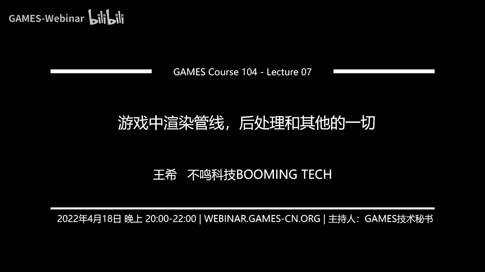

# 🎮 课程07：游戏中的渲染管线、后处理与其他一切 | GAMES104-现代游戏引擎：从入门到实践

在本节课中，我们将学习游戏渲染的收尾部分。我们将探讨环境光遮蔽、雾效、抗锯齿等重要的视觉增强技术，并深入了解现代游戏引擎的渲染管线架构。这些技术共同作用，将基础的几何与光照场景，转化为具有电影感、沉浸感的最终画面。

---

## 🌫️ 环境光遮蔽

上一节我们介绍了天空、大气与云的渲染，构建了宏观的光照环境。本节中，我们来看看一个影响微观立体感的重要技术：环境光遮蔽。

环境光遮蔽用于模拟物体表面因周围几何结构遮挡环境光而产生的柔和阴影。这种效果能极大地增强场景的深度感和真实感。

### 预计算AO

最初，AO通过离线烘焙实现。艺术家在建模软件中为模型（如角色）生成一张AO贴图。这张图记录了模型自身几何细节（如皱纹、褶皱）造成的遮挡关系。

**核心思想**：用空间（存储烘焙好的贴图）换取实时渲染的时间。

### 实时屏幕空间AO

对于动态场景，物体间的相互遮挡关系无法预烘焙。于是，屏幕空间环境光遮蔽技术应运而生。

**核心思想**：利用当前帧的深度缓冲区信息，在屏幕空间估算每个像素点的遮挡情况。

以下是SSAO的基本计算步骤：

1.  **采样**：对于屏幕上的每个像素，以其对应的三维空间点为中心，在法线方向的半球体内随机生成若干采样点。
2.  **可见性测试**：将这些采样点投影回屏幕空间，获取其在深度缓冲区中的深度值。
3.  **比较与计算**：如果采样点的深度值比当前像素的深度值更远（即被其他几何体遮挡），则计入遮挡。最终，可见的采样点比例决定了该点的AO强度。

一个简化的计算公式如下：
`AO = 1.0 - (遮挡采样点数 / 总采样点数)`

早期的SSAO算法存在一些问题，例如未考虑法线方向，导致平面也会产生AO。后续的改进算法，如HBAO和GTAO，引入了更精确的半球面采样、距离衰减以及基于法线的权重，得到了更接近真实物理（Ground Truth）的结果。

**GTAO的贡献**：它不仅计算了单次散射的遮挡，还通过一个拟合的多项式，根据AO值近似估算了光线在遮挡区域多次反弹后的结果，使得AO效果带有周围环境的色彩倾向，更加真实。

---

## 🌁 雾效

接下来，我们学习如何为场景添加大气层次感——雾效。

### 基础雾效：深度雾与高度雾

最简单的雾效基于像素到相机的距离（深度）进行计算。

*   **线性雾**：雾的浓度随距离线性增加。
*   **指数雾**：雾的浓度随距离呈指数增长，效果更自然。

**高度雾**则模拟了雾沉积在特定高度以下的现象（如山谷中的晨雾）。其计算需要沿视线进行积分，以考虑从观察点到目标点之间雾浓度的变化。

### 体积雾

现代游戏追求具有体积感的雾效，例如上帝光柱。这需要将整个视锥体空间进行体素化，并在每个体素中计算光的散射与吸收。

**核心思想**：与上一课计算大气散射的原理类似，通过步进积分模拟光在参与性介质中的传播。

在工程实现中，通常会创建一个3D纹理来存储中间计算结果。这个纹理的分辨率设计很有讲究，其XY轴分辨率常与屏幕长宽比保持一致，以确保在屏幕空间采样的一致性。

---

## 🔍 抗锯齿

由于屏幕像素有限，对连续的高频信号（如几何边缘、高光）进行采样时，会产生锯齿状的走样现象。抗锯齿技术旨在平滑这些边缘。

### 超采样抗锯齿

最直接的方法是提高采样率。

*   **SSAA**：以更高分辨率渲染整个场景，然后下采样到目标分辨率。效果最好，但性能开销巨大。
*   **MSAA**：主要在几何边缘进行多重采样。硬件广泛支持，在三角形密度不高时效率很好。但在现代高密度几何场景中可能失效。

### 后处理抗锯齿

这类算法对渲染完成的图像进行处理，不增加几何渲染开销。

**FXAA**：一种快速的近似抗锯齿算法。
1.  **边缘检测**：将图像转换到亮度空间，通过检测相邻像素的亮度差来识别边缘。
2.  **方向判断**：判断边缘是水平方向还是垂直方向。
3.  **边缘端点查找**：沿边缘垂直方向寻找颜色一致的端点。
4.  **混合**：根据像素在边缘上的位置，对颜色进行混合。它利用了纹理采样的双线性插值特性，通过微调采样坐标来实现混合。

**TAA**：时域抗锯齿，利用前一帧的信息。
1.  **运动向量**：渲染时生成每个像素的运动向量，记录其从上一帧到当前帧的位置变化。
2.  **历史帧混合**：根据运动向量，找到当前像素在上一帧中的对应颜色，并与当前帧颜色进行加权混合。
3.  **优势**：能有效平滑高频闪烁。但可能产生重影，需要通过颜色差异、运动幅度等条件来抑制。

---

## 🎨 后处理

后处理是渲染管线的最后一步，相当于画面的“美颜滤镜”，对最终视觉风格至关重要。

### Bloom（泛光）

模拟强光光源周围的光晕效果，增强视觉冲击力。

**实现步骤**：
1.  **提取高光**：根据亮度阈值，从渲染图像中提取出高亮区域。
2.  **多次高斯模糊**：对高亮区域进行高斯模糊。为了高效获得大范围模糊，常采用金字塔方法：先对图像进行下采样，在低分辨率层进行模糊，再上采样并与上一层混合，重复此过程。
3.  **叠加**：将模糊后的光晕图像叠加到原始图像上。

### Tone Mapping（色调映射）

将渲染器输出的高动态范围亮度值，映射到显示设备所能显示的低动态范围。

**核心问题**：真实世界亮度范围极大，而屏幕显示范围有限。直接截断会导致亮部过曝、暗部死黑。

**解决方案**：使用一条映射曲线。行业常用的曲线包括：
*   **Filmic曲线**：旨在让游戏画面具有电影感。
*   **ACES曲线**：由电影艺术与科学学院推出，已成为新的行业标准，能更好地适配不同显示设备。

### Color Grading（颜色分级）

通过一个查找表，对画面的整体色调、对比度、饱和度等进行艺术化调整。

**LUT**：本质上是一个3D纹理，定义了从输入颜色到输出颜色的映射关系。艺术家可以在专业软件中调试出想要的风格，导出为LUT文件，游戏运行时直接应用，实现高效的风格化渲染。

---

## ⚙️ 渲染管线

最后，我们来探讨如何将上述所有技术有序地组织起来，这就是渲染管线。

### 前向渲染
最基本的管线。遍历每个光源，对每个受该光源影响的物体进行着色计算。透明物体需要在不透明物体之后，并按从远到近的顺序绘制。

### 延迟渲染
现代主流管线之一。
1.  **几何通道**：将所有物体的几何信息（位置、法线、材质属性等）渲染到一组缓冲区中。
2.  **光照通道**：利用G-Buffer中的信息，在屏幕空间进行光照计算。
**优点**：能高效处理大量光源，光照计算复杂度与光源数量和解像度相关，与场景复杂度无关。

### 基于Tile/Cluster的渲染
为了进一步优化，将屏幕或视锥体空间划分为许多小块。
*   **Tile-Based**：将屏幕分块，为每个Tile计算一个受哪些光源影响的列表，仅对这些光源进行计算。
*   **Cluster-Based**：将视锥体在深度方向也进行划分，形成3D的簇，光照剔除更加精确。

### 可见性缓冲区
一个新兴的前沿方向。它不在G-Buffer中存储材质属性，而是存储几何ID和重心坐标。在着色阶段，通过索引直接获取原始的顶点和材质数据。
**优势**：特别适合几何极度复杂的场景，避免了传统G-Buffer的带宽和存储开销，并与Mesh Shader等新硬件特性结合更好。

### 渲染图
管理复杂渲染管线的架构。它将渲染过程中的每个步骤（如阴影计算、AO、后处理）抽象为节点，节点之间的数据依赖构成一个有向无环图。
**价值**：系统可以自动管理资源生命周期、优化内存复用、理清执行顺序，极大降低了复杂渲染管线开发和维护的难度。

---

## 📺 最终呈现：垂直同步

渲染完成的图像需要提交到屏幕。为了避免画面撕裂，通常需要开启垂直同步，等待显示器的刷新信号再进行帧缓冲区的交换。可变刷新率技术则让显示器的刷新率与游戏的帧率动态同步，以提供更流畅的体验。

---

本节课中我们一起学习了构成游戏最终画面的多项关键技术：从增强立体感的AO，到营造氛围的雾效，再到消除瑕疵的抗锯齿，以及赋予画面风格的后处理滤镜。最后，我们梳理了如何通过不同的渲染管线将这些技术高效、有序地组织起来。理解这些内容，就掌握了现代游戏渲染从基础到屏幕的完整知识链条。