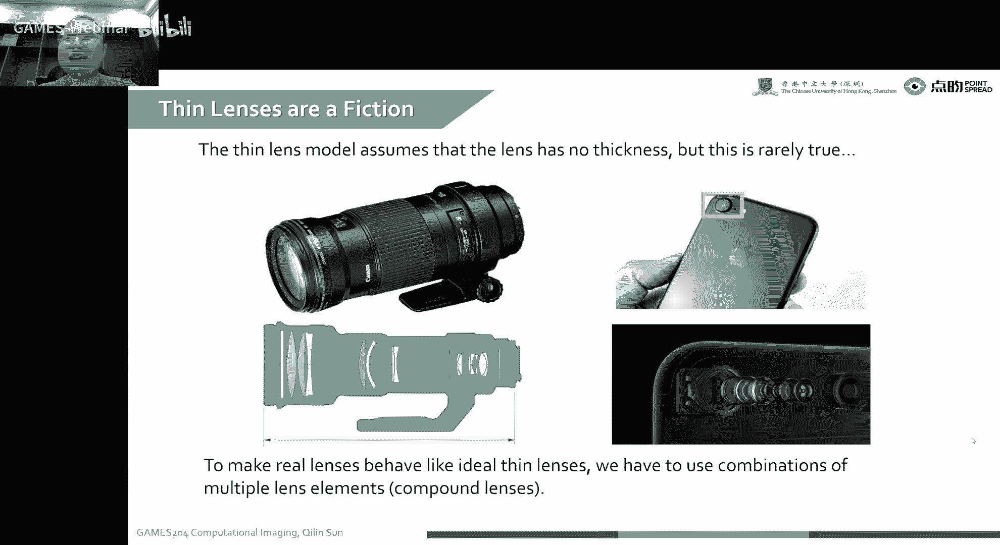
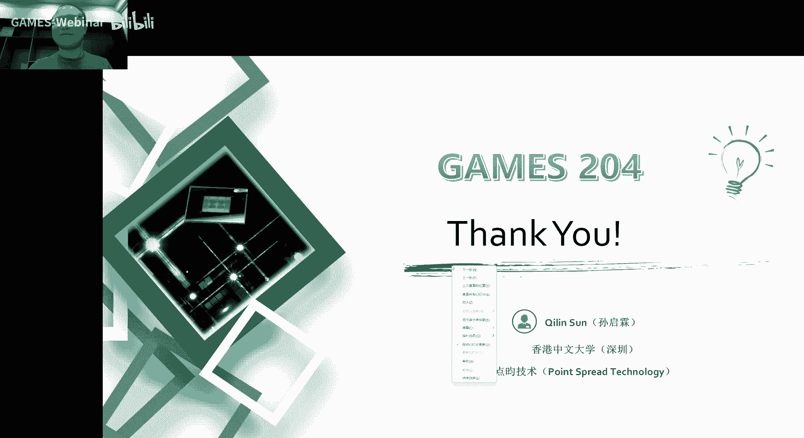

# 08. 成像工具箱：透镜与像差 ｜ GAMES204-计算成像 - P1 - GAMES-Webinar - BV1md4y1G71q

## 概述

在本节课中，我们将学习成像工具箱中的透镜与像差。我们将探讨透镜的成像原理、像差类型及其对图像质量的影响，并介绍一些校正像差的方法。

## 透镜成像原理

### 薄透镜模型

透镜成像可以通过薄透镜模型来简化计算。薄透镜模型假设透镜非常薄，光线在透镜内部传播时可以近似为直线。

**公式**：

$$
\frac{1}{s} + \frac{1}{p} = \frac{1}{f}
$$

其中，$s$ 是物距，$p$ 是像距，$f$ 是焦距。

### 近轴近似

在近轴近似下，光线与光轴的夹角非常小，可以忽略不计。这使得光线传播路径的计算更加简单。

### 折射定律

折射定律描述了光线从一种介质进入另一种介质时，入射角和折射角之间的关系。

**公式**：

$$
n_1 \sin \theta_1 = n_2 \sin \theta_2
$$

其中，$n_1$ 和 $n_2$ 分别是两种介质的折射率，$\theta_1$ 和 $\theta_2$ 分别是入射角和折射角。

## 像差

像差是指透镜成像过程中产生的误差，导致图像质量下降。

### 球差

球差是由于透镜表面曲率不完美导致的像差。球差会导致图像边缘模糊。

### 色差

色差是由于不同波长的光线在透镜中折射率不同导致的像差。色差会导致图像出现彩色边缘。

### 会差

会差是由于透镜对不同方向的光线聚焦位置不同导致的像差。会差会导致图像出现彗星状或星芒状图案。

### 畸变

畸变是指图像形状发生变形，例如桶形畸变或枕形畸变。

## 像差校正

### 非球面透镜

非球面透镜可以校正球差和色差。

### 复合透镜

复合透镜可以校正多种像差。

### 算法校正

算法校正可以通过图像处理算法来校正像差。

## 总结

在本节课中，我们学习了透镜成像原理、像差类型及其对图像质量的影响，并介绍了一些校正像差的方法。了解像差及其校正方法对于提高图像质量至关重要。